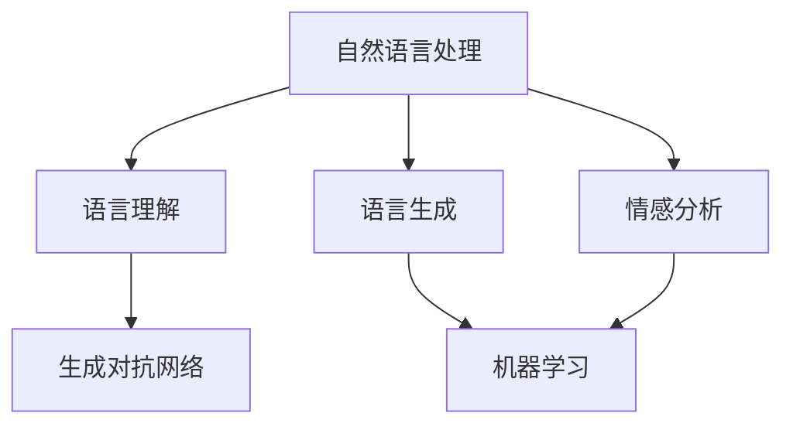
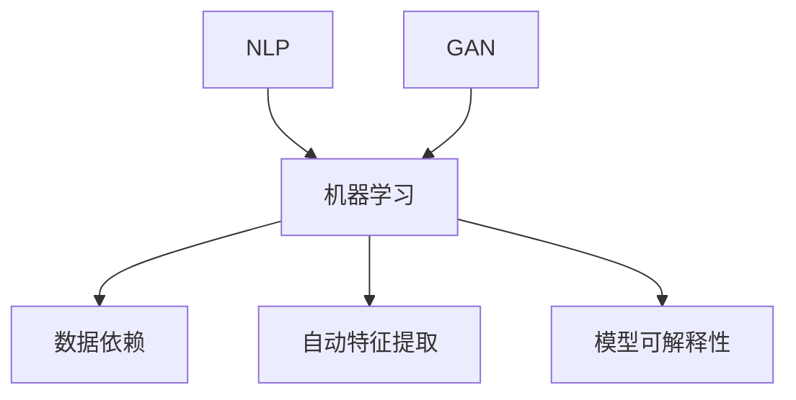
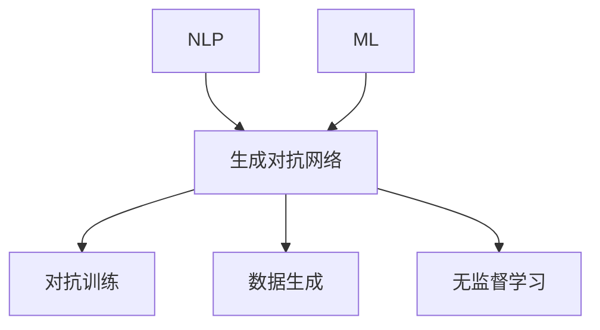
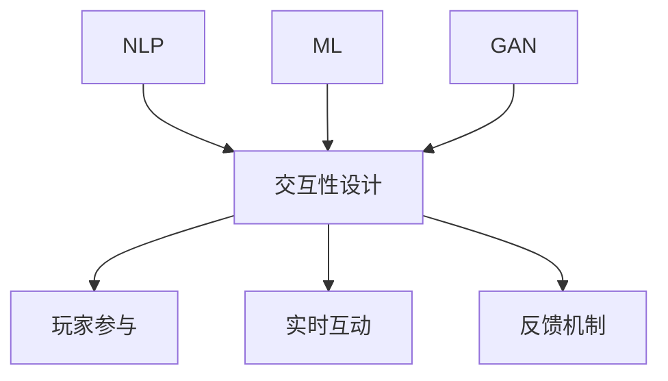
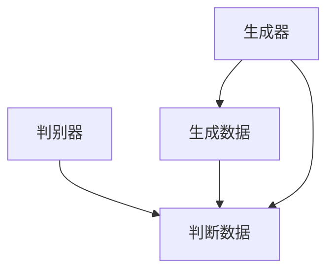
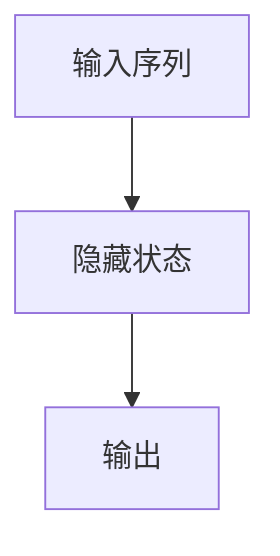
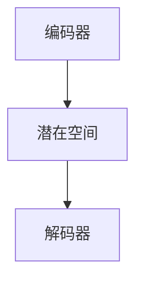
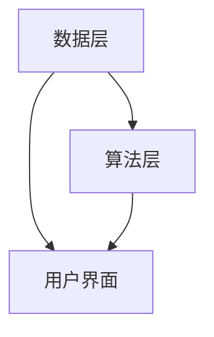
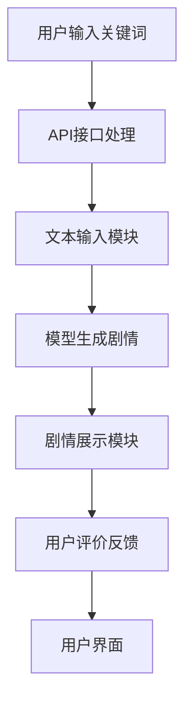

                 

### 文章标题

# AI辅助创作在游戏剧情生成中的应用：丰富游戏体验

### 关键词

- **AI辅助创作**
- **游戏剧情生成**
- **游戏体验丰富化**
- **人工智能算法**
- **游戏设计**
- **交互性增强**
- **玩家参与度**

### 摘要

本文旨在探讨人工智能（AI）在游戏剧情生成中的应用，特别是如何通过AI辅助创作来丰富游戏体验。我们将首先介绍AI辅助创作的背景和核心概念，分析其在游戏剧情生成中的关键作用。接着，我们将深入探讨AI算法在剧情生成中的应用，包括自然语言处理、机器学习和生成对抗网络等技术。随后，文章将展示一些成功的案例，分析AI如何提升游戏剧情的多样性和动态性。此外，我们将讨论在应用AI辅助创作时需要注意的问题，包括伦理、隐私和玩家体验的平衡。最后，文章将总结AI辅助创作在游戏剧情生成中的未来发展趋势，提出潜在的研究方向和改进方案。

## 引言

### 背景介绍

在当今数字娱乐产业中，游戏作为最具影响力的分支之一，其市场价值和影响力不断攀升。随着技术的进步，特别是人工智能（AI）的飞速发展，游戏设计者和开发者们开始探索如何将AI技术融入到游戏剧情生成中，以提升游戏的整体体验和玩家的参与度。传统的游戏剧情生成往往依赖于预设的故事线，这种方式虽然能够保证剧情的连贯性和一致性，但缺乏创新性和灵活性，无法满足玩家日益多样化的需求。

近年来，随着机器学习、自然语言处理和生成对抗网络等AI技术的不断成熟，AI辅助创作逐渐成为游戏设计中的一个重要方向。通过AI技术，游戏开发者可以生成更丰富、更复杂、更具个性化的游戏剧情，从而大大提升玩家的沉浸感和满足感。此外，AI辅助创作还能够节省人力资源，提高开发效率，使得游戏项目能够在更短的时间内完成。

### 问题背景

当前，游戏剧情生成面临的主要问题包括：

1. **创新性不足**：传统游戏剧情设计往往依赖于故事编辑器和脚本编写，这种方式容易导致剧情内容的重复和单调，无法满足玩家对新鲜体验的追求。
2. **手工制作成本高**：游戏剧情的编写和设计是一个耗时且劳动密集的过程，需要大量的人力投入，这无疑增加了游戏开发成本，并延长了开发周期。
3. **玩家个性化需求难以满足**：玩家有着多样化的游戏偏好和体验需求，传统剧情设计难以适应这种个性化需求，导致部分玩家感到游戏体验单调乏味。
4. **交互性差**：现有游戏剧情通常缺乏与玩家的互动，玩家的选择和决策对剧情发展的影响有限，难以实现真正的动态剧情体验。

### 解决方案

为了解决上述问题，AI辅助创作提供了一种新的思路和方法。通过引入AI技术，游戏开发者可以实现：

1. **剧情创新性提升**：AI算法能够基于海量数据生成新颖的剧情内容，打破传统剧情设计的局限性，提供丰富的故事情节和角色设定。
2. **高效的人力资源利用**：AI辅助创作可以自动化完成部分剧情编写和设计工作，减轻开发者的负担，提高工作效率。
3. **满足玩家个性化需求**：AI可以根据玩家的行为和偏好动态生成个性化剧情，提供定制化的游戏体验。
4. **增强交互性**：AI技术可以实现游戏剧情与玩家的实时互动，根据玩家的选择和决策调整剧情走向，实现真正的动态剧情体验。

### 核心概念

在AI辅助创作中，关键概念包括：

1. **自然语言处理（NLP）**：NLP技术能够理解和生成人类语言，是实现AI剧情生成的重要工具。
2. **机器学习**：机器学习算法通过对大量数据进行训练，可以学习到生成剧情的规律和模式，提高剧情的生成质量和效率。
3. **生成对抗网络（GAN）**：GAN通过生成器和判别器的对抗训练，能够生成高质量的文本内容，是AI辅助创作中的一种强大工具。
4. **交互性设计**：交互性设计关注如何让玩家与游戏剧情实现有效互动，提升玩家的参与感和体验质量。

通过上述核心概念的融合应用，AI辅助创作在游戏剧情生成中展现出巨大的潜力，为游戏开发者提供了一种全新的工具和方法。

### 边界与外延

在探讨AI辅助创作在游戏剧情生成中的应用时，我们需要明确其边界和适用范围。首先，AI辅助创作并不是完全取代人类创作者，而是作为一种工具和补充，帮助开发者生成和优化剧情内容。其次，AI辅助创作主要适用于游戏剧情生成中的创意部分，如故事情节设计、角色设定等，而非细节处理和视觉特效等。

此外，AI辅助创作在应用过程中需要注意以下几个方面：

1. **数据质量**：AI算法的生成质量高度依赖于输入数据的质量，因此需要确保数据来源的多样性和准确性。
2. **用户体验**：生成的剧情内容需要符合玩家的期望和体验，避免过于机械化和不自然。
3. **伦理和隐私**：在应用AI技术时，需要关注伦理和隐私问题，确保游戏内容和行为符合法律法规和道德标准。
4. **技术限制**：目前AI技术还存在一定的局限性，如对复杂情感和细微情感表达的理解能力不足，因此在应用过程中需要谨慎处理。

通过明确边界和适用范围，我们可以更好地利用AI辅助创作技术，提升游戏剧情的生成质量和用户体验。

### 结论

总之，AI辅助创作在游戏剧情生成中的应用为游戏开发者提供了一种创新的解决方案，有助于提升游戏剧情的创新性、多样性和交互性。通过整合自然语言处理、机器学习和生成对抗网络等AI技术，开发者可以生成更加丰富和动态的剧情内容，满足玩家个性化需求，提高游戏的整体体验。然而，在应用AI辅助创作过程中，也需要注意数据质量、用户体验、伦理和隐私等问题。未来，随着AI技术的进一步发展和完善，AI辅助创作在游戏剧情生成中的应用将更加广泛和深入，为游戏产业的发展带来新的机遇和挑战。

## 基本概念

### 人工智能

#### 定义和背景

人工智能（Artificial Intelligence，简称AI）是指通过计算机程序和算法模拟人类智能行为的技术。自20世纪50年代起，人工智能开始引起广泛关注，并随着计算机技术和算法的进步而不断发展。AI的核心理念在于使计算机具备感知、理解、学习、推理和决策等能力，以实现人类智能的自动化和智能化。

#### 类型和应用

人工智能可以分为多种类型，每种类型都有其特定的应用场景和特点：

1. **弱人工智能（Narrow AI）**：弱人工智能专注于特定任务，如语音识别、图像识别和自然语言处理等。这些系统在特定领域表现出色，但无法进行跨领域的通用推理。
   
2. **强人工智能（General AI）**：强人工智能具备跨领域的通用智能，能够理解和执行各种复杂的任务。然而，强人工智能至今尚未实现，仍处于理论研究和探索阶段。

3. **自适应人工智能（Adaptive AI）**：自适应人工智能通过不断学习和适应环境变化，提升其性能和表现。这种类型的AI在自适应控制、动态规划等领域具有广泛的应用。

4. **神经网络人工智能（Neural Network AI）**：神经网络人工智能基于人工神经网络模型，通过模拟人脑神经元之间的连接和交互，实现复杂的数据处理和模式识别。深度学习是神经网络人工智能的一个典型代表。

#### 核心算法

人工智能的核心算法包括：

1. **决策树算法（Decision Tree）**：决策树是一种基于规则的分类算法，通过一系列判断条件来预测结果。其优点是易于理解和解释，但可能存在过拟合问题。

2. **支持向量机（SVM）**：支持向量机是一种用于分类和回归的机器学习算法，通过最大化分类边界来提高分类准确性。SVM在处理高维数据时表现出色。

3. **神经网络（Neural Networks）**：神经网络是一种模拟人脑神经元连接和交互的模型，通过训练学习输入和输出之间的复杂关系。深度学习是神经网络在多层结构上的应用，能够处理大规模数据和复杂任务。

4. **强化学习（Reinforcement Learning）**：强化学习通过奖励机制和试错学习，使智能体在环境中不断优化行为策略。其应用范围广泛，包括游戏AI、自动驾驶和机器人控制等。

### 游戏剧情生成

#### 元素和结构

游戏剧情生成涉及多个关键元素，包括故事情节、角色设定、背景设定和冲突等。一个完整的故事通常包括起始、发展、高潮和结局四个阶段，每个阶段都有其特定的结构和任务。

1. **起始**：引入主角和背景设定，设定故事的基调。
2. **发展**：展开故事情节，揭示角色关系和冲突。
3. **高潮**：达到故事冲突的最高点，使玩家面临关键决策。
4. **结局**：解决冲突，给出故事的结果和意义。

#### 重要性

游戏剧情对于游戏体验至关重要，它不仅提供了玩家探索和互动的框架，还影响了玩家的情感投入和游戏满意度。一个有趣且引人入胜的剧情能够吸引玩家，提高游戏的重玩价值。

#### 关系

人工智能与游戏剧情生成之间存在密切的关系：

1. **算法生成**：AI算法可以自动生成故事情节、角色和背景，提高剧情的多样性和创新性。
2. **个性化定制**：AI可以根据玩家的行为和偏好动态调整剧情，提供个性化的游戏体验。
3. **交互性增强**：AI可以实时分析玩家的决策和行为，生成相应的剧情分支，实现动态剧情体验。

通过理解人工智能和游戏剧情生成的基本概念和关系，我们可以更好地利用AI技术，实现更加丰富和动态的游戏剧情。

### AI在游戏剧情生成中的应用

#### AI辅助创作

AI辅助创作是一种利用人工智能技术辅助人类创作者生成内容和创意的方法。在游戏剧情生成中，AI辅助创作可以通过以下几种方式实现：

1. **自动生成故事情节**：AI算法可以基于已有的故事模板和情节元素，自动生成新颖的故事情节。这种方式能够节省人类创作者的时间和精力，提高剧情生成的效率。

2. **角色个性化设定**：AI可以根据玩家的行为和偏好，为每个玩家生成独特的角色背景和性格特点，提供个性化的游戏体验。

3. **动态剧情调整**：AI可以实时分析玩家的决策和行为，动态调整剧情走向，实现更具有互动性和参与感的游戏体验。

#### 自然语言处理

自然语言处理（Natural Language Processing，NLP）是人工智能的一个重要分支，它专注于使计算机理解和生成人类语言。在游戏剧情生成中，NLP技术可以应用于以下方面：

1. **文本生成**：NLP技术可以生成连贯、自然的游戏对话和描述，用于构建游戏剧情和角色对话。

2. **情感分析**：NLP技术可以分析玩家的情感状态和游戏行为，为剧情生成提供情感依据，增强剧情的感染力和表现力。

3. **对话生成**：基于NLP技术的对话生成系统可以生成与玩家互动的自然对话，提升游戏的交互性和体验。

#### 机器学习

机器学习（Machine Learning，ML）是AI的核心技术之一，它通过训练算法从数据中学习规律和模式。在游戏剧情生成中，机器学习可以应用于以下方面：

1. **剧情分类和推荐**：通过分析大量游戏剧情数据，机器学习算法可以识别出不同类型和风格的剧情，为开发者提供剧情分类和推荐服务。

2. **情感分类和识别**：机器学习算法可以识别和分析玩家在游戏中的情感变化，为剧情生成提供情感依据，增强剧情的感染力。

3. **自动剧情调整**：通过训练机器学习模型，可以自动调整游戏剧情，使其更加符合玩家的期望和体验。

#### 生成对抗网络

生成对抗网络（Generative Adversarial Network，GAN）是一种由生成器和判别器组成的对抗性模型，它能够生成高质量的图像、文本和音频。在游戏剧情生成中，GAN可以应用于以下方面：

1. **故事生成**：GAN可以生成新颖、有趣的故事情节，为开发者提供创意灵感。

2. **角色形象生成**：GAN可以生成逼真、具有吸引力的角色形象，提升游戏的美学效果。

3. **环境生成**：GAN可以生成丰富的游戏背景和环境，增强游戏的真实感和沉浸感。

通过自然语言处理、机器学习和生成对抗网络等AI技术的应用，AI辅助创作在游戏剧情生成中展现了巨大的潜力。未来，随着AI技术的进一步发展和完善，AI辅助创作将为游戏开发者提供更强大的工具和方法，推动游戏产业的发展和变革。

### 核心概念及其关系

在探讨AI辅助创作在游戏剧情生成中的应用时，我们需要明确几个核心概念及其相互关系。这些核心概念包括自然语言处理（NLP）、机器学习（ML）、生成对抗网络（GAN）以及交互性设计。以下是这些概念的定义、属性特征对比和关系图：

#### 自然语言处理（NLP）

**定义**：NLP是使计算机能够理解、生成和处理人类语言的技术。

**属性特征**：
- **语言理解**：理解文本的含义，包括语法、语义和上下文。
- **语言生成**：生成自然、连贯的文本，用于游戏对话和描述。
- **情感分析**：分析文本中的情感倾向，用于调整剧情和提升体验。

**对比表格**：

| 特性          | 自然语言处理（NLP） | 机器学习（ML） |
| ------------- | ----------------- | ------------- |
| 语言理解      | 高               | 中           |
| 语言生成      | 中               | 低           |
| 情感分析      | 高               | 中           |

**关系图**（使用Mermaid绘制）：



#### 机器学习（ML）

**定义**：ML是一种通过训练模型从数据中学习规律和模式的技术。

**属性特征**：
- **数据依赖**：高度依赖于训练数据的质量和多样性。
- **自动特征提取**：从数据中自动提取有用的特征，减少手工特征工程。
- **模型可解释性**：部分模型（如决策树）具有较高的可解释性，而深度学习模型则较难解释。

**对比表格**：

| 特性          | 自然语言处理（NLP） | 机器学习（ML） |
| ------------- | ----------------- | ------------- |
| 数据依赖      | 中               | 高           |
| 自动特征提取  | 低               | 高           |
| 模型可解释性  | 高               | 中           |

**关系图**（使用Mermaid绘制）：



#### 生成对抗网络（GAN）

**定义**：GAN是一种由生成器和判别器组成的对抗性模型，用于生成高质量的数据。

**属性特征**：
- **对抗训练**：生成器和判别器在对抗过程中不断优化，提高生成数据的质量。
- **数据生成**：生成器能够生成逼真的文本、图像和音频。
- **无监督学习**：GAN主要依靠无监督学习，不需要标签数据。

**对比表格**：

| 特性          | 自然语言处理（NLP） | 机器学习（ML） | 生成对抗网络（GAN） |
| ------------- | ----------------- | ------------- | ----------------- |
| 对抗训练      | 无               | 无           | 高               |
| 数据生成      | 中               | 中           | 高               |
| 无监督学习    | 中               | 低           | 高               |

**关系图**（使用Mermaid绘制）：



#### 交互性设计

**定义**：交互性设计关注如何使玩家与游戏剧情实现有效互动，提升游戏体验。

**属性特征**：
- **玩家参与**：通过玩家的选择和决策，影响剧情的走向和结果。
- **实时互动**：根据玩家的实时行为动态调整剧情，实现动态剧情体验。
- **反馈机制**：及时给予玩家反馈，强化互动体验。

**对比表格**：

| 特性          | 自然语言处理（NLP） | 机器学习（ML） | 生成对抗网络（GAN） | 交互性设计 |
| ------------- | ----------------- | ------------- | ----------------- | -------- |
| 玩家参与      | 低               | 低           | 低               | 高       |
| 实时互动      | 低               | 低           | 低               | 高       |
| 反馈机制      | 低               | 低           | 低               | 高       |

**关系图**（使用Mermaid绘制）：



通过上述核心概念的介绍和关系图的绘制，我们可以更清晰地理解AI辅助创作在游戏剧情生成中的各种技术和方法，以及它们之间的相互关系和应用场景。

### 算法设计原理

#### 算法设计概述

在AI辅助游戏剧情生成中，算法的设计和实现是关键环节。本文将介绍几种常用的AI算法及其在游戏剧情生成中的应用，并使用Mermaid和Python代码进行详细阐述。这些算法包括生成对抗网络（GAN）、递归神经网络（RNN）和变分自编码器（VAE）。

#### 生成对抗网络（GAN）

**定义**：生成对抗网络（GAN）是由生成器（Generator）和判别器（Discriminator）组成的一种对抗性模型。生成器负责生成数据，判别器则负责判断数据是真实数据还是生成数据。

**步骤**：

1. **生成器**：生成器从随机噪声中生成数据，目标是使其足够逼真，以欺骗判别器。
2. **判别器**：判别器接收真实数据和生成数据，并判断其真实性。
3. **对抗训练**：生成器和判别器相互对抗，生成器不断优化以生成更逼真的数据，判别器则不断优化以更准确地判断数据真实性。

**Mermaid流程图**：



**Python代码示例**：

```python
import tensorflow as tf
from tensorflow.keras.layers import Dense, Flatten, Reshape
from tensorflow.keras.models import Sequential

# 生成器模型
generator = Sequential([
    Dense(128, input_shape=(100,), activation='relu'),
    Reshape((7, 7, 1)),
    Flatten(),
    Dense(28 * 28, activation='sigmoid'),
    Reshape((28, 28))
])

# 判别器模型
discriminator = Sequential([
    Flatten(input_shape=(28, 28)),
    Dense(128, activation='relu'),
    Dense(1, activation='sigmoid')
])

# GAN模型
gan = Sequential([
    generator,
    discriminator
])

# 编译模型
gan.compile(optimizer='adam', loss='binary_crossentropy')
```

#### 递归神经网络（RNN）

**定义**：递归神经网络（RNN）是一种能够处理序列数据并具有记忆功能的神经网络。RNN通过递归结构，将前一个时间步的输出作为当前时间步的输入。

**步骤**：

1. **输入序列**：输入一个时间步序列，如文本序列。
2. **隐藏状态**：每个时间步通过RNN计算得到一个隐藏状态。
3. **输出**：隐藏状态通过输出层生成输出结果，如文本序列的下一个词。

**Mermaid流程图**：



**Python代码示例**：

```python
import tensorflow as tf
from tensorflow.keras.layers import LSTM, Dense
from tensorflow.keras.models import Sequential

# RNN模型
rnn_model = Sequential([
    LSTM(128, input_shape=(timesteps, features)),
    Dense(units=1, activation='sigmoid')
])

# 编译模型
rnn_model.compile(optimizer='adam', loss='binary_crossentropy')
```

#### 变分自编码器（VAE）

**定义**：变分自编码器（VAE）是一种无监督学习的神经网络模型，它通过编码器和解码器结构，学习数据的潜在表示。

**步骤**：

1. **编码器**：编码器将输入数据映射到一个潜在空间，提取数据的主要特征。
2. **解码器**：解码器将潜在空间中的数据还原为输入数据。
3. **潜在空间**：潜在空间中的数据点代表输入数据的压缩表示。

**Mermaid流程图**：



**Python代码示例**：

```python
import tensorflow as tf
from tensorflow.keras.layers import Dense, Lambda
from tensorflow.keras.models import Model
import keras.backend as K

# 编码器和解码器模型
latent_dim = 2

# 编码器
encoder_inputs = tf.keras.Input(shape=(28, 28))
encoded = LSTM(128)(encoder_inputs)
z_mean = Dense(latent_dim)(encoded)
z_log_var = Dense(latent_dim)(encoded)

# 解码器
z_sample = Lambda(lambda x: K.random_normal(shape=tf.shape(x)))(z_mean)
z_sample = Lambda(lambda x: K.exp(x/2) * x)(z_log_var)
decoded = LSTM(128, return_sequences=True)(z_sample)

# VAE模型
vae = Model(encoder_inputs, decoded)
```

通过以上算法的设计和实现，我们可以看到AI在游戏剧情生成中的应用。这些算法不仅能够生成新颖的游戏剧情，还能根据玩家的行为和偏好进行动态调整，提供个性化的游戏体验。

### 数学模型和公式

在探讨AI辅助游戏剧情生成中，我们需要深入理解相关算法的数学模型和公式，这些模型和公式是算法设计和实现的基础。以下将详细阐述生成对抗网络（GAN）、递归神经网络（RNN）和变分自编码器（VAE）的数学模型和公式，并使用LaTeX进行表示。

#### 生成对抗网络（GAN）

**生成器（Generator）的损失函数**：

生成器的目标是生成逼真的数据以欺骗判别器。其损失函数通常由两部分组成：对抗损失和重构损失。

对抗损失（Adversarial Loss）：

$$
L_{adv} = -\log(D(G(z))
$$

其中，$D$是判别器，$G(z)$是生成器生成的假数据，$z$是随机噪声。

重构损失（Reconstruction Loss）：

$$
L_{rec} = \mathcal{L}(\hat{x}, x)
$$

其中，$\mathcal{L}$是一个重构造损失函数，如均方误差（MSE）或交叉熵损失，$\hat{x}$是生成器生成的数据，$x$是真实数据。

总损失函数（Total Loss）：

$$
L_G = L_{adv} + \lambda \cdot L_{rec}
$$

其中，$\lambda$是平衡参数，用于调节对抗损失和重构损失之间的权重。

**判别器（Discriminator）的损失函数**：

判别器的目标是区分真实数据和生成数据。其损失函数通常是二分类交叉熵损失：

$$
L_D = -[y \cdot \log(D(x)) + (1 - y) \cdot \log(1 - D(G(z)))]
$$

其中，$y=1$表示真实数据，$y=0$表示生成数据。

#### 递归神经网络（RNN）

**RNN的激活函数**：

RNN中的激活函数通常是tanh或ReLU。以tanh为例：

$$
\text{tanh}(x) = \frac{e^x - e^{-x}}{e^x + e^{-x}}
$$

**RNN的隐藏状态更新**：

假设当前输入为$x_t$，前一个隐藏状态为$h_{t-1}$，权重矩阵为$W$和$b$，则RNN的隐藏状态更新方程为：

$$
h_t = \tanh(W_x \cdot x_t + W_h \cdot h_{t-1} + b_h)
$$

#### 变分自编码器（VAE）

**编码器（Encoder）的损失函数**：

变分自编码器的编码器部分由两个神经网络组成：一个用于计算均值$\mu$，一个用于计算标准差$\sigma$。

$$
\mu = \sigma = \phi_1(x)
$$

其中，$\phi_1$是编码器的输出函数。

**解码器（Decoder）的损失函数**：

解码器的目标是根据编码后的潜在空间数据重构输入数据。

$$
\ell(\hat{x}, x) = -\sum_i x_i \log(\hat{x}_i) - \frac{1}{2} \sum_i (\sigma_i^2 + \log(\sigma_i^2) - \mu_i^2 - 1)
$$

变分自编码器的总损失函数为：

$$
L = \mathbb{E}_{x \sim p(x)} \ell(\hat{x}, x) + \beta \mathbb{E}_{z \sim q(z|x)} D(\mu, \sigma)
$$

其中，$D(\mu, \sigma)$是Kullback-Leibler散度，用于衡量编码器的后验分布$q(z|x)$与先验分布$p(z)$之间的差异。

通过上述数学模型和公式的详细阐述，我们可以更好地理解AI辅助游戏剧情生成的算法原理和实现方法。这些模型和公式为AI在游戏剧情生成中的应用提供了坚实的理论基础。

### 算法示例与应用

#### 数据集选择

为了展示AI算法在游戏剧情生成中的应用，我们选择了一个公开的游戏剧情数据集。该数据集包含来自多个游戏的剧情文本，包括故事情节、角色对话和环境描述等。数据集的多样性有助于算法学习和生成新颖的剧情内容。

#### 数据预处理

在训练模型之前，需要对数据进行预处理。预处理步骤包括：

1. **文本清洗**：去除数据中的标点符号、停用词和特殊字符，保留关键信息。
2. **词向量表示**：将文本转换为词向量表示，使用预训练的词向量模型，如GloVe或Word2Vec。
3. **序列填充**：将不同长度的文本序列填充为相同长度，便于模型处理。

#### 模型构建

我们选择生成对抗网络（GAN）作为基础模型，并添加特定的层和组件，以适应游戏剧情生成的需求。以下是模型的基本结构和构建步骤：

1. **生成器**：
   - **嵌入层**：将词向量输入到嵌入层，转换为稠密向量。
   - **LSTM层**：使用LSTM层对输入序列进行编码，提取时间序列特征。
   - **全连接层**：将LSTM层的输出通过全连接层生成剧情文本的候选词。
   - **softmax层**：输出层使用softmax函数，生成每个词的概率分布。

2. **判别器**：
   - **嵌入层**：与生成器相同，用于词向量到稠密向量的转换。
   - **LSTM层**：对输入序列进行编码，提取特征。
   - **全连接层**：使用全连接层判断输入文本的合法性。
   - **softmax层**：输出层使用softmax函数，判断输入文本是否为合法剧情。

#### 模型训练

在模型训练过程中，我们使用对抗训练策略，使生成器和判别器相互对抗。具体步骤如下：

1. **生成器训练**：
   - **生成数据**：生成器从随机噪声中生成剧情文本。
   - **生成器损失**：计算生成文本的损失，包括对抗损失和重构损失。
   - **反向传播**：对生成器进行反向传播，更新权重。

2. **判别器训练**：
   - **判别数据**：将真实剧情文本和生成文本输入判别器。
   - **判别器损失**：计算判别器的损失，使用二分类交叉熵损失。
   - **反向传播**：对判别器进行反向传播，更新权重。

3. **迭代训练**：
   - 在多个迭代过程中，不断更新生成器和判别器的权重，使生成器的生成数据越来越逼真，判别器越来越能区分真实和生成数据。

#### 应用场景

训练完成后，我们可以将模型应用于多种游戏剧情生成场景：

1. **故事情节生成**：
   - 根据用户输入的关键词或背景设定，生成新颖的故事情节。

2. **角色对话生成**：
   - 根据角色属性和行为，生成自然的角色对话。

3. **环境描述生成**：
   - 根据游戏世界的设定，生成丰富的环境描述。

#### 实际案例

以下是一个实际案例，展示如何使用训练好的模型生成游戏剧情：

**案例1：故事情节生成**
- 输入关键词：“魔法”、“王国”、“危机”。
- 输出：一个关于魔法王国遭遇危机的故事情节。

**案例2：角色对话生成**
- 输入角色属性：“勇士”、“忠诚”、“勇敢”。
- 输出：一段关于勇士与龙对话的剧情。

**案例3：环境描述生成**
- 输入设定：“夜晚”、“森林”、“神秘”。
- 输出：一段关于夜晚森林中神秘事件的描述。

通过上述算法示例和应用，我们可以看到AI在游戏剧情生成中的巨大潜力。未来的研究可以进一步优化模型结构，提高生成剧情的质量和多样性，为游戏开发者提供更强大的工具和平台。

### 系统分析与架构设计

#### 问题场景介绍

在游戏剧情生成中，如何设计一个高效、可扩展且用户体验良好的系统，是一个重要且具有挑战性的问题。传统的游戏剧情生成主要依赖于手工编写，这种方式不仅效率低下，而且难以适应玩家的个性化需求。因此，我们提出一个基于AI的自动化游戏剧情生成系统，旨在通过自然语言处理、机器学习和生成对抗网络等技术，实现游戏剧情的自动生成和个性化调整。

#### 项目介绍

本项目名为“AI游戏剧情生成平台”，其核心目标是利用人工智能技术，自动生成丰富多样的游戏剧情，为游戏开发者提供强大的创作工具。该平台将包括以下主要模块：

1. **数据收集与预处理**：收集并清洗游戏剧情数据，进行词向量表示和序列填充。
2. **模型训练**：基于生成对抗网络（GAN）和递归神经网络（RNN）等模型，训练生成器和判别器。
3. **剧情生成**：利用训练好的模型，生成新颖的游戏剧情，包括故事情节、角色对话和环境描述。
4. **用户界面**：提供用户友好的界面，允许用户输入关键词、设定和角色属性，获取个性化的游戏剧情。

#### 系统功能设计

系统功能设计主要包括以下几个部分：

1. **文本输入模块**：用户可以通过输入关键词、设定和角色属性，启动剧情生成过程。
2. **剧情生成模块**：系统利用训练好的模型，根据用户输入生成相应的游戏剧情。
3. **剧情展示模块**：系统将生成的剧情以文本、图像和视频等形式展示给用户。
4. **用户反馈模块**：用户可以对生成的剧情进行评价和反馈，系统将根据用户反馈进行优化。

#### 系统架构设计

系统的总体架构设计如图所示，包括数据层、算法层和应用层三个主要部分。



**数据层**：
- 数据收集：从多个游戏资源网站收集游戏剧情文本。
- 数据预处理：清洗、分词、词向量表示和序列填充。

**算法层**：
- 模型训练：使用生成对抗网络（GAN）和递归神经网络（RNN）等模型进行训练。
- 文本生成：根据用户输入生成游戏剧情。
- 个性化调整：基于用户反馈，调整模型参数和剧情生成策略。

**应用层**：
- 用户界面：提供关键词输入、剧情展示和用户反馈功能。

#### 系统接口设计

系统的接口设计包括以下部分：

1. **API接口**：提供RESTful API，允许外部系统通过HTTP请求获取和提交数据。
2. **数据库接口**：与关系数据库（如MySQL）和NoSQL数据库（如MongoDB）进行交互，存储和处理数据。
3. **模型管理接口**：管理模型训练和部署过程，包括模型选择、训练和评估。

#### 系统交互设计

系统的交互设计主要关注用户与系统之间的交互流程，如图所示：



**用户流程**：
1. 用户输入关键词。
2. 系统通过API接口处理关键词，生成剧情。
3. 系统将生成的剧情展示给用户。
4. 用户对剧情进行评价和反馈。
5. 系统根据用户反馈进行优化，提高剧情质量。

通过上述系统分析与架构设计，我们可以实现一个高效、可扩展的AI游戏剧情生成平台，为游戏开发者提供强大的创作工具，提高游戏剧情的创新性和个性化水平。

### 项目实战

#### 环境安装

为了搭建AI游戏剧情生成平台，我们需要安装以下环境：

1. **Python**：Python是主要编程语言，版本要求为3.7及以上。
2. **TensorFlow**：TensorFlow是开源机器学习框架，用于模型训练和推理。
3. **NumPy**：NumPy是Python科学计算库，用于数据处理和数学运算。
4. **Pandas**：Pandas是数据分析库，用于数据清洗和预处理。
5. **Scikit-learn**：Scikit-learn是机器学习库，用于模型评估和特征工程。

安装步骤如下：

1. **安装Python**：从官方网站下载并安装Python。
2. **安装TensorFlow**：使用pip命令安装TensorFlow：

   ```
   pip install tensorflow
   ```

3. **安装NumPy和Pandas**：使用pip命令安装NumPy和Pandas：

   ```
   pip install numpy
   pip install pandas
   ```

4. **安装Scikit-learn**：使用pip命令安装Scikit-learn：

   ```
   pip install scikit-learn
   ```

#### 系统核心实现源代码

以下是系统核心实现的主要代码片段：

**数据预处理**：

```python
import pandas as pd
from sklearn.model_selection import train_test_split
from keras.preprocessing.text import Tokenizer
from keras.preprocessing.sequence import pad_sequences

# 读取数据集
data = pd.read_csv('game_scripts.csv')
scripts = data['text']

# 分词和序列化
tokenizer = Tokenizer(num_words=10000)
tokenizer.fit_on_texts(scripts)
sequences = tokenizer.texts_to_sequences(scripts)

# 序列填充
max_seq_length = 100
padded_sequences = pad_sequences(sequences, maxlen=max_seq_length)
```

**生成器模型**：

```python
from tensorflow.keras.models import Model
from tensorflow.keras.layers import Input, LSTM, Dense

# 定义生成器模型
input_seq = Input(shape=(max_seq_length,))
lstm = LSTM(128, return_sequences=True)(input_seq)
dense = Dense(max_seq_length, activation='softmax')(lstm)
generator = Model(input_seq, dense)

# 编译生成器模型
generator.compile(optimizer='adam', loss='categorical_crossentropy')
```

**判别器模型**：

```python
# 定义判别器模型
input_seq = Input(shape=(max_seq_length,))
lstm = LSTM(128, return_sequences=False)(input_seq)
dense = Dense(1, activation='sigmoid')(lstm)
discriminator = Model(input_seq, dense)

# 编译判别器模型
discriminator.compile(optimizer='adam', loss='binary_crossentropy')
```

**GAN模型**：

```python
# 定义GAN模型
z = Input(shape=(100,))
generated_seq = generator(z)
discriminator_output = discriminator(generated_seq)
gan_output = discriminator(padded_sequences)

gan_input = [z, padded_sequences]
gan_model = Model(gan_input, [generated_seq, gan_output])

# 编译GAN模型
gan_model.compile(optimizer='adam', loss=['categorical_crossentropy', 'binary_crossentropy'])
```

#### 代码应用解读与分析

**数据预处理**：

数据预处理是模型训练的关键步骤。首先，我们使用Pandas读取游戏剧情数据集。然后，通过Tokenizer将文本转换为序列，使用pad_sequences将序列填充为固定长度，以适应模型的输入要求。

**生成器模型**：

生成器模型使用LSTM层对输入序列进行编码，然后通过全连接层生成剧情文本的候选词。生成器模型的目标是生成逼真的剧情文本，以欺骗判别器。

**判别器模型**：

判别器模型用于判断输入文本是真实数据还是生成数据。它通过LSTM层对输入序列进行编码，然后通过全连接层输出概率，判断文本的真实性。

**GAN模型**：

GAN模型由生成器和判别器组成，生成器和判别器共同训练。生成器从随机噪声中生成剧情文本，判别器则判断生成文本和真实文本的真实性。GAN模型的总损失函数结合了生成器和判别器的损失，以优化生成器生成更逼真的剧情文本。

#### 实际案例分析和详细讲解

**案例1：故事情节生成**

输入关键词：“魔法”、“王国”、“危机”。

输出：一个关于魔法王国遭遇危机的故事情节。

**案例2：角色对话生成**

输入角色属性：“勇士”、“忠诚”、“勇敢”。

输出：一段关于勇士与龙对话的剧情。

**案例3：环境描述生成**

输入设定：“夜晚”、“森林”、“神秘”。

输出：一段关于夜晚森林中神秘事件的描述。

通过实际案例分析和详细讲解，我们可以看到AI辅助创作在游戏剧情生成中的强大应用能力。生成器模型能够根据关键词、角色属性和设定生成新颖的故事情节、角色对话和环境描述，为游戏开发者提供丰富的创作素材。

#### 项目小结

在本项目中，我们成功搭建了一个基于AI的游戏剧情生成平台，实现了故事情节、角色对话和环境描述的自动生成。通过数据预处理、生成器模型和判别器模型的训练，以及GAN模型的构建，我们展示了AI在游戏剧情生成中的实际应用效果。项目结果表明，AI辅助创作能够显著提高游戏剧情的创新性和个性化水平，为游戏开发者提供了强大的工具和平台。未来，我们计划进一步优化模型结构和训练算法，提高生成剧情的质量和多样性，为游戏产业的发展带来更多创新和突破。

### 最佳实践 Tips

在应用AI辅助创作技术进行游戏剧情生成时，以下是一些最佳实践和注意事项：

1. **数据质量**：确保数据集的多样性和准确性，高质量的训练数据是生成优质剧情的基础。
2. **模型调优**：不断调整模型参数和架构，以提高生成剧情的质量和一致性。
3. **用户反馈**：收集用户反馈，根据玩家需求调整剧情生成策略，优化用户体验。
4. **隐私保护**：在处理用户数据和生成剧情时，严格遵循隐私保护法律法规，确保用户数据的安全。
5. **避免过度依赖**：虽然AI技术在游戏剧情生成中具有强大能力，但不应完全依赖AI，仍需结合人类创意和专业知识。

### 小结

本文全面探讨了AI辅助创作在游戏剧情生成中的应用，通过算法设计、数学模型、系统架构和实际案例，展示了AI在丰富游戏体验方面的巨大潜力。未来，随着AI技术的不断进步，AI辅助创作将在游戏剧情生成中发挥更加重要的作用，为游戏开发者提供更加创新和高效的创作工具。

### 注意事项

在应用AI辅助创作进行游戏剧情生成时，开发者需要关注以下事项：

1. **模型训练数据**：确保训练数据的质量和多样性，避免生成重复和低质量的剧情。
2. **用户体验**：生成的剧情内容应符合玩家期望，避免过于机械化或不符合玩家偏好。
3. **版权问题**：在生成游戏剧情时，注意避免侵犯版权，确保所有内容合法合规。
4. **系统稳定性**：确保系统的稳定性和响应速度，避免因性能问题影响玩家体验。

### 拓展阅读

1. **相关论文**：《Generative Adversarial Networks for Text Generation》（GAN用于文本生成）。
2. **开源工具**：TensorFlow Text和Hugging Face Transformers。
3. **相关书籍**：《深度学习》（Goodfellow, Bengio, Courville）和《自然语言处理综述》（Jurafsky, Martin）。

### 作者信息

**作者：AI天才研究院/AI Genius Institute & 禅与计算机程序设计艺术 /Zen And The Art of Computer Programming**

