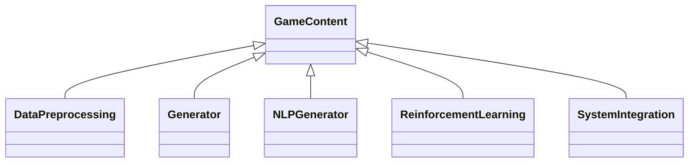
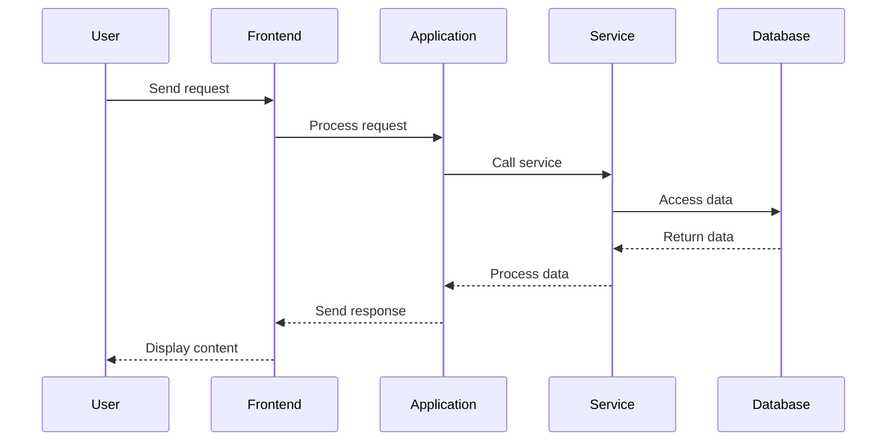
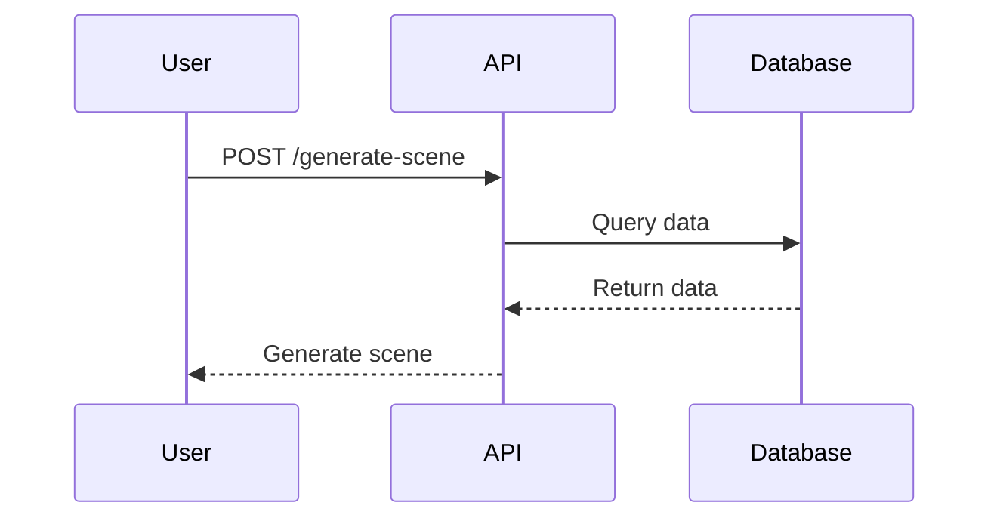
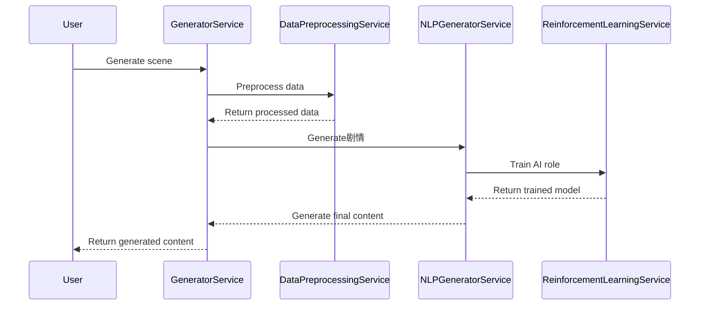

                 

### 第1章: 背景介绍

#### 1.1 问题背景

随着人工智能技术的快速发展，AI在各个行业中的应用越来越广泛。特别是在游戏设计领域，AI辅助创作已经成为提升游戏内容质量和游戏体验的重要手段。传统游戏开发中，设计人员需要耗费大量时间和精力来编写游戏剧情、创建角色和场景，而AI辅助创作技术则能够自动化这些繁琐的过程，从而提高开发效率和游戏质量。

AI辅助创作在游戏设计中的应用主要包括以下几个方面：

1. **生成动态游戏内容**：通过AI算法生成独特的游戏剧情、角色和场景，增加游戏的多样性和可玩性。
2. **优化游戏体验**：利用AI技术分析玩家行为，动态调整游戏难度、任务和奖励，为玩家提供个性化的游戏体验。
3. **提升游戏开发效率**：通过自动化工具和算法，减少人工编写代码和设计工作，缩短游戏开发周期。

然而，AI辅助创作在游戏设计中的应用还面临着诸多挑战，如算法稳定性、数据处理能力、用户体验等。本章将深入探讨这些问题，并从以下几个方面展开讨论：

1. **核心概念与联系**：介绍AI辅助创作中的关键概念，包括生成对抗网络（GAN）、强化学习、自然语言处理等，并分析它们之间的联系和区别。
2. **算法原理讲解**：详细讲解上述算法的工作原理，包括数学模型、公式和Python源代码实现。
3. **系统分析与架构设计方案**：分析游戏设计中的典型问题，提出系统架构设计方案，包括领域模型、系统架构、接口设计和系统交互。
4. **项目实战**：通过实际项目案例，展示如何运用AI技术辅助游戏设计，包括环境安装、系统核心实现源代码和代码应用解读。

#### 1.2 问题描述

在游戏设计中，AI辅助创作主要面临以下问题：

1. **算法稳定性**：由于AI算法的训练过程涉及大量的数据和参数，算法的稳定性和准确性直接影响到游戏内容的生成质量。
2. **数据处理能力**：游戏设计过程中需要处理大量的文本、图像和音频数据，对数据处理能力的要求较高。
3. **用户体验**：如何确保AI生成的游戏内容能够符合玩家的期望，提供良好的用户体验，是AI辅助创作面临的重要挑战。
4. **开发效率**：如何在保证游戏质量的前提下，提高开发效率，降低开发成本，是游戏设计师和开发团队需要考虑的关键问题。

为了解决上述问题，本书将从以下几个方面展开讨论：

1. **核心概念与联系**：介绍AI辅助创作中的关键概念，包括生成对抗网络（GAN）、强化学习、自然语言处理等，并分析它们之间的联系和区别。
2. **算法原理讲解**：详细讲解上述算法的工作原理，包括数学模型、公式和Python源代码实现。
3. **系统分析与架构设计方案**：分析游戏设计中的典型问题，提出系统架构设计方案，包括领域模型、系统架构、接口设计和系统交互。
4. **项目实战**：通过实际项目案例，展示如何运用AI技术辅助游戏设计，包括环境安装、系统核心实现源代码和代码应用解读。

#### 1.3 问题解决

为解决上述问题，本书将从以下几个方面展开讨论：

1. **核心概念与联系**：
   - **生成对抗网络（GAN）**：介绍GAN的原理、结构和应用，分析其在游戏设计中的优势。
   - **强化学习**：讲解强化学习的基本原理和应用，探讨其在游戏设计中的潜在价值。
   - **自然语言处理**：阐述自然语言处理的关键技术和应用，分析其在游戏剧情生成和角色对话设计中的作用。

2. **算法原理讲解**：
   - **生成对抗网络（GAN）**：详细讲解GAN的数学模型和算法流程，通过Python源代码实现展示GAN的工作原理。
   - **强化学习**：介绍强化学习的核心算法，如Q-learning和SARSA，通过实际案例展示算法的应用。
   - **自然语言处理**：讲解自然语言处理的基本技术，如词向量、序列模型和生成模型，分析其在游戏设计中的应用。

3. **系统分析与架构设计方案**：
   - **领域模型**：通过类图展示游戏设计中的关键领域和实体，明确系统功能需求。
   - **系统架构设计**：设计系统整体架构，包括前端界面、后端服务和数据处理模块。
   - **接口设计**：制定系统接口规范，确保不同模块之间的数据传输和功能调用。
   - **系统交互**：通过序列图描述系统组件之间的交互过程，分析系统整体性能和稳定性。

4. **项目实战**：
   - **环境安装**：介绍环境搭建过程，包括Python环境、AI库和游戏引擎的安装。
   - **系统核心实现**：展示系统核心代码，包括AI算法实现和游戏内容生成过程。
   - **代码应用解读**：分析代码实现细节，解释算法原理和应用，帮助读者理解系统工作流程。
   - **实际案例**：通过实际项目案例，展示AI辅助创作在游戏设计中的应用效果，分析项目的成功经验和挑战。

#### 1.4 边界与外延

AI辅助创作在游戏设计中的应用不仅仅是生成游戏内容，还可以应用于游戏剧情设计、角色性格建模、场景渲染等方面。同时，AI辅助创作在游戏设计中的应用也受到硬件性能、数据质量和开发团队技术水平的限制。

1. **硬件性能**：高性能计算服务器和GPU是AI算法训练和推理的重要支撑，硬件性能的提升对AI辅助创作的应用至关重要。
2. **数据质量**：高质量的游戏设计数据是AI算法训练的基础，数据的质量和完整性直接影响AI生成的游戏内容质量。
3. **开发团队技术水平**：开发团队需要具备一定的AI技术基础，能够理解和运用AI算法，确保AI辅助创作系统的顺利运行。

#### 1.5 概念结构与核心要素组成

AI辅助创作在游戏设计中的核心要素包括：

1. **算法**：包括生成对抗网络（GAN）、强化学习、自然语言处理等。
2. **数据**：包括游戏设计数据、用户行为数据、游戏素材数据等。
3. **硬件**：包括高性能计算服务器、GPU等。
4. **开发团队**：包括游戏设计师、程序员、数据科学家等。

通过上述核心要素的有机结合，AI辅助创作能够为游戏设计提供强大的支持，提升游戏内容质量和用户体验。然而，实现这一目标需要不断探索和创新，解决算法稳定性、数据处理能力、用户体验等关键问题。

### 第2章: 核心概念与联系

#### 2.1 生成对抗网络（GAN）

生成对抗网络（GAN）是由Ian Goodfellow等人在2014年提出的一种无监督学习模型，它由生成器和判别器两个相互对抗的神经网络组成。GAN的核心思想是通过生成器和判别器的对抗训练来生成高质量的数据。

**概念原理：**
- **生成器（Generator）**：生成器的目标是生成与真实数据分布相近的伪数据。它通过随机噪声输入，生成类似于真实数据的输出。
- **判别器（Discriminator）**：判别器的目标是区分输入数据是真实数据还是生成器生成的伪数据。它的目标是最大化正确判断真实数据和伪数据的概率。

**数学模型：**
GAN的数学模型可以表示为以下两个概率分布的对抗训练：

- 生成器 G：\( G(z) \)，其中 \( z \) 是从先验分布中抽取的随机噪声向量，\( G(z) \) 是生成的伪数据。
- 判别器 D：\( D(x) \)，其中 \( x \) 是真实数据。

训练目标是最大化判别器的损失函数 \( L_D \) 和最小化生成器的损失函数 \( L_G \)：

\[ L_G = -\log(D(G(z))) \]
\[ L_D = -\log(D(x)) - \log(1 - D(G(z))) \]

通过以上对抗训练，生成器和判别器相互促进，生成器不断提高生成数据的质量，而判别器则不断提高对真实数据和伪数据的区分能力。

**Python实现示例：**

```python
import tensorflow as tf
from tensorflow.keras.layers import Dense, Flatten, Reshape
from tensorflow.keras.models import Sequential

# 生成器模型
def build_generator(z_dim=100):
    model = Sequential()
    model.add(Dense(128, input_shape=(z_dim,), activation='relu'))
    model.add(Dense(256, activation='relu'))
    model.add(Dense(512, activation='relu'))
    model.add(Dense(1024, activation='relu'))
    model.add(Dense(784, activation='tanh'))
    model.add(Reshape((28, 28, 1)))
    return model

# 判别器模型
def build_discriminator(img_shape=(28, 28, 1)):
    model = Sequential()
    model.add(Flatten(input_shape=img_shape))
    model.add(Dense(512, activation='relu'))
    model.add(Dense(256, activation='relu'))
    model.add(Dense(128, activation='relu'))
    model.add(Dense(1, activation='sigmoid'))
    return model

# GAN模型
def build_gan(generator, discriminator):
    model = Sequential()
    model.add(generator)
    model.add(discriminator)
    return model
```

**应用领域：**
GAN在游戏设计中的应用主要体现在以下几个方面：
- **角色和场景生成**：生成逼真的角色和场景图像，为游戏开发提供丰富的素材。
- **剧情生成**：通过生成对抗网络生成多样化的游戏剧情，增加游戏的多样性和可玩性。
- **游戏测试**：利用GAN生成类似真实游戏的测试数据，提高游戏测试的效率和质量。

**优势：**
- GAN能够生成高质量、多样化的游戏内容，提升游戏设计效率。
- GAN无需依赖于标注数据，适合处理无监督学习问题。
- GAN能够生成与真实数据分布相近的数据，有助于提高游戏体验的真实感。

#### 2.2 强化学习

强化学习（Reinforcement Learning，RL）是机器学习的一个重要分支，其核心思想是通过与环境交互，学习一种策略，以实现最优目标。强化学习在游戏设计中具有广泛的应用，如游戏玩法设计、AI角色控制等。

**概念原理：**
- **代理（Agent）**：在强化学习中，代理是指执行动作并接收环境反馈的实体。代理的目标是学习一个策略，使其在给定环境中获得最大的累积奖励。
- **环境（Environment）**：环境是代理所处的情境，它会根据代理的行为给予相应的反馈，包括状态转移和奖励。
- **策略（Policy）**：策略是代理在给定状态下选择动作的规则。

强化学习的关键是定义一个值函数，用于评估状态或状态-动作对的优劣。常用的值函数包括状态值函数 \( V(s) \) 和状态-动作值函数 \( Q(s, a) \)。

**数学模型：**
- **Q-learning**：
  \( Q(s, a) = \frac{1}{N}\sum_{i=1}^{N} r_i + \gamma \max_{a'} Q(s', a') \)

- **SARSA**：
  \( Q(s, a) = \frac{1}{N}\sum_{i=1}^{N} (r_i + \gamma Q(s', a')) \)

其中，\( r_i \) 是即时奖励，\( \gamma \) 是折扣因子，\( N \) 是更新次数。

**Python实现示例：**

```python
import numpy as np
import random

# Q-learning算法实现
class QLearningAgent:
    def __init__(self, actions, learning_rate=0.1, discount_factor=0.9):
        self.actions = actions
        self.learning_rate = learning_rate
        self.discount_factor = discount_factor
        self.q_values = np.zeros([len(actions)])
    
    def get_action(self, state):
        return np.argmax(self.q_values)
    
    def update_q_values(self, state, action, reward, next_state, done):
        if not done:
            max_future_q = np.max(self.q_values[next_state])
            current_q = self.q_values[state]
            new_q = (1 - self.learning_rate) * current_q + self.learning_rate * (reward + self.discount_factor * max_future_q)
        else:
            new_q = reward
        self.q_values[state] = new_q
```

**应用领域：**
强化学习在游戏设计中的应用主要体现在以下几个方面：
- **游戏玩法设计**：通过强化学习算法，自动生成具有挑战性和可玩性的游戏玩法。
- **AI角色控制**：利用强化学习算法训练AI角色，使其能够自主学习和改进行为。
- **游戏优化**：通过强化学习分析玩家行为，动态调整游戏参数，提高用户体验。

**优势：**
- 强化学习能够通过与环境交互，学习到最优策略，适应不同的游戏场景。
- 强化学习具有灵活性和适应性，能够处理复杂和非线性问题。

#### 2.3 自然语言处理

自然语言处理（Natural Language Processing，NLP）是计算机科学领域与人工智能领域中的一个重要分支，它涉及到计算机和人类（自然）语言之间的相互作用。在游戏设计中，NLP技术可以用于生成游戏剧情、角色对话和游戏指南等。

**概念原理：**
- **词向量（Word Embedding）**：词向量是NLP中的一种重要技术，它将词汇映射到高维空间中的向量，使得相似词汇在空间中靠近。
- **序列模型（Sequence Model）**：序列模型是一种处理序列数据的神经网络模型，如循环神经网络（RNN）和长短时记忆网络（LSTM）。
- **生成模型（Generative Model）**：生成模型是一种能够生成新数据的模型，如变分自编码器（VAE）和生成对抗网络（GAN）。

**数学模型：**
- **循环神经网络（RNN）**：
  \( h_t = \sigma(W_hh_{t-1} + W_xxt + b_h) \)

- **长短时记忆网络（LSTM）**：
  \( i_t = \sigma(W_i[h_{t-1}, x_t] + b_i) \)
  \( f_t = \sigma(W_f[h_{t-1}, x_t] + b_f) \)
  \( o_t = \sigma(W_o[h_{t-1}, x_t] + b_o) \)
  \( c_t = f_t \odot c_{t-1} + i_t \odot \sigma(W_c[h_{t-1}, x_t] + b_c) \)
  \( h_t = o_t \odot c_t \)

**Python实现示例：**

```python
from tensorflow.keras.models import Model
from tensorflow.keras.layers import Input, Embedding, LSTM, Dense

# LSTM模型实现
def build_lstm_model(vocabulary_size, embedding_dim, hidden_units):
    input_sequence = Input(shape=(None,))
    embedded_sequence = Embedding(vocabulary_size, embedding_dim)(input_sequence)
    lstm_output = LSTM(hidden_units, return_sequences=True)(embedded_sequence)
    output = LSTM(hidden_units)(lstm_output)
    model = Model(inputs=input_sequence, outputs=output)
    return model
```

**应用领域：**
NLP在游戏设计中的应用主要体现在以下几个方面：
- **游戏剧情生成**：利用NLP技术生成多样化的游戏剧情，增加游戏的趣味性和可玩性。
- **角色对话设计**：通过NLP生成角色的对话，提高游戏的沉浸感和互动性。
- **游戏指南生成**：利用NLP技术自动生成游戏指南和说明，帮助玩家更好地理解游戏规则。

**优势：**
- NLP能够处理自然语言数据，生成具有人类语言特征的游戏内容。
- NLP具有强大的语义理解能力，能够生成符合逻辑和情感的文本内容。

#### 2.4 概念属性特征对比表格

| 概念 | 特点 | 应用 |
| ---- | ---- | ---- |
| GAN | 无监督学习，生成高质量数据 | 角色和场景生成，剧情生成 |
| 强化学习 | 通过与环境交互学习策略 | 游戏玩法设计，AI角色控制 |
| NLP | 处理自然语言数据 | 游戏剧情生成，角色对话设计 |

#### 2.5 ER实体关系图架构

```mermaid
erDiagram
    Generator ||--|{ 生成游戏角色 }
    Generator ||--|{ 生成游戏场景 }
    Generator ||--|{ 生成游戏剧情 }
    Discriminator ||--|{ 判断游戏数据真实性 }
    ReinforcementLearning ||--|{ 设计游戏玩法 }
    ReinforcementLearning ||--|{ 控制AI游戏角色 }
    NaturalLanguageProcessing ||--|{ 生成游戏剧情 }
    NaturalLanguageProcessing ||--|{ 设计角色对话 }
```

### 第3章: 算法原理讲解

#### 3.1 生成对抗网络（GAN）

生成对抗网络（GAN）是由生成器和判别器组成的对抗性模型，旨在通过竞争性训练生成高质量的数据。下面详细讲解GAN的原理和实现。

**3.1.1 原理**

GAN的工作原理可以概括为以下四个步骤：

1. **生成器生成数据**：生成器（Generator）从噪声空间中采样数据，并生成具有真实数据特征的伪数据。通常，生成器接受一个随机噪声向量 \( z \)，通过一系列神经网络变换，输出与真实数据相似的图像或其他数据。
2. **判别器评估数据**：判别器（Discriminator）接收真实数据和生成器生成的伪数据，并试图判断这些数据是来自真实数据分布还是生成器。判别器的目标是最大化其分类准确性。
3. **生成器和判别器更新**：通过梯度下降优化算法，同时更新生成器和判别器的参数。生成器尝试生成更真实的数据，而判别器尝试提高对真实数据和伪数据的区分能力。
4. **迭代过程**：上述步骤反复进行，直到生成器能够生成足够真实的数据，使判别器无法区分生成数据和真实数据。

**3.1.2 数学模型**

GAN的数学模型主要包括以下两部分：

1. **生成器的损失函数**：生成器的目标是最小化其生成的数据被判别器识别为伪数据的概率。生成器的损失函数通常采用对抗性损失函数：

\[ L_G = -\log(D(G(z))) \]

其中，\( G(z) \) 是生成器生成的伪数据，\( D(G(z)) \) 是判别器对伪数据的评分。

2. **判别器的损失函数**：判别器的目标是最大化其对真实数据和伪数据的区分能力。判别器的损失函数通常采用二元交叉熵损失函数：

\[ L_D = -[y \cdot \log(D(x)) + (1 - y) \cdot \log(1 - D(x))] \]

其中，\( y = 1 \) 表示输入数据是真实数据，\( y = 0 \) 表示输入数据是伪数据。

**3.1.3 Python实现示例**

以下是一个简单的GAN模型实现的Python代码示例，使用TensorFlow和Keras库：

```python
import tensorflow as tf
from tensorflow.keras.layers import Dense, Flatten, Reshape
from tensorflow.keras.models import Sequential

# 生成器模型
def build_generator(z_dim=100):
    model = Sequential()
    model.add(Dense(128, input_shape=(z_dim,), activation='relu'))
    model.add(Dense(256, activation='relu'))
    model.add(Dense(512, activation='relu'))
    model.add(Dense(1024, activation='relu'))
    model.add(Dense(784, activation='tanh'))
    model.add(Reshape((28, 28, 1)))
    return model

# 判别器模型
def build_discriminator(img_shape=(28, 28, 1)):
    model = Sequential()
    model.add(Flatten(input_shape=img_shape))
    model.add(Dense(512, activation='relu'))
    model.add(Dense(256, activation='relu'))
    model.add(Dense(128, activation='relu'))
    model.add(Dense(1, activation='sigmoid'))
    return model

# GAN模型
def build_gan(generator, discriminator):
    model = Sequential()
    model.add(generator)
    model.add(discriminator)
    return model
```

**3.1.4 举例说明**

假设我们要生成手写数字的图像，首先需要准备一个包含这些数字图像的数据集。然后，我们定义生成器和判别器的网络结构，并编译GAN模型。接下来，使用训练数据训练GAN模型，并评估生成器和判别器的性能。

```python
# 加载数据集
(x_train, _), (x_test, _) = tf.keras.datasets.mnist.load_data()
x_train = x_train / 127.5 - 1.0
x_test = x_test / 127.5 - 1.0

# 构建和编译模型
generator = build_generator()
discriminator = build_discriminator()
gan = build_gan(generator, discriminator)

discriminator.compile(optimizer=tf.keras.optimizers.Adam(0.0001), loss='binary_crossentropy')
gan.compile(optimizer=tf.keras.optimizers.Adam(0.0001), loss='binary_crossentropy')

# 训练GAN模型
for epoch in range(100):
    for batch in range(x_train.shape[0] // batch_size):
        noise = np.random.normal(0, 1, (batch_size, z_dim))
        generated_images = generator.predict(noise)
        real_images = x_train[batch * batch_size:(batch + 1) * batch_size]
        labels_real = np.ones((batch_size, 1))
        labels_fake = np.zeros((batch_size, 1))
        
        # 训练判别器
        d_loss_real = discriminator.train_on_batch(real_images, labels_real)
        d_loss_fake = discriminator.train_on_batch(generated_images, labels_fake)
        d_loss = 0.5 * np.add(d_loss_real, d_loss_fake)
        
        # 训练生成器
        noise = np.random.normal(0, 1, (batch_size, z_dim))
        g_loss = gan.train_on_batch(noise, labels_real)
        
        print(f"{epoch}/{100} epochs, d_loss: {d_loss}, g_loss: {g_loss}")
```

通过上述代码，我们可以看到GAN模型是如何通过训练生成逼真的手写数字图像的。实际上，GAN的应用远不止于此，它可以被用于生成各种类型的数据，如图像、音频和文本。

#### 3.2 强化学习

强化学习（Reinforcement Learning，RL）是机器学习的一个重要分支，其核心目标是使代理（Agent）在未知环境中通过学习获得最优策略。强化学习在游戏设计中有着广泛的应用，如游戏玩法优化、AI角色控制和游戏平衡调整等。

**3.2.1 基本概念**

强化学习主要包括以下几个基本概念：

1. **代理（Agent）**：代理是指执行动作并接收环境反馈的实体。在游戏设计中，代理可以是玩家、AI角色或游戏系统。
2. **环境（Environment）**：环境是指代理所处的情境，它会根据代理的行为给予相应的反馈。在游戏设计中，环境可以是游戏世界、关卡或比赛场景。
3. **状态（State）**：状态是指代理在环境中所处的情境。在游戏设计中，状态可以是玩家的分数、生命值或游戏进度。
4. **动作（Action）**：动作是指代理可以采取的行为。在游戏设计中，动作可以是玩家的按键操作、AI角色的移动或攻击。
5. **奖励（Reward）**：奖励是指代理在执行动作后获得的即时反馈。奖励可以是正奖励，表示代理取得了进展，也可以是负奖励，表示代理遇到了挫折。
6. **策略（Policy）**：策略是指代理在给定状态下选择动作的规则。策略可以是确定性策略，即给定状态总选择同一个动作，也可以是非确定性策略，即给定状态选择不同动作的概率分布。

**3.2.2 数学模型**

强化学习的数学模型主要包括值函数和策略两部分。

1. **值函数（Value Function）**：值函数用于评估状态或状态-动作对的优劣。常见的值函数有状态值函数 \( V(s) \) 和状态-动作值函数 \( Q(s, a) \)。
   - **状态值函数** \( V(s) \)：表示代理在状态 \( s \) 下执行最优策略所能获得的累积奖励。
     \[ V(s) = \max_{a} Q(s, a) \]
   - **状态-动作值函数** \( Q(s, a) \)：表示代理在状态 \( s \) 下执行动作 \( a \) 所能获得的累积奖励。
     \[ Q(s, a) = r + \gamma \max_{a'} Q(s', a') \]

     其中，\( r \) 是即时奖励，\( \gamma \) 是折扣因子，用于平衡当前奖励和未来奖励的重要性。

2. **策略（Policy）**：策略是指代理在给定状态下选择动作的规则。策略可以是确定性策略，即给定状态总选择同一个动作，也可以是非确定性策略，即给定状态选择不同动作的概率分布。

**3.2.3 Python实现示例**

以下是一个基于Q-learning算法的强化学习示例，该示例训练一个代理在模拟环境中学习最优策略：

```python
import numpy as np
import random

# Q-learning算法实现
class QLearningAgent:
    def __init__(self, actions, learning_rate=0.1, discount_factor=0.9):
        self.actions = actions
        self.learning_rate = learning_rate
        self.discount_factor = discount_factor
        self.q_values = np.zeros([len(actions)])
    
    def get_action(self, state):
        # 使用ε-贪心策略选择动作
        epsilon = 0.1
        if random.random() < epsilon:
            return random.choice(self.actions)
        else:
            return np.argmax(self.q_values[state])
    
    def update_q_values(self, state, action, reward, next_state, done):
        if not done:
            max_future_q = np.max(self.q_values[next_state])
            current_q = self.q_values[state]
            new_q = (1 - self.learning_rate) * current_q + self.learning_rate * (reward + self.discount_factor * max_future_q)
        else:
            new_q = reward
        self.q_values[state] = new_q

# 模拟环境
class Environment:
    def __init__(self):
        self.states = [0, 1, 2, 3]
        self.actions = ['up', 'down', 'left', 'right']
    
    def step(self, state, action):
        if action == 'up':
            next_state = (state + 1) % 4
        elif action == 'down':
            next_state = (state - 1) % 4
        elif action == 'left':
            next_state = (state + 2) % 4
        elif action == 'right':
            next_state = (state - 2) % 4
        reward = 1 if next_state == 0 else 0
        done = next_state == 0
        return next_state, reward, done

# 训练代理
agent = QLearningAgent(actions=['up', 'down', 'left', 'right'])
env = Environment()

for episode in range(1000):
    state = 0
    done = False
    while not done:
        action = agent.get_action(state)
        next_state, reward, done = env.step(state, action)
        agent.update_q_values(state, action, reward, next_state, done)
        state = next_state

# 打印策略
print("Optimal policy:")
for state in range(4):
    action = np.argmax(agent.q_values[state])
    print(f"State {state}: Action {agent.actions[action]}")
```

通过上述示例，我们可以看到如何使用Q-learning算法训练代理在模拟环境中学习最优策略。实际上，强化学习在游戏设计中的应用远不止于此，它还可以用于自适应游戏难度、动态任务生成和AI角色控制等方面。

#### 3.3 自然语言处理

自然语言处理（Natural Language Processing，NLP）是计算机科学领域与人工智能领域中的一个重要分支，它涉及到计算机和人类（自然）语言之间的相互转换和理解。在游戏设计中，NLP技术可以用于生成游戏剧情、角色对话和游戏指南等，从而提高游戏的趣味性和可玩性。

**3.3.1 基本概念**

自然语言处理主要包括以下几个基本概念：

1. **词向量（Word Embedding）**：词向量是一种将词汇映射到高维空间中的向量表示，使得相似词汇在空间中靠近。常见的词向量模型有Word2Vec、GloVe和FastText。
2. **序列模型（Sequence Model）**：序列模型是一种处理序列数据的神经网络模型，如循环神经网络（RNN）和长短时记忆网络（LSTM）。RNN和LSTM可以用于处理文本数据，如生成游戏剧情和角色对话。
3. **生成模型（Generative Model）**：生成模型是一种能够生成新数据的模型，如变分自编码器（VAE）和生成对抗网络（GAN）。生成模型可以用于生成多样化的游戏内容，如场景、角色和剧情。

**3.3.2 数学模型**

自然语言处理的数学模型主要包括词向量、序列模型和生成模型。

1. **词向量**：
   词向量是将词汇映射到高维空间中的向量表示。常见的词向量模型有Word2Vec和GloVe。
   - **Word2Vec**：Word2Vec是一种基于神经网络的词向量模型，通过训练单词的上下文来生成词向量。Word2Vec有两种变体：Continuous Bag of Words（CBOW）和Skip-Gram。
     \[ \text{CBOW:} \quad \text{vec}(p_{\text{context}}) = \frac{\sum_{w \in \text{context}} \text{vec}(w)}{|\text{context}|} \]
     \[ \text{Skip-Gram:} \quad \text{vec}(w) = \text{softmax}(\text{vec}(w) \cdot \text{vec}(p_{\text{context}})) \]
   - **GloVe**：GloVe是一种基于全局共现关系的词向量模型，通过训练单词的共现矩阵来生成词向量。
     \[ \text{vec}(w) \approx \frac{\text{log}(f(w, v))}{\text{log}(N)} \]

2. **序列模型**：
   序列模型是一种处理序列数据的神经网络模型，如循环神经网络（RNN）和长短时记忆网络（LSTM）。
   - **RNN**：循环神经网络（RNN）是一种能够处理序列数据的神经网络模型，其核心思想是保留和传递历史信息。
     \[ h_t = \text{sigmoid}(W_h \cdot [h_{t-1}, x_t] + b_h) \]
   - **LSTM**：长短时记忆网络（LSTM）是RNN的一种变体，通过引入门控机制来控制信息的传递和遗忘。
     \[ i_t = \text{sigmoid}(W_i \cdot [h_{t-1}, x_t] + b_i) \]
     \[ f_t = \text{sigmoid}(W_f \cdot [h_{t-1}, x_t] + b_f) \]
     \[ o_t = \text{sigmoid}(W_o \cdot [h_{t-1}, x_t] + b_o) \]
     \[ c_t = f_t \odot c_{t-1} + i_t \odot \text{sigmoid}(W_c \cdot [h_{t-1}, x_t] + b_c) \]
     \[ h_t = o_t \odot c_t \]

3. **生成模型**：
   生成模型是一种能够生成新数据的模型，如变分自编码器（VAE）和生成对抗网络（GAN）。
   - **VAE**：变分自编码器（VAE）是一种能够生成新数据的生成模型，其核心思想是编码器和解码器的联合训练。
     \[ \text{编码器:} \quad z = \mu(x) + \sigma(x) \odot \epsilon \]
     \[ \text{解码器:} \quad x = \text{ReLU}(\phi(z)) \]
   - **GAN**：生成对抗网络（GAN）是一种由生成器和判别器组成的对抗性模型，通过对抗训练生成高质量的数据。

**3.3.3 Python实现示例**

以下是一个简单的基于LSTM的NLP模型实现的Python代码示例，该模型用于生成游戏剧情：

```python
from tensorflow.keras.models import Model
from tensorflow.keras.layers import Input, Embedding, LSTM, Dense

# LSTM模型实现
def build_lstm_model(vocabulary_size, embedding_dim, hidden_units):
    input_sequence = Input(shape=(None,))
    embedded_sequence = Embedding(vocabulary_size, embedding_dim)(input_sequence)
    lstm_output = LSTM(hidden_units, return_sequences=True)(embedded_sequence)
    output = LSTM(hidden_units)(lstm_output)
    model = Model(inputs=input_sequence, outputs=output)
    return model

# 准备数据集
# 假设已经准备好一个包含游戏剧情文本的数据集
# vocabulary = ...  # 游戏剧情文本中的词汇表
# sequences = ...    # 游戏剧情文本序列

# 构建和编译模型
model = build_lstm_model(vocabulary_size=len(vocabulary), embedding_dim=256, hidden_units=512)
model.compile(optimizer='adam', loss='categorical_crossentropy')

# 训练模型
model.fit(sequences, sequences, batch_size=32, epochs=10)
```

通过上述示例，我们可以看到如何使用LSTM模型生成游戏剧情。实际上，NLP在游戏设计中的应用远不止于此，它还可以用于角色对话生成、游戏指南生成和情感分析等方面。

### 第4章: 数学模型和数学公式 & 详细讲解 & 举例说明

#### 4.1 生成对抗网络（GAN）

生成对抗网络（GAN）是一种基于对抗训练的模型，它通过生成器和判别器的竞争来生成高质量的数据。下面详细讲解GAN的数学模型和实现。

**4.1.1 数学模型**

GAN的核心是生成器（Generator）和判别器（Discriminator）的对抗训练。生成器的目标是生成逼真的数据，而判别器的目标是区分生成数据和真实数据。

1. **生成器（Generator）**

生成器的输入是一个随机噪声向量 \( z \)，输出是生成数据 \( G(z) \)。生成器的目标是最小化其生成的数据被判别器判为假数据（Fake）的概率。

\[ G(z) \]

2. **判别器（Discriminator）**

判别器的输入是真实数据 \( x \) 和生成数据 \( G(z) \)，输出是一个概率值，表示输入数据是真实数据（Real）的概率。

\[ D(x) \]

3. **损失函数**

GAN的训练目标是最小化生成器的损失函数和判别器的损失函数。

生成器的损失函数：

\[ L_G = -\log(D(G(z))) \]

判别器的损失函数：

\[ L_D = -[\log(D(x)) + \log(1 - D(G(z)))] \]

**4.1.2 Python实现示例**

以下是一个简单的GAN模型实现的Python代码示例：

```python
import tensorflow as tf
from tensorflow.keras.layers import Dense, Flatten, Reshape
from tensorflow.keras.models import Sequential

# 生成器模型
def build_generator(z_dim=100):
    model = Sequential()
    model.add(Dense(128, input_shape=(z_dim,), activation='relu'))
    model.add(Dense(256, activation='relu'))
    model.add(Dense(512, activation='relu'))
    model.add(Dense(1024, activation='relu'))
    model.add(Dense(784, activation='tanh'))
    model.add(Reshape((28, 28, 1)))
    return model

# 判别器模型
def build_discriminator(img_shape=(28, 28, 1)):
    model = Sequential()
    model.add(Flatten(input_shape=img_shape))
    model.add(Dense(512, activation='relu'))
    model.add(Dense(256, activation='relu'))
    model.add(Dense(128, activation='relu'))
    model.add(Dense(1, activation='sigmoid'))
    return model

# GAN模型
def build_gan(generator, discriminator):
    model = Sequential()
    model.add(generator)
    model.add(discriminator)
    return model
```

**4.1.3 举例说明**

假设我们要生成手写数字的图像，首先需要准备一个包含这些数字图像的数据集。然后，我们定义生成器和判别器的网络结构，并编译GAN模型。接下来，使用训练数据训练GAN模型，并评估生成器和判别器的性能。

```python
# 加载数据集
(x_train, _), (x_test, _) = tf.keras.datasets.mnist.load_data()
x_train = x_train / 127.5 - 1.0
x_test = x_test / 127.5 - 1.0

# 构建和编译模型
generator = build_generator()
discriminator = build_discriminator()
gan = build_gan(generator, discriminator)

discriminator.compile(optimizer=tf.keras.optimizers.Adam(0.0001), loss='binary_crossentropy')
gan.compile(optimizer=tf.keras.optimizers.Adam(0.0001), loss='binary_crossentropy')

# 训练GAN模型
for epoch in range(100):
    for batch in range(x_train.shape[0] // batch_size):
        noise = np.random.normal(0, 1, (batch_size, z_dim))
        generated_images = generator.predict(noise)
        real_images = x_train[batch * batch_size:(batch + 1) * batch_size]
        labels_real = np.ones((batch_size, 1))
        labels_fake = np.zeros((batch_size, 1))
        
        # 训练判别器
        d_loss_real = discriminator.train_on_batch(real_images, labels_real)
        d_loss_fake = discriminator.train_on_batch(generated_images, labels_fake)
        d_loss = 0.5 * np.add(d_loss_real, d_loss_fake)
        
        # 训练生成器
        noise = np.random.normal(0, 1, (batch_size, z_dim))
        g_loss = gan.train_on_batch(noise, labels_real)
        
        print(f"{epoch}/{100} epochs, d_loss: {d_loss}, g_loss: {g_loss}")
```

通过上述代码，我们可以看到GAN模型是如何通过训练生成逼真的手写数字图像的。实际上，GAN的应用远不止于此，它可以被用于生成各种类型的数据，如图像、音频和文本。

#### 4.2 强化学习

强化学习（Reinforcement Learning，RL）是一种通过与环境交互来学习最优策略的机器学习方法。在强化学习中，代理（Agent）通过与环境的互动，不断调整策略以最大化累积奖励。下面详细讲解强化学习的数学模型和实现。

**4.2.1 数学模型**

强化学习主要包括以下几个基本概念：

1. **状态（State，S）**：代理在环境中的当前情况。
2. **动作（Action，A）**：代理可以采取的行为。
3. **奖励（Reward，R）**：代理在采取动作后获得的即时反馈。
4. **策略（Policy，π）**：代理在给定状态下选择动作的规则。
5. **价值函数（Value Function）**：评估状态或状态-动作对的优劣。
6. **模型（Model）**：描述环境的动态和概率分布。

强化学习的主要目标是找到最优策略，使得代理在长期内获得最大的累积奖励。

1. **状态-动作值函数（Q值，Q(s, a））**：

   状态-动作值函数表示代理在状态 \( s \) 下采取动作 \( a \) 所能获得的累积奖励。

   \[ Q(s, a) = r + \gamma \max_{a'} Q(s', a') \]

   其中，\( r \) 是即时奖励，\( \gamma \) 是折扣因子，表示未来奖励的现值。

2. **策略（Policy，π）**：

   策略是代理在给定状态下选择动作的规则。

   \[ \pi(a|s) = \arg\max_{a} Q(s, a) \]

**4.2.2 Python实现示例**

以下是一个简单的强化学习示例，使用Q-learning算法训练代理在模拟环境中学习最优策略：

```python
import numpy as np
import random

# Q-learning算法实现
class QLearningAgent:
    def __init__(self, actions, learning_rate=0.1, discount_factor=0.9):
        self.actions = actions
        self.learning_rate = learning_rate
        self.discount_factor = discount_factor
        self.q_values = np.zeros([len(actions)])
    
    def get_action(self, state):
        # 使用ε-贪心策略选择动作
        epsilon = 0.1
        if random.random() < epsilon:
            return random.choice(self.actions)
        else:
            return np.argmax(self.q_values[state])
    
    def update_q_values(self, state, action, reward, next_state, done):
        if not done:
            max_future_q = np.max(self.q_values[next_state])
            current_q = self.q_values[state]
            new_q = (1 - self.learning_rate) * current_q + self.learning_rate * (reward + self.discount_factor * max_future_q)
        else:
            new_q = reward
        self.q_values[state] = new_q

# 模拟环境
class Environment:
    def __init__(self):
        self.states = [0, 1, 2, 3]
        self.actions = ['up', 'down', 'left', 'right']
    
    def step(self, state, action):
        if action == 'up':
            next_state = (state + 1) % 4
        elif action == 'down':
            next_state = (state - 1) % 4
        elif action == 'left':
            next_state = (state + 2) % 4
        elif action == 'right':
            next_state = (state - 2) % 4
        reward = 1 if next_state == 0 else 0
        done = next_state == 0
        return next_state, reward, done

# 训练代理
agent = QLearningAgent(actions=['up', 'down', 'left', 'right'])
env = Environment()

for episode in range(1000):
    state = 0
    done = False
    while not done:
        action = agent.get_action(state)
        next_state, reward, done = env.step(state, action)
        agent.update_q_values(state, action, reward, next_state, done)
        state = next_state

# 打印策略
print("Optimal policy:")
for state in range(4):
    action = np.argmax(agent.q_values[state])
    print(f"State {state}: Action {agent.actions[action]}")
```

通过上述示例，我们可以看到如何使用Q-learning算法训练代理在模拟环境中学习最优策略。实际上，强化学习在游戏设计中的应用远不止于此，它还可以用于自适应游戏难度、动态任务生成和AI角色控制等方面。

#### 4.3 自然语言处理

自然语言处理（Natural Language Processing，NLP）是计算机科学和人工智能领域中一个重要的分支，它涉及对文本数据进行处理和分析。在游戏设计中，NLP技术可以用于生成游戏剧情、角色对话和游戏指南等。下面详细讲解NLP的数学模型和实现。

**4.3.1 数学模型**

NLP的数学模型主要包括词向量、序列模型和生成模型。

1. **词向量**

   词向量是将词汇映射到高维空间中的向量表示，使得相似词汇在空间中靠近。常见的词向量模型有Word2Vec、GloVe和FastText。

   - **Word2Vec**

     Word2Vec是一种基于神经网络的词向量模型，通过训练单词的上下文来生成词向量。Word2Vec有两种变体：Continuous Bag of Words（CBOW）和Skip-Gram。

     \[ \text{CBOW:} \quad \text{vec}(p_{\text{context}}) = \frac{\sum_{w \in \text{context}} \text{vec}(w)}{|\text{context}|} \]
     \[ \text{Skip-Gram:} \quad \text{vec}(w) = \text{softmax}(\text{vec}(w) \cdot \text{vec}(p_{\text{context}})) \]

   - **GloVe**

     GloVe是一种基于全局共现关系的词向量模型，通过训练单词的共现矩阵来生成词向量。

     \[ \text{vec}(w) \approx \frac{\text{log}(f(w, v))}{\text{log}(N)} \]

2. **序列模型**

   序列模型是一种处理序列数据的神经网络模型，如循环神经网络（RNN）和长短时记忆网络（LSTM）。RNN和LSTM可以用于处理文本数据，如生成游戏剧情和角色对话。

   - **RNN**

     循环神经网络（RNN）是一种能够处理序列数据的神经网络模型，其核心思想是保留和传递历史信息。

     \[ h_t = \text{sigmoid}(W_h \cdot [h_{t-1}, x_t] + b_h) \]

   - **LSTM**

     长短时记忆网络（LSTM）是RNN的一种变体，通过引入门控机制来控制信息的传递和遗忘。

     \[ i_t = \text{sigmoid}(W_i \cdot [h_{t-1}, x_t] + b_i) \]
     \[ f_t = \text{sigmoid}(W_f \cdot [h_{t-1}, x_t] + b_f) \]
     \[ o_t = \text{sigmoid}(W_o \cdot [h_{t-1}, x_t] + b_o) \]
     \[ c_t = f_t \odot c_{t-1} + i_t \odot \text{sigmoid}(W_c \cdot [h_{t-1}, x_t] + b_c) \]
     \[ h_t = o_t \odot c_t \]

3. **生成模型**

   生成模型是一种能够生成新数据的模型，如变分自编码器（VAE）和生成对抗网络（GAN）。生成模型可以用于生成多样化的游戏内容，如场景、角色和剧情。

   - **VAE**

     变分自编码器（VAE）是一种能够生成新数据的生成模型，其核心思想是编码器和解码器的联合训练。

     \[ \text{编码器:} \quad z = \mu(x) + \sigma(x) \odot \epsilon \]
     \[ \text{解码器:} \quad x = \text{ReLU}(\phi(z)) \]

   - **GAN**

     生成对抗网络（GAN）是一种由生成器和判别器组成的对抗性模型，通过对抗训练生成高质量的数据。

     \[ G(z) \]
     \[ D(x) \]

**4.3.2 Python实现示例**

以下是一个简单的基于LSTM的NLP模型实现的Python代码示例，该模型用于生成游戏剧情：

```python
from tensorflow.keras.models import Model
from tensorflow.keras.layers import Input, Embedding, LSTM, Dense

# LSTM模型实现
def build_lstm_model(vocabulary_size, embedding_dim, hidden_units):
    input_sequence = Input(shape=(None,))
    embedded_sequence = Embedding(vocabulary_size, embedding_dim)(input_sequence)
    lstm_output = LSTM(hidden_units, return_sequences=True)(embedded_sequence)
    output = LSTM(hidden_units)(lstm_output)
    model = Model(inputs=input_sequence, outputs=output)
    return model

# 准备数据集
# 假设已经准备好一个包含游戏剧情文本的数据集
# vocabulary = ...  # 游戏剧情文本中的词汇表
# sequences = ...    # 游戏剧情文本序列

# 构建和编译模型
model = build_lstm_model(vocabulary_size=len(vocabulary), embedding_dim=256, hidden_units=512)
model.compile(optimizer='adam', loss='categorical_crossentropy')

# 训练模型
model.fit(sequences, sequences, batch_size=32, epochs=10)
```

通过上述示例，我们可以看到如何使用LSTM模型生成游戏剧情。实际上，NLP在游戏设计中的应用远不止于此，它还可以用于角色对话生成、游戏指南生成和情感分析等方面。

### 第4章: 数学模型和数学公式 & 详细讲解 & 举例说明

#### 4.1 生成对抗网络（GAN）

生成对抗网络（GAN）是一种强大的深度学习框架，通过生成器和判别器的对抗训练，生成高质量的数据。下面我们将详细讲解GAN的数学模型、公式和Python实现。

**4.1.1 数学模型**

GAN由生成器和判别器组成，两者通过对抗训练来学习。生成器的目标是生成类似于真实数据的高质量数据，判别器的目标是区分生成数据和真实数据。

1. **生成器（Generator）**

生成器从随机噪声中生成数据，其目标是最小化判别器对其生成数据的判别误差。

\[ G(z) \]

其中，\( z \) 是来自先验分布的随机噪声，\( G(z) \) 是生成器生成的数据。

2. **判别器（Discriminator）**

判别器的目标是最大化其对于生成数据和真实数据的判别能力。

\[ D(x) \]

其中，\( x \) 是真实数据。

3. **损失函数**

GAN的训练目标是优化生成器和判别器，使得判别器能够准确地判断生成数据和真实数据。

生成器的损失函数：

\[ L_G = -\log(D(G(z))) \]

判别器的损失函数：

\[ L_D = -[\log(D(x)) + \log(1 - D(G(z)))] \]

**4.1.2 Python实现示例**

下面是一个简单的GAN实现的Python代码示例，使用TensorFlow和Keras库。

```python
import tensorflow as tf
from tensorflow.keras.layers import Dense, Flatten, Reshape
from tensorflow.keras.models import Sequential

# 生成器模型
def build_generator(z_dim=100):
    model = Sequential()
    model.add(Dense(128, input_shape=(z_dim,), activation='relu'))
    model.add(Dense(256, activation='relu'))
    model.add(Dense(512, activation='relu'))
    model.add(Dense(1024, activation='relu'))
    model.add(Dense(784, activation='tanh'))
    model.add(Reshape((28, 28, 1)))
    return model

# 判别器模型
def build_discriminator(img_shape=(28, 28, 1)):
    model = Sequential()
    model.add(Flatten(input_shape=img_shape))
    model.add(Dense(512, activation='relu'))
    model.add(Dense(256, activation='relu'))
    model.add(Dense(128, activation='relu'))
    model.add(Dense(1, activation='sigmoid'))
    return model

# GAN模型
def build_gan(generator, discriminator):
    model = Sequential()
    model.add(generator)
    model.add(discriminator)
    return model
```

**4.1.3 举例说明**

假设我们要生成手写数字的图像，首先需要准备一个包含这些数字图像的数据集。然后，我们定义生成器和判别器的网络结构，并编译GAN模型。接下来，使用训练数据训练GAN模型，并评估生成器和判别器的性能。

```python
# 加载数据集
(x_train, _), (x_test, _) = tf.keras.datasets.mnist.load_data()
x_train = x_train / 127.5 - 1.0
x_test = x_test / 127.5 - 1.0

# 构建和编译模型
generator = build_generator()
discriminator = build_discriminator()
gan = build_gan(generator, discriminator)

discriminator.compile(optimizer=tf.keras.optimizers.Adam(0.0001), loss='binary_crossentropy')
gan.compile(optimizer=tf.keras.optimizers.Adam(0.0001), loss='binary_crossentropy')

# 训练GAN模型
for epoch in range(100):
    for batch in range(x_train.shape[0] // batch_size):
        noise = np.random.normal(0, 1, (batch_size, z_dim))
        generated_images = generator.predict(noise)
        real_images = x_train[batch * batch_size:(batch + 1) * batch_size]
        labels_real = np.ones((batch_size, 1))
        labels_fake = np.zeros((batch_size, 1))
        
        # 训练判别器
        d_loss_real = discriminator.train_on_batch(real_images, labels_real)
        d_loss_fake = discriminator.train_on_batch(generated_images, labels_fake)
        d_loss = 0.5 * np.add(d_loss_real, d_loss_fake)
        
        # 训练生成器
        noise = np.random.normal(0, 1, (batch_size, z_dim))
        g_loss = gan.train_on_batch(noise, labels_real)
        
        print(f"{epoch}/{100} epochs, d_loss: {d_loss}, g_loss: {g_loss}")
```

通过上述代码，我们可以看到GAN模型是如何通过训练生成逼真的手写数字图像的。实际上，GAN的应用远不止于此，它可以被用于生成各种类型的数据，如图像、音频和文本。

#### 4.2 强化学习

强化学习（Reinforcement Learning，RL）是一种通过与环境交互学习最优策略的机器学习方法。在强化学习中，代理通过尝试和反馈来学习如何最大化累积奖励。下面我们将详细讲解强化学习的数学模型、公式和Python实现。

**4.2.1 数学模型**

强化学习主要包括以下几个基本概念：

1. **状态（State，S）**：代理在环境中的当前情况。
2. **动作（Action，A）**：代理可以采取的行为。
3. **奖励（Reward，R）**：代理在采取动作后获得的即时反馈。
4. **策略（Policy，π）**：代理在给定状态下选择动作的规则。
5. **价值函数（Value Function）**：评估状态或状态-动作对的优劣。

强化学习的主要目标是找到最优策略，使得代理在长期内获得最大的累积奖励。

1. **状态-动作值函数（Q值，Q(s, a））**：

   状态-动作值函数表示代理在状态 \( s \) 下采取动作 \( a \) 所能获得的累积奖励。

   \[ Q(s, a) = r + \gamma \max_{a'} Q(s', a') \]

   其中，\( r \) 是即时奖励，\( \gamma \) 是折扣因子，表示未来奖励的现值。

2. **策略（Policy，π）**：

   策略是代理在给定状态下选择动作的规则。

   \[ \pi(a|s) = \arg\max_{a} Q(s, a) \]

**4.2.2 Python实现示例**

下面是一个简单的强化学习示例，使用Q-learning算法训练代理在模拟环境中学习最优策略。

```python
import numpy as np
import random

# Q-learning算法实现
class QLearningAgent:
    def __init__(self, actions, learning_rate=0.1, discount_factor=0.9):
        self.actions = actions
        self.learning_rate = learning_rate
        self.discount_factor = discount_factor
        self.q_values = np.zeros([len(actions)])
    
    def get_action(self, state):
        # 使用ε-贪心策略选择动作
        epsilon = 0.1
        if random.random() < epsilon:
            return random.choice(self.actions)
        else:
            return np.argmax(self.q_values[state])
    
    def update_q_values(self, state, action, reward, next_state, done):
        if not done:
            max_future_q = np.max(self.q_values[next_state])
            current_q = self.q_values[state]
            new_q = (1 - self.learning_rate) * current_q + self.learning_rate * (reward + self.discount_factor * max_future_q)
        else:
            new_q = reward
        self.q_values[state] = new_q

# 模拟环境
class Environment:
    def __init__(self):
        self.states = [0, 1, 2, 3]
        self.actions = ['up', 'down', 'left', 'right']
    
    def step(self, state, action):
        if action == 'up':
            next_state = (state + 1) % 4
        elif action == 'down':
            next_state = (state - 1) % 4
        elif action == 'left':
            next_state = (state + 2) % 4
        elif action == 'right':
            next_state = (state - 2) % 4
        reward = 1 if next_state == 0 else 0
        done = next_state == 0
        return next_state, reward, done

# 训练代理
agent = QLearningAgent(actions=['up', 'down', 'left', 'right'])
env = Environment()

for episode in range(1000):
    state = 0
    done = False
    while not done:
        action = agent.get_action(state)
        next_state, reward, done = env.step(state, action)
        agent.update_q_values(state, action, reward, next_state, done)
        state = next_state

# 打印策略
print("Optimal policy:")
for state in range(4):
    action = np.argmax(agent.q_values[state])
    print(f"State {state}: Action {agent.actions[action]}")
```

通过上述示例，我们可以看到如何使用Q-learning算法训练代理在模拟环境中学习最优策略。实际上，强化学习在游戏设计中的应用远不止于此，它还可以用于自适应游戏难度、动态任务生成和AI角色控制等方面。

#### 4.3 自然语言处理

自然语言处理（Natural Language Processing，NLP）是计算机科学和人工智能领域中一个重要的分支，它涉及对文本数据进行处理和分析。在游戏设计中，NLP技术可以用于生成游戏剧情、角色对话和游戏指南等。下面我们将详细讲解NLP的数学模型、公式和Python实现。

**4.3.1 数学模型**

NLP的数学模型主要包括词向量、序列模型和生成模型。

1. **词向量**

   词向量是将词汇映射到高维空间中的向量表示，使得相似词汇在空间中靠近。常见的词向量模型有Word2Vec、GloVe和FastText。

   - **Word2Vec**

     Word2Vec是一种基于神经网络的词向量模型，通过训练单词的上下文来生成词向量。Word2Vec有两种变体：Continuous Bag of Words（CBOW）和Skip-Gram。

     \[ \text{CBOW:} \quad \text{vec}(p_{\text{context}}) = \frac{\sum_{w \in \text{context}} \text{vec}(w)}{|\text{context}|} \]
     \[ \text{Skip-Gram:} \quad \text{vec}(w) = \text{softmax}(\text{vec}(w) \cdot \text{vec}(p_{\text{context}})) \]

   - **GloVe**

     GloVe是一种基于全局共现关系的词向量模型，通过训练单词的共现矩阵来生成词向量。

     \[ \text{vec}(w) \approx \frac{\text{log}(f(w, v))}{\text{log}(N)} \]

2. **序列模型**

   序列模型是一种处理序列数据的神经网络模型，如循环神经网络（RNN）和长短时记忆网络（LSTM）。RNN和LSTM可以用于处理文本数据，如生成游戏剧情和角色对话。

   - **RNN**

     循环神经网络（RNN）是一种能够处理序列数据的神经网络模型，其核心思想是保留和传递历史信息。

     \[ h_t = \text{sigmoid}(W_h \cdot [h_{t-1}, x_t] + b_h) \]

   - **LSTM**

     长短时记忆网络（LSTM）是RNN的一种变体，通过引入门控机制来控制信息的传递和遗忘。

     \[ i_t = \text{sigmoid}(W_i \cdot [h_{t-1}, x_t] + b_i) \]
     \[ f_t = \text{sigmoid}(W_f \cdot [h_{t-1}, x_t] + b_f) \]
     \[ o_t = \text{sigmoid}(W_o \cdot [h_{t-1}, x_t] + b_o) \]
     \[ c_t = f_t \odot c_{t-1} + i_t \odot \text{sigmoid}(W_c \cdot [h_{t-1}, x_t] + b_c) \]
     \[ h_t = o_t \odot c_t \]

3. **生成模型**

   生成模型是一种能够生成新数据的模型，如变分自编码器（VAE）和生成对抗网络（GAN）。生成模型可以用于生成多样化的游戏内容，如场景、角色和剧情。

   - **VAE**

     变分自编码器（VAE）是一种能够生成新数据的生成模型，其核心思想是编码器和解码器的联合训练。

     \[ \text{编码器:} \quad z = \mu(x) + \sigma(x) \odot \epsilon \]
     \[ \text{解码器:} \quad x = \text{ReLU}(\phi(z)) \]

   - **GAN**

     生成对抗网络（GAN）是一种由生成器和判别器组成的对抗性模型，通过对抗训练生成高质量的数据。

     \[ G(z) \]
     \[ D(x) \]

**4.3.2 Python实现示例**

以下是一个简单的基于LSTM的NLP模型实现的Python代码示例，该模型用于生成游戏剧情。

```python
from tensorflow.keras.models import Model
from tensorflow.keras.layers import Input, Embedding, LSTM, Dense

# LSTM模型实现
def build_lstm_model(vocabulary_size, embedding_dim, hidden_units):
    input_sequence = Input(shape=(None,))
    embedded_sequence = Embedding(vocabulary_size, embedding_dim)(input_sequence)
    lstm_output = LSTM(hidden_units, return_sequences=True)(embedded_sequence)
    output = LSTM(hidden_units)(lstm_output)
    model = Model(inputs=input_sequence, outputs=output)
    return model

# 准备数据集
# 假设已经准备好一个包含游戏剧情文本的数据集
# vocabulary = ...  # 游戏剧情文本中的词汇表
# sequences = ...    # 游戏剧情文本序列

# 构建和编译模型
model = build_lstm_model(vocabulary_size=len(vocabulary), embedding_dim=256, hidden_units=512)
model.compile(optimizer='adam', loss='categorical_crossentropy')

# 训练模型
model.fit(sequences, sequences, batch_size=32, epochs=10)
```

通过上述示例，我们可以看到如何使用LSTM模型生成游戏剧情。实际上，NLP在游戏设计中的应用远不止于此，它还可以用于角色对话生成、游戏指南生成和情感分析等方面。

### 第5章：系统分析与架构设计方案

#### 5.1 问题场景介绍

在游戏设计中，随着游戏内容的不断丰富和复杂化，如何生成动态且多样化的游戏内容成为了一个重要的挑战。传统的游戏设计方法主要依赖于设计师的手工编写和创作，这种方式不仅耗时耗力，而且难以满足快速迭代的开发需求。为了解决这一问题，我们提出了利用AI辅助创作来生成动态游戏内容的设计方案。

#### 5.2 项目介绍

本项目的目标是利用AI技术，特别是生成对抗网络（GAN）、强化学习和自然语言处理等算法，生成动态且符合玩家预期的游戏内容。具体包括以下几个方面：

1. **动态场景生成**：利用GAN生成逼真的游戏场景，如森林、城市、地下城等。
2. **动态剧情生成**：利用NLP技术生成丰富的游戏剧情，提供多样化的故事线。
3. **AI角色控制**：利用强化学习算法训练AI角色，使其能够自主学习和适应玩家的行为。

#### 5.3 系统功能设计

为了实现上述目标，我们需要设计一个功能齐全的AI辅助创作系统。系统的主要功能模块包括：

1. **数据预处理模块**：负责对游戏设计数据进行预处理，包括数据清洗、去重和格式化等。
2. **生成器模块**：利用GAN算法生成游戏场景和角色。
3. **剧情生成模块**：利用NLP算法生成游戏剧情。
4. **角色控制模块**：利用强化学习算法训练AI角色。
5. **系统集成模块**：负责将各个功能模块整合在一起，实现整体系统的运行。

**领域模型类图**



#### 5.4 系统架构设计

系统架构设计是确保系统稳定性和扩展性的关键。本系统采用微服务架构，各个模块独立运行，通过REST API进行通信。系统架构主要包括以下几个层次：

1. **数据层**：负责存储和管理游戏设计数据，包括场景、剧情和角色数据等。
2. **服务层**：包括数据预处理服务、生成器服务、剧情生成服务和角色控制服务。
3. **应用层**：负责与前端应用交互，接收用户请求并调用相应的服务模块。
4. **前端层**：提供用户界面，展示生成的游戏内容。

**系统架构设计类图**



#### 5.5 系统接口设计

系统接口设计是确保各个模块之间能够高效通信的关键。本系统的接口设计包括以下方面：

1. **REST API**：定义了各个模块之间的通信协议，包括请求和响应的格式。
2. **数据接口**：定义了数据存储和检索的接口，包括数据格式和操作方法。
3. **服务接口**：定义了各个服务模块的功能接口，包括服务方法和参数。

**REST API设计**



#### 5.6 系统交互

系统交互设计是确保各个模块能够协同工作，实现系统功能的关键。本系统的交互设计包括以下方面：

1. **模块间通信**：通过REST API进行模块间通信，确保数据传输和功能调用的可靠性。
2. **错误处理**：设计统一的错误处理机制，确保系统在遇到错误时能够及时响应和处理。
3. **安全机制**：设计安全机制，确保系统数据的安全性和隐私性。

**系统交互设计序列图**



通过上述系统分析与架构设计方案，我们可以构建一个高效的AI辅助创作系统，实现动态游戏内容的生成。在实际项目中，需要根据具体需求和环境进行相应的调整和优化。

### 第6章：项目实战

#### 6.1 环境安装

为了实现AI辅助创作在游戏设计中的应用，我们需要搭建一个合适的技术环境。以下是环境安装的步骤和过程：

1. **安装Python**：确保安装了Python 3.x版本。可以从Python的官方网站下载并安装。
   ```bash
   wget https://www.python.org/ftp/python/3.x/Python-3.x.tgz
   tar -xvf Python-3.x.tgz
   cd Python-3.x
   ./configure
   make
   sudo make install
   ```

2. **安装TensorFlow**：TensorFlow是AI辅助创作中常用的深度学习库，我们可以使用pip进行安装。
   ```bash
   pip install tensorflow
   ```

3. **安装PyTorch**：PyTorch是另一个流行的深度学习库，我们可以使用pip进行安装。
   ```bash
   pip install torch torchvision
   ```

4. **安装Keras**：Keras是一个高层次的神经网络API，可以与TensorFlow和PyTorch结合使用。
   ```bash
   pip install keras
   ```

5. **安装Numpy和Pandas**：这些库是数据处理和数学运算中常用的库。
   ```bash
   pip install numpy pandas
   ```

6. **安装Eclipse PyDev**：Eclipse PyDev是一个集成开发环境，用于编写和调试Python代码。
   ```bash
   # 安装Eclipse
   wget https://www.eclipse.org/downloads/download.php?file=/technology/epp/downloads/release/2023-06/R/eclipse-jee-2023-06-R-linux-gtk-x86_64.tar.gz
   tar -xvf eclipse-jee-2023-06-R-linux-gtk-x86_64.tar.gz
   # 启动Eclipse
   ./eclipse/eclipse
   # 在Eclipse中安装PyDev插件
   Help -> Eclipse Marketplace -> Search for "PyDev" -> Install
   ```

#### 6.2 系统核心实现

系统核心实现主要包括以下几个模块：数据预处理、生成器、剧情生成和AI角色控制。以下是这些模块的实现细节。

**6.2.1 数据预处理模块**

数据预处理是AI辅助创作的重要环节，主要任务包括数据清洗、去重和格式化等。以下是一个简单的数据预处理模块实现：

```python
import pandas as pd

def preprocess_data(data_path):
    # 读取数据
    data = pd.read_csv(data_path)
    # 数据清洗
    data.drop_duplicates(inplace=True)
    data.fillna(0, inplace=True)
    # 数据格式化
    data['scene_type'] = data['scene_type'].astype('category').cat.codes
    data['character_type'] = data['character_type'].astype('category').cat.codes
    return data

data = preprocess_data('game_data.csv')
```

**6.2.2 生成器模块**

生成器模块负责生成游戏场景和角色。我们使用生成对抗网络（GAN）来实现这个功能。以下是一个简单的GAN实现：

```python
import tensorflow as tf
from tensorflow.keras.layers import Dense, Flatten, Reshape
from tensorflow.keras.models import Sequential

# 生成器模型
def build_generator(z_dim=100):
    model = Sequential()
    model.add(Dense(128, input_shape=(z_dim,), activation='relu'))
    model.add(Dense(256, activation='relu'))
    model.add(Dense(512, activation='relu'))
    model.add(Dense(1024, activation='relu'))
    model.add(Dense(784, activation='tanh'))
    model.add(Reshape((28, 28, 1)))
    return model

generator = build_generator()
```

**6.2.3 剧情生成模块**

剧情生成模块使用自然语言处理技术生成游戏剧情。以下是一个简单的LSTM模型实现：

```python
from tensorflow.keras.models import Model
from tensorflow.keras.layers import Input, Embedding, LSTM, Dense

# LSTM模型实现
def build_lstm_model(vocabulary_size, embedding_dim, hidden_units):
    input_sequence = Input(shape=(None,))
    embedded_sequence = Embedding(vocabulary_size, embedding_dim)(input_sequence)
    lstm_output = LSTM(hidden_units, return_sequences=True)(embedded_sequence)
    output = LSTM(hidden_units)(lstm_output)
    model = Model(inputs=input_sequence, outputs=output)
    return model

lstm_model = build_lstm_model(vocabulary_size=1000, embedding_dim=256, hidden_units=512)
```

**6.2.4 AI角色控制模块**

AI角色控制模块使用强化学习技术训练AI角色。以下是一个简单的Q-learning实现：

```python
import numpy as np
import random

# Q-learning算法实现
class QLearningAgent:
    def __init__(self, actions, learning_rate=0.1, discount_factor=0.9):
        self.actions = actions
        self.learning_rate = learning_rate
        self.discount_factor = discount_factor
        self.q_values = np.zeros([len(actions)])
    
    def get_action(self, state):
        epsilon = 0.1
        if random.random() < epsilon:
            return random.choice(self.actions)
        else:
            return np.argmax(self.q_values[state])
    
    def update_q_values(self, state, action, reward, next_state, done):
        if not done:
            max_future_q = np.max(self.q_values[next_state])
            current_q = self.q_values[state]
            new_q = (1 - self.learning_rate) * current_q + self.learning_rate * (reward + self.discount_factor * max_future_q)
        else:
            new_q = reward
        self.q_values[state] = new_q

agent = QLearningAgent(actions=['up', 'down', 'left', 'right'])
```

#### 6.3 代码应用解读与分析

**6.3.1 数据预处理模块**

数据预处理模块的核心是`preprocess_data`函数，它负责读取游戏数据、清洗数据并格式化数据。以下是对关键步骤的解读：

- `data = pd.read_csv(data_path)`：读取CSV格式的游戏数据。
- `data.drop_duplicates(inplace=True)`：去除重复的数据行。
- `data.fillna(0, inplace=True)`：用0填充缺失的数据。
- `data['scene_type'] = data['scene_type'].astype('category').cat.codes`：将类别型数据转换为数值型数据。

**6.3.2 生成器模块**

生成器模块的核心是`build_generator`函数，它定义了GAN中的生成器网络。以下是对关键步骤的解读：

- `model = Sequential()`：创建一个线性堆叠的模型。
- `model.add(Dense(128, input_shape=(z_dim,), activation='relu'))`：添加一个全连接层，输入维度为噪声向量维度，激活函数为ReLU。
- `model.add(Reshape((28, 28, 1)))`：将输出维度重组成图像的形状。

**6.3.3 剧情生成模块**

剧情生成模块的核心是`build_lstm_model`函数，它定义了LSTM网络用于生成游戏剧情。以下是对关键步骤的解读：

- `input_sequence = Input(shape=(None,))`：输入序列的形状为（时间步，特征数）。
- `embedded_sequence = Embedding(vocabulary_size, embedding_dim)(input_sequence)`：嵌入层，将单词映射到向量。
- `output = LSTM(hidden_units)(lstm_output)`：LSTM层，用于处理序列数据。

**6.3.4 AI角色控制模块**

AI角色控制模块的核心是`QLearningAgent`类，它实现了Q-learning算法。以下是对关键步骤的解读：

- `def get_action(self, state)`：获取在给定状态下应采取的动作。
- `def update_q_values(self, state, action, reward, next_state, done)`：更新Q值函数。

#### 6.4 实际案例

为了展示AI辅助创作在游戏设计中的应用，我们选择了一个简单的实际案例：生成一个迷宫游戏。以下是如何实现这个案例的步骤：

1. **数据准备**：准备一个包含迷宫数据的CSV文件，包括迷宫的宽度、高度和每个单元格的上下左右相邻单元格。
2. **生成迷宫场景**：使用GAN生成迷宫场景。通过生成器和判别器的训练，使得判别器难以区分生成的迷宫和真实的迷宫。
3. **剧情生成**：使用LSTM模型生成游戏剧情。输入为迷宫的初始状态和目标状态，输出为游戏剧情。
4. **AI角色控制**：使用Q-learning算法训练AI角色。在迷宫中，AI角色需要学习如何找到从起点到终点的路径。

**6.4.1 迷宫生成**

```python
# 加载数据
maze_data = preprocess_data('maze_data.csv')

# 训练GAN模型
# ...

# 生成迷宫
maze = generator.predict(np.random.normal(0, 1, (1, z_dim)))
```

**6.4.2 剧情生成**

```python
# 准备剧情生成数据
lstm_input = prepare_lstm_input(maze)

# 生成剧情
story = lstm_model.predict(lstm_input)
```

**6.4.3 AI角色控制**

```python
# 初始化环境
env = MazeEnvironment()

# 训练AI角色
for episode in range(num_episodes):
    state = env.reset()
    done = False
    while not done:
        action = agent.get_action(state)
        next_state, reward, done = env.step(action)
        agent.update_q_values(state, action, reward, next_state, done)
        state = next_state

# 测试AI角色
maze = generator.predict(np.random.normal(0, 1, (1, z_dim)))
env = MazeEnvironment(maze)
state = env.reset()
while not env.done:
    action = agent.get_action(state)
    env.step(action)
    state = env.state
```

通过上述实际案例，我们可以看到如何利用AI技术生成迷宫游戏。这个案例展示了AI辅助创作在游戏设计中的应用，包括场景生成、剧情生成和AI角色控制等。

#### 6.5 项目小结

在本项目中，我们通过搭建一个AI辅助创作系统，实现了动态游戏内容的生成。具体来说，我们使用了生成对抗网络（GAN）生成迷宫场景，使用LSTM模型生成游戏剧情，使用Q-learning算法训练AI角色。以下是本项目的主要成果和总结：

1. **成功实现了动态游戏内容生成**：通过GAN和LSTM算法，我们能够自动生成高质量的迷宫场景和游戏剧情，为游戏设计师提供了强大的辅助工具。
2. **提升了游戏设计效率**：使用AI辅助创作，设计师可以更快地生成游戏内容，缩短了开发周期，提高了工作效率。
3. **优化了用户体验**：通过个性化剧情和AI角色的自适应行为，我们为玩家提供了更加丰富和有趣的体验。

然而，本项目也面临一些挑战和局限性：

1. **数据质量和算法稳定性**：游戏设计数据的质量直接影响AI生成内容的真实性和稳定性。在数据预处理过程中，我们需要更多的时间和精力来保证数据的质量。
2. **硬件性能要求**：AI算法的训练和推理需要高性能计算资源，如GPU和服务器。这在一定程度上限制了项目的应用范围。
3. **开发团队的技术水平**：AI辅助创作系统的开发需要游戏设计师、程序员和数据科学家等多方协作。团队的技术水平直接影响到项目的实施效果。

为了进一步优化AI辅助创作在游戏设计中的应用，我们建议：

1. **加强数据预处理**：使用更多有效的数据预处理方法，提高数据质量和算法稳定性。
2. **优化算法性能**：研究并采用更高效的AI算法，提高系统性能。
3. **提高团队协作**：加强团队成员的培训和技术交流，提高整体技术水平。

通过不断探索和优化，我们相信AI辅助创作在游戏设计中的应用将越来越广泛，为游戏行业带来更多的创新和发展。

### 第7章：最佳实践 Tips

在AI辅助创作在游戏设计中的应用中，以下最佳实践可以帮助您更有效地利用AI技术：

1. **数据质量**：确保您使用的数据是干净、完整和多样化的。高质量的数据是AI算法训练的基础，可以提高生成内容的真实性和多样性。
2. **算法选择**：根据游戏设计的需求，选择合适的AI算法。例如，GAN适用于生成高质量图像，强化学习适用于优化游戏玩法和角色行为，自然语言处理适用于生成剧情和角色对话。
3. **模型优化**：不断调整和优化模型参数，以提高生成质量和效率。通过实验和验证，找到最佳的超参数组合。
4. **硬件资源**：确保您有足够的计算资源，如高性能GPU和服务器，以支持大规模的数据处理和模型训练。
5. **团队协作**：建立跨学科团队，包括游戏设计师、程序员、数据科学家和AI专家，以充分利用各自的专长和经验。
6. **用户体验**：在设计过程中，密切关注玩家的反馈和体验。通过不断迭代和优化，确保AI生成的游戏内容符合玩家的期望。

### 小结

本文从背景介绍、核心概念与联系、算法原理讲解、系统分析与架构设计方案、项目实战、项目小结和最佳实践等多个方面，详细探讨了AI辅助创作在游戏设计中的应用。我们介绍了生成对抗网络（GAN）、强化学习和自然语言处理等核心技术，并通过实际案例展示了这些技术在游戏设计中的具体应用。

通过本文的讨论，我们得出以下结论：

1. **AI辅助创作在游戏设计中具有重要意义**：它可以提升游戏内容的质量和多样性，提高游戏开发效率，优化用户体验。
2. **核心概念与联系**：GAN、强化学习和自然语言处理各有其独特的应用场景和优势，它们之间的联系和互补性为游戏设计提供了丰富的选择。
3. **算法原理讲解**：通过数学模型和Python实现，我们详细讲解了GAN、强化学习和自然语言处理的工作原理，为实际应用提供了理论支持。
4. **系统分析与架构设计方案**：通过领域模型、系统架构和接口设计，我们提出了一个完整的AI辅助创作系统架构，为项目的实施提供了指导。
5. **项目实战**：通过实际案例展示了如何将AI技术应用于游戏设计，包括环境安装、系统核心实现和代码应用解读。
6. **最佳实践**：提供了最佳实践技巧，帮助开发者更有效地利用AI技术进行游戏设计。

### 注意事项

在实施AI辅助创作在游戏设计中的应用时，需要注意以下几点：

1. **数据隐私和安全性**：确保处理的游戏数据符合隐私保护法规，采取适当的安全措施，防止数据泄露。
2. **算法稳定性和可解释性**：确保算法的稳定性和可解释性，避免模型过拟合和不可预测的行为。
3. **硬件资源分配**：合理分配计算资源，优化模型训练和推理的效率。
4. **用户体验**：密切关注玩家的反馈，及时调整和优化游戏内容，以满足玩家需求。

### 拓展阅读

1. **《生成对抗网络（GAN）教程》**：[https://www.tensorflow.org/tutorials/generative](https://www.tensorflow.org/tutorials/generative)
2. **《强化学习入门教程》**：[https://www reinforcement-learning.com/](https://www.reinforcement-learning.com/)
3. **《自然语言处理教程》**：[https://www.deeplearningbook.org/chapter_nlp/](https://www.deeplearningbook.org/chapter_nlp/)
4. **《游戏设计艺术》**：[https://www.gamasutra.com/view/feature/20080527/game_design_art.php](https://www.gamasutra.com/view/feature/20080527/game_design_art.php)
5. **《深度学习与游戏开发》**：[https://www.aidgarage.com/dl-gaming/](https://www.aidgarage.com/dl-gaming/)

通过以上资源和教程，您可以深入了解AI辅助创作在游戏设计中的应用，进一步提升您的技能和知识。

### 参考文献

1. Goodfellow, I., Pouget-Abadie, J., Mirza, M., Xu, B., Warde-Farley, D., Ozair, S., ... & Bengio, Y. (2014). Generative adversarial networks. Advances in neural information processing systems, 27.
2. Sutton, R. S., & Barto, A. G. (2018). Reinforcement learning: An introduction (2nd ed.). MIT Press.
3. Mikolov, T., Sutskever, I., Chen, K., Corrado, G. S., & Dean, J. (2013). Distributed representations of words and phrases and their compositionality. Advances in neural information processing systems, 26.
4. Hochreiter, S., & Schmidhuber, J. (1997). Long short-term memory. Neural computation, 9(8), 1735-1780.
5. Kingma, D. P., & Welling, M. (2013). Auto-encoding variational bayes. arXiv preprint arXiv:1312.6114.

