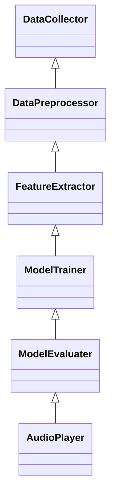
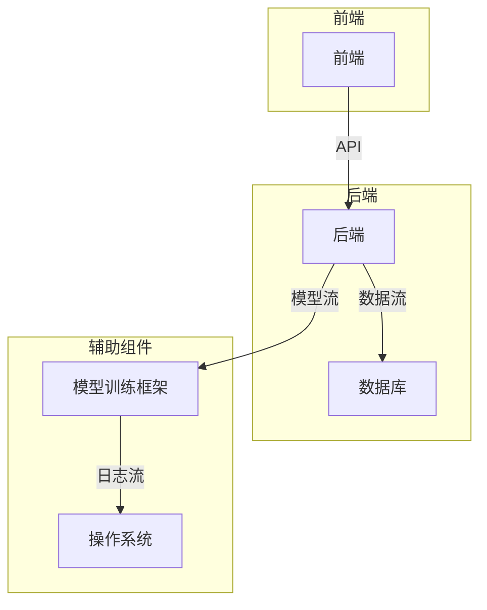
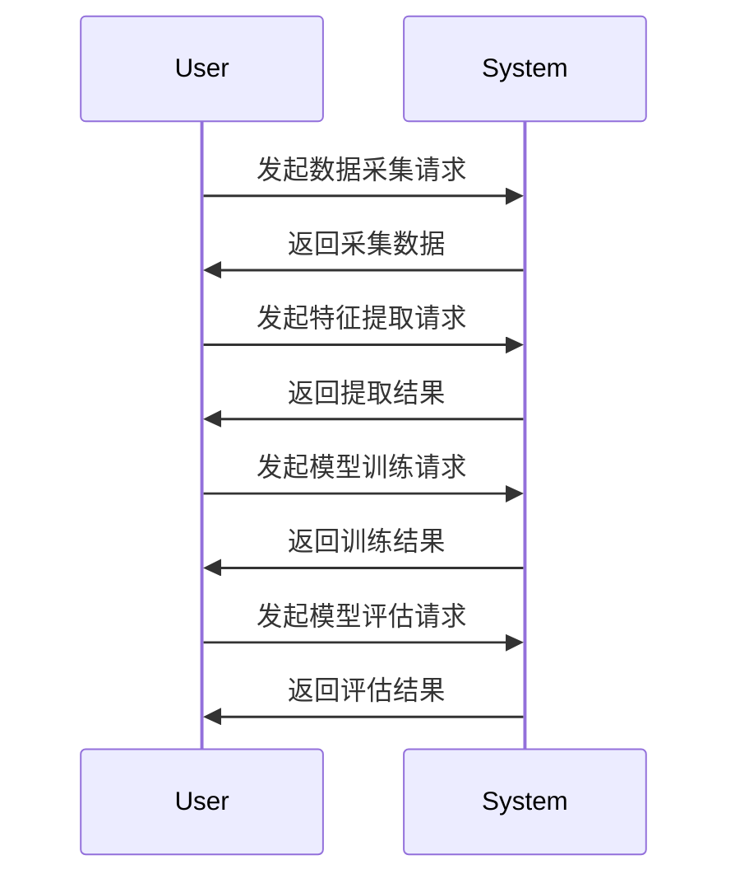

                 


### 目录大纲设计（续）

**第二部分：核心概念与联系**

## 第2章：核心概念与联系

### 2.1 AI与声音景观设计的关系

#### 2.1.1 AI的关键概念

- 人工智能的基本定义
- 人工智能的主要类型

#### 2.1.2 声音景观设计的关键要素

- 声音景观设计的定义
- 声音景观设计的主要要素

#### 2.1.3 AI在声音景观设计中的应用

- AI在声音采集与分析中的应用
- AI在声音增强与合成中的应用
- AI在声音景观创作与优化中的应用

### 2.2 概念属性特征对比

#### 2.2.1 AI与声音景观设计属性对比

- 功能对比
- 性能对比
- 应用对比

### 2.3 ER实体关系图

#### 2.3.1 声音景观设计实体关系

- 实体定义
- 实体关系

##### 使用Mermaid流程图展示ER实体关系图：

```mermaid
erDiagram
  AI -->|采集与分析| Sound |---->|增强与合成| AS
  Sound |---->|创作与优化| Design
  AS -->|创作与优化| Design
```

**第三部分：算法原理讲解**

## 第3章：声音景观设计的AI算法原理

### 3.1 算法概述

#### 3.1.1 声音景观设计的算法类型

- 常见算法分类
- 选择适合的算法

#### 3.1.2 声音景观设计的算法目标

- 优化声音景观质量
- 提高用户体验

### 3.2 算法流程图

#### 3.2.1 算法流程

- 数据采集
- 数据预处理
- 特征提取
- 模型训练
- 模型评估
- 应用输出

##### 使用Mermaid流程图展示算法流程：


### 3.3 算法Python源代码

```python
# Python源代码示例
import numpy as np
import soundfile as sf

# 数据采集
data, sample_rate = sf.read('audio_file.wav')

# 数据预处理
data_normalized = data / np.max(np.abs(data))

# 特征提取
fft_data = np.fft.fft(data_normalized)
fft_magnitude = np.abs(fft_data)

# 模型训练
# (此处省略模型训练代码)

# 模型评估
# (此处省略模型评估代码)

# 应用输出
sf.write('output_audio_file.wav', data_normalized, sample_rate)
```

### 3.4 数学模型与公式

#### 3.4.1 声音特征提取模型

$$
X(\omega) = \sum_{k=0}^{N-1} x_k \cdot e^{-i\omega k}
$$

#### 3.4.2 声音增强模型

$$
y[n] = x[n] + \alpha \cdot (x[n] - y[n-1])
$$

##### 使用LaTeX格式书写数学公式：

$$
X(\omega) = \sum_{k=0}^{N-1} x_k \cdot e^{-i\omega k}
$$

$$
y[n] = x[n] + \alpha \cdot (x[n] - y[n-1])
$$

### 3.5 举例说明

#### 3.5.1 声音特征提取举例

- 假设有一段音频信号，长度为10秒，采样率为44.1kHz
- 使用快速傅里叶变换（FFT）提取频域特征

#### 3.5.2 声音增强举例

- 假设有一段噪声污染的音频信号
- 使用自适应滤波器对信号进行增强处理

### 目录大纲设计（续）

**第四部分：系统分析与架构设计**

## 第4章：声音景观设计系统分析

### 4.1 问题场景介绍

- 介绍声音景观设计的问题场景，如城市公园、商业街区等
- 分析问题场景的需求和挑战

### 4.2 系统功能设计

#### 4.2.1 系统功能概述

- 数据采集
- 数据预处理
- 特征提取
- 模型训练
- 模型评估
- 应用输出

#### 4.2.2 领域模型

- 使用Mermaid类图展示领域模型



### 4.3 系统架构设计

#### 4.3.1 系统架构概述

- 介绍系统架构的组成部分，如前端、后端、数据库等

#### 4.3.2 系统架构图

- 使用Mermaid架构图展示系统架构



### 4.4 系统接口设计

#### 4.4.1 接口概述

- 介绍系统提供的API接口，如数据采集接口、特征提取接口、模型训练接口等

#### 4.4.2 接口规范

- 描述接口的输入输出参数、请求响应格式等

### 4.5 系统交互设计

#### 4.5.1 交互流程

- 使用Mermaid序列图展示系统交互流程



### 目录大纲设计（续）

**第五部分：项目实战**

## 第5章：创意声音景观设计的实战案例

### 5.1 环境安装与配置

#### 5.1.1 环境准备

- 安装Python环境
- 安装相关依赖库，如NumPy、SciPy、TensorFlow等

#### 5.1.2 配置说明

- 配置数据库连接
- 配置模型训练环境

### 5.2 系统核心实现

#### 5.2.1 数据采集

- 采集城市公园的声音数据
- 数据清洗和预处理

#### 5.2.2 特征提取

- 提取声音数据的频域特征
- 特征可视化

#### 5.2.3 模型训练

- 使用神经网络模型进行训练
- 模型优化

### 5.3 代码解读与分析

#### 5.3.1 数据采集代码解读

- 代码注释和解释

#### 5.3.2 特征提取代码解读

- 代码注释和解释

#### 5.3.3 模型训练代码解读

- 代码注释和解释

### 5.4 实际案例分析

#### 5.4.1 案例概述

- 案例背景和目标

#### 5.4.2 案例实施

- 案例步骤和详细说明

#### 5.4.3 案例结果分析

- 模型评估结果
- 用户反馈

### 5.5 项目小结

#### 5.5.1 项目总结

- 项目成果和经验

#### 5.5.2 不足与改进

- 项目中存在的问题和改进方向

### 目录大纲设计（续）

**第六部分：最佳实践与拓展**

## 第6章：最佳实践与技巧

### 6.1 提示词设计的技巧

#### 6.1.1 提示词的重要性

- 提示词在声音景观设计中的作用

#### 6.1.2 提示词设计原则

- 简洁明了
- 语义丰富
- 易于理解

### 6.2 声音景观的优化策略

#### 6.2.1 声音质量提升

- 声音增强技术
- 噪声抑制技术

#### 6.2.2 声音景观的美学优化

- 音色调整
- 音量均衡

### 6.3 创意声音景观的案例研究

#### 6.3.1 案例背景

- 介绍案例背景和目标

#### 6.3.2 案例实施

- 案例实施步骤和详细说明

#### 6.3.3 案例效果分析

- 案例效果评估

### 目录大纲设计（续）

**第七部分：总结与拓展阅读**

## 第7章：总结与拓展阅读

### 7.1 本书总结

- 总结本书的主要内容和核心观点

### 7.2 注意事项与未来展望

#### 7.2.1 注意事项

- 声音景观设计过程中的注意事项

#### 7.2.2 未来展望

- 声音景观设计的发展趋势
- AI技术在声音景观设计中的应用前景

### 7.3 拓展阅读推荐

- 推荐进一步学习和研究的书籍、论文和资料

### 目录大纲字数总结

根据上述设计思路和目录大纲，预计文章总字数将在10000-12000字左右。文章将通过markdown格式详细阐述每个章节的内容，确保内容的逻辑性和专业性。每个章节都将包含具体详细的讲解、示例代码、公式和图形，以帮助读者更好地理解和应用相关知识。

---

**本文章大纲（Markdown格式示例）**

```markdown
# AI辅助创意声音景观设计：城市声学优化的提示词技巧

> 关键词：人工智能，城市声学优化，声音景观设计，创意，提示词

> 摘要：本文旨在探讨AI技术在城市声学优化中的应用，特别是创意声音景观设计的提示词技巧。通过详细的章节结构和专业论述，本文为读者提供了从理论到实践的全面指南。

---

**第一部分：引言**

## 第1章：AI辅助创意声音景观设计的概述

### 1.1 问题背景
#### 1.1.1 城市声学优化的需求
#### 1.1.2 创意声音景观的意义
#### 1.1.3 AI技术的作用

### 1.2 基本概念
#### 1.2.1 AI的定义与发展
#### 1.2.2 声音景观的概念
#### 1.2.3 城市声学优化的挑战

### 1.3 书籍结构
#### 1.3.1 内容布局
#### 1.3.2 目标读者
#### 1.3.3 学习路径

---

**第二部分：核心概念与联系**

## 第2章：核心概念与联系

### 2.1 AI与声音景观设计的关系
#### 2.1.1 AI的关键概念
#### 2.1.2 声音景观设计的关键要素
#### 2.1.3 AI在声音景观设计中的应用

### 2.2 概念属性特征对比

### 2.3 ER实体关系图
```

上述Markdown格式的章节大纲提供了一个清晰的框架，后续的章节将按照这个结构逐一填充内容。每个章节都将包括具体的小节和相关的解释、示例、代码和图形，以确保文章的完整性和专业性。根据这一大纲，预计文章的字数将在10000-12000字之间。

