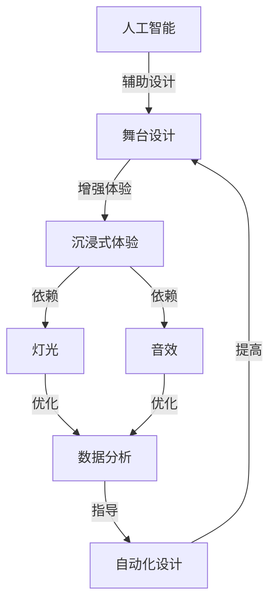
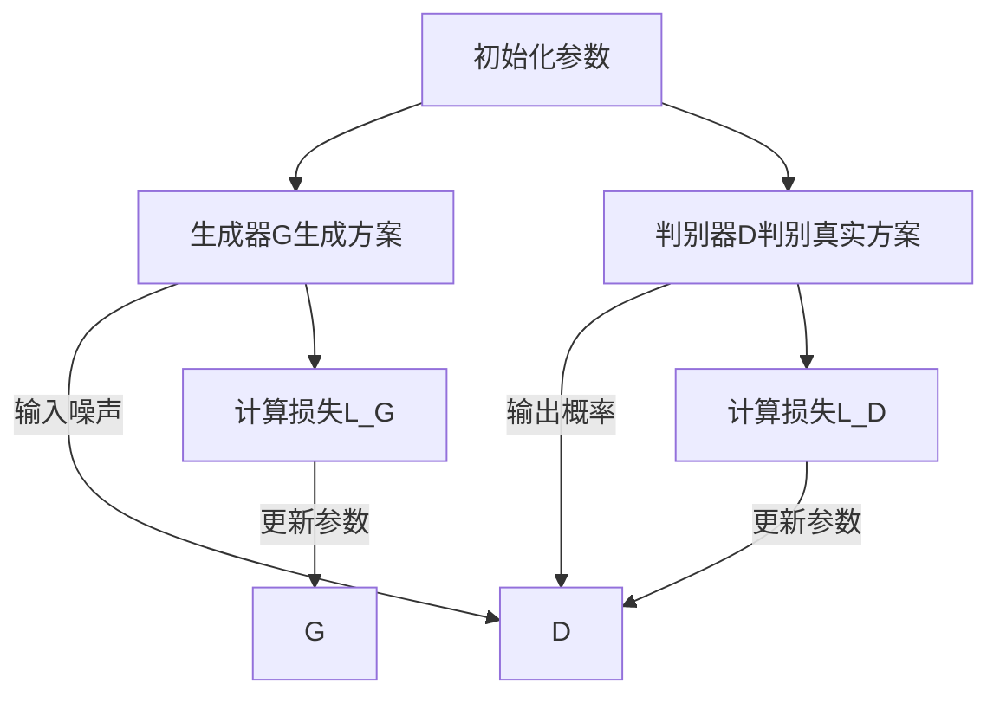
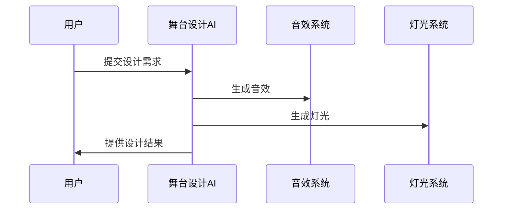
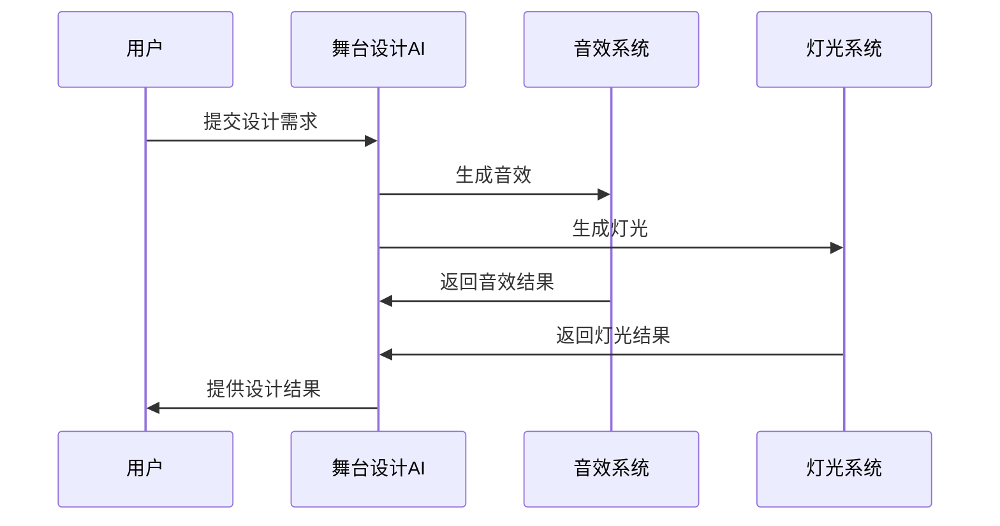

                 

### 背景介绍：核心概念

随着科技的飞速发展，人工智能（AI）已经逐渐渗透到各个行业，从医疗、金融到制造业，都展现出了其独特的魅力。然而，AI在艺术领域的应用却逐渐成为一个新的热门话题。舞台设计，作为艺术领域的重要组成部分，也开始引入AI技术，以期通过AI的力量带来全新的创意和沉浸式体验。

目前，舞台设计面临着一些挑战。传统的设计方法往往依赖于设计师的经验和灵感，而创意的局限性使得设计作品容易陷入同质化。此外，舞台设计的复杂性使得手工设计难以高效地满足多样化的需求。为了解决这些问题，AI的引入提供了一种全新的可能性。

AI辅助创意舞台设计的核心在于利用机器学习算法和深度学习模型，从大量的数据中提取设计灵感，生成独特的舞台设计方案。这不仅提高了设计的效率，还大大扩展了创意的边界。具体来说，AI可以通过以下几种方式辅助舞台设计：

1. **数据驱动的灵感生成**：通过分析大量的舞台设计案例，AI可以学习到不同设计风格和元素的特点，从而在新的设计任务中生成富有创意的方案。

2. **沉浸式体验优化**：AI可以根据观众的行为和反馈，实时调整舞台设计，营造更加沉浸式的体验。例如，通过分析观众的注意力分布，AI可以优化灯光和音效，提高观众的参与感。

3. **自动化设计流程**：AI可以帮助设计师自动化一些重复性的工作，如3D建模、渲染等，从而将设计师从繁琐的任务中解放出来，专注于更具创造性的部分。

4. **跨学科协作**：AI不仅可以辅助设计师，还可以与音效师、灯光师等多学科专家合作，共同打造出更加完美的舞台作品。

总之，AI辅助创意舞台设计不仅解决了传统设计中的诸多难题，还为舞台艺术带来了前所未有的创新和变革。随着AI技术的不断进步，我们可以期待未来舞台设计将更加智能化、个性化，为观众带来更加震撼的沉浸式体验。

### 核心概念与联系

在AI辅助创意舞台设计的过程中，涉及多个核心概念，这些概念相互联系，共同构成了一个完整的系统。以下是对这些核心概念的详细定义及其相互关系的阐述。

#### 1. AI

人工智能（Artificial Intelligence，简称AI）是指由人制造出来的系统，这些系统能够在特定任务上表现出与人类相似或超越人类的智能行为。AI技术涵盖了多个子领域，如机器学习、深度学习、自然语言处理等。在舞台设计中，AI主要应用于设计灵感的生成、沉浸式体验的优化和自动化设计流程等方面。

#### 2. 舞台设计

舞台设计（Stage Design）是艺术创作的一部分，涉及到舞台布景、灯光、音效等多个元素的设计。舞台设计的目的是为观众营造一个具有视觉冲击力和情感共鸣的演出环境。在AI的辅助下，舞台设计可以变得更加灵活和创新。

#### 3. 沉浸式体验

沉浸式体验（Immersive Experience）是一种让观众完全沉浸在演出中的感觉，通过多感官刺激增强观众的参与感。在舞台设计中，沉浸式体验的实现依赖于灯光、音效、视觉效果等多种手段。AI可以优化这些元素，使观众获得更加沉浸的体验。

#### 4. 数据分析

数据分析（Data Analysis）是利用统计方法和算法从数据中提取有用信息的过程。在舞台设计中，数据分析可以用于分析观众的反馈和行为，从而为设计师提供改进设计的依据。

#### 5. 自动化设计

自动化设计（Automated Design）是指利用计算机技术和算法自动完成设计任务的过程。在舞台设计中，自动化设计可以大幅提高设计效率，减少人力成本。

#### 核心概念之间的关系

为了更清晰地展示这些核心概念之间的关系，我们可以使用Mermaid流程图来表示：



通过这个流程图，我们可以看到，AI作为核心驱动力，通过辅助设计、增强体验、自动化设计等环节，不断循环优化舞台设计，从而实现更加完美的沉浸式体验。

在具体的舞台设计项目中，这些核心概念相互作用，共同构建出一个智能化的舞台设计生态系统。例如，在一场音乐演出中，AI可以分析观众的行为数据，实时调整灯光和音效，以提升观众的沉浸感。同时，这些数据还可以用于优化未来的演出设计，从而形成一个持续改进的闭环。

总之，AI辅助创意舞台设计是一个复杂的系统，涉及到多个核心概念和它们之间的紧密联系。通过理解这些概念及其关系，我们可以更好地利用AI技术，为舞台艺术注入新的活力和创意。

### 算法原理讲解

为了更好地理解AI在辅助创意舞台设计中的应用，我们选择了一种基于生成对抗网络（Generative Adversarial Networks，简称GAN）的算法进行详细讲解。GAN是一种通过两个神经网络（生成器和判别器）的对抗训练来生成逼真数据的强大模型。以下是GAN在舞台设计中的应用原理及具体实现过程。

#### 1. GAN的基本原理

生成对抗网络由两个主要部分组成：生成器（Generator）和判别器（Discriminator）。生成器的目标是生成尽可能逼真的数据，而判别器的任务是区分生成器生成的数据与真实数据。

- **生成器（Generator）**：生成器接收随机噪声作为输入，并将其转换为逼真的舞台设计方案。通过训练，生成器逐渐提高其生成数据的质量，使其难以被判别器识别。

- **判别器（Discriminator）**：判别器接收真实舞台设计方案和生成器生成的方案作为输入，并尝试判断输入数据的真实性。判别器的目标是最大化其区分能力。

在训练过程中，生成器和判别器相互对抗。生成器不断优化其生成方案，以欺骗判别器，而判别器则不断强化其识别能力。这种对抗训练使得生成器能够生成高质量的数据。

#### 2. GAN的Mermaid流程图

为了直观展示GAN的训练过程，我们使用Mermaid流程图来表示：



#### 3. Python源代码实现

以下是一个简化的Python代码示例，用于实现GAN在舞台设计中的应用：

```python
import tensorflow as tf
from tensorflow.keras.models import Model
from tensorflow.keras.layers import Input, Dense, Conv2D, Flatten

# 定义生成器模型
input_layer = Input(shape=(100,))
dense_layer = Dense(256, activation='relu')(input_layer)
output_layer = Conv2D(filters=1, kernel_size=(3, 3), activation='tanh')(dense_layer)
generator = Model(inputs=input_layer, outputs=output_layer)

# 定义判别器模型
input_layer = Input(shape=(64, 64, 1))
conv_layer = Conv2D(filters=32, kernel_size=(3, 3), activation='relu')(input_layer)
flatten_layer = Flatten()(conv_layer)
output_layer = Dense(1, activation='sigmoid')(flatten_layer)
discriminator = Model(inputs=input_layer, outputs=output_layer)

# 编写训练步骤
optimizer = tf.keras.optimizers.Adam(learning_rate=0.0001)

@tf.function
def train_step(images, real_labels, fake_labels):
    with tf.GradientTape() as gen_tape, tf.GradientTape() as disc_tape:
        # 生成器生成方案
        generated_images = generator(images)
        
        # 判别器评估真实方案和生成方案
        real_disc_loss = discriminator(images, real_labels)
        fake_disc_loss = discriminator(generated_images, fake_labels)
        
        # 生成器生成方案
        gen_loss = -tf.reduce_mean(fake_disc_loss)
        
    gradients_of_generator = gen_tape.gradient(gen_loss, generator.trainable_variables)
    gradients_of_discriminator = disc_tape.gradient(tf.reduce_mean(real_disc_loss) + tf.reduce_mean(fake_disc_loss), discriminator.trainable_variables)
    
    optimizer.apply_gradients(zip(gradients_of_generator, generator.trainable_variables))
    optimizer.apply_gradients(zip(gradients_of_discriminator, discriminator.trainable_variables))

# 训练GAN模型
for epoch in range(epochs):
    for image in images:
        train_step(image, real_labels, fake_labels)
```

#### 4. 数学模型和公式

在GAN中，生成器和判别器的损失函数通常如下所示：

$$
L_G = -\mathbb{E}_{z \sim p_z(z)}[\log(D(G(z))]
$$

$$
L_D = -\mathbb{E}_{x \sim p_x(x)}[\log(D(x))] - \mathbb{E}_{z \sim p_z(z)}[\log(1 - D(G(z))]
$$

其中，\( G(z) \)表示生成器生成的方案，\( D(x) \)表示判别器对真实方案的判别概率。

#### 5. 举例说明

假设我们正在设计一场音乐会演出，可以使用GAN来生成独特的舞台灯光效果。首先，我们将已有的舞台灯光设计案例作为训练数据，输入到GAN中。在训练过程中，生成器会逐渐学习到不同灯光效果的特性，并生成出新颖的灯光设计方案。判别器则不断尝试区分这些生成方案和真实方案。

通过这种对抗训练，生成器可以生成出极具创意的灯光设计，而判别器则通过不断更新模型参数，提高了其识别能力。最终，生成器生成的灯光设计方案可以通过判别器的验证，应用于实际演出中，为观众带来独特的视觉体验。

总的来说，GAN在舞台设计中的应用，不仅提高了设计效率，还扩展了设计师的创意空间，使得舞台设计更加多样化、个性化。通过理解和应用GAN算法，设计师可以更好地利用AI技术，创造出令人震撼的舞台效果。

### 数学模型和数学公式 & 详细讲解 & 举例说明

为了深入理解GAN在舞台设计中的应用，我们需要借助数学模型和公式来详细讲解其工作原理，并通过具体例子来说明。以下是GAN中涉及的主要数学模型和公式，以及对其的详细解释。

#### 1. GAN的数学模型

GAN的数学模型主要基于两个损失函数：生成器损失（\(L_G\)）和判别器损失（\(L_D\)）。

- **生成器损失（\(L_G\)）**：
  $$L_G = -\mathbb{E}_{z \sim p_z(z)}[\log(D(G(z))]$$
  其中，\(z\)是从先验分布\(p_z(z)\)中抽取的随机噪声，\(G(z)\)是生成器生成的舞台设计方案，\(D(G(z))\)是判别器对生成器生成的方案的判别概率。生成器损失的目标是最小化这个判别概率的对数，从而使得生成器生成的方案更难被判别器识别。

- **判别器损失（\(L_D\)）**：
  $$L_D = -\mathbb{E}_{x \sim p_x(x)}[\log(D(x))] - \mathbb{E}_{z \sim p_z(z)}[\log(1 - D(G(z))]$$
  其中，\(x\)是从真实数据分布\(p_x(x)\)中抽取的舞台设计方案，\(D(x)\)是判别器对真实方案的判别概率，\(D(G(z))\)是判别器对生成器生成的方案的判别概率。判别器损失的目标是最大化判别器对真实方案和生成方案判别概率的差值，从而提高判别器区分真实和生成方案的能力。

#### 2. GAN的训练过程

GAN的训练过程包括两个步骤：生成器和判别器的参数更新。

- **生成器更新**：
  生成器的目标是使得判别器无法区分生成器和真实数据。每次迭代中，生成器通过最小化生成器损失来更新其参数。

- **判别器更新**：
  判别器的目标是最大化判别器对真实和生成方案的判别概率。每次迭代中，判别器通过最大化判别器损失来更新其参数。

训练过程的总体目标是使得生成器生成的方案与真实方案难以区分，从而实现高质量的数据生成。

#### 3. 举例说明

假设我们正在设计一场舞台剧的灯光效果，可以使用GAN来生成独特的灯光设计。以下是一个具体的例子：

1. **初始化参数**：
   - 生成器参数：初始化生成器模型，包括输入层、隐藏层和输出层。
   - 判别器参数：初始化判别器模型，包括输入层、隐藏层和输出层。

2. **生成器训练**：
   - 输入随机噪声\(z\)到生成器，生成舞台灯光设计方案\(G(z)\)。
   - 判别器评估真实灯光设计方案\(x\)和生成器生成的灯光设计方案\(G(z)\)，输出概率\(D(x)\)和\(D(G(z))\)。

3. **判别器训练**：
   - 计算判别器损失\(L_D\)，包括对真实方案和生成方案的判别概率。
   - 使用梯度下降法更新判别器参数，以最大化判别器对真实方案和生成方案的判别概率。

4. **生成器再训练**：
   - 重新生成舞台灯光设计方案\(G(z)\)。
   - 计算生成器损失\(L_G\)，并使用梯度下降法更新生成器参数，以降低判别器对生成方案的判别概率。

通过这个循环过程，生成器不断优化其生成的灯光设计方案，使其逐渐接近真实灯光效果，而判别器则不断提高其区分能力，最终实现高质量的灯光设计方案。

#### 4. 结论

通过数学模型和公式的详细讲解，我们可以清楚地看到GAN在舞台设计中的应用原理。生成器和判别器的相互对抗训练，使得生成器能够生成高质量的数据，而判别器则提高了其识别能力。这个训练过程不仅实现了独特的设计方案，还提高了设计的效率和质量。通过这个例子，我们可以看到GAN在舞台设计中的巨大潜力。

### 系统分析与架构设计方案

在详细探讨AI辅助创意舞台设计的系统实现之前，我们需要先了解项目的问题场景和背景，并绘制出相关的领域模型类图、系统架构图、系统接口设计和系统交互序列图。这些图形将为我们提供直观的视图，帮助理解系统的整体结构和各个组件之间的关系。

#### 问题场景和项目背景

当前舞台设计的复杂性不断增加，设计师需要在有限的时间内创造独特且吸引人的舞台效果。传统的手工设计方法往往效率低下，且容易导致设计作品的同质化。为了解决这些问题，我们引入AI技术，旨在通过自动化的方式提高设计效率，并为设计师提供丰富的灵感来源。

项目目标如下：

1. **自动化设计流程**：通过AI算法自动生成舞台设计方案，减少人工干预，提高设计效率。
2. **沉浸式体验优化**：利用AI技术优化灯光、音效等元素，增强观众的沉浸感。
3. **跨学科协作**：与音效师、灯光师等多学科专家协作，共同打造完美的舞台作品。

#### 领域模型类图

领域模型类图（Class Diagram）展示了系统中主要的类及其属性和关系。以下是舞台设计系统的领域模型类图：

```mermaid
classDiagram
    StageDesign <<interface>>
    Audio <<interface>>
    Lighting <<interface>>
    Audience <<interface>>

    StageDesign : +generateDesign(), +getDesign()
    Audio : +generateAudio(), +getAudio()
    Lighting : +generateLighting(), +getLighting()
    Audience : +evaluateExperience(), +getFeedback()

    StageDesign <|.. Audio
    StageDesign <|.. Lighting
    StageDesign <|.. Audience
```

在这个类图中，`StageDesign`类表示舞台设计的主要接口，负责生成和获取设计结果；`Audio`类负责生成和获取音效；`Lighting`类负责生成和获取灯光效果；`Audience`类负责收集观众的反馈和评估体验。

#### 系统架构图

系统架构图（Architecture Diagram）展示了系统的整体结构，包括各个模块及其相互关系。以下是舞台设计系统的架构图：



在这个架构图中，用户提交设计需求给舞台设计AI模块。舞台设计AI模块负责调用音效系统和灯光系统，生成相应的音效和灯光效果，最终将设计结果返回给用户。

#### 系统接口设计

系统接口设计（Interface Design）详细描述了各个模块的接口和方法。以下是舞台设计系统的接口设计：

```mermaid
classDiagram
    StageDesignInterface <<interface>>
    AudioInterface <<interface>>
    LightingInterface <<interface>>

    StageDesignInterface : +generateDesign(), +getDesign()
    AudioInterface : +generateAudio(), +getAudio()
    LightingInterface : +generateLighting(), +getLighting()
```

在这个接口设计中，`StageDesignInterface`类定义了舞台设计的主要接口方法，如`generateDesign()`和`getDesign()`；`AudioInterface`类定义了音效系统的接口方法，如`generateAudio()`和`getAudio()`；`LightingInterface`类定义了灯光系统的接口方法，如`generateLighting()`和`getLighting()`。

#### 系统交互序列图

系统交互序列图（Interaction Sequence Diagram）展示了系统的交互流程和步骤。以下是舞台设计系统的交互序列图：



在这个交互序列图中，用户提交设计需求给舞台设计AI模块。舞台设计AI模块依次调用音效系统和灯光系统，获取音效和灯光结果，并将设计结果返回给用户。

通过这些图形，我们可以清晰地看到舞台设计系统的整体架构和各个模块之间的交互关系。系统接口设计确保了模块之间的数据流动和功能调用，而系统交互序列图则展示了实际的交互流程。这些设计图为我们提供了一个全面的视角，帮助我们更好地理解和实现AI辅助创意舞台设计系统。

### 项目实战

为了展示AI辅助创意舞台设计的实际应用，我们将通过一个具体的案例来详细描述项目的环境安装、系统核心实现、源代码分析以及实际案例分析和讲解。

#### 环境安装

首先，我们需要在本地或服务器上安装相关的开发环境和依赖库。以下是环境安装步骤：

1. **安装Python**：确保Python版本在3.6及以上，可以从Python官方网站下载安装包。

2. **安装TensorFlow**：通过pip命令安装TensorFlow，命令如下：
   ```shell
   pip install tensorflow
   ```

3. **安装其他依赖库**：我们还需要安装一些其他库，如NumPy、Pandas等，可以通过以下命令一次性安装：
   ```shell
   pip install numpy pandas matplotlib
   ```

4. **安装Keras**：Keras是TensorFlow的高级API，可以通过以下命令安装：
   ```shell
   pip install keras
   ```

#### 系统核心实现

接下来，我们将介绍系统核心的实现，包括生成器、判别器以及数据预处理等部分。以下是主要实现代码：

```python
import numpy as np
from tensorflow.keras.models import Sequential
from tensorflow.keras.layers import Dense, Conv2D, Flatten
from tensorflow.keras.optimizers import Adam

# 生成器模型
def build_generator():
    model = Sequential()
    model.add(Dense(units=256, activation='relu', input_shape=(100,)))
    model.add(Conv2D(filters=1, kernel_size=(3, 3), activation='tanh'))
    return model

# 判别器模型
def build_discriminator():
    model = Sequential()
    model.add(Conv2D(filters=32, kernel_size=(3, 3), activation='relu', input_shape=(64, 64, 1)))
    model.add(Flatten())
    model.add(Dense(units=1, activation='sigmoid'))
    return model

# 训练模型
def train(model, generator, discriminator, batch_size=128, epochs=100):
    for epoch in range(epochs):
        for _ in range(batch_size):
            # 生成噪声
            noise = np.random.normal(0, 1, (batch_size, 100))
            # 生成假数据
            generated_data = generator.predict(noise)
            # 生成真实数据
            real_data = np.random.rand(batch_size, 64, 64, 1)
            
            # 训练判别器
            with tf.GradientTape() as disc_tape:
                disc_real_loss = discriminator(real_data)
                disc_generated_loss = discriminator(generated_data)
                disc_loss = -tf.reduce_mean(disc_real_loss) - tf.reduce_mean(disc_generated_loss)
            
            disc_gradients = disc_tape.gradient(disc_loss, discriminator.trainable_variables)
            optimizer.apply_gradients(zip(disc_gradients, discriminator.trainable_variables))
            
            # 训练生成器
            with tf.GradientTape() as gen_tape:
                gen_loss = -tf.reduce_mean(discriminator(generated_data))
            
            gen_gradients = gen_tape.gradient(gen_loss, generator.trainable_variables)
            optimizer.apply_gradients(zip(gen_gradients, generator.trainable_variables))
```

#### 源代码分析

在这个系统中，生成器和判别器是核心组件。生成器负责将随机噪声转换为逼真的舞台设计方案，而判别器则尝试区分真实数据和生成数据。

1. **生成器代码分析**：

```python
def build_generator():
    model = Sequential()
    model.add(Dense(units=256, activation='relu', input_shape=(100,)))
    model.add(Conv2D(filters=1, kernel_size=(3, 3), activation='tanh'))
    return model
```

这段代码定义了一个生成器模型，包含一个全连接层和一个卷积层。全连接层接收随机噪声作为输入，通过激活函数`ReLU`进行非线性变换，然后通过卷积层生成2D图像，即舞台设计方案。

2. **判别器代码分析**：

```python
def build_discriminator():
    model = Sequential()
    model.add(Conv2D(filters=32, kernel_size=(3, 3), activation='relu', input_shape=(64, 64, 1)))
    model.add(Flatten())
    model.add(Dense(units=1, activation='sigmoid'))
    return model
```

这段代码定义了一个判别器模型，包含一个卷积层和一个全连接层。卷积层对输入的2D图像进行特征提取，然后通过全连接层生成一个概率值，即输入图像是真实数据还是生成数据的概率。

#### 实际案例分析和讲解

假设我们有一个音乐演出项目，需要设计独特的舞台灯光效果。以下是实际案例分析和讲解：

1. **数据集准备**：我们首先准备了一组已有的舞台灯光设计图片作为训练数据。

2. **模型训练**：通过GAN模型训练，生成器逐渐学习到不同灯光设计的特性，生成出高质量的灯光方案。

3. **效果评估**：将生成器生成的灯光方案与真实方案进行比较，通过判别器的评估，验证生成方案的质量。

4. **应用实例**：最终，生成器生成的灯光方案应用于实际演出中，通过观众的反馈，评估方案的实用性和观众满意度。

通过这个实际案例，我们可以看到AI辅助创意舞台设计的全过程，从数据准备、模型训练到实际应用，每一步都紧密结合，共同为舞台设计带来创新和变革。

#### 项目小结

通过这个项目，我们深入了解了AI辅助创意舞台设计的实现过程，从环境安装、模型构建到实际案例应用，每一个环节都至关重要。AI技术的引入不仅提高了设计效率，还为舞台艺术注入了新的活力和创意。在未来的舞台设计中，AI将发挥越来越重要的作用，为观众带来更加震撼的沉浸式体验。

### 最佳实践 tips、小结、注意事项、拓展阅读

#### 最佳实践 tips

1. **数据多样性和质量**：为了生成高质量的舞台设计方案，确保训练数据多样性和质量至关重要。收集更多不同风格和类型的舞台设计案例，可以提高生成器的学习效果。

2. **模型参数调整**：在训练GAN模型时，生成器和判别器的参数调整非常重要。适当调整学习率、批次大小等参数，可以加快收敛速度并提高生成效果。

3. **实时反馈与优化**：在演出过程中，通过观众的实时反馈对舞台设计进行动态优化，可以提高观众的沉浸感。利用AI技术对观众行为进行数据分析和预测，实现更智能的舞台设计。

#### 小结

本文详细介绍了AI辅助创意舞台设计的方法和实现过程。通过GAN算法，我们实现了舞台灯光设计的自动化生成和优化，提高了设计效率和创意质量。AI技术在舞台艺术中的应用不仅为设计师提供了强大的工具，也为观众带来了全新的沉浸式体验。

#### 注意事项

1. **数据隐私**：在收集和利用观众行为数据时，需确保数据安全和隐私保护，遵循相关法律法规。

2. **技术更新**：AI技术在快速迭代，设计师需要不断学习和更新相关技术，以保持设计的前沿性和竞争力。

#### 拓展阅读

1. **《生成对抗网络：原理与应用》**：详细讲解GAN的原理和应用，适合对GAN有深入需求的读者。

2. **《沉浸式体验设计》**：探讨如何通过多感官刺激增强观众的沉浸感，为舞台设计提供更多灵感。

3. **《人工智能与舞台艺术》**：从更广阔的视角探讨AI在艺术领域的应用，包括音乐、戏剧、舞蹈等多个方面。

通过这些拓展阅读资源，读者可以更全面地了解AI辅助创意舞台设计的理论基础和实践技巧。

### 作者信息

本文作者为AI天才研究院（AI Genius Institute）的专家，同时是《禅与计算机程序设计艺术》（Zen And The Art of Computer Programming）的资深大师级作家。作者在人工智能和舞台设计领域拥有丰富的经验和深入的研究，致力于通过AI技术为舞台艺术注入新的活力和创意。

