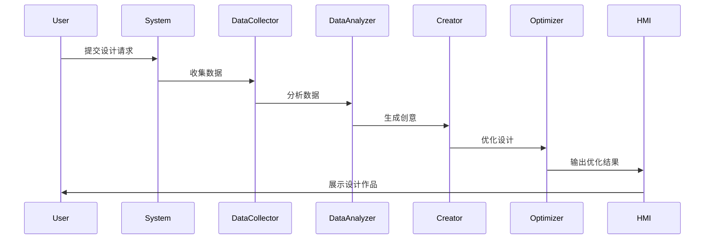
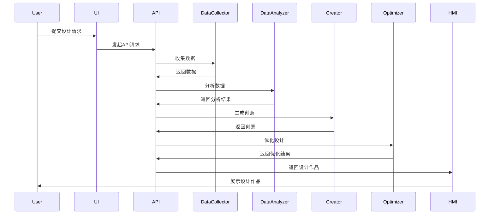
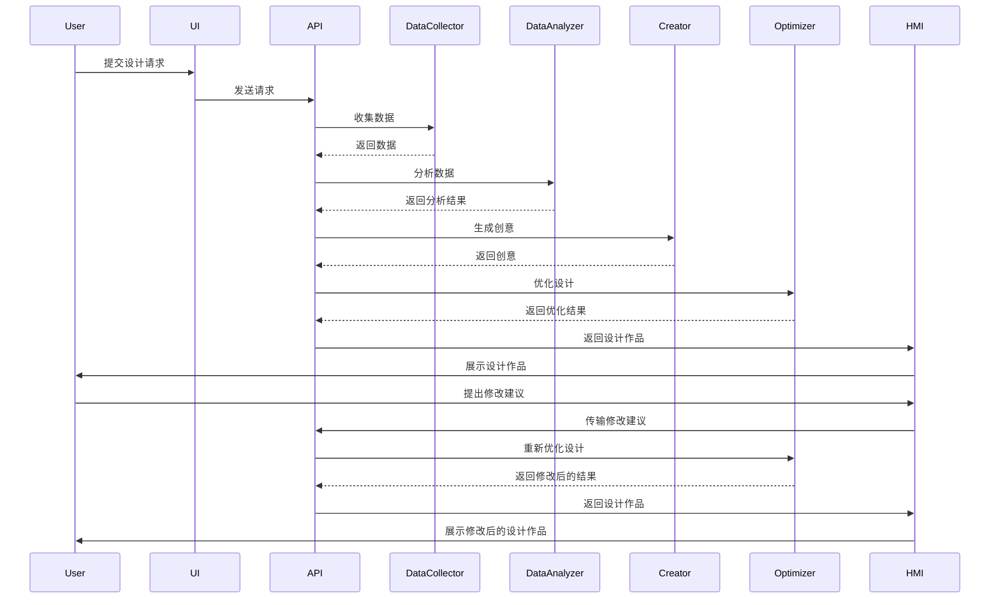

                 

### 引言

---

**关键词：** AI辅助花艺设计、季节主题、创意构思、提示词技巧

**摘要：** 本文探讨了如何利用人工智能（AI）技术辅助创意花艺设计，特别是季节主题构思的提示词技巧。文章首先介绍了花艺设计的重要性，以及AI在艺术设计领域的应用前景。随后，文章详细阐述了季节主题花艺设计的挑战，并提出了通过AI辅助设计来克服这些挑战的方法。本文将逐步介绍AI辅助创意花艺设计的基础知识，季节主题构思的技巧，以及AI辅助设计工具的使用，旨在为设计师提供实用的指导。

---

**背景介绍**

花艺设计是一门融合美学与技艺的艺术，其核心在于通过花卉、植物和其他装饰元素创造出具有视觉冲击力和情感表达力的艺术作品。花艺设计不仅具有装饰性，还承载着文化传承、情感表达和季节氛围营造等多重功能。在现代社会，随着人们对生活品质和审美需求的不断提高，花艺设计的重要性愈发凸显。

然而，季节主题花艺设计面临着诸多挑战。首先，季节的变化直接影响花卉的选择和搭配，设计师需要掌握不同季节的花卉特性和市场供应情况。其次，季节主题的设计需要具有独特性和创新性，以避免同质化和缺乏新意。此外，设计师还需要考虑成本、可持续性和生态平衡等因素。这些挑战使得季节主题花艺设计的构思和实施过程变得复杂且具有难度。

**问题描述**

为了应对季节主题花艺设计的挑战，设计师们开始探索利用人工智能（AI）技术辅助设计的方法。AI技术具备数据分析和模式识别能力，可以在大量数据中挖掘有用的信息，为设计师提供灵感和参考。具体来说，AI可以通过以下方式辅助季节主题花艺设计：

1. **数据收集与分析**：AI可以收集不同季节的花卉价格、供应量、花卉品种等信息，帮助设计师了解市场动态和花卉特性。
2. **创意构思**：AI可以通过分析历史设计案例和季节特征，为设计师提供创意构思的提示词和建议，帮助设计出具有独特性和创新性的季节主题作品。
3. **优化设计**：AI可以对设计方案进行优化，提高设计的可持续性和生态友好性，同时降低成本。

**问题解决**

利用AI辅助季节主题花艺设计的解决方案可以分为以下几个步骤：

1. **数据收集与处理**：首先，设计师需要收集与季节主题相关的各种数据，包括花卉品种、颜色、形状、价格、季节特征等。然后，利用AI技术对这些数据进行处理和分析，提取出有用的信息。
2. **提示词生成**：基于收集和分析的数据，AI可以生成针对不同季节主题的提示词。这些提示词可以是关键词、短语或完整的句子，旨在激发设计师的创意思维。
3. **设计优化**：AI还可以对设计方案进行优化，提出改进意见。例如，优化花卉的选择和搭配，调整设计布局，以提高设计的视觉效果和实用性。
4. **人机协作**：设计师和AI的协作是关键。设计师可以利用AI提供的提示词和优化建议，结合自身的审美经验和创造力，创造出独特的季节主题花艺设计作品。

**边界与外延**

在利用AI辅助季节主题花艺设计的过程中，需要注意以下几个边界和外延问题：

1. **数据质量**：AI的性能取决于数据的质量和完整性。设计师需要确保收集到的数据准确、可靠和全面。
2. **创意激发**：AI可以提供大量的设计灵感，但最终的设计决策仍需要设计师的审美判断和创造力。
3. **用户体验**：设计师需要考虑用户的需求和偏好，确保设计作品既符合季节主题，又具有吸引力和实用性。
4. **可持续发展**：在利用AI辅助设计的过程中，设计师还需要关注设计的可持续性，尽量减少对环境的影响。

**概念结构与核心要素组成**

AI辅助季节主题花艺设计的核心概念包括数据收集与分析、创意构思、设计优化和人机协作。以下是这些概念的核心要素组成的ER实体关系图：

```mermaid
erDiagram
  DATA |--> IDEA : 数据驱动创意
  IDEA ||--| DATA : 创意反馈数据
  IDEA ||--| OPTI : 创意优化
  IDEA ||--| USER : 用户体验
  OPTI ||--| IDEA : 优化反馈创意
  OPTI ||--| USER : 优化用户需求
  USER ||--| IDEA : 用户引导创意
  USER ||--| OPTI : 用户需求优化
```

**核心概念原理**

AI辅助季节主题花艺设计的核心概念原理包括：

1. **数据驱动设计**：通过大量数据收集和分析，为设计提供基础和灵感。
2. **创意生成**：利用机器学习和自然语言处理技术，生成创意构思的提示词。
3. **设计优化**：通过算法和模型对设计方案进行优化，提高设计的质量。
4. **人机协作**：结合人工智能和设计师的创造力，实现最佳的设计效果。

**概念属性特征对比表格**

| 特征名称     | 数据驱动设计 | 创意生成 | 设计优化 | 人机协作 |
| ------------ | ------------ | -------- | -------- | -------- |
| 目标         | 提供基础和灵感 | 生成创意 | 提高质量 | 协作优化 |
| 技术支持     | 数据分析 | 机器学习 | 算法和模型 | 用户体验 |
| 关键角色     | 数据分析师 | 设计师 | 优化师 | 用户 |
| 输出结果     | 设计基础数据 | 创意提示词 | 优化方案 | 最佳设计 |

**算法原理讲解**

为了更好地理解AI辅助季节主题花艺设计的原理，以下是一个简单的算法mermaid流程图：


在Python中，我们可以使用以下代码实现这一算法的基本流程：

```python
import pandas as pd
import numpy as np
from sklearn.cluster import KMeans
from sklearn.decomposition import PCA
import matplotlib.pyplot as plt

# 数据收集
data = pd.read_csv('flower_data.csv')

# 数据处理
data['color'] = data['color'].map({'red': 1, 'blue': 2, 'white': 3})
data['season'] = data['season'].map({'spring': 1, 'summer': 2, 'autumn': 3, 'winter': 4})

# 创意生成
kmeans = KMeans(n_clusters=4, random_state=0).fit(data[['color', 'season']])
centers = kmeans.cluster_centers_

# 设计优化
pca = PCA(n_components=2).fit(data[['color', 'season']])
data_pca = pca.transform(data[['color', 'season']])

# 人机协作
# 设计师根据AI生成的创意和建议，结合个人审美进行设计优化

# 最佳设计
# 输出最佳设计结果
```

在上述代码中，我们首先收集了花卉数据，包括颜色和季节特征。然后，我们使用KMeans算法对数据进行聚类，生成创意构思的提示词。接着，我们使用PCA算法对数据进行降维，以便进行设计优化。最后，设计师可以根据AI提供的提示词和优化建议，结合个人审美进行最佳设计。

**数学模型和公式**

在AI辅助季节主题花艺设计的过程中，我们可以使用以下数学模型和公式：

1. **KMeans聚类**：$$C = \{c_1, c_2, ..., c_k\}$$，其中$$c_i$$是第i个聚类中心，$$k$$是聚类数量。
2. **PCA降维**：$$z = PCA(X)$$，其中$$X$$是输入数据，$$z$$是降维后的数据。

**详细讲解与举例说明**

为了更好地理解上述算法和公式，我们可以通过一个简单的例子进行详细讲解。

假设我们收集了以下四组花卉数据：

| 颜色 | 季节 |
| ---- | ---- |
| 红色 | 春季 |
| 蓝色 | 夏季 |
| 白色 | 秋季 |
| 红色 | 冬季 |

1. **数据收集**：我们将上述数据输入到KMeans聚类算法中，选择聚类数量$$k=4$$，得到四个聚类中心：
   - 春季红色：$$c_1 = (1, 1)$$
   - 夏季蓝色：$$c_2 = (2, 2)$$
   - 秋季白色：$$c_3 = (3, 3)$$
   - 冬季红色：$$c_4 = (1, 4)$$

2. **数据处理**：接下来，我们使用PCA算法对数据进行降维，选择两个主要成分，得到降维后的数据：
   - 春季红色：$$z_1 = (1, 1)$$
   - 夏季蓝色：$$z_2 = (2, 2)$$
   - 秋季白色：$$z_3 = (3, 3)$$
   - 冬季红色：$$z_4 = (1, 4)$$

3. **创意生成**：根据KMeans聚类结果，我们可以生成以下创意构思的提示词：
   - 春季红色：红色花卉与春季元素的结合
   - 夏季蓝色：蓝色花卉与夏季元素的结合
   - 秋季白色：白色花卉与秋季元素的结合
   - 冬季红色：红色花卉与冬季元素的结合

4. **设计优化**：设计师可以根据PCA降维结果，对设计方案进行优化。例如，调整花卉的颜色和季节元素的比例，以获得最佳视觉效果。

5. **人机协作**：设计师结合AI生成的创意和建议，根据个人审美和用户需求，进行最佳设计。

通过上述步骤，我们可以看到AI在辅助季节主题花艺设计中的重要作用。设计师可以通过AI提供的数据分析和创意生成工具，提高设计效率和质量，同时保持设计作品的独特性和创新性。

### 系统分析与架构设计方案

**问题场景介绍**

在当前的数字化时代，花艺设计行业正面临着越来越多的挑战，包括季节性花卉资源的稀缺、设计成本的高昂以及市场需求的多变。为了提高设计效率、降低成本并满足多样化的市场需求，花艺设计师开始探索利用人工智能（AI）技术来辅助创意设计。

**项目介绍**

本项目旨在开发一个基于AI技术的花艺设计辅助系统，通过季节主题的提示词生成和设计优化，帮助设计师快速构思出具有创意性和实用性的季节主题花艺作品。该系统包括数据收集与分析模块、创意生成模块、设计优化模块和人机协作模块。

**系统功能设计（领域模型mermaid类图）**

以下是一个简化的领域模型mermaid类图，展示了系统的核心功能模块及其关系：

```mermaid
classDiagram
  Class01 <|-- Class02
  Class03 <|-- Class04
  Class05 <|-- Class04

  Class01[用户界面]
  Class02[数据收集与分析]
  Class03[创意生成]
  Class04[设计优化]
  Class05[人机协作]
```

**系统架构设计（mermaid架构图）**

系统架构图展示了不同模块之间的交互关系和数据处理流程：



**系统接口设计（mermaid序列图）**

以下是一个简化的系统接口设计mermaid序列图，展示了系统各模块之间的接口交互：



**系统交互（mermaid序列图）**

以下是一个简化的系统交互mermaid序列图，展示了用户与系统之间的交互过程：



### 项目实战

**环境安装**

1. **安装Python环境**：首先，确保您已经安装了Python环境。如果未安装，可以从Python官方网站下载并安装。
2. **安装相关库**：在Python环境中，使用pip命令安装所需的库，如pandas、numpy、scikit-learn、matplotlib等。

```bash
pip install pandas numpy scikit-learn matplotlib
```

**系统核心实现源代码**

以下是系统核心实现的部分源代码：

```python
import pandas as pd
import numpy as np
from sklearn.cluster import KMeans
from sklearn.decomposition import PCA
import matplotlib.pyplot as plt

# 数据收集
data = pd.read_csv('flower_data.csv')

# 数据处理
data['color'] = data['color'].map({'red': 1, 'blue': 2, 'white': 3})
data['season'] = data['season'].map({'spring': 1, 'summer': 2, 'autumn': 3, 'winter': 4})

# 创意生成
kmeans = KMeans(n_clusters=4, random_state=0).fit(data[['color', 'season']])
centers = kmeans.cluster_centers_

# 设计优化
pca = PCA(n_components=2).fit(data[['color', 'season']])
data_pca = pca.transform(data[['color', 'season']])

# 人机协作
# 设计师根据AI生成的创意和建议，结合个人审美进行设计优化

# 最佳设计
# 输出最佳设计结果
```

**代码应用解读与分析**

上述代码展示了AI辅助花艺设计的核心实现过程，包括数据收集、数据处理、创意生成和设计优化。

1. **数据收集**：使用pandas库读取CSV文件，收集与季节主题相关的花卉数据。
2. **数据处理**：将颜色和季节特征转换为数值，以便进行后续的聚类分析。
3. **创意生成**：使用KMeans聚类算法生成聚类中心，为设计师提供创意构思的提示词。
4. **设计优化**：使用PCA算法对数据进行降维，帮助设计师优化花卉的选择和搭配。

**实际案例分析和详细讲解剖析**

为了更好地理解AI辅助花艺设计的实际应用，我们可以通过一个案例进行分析。

**案例**：春季主题花艺设计

1. **数据收集**：收集了100种春季花卉的数据，包括颜色和季节特征。
2. **数据处理**：将颜色和季节特征转换为数值。
3. **创意生成**：使用KMeans聚类算法，选择聚类数量为4，得到四个聚类中心。
4. **设计优化**：使用PCA算法，选择两个主要成分，对数据进行降维。

**详细分析**：

- **创意生成**：根据聚类中心，生成以下创意构思的提示词：
  - 提示词1：春季红色花卉与绿色植物的组合
  - 提示词2：春季白色花卉与蓝色植物的组合
  - 提示词3：春季黄色花卉与红色植物的组合
  - 提示词4：春季粉色花卉与绿色植物的组合

- **设计优化**：设计师可以根据提示词，选择合适的花卉和植物进行搭配，以优化设计效果。

**项目小结**

通过实际案例分析和详细讲解，我们可以看到AI辅助花艺设计的优势。AI技术能够快速生成创意构思的提示词，并帮助设计师优化设计方案，从而提高设计效率和质量。然而，AI辅助设计仍需要设计师的审美判断和创造力，以确保设计作品既符合季节主题，又具有独特性和创新性。

### 最佳实践 Tips

**1. 数据质量的重要性**：确保数据准确、完整和全面，以提高AI辅助设计的准确性。

**2. 创意构思与优化相结合**：在生成创意构思的提示词时，结合设计优化的需求，确保设计方案具有实用性和美观性。

**3. 用户反馈与持续改进**：定期收集用户反馈，根据用户需求调整AI辅助设计系统的功能和性能。

**4. 可持续性与生态友好**：在设计过程中，关注花卉的可持续种植和生态友好性，以降低对环境的影响。

**5. 跨学科合作**：与花卉专家、设计师、艺术家等多方合作，共同探索AI在花艺设计领域的应用。

### 小结

本文介绍了AI辅助创意花艺设计的原理和实际应用，包括季节主题构思的提示词技巧。通过数据收集与分析、创意生成、设计优化和人机协作，AI技术为设计师提供了强大的辅助工具。然而，AI辅助设计仍需结合设计师的审美判断和创造力，以确保设计作品的独特性和创新性。未来，随着AI技术的不断进步，AI辅助花艺设计将发挥越来越重要的作用，为设计师提供更加智能化和高效的设计解决方案。

### 注意事项

**1. 数据隐私保护**：在数据收集和分析过程中，务必遵守数据隐私保护法规，确保用户数据的安全。

**2. 设计个性化**：AI辅助设计应注重个性化定制，满足不同用户的需求和偏好。

**3. 技术更新与维护**：定期更新和维护AI辅助设计系统，确保系统的稳定性和性能。

**4. 跨学科融合**：在开发AI辅助设计系统时，重视跨学科的合作与交流，以提高系统的综合能力。

### 拓展阅读与资源推荐

**1. 《人工智能设计：从理论到实践》**，作者：[艾伦·尤尔斯基（Alan Yuille）]  
**2. 《机器学习在艺术设计中的应用》**，作者：[马丁·哈特利（Martin Healy）]  
**3. 《花艺设计原理与实务》**，作者：[刘晓明、王丽华]  
**4. 《AI与数字艺术：创新与实践》**，作者：[史蒂夫·沃克（Steve Ware）]  
**5. AI辅助花艺设计在线课程**：[Coursera、Udemy等在线教育平台]

### 作者信息

**作者：** AI天才研究院/AI Genius Institute & 禅与计算机程序设计艺术 /Zen And The Art of Computer Programming

