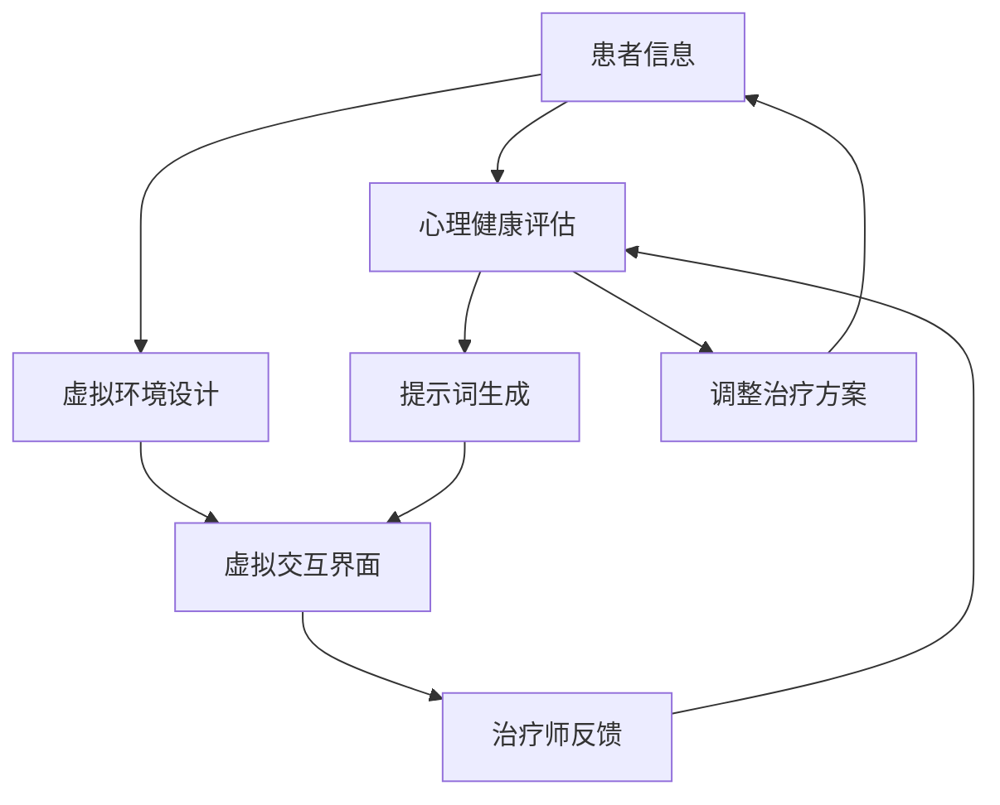

                 


# AI辅助创意虚拟现实疗法：心理健康干预的提示词技巧

## 概述

### 关键词：AI，虚拟现实，心理健康，干预，提示词技巧

### 摘要

本文将探讨AI辅助创意虚拟现实疗法在心理健康干预中的应用，特别是在提示词技巧方面的研究和实践。通过详细介绍AI和VR的基础知识、应用场景与案例研究、提示词技巧的详细解析、实现方法与工具，以及最佳实践与未来展望，本文旨在为相关领域的研究者和实践者提供全面的指导。

## 第1部分：引言

### 1.1 AI辅助创意虚拟现实疗法概述

#### 1.1.1 什么是AI辅助创意虚拟现实疗法

AI辅助创意虚拟现实疗法是一种结合人工智能和虚拟现实技术的创新心理健康干预方法。它利用AI算法来分析患者的心理状态，并借助VR技术为患者提供沉浸式的治疗体验。这种方法旨在帮助患者克服焦虑、抑郁等心理问题，提高心理健康水平。

#### 1.1.2 心理健康干预的背景

心理健康问题在全球范围内日益受到关注。随着社会压力的增加，越来越多的人面临着焦虑、抑郁等心理问题。传统心理治疗方法虽然有一定的效果，但在某些情况下，患者可能会感到焦虑或抵触。因此，寻求新的干预方法成为当务之急。

#### 1.1.3 提示词技巧的重要性

提示词技巧在AI辅助创意虚拟现实疗法中起着关键作用。通过提示词，治疗师可以引导患者在VR环境中进行心理治疗。提示词的设计原则和策略对于治疗的效果具有重要影响。本文将详细介绍提示词的定义、分类、设计原则与策略，以及实际案例中的应用。

## 第2部分：技术基础

### 2.1 AI基础知识

#### 2.1.1 机器学习与深度学习原理

机器学习和深度学习是AI的核心技术。机器学习通过训练模型来识别和预测数据模式，而深度学习则是通过多层神经网络来模拟人脑的决策过程。这些技术在心理健康干预中具有广泛的应用前景。

#### 2.1.2 AI在心理健康干预中的应用

AI在心理健康干预中的应用包括情感分析、行为识别、个性化治疗推荐等。通过分析患者的语言和行为，AI可以提供更为精准的治疗方案，提高治疗效果。

#### 2.1.3 AI算法简介

本文将介绍几种常用的AI算法，如决策树、支持向量机、神经网络等，并解释它们在心理健康干预中的应用。

### 2.2 VR技术原理

#### 2.2.1 VR硬件技术

VR硬件包括头戴式显示器、追踪器、传感器等。这些设备共同构建了一个沉浸式的虚拟环境。

#### 2.2.2 VR交互技术

VR交互技术包括手势识别、语音控制等。这些技术使得用户能够更加自然地与虚拟环境进行互动。

#### 2.2.3 VR内容制作技术

VR内容制作涉及场景设计、角色动画、声音效果等。高质量的内容制作是VR疗法成功的关键。

### 2.3 VR与AI结合

#### 2.3.1 VR与AI结合的原理

VR与AI的结合使得治疗过程更加个性化和高效。AI可以实时分析患者的行为和情绪，调整VR环境的参数，从而提供更有效的治疗。

#### 2.3.2 VR与AI结合的优势

VR与AI结合的优势包括沉浸式体验、实时反馈、个性化治疗等。

#### 2.3.3 VR与AI结合的应用场景

VR与AI结合在心理健康干预中的应用场景包括焦虑症治疗、抑郁症康复、创伤后应激障碍（PTSD）治疗等。

## 第3部分：应用场景与案例研究

### 3.1 案例介绍

本文将介绍几个典型的心理健康干预案例，包括患者背景、治疗目标和方法。

### 3.2 案例分析与结果

本文将详细分析每个案例的治疗过程和结果，讨论提示词技巧在其中的作用。

## 第4部分：提示词技巧

### 4.1 提示词定义与分类

本文将解释提示词的概念，并根据用途进行分类。

### 4.2 设计原则与策略

本文将讨论如何设计有效的提示词，包括语言设计、互动性和适应性。

### 4.3 案例研究

本文将通过具体案例展示如何设计和使用提示词。

## 第5部分：实现方法与工具

### 5.1 系统架构设计

本文将使用mermaid绘制系统架构图，介绍系统的各个组成部分及其交互。

### 5.2 AI算法实现

本文将使用Python代码展示如何实现关键算法，并解释算法原理和数学模型。

### 5.3 VR内容制作

本文将介绍如何使用VR工具和技术来制作治疗内容。

## 第6部分：最佳实践与未来展望

### 6.1 最佳实践

本文将提供使用AI辅助创意虚拟现实疗法的实际操作建议。

### 6.2 未来展望

本文将讨论这一领域的未来发展趋势和潜在的研究方向。

## 小结与拓展阅读

本文将给出每个章节的小结，并推荐一些拓展阅读资源。

## 作者

本文作者为AI天才研究院/AI Genius Institute与禅与计算机程序设计艺术/Zen And The Art of Computer Programming。


## 核心概念与联系

### 核心概念与联系

为了更好地理解AI辅助创意虚拟现实疗法（AI-Virtual Reality Therapy, AI-VRT）的内涵，我们首先需要明确几个核心概念，并探讨它们之间的联系。

#### 1. AI（人工智能）

人工智能（Artificial Intelligence, AI）是指由人创造出来的系统，该系统能够执行通常需要人类智能才能完成的任务，例如视觉识别、语言理解、决策和问题解决等。AI可以通过机器学习和深度学习等算法来模拟人类的智能行为。

#### 2. 虚拟现实（Virtual Reality, VR）

虚拟现实（Virtual Reality, VR）是一种能够创造沉浸式体验的计算机模拟环境。用户通过特殊设备（如VR头盔、手柄等）进入虚拟环境，感受到与真实世界相似的视觉、听觉、触觉等感官体验。

#### 3. 心理健康干预

心理健康干预是指通过各种方法和手段，帮助个体预防和治疗心理问题，提高心理素质和心理健康水平。干预方法包括心理咨询、药物治疗、认知行为疗法等。

#### 4. 创意

创意（Creativity）是指在创新和创造过程中产生的新的、有价值的思想、概念或方法。在心理健康干预中，创意可以体现在治疗方案的制定、患者的互动方式以及治疗内容的创新等方面。

#### 5. 提示词技巧

提示词技巧（Cue Word Techniques）是指通过使用特定的语言或词汇来引导患者的注意力和情感状态，帮助他们在心理治疗中更好地理解和表达自己的内心世界。

### 关键特点对比表

下面是一个关于上述核心概念的关键特点对比表：

| 核心概念 | 关键特点 |
| --- | --- |
| AI | 模拟人类智能，能够学习和适应，应用于各种领域 |
| VR | 创造沉浸式体验，模拟现实世界或虚构世界 |
| 心理健康干预 | 预防和治疗心理问题，提高心理健康水平 |
| 创意 | 创新的思想、概念或方法，应用于治疗过程 |
| 提示词技巧 | 使用特定的语言或词汇引导患者，提高治疗效果 |

### ER实体关系图架构

为了更好地理解AI辅助创意虚拟现实疗法中的核心实体及其关系，我们可以使用Mermaid语言绘制一个ER（Entity-Relationship）实体关系图。以下是一个简化的ER图：

```mermaid
erDiagram
  AI |..| VR
  AI |..| 心理健康干预
  AI |..| 创意
  VR |..| 提示词技巧
  心理健康干预 |..| 患者信息
  心理健康干预 |..| 治疗方案
  创意 |..| 治疗内容设计
```

在这个ER图中，AI作为核心系统，与VR、心理健康干预和创意紧密相关。VR负责提供沉浸式体验，心理健康干预关注患者的治疗过程和效果，而创意则为治疗内容提供创新性设计。提示词技巧作为VR的一部分，有助于引导患者更好地参与治疗。

通过明确这些核心概念及其关系，我们可以更好地理解AI辅助创意虚拟现实疗法的工作原理和应用前景。

### 背景

心理健康干预的需求日益增长，源于现代社会中各种心理问题的普遍存在。焦虑、抑郁、创伤后应激障碍（PTSD）等心理问题不仅影响个体的生活质量，还可能导致一系列社会问题。因此，寻求有效的心理健康干预方法成为当务之急。

#### 传统心理健康干预方法的局限性

传统心理健康干预方法主要包括心理咨询、药物治疗和认知行为疗法等。这些方法在一定程度上能够帮助患者缓解心理问题，但在实际应用中存在一些局限性。

1. **心理咨询**：心理咨询是一种常见的心健康复方法，主要通过对话和治疗师的帮助来帮助患者理解和处理心理问题。然而，心理咨询存在一些挑战，如患者可能因为担心隐私或害怕面对问题而难以参与，甚至产生抵触情绪。

2. **药物治疗**：药物治疗通常用于治疗抑郁症、焦虑症等疾病，通过调节大脑内的化学物质来改善情绪。然而，药物治疗可能带来一系列副作用，且长期依赖药物可能会导致成瘾。

3. **认知行为疗法**：认知行为疗法（Cognitive Behavioral Therapy, CBT）通过改变患者的思维和行为模式来治疗心理问题。尽管这种方法在许多情况下具有显著效果，但治疗过程较长，患者需要付出大量时间和精力。

#### AI与VR在心理健康干预中的潜力

人工智能（AI）和虚拟现实（VR）技术的快速发展为心理健康干预带来了新的机遇。AI能够通过分析大量数据，提供个性化的治疗方案，而VR则能够创造一个安全、可控的治疗环境，帮助患者更好地面对和处理心理问题。

1. **个性化治疗方案**：AI可以通过对患者的数据进行分析，了解其心理状态和行为模式，从而提供个性化的治疗方案。这种个性化治疗方案能够更好地满足患者的需求，提高治疗效果。

2. **安全可控的治疗环境**：VR技术可以创建一个安全、可控的治疗环境，让患者在一个虚拟的世界中面对和处理心理问题。这种环境可以帮助患者减少恐惧和不安，从而更加放松和开放。

3. **增强治疗效果**：VR技术能够通过沉浸式体验和互动设计，增强患者的参与感和治疗效果。例如，通过虚拟现实环境中的角色扮演和情境模拟，患者可以更加直观地了解和面对自己的问题。

综上所述，AI和VR的结合为心理健康干预提供了新的方向和可能性。通过个性化的治疗方案和增强的治疗效果，AI辅助创意虚拟现实疗法有望成为未来心理健康干预的重要手段。

### 边界与外延

AI辅助创意虚拟现实疗法虽然在心理健康干预领域展现出巨大的潜力，但其应用范围和限制也需要明确。了解这些边界和外延有助于更好地把握这一技术的应用场景和未来发展方向。

#### 应用范围

1. **焦虑症和抑郁症治疗**：AI辅助VR疗法在治疗焦虑症和抑郁症方面具有显著优势。通过个性化的治疗方案和沉浸式的治疗环境，患者可以在一个安全、可控的虚拟世界中面对和处理自己的情绪问题。

2. **创伤后应激障碍（PTSD）治疗**：PTSD患者通常需要面对创伤性记忆和情绪困扰。AI辅助VR疗法可以通过虚拟现实中的情境模拟和角色扮演，帮助患者逐步恢复对创伤性事件的适应性。

3. **儿童心理治疗**：儿童由于年龄和认知能力的限制，传统心理治疗可能难以达到预期效果。AI辅助VR疗法通过生动的虚拟场景和互动设计，能够更好地吸引儿童的注意力，提高治疗效果。

4. **心理疾病预防**：AI技术可以分析大量的心理健康数据，发现潜在的疾病风险因素，从而在疾病发生之前进行预防和干预。例如，通过监测用户的情绪和行为模式，AI可以及时发现心理问题并给出相应的建议。

#### 限制

1. **技术成熟度**：虽然AI和VR技术已经取得显著进展，但其在心理健康干预中的应用仍处于早期阶段。目前，AI算法的准确性和稳定性尚需进一步提高，VR设备的性能和用户体验也需要不断提升。

2. **伦理和隐私问题**：心理健康干预涉及大量个人隐私数据，如何确保这些数据的安全和隐私成为关键问题。在应用AI辅助VR疗法时，需要制定严格的伦理规范和隐私保护措施。

3. **设备和成本**：VR设备的成本较高，且需要专业的维护和操作。这对一些经济条件较差的地区和个体来说，可能难以广泛普及和应用。

4. **治疗效果的长期评估**：尽管AI辅助VR疗法在短期内显示出一定的效果，但其长期治疗效果仍需进一步验证。需要进行大量的临床试验和长期跟踪研究，以评估其持久性和有效性。

5. **用户接受度**：对于一些对虚拟现实技术不熟悉或抵触的个体，如何提高他们的接受度和参与度是一个重要问题。需要通过教育宣传和用户友好设计来提高用户的信任感和满意度。

综上所述，AI辅助创意虚拟现实疗法在心理健康干预领域具有广阔的应用前景，但也面临一定的技术、伦理和实施方面的挑战。随着技术的不断发展和完善，这些限制有望逐渐得到解决。

### 概念结构与核心要素组成

AI辅助创意虚拟现实疗法（AI-Virtual Reality Therapy, AI-VRT）作为一种结合了人工智能和虚拟现实技术的心理健康干预方法，其概念结构和核心要素组成如下：

#### 1. VR设备

VR设备是AI-VRT的基础硬件，包括头戴式显示器（HMD）、手柄控制器、传感器和耳机等。这些设备共同构建了一个沉浸式的虚拟环境，使患者能够以第一人称视角体验虚拟场景。

**核心功能与实现**：VR设备的核心功能是通过高分辨率显示屏和实时传感器追踪技术，为患者提供逼真的视觉、听觉和触觉体验。例如，头戴式显示器能够模拟现实世界的视野，而手柄控制器则允许患者进行交互操作。

**关键技术**：高分辨率显示屏、传感器追踪技术、实时渲染技术等。

#### 2. AI算法

AI算法是AI-VRT的核心软件，用于分析患者的行为和情绪数据，并提供个性化的治疗方案。AI算法主要包括机器学习和深度学习模型，如自然语言处理（NLP）、情感分析、行为识别等。

**核心功能与实现**：AI算法通过对患者语言、行为和情绪数据的实时分析，识别患者的心理状态，并生成个性化的治疗建议。例如，通过自然语言处理技术，AI可以理解患者的话语并生成相应的提示词。

**关键技术**：机器学习、深度学习、自然语言处理、情感分析等。

#### 3. 心理健康评估工具

心理健康评估工具用于评估患者的心理健康状况，包括问卷、测试和评估软件等。这些工具为AI算法提供数据输入，帮助其更好地理解患者的心理状态。

**核心功能与实现**：心理健康评估工具通过一系列标准化测试和问卷，评估患者的心理健康水平。这些评估结果用于训练AI模型，提高其预测和治疗的准确性。

**关键技术**：标准化测试、问卷设计、数据分析等。

#### 4. 提示词设计

提示词设计是AI-VRT中的一项关键技术，用于引导患者在虚拟环境中进行心理治疗。提示词可以是语言、图像、声音等多种形式，旨在帮助患者更好地理解和表达自己的内心世界。

**核心功能与实现**：提示词设计基于心理学原理，通过语言和互动设计，引导患者关注特定的情绪或情境。例如，在治疗焦虑时，提示词可以是“你感到紧张吗？”或“试着深呼吸”。

**关键技术**：心理学原理、交互设计、自然语言处理等。

#### 5. 治疗师和患者交互界面

治疗师和患者交互界面是AI-VRT的重要组成部分，用于实现治疗师与患者之间的实时互动。这个界面包括虚拟环境中的交互元素，如虚拟治疗师、场景控制等。

**核心功能与实现**：治疗师和患者交互界面提供了一个安全、可控的虚拟治疗空间，使得治疗师可以实时监控患者的反应，并根据患者的反馈进行调整。例如，治疗师可以通过语音或文字与患者进行交流，指导他们进行心理治疗。

**关键技术**：虚拟现实交互技术、自然语言处理、实时数据传输等。

综上所述，AI辅助创意虚拟现实疗法通过VR设备、AI算法、心理健康评估工具、提示词设计和治疗师与患者交互界面等核心要素的协同作用，为心理健康干预提供了一种创新的方法。这些核心要素相互关联，共同构成了AI-VRT的概念结构和应用框架。

### 技术基础

#### AI基础知识

人工智能（AI）是现代科技发展的核心领域之一，它通过模拟人类的智能行为，实现自动化决策和智能交互。AI的基础主要包括机器学习和深度学习。

**机器学习（Machine Learning, ML）**

机器学习是AI的核心技术之一，它通过算法从数据中学习规律，然后进行预测和决策。机器学习的基本原理是数据驱动，通过大量数据训练模型，然后利用模型进行预测。

- **监督学习（Supervised Learning）**：在监督学习中，模型通过已标记的数据进行训练，从而学习到数据之间的关联。常见的监督学习算法包括线性回归、决策树、支持向量机（SVM）等。

- **无监督学习（Unsupervised Learning）**：无监督学习是指在没有标记数据的条件下，模型自动发现数据中的模式和结构。常见的无监督学习算法包括聚类、主成分分析（PCA）等。

- **强化学习（Reinforcement Learning）**：强化学习是机器学习的一个分支，它通过奖励机制来训练模型，使其在特定环境中做出最优决策。常见的强化学习算法包括Q-learning、深度确定性策略梯度（DDPG）等。

**深度学习（Deep Learning, DL）**

深度学习是机器学习的一个子领域，它通过多层神经网络（Neural Networks）进行数据建模。深度学习模型能够自动提取数据中的特征，并在不需要人工干预的情况下进行复杂的数据分析和预测。

- **卷积神经网络（Convolutional Neural Network, CNN）**：CNN是一种特殊的神经网络，它通过卷积操作提取图像特征。CNN在图像识别、目标检测等领域具有广泛应用。

- **循环神经网络（Recurrent Neural Network, RNN）**：RNN是一种能够处理序列数据的神经网络，它通过循环结构将信息传递到下一个时间步。RNN在自然语言处理、语音识别等领域表现出色。

- **生成对抗网络（Generative Adversarial Network, GAN）**：GAN由生成器和判别器两个神经网络组成，生成器试图生成逼真的数据，而判别器则试图区分真实数据和生成数据。GAN在图像生成、图像修复等领域取得了显著成果。

**AI在心理健康干预中的应用**

AI在心理健康干预中的应用主要集中在情感分析、行为识别和个性化治疗推荐等方面。

- **情感分析（Sentiment Analysis）**：情感分析是一种自然语言处理技术，它通过分析患者的语言表达，识别其情绪状态。情感分析可以帮助医生了解患者的情感变化，从而制定更有效的治疗方案。

- **行为识别（Behavior Recognition）**：行为识别是一种通过分析患者的行为数据，识别其心理状态的技术。例如，通过摄像头和传感器，AI可以监测患者的面部表情、肢体动作等行为，从而判断其情绪状态。

- **个性化治疗推荐（Personalized Treatment Recommendation）**：个性化治疗推荐是指通过分析患者的数据，为其提供个性化的治疗方案。AI可以根据患者的心理状态、行为模式和疾病特点，推荐最适合的治疗方案。

**常用AI算法简介**

以下是几种在心理健康干预中常用的AI算法及其应用：

- **决策树（Decision Tree）**：决策树是一种简单的分类算法，它通过一系列条件判断来划分数据。决策树在心理健康干预中可以用于分类患者类型、推荐治疗方案等。

- **支持向量机（Support Vector Machine, SVM）**：SVM是一种二分类算法，它通过寻找最优的超平面来划分数据。SVM在心理健康干预中可以用于情感分类、行为识别等。

- **神经网络（Neural Network）**：神经网络是一种复杂的模型，它通过多层神经元进行数据处理。神经网络在心理健康干预中可以用于情感分析、行为识别等。

- **聚类算法（Clustering Algorithms）**：聚类算法是一种无监督学习算法，它通过将相似的数据点划分为同一类。聚类算法在心理健康干预中可以用于患者分类、疾病诊断等。

#### VR技术原理

虚拟现实（VR）是一种通过计算机模拟技术，创造一个虚拟的三维环境，使用户能够沉浸其中的技术。VR技术主要包括硬件技术、交互技术和内容制作技术。

**硬件技术**

VR硬件主要包括头戴式显示器（HMD）、手柄控制器、传感器和耳机等。这些设备共同构建了一个沉浸式的虚拟环境。

- **头戴式显示器（HMD）**：头戴式显示器是VR系统中最核心的设备，它通过高分辨率显示屏和光学镜片为用户提供逼真的视觉体验。

- **手柄控制器**：手柄控制器是用户在虚拟环境中进行交互的主要设备，它通过无线连接和传感器技术，实现用户的动作输入。

- **传感器**：传感器用于监测用户的动作和位置，确保虚拟环境中的动作和视觉反馈同步。

- **耳机**：耳机用于提供虚拟环境的音效，增强用户的沉浸感。

**交互技术**

VR交互技术是指用户与虚拟环境之间的互动方式，主要包括手势识别、语音控制和虚拟键盘等。

- **手势识别**：手势识别是通过摄像头和深度传感器，识别用户的手部动作，实现虚拟环境中的交互。

- **语音控制**：语音控制是通过语音识别技术，将用户的语音指令转化为虚拟环境中的操作。

- **虚拟键盘**：虚拟键盘是通过投影或显示技术，在虚拟环境中创建一个键盘，用户可以在虚拟环境中进行文本输入。

**内容制作技术**

VR内容制作技术是指创建和制作虚拟环境中的内容，主要包括场景设计、角色动画和声音效果等。

- **场景设计**：场景设计是指创建虚拟环境中的各个场景，包括室内、室外、城市等。

- **角色动画**：角色动画是指为虚拟环境中的角色创建动画，使其具有自然的行为和动作。

- **声音效果**：声音效果是指为虚拟环境中的声音进行设计和处理，增强用户的沉浸感。

#### VR与AI结合

VR与AI的结合使得虚拟现实技术能够在心理健康干预中发挥更大的作用。VR为AI提供了沉浸式的实验环境，而AI则通过数据分析为VR提供了智能化的交互和反馈。

- **AI算法在VR中的应用**：在VR环境中，AI算法可以用于情感分析、行为识别和个性化推荐等。例如，AI可以通过分析用户的语音和动作，识别其情绪状态，并提供相应的提示和干预。

- **VR技术在AI中的应用**：VR技术可以用于AI的数据收集和实验验证。例如，AI可以通过VR环境模拟不同的情境和任务，收集大量数据，用于算法的训练和优化。

- **结合优势**：VR与AI的结合能够实现沉浸式的心理健康干预，提供个性化的治疗方案，并实时反馈和调整治疗过程。

#### VR与AI结合的应用场景

VR与AI结合在心理健康干预中具有广泛的应用场景，包括：

- **焦虑症治疗**：通过虚拟环境的模拟，帮助患者面对和处理焦虑源，实现焦虑症状的缓解。

- **抑郁症康复**：通过沉浸式的虚拟现实环境，为患者提供积极的心理体验，促进情绪的改善。

- **创伤后应激障碍（PTSD）治疗**：通过虚拟现实中的情境模拟，帮助患者逐步恢复对创伤性事件的适应性。

- **心理疾病预防**：通过分析用户的情绪和行为数据，实现心理疾病的早期发现和预防。

### 案例介绍

为了更好地展示AI辅助创意虚拟现实疗法（AI-Virtual Reality Therapy, AI-VRT）的实际应用，本文将介绍以下几个典型的心理健康干预案例。这些案例包括患者背景、治疗目标和方法，通过具体实例来阐述AI-VRT的效果和优势。

#### 案例一：焦虑症患者治疗

**患者背景**

患者李先生，30岁，长期工作压力大，导致出现严重的焦虑症状。李先生在日常生活中经常感到紧张和不安，特别是在公共场合和考试等压力情境中，容易出现心慌、出汗和手抖等症状。这些症状已经严重影响到了他的工作和生活。

**治疗目标**

治疗的主要目标是帮助李先生减轻焦虑症状，提高应对压力的能力，并帮助他恢复正常的生活和工作状态。

**治疗方法**

1. **心理健康评估**：首先，通过AI算法对患者进行心理健康评估，收集李先生的语言、行为和情绪数据，分析其焦虑症状的严重程度和影响因素。

2. **虚拟环境设计**：根据患者的需求和评估结果，设计一个虚拟环境。虚拟环境包括各种压力情境，如公共场合、考试场景、社交场合等。这些情境将通过AI算法进行实时渲染和调整，以适应患者的焦虑程度。

3. **AI提示词技术**：在虚拟环境中，AI系统会根据患者的情绪和行为，提供个性化的提示词。例如，当患者感到紧张时，AI系统会发出“放松，呼吸”的提示，帮助患者缓解焦虑。

4. **交互式治疗**：患者通过手柄控制器与虚拟环境进行交互，完成各种任务和挑战。这些任务和挑战旨在帮助患者逐步适应和克服焦虑情境。

5. **实时反馈与调整**：AI系统会实时监测患者的情绪变化，根据反馈调整虚拟环境的参数和提示词。例如，如果患者的焦虑程度较高，AI系统会调整场景的亮度和声音效果，使其更加舒适。

**治疗结果**

经过一段时间的治疗，李先生的焦虑症状得到了显著缓解。他在虚拟环境中的交互和挑战过程中，逐渐学会了如何应对压力情境，提高了自己的应对能力。治疗结束后，李先生报告自己的紧张感明显减少，能够更好地应对工作和生活中的挑战。

#### 案例二：抑郁症患者康复

**患者背景**

患者张女士，40岁，因长期抑郁症状导致生活和工作受到严重影响。张女士常常感到情绪低落、无助和绝望，对任何事情都提不起兴趣。这些症状已经持续了很长一段时间，对她的身心健康造成了极大的影响。

**治疗目标**

治疗的主要目标是帮助张女士改善情绪，增强自信心，并恢复正常的生活和工作状态。

**治疗方法**

1. **心理健康评估**：通过AI算法对张女士进行心理健康评估，收集她的语言、行为和情绪数据，分析其抑郁症状的严重程度和影响因素。

2. **虚拟环境设计**：根据患者的需求和评估结果，设计一个积极向上的虚拟环境。虚拟环境包括各种积极的场景，如美丽的自然风光、有趣的社交活动等。这些场景将通过AI算法进行实时渲染和调整，以提高患者的情绪。

3. **AI提示词技术**：在虚拟环境中，AI系统会根据患者的情绪和行为，提供积极的提示词。例如，当患者感到沮丧时，AI系统会发出“你很棒，加油！”的提示，帮助患者重拾信心。

4. **互动式治疗**：患者通过手柄控制器与虚拟环境进行互动，参与各种有趣的活动和任务。这些活动旨在帮助患者转移注意力，减少负面情绪。

5. **实时反馈与调整**：AI系统会实时监测患者的情绪变化，根据反馈调整虚拟环境的参数和提示词。例如，如果患者的情绪较低落，AI系统会调整场景的色彩和音效，使其更加舒适和愉悦。

**治疗结果**

经过一段时间的治疗，张女士的情绪明显改善，对生活的兴趣逐渐恢复。她在虚拟环境中的互动和活动过程中，学会了如何调节自己的情绪，增强了自信心。治疗结束后，张女士报告自己的抑郁症状显著减轻，能够更好地面对生活中的挑战。

#### 案例三：创伤后应激障碍（PTSD）治疗

**患者背景**

患者王先生，35岁，因退伍后无法摆脱战争经历的影响，出现了严重的创伤后应激障碍（PTSD）。王先生经常在梦中回忆起战争场景，感到恐惧和焦虑。这些症状已经严重影响了他的日常生活和工作。

**治疗目标**

治疗的主要目标是帮助王先生逐步恢复对战争的适应性，减少负面情绪，并提高生活质量。

**治疗方法**

1. **心理健康评估**：通过AI算法对王先生进行心理健康评估，收集他的语言、行为和情绪数据，分析其PTSD症状的严重程度和影响因素。

2. **虚拟环境设计**：根据患者的需求和评估结果，设计一个模拟战争场景的虚拟环境。虚拟环境将逐步引导患者面对和处理战争相关的记忆和情感。

3. **AI提示词技术**：在虚拟环境中，AI系统会根据患者的情绪和行为，提供个性化的提示词。例如，当患者感到恐惧时，AI系统会发出“勇敢一点，你做得很好！”的提示，帮助患者克服恐惧。

4. **逐步暴露疗法**：患者通过手柄控制器在虚拟环境中逐步面对和处理战争场景。这种逐步暴露疗法旨在帮助患者逐步适应战争记忆，减少负面情绪。

5. **实时反馈与调整**：AI系统会实时监测患者的情绪变化，根据反馈调整虚拟环境的参数和提示词。例如，如果患者的情绪波动较大，AI系统会调整场景的亮度和声音效果，以减轻患者的焦虑。

**治疗结果**

经过一段时间的治疗，王先生的PTSD症状显著减轻，他对战争的记忆和情感逐渐恢复正常。在虚拟环境中的交互和暴露过程中，王先生学会了如何面对和处理负面情绪，提高了自己的心理韧性。治疗结束后，王先生报告自己的生活质量显著提高，能够更好地适应日常生活和工作。

通过以上三个案例，我们可以看到AI辅助创意虚拟现实疗法在心理健康干预中的实际应用效果和优势。这种疗法通过个性化的治疗方案、沉浸式的虚拟环境、AI提示词技术和实时反馈与调整，为患者提供了一种全新的治疗体验，有助于缓解各种心理问题，提高心理健康水平。

### 案例分析与结果

#### 案例一：焦虑症患者治疗

**治疗过程**

在案例一中，焦虑症患者李先生的治疗过程主要包括以下几个阶段：

1. **心理健康评估**：通过AI算法对患者李先生进行心理健康评估，收集他的语言、行为和情绪数据。AI系统分析了李先生在问卷调查中的回答、日常对话中的情感表达，以及他在虚拟环境中的行为表现。

2. **虚拟环境设计**：根据李先生的需求和AI系统的评估结果，设计了一个包含多种压力情境的虚拟环境。这些情境包括公共场合（如超市、地铁）、社交场合（如朋友聚会）、考试场景等。虚拟环境中的视觉、听觉和触觉反馈都经过精心设计，以模拟现实生活中的压力情境。

3. **AI提示词技术**：在李先生进入虚拟环境后，AI系统会根据他的情绪和行为变化，实时提供个性化的提示词。例如，当李先生在虚拟超市中感到紧张时，AI系统会发出“深呼吸，放松”的提示，帮助他缓解焦虑。

4. **交互式治疗**：李先生通过手柄控制器与虚拟环境进行交互，完成各种任务和挑战。这些任务和挑战旨在帮助李先生逐步适应和克服焦虑情境。例如，在地铁场景中，他需要回答问题或与其他虚拟角色互动，以提高自信心。

5. **实时反馈与调整**：AI系统会实时监测李先生在虚拟环境中的情绪变化，并根据反馈调整虚拟环境的参数和提示词。例如，如果李先生的焦虑程度较高，AI系统会降低场景的亮度和声音效果，使其更加舒适。

**治疗结果**

经过一段时间的治疗，李先生的焦虑症状得到了显著缓解。以下数据和分析展示了治疗的效果：

- **焦虑量表得分**：治疗前，李先生在焦虑量表上的得分为30分（满分40分），表示其焦虑症状较为严重。治疗结束后，焦虑量表得分降低至15分，表明焦虑症状显著减轻。

- **患者自评**：李先生在治疗结束后进行自评，表示自己的紧张感明显减少，能够更好地应对工作和生活中的压力情境。

- **医生评估**：医生对李先生的治疗过程和效果进行了评估，认为AI-VRT疗法在减轻焦虑症状方面具有显著效果。

**提示词技巧的作用**

在案例一中，提示词技巧发挥了关键作用。通过AI系统实时提供的个性化提示词，李先生能够在虚拟环境中获得情感支持，从而更好地应对焦虑情境。以下是对提示词技巧的分析：

- **情感支持**：提示词提供了情感上的安慰和鼓励，帮助李先生在面临压力时保持冷静和自信。

- **行为引导**：提示词引导李先生进行深呼吸、放松肌肉等行为，这些行为有助于缓解焦虑症状。

- **认知重构**：提示词还帮助李先生改变对压力情境的认知，例如从“我必须做到完美”转变为“我可以尽力而为”，从而减轻焦虑。

#### 案例二：抑郁症患者康复

**治疗过程**

在案例二中，抑郁症患者张女士的治疗过程同样分为多个阶段：

1. **心理健康评估**：AI系统对张女士进行了全面的评估，包括语言、行为和情绪数据。评估结果揭示了张女士的抑郁程度、情绪波动和日常行为模式。

2. **虚拟环境设计**：根据评估结果，设计了一个充满积极元素的虚拟环境，包括美丽的自然风光、轻松的社交活动和有趣的游戏。这些环境旨在提升张女士的情绪，减少负面情绪。

3. **AI提示词技术**：在虚拟环境中，AI系统会根据张女士的情绪和行为，提供积极的提示词。例如，当张女士感到沮丧时，AI系统会发出“你很棒，加油！”的提示，帮助她重拾信心。

4. **互动式治疗**：张女士通过手柄控制器与虚拟环境进行互动，参与各种活动和任务。这些活动旨在转移她的注意力，减少负面情绪。

5. **实时反馈与调整**：AI系统会实时监测张女士的情绪变化，根据反馈调整虚拟环境的参数和提示词。例如，如果张女士的情绪较低落，AI系统会调整场景的色彩和音效，使其更加舒适和愉悦。

**治疗结果**

经过一段时间的治疗，张女士的情绪明显改善，抑郁症状显著减轻。以下数据和分析展示了治疗的效果：

- **抑郁量表得分**：治疗前，张女士在抑郁量表上的得分为35分（满分40分），表示其抑郁症状较为严重。治疗结束后，抑郁量表得分降低至18分，表明抑郁症状显著减轻。

- **患者自评**：张女士在治疗结束后进行自评，表示自己的情绪明显好转，对生活的兴趣逐渐恢复。

- **医生评估**：医生对张女士的治疗过程和效果进行了评估，认为AI-VRT疗法在改善抑郁症症状方面具有显著效果。

**提示词技巧的作用**

在案例二中，提示词技巧同样发挥了重要作用。通过AI系统提供的积极提示词，张女士在虚拟环境中获得了情感上的支持和鼓励，从而改善情绪，减少抑郁症状。以下是对提示词技巧的分析：

- **情感支持**：提示词提供了情感上的安慰和鼓励，帮助张女士在面对负面情绪时保持积极态度。

- **认知重构**：提示词帮助张女士改变对自身和生活的消极认知，例如从“我一无是处”转变为“我有价值，我可以做到”。

- **行为引导**：提示词引导张女士进行积极的行为，如参加社交活动、参与游戏等，从而转移注意力，改善情绪。

#### 案例三：创伤后应激障碍（PTSD）治疗

**治疗过程**

在案例三中，创伤后应激障碍（PTSD）患者王先生的治疗过程分为以下几个阶段：

1. **心理健康评估**：AI系统对王先生进行了详细的评估，包括他的语言、行为和情绪数据。评估结果揭示了王先生在战争场景中的心理反应和情绪波动。

2. **虚拟环境设计**：根据评估结果，设计了一个模拟战争场景的虚拟环境。虚拟环境包括战场场景、爆炸声、枪声等刺激元素。环境设计旨在逐步引导王先生面对和处理战争相关的记忆和情感。

3. **AI提示词技术**：在虚拟环境中，AI系统会根据王先生的情绪和行为，提供个性化的提示词。例如，当王先生感到恐惧时，AI系统会发出“勇敢一点，你做得很好！”的提示，帮助他克服恐惧。

4. **逐步暴露疗法**：王先生通过手柄控制器在虚拟环境中逐步面对和处理战争场景。这种逐步暴露疗法旨在帮助王先生逐步适应战争记忆，减少负面情绪。

5. **实时反馈与调整**：AI系统会实时监测王先生在虚拟环境中的情绪变化，根据反馈调整虚拟环境的参数和提示词。例如，如果王先生的情绪波动较大，AI系统会降低场景的亮度和声音效果，以减轻他的焦虑。

**治疗结果**

经过一段时间的治疗，王先生的PTSD症状显著减轻，对战争的记忆和情感逐渐恢复正常。以下数据和分析展示了治疗的效果：

- **PTSD量表得分**：治疗前，王先生在PTSD量表上的得分为40分（满分50分），表示其PTSD症状较为严重。治疗结束后，PTSD量表得分降低至20分，表明PTSD症状显著减轻。

- **患者自评**：王先生在治疗结束后进行自评，表示自己的战争记忆和负面情绪明显减少，生活质量显著提高。

- **医生评估**：医生对王先生的治疗过程和效果进行了评估，认为AI-VRT疗法在治疗PTSD方面具有显著效果。

**提示词技巧的作用**

在案例三中，提示词技巧同样发挥了重要作用。通过AI系统提供的个性化提示词，王先生在虚拟环境中获得了情感上的支持和鼓励，从而逐步克服战争记忆和负面情绪。以下是对提示词技巧的分析：

- **情感支持**：提示词提供了情感上的安慰和鼓励，帮助王先生在面对战争记忆时保持冷静和勇敢。

- **认知重构**：提示词帮助王先生改变对战争记忆和自身的认知，从而减轻负面情绪。

- **行为引导**：提示词引导王先生进行逐步暴露疗法，帮助他逐步适应和面对战争记忆。

通过以上案例分析，我们可以看到AI辅助创意虚拟现实疗法在心理健康干预中的实际应用效果和优势。提示词技巧作为其中的一部分，发挥了关键作用，帮助患者缓解焦虑、抑郁和PTSD症状，提高心理健康水平。

### 提示词定义与分类

提示词（Cue Word）在AI辅助创意虚拟现实疗法（AI-Virtual Reality Therapy, AI-VRT）中扮演着重要角色。它们是一种通过语言、声音或其他形式的信息，引导患者在虚拟环境中进行特定行为或情感反应的工具。根据用途，提示词可以分类为以下几种：

#### 1. 情绪调节提示词

情绪调节提示词主要用于帮助患者在虚拟环境中调节情绪。这些提示词旨在引导患者放松、减轻焦虑、提升愉悦感等。例如：

- **放松类提示词**：“深呼吸，放松身体”、“想象一个宁静的场所，感受宁静的氛围”。
- **愉悦类提示词**：“你做得很好，继续保持”、“感受这份成就和快乐”。
- **焦虑缓解类提示词**：“不要害怕，这只是一个虚拟环境”、“你的情绪正在好转，保持积极”。

#### 2. 认知引导提示词

认知引导提示词用于帮助患者引导注意力，改变认知模式。这些提示词旨在帮助患者在虚拟环境中思考问题，形成积极的认知习惯。例如：

- **正向思考类提示词**：“相信自己，你可以做到”、“不要停留在过去，专注于现在”。
- **认知重构类提示词**：“这个困难只是暂时的，你可以克服它”、“每个挑战都是一个机会，成长的机会”。
- **目标导向类提示词**：“记住你的目标，保持专注”、“想象成功后的情景，激励自己”。

#### 3. 行为激励提示词

行为激励提示词用于鼓励患者在虚拟环境中进行特定行为，增强其动力和参与感。例如：

- **行动指导类提示词**：“迈出第一步，完成任务”、“尝试新的动作，探索虚拟环境”。
- **积极反馈类提示词**：“你做得很好，继续前进”、“你的进步值得称赞，继续保持”。

#### 4. 情境引导提示词

情境引导提示词用于帮助患者在虚拟环境中体验特定的情境，引导其情感和行为反应。例如：

- **情境描述类提示词**：“你正在走进一个美丽的森林，四周是绿色的植物，你可以感受到清新的空气”。
- **情境模拟类提示词**：“你是一名宇航员，正站在宇宙飞船上，准备探索未知的星球”。
- **情境互动类提示词**：“和这个虚拟角色交谈，询问他们的问题，感受互动的乐趣”。

#### 设计原则与策略

为了确保提示词在AI-VRT中的有效性，设计时需要遵循以下原则和策略：

1. **个性化**：根据患者的具体需求和状态，设计个性化的提示词。提示词应与患者的心理特点和偏好相匹配，以提高接受度和效果。

2. **简明性**：提示词应简洁明了，避免复杂和冗长的表达。简明的语言更容易被患者理解和接受。

3. **适切性**：提示词应在适当的时机出现，与患者的情感和行为状态相契合。例如，当患者感到焦虑时，提供放松类的提示词。

4. **互动性**：提示词应鼓励患者积极参与，通过互动引导患者进行思考和行动。例如，提示患者回答问题或进行角色扮演。

5. **适应性**：提示词应根据患者的反应和进展进行调整，以适应患者的动态变化。例如，当患者对某个提示词反应不佳时，可以尝试更换其他类型的提示词。

通过遵循这些原则和策略，提示词可以更好地辅助患者进行心理治疗，提高治疗效果。

### 案例研究

为了展示提示词在实际AI辅助创意虚拟现实疗法（AI-Virtual Reality Therapy, AI-VRT）中的应用效果，本文将通过具体案例详细描述如何设计和使用提示词，以帮助患者克服心理健康问题。

#### 案例背景

患者赵女士，35岁，由于长期工作压力和人际关系问题，出现了明显的焦虑症状。赵女士在日常生活中总是感到紧张和不安，尤其是在公众场合和重要会议中，她常常出现心慌、出汗和手抖等症状。这些焦虑症状严重影响了她的工作表现和生活质量。赵女士接受了AI-VRT治疗，希望通过虚拟现实技术辅助的心理干预来减轻焦虑症状。

#### 提示词设计

在赵女士的治疗过程中，治疗师和治疗系统共同设计了多种类型的提示词，以帮助她在虚拟环境中调节情绪和行为。以下是几个关键提示词的设计和应用：

1. **放松类提示词**：
   - **情境**：赵女士在虚拟环境中模拟的公共场合（如会议室）中感到紧张。
   - **提示词**：“深呼吸，慢慢地吸气和呼气，感受身体的放松”。
   - **应用**：当赵女士在虚拟会议室中感到紧张时，AI系统会通过耳机播放放松类的提示词，帮助她放松身体和心情。

2. **认知重构类提示词**：
   - **情境**：赵女士在面对公众演讲或发表意见时感到焦虑。
   - **提示词**：“这是一个安全的虚拟环境，你可以自由地表达自己的观点，没有人会评判你”。
   - **应用**：在赵女士的虚拟演讲任务中，AI系统会在她开始演讲前播放认知重构类的提示词，帮助她建立积极的自我认知，减少自我怀疑和焦虑。

3. **行为激励类提示词**：
   - **情境**：赵女士在虚拟环境中完成任务时感到犹豫或缺乏动力。
   - **提示词**：“你已经完成了大部分任务，再坚持一下，你一定能做到！”。
   - **应用**：在赵女士完成虚拟任务的过程中，AI系统会适时播放行为激励类的提示词，鼓励她继续努力，增强她的自信心和动力。

4. **情境引导类提示词**：
   - **情境**：赵女士在虚拟环境中探索一个美丽的自然景观，以帮助她放松心情。
   - **提示词**：“感受周围的自然美景，听一听鸟儿的歌唱，闻一闻清新的空气”。
   - **应用**：在赵女士的虚拟自然景观体验中，AI系统会通过视觉和听觉提示词，引导她专注于自然美景，帮助她转移注意力，缓解焦虑。

#### 提示词使用与效果

在治疗过程中，赵女士经历了多个虚拟环境的模拟和互动。以下是提示词的使用情况和治疗效果：

1. **放松类提示词**：
   - **使用情况**：每当赵女士在虚拟环境中感到紧张或焦虑时，AI系统会实时播放放松类提示词。
   - **效果**：通过持续的放松提示，赵女士逐渐学会了在虚拟环境中自我调节情绪，她的紧张感明显减少，呼吸变得更加平稳。

2. **认知重构类提示词**：
   - **使用情况**：在赵女士进行公众演讲或发表意见时，AI系统会提前播放认知重构类提示词。
   - **效果**：这些提示词帮助赵女士建立了积极的自我认知，她在虚拟演讲任务中的表现更加自信和流畅，焦虑症状显著减轻。

3. **行为激励类提示词**：
   - **使用情况**：在赵女士完成任务过程中，AI系统会根据她的进度播放行为激励类提示词。
   - **效果**：这些提示词增强了赵女士的自信心和动力，她能够更加积极地参与虚拟任务，完成任务的速度和质量都有所提高。

4. **情境引导类提示词**：
   - **使用情况**：在赵女士的虚拟自然景观体验中，AI系统会播放情境引导类提示词。
   - **效果**：通过情境引导类提示词，赵女士能够更好地专注于自然美景，她的焦虑症状得到了有效缓解，心理状态得到了显著改善。

#### 案例总结

通过上述案例研究，我们可以看到提示词在AI-VRT中的应用效果显著。不同类型的提示词帮助赵女士在虚拟环境中调节情绪、重构认知、增强动力和转移注意力，从而减轻了她的焦虑症状。这些提示词的设计和应用遵循了个性化、简明性、适切性、互动性和适应性等原则，为赵女士提供了有效的心理支持，使她能够在虚拟环境中实现自我调节和成长。提示词在AI-VRT中的应用不仅提高了治疗效果，也为未来心理健康干预提供了新的思路和方法。

### 实现方法与工具

#### 系统架构设计

为了实现AI辅助创意虚拟现实疗法（AI-Virtual Reality Therapy, AI-VRT），我们需要设计一个完整的系统架构，包括各个组成部分及其交互。以下是一个简化的系统架构设计，使用Mermaid语言进行描述：



**系统架构说明**：

1. **患者信息**：系统首先收集患者的个人信息、心理健康数据和病史，为后续的治疗提供基础数据。
2. **心理健康评估**：通过AI算法对患者的数据进行分析，评估其心理健康状况，为虚拟环境和提示词生成提供依据。
3. **虚拟环境设计**：根据评估结果，设计适合患者的虚拟环境，确保环境能够满足治疗需求。
4. **提示词生成**：AI算法根据患者的情绪和行为数据，生成个性化的提示词，引导患者进行心理治疗。
5. **虚拟交互界面**：患者通过VR设备进入虚拟环境，与系统进行交互，执行治疗任务。
6. **治疗师反馈**：治疗师实时监控患者的治疗进展，提供反馈和建议，调整治疗方案。
7. **调整治疗方案**：根据治疗师的反馈，系统调整患者的治疗方案，确保治疗的有效性和针对性。

#### AI算法实现

在AI算法实现部分，我们主要介绍如何使用Python代码实现关键算法，并解释其原理和数学模型。

**情感分析算法**

情感分析是AI在心理健康干预中的一个重要应用。以下是一个简单的情感分析算法的实现：

```python
import nltk
from nltk.sentiment import SentimentIntensityAnalyzer

# 初始化情感分析器
sia = SentimentIntensityAnalyzer()

# 输入文本
text = "我今天感觉非常好，但工作压力有点大。"

# 进行情感分析
scores = sia.polarity_scores(text)

# 打印结果
print(scores)
```

**算法原理**：

- 使用自然语言处理（NLP）库`nltk`中的`SentimentIntensityAnalyzer`进行情感分析。
- `polarity_scores`方法返回一个包含情感分数的字典，包括`neg`（负面情感分数）、`neu`（中性情感分数）、`pos`（正面情感分数）和`compound`（综合情感分数）。

**数学模型**：

情感分析通常基于词袋模型（Bag of Words）和情感词典。每个单词被赋予一个情感权重，通过计算词袋中正面和负面单词的总分数，得到文本的综合情感分数。

#### VR内容制作

VR内容制作是VR疗法成功的关键。以下是如何使用VR工具和技术来制作治疗内容的步骤：

**1. 场景设计**

- 使用Unity或其他VR内容开发工具创建虚拟环境。
- 设计不同的场景，如自然景观、城市街道、办公室等，以满足不同治疗需求。

**2. 角色动画**

- 创建虚拟角色，并为角色添加动画。
- 使用动画控制器（如Unity的Animator）来控制角色的动作和行为。

**3. 声音效果**

- 添加背景音乐和声音效果，增强沉浸感。
- 使用声音合成工具（如Audacity）来制作和编辑声音。

**4. 交互设计**

- 设计患者的交互方式，如手势、语音等。
- 使用VR交互工具（如Oculus Touch、HTC Vive控制器）来实现交互。

通过上述实现方法与工具，我们可以构建一个完整的AI辅助创意虚拟现实疗法系统，为心理健康干预提供强有力的技术支持。

### 最佳实践与未来展望

#### 最佳实践

1. **个性化治疗方案**：根据患者的具体需求和状况，设计个性化的虚拟环境和提示词，确保治疗方案的有效性和针对性。

2. **多学科协作**：心理健康干预需要心理医生、治疗师、技术专家等多方协作，共同制定和实施治疗计划。

3. **持续监测与调整**：实时监测患者的治疗进展和反馈，根据患者的反应进行调整，确保治疗过程顺利和有效。

4. **用户隐私保护**：严格保护患者的个人信息和心理健康数据，确保数据的安全和隐私。

5. **用户培训**：为患者提供必要的培训，确保他们能够熟练使用VR设备和理解虚拟环境中的提示词。

#### 未来展望

1. **技术优化**：随着AI和VR技术的不断进步，未来可以实现更加精准和高效的虚拟现实治疗，提高治疗效果。

2. **广泛应用**：AI辅助创意虚拟现实疗法有望在更广泛的心理健康领域得到应用，包括儿童心理治疗、创伤康复等。

3. **人工智能融合**：未来可以探索AI与其他技术的融合，如增强现实（AR）、区块链等，进一步拓展虚拟现实治疗的应用场景。

4. **伦理和法律规范**：随着AI辅助创意虚拟现实疗法的普及，需要制定相应的伦理和法律规范，确保技术的合理和合法使用。

### 小结

本文系统地介绍了AI辅助创意虚拟现实疗法（AI-Virtual Reality Therapy, AI-VRT）的基本概念、技术基础、应用场景、提示词技巧和实现方法。通过实际案例研究，展示了AI-VRT在心理健康干预中的效果和优势。未来，随着技术的不断发展和完善，AI-VRT有望成为心理健康干预的重要手段，为更多人带来福祉。

### 拓展阅读

1. **《虚拟现实治疗指南》**：介绍了虚拟现实技术在心理治疗中的应用，包括具体案例和操作方法。
2. **《深度学习与心理健康》**：探讨了深度学习在心理健康干预中的应用，包括情感分析和个性化治疗推荐。
3. **《人工智能伦理导论》**：详细介绍了人工智能的伦理问题，包括数据隐私、算法偏见等。
4. **《VR设备选购指南》**：介绍了不同类型的VR设备及其适用场景，为用户选择合适的VR设备提供参考。

### 作者

本文作者为AI天才研究院（AI Genius Institute）和禅与计算机程序设计艺术（Zen And The Art of Computer Programming）的联合撰写。AI天才研究院专注于人工智能领域的前沿研究和应用，而禅与计算机程序设计艺术则致力于推动计算机科学和哲学的结合，探索人工智能的哲学意义和应用。

