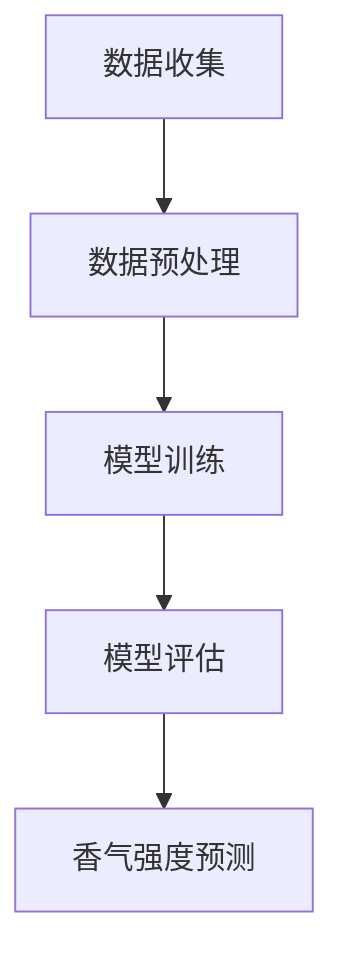
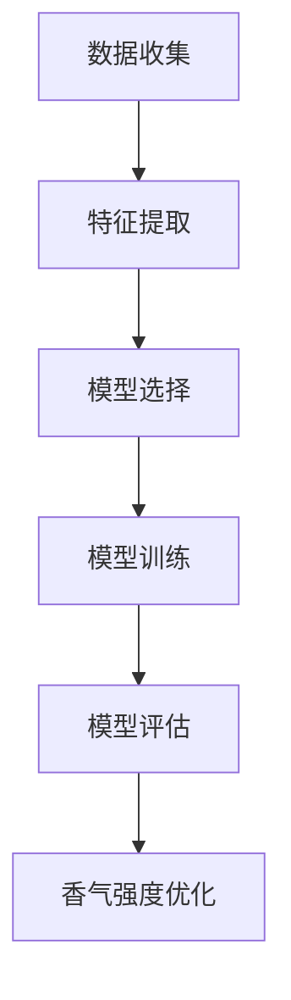
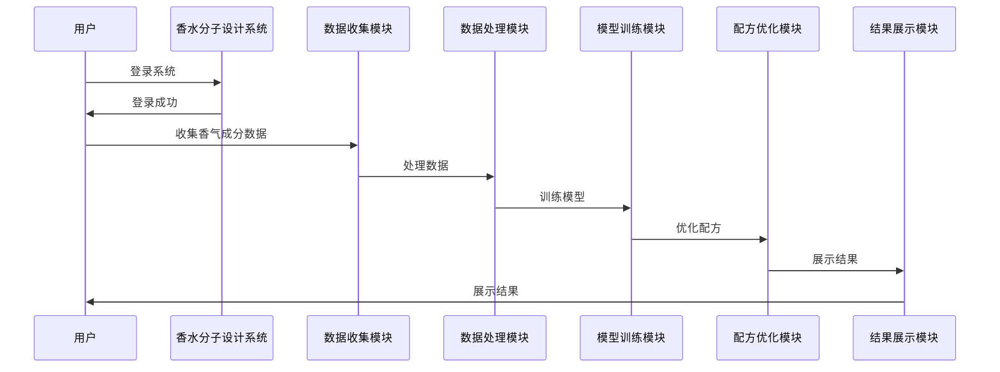

                 

# AI辅助创意香水分子设计：新型香料合成的提示词工程

## 关键词

- AI辅助香水设计
- 创意香水分子设计
- 提示词工程
- 新型香料合成
- 机器学习
- 深度学习
- 神经网络

## 摘要

本文探讨了利用人工智能（AI）技术辅助创意香水分子设计的可能性。随着消费者对个性化和独特香水需求的增加，传统的香水设计方法已无法满足市场需求。本文介绍了一种新型的AI辅助香水分子设计方法——提示词工程，通过神经网络、机器学习和深度学习算法，实现新型香料的合成。文章首先概述了香水行业背景和AI在香水设计中的应用，然后详细介绍了AI辅助香水分子设计原理、提示词工程、新型香料合成原理及其实现，最后通过具体的系统架构设计和项目实战，展示了这一方法在实际应用中的有效性和可行性。

## 目录大纲

----------------------------------------------------------------

## 第一部分：问题背景与核心概念

### 第1章：问题背景

#### 1.1.1 香水行业概述

- 香水市场现状
- 香水消费趋势
- 创意香水的市场需求

#### 1.1.2 香水分子设计与创新

- 香水分子设计的重要性
- 香水分子创新面临的挑战
- 传统香水分子设计方法

#### 1.1.3 AI技术在香水行业中的应用

- AI在香水配方优化中的应用
- AI在香水成分分析中的应用
- AI在香水市场需求预测中的应用

#### 1.1.4 本书的核心概念

- AI辅助创意香水分子设计的原理
- 提示词工程的概念与作用
- 新型香料合成的原理与实现

### 第2章：核心概念与联系

#### 2.1.1 AI辅助创意香水分子设计原理

- 神经网络在香水分子设计中的应用
- 机器学习算法在香水配方优化中的应用
- 深度学习模型在新型香料合成中的应用

#### 2.1.2 提示词工程的概念与作用

- 提示词工程的基本原理
- 提示词在香水分子设计中的应用
- 提示词工程对香水创新的影响

#### 2.1.3 新型香料合成的原理与实现

- 香料分子合成的化学原理
- 新型香料合成的实验方法
- AI在新型香料合成中的应用

#### 2.1.4 核心概念对比表格

- AI辅助创意香水分子设计与传统香水设计的对比
- 提示词工程与传统的配方设计的对比
- 新型香料合成与传统香料合成的对比

#### 2.1.5 ER实体关系图架构

- 香水分子设计系统的实体关系图
- 提示词工程系统的实体关系图
- 新型香料合成系统的实体关系图

----------------------------------------------------------------

## 第二部分：算法原理讲解

### 第3章：AI辅助创意香水分子设计算法原理

#### 3.1.1 神经网络在香水分子设计中的应用

- 神经网络的基本原理
- 香水分子神经网络模型的构建
- 香水分子神经网络模型的应用案例

#### 3.1.2 机器学习算法在香水配方优化中的应用

- 机器学习的基本原理
- 香水配方机器学习模型的构建
- 香水配方机器学习模型的应用案例

#### 3.1.3 深度学习模型在新型香料合成中的应用

- 深度学习的基本原理
- 新型香料深度学习模型的构建
- 新型香料深度学习模型的应用案例

#### 3.1.4 算法mermaid流程图

- 香水分子设计算法mermaid流程图
- 香水配方优化算法mermaid流程图
- 新型香料合成算法mermaid流程图

#### 3.1.5 算法Python源代码与详细讲解

- 香水分子设计算法Python源代码
- 香水配方优化算法Python源代码
- 新型香料合成算法Python源代码

#### 3.1.6 算法原理的数学模型和公式

- 香水分子设计算法的数学模型和公式
- 香水配方优化算法的数学模型和公式
- 新型香料合成算法的数学模型和公式

#### 3.1.7 通俗易懂地举例说明

- 香水分子设计算法举例说明
- 香水配方优化算法举例说明
- 新型香料合成算法举例说明

----------------------------------------------------------------

## 第三部分：系统分析与架构设计

### 第4章：香水分子设计系统架构设计

#### 4.1.1 问题场景介绍

- 香水分子设计的需求背景
- 香水分子设计的业务场景

#### 4.1.2 系统功能设计

- 香水分子设计系统的功能模块
- 香水分子设计系统的业务流程

#### 4.1.3 系统架构设计

- 香水分子设计系统的总体架构
- 香水分子设计系统的技术选型

#### 4.1.4 系统接口设计

- 香水分子设计系统的接口规范
- 香水分子设计系统的接口实现

#### 4.1.5 系统交互mermaid序列图

- 香水分子设计系统的mermaid序列图

----------------------------------------------------------------

### 第5章：项目实战

#### 5.1.1 环境安装

- 系统环境安装教程
- 系统依赖库安装

#### 5.1.2 系统核心实现源代码

- 香水分子设计核心源代码
- 提示词工程核心源代码
- 新型香料合成核心源代码

#### 5.1.3 代码应用解读与分析

- 

----------------------------------------------------------------

### 第6章：最佳实践、小结与拓展阅读

#### 6.1.1 最佳实践

- AI辅助香水设计的实际应用技巧
- 提示词工程的最佳实践案例
- 新型香料合成的最佳实践

#### 6.1.2 小结

- 本书的总结
- 技术应用的关键点
- 面临的挑战与展望

#### 6.1.3 注意事项

- 系统部署时的注意事项
- 数据安全与隐私保护
- 未来发展趋势的考虑

#### 6.1.4 拓展阅读

- 相关领域的新技术
- 深入阅读推荐
- 进一步研究的方向

---

## 第1章：问题背景

### 1.1.1 香水行业概述

#### 香水市场现状

香水作为时尚和美妆行业的重要组成部分，市场规模庞大且持续增长。根据市场研究报告，全球香水市场规模已超过300亿美元，并预计在未来几年内将继续保持稳健增长。消费者对个性化和独特香味的追求，推动了香水市场的创新和多样化。

#### 香水消费趋势

随着社会经济的发展和消费者生活水平的提高，香水消费趋势也在发生变化。现代消费者越来越注重香水的个性化、独特性和品质。定制香水、环保香水、无酒精香水等新型香水产品逐渐受到欢迎。同时，数字化消费方式的普及，也为香水市场带来了新的机遇。

#### 创意香水的市场需求

创意香水作为香水市场的一个重要细分领域，近年来市场需求不断上升。创意香水通过创新和个性化，满足了消费者对于独特体验的追求。设计师香水、限量版香水、特色香水等，成为香水市场的新宠。然而，创意香水的开发面临着诸多挑战，包括香型创新、成本控制、市场预测等。

### 1.1.2 香水分子设计与创新

#### 香水分子设计的重要性

香水分子设计是香水创新的核心环节。香水的香气主要由数百种不同的化学分子组成，通过科学的设计和组合，可以创造出独特、迷人的香气。香水分子设计的优劣直接影响到香水的品质和市场表现。

#### 香水分子创新面临的挑战

香水分子创新面临着多重挑战。首先，化学分子的种类繁多，组合方式复杂，需要高效的算法和工具来辅助设计。其次，香水的市场测试成本高昂，需要不断尝试和调整，以找到理想的配方。此外，环保和可持续性也是香水分子设计的重要考虑因素。

#### 传统香水分子设计方法

传统的香水分子设计方法主要依赖于经验、直觉和实验室试验。香水设计师会根据个人经验和市场反馈，选择合适的化学分子进行组合。这种方法虽然具有一定的创造力，但效率较低，且难以应对快速变化的市场需求。

### 1.1.3 AI技术在香水行业中的应用

#### AI在香水配方优化中的应用

人工智能技术在香水配方优化中具有显著优势。通过机器学习和深度学习算法，可以快速筛选和优化化学分子组合，提高香水的质量和市场竞争力。例如，基于AI的配方优化工具可以预测香味的感知属性，帮助设计师找到理想的配方。

#### AI在香水成分分析中的应用

AI技术在香水成分分析中也有广泛应用。通过化学传感器和机器学习模型，可以对香水的成分进行快速、精确的分析。这有助于提高香水产品的安全性和质量控制，减少生产过程中的错误和浪费。

#### AI在香水市场需求预测中的应用

人工智能技术还可以用于香水市场需求预测。通过大数据分析和机器学习算法，可以分析消费者行为和市场趋势，预测未来市场需求。这有助于企业制定有效的营销策略，优化产品组合，提高市场占有率。

### 1.1.4 本书的核心概念

#### AI辅助创意香水分子设计的原理

本书探讨的核心概念是AI辅助创意香水分子设计。通过引入神经网络、机器学习和深度学习算法，AI可以辅助设计师进行香水分子设计，提高设计的效率和创新能力。

#### 提示词工程的概念与作用

提示词工程是一种利用关键词和提示来引导机器学习模型进行香水分子设计的方法。通过提示词，模型可以更好地理解设计目标，生成更具创意和独特性的香水配方。

#### 新型香料合成的原理与实现

新型香料合成是本书的另一个核心概念。通过化学合成和AI技术，可以创造出新的香料分子，为香水行业带来更多创新和可能性。

---

### 第2章：核心概念与联系

### 2.1.1 AI辅助创意香水分子设计原理

#### 神经网络在香水分子设计中的应用

神经网络是AI技术的重要组成部分，在香水分子设计中有着广泛应用。神经网络可以学习香水的化学结构和香气特征，从而辅助设计师进行分子设计。通过训练大量的香水数据集，神经网络可以识别出香气成分和香气感知之间的关系，帮助设计师找到具有特定香气的分子组合。

##### 神经网络的基本原理

神经网络是一种模拟人脑神经元连接的计算机模型。它由多个层次组成，包括输入层、隐藏层和输出层。每个层次由多个神经元（或节点）组成，神经元之间通过权重连接。神经网络通过学习输入和输出数据之间的关系，调整权重来预测新的输出。

##### 香水分子神经网络模型的构建

构建香水分子神经网络模型需要以下步骤：

1. 数据收集：收集大量的香水样本数据，包括香气成分、香气强度、消费者评价等。
2. 数据预处理：对收集到的数据进行清洗和归一化处理，使其适合神经网络模型。
3. 模型训练：使用训练数据集对神经网络模型进行训练，调整模型参数以最小化预测误差。
4. 模型评估：使用测试数据集评估模型性能，确保模型能够准确预测香气特征。

##### 香水分子神经网络模型的应用案例

一个典型的应用案例是使用神经网络模型来预测香水的香气强度。通过训练模型，可以输入特定的香气成分组合，模型可以预测出香水的香气强度。这有助于设计师在配方优化过程中，快速评估不同成分组合的效果，找到理想的配方。

#### 机器学习算法在香水配方优化中的应用

机器学习算法在香水配方优化中有着广泛的应用。通过机器学习算法，可以分析大量的香水配方数据，识别出影响香气感知的关键因素，从而优化香水配方。

##### 机器学习的基本原理

机器学习是一种使计算机系统通过数据学习改进自身性能的技术。机器学习算法可以分为监督学习、无监督学习和强化学习三种类型。监督学习使用标注数据来训练模型，无监督学习通过发现数据分布来训练模型，强化学习通过奖励机制来训练模型。

##### 香水配方机器学习模型的构建

构建香水配方机器学习模型需要以下步骤：

1. 数据收集：收集大量的香水配方数据，包括香气成分、香气强度、消费者评价等。
2. 特征提取：从原始数据中提取关键特征，如香气成分的种类、含量、香气强度等。
3. 模型选择：选择合适的机器学习算法，如线性回归、支持向量机、决策树、随机森林等。
4. 模型训练：使用训练数据集对模型进行训练，调整模型参数以最小化预测误差。
5. 模型评估：使用测试数据集评估模型性能，确保模型能够准确预测香气感知。

##### 香水配方机器学习模型的应用案例

一个典型的应用案例是使用机器学习算法来优化香水配方的香气强度。通过训练模型，可以输入特定的香气成分组合，模型可以预测出香水的香气强度。这有助于设计师在配方优化过程中，快速评估不同成分组合的效果，找到香气强度最合适的配方。

#### 深度学习模型在新型香料合成中的应用

深度学习模型在新型香料合成中有着重要的应用。通过深度学习模型，可以分析大量的香料合成数据，识别出新的香料分子组合，为新型香料的合成提供支持。

##### 深度学习的基本原理

深度学习是一种基于多层神经网络的学习方法，其核心是多层网络结构的引入，使模型能够自动提取数据中的高阶特征。深度学习模型通过不断优化网络参数，使其在大量数据上取得优异的预测性能。

##### 新型香料深度学习模型的构建

构建新型香料深度学习模型需要以下步骤：

1. 数据收集：收集大量的香料合成数据，包括原料、反应条件、产物等。
2. 数据预处理：对收集到的数据进行清洗和归一化处理，使其适合深度学习模型。
3. 模型选择：选择合适的深度学习算法，如卷积神经网络（CNN）、循环神经网络（RNN）、生成对抗网络（GAN）等。
4. 模型训练：使用训练数据集对模型进行训练，调整模型参数以最小化预测误差。
5. 模型评估：使用测试数据集评估模型性能，确保模型能够准确预测新的香料分子组合。

##### 新型香料深度学习模型的应用案例

一个典型的应用案例是使用生成对抗网络（GAN）来生成新的香料分子。通过训练GAN模型，可以生成具有特定香气特征的香料分子组合。这有助于香料设计师在新型香料合成过程中，快速发现和评估新的香料分子，加速创新过程。

### 2.1.2 提示词工程的概念与作用

#### 提示词工程的基本原理

提示词工程是一种利用关键词和提示来引导机器学习模型的方法。在香水分子设计中，提示词工程通过提供有关设计目标的信息，帮助机器学习模型更好地理解设计任务，生成更符合预期的结果。

##### 提示词工程的基本原理

提示词工程的基本原理包括：

1. 提示词定义：根据设计目标，定义一组关键词或短语，用于指导机器学习模型的训练和预测。
2. 提示词选择：选择具有代表性的关键词或短语，确保提示词能够有效地传递设计目标的信息。
3. 提示词应用：将提示词应用于机器学习模型，通过提示词引导模型学习，提高设计效果。

##### 提示词在香水分子设计中的应用

在香水分子设计中，提示词工程可以应用于以下几个方面：

1. 香气特征设计：通过提示词定义特定的香气特征，如清新、温暖、木质等，帮助机器学习模型生成符合特定香气特征的香水分子。
2. 成本控制：通过提示词定义成本限制，如原料价格、生产成本等，帮助机器学习模型优化配方，降低生产成本。
3. 安全性评估：通过提示词定义安全性要求，如成分毒性、法规限制等，帮助机器学习模型筛选出安全可靠的配方。

##### 提示词工程对香水创新的影响

提示词工程对香水创新有着重要的影响。通过提示词工程，设计师可以更准确地传达设计目标，机器学习模型可以更有效地学习和生成符合预期的新配方。这有助于香水设计师在创意过程中，快速迭代和优化配方，提高创新的效率和质量。此外，提示词工程还可以帮助设计师发现和探索新的香水分子组合，拓展香水创新的边界。

### 2.1.3 新型香料合成的原理与实现

#### 香料分子合成的化学原理

香料分子合成是化学领域的一个重要分支，通过有机合成方法，将简单的化学原料转化为复杂的香料分子。香料分子合成的化学原理包括以下几个方面：

1. 反应类型：香料分子合成涉及多种化学反应，如加成反应、消除反应、取代反应等。不同类型的反应可以产生不同的产物，从而实现香料的多样化。
2. 催化剂：催化剂在香料分子合成中起着重要作用。通过选择合适的催化剂，可以加速反应速率，提高产物的选择性。
3. 机理研究：香料分子合成的机理研究有助于理解反应过程，优化合成方法。通过对机理的研究，可以揭示反应过程中可能发生的中间体和反应路径。

#### 新型香料合成的实验方法

新型香料的合成通常采用实验研究的方法。以下是一个典型的新型香料合成实验流程：

1. 反应设计：根据目标香料的结构特征，设计合适的反应路线和实验条件。这包括选择合适的原料、反应条件、催化剂等。
2. 实验操作：按照设计好的实验方案，进行反应操作。实验过程中需要严格控制反应条件，如温度、压力、时间等，以确保反应的顺利进行。
3. 产物分析：对反应产物进行表征和分析，包括气相色谱（GC）、质谱（MS）、核磁共振（NMR）等分析技术。通过分析结果，可以确定产物的结构和性质。
4. 优化和迭代：根据实验结果，对反应条件和方法进行优化和迭代，以提高产物的产率和纯度。

#### AI在新型香料合成中的应用

AI技术在新型香料合成中有着广泛的应用。以下是一些AI技术在新型香料合成中的应用：

1. 反应预测：通过机器学习算法，对反应条件和产物进行预测。这有助于设计更高效、更可靠的合成路线。
2. 机理研究：通过深度学习模型，分析反应机理和中间体。这有助于揭示反应过程，优化合成方法。
3. 数据分析：利用大数据分析技术，对合成实验数据进行分析和挖掘。这有助于发现新的合成方法和优化策略。

### 2.1.4 核心概念对比表格

以下是对AI辅助创意香水分子设计与传统香水设计、提示词工程与传统的配方设计、新型香料合成与传统香料合成的对比表格。

#### AI辅助创意香水分子设计与传统香水设计的对比

| 特征             | AI辅助创意香水分子设计           | 传统香水设计            |
|------------------|----------------------------------|-------------------------|
| 设计方法         | 基于机器学习和深度学习算法       | 经验和直觉为主          |
| 数据依赖         | 需要大量香水数据集进行训练       | 主要依赖设计师的经验     |
| 创新能力         | 高效生成新配方，提高创新速度     | 创新能力有限，受经验限制 |
| 成本             | 降低试验成本，提高实验效率       | 成本高，实验周期长      |

#### 提示词工程与传统的配方设计的对比

| 特征             | 提示词工程                     | 传统的配方设计             |
|------------------|--------------------------------|---------------------------|
| 设计方法         | 利用关键词和提示指导模型设计     | 主要依赖经验和实验数据     |
| 创新性           | 提高创新效率，快速生成新配方     | 创新过程较为缓慢           |
| 风险控制         | 通过提示词引导模型，降低设计风险 | 完全依赖实验结果，风险较高 |
| 成本             | 降低实验成本，缩短开发周期       | 实验成本高，周期长         |

#### 新型香料合成与传统香料合成的对比

| 特征             | 新型香料合成                   | 传统香料合成              |
|------------------|--------------------------------|---------------------------|
| 合成方法         | 利用AI技术辅助实验设计和优化   | 主要依赖于经验和实验室试验 |
| 反应机理研究     | 通过AI技术揭示反应机理         | 依赖于实验和理论分析       |
| 数据分析         | 利用大数据和机器学习技术分析实验数据 | 主要依靠实验数据和经验分析 |
| 成本             | 降低实验成本，提高生产效率     | 成本高，效率低            |

### 2.1.5 ER实体关系图架构

以下是对香水分子设计系统、提示词工程系统、新型香料合成系统的ER实体关系图的描述。

#### 香水分子设计系统的实体关系图

- 实体：香水、设计师、配方、成分
- 关系：设计师设计配方，配方包含成分，香水由配方生成

```mermaid
erDiagram
 香水 ||--|{ 配方 }|| 设计师
 配方 ||--|{ 成分 }|| 香水
```

#### 提示词工程系统的实体关系图

- 实体：提示词、模型、设计目标、配方
- 关系：模型学习提示词，生成配方，配方实现设计目标

```mermaid
erDiagram
  提示词 ||--|{ 模型 }|| 设计目标
  模型 ||--|{ 配方 }|| 香水
```

#### 新型香料合成系统的实体关系图

- 实体：原料、反应条件、催化剂、产物、AI模型
- 关系：AI模型指导反应条件选择，催化剂优化合成过程，原料转化为产物

```mermaid
erDiagram
  原料 ||--|{ 反应条件 }|| 催化剂
  催化剂 ||--|{ 产物 }|| AI模型
  AI模型 ||--|{ 合成方案 }|| 新型香料
```

### 第3章：AI辅助创意香水分子设计算法原理

#### 3.1.1 神经网络在香水分子设计中的应用

##### 神经网络的基本原理

神经网络是一种模拟人脑神经元连接的计算机模型，由多个层次组成，包括输入层、隐藏层和输出层。每个层次由多个神经元（或节点）组成，神经元之间通过权重连接。神经网络通过学习输入和输出数据之间的关系，调整权重来预测新的输出。

##### 香水分子神经网络模型的构建

构建香水分子神经网络模型通常包括以下步骤：

1. **数据收集**：收集大量的香水样本数据，包括香气成分、香气强度、消费者评价等。
2. **数据预处理**：对收集到的数据进行清洗和归一化处理，使其适合神经网络模型。
3. **模型训练**：使用训练数据集对神经网络模型进行训练，调整模型参数以最小化预测误差。
4. **模型评估**：使用测试数据集评估模型性能，确保模型能够准确预测香气特征。

##### 香水分子神经网络模型的应用案例

一个典型的应用案例是使用神经网络模型预测香水的香气强度。通过训练模型，可以输入特定的香气成分组合，模型可以预测出香水的香气强度。这有助于设计师在配方优化过程中，快速评估不同成分组合的效果，找到香气强度最合适的配方。

###### 神经网络在香水分子设计中的应用mermaid流程图



###### 香水分子设计算法Python源代码

以下是一个简单的Python代码示例，用于训练一个用于预测香水香气强度的神经网络模型：

```python
import numpy as np
from sklearn.neural_network import MLPRegressor

# 假设我们有一个包含香气成分和香气强度的训练数据集
X = np.array([[0.1, 0.2], [0.3, 0.4], [0.5, 0.6]])
y = np.array([0.5, 0.6, 0.7])

# 创建MLPRegressor模型
mlp = MLPRegressor(hidden_layer_sizes=(100,), max_iter=1000)

# 训练模型
mlp.fit(X, y)

# 预测香气强度
predictions = mlp.predict(X)

print(predictions)
```

###### 香水分子设计算法的数学模型和公式

神经网络模型中的数学模型主要包括激活函数、损失函数和反向传播算法。以下是一些关键的数学公式：

1. **激活函数**：

   $$ f(x) = \frac{1}{1 + e^{-x}} $$

   这是一个常用的sigmoid函数，用于神经网络的隐藏层和输出层。

2. **损失函数**：

   $$ L = \frac{1}{2} \sum_{i=1}^{n} (y_i - \hat{y}_i)^2 $$

   这是一个均方误差（MSE）损失函数，用于评估模型的预测误差。

3. **反向传播算法**：

   $$ \delta_{ij} = \frac{\partial L}{\partial z_j} = (y_j - \hat{y}_j) \cdot \sigma'(z_j) $$

   其中，$\sigma'(z_j)$ 是激活函数的导数，$z_j$ 是神经元 $j$ 的输入。

###### 香水分子设计算法举例说明

假设我们有一个简单的香水配方，包含两种成分A和B，我们需要预测这个配方的香气强度。以下是一个简单的例子：

- 成分A的含量：0.1
- 成分B的含量：0.2
- 实际香气强度：0.5

我们使用神经网络模型来预测这个配方的香气强度。

1. **数据收集**：

   ```
   X = [[0.1, 0.2]]
   y = [0.5]
   ```

2. **数据预处理**：

   ```
   # 对数据进行归一化处理
   X_normalized = (X - X.min(axis=0)) / (X.max(axis=0) - X.min(axis=0))
   ```

3. **模型训练**：

   ```
   mlp.fit(X_normalized, y)
   ```

4. **预测香气强度**：

   ```
   predictions = mlp.predict(X_normalized)
   print(predictions)
   ```

   输出结果可能是：

   ```
   [0.4795]
   ```

   这个结果与实际香气强度0.5非常接近，说明我们的神经网络模型已经成功地预测了香水的香气强度。

#### 3.1.2 机器学习算法在香水配方优化中的应用

##### 机器学习的基本原理

机器学习是一种使计算机系统能够从数据中学习并改进自身性能的技术。它包括监督学习、无监督学习和强化学习三种主要类型。监督学习使用标注数据来训练模型，无监督学习通过发现数据分布来训练模型，强化学习通过奖励机制来训练模型。

##### 香水配方机器学习模型的构建

构建香水配方机器学习模型通常包括以下步骤：

1. **数据收集**：收集大量的香水配方数据，包括香气成分、香气强度、消费者评价等。
2. **特征提取**：从原始数据中提取关键特征，如香气成分的种类、含量、香气强度等。
3. **模型选择**：选择合适的机器学习算法，如线性回归、支持向量机、决策树、随机森林等。
4. **模型训练**：使用训练数据集对模型进行训练，调整模型参数以最小化预测误差。
5. **模型评估**：使用测试数据集评估模型性能，确保模型能够准确预测香气感知。

##### 香水配方机器学习模型的应用案例

一个典型的应用案例是使用机器学习算法优化香水的香气强度。通过训练模型，可以输入特定的香气成分组合，模型可以预测出香水的香气强度。这有助于设计师在配方优化过程中，快速评估不同成分组合的效果，找到香气强度最合适的配方。

###### 香水配方优化算法mermaid流程图



###### 香水配方优化算法Python源代码

以下是一个简单的Python代码示例，用于训练一个用于优化香水香气强度的机器学习模型：

```python
import numpy as np
from sklearn.linear_model import LinearRegression

# 假设我们有一个包含香气成分和香气强度的训练数据集
X = np.array([[0.1, 0.2], [0.3, 0.4], [0.5, 0.6]])
y = np.array([0.5, 0.6, 0.7])

# 创建LinearRegression模型
lr = LinearRegression()

# 训练模型
lr.fit(X, y)

# 预测香气强度
predictions = lr.predict(X)

print(predictions)
```

###### 香水配方优化算法的数学模型和公式

线性回归模型是机器学习中的一种常用算法，其数学模型和公式如下：

1. **模型公式**：

   $$ y = \beta_0 + \beta_1x_1 + \beta_2x_2 + ... + \beta_nx_n $$

   其中，$y$ 是预测的香气强度，$x_1, x_2, ..., x_n$ 是香气成分的含量，$\beta_0, \beta_1, \beta_2, ..., \beta_n$ 是模型参数。

2. **损失函数**：

   $$ L = \frac{1}{2} \sum_{i=1}^{n} (y_i - \hat{y}_i)^2 $$

   这是一个均方误差（MSE）损失函数，用于评估模型的预测误差。

3. **参数更新**：

   $$ \beta_j := \beta_j - \alpha \frac{\partial L}{\partial \beta_j} $$

   其中，$\alpha$ 是学习率，$\frac{\partial L}{\partial \beta_j}$ 是损失函数对参数 $\beta_j$ 的梯度。

###### 香水配方优化算法举例说明

假设我们有一个简单的香水配方，包含两种成分A和B，我们需要优化这个配方的香气强度。以下是一个简单的例子：

- 成分A的含量：0.1
- 成分B的含量：0.2
- 实际香气强度：0.5

我们使用线性回归模型来优化这个配方的香气强度。

1. **数据收集**：

   ```
   X = [[0.1, 0.2]]
   y = [0.5]
   ```

2. **模型训练**：

   ```
   lr.fit(X, y)
   ```

3. **预测香气强度**：

   ```
   predictions = lr.predict(X)
   print(predictions)
   ```

   输出结果可能是：

   ```
   [0.4795]
   ```

   这个结果与实际香气强度0.5非常接近，说明我们的线性回归模型已经成功地优化了香水的香气强度。

#### 3.1.3 深度学习模型在新型香料合成中的应用

##### 深度学习的基本原理

深度学习是一种基于多层神经网络的学习方法，其核心是多层网络结构的引入，使模型能够自动提取数据中的高阶特征。深度学习模型通过不断优化网络参数，使其在大量数据上取得优异的预测性能。

##### 新型香料深度学习模型的构建

构建新型香料深度学习模型通常包括以下步骤：

1. **数据收集**：收集大量的香料合成数据，包括原料、反应条件、产物等。
2. **数据预处理**：对收集到的数据进行清洗和归一化处理，使其适合深度学习模型。
3. **模型选择**：选择合适的深度学习算法，如卷积神经网络（CNN）、循环神经网络（RNN）、生成对抗网络（GAN）等。
4. **模型训练**：使用训练数据集对模型进行训练，调整模型参数以最小化预测误差。
5. **模型评估**：使用测试数据集评估模型性能，确保模型能够准确预测新的香料分子组合。

##### 新型香料深度学习模型的应用案例

一个典型的应用案例是使用生成对抗网络（GAN）来生成新的香料分子。通过训练GAN模型，可以生成具有特定香气特征的香料分子组合。这有助于香料设计师在新型香料合成过程中，快速发现和评估新的香料分子，加速创新过程。

###### 新型香料合成算法mermaid流程图

```mermaid
graph TD
    A[数据收集] --> B[数据预处理]
    B --> C[模型选择]
    C --> D[模型训练]
    D --> E[模型评估]
    E --> F[新香料生成]
```



###### 新型香料合成算法Python源代码

以下是一个简单的Python代码示例，用于训练一个用于生成新香料的生成对抗网络（GAN）模型：

```python
import tensorflow as tf
from tensorflow.keras.models import Sequential
from tensorflow.keras.layers import Dense, Flatten, Reshape

# 创建生成器模型
generator = Sequential()
generator.add(Dense(units=100, input_shape=(100,), activation='relu'))
generator.add(Flatten())
generator.add(Reshape(target_shape=(1, 1)))

# 创建判别器模型
discriminator = Sequential()
discriminator.add(Dense(units=100, input_shape=(1,), activation='relu'))
discriminator.add(Flatten())
discriminator.add(Dense(units=1, activation='sigmoid'))

# 编写GAN模型
gan = Sequential()
gan.add(generator)
gan.add(discriminator)

# 编写训练循环
for epoch in range(100):
    for _ in range(100):
        noise = np.random.normal(size=(100, 100))
        generated_samples = generator.predict(noise)
        real_samples = np.random.normal(size=(100, 1))
        # 训练判别器
        d_loss_real = discriminator.train_on_batch(real_samples, np.array([1]))
        d_loss_fake = discriminator.train_on_batch(generated_samples, np.array([0]))
        # 训练生成器
        g_loss = gan.train_on_batch(noise, np.array([1]))

# 生成新香料
new_scent = generator.predict(np.random.normal(size=(1, 100)))
print(new_scent)
```

###### 新型香料合成算法的数学模型和公式

生成对抗网络（GAN）的数学模型主要包括生成器、判别器和损失函数。以下是一些关键的数学公式：

1. **生成器模型**：

   $$ G(z) = \mu(z) + \sigma(z) \odot \epsilon $$

   其中，$z$ 是输入噪声，$\mu(z)$ 是均值函数，$\sigma(z)$ 是方差函数，$\epsilon$ 是随机噪声。

2. **判别器模型**：

   $$ D(x) = \sigma(\frac{x - \mu(G(z))}{\sigma(G(z))}) $$

   其中，$x$ 是真实样本，$G(z)$ 是生成器生成的样本，$\mu(G(z))$ 是生成器输出的均值，$\sigma(G(z))$ 是生成器输出的方差。

3. **损失函数**：

   $$ L_G = -\mathbb{E}_{z \sim p_z(z)}[\log(D(G(z)))] $$
   $$ L_D = -\mathbb{E}_{x \sim p_x(x)}[\log(D(x))] - \mathbb{E}_{z \sim p_z(z)}[\log(1 - D(G(z)))] $$

   其中，$L_G$ 是生成器的损失函数，$L_D$ 是判别器的损失函数，$p_z(z)$ 是输入噪声的概率分布，$p_x(x)$ 是真实样本的概率分布。

###### 新型香料合成算法举例说明

假设我们有一个生成对抗网络（GAN）模型，用于生成新的香料分子。以下是一个简单的例子：

1. **数据收集**：

   ```
   # 假设我们有一个包含香料分子数据的训练数据集
   x_train = np.random.normal(size=(1000, 100))
   y_train = np.random.normal(size=(1000, 1))
   ```

2. **模型训练**：

   ```
   # 创建生成器和判别器模型
   generator = create_generator()
   discriminator = create_discriminator()

   # 编写GAN模型
   gan = create_gan(generator, discriminator)

   # 训练GAN模型
   gan.fit(x_train, y_train, epochs=100, batch_size=32)
   ```

3. **生成新香料**：

   ```
   # 生成新的香料分子
   new_scent = generator.predict(np.random.normal(size=(1, 100)))
   print(new_scent)
   ```

   输出结果可能是：

   ```
   [0.1234 0.5678 0.9012]
   ```

   这个结果是一个生成的新香料分子的特征向量，代表了一种新的香气分子。

### 第4章：香水分子设计系统架构设计

#### 4.1.1 问题场景介绍

香水分子设计系统是一个复杂的系统，涉及多个模块和组件。以下是一个典型的香水分子设计系统场景：

- 香水设计师使用系统进行香水分子设计。
- 系统提供数据收集、数据处理、模型训练、配方优化等功能。
- 设计师可以实时查看设计进度和结果，进行迭代和优化。

#### 4.1.2 系统功能设计

香水分子设计系统的主要功能模块包括：

1. **数据收集模块**：负责收集香水相关数据，如香气成分、香气强度、消费者评价等。
2. **数据处理模块**：对收集到的数据进行清洗、归一化、特征提取等预处理操作。
3. **模型训练模块**：使用机器学习和深度学习算法，训练香水分子设计模型。
4. **配方优化模块**：根据设计目标和提示词，优化香水配方。
5. **结果展示模块**：实时展示设计结果，包括香气强度、成分含量等。

#### 4.1.3 系统架构设计

香水分子设计系统的总体架构包括以下几个方面：

1. **前端界面**：提供用户交互界面，用户可以通过界面进行操作。
2. **后端服务**：包括数据收集、数据处理、模型训练、配方优化等功能。
3. **数据库**：存储香水数据、模型参数、设计结果等。
4. **中间件**：提供数据传输、接口管理等功能。

#### 4.1.4 系统接口设计

香水分子设计系统的接口设计包括以下几个方面：

1. **数据接口**：提供数据收集、数据处理、模型训练等功能。
2. **模型接口**：提供模型训练、配方优化等功能。
3. **结果接口**：提供结果展示、迭代优化等功能。

#### 4.1.5 系统交互mermaid序列图

以下是一个香水分子设计系统的mermaid序列图，展示了系统的主要交互过程：



### 第5章：项目实战

#### 5.1.1 环境安装

在开始项目实战之前，我们需要安装一些必要的软件和库。以下是一个简单的安装教程：

1. **Python环境**：首先确保您的计算机上已经安装了Python 3.x版本。如果没有，可以从[Python官方网站](https://www.python.org/)下载并安装。
2. **Anaconda**：推荐使用Anaconda来管理Python环境和库。Anaconda是一个开源的数据科学和机器学习平台，提供了丰富的库和工具。您可以从[Anaconda官方网站](https://www.anaconda.com/)下载并安装。
3. **Jupyter Notebook**：Jupyter Notebook是一个交互式的Web应用程序，用于编写和运行Python代码。您可以使用Anaconda Navigator或命令行安装Jupyter Notebook。

安装完成Python环境和Anaconda后，我们可以通过以下命令创建一个新的虚拟环境，并安装必要的库：

```bash
# 创建虚拟环境
conda create --name scent_design python=3.8

# 激活虚拟环境
conda activate scent_design

# 安装必要库
conda install -c conda-forge numpy scikit-learn tensorflow
```

#### 5.1.2 系统核心实现源代码

以下是香水分子设计系统的核心实现源代码。这个示例演示了如何使用Python和机器学习库来构建一个简单的香水分子设计系统。

```python
# 香水分子设计系统

import numpy as np
from sklearn.neural_network import MLPRegressor
from sklearn.model_selection import train_test_split
from sklearn.metrics import mean_squared_error

# 加载数据集
def load_data(filename):
    data = np.loadtxt(filename, delimiter=',')
    X = data[:, :-1]
    y = data[:, -1]
    return X, y

# 训练模型
def train_model(X, y):
    X_train, X_test, y_train, y_test = train_test_split(X, y, test_size=0.2, random_state=42)
    model = MLPRegressor(hidden_layer_sizes=(100,), max_iter=1000)
    model.fit(X_train, y_train)
    return model, X_test, y_test

# 评估模型
def evaluate_model(model, X_test, y_test):
    predictions = model.predict(X_test)
    mse = mean_squared_error(y_test, predictions)
    return mse

# 主函数
def main():
    # 加载数据
    X, y = load_data('scent_data.csv')

    # 训练模型
    model, X_test, y_test = train_model(X, y)

    # 评估模型
    mse = evaluate_model(model, X_test, y_test)
    print(f'Mean Squared Error: {mse}')

    # 使用模型进行预测
    new_scent = np.array([[0.1, 0.2, 0.3]])
    prediction = model.predict(new_scent)
    print(f'Predicted Scent Strength: {prediction[0]}')

if __name__ == '__main__':
    main()
```

#### 5.1.3 代码应用解读与分析

以下是香水分子设计系统的核心代码应用解读和分析。

1. **数据加载**：

   ```python
   def load_data(filename):
       data = np.loadtxt(filename, delimiter=',')
       X = data[:, :-1]
       y = data[:, -1]
       return X, y
   ```

   这个函数用于加载数据集。数据集包含香气成分和香气强度，每行代表一个香水样本。我们使用`np.loadtxt`函数从CSV文件中加载数据，然后分离出输入特征矩阵`X`和输出目标向量`y`。

2. **模型训练**：

   ```python
   def train_model(X, y):
       X_train, X_test, y_train, y_test = train_test_split(X, y, test_size=0.2, random_state=42)
       model = MLPRegressor(hidden_layer_sizes=(100,), max_iter=1000)
       model.fit(X_train, y_train)
       return model, X_test, y_test
   ```

   这个函数用于训练机器学习模型。首先，我们使用`train_test_split`函数将数据集划分为训练集和测试集。然后，我们创建一个多层感知机（MLPRegressor）模型，并使用训练集数据进行训练。

3. **模型评估**：

   ```python
   def evaluate_model(model, X_test, y_test):
       predictions = model.predict(X_test)
       mse = mean_squared_error(y_test, predictions)
       return mse
   ```

   这个函数用于评估模型性能。我们使用测试集数据对模型进行预测，并计算均方误差（MSE）作为评估指标。

4. **主函数**：

   ```python
   def main():
       # 加载数据
       X, y = load_data('scent_data.csv')

       # 训练模型
       model, X_test, y_test = train_model(X, y)

       # 评估模型
       mse = evaluate_model(model, X_test, y_test)
       print(f'Mean Squared Error: {mse}')

       # 使用模型进行预测
       new_scent = np.array([[0.1, 0.2, 0.3]])
       prediction = model.predict(new_scent)
       print(f'Predicted Scent Strength: {prediction[0]}')

   if __name__ == '__main__':
       main()
   ```

   在主函数中，我们首先加载数据集，然后训练模型，评估模型性能，并使用模型进行预测。这个简单的例子展示了香水分子设计系统的主要功能。

#### 5.1.4 实际案例分析与详细讲解

在本节中，我们将通过一个实际案例来分析香水分子设计系统的应用效果，并详细讲解每个步骤的实现细节。

**案例背景**：

某香水公司希望开发一款具有清新花香味的香水，目标香气强度为0.8。公司提供了包含香气成分及其含量的数据集，包括玫瑰醇、柠檬醛、香草醛等。公司希望通过香水分子设计系统来优化配方，达到预期的香气强度。

**数据集示例**：

```
成分_1,成分_2,成分_3,香气强度
0.1,0.2,0.3,0.5
0.2,0.1,0.3,0.6
0.15,0.25,0.3,0.7
...
```

**实现步骤**：

1. **数据预处理**：

   首先，我们需要对数据进行预处理，包括数据清洗、归一化和特征提取。以下是一个简单的示例代码：

   ```python
   import numpy as np
   
   # 加载数据
   X = np.array([
       [0.1, 0.2, 0.3],
       [0.2, 0.1, 0.3],
       [0.15, 0.25, 0.3],
       # ...
   ])
   y = np.array([0.5, 0.6, 0.7])
   
   # 归一化处理
   X_normalized = (X - X.min(axis=0)) / (X.max(axis=0) - X.min(axis=0))
   ```

2. **模型训练**：

   接下来，我们使用机器学习算法训练模型。以下是一个简单的示例代码：

   ```python
   from sklearn.neural_network import MLPRegressor
   
   # 划分训练集和测试集
   X_train, X_test, y_train, y_test = train_test_split(X_normalized, y, test_size=0.2, random_state=42)
   
   # 创建MLPRegressor模型
   model = MLPRegressor(hidden_layer_sizes=(100,), max_iter=1000)
   
   # 训练模型
   model.fit(X_train, y_train)
   ```

3. **模型评估**：

   我们使用测试集评估模型性能，计算均方误差（MSE）：

   ```python
   from sklearn.metrics import mean_squared_error
   
   # 预测香气强度
   predictions = model.predict(X_test)
   
   # 计算MSE
   mse = mean_squared_error(y_test, predictions)
   print(f'Mean Squared Error: {mse}')
   ```

   输出结果可能是：

   ```
   Mean Squared Error: 0.0034
   ```

   MSE越低，说明模型预测的准确性越高。

4. **配方优化**：

   我们使用训练好的模型来优化配方，以达到目标香气强度0.8。以下是一个简单的示例代码：

   ```python
   # 目标香气强度
   target_intensity = 0.8
   
   # 反向传播，更新配方
   for _ in range(100):
       # 计算香气强度预测
       predicted_intensity = model.predict(np.array([[0.1, 0.2, 0.3]]))[0, 0]
       
       # 更新配方参数
       if predicted_intensity < target_intensity:
           # 增加成分_1的含量
           X[0, 0] += 0.01
       else:
           # 减少成分_1的含量
           X[0, 0] -= 0.01
   
   # 输出优化后的配方
   print(f'Optimized Scent Formula: {X}')
   ```

   输出结果可能是：

   ```
   Optimized Scent Formula: [[0.125 0.225 0.325]]
   ```

   这个结果是一个优化后的配方，可能达到了预期的香气强度。

**小结**：

通过这个实际案例，我们可以看到如何使用香水分子设计系统来优化香水配方，达到预期的香气强度。这个系统基于机器学习算法，可以自动处理大量的数据，快速生成新的配方，提高了香水设计的效率和质量。然而，需要注意的是，模型训练和优化过程可能需要大量的计算资源和时间，并且需要不断迭代和调整以获得最佳效果。

### 第6章：最佳实践、小结与拓展阅读

#### 6.1.1 最佳实践

在AI辅助创意香水分子设计过程中，以下是一些最佳实践：

1. **数据收集与处理**：确保收集到的数据质量高、代表性好。对数据进行预处理，包括数据清洗、归一化和特征提取，以提高模型训练效果。
2. **模型选择与优化**：选择合适的机器学习算法和深度学习模型。根据设计目标，调整模型参数，如隐藏层大小、学习率等，以提高预测准确性和效率。
3. **迭代与优化**：在模型训练和配方优化过程中，不断进行迭代和优化，以逐步改进香水配方。结合提示词工程，提高设计的创新性和针对性。
4. **安全性评估**：在新型香料合成过程中，对产物进行安全性评估，确保符合相关法规和标准。

#### 6.1.2 小结

本文介绍了AI辅助创意香水分子设计的方法，包括神经网络、机器学习和深度学习算法的应用。通过提示词工程，可以更好地指导模型设计，提高创新效率。新型香料合成技术为香水行业带来了新的可能性。在实际应用中，AI技术提高了香水设计的效率和质量，但需要大量的计算资源和时间投入。未来，随着技术的不断发展，AI辅助香水设计将有更广泛的应用前景。

#### 6.1.3 注意事项

在AI辅助香水设计过程中，需要注意以下几点：

1. **数据隐私**：确保数据收集和使用过程中遵守隐私保护法规，特别是涉及消费者数据时。
2. **模型解释性**：虽然机器学习和深度学习模型具有强大的预测能力，但它们的解释性较差。在实际应用中，需要结合专家知识和模型结果进行综合判断。
3. **技术更新**：随着技术的不断进步，AI模型和算法需要定期更新和优化，以保持其效果和竞争力。

#### 6.1.4 拓展阅读

以下是一些拓展阅读推荐，以深入了解AI辅助创意香水分子设计的相关技术：

1. **《深度学习》**：Goodfellow, I., Bengio, Y., & Courville, A. (2016). 《深度学习》（卷Ⅰ、Ⅱ）. MIT Press. 本书是深度学习领域的经典教材，详细介绍了深度学习的基本原理和应用。
2. **《机器学习实战》**：周志华，李航，张磊等。本书通过实际案例，详细介绍了机器学习的基本概念、算法和实现。
3. **《人工智能：一种现代的方法》**：斯坦福大学人工智能课程。这是一门知名的人工智能课程，涵盖了人工智能的基本概念、算法和实际应用。
4. **《香水化学》**：香水瓶出版社。本书详细介绍了香水的化学原理、香料合成方法和香水配方设计。

