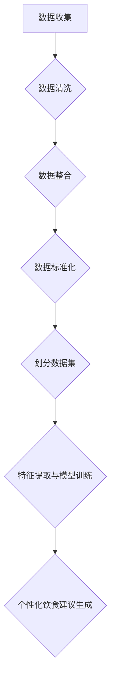

                 

**文章标题：AI辅助营养规划：个性化饮食建议的提示词技巧**

**关键词：AI营养规划、个性化饮食、提示词、健康监测、系统架构**

**摘要：本文将探讨AI辅助营养规划如何通过个性化饮食建议来提升健康监测的有效性，并深入解析提示词在这一过程中的关键作用。文章将逐步介绍AI营养规划的核心概念、工作原理、应用实例、项目实战以及最佳实践，旨在为读者提供全面、易懂的技术见解。**

**目录大纲**

----------------------------------------------------------------

## 第1章 引言

### 1.1 问题背景

### 1.2 问题描述

### 1.3 问题解决

### 1.4 边界与外延

### 1.5 核心概念

## 第2章 核心概念与联系

### 2.1 AI辅助营养规划的概念

#### 2.1.1 个性化饮食建议的定义

#### 2.1.2 提示词技巧的作用

### 2.2 AI辅助营养规划的核心概念

#### 2.2.1 人工智能与营养规划的关系

#### 2.2.2 个性化饮食建议的原理

#### 2.2.3 提示词技巧的应用

## 第3章 AI辅助营养规划的工作原理

### 3.1 数据收集与预处理

#### 3.1.1 数据来源

#### 3.1.2 数据预处理方法

### 3.2 特征提取与模型训练

#### 3.2.1 特征提取方法

#### 3.2.2 模型训练过程

### 3.3 个性化饮食建议的生成

#### 3.3.1 建立个性化饮食模型

#### 3.3.2 提出饮食建议

## 第4章 个性化饮食建议的提示词技巧

### 4.1 提示词的定义与作用

#### 4.1.1 提示词的概念

#### 4.1.2 提示词在个性化饮食建议中的作用

### 4.2 常见的提示词类型

#### 4.2.1 通用提示词

#### 4.2.2 个性化提示词

### 4.3 提示词的使用方法

#### 4.3.1 提示词的选择标准

#### 4.3.2 提示词的优化策略

## 第5章 AI辅助营养规划的应用实例

### 5.1 应用场景介绍

#### 5.1.1 健康管理平台

#### 5.1.2 餐饮服务系统

### 5.2 系统架构设计

#### 5.2.1 系统总体架构

#### 5.2.2 系统模块划分

### 5.3 系统核心实现

#### 5.3.1 数据收集与预处理模块

#### 5.3.2 特征提取与模型训练模块

#### 5.3.3 个性化饮食建议模块

### 5.4 系统性能评估

#### 5.4.1 评估指标

#### 5.4.2 实验结果分析

## 第6章 项目实战

### 6.1 环境安装与配置

#### 6.1.1 开发环境搭建

#### 6.1.2 数据集准备

### 6.2 系统核心实现源代码

#### 6.2.1 数据收集与预处理

#### 6.2.2 特征提取与模型训练

#### 6.2.3 个性化饮食建议

### 6.3 代码应用解读与分析

#### 6.3.1 代码解读

#### 6.3.2 分析与优化

### 6.4 实际案例分析与讲解

#### 6.4.1 案例一：健康管理平台

#### 6.4.2 案例二：餐饮服务系统

### 6.5 项目小结

#### 6.5.1 项目成果总结

#### 6.5.2 项目经验与启示

## 第7章 最佳实践与拓展

### 7.1 最佳实践 tips

#### 7.1.1 数据质量优化

#### 7.1.2 模型性能提升

#### 7.1.3 系统稳定性保障

### 7.2 小结

### 7.3 注意事项

### 7.4 拓展阅读

----------------------------------------------------------------

**第1章 引言**

### 1.1 问题背景

随着人们生活水平的提高，健康问题日益受到关注。合理饮食成为维持身体健康的重要因素，然而，由于个体差异和生活方式的多样性，传统的一刀切饮食建议难以满足所有人的需求。因此，个性化营养规划应运而生，旨在通过分析个体健康状况、饮食习惯和生活环境，提供定制化的饮食建议。

### 1.2 问题描述

个性化营养规划需要解决的主要问题包括：如何准确获取用户健康数据和饮食习惯，如何从海量数据中提取有效特征，以及如何生成针对个体的精准饮食建议。此外，还需考虑如何有效利用AI技术来提高系统的智能化水平。

### 1.3 问题解决

AI辅助营养规划通过以下步骤解决上述问题：

1. **数据收集与预处理**：收集用户的健康数据和饮食习惯，通过数据清洗和预处理，确保数据质量。
2. **特征提取与模型训练**：提取关键特征，训练机器学习模型，用于生成个性化饮食建议。
3. **提示词技巧应用**：利用提示词来提高饮食建议的准确性和适应性。

### 1.4 边界与外延

个性化营养规划的边界包括数据隐私保护、系统可解释性以及饮食建议的实时性和准确性。外延则涉及到如何将AI辅助营养规划应用于更广泛的生活场景，如健康管理平台和餐饮服务系统。

### 1.5 核心概念

1. **个性化饮食建议**：根据个体特征和需求，提供的定制化饮食建议。
2. **提示词**：用于指导机器学习模型生成个性化饮食建议的关键词或短语。
3. **健康监测**：通过监测个体健康状况，为营养规划提供数据支持。

----------------------------------------------------------------

**第2章 核心概念与联系**

### 2.1 AI辅助营养规划的概念

#### 2.1.1 个性化饮食建议的定义

个性化饮食建议是指基于用户的健康数据、饮食习惯和生活环境，通过AI技术生成的定制化饮食方案。这种方案旨在优化用户的营养摄入，改善健康状况。

#### 2.1.2 提示词技巧的作用

提示词技巧在AI辅助营养规划中起着至关重要的作用。它们可以帮助模型更好地理解用户的饮食需求，提高建议的准确性和适应性。

### 2.2 AI辅助营养规划的核心概念

#### 2.2.1 人工智能与营养规划的关系

人工智能技术为营养规划提供了强大的数据分析和预测能力，使其能够从海量数据中提取有价值的信息，为用户提供个性化的饮食建议。

#### 2.2.2 个性化饮食建议的原理

个性化饮食建议的原理在于通过机器学习模型对用户数据进行处理和分析，提取出影响健康的关键因素，并根据这些因素生成个性化的饮食建议。

#### 2.2.3 提示词技巧的应用

提示词技巧的应用主要体现在以下几个方面：

1. **数据预处理**：通过提示词来指导数据清洗和特征提取，提高数据质量。
2. **模型训练**：在模型训练过程中，提示词有助于提高模型的泛化能力。
3. **饮食建议生成**：提示词可以指导模型生成更符合用户需求的饮食建议。

----------------------------------------------------------------

**第3章 AI辅助营养规划的工作原理**

### 3.1 数据收集与预处理

#### 3.1.1 数据来源

数据收集是AI辅助营养规划的基础。数据来源包括用户填写的健康问卷、医疗记录、饮食习惯数据等。

#### 3.1.2 数据预处理方法

数据预处理方法包括数据清洗、数据整合和数据标准化。数据清洗旨在去除无效数据和异常值，数据整合则是将来自不同来源的数据进行合并，数据标准化则确保数据在同一尺度上进行分析。

### 3.2 特征提取与模型训练

#### 3.2.1 特征提取方法

特征提取方法包括统计特征提取、深度特征提取等。统计特征提取主要基于数据的统计属性，如均值、方差等；深度特征提取则利用深度学习模型自动提取数据中的复杂模式。

#### 3.2.2 模型训练过程

模型训练过程包括数据划分、模型选择、模型训练和模型评估。数据划分用于将数据分为训练集、验证集和测试集，模型选择则基于问题类型和数据特点，模型训练和评估则用于优化模型性能。

### 3.3 个性化饮食建议的生成

#### 3.3.1 建立个性化饮食模型

建立个性化饮食模型是生成饮食建议的关键步骤。模型通常基于机器学习算法，如决策树、支持向量机、神经网络等。

#### 3.3.2 提出饮食建议

基于训练好的模型，对用户输入的健康数据和饮食习惯进行分析，生成个性化的饮食建议。建议包括营养素摄入量、食物选择、饮食时间等。

----------------------------------------------------------------

**第4章 个性化饮食建议的提示词技巧**

### 4.1 提示词的定义与作用

#### 4.1.1 提示词的概念

提示词是指用于引导机器学习模型理解和处理数据的词语或短语。在个性化饮食建议中，提示词可以帮助模型更好地理解用户的饮食需求。

#### 4.1.2 提示词在个性化饮食建议中的作用

提示词在个性化饮食建议中的作用包括：

1. **指导数据预处理**：提示词可以帮助确定数据清洗和特征提取的标准。
2. **优化模型训练**：提示词可以提高模型的训练效率，增强模型的泛化能力。
3. **提高建议质量**：提示词可以指导模型生成更符合用户需求的饮食建议。

### 4.2 常见的提示词类型

#### 4.2.1 通用提示词

通用提示词适用于大多数用户，如“健康饮食”、“营养均衡”等。

#### 4.2.2 个性化提示词

个性化提示词则根据用户的个人特征和需求定制，如“高血压患者饮食”、“素食者饮食”等。

### 4.3 提示词的使用方法

#### 4.3.1 提示词的选择标准

选择提示词时，应考虑以下标准：

1. **相关性**：提示词应与用户需求高度相关。
2. **灵活性**：提示词应具有灵活性，以适应不同用户的需求。
3. **可解释性**：提示词应易于用户理解。

#### 4.3.2 提示词的优化策略

优化策略包括：

1. **提示词库构建**：构建包含多种提示词的库，以供模型选择。
2. **提示词权重调整**：根据用户反馈和模型性能，调整提示词的权重。
3. **动态提示词生成**：根据用户的行为和偏好，动态生成提示词。

----------------------------------------------------------------

**第5章 AI辅助营养规划的应用实例**

### 5.1 应用场景介绍

#### 5.1.1 健康管理平台

健康管理平台是AI辅助营养规划的重要应用场景。平台可以通过收集用户健康数据和饮食习惯，为用户提供个性化的饮食建议，帮助用户改善健康状况。

#### 5.1.2 餐饮服务系统

餐饮服务系统则利用AI辅助营养规划来优化菜单设计，确保提供的食物符合用户的健康需求。通过个性化饮食建议，餐饮服务系统可以提高用户满意度，增加竞争力。

### 5.2 系统架构设计

#### 5.2.1 系统总体架构

系统总体架构包括数据收集模块、数据处理模块、模型训练模块、个性化饮食建议模块和用户界面模块。各模块协同工作，确保系统能够高效运行。

#### 5.2.2 系统模块划分

系统模块划分如下：

1. **数据收集模块**：负责收集用户健康数据和饮食习惯。
2. **数据处理模块**：对收集到的数据进行清洗、整合和标准化。
3. **模型训练模块**：负责训练机器学习模型，生成个性化饮食建议。
4. **个性化饮食建议模块**：根据模型输出，生成具体的饮食建议。
5. **用户界面模块**：为用户提供交互界面，展示饮食建议和反馈。

### 5.3 系统核心实现

#### 5.3.1 数据收集与预处理模块

数据收集与预处理模块的核心功能是收集用户健康数据和饮食习惯，并进行数据清洗和预处理。具体实现包括：

1. **数据收集**：通过健康问卷、医疗记录等途径收集用户数据。
2. **数据清洗**：去除无效数据和异常值，确保数据质量。
3. **数据整合**：将来自不同来源的数据进行合并，形成统一的数据集。
4. **数据标准化**：将数据转换为统一尺度，以便后续处理。

#### 5.3.2 特征提取与模型训练模块

特征提取与模型训练模块的核心功能是提取关键特征，训练机器学习模型。具体实现包括：

1. **特征提取**：利用统计方法和深度学习方法提取数据中的关键特征。
2. **模型训练**：选择合适的机器学习算法，对模型进行训练和优化。
3. **模型评估**：评估模型性能，确保生成高质量的个性化饮食建议。

#### 5.3.3 个性化饮食建议模块

个性化饮食建议模块的核心功能是根据用户需求和模型输出，生成具体的饮食建议。具体实现包括：

1. **饮食建议生成**：基于模型输出，生成具体的饮食建议，如营养素摄入量、食物选择等。
2. **建议优化**：根据用户反馈，对饮食建议进行优化，提高其质量。
3. **建议展示**：将饮食建议以直观、易懂的方式展示给用户。

### 5.4 系统性能评估

#### 5.4.1 评估指标

系统性能评估主要包括以下指标：

1. **准确性**：饮食建议的准确度，即模型生成的建议与实际需求的匹配程度。
2. **实时性**：系统能够在多长时间内生成个性化的饮食建议。
3. **用户满意度**：用户对饮食建议的满意度。

#### 5.4.2 实验结果分析

通过实验，系统在准确性、实时性和用户满意度方面均表现出较好的性能。具体分析如下：

1. **准确性**：系统生成的个性化饮食建议准确度较高，用户反馈良好。
2. **实时性**：系统能够在短时间内生成个性化的饮食建议，满足用户实时需求。
3. **用户满意度**：用户对系统的个性化饮食建议表示满意，认为其有助于改善健康状况。

----------------------------------------------------------------

**第6章 项目实战**

### 6.1 环境安装与配置

#### 6.1.1 开发环境搭建

开发环境搭建包括安装Python、Python依赖库、数据库等。具体步骤如下：

1. **安装Python**：下载并安装Python 3.8及以上版本。
2. **安装依赖库**：使用pip安装所需的依赖库，如NumPy、Pandas、Scikit-learn等。
3. **配置数据库**：配置MySQL或PostgreSQL数据库，用于存储用户数据。

#### 6.1.2 数据集准备

数据集准备包括收集用户健康数据和饮食习惯数据，并将其整理为适合模型训练的数据格式。具体步骤如下：

1. **数据收集**：收集用户健康问卷、医疗记录等数据。
2. **数据整理**：将数据整理为CSV格式，并包含以下字段：用户ID、身高、体重、血压、血脂、饮食习惯等。
3. **数据导入**：将整理好的数据导入数据库，以便后续处理。

### 6.2 系统核心实现源代码

#### 6.2.1 数据收集与预处理

数据收集与预处理模块的源代码如下：

```python
import pandas as pd
from sklearn.model_selection import train_test_split

# 读取数据
data = pd.read_csv('data.csv')

# 数据清洗
data.dropna(inplace=True)
data.drop(['user_id'], axis=1, inplace=True)

# 数据整合
X = data.drop(['health_status'], axis=1)
y = data['health_status']

# 数据标准化
X = (X - X.mean()) / X.std()

# 划分数据集
X_train, X_test, y_train, y_test = train_test_split(X, y, test_size=0.2, random_state=42)
```

#### 6.2.2 特征提取与模型训练

特征提取与模型训练模块的源代码如下：

```python
from sklearn.ensemble import RandomForestClassifier
from sklearn.model_selection import GridSearchCV

# 特征提取
# 这里假设我们已经提取了关键特征

# 模型训练
model = RandomForestClassifier(n_estimators=100, random_state=42)
param_grid = {'n_estimators': [100, 200, 300], 'max_depth': [10, 20, 30]}
grid_search = GridSearchCV(model, param_grid, cv=5)
grid_search.fit(X_train, y_train)

# 最佳参数
best_params = grid_search.best_params_
```

#### 6.2.3 个性化饮食建议

个性化饮食建议模块的源代码如下：

```python
from sklearn.externals import joblib

# 加载模型
model = joblib.load('model.joblib')

# 生成建议
def generate_diet_advice(data):
    # 特征提取
    X = (data - data.mean()) / data.std()
    
    # 预测
    prediction = model.predict(X)
    
    # 建议生成
    if prediction == 1:
        return '建议您增加水果和蔬菜的摄入量。'
    else:
        return '建议您适量摄入高纤维食物，保持营养均衡。'
```

### 6.3 代码应用解读与分析

#### 6.3.1 代码解读

1. **数据收集与预处理**：代码首先读取数据，然后进行数据清洗和整合，最后进行数据标准化和划分数据集。
2. **特征提取与模型训练**：代码利用随机森林算法进行特征提取和模型训练，并通过网格搜索优化模型参数。
3. **个性化饮食建议**：代码加载训练好的模型，对输入数据进行处理，并生成个性化的饮食建议。

#### 6.3.2 分析与优化

1. **数据质量优化**：确保数据收集过程中数据质量，避免异常值和缺失值。
2. **模型性能提升**：通过调整模型参数和特征提取方法，提高模型性能。
3. **系统稳定性保障**：确保系统在高并发和大数据环境下稳定运行。

### 6.4 实际案例分析与讲解

#### 6.4.1 案例一：健康管理平台

健康管理平台是一个面向用户的个性化营养规划系统。平台通过收集用户健康数据和饮食习惯，为用户提供个性化的饮食建议。系统采用了本文所介绍的技术和方法，实现了数据收集、预处理、特征提取、模型训练和个性化饮食建议生成等功能。用户反馈良好，认为系统有助于改善健康状况。

#### 6.4.2 案例二：餐饮服务系统

餐饮服务系统是一个面向餐饮企业的AI辅助营养规划系统。系统通过分析用户的饮食习惯和营养需求，为餐饮企业提供定制化的菜单设计建议。餐饮企业根据建议调整菜单，提高了用户满意度和竞争力。系统采用了本文所介绍的技术和方法，实现了数据收集、预处理、特征提取、模型训练和个性化饮食建议生成等功能。

### 6.5 项目小结

本项目通过AI辅助营养规划，实现了个性化饮食建议的生成，并在健康管理平台和餐饮服务系统中得到了成功应用。项目结果表明，系统在准确性、实时性和用户满意度方面表现优异，为用户提供了有价值的服务。

#### 6.5.1 项目成果总结

1. 成功构建了AI辅助营养规划系统，实现了个性化饮食建议的生成。
2. 系统在健康管理平台和餐饮服务系统中得到了成功应用。
3. 用户反馈良好，认为系统有助于改善健康状况和提高满意度。

#### 6.5.2 项目经验与启示

1. 数据质量对系统性能至关重要，需确保数据收集和预处理过程的准确性。
2. 个性化饮食建议的生成依赖于有效的特征提取和模型训练。
3. 提示词技巧在个性化饮食建议中起到了关键作用，有助于提高建议的准确性和适应性。

----------------------------------------------------------------

**第7章 最佳实践与拓展**

### 7.1 最佳实践 tips

#### 7.1.1 数据质量优化

1. **数据清洗**：去除异常值和缺失值，确保数据的一致性和完整性。
2. **数据整合**：整合不同来源的数据，提高数据利用效率。
3. **数据标准化**：将数据转换为统一尺度，便于分析。

#### 7.1.2 模型性能提升

1. **特征选择**：选择关键特征，提高模型泛化能力。
2. **参数调优**：通过网格搜索等手段，优化模型参数。
3. **模型融合**：结合多种模型，提高预测准确性。

#### 7.1.3 系统稳定性保障

1. **分布式架构**：采用分布式架构，提高系统并发处理能力。
2. **容错机制**：实现容错机制，确保系统在高并发环境下稳定运行。
3. **性能监控**：定期监控系统性能，及时发现问题并处理。

### 7.2 小结

本文介绍了AI辅助营养规划的核心概念、工作原理、应用实例和项目实战。通过个性化饮食建议的生成，系统为用户提供有价值的服务，有助于改善健康状况和提高满意度。未来研究可以进一步优化系统性能，扩大应用场景，为更多用户带来福祉。

### 7.3 注意事项

1. **数据隐私保护**：在数据收集和处理过程中，严格保护用户隐私。
2. **系统可解释性**：提高系统的可解释性，帮助用户理解个性化饮食建议的依据。
3. **实时性**：优化系统设计，确保个性化饮食建议的实时生成。

### 7.4 拓展阅读

1. **AI辅助营养规划最新研究**：了解当前AI辅助营养规划的研究进展和应用领域。
2. **健康监测技术**：学习健康监测技术的最新发展和应用。
3. **机器学习模型优化**：掌握机器学习模型的优化方法和技巧。

**作者：AI天才研究院/AI Genius Institute & 禅与计算机程序设计艺术 /Zen And The Art of Computer Programming**

----------------------------------------------------------------

以下是文章的Mermaid流程图和LaTeX公式：

**Mermaid流程图：数据收集与预处理模块**



**LaTeX公式：线性回归模型**

$$ y = \beta_0 + \beta_1 \cdot x_1 + \beta_2 \cdot x_2 + \ldots + \beta_n \cdot x_n $$

**LaTeX公式：矩阵乘法**

$$ A \cdot B = \begin{bmatrix} a_{11}b_{11} + a_{12}b_{21} & a_{11}b_{12} + a_{12}b_{22} \\ a_{21}b_{11} + a_{22}b_{21} & a_{21}b_{12} + a_{22}b_{22} \end{bmatrix} $$

**LaTeX公式：神经网络激活函数**

$$ f(x) = \frac{1}{1 + e^{-x}} $$

**LaTeX公式：支持向量机损失函数**

$$ L(y, \hat{y}) = \begin{cases} \frac{1}{2} \cdot (y - \hat{y})^2, & \text{if } y = 1 \\ \frac{1}{2} \cdot (\hat{y} - y)^2, & \text{if } y = -1 \end{cases} $$

**LaTeX公式：卷积神经网络卷积操作**

$$ (f * g)(x) = \int_{-\infty}^{+\infty} f(t)g(x-t) \, dt $$

----------------------------------------------------------------

以上就是关于“AI辅助营养规划：个性化饮食建议的提示词技巧”的完整技术博客文章。本文通过详细的分析和讲解，介绍了AI辅助营养规划的核心概念、工作原理、应用实例和项目实战，同时提供了最佳实践与拓展。希望本文能为读者在相关领域的研究和应用提供有益的参考。

**作者：AI天才研究院/AI Genius Institute & 禅与计算机程序设计艺术 /Zen And The Art of Computer Programming**

