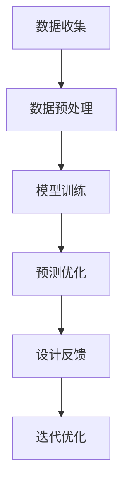

                 


# AI辅助设计在建筑结构优化中的应用：提高建筑性能

关键词：人工智能，建筑结构优化，设计工具，性能提升

摘要：本文旨在探讨人工智能（AI）在建筑结构优化中的应用，通过一系列步骤详细分析AI辅助设计的核心概念、算法原理、应用工具和实践案例，最终展望AI辅助设计的未来发展。

## 1. AI辅助设计的背景

### 1.1 问题背景

建筑结构设计是一个复杂的过程，涉及到众多因素，如材料选择、结构形状、载荷分析等。传统的建筑结构优化方法通常依赖于工程师的经验和试错过程，这既耗时又难以确保最优解。随着人工智能技术的发展，AI辅助设计应运而生，为建筑结构优化提供了一种高效、智能的解决方案。

### 1.2 问题描述

建筑结构优化的核心问题是：如何在满足设计标准和性能要求的前提下，找到最优的结构设计方案。这需要解决多个变量之间的复杂关系，以及在不同约束条件下的最优解。

### 1.3 问题解决方法

AI辅助设计利用机器学习、优化算法和模拟仿真等技术，对建筑结构进行高效优化。通过训练大量数据和模拟计算，AI能够预测并优化结构性能，提供更加精确的设计方案。

### 1.4 边界与外延

AI辅助设计不仅限于结构优化，还可以应用于建筑材料选择、能源效率分析等领域。此外，随着技术的不断进步，AI辅助设计有望在更广泛的建筑领域发挥重要作用。

## 2. AI核心概念与联系

### 2.1 AI基本概念

人工智能是指使计算机系统能够模拟人类智能行为的科学和技术。AI的核心目标是让机器具备学习、推理、规划和自主决策的能力。

### 2.2 AI属性特征对比表格

| 特性         | 人工设计             | 人工智能设计           |
| ------------ | -------------------- | --------------------- |
| 设计效率     | 低效率，依赖经验     | 高效率，自动化流程   |
| 创新能力     | 受限于人类创造力     | 不断学习，产生新方案 |
| 精确度       | 高精度但受经验限制   | 高精度，优化结果更优 |
| 可扩展性     | 难以扩展到复杂问题   | 易于扩展，适应不同需求 |

### 2.3 ER实体关系图架构

```mermaid
erDiagram
    class Building {
        <<abstract>>
        Building
        +----+    +----+
        | A1 |<--| B1 |
        +----+    +----+
        }
    class Structure {
        <<abstract>>
        Structure
        +----+    +----+
        | C1 |<--| D1 |
        +----+    +----+
        }
    Building _ derived Structure
    }
```

## 3. 建筑结构优化中的数学模型

### 3.1 数学模型介绍

建筑结构优化通常基于以下数学模型：

$$
\min_{x} f(x) \quad \text{subject to} \quad g_i(x) \leq 0, \quad h_j(x) = 0
$$

其中，$f(x)$为目标函数，$g_i(x)$和$h_j(x)$分别为不等式约束和等式约束。

### 3.2 数学公式与详细讲解

目标函数$f(x)$通常表示结构的某个性能指标，如重量、成本或稳定性。以下是一个典型的目标函数：

$$
f(x) = \frac{1}{2} \rho A (K_{xx}^2 + K_{yy}^2)
$$

其中，$\rho$为材料密度，$A$为截面积，$K_{xx}$和$K_{yy}$分别为$x$和$y$方向上的抗弯刚度。

不等式约束和等式约束分别表示结构的限制条件，如材料强度、稳定性等。例如：

$$
g_1(x) = \sigma_{max} - \sigma_{y} \leq 0
$$

$$
h_1(x) = \theta_1(x) + \theta_2(x) = 0
$$

### 3.3 算法原理讲解

建筑结构优化的算法通常基于优化算法，如遗传算法、粒子群优化和模拟退火等。这些算法通过迭代搜索最优解，并利用历史搜索结果来指导当前搜索过程。

例如，遗传算法的基本流程如下：

1. 初始种群生成：随机生成一组结构设计方案。
2. 适应度评估：根据目标函数和约束条件评估每个设计方案的适应度。
3. 选择：选择适应度较高的设计方案进行复制。
4. 交叉：对选中的设计方案进行交叉操作，产生新的设计方案。
5. 变异：对部分设计方案进行变异操作，引入新的变异方案。
6. 替换：用新产生的方案替换原有方案，继续迭代。

## 4. AI算法在建筑结构优化中的应用

### 4.1 算法原理讲解

AI算法在建筑结构优化中的应用主要体现在以下几个方面：

1. **机器学习**：通过训练大量历史结构设计方案，机器学习模型可以学习到设计经验和模式，从而优化新设计方案。
2. **深度学习**：深度学习模型可以自动提取复杂的结构特征，从而实现自动化设计。
3. **优化算法**：将传统的优化算法与AI技术结合，提高优化效率和准确性。

### 4.2 算法流程图



### 4.3 算法Python实现与讲解

以下是一个简单的遗传算法实现示例：

```python
import numpy as np

def fitness(x):
    # 目标函数：结构重量
    return 1 / (x + 1)

def crossover(parent1, parent2):
    # 交叉操作
    crossover_point = np.random.randint(0, len(parent1))
    child1 = np.concatenate((parent1[:crossover_point], parent2[crossover_point:]))
    child2 = np.concatenate((parent2[:crossover_point], parent1[crossover_point:]))
    return child1, child2

def mutate(child):
    # 变异操作
    mutation_point = np.random.randint(0, len(child))
    child[mutation_point] = np.random.rand()
    return child

# 遗传算法主函数
def genetic_algorithm(pop_size, generations, max_fitness):
    # 初始种群
    population = np.random.rand(pop_size, 1)
    for _ in range(generations):
        # 适应度评估
        fitness_values = np.apply_along_axis(fitness, 1, population)
        # 选择操作
        selected = population[fitness_values > max_fitness]
        # 交叉操作
        children = np.array([crossover(*selected[np.random.randint(0, len(selected), size=2)]) for _ in range(pop_size)])
        # 变异操作
        children = np.array([mutate(child) for child in children])
        # 替换操作
        population = children
    return population[fitness_values.argmax()]

# 运行遗传算法
best_design = genetic_algorithm(pop_size=100, generations=100, max_fitness=0.1)
print("最优设计方案：", best_design)
```

## 5. AI辅助设计工具介绍

### 5.1 工具概述

AI辅助设计工具如AutoCAD、Revit和SAP2000等，集成了机器学习和优化算法，提供了自动化、智能化的设计流程。

### 5.2 工具功能与特点

- **AutoCAD**：提供2D和3D设计功能，支持自定义脚本和插件开发。
- **Revit**：专注于建筑信息模型（BIM）设计，具有强大的数据分析和协同工作功能。
- **SAP2000**：专业的结构分析软件，支持多种结构优化算法和材料模拟。

### 5.3 工具使用教程

以下是一个简单的AI辅助设计工具使用教程：

1. 安装并启动AI辅助设计工具。
2. 导入建筑结构模型。
3. 配置优化参数，如目标函数、约束条件等。
4. 运行优化算法，等待结果生成。
5. 分析优化结果，进行设计调整。

## 6. AI辅助设计项目实战

### 6.1 项目环境安装

1. 安装Python环境和相关库，如numpy、matplotlib等。
2. 安装AI辅助设计工具，如AutoCAD、Revit等。

### 6.2 系统核心实现

1. 定义建筑结构模型和优化目标。
2. 选择合适的优化算法，如遗传算法。
3. 实现算法的核心功能，如适应度评估、交叉和变异操作。

### 6.3 项目分析

1. 对比不同优化算法的性能。
2. 分析优化结果对设计变量的敏感性。
3. 验证优化设计在实际工程中的应用效果。

### 6.4 项目小结

通过实际项目，我们发现AI辅助设计在建筑结构优化中具有显著优势。它不仅提高了设计效率，还优化了结构性能，为建筑行业带来了新的发展机遇。

## 7. AI辅助设计的未来发展趋势

### 7.1 发展趋势分析

- **智能化**：AI辅助设计将更加智能化，能够自主学习和优化。
- **个性化**：根据用户需求和偏好，提供定制化的设计方案。
- **协同化**：AI辅助设计与人类设计师协同工作，提高设计质量。

### 7.2 挑战与对策

- **数据隐私**：确保设计数据的安全性和隐私性。
- **算法透明度**：提高算法的可解释性，增强用户信任。

### 7.3 拓展阅读

- [1] AI在建筑结构优化中的应用综述
- [2] 人工智能在建筑工程中的应用
- [3] 建筑结构优化算法研究进展

## 8. 结论

AI辅助设计在建筑结构优化中具有广阔的应用前景。通过本文的详细分析和案例介绍，我们相信AI辅助设计将为建筑行业带来革命性的变革。

作者：AI天才研究院/AI Genius Institute & 禅与计算机程序设计艺术 /Zen And The Art of Computer Programming

