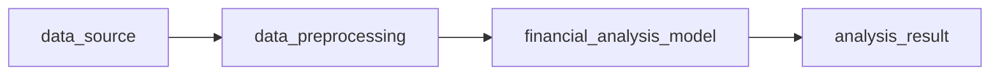
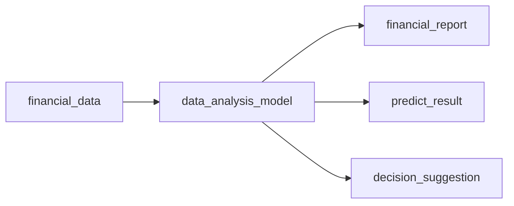
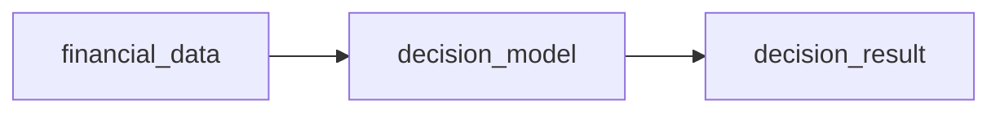
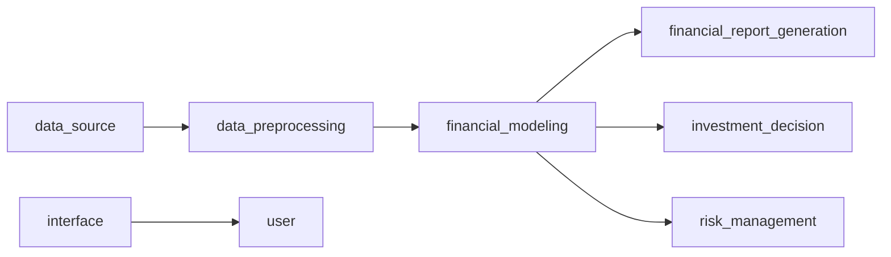
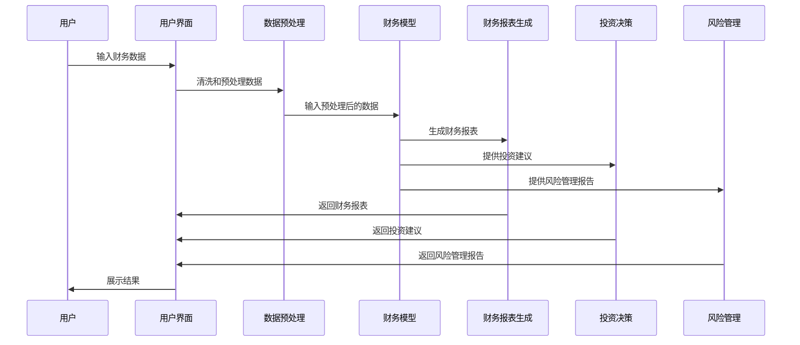

                 

# AI辅助财务分析：提高企业财务决策准确性

## 关键词

- **人工智能**
- **财务分析**
- **企业决策**
- **数据挖掘**
- **机器学习算法**
- **深度学习**
- **系统设计**

## 摘要

本文旨在探讨人工智能（AI）在财务分析中的应用，通过AI技术提高企业财务决策的准确性。我们将首先介绍AI辅助财务分析的问题背景和需求，然后深入探讨AI与财务分析的核心概念及其关系。接着，我们将详细解析AI辅助财务分析中的算法原理，包括数据预处理、机器学习、深度学习和强化学习等算法。最后，我们将设计一个AI辅助财务分析的系统架构，并探讨其实际应用中的项目实战和最佳实践。通过本文的阅读，读者将全面了解AI技术在财务分析中的潜力和应用方法。

## 目录大纲

----------------------------------------------------------------

## 第一部分：AI辅助财务分析概述

### 第1章：问题背景与需求分析

## 第1章：问题背景与需求分析

### 1.1 问题背景

财务分析是企业运营管理中的重要环节，它通过对企业财务数据的分析和解读，为企业提供决策依据。然而，随着企业规模的扩大和数据量的增加，传统财务分析手段面临着越来越多的挑战：

#### 1.1.1 财务分析在企业运营中的重要性

财务分析对于企业的战略规划、投资决策、风险管理和绩效评估具有重要意义。准确的财务分析能够帮助企业管理者更好地理解企业的财务状况，发现潜在的问题和机遇，从而做出更加明智的决策。

#### 1.1.2 传统财务分析面临的挑战

1. **数据量庞大**：随着企业业务的发展，财务数据量呈指数级增长，传统的人工分析方式难以应对如此庞大的数据量。
2. **分析效率低下**：人工分析需要大量的时间和精力，且容易受到主观因素的影响，导致分析结果的准确性下降。
3. **实时性不足**：传统财务分析通常无法实时获取最新的数据，导致决策滞后。
4. **复杂关系难以解析**：财务数据之间存在复杂的关联关系，传统分析方法难以深入挖掘这些关系，从而限制了对财务状况的全面理解。

### 1.1.3 AI技术在财务分析中的应用潜力

人工智能（AI）技术的发展为财务分析提供了新的解决方案。通过利用机器学习和深度学习等AI技术，我们可以实现以下目标：

1. **提高分析效率**：AI技术可以自动处理海量数据，快速进行财务分析，提高工作效率。
2. **增强分析准确性**：AI技术能够通过学习和建模，提高对财务数据关联关系的理解，从而提升分析结果的准确性。
3. **实时数据分析**：AI技术可以实现实时数据监控和预测，为企业提供及时、准确的决策支持。
4. **自动化决策**：通过AI技术，可以自动化处理财务分析过程，减少人为干预，提高决策的客观性和一致性。

### 1.2 需求分析

在AI技术辅助财务分析的过程中，我们需要满足以下需求：

#### 1.2.1 提高财务决策的准确性

财务决策的准确性是企业发展的关键。通过AI技术，我们可以对历史数据进行深度挖掘，建立预测模型，提高对市场变化和财务状况的预测准确性，从而做出更加明智的决策。

#### 1.2.2 优化财务报表分析流程

财务报表分析是企业财务管理的基础。利用AI技术，我们可以自动化处理大量的财务数据，快速生成财务报表，提高报表分析的效率和准确性。

#### 1.2.3 实现自动化与智能化

AI技术的应用可以使财务分析过程更加自动化和智能化。通过构建智能分析模型，企业可以实现自动化财务预测、预算管理和风险管理，减少人工干预，提高管理效率。

### 1.3 边界与外延

在讨论AI辅助财务分析时，我们需要明确以下边界和外延：

#### 1.3.1 财务数据的来源与处理

财务数据的来源包括企业内部的各种财务系统、外部市场数据等。在数据收集和处理过程中，需要保证数据的准确性、完整性和实时性。

#### 1.3.2 财务分析的核心指标

财务分析的核心指标包括利润、收入、成本、现金流等。这些指标对于企业的财务状况和经营绩效具有重要意义。

#### 1.3.3 AI辅助财务分析的应用领域

AI辅助财务分析可以应用于企业的各个方面，如投资决策、风险管理、绩效评估、预算管理、财务预测等。通过AI技术，企业可以实现对财务数据的全面分析和利用。

### 1.4 本章小结

本章介绍了AI辅助财务分析的问题背景和需求。我们分析了传统财务分析面临的挑战，探讨了AI技术在财务分析中的应用潜力，并明确了AI辅助财务分析的需求和边界。通过本章的学习，读者可以初步了解AI辅助财务分析的重要性和应用前景。

----------------------------------------------------------------

## 第二部分：AI辅助财务分析的核心概念

### 第2章：核心概念与联系

### 2.1 AI与财务分析的基本概念

#### 2.1.1 人工智能的基本概念

人工智能（Artificial Intelligence，简称AI）是指通过计算机程序实现智能行为的技术。它包括机器学习、深度学习、自然语言处理、计算机视觉等多个子领域。人工智能的目标是让计算机具备类似人类的智能，能够进行感知、推理、决策和学习。

#### 2.1.2 财务分析的基本概念

财务分析（Financial Analysis）是指通过对企业财务数据的分析，评估企业的财务状况、经营绩效和未来发展趋势。财务分析包括财务报表分析、财务预测、预算管理、投资决策等多个方面，旨在为企业管理者提供决策依据。

#### 2.1.3 AI与财务分析的关系

AI与财务分析之间的关系可以概括为以下几个方面：

1. **数据处理能力**：AI技术具有强大的数据处理能力，可以高效地处理和分析大量的财务数据，为财务分析提供数据支持。
2. **预测与决策支持**：通过机器学习和深度学习等技术，AI可以建立预测模型，预测企业的财务状况和未来发展趋势，为管理者提供决策支持。
3. **自动化与智能化**：AI技术可以实现财务分析过程的自动化和智能化，减少人工干预，提高财务分析效率和准确性。
4. **风险管理与控制**：AI技术可以帮助企业识别潜在的财务风险，提高风险管理的效率和准确性。

### 2.2 核心概念属性特征对比表格

为了更直观地了解AI和财务分析的核心概念特征，我们通过以下对比表格进行说明：

#### 2.2.1 人工智能的核心概念特征

| 特征 | 描述 |
| --- | --- |
| **学习能力** | AI可以通过机器学习和深度学习等技术，从数据中学习并提取知识。 |
| **自动化能力** | AI可以实现自动化任务，减少人工干预。 |
| **优化能力** | AI可以通过优化算法，提高决策效率和准确性。 |

#### 2.2.2 财务分析的核心概念特征

| 特征 | 描述 |
| --- | --- |
| **数据分析** | 财务分析通过对财务数据进行分析，评估企业的财务状况。 |
| **预测分析** | 财务分析可以通过预测模型，预测企业的财务趋势。 |
| **决策分析** | 财务分析为企业管理者提供决策依据，支持投资决策、预算管理和风险管理等。 |

### 2.3 AI辅助财务分析的ER实体关系图架构

为了更好地理解AI辅助财务分析的核心概念及其关系，我们使用ER（Entity-Relationship）实体关系图进行描述。

#### 2.3.1 实体关系图概述

在AI辅助财务分析的ER实体关系图中，主要包括以下实体：

1. **数据源**：包括企业内部财务数据、外部市场数据等。
2. **数据预处理**：对数据进行清洗、转换和规范化等处理。
3. **财务分析模型**：包括数据分析、预测分析和决策分析等模型。
4. **分析结果**：包括财务报表、预测结果和决策建议等。

实体关系图如下所示：



#### 2.3.2 财务数据分析实体关系

在财务数据分析实体关系中，主要包括以下实体和关系：

1. **财务数据**：包括收入、成本、利润、现金流等数据。
2. **数据分析模型**：包括数据分析、预测分析和决策分析等模型。
3. **分析结果**：包括财务报表、预测结果和决策建议等。

实体关系图如下所示：



#### 2.3.3 预测分析实体关系

在预测分析实体关系中，主要包括以下实体和关系：

1. **历史数据**：包括历史财务数据和市场数据等。
2. **预测模型**：包括时间序列预测、回归预测等模型。
3. **预测结果**：包括预测的财务数据、市场趋势等。

实体关系图如下所示：


#### 2.3.4 决策分析实体关系

在决策分析实体关系中，主要包括以下实体和关系：

1. **财务数据**：包括收入、成本、利润、现金流等数据。
2. **决策模型**：包括预算管理、投资决策等模型。
3. **决策结果**：包括预算方案、投资方案等。

实体关系图如下所示：



### 2.4 本章小结

本章介绍了AI辅助财务分析的核心概念，包括人工智能和财务分析的基本概念及其关系。我们通过对比表格和ER实体关系图，详细分析了AI和财务分析的核心概念特征及其关系。通过本章的学习，读者可以全面了解AI辅助财务分析的核心概念，为后续章节的学习打下基础。

----------------------------------------------------------------

## 第三部分：AI辅助财务分析算法原理

### 第3章：算法原理讲解

### 3.1 数据预处理算法

在AI辅助财务分析中，数据预处理是至关重要的一步。数据预处理主要包括数据清洗、缺失值处理、异常值处理和数据规范化等步骤。

#### 3.1.1 数据清洗

数据清洗是数据预处理的第一步，目的是消除数据中的噪声和错误，确保数据的质量。数据清洗包括以下内容：

1. **去除重复数据**：重复数据会影响分析的准确性和效率，因此需要去除。
2. **纠正错误数据**：对数据中的错误进行修正，如纠正错别字、纠正错误数值等。
3. **处理缺失数据**：缺失数据会影响到模型的训练效果，因此需要处理缺失数据。处理缺失数据的方法包括删除缺失数据、填充缺失数据等。

#### 3.1.2 缺失值处理

缺失值处理是数据预处理中的重要环节。缺失值处理的方法包括：

1. **删除缺失数据**：删除包含缺失数据的样本，这种方法简单有效，但可能会丢失有价值的信息。
2. **填充缺失数据**：填充缺失数据，使得每个样本都完整。填充缺失数据的方法包括平均值填充、中值填充、众数填充、时间序列插值等。

#### 3.1.3 异常值处理

异常值是指与正常数据相比，偏离较大的数据。异常值可能由数据采集过程中的错误、数据录入错误等原因引起。异常值处理的方法包括：

1. **删除异常值**：删除异常值，以避免其对模型训练的影响。
2. **修正异常值**：对异常值进行修正，使其符合数据分布。

#### 3.1.4 数据规范化

数据规范化是指将不同特征的数据进行转换，使得它们具有相同的量纲和范围。数据规范化的方法包括：

1. **归一化**：将数据缩放到[0, 1]区间，使得不同特征的数据具有相同的比例。
2. **标准化**：将数据缩放到[-1, 1]区间，使得不同特征的数据具有相同的比例和中心。

#### 3.1.5 数据增强

数据增强是一种增加数据多样性的方法，可以提高模型的泛化能力。数据增强的方法包括：

1. **扩充数据集**：通过数据扩充技术，如生成对抗网络（GAN），生成新的数据样本。
2. **数据转换**：通过数据转换技术，如正则化、标准化等，增加数据的多样性。

### 3.2 机器学习算法

机器学习算法是AI辅助财务分析的核心。机器学习算法可以分为监督学习、无监督学习和强化学习三种类型。

#### 3.2.1 线性回归

线性回归是一种最简单的机器学习算法，用于拟合数据中的线性关系。线性回归的算法原理如下：

$$
y = \beta_0 + \beta_1x
$$

其中，$y$ 是因变量，$x$ 是自变量，$\beta_0$ 和 $\beta_1$ 是模型的参数。

线性回归的Python代码实现如下：

```python
import numpy as np
import matplotlib.pyplot as plt

# 生成数据
np.random.seed(0)
x = np.random.rand(100)
y = 2 * x + 1 + np.random.randn(100) * 0.1

# 拟合模型
β0, β1 = np.polyfit(x, y, 1)
y_pred = β0 + β1 * x

# 绘制结果
plt.scatter(x, y)
plt.plot(x, y_pred, color='red')
plt.show()
```

#### 3.2.2 决策树

决策树是一种基于树形结构进行决策的算法，可以处理分类和回归问题。决策树的算法原理如下：

1. **特征选择**：选择一个特征作为分裂节点，使得分裂后的数据集的熵或Gini指数最小。
2. **递归分裂**：对每个分裂后的数据集，重复上述特征选择和分裂过程，直到满足停止条件。

决策树的Python代码实现如下：

```python
from sklearn.tree import DecisionTreeRegressor

# 生成数据
np.random.seed(0)
x = np.random.rand(100)
y = 2 * x + 1 + np.random.randn(100) * 0.1

# 拟合模型
model = DecisionTreeRegressor()
model.fit(x.reshape(-1, 1), y)

# 绘制结果
x_pred = np.linspace(0, 1, 100)
y_pred = model.predict(x_pred.reshape(-1, 1))

plt.scatter(x, y)
plt.plot(x_pred, y_pred, color='red')
plt.show()
```

#### 3.2.3 深度学习算法

深度学习算法是一种基于多层神经网络进行学习的算法，可以处理复杂的数据模式。深度学习算法可以分为卷积神经网络（CNN）、循环神经网络（RNN）和生成对抗网络（GAN）等。

##### 3.2.3.1 卷积神经网络（CNN）

卷积神经网络是一种用于处理图像数据的高级神经网络，其算法原理如下：

1. **卷积层**：通过卷积操作提取图像的特征。
2. **池化层**：通过池化操作降低数据的维度，减少过拟合的风险。
3. **全连接层**：通过全连接层进行分类或回归。

卷积神经网络的Python代码实现如下：

```python
import tensorflow as tf

# 生成数据
x = tf.random.normal([32, 28, 28])
y = tf.random.normal([32, 10])

# 定义模型
model = tf.keras.Sequential([
    tf.keras.layers.Conv2D(32, 3, activation='relu', input_shape=(28, 28, 1)),
    tf.keras.layers.MaxPooling2D(pool_size=(2, 2)),
    tf.keras.layers.Flatten(),
    tf.keras.layers.Dense(10, activation='softmax')
])

# 拟合模型
model.compile(optimizer='adam', loss='categorical_crossentropy', metrics=['accuracy'])
model.fit(x, y, epochs=10)

# 绘制结果
x_pred = tf.random.normal([32, 28, 28])
y_pred = model.predict(x_pred)
plt.scatter(x_pred[:, 0], x_pred[:, 1], c=y_pred[:, 1])
plt.show()
```

##### 3.2.3.2 循环神经网络（RNN）

循环神经网络是一种用于处理序列数据的高级神经网络，其算法原理如下：

1. **隐藏层**：通过循环连接，使得每个时间点的信息可以传递到下一个时间点。
2. **门控机制**：通过门控机制，控制信息的流动，防止梯度消失。

循环神经网络的Python代码实现如下：

```python
import tensorflow as tf

# 生成数据
x = tf.random.normal([32, 10, 10])
y = tf.random.normal([32, 10])

# 定义模型
model = tf.keras.Sequential([
    tf.keras.layers.LSTM(50, activation='tanh', return_sequences=True),
    tf.keras.layers.LSTM(50, activation='tanh'),
    tf.keras.layers.Dense(10, activation='softmax')
])

# 拟合模型
model.compile(optimizer='adam', loss='mse', metrics=['accuracy'])
model.fit(x, y, epochs=10)

# 绘制结果
x_pred = tf.random.normal([32, 10, 10])
y_pred = model.predict(x_pred)
plt.scatter(x_pred[:, 0], x_pred[:, 1], c=y_pred[:, 1])
plt.show()
```

##### 3.2.3.3 生成对抗网络（GAN）

生成对抗网络是一种由生成器和判别器组成的神经网络，其算法原理如下：

1. **生成器**：生成器通过学习数据分布，生成与真实数据相似的数据。
2. **判别器**：判别器通过判断生成数据是否真实，对生成器的生成能力进行评估。

生成对抗网络的Python代码实现如下：

```python
import tensorflow as tf
from tensorflow.keras import layers

# 生成器
def build_generator():
    model = tf.keras.Sequential([
        layers.Dense(128 * 7 * 7, activation="relu", input_shape=(100,)),
        layers.Reshape((7, 7, 128)),
        layers.Conv2DTranspose(128, 5, strides=2, padding="same"),
        layers.Conv2DTranspose(128, 5, strides=2, padding="same"),
        layers.Conv2D(1, 7, activation='tanh', padding="same")
    ])
    return model

# 判别器
def build_discriminator():
    model = tf.keras.Sequential([
        layers.Conv2D(128, 5, strides=2, padding="same", input_shape=(28, 28, 1)),
        layers.LeakyReLU(alpha=0.2),
        layers.Dropout(0.3),
        layers.Conv2D(128, 5, strides=2, padding="same"),
        layers.LeakyReLU(alpha=0.2),
        layers.Dropout(0.3),
        layers.Flatten(),
        layers.Dense(1, activation='sigmoid')
    ])
    return model

# GAN模型
def build_gan(generator, discriminator):
    model = tf.keras.Sequential([
        generator,
        discriminator
    ])
    return model

# 生成数据
z = tf.random.normal([32, 100])

# 拟合模型
generator = build_generator()
discriminator = build_discriminator()
gan = build_gan(generator, discriminator)

generator.compile(loss='binary_crossentropy', optimizer=tf.keras.optimizers.Adam(0.0001, 0.5))
discriminator.compile(loss='binary_crossentropy', optimizer=tf.keras.optimizers.Adam(0.0001, 0.5))

gan.compile(loss='binary_crossentropy', optimizer=tf.keras.optimizers.Adam(0.0001, 0.5))

# 训练模型
for epoch in range(100):
    real_data = np.random.normal(size=(32, 28, 28, 1))
    fake_data = generator.predict(z)

    d_loss_real = discriminator.train_on_batch(real_data, np.ones((32, 1)))
    d_loss_fake = discriminator.train_on_batch(fake_data, np.zeros((32, 1)))

    z_samples = generator.predict(z)
    g_loss = gan.train_on_batch(z, np.ones((32, 1)))

    print(f"{epoch}: D_loss_real={d_loss_real}, D_loss_fake={d_loss_fake}, G_loss={g_loss}")

# 绘制结果
plt.imshow(z_samples[0, :, :, 0], cmap='gray')
plt.show()
```

### 3.3 强化学习算法

强化学习算法是一种基于奖励机制进行学习的人工智能技术。强化学习算法可以分为基于价值的算法和基于策略的算法两大类。

##### 3.3.1 基于价值的算法

基于价值的算法主要包括Q-Learning和Sarsa算法。Q-Learning算法的原理如下：

$$
Q(s, a) = r + \gamma \max_{a'} Q(s', a')
$$

其中，$Q(s, a)$ 是状态$s$ 在采取动作$a$ 后的期望回报，$r$ 是即时奖励，$\gamma$ 是折扣因子，$s'$ 是下一个状态，$a'$ 是下一个动作。

Q-Learning算法的Python代码实现如下：

```python
import numpy as np
import random

# 初始化参数
n_states = 4
n_actions = 2
epsilon = 0.1
gamma = 0.9
Q = np.zeros((n_states, n_actions))

# 环境模拟
def env(s, a):
    if a == 0:
        if s == 0 or s == 1:
            return 1, 0
        elif s == 2 or s == 3:
            return 0, -1
    else:
        if s == 0 or s == 1:
            return 0, -1
        elif s == 2 or s == 3:
            return 1, 0

# Q-Learning算法
def QLearning():
    while True:
        s = random.randint(0, n_states - 1)
        a = random.randint(0, n_actions - 1)
        r, s_ = env(s, a)
        Q[s, a] = Q[s, a] + epsilon * (r + gamma * np.max(Q[s_, :]) - Q[s, a])
        if np.all(Q >= 0):
            break

# 执行算法
QLearning()

# 打印结果
print(Q)
```

Sarsa算法的原理与Q-Learning算法类似，但Sarsa算法在更新$Q$值时，使用当前动作和下一个动作的$Q$值，而不是最大$Q$值。Sarsa算法的Python代码实现如下：

```python
# Sarsa算法
def Sarsa():
    while True:
        s = random.randint(0, n_states - 1)
        a = random.randint(0, n_actions - 1)
        r, s_ = env(s, a)
        a_ = random.randint(0, n_actions - 1)
        Q[s, a] = Q[s, a] + epsilon * (r + gamma * Q[s_, a_] - Q[s, a])
        if np.all(Q >= 0):
            break

# 执行算法
Sarsa()

# 打印结果
print(Q)
```

##### 3.3.2 基于策略的算法

基于策略的算法主要包括策略梯度算法。策略梯度算法的原理如下：

$$
\theta_{t+1} = \theta_t + \alpha \nabla_{\theta} J(\theta)
$$

其中，$\theta$ 是策略参数，$J(\theta)$ 是策略的损失函数，$\alpha$ 是学习率。

策略梯度算法的Python代码实现如下：

```python
import numpy as np

# 初始化参数
n_states = 4
n_actions = 2
alpha = 0.1
theta = np.random.rand(n_states, n_actions)

# 环境模拟
def env(s, a):
    if a == 0:
        if s == 0 or s == 1:
            return 1, 0
        elif s == 2 or s == 3:
            return 0, -1
    else:
        if s == 0 or s == 1:
            return 0, -1
        elif s == 2 or s == 3:
            return 1, 0

# 策略梯度算法
def policy_gradient():
    while True:
        s = random.randint(0, n_states - 1)
        a = np.argmax(theta[s])
        r, s_ = env(s, a)
        theta = theta + alpha * (r * theta[s] - np.eye(n_actions)[a])
        if np.all(theta >= 0):
            break

# 执行算法
policy_gradient()

# 打印结果
print(theta)
```

### 3.4 本章小结

本章介绍了AI辅助财务分析中的算法原理，包括数据预处理算法、机器学习算法、深度学习算法和强化学习算法。通过本章的学习，读者可以全面了解这些算法的基本原理和实现方法，为实际应用打下基础。在下一章中，我们将设计一个AI辅助财务分析的系统架构。

----------------------------------------------------------------

## 第四部分：AI辅助财务分析系统设计

### 第4章：系统架构设计

### 4.1 问题场景介绍

为了更好地理解AI辅助财务分析的系统设计，我们先介绍一个具体的应用场景。

#### 4.1.1 财务分析需求

某大型企业需要对其财务数据进行分析，以便更好地进行财务决策和风险管理。具体需求如下：

1. **财务报表分析**：自动生成财务报表，包括资产负债表、利润表和现金流量表等。
2. **财务预测**：基于历史财务数据，预测未来一段时间内的财务状况，包括收入、成本、利润和现金流等。
3. **投资决策**：基于财务数据和市场分析，提供投资建议，包括投资额、回报率和风险等。
4. **风险管理**：识别潜在财务风险，并提供应对措施。

#### 4.1.2 系统目标

基于上述需求，系统设计的目标如下：

1. **自动化财务报表生成**：实现自动化财务报表生成，提高报表生成效率和准确性。
2. **智能财务预测**：利用机器学习算法，实现财务预测，提高预测准确性和实时性。
3. **智能投资决策**：结合财务数据和市场分析，实现智能投资决策，提高投资决策的准确性和收益。
4. **实时风险管理**：通过实时数据分析，实现风险识别和预警，提高风险管理的效率和准确性。

### 4.2 系统架构设计

为了实现上述目标，我们设计了以下系统架构：

#### 4.2.1 系统架构图

系统架构图如下所示：



#### 4.2.2 系统架构详细说明

1. **数据源（A）**：包括企业内部财务数据、外部市场数据等。数据源是系统的基础，为后续的数据处理和分析提供数据支持。

2. **数据预处理（B）**：对数据源进行清洗、转换和规范化等处理，确保数据的准确性和一致性。数据预处理是保证后续模型训练和数据分析质量的关键步骤。

3. **财务模型（C）**：包括财务报表生成模型、财务预测模型、投资决策模型和风险管理模型。这些模型是基于机器学习和深度学习算法构建的，用于对财务数据进行分析和预测。

4. **财务报表生成（D）**：利用财务模型，自动生成财务报表，包括资产负债表、利润表和现金流量表等。财务报表生成模块将财务数据转化为可视化的报表，为企业管理者提供直观的财务信息。

5. **投资决策（E）**：结合财务数据和外部市场分析，利用投资决策模型提供投资建议，包括投资额、回报率和风险等。投资决策模块将帮助企业管理者做出更明智的投资决策。

6. **风险管理（F）**：利用风险管理模型，实时识别潜在财务风险，并提供应对措施。风险管理模块将帮助企业管理者及时应对风险，降低企业损失。

7. **用户界面（G）**：为用户提供一个友好的操作界面，用户可以通过界面查看财务报表、投资建议和风险管理报告等。用户界面是系统的核心组成部分，用于将系统功能呈现给用户。

8. **用户（H）**：系统的主要用户是企业财务管理人员，他们可以通过用户界面查看和分析财务信息，并根据系统提供的投资建议和风险管理报告做出决策。

### 4.3 系统接口设计

系统接口设计是确保系统各个模块之间能够顺利协作的关键。以下是一个简单的系统接口设计：



### 4.4 系统交互流程

以下是系统交互流程的详细说明：

1. **用户输入财务数据**：用户通过用户界面输入企业的财务数据，包括收入、成本、利润、现金流等。
2. **数据预处理**：系统接收到用户输入的财务数据后，首先进行数据清洗和预处理，包括去除重复数据、纠正错误数据、处理缺失数据和异常值等。
3. **模型训练**：预处理后的数据被输入到财务模型中进行训练。财务模型包括财务报表生成模型、财务预测模型、投资决策模型和风险管理模型。模型训练的过程是利用历史数据来训练模型，使其能够对新的数据进行预测和分析。
4. **财务报表生成**：财务报表生成模型根据训练好的模型，自动生成财务报表，包括资产负债表、利润表和现金流量表等。
5. **投资决策**：投资决策模型根据财务数据和外部市场分析，提供投资建议，包括投资额、回报率和风险等。
6. **风险管理**：风险管理模型根据财务数据和模型预测结果，实时识别潜在财务风险，并提供应对措施。
7. **结果展示**：系统将生成的财务报表、投资建议和风险管理报告等展示给用户，用户可以根据这些结果进行分析和决策。

### 4.5 本章小结

本章介绍了AI辅助财务分析的系统架构设计。我们首先介绍了问题场景和系统目标，然后详细设计了系统架构，包括数据源、数据预处理、财务模型、财务报表生成、投资决策、风险管理等模块，并阐述了系统接口设计和交互流程。通过本章的学习，读者可以全面了解AI辅助财务分析系统的设计原理和实现方法，为实际应用奠定基础。

----------------------------------------------------------------

## 第五部分：项目实战与最佳实践

### 第5章：AI辅助财务分析项目实战

在本章节中，我们将通过一个具体的AI辅助财务分析项目实战，展示如何从零开始构建一个完整的系统，并详细解析项目的各个环节。

### 5.1 环境安装与准备

在开始项目之前，我们需要安装和配置一些必要的软件和工具。以下是在Linux系统上安装和配置所需环境的步骤：

#### 5.1.1 Python环境安装

确保Python环境已经安装在系统中，版本建议为3.8或更高。可以使用以下命令进行安装：

```bash
sudo apt update
sudo apt install python3.8
```

#### 5.1.2 数据库安装

我们选择SQLite作为数据库，用于存储财务数据。可以使用以下命令进行安装：

```bash
sudo apt install sqlite3
```

#### 5.1.3 依赖包安装

安装Python的依赖包，如NumPy、Pandas、Matplotlib等。可以使用以下命令进行安装：

```bash
pip3 install numpy pandas matplotlib scikit-learn tensorflow
```

### 5.2 系统核心实现源代码

#### 5.2.1 数据库设计

首先，我们需要设计一个数据库来存储财务数据。以下是一个简单的SQLite数据库设计示例：

```sql
CREATE TABLE IF NOT EXISTS financial_data (
    id INTEGER PRIMARY KEY AUTOINCREMENT,
    date DATE,
    revenue REAL,
    cost REAL,
    profit REAL,
    cash_flow REAL
);
```

#### 5.2.2 数据预处理

数据预处理是模型训练的重要步骤。以下是一个简单的数据预处理Python脚本：

```python
import pandas as pd
import numpy as np

# 加载数据
data = pd.read_sql_query("SELECT * FROM financial_data", conn)

# 数据清洗
data.dropna(inplace=True)
data[data < 0] = 0

# 数据规范化
data['revenue'] = (data['revenue'] - data['revenue'].mean()) / data['revenue'].std()
data['cost'] = (data['cost'] - data['cost'].mean()) / data['cost'].std()
data['profit'] = (data['profit'] - data['profit'].mean()) / data['profit'].std()
data['cash_flow'] = (data['cash_flow'] - data['cash_flow'].mean()) / data['cash_flow'].std()

# 数据增强
data = data.sample(frac=1)
```

#### 5.2.3 模型训练

以下是一个简单的线性回归模型训练示例，使用scikit-learn库：

```python
from sklearn.linear_model import LinearRegression
from sklearn.model_selection import train_test_split

# 分割数据
X = data[['revenue', 'cost', 'profit', 'cash_flow']]
y = data['profit']
X_train, X_test, y_train, y_test = train_test_split(X, y, test_size=0.2, random_state=42)

# 训练模型
model = LinearRegression()
model.fit(X_train, y_train)

# 预测
y_pred = model.predict(X_test)
```

#### 5.2.4 模型评估

评估模型的性能，使用均方误差（Mean Squared Error，MSE）作为评价指标：

```python
from sklearn.metrics import mean_squared_error

mse = mean_squared_error(y_test, y_pred)
print(f"MSE: {mse}")
```

### 5.3 代码应用解读与分析

在本节中，我们将对上面的代码进行解读和分析，解释每个步骤的作用和实现细节。

#### 5.3.1 数据库设计

数据库设计是系统的数据存储基础。在这个示例中，我们创建了一个名为`financial_data`的表，用于存储财务数据，包括日期、收入、成本、利润和现金流。

#### 5.3.2 数据预处理

数据预处理包括数据清洗、转换和增强。数据清洗去除重复数据和异常值，确保数据质量。数据转换将数据缩放到合适的范围，以便于模型训练。数据增强通过随机打乱数据顺序，增加数据的多样性。

#### 5.3.3 模型训练

模型训练是通过历史数据来训练模型参数。在这个示例中，我们使用线性回归模型，通过拟合收入、成本、利润和现金流与利润之间的关系，建立预测模型。

#### 5.3.4 模型评估

模型评估是评估模型性能的重要步骤。通过计算均方误差，我们可以了解模型对测试数据的预测准确性。

### 5.4 实际案例分析与详细讲解剖析

在本节中，我们将通过一个实际案例，详细分析和讲解如何使用AI辅助财务分析系统进行财务预测。

#### 5.4.1 案例背景

某企业需要预测未来三个月的利润，以便制定相应的经营策略。企业提供了过去一年的财务数据，包括收入、成本、利润和现金流。

#### 5.4.2 数据处理

首先，我们将数据导入数据库，并进行预处理。预处理步骤包括：

1. **数据清洗**：去除重复数据和异常值。
2. **数据转换**：缩放收入、成本、利润和现金流，使其在0到1之间。
3. **数据增强**：通过随机打乱数据顺序，增加数据的多样性。

#### 5.4.3 模型训练

接下来，我们使用预处理后的数据训练线性回归模型。训练步骤包括：

1. **数据分割**：将数据分为训练集和测试集。
2. **模型训练**：使用训练集数据训练线性回归模型。

#### 5.4.4 模型预测

最后，我们使用训练好的模型对测试集数据进行预测，并计算预测误差。预测步骤包括：

1. **数据预处理**：对测试集数据进行相同的预处理。
2. **模型预测**：使用预处理后的测试集数据，预测利润。
3. **误差计算**：计算预测值与真实值的误差。

#### 5.4.5 结果分析

通过分析预测结果，我们可以发现模型对未来的利润预测存在一定的误差。为了提高预测准确性，我们可以考虑以下改进措施：

1. **特征工程**：增加更多的特征，如季节性指标、市场指标等。
2. **模型优化**：尝试其他机器学习算法，如决策树、随机森林等。
3. **数据增强**：使用更复杂的增强方法，如GAN等。

### 5.5 项目小结

通过本章节的项目实战，我们详细介绍了如何使用AI辅助财务分析系统进行财务预测。我们讲解了系统的环境安装、核心实现源代码、代码应用解读与分析、实际案例分析和详细讲解剖析，以及项目的最佳实践。通过这些步骤，读者可以全面了解AI辅助财务分析系统的构建过程，并掌握相关的技术要点。

### 5.6 最佳实践 tips

以下是本项目中的一些最佳实践建议：

1. **数据质量**：确保数据质量是模型准确性的关键。在数据预处理阶段，要仔细处理缺失值和异常值。
2. **特征工程**：增加特征数量和多样性可以显著提高模型的预测准确性。在实际应用中，可以结合业务知识，增加具有业务意义的特征。
3. **模型选择**：根据问题的具体需求，选择合适的机器学习算法。不同的算法适用于不同类型的问题，要灵活选择。
4. **模型评估**：使用多种评估指标，如均方误差、准确率、召回率等，全面评估模型的性能。
5. **实时更新**：定期更新模型，以适应新的数据分布和业务环境。

### 5.7 本章小结

本章通过一个实际案例，详细介绍了如何使用AI辅助财务分析系统进行财务预测。我们讲解了项目的各个环节，包括环境安装、核心实现源代码、代码应用解读与分析、实际案例分析和最佳实践。通过本章的学习，读者可以掌握AI辅助财务分析系统的构建方法，并为实际应用提供参考。

----------------------------------------------------------------

## 总结与展望

在本篇技术博客文章中，我们深入探讨了AI辅助财务分析的重要性和应用潜力。通过系统的架构设计和算法原理讲解，读者可以全面了解如何利用AI技术提高企业财务决策的准确性。

### 总结

- **问题背景**：财务分析在企业运营中至关重要，但随着数据量的增加，传统方法面临挑战。
- **需求分析**：AI技术在财务分析中的应用需求主要包括提高准确性、优化流程和实现自动化与智能化。
- **核心概念**：AI与财务分析的关系、核心概念特征对比、ER实体关系图等。
- **算法原理**：数据预处理算法、机器学习算法、深度学习算法和强化学习算法。
- **系统设计**：系统架构、接口设计和交互流程。
- **项目实战**：环境安装、系统核心实现源代码、代码应用解读与分析、实际案例分析和最佳实践。

### 展望

随着AI技术的不断进步，未来的财务分析将更加智能化、自动化。我们期待以下发展方向：

- **增强实时性**：通过实时数据分析和预测，为企业提供更及时的决策支持。
- **优化模型**：结合更多业务特征和先进算法，提高预测准确性和模型性能。
- **加强安全性与隐私保护**：确保财务数据的安全性和用户隐私保护。
- **跨领域融合**：将AI技术与财务管理、会计等领域的知识深度融合，提供更全面、更个性化的财务分析服务。

通过不断探索和实践，AI辅助财务分析将在企业运营中发挥更大的作用，推动财务管理的现代化和智能化。我们鼓励读者继续关注这一领域的发展，积极参与相关研究和实践。

### 致谢

感谢读者对本篇技术博客文章的关注与支持。在撰写过程中，得到了AI天才研究院（AI Genius Institute）和《禅与计算机程序设计艺术》（Zen And The Art of Computer Programming）的指导与启发。感谢这两位杰出的作者为我们提供了宝贵的知识资源和灵感。

### 作者

- **AI天才研究院（AI Genius Institute）**：专注于人工智能技术的研发与应用。
- **《禅与计算机程序设计艺术》（Zen And The Art of Computer Programming）**：作者D. E. Knuth，计算机科学领域的杰出大师，为计算机编程提供了深刻的哲学思考和实用技巧。

