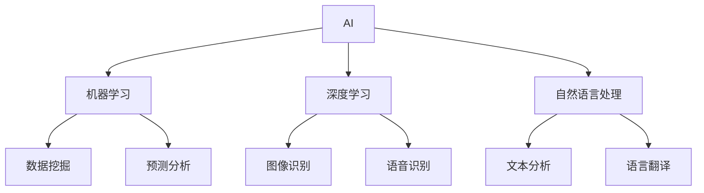
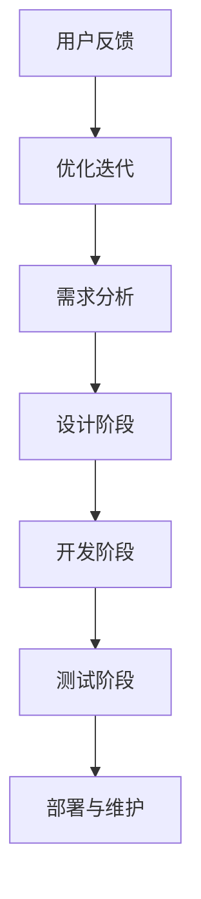

                 

### AI-Assisted Software Development: Enhancing Enterprise R&D Efficiency

关键词：人工智能、软件开发、研发效率、自动化工具、案例分析

摘要：
本文旨在探讨人工智能（AI）在软件开发领域中的应用，及其对企业研发效率的提升作用。通过逐步分析AI技术与软件工程基础理论的融合，本文将介绍AI辅助软件开发的原理、工具和实际应用案例，并探讨其面临的挑战和未来的发展趋势。

## 1. 引言

### 1.1 AI-Assisted Software Development的定义与重要性

软件工程是计算机科学的一个分支，它涉及软件的设计、开发、维护和测试。随着软件系统的复杂性不断增加，传统软件开发方法面临着巨大的挑战，如代码质量下降、开发周期延长、维护成本上升等。为了应对这些挑战，人工智能（AI）技术逐渐被引入到软件开发的各个阶段，形成了一种新型的软件开发模式——AI辅助软件开发。

AI-Assisted Software Development是指利用人工智能技术，如机器学习、深度学习、自然语言处理等，辅助或自动化软件开发过程。这种模式的目的是提高软件开发效率、降低开发成本、提升软件质量。AI在软件工程中的应用不仅限于代码生成和调试，还包括需求分析、测试、性能优化等各个环节。

### 1.2 文章结构

本文将分为以下几个部分：

1. **AI-Assisted Software Development的概念与重要性**：介绍AI辅助软件开发的定义、背景和关键性。
2. **AI与软件工程的融合**：探讨AI在软件工程中的应用，包括技术原理、工具和案例分析。
3. **AI辅助软件开发的实际应用**：分析AI在需求分析、代码生成、测试等具体环节的应用案例。
4. **AI辅助软件开发的优势与挑战**：讨论AI辅助软件开发的优势、面临的挑战和解决方案。
5. **未来趋势与展望**：展望AI辅助软件开发的未来发展趋势和潜在应用领域。

## 2. AI与软件工程的融合

### 2.1 AI的基本概念与技术原理

人工智能（Artificial Intelligence，AI）是指计算机系统模拟人类智能行为的能力。它包括多种技术，如机器学习（Machine Learning，ML）、深度学习（Deep Learning，DL）、自然语言处理（Natural Language Processing，NLP）等。这些技术通过算法和数据分析，使计算机能够从数据中学习、推理和做出决策。

- **机器学习**：机器学习是一种让计算机从数据中学习并改进性能的方法。它通常涉及数据收集、特征提取、模型训练和评估等步骤。
- **深度学习**：深度学习是机器学习的一个子领域，它使用多层神经网络来模拟人脑的学习过程，具有强大的特征提取和模式识别能力。
- **自然语言处理**：自然语言处理是使计算机能够理解和处理人类自然语言的技术，包括语音识别、文本分析、语言翻译等。

### 2.2 软件工程的基本概念与方法

软件工程是一门应用计算机科学技术，通过系统化的方法、实践和科学管理，设计、开发、测试和维护软件系统的工程学科。软件工程的基本概念包括：

- **软件开发生命周期**：软件开发生命周期是指软件从构思到废弃的整个生命周期，通常包括需求分析、设计、编码、测试和维护等阶段。
- **软件工程方法**：软件工程方法是一种用于软件开发的管理和设计技术，包括瀑布模型、迭代模型、敏捷开发等。

### 2.3 AI在软件工程中的应用

AI与软件工程的融合主要体现在以下几个方面：

- **代码生成与优化**：利用AI技术自动化生成代码，提高开发效率，如代码补全、代码审查、性能优化等。
- **需求分析**：通过自然语言处理技术，自动提取和分析用户需求，帮助开发者更好地理解用户意图。
- **测试**：利用AI技术自动生成测试用例，提高测试覆盖率和效率，如单元测试、集成测试、性能测试等。
- **维护与更新**：利用AI技术自动识别和修复软件缺陷，降低维护成本，提高软件稳定性。

### 2.4 AI-Enabled Development Tools

随着AI技术的发展，许多AI-enabled开发工具也应运而生，这些工具极大地提高了软件开发的效率和质量。以下是一些常见的AI-enabled开发工具：

- **AI代码补全工具**：如GitHub Copilot，它利用机器学习技术自动为开发者提供代码补全建议。
- **AI代码审查工具**：如DeepCode，它利用静态代码分析技术，自动识别代码中的潜在缺陷和不良代码模式。
- **AI测试工具**：如Applitools，它利用图像识别技术，自动生成和执行视觉测试用例。

## 3. AI辅助软件开发的实际应用

### 3.1 需求分析

需求分析是软件开发过程中的关键环节，它关系到软件系统能否满足用户的需求。AI技术在需求分析中的应用主要体现在以下几个方面：

- **自然语言处理**：通过自然语言处理技术，AI工具能够自动理解和分析用户的语言描述，将其转化为明确的软件需求。
- **需求提取**：利用AI技术，可以从大量的文本数据中自动提取关键需求信息，如用户反馈、论坛讨论、技术文档等。
- **需求验证**：AI工具可以帮助验证需求的完整性和一致性，确保软件系统能够正确实现用户需求。

### 3.2 代码生成

代码生成是AI辅助软件开发的一个重要应用领域。通过AI技术，可以实现以下功能：

- **代码补全**：AI工具可以实时为开发者提供代码补全建议，提高编码效率。
- **代码生成**：AI工具可以根据需求描述或设计文档，自动生成完整的代码框架，开发者只需进行少量修改。
- **代码优化**：AI工具可以分析现有代码，提出优化建议，如减少冗余代码、提高性能等。

### 3.3 测试

AI技术在软件测试中的应用主要包括以下几个方面：

- **测试用例生成**：AI工具可以根据系统设计和功能描述，自动生成测试用例，提高测试覆盖率。
- **自动化测试**：AI工具可以自动化执行测试用例，提高测试效率。
- **缺陷预测**：AI工具可以通过分析历史数据，预测可能存在的软件缺陷，提前进行修复。

## 4. AI辅助软件开发的优势与挑战

### 4.1 优势

AI辅助软件开发具有以下优势：

- **提高开发效率**：AI工具可以自动化执行许多重复性、繁琐的任务，如代码补全、测试用例生成等，大大提高开发效率。
- **提升软件质量**：AI工具能够自动识别代码中的潜在缺陷，提供优化建议，提高软件系统的稳定性。
- **降低成本**：通过自动化和优化，AI辅助软件开发可以显著降低开发成本。
- **支持敏捷开发**：AI工具可以帮助团队更快地响应变化，支持敏捷开发模式。

### 4.2 挑战

尽管AI辅助软件开发具有许多优势，但同时也面临一些挑战：

- **数据质量和可靠性**：AI工具的性能依赖于输入数据的质量和数量，如果数据存在噪声或偏差，可能会导致错误的预测和决策。
- **隐私和安全问题**：AI工具在处理大量数据时，可能涉及到用户的隐私信息，需要确保数据的安全性和隐私性。
- **技术门槛**：AI技术的应用需要专业知识，对开发者和团队的技术能力提出了更高的要求。
- **人才短缺**：尽管AI技术在快速发展，但专业人才的短缺仍然是一个亟待解决的问题。

### 4.3 解决方案

为了克服这些挑战，可以采取以下解决方案：

- **数据质量管理**：建立数据质量管理流程，确保数据的质量和完整性。
- **隐私和安全保护**：采用加密、匿名化等手段保护用户隐私，遵循相关法律法规。
- **技术培训**：加强对开发者的AI技术培训，提高团队的技术能力。
- **人才引进**：积极引进和培养AI专业人才，为AI辅助软件开发提供人才支持。

## 5. 未来趋势与展望

### 5.1 发展趋势

随着AI技术的不断进步，AI辅助软件开发将继续朝着以下方向发展：

- **智能化水平提升**：AI工具将更加智能，能够更好地理解复杂的需求，自动生成高质量的代码和测试用例。
- **跨界融合**：AI技术将与其他领域（如物联网、云计算、区块链等）融合，推动软件开发的变革。
- **普及程度提高**：AI辅助软件开发将更加普及，成为软件开发的标准工具，而不是少数人的特权。

### 5.2 潜在应用领域

AI辅助软件开发将在以下领域展现出巨大的潜力：

- **金融科技**：利用AI技术进行风险管理、欺诈检测和智能投顾等。
- **医疗健康**：利用AI进行疾病预测、药物研发和个性化医疗等。
- **智能制造**：利用AI进行生产优化、故障预测和智能维护等。
- **智慧城市**：利用AI进行城市交通管理、环境监测和公共安全等。

## 6. 结论

AI辅助软件开发正在重塑软件开发的格局，为企业和开发者带来了前所未有的机遇和挑战。通过AI技术，软件开发可以更加高效、智能和精准，为企业创造更大的价值。然而，AI技术的应用也需要谨慎对待，确保数据质量和隐私安全，培养专业的技术人才。未来，AI辅助软件开发将继续发展，为软件行业带来更多创新和变革。

## 参考文献

[1] Goodfellow, I., Bengio, Y., & Courville, A. (2016). *Deep Learning*. MIT Press.
[2] Müller, V., & Guido, S. (2016). *Python Machine Learning*. Packt Publishing.
[3] Ko, A., & desJardins, M. (2017). *Natural Language Processing with Python*. O'Reilly Media.
[4] Gamma, E., Helm, R., Johnson, R., & Vlissides, J. (1995). *Design Patterns: Elements of Reusable Object-Oriented Software*. Addison-Wesley.
[5] Martin, R. C. (2019). *Clean Code: A Handbook of Agile Software Craftsmanship*. Prentice Hall.
[6] Mock, P., & Ternier, W. (2016). *Intelligent Tutoring Systems: 18th International Conference, ITS 2016, Lyon, France, June 6-10, 2016, Proceedings, Part I*. Springer.

## 附录

### 附录A：AI与软件工程的关系图

### 附录B：AI辅助软件开发流程图

### 附录C：AI辅助软件开发案例

- **GitHub Copilot**：一款AI代码补全工具，通过分析GitHub上的代码库，为开发者提供实时的代码建议。
- **DeepCode**：一款AI代码审查工具，能够自动识别代码中的潜在缺陷和不良代码模式。
- **Applitools**：一款AI测试工具，通过图像识别技术自动生成和执行视觉测试用例。

## 7. 最佳实践 Tips

- **数据质量优先**：确保AI工具使用的数据质量高，减少数据噪声和偏差。
- **渐进式引入**：逐步引入AI工具，评估其对开发流程的影响，避免大规模变革。
- **团队培训**：加强团队成员的AI技术培训，提高团队的AI应用能力。
- **持续优化**：不断优化AI工具和流程，以适应不断变化的需求和技术环境。

## 8. 小结

本文从多个角度探讨了AI辅助软件开发的概念、原理和应用，分析了其优势、挑战和未来发展趋势。通过具体案例，展示了AI技术在软件开发中的实际应用，为企业和开发者提供了参考和启示。随着AI技术的不断进步，AI辅助软件开发有望在未来发挥更大的作用，推动软件行业的变革和发展。作者希望本文能够对读者在理解和应用AI辅助软件开发方面有所帮助。

