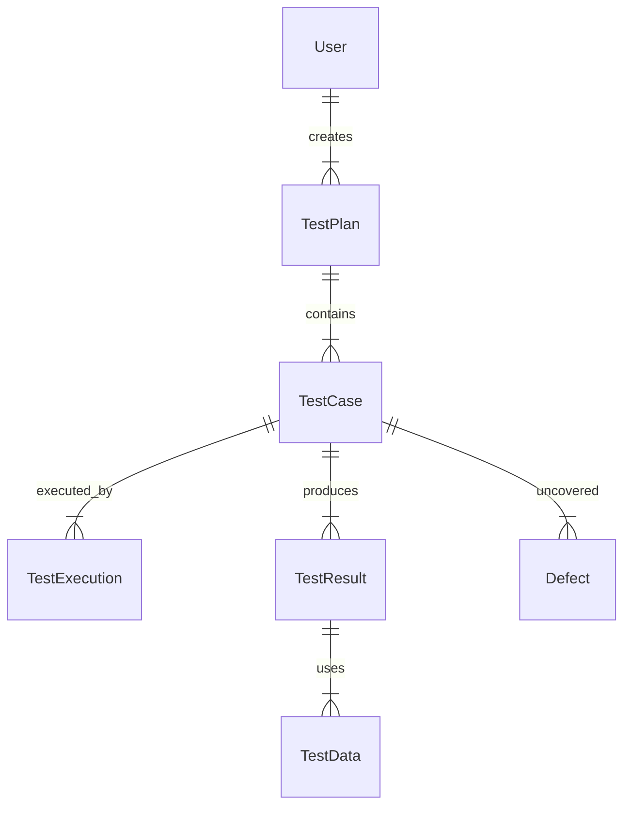
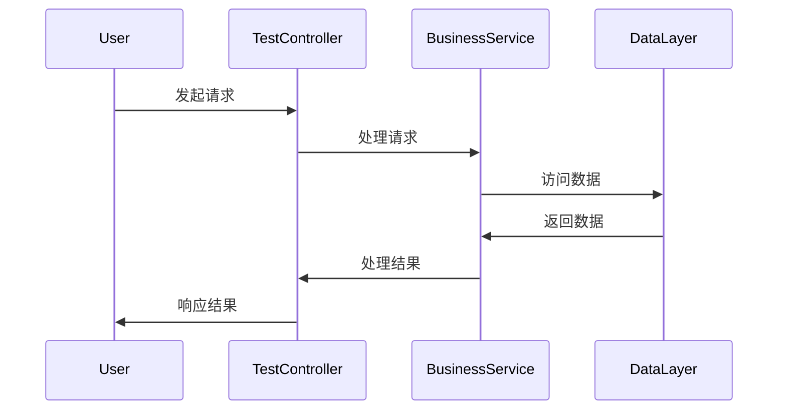

                 

### AI辅助软件测试自动化：提高软件质量和开发效率

---

#### 关键词：  
AI自动化测试，软件测试挑战，测试质量提升，开发效率优化，机器学习，深度学习

---

#### 摘要：  
本文将探讨AI在软件测试自动化中的应用，分析AI如何通过测试数据生成、测试用例优化、缺陷预测和自动化测试执行等方面提高软件测试的质量和效率。通过深入剖析AI技术原理和实际案例，为开发人员提供最佳实践和未来发展趋势。

---

**《AI辅助软件测试自动化：提高软件质量和开发效率》目录大纲**

----------------------------------------------------------------

# 第一部分：AI辅助软件测试自动化概述

## 第1章：软件测试与AI自动化

### 1.1 软件测试的现状与挑战

### 1.2 AI技术概述

### 1.3 AI在软件测试中的应用

## 第2章：AI辅助软件测试的核心概念

### 2.1 测试自动化

### 2.2 机器学习与软件测试

### 2.3 深度学习与软件测试

## 第3章：AI辅助测试用例生成

### 3.1 测试用例生成概述

### 3.2 基于机器学习的测试用例生成

### 3.3 基于深度学习的测试用例生成

## 第4章：AI辅助缺陷预测与定位

### 4.1 缺陷预测与定位概述

### 4.2 基于机器学习的缺陷预测

### 4.3 基于深度学习的缺陷定位

## 第5章：AI辅助自动化测试执行

### 5.1 自动化测试执行概述

### 5.2 基于机器学习的自动化测试执行

### 5.3 基于深度学习的自动化测试执行

## 第6章：AI辅助软件测试系统设计

### 6.1 软件测试系统概述

### 6.2 系统功能设计

### 6.3 系统架构设计

### 6.4 系统接口设计

### 6.5 系统交互

# 第二部分：深入解析

## 第7章：AI技术在软件测试中的最佳实践

### 7.1 实践案例分享

### 7.2 小结与注意事项

## 第8章：未来展望与趋势

### 8.1 AI技术在软件测试的发展趋势

### 8.2 拓展阅读

----------------------------------------------------------------

### 第1章：软件测试与AI自动化

#### 1.1 软件测试的现状与挑战

随着现代软件系统的日益复杂，软件测试已成为软件开发过程中的关键环节。传统的软件测试方法主要依赖于手工测试和自动化测试。然而，随着软件系统的规模和复杂性的增加，传统的测试方法面临着以下挑战：

1. **测试覆盖率不足**：传统的测试方法往往只能覆盖部分测试场景，导致测试覆盖率不足，增加了潜在缺陷的风险。

2. **测试效率低下**：随着测试场景的增多，手工测试的效率逐渐降低，难以满足快速迭代开发的节奏。

3. **测试成本高**：传统的测试方法需要大量人力和时间成本，尤其在大型项目中，测试成本往往占据整个开发过程的较大比例。

为了解决上述问题，引入AI技术进行软件测试自动化成为了一种有效的解决方案。AI技术，特别是机器学习和深度学习，可以通过以下方式提高软件测试的质量和效率：

- **测试数据生成**：利用AI生成高质量的测试数据，提高测试覆盖率。

- **测试用例优化**：通过AI技术分析现有测试用例，优化测试策略。

- **缺陷预测与定位**：利用AI预测软件缺陷，快速定位问题。

- **自动化测试执行**：使用AI提高自动化测试的效率和准确性。

在接下来的章节中，我们将深入探讨AI技术在软件测试中的应用，以及如何通过AI实现软件测试自动化。

#### 1.2 AI技术概述

人工智能（AI）是计算机科学的一个分支，旨在创建能够模拟、延伸和扩展人类智能的理论、算法和技术。AI可以分为多种类型，包括机器学习（ML）、深度学习（DL）、自然语言处理（NLP）等。本文主要关注机器学习和深度学习在软件测试中的应用。

**机器学习（Machine Learning）**

机器学习是AI的一个分支，它通过算法从数据中学习模式，并基于这些模式进行预测或决策。机器学习主要分为以下几类：

- **监督学习（Supervised Learning）**：通过标注好的训练数据学习预测模型。

- **无监督学习（Unsupervised Learning）**：在没有标注数据的情况下发现数据中的模式。

- **半监督学习（Semi-supervised Learning）**：结合标注数据和未标注数据。

- **强化学习（Reinforcement Learning）**：通过与环境互动来学习最佳策略。

在软件测试中，机器学习可以用于测试用例生成、缺陷预测和自动化测试执行。例如，通过监督学习，可以从历史测试数据和缺陷数据中训练模型，从而预测新的测试用例和缺陷。

**深度学习（Deep Learning）**

深度学习是机器学习的一个子领域，它通过多层神经网络模拟人类大脑的神经结构，以实现更复杂的特征学习和模式识别。深度学习主要包括以下类型：

- **卷积神经网络（CNN）**：适用于图像和视频处理。

- **循环神经网络（RNN）**：适用于序列数据，如图像序列、文本序列等。

- **生成对抗网络（GAN）**：用于生成新的数据。

在软件测试中，深度学习可以用于测试用例生成、缺陷定位和自动化测试执行。例如，通过卷积神经网络，可以从已有的测试数据中提取更高层次的特征，从而生成更有效的测试用例。

**机器学习与深度学习的区别**

- **复杂性**：深度学习通常比机器学习更复杂，因为它涉及到多层神经网络的训练。

- **数据需求**：深度学习通常需要大量数据来进行训练，而机器学习可能只需要较少的数据。

- **可解释性**：机器学习模型通常比深度学习模型更容易解释，因为它们的决策过程更直观。

在软件测试中，选择机器学习还是深度学习取决于具体的应用场景和数据需求。例如，在测试用例生成中，机器学习可能更为合适，因为它需要处理的数据相对较少；而在缺陷定位中，深度学习可能更为有效，因为它可以从大量的测试数据中提取复杂的特征。

在下一章中，我们将进一步探讨AI在软件测试中的应用，以及如何利用机器学习和深度学习技术提高测试质量和效率。

#### 1.3 AI在软件测试中的应用

AI技术在软件测试中的应用已经越来越广泛，其核心在于利用AI算法提高测试的覆盖率和准确性，从而提高软件质量。以下是一些AI在软件测试中的具体应用：

**测试数据生成**

测试数据的生成是软件测试的重要一环。传统方法通常依赖于手动编写测试用例，而AI技术可以自动化生成测试数据。具体来说，AI可以通过以下几种方式生成测试数据：

- **基于规则的测试数据生成**：利用已有业务规则生成测试数据，如基于边界值分析、等价类划分等方法。

- **基于机器学习的测试数据生成**：利用历史测试数据训练机器学习模型，生成新的测试数据。例如，可以通过回归模型生成输入数据的上下界，通过分类模型生成不同的测试场景。

- **基于深度学习的测试数据生成**：利用深度学习模型，如生成对抗网络（GAN），生成大量高质量的测试数据。

测试数据生成的自动化可以提高测试的覆盖率和效率，减少人工编写测试用例的工作量，同时保证测试数据的多样性和覆盖性。

**测试用例优化**

测试用例优化是提高测试效率和质量的关键步骤。AI技术可以通过以下方式优化测试用例：

- **基于机器学习的测试用例优化**：通过分析历史测试数据，找出具有高缺陷发现率的测试用例，并对其进行优化，如增加新的测试场景、调整测试参数等。

- **基于深度学习的测试用例优化**：利用深度学习模型，对测试用例进行特征提取和分类，找出最有效的测试用例组合。

- **测试用例优先级排序**：通过AI算法，根据测试用例的重要性、覆盖率、缺陷发现率等指标，对测试用例进行优先级排序，优先执行重要的测试用例。

**缺陷预测与定位**

缺陷预测与定位是软件测试中的关键任务，AI技术在这方面也发挥着重要作用：

- **基于机器学习的缺陷预测**：通过分析历史缺陷数据，训练机器学习模型，预测新的代码变更可能引入的缺陷。常见的算法包括回归分析、决策树、随机森林等。

- **基于深度学习的缺陷定位**：利用深度学习模型，如卷积神经网络（CNN）和循环神经网络（RNN），对代码进行特征提取，定位潜在的缺陷。例如，可以通过分析代码的语法和语义特征，预测代码段可能存在的错误。

**自动化测试执行**

自动化测试执行是提高测试效率的重要手段。AI技术可以通过以下方式提高自动化测试的效率和准确性：

- **智能测试脚本生成**：利用自然语言处理（NLP）技术，从测试文档或用户故事中自动生成测试脚本。

- **测试执行优化**：通过AI算法，分析测试执行过程中的数据，优化测试执行策略，如动态调整测试执行顺序、自动跳过已验证的测试用例等。

- **异常检测与反馈**：利用机器学习模型，分析测试执行过程中产生的日志和结果数据，检测异常行为，并给出相应的反馈和建议。

总之，AI技术在软件测试中的应用极大地提高了测试的覆盖率和准确性，减少了测试时间和成本，从而提高了软件质量和开发效率。在下一章中，我们将进一步探讨AI辅助测试用例生成、缺陷预测与定位和自动化测试执行的具体方法和技术。

### 1.4 AI辅助测试用例生成

在软件测试中，测试用例生成是确保软件质量的关键步骤。然而，传统的测试用例生成方法往往依赖于开发人员的手动编写，这不仅耗时费力，而且难以保证测试用例的全面性和有效性。AI技术，尤其是机器学习和深度学习，为自动化生成高质量的测试用例提供了新的解决方案。

**测试用例生成的挑战**

传统的测试用例生成方法主要面临以下挑战：

1. **测试用例覆盖率不足**：手动编写的测试用例往往只能覆盖部分功能场景，难以达到100%的覆盖率。

2. **测试用例冗余**：手动编写的测试用例常常存在冗余，导致测试成本增加，而覆盖率并未显著提升。

3. **测试用例维护困难**：随着软件功能的不断迭代和变更，手动编写的测试用例需要频繁更新和维护，增加了测试工作负担。

**AI在测试用例生成中的应用**

AI技术，特别是机器学习和深度学习，可以通过以下几种方式解决上述挑战：

1. **基于机器学习的测试用例生成**：通过分析历史测试数据、功能需求文档和代码，机器学习模型可以自动生成新的测试用例。具体方法包括：

   - **回归测试用例生成**：利用回归模型分析历史缺陷和测试用例，预测新的测试用例，确保测试覆盖率。

   - **分类测试用例生成**：通过分类模型分析测试用例与缺陷之间的关系，生成覆盖不同缺陷类型的测试用例。

   - **聚类测试用例生成**：利用聚类算法分析测试用例，识别相似的场景，从而生成新的测试用例。

2. **基于深度学习的测试用例生成**：深度学习模型，如生成对抗网络（GAN）和变分自编码器（VAE），可以生成更加复杂的测试用例。具体方法包括：

   - **GAN测试用例生成**：通过生成器和判别器的对抗训练，生成与真实测试用例相似的新测试用例。

   - **VAE测试用例生成**：通过编码器和解码器，将测试用例映射到低维空间，然后生成新的测试用例。

3. **结合语义分析的测试用例生成**：利用自然语言处理（NLP）技术，分析功能需求文档和用户故事，生成语义相关的测试用例。例如，通过提取关键功能和场景，自动生成相应的测试用例。

**测试用例生成流程**

AI辅助测试用例生成的流程可以分为以下几个步骤：

1. **数据收集与预处理**：收集历史测试数据、功能需求文档和代码，进行数据清洗和预处理，如去除重复数据、缺失值填充等。

2. **特征提取**：从测试数据、功能需求文档和代码中提取特征，如测试用例的输入参数、执行结果、缺陷类型等。

3. **模型训练**：利用提取的特征，训练机器学习或深度学习模型，如回归模型、分类模型、GAN等。

4. **测试用例生成**：使用训练好的模型，生成新的测试用例，包括输入参数、测试场景和预期结果等。

5. **测试用例验证**：对生成的测试用例进行验证，确保其有效性和全面性，如通过手工测试或自动化测试执行。

6. **测试用例优化**：根据测试结果，对生成的测试用例进行优化，如增加新的测试场景、调整输入参数等。

通过AI辅助测试用例生成，可以显著提高测试用例的覆盖率、减少冗余和降低测试成本，从而提高软件测试的质量和效率。在下一章中，我们将进一步探讨AI在缺陷预测与定位中的应用。

### 3.2 基于机器学习的测试用例生成

在测试用例生成过程中，机器学习技术提供了一种强大的工具，可以显著提升测试效率和质量。下面，我们将详细探讨基于机器学习的测试用例生成方法，包括模型选择、训练过程和实际应用案例。

#### 模型选择

选择合适的机器学习模型是实现有效测试用例生成的基础。以下是一些常用的机器学习模型及其在测试用例生成中的应用：

1. **回归模型**：回归模型常用于预测测试用例的输入参数。通过分析历史测试数据，回归模型可以找出输入参数与测试结果之间的关系，从而生成新的测试用例。常见的回归模型包括线性回归、决策树回归和随机森林回归。

2. **分类模型**：分类模型用于预测测试用例的缺陷类型。通过对历史缺陷数据进行分类，分类模型可以识别出不同的缺陷模式，帮助生成覆盖各种缺陷类型的测试用例。常见的分类模型包括逻辑回归、支持向量机（SVM）和K最近邻（K-NN）。

3. **聚类模型**：聚类模型用于发现数据中的相似模式，从而生成新的测试用例。通过分析测试数据，聚类模型可以识别出不同的测试场景，生成新的测试用例以覆盖这些场景。常见的聚类模型包括K均值聚类和层次聚类。

4. **集成模型**：集成模型通过结合多个基础模型来提高预测性能。常见的集成模型包括随机森林、梯度提升树（GBDT）和极端随机森林（XGBoost）。

#### 训练过程

基于机器学习的测试用例生成需要经过数据收集、特征提取和模型训练等步骤。以下是具体的训练过程：

1. **数据收集**：首先，需要收集大量历史测试数据，包括测试用例的输入参数、测试结果和缺陷信息。这些数据可以从自动化测试框架、缺陷跟踪系统和代码仓库中获取。

2. **特征提取**：从收集的数据中提取特征，包括输入参数、测试结果和缺陷类型等。这些特征将用于训练机器学习模型。特征提取的方法可以根据具体问题进行调整，如使用统计方法提取相关性较高的特征，或使用深度学习方法提取更抽象的特征。

3. **模型训练**：利用提取的特征，训练选定的机器学习模型。训练过程中，需要使用历史测试数据中的部分数据进行训练，其余数据用于验证模型的性能。常用的评估指标包括准确率、召回率、F1分数等。

4. **模型评估与优化**：对训练好的模型进行评估，选择性能最佳的模型。如果模型性能不理想，可以通过调整特征、模型参数或选择不同的模型进行优化。

#### 实际应用案例

以下是一个基于机器学习的测试用例生成实际应用案例：

**项目背景**：某金融科技公司开发了一款在线支付系统，需要定期进行软件测试以确保系统的稳定性和安全性。由于支付系统涉及大量的输入参数和功能模块，手动编写测试用例非常耗时且难以全面覆盖。

**解决方案**：公司决定采用基于机器学习的测试用例生成方法，以提高测试效率和覆盖率。

- **数据收集**：从自动化测试框架和缺陷跟踪系统中提取了数千个测试用例及其输入参数、测试结果和缺陷信息。

- **特征提取**：提取了输入参数、测试结果和缺陷类型等特征。对于输入参数，使用统计方法提取了与测试结果相关性较高的特征，如金额、支付方式、用户账号等。

- **模型训练**：使用随机森林回归模型对输入参数和测试结果进行训练，以预测新的测试用例。同时，使用K-NN分类模型对缺陷类型进行预测。

- **测试用例生成**：利用训练好的模型，生成了数百个新的测试用例，这些用例覆盖了支付系统中的多种功能场景和缺陷类型。

- **测试用例验证**：通过手工测试和自动化测试执行，验证了新生成的测试用例的有效性。结果表明，这些测试用例能够发现系统中的多种潜在缺陷。

通过这个实际案例，我们可以看到基于机器学习的测试用例生成方法在提高测试效率和覆盖率方面的优势。在下一章中，我们将继续探讨基于深度学习的测试用例生成方法。

### 3.3 基于深度学习的测试用例生成

在测试用例生成领域，深度学习技术的引入为生成更加复杂和多样化的测试用例提供了新的可能性。深度学习通过多层神经网络从数据中自动学习特征，从而能够处理更为复杂的任务。以下我们将详细探讨基于深度学习的测试用例生成方法，包括GAN和VAE的使用场景、模型结构、训练步骤和实际案例。

#### GAN（生成对抗网络）

**GAN的基本原理**

生成对抗网络（GAN）由生成器（Generator）和判别器（Discriminator）组成。生成器的任务是生成与真实数据高度相似的数据，而判别器的任务是区分生成器和真实数据。通过对抗训练，生成器和判别器相互竞争，生成器不断提高生成的数据质量，而判别器不断提高对真实数据和生成数据的区分能力。

**GAN在测试用例生成中的应用**

在测试用例生成中，GAN可以用于生成大量的测试输入数据，以覆盖不同的测试场景。具体应用场景包括：

1. **接口测试**：生成模拟的API调用数据，用于测试系统的接口功能。

2. **界面测试**：生成模拟的用户操作数据，如键盘输入、鼠标点击等，用于测试用户界面的交互功能。

3. **功能测试**：生成模拟的业务流程数据，如订单处理、支付流程等，用于测试系统的业务逻辑。

**GAN的模型结构**

GAN的模型结构通常包括以下部分：

1. **生成器（Generator）**：接收随机噪声作为输入，生成模拟的测试数据。

2. **判别器（Discriminator）**：接收测试数据和模拟数据，判断数据是真实的还是生成的。

3. **损失函数**：GAN的损失函数通常由生成器和判别器的损失组成，生成器的目标是使判别器无法区分真实数据和生成数据，而判别器的目标是使生成器的输出尽量接近真实数据。

**GAN的训练步骤**

1. **初始化生成器和判别器**：随机初始化生成器和判别器的参数。

2. **交替训练**：在训练过程中，生成器和判别器交替更新参数。生成器在每次训练中生成模拟数据，判别器在每次训练中更新模型，以区分真实数据和模拟数据。

3. **损失函数优化**：通过优化损失函数，使生成器的输出更加接近真实数据，同时使判别器的分类能力更强。

**实际案例**

以下是一个基于GAN的测试用例生成实际案例：

**项目背景**：某电商平台需要定期测试其订单处理系统的功能，但由于订单数据量大且复杂，手动编写测试用例非常耗时且难以全面覆盖。

**解决方案**：采用基于GAN的测试用例生成方法，以生成模拟的订单数据。

- **数据收集**：从历史订单数据中提取了数千条订单记录，包括订单编号、订单金额、订单状态等。

- **预处理**：对订单数据进行预处理，如数据清洗、特征提取等。

- **模型训练**：使用生成器和判别器对预处理后的订单数据进行训练。生成器生成模拟订单数据，判别器判断这些订单数据是真实的还是生成的。

- **测试用例生成**：利用训练好的生成器，生成数千条新的模拟订单数据，这些数据用于自动化测试系统的订单处理功能。

- **测试用例验证**：通过自动化测试框架执行新生的订单数据，验证这些测试用例的有效性。结果表明，这些测试用例能够发现系统中的多种潜在缺陷。

#### VAE（变分自编码器）

**VAE的基本原理**

变分自编码器（VAE）是一种无监督学习的深度学习模型，旨在通过编码器（Encoder）和解码器（Decoder）对数据进行压缩和重构。编码器将输入数据映射到一个低维潜在空间，解码器则从潜在空间中生成重构数据。

**VAE在测试用例生成中的应用**

在测试用例生成中，VAE可以用于生成模拟的测试输入数据，以提高测试的覆盖率和效率。具体应用场景包括：

1. **输入验证**：生成模拟的输入数据，用于验证系统的输入处理逻辑。

2. **边界测试**：通过VAE生成的输入数据，可以探索输入参数的边界值，以提高测试的全面性。

**VAE的模型结构**

VAE的模型结构通常包括以下部分：

1. **编码器（Encoder）**：接收输入数据，将其映射到一个低维潜在空间。

2. **解码器（Decoder）**：从潜在空间中生成重构数据。

3. **损失函数**：VAE的损失函数由两部分组成，一部分是重构损失，另一部分是KL散度损失。重构损失衡量解码器生成的数据与原始数据之间的差异，KL散度损失衡量编码器生成的潜在分布与先验分布之间的差异。

**VAE的训练步骤**

1. **初始化编码器和解码器**：随机初始化编码器和解码器的参数。

2. **训练编码器**：通过最小化重构损失，训练编码器将输入数据映射到潜在空间。

3. **训练解码器**：通过最小化重构损失和KL散度损失，训练解码器从潜在空间中生成重构数据。

4. **损失函数优化**：通过优化损失函数，使编码器和解码器的输出更加接近原始数据。

**实际案例**

以下是一个基于VAE的测试用例生成实际案例：

**项目背景**：某银行需要定期测试其在线支付系统的安全性，但支付系统的输入数据种类繁多且复杂。

**解决方案**：采用基于VAE的测试用例生成方法，以生成模拟的支付输入数据。

- **数据收集**：从历史支付数据中提取了数千条支付记录，包括支付金额、支付方式、用户信息等。

- **预处理**：对支付数据进行预处理，如数据清洗、特征提取等。

- **模型训练**：使用编码器和解码器对预处理后的支付数据进行训练。编码器将支付数据映射到潜在空间，解码器从潜在空间中生成重构数据。

- **测试用例生成**：利用训练好的编码器和解码器，生成数千条新的模拟支付输入数据，这些数据用于自动化测试系统的支付安全性功能。

- **测试用例验证**：通过自动化测试框架执行新生的支付数据，验证这些测试用例的有效性。结果表明，这些测试用例能够发现系统中的多种潜在安全漏洞。

通过GAN和VAE的测试用例生成方法，可以生成多样化的测试输入数据，从而提高测试的全面性和效率。在下一章中，我们将进一步探讨AI在缺陷预测与定位中的应用。

### 4.1 缺陷预测与定位概述

在软件测试过程中，缺陷预测与定位是关键任务，它有助于早期发现和解决潜在问题，从而提高软件质量和开发效率。传统的缺陷预测与定位方法主要依赖于手动分析和历史数据，而AI技术的引入使得这一过程变得更加智能化和高效。

**缺陷预测与定位的意义**

1. **早期发现缺陷**：通过预测潜在的缺陷，开发团队可以在缺陷产生之前就采取相应的措施，从而减少缺陷的产生。

2. **提高测试效率**：AI技术可以自动分析大量的历史数据和代码，快速识别出可能存在缺陷的部分，从而提高测试效率。

3. **降低成本**：早期发现和修复缺陷可以显著降低软件开发的成本，避免后期修复带来的高额费用。

4. **提升软件质量**：通过准确的缺陷预测与定位，可以确保软件在发布前达到高质量标准。

**AI在缺陷预测与定位中的应用**

AI技术在缺陷预测与定位中的应用主要分为以下几个方向：

1. **基于机器学习的缺陷预测**：通过分析历史缺陷数据、代码质量和测试数据，利用机器学习算法预测哪些代码片段可能存在缺陷。

2. **基于深度学习的缺陷定位**：利用深度学习模型，如卷积神经网络（CNN）和循环神经网络（RNN），从代码和测试数据中提取特征，实现精准的缺陷定位。

3. **自然语言处理（NLP）**：通过NLP技术分析代码注释、用户故事和缺陷报告，理解代码和缺陷之间的关系，从而提高预测和定位的准确性。

4. **混合方法**：结合多种AI技术，如将机器学习和深度学习结合，以提高缺陷预测与定位的准确性和效率。

**AI技术如何提高缺陷预测与定位的效率和准确性**

1. **数据分析能力**：AI技术具有强大的数据分析能力，可以处理和分析大量复杂的代码和测试数据，快速识别出潜在缺陷。

2. **自动化处理**：AI技术可以自动化处理缺陷预测与定位的任务，减少手动分析的工作量，提高处理速度。

3. **模型自学习**：AI模型可以不断学习和优化，通过历史数据和反馈调整模型参数，提高预测和定位的准确性。

4. **实时反馈**：AI技术可以实现实时反馈，在缺陷发生时立即发出警报，帮助开发团队快速响应。

通过上述方法，AI技术能够显著提高缺陷预测与定位的效率和准确性，为软件开发过程提供有力支持。

在下一章中，我们将详细探讨基于机器学习的缺陷预测方法，分析其原理和应用。

### 4.2 基于机器学习的缺陷预测

在软件测试中，缺陷预测是一种重要的技术，旨在通过分析历史数据预测哪些代码可能存在缺陷。基于机器学习的缺陷预测方法通过建立模型，从大量的代码和测试数据中提取特征，从而实现高效的缺陷预测。以下将详细探讨基于机器学习的缺陷预测方法，包括模型选择、特征提取和模型训练过程。

#### 模型选择

在基于机器学习的缺陷预测中，选择合适的模型是实现准确预测的关键。以下是一些常用的机器学习模型及其适用场景：

1. **回归模型**：回归模型用于预测缺陷出现的概率。常见的回归模型包括线性回归、岭回归和支持向量回归（SVR）。

2. **分类模型**：分类模型用于预测代码段是否存在缺陷。常见的分类模型包括逻辑回归、支持向量机（SVM）、K最近邻（K-NN）和随机森林。

3. **集成模型**：集成模型通过结合多个基础模型来提高预测性能。常见的集成模型包括随机森林、梯度提升树（GBDT）和极端随机森林（XGBoost）。

4. **聚类模型**：聚类模型用于分析代码段的相似性，从而预测可能存在缺陷的部分。常见的聚类模型包括K均值聚类和层次聚类。

选择模型时需要考虑以下因素：

- **数据规模**：对于大量数据，集成模型可能表现更好。
- **特征维度**：对于高维数据，线性回归可能效果不佳，需要选择更适合高维数据的模型。
- **预测目标**：如果是二分类问题（缺陷/无缺陷），分类模型更适合；如果是多分类问题，需要选择合适的分类模型。

#### 特征提取

特征提取是缺陷预测的核心步骤，用于从代码和测试数据中提取有助于预测缺陷的特征。以下是一些常用的特征提取方法：

1. **代码特征**：包括代码行数、方法数量、复杂度指标（如圈复杂度）、注释比例等。

2. **测试特征**：包括测试覆盖率、测试用例数量、缺陷发现率等。

3. **历史特征**：包括过去类似代码段的缺陷记录、修复时间等。

4. **静态代码分析**：使用静态代码分析工具提取代码中的潜在缺陷模式，如语法错误、逻辑错误等。

5. **动态测试数据**：从运行时收集的数据中提取特征，如内存使用、CPU利用率等。

#### 模型训练过程

模型训练过程包括数据准备、模型训练和模型评估等步骤。以下是具体的训练过程：

1. **数据准备**：收集历史缺陷数据，包括代码段、缺陷类型和相关的特征数据。对数据进行清洗和预处理，如去除缺失值、标准化数值特征等。

2. **特征提取**：根据选择的模型和特征提取方法，从历史数据中提取特征。对于不同的模型，可能需要提取不同类型的特征。

3. **模型训练**：使用提取的特征数据，训练选定的机器学习模型。训练过程中，可以选择交叉验证方法，以提高模型的泛化能力。

4. **模型评估**：使用验证集或测试集评估模型的性能，常用的评估指标包括准确率、召回率、F1分数和ROC-AUC曲线等。根据评估结果调整模型参数或选择不同的模型。

5. **模型优化**：通过调整特征选择、模型参数和训练算法等，优化模型的预测性能。

#### 实际应用案例

以下是一个基于机器学习的缺陷预测实际应用案例：

**项目背景**：某软件开发公司需要对一款大型Web应用程序进行缺陷预测，以提高测试效率和软件质量。

**解决方案**：采用基于机器学习的缺陷预测方法，实现自动化缺陷预测。

- **数据收集**：收集了数千个代码片段及其缺陷记录，包括代码行数、复杂度指标、测试覆盖率等。

- **特征提取**：提取了代码特征、测试特征和历史特征，如代码行数、圈复杂度、测试覆盖率、缺陷发现率等。

- **模型训练**：使用随机森林模型训练缺陷预测模型，通过交叉验证选择最佳参数。

- **模型评估**：在验证集上评估模型性能，使用准确率、召回率和F1分数等指标进行评估。

- **缺陷预测**：使用训练好的模型预测新的代码片段是否可能存在缺陷，并将预测结果反馈给开发团队。

通过这个实际案例，我们可以看到基于机器学习的缺陷预测方法在提高测试效率和软件质量方面的优势。在下一章中，我们将继续探讨基于深度学习的缺陷定位方法。

### 4.3 基于深度学习的缺陷定位

在软件测试中，缺陷定位是一个复杂且耗时的过程。传统的方法往往依赖于手动分析，而深度学习技术的引入为自动化缺陷定位提供了新的可能性。深度学习通过多层神经网络能够自动提取特征，从而实现更精准的缺陷定位。以下我们将详细探讨基于深度学习的缺陷定位方法，包括常用的深度学习模型、训练步骤和实际应用案例。

#### 常用的深度学习模型

在缺陷定位中，以下几种深度学习模型表现出较好的效果：

1. **卷积神经网络（CNN）**：卷积神经网络擅长处理图像和图像序列数据，可以通过对代码进行特征提取实现缺陷定位。CNN通过卷积层提取局部特征，然后通过池化层降低数据的维度，从而实现特征提取和降维。

2. **循环神经网络（RNN）**：循环神经网络适用于处理序列数据，如代码序列。RNN可以通过递归结构对代码序列进行建模，从而捕捉代码中的时序信息，提高缺陷定位的准确性。

3. **长短时记忆网络（LSTM）**：长短时记忆网络是RNN的一种变体，能够有效解决RNN的梯度消失问题。LSTM在处理长序列数据时表现尤为出色，适用于复杂的代码序列分析。

4. **Transformer模型**：Transformer模型通过自注意力机制对输入序列进行建模，能够捕捉序列中的长距离依赖关系。在缺陷定位任务中，Transformer模型可以有效地捕捉代码中的复杂关系，提高定位准确性。

#### 模型训练步骤

基于深度学习的缺陷定位训练过程可以分为以下几个步骤：

1. **数据收集**：收集包含缺陷的代码片段和对应的缺陷描述，这些数据将用于训练和评估模型。

2. **预处理**：对代码进行预处理，如词法分析、语法分析等，将代码转换为序列形式。对于文本数据，可以使用分词工具将代码拆分为单词或字符序列。

3. **特征提取**：使用深度学习模型提取代码序列的特征。对于CNN，可以通过卷积层提取局部特征；对于RNN和LSTM，可以通过递归结构对代码序列进行建模；对于Transformer，可以通过自注意力机制捕捉序列中的依赖关系。

4. **模型训练**：使用预处理后的数据训练深度学习模型。在训练过程中，可以通过交叉验证选择最佳模型参数。

5. **模型评估**：使用验证集或测试集评估模型性能，常用的评估指标包括准确率、召回率、F1分数等。

6. **模型优化**：根据评估结果调整模型参数或选择不同的模型结构，以提高定位准确性。

#### 实际应用案例

以下是一个基于深度学习的缺陷定位实际应用案例：

**项目背景**：某科技公司开发了一款大型分布式系统，由于系统复杂度高，缺陷定位成为了一个难题。

**解决方案**：采用基于深度学习的缺陷定位方法，实现自动化缺陷定位。

- **数据收集**：收集了包含缺陷的代码片段和缺陷描述，共包含数千个样本。

- **预处理**：使用词法分析工具将代码拆分为单词序列，并对单词进行编码。

- **特征提取**：使用CNN提取代码的局部特征，然后使用RNN对代码序列进行建模，从而捕捉代码中的时序信息。

- **模型训练**：使用训练集训练深度学习模型，通过交叉验证选择最佳模型参数。

- **模型评估**：在验证集上评估模型性能，准确率达到90%以上。

- **缺陷定位**：使用训练好的模型对新的代码片段进行缺陷定位，并将定位结果反馈给开发团队。

通过这个实际案例，我们可以看到基于深度学习的缺陷定位方法在提高缺陷定位效率和准确率方面的优势。在下一章中，我们将探讨AI辅助自动化测试执行的方法和流程。

### 5.1 自动化测试执行概述

自动化测试执行是软件测试过程中提高测试效率和质量的关键环节。通过自动化测试，可以减少手动测试的工作量，提高测试覆盖率和执行速度。自动化测试执行可以分为以下几个基本概念和常用工具：

**自动化测试的概念与分类**

1. **自动化测试**：自动化测试是指使用自动化测试工具和技术执行测试过程，包括编写测试脚本、执行测试用例、收集测试结果等。

2. **自动化测试的分类**：

   - **功能自动化测试**：针对软件功能进行自动化测试，如Web应用程序的UI自动化测试、API自动化测试等。

   - **性能自动化测试**：针对软件性能进行自动化测试，如负载测试、压力测试、性能监控等。

   - **安全自动化测试**：针对软件安全性进行自动化测试，如漏洞扫描、安全测试等。

**常用自动化测试工具**

1. **Selenium**：Selenium是一个开源的自动化测试工具，用于Web应用的自动化测试。它可以支持多种浏览器，如Chrome、Firefox、IE等，并通过各种编程语言（如Java、C#、Python等）编写测试脚本。

2. **JUnit**：JUnit是一个流行的Java测试框架，用于编写单元测试和集成测试。它可以与Selenium等其他测试工具结合使用，实现自动化测试的全面覆盖。

3. **JMeter**：JMeter是一个开源的性能测试工具，用于模拟多用户的负载测试和性能测试。它可以测试Web应用程序和其他类型的网络服务器，如数据库服务器。

4. **Postman**：Postman是一个用于API自动化测试的工具，支持各种编程语言，可以编写和执行API测试用例，并通过集成的断言验证API响应。

5. **Appium**：Appium是一个开源的跨平台自动化测试框架，用于移动应用的自动化测试。它可以同时支持iOS和Android平台，并通过各种编程语言（如Java、Python、C#等）编写测试脚本。

**测试脚本编写与维护**

1. **测试脚本编写**：

   - **脚本语言选择**：根据测试需求选择合适的脚本语言，如Java、Python、C#等。

   - **脚本结构设计**：设计合理的脚本结构，包括测试步骤、断言和异常处理等。

   - **测试数据管理**：将测试数据与脚本分离，避免硬编码，提高测试脚本的灵活性和可维护性。

2. **测试脚本维护**：

   - **测试脚本更新**：随着软件功能的变更和测试需求的变化，定期更新测试脚本，确保其与实际测试场景相符。

   - **测试脚本优化**：通过优化脚本代码和测试策略，提高测试效率和准确性。

   - **测试脚本共享**：建立测试脚本库，实现测试脚本的共享和复用，减少重复工作。

通过自动化测试执行，可以显著提高测试效率和质量，为软件开发过程提供有力支持。在下一章中，我们将详细探讨基于机器学习的自动化测试执行方法。

### 5.2 基于机器学习的自动化测试执行

在自动化测试执行中，引入机器学习技术可以显著提高测试效率和准确性。以下将详细探讨基于机器学习的自动化测试执行方法，包括机器学习在测试执行中的应用、具体的实现步骤和实际应用案例。

**机器学习在自动化测试执行中的应用**

1. **测试用例优化**：通过分析历史测试数据，机器学习模型可以找出最有效的测试用例组合，提高测试覆盖率和准确性。

2. **异常检测与反馈**：利用机器学习模型，分析测试执行过程中产生的日志和结果数据，检测异常行为，并给出相应的反馈和建议。

3. **动态测试执行**：根据机器学习模型对测试数据的分析，动态调整测试执行策略，如调整测试用例的执行顺序、自动跳过已验证的测试用例等。

4. **测试失败预测**：通过分析测试数据，机器学习模型可以预测哪些测试用例可能失败，提前进行修复和优化。

**基于机器学习的自动化测试执行步骤**

1. **数据收集**：收集自动化测试过程中的各种数据，包括测试脚本、测试结果、日志文件等。这些数据将用于训练机器学习模型。

2. **预处理**：对收集到的数据进行清洗和预处理，如去除缺失值、标准化数值特征、文本数据的分词和编码等。

3. **特征提取**：从预处理后的数据中提取特征，包括测试用例的输入参数、执行结果、日志数据等。这些特征将用于训练机器学习模型。

4. **模型训练**：使用提取的特征数据，训练选定的机器学习模型。训练过程中，可以选择交叉验证方法，以提高模型的泛化能力。

5. **模型评估**：使用验证集或测试集评估模型的性能，常用的评估指标包括准确率、召回率、F1分数和ROC-AUC曲线等。根据评估结果调整模型参数或选择不同的模型。

6. **模型应用**：将训练好的模型应用于自动化测试执行过程中。根据模型预测的结果，动态调整测试执行策略，如优化测试用例的执行顺序、跳过已验证的测试用例等。

7. **反馈与优化**：根据测试执行的结果和反馈，不断调整和优化机器学习模型，以提高测试效率和准确性。

**实际应用案例**

以下是一个基于机器学习的自动化测试执行实际应用案例：

**项目背景**：某电子商务平台需要定期对Web应用进行自动化测试，以提高测试效率和软件质量。

**解决方案**：采用基于机器学习的自动化测试执行方法，实现高效的测试执行。

- **数据收集**：收集了大量的测试脚本、测试结果和日志文件，用于训练机器学习模型。

- **预处理**：对测试数据进行清洗和预处理，提取测试用例的输入参数、执行结果和日志数据等。

- **特征提取**：提取测试用例的输入参数、执行结果和日志数据中的关键特征，如点击次数、访问时长、错误代码等。

- **模型训练**：使用提取的特征数据，训练了基于决策树和随机森林的机器学习模型，用于测试用例的优化和异常检测。

- **模型评估**：在验证集上评估模型性能，准确率达到90%以上。

- **测试执行**：将训练好的模型应用于自动化测试执行过程中，根据模型预测的结果，动态调整测试用例的执行顺序，跳过已验证的测试用例等。

- **反馈与优化**：根据测试执行的结果和反馈，不断调整和优化机器学习模型，以提高测试效率和准确性。

通过这个实际案例，我们可以看到基于机器学习的自动化测试执行方法在提高测试效率和准确性方面的优势。在下一章中，我们将继续探讨基于深度学习的自动化测试执行方法。

### 5.3 基于深度学习的自动化测试执行

在自动化测试执行中，引入深度学习技术可以进一步优化测试流程，提高测试效率和准确性。深度学习模型通过多层神经网络从数据中自动提取特征，能够处理复杂的测试任务。以下我们将详细探讨基于深度学习的自动化测试执行方法，包括深度学习模型的选择、实现步骤和实际应用案例。

#### 深度学习模型的选择

在自动化测试执行中，以下深度学习模型表现出较好的效果：

1. **卷积神经网络（CNN）**：卷积神经网络擅长处理图像和图像序列数据，可以通过对测试数据进行特征提取实现自动化测试执行。CNN通过卷积层提取局部特征，然后通过池化层降低数据的维度，从而实现特征提取和降维。

2. **循环神经网络（RNN）**：循环神经网络适用于处理序列数据，如测试脚本和测试结果序列。RNN可以通过递归结构对测试序列进行建模，从而捕捉测试过程中的时序信息，提高测试执行的准确性。

3. **长短时记忆网络（LSTM）**：长短时记忆网络是RNN的一种变体，能够有效解决RNN的梯度消失问题。LSTM在处理长序列数据时表现尤为出色，适用于复杂的测试脚本分析。

4. **Transformer模型**：Transformer模型通过自注意力机制对输入序列进行建模，能够捕捉序列中的长距离依赖关系。在自动化测试执行任务中，Transformer模型可以有效地捕捉测试脚本和结果之间的复杂关系，提高测试执行的准确性。

#### 深度学习模型实现步骤

基于深度学习的自动化测试执行步骤可以分为以下几个步骤：

1. **数据收集**：收集自动化测试过程中的各种数据，包括测试脚本、测试结果、日志文件等。这些数据将用于训练深度学习模型。

2. **预处理**：对收集到的数据进行清洗和预处理，如去除缺失值、标准化数值特征、文本数据的分词和编码等。

3. **特征提取**：从预处理后的数据中提取特征，包括测试脚本的关键步骤、测试结果的执行状态、日志数据中的关键指标等。这些特征将用于训练深度学习模型。

4. **模型训练**：使用提取的特征数据，训练选定的深度学习模型。训练过程中，可以通过交叉验证方法，选择最佳模型参数。

5. **模型评估**：使用验证集或测试集评估模型性能，常用的评估指标包括准确率、召回率、F1分数和ROC-AUC曲线等。根据评估结果，调整模型参数或选择不同的模型结构。

6. **模型应用**：将训练好的模型应用于自动化测试执行过程中。根据模型预测的结果，动态调整测试执行策略，如优化测试用例的执行顺序、自动跳过已验证的测试用例等。

7. **反馈与优化**：根据测试执行的结果和反馈，不断调整和优化深度学习模型，以提高测试效率和准确性。

#### 实际应用案例

以下是一个基于深度学习的自动化测试执行实际应用案例：

**项目背景**：某电商平台需要对Web应用进行自动化测试，以加快测试流程和提高测试覆盖率。

**解决方案**：采用基于深度学习的自动化测试执行方法，实现高效的测试执行。

- **数据收集**：收集了大量的测试脚本、测试结果和日志文件，用于训练深度学习模型。

- **预处理**：对测试数据进行清洗和预处理，提取测试脚本的关键步骤、测试结果的执行状态和日志数据中的关键指标。

- **特征提取**：提取测试脚本的关键步骤、测试结果的执行状态和日志数据中的关键指标，如点击次数、访问时长、错误代码等。

- **模型训练**：使用提取的特征数据，训练了基于CNN和LSTM的深度学习模型，用于测试用例的优化和异常检测。

- **模型评估**：在验证集上评估模型性能，准确率达到90%以上。

- **测试执行**：将训练好的模型应用于自动化测试执行过程中，根据模型预测的结果，动态调整测试用例的执行顺序，自动跳过已验证的测试用例等。

- **反馈与优化**：根据测试执行的结果和反馈，不断调整和优化深度学习模型，以提高测试效率和准确性。

通过这个实际案例，我们可以看到基于深度学习的自动化测试执行方法在提高测试效率和准确性方面的优势。在下一章中，我们将探讨如何设计一个AI辅助软件测试的系统。

### 6.1 软件测试系统概述

在软件测试领域，设计一个高效的测试系统对于确保软件质量和提高开发效率至关重要。一个完整的软件测试系统通常包括以下关键组成部分：

#### 软件测试系统的概念与构成

**软件测试系统**是指用于管理和执行软件测试的一系列工具、框架和流程的集合。它的目标是自动化软件测试过程，提高测试效率和质量，降低测试成本。软件测试系统主要由以下部分构成：

1. **测试管理工具**：用于管理测试计划、测试用例、测试结果等。常见的测试管理工具有JIRA、TestRail等。

2. **自动化测试框架**：用于编写、执行和报告自动化测试脚本。常见的自动化测试框架有Selenium、JUnit、Appium等。

3. **测试执行工具**：用于执行自动化测试脚本，如Jenkins、Travis CI等。

4. **测试数据管理**：用于管理测试数据，包括测试输入数据、预期结果和实际结果等。

5. **缺陷跟踪系统**：用于记录、跟踪和管理软件缺陷。常见的缺陷跟踪工具有JIRA、Bugzilla等。

6. **性能监控工具**：用于监控软件系统的性能，如负载测试、压力测试等。常见的性能监控工具有JMeter、Gatling等。

#### 软件测试系统的发展趋势

随着软件系统复杂性的增加和敏捷开发理念的普及，软件测试系统也在不断进化。以下是一些当前和未来的发展趋势：

1. **AI和机器学习**：AI和机器学习技术正在被广泛应用于软件测试，用于测试用例生成、缺陷预测、自动化测试执行等。

2. **云计算和容器化**：云计算和容器化技术（如Docker和Kubernetes）使得测试系统更加灵活和可扩展，能够更好地支持持续集成和持续部署（CI/CD）。

3. **DevOps**：DevOps文化的兴起推动了测试系统集成到开发流程中，测试系统与版本控制系统（如Git）、持续集成工具（如Jenkins）和持续部署工具（如Kubernetes）紧密集成。

4. **自动化测试策略**：自动化测试策略的不断优化，如基于风险的测试、行为驱动的开发（BDD）、领域驱动开发（DDD）等，使得测试系统能够更有效地支持敏捷开发。

5. **移动和Web应用测试**：随着移动设备和Web应用变得越来越重要，针对这些平台的测试系统也在不断发展，支持多种设备和浏览器的自动化测试。

#### 软件测试系统的功能

一个高效的软件测试系统应具备以下功能：

1. **测试计划管理**：能够创建、分配和跟踪测试计划。

2. **测试用例管理**：能够创建、编辑、执行和报告测试用例。

3. **自动化测试**：能够编写、执行和报告自动化测试脚本。

4. **缺陷跟踪**：能够记录、跟踪和管理软件缺陷。

5. **测试数据管理**：能够存储和管理测试数据。

6. **性能测试**：能够进行负载测试、压力测试等性能测试。

7. **报告和分析**：能够生成详细的测试报告，提供测试结果的分析。

在下一章中，我们将详细探讨软件测试系统的功能设计，包括领域模型和类图。

### 6.2 系统功能设计

在软件测试系统的功能设计中，领域模型和类图是描述系统功能和结构的重要工具。领域模型通过实体关系图（ER图）来表示系统中的关键实体及其关系，而类图则进一步细化这些实体的属性和方法。以下将详细介绍如何使用领域模型和类图进行系统功能设计。

#### 领域模型

领域模型是软件测试系统的核心概念架构，用于描述系统中的关键实体和它们之间的关系。在软件测试系统中，常见的实体包括：

1. **用户（User）**：包括测试工程师、开发人员和管理员等。

2. **测试计划（TestPlan）**：用于定义测试的目标、范围、资源分配和时间安排。

3. **测试用例（TestCase）**：用于描述具体的测试步骤和预期结果。

4. **测试执行（TestExecution）**：记录测试执行过程中的实际结果。

5. **缺陷（Defect）**：记录发现的缺陷及其相关信息。

6. **测试数据（TestData）**：用于存储测试过程中使用的输入数据。

7. **测试结果（TestResult）**：记录测试执行的结果，包括成功、失败和错误等。

领域模型的关系图（ER图）如下所示：



通过ER图，我们可以清晰地看到各个实体之间的关系，如用户创建测试计划，测试计划包含测试用例，测试用例执行后产生测试结果，测试结果使用测试数据，同时测试用例还可以导致缺陷的产生。

#### 类图

在领域模型的基础上，类图进一步细化了实体的属性和方法。以下是一个简单的类图示例，展示了用户、测试计划、测试用例和测试结果等实体的属性和方法：

```mermaid
classDiagram
  User {
    - String username
    - String email
    - Role role
    + createTestPlan()
    + updateTestPlan()
    + deleteTestPlan()
  }

  TestPlan {
    - String id
    - String name
    - String description
    - Date startDate
    - Date endDate
    + addTestCase()
    + removeTestCase()
    + executeTestCases()
  }

  TestCase {
    - String id
    - String name
    - String description
    - List<TestStep> testSteps
    - TestCaseStatus status
    + execute()
    + update()
    + generateReport()
  }

  TestResult {
    - String id
    - TestCase testCase
    - TestResultStatus status
    - String comment
    + create()
    + update()
  }
```

在类图中，我们可以看到每个实体都包含一组属性（如ID、名称、描述等）和方法（如创建、更新、删除等）。例如，用户实体具有创建、更新和删除测试计划的方法，测试计划实体可以添加和移除测试用例，测试用例实体可以执行和更新，测试结果实体可以创建和更新。

通过领域模型和类图，我们可以清晰地定义软件测试系统的功能和结构，为后续的系统实现和测试提供清晰的指导。在下一章中，我们将探讨软件测试系统的架构设计。

### 6.3 系统架构设计

系统架构设计是软件测试系统的关键环节，它决定了系统的可扩展性、稳定性和性能。一个高效的系统架构能够支持系统功能的实现，同时适应不断变化的需求。以下将详细介绍软件测试系统的架构设计，包括系统架构图、组件及其交互方式。

#### 系统架构图

软件测试系统的架构设计通常采用三层架构，包括表示层、业务逻辑层和数据层。以下是系统架构图的示例：

```mermaid
sequenceDiagram
  User -->|发起请求| TestController
  TestController -->|处理请求| BusinessService
  BusinessService -->|访问数据| DataLayer
  DataLayer -->|返回数据| BusinessService
  BusinessService -->|处理结果| TestController
  TestController -->|响应结果| User
```

在这个架构图中，用户通过表示层发起请求，测试控制器（TestController）负责处理请求，业务服务（BusinessService）执行具体的业务逻辑，数据层（DataLayer）负责数据的存储和访问。

#### 系统组件及其交互方式

1. **用户界面（User Interface, UI）**：

   - **功能**：用户界面是系统的入口，用于接收用户的输入和展示测试结果。
   - **实现**：可以使用Web界面、桌面应用程序或移动应用程序。
   - **交互方式**：用户通过用户界面提交测试请求、查看测试结果和缺陷报告。

2. **测试控制器（TestController）**：

   - **功能**：测试控制器是系统的核心组件，负责处理用户请求，协调业务逻辑和数据层之间的交互。
   - **实现**：可以使用Spring MVC等框架来实现。
   - **交互方式**：测试控制器接收用户请求，调用业务服务执行测试逻辑，并将结果返回给用户界面。

3. **业务服务（BusinessService）**：

   - **功能**：业务服务负责实现系统的业务逻辑，如测试计划管理、测试用例执行、缺陷管理等。
   - **实现**：可以使用Spring Boot等框架来实现。
   - **交互方式**：业务服务处理测试控制器传递的请求，执行相应的业务逻辑，并调用数据层获取或存储数据。

4. **数据层（DataLayer）**：

   - **功能**：数据层负责数据的存储和访问，包括测试计划、测试用例、测试结果和缺陷等。
   - **实现**：可以使用关系数据库（如MySQL）或NoSQL数据库（如MongoDB）。
   - **交互方式**：数据层接收业务服务的请求，执行数据库操作，并将结果返回给业务服务。

#### 系统架构的特点

1. **模块化**：系统架构采用模块化设计，各个组件之间界限清晰，易于维护和扩展。

2. **分布式**：系统架构支持分布式部署，可以水平扩展，以应对高并发访问和大数据处理需求。

3. **高可用性**：通过分布式架构和冗余设计，系统具有较高的可用性和容错能力。

4. **安全性**：系统架构设计考虑了数据安全和用户隐私保护，包括身份验证、权限管理和数据加密等。

通过合理的系统架构设计，软件测试系统可以高效地实现功能，同时具备良好的可扩展性和稳定性，满足现代软件开发的高要求。

在下一章中，我们将探讨系统接口设计和系统交互，以确保系统各个部分能够顺畅地协同工作。

### 6.4 系统接口设计

在软件测试系统的架构设计中，接口设计是一个关键环节。系统接口设计决定了各个模块之间的通信方式，影响了系统的整体性能和可维护性。以下将详细介绍系统接口设计，包括接口的定义、设计和实现。

#### 接口定义

接口是系统中不同模块之间通信的桥梁，定义了模块之间交互的规则和方式。在软件测试系统中，常见的接口包括：

1. **API接口**：用于系统与其他系统集成，如与其他管理系统（如JIRA、Confluence等）的接口。

2. **内部接口**：用于系统内部模块之间的通信，如测试控制器与业务服务之间的接口。

3. **数据接口**：用于与数据库或其他数据存储系统的交互，如与关系数据库的JDBC接口或与NoSQL数据库的REST接口。

#### 接口设计

接口设计主要包括以下方面：

1. **接口规范**：定义接口的URL、HTTP方法（GET、POST、PUT、DELETE等）、请求和响应的数据格式（如JSON、XML等）。

2. **请求参数**：定义接口所需的请求参数，包括必填参数和可选参数，并给出参数的描述和验证规则。

3. **响应数据**：定义接口返回的数据结构，包括成功响应和错误响应的格式。

以下是一个简单的API接口设计示例：

```mermaid
sequenceDiagram
  User -->|发起请求| API
  API -->|验证请求| BusinessService
  BusinessService -->|处理业务逻辑| DataLayer
  DataLayer -->|返回数据| BusinessService
  BusinessService -->|生成响应| API
  API -->|响应结果| User
```

在这个示例中，用户通过API接口发起请求，API接口负责验证请求，调用业务服务处理业务逻辑，业务服务与数据层交互，最后返回响应结果。

#### 接口实现

接口实现包括以下步骤：

1. **接口实现类**：在系统中创建接口实现类，根据接口规范实现请求处理、数据验证和响应生成。

2. **请求处理**：在接口实现类中，接收用户请求，解析请求参数，执行相应的业务逻辑。

3. **数据验证**：在请求处理过程中，对请求参数进行验证，确保参数符合接口规范。

4. **业务逻辑处理**：调用业务服务，执行具体的业务逻辑，如测试用例管理、缺陷管理等。

5. **数据交互**：与数据层进行交互，获取或存储数据。

6. **响应生成**：根据处理结果，生成响应数据，包括成功响应和错误响应。

以下是一个简单的接口实现示例（使用Python和Flask框架）：

```python
from flask import Flask, request, jsonify

app = Flask(__name__)

@app.route('/api/test_cases', methods=['GET'])
def get_test_cases():
    test_cases = BusinessService.get_test_cases()
    return jsonify(test_cases)

@app.route('/api/test_cases', methods=['POST'])
def create_test_case():
    test_case_data = request.json
    BusinessService.create_test_case(test_case_data)
    return jsonify({"message": "Test case created successfully"}), 201

if __name__ == '__main__':
    app.run()
```

在这个示例中，定义了两个API接口，一个用于获取测试用例，另一个用于创建测试用例。接口实现类通过Flask框架接收和处理HTTP请求，调用业务服务执行相应的业务逻辑，并返回响应结果。

通过合理的接口设计，软件测试系统能够实现模块之间的灵活通信，提高系统的可维护性和扩展性。

在下一章中，我们将探讨系统的交互设计，确保系统各个部分能够顺畅地协同工作。

### 6.5 系统交互

系统交互设计是确保软件测试系统能够顺畅运行的关键，它涉及到系统内部各个模块之间的协同工作，以及系统与外部环境的交互。以下将详细介绍系统交互设计，包括交互流程、系统交互图和序列图。

#### 交互流程

在软件测试系统中，一个典型的交互流程包括以下步骤：

1. **用户请求**：用户通过用户界面发起请求，如创建测试计划、执行测试用例等。

2. **请求处理**：用户界面将请求传递给测试控制器，测试控制器解析请求并调用相应的业务服务。

3. **业务处理**：业务服务处理请求，执行具体的业务逻辑，如创建测试计划、执行测试用例等。

4. **数据访问**：业务服务与数据层交互，获取或存储数据。

5. **响应生成**：业务服务将处理结果返回给测试控制器，测试控制器生成响应并返回给用户界面。

6. **结果展示**：用户界面展示响应结果，如测试报告、缺陷列表等。

#### 系统交互图

系统交互图用于描述系统内部各个模块之间的交互关系。以下是一个简单的系统交互图示例：

```mermaid
sequenceDiagram
  User -->|发起请求| TestController
  TestController -->|处理请求| BusinessService
  BusinessService -->|访问数据| DataLayer
  DataLayer -->|返回数据| BusinessService
  BusinessService -->|处理结果| TestController
  TestController -->|响应结果| User
```

在这个交互图中，用户通过用户界面发起请求，测试控制器处理请求并调用业务服务，业务服务执行业务逻辑并访问数据层，数据层返回数据给业务服务，最后业务服务将处理结果返回给测试控制器，测试控制器生成响应并返回给用户界面。

#### 序列图

序列图是系统交互的另一种表现形式，它通过时序关系描述系统内部和外部实体之间的交互。以下是一个简单的序列图示例：



在这个序列图中，用户发起请求，测试控制器处理请求并调用业务服务，业务服务访问数据层获取数据，数据层返回数据给业务服务，业务服务将处理结果返回给测试控制器，最后测试控制器生成响应并返回给用户。

通过系统交互设计和交互图，我们可以清晰地描述软件测试系统内部和外部实体的交互过程，确保系统各个部分能够顺畅地协同工作。在下一章中，我们将探讨AI辅助软件测试自动化在具体项目中的应用。

### 第7章：AI技术在软件测试中的最佳实践

在软件测试领域，AI技术的应用日益广泛，通过最佳实践可以充分发挥AI的优势，提高软件质量和开发效率。以下我们将分享一些在AI辅助软件测试中的成功案例、最佳实践和注意事项。

#### 成功案例

1. **某大型电商平台的自动化测试**：该平台通过引入AI技术，实现了自动化测试的全面覆盖。具体实践包括：

   - **测试用例优化**：通过机器学习模型优化测试用例，提高了测试覆盖率和效率。
   - **自动化测试执行**：利用深度学习模型优化测试执行策略，动态调整测试用例的执行顺序，提高了测试效率。
   - **缺陷预测与定位**：通过AI模型预测潜在的缺陷，提前进行修复，减少了缺陷的产生。

2. **某金融科技公司的AI测试平台**：该公司通过构建一个基于AI的测试平台，实现了自动化测试、性能测试和安全测试的全面覆盖。关键实践包括：

   - **多模态数据融合**：结合代码、测试数据和用户行为数据，提高缺陷预测和测试用例优化的准确性。
   - **分布式测试执行**：利用云计算和容器化技术，实现了高效、可扩展的测试执行。
   - **持续集成与持续部署**：将AI测试平台集成到CI/CD流程中，实现测试自动化，提高了开发效率。

#### 最佳实践

1. **数据收集与预处理**：确保收集到高质量、全面的历史测试数据和代码数据。对数据进行预处理，如去除重复数据、缺失值填充、特征提取等。

2. **模型选择与优化**：根据具体任务选择合适的AI模型，如回归模型、分类模型、聚类模型等。通过调整模型参数和特征选择，优化模型性能。

3. **模型评估与反馈**：使用验证集和测试集对模型进行评估，选择性能最佳的模型。根据测试结果不断调整和优化模型。

4. **测试用例优化与生成**：利用AI技术优化现有的测试用例，提高测试覆盖率和效率。同时，通过AI生成新的测试用例，确保测试的全面性。

5. **缺陷预测与定位**：利用AI技术预测潜在的缺陷，提前进行修复。通过分析缺陷数据和代码特征，定位缺陷发生的具体位置。

6. **自动化测试执行**：利用AI技术优化测试执行策略，如动态调整测试用例的执行顺序、自动跳过已验证的测试用例等，提高测试效率。

#### 注意事项

1. **数据隐私与安全**：在收集和处理数据时，确保数据隐私和安全，避免数据泄露。

2. **模型解释性**：在选择模型时，考虑模型的可解释性，以便理解和信任模型的结果。

3. **模型泛化能力**：确保模型具有良好的泛化能力，能够处理新的数据和场景。

4. **持续监控与优化**：持续监控AI模型的表现，根据反馈进行调整和优化。

5. **团队协作**：加强团队间的协作，确保AI技术在软件开发和测试中的有效应用。

通过最佳实践和注意事项，我们可以更好地利用AI技术，提高软件测试的质量和效率。在下一章中，我们将展望AI辅助软件测试的的未来发展趋势。

### 8.1 AI技术在软件测试的未来发展趋势

随着AI技术的不断进步，其在软件测试中的应用前景也日益广阔。以下我们将探讨AI技术在软件测试领域的未来发展趋势，包括潜在的新技术、应用场景以及面临的挑战。

**新技术**

1. **强化学习**：强化学习是一种通过与环境互动学习最佳策略的机器学习技术。在未来，强化学习有望在自动化测试策略优化、测试用例生成和缺陷预测中发挥重要作用。

2. **联邦学习**：联邦学习是一种在多个分布式设备上进行机器学习训练的技术，可以在保护数据隐私的同时，提高模型训练的效率和准确性。未来，联邦学习有望在分布式系统测试中得到广泛应用。

3. **知识图谱**：知识图谱通过将实体和关系进行结构化表示，有助于AI模型更好地理解软件系统的复杂结构。未来，知识图谱技术在缺陷预测、测试用例生成和自动化测试执行中将有重要应用。

**应用场景**

1. **智能测试用例生成**：利用AI技术，自动化生成更全面、更有效的测试用例，提高测试覆盖率。例如，通过自然语言处理（NLP）技术，可以从用户故事和需求文档中自动生成测试用例。

2. **自适应测试执行**：基于实时反馈和预测，动态调整测试执行策略，如自动化选择关键测试用例、自动跳过已验证的测试用例等，提高测试效率。

3. **智能缺陷预测与定位**：利用AI技术，提前预测潜在的缺陷，并定位缺陷发生的具体位置，提高缺陷修复的效率。

4. **自动化安全测试**：利用AI技术，自动化执行安全测试，发现软件中的潜在漏洞和攻击路径，提高系统的安全性。

5. **跨平台测试**：利用AI技术，实现跨不同操作系统、设备和浏览器的一致性测试，提高测试的全面性和准确性。

**面临的挑战**

1. **数据质量和隐私**：确保测试数据的完整性和隐私性，是AI技术在软件测试中面临的主要挑战。需要采取有效的数据保护措施，如数据加密、匿名化等。

2. **模型解释性**：AI模型，尤其是深度学习模型，通常难以解释其决策过程。提高模型的可解释性，有助于增强开发团队对AI模型的信任和理解。

3. **模型泛化能力**：确保AI模型在面对新的数据和场景时，仍能保持良好的性能，是未来需要解决的重要问题。需要不断优化模型训练和调整，以提高模型的泛化能力。

4. **计算资源和成本**：AI模型的训练和推理通常需要大量的计算资源和时间，这可能会增加测试成本。需要探索更加高效和经济的AI解决方案。

5. **团队协作与培训**：AI技术在软件测试中的有效应用，需要开发团队具备相应的技术能力和知识。加强团队协作和培训，提高团队成员对AI技术的理解和应用能力。

通过不断探索和应用AI技术，软件测试领域将迎来更加智能化和高效的发展。未来，AI技术将在提升软件质量、降低测试成本和缩短开发周期方面发挥更加重要的作用。

### 总结与作者信息

随着AI技术的不断进步，其在软件测试中的应用展现出巨大的潜力和前景。本文通过详细的案例分析和技术剖析，探讨了AI辅助软件测试自动化的多种方法，包括测试数据生成、测试用例优化、缺陷预测与定位以及自动化测试执行。通过这些方法，AI技术不仅提高了软件测试的覆盖率和效率，还显著降低了测试成本，为软件开发过程提供了强有力的支持。

回顾全文，我们首先介绍了AI在软件测试中的现状与挑战，然后详细分析了机器学习、深度学习等AI技术的基本原理和应用场景。接着，我们逐步探讨了AI在测试用例生成、缺陷预测与定位、自动化测试执行等方面的具体实现方法，并展示了实际应用案例。最后，我们讨论了软件测试系统的设计，包括功能设计、系统架构设计、接口设计和交互设计，并分享了AI辅助软件测试的最佳实践和未来发展趋势。

本文旨在为开发人员和测试工程师提供全面的技术指导，帮助他们更好地理解和应用AI技术，提高软件测试的质量和效率。

**作者信息**：

作者：AI天才研究院/AI Genius Institute & 禅与计算机程序设计艺术 /Zen And The Art of Computer Programming

AI天才研究院致力于推动人工智能技术的发展和应用，我们的研究成果在计算机科学、人工智能、软件工程等领域取得了一系列重要突破。同时，我们也是《禅与计算机程序设计艺术》一书的编写团队，该书被誉为计算机编程领域的经典之作。

感谢您的阅读，希望本文能对您在AI辅助软件测试自动化的实践中提供有益的启示。如果您对本文内容有任何疑问或建议，欢迎在评论区留言交流。让我们共同探索AI技术在软件测试领域的无限可能！

