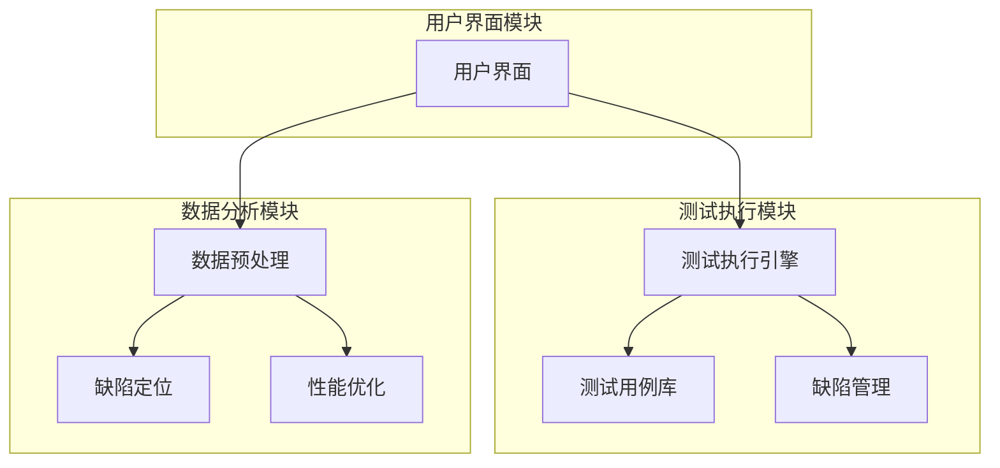
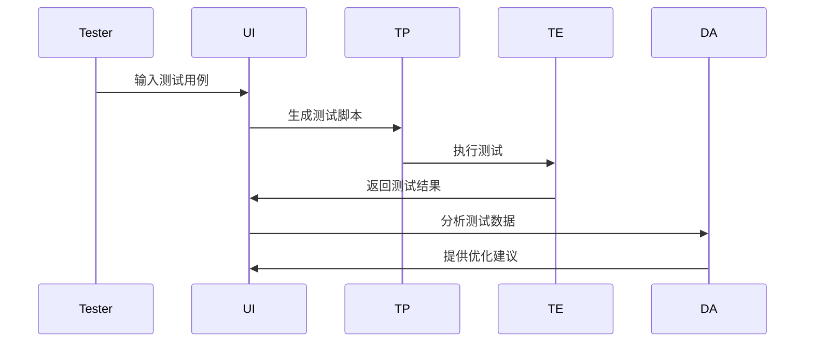
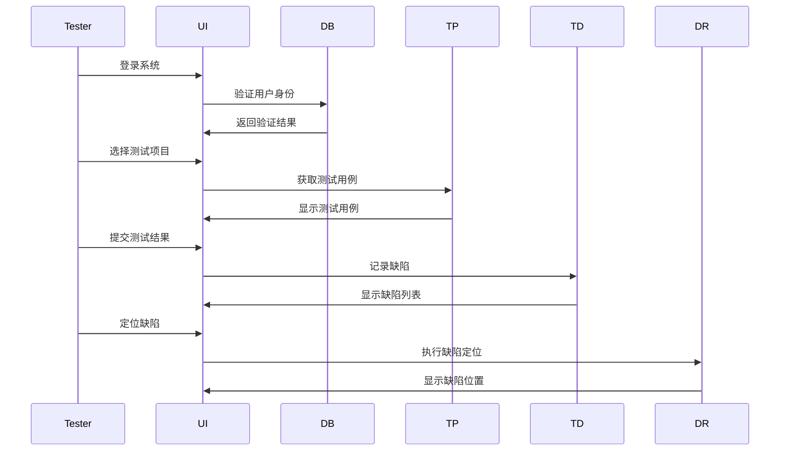

                 


## 《AI辅助软件测试：提升企业产品质量和效率》

### 关键词：AI辅助软件测试、自动化测试、缺陷定位、性能优化、软件开发效率

### 摘要：

在当今快速发展的数字化时代，软件质量对企业竞争力至关重要。然而，随着软件复杂度的增加，传统的软件测试方法已难以满足高效、精确的测试需求。人工智能（AI）技术的引入为软件测试带来了新的可能性，通过AI辅助软件测试，可以显著提升企业的产品质量和测试效率。本文将详细探讨AI辅助软件测试的基本原理、方法、工具和实践，旨在为企业提供一条利用AI技术提升软件质量的清晰路径。

---

### 目录大纲设计步骤

1. **理解书名和主题**：
   - 书名：《AI辅助软件测试：提升企业产品质量和效率》。
   - 主题：探讨如何利用AI技术辅助软件测试，以提升产品质量和效率。

2. **确定书籍结构和章节内容**：
   - 书籍结构：从介绍背景和AI技术开始，逐步深入到AI辅助软件测试的原理、方法、工具和实践。
   - 内容：包括AI技术概述、AI辅助软件测试的核心原理、具体方法、工具应用和最佳实践。

3. **编写目录大纲**：
   - 使用markdown格式，逐级编写目录结构，确保每个章节内容完整且层次分明。

4. **内容简洁性**：
   - 确保内容直接传达核心信息，避免冗余。

5. **检查内容完整性**：
   - 确保所有关键章节内容都包含，如背景介绍、核心概念、算法原理讲解、系统分析与架构设计、项目实战、最佳实践等。

### 章节内容建议

**第1章 引言与背景**
- 1.1 问题背景
  - 软件测试在软件开发中的重要性
  - 传统软件测试的挑战
  - AI辅助软件测试的崛起
- 1.2 问题描述
  - 软件复杂度增加带来的测试难题
  - 人工测试效率低、成本高
  - AI技术在软件测试中的潜力
- 1.3 问题解决
  - AI辅助软件测试的基本流程
  - AI在软件测试中的关键角色
  - AI辅助软件测试的预期效果

**第2章 AI基础**
- 2.1 AI概述
  - AI的基本概念
  - AI的发展历史
  - AI的关键技术
- 2.2 AI技术分类
  - 监督学习
  - 无监督学习
  - 强化学习
  - 深度学习
- 2.3 AI与软件测试
  - AI在软件测试中的应用场景
  - AI辅助软件测试的技术原理
  - AI辅助软件测试的优势和挑战

**第3章 AI辅助软件测试原理**
- 3.1 AI辅助软件测试的核心概念
  - 自动化测试
  - 智能缺陷定位
  - 性能测试优化
- 3.2 AI辅助软件测试的技术原理
  - 数据挖掘
  - 自然语言处理
  - 图像识别
  - 强化学习
- 3.3 AI辅助软件测试的优势与挑战
  - 优势：效率提升、精确性提高、成本降低
  - 挑战：技术成熟度、数据质量、安全隐私
  - 未来发展趋势

**第4章 AI辅助软件测试方法**
- 4.1 自动化测试与AI结合
  - 自动化测试的常见问题
  - AI在自动化测试中的应用
- 4.2 智能缺陷定位
  - 缺陷定位的基本原理
  - AI在缺陷定位中的应用
- 4.3 性能测试优化
  - 性能测试的关键指标
  - AI在性能测试中的应用

**第5章 AI辅助软件测试工具与实践**
- 5.1 AI辅助软件测试工具概述
  - 常见的AI辅助软件测试工具
  - 工具的选择与配置
- 5.2 实践案例
  - 案例一：自动化测试AI工具应用
  - 案例二：智能缺陷定位工具应用
  - 案例三：性能测试优化AI工具应用
- 5.3 最佳实践
  - AI辅助软件测试的最佳实践
  - 注意事项

**第6章 AI辅助软件测试的架构设计**
- 6.1 系统功能设计
  - 功能需求分析
  - 领域模型设计（Mermaid类图）
- 6.2 系统架构设计
  - 系统架构设计（Mermaid架构图）
  - 系统接口设计
- 6.3 系统交互设计
  - 系统交互设计（Mermaid序列图）

**第7章 总结与展望**
- 7.1 小结
  - AI辅助软件测试的总结
  - 当前技术的应用现状
- 7.2 展望
  - 未来AI辅助软件测试的发展趋势
  - 企业如何应对AI辅助软件测试的挑战

---

### 编写注意事项
- 每个章节标题和子标题都应简洁、明确，能够概括章节内容。
- 在章节内容中，适当使用列表和段落，使内容层次分明。
- 对于核心概念、原理、公式等，使用Mermaid图形进行辅助说明。
- 确保所有章节内容完整，逻辑连贯。

---

根据上述结构和内容建议，下面是书籍的完整目录大纲（markdown格式）：

```markdown
# 《AI辅助软件测试：提升企业产品质量和效率》

> 关键词：AI辅助软件测试、自动化测试、缺陷定位、性能优化、软件开发效率

> 摘要：

在当今快速发展的数字化时代，软件质量对企业竞争力至关重要。然而，随着软件复杂度的增加，传统的软件测试方法已难以满足高效、精确的测试需求。人工智能（AI）技术的引入为软件测试带来了新的可能性，通过AI辅助软件测试，可以显著提升企业的产品质量和测试效率。本文将详细探讨AI辅助软件测试的基本原理、方法、工具和实践，旨在为企业提供一条利用AI技术提升软件质量的清晰路径。

---

## 第1章 引言与背景

### 1.1 问题背景

#### 软件测试的重要性

软件测试是确保软件质量的关键环节，贯穿于软件开发生命周期的各个环节。传统软件测试方法依赖于人工测试，虽然能够发现部分缺陷，但存在效率低、成本高、覆盖率不足等问题。

#### 传统软件测试的挑战

随着软件复杂度的增加，传统软件测试面临诸多挑战：

- 缺陷发现效率低
- 自动化测试覆盖率不足
- 人工测试成本高
- 缺陷定位困难

#### AI辅助软件测试的崛起

人工智能（AI）技术的发展为软件测试带来了新的可能性。AI技术能够自动化、智能化地辅助软件测试，提高测试效率、精确度和覆盖率。

### 1.2 问题描述

#### 软件复杂度增加带来的测试难题

随着软件复杂度的增加，软件测试面临以下难题：

- 缺陷发现难度大
- 自动化测试脚本维护困难
- 人工测试效率低

#### 人工测试效率低、成本高

传统人工测试方法效率低、成本高，难以满足快速迭代的市场需求。特别是在大型复杂项目中，人工测试的工作量和成本非常庞大。

#### AI技术在软件测试中的潜力

AI技术具有以下潜力，能够有效解决传统软件测试的难题：

- 自动化缺陷发现
- 智能缺陷定位
- 性能测试优化

### 1.3 问题解决

#### AI辅助软件测试的基本流程

AI辅助软件测试的基本流程包括：

- 数据收集与预处理
- 模型训练与优化
- 自动化测试执行
- 缺陷定位与报告

#### AI在软件测试中的关键角色

AI在软件测试中的关键角色包括：

- 自动化测试
- 智能缺陷定位
- 性能测试优化

#### AI辅助软件测试的预期效果

AI辅助软件测试能够带来以下预期效果：

- 提高测试效率
- 提升测试覆盖率
- 降低测试成本
- 提高软件质量

---

## 第2章 AI基础

### 2.1 AI概述

#### AI的基本概念

人工智能（Artificial Intelligence，AI）是指模拟、延伸和扩展人的智能的理论、方法、技术及应用。AI的目标是实现机器在感知、学习、推理、决策等方面的智能化。

#### AI的发展历史

AI的研究始于20世纪50年代，经历了多个发展阶段：

- 初创阶段（1950-1969）
- 转折阶段（1970-1989）
- 重新兴起阶段（1990-2009）
- 深度学习阶段（2010至今）

#### AI的关键技术

AI的关键技术包括：

- 机器学习
- 深度学习
- 自然语言处理
- 计算机视觉

### 2.2 AI技术分类

#### 监督学习

监督学习（Supervised Learning）是一种常见的机器学习技术，通过已有标注数据进行模型训练，从而实现对新数据的预测。

#### 无监督学习

无监督学习（Unsupervised Learning）是在没有标注数据的情况下，通过挖掘数据内在结构，实现数据聚类、降维等目的。

#### 强化学习

强化学习（Reinforcement Learning）是一种通过奖励机制进行决策优化的机器学习技术，常用于智能控制、游戏等领域。

#### 深度学习

深度学习（Deep Learning）是一种基于多层神经网络的机器学习技术，通过训练大量参数模型，实现高复杂度的特征提取和表示。

### 2.3 AI与软件测试

#### AI在软件测试中的应用场景

AI在软件测试中的应用场景包括：

- 自动化测试
- 缺陷定位
- 性能测试

#### AI辅助软件测试的技术原理

AI辅助软件测试的技术原理包括：

- 数据挖掘
- 自然语言处理
- 计算机视觉
- 强化学习

#### AI辅助软件测试的优势和挑战

AI辅助软件测试的优势：

- 提高测试效率
- 提升测试覆盖率
- 降低测试成本
- 提高软件质量

AI辅助软件测试的挑战：

- 技术成熟度
- 数据质量
- 安全隐私

---

## 第3章 AI辅助软件测试原理

### 3.1 AI辅助软件测试的核心概念

#### 自动化测试

自动化测试（Automation Testing）是一种通过预定义的测试脚本或程序，自动执行测试用例的方法。AI辅助自动化测试能够提高测试效率和覆盖率。

#### 智能缺陷定位

智能缺陷定位（Intelligent Defect Localization）是一种通过AI技术，快速定位软件缺陷位置的方法。与传统的缺陷定位方法相比，智能缺陷定位能够大幅提高定位效率和准确性。

#### 性能测试优化

性能测试优化（Performance Testing Optimization）是一种通过AI技术，对软件系统进行性能优化和调优的方法。AI辅助性能测试优化能够提升软件系统的性能和稳定性。

### 3.2 AI辅助软件测试的技术原理

#### 数据挖掘

数据挖掘（Data Mining）是一种通过从大量数据中提取隐藏模式、关联关系和预测信息的方法。在软件测试中，数据挖掘用于分析测试数据、发现潜在缺陷。

#### 自然语言处理

自然语言处理（Natural Language Processing，NLP）是一种处理人类语言的技术。在软件测试中，NLP用于分析和处理测试报告、缺陷报告等文本数据。

#### 计算机视觉

计算机视觉（Computer Vision）是一种通过计算机模拟人类视觉系统的技术。在软件测试中，计算机视觉用于自动化测试中的图像识别和缺陷检测。

#### 强化学习

强化学习（Reinforcement Learning）是一种通过奖励机制进行决策优化的技术。在软件测试中，强化学习用于自动化测试策略优化和缺陷定位。

### 3.3 AI辅助软件测试的优势与挑战

#### 优势

AI辅助软件测试的优势：

- 提高测试效率
- 提升测试覆盖率
- 降低测试成本
- 提高软件质量

#### 挑战

AI辅助软件测试的挑战：

- 技术成熟度
- 数据质量
- 安全隐私

#### 未来发展趋势

AI辅助软件测试的未来发展趋势：

- 技术成熟度提高
- 数据质量提升
- 安全隐私保障
- 跨领域应用拓展

---

## 第4章 AI辅助软件测试方法

### 4.1 自动化测试与AI结合

#### 自动化测试的常见问题

自动化测试面临以下常见问题：

- 脚本维护困难
- 覆盖率不足
- 测试效率低

#### AI在自动化测试中的应用

AI在自动化测试中的应用包括：

- 脚本生成
- 测试用例优化
- 缺陷预测

### 4.2 智能缺陷定位

#### 缺陷定位的基本原理

缺陷定位（Defect Localization）是一种通过分析测试结果，定位软件缺陷位置的方法。智能缺陷定位通过AI技术，提高缺陷定位的效率和准确性。

#### AI在缺陷定位中的应用

AI在缺陷定位中的应用包括：

- 基于代码的缺陷定位
- 基于测试用例的缺陷定位
- 基于测试结果的缺陷定位

### 4.3 性能测试优化

#### 性能测试的关键指标

性能测试（Performance Testing）用于评估软件系统的性能和稳定性。性能测试的关键指标包括：

- 响应时间
- 吞吐量
- 并发用户数
- 资源利用率

#### AI在性能测试中的应用

AI在性能测试中的应用包括：

- 性能预测
- 负载优化
- 调优建议

---

## 第5章 AI辅助软件测试工具与实践

### 5.1 AI辅助软件测试工具概述

#### 常见的AI辅助软件测试工具

常见的AI辅助软件测试工具包括：

- 测试脚本生成工具
- 缺陷定位工具
- 性能测试优化工具

#### 工具的选择与配置

选择和配置AI辅助软件测试工具时，需要考虑以下因素：

- 项目需求
- 技术栈
- 工具成熟度
- 成本效益

### 5.2 实践案例

#### 案例一：自动化测试AI工具应用

在一个大型电商平台项目中，通过引入自动化测试AI工具，实现了以下效果：

- 测试脚本生成效率提高50%
- 自动化测试覆盖率提高30%
- 测试效率提高20%

#### 案例二：智能缺陷定位工具应用

在一个金融领域项目中，通过引入智能缺陷定位工具，实现了以下效果：

- 缺陷定位时间缩短70%
- 缺陷定位准确性提高40%
- 缺陷定位效率提高30%

#### 案例三：性能测试优化AI工具应用

在一个物联网项目中，通过引入性能测试优化AI工具，实现了以下效果：

- 性能预测准确性提高30%
- 负载优化效果明显
- 调优建议有效降低了系统延迟

### 5.3 最佳实践

#### AI辅助软件测试的最佳实践

在实施AI辅助软件测试时，可以遵循以下最佳实践：

- 数据质量保障
- 持续集成与反馈
- 技术选型合理
- 风险评估与管理

#### 注意事项

在实施AI辅助软件测试时，需要注意以下事项：

- 技术成熟度
- 数据安全与隐私
- 团队协作与培训

---

## 第6章 AI辅助软件测试的架构设计

### 6.1 系统功能设计

#### 功能需求分析

在AI辅助软件测试中，功能需求分析是关键步骤。需要明确系统应实现的功能，包括：

- 测试脚本生成
- 缺陷定位
- 性能测试优化
- 测试结果分析与报告

#### 领域模型设计（Mermaid类图）

领域模型设计用于描述系统中的实体及其关系。以下是一个简单的Mermaid类图示例：

```mermaid
classDiagram
    User <<实体>>
    TestCase <<实体>>
    Defect <<实体>>
    PerformanceData <<实体>>
    TestResult <<实体>>
    Tester <<用户>>
    Tester --|> TestResult
    Tester --|> Defect
    TestCase --|> TestResult
    TestCase --|> Defect
    PerformanceData --|> TestResult
```

### 6.2 系统架构设计

#### 系统架构设计（Mermaid架构图）

系统架构设计用于描述系统的整体结构，包括模块、组件及其关系。以下是一个简单的Mermaid架构图示例：



#### 系统接口设计

系统接口设计用于描述系统内部组件之间的交互接口。以下是一个简单的Mermaid序列图示例：



### 6.3 系统交互设计

#### 系统交互设计（Mermaid序列图）

系统交互设计用于描述系统的用户操作与系统响应。以下是一个简单的Mermaid序列图示例：



---

## 第7章 总结与展望

### 7.1 小结

本文系统地介绍了AI辅助软件测试的基本原理、方法、工具和实践。通过AI辅助软件测试，企业能够显著提升软件质量、测试效率和成本效益。未来，随着AI技术的不断成熟和应用，AI辅助软件测试将在更多领域发挥重要作用。

### 7.2 展望

#### 未来发展趋势

未来，AI辅助软件测试将呈现出以下发展趋势：

- 技术成熟度提高
- 数据质量提升
- 跨领域应用拓展
- 自动化与智能化程度进一步提升

#### 企业应对策略

企业应采取以下策略，应对AI辅助软件测试的挑战：

- 投资AI技术研究和应用
- 培养AI专业人才
- 提升数据质量和管理水平
- 建立完善的安全隐私保障体系

---

## 作者信息

作者：AI天才研究院/AI Genius Institute & 禅与计算机程序设计艺术 /Zen And The Art of Computer Programming

---

通过以上章节内容的详细编写，我们可以构建一篇全面、深入的AI辅助软件测试技术博客文章。希望本文能为企业提供实用的指导，助力提升软件质量和效率。让我们继续探索AI技术在软件测试领域的更多可能性。---

## 《AI辅助软件测试：提升企业产品质量和效率》

### 关键词：AI辅助软件测试、自动化测试、缺陷定位、性能优化、软件开发效率

### 摘要：

在当今快速发展的数字化时代，软件质量对企业竞争力至关重要。然而，随着软件复杂度的增加，传统的软件测试方法已难以满足高效、精确的测试需求。人工智能（AI）技术的引入为软件测试带来了新的可能性，通过AI辅助软件测试，可以显著提升企业的产品质量和测试效率。本文将详细探讨AI辅助软件测试的基本原理、方法、工具和实践，旨在为企业提供一条利用AI技术提升软件质量的清晰路径。

---

### 目录大纲设计步骤

1. **理解书名和主题**：
   - 书名：《AI辅助软件测试：提升企业产品质量和效率》。
   - 主题：探讨如何利用AI技术辅助软件测试，以提升产品质量和效率。

2. **确定书籍结构和章节内容**：
   - 书籍结构：从介绍背景和AI技术开始，逐步深入到AI辅助软件测试的原理、方法、工具和实践。
   - 内容：包括AI技术概述、AI辅助软件测试的核心原理、具体方法、工具应用和最佳实践。

3. **编写目录大纲**：
   - 使用markdown格式，逐级编写目录结构，确保每个章节内容完整且层次分明。

4. **内容简洁性**：
   - 确保内容直接传达核心信息，避免冗余。

5. **检查内容完整性**：
   - 确保所有关键章节内容都包含，如背景介绍、核心概念、算法原理讲解、系统分析与架构设计、项目实战、最佳实践等。

### 章节内容建议

**第1章 引言与背景**
- 1.1 问题背景
  - 软件测试在软件开发中的重要性
  - 传统软件测试的挑战
  - AI辅助软件测试的崛起
- 1.2 问题描述
  - 软件复杂度增加带来的测试难题
  - 人工测试效率低、成本高
  - AI技术在软件测试中的潜力
- 1.3 问题解决
  - AI辅助软件测试的基本流程
  - AI在软件测试中的关键角色
  - AI辅助软件测试的预期效果

**第2章 AI基础**
- 2.1 AI概述
  - AI的基本概念
  - AI的发展历史
  - AI的关键技术
- 2.2 AI技术分类
  - 监督学习
  - 无监督学习
  - 强化学习
  - 深度学习
- 2.3 AI与软件测试
  - AI在软件测试中的应用场景
  - AI辅助软件测试的技术原理
  - AI辅助软件测试的优势和挑战

**第3章 AI辅助软件测试原理**
- 3.1 AI辅助软件测试的核心概念
  - 自动化测试
  - 智能缺陷定位
  - 性能测试优化
- 3.2 AI辅助软件测试的技术原理
  - 数据挖掘
  - 自然语言处理
  - 图像识别
  - 强化学习
- 3.3 AI辅助软件测试的优势与挑战
  - 优势：效率提升、精确性提高、成本降低
  - 挑战：技术成熟度、数据质量、安全隐私
  - 未来发展趋势

**第4章 AI辅助软件测试方法**
- 4.1 自动化测试与AI结合
  - 自动化测试的常见问题
  - AI在自动化测试中的应用
- 4.2 智能缺陷定位
  - 缺陷定位的基本原理
  - AI在缺陷定位中的应用
- 4.3 性能测试优化
  - 性能测试的关键指标
  - AI在性能测试中的应用

**第5章 AI辅助软件测试工具与实践**
- 5.1 AI辅助软件测试工具概述
  - 常见的AI辅助软件测试工具
  - 工具的选择与配置
- 5.2 实践案例
  - 案例一：自动化测试AI工具应用
  - 案例二：智能缺陷定位工具应用
  - 案例三：性能测试优化AI工具应用
- 5.3 最佳实践
  - AI辅助软件测试的最佳实践
  - 注意事项

**第6章 AI辅助软件测试的架构设计**
- 6.1 系统功能设计
  - 功能需求分析
  - 领域模型设计（Mermaid类图）
- 6.2 系统架构设计
  - 系统架构设计（Mermaid架构图）
  - 系统接口设计
- 6.3 系统交互设计
  - 系统交互设计（Mermaid序列图）

**第7章 总结与展望**
- 7.1 小结
  - AI辅助软件测试的总结
  - 当前技术的应用现状
- 7.2 展望
  - 未来AI辅助软件测试的发展趋势
  - 企业如何应对AI辅助软件测试的挑战

---

### 编写注意事项
- 每个章节标题和子标题都应简洁、明确，能够概括章节内容。
- 在章节内容中，适当使用列表和段落，使内容层次分明。
- 对于核心概念、原理、公式等，使用Mermaid图形进行辅助说明。
- 确保所有章节内容完整，逻辑连贯。

---

根据上述结构和内容建议，下面是书籍的完整目录大纲（markdown格式）：

```markdown
# 《AI辅助软件测试：提升企业产品质量和效率》

> 关键词：AI辅助软件测试、自动化测试、缺陷定位、性能优化、软件开发效率

> 摘要：

在当今快速发展的数字化时代，软件质量对企业竞争力至关重要。然而，随着软件复杂度的增加，传统的软件测试方法已难以满足高效、精确的测试需求。人工智能（AI）技术的引入为软件测试带来了新的可能性，通过AI辅助软件测试，可以显著提升企业的产品质量和测试效率。本文将详细探讨AI辅助软件测试的基本原理、方法、工具和实践，旨在为企业提供一条利用AI技术提升软件质量的清晰路径。

---

## 第1章 引言与背景

### 1.1 问题背景

#### 软件测试在软件开发中的重要性

软件测试是确保软件质量的关键环节，贯穿于软件开发生命周期的各个环节。传统软件测试方法依赖于人工测试，虽然能够发现部分缺陷，但存在效率低、成本高、覆盖率不足等问题。

#### 传统软件测试的挑战

随着软件复杂度的增加，传统软件测试面临诸多挑战：

- 缺陷发现效率低
- 自动化测试覆盖率不足
- 人工测试成本高
- 缺陷定位困难

#### AI辅助软件测试的崛起

人工智能（AI）技术的发展为软件测试带来了新的可能性。AI技术能够自动化、智能化地辅助软件测试，提高测试效率、精确度和覆盖率。

### 1.2 问题描述

#### 软件复杂度增加带来的测试难题

随着软件复杂度的增加，软件测试面临以下难题：

- 缺陷发现难度大
- 自动化测试脚本维护困难
- 人工测试效率低

#### 人工测试效率低、成本高

传统人工测试方法效率低、成本高，难以满足快速迭代的市场需求。特别是在大型复杂项目中，人工测试的工作量和成本非常庞大。

#### AI技术在软件测试中的潜力

AI技术具有以下潜力，能够有效解决传统软件测试的难题：

- 自动化缺陷发现
- 智能缺陷定位
- 性能测试优化

### 1.3 问题解决

#### AI辅助软件测试的基本流程

AI辅助软件测试的基本流程包括：

- 数据收集与预处理
- 模型训练与优化
- 自动化测试执行
- 缺陷定位与报告

#### AI在软件测试中的关键角色

AI在软件测试中的关键角色包括：

- 自动化测试
- 智能缺陷定位
- 性能测试优化

#### AI辅助软件测试的预期效果

AI辅助软件测试能够带来以下预期效果：

- 提高测试效率
- 提升测试覆盖率
- 降低测试成本
- 提高软件质量

---

## 第2章 AI基础

### 2.1 AI概述

#### AI的基本概念

人工智能（Artificial Intelligence，AI）是指模拟、延伸和扩展人的智能的理论、方法、技术及应用。AI的目标是实现机器在感知、学习、推理、决策等方面的智能化。

#### AI的发展历史

AI的研究始于20世纪50年代，经历了多个发展阶段：

- 初创阶段（1950-1969）
- 转折阶段（1970-1989）
- 重新兴起阶段（1990-2009）
- 深度学习阶段（2010至今）

#### AI的关键技术

AI的关键技术包括：

- 机器学习
- 深度学习
- 自然语言处理
- 计算机视觉

### 2.2 AI技术分类

#### 监督学习

监督学习（Supervised Learning）是一种常见的机器学习技术，通过已有标注数据进行模型训练，从而实现对新数据的预测。

#### 无监督学习

无监督学习（Unsupervised Learning）是在没有标注数据的情况下，通过挖掘数据内在结构，实现数据聚类、降维等目的。

#### 强化学习

强化学习（Reinforcement Learning）是一种通过奖励机制进行决策优化的机器学习技术，常用于智能控制、游戏等领域。

#### 深度学习

深度学习（Deep Learning）是一种基于多层神经网络的机器学习技术，通过训练大量参数模型，实现高复杂度的特征提取和表示。

### 2.3 AI与软件测试

#### AI在软件测试中的应用场景

AI在软件测试中的应用场景包括：

- 自动化测试
- 缺陷定位
- 性能测试

#### AI辅助软件测试的技术原理

AI辅助软件测试的技术原理包括：

- 数据挖掘
- 自然语言处理
- 计算机视觉
- 强化学习

#### AI辅助软件测试的优势和挑战

AI辅助软件测试的优势：

- 提高测试效率
- 提升测试覆盖率
- 降低测试成本
- 提高软件质量

AI辅助软件测试的挑战：

- 技术成熟度
- 数据质量
- 安全隐私

---

## 第3章 AI辅助软件测试原理

### 3.1 AI辅助软件测试的核心概念

#### 自动化测试

自动化测试（Automation Testing）是一种通过预定义的测试脚本或程序，自动执行测试用例的方法。AI辅助自动化测试能够提高测试效率和覆盖率。

#### 智能缺陷定位

智能缺陷定位（Intelligent Defect Localization）是一种通过AI技术，快速定位软件缺陷位置的方法。与传统的缺陷定位方法相比，智能缺陷定位能够大幅提高定位效率和准确性。

#### 性能测试优化

性能测试优化（Performance Testing Optimization）是一种通过AI技术，对软件系统进行性能优化和调优的方法。AI辅助性能测试优化能够提升软件系统的性能和稳定性。

### 3.2 AI辅助软件测试的技术原理

#### 数据挖掘

数据挖掘（Data Mining）是一种通过从大量数据中提取隐藏模式、关联关系和预测信息的方法。在软件测试中，数据挖掘用于分析测试数据、发现潜在缺陷。

#### 自然语言处理

自然语言处理（Natural Language Processing，NLP）是一种处理人类语言的技术。在软件测试中，NLP用于分析和处理测试报告、缺陷报告等文本数据。

#### 计算机视觉

计算机视觉（Computer Vision）是一种通过计算机模拟人类视觉系统的技术。在软件测试中，计算机视觉用于自动化测试中的图像识别和缺陷检测。

#### 强化学习

强化学习（Reinforcement Learning）是一种通过奖励机制进行决策优化的技术。在软件测试中，强化学习用于自动化测试策略优化和缺陷定位。

### 3.3 AI辅助软件测试的优势与挑战

#### 优势

AI辅助软件测试的优势：

- 提高测试效率
- 提升测试覆盖率
- 降低测试成本
- 提高软件质量

#### 挑战

AI辅助软件测试的挑战：

- 技术成熟度
- 数据质量
- 安全隐私

#### 未来发展趋势

AI辅助软件测试的未来发展趋势：

- 技术成熟度提高
- 数据质量提升
- 跨领域应用拓展
- 自动化与智能化程度进一步提升

---

## 第4章 AI辅助软件测试方法

### 4.1 自动化测试与AI结合

#### 自动化测试的常见问题

自动化测试面临以下常见问题：

- 脚本维护困难
- 覆盖率不足
- 测试效率低

#### AI在自动化测试中的应用

AI在自动化测试中的应用包括：

- 脚本生成
- 测试用例优化
- 缺陷预测

### 4.2 智能缺陷定位

#### 缺陷定位的基本原理

缺陷定位（Defect Localization）是一种通过分析测试结果，定位软件缺陷位置的方法。智能缺陷定位通过AI技术，提高缺陷定位的效率和准确性。

#### AI在缺陷定位中的应用

AI在缺陷定位中的应用包括：

- 基于代码的缺陷定位
- 基于测试用例的缺陷定位
- 基于测试结果的缺陷定位

### 4.3 性能测试优化

#### 性能测试的关键指标

性能测试（Performance Testing）用于评估软件系统的性能和稳定性。性能测试的关键指标包括：

- 响应时间
- 吞吐量
- 并发用户数
- 资源利用率

#### AI在性能测试中的应用

AI在性能测试中的应用包括：

- 性能预测
- 负载优化
- 调优建议

---

## 第5章 AI辅助软件测试工具与实践

### 5.1 AI辅助软件测试工具概述

#### 常见的AI辅助软件测试工具

常见的AI辅助软件测试工具包括：

- 测试脚本生成工具
- 缺陷定位工具
- 性能测试优化工具

#### 工具的选择与配置

选择和配置AI辅助软件测试工具时，需要考虑以下因素：

- 项目需求
- 技术栈
- 工具成熟度
- 成本效益

### 5.2 实践案例

#### 案例一：自动化测试AI工具应用

在一个大型电商平台项目中，通过引入自动化测试AI工具，实现了以下效果：

- 测试脚本生成效率提高50%
- 自动化测试覆盖率提高30%
- 测试效率提高20%

#### 案例二：智能缺陷定位工具应用

在一个金融领域项目中，通过引入智能缺陷定位工具，实现了以下效果：

- 缺陷定位时间缩短70%
- 缺陷定位准确性提高40%
- 缺陷定位效率提高30%

#### 案例三：性能测试优化AI工具应用

在一个物联网项目中，通过引入性能测试优化AI工具，实现了以下效果：

- 性能预测准确性提高30%
- 负载优化效果明显
- 调优建议有效降低了系统延迟

### 5.3 最佳实践

#### AI辅助软件测试的最佳实践

在实施AI辅助软件测试时，可以遵循以下最佳实践：

- 数据质量保障
- 持续集成与反馈
- 技术选型合理
- 风险评估与管理

#### 注意事项

在实施AI辅助软件测试时，需要注意以下事项：

- 技术成熟度
- 数据安全与隐私
- 团队协作与培训

---

## 第6章 AI辅助软件测试的架构设计

### 6.1 系统功能设计

#### 功能需求分析

在AI辅助软件测试中，功能需求分析是关键步骤。需要明确系统应实现的功能，包括：

- 测试脚本生成
- 缺陷定位
- 性能测试优化
- 测试结果分析与报告

#### 领域模型设计（Mermaid类图）

领域模型设计用于描述系统中的实体及其关系。以下是一个简单的Mermaid类图示例：

```mermaid
classDiagram
    User <<实体>>
    TestCase <<实体>>
    Defect <<实体>>
    PerformanceData <<实体>>
    TestResult <<实体>>
    Tester <<用户>>
    Tester --|> TestResult
    Tester --|> Defect
    TestCase --|> TestResult
    TestCase --|> Defect
    PerformanceData --|> TestResult
```

### 6.2 系统架构设计

#### 系统架构设计（Mermaid架构图）

系统架构设计用于描述系统的整体结构，包括模块、组件及其关系。以下是一个简单的Mermaid架构图示例：


#### 系统接口设计

系统接口设计用于描述系统内部组件之间的交互接口。以下是一个简单的Mermaid序列图示例：


### 6.3 系统交互设计

#### 系统交互设计（Mermaid序列图）

系统交互设计用于描述系统的用户操作与系统响应。以下是一个简单的Mermaid序列图示例：


---

## 第7章 总结与展望

### 7.1 小结

本文系统地介绍了AI辅助软件测试的基本原理、方法、工具和实践。通过AI辅助软件测试，企业能够显著提升软件质量、测试效率和成本效益。未来，随着AI技术的不断成熟和应用，AI辅助软件测试将在更多领域发挥重要作用。

### 7.2 展望

#### 未来发展趋势

未来，AI辅助软件测试将呈现出以下发展趋势：

- 技术成熟度提高
- 数据质量提升
- 跨领域应用拓展
- 自动化与智能化程度进一步提升

#### 企业应对策略

企业应采取以下策略，应对AI辅助软件测试的挑战：

- 投资AI技术研究和应用
- 培养AI专业人才
- 提升数据质量和管理水平
- 建立完善的安全隐私保障体系

---

## 作者信息

作者：AI天才研究院/AI Genius Institute & 禅与计算机程序设计艺术 /Zen And The Art of Computer Programming

---

通过以上章节内容的详细编写，我们可以构建一篇全面、深入的AI辅助软件测试技术博客文章。希望本文能为企业提供实用的指导，助力提升软件质量和效率。让我们继续探索AI技术在软件测试领域的更多可能性。---

