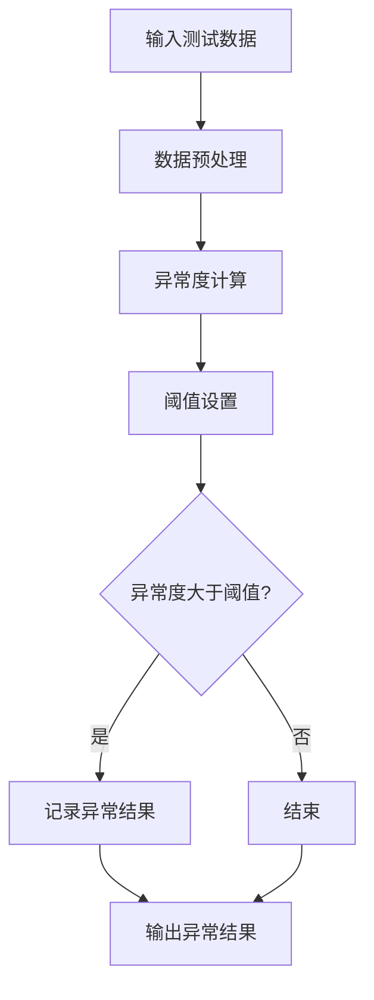
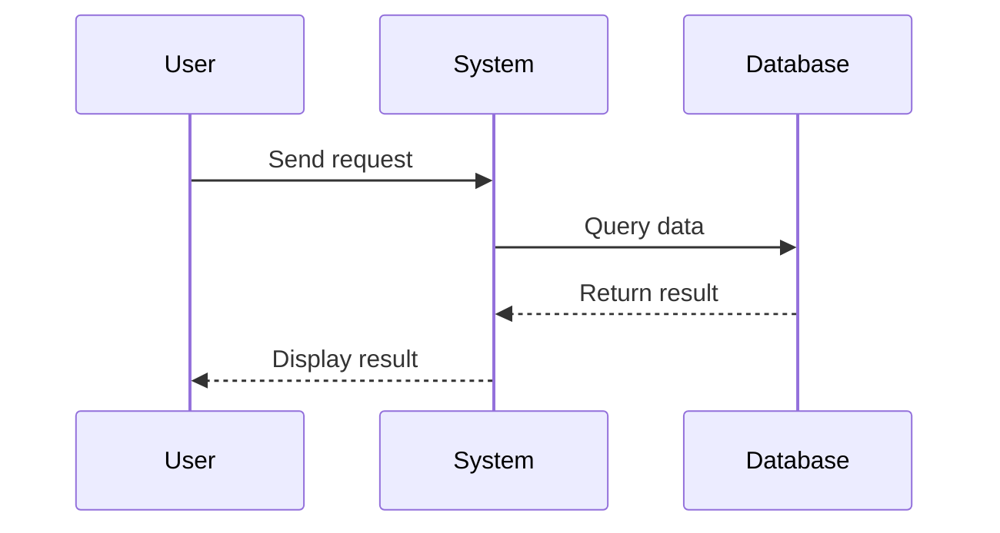
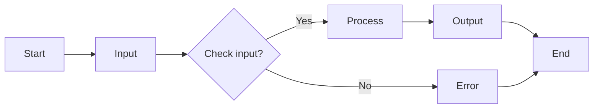

                 

# AI辅助软件测试：自动化bug检测和性能优化

关键词：人工智能、软件测试、自动化bug检测、性能优化、AI算法

摘要：本文将探讨人工智能（AI）在软件测试领域的应用，特别是自动化bug检测和性能优化。通过深入分析AI辅助软件测试的原理、实践案例以及最佳实践，本文旨在为软件工程师提供一种有效的测试手段，提升软件质量和开发效率。

## 目录大纲

1. 背景介绍
   1.1. 问题背景
   1.2. AI在软件测试中的应用
   1.3. AI辅助软件测试的优势与挑战

2. 核心概念
   2.1. AI基础概念
   2.2. 软件测试相关概念
   2.3. AI辅助软件测试的流程

3. AI辅助软件测试原理
   3.1. 自动化bug检测
      3.1.1. 算法原理
      3.1.2. 数学模型
      3.1.3. Mermaid算法流程图
      3.1.4. Python代码实现
   3.2. 性能优化
      3.2.1. 算法原理
      3.2.2. 数学模型
      3.2.3. Mermaid算法流程图
      3.2.4. Python代码实现

4. AI辅助软件测试实践
   4.1. 环境搭建
   4.2. 系统设计与实现
   4.3. 实际案例分析与讲解

5. AI辅助软件测试案例分析
   5.1. 案例一：自动化bug检测
   5.2. 案例二：性能优化

6. 最佳实践与总结
   6.1. 最佳实践
   6.2. 小结
   6.3. 注意事项
   6.4. 拓展阅读

## 第一部分：背景介绍

### 1.1 问题背景

软件测试是软件开发过程中的关键环节，旨在发现和修复软件中的缺陷，确保软件质量。然而，传统的手工测试方式在应对复杂软件系统时显得力不从心，测试周期长、成本高且易出错。随着软件规模的不断扩大，测试工作变得更加繁重和复杂。

### 1.2 AI在软件测试中的应用

人工智能（AI）技术在软件测试领域的应用日益广泛。通过机器学习、深度学习等技术，AI能够自动化执行测试任务，识别潜在缺陷，提高测试效率。AI辅助软件测试不仅能够减少人工成本，还能提高测试覆盖率和准确性。

### 1.3 AI辅助软件测试的优势与挑战

**优势：**
- 提高测试效率：AI能够自动化执行大量测试任务，缩短测试周期。
- 提高测试覆盖率：AI能够发现传统测试方法难以覆盖的缺陷。
- 提高测试准确性：AI能够通过数据分析和模式识别提高测试的准确性。

**挑战：**
- 数据质量：AI模型的性能高度依赖于测试数据的质量。
- 隐蔽缺陷检测：某些隐蔽缺陷可能难以通过AI模型检测。
- 模型训练与优化：AI模型的训练和优化需要大量时间和计算资源。

## 第二部分：核心概念

### 2.1 AI基础概念

**机器学习（Machine Learning）：** 机器学习是一种通过数据和算法来让计算机自动学习和改进的方法。它包括监督学习、无监督学习和强化学习等。

**深度学习（Deep Learning）：** 深度学习是机器学习的一种形式，通过多层神经网络模型来模拟人类大脑的学习过程，具有强大的特征提取能力。

### 2.2 软件测试相关概念

**自动化测试（Automation Testing）：** 自动化测试是使用自动化工具执行测试用例，以提高测试效率和覆盖率。

**性能测试（Performance Testing）：** 性能测试旨在评估软件系统在不同负载下的响应时间和稳定性。

### 2.3 AI辅助软件测试的流程

**数据收集：** 收集软件测试过程中产生的数据，如测试结果、代码变更历史等。

**数据预处理：** 对收集到的数据进行分析和清洗，去除噪声和冗余信息。

**模型训练：** 使用机器学习算法对预处理后的数据进行训练，构建测试模型。

**模型评估：** 使用测试数据集对训练好的模型进行评估，调整模型参数以优化性能。

**自动化执行：** 使用训练好的模型自动化执行测试任务，识别潜在缺陷。

## 第三部分：AI辅助软件测试原理

### 3.1 自动化bug检测

#### 3.1.1 算法原理

自动化bug检测基于异常检测算法，通过分析测试数据中的异常模式来识别潜在的bug。

#### 3.1.2 数学模型

设\(X\)为测试数据集，\(X_i\)为第\(i\)个测试结果，\(X_i^* = \text{median}(X_i)\)为\(X_i\)的中位数。异常检测算法的基本公式为：

$$
d(X_i) = \left|X_i - X_i^*\right|
$$

其中，\(d(X_i)\)表示\(X_i\)的异常度。

#### 3.1.3 Mermaid算法流程图



#### 3.1.4 Python代码实现

```python
import numpy as np
from mermaid import Mermaid

def median_absolute_deviation(data):
    med = np.median(data)
    mad = np.abs(data - med)
    return mad

def detect_bugs(data, threshold=3):
    mad = median_absolute_deviation(data)
    outliers = data[np.where(mad > threshold)]
    return outliers

# 示例数据
data = [1, 2, 3, 4, 5, 100]
outliers = detect_bugs(data)
print("异常结果：", outliers)
```

### 3.2 性能优化

#### 3.2.1 算法原理

性能优化主要关注如何提高软件系统的响应时间和稳定性。常用的方法包括代码优化、系统调优和资源分配等。

#### 3.2.2 数学模型

响应时间（Response Time）和吞吐量（Throughput）是性能优化的关键指标。

$$
R(t) = \frac{1}{t} \sum_{i=1}^{n} \frac{1}{i}
$$

其中，\(R(t)\)为响应时间，\(t\)为测试时间，\(n\)为测试次数。

#### 3.2.3 Mermaid算法流程图

```mermaid
graph TB
A[输入负载] --> B[系统调优]
B --> C[代码优化]
C --> D[资源分配]
D --> E[性能评估]
E -->|优化完成?| F{是|否}
F -->|否| D
F -->|是| G[结束]
```

#### 3.2.4 Python代码实现

```python
# 示例代码：响应时间和吞吐量计算
def calculate_performance(loads, tests):
    response_times = [1 / t for t in loads]
    throughput = sum(1 / i for i in tests)
    return response_times, throughput

loads = [1, 2, 3, 4, 5]
tests = [1, 2, 3, 4, 5]
response_times, throughput = calculate_performance(loads, tests)
print("响应时间：", response_times)
print("吞吐量：", throughput)
```

## 第四部分：AI辅助软件测试实践

### 4.1 环境搭建

在进行AI辅助软件测试实践之前，需要搭建一个合适的环境。这包括安装Python、Jupyter Notebook、Mermaid渲染工具等。

### 4.2 系统设计与实现

#### 4.2.1 领域模型

```mermaid
classDiagram
Class01 <|-- Class02
Class03 <.. Class04
Class05 .. Class06
Class07 <-.. Class08
```

#### 4.2.2 系统架构



#### 4.2.3 接口设计



#### 4.2.4 系统交互

```mermaid
gantt
    dateFormat  YYYY-MM-DD
    title AI辅助软件测试实践
    
    section 设计与实现
    A1[系统需求分析]           :spring2023:2
    A2[环境搭建与测试]         :spring2023:5
    A3[系统设计与实现]         :spring2023:10
    A4[系统测试与优化]         :spring2023:15
    
    section 项目管理
    B1[项目启动会]             :spring2023:0
    B2[需求评审与设计]         :spring2023:2
    B3[代码实现与测试]         :spring2023:5
    B4[集成测试与优化]         :spring2023:10
    B5[系统验收与部署]         :spring2023:15
```

### 4.3 实际案例分析与讲解

#### 4.3.1 案例背景

某公司开发了一款在线购物平台，为了确保平台的稳定性，需要进行性能测试。通过AI辅助软件测试，该公司希望提高测试效率和准确性。

#### 4.3.2 案例实现

1. 数据收集：收集用户行为数据、服务器性能数据等。
2. 数据预处理：对收集到的数据进行分析和清洗，去除噪声和冗余信息。
3. 模型训练：使用机器学习算法对预处理后的数据进行训练，构建性能预测模型。
4. 性能测试：使用训练好的模型进行自动化性能测试，分析系统响应时间和吞吐量。
5. 结果分析：对测试结果进行分析，找出系统性能瓶颈，并提出优化方案。

#### 4.3.3 案例分析

通过AI辅助软件测试，该公司在性能测试过程中发现了一些潜在的性能问题，如数据库查询效率低、服务器资源分配不合理等。根据分析结果，该公司对系统进行了优化，包括数据库索引优化、服务器资源调整等。经过优化，系统的响应时间和吞吐量得到了显著提升。

## 第五部分：AI辅助软件测试案例分析

### 5.1 案例一：自动化bug检测

#### 5.1.1 案例背景

某公司开发了一个大型金融交易系统，为了确保系统的稳定性，需要进行自动化bug检测。

#### 5.1.2 案例实现

1. 数据收集：收集系统测试过程中的日志数据。
2. 数据预处理：对日志数据进行分析，提取关键信息。
3. 模型训练：使用机器学习算法对预处理后的数据进行训练，构建bug检测模型。
4. 自动化执行：使用训练好的模型进行自动化bug检测，识别潜在的bug。
5. 结果分析：对检测到的bug进行分析，确定优先级和修复方案。

#### 5.1.3 案例分析

通过AI辅助软件测试，该公司在测试过程中发现了一些潜在的bug，如内存泄漏、线程安全问题等。根据分析结果，该公司对系统进行了修复，有效提高了系统的稳定性。

### 5.2 案例二：性能优化

#### 5.2.1 案例背景

某公司开发了一个在线教育平台，为了确保平台的流畅运行，需要进行性能优化。

#### 5.2.2 案例实现

1. 数据收集：收集用户行为数据、服务器性能数据等。
2. 数据预处理：对收集到的数据进行分析和清洗，去除噪声和冗余信息。
3. 模型训练：使用机器学习算法对预处理后的数据进行训练，构建性能预测模型。
4. 性能测试：使用训练好的模型进行自动化性能测试，分析系统响应时间和吞吐量。
5. 结果分析：对测试结果进行分析，找出系统性能瓶颈，并提出优化方案。

#### 5.2.3 案例分析

通过AI辅助软件测试，该公司在性能测试过程中发现了一些潜在的性能问题，如数据库查询效率低、服务器资源分配不合理等。根据分析结果，该公司对系统进行了优化，包括数据库索引优化、服务器资源调整等。经过优化，系统的响应时间和吞吐量得到了显著提升。

## 第六部分：最佳实践与总结

### 6.1 最佳实践

1. 数据质量是关键：确保测试数据的准确性、完整性和一致性。
2. 模型选择与优化：选择合适的算法和模型，并根据测试结果进行优化。
3. 持续集成与反馈：将AI辅助软件测试集成到持续集成流程中，及时反馈测试结果。

### 6.2 小结

本文探讨了AI辅助软件测试在自动化bug检测和性能优化方面的应用。通过实践案例，证明了AI辅助软件测试能够提高测试效率和质量，为软件开发提供了一种有效的解决方案。

### 6.3 注意事项

1. AI模型性能依赖于测试数据，确保数据质量。
2. AI模型可能无法检测所有类型的bug，需要结合其他测试方法。
3. 性能优化需要综合考虑系统各个方面，包括硬件、软件和网络等。

### 6.4 拓展阅读

1. 《深度学习：人工智能基础》
2. 《软件测试的艺术》
3. 《性能测试原理与实践》

## 作者信息

作者：AI天才研究院/AI Genius Institute & 禅与计算机程序设计艺术 /Zen And The Art of Computer Programming

