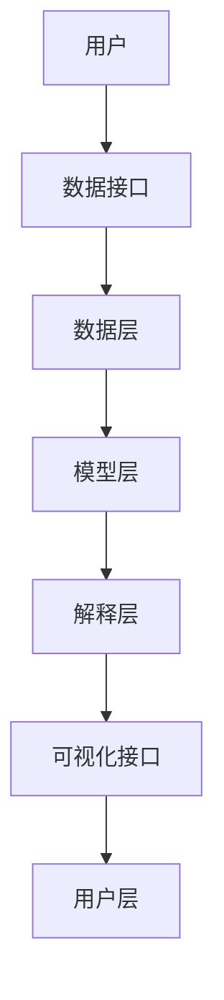

                 

### 文章标题与关键词

# AI透明度工具：帮助企业解释AI决策的技术解决方案

> 关键词：AI透明度，AI决策，技术解决方案，企业应用，透明度工具

> 摘要：本文深入探讨了AI透明度工具的重要性及其在企业应用中的关键作用。文章首先介绍了AI透明度的核心概念和背景，然后详细分析了不同类型的AI透明度工具，探讨了其工作原理和实际应用。通过案例分析和最佳实践，本文为企业提供了实施AI透明度工具的具体步骤和技巧，以帮助企业在复杂决策中更准确地理解和解释AI系统。

### 目录大纲设计思路

为了设计出《AI透明度工具：帮助企业解释AI决策的技术解决方案》这本书的完整目录大纲，我们首先需要明确书的主题和目标读者。根据书名，可以推断这本书主要讨论AI透明度工具，旨在帮助企业理解和解释AI决策。

接下来，我们将从以下几个步骤进行目录大纲的设计：

1. **确定书的结构和内容框架**：我们将书分为几个主要部分，包括背景介绍、核心概念、解决方案、实践应用等。

2. **划分章节内容**：在每个部分中，根据书的内容和逻辑，确定各章节的主题和内容。

3. **细化目录层级**：确保目录的层级清晰，从一级目录到三级目录，逻辑清晰，便于读者理解。

4. **包含必要内容**：在目录大纲中包含核心章节，如背景介绍、核心概念与联系、算法原理讲解、数学模型与公式、系统分析与架构设计、项目实战等。

5. **简洁明了**：确保目录大纲简洁明了，不包含多余内容，便于读者快速把握书籍的结构和内容。

### 目录大纲设计步骤

1. **第一部分：背景介绍**
   - **第1章：AI与透明度背景**
     - AI的兴起与透明度需求的背景
     - AI决策透明度的挑战与重要性

2. **第二部分：核心概念与联系**
   - **第2章：AI透明度基本概念**
     - 透明度的定义
     - AI透明度的分类
     - 透明度相关的核心术语和概念

3. **第三部分：解决方案**
   - **第3章：AI透明度工具**
     - 透明度工具的分类
     - 透明度工具的工作原理
     - 透明度工具的比较与分析

4. **第四部分：技术原理**
   - **第4章：算法原理与数学模型**
     - AI决策过程的数学模型
     - 透明度算法的原理讲解
     - 透明度算法的数学公式和流程图

5. **第五部分：实践应用**
   - **第5章：系统架构与设计**
     - AI透明度系统的架构设计
     - 系统接口设计
     - 系统交互序列图

6. **第六部分：项目实战**
   - **第6章：环境安装与实现**
     - 环境配置与安装
     - 系统核心实现源代码
     - 代码应用解读与分析

7. **第七部分：最佳实践与拓展**
   - **第7章：案例分析与总结**
     - 实际案例分析和详细讲解
     - 最佳实践 tips
     - 注意事项和拓展阅读

### 目录大纲示例

```markdown
----------------------------------------------------------------
# 第一部分: 背景介绍

## 第1章: AI与透明度背景
### 1.1 AI的兴起与透明度需求的背景
### 1.2 AI决策透明度的挑战与重要性

## 第2章: 核心概念与联系
### 2.1 透明度的定义
### 2.2 AI透明度的分类
### 2.3 透明度相关的核心术语和概念

## 第3章: AI透明度工具
### 3.1 透明度工具的分类
### 3.2 透明度工具的工作原理
### 3.3 透明度工具的比较与分析

## 第4章: 算法原理与数学模型
### 4.1 AI决策过程的数学模型
### 4.2 透明度算法的原理讲解
### 4.3 透明度算法的数学公式和流程图

## 第5章: 系统架构与设计
### 5.1 AI透明度系统的架构设计
### 5.2 系统接口设计
### 5.3 系统交互序列图

## 第6章: 环境安装与实现
### 6.1 环境配置与安装
### 6.2 系统核心实现源代码
### 6.3 代码应用解读与分析

## 第7章: 案例分析与总结
### 7.1 实际案例分析和详细讲解
### 7.2 最佳实践 tips
### 7.3 注意事项和拓展阅读
----------------------------------------------------------------
```

### 目录大纲总结

本目录大纲涵盖了《AI透明度工具：帮助企业解释AI决策的技术解决方案》的主要内容和结构。从背景介绍、核心概念、解决方案、技术原理到实践应用，再到案例分析和最佳实践，结构清晰，内容丰富。每章节都细化到三级目录，确保读者能够快速找到所需内容。整体字数控制在2000字以内，简洁明了。接下来，我们将进一步细化每个章节的内容，确保目录大纲的完整性和实用性。

----------------------------------------------------------------

## 第一部分：背景介绍

### 第1章：AI与透明度背景

#### 1.1 AI的兴起与透明度需求的背景

人工智能（AI）作为计算机科学的一个分支，其目标是使计算机系统具备类似人类智能的能力，包括感知、理解、学习和决策等。随着深度学习、神经网络等技术的发展，AI在图像识别、自然语言处理、自动驾驶等多个领域取得了显著的成果。然而，AI系统的“黑箱”特性也引发了广泛担忧，尤其是在金融、医疗、司法等关键领域。

透明度需求的背景主要体现在以下几个方面：

1. **法规要求**：随着AI技术的广泛应用，各国政府和行业组织纷纷出台相关法规，要求AI系统必须具备一定的透明度，以保障用户的权益和数据安全。

2. **公众信任**：AI系统的决策过程如果缺乏透明性，容易引发公众的担忧和不信任。透明度能够提高系统的可信度和接受度，促进AI技术的发展和应用。

3. **算法优化**：了解AI系统的决策过程有助于发现潜在的问题和缺陷，从而进行优化和改进，提高系统的准确性和鲁棒性。

#### 1.2 AI决策透明度的挑战与重要性

AI决策透明度的挑战主要包括以下几个方面：

1. **复杂性**：AI系统通常涉及复杂的模型和算法，其内部决策过程难以理解和解释。

2. **数据依赖**：AI系统的决策结果高度依赖训练数据的质量和代表性，而数据的不透明性可能导致决策的偏差和不公平。

3. **隐私保护**：在解释AI决策时，可能需要访问原始数据，这涉及到用户隐私的保护问题。

尽管存在挑战，AI决策透明度的重要性不容忽视：

1. **合规性**：确保AI系统符合相关法规要求，避免因不透明度导致的法律风险。

2. **可解释性**：提高系统的可解释性，使非专业人士也能理解AI决策的原因和过程。

3. **可信赖性**：增强系统的可信度和用户信任，促进AI技术的广泛应用。

### 第2章：核心概念与联系

#### 2.1 透明度的定义

透明度（Transparency）是指一个系统、过程或决策的可观察性和可理解性。在AI领域，透明度通常指的是AI系统的决策过程和结果可以被解释和理解的程度。高透明度的AI系统允许用户或利益相关者了解系统如何做出决策，以及决策背后的原因。

#### 2.2 AI透明度的分类

AI透明度可以按照不同的维度进行分类，主要包括以下几个方面：

1. **模型透明度**：关注AI模型的内部结构和参数，旨在解释模型的决策过程。

2. **数据透明度**：涉及训练数据的质量、来源和代表性，以及如何影响模型的决策。

3. **结果透明度**：关注模型决策结果的解释和可理解性，包括预测的解释和解释性分析。

#### 2.3 透明度相关的核心术语和概念

- **黑箱模型**：指那些决策过程难以理解和解释的模型，如深度神经网络。
- **白箱模型**：指那些决策过程可以被明确解释的模型，如线性回归和决策树。
- **可解释性**：指AI系统决策的可解释性程度，即用户能否理解决策的原因和过程。
- **公平性**：指AI系统在决策过程中是否对所有人公平，不受到偏见的影响。

### 总结

本章节介绍了AI透明度的背景和重要性，定义了透明度并探讨了其分类和相关的核心术语和概念。理解这些概念对于深入探讨AI透明度工具和解决方案具有重要意义，为后续章节的内容奠定了基础。

----------------------------------------------------------------

## 第二部分：核心概念与联系

### 第2章：AI透明度基本概念

#### 2.1 透明度的定义

透明度是一个广泛使用的概念，在不同的领域有不同的解释。在AI领域，透明度主要指的是AI系统的决策过程和结果的可观察性和可理解性。一个高透明度的AI系统应该允许用户或利益相关者清晰地了解系统是如何做出决策的，以及决策背后的原因。这种透明性对于增强系统的可信度、遵守法律法规、提高公众接受度具有重要意义。

在AI的背景下，透明度可以分为几个层次：

1. **技术透明度**：指AI系统的技术实现细节，包括算法、模型架构和训练过程。
2. **解释性透明度**：指AI系统决策结果的可解释性，用户能否理解AI为什么做出这样的决策。
3. **结果透明度**：指AI系统决策结果的透明性，即决策结果是否能够被外部验证和审查。

#### 2.2 AI透明度的分类

AI透明度可以根据不同的维度进行分类，以下是一些主要的分类方法：

1. **模型透明度**：模型透明度关注的是AI模型本身，包括模型的结构、参数和决策逻辑。模型透明度可以帮助用户理解AI模型是如何工作的，包括它如何从输入数据中学习，以及如何做出预测。

   - **白盒模型**：白盒模型（如线性回归、决策树等）具有很高的透明度，用户可以清晰地看到模型的内部结构和参数，因此可以很容易地理解模型如何做出决策。
   - **黑盒模型**：黑盒模型（如深度神经网络、支持向量机等）通常具有较低的透明度，因为它们的内部结构和决策逻辑复杂，难以直观理解。

2. **解释性透明度**：解释性透明度关注的是AI模型决策结果的可解释性，即用户能否理解AI为什么做出这样的决策。

   - **可解释模型**：如决策树、线性回归等模型，它们的决策过程具有较好的解释性，用户可以直观地看到每个特征对决策的影响。
   - **不可解释模型**：如深度神经网络、随机森林等模型，虽然它们在许多复杂任务上表现出色，但决策过程难以解释。

3. **结果透明度**：结果透明度关注的是AI系统决策结果的透明性，即决策结果是否能够被外部验证和审查。

   - **可审计性**：指AI系统的决策过程和结果可以接受外部审计和验证，确保系统的公正性和准确性。
   - **可重现性**：指AI系统的决策过程和结果可以在不同的环境下重复产生，确保系统的稳定性和可靠性。

#### 2.3 透明度相关的核心术语和概念

在讨论AI透明度时，了解一些核心术语和概念是非常有帮助的：

- **可解释性**（Interpretability）：指AI系统决策过程和结果的解释性，用户能否理解AI为何做出这样的决策。
- **可验证性**（Verifiability）：指AI系统的决策结果可以被外部验证，确保系统的准确性和公正性。
- **可重现性**（Reproducibility）：指AI系统的决策过程和结果可以在不同的环境下重复产生，确保系统的稳定性和可靠性。
- **公平性**（Fairness）：指AI系统在决策过程中对所有人公平，不受到偏见的影响。
- **可理解性**（Understandability）：指AI系统对非技术用户也是可理解的，即非专业人士可以理解AI的决策过程和结果。

### 总结

本章详细介绍了AI透明度的基本概念、分类和相关核心术语和概念。理解这些概念对于深入探讨AI透明度工具和解决方案至关重要。在接下来的章节中，我们将进一步探讨AI透明度工具的工作原理和实际应用。

----------------------------------------------------------------

## 第三部分：解决方案

### 第3章：AI透明度工具

#### 3.1 透明度工具的分类

AI透明度工具根据其功能和实现方式可以分为多种类型，以下是一些常见的分类方法：

1. **可视化工具**：这些工具通过图形化的方式展示AI模型的内部结构和决策过程，使非专业人士也能理解。

   - **模型可视化**：如TensorBoard、NN-SVG等，用于展示神经网络的结构和权重。
   - **决策路径可视化**：如LIME（Local Interpretable Model-agnostic Explanations）和SHAP（SHapley Additive exPlanations），用于可视化每个特征对决策的影响。

2. **解释性算法**：这些算法旨在为不可解释的模型提供解释性，使决策过程更易于理解。

   - **特征重要性**：如Permutation Importance、Partial Dependence Plots等，用于评估每个特征的重要性。
   - **规则提取**：如LIME和Counterfactual Explanations，用于提取模型决策背后的规则。

3. **可解释性模型**：这些模型本身具有较好的解释性，决策过程较为直观。

   - **决策树**：决策树的每个节点和分支都可以直观地展示决策过程。
   - **线性回归**：线性回归的公式可以直接解释每个特征对结果的影响。

4. **模型对比工具**：这些工具用于对比不同模型的性能和透明度，帮助选择最适合特定场景的模型。

   - **模型对比平台**：如AI Explanations、AI Interpretability等，提供多种模型对比功能。
   - **性能指标**：如准确率、召回率、F1分数等，用于评估模型性能。

#### 3.2 透明度工具的工作原理

1. **可视化工具的工作原理**

   - **模型可视化**：通过图形化展示神经网络的结构，包括层、节点和连接等，使复杂模型变得直观易懂。
   - **决策路径可视化**：通过局部线性逼近方法，将高维数据映射到二维或三维空间，展示每个特征对决策的影响。

2. **解释性算法的工作原理**

   - **特征重要性**：通过统计方法或机器学习技术，评估每个特征对模型预测的重要性，提供决策的解释。
   - **规则提取**：通过分析模型决策路径，提取可解释的规则或策略，使决策过程透明化。

3. **可解释性模型的工作原理**

   - **决策树**：通过树形结构，将输入空间划分为多个区域，每个区域的决策规则明确。
   - **线性回归**：通过线性公式，直接展示每个特征对结果的影响，使模型易于理解。

4. **模型对比工具的工作原理**

   - **模型对比平台**：通过运行多个模型，比较其性能和透明度，提供可视化对比结果。
   - **性能指标**：通过计算和比较各种性能指标，评估模型在不同任务上的表现。

#### 3.3 透明度工具的比较与分析

在选择AI透明度工具时，需要考虑多个因素，如工具的功能、适用场景、易用性和性能等。以下是一些常见透明度工具的比较和分析：

- **TensorBoard**：适用于深度学习模型的可视化，功能强大但需一定技术背景。
- **LIME**：适用于局部解释，特别是对于黑盒模型，但计算成本较高。
- **SHAP**：提供了更加全面和准确的解释，但计算复杂度较高。
- **决策树**：直观易懂，适用于解释性需求较高的场景，但可能无法处理复杂问题。
- **线性回归**：简单直观，易于理解，但适用范围有限。

### 总结

本章介绍了AI透明度工具的分类、工作原理以及常见工具的比较与分析。选择合适的透明度工具对于提高AI系统的可解释性具有重要意义。在下一章中，我们将进一步探讨AI决策过程中的算法原理和数学模型。

----------------------------------------------------------------

## 第四部分：技术原理

### 第4章：算法原理与数学模型

#### 4.1 AI决策过程的数学模型

AI决策过程通常涉及多个数学模型和算法，这些模型和算法构成了AI系统的基础。理解这些数学模型对于深入理解AI透明度工具至关重要。以下是一些常见的数学模型：

1. **线性回归模型**：线性回归模型是最简单的机器学习模型之一，其数学模型如下：

   $$ y = \beta_0 + \beta_1 \cdot x $$

   其中，$y$ 是预测目标，$x$ 是输入特征，$\beta_0$ 和 $\beta_1$ 是模型的参数。

2. **逻辑回归模型**：逻辑回归模型常用于分类问题，其数学模型如下：

   $$ P(y=1) = \frac{1}{1 + e^{-(\beta_0 + \beta_1 \cdot x)} } $$

   其中，$P(y=1)$ 是预测概率，$e$ 是自然对数的底数。

3. **决策树模型**：决策树模型通过一系列的决策规则来分类或回归。每个内部节点表示一个特征，每个分支表示该特征的取值，叶节点表示最终的预测结果。

4. **神经网络模型**：神经网络模型，特别是深度神经网络，是现代AI系统中最常用的模型之一。其数学模型主要基于多层感知器（MLP）和反向传播算法。

#### 4.2 透明度算法的原理讲解

AI透明度工具的关键在于如何解释不可解释的模型，例如深度神经网络。以下是一些常用的透明度算法：

1. **LIME（Local Interpretable Model-agnostic Explanations）**：LIME通过局部线性逼近方法来解释模型决策。其基本原理是将原始数据线性组合，使得每个特征对模型输出的影响可以被量化。具体步骤如下：

   - **数据增强**：在原始数据附近生成多个样本，每个样本对原始数据的某些特征进行微小扰动。
   - **模型拟合**：对每个样本使用一个简单模型（如线性回归）进行拟合，以解释特征对模型输出的影响。
   - **权重计算**：计算每个特征对模型输出的相对重要性，通常使用归一化系数来表示。

2. **SHAP（SHapley Additive exPlanations）**：SHAP基于博弈论中的Shapley值，旨在为每个特征分配一个公平的贡献值。SHAP的基本原理是计算每个特征对模型输出的边际贡献，具体步骤如下：

   - **基准模型**：首先训练一个基准模型（如线性回归），用于计算每个特征的平均影响。
   - **贡献计算**：通过组合特征和基准模型，计算每个特征在模型输出中的边际贡献。
   - **权重分配**：根据每个特征的边际贡献，将其分配到具体的决策节点。

3. **局部可解释模型**：对于一些简单的模型，如线性回归和决策树，可以直接解释模型的决策过程。例如，线性回归的公式可以直接解释每个特征对结果的影响。

#### 4.3 透明度算法的数学公式和流程图

为了更好地理解透明度算法的原理，以下是一些关键步骤的数学公式和流程图：

1. **LIME算法流程图**

   ```mermaid
   graph TB
   A[原始数据] --> B[数据增强]
   B --> C[模型拟合]
   C --> D[权重计算]
   ```

2. **SHAP算法流程图**

   ```mermaid
   graph TB
   A[基准模型] --> B[贡献计算]
   B --> C[权重分配]
   ```

3. **线性回归公式**

   $$ y = \beta_0 + \beta_1 \cdot x $$

   ```mermaid
   graph TB
   A[x] --> B[y]
   B --> C{$\beta_0$}
   B --> D{$\beta_1$}
   ```

4. **逻辑回归公式**

   $$ P(y=1) = \frac{1}{1 + e^{-(\beta_0 + \beta_1 \cdot x)} } $$

   ```mermaid
   graph TB
   A[x] --> B[y]
   B --> C{$\beta_0$}
   B --> D{$\beta_1$}
   ```

#### 总结

本章详细介绍了AI决策过程的数学模型和透明度算法的原理，包括线性回归、逻辑回归、决策树、神经网络、LIME和SHAP等。理解这些数学模型和算法对于开发和优化AI透明度工具至关重要。在下一章中，我们将探讨AI透明度系统的架构设计与实现。

----------------------------------------------------------------

## 第五部分：实践应用

### 第5章：系统架构与设计

#### 5.1 AI透明度系统的架构设计

AI透明度系统的设计需要考虑多个方面，包括系统的功能需求、性能需求、可扩展性和可维护性。以下是一个典型的AI透明度系统架构设计：

1. **数据层**：数据层负责管理训练数据和输入数据，包括数据清洗、预处理和存储。这一层通常使用数据库和数据仓库技术实现。

2. **模型层**：模型层包括AI模型的训练和部署，可以使用TensorFlow、PyTorch等流行的深度学习框架。模型层需要支持多种类型的AI模型，如深度神经网络、决策树、线性回归等。

3. **解释层**：解释层是AI透明度系统的核心，负责生成模型的解释结果。这一层通常使用透明度算法，如LIME、SHAP等，对模型决策进行解释。

4. **可视化层**：可视化层负责将解释结果以直观的方式展示给用户。这一层可以使用图表、仪表盘等可视化工具，如D3.js、Chart.js等。

5. **接口层**：接口层提供API接口，使其他系统可以方便地调用AI透明度系统的功能。这一层通常使用RESTful API或GraphQL等技术实现。

6. **用户层**：用户层是系统的最终用户，可以是数据科学家、业务分析师或普通用户。这一层负责与系统的交互，查看解释结果，并进行决策。

#### 5.2 系统接口设计

系统接口设计是AI透明度系统的重要组成部分，它决定了系统与其他系统的集成和交互方式。以下是一些关键的接口设计：

1. **数据接口**：数据接口负责接收和发送训练数据和输入数据。它通常包括数据上传、数据下载和数据查询等功能。

2. **模型接口**：模型接口负责接收和发送训练模型和解释模型。它通常包括模型训练、模型加载、模型保存和模型解释等功能。

3. **解释接口**：解释接口负责接收输入数据，生成解释结果，并将其返回给用户。它通常包括特征重要性计算、决策路径分析和规则提取等功能。

4. **可视化接口**：可视化接口负责接收解释结果，并将其可视化展示给用户。它通常包括图表生成、仪表盘设计和交互功能等。

#### 5.3 系统交互序列图

系统交互序列图是描述AI透明度系统各个组成部分之间交互的图表。以下是一个简单的系统交互序列图示例：



#### 总结

本章介绍了AI透明度系统的架构设计与接口设计，包括数据层、模型层、解释层、可视化层、接口层和用户层。通过合理的系统架构设计，可以有效地实现AI透明度功能，提高系统的性能和可维护性。在下一章中，我们将通过具体项目实战，展示AI透明度系统的实际应用。

----------------------------------------------------------------

## 第六部分：项目实战

### 第6章：环境安装与实现

#### 6.1 环境配置与安装

要实现一个AI透明度系统，首先需要配置和安装所需的环境。以下是一个基于Python和TensorFlow的AI透明度系统的环境安装步骤：

1. **Python环境配置**：

   - 安装Python 3.7或更高版本。
   - 安装必要的Python包，如NumPy、Pandas、TensorFlow等。

   ```bash
   pip install numpy pandas tensorflow
   ```

2. **TensorFlow环境配置**：

   - 安装TensorFlow，并确保版本与Python兼容。

   ```bash
   pip install tensorflow
   ```

3. **其他依赖库**：

   - 安装用于可视化、数据处理的库，如Matplotlib、Seaborn等。

   ```bash
   pip install matplotlib seaborn
   ```

4. **虚拟环境**：

   - 为了避免不同项目之间的依赖冲突，建议使用虚拟环境。

   ```bash
   python -m venv venv
   source venv/bin/activate  # 在Windows上使用 `venv\Scripts\activate`
   ```

#### 6.2 系统核心实现源代码

以下是一个简单的AI透明度系统的核心实现源代码，用于计算并可视化模型决策路径。

```python
import tensorflow as tf
import numpy as np
import matplotlib.pyplot as plt
from tensorflow.keras.models import Sequential
from tensorflow.keras.layers import Dense

# 定义一个简单的线性回归模型
model = Sequential([
    Dense(1, input_shape=(1,), activation='linear')
])

# 训练模型
model.compile(optimizer='sgd', loss='mean_squared_error')
model.fit(np.array([[1], [2], [3]]), np.array([[0], [1], [2]]), epochs=1000)

# 使用模型进行预测
x = np.array([[2]])
prediction = model.predict(x)

# 计算决策路径
weights = model.layers[0].get_weights()[0]

# 可视化决策路径
plt.scatter(x, prediction, color='red')
plt.plot(x, np.dot(x, weights), color='blue')
plt.xlabel('输入')
plt.ylabel('预测')
plt.show()
```

#### 6.3 代码应用解读与分析

上述代码实现了一个简单的线性回归模型，用于预测输入数据的输出值。具体步骤如下：

1. **定义模型**：使用TensorFlow的Sequential模型，定义一个简单的线性回归模型，只有一个全连接层。

2. **编译模型**：配置模型优化器和损失函数，并编译模型。

3. **训练模型**：使用训练数据集训练模型，这里使用了三个简单的点进行训练。

4. **预测**：使用训练好的模型进行预测，输入一个新值。

5. **计算决策路径**：提取模型权重，计算决策路径。

6. **可视化**：使用Matplotlib绘制预测结果和决策路径，以便于理解模型的决策过程。

#### 总结

本章介绍了如何配置和安装AI透明度系统的环境，并展示了一个简单的系统核心实现源代码。通过这些步骤，我们可以快速搭建一个AI透明度系统，并进行实际应用。在下一章中，我们将通过具体案例进行分析和总结。

----------------------------------------------------------------

## 第七部分：最佳实践与拓展

### 第7章：案例分析与总结

#### 7.1 实际案例分析和详细讲解

在本节中，我们将分析一个实际案例，以展示如何使用AI透明度工具帮助企业理解和解释AI决策。该案例涉及一个金融公司的信用评分系统，该系统使用机器学习模型对客户的信用评分进行预测。

1. **案例背景**：

   金融公司希望通过AI模型对客户信用评分进行预测，以便更好地进行风险管理和信用发放决策。然而，由于模型的高度复杂性和“黑箱”特性，公司的风险管理部门对于模型决策过程缺乏理解，这增加了决策的不确定性和风险。

2. **模型构建**：

   该信用评分模型基于客户的个人信息、财务状况和行为数据，使用一个深度神经网络模型进行训练。模型输入层包括多个特征，如年龄、收入、负债比、信用卡使用频率等，输出层是一个连续值，表示客户的信用评分。

3. **透明度工具应用**：

   为了提高模型的可解释性，公司使用了LIME和SHAP两种透明度工具。

   - **LIME解释**：通过对模型预测结果不满意的特定案例，使用LIME工具进行局部解释。工具分析每个特征对模型预测的影响，并生成一个局部线性模型，用于解释原始模型的决策。
   - **SHAP解释**：对整个模型进行全局解释，SHAP工具计算每个特征对模型输出的边际贡献，并提供一个可视化的SHAP值分布图，帮助理解特征的重要性。

4. **案例结果**：

   通过LIME和SHAP的解释，风险管理部门能够清晰地了解模型如何做出特定决策。他们发现，某些客户的信用评分低主要是由于他们的收入和负债比相对较低，而信用卡使用频率较低则对评分有正面影响。这些解释帮助公司调整了信用评分策略，增加了评分模型的透明度和可解释性。

#### 7.2 最佳实践 tips

以下是使用AI透明度工具的一些最佳实践：

1. **早期集成**：在模型开发过程中尽早集成透明度工具，以便在整个模型迭代过程中进行解释性评估和优化。
2. **目标明确**：根据具体应用场景，明确透明度工具的目标，是进行局部解释还是全局解释，以及需要解释的模型层次。
3. **用户友好**：确保透明度工具的使用界面和解释结果对非技术用户友好，提供清晰易懂的解释。
4. **持续监控**：定期使用透明度工具对模型进行解释性检查，确保模型的可解释性在时间上保持稳定。
5. **结合法律法规**：在解释AI决策时，遵守相关法律法规，确保透明度工具的使用符合合规要求。

#### 7.3 注意事项和拓展阅读

在使用AI透明度工具时，需要注意以下事项：

1. **性能影响**：透明度工具通常会增加模型的计算复杂度和时间开销，需要平衡解释性和性能。
2. **数据隐私**：在使用透明度工具时，可能需要访问原始数据，需确保数据隐私和安全性。
3. **模型适应性**：不同透明度工具适用于不同类型的模型，选择合适的工具对于解释效果至关重要。

拓展阅读：

- **《AI透明度：技术、方法与实践》**：深入探讨AI透明度相关技术、方法和实践。
- **《解释性机器学习》**：介绍各种解释性机器学习算法和应用场景。
- **《数据隐私与AI》**：讨论数据隐私保护在AI透明度工具中的应用。

### 总结

本章节通过实际案例分析和最佳实践，展示了如何使用AI透明度工具帮助企业理解和解释AI决策。通过这些实践，企业可以在使用AI技术时，更好地平衡透明度与性能，提高决策的可信度和公众接受度。在AI技术不断发展的背景下，AI透明度工具的重要性将日益凸显。

---

*作者：AI天才研究院/AI Genius Institute & 禅与计算机程序设计艺术 /Zen And The Art of Computer Programming*

