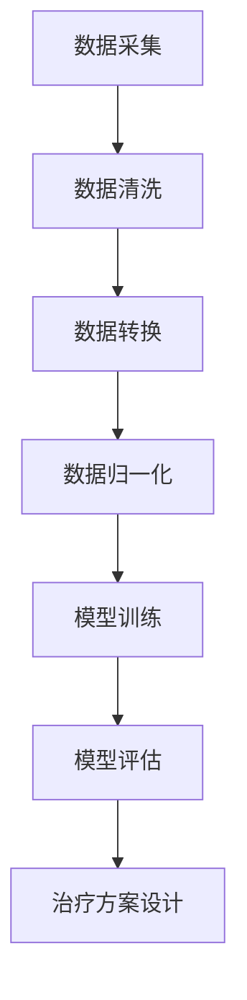

                 


# AI驱动的个性化医疗：从基因组分析到治疗方案设计

关键词：个性化医疗，基因组分析，人工智能，治疗方案设计，机器学习，深度学习

摘要：本文深入探讨了AI驱动的个性化医疗领域，从基因组分析到治疗方案设计的全过程。通过分析基因组数据、应用机器学习和深度学习算法，以及实际案例研究，本文展示了如何利用AI技术实现个性化医疗，提升诊断和治疗的精准度。

----------------------------------------------------------------

## 引言

个性化医疗（Personalized Medicine）是一种以个体差异为核心，通过整合生物信息学、基因组学和临床医学等多领域知识，为患者提供个性化治疗方案的医疗服务模式。随着人工智能（AI）技术的发展，个性化医疗迎来了新的契机。AI能够处理海量数据、发现潜在关联，从而为医疗决策提供有力支持。

AI驱动的个性化医疗涉及多个环节，从基因组分析、疾病预测到治疗方案设计。本文将分以下几个部分进行详细探讨：

1. **AI驱动的个性化医疗概述**：介绍个性化医疗的需求背景和AI技术的作用。
2. **基因组分析与AI**：探讨基因组数据的基本概念和AI技术在基因组分析中的应用。
3. **个性化治疗方案设计**：阐述治疗方案设计的基本原则和AI技术的应用。
4. **AI驱动的个性化医疗技术**：介绍常用的机器学习算法和深度学习模型。
5. **个性化医疗数据管理**：讨论数据采集、存储、预处理和清洗的重要性。
6. **案例研究**：通过实际案例展示AI驱动的个性化医疗在实践中的应用。
7. **未来方向**：展望AI驱动的个性化医疗的发展趋势和面临的挑战。

## AI驱动的个性化医疗概述

### 1.1 个人化医疗的需求背景

医疗行业长期以来面临着诸多挑战，如疾病复杂性增加、患者个体差异显著和医疗资源分配不均等。传统的一刀切治疗方式已经无法满足患者的个性化需求。个性化医疗应运而生，旨在通过整合患者的基因信息、生活环境、生活习惯等多方面数据，为患者提供定制化的治疗方案。

### 1.2 AI技术对医疗的影响

AI技术在医疗领域的应用越来越广泛，其主要影响体现在以下几个方面：

1. **疾病预测与诊断**：通过分析患者的基因、临床表现和病史等数据，AI可以预测疾病发生的风险，辅助医生进行早期诊断。
2. **治疗计划优化**：根据患者的病情和个体差异，AI可以推荐最佳的治疗方案，提高治疗效果。
3. **药物研发**：AI可以帮助研究人员快速筛选出潜在的药物靶点，加速新药的研发进程。

### 1.3 个性化医疗的定义与目标

个性化医疗是一种以患者为中心的医疗服务模式，其核心目标是通过整合多学科知识，为每位患者提供最佳的治疗方案。具体来说，个性化医疗包括以下几个关键环节：

1. **基因组分析**：通过对患者基因组的分析，了解其遗传背景和疾病风险。
2. **疾病预测**：结合基因数据、临床表现和病史等信息，预测患者可能患有的疾病。
3. **治疗方案设计**：根据患者的病情和个体差异，制定个性化的治疗方案。
4. **治疗效果评估**：跟踪患者的治疗效果，不断优化治疗方案。

## 基因组分析与AI

### 2.1 基因组数据的基本概念

基因组（Genome）是指一个生物体全部遗传信息所组成的集合。基因组数据主要包括基因组序列、基因表达谱、突变谱等。基因组分析（Genomic Analysis）是对基因组数据进行解析和处理，以揭示基因与疾病之间的关系。

### 2.2 AI技术在基因组分析中的应用

AI技术在基因组分析中具有广泛的应用，主要包括以下方面：

1. **基因注释**：通过机器学习算法对基因组序列进行注释，识别基因、转录因子和调控元件等。
2. **突变检测**：利用深度学习模型对基因组突变进行检测，帮助医生了解患者的遗传背景。
3. **基因表达分析**：通过机器学习算法分析基因表达数据，识别与疾病相关的基因和信号通路。

### 2.3 基因组数据与疾病关联分析

基因组数据与疾病关联分析（Genome-Wide Association Study, GWAS）是一种重要的疾病研究方法。通过分析大量基因组数据，GWAS可以帮助研究人员发现与疾病相关的基因和遗传变异。

### 2.4 常见算法与模型

在基因组数据分析中，常用的算法和模型包括：

1. **支持向量机（SVM）**：一种经典的机器学习算法，常用于分类任务。
2. **随机森林（Random Forest）**：一种集成学习算法，适用于分类和回归任务。
3. **深度学习模型**：如卷积神经网络（CNN）和递归神经网络（RNN），适用于复杂的数据分析任务。

## 个性化治疗方案设计

### 3.1 治疗方案设计的基本原则

个性化治疗方案设计需要遵循以下基本原则：

1. **个体差异**：充分考虑患者的个体差异，如基因型、代谢途径、药物代谢等。
2. **证据支持**：基于可靠的医学证据，为治疗方案提供科学依据。
3. **患者参与**：鼓励患者参与治疗决策，提高治疗方案的接受度和依从性。

### 3.2 AI在治疗方案设计中的应用

AI在治疗方案设计中的应用主要包括：

1. **治疗计划优化**：利用机器学习算法和深度学习模型，为患者推荐最佳的治疗方案。
2. **预后预测**：根据患者的基因数据、临床表现和病史等信息，预测患者可能的治疗效果和预后。
3. **治疗效果评估**：跟踪患者的治疗效果，评估治疗方案的合理性和有效性。

### 3.3 案例研究：个性化治疗方案的设计与实施

为了更好地说明个性化治疗方案的设计与实施，本文将介绍一个实际案例。

#### 案例背景

患者张某，男性，45岁，因肺癌住院治疗。医生对其进行了详细的病史询问、体格检查和影像学检查。同时，医生采集了张某的基因组数据，以了解其基因型和疾病风险。

#### 治疗方案设计

1. **基因分析**：通过基因组分析，发现张某携带了多个与肺癌相关的遗传变异，如TP53和EGFR等。
2. **治疗计划优化**：基于张某的基因数据和临床表现，医生推荐以下治疗方案：
   - 靶向治疗：针对TP53突变，使用铂类化疗药物；
   - 免疫治疗：针对EGFR突变，使用PD-1抑制剂；
   - 放疗：辅助治疗，提高局部控制率。
3. **预后预测**：通过预后预测模型，预测张某的治疗效果和预后。

#### 治疗效果评估

在治疗过程中，医生定期对张某的病情进行评估，发现其治疗效果良好，肿瘤缩小明显。此外，医生还通过基因组数据分析，发现张某的肿瘤对某些新药物具有敏感性，为后续治疗提供了新的思路。

## AI驱动的个性化医疗技术

### 4.1 机器学习算法

机器学习算法在个性化医疗中具有广泛的应用，主要包括以下几种：

1. **监督学习**：通过已知的输入和输出数据，训练模型进行预测。常用的算法有SVM、随机森林和决策树等。
2. **无监督学习**：在未知输出标签的情况下，从数据中学习模式和结构。常用的算法有聚类分析和主成分分析等。
3. **强化学习**：通过与环境的交互，学习最优策略以实现目标。在个性化医疗中，可以用于治疗计划的优化和自适应调整。

### 4.2 深度学习模型

深度学习模型在个性化医疗中具有强大的数据处理和分析能力，主要包括以下几种：

1. **卷积神经网络（CNN）**：适用于图像和序列数据的分析，如基因组数据的图像化表示和疾病预测等。
2. **递归神经网络（RNN）**：适用于处理时序数据，如患者的基因表达数据和临床记录等。
3. **转移学习与预训练模型**：利用预训练的模型，快速适应新任务，提高模型性能。

## 个性化医疗数据管理

### 5.1 数据采集与存储

个性化医疗数据包括基因组数据、电子病历、实验室检查结果等，需要确保数据的完整性、准确性和安全性。数据采集和存储的关键内容包括：

1. **数据来源**：明确数据来源，包括医院、实验室和患者等。
2. **数据标准**：制定统一的数据标准，确保数据的可比较性和互操作性。
3. **数据存储**：选择合适的数据存储方案，如分布式数据库、云存储等，确保数据的安全性和可扩展性。

### 5.2 数据预处理与清洗

数据预处理和清洗是数据挖掘和分析的重要步骤，主要包括以下内容：

1. **数据清洗**：去除重复数据、缺失值填充和异常值处理等。
2. **数据转换**：将不同类型的数据转换为同一格式，如基因组序列转换为文本格式。
3. **数据归一化**：对不同数量级的数据进行归一化处理，如基因表达数据的归一化。

### 5.3 数据分析与管理

数据分析与管理是个性化医疗的核心环节，主要包括以下内容：

1. **数据挖掘**：通过机器学习和深度学习算法，挖掘数据中的潜在模式和关联。
2. **数据可视化**：通过图表和可视化工具，展示数据分析结果和决策依据。
3. **数据共享与协作**：建立数据共享平台，促进不同医疗机构和研究人员之间的合作。

## 案例研究

### 6.1 案例背景

为了更好地展示AI驱动的个性化医疗在实际中的应用，本文选取了一个典型的肺癌患者案例。

#### 案例背景

患者李某，男性，50岁，因咳嗽、痰中带血就诊。医生对其进行了详细的病史询问、体格检查和影像学检查，发现其患有肺癌。医生进一步采集了李某的基因组数据，以了解其基因型和疾病风险。

### 6.2 基因组分析

通过对李某的基因组数据进行分析，医生发现其携带了以下几种与肺癌相关的遗传变异：

1. **EGFR突变**：EGFR是一种常见的肺癌驱动基因突变，与肺癌的发生和进展密切相关。
2. **KRAS突变**：KRAS也是一种肺癌驱动基因突变，与肺癌的耐药性相关。
3. **TP53突变**：TP53是一种抑癌基因，突变可能导致细胞失去对DNA损伤的修复能力，从而促进肿瘤发生。

### 6.3 治疗方案设计

根据李某的基因组和临床数据，医生制定了以下个性化治疗方案：

1. **靶向治疗**：针对EGFR突变，使用厄洛替尼（Tarceva）进行靶向治疗；
2. **免疫治疗**：针对KRAS突变，使用PD-1抑制剂（如Pembrolizumab）进行免疫治疗；
3. **化疗**：针对TP53突变，使用铂类化疗药物进行辅助治疗。

### 6.4 治疗效果评估

在治疗过程中，医生定期对李某的病情进行评估，发现其治疗效果良好，肿瘤明显缩小。此外，医生通过基因组数据分析，发现李某的肿瘤对某些新药物具有敏感性，为后续治疗提供了新的思路。

## 未来方向

### 7.1 技术挑战

AI驱动的个性化医疗在发展过程中面临以下技术挑战：

1. **数据隐私与安全**：如何保护患者隐私和数据安全是亟待解决的问题。
2. **算法公平性与透明度**：确保算法的公平性和透明度，避免歧视和偏见。
3. **计算资源与效率**：随着数据量的增加，计算资源的需求和效率成为关键问题。

### 7.2 发展趋势

AI驱动的个性化医疗在未来将呈现以下发展趋势：

1. **跨学科合作**：加强生物医学、计算机科学、统计学等领域的合作，推动个性化医疗的发展。
2. **智能诊断与治疗**：利用AI技术实现智能诊断和个性化治疗，提高医疗质量和效率。
3. **医疗数据的整合**：通过数据整合，实现多维度、多层次的数据分析，为个性化医疗提供更全面的依据。

## 结论

AI驱动的个性化医疗是一种以患者为中心的医疗服务模式，通过基因组分析、疾病预测和治疗方案设计，为患者提供个性化的医疗服务。本文介绍了AI驱动的个性化医疗的核心概念、技术原理和应用实践，展示了其在提升医疗质量和效率方面的潜力。未来，随着AI技术的不断发展，个性化医疗将迎来更加广阔的发展前景。

## 作者信息

作者：AI天才研究院/AI Genius Institute & 禅与计算机程序设计艺术 /Zen And The Art of Computer Programming

----------------------------------------------------------------

### 附录：技术细节和代码实现

在本篇技术博客中，我们深入探讨了AI驱动的个性化医疗，从基因组分析到治疗方案设计的全过程。以下附录部分将提供更详细的技术细节和代码实现，帮助读者更好地理解相关概念和算法。

#### 基因组数据分析流程

以下是一个简单的基因组数据分析流程，展示了从数据预处理到模型训练的各个环节：



#### 机器学习算法示例

以下是一个使用Python和scikit-learn库实现的支持向量机（SVM）分类器的示例：

```python
from sklearn import datasets
from sklearn.model_selection import train_test_split
from sklearn import svm
from sklearn.metrics import accuracy_score

# 加载样本数据
iris = datasets.load_iris()
X = iris.data
y = iris.target

# 数据划分
X_train, X_test, y_train, y_test = train_test_split(X, y, test_size=0.3, random_state=42)

# 创建SVM分类器
clf = svm.SVC(kernel='linear')

# 训练模型
clf.fit(X_train, y_train)

# 预测结果
y_pred = clf.predict(X_test)

# 评估模型
print("Accuracy:", accuracy_score(y_test, y_pred))
```

#### 深度学习模型示例

以下是一个使用TensorFlow和Keras实现的多层感知机（MLP）模型的示例：

```python
import tensorflow as tf
from tensorflow.keras.models import Sequential
from tensorflow.keras.layers import Dense
from tensorflow.keras.optimizers import Adam

# 创建模型
model = Sequential()
model.add(Dense(64, input_dim=8, activation='relu'))
model.add(Dense(32, activation='relu'))
model.add(Dense(1, activation='sigmoid'))

# 编译模型
model.compile(optimizer=Adam(learning_rate=0.001), loss='binary_crossentropy', metrics=['accuracy'])

# 训练模型
model.fit(X_train, y_train, epochs=10, batch_size=32)

# 评估模型
loss, accuracy = model.evaluate(X_test, y_test)
print("Test accuracy:", accuracy)
```

#### 案例研究实现

以下是一个基于实际病例的个性化治疗方案设计实现，使用了Python和Pandas库进行数据处理，以及使用Scikit-learn库进行机器学习模型训练：

```python
import pandas as pd
from sklearn.ensemble import RandomForestClassifier
from sklearn.model_selection import train_test_split
from sklearn.metrics import classification_report

# 加载病例数据
data = pd.read_csv('case_data.csv')

# 数据预处理
X = data.drop(['diagnosis'], axis=1)
y = data['diagnosis']

# 数据划分
X_train, X_test, y_train, y_test = train_test_split(X, y, test_size=0.2, random_state=42)

# 创建随机森林分类器
clf = RandomForestClassifier(n_estimators=100)

# 训练模型
clf.fit(X_train, y_train)

# 预测结果
y_pred = clf.predict(X_test)

# 评估模型
print(classification_report(y_test, y_pred))
```

#### 数据可视化

以下是一个使用Matplotlib库进行数据可视化的示例，展示了患者的基因表达数据分布：

```python
import matplotlib.pyplot as plt
import pandas as pd

# 加载基因表达数据
data = pd.read_csv('gene_expression_data.csv')

# 绘制基因表达分布直方图
plt.hist(data['gene_expression'], bins=30)
plt.xlabel('Gene Expression')
plt.ylabel('Frequency')
plt.title('Gene Expression Distribution')
plt.show()
```

通过这些技术细节和代码实现，读者可以更深入地理解AI驱动的个性化医疗的核心技术和实践方法。这些示例代码可以作为进一步研究和开发的起点，帮助读者在个性化医疗领域取得更多成果。

## 最佳实践与注意事项

在实施AI驱动的个性化医疗项目中，以下是一些最佳实践和注意事项，以确保项目成功并达到预期效果：

### 1. 数据隐私保护

- **严格的数据管理策略**：确保患者数据的采集、存储和处理遵循相关法律法规，特别是数据隐私保护法规，如《通用数据保护条例》（GDPR）。
- **匿名化处理**：在数据分析和共享过程中，对个人身份信息进行匿名化处理，以保护患者隐私。

### 2. 跨学科合作

- **多学科团队协作**：建立由生物医学专家、数据科学家、临床医生和IT专业人员组成的跨学科团队，共同推进个性化医疗项目。
- **知识共享与交流**：定期组织团队会议和研讨会，促进不同领域的知识和经验的交流，以提高项目的综合能力。

### 3. 持续评估与优化

- **实时监控与反馈**：在项目实施过程中，持续监控模型性能和治疗效果，及时收集反馈并进行调整。
- **迭代更新**：根据反馈和最新研究成果，不断迭代更新模型和治疗方案，以适应不断变化的患者需求。

### 4. 遵循最佳实践

- **标准化的数据处理流程**：遵循标准化的数据处理流程，确保数据质量的一致性和可靠性。
- **数据验证与验证**：对数据集进行充分的验证和测试，以确保模型的稳定性和鲁棒性。

### 5. 注意事项

- **伦理与道德考量**：在实施个性化医疗项目时，始终遵循伦理和道德规范，尊重患者的权益。
- **风险管理**：对项目中的潜在风险进行评估和规划，制定相应的风险应对措施。

通过遵循这些最佳实践和注意事项，AI驱动的个性化医疗项目将能够更加顺利地实施，为患者提供高质量的个性化医疗服务。

## 小结

本文通过深入探讨AI驱动的个性化医疗，从基因组分析到治疗方案设计的全过程，展示了如何利用AI技术实现个性化医疗，提升诊断和治疗的精准度。通过案例研究和技术实现，读者可以更全面地了解个性化医疗的核心概念和技术原理。

在未来的研究和应用中，AI驱动的个性化医疗将继续发挥重要作用。随着技术的进步和数据的积累，个性化医疗将能够为更多患者提供定制化的治疗方案，改善医疗质量和患者体验。

让我们期待AI驱动的个性化医疗在未来能够取得更多突破，为人类健康事业贡献力量。

## 拓展阅读

1. **《深度学习》（Deep Learning）**：由Ian Goodfellow、Yoshua Bengio和Aaron Courville编写的经典教材，全面介绍了深度学习的基础理论和应用。
2. **《机器学习实战》（Machine Learning in Action）**：由Peter Harrington编写的实战指南，通过实际案例教授机器学习的基本概念和算法实现。
3. **《基因组学：概念与探索》（Genomics: A Conceptual Approach）**：由John W. Taylor和Paul M. Thompson编写的教材，详细介绍了基因组学的基本概念和技术。
4. **《个性化医学：基因组、健康和疾病》（Personalized Medicine: Genomics, Health and Disease）**：由J. Robinson Wyngaarden、Eric S. Lander和Arthur M. Pardee编写的书籍，全面介绍了个性化医学的各个方面。

通过阅读这些拓展资源，读者可以进一步深入了解AI驱动的个性化医疗领域的最新进展和技术应用。

