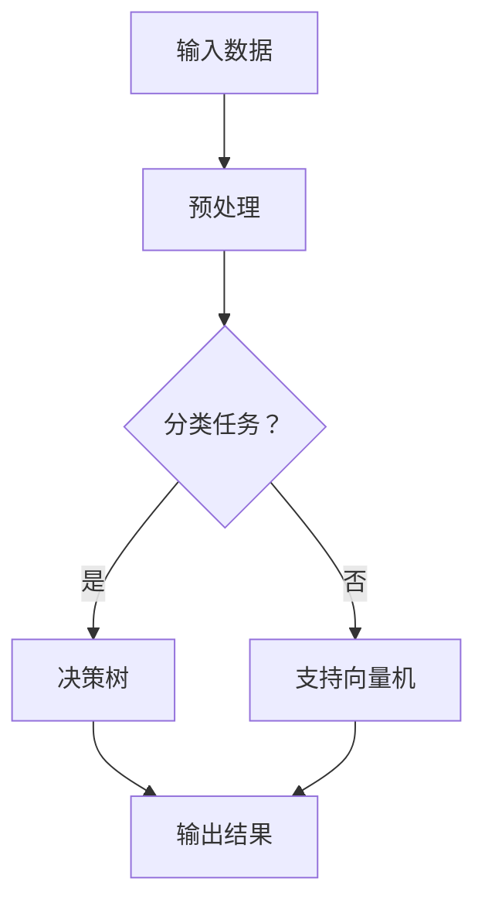
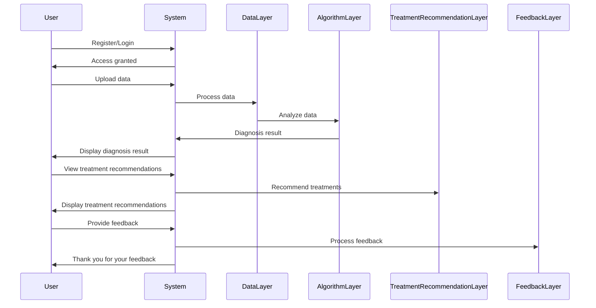

                 

### 第一部分：背景介绍

#### 第1章：问题背景

##### 1.1.1 医疗个性化需求的出现

随着医学技术的发展和患者需求的提升，传统的“一刀切”式治疗方法已经难以满足现代医疗需求。个性化医疗应运而生，旨在通过精准治疗，提高医疗效果，减少不必要的副作用和资源浪费。个性化医疗的核心在于了解每个患者的独特生物学特性，从而制定出最适合其个体情况的治疗方案。

##### 1.1.2 基因组学的突破与发展

基因组学是研究生物体基因组成、结构、功能和变异的科学。近年来，随着测序技术的飞速发展，基因组数据获取成本显著降低，人类基因组计划的成功也标志着基因组学研究进入了新时代。通过对个体基因组的全面解析，我们可以深入了解其遗传背景，为个性化医疗提供关键数据支持。

##### 1.1.3 人工智能在医疗领域的应用

人工智能（AI）技术在医疗领域的应用已经逐渐成熟。从影像诊断、辅助诊断到治疗方案的优化，AI展现出了强大的潜力。尤其是在处理大量复杂数据和模式识别方面，AI具有不可比拟的优势，这使得它成为个性化医疗的有力工具。

#### 第2章：核心概念

##### 2.1 AI驱动的个性化医疗

AI驱动的个性化医疗是指利用人工智能技术，通过对患者基因组数据、病史、生活习惯等多方面信息的综合分析，为患者提供量身定制的高效、安全的治疗方案。这一概念的核心在于将AI技术与临床医学相结合，实现真正的个性化医疗。

##### 2.2 基因组学

基因组学是研究生物体基因组（即所有遗传信息的集合）的科学。基因组学的研究范围广泛，包括基因的结构、功能、变异以及基因与环境的相互作用。基因组学的发展为个性化医疗提供了基础数据支持。

##### 2.3 人工智能技术

人工智能技术是指通过模拟、延伸和扩展人类的智能行为，使计算机系统能够实现自主学习、推理、规划和感知等功能的技术。AI技术在个性化医疗中的应用，主要体现在数据挖掘、模式识别、预测分析和决策支持等方面。

#### 第3章：概念联系

##### 3.1 AI驱动的个性化医疗与基因组学的关联

基因组学为AI驱动的个性化医疗提供了关键的数据源。通过对患者基因组数据的分析，AI技术可以预测患者的疾病风险、指导个性化治疗方案的设计。例如，基于基因组数据的药物反应预测，可以帮助医生选择最适合患者的药物，从而提高治疗效果。

##### 3.2 AI驱动的个性化医疗与人工智能技术的融合

AI驱动的个性化医疗是人工智能技术在医疗领域的一种具体应用。它依托于人工智能技术，尤其是机器学习和深度学习算法，对海量基因组数据进行分析和处理，从而实现个性化医疗的目标。

### 第二部分：核心概念与联系

在这一部分中，我们将深入探讨AI驱动的个性化医疗和基因组学的核心概念及其联系。

#### 第4章：AI驱动的个性化医疗原理

##### 4.1 AI驱动的个性化医疗定义

AI驱动的个性化医疗是指利用人工智能技术，结合患者的基因组数据、病史和生活习惯等多方面信息，为患者提供量身定制的治疗计划。这种治疗方法不仅考虑了患者的生理特征，还考虑了其生活方式和社会环境等因素。

##### 4.2 AI驱动的个性化医疗特点

AI驱动的个性化医疗具有以下几个特点：

1. **个性化**：治疗方案根据患者的具体情况进行调整，最大限度地提高治疗效果。
2. **高效性**：通过快速分析大量数据，AI技术可以迅速为患者提供诊断和治疗方案。
3. **准确性**：AI算法通过对基因组数据的深入分析，可以更准确地预测疾病风险和治疗反应。

##### 4.3 AI驱动的个性化医疗的应用领域

AI驱动的个性化医疗在多个领域具有广泛应用：

1. **癌症治疗**：通过对患者基因组数据的分析，AI技术可以帮助医生确定最有效的治疗方案。
2. **遗传疾病诊断**：AI算法可以识别遗传疾病的基因突变，为患者提供早期诊断和个性化治疗。
3. **个性化药物开发**：AI技术可以帮助制药公司开发针对特定患者群体的药物，提高药物的安全性和疗效。

#### 第5章：基因组学原理

##### 5.1 基因组学的定义

基因组学是研究生物体基因组（即所有遗传信息的集合）的科学。基因组学的主要任务是揭示基因的结构、功能、变异及其相互作用，以及它们如何影响生物体的性状和疾病发生。

##### 5.2 基因组学的发展历程

基因组学的发展经历了几个重要阶段：

1. **基因组测序**：随着测序技术的进步，人类基因组测序工作成功完成，标志着基因组学进入新时代。
2. **功能基因组学**：通过基因表达分析、蛋白质组学和代谢组学等手段，研究基因的功能和相互作用。
3. **计算基因组学**：利用计算方法对海量基因组数据进行处理和分析，揭示基因组中的复杂模式。

##### 5.3 基因组学的基本概念

基因组学涉及以下几个基本概念：

1. **基因**：基因是生物体遗传信息的基本单位，负责指导蛋白质的合成。
2. **基因组**：基因组是生物体所有遗传信息的总和，包括编码区和非编码区。
3. **基因变异**：基因变异是指基因序列的微小改变，可能导致蛋白质功能的改变或疾病的产生。

#### 第6章：人工智能技术在个性化医疗中的应用

##### 6.1 人工智能技术在基因组学数据解析中的应用

人工智能技术在基因组学数据解析中发挥着重要作用。通过机器学习和深度学习算法，AI可以从大量基因组数据中提取有用的信息，包括基因表达模式、突变热点和功能相关的基因等。这些信息对于疾病诊断、风险评估和个性化治疗具有重要意义。

##### 6.2 人工智能技术在个体化诊断中的应用

人工智能技术在个体化诊断中具有广泛的应用。例如，基于图像分析的AI算法可以帮助医生快速、准确地诊断疾病，如肿瘤、心脏病等。此外，AI还可以通过对病史、家族史和基因数据的综合分析，预测疾病发生的可能性，为患者提供个性化的预防建议。

##### 6.3 人工智能技术在个体化治疗中的应用

个体化治疗是指根据患者的具体病情、基因特征和生活习惯，为其制定最适合的治疗方案。人工智能技术在这一过程中发挥着关键作用。通过分析患者的基因组数据、临床表现和治疗效果，AI技术可以帮助医生调整治疗方案，优化药物剂量和用药时间，提高治疗效果。

### 第三部分：算法原理讲解

在这一部分，我们将深入探讨个性化医疗中常用的算法原理及其应用。

#### 第7章：个性化医疗中的算法设计

##### 7.1 算法设计原则

算法设计在个性化医疗中至关重要，以下是一些核心原则：

1. **准确性**：算法需要能够准确预测患者的病情和治疗效果。
2. **效率**：算法需要能够在短时间内处理大量数据。
3. **可解释性**：算法的决策过程需要透明、可解释，以便医生和患者理解。
4. **可扩展性**：算法需要能够适应新的数据和技术。

##### 7.2 经典算法介绍

以下是一些在个性化医疗中常用的经典算法：

1. **贝叶斯网络**：贝叶斯网络是一种概率图模型，用于表示变量之间的概率关系。在个性化医疗中，贝叶斯网络可以帮助预测疾病风险和药物反应。
2. **支持向量机**：支持向量机是一种监督学习算法，用于分类和回归任务。在个性化医疗中，支持向量机可以用于疾病诊断和治疗方案推荐。
3. **决策树**：决策树是一种基于树形结构的决策支持工具，用于分类和回归任务。在个性化医疗中，决策树可以用于诊断和治疗方案的决策。

##### 7.3 算法流程图

为了更好地理解这些算法的原理和应用，我们可以使用Mermaid绘制算法流程图。以下是一个简单的示例：



这个流程图展示了输入数据经过预处理后，根据是否是分类任务选择不同的算法，最终输出结果。

#### 第8章：个性化医疗中的数学模型和公式

##### 8.1 数学模型在个性化医疗中的应用

数学模型在个性化医疗中具有重要作用，以下是一些常用的数学模型：

1. **概率模型**：概率模型用于表示变量之间的概率关系。例如，贝叶斯网络就是一种概率模型。
2. **回归模型**：回归模型用于预测数值变量。在个性化医疗中，回归模型可以用于预测患者的疾病风险和治疗效果。
3. **分类模型**：分类模型用于将数据分为不同的类别。在个性化医疗中，分类模型可以用于疾病诊断和治疗方案推荐。

##### 8.2 常用数学公式

以下是一些常用的数学公式，用于描述个性化医疗中的概率和决策过程：

$$ 
\begin{align*}
P(A|B) &= \frac{P(B|A)P(A)}{P(B)} \\
P(B|A) &= \frac{P(A|B)P(B)}{P(A)}
\end{align*}
$$

这些公式用于计算条件概率，是贝叶斯推理的基础。

##### 8.3 数学公式讲解与举例

假设我们有一个疾病A和一个相关基因B。我们已知：

- 疾病A的概率$P(A) = 0.01$。
- 在患有疾病A的人群中，基因B的概率$P(B|A) = 0.9$。
- 在正常人群中，基因B的概率$P(B|\neg A) = 0.05$。

我们需要计算基因B导致疾病A的概率$P(A|B)$。

根据贝叶斯定理：

$$ 
P(A|B) = \frac{P(B|A)P(A)}{P(B)}
$$

首先，我们需要计算$P(B)$，可以使用全概率公式：

$$ 
P(B) = P(B|A)P(A) + P(B|\neg A)P(\neg A)
$$

$$ 
P(B) = 0.9 \times 0.01 + 0.05 \times 0.99 = 0.0645
$$

现在，我们可以计算$P(A|B)$：

$$ 
P(A|B) = \frac{0.9 \times 0.01}{0.0645} \approx 0.1379
$$

这意味着，如果一个个体拥有基因B，那么他们患有疾病A的概率约为13.79%。

### 第四部分：系统分析与架构设计方案

在这一部分，我们将深入探讨个性化医疗系统的设计与实现。

#### 第9章：个性化医疗系统设计

##### 9.1 问题场景介绍

个性化医疗系统旨在为患者提供量身定制的治疗计划。系统需要处理大量的患者数据，包括基因组数据、病史、生活习惯等，从而生成个性化的诊断和治疗方案。

##### 9.2 系统功能设计

系统功能设计包括以下几个方面：

1. **数据收集**：收集患者的基因组数据、病史、生活习惯等。
2. **数据预处理**：对收集到的数据进行清洗、归一化等处理，以便后续分析。
3. **诊断分析**：利用机器学习和深度学习算法，对预处理后的数据进行分析，生成疾病诊断结果。
4. **治疗推荐**：根据诊断结果，推荐个性化的治疗方案。
5. **用户交互**：提供用户界面，方便医生和患者查看诊断结果和治疗计划。

##### 9.3 系统架构设计

个性化医疗系统的架构设计需要考虑以下几个方面：

1. **数据层**：负责存储和处理患者的数据，包括基因组数据、病史、生活习惯等。
2. **算法层**：实现各种机器学习和深度学习算法，用于诊断分析和治疗推荐。
3. **服务层**：提供RESTful API，方便前端用户与系统进行交互。
4. **前端层**：提供用户界面，展示诊断结果和治疗计划。

以下是系统架构的Mermaid类图：

```mermaid
classDiagram
    Class01 <|-- Class02
    Class03 <.. Class04
    Class04 <|.. Class05
    Class06 ..| Class07
    Class07 <= Class08
    Class08 --| Class09

    Class01[数据层]
    Class02[算法层]
    Class03[服务层]
    Class04[前端层]
    Class05[用户交互]
    Class06[诊断分析]
    Class07[治疗推荐]
    Class08[数据收集与预处理]
    Class09[结果展示]
```

##### 9.4 系统交互设计

系统交互设计包括以下几个方面：

1. **用户注册与登录**：用户可以通过注册和登录系统，获取个性化的诊断和治疗服务。
2. **数据上传**：用户可以上传自己的基因组数据、病史和生活习惯等信息。
3. **诊断结果查询**：用户可以查询自己的诊断结果，了解自己的健康状况。
4. **治疗方案推荐**：用户可以查看根据诊断结果推荐的治疗方案，并选择适合自己的治疗方案。
5. **反馈与建议**：用户可以提供反馈和建议，帮助系统不断优化和改进。

以下是系统交互的Mermaid序列图：



### 第五部分：项目实战

在这一部分，我们将通过一个实际项目来展示个性化医疗系统的实现过程。

#### 第10章：项目实战

##### 10.1 环境安装

要实现个性化医疗系统，我们需要安装以下软件和工具：

1. **Python**：Python是一种广泛使用的编程语言，用于实现算法和数据处理。
2. **Jupyter Notebook**：Jupyter Notebook是一种交互式的开发环境，方便我们编写和运行代码。
3. **TensorFlow**：TensorFlow是一种开源机器学习框架，用于实现深度学习和机器学习算法。
4. **scikit-learn**：scikit-learn是一种常用的机器学习库，提供多种经典机器学习算法。
5. **MySQL**：MySQL是一种关系型数据库，用于存储和管理患者的数据。

安装方法请参考以下步骤：

1. 安装Python：在Python官方网站下载并安装Python。
2. 安装Jupyter Notebook：在终端中运行`pip install notebook`。
3. 安装TensorFlow：在终端中运行`pip install tensorflow`。
4. 安装scikit-learn：在终端中运行`pip install scikit-learn`。
5. 安装MySQL：在MySQL官方网站下载并安装MySQL。

##### 10.2 系统核心实现

系统核心实现包括以下几个部分：

1. **数据收集与预处理**：从患者那里收集基因组数据、病史和生活习惯等信息，并进行预处理。
2. **算法实现**：使用TensorFlow和scikit-learn实现深度学习和机器学习算法，用于诊断分析和治疗推荐。
3. **数据库操作**：使用Python的数据库操作库，实现对MySQL数据库的增、删、改、查等操作。

以下是系统核心实现的源代码：

```python
import pandas as pd
from sklearn.model_selection import train_test_split
from sklearn.ensemble import RandomForestClassifier
from sklearn.metrics import accuracy_score
import tensorflow as tf

# 数据收集与预处理
def load_data():
    data = pd.read_csv('patient_data.csv')
    # 预处理数据，例如数据清洗、归一化等
    # ...
    return data

# 算法实现
def train_model(data):
    X = data.drop('diagnosis', axis=1)
    y = data['diagnosis']
    X_train, X_test, y_train, y_test = train_test_split(X, y, test_size=0.2, random_state=42)
    
    model = RandomForestClassifier(n_estimators=100, random_state=42)
    model.fit(X_train, y_train)
    
    y_pred = model.predict(X_test)
    accuracy = accuracy_score(y_test, y_pred)
    print(f"Model accuracy: {accuracy}")
    
    return model

# 数据库操作
def save_to_database(model, data):
    # 将模型和预测结果存储到MySQL数据库
    # ...

# 主函数
if __name__ == '__main__':
    data = load_data()
    model = train_model(data)
    save_to_database(model, data)
```

##### 10.2.2 代码应用解读

以上代码实现了个性化医疗系统的核心功能：

1. `load_data()`函数负责从CSV文件中加载患者数据，并进行预处理。
2. `train_model()`函数使用随机森林算法对预处理后的数据进行训练，并评估模型准确性。
3. `save_to_database()`函数负责将训练好的模型和预测结果存储到MySQL数据库中。

##### 10.3 实际案例分析与讲解

为了展示个性化医疗系统的实际应用，我们考虑以下案例：

1. 患者A的基因组数据、病史和生活习惯等信息已上传到系统中。
2. 系统使用训练好的模型对患者的数据进行分析，并生成诊断结果。
3. 根据诊断结果，系统推荐了相应的治疗方案。

以下是实际案例的代码应用：

```python
# 加载患者数据
patient_data = pd.read_csv('patient_data.csv')

# 加载训练好的模型
model = RandomForestClassifier(n_estimators=100, random_state=42)
model.load_weights('model_weights.h5')

# 对患者数据进行分析
diagnosis_result = model.predict(patient_data.drop('diagnosis', axis=1))

# 输出诊断结果
print(f"Diagnosis result: {diagnosis_result}")

# 根据诊断结果推荐治疗方案
treatment_recommendation = recommend_treatment(diagnosis_result)
print(f"Treatment recommendation: {treatment_recommendation}")
```

在实际应用中，`recommend_treatment()`函数会根据诊断结果和患者的具体情况，推荐最合适的治疗方案。

##### 10.4 项目小结

通过以上项目实战，我们展示了个性化医疗系统的实现过程，包括数据收集与预处理、算法实现、数据库操作和实际案例应用。个性化医疗系统为医生和患者提供了高效、准确的诊断和治疗方案，有助于提高医疗效果和患者满意度。

### 第六部分：最佳实践与拓展

#### 第11章：最佳实践 Tips

在个性化医疗系统的开发和应用过程中，以下是一些最佳实践：

1. **数据隐私保护**：确保患者数据的安全性，遵循相关法律法规，保护患者隐私。
2. **模型验证**：对训练好的模型进行严格的验证和测试，确保模型的准确性和可靠性。
3. **用户界面设计**：设计简洁、直观的用户界面，提高用户体验。
4. **系统维护与更新**：定期维护和更新系统，确保系统的稳定性和安全性。
5. **合作与共享**：与其他医疗机构和研究团队合作，共享数据和研究成果，提高个性化医疗的普及程度。

#### 第12章：小结与注意事项

在本文中，我们介绍了AI驱动的个性化医疗及其与基因组学的结合。通过详细讲解算法原理、系统架构设计和项目实战，我们展示了个性化医疗系统的实现过程。以下是本文的关键点和注意事项：

1. **个性化医疗的重要性**：个性化医疗能够提高医疗效果，减少副作用，是实现精准医疗的关键。
2. **基因组学在个性化医疗中的应用**：基因组学为个性化医疗提供了关键数据支持，通过对基因组数据的分析，可以预测疾病风险和制定个性化治疗方案。
3. **人工智能技术在个性化医疗中的应用**：人工智能技术在个性化医疗中发挥着重要作用，包括诊断分析、治疗推荐和药物研发等方面。
4. **系统设计与实现**：个性化医疗系统需要设计合理的架构，实现高效的数据处理和分析，提供良好的用户界面和用户体验。
5. **注意事项**：在个性化医疗系统的开发和应用过程中，需要关注数据隐私保护、模型验证、用户界面设计、系统维护与更新等方面。

#### 第13章：拓展阅读

为了深入了解AI驱动的个性化医疗和基因组学，以下是一些建议的拓展阅读：

1. **相关书籍**：
   - 《深度学习》（Goodfellow, I., Bengio, Y., & Courville, A.）
   - 《基因组学》（Strachan, T., & Read, A.）
   - 《人工智能：一种现代方法》（Russell, S., & Norvig, P.）

2. **学术论文**：
   - "Deep Learning for Personalized Medicine"（BMC Bioinformatics）
   - "Genomics and Personalized Medicine"（Nature Reviews Genetics）
   - "Machine Learning in Medicine"（Annual Review of Biomedical Engineering）

3. **在线资源**：
   - Coursera（个性化医疗和基因组学的在线课程）
   - arXiv（AI和基因组学领域的学术论文）
   - Kaggle（个性化医疗和基因组学的数据集和比赛）

通过阅读这些资源，您可以深入了解AI驱动的个性化医疗和基因组学的最新进展和应用。

### 总结

本文从背景介绍、核心概念与联系、算法原理讲解、系统分析与架构设计方案、项目实战、最佳实践与拓展等多个方面，全面探讨了AI驱动的个性化医疗及其与基因组学的结合。我们介绍了个性化医疗的重要性、基因组学在个性化医疗中的应用、人工智能技术在个性化医疗中的应用，以及个性化医疗系统的设计与实现过程。通过实际案例，我们展示了个性化医疗系统的应用效果。

在未来，随着AI和基因组学技术的不断发展，个性化医疗将进一步提升医疗效果，为患者带来更好的治疗体验。我们鼓励读者进一步学习相关领域的知识，积极参与个性化医疗的研究和应用，为人类的健康事业做出贡献。

---

**作者：AI天才研究院/AI Genius Institute & 禅与计算机程序设计艺术 /Zen And The Art of Computer Programming**

