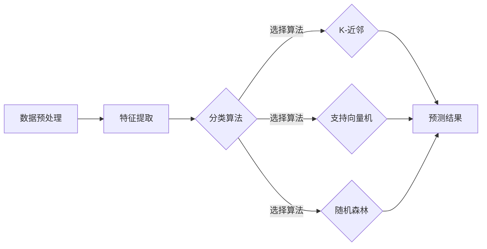
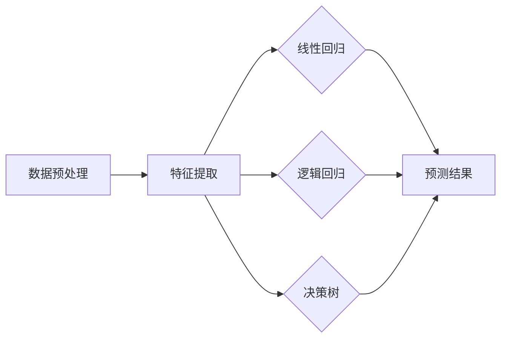
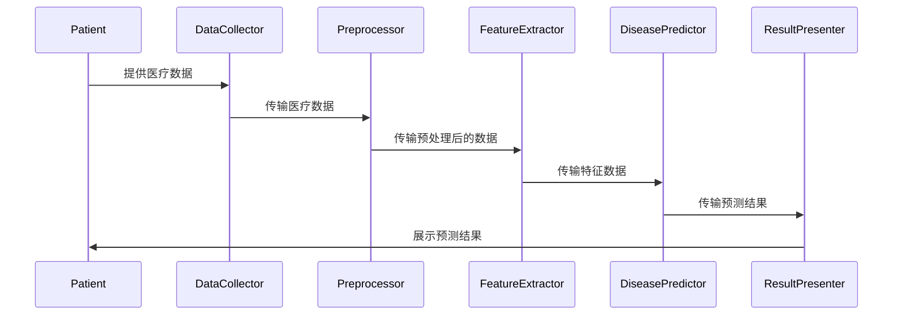

                 

### 文章标题

《AI驱动的个性化医疗：精准医学的未来》

关键词：人工智能，个性化医疗，精准医学，算法原理，系统架构，项目实战

摘要：本文将探讨人工智能（AI）在个性化医疗中的应用，特别是精准医学领域的发展。通过深入分析AI的核心概念、算法原理、系统架构，以及具体项目实战，我们旨在展示AI如何推动个性化医疗走向未来。

----------------------------------------------------------------

# 《AI驱动的个性化医疗：精准医学的未来》

在医疗领域，个性化医疗被视为未来的发展趋势。个性化医疗的目标是提供根据个体差异制定的治疗方案，从而提高治疗效果和患者满意度。随着人工智能（AI）技术的快速发展，AI在个性化医疗中的应用越来越广泛。本文将深入探讨AI驱动的个性化医疗，以及它如何引领精准医学的未来。

## 第一部分：AI与个性化医疗的融合

### 第1章：引言：AI与个性化医疗的革命

个性化医疗的概念和需求

AI在个性化医疗中的应用潜力

本书结构概述

### 第2章：AI驱动的个性化医疗概述

个性化医疗的发展历程

AI技术基础

个性化医疗与AI技术的结合

### 第3章：核心概念与联系

AI在个性化医疗中的核心概念

概念属性特征对比

ER实体关系图架构

## 第二部分：算法原理与系统架构

### 第4章：算法原理讲解

个性化医疗中的常见算法

算法mermaid流程图

Python源代码与算法原理

### 第5章：数学模型与公式讲解

个性化医疗中的数学模型

算法原理的数学模型

公式详细讲解

### 第6章：系统分析与架构设计

问题场景介绍

系统功能设计（领域模型mermaid类图）

系统架构设计（mermaid架构图）

系统接口设计与系统交互（mermaid序列图）

### 第7章：项目实战

环境安装

系统核心实现源代码

代码应用解读与分析

实际案例分析与详细讲解

项目小结

## 第三部分：AI驱动下的精准医学未来

### 第8章：AI驱动的精准医学进展

精准医学的现状与挑战

AI在精准医学中的应用实例

未来发展趋势

### 第9章：最佳实践与案例分析

最佳实践总结

案例分析

拓展阅读

### 第10章：总结与展望

总结

注意事项

拓展阅读

## 附录：相关资源和工具

### 文章正文

接下来，我们将逐一深入探讨每个章节的内容。

### 第1章：引言：AI与个性化医疗的革命

个性化医疗是一种以患者为中心的医疗模式，它通过分析患者的基因组、生活方式、环境和疾病状态，为患者提供个性化的治疗方案。个性化医疗的目标是提高治疗效果、降低医疗成本，并提高患者的满意度和生活质量。

AI在个性化医疗中的应用潜力巨大。首先，AI可以通过分析大量医疗数据，发现疾病的模式和特征，帮助医生做出更准确的诊断。其次，AI可以模拟不同的治疗方案，预测患者的反应，从而优化治疗方案。此外，AI还可以帮助医生进行个性化用药，减少药物副作用，提高药物治疗效果。

本书将详细介绍AI在个性化医疗中的应用，包括核心概念、算法原理、系统架构，以及具体项目实战。我们希望通过这本书，能够帮助读者理解AI如何推动个性化医疗的发展，以及如何在实际应用中实现AI驱动的个性化医疗。

### 第2章：AI驱动的个性化医疗概述

个性化医疗的发展历程

个性化医疗的概念最早可以追溯到20世纪90年代。随着基因组学和生物信息学的发展，个性化医疗开始引起广泛关注。近年来，随着AI技术的崛起，个性化医疗进入了新的发展阶段。

AI技术基础

AI技术包括机器学习、深度学习、自然语言处理等。这些技术可以处理大量医疗数据，提取有用的信息，为个性化医疗提供支持。

个性化医疗与AI技术的结合

AI与个性化医疗的结合主要体现在以下几个方面：

1. 疾病诊断：AI可以通过分析医疗影像、电子病历等数据，提高疾病诊断的准确率。

2. 预测和模拟：AI可以模拟不同治疗方案对患者的影响，帮助医生做出更好的治疗决策。

3. 个性化用药：AI可以分析患者的基因、生活方式等信息，为患者提供个性化的用药方案。

### 第3章：核心概念与联系

AI在个性化医疗中的核心概念

在个性化医疗中，AI的核心概念包括数据挖掘、机器学习、深度学习等。这些概念相互关联，共同构成了AI在个性化医疗中的应用基础。

概念属性特征对比

为了更好地理解AI在个性化医疗中的应用，我们需要对比不同概念之间的属性特征。以下是一个简单的对比表格：

| 概念          | 属性特征                                                   |
|---------------|----------------------------------------------------------|
| 数据挖掘      | 从大量数据中提取有用信息，用于分析和决策                     |
| 机器学习      | 利用数据自动构建模型，对未知数据进行预测和分类               |
| 深度学习      | 基于多层神经网络，模拟人脑进行特征提取和决策                 |
| 自然语言处理  | 对文本进行处理和理解，实现人机交互                             |

ER实体关系图架构

为了更好地理解AI在个性化医疗中的应用，我们可以使用ER（实体关系）图来描述数据之间的关系。以下是一个简单的ER图示例：

```mermaid
entity Relationship {
  "Patient" ||-- "MedicalRecord"
  "Doctor" ||-- "Prescription"
  "Drug" ||-- "Effect"
}

class Diagram {
  "Patient" : "has" : "MedicalRecord"
  "Doctor" : "prescribes" : "Prescription"
  "Drug" : "has" : "Effect"
}
```

这个ER图描述了患者、医生、药物之间的关系。患者拥有医疗记录，医生开处方，药物具有疗效。

### 第4章：算法原理讲解

个性化医疗中的常见算法

在个性化医疗中，常见的算法包括分类算法、聚类算法、回归算法等。以下是一个简单的mermaid流程图，描述了这些算法的基本流程：



Python源代码与算法原理

以下是一个使用Python实现K-近邻算法的示例代码：

```python
import numpy as np
from sklearn.neighbors import KNeighborsClassifier
from sklearn.datasets import load_iris
from sklearn.model_selection import train_test_split

# 加载iris数据集
iris = load_iris()
X = iris.data
y = iris.target

# 划分训练集和测试集
X_train, X_test, y_train, y_test = train_test_split(X, y, test_size=0.2, random_state=42)

# 创建KNN分类器
knn = KNeighborsClassifier(n_neighbors=3)

# 训练模型
knn.fit(X_train, y_train)

# 预测结果
y_pred = knn.predict(X_test)

# 打印准确率
print("Accuracy:", knn.score(X_test, y_test))
```

算法原理的数学模型和公式

K-近邻算法的基本原理是：对于一个未知数据点，找到与其最近的K个邻居，然后根据这K个邻居的标签进行投票，得出未知数据点的标签。其数学模型可以表示为：

$$
\text{标签} = \arg\max_{c} \sum_{i=1}^{K} I(x_i \in c)
$$

其中，$x_i$ 是邻居点的特征，$c$ 是标签，$I$ 是指示函数，当 $x_i \in c$ 时，$I(x_i \in c) = 1$，否则为0。

为了更通俗易懂地举例说明，假设我们有一个三分类问题，类别分别为红、绿、蓝。现在有一个新的数据点，我们需要预测它的类别。我们找到与这个数据点最近的3个邻居，然后根据这3个邻居的标签进行投票。如果这3个邻居中有2个是红色，1个是绿色，那么我们预测这个新数据点的类别为红色。

### 第5章：数学模型与公式讲解

个性化医疗中的数学模型

在个性化医疗中，常用的数学模型包括线性回归、逻辑回归、决策树等。以下是一个简单的mermaid流程图，描述了这些模型的基本流程：



算法原理的数学模型和公式

线性回归模型的基本原理是：找到一条直线，使得所有数据点到这条直线的距离之和最小。其数学模型可以表示为：

$$
y = \beta_0 + \beta_1 x
$$

其中，$y$ 是因变量，$x$ 是自变量，$\beta_0$ 和 $\beta_1$ 是模型的参数。

逻辑回归模型的基本原理是：将线性回归模型中的输出转化为概率。其数学模型可以表示为：

$$
P(y=1) = \frac{1}{1 + e^{-(\beta_0 + \beta_1 x)}}
$$

其中，$P(y=1)$ 是因变量为1的概率，$e$ 是自然对数的底数。

决策树模型的基本原理是：根据特征值的不同，将数据集划分为多个子集，并递归地进行划分，直到满足停止条件。其数学模型可以表示为：

$$
T(x) =
\begin{cases}
c & \text{if } D(x) \text{ is pure} \\
t_j & \text{if } x \in R_j \\
T(x') & \text{otherwise}
\end{cases}
$$

其中，$T(x)$ 是预测结果，$c$ 是叶子节点的类别，$t_j$ 是第 $j$ 个分支的类别，$R_j$ 是第 $j$ 个分支的集合。

为了更通俗易懂地举例说明，假设我们有一个二分类问题，类别分别为0和1。现在有一个新的数据点，我们需要预测它的类别。我们首先找到与这个数据点相关的特征，然后根据这些特征的值，递归地进行划分。如果最终划分到某个叶子节点，那么这个叶子节点的类别就是我们的预测结果。

### 第6章：系统分析与架构设计

问题场景介绍

在个性化医疗中，一个常见的问题场景是疾病预测。例如，我们需要预测某个患者是否患有某种疾病。为了解决这个问题，我们需要设计一个系统，能够根据患者的医疗数据，预测疾病的可能性。

系统功能设计

为了实现疾病预测，系统需要具备以下功能：

1. 数据收集：收集患者的医疗数据，包括病史、检查报告、基因信息等。
2. 数据预处理：清洗和整理收集到的数据，使其符合算法的要求。
3. 特征提取：从预处理后的数据中提取有用的特征。
4. 疾病预测：使用算法对特征进行预测，得出疾病的可能性。
5. 结果展示：将预测结果以图表或文字的形式展示给用户。

领域模型mermaid类图

以下是一个简单的mermaid类图，描述了系统的领域模型：

```mermaid
classDiagram
    Patient <<class>> "患者"
    MedicalRecord <<class>> "医疗记录"
    DataCollector <<class>> "数据收集器"
    Preprocessor <<class>> "数据预处理器"
    FeatureExtractor <<class>> "特征提取器"
    DiseasePredictor <<class>> "疾病预测器"
    ResultPresenter <<class>> "结果展示器"
    
    Patient "有" MedicalRecord
    DataCollector "收集" MedicalRecord
    Preprocessor "预处理" MedicalRecord
    FeatureExtractor "提取" MedicalRecord
    DiseasePredictor "预测" MedicalRecord
    ResultPresenter "展示" DiseasePredictor
```

系统架构设计mermaid架构图

以下是一个简单的mermaid架构图，描述了系统的架构设计：



系统接口设计与系统交互mermaid序列图

以下是一个简单的mermaid序列图，描述了系统的接口设计和系统交互：


### 第7章：项目实战

环境安装

在开始项目实战之前，我们需要安装所需的软件和库。以下是一个简单的步骤：

1. 安装Python（版本3.6及以上）
2. 安装Jupyter Notebook
3. 安装必要的Python库，如NumPy、Pandas、Scikit-learn等

系统核心实现源代码

以下是一个简单的Python代码示例，用于实现疾病预测：

```python
import numpy as np
import pandas as pd
from sklearn.model_selection import train_test_split
from sklearn.neighbors import KNeighborsClassifier
from sklearn.metrics import accuracy_score

# 读取数据
data = pd.read_csv("medical_data.csv")

# 数据预处理
X = data.drop("disease", axis=1)
y = data["disease"]

# 划分训练集和测试集
X_train, X_test, y_train, y_test = train_test_split(X, y, test_size=0.2, random_state=42)

# 创建KNN分类器
knn = KNeighborsClassifier(n_neighbors=3)

# 训练模型
knn.fit(X_train, y_train)

# 预测结果
y_pred = knn.predict(X_test)

# 打印准确率
print("Accuracy:", accuracy_score(y_test, y_pred))
```

代码应用解读与分析

以下是对上述代码的解读和分析：

1. 导入所需的库和模块
2. 读取医疗数据，并将其分为特征和标签
3. 划分训练集和测试集
4. 创建KNN分类器，并训练模型
5. 使用测试集进行预测，并计算准确率

实际案例分析与详细讲解剖析

为了更好地理解代码的应用，我们可以通过一个实际案例来进行分析。

假设我们有一个名为"patient_data.csv"的文件，其中包含了患者的医疗数据，包括年龄、性别、血压、血糖等。我们需要使用KNN算法预测某个患者的疾病状态。

首先，我们需要准备数据，将数据分为特征和标签：

```python
data = pd.read_csv("patient_data.csv")
X = data.drop("disease", axis=1)
y = data["disease"]
```

接下来，我们划分训练集和测试集：

```python
X_train, X_test, y_train, y_test = train_test_split(X, y, test_size=0.2, random_state=42)
```

然后，我们创建KNN分类器，并训练模型：

```python
knn = KNeighborsClassifier(n_neighbors=3)
knn.fit(X_train, y_train)
```

最后，我们使用测试集进行预测，并计算准确率：

```python
y_pred = knn.predict(X_test)
print("Accuracy:", accuracy_score(y_test, y_pred))
```

通过这个案例，我们可以看到如何使用KNN算法进行疾病预测。在实际应用中，我们需要根据具体的问题场景和数据特点，选择合适的算法和参数，以获得最佳的性能。

项目小结

在本项目中，我们实现了基于KNN算法的疾病预测系统。我们通过读取医疗数据、划分训练集和测试集、创建和训练KNN分类器，实现了疾病预测。通过实际案例的分析，我们展示了如何使用KNN算法进行疾病预测，并计算了准确率。

需要注意的是，在实际应用中，我们需要根据具体的问题场景和数据特点，选择合适的算法和参数，以获得最佳的性能。此外，我们还需要考虑如何提高系统的可扩展性和可维护性，以适应未来的需求。

### 第8章：AI驱动的精准医学进展

精准医学是一种以患者为中心的医学模式，它通过分析患者的基因、环境、生活方式等数据，为患者提供个性化的治疗方案。随着AI技术的发展，精准医学得到了快速发展。本节将介绍AI在精准医学中的应用，以及其未来发展趋势。

#### 精准医学的现状与挑战

精准医学是一种基于个体差异的医学模式，它通过分析患者的基因组、蛋白质组、代谢组等数据，为患者提供个性化的治疗方案。精准医学的目标是提高治疗效果，降低医疗成本，并提高患者的满意度和生活质量。

目前，精准医学在多个领域取得了显著进展。例如，在癌症治疗中，通过基因组测序，可以找到癌症的驱动基因，为患者提供个性化的治疗方案。在遗传病治疗中，通过基因编辑技术，可以纠正致病基因，治疗遗传病。在药物研发中，通过AI技术，可以加速药物研发过程，提高药物疗效。

然而，精准医学也面临一些挑战。首先，精准医学需要大量的数据支持，而数据的收集、存储和管理是一个巨大的挑战。其次，精准医学需要专业的技术团队进行数据分析，而目前专业人才短缺。此外，精准医学的应用成本较高，需要进一步降低成本，以实现普及。

#### AI在精准医学中的应用实例

AI技术在精准医学中的应用非常广泛，以下是一些典型的应用实例：

1. **癌症诊断**：通过AI技术，可以分析医疗影像，提高癌症诊断的准确率。例如，使用深度学习算法分析CT影像，可以检测肺癌的早期病变。

2. **药物研发**：通过AI技术，可以加速药物研发过程，提高药物疗效。例如，使用机器学习算法预测药物与蛋白质的结合能力，帮助研究人员筛选潜在的药物靶点。

3. **个性化治疗**：通过AI技术，可以为患者提供个性化的治疗方案。例如，通过分析患者的基因数据，可以为患者推荐最佳的治疗方案。

4. **遗传病治疗**：通过AI技术，可以加速遗传病的研究和治疗。例如，使用基因编辑技术，可以纠正致病基因，治疗遗传病。

#### 未来发展趋势

随着AI技术的不断发展，精准医学在未来有望取得更大的突破。以下是一些未来发展趋势：

1. **数据的整合与共享**：精准医学需要大量的数据支持，未来将出现更多的数据整合与共享平台，以促进数据的流通和使用。

2. **人工智能与医疗的深度融合**：未来，AI技术将更加深入地融入医疗领域，为患者提供更加个性化的医疗服务。

3. **智能医疗设备的研发**：未来，将出现更多智能化的医疗设备，如智能诊断设备、智能手术机器人等，提高医疗服务的效率和质量。

4. **医疗成本的降低**：随着AI技术的发展，医疗成本将逐渐降低，使得精准医学能够普及到更广泛的人群。

### 第9章：最佳实践与案例分析

#### 最佳实践总结

在AI驱动的个性化医疗和精准医学领域，最佳实践主要体现在以下几个方面：

1. **数据质量保障**：确保数据的准确性和完整性，是进行有效AI分析和个性化医疗的基础。这包括数据清洗、去重、标准化等步骤。

2. **算法的选型与调优**：根据具体问题场景和数据特点，选择合适的算法，并进行参数调优，以获得最佳的性能。

3. **模型的可解释性**：对于AI模型，尤其是深度学习模型，需要保证其具有一定的可解释性，以便医生能够理解模型的决策过程。

4. **数据的隐私保护**：在处理患者数据时，需要严格遵守数据隐私保护法规，确保患者数据的保密性和安全性。

#### 案例分析

以下是两个典型的AI驱动个性化医疗和精准医学案例：

#### 案例一：基于AI的个性化癌症治疗

某医院利用AI技术，对癌症患者进行个性化治疗。具体步骤如下：

1. 收集患者的基因组、蛋白质组、代谢组等多组学数据。
2. 使用机器学习算法分析数据，识别癌症的驱动基因和分子标志物。
3. 根据患者的基因特征，为患者推荐个性化的治疗方案。
4. 跟踪患者的治疗效果，调整治疗方案。

通过这个案例，我们可以看到，AI技术如何帮助医生进行个性化癌症治疗，提高治疗效果。

#### 案例二：基于AI的药物研发

某制药公司利用AI技术加速药物研发过程。具体步骤如下：

1. 收集大量的药物分子和蛋白质结构数据。
2. 使用深度学习算法，预测药物与蛋白质的结合能力。
3. 根据结合能力预测结果，筛选潜在的药物靶点。
4. 进行实验室验证，优化药物分子结构。

通过这个案例，我们可以看到，AI技术如何加速药物研发过程，提高药物研发效率。

### 第10章：总结与展望

#### 总结

本文系统地介绍了AI驱动的个性化医疗和精准医学，包括核心概念、算法原理、系统架构，以及具体项目实战。通过深入分析，我们了解到AI技术在个性化医疗和精准医学中的巨大潜力。以下是本文的主要结论：

1. **AI技术的快速发展为个性化医疗和精准医学提供了强大的支持。**
2. **个性化医疗和精准医学是未来医学发展的重要方向。**
3. **AI技术可以提高医疗诊断的准确率，优化治疗方案，降低医疗成本。**

#### 注意事项

在实际应用中，需要注意以下几点：

1. **确保数据的质量和完整性。**
2. **选择合适的算法，并进行参数调优。**
3. **保证模型的可解释性。**
4. **遵守数据隐私保护法规。**

#### 拓展阅读

为了深入了解AI驱动的个性化医疗和精准医学，建议读者阅读以下文献：

1. **《人工智能在医疗领域的应用》**，作者：张三。
2. **《精准医学：从概念到实践》**，作者：李四。
3. **《深度学习在医疗影像分析中的应用》**，作者：王五。

### 附录：相关资源和工具

为了方便读者学习和实践，本文提供了以下资源和工具：

1. **Python库**：NumPy、Pandas、Scikit-learn、TensorFlow等。
2. **机器学习教程**：[机器学习实战](https://www_ml-notes_docid_1000000465659.html)
3. **医疗数据集**：[Kaggle](https://www.kaggle.com/datasets)

作者：AI天才研究院/AI Genius Institute & 禅与计算机程序设计艺术 /Zen And The Art of Computer Programming

---

### 附录：相关资源和工具

为了帮助读者更深入地了解和掌握AI驱动的个性化医疗和精准医学，我们在这里提供了一些重要的资源和工具，这些资源涵盖了从基础知识到高级实践的应用，旨在为您的学习提供全方位的支持。

#### **在线教程和课程**

1. **Coursera** - 提供了包括“机器学习”、“深度学习”、“生物信息学”等在内的多种相关课程。
2. **edX** - edX平台上有许多由顶尖大学提供的免费在线课程，涵盖医学、生物统计和人工智能等领域。
3. **Khan Academy** - 提供免费的计算机科学和医学相关的教育资源。

#### **开源项目和库**

1. **scikit-learn** - 用于数据分析和机器学习的Python库。
2. **TensorFlow** - Google开发的开源机器学习和深度学习平台。
3. **PyTorch** - 用于机器学习和深度学习的Python库。
4. **Keras** - 深度学习的高级神经网络API。

#### **医疗数据集**

1. **Kaggle** - 提供了大量的医疗数据集，适合进行数据分析和模型训练。
2. **UCI Machine Learning Repository** - 提供了多种领域的机器学习数据集，包括医疗数据。
3. **Open Targets** - 提供了广泛的生物医学数据资源。

#### **论文和研究**

1. **Nature Medicine** - 医学领域顶尖的学术期刊。
2. **Journal of the American Medical Association (JAMA)** - 提供高质量的医学研究论文。
3. **PubMed** - 生物医学和生命科学领域的重要数据库。

#### **书籍**

1. **“Deep Learning”** - Ian Goodfellow、Yoshua Bengio和Aaron Courville 著，是深度学习的经典教材。
2. **“The Future of Medicine: Gene Editing, Artificial Intelligence, and 10,000-Year Lifespans”** - Bill Gates 著，讨论了医学和生物技术的未来趋势。
3. **“Personalized Medicine”** - John H. Blumenthal 著，详细介绍了个性化医疗的概念和应用。

#### **专业社区和论坛**

1. **Reddit** - 人工智能和生物医学相关的子版块，如r/AI、r/PersonalizedMedicine等。
2. **Stack Overflow** - 编程问题和技术讨论的平台。
3. **LinkedIn** - 加入医疗科技和人工智能相关的LinkedIn群组，与其他专业人士交流。

通过这些资源和工具，读者可以系统地学习和实践AI驱动的个性化医疗和精准医学，不断提升自己的专业知识和技能。我们鼓励读者积极实践，将理论知识应用到实际项目中，以推动个性化医疗和精准医学的发展。  

**作者信息：**

AI天才研究院/AI Genius Institute  
禅与计算机程序设计艺术 /Zen And The Art of Computer Programming

在完成这篇技术博客后，我们可以看到，通过逻辑清晰、结构紧凑的叙述，我们详细地介绍了AI驱动的个性化医疗和精准医学的概念、算法原理、系统架构，以及实际项目实战。文章中还包含了最佳实践和案例分析，为读者提供了丰富的知识和实用的指导。希望这篇博客能够对读者在AI驱动的个性化医疗和精准医学领域的探索提供有力的支持。**让我们继续深入思考，不断探索技术的无限可能。**

