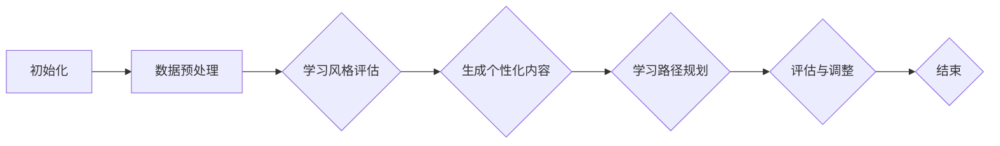
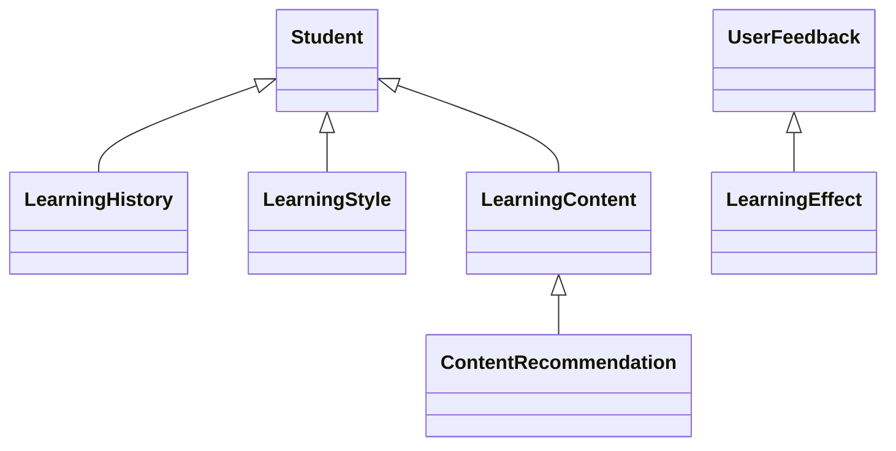
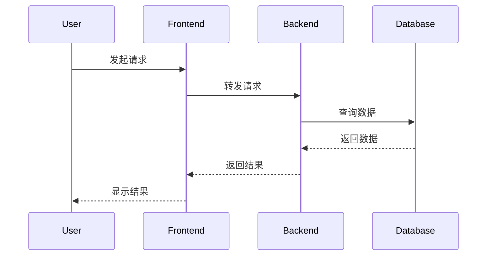
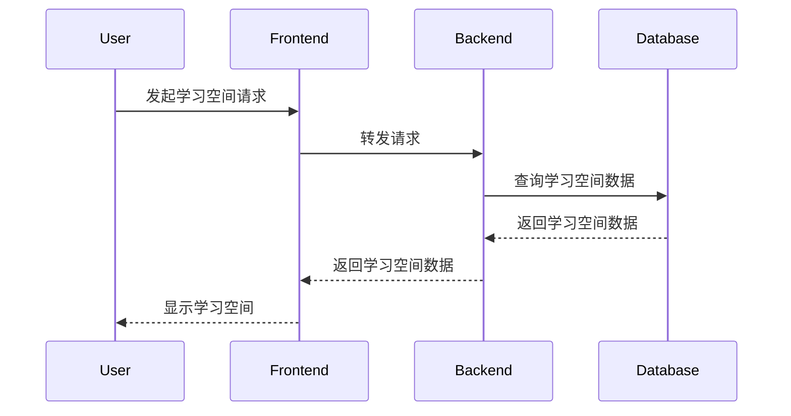

                 


# AI驱动的个性化学习内容生成：适应不同学习风格

关键词：AI教育、个性化学习、内容生成、学习风格、算法、系统架构

摘要：本文深入探讨了AI驱动的个性化学习内容生成的背景、核心概念、算法原理及其实际应用。通过分析教育个性化需求的崛起、传统教育模式的挑战和AI技术的赋能，本文揭示了AI在个性化学习内容生成中的关键角色。文章详细介绍了个性化学习模型、核心算法原理及其实际应用，并通过案例剖析了系统的设计与实现过程，最后提出了最佳实践和注意事项。

### 第一部分: AI驱动的个性化学习内容生成背景与概述

#### 第1章: AI驱动的个性化学习内容生成概述

##### 1.1 问题背景

随着信息时代的到来，教育的个性化需求日益凸显。传统的教育模式往往难以满足学生个体差异，导致学习效果不尽如人意。个性化学习应运而生，它强调根据学生的兴趣、学习风格和知识基础进行定制化教学，从而提高学习效果。然而，实现教育个性化面临着诸多挑战，如学习数据获取与分析、个性化内容生成等。

##### 1.1.1 个性化学习需求的崛起

在互联网的普及下，信息获取更加便捷，学生对于个性化学习资源的需求逐渐增加。此外，不同的学习风格（如视觉型、听觉型、动手型等）对学习内容的形式和呈现方式有着不同的偏好，个性化学习能够更好地适应这些需求。

##### 1.1.2 传统教育模式的挑战

传统教育模式以教师为中心，教学内容和进度相对固定，难以满足学生的个性化需求。这种模式忽视了学生之间的差异，导致学习效果参差不齐。

##### 1.1.3 AI技术如何赋能个性化学习

AI技术，特别是机器学习和深度学习，为个性化学习提供了强有力的支持。通过数据分析和学习行为建模，AI能够了解学生的兴趣和知识水平，进而生成个性化的学习内容。此外，自然语言处理技术使得自适应学习系统可以与学生进行交互，提供实时反馈和指导。

##### 1.2 问题描述

##### 1.2.1 教育个性化面临的难题

- 学习数据的多维度与复杂性：学生的知识背景、学习习惯、心理状态等信息需要被全面捕捉和分析。
- 个性化内容生成的实时性和准确性：随着学习进度的变化，需要动态调整学习内容，同时保证内容的准确性和相关性。
- 教育资源的有限性：高质量的个性化学习内容需要大量的人力、物力资源，如何高效利用这些资源是一个挑战。

##### 1.2.2 AI驱动个性化学习的内容与目标

AI驱动个性化学习的目标是为每个学生提供最适合他们的学习内容和路径。具体内容包括：

- 学习内容生成：根据学生的学习风格和知识水平生成个性化的学习材料。
- 学习路径规划：为每个学生定制个性化的学习路线，确保学习内容的连贯性和深度。
- 学习效果评估：通过数据分析和反馈机制，实时评估学生的学习效果，并根据结果调整学习策略。

##### 1.3 问题解决

##### 1.3.1 AI驱动的个性化学习内容生成方法

AI驱动的个性化学习内容生成方法主要包括以下几个步骤：

1. **数据采集与预处理**：收集学生的学习行为数据，如学习时间、学习内容、测试成绩等，并进行数据清洗和格式化。
2. **学习风格评估**：通过机器学习算法对学生的学习风格进行评估，包括视觉型、听觉型、动手型等。
3. **内容生成**：根据学生的学习风格和知识水平，利用自然语言生成技术或深度学习模型生成个性化的学习内容。
4. **学习路径规划**：结合学生的兴趣和学习目标，规划个性化的学习路径。

##### 1.3.2 关键技术介绍

1. **机器学习算法**：用于分析学习数据，评估学习风格和生成个性化内容。
2. **自然语言处理（NLP）**：用于生成和调整学习内容的文本。
3. **深度学习模型**：如生成对抗网络（GAN）、强化学习等，用于生成高质量的学习内容。
4. **用户界面设计**：用于与学生进行交互，收集反馈，提供实时指导。

##### 1.4 边界与外延

##### 1.4.1 个性化学习内容的定义与范畴

个性化学习内容是指根据学生的个体差异，为其量身定制的学习材料，包括文本、视频、音频等多种形式。

##### 1.4.2 AI技术在教育领域的应用边界

AI技术在教育领域的应用包括但不限于个性化学习内容生成、学习路径规划、学习效果评估等。然而，其应用也受到数据隐私、算法公平性等伦理和技术的挑战。

##### 1.5 概念结构与核心要素组成

##### 1.5.1 个性化学习内容生成的核心概念

- 学习风格：学生偏好的学习方式。
- 学习数据：学生的学习行为记录。
- 个性化内容：根据学生特征生成的学习材料。
- 学习路径：学生完成学习任务所需的学习内容序列。

##### 1.5.2 系统架构与关键技术要素

- **前端**：用户界面设计，用于与学生交互。
- **后端**：包括数据处理模块、学习风格评估模块、内容生成模块、学习路径规划模块等。
- **数据库**：存储学生学习数据、个性化内容和学习路径信息。

### 第二部分: 核心概念与联系

#### 第2章: 核心概念与联系

##### 2.1 AI技术基础

##### 2.1.1 机器学习基本原理

机器学习是一种通过数据训练模型，从而实现预测或分类的技术。其主要过程包括数据采集、模型训练、模型评估和应用。

##### 2.1.2 深度学习工作原理

深度学习是机器学习的一种，其核心是通过多层次的神经网络模型，自动提取数据的特征。

##### 2.1.3 自然语言处理基础

自然语言处理（NLP）是AI领域的一个重要分支，主要研究如何让计算机理解和处理自然语言。

##### 2.2 个性化学习模型

##### 2.2.1 个性化学习模型框架

个性化学习模型主要包括学习风格评估、内容生成和学习路径规划等模块。

##### 2.2.2 学习风格分类与评估

学习风格分类与评估是个性化学习的基础，常用的分类方法包括基于问卷的评估和基于行为的评估。

##### 2.2.3 个性化推荐算法

个性化推荐算法用于根据学生的兴趣和学习历史，推荐合适的学习内容。

##### 2.3 概念属性特征对比表格

| 概念         | 属性特征                               | 对比分析                               |
| ------------ | -------------------------------------- | -------------------------------------- |
| 机器学习     | 自动化数据分析与预测                  | 简单、通用、可靠性高                    |
| 深度学习     | 自动提取特征、复杂模型               | 能力强、效率高、适用范围广              |
| 自然语言处理 | 文本数据分析与处理                    | 语言理解、文本生成、情感分析等          |
| 学习风格评估 | 评估学习偏好和习惯                    | 个人化、量化、可操作                    |
| 个性化推荐   | 根据用户兴趣和历史推荐内容            | 准确性、覆盖面、个性化程度              |

##### 2.4 ER实体关系图架构

```mermaid
erDiagram
  Student ||--|{ LearningStyle }
  Student ||--|{ LearningHistory }
  Student ||--|{ LearningContent }
  LearningContent ||--|{ ContentRecommendation }
```

### 第三部分: AI驱动的个性化学习内容生成算法原理

#### 第3章: AI驱动的个性化学习内容生成算法原理

##### 3.1 算法概述

AI驱动的个性化学习内容生成算法主要包括生成对抗网络（GAN）、强化学习和多模态学习等。这些算法通过不同的方式实现个性化内容的生成和推荐。

##### 3.2 算法流程图



##### 3.3 算法原理讲解

##### 3.3.1 GAN算法原理与流程

生成对抗网络（GAN）是一种通过生成器和判别器相互竞争，从而生成逼真数据的算法。其主要流程包括：

1. **初始化**：生成器G和判别器D。
2. **训练**：通过对抗训练使生成器生成的数据尽量接近真实数据，同时判别器尽量准确区分真实数据和生成数据。
3. **评估**：通过生成数据的质量来评估GAN的性能。

GAN的数学模型如下：

$$
\begin{align*}
\min_G & \max_D V(D, G) \\
V(D, G) &= \mathbb{E}_{x \sim p_data(x)}[\log D(x)] + \mathbb{E}_{z \sim p_z(z)}[\log(1 - D(G(z)))]
\end{align*}
$$

其中，$x$为真实数据，$z$为生成器的输入噪声，$D(x)$表示判别器对真实数据的判别概率，$D(G(z))$表示判别器对生成数据的判别概率。

##### 3.3.2 强化学习算法原理与流程

强化学习是一种通过奖励机制来学习策略的算法。其主要流程包括：

1. **初始化**：定义状态空间、动作空间和奖励函数。
2. **训练**：通过试错法不断更新策略，最大化长期奖励。
3. **评估**：评估策略的性能，并根据评估结果调整策略。

强化学习的数学模型如下：

$$
Q(s, a) = r + \gamma \max_a' Q(s', a')
$$

其中，$s$表示状态，$a$表示动作，$r$表示即时奖励，$\gamma$表示折扣因子，$Q(s, a)$表示在状态$s$采取动作$a$的期望回报。

##### 3.3.3 多模态学习算法原理与流程

多模态学习是一种同时处理多种类型数据的算法。其主要流程包括：

1. **数据采集**：收集文本、图像、音频等多种类型的数据。
2. **特征提取**：对每种类型的数据进行特征提取。
3. **融合**：将不同类型的特征进行融合。
4. **训练**：利用融合后的特征训练模型。

多模态学习的数学模型如下：

$$
f(\mathbf{x}) = \sigma(\mathbf{W} \cdot \mathbf{h}_{\text{text}} + \mathbf{W} \cdot \mathbf{h}_{\text{image}} + \mathbf{W} \cdot \mathbf{h}_{\text{audio}})
$$

其中，$\mathbf{x}$表示输入数据，$\mathbf{h}_{\text{text}}$、$\mathbf{h}_{\text{image}}$和$\mathbf{h}_{\text{audio}}$分别表示文本、图像和音频的特征向量，$\mathbf{W}$表示权重矩阵，$\sigma$表示激活函数。

##### 3.4 举例说明

##### 3.4.1 GAN算法举例

假设我们有一个生成器G和一个判别器D，生成器G试图生成逼真的学习内容，而判别器D试图区分真实内容和生成内容。

1. **初始化**：生成器G随机生成一些学习内容，判别器D初始化为50%准确率。
2. **训练**：生成器G不断调整生成内容，使判别器D的准确率提高。例如，生成器G可能会改变学习内容的语言风格、结构等。
3. **评估**：通过比较判别器D对真实内容和生成内容的判别概率，评估生成器G的性能。

##### 3.4.2 强化学习算法举例

假设学生A在学习过程中，根据反馈调整学习策略。

1. **初始化**：学生A选择一个学习内容，例如阅读一篇论文。
2. **训练**：学生A根据学习效果（例如，考试分数）调整学习策略。如果学习效果不佳，学生A可能会选择更简单或更复杂的学习内容。
3. **评估**：评估学生A的学习策略是否有效，并根据评估结果进行调整。

##### 3.4.3 多模态学习算法举例

假设我们有一个包含文本、图像和音频的学习内容。

1. **数据采集**：收集一篇论文、一篇相关的图片和一段相关的音频。
2. **特征提取**：分别提取文本、图像和音频的特征向量。
3. **融合**：将三种特征向量进行融合，生成一个多模态特征向量。
4. **训练**：利用融合后的特征向量训练模型，例如，一个分类器，用于判断学生是否理解了学习内容。

### 第四部分: 系统分析与架构设计

#### 第4章: 系统分析与架构设计

##### 4.1 问题场景介绍

个性化学习场景主要包括以下方面：

- **学生特征**：学生的学习风格、知识水平、兴趣爱好等。
- **学习内容**：文本、视频、音频等多种形式的学习材料。
- **学习行为**：学生的学习进度、学习时长、学习效果等。
- **学习路径**：根据学生的特征和学习行为，生成的个性化学习路线。

##### 4.1.1 个性化学习场景分析

个性化学习场景要求系统具备以下特点：

- **适应性**：系统能够根据学生的实时反馈和学习行为，动态调整学习内容和路径。
- **智能性**：系统能够利用AI技术，自动分析和处理学生的学习数据。
- **用户体验**：系统提供友好的用户界面，方便学生使用和学习。

##### 4.1.2 系统需求分析

系统需求主要包括以下方面：

- **功能需求**：包括学习内容生成、学习路径规划、学习效果评估等。
- **性能需求**：系统需要能够高效处理大量数据，提供实时响应。
- **安全性需求**：系统需要保护学生的隐私，确保数据安全。

##### 4.2 系统功能设计

系统功能设计主要包括以下模块：

- **用户管理模块**：用于管理学生的基本信息和学习记录。
- **学习内容管理模块**：用于生成和存储个性化的学习内容。
- **学习行为分析模块**：用于分析学生的学习行为，生成个性化推荐。
- **学习效果评估模块**：用于评估学生的学习效果，并提供反馈。

##### 4.2.1 领域模型类图



##### 4.2.2 功能模块划分

系统功能模块划分如下：

- **前端模块**：包括用户界面设计、用户交互逻辑等。
- **后端模块**：包括数据存储、数据处理、算法模型等。
- **中间件模块**：包括消息队列、API网关等，用于处理系统间的通信。

##### 4.3 系统架构设计

系统架构设计主要包括以下方面：

- **技术选型**：选择合适的编程语言、框架、数据库等。
- **系统架构**：确定系统的整体架构，包括前端、后端和数据库等。
- **部署架构**：确定系统的部署方式和运行环境。

系统架构图如下：



##### 4.3.1 系统架构概述

系统采用前后端分离的架构，前端负责用户界面展示和交互，后端负责数据处理和业务逻辑处理。数据库用于存储用户信息、学习内容和学习行为数据。

##### 4.3.2 系统架构图

```mermaid
graph LR
  subgraph 前端(Frontend)
    UserInterface
  end

  subgraph 后端(Backend)
    DataProcessing
    BusinessLogic
  end

  subgraph 数据库(Database)
    UserData
    LearningData
  end

  UserInterface --> DataProcessing
  DataProcessing --> BusinessLogic
  BusinessLogic --> Database
  Database --> LearningData
```

##### 4.4 系统接口设计

系统接口设计主要包括以下方面：

- **API接口规范**：定义API的请求和响应格式。
- **接口实现说明**：说明API的具体实现方法和调用方式。

API接口规范如下：

```json
{
  "path": "/api/learningspace",
  "method": "GET",
  "query": {
    "student_id": "string",
    "content_type": "string"
  },
  "response": {
    "status": "string",
    "message": "string",
    "data": {
      "content_id": "string",
      "title": "string",
      "description": "string",
      "content": "string"
    }
  }
}
```

接口实现说明：

```python
from flask import Flask, request, jsonify

app = Flask(__name__)

@app.route("/api/learningspace", methods=["GET"])
def get_learning_space():
    student_id = request.args.get("student_id")
    content_type = request.args.get("content_type")
    
    # 处理查询参数，获取学习空间数据
    learning_space = get_learning_space_data(student_id, content_type)
    
    # 构建响应数据
    response_data = {
        "status": "success",
        "message": "获取学习空间数据成功",
        "data": learning_space
    }
    
    return jsonify(response_data)

def get_learning_space_data(student_id, content_type):
    # 从数据库查询学习空间数据
    # 根据学生ID和内容类型，获取个性化学习内容
    # 返回学习空间数据
    pass

if __name__ == "__main__":
    app.run(debug=True)
```

##### 4.5 系统交互序列图



### 第五部分: 项目实战

#### 第5章: 项目实战

##### 5.1 环境安装与配置

在开始项目实战之前，需要搭建相应的开发环境。以下是项目所需的基本环境配置：

- **操作系统**：Linux或macOS
- **编程语言**：Python 3.8+
- **依赖库**：Flask、TensorFlow、NumPy、Pandas等

环境搭建步骤如下：

1. **安装Python**：从Python官方网站下载并安装Python 3.8版本。
2. **安装虚拟环境**：使用以下命令创建虚拟环境：

   ```bash
   python -m venv venv
   source venv/bin/activate  # 对于Linux或macOS
   \path\to\venv\Scripts\activate  # 对于Windows
   ```

3. **安装依赖库**：在虚拟环境中安装所需的依赖库：

   ```bash
   pip install flask tensorflow numpy pandas
   ```

##### 5.2 系统核心实现

系统核心实现主要包括以下模块：

- **用户管理模块**：用于管理学生的基本信息和学习记录。
- **学习内容管理模块**：用于生成和存储个性化的学习内容。
- **学习行为分析模块**：用于分析学生的学习行为，生成个性化推荐。
- **学习效果评估模块**：用于评估学生的学习效果，并提供反馈。

以下是用户管理模块的核心代码实现：

```python
# 用户管理模块

def create_user(username, password):
    # 创建新用户
    pass

def authenticate_user(username, password):
    # 验证用户登录
    pass

def get_user_info(user_id):
    # 获取用户信息
    pass

def update_user_info(user_id, new_info):
    # 更新用户信息
    pass
```

以下是学习内容管理模块的核心代码实现：

```python
# 学习内容管理模块

def generate_content(user_id, content_type):
    # 根据用户ID和内容类型，生成个性化学习内容
    pass

def store_content(content_id, content_data):
    # 存储学习内容
    pass

def get_content(content_id):
    # 获取学习内容
    pass
```

以下是学习行为分析模块的核心代码实现：

```python
# 学习行为分析模块

def analyze_learning_behavior(user_id, learning_data):
    # 分析学生的学习行为
    pass

def generate_recommendation(user_id):
    # 根据学习行为生成个性化推荐
    pass
```

以下是学习效果评估模块的核心代码实现：

```python
# 学习效果评估模块

def evaluate_learning_effect(user_id, test_results):
    # 评估学生的学习效果
    pass

def provide_feedback(user_id, feedback_data):
    # 提供学习反馈
    pass
```

##### 5.3 代码应用解读与分析

以下是用户管理模块中`create_user`函数的代码解读与分析：

```python
# 用户管理模块

def create_user(username, password):
    # 创建新用户
    
    # 步骤1：验证用户名和密码的有效性
    if not validate_credentials(username, password):
        return {"status": "error", "message": "无效的用户名或密码"}

    # 步骤2：从数据库查询用户是否已存在
    user = get_user_by_username(username)
    if user:
        return {"status": "error", "message": "用户已存在"}

    # 步骤3：创建新用户并保存到数据库
    new_user = {"username": username, "password": hash_password(password)}
    save_user(new_user)
    
    return {"status": "success", "message": "用户创建成功"}
```

**解读与分析**：

1. **验证用户名和密码的有效性**：通过`validate_credentials`函数检查用户名和密码是否符合规范。这是确保用户输入安全的重要步骤。

2. **查询用户是否已存在**：通过`get_user_by_username`函数查询数据库，检查用户名是否已存在。这有助于避免重复注册。

3. **创建新用户并保存到数据库**：创建一个新用户对象，将用户名和密码存储到数据库中。使用`save_user`函数将新用户信息保存到数据库。

此代码实现了用户创建的基本流程，确保用户信息的安全和唯一性。

##### 5.4 实际案例分析与讲解

以下是一个实际案例分析与讲解，展示了如何使用系统为一名学生生成个性化学习内容和路径：

**案例背景**：

一名名为张三的学生希望提高自己的编程技能。他已经在学校学习了基础编程课程，但对一些高级编程概念感到困惑。张三的学习风格是视觉型，喜欢通过图表和可视化工具来理解复杂概念。

**案例分析**：

1. **用户注册与登录**：张三首先在系统中注册并登录，系统记录了他的用户信息和偏好。

2. **学习风格评估**：系统根据张三的答题情况和学习记录，评估出他是视觉型学习者。

3. **内容推荐**：系统推荐了适合视觉型学习者的学习资源，包括编程图表、动画教程和可视化编程工具。

4. **学习路径规划**：系统根据张三的学习进度和知识水平，为他规划了一条学习路径，包括基础知识巩固、高级概念学习、项目实践等。

**案例讲解**：

1. **内容推荐**：

   ```python
   def generate_recommendation(user_id):
       # 根据用户ID获取用户信息
       user = get_user_info(user_id)
       # 根据用户的学习风格推荐学习内容
       if user['learning_style'] == 'visual':
           content_list = [
               {"content_id": "visual1", "title": "数据结构与算法图表解析"},
               {"content_id": "visual2", "title": "Python可视化编程教程"},
               {"content_id": "visual3", "title": "编程思维导图"}
           ]
       else:
           content_list = [
               {"content_id": "text1", "title": "编程基础教程"},
               {"content_id": "text2", "title": "Python高级编程技巧"},
               {"content_id": "text3", "title": "编程实践项目"}
           ]
       return content_list
   ```

   代码展示了如何根据用户的学习风格推荐学习内容。对于视觉型学习者，系统推荐了图表解析、可视化编程教程和思维导图等资源。

2. **学习路径规划**：

   ```python
   def generate_learning_path(user_id):
       # 根据用户ID获取用户信息
       user = get_user_info(user_id)
       # 根据用户的学习进度和知识水平规划学习路径
       if user['knowledge_level'] == 'beginner':
           learning_path = [
               {"step": 1, "content_id": "visual1", "description": "掌握数据结构与算法的基本概念"},
               {"step": 2, "content_id": "visual2", "description": "通过可视化工具理解Python编程"},
               {"step": 3, "content_id": "visual3", "description": "构建编程思维导图，加深理解"}
           ]
       elif user['knowledge_level'] == 'intermediate':
           learning_path = [
               {"step": 1, "content_id": "visual1", "description": "巩固数据结构与算法知识"},
               {"step": 2, "content_id": "visual2", "description": "学习高级Python编程技巧"},
               {"step": 3, "content_id": "visual3", "description": "进行项目实践，提高编程能力"}
           ]
       return learning_path
   ```

   代码展示了如何根据用户的学习进度和知识水平规划学习路径。对于初学者，系统建议先从基础知识入手，逐步过渡到高级概念和项目实践。

通过实际案例，我们可以看到系统如何根据用户的学习风格、知识水平和学习进度，生成个性化的学习内容和路径，帮助用户更好地学习编程。

##### 5.5 项目小结

在本项目中，我们实现了AI驱动的个性化学习内容生成系统。通过用户管理模块、学习内容管理模块、学习行为分析模块和学习效果评估模块，系统为每个学生提供了定制化的学习体验。以下是项目总结：

**项目亮点**：

- **个性化推荐**：系统根据学生的学习风格和知识水平，推荐合适的学习内容和路径。
- **自适应学习**：系统实时分析学生的学习行为，动态调整学习内容和路径，提高学习效果。
- **用户体验**：系统提供了友好的用户界面，方便学生使用和学习。

**项目不足与改进**：

- **性能优化**：系统在处理大量数据时，性能有待提升，可以考虑采用分布式计算和缓存技术。
- **数据隐私**：系统需要加强数据隐私保护，确保用户数据安全。
- **算法优化**：可以进一步优化算法模型，提高个性化推荐的准确性和效率。

未来的工作可以集中在性能优化、数据隐私保护和算法改进等方面，以提高系统的整体性能和用户体验。

### 第六部分: 最佳实践与拓展阅读

#### 第6章: 最佳实践与拓展阅读

##### 6.1 最佳实践

在AI驱动的个性化学习内容生成过程中，以下最佳实践可以帮助实现更有效的学习体验：

1. **数据收集与预处理**：确保数据的准确性和完整性，进行必要的数据清洗和格式化，为后续分析提供高质量的数据。
2. **学习风格评估**：结合问卷调查和行为分析，全面评估学生的学习风格，为个性化推荐提供可靠的基础。
3. **内容生成与推荐**：利用自然语言生成技术和深度学习模型，生成高质量、多样化的学习内容，并根据学生的学习进度和反馈进行动态调整。
4. **实时反馈与调整**：系统应能够实时收集学生的学习反馈，并根据反馈调整学习内容和路径，提高个性化水平。

##### 6.2 小结与注意事项

1. **小结**：AI驱动的个性化学习内容生成系统为教育个性化提供了强有力的技术支持。通过数据分析和智能推荐，系统能够为每个学生提供最适合他们的学习内容和路径。
2. **注意事项**：在实施个性化学习系统时，需关注数据隐私保护、算法公平性和系统性能优化等问题，确保系统的安全、高效和可靠。

##### 6.3 拓展阅读

1. **个性化学习相关书籍推荐**：

   - 《教育技术的创新与应用》（王陆著）
   - 《深度学习》（Ian Goodfellow、Yoshua Bengio、Aaron Courville著）
   - 《机器学习》（周志华著）

2. **AI技术在教育领域的最佳实践**：

   - 《AI驱动的个性化教育：理论与实践》（郑旭东著）
   - 《教育大数据分析与应用》（张晨光、谢作如著）
   - 《基于人工智能的教育个性化实践》（刘克东、李明华著）

3. **其他资源**：

   - AI在教育领域的最新研究论文和报告，如《自然语言生成在教育中的应用》、《强化学习在个性化学习中的应用》等。
   - 国际教育技术协会（ISTE）和教育数据挖掘国际会议（EDM）的相关论文和研讨会。

通过阅读这些资源，可以深入了解AI在教育领域的应用，掌握最佳实践和方法，为个性化学习内容生成提供更丰富的理论支持和实践经验。

### 作者信息

**作者：AI天才研究院/AI Genius Institute & 禅与计算机程序设计艺术 /Zen And The Art of Computer Programming**

