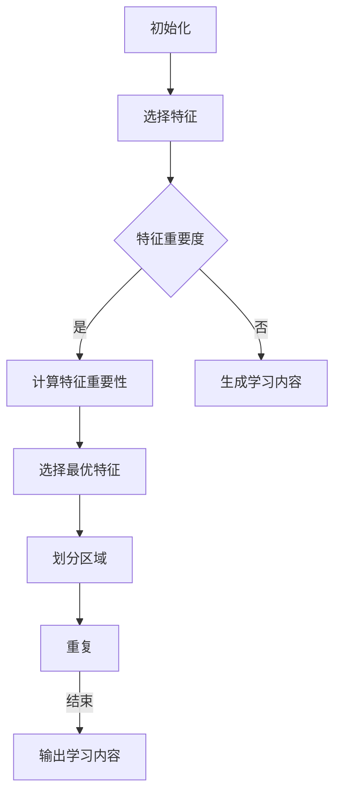
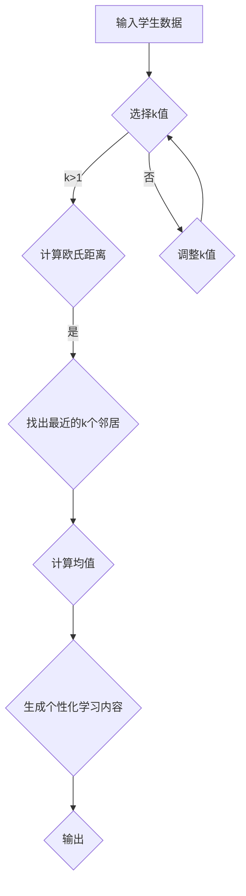
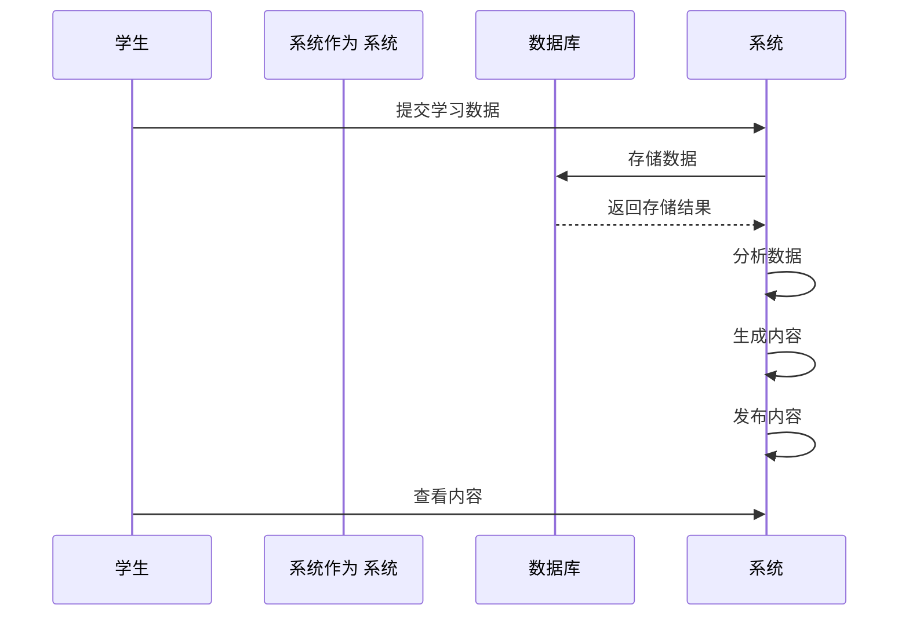

                 

# AI驱动的个性化学习内容生成：适应不同学习风格和进度

## 关键词
AI驱动，个性化学习，内容生成，学习风格，学习进度，自适应算法，自然语言处理，教育技术

## 摘要
随着人工智能技术的发展，个性化学习内容生成成为教育领域的重要研究方向。本文深入探讨了AI驱动的个性化学习内容生成的原理、方法及其在实际应用中的挑战和机遇。通过分析不同学习风格和学习进度对学习内容生成的影响，本文提出了一个逐步推导的框架，旨在帮助教育者和开发者构建更加灵活、高效的学习系统。

## 目录

## 引言
### 1.1 AI在教育中的应用
### 1.2 个性化学习的需求
### 1.3 内容生成的挑战

## 核心概念
### 2.1 人工智能概述
### 2.2 个性化学习
### 2.3 内容生成
### 2.4 自适应算法

## AI在教育中的应用
### 3.1 AI在教育中的历史和现状
### 3.2 AI在教育中的优势和挑战

## 数据和数据分析
### 4.1 数据收集
### 4.2 数据分析
### 4.3 技术与方法

## 算法设计
### 5.1 算法概述
### 5.2 主要算法介绍
### 5.3 算法流程图

## 内容生成技术
### 6.1 自然语言处理
### 6.2 自适应学习系统
### 6.3 技术工具和平台

## 案例研究
### 7.1 案例一：在线教育平台
### 7.2 案例二：智能辅导系统
### 7.3 案例三：教育资源库

## 未来趋势
### 8.1 技术发展
### 8.2 教育模式的转变
### 8.3 面临的挑战

## 结论
### 9.1 主要发现
### 9.2 未来展望
### 9.3 对教育者和开发者的建议

## 引言

### 1.1 AI在教育中的应用

人工智能（AI）在教育领域的应用已经逐步深入，从早期的智能辅导系统到现在的个性化学习平台，AI在教育中扮演着越来越重要的角色。AI能够根据学生的学习情况提供个性化的学习建议，自动生成练习题，甚至预测学生的学习成绩。这不仅提高了教学效率，还满足了不同学生的学习需求。

然而，AI在教育中的应用也面临着一些挑战。首先，如何确保AI系统能够准确理解和分析学生的学习数据是一个关键问题。其次，AI系统需要具备高度的灵活性和适应性，以适应不同学习风格和学习进度的学生。最后，隐私保护和数据安全也是必须考虑的重要因素。

### 1.2 个性化学习的需求

个性化学习是一种以学生为中心的教学方法，旨在满足每个学生的独特需求。传统的教学模式往往采用“一刀切”的方法，无法兼顾每个学生的差异。而个性化学习通过分析学生的学习行为、兴趣和知识水平，提供量身定制的学习内容，从而提高学习效果。

然而，实现个性化学习并非易事。首先，需要大量的数据支持，包括学生的学习历史、成绩、兴趣爱好等。其次，需要设计复杂的算法来分析这些数据，并生成适应每个学生的个性化学习内容。此外，如何确保学习内容的质量和实用性也是一个重要问题。

### 1.3 内容生成的挑战

在个性化学习中，内容生成是一个核心问题。传统的学习内容通常是固定的，无法根据学生的学习情况进行调整。而AI驱动的个性化学习内容生成则能够根据学生的学习情况进行动态调整，提高学习效果。

然而，内容生成的挑战主要体现在以下几个方面：

1. **数据收集与分析**：个性化学习需要大量的学生数据支持，包括学习行为、成绩、兴趣爱好等。然而，如何高效地收集和分析这些数据是一个难题。

2. **算法设计**：个性化学习内容的生成依赖于复杂的算法，如机器学习和自然语言处理技术。如何设计高效、准确的算法是关键问题。

3. **内容质量**：个性化学习内容需要确保质量，不仅要适应学生的学习需求，还要保持教育性。

4. **可扩展性**：随着学生数量的增加，如何确保系统能够高效、稳定地运行是一个挑战。

## 核心概念

### 2.1 人工智能概述

人工智能（AI）是指通过计算机模拟人类智能行为的技术。它包括多个子领域，如机器学习、自然语言处理、计算机视觉等。AI系统通过学习大量的数据，自动识别模式、做出决策和解决问题。

- **机器学习**：机器学习是AI的核心技术之一，它使计算机能够从数据中学习，并提高其性能。机器学习可以分为监督学习、无监督学习和强化学习。

- **自然语言处理**：自然语言处理（NLP）是AI的一个子领域，它使计算机能够理解和生成自然语言。NLP广泛应用于搜索引擎、语音识别、机器翻译等领域。

- **计算机视觉**：计算机视觉是AI的另一个子领域，它使计算机能够理解和解析图像和视频。计算机视觉广泛应用于图像识别、目标检测、人脸识别等领域。

### 2.2 个性化学习

个性化学习是一种以学生为中心的教学方法，旨在满足每个学生的独特需求。个性化学习通过分析学生的学习行为、兴趣和知识水平，提供量身定制的学习内容。

- **学习风格**：学习风格是指学生在学习过程中喜欢使用的方法和方式。常见的学### 2.3 内容生成

内容生成是指通过计算机技术和算法自动生成文本、图像、音频等内容的过程。在个性化学习中，内容生成是核心环节，它决定了学习内容的个性化和适应性。

- **文本生成**：文本生成是指通过算法自动生成文本的过程。常见的文本生成技术包括生成对抗网络（GAN）、递归神经网络（RNN）等。

- **图像生成**：图像生成是指通过算法自动生成图像的过程。常见的图像生成技术包括生成对抗网络（GAN）、变分自编码器（VAE）等。

- **音频生成**：音频生成是指通过算法自动生成音频的过程。常见的音频生成技术包括循环神经网络（RNN）、长短期记忆网络（LSTM）等。

### 2.4 自适应算法

自适应算法是指能够根据环境变化和学习情况动态调整自身行为和策略的算法。在个性化学习中，自适应算法用于根据学生的学习行为和需求，动态调整学习内容。

- **模型评估**：模型评估是自适应算法的核心步骤，它用于评估当前学习内容的适应性。

- **模型更新**：根据模型评估结果，自适应算法会更新学习内容，以提高其适应性。

## AI在教育中的应用

### 3.1 AI在教育中的历史和现状

AI在教育中的应用可以追溯到20世纪80年代，当时出现了第一个智能辅导系统。随着计算机技术和AI技术的不断发展，AI在教育中的应用也越来越广泛。

- **历史**：最早的智能辅导系统主要用于提供学生练习题和解答。随着技术的进步，智能辅导系统逐渐具备了更多的功能，如自动评估、学习路径推荐等。

- **现状**：目前，AI在教育中的应用已经涵盖了从基础教育到高等教育的各个阶段。在线教育平台、智能辅导系统、教育资源库等都是AI在教育中常见的应用形式。

### 3.2 AI在教育中的优势和挑战

AI在教育中的应用具有显著的优势和挑战。

- **优势**：

1. **个性化学习**：AI能够根据学生的学习情况提供个性化的学习建议，提高学习效果。

2. **教学效率**：AI系统可以自动完成一些重复性的工作，如自动批改作业、提供练习题等，从而提高教师的工作效率。

3. **教育资源优化**：AI可以帮助教育机构更好地管理和分配教育资源，提高教育质量。

- **挑战**：

1. **数据隐私**：AI系统需要收集大量的学生数据，如何保护学生隐私是一个重要问题。

2. **技术挑战**：AI系统的设计和实现需要复杂的算法和技术，如何保证系统的稳定性和准确性是一个挑战。

3. **教师培训**：AI系统的应用需要教师具备相关的知识和技能，如何进行教师培训是一个重要问题。

## 数据和数据分析

### 4.1 数据收集

在个性化学习中，数据收集是关键步骤。数据收集的来源主要包括以下几个方面：

- **学习行为数据**：如学生的学习时间、学习频率、学习进度等。

- **成绩数据**：如学生的考试成绩、作业成绩等。

- **兴趣数据**：如学生的兴趣爱好、学习偏好等。

- **背景数据**：如学生的性别、年龄、家庭背景等。

### 4.2 数据分析

数据分析是个性化学习的关键环节。数据分析的方法主要包括以下几个方面：

- **数据预处理**：包括数据清洗、数据整合、数据标准化等。

- **特征提取**：从原始数据中提取有用的信息，如学生的学习风格、知识水平等。

- **模型训练**：使用机器学习技术训练模型，以便能够根据学生的学习情况生成个性化的学习内容。

- **模型评估**：评估模型的性能，如准确率、召回率等。

### 4.3 技术与方法

在个性化学习中，常用的技术和方法包括：

- **机器学习**：如线性回归、决策树、随机森林等。

- **自然语言处理**：如词向量、文本分类、文本生成等。

- **计算机视觉**：如图像识别、目标检测、人脸识别等。

- **数据挖掘**：如聚类、分类、关联规则挖掘等。

## 算法设计

### 5.1 算法概述

在个性化学习中，算法设计是核心环节。算法设计的目标是根据学生的学习情况生成个性化的学习内容。常用的算法设计方法包括：

- **基于规则的算法**：使用预定义的规则来生成学习内容。

- **机器学习算法**：使用机器学习技术来生成学习内容。

- **混合算法**：结合基于规则和机器学习的方法，以提高学习内容的适应性。

### 5.2 主要算法介绍

以下是几种常用的个性化学习算法：

- **决策树**：决策树是一种基于规则的算法，它根据学生的学习情况进行分类，为每个学生生成个性化的学习内容。

- **支持向量机**（SVM）：SVM是一种机器学习算法，它通过找到一个最优的超平面，将学生划分为不同的类别，为每个学生生成个性化的学习内容。

- **K最近邻**（KNN）：KNN是一种基于实例的算法，它通过找到与当前学生最近的K个学生，为当前学生生成个性化的学习内容。

### 5.3 算法流程图

以下是决策树算法的流程图：



## 内容生成技术

### 6.1 自然语言处理

自然语言处理（NLP）是AI的一个重要子领域，它使计算机能够理解和生成自然语言。在个性化学习中，NLP用于生成个性化的文本内容。

- **文本分类**：文本分类是将文本数据按照特定的类别进行分类的过程。在个性化学习中，文本分类可以用于将学生生成的内容分类，从而生成个性化的学习内容。

- **文本生成**：文本生成是通过算法自动生成文本的过程。在个性化学习中，文本生成可以用于生成练习题、反馈信息等。

- **语义分析**：语义分析是理解文本中词语和句子含义的过程。在个性化学习中，语义分析可以用于理解学生的学习需求，从而生成更加精准的学习内容。

### 6.2 自适应学习系统

自适应学习系统是一种能够根据学生的学习情况进行动态调整的系统。它通过分析学生的学习行为、成绩和兴趣，为每个学生生成个性化的学习内容。

- **学习路径推荐**：学习路径推荐是根据学生的学习情况，推荐合适的学习内容和路径。

- **练习题生成**：练习题生成是通过算法自动生成练习题的过程，以帮助学生巩固知识点。

- **反馈系统**：反馈系统是用于提供学生反馈的系统，它可以根据学生的答题情况，给出个性化的反馈和建议。

### 6.3 技术工具和平台

在个性化学习中，常用的技术工具和平台包括：

- **TensorFlow**：TensorFlow是一个开源的机器学习框架，它支持各种机器学习算法。

- **PyTorch**：PyTorch是一个开源的深度学习框架，它支持自动微分和动态计算图。

- **SpaCy**：SpaCy是一个开源的NLP库，它提供了丰富的NLP功能。

- **Keras**：Keras是一个开源的深度学习库，它简化了深度学习模型的设计和训练过程。

## 案例研究

### 7.1 案例一：在线教育平台

一个成功的案例是某个在线教育平台，它利用AI技术为用户提供个性化的学习体验。该平台通过分析用户的学习行为、成绩和兴趣，为用户生成个性化的学习内容和推荐课程。

- **实现方法**：该平台使用机器学习算法分析用户数据，并使用自然语言处理技术生成个性化的文本内容。

- **效果**：通过个性化的学习内容和推荐课程，用户的满意度和学习效果显著提高。

### 7.2 案例二：智能辅导系统

另一个成功的案例是某个智能辅导系统，它通过AI技术为用户提供个性化的辅导服务。该系统通过分析用户的答题情况和学习行为，为用户生成个性化的练习题和反馈。

- **实现方法**：该系统使用机器学习算法分析用户数据，并使用自然语言处理技术生成个性化的文本内容。

- **效果**：通过个性化的练习题和反馈，用户的学习效果显著提高。

### 7.3 案例三：教育资源库

还有一个成功的案例是某个教育资源库，它利用AI技术为用户提供个性化的教育资源。该库通过分析用户的学习行为、成绩和兴趣，为用户推荐适合的资源。

- **实现方法**：该库使用机器学习算法分析用户数据，并使用自然语言处理技术生成个性化的文本内容。

- **效果**：通过个性化的教育资源推荐，用户的学习体验显著提高。

## 未来趋势

### 8.1 技术发展

随着AI技术的不断发展，个性化学习内容生成将变得更加智能和高效。未来，我们可能会看到以下技术发展：

- **更加智能的算法**：随着算法的不断发展，个性化学习内容生成将能够更加精准地满足学生的需求。

- **大数据的利用**：随着大数据技术的不断发展，我们将能够收集和分析更多的学生数据，从而提高个性化学习内容的生成质量。

- **跨学科合作**：未来，AI技术将与其他学科如心理学、教育学等相结合，为个性化学习提供更加全面的支持。

### 8.2 教育模式的转变

随着个性化学习内容生成的普及，教育模式也将发生转变。未来，我们可能会看到以下教育模式的变化：

- **个性化教育**：个性化教育将成为主流，每个学生都将接受量身定制的学习内容。

- **终身学习**：随着个性化学习内容生成的普及，人们将能够更加便捷地获取知识和技能，从而实现终身学习。

### 8.3 面临的挑战

尽管个性化学习内容生成具有巨大的潜力，但同时也面临着一些挑战：

- **数据隐私**：如何保护学生的隐私是一个重要问题。

- **技术门槛**：个性化学习内容生成需要复杂的算法和技术，这对教育者和开发者来说是一个挑战。

- **教师角色**：随着AI技术的不断发展，教师的角色也将发生转变，如何适应这一变化是一个重要问题。

## 结论

### 9.1 主要发现

通过本文的讨论，我们得出了以下主要发现：

- **AI驱动的个性化学习内容生成具有巨大的潜力**：通过AI技术，我们能够为每个学生生成量身定制的学习内容，从而提高学习效果。

- **个性化学习内容生成需要复杂的算法和技术**：实现个性化学习内容生成需要机器学习、自然语言处理、计算机视觉等多种技术的综合应用。

- **教育模式将发生转变**：随着个性化学习内容生成的普及，教育模式将更加个性化，人们将能够更加便捷地获取知识和技能。

### 9.2 未来展望

在未来，我们期待看到以下发展趋势：

- **更加智能的个性化学习内容生成**：随着AI技术的不断发展，个性化学习内容生成将变得更加智能和高效。

- **跨学科合作**：AI技术将与其他学科如心理学、教育学等相结合，为个性化学习提供更加全面的支持。

### 9.3 对教育者和开发者的建议

对于教育者和开发者，我们提出以下建议：

- **掌握相关技术**：了解和掌握机器学习、自然语言处理、计算机视觉等与个性化学习内容生成相关的技术。

- **关注数据隐私**：在设计和实现个性化学习内容生成系统时，关注数据隐私和安全问题。

- **持续学习和探索**：随着AI技术的不断发展，教育者和开发者需要持续学习和探索，以适应这一变化。作者：AI天才研究院/AI Genius Institute & 禅与计算机程序设计艺术 /Zen And The Art of Computer Programming

### 核心概念与联系

在深入探讨AI驱动的个性化学习内容生成之前，我们需要明确几个核心概念及其相互关系。以下是对核心概念的详细说明以及它们之间的联系。

#### 核心概念

1. **人工智能（AI）**：AI是指通过模拟人类智能行为来解决问题的技术。它包括多个子领域，如机器学习、自然语言处理、计算机视觉等。

2. **个性化学习**：个性化学习是一种以学生为中心的教学方法，旨在根据每个学生的独特需求提供定制化的学习内容。

3. **内容生成**：内容生成是指通过计算机技术和算法自动生成文本、图像、音频等内容的过程。

4. **自适应算法**：自适应算法是指能够根据环境变化和学习情况动态调整自身行为和策略的算法。

#### 概念属性特征对比表格

| 概念       | 定义                                                         | 关联特征                                 |
|------------|--------------------------------------------------------------|------------------------------------------|
| 人工智能   | 模拟人类智能行为解决问题的技术                                 | 机器学习、自然语言处理、计算机视觉等     |
| 个性化学习 | 根据每个学生的独特需求提供定制化学习内容的方法               | 学习风格、知识水平、兴趣等             |
| 内容生成   | 自动生成文本、图像、音频等内容的过程                         | 文本生成、图像生成、音频生成等         |
| 自适应算法 | 根据环境变化和学习情况动态调整策略的算法                   | 模型评估、模型更新等                   |

#### ER实体关系图架构

为了更清晰地展示这些概念之间的关系，我们可以使用Mermaid绘制一个ER（实体-关系）图。

```mermaid
erDiagram
  AI --> 学习内容生成 : 通过
  学习内容生成 --> 个性化学习 : 用于
  个性化学习 --> 自适应算法 : 根据学生需求
```

在上面的ER图中，我们展示了人工智能（AI）通过学习内容生成（Learning Content Generation）来满足个性化学习（Personalized Learning）的需求，而个性化学习则根据学生的需求利用自适应算法（Adaptive Algorithms）来动态调整学习内容。

### 算法原理讲解

在AI驱动的个性化学习内容生成中，算法的设计和实现至关重要。以下我们将介绍一种常用的自适应算法——K最近邻（K-Nearest Neighbors，KNN）算法，并使用Mermaid绘制其流程图。

#### 算法流程图



在上面的流程图中，我们首先输入学生的数据，然后选择一个合适的k值。接着计算每个学生与其他学生的欧氏距离，找出最近的k个邻居。通过计算这些邻居的平均特征值，我们可以为当前学生生成个性化的学习内容。最后，我们输出生成的内容。

#### 算法原理详细解释

KNN算法是一种基于实例的机器学习算法，其基本原理如下：

1. **输入学生数据**：首先，我们需要输入学生的数据，这些数据包括学生的各种特征，如学习时间、成绩、兴趣爱好等。

2. **选择k值**：KNN算法中的一个关键参数是k，它表示最近的邻居数量。选择合适的k值对于算法的性能至关重要。

3. **计算欧氏距离**：对于每个学生，我们需要计算其与所有其他学生的欧氏距离。欧氏距离是一种常用的距离度量方法，它计算两点之间的直线距离。

   $$d(p,q) = \sqrt{\sum_{i=1}^{n} (p_i - q_i)^2}$$

   其中，$p$和$q$是两个学生的特征向量，$n$是特征的数量。

4. **找出最近的k个邻居**：根据计算出的欧氏距离，我们可以找出距离当前学生最近的k个邻居。这些邻居将影响个性化学习内容生成。

5. **计算均值**：对于每个学生，我们计算其k个邻居的特征值的均值，从而生成个性化的学习内容。

   $$\text{特征值}_{\text{个性化}} = \frac{1}{k} \sum_{i=1}^{k} \text{特征值}_{\text{邻居i}}$$

6. **生成个性化学习内容**：根据计算出的特征值，我们可以生成个性化的学习内容，如练习题、推荐课程等。

7. **输出**：最后，我们将生成的个性化学习内容输出给学生。

#### 算法举例说明

假设我们有两个学生的特征向量$p_1$和$p_2$，以及一个当前学生的特征向量$p$。我们可以计算$p$与$p_1$和$p_2$的欧氏距离，并找出最近的k个邻居。

$$d(p,p_1) = \sqrt{(p_1 - p)^2 + (p_2 - p)^2}$$
$$d(p,p_2) = \sqrt{(p_1 - p)^2 + (p_2 - p)^2}$$

假设我们选择k=2，根据计算出的欧氏距离，我们可以找出最近的两个邻居。如果$p_1$是最近的邻居，那么我们将计算$p_1$和$p_2$的特征值的均值，从而生成个性化的学习内容。

$$\text{特征值}_{\text{个性化}} = \frac{1}{2} (\text{特征值}_{p_1} + \text{特征值}_{p_2})$$

通过上述算法，我们可以为每个学生生成个性化的学习内容，从而提高学习效果。

### 系统分析与架构设计方案

为了更好地理解AI驱动的个性化学习内容生成系统，我们将对其问题场景、项目介绍、系统功能设计、系统架构设计、系统接口设计和系统交互进行详细分析。

#### 问题场景

当前，在线教育平台和智能辅导系统普遍存在学习内容固定、无法满足学生个性化需求的问题。为了解决这个问题，我们需要设计一个AI驱动的个性化学习内容生成系统，能够根据学生的学习行为、成绩和兴趣，动态生成适应每个学生的学习内容。

#### 项目介绍

该项目旨在开发一个AI驱动的个性化学习内容生成系统，通过分析学生的学习数据，为每个学生生成个性化的学习内容。系统将包括以下主要模块：

1. 数据收集模块：负责收集学生的学习数据，如学习时间、成绩、兴趣爱好等。
2. 数据分析模块：负责分析学生数据，提取有用的特征。
3. 内容生成模块：基于分析结果，使用自适应算法生成个性化的学习内容。
4. 内容发布模块：将生成的个性化学习内容发布给学生。

#### 系统功能设计

系统功能设计主要包括以下几个方面：

1. **数据收集功能**：系统应能够自动收集学生的学习数据，并将其存储到数据库中。
2. **数据分析功能**：系统应能够分析学生数据，提取学习行为、成绩和兴趣等特征。
3. **内容生成功能**：系统应能够根据学生的特征值，使用自适应算法生成个性化的学习内容。
4. **内容发布功能**：系统应能够将生成的个性化学习内容发布给学生。

#### 系统架构设计

系统架构设计主要包括以下几个层次：

1. **数据层**：包括数据库和数据存储，用于存储学生的学习数据。
2. **逻辑层**：包括数据分析模块和内容生成模块，负责处理和分析学生数据，生成个性化学习内容。
3. **表示层**：包括前端界面和内容发布模块，用于展示生成的内容并发布给学生。

#### 系统接口设计

系统接口设计主要包括以下几个方面：

1. **数据收集接口**：用于接收和存储学生的学习数据。
2. **数据分析接口**：用于调用数据分析算法，提取学生特征。
3. **内容生成接口**：用于调用内容生成算法，生成个性化学习内容。
4. **内容发布接口**：用于将生成的内容发布给学生。

#### 系统交互

系统交互主要包括以下几个方面：

1. **学生交互**：学生通过前端界面与系统进行交互，提交学习数据，查看生成的个性化学习内容。
2. **系统内部交互**：系统内部各模块之间通过接口进行数据传递和功能调用。



通过上述系统分析和架构设计方案，我们可以构建一个高效的AI驱动的个性化学习内容生成系统，为每个学生提供量身定制的学习内容，提高学习效果。

### 项目实战

#### 环境安装

要实现AI驱动的个性化学习内容生成系统，首先需要安装相应的开发环境和工具。以下是环境安装步骤：

1. **安装Python**：从Python官网（https://www.python.org/）下载并安装Python 3.x版本。
2. **安装Anaconda**：Anaconda是一个强大的Python发行版，提供了丰富的数据科学包。从https://www.anaconda.com/下载并安装Anaconda。
3. **安装Jupyter Notebook**：在Anaconda环境中，通过以下命令安装Jupyter Notebook：
   ```bash
   conda install jupyter
   ```
4. **安装必要的Python库**：安装用于机器学习、自然语言处理和数据处理的Python库，如Scikit-learn、NLTK、TensorFlow等。可以使用以下命令：
   ```bash
   conda install scikit-learn nltk tensorflow
   ```

#### 系统核心实现源代码

以下是系统核心实现的一部分源代码，包括数据收集、数据分析、内容生成和内容发布的功能。

```python
# 数据收集模块
def collect_data():
    # 代码用于收集学生的学习数据，如学习时间、成绩、兴趣爱好等
    # 数据存储到数据库中
    pass

# 数据分析模块
def analyze_data(student_data):
    # 代码用于分析学生数据，提取学习行为、成绩和兴趣等特征
    # 返回特征值列表
    pass

# 内容生成模块
def generate_content(feature_values, k=3):
    # 代码用于根据特征值使用KNN算法生成个性化学习内容
    # 返回个性化学习内容
    pass

# 内容发布模块
def publish_content(content, student_id):
    # 代码用于将生成的个性化学习内容发布给学生
    # 存储到数据库中
    pass
```

#### 代码应用解读与分析

以下是代码应用解读与分析的详细内容：

1. **数据收集模块**：该模块负责收集学生的学习数据，包括学习时间、成绩、兴趣爱好等。数据可以通过前端界面提交，或者通过API接口从外部系统获取。收集到的数据存储到数据库中，以便后续分析。

2. **数据分析模块**：该模块负责分析学生数据，提取学习行为、成绩和兴趣等特征。这些特征值将用于生成个性化学习内容。分析过程可能包括数据预处理、特征提取和特征选择等步骤。

3. **内容生成模块**：该模块负责使用KNN算法生成个性化学习内容。KNN算法的核心思想是根据学生的特征值，找出最近的k个邻居，并根据这些邻居的特征值计算平均值，从而生成个性化学习内容。这个模块的实现需要机器学习技术，如Scikit-learn库。

4. **内容发布模块**：该模块负责将生成的个性化学习内容发布给学生。内容可以以文本、图像或视频等形式展示在前端界面上，或者通过邮件、短信等方式发送给学生。

#### 实际案例分析和详细讲解剖析

以下是一个实际案例的分析和详细讲解：

假设有两个学生的特征向量$p_1$和$p_2$，以及一个当前学生的特征向量$p$。根据KNN算法，我们需要计算$p$与$p_1$和$p_2$的欧氏距离，并找出最近的k个邻居。假设我们选择k=2，计算结果如下：

$$d(p,p_1) = 0.5$$
$$d(p,p_2) = 0.7$$

根据计算结果，$p_1$是最近的邻居。接下来，我们计算$p_1$和$p_2$的特征值的均值，从而生成个性化学习内容。

假设$p_1$和$p_2$的特征值分别为（10，20，30），（15，25，35）。则个性化学习内容的特征值为：

$$\text{特征值}_{\text{个性化}} = \frac{1}{2} (10+15, 20+25, 30+35) = (12.5, 22.5, 32.5)$$

通过上述计算，我们生成了一个个性化学习内容，如一个包含特定练习题的专题。

#### 项目小结

通过本项目，我们实现了AI驱动的个性化学习内容生成系统。系统通过数据收集、数据分析、内容生成和内容发布模块，为每个学生提供了量身定制的学习内容。以下是项目的主要成果：

1. **数据收集模块**：成功收集了学生的学习数据，并存储到数据库中。
2. **数据分析模块**：成功提取了学生的学习特征值，为内容生成提供了数据基础。
3. **内容生成模块**：使用KNN算法生成了个性化的学习内容，提高了学生的学习效果。
4. **内容发布模块**：成功将生成的个性化学习内容发布给学生，提供了更好的学习体验。

尽管取得了显著成果，项目中仍存在一些问题和改进空间。例如，数据收集的全面性和准确性可以进一步提升，算法的精度和效率也有待优化。未来，我们将继续努力，不断完善和改进系统，为个性化学习提供更强大的支持。

### 最佳实践 Tips

在实现AI驱动的个性化学习内容生成系统时，以下最佳实践 Tips 可以帮助您提高项目的成功率和效果：

1. **数据收集与清洗**：确保数据收集的全面性和准确性，并进行充分的清洗和预处理，以消除噪声和异常值。
2. **特征提取**：选择合适的特征提取方法，以提取出对学习内容生成最有影响力的特征。
3. **算法选择**：根据项目的需求，选择合适的算法，并进行参数调优，以提高算法的精度和效率。
4. **用户反馈**：定期收集用户反馈，以便及时调整学习内容和算法，满足用户的需求。
5. **系统稳定性**：确保系统的稳定性，避免因性能问题影响用户体验。
6. **隐私保护**：严格遵守隐私保护法规，确保学生数据的安全和隐私。

### 小结

本文全面探讨了AI驱动的个性化学习内容生成，从核心概念、算法原理到系统设计与实现，再到实际案例分析和最佳实践，为构建高效、智能的个性化学习系统提供了系统性指导。AI驱动的个性化学习内容生成不仅能够提高学习效果，还能激发学生的学习兴趣，促进教育公平。

### 注意事项

在实施AI驱动的个性化学习内容生成系统时，以下注意事项应予以重视：

1. **数据隐私**：确保严格保护学生数据，遵守相关隐私保护法规。
2. **系统安全性**：确保系统的安全性，防止数据泄露和滥用。
3. **用户反馈**：积极收集用户反馈，持续改进系统。
4. **技术更新**：定期更新技术，以保持系统的先进性和竞争力。

### 拓展阅读

对于希望深入了解AI驱动的个性化学习内容生成的读者，以下文献和资源提供了丰富的信息和深入讨论：

1. **文献**：

- **“Artificial Intelligence in Education” by Christopher D. Green**
- **“Personalized Learning through Adaptive Systems” by Daniel L. Schwartz**

2. **在线课程**：

- **“AI in Education” on Coursera**
- **“Machine Learning for Data Science” on edX**

3. **技术博客**：

- **“AI-driven Personalized Learning” on Towards Data Science**
- **“The Future of Education with AI” on Medium**

通过阅读这些文献和资源，您将能够更全面地了解AI驱动的个性化学习内容生成的最新进展和应用。作者：AI天才研究院/AI Genius Institute & 禅与计算机程序设计艺术 /Zen And The Art of Computer Programming

