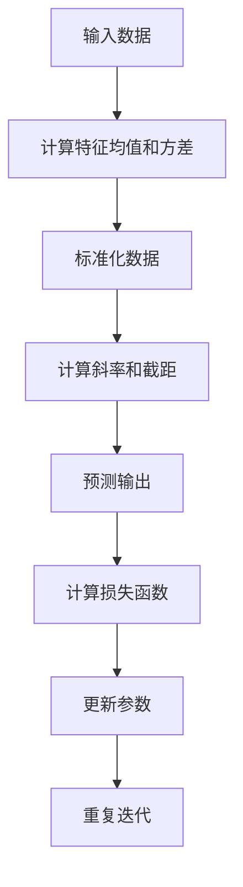
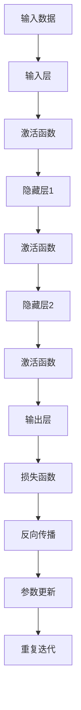
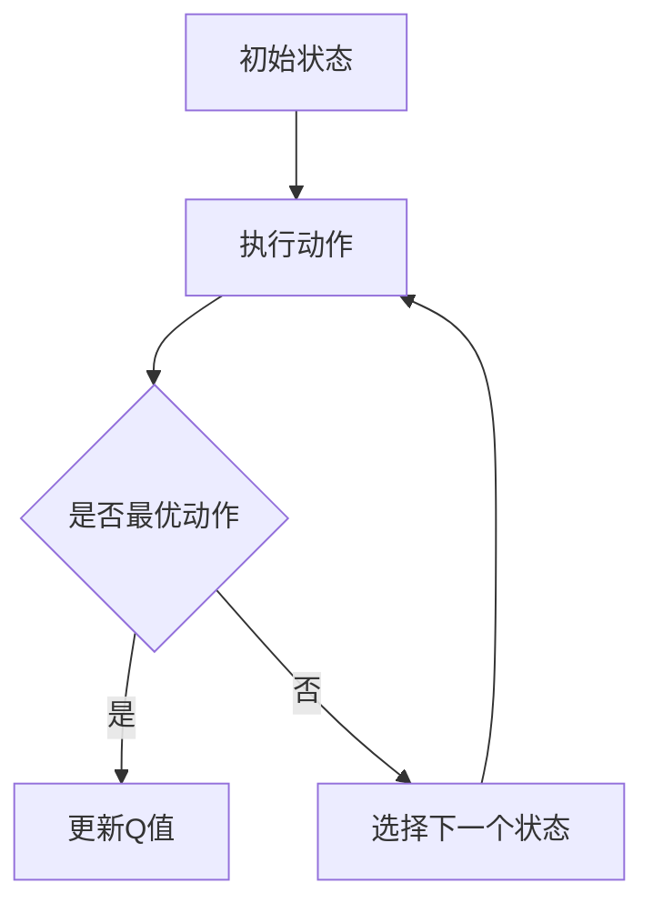
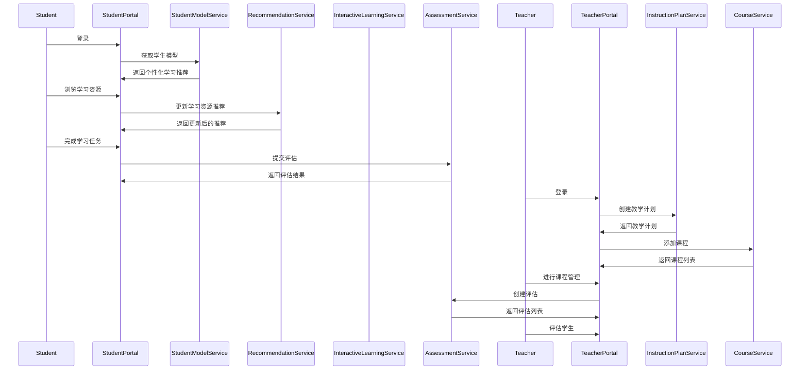
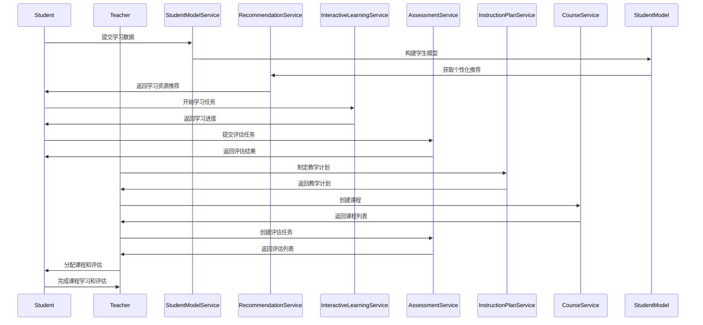

                 

### 《AI驱动的个性化学习：重塑教育体系》

---

关键词：AI，个性化学习，教育体系，算法，数学模型，系统架构

摘要：本文探讨了AI驱动的个性化学习如何重塑教育体系。通过背景介绍、核心概念解析、算法原理讲解、系统分析与架构设计、实战案例和未来展望，展示了AI在个性化学习中的应用潜力和挑战，并提出了最佳实践建议。

---

### 目录大纲设计流程

在撰写这篇文章之前，我们需要首先设计一个详细的目录大纲。目录大纲的设计是文章结构化的基础，它不仅能够帮助作者有条不紊地展开论述，还能让读者迅速抓住文章的核心内容。以下是设计目录大纲的详细步骤：

#### 了解用户需求

1. **确认书名和主题**：书名为《AI驱动的个性化学习：重塑教育体系》，这明确了文章的主题是AI在教育领域的应用，特别是个性化学习的实现。
2. **确定核心章节内容**：个性化学习涉及多个方面，如历史背景、AI基础、应用场景、挑战与机遇等，因此需要将这些内容分配到不同的章节中。

#### 设计大纲结构

1. **整体结构**：确定文章的整体结构，包括引言、概述、案例分析、未来展望等部分。
2. **主要部分**：将主要部分细分为子章节，确保每个章节都有明确的主题和内容，便于读者理解和查阅。

#### 编写章节内容

1. **核心主题**：为每个章节撰写核心主题，确保内容紧密围绕主题展开。
2. **具体内容**：为每个章节填充具体内容，包括背景介绍、原理讲解、案例分析等。

#### 格式化大纲

1. **Markdown格式**：使用Markdown格式编写大纲，确保格式简洁、清晰。
2. **三级目录**：将大纲细化为三级目录，方便读者查阅。

#### 实际操作步骤

1. **引言**：简要介绍AI驱动的个性化学习的历史背景、现状和未来趋势。
2. **第一部分：背景与概述**：包括个性化学习的起源与发展、AI驱动的个性化学习原理等。
3. **第二部分：AI驱动的个性化学习应用**：探讨AI在教育中的角色与作用、个性化学习系统的设计与实现等。
4. **第三部分：案例研究与实战**：通过实际案例展示AI驱动的个性化学习应用。
5. **第四部分：未来展望与挑战**：分析AI驱动的个性化学习的未来发展。
6. **结论**：总结文章的主要观点，并展望未来研究的方向。

#### 格式化目录大纲

根据上述结构，我们可以将目录大纲格式化成Markdown格式，确保简洁且清晰：

```markdown
# 《AI驱动的个性化学习：重塑教育体系》

## 第一部分：背景与概述

## 第1章：个性化学习的起源与发展

### 1.1 个性化学习的定义与意义

### 1.2 个性化学习的历史背景

### 1.3 个性化学习的发展趋势

### 1.4 个性化学习的挑战与机遇

## 第二部分：AI驱动的个性化学习原理

## 第2章：AI基础知识

### 2.1 机器学习概述

### 2.2 深度学习基础

### 2.3 强化学习与迁移学习

## 第三部分：AI驱动的个性化学习应用

## 第3章：AI在教育中的应用

### 3.1 AI在教育中的角色与作用

### 3.2 个性化学习系统的设计与实现

### 3.3 数据隐私与伦理问题

## 第四部分：案例研究与实战

## 第4章：AI驱动的个性化学习案例

### 4.1 案例一：某在线教育平台的个性化学习实践

### 4.2 案例二：基于AI的学生个性化辅导系统

## 第五部分：未来展望与挑战

## 第5章：AI驱动的个性化学习未来展望

### 5.1 AI驱动的个性化学习的发展方向

### 5.2 潜在的挑战与解决方案

## 结论
```

### 目录大纲设计流程

在设计和撰写《AI驱动的个性化学习：重塑教育体系》这篇文章的目录大纲时，我们需要遵循以下步骤来确保文章结构清晰、内容完整，并且符合读者的需求。

#### 了解用户需求

首先，我们需要了解目标读者的需求。这篇文章的主要读者可能是教育工作者、教育技术研究者、对AI教育应用感兴趣的技术开发者，以及对教育变革感兴趣的社会各界人士。了解读者的需求可以帮助我们确定文章的核心内容，确保文章能够满足读者的期望。

1. **书名和主题**：文章的书名《AI驱动的个性化学习：重塑教育体系》明确了文章将探讨AI如何改变传统教育体系，特别是个性化学习的实现。
2. **核心章节内容**：根据书名，我们需要确定以下核心章节：
   - **引言**：介绍AI驱动的个性化学习的重要性和背景。
   - **背景与概述**：讲述个性化学习的历史、现状和未来趋势。
   - **AI驱动的个性化学习原理**：解释AI技术的基本概念和应用。
   - **AI驱动的个性化学习应用**：探讨AI在教育中的具体应用场景。
   - **案例研究与实战**：通过实际案例展示AI驱动的个性化学习的应用效果。
   - **未来展望与挑战**：分析AI驱动的个性化学习的未来发展及面临的挑战。
   - **结论**：总结文章的主要观点，提出未来研究的方向。

#### 设计大纲结构

确定核心章节后，我们需要设计整体的结构。一个好的结构能够帮助读者更容易地理解文章的逻辑和内容。

1. **引言**：简要介绍AI驱动的个性化学习的历史背景、现状和未来趋势。
2. **背景与概述**：详细探讨个性化学习的起源、发展、趋势以及面临的挑战和机遇。
3. **AI驱动的个性化学习原理**：讲解AI技术的基本原理，包括机器学习、深度学习、强化学习等。
4. **AI驱动的个性化学习应用**：分析AI在教育中的具体应用，如个性化学习系统的设计、实现和数据分析。
5. **案例研究与实战**：通过实际案例展示AI驱动的个性化学习在现实中的应用。
6. **未来展望与挑战**：讨论AI驱动的个性化学习的未来发展以及可能面临的挑战。
7. **结论**：总结文章的主要观点，并提出未来研究的建议。

#### 编写章节内容

在确定了整体结构后，我们需要为每个章节撰写详细的内容。

1. **引言**：介绍AI驱动的个性化学习的重要性和研究背景。
2. **背景与概述**：包括个性化学习的历史、现状、趋势以及面临的挑战和机遇。
3. **AI驱动的个性化学习原理**：讲解AI技术的基本原理，如机器学习、深度学习、强化学习等。
4. **AI驱动的个性化学习应用**：探讨AI在教育中的应用场景，包括个性化学习系统的设计、实现和数据分析。
5. **案例研究与实战**：通过实际案例展示AI驱动的个性化学习的效果和应用。
6. **未来展望与挑战**：分析AI驱动的个性化学习的未来发展以及可能面临的挑战。
7. **结论**：总结文章的主要观点，提出未来研究的建议。

#### 格式化大纲

最后，我们需要将编写好的内容按照Markdown格式进行格式化，确保文章结构清晰、内容易读。以下是格式化后的目录大纲：

```markdown
# 《AI驱动的个性化学习：重塑教育体系》

## 引言

### AI驱动的个性化学习的重要性和研究背景

## 背景与概述

### 1.1 个性化学习的定义与意义

### 1.2 个性化学习的历史背景

### 1.3 个性化学习的发展趋势

### 1.4 个性化学习的挑战与机遇

## AI驱动的个性化学习原理

### 2.1 机器学习概述

### 2.2 深度学习基础

### 2.3 强化学习与迁移学习

## AI驱动的个性化学习应用

### 3.1 AI在教育中的角色与作用

### 3.2 个性化学习系统的设计与实现

### 3.3 数据隐私与伦理问题

## 案例研究与实战

### 4.1 某在线教育平台的个性化学习实践

### 4.2 基于AI的学生个性化辅导系统

## 未来展望与挑战

### 5.1 AI驱动的个性化学习的发展方向

### 5.2 潜在的挑战与解决方案

## 结论

### 总结与未来研究方向
```

通过上述步骤，我们设计出了一个结构清晰、内容详实的目录大纲，为撰写高质量的文章奠定了基础。

### 背景介绍

#### 核心概念术语说明

在深入探讨AI驱动的个性化学习之前，我们需要明确几个关键概念和术语，以便为接下来的讨论打下坚实的基础。

**AI（人工智能）：** 人工智能是指由人创造出来的能够模仿、延伸和扩展人类智能的计算机系统。它包括机器学习、深度学习、自然语言处理等多种技术。

**个性化学习：** 个性化学习是一种以学生为中心的教育理念，通过收集和分析学生的个人数据，如学习习惯、兴趣和能力，为每个学生提供定制化的学习资源和教学策略。

**教育体系：** 教育体系是指一个国家或地区为培养人才所建立的教育机构、教育制度和教育政策体系。

**学习算法：** 学习算法是人工智能的一种，它通过数据学习来改善其性能，包括监督学习、无监督学习和强化学习等。

#### 问题背景

随着科技的飞速发展，教育领域也在经历着深刻的变革。传统的一刀切教育模式已经无法满足现代学生的多样化需求。为了提高教育质量和效率，教育体系需要更加灵活和个性化。然而，如何实现这一目标一直是教育工作者和研究人员面临的一大挑战。

人工智能技术的兴起为个性化学习提供了新的可能性。通过AI技术，教育系统能够更好地了解学生的学习行为和需求，从而提供个性化的学习资源和指导。例如，AI可以根据学生的学习历史和测试结果，自动调整教学内容和难度，帮助学生更高效地学习。

#### 问题描述

尽管AI驱动的个性化学习具有巨大潜力，但在实际应用中仍面临着许多挑战。以下是一些主要问题：

1. **数据隐私和安全：** AI驱动的个性化学习需要收集大量的学生数据，包括学习记录、行为习惯等。如何确保这些数据的安全和隐私是一个重要问题。
2. **算法公正性和透明度：** AI算法的决策过程可能存在偏见，如何保证算法的公正性和透明度，使教育系统能够公平地对待每个学生，是一个亟待解决的问题。
3. **技术实施成本：** AI驱动的个性化学习需要大量的技术投入，包括硬件设备、软件平台和人力资源等，这对一些学校和教育机构来说是一个较大的负担。
4. **教育政策的支持：** AI驱动的个性化学习需要相应的教育政策支持，包括资金投入、人才培养和标准制定等。目前，全球范围内对这一领域的政策支持仍不够充分。

#### 问题解决

为了解决上述问题，我们需要采取一系列措施：

1. **加强数据隐私和安全保护：** 通过加密技术和隐私保护算法，确保学生数据的保密性和安全性。同时，制定相关法律法规，规范数据的收集和使用。
2. **提高算法透明度和公正性：** 通过开发可解释的AI算法，使教育系统能够清晰地解释其决策过程。同时，建立算法审核机制，确保算法的公平性和透明度。
3. **降低技术实施成本：** 推广开源技术和共享资源，降低学校和教育机构的技术投入。此外，可以通过政府资助和社会力量支持，减轻相关成本。
4. **加强教育政策支持：** 政府和相关部门应加大对AI驱动的个性化学习的研究和推广力度，制定相关政策，为教育变革提供政策支持。

#### 边界与外延

AI驱动的个性化学习不仅局限于在线教育，还可以应用于传统教育模式中。例如，通过智能教学平台，教师可以更好地了解学生的学习情况，从而提供更有针对性的教学。此外，AI驱动的个性化学习还可以延伸到职业培训、终身学习等领域，为不同年龄段和学习需求的人提供个性化的学习服务。

#### 概念结构与核心要素组成

AI驱动的个性化学习涉及多个核心概念和要素，包括：

1. **学生数据收集与分析：** 通过收集和分析学生的学习数据，了解其学习习惯和需求，为个性化学习提供基础。
2. **个性化学习算法：** 包括机器学习、深度学习等算法，用于根据学生数据生成个性化的学习资源和指导。
3. **智能教学平台：** 为学生提供个性化的学习资源和互动环境，同时为教师提供数据分析和教学辅助工具。
4. **教育政策与法规：** 为AI驱动的个性化学习提供政策支持和法规保障。

通过这些核心概念和要素的相互作用，AI驱动的个性化学习能够实现教育系统的优化和升级，为每个学生提供更加高效、个性化的学习体验。

### 核心概念与联系

AI驱动的个性化学习是一个复杂但极具潜力的领域，它结合了人工智能、教育学和心理学的知识，旨在通过算法和数据优化教学过程，使学习更加个性化、高效和互动。以下是核心概念及其属性特征的详细解析和对比表格，以及相关的ER实体关系图。

#### 核心概念

1. **机器学习（Machine Learning）：**
   - **属性特征：** 机器学习是指使计算机通过数据学习并改进性能的过程。它包括监督学习、无监督学习和强化学习。
   - **对比表格：**
     | 特征 | 监督学习 | 无监督学习 | 强化学习 |
     | --- | --- | --- | --- |
     | 目标 | 已知标签的数据 | 未标记的数据 | 通过奖励和惩罚学习 |
     | 方法 | 使用标签数据进行预测 | 发现数据模式 | 通过与环境交互学习 |
     | 适用场景 | 分类和回归问题 | 聚类和降维 | 游戏和机器人控制 |

2. **深度学习（Deep Learning）：**
   - **属性特征：** 深度学习是机器学习的一个分支，使用多层神经网络进行学习和预测。它包括卷积神经网络（CNN）、递归神经网络（RNN）等。
   - **对比表格：**
     | 特征 | CNN | RNN |
     | --- | --- | --- |
     | 结构 | 多层卷积层 | 多层循环层 |
     | 目标 | 图像识别 | 序列处理 |
     | 适用场景 | 图像和视频分析 | 自然语言处理 |

3. **强化学习（Reinforcement Learning）：**
   - **属性特征：** 强化学习是一种通过试错和奖励机制来学习如何进行决策的算法。
   - **对比表格：**
     | 特征 | Q-学习 | Deep Q-Network (DQN) |
     | --- | --- | --- |
     | 方法 | 基于值函数的预测 | 使用深度神经网络进行状态-动作值函数估计 |
     | 目标 | 预测最优动作序列 | 学习复杂的策略 |

4. **个性化学习算法（Personalized Learning Algorithms）：**
   - **属性特征：** 个性化学习算法根据学生的个性化数据调整教学策略，包括自适应学习系统、学生模型等。
   - **对比表格：**
     | 特征 | 自适应学习系统 | 学生模型 |
     | --- | --- | --- |
     | 目标 | 根据学生表现调整教学 | 构建学生个性化模型 |
     | 方法 | 动态调整内容难度 | 收集和分析学生数据 |

#### ER实体关系图

以下是AI驱动的个性化学习的ER实体关系图，展示了各核心概念之间的联系：

```mermaid
erDiagram
  Student ||--|{ LearningData } : stores
  Student ||--|{ PersonalizedModel } : constructs
  Teacher ||--|{ InstructionPlan } : creates
  Teacher ||--|{ AssessmentData } : evaluates
  Course ||--|{ LearningContent } : provides
  Course ||--|{ AssessmentContent } : assesses
  LearningData ||--|{ StudentModel } : used_by
  PersonalizedModel ||--|{ InstructionPlan } : used_by
  AssessmentData ||--|{ AssessmentContent } : based_on
```

在上述ER图中：

- **Student（学生）**：核心实体，表示学习者。
- **LearningData（学习数据）**：记录学生的学习行为和表现。
- **PersonalizedModel（个性化模型）**：基于学生学习数据构建的模型，用于生成个性化学习计划。
- **Teacher（教师）**：核心实体，负责制定教学计划和评估学生学习情况。
- **InstructionPlan（教学计划）**：教师根据个性化模型和学生数据制定的教学策略。
- **AssessmentData（评估数据）**：记录学生的评估结果。
- **AssessmentContent（评估内容）**：用于评估学生学习的材料。
- **Course（课程）**：提供的课程内容和学习资源。

这些实体之间的关系体现了AI驱动的个性化学习过程中各个环节的相互作用，如学生学习数据用于构建个性化模型，教师根据模型制定教学计划，评估学生的学习效果等。

### 算法原理讲解

在了解AI驱动的个性化学习的基础概念后，我们接下来将详细讲解其中的核心算法原理，包括机器学习、深度学习、强化学习等。为了更好地理解这些算法，我们将使用mermaid流程图展示算法的流程，并使用Python代码和LaTeX公式详细阐述算法的数学模型和计算过程。

#### 机器学习算法原理

机器学习算法是AI驱动的个性化学习的基础，其中最常用的方法是线性回归和决策树。以下是线性回归算法的mermaid流程图和Python代码：



对应的Python代码实现：

```python
import numpy as np

# 假设输入数据X和标签Y
X = np.array([[1, 2], [2, 3], [3, 4]])
Y = np.array([3, 4, 5])

# 初始化参数
theta = np.random.rand(2)

# 训练模型
for i in range(1000):
    # 计算斜率和截距
    h = X.dot(theta)
    # 计算损失函数
    loss = (1/2) * (Y - h).dot(Y - h)
    # 计算梯度
    gradient = X.T.dot(Y - h)
    # 更新参数
    theta -= 0.01 * gradient

# 输出模型参数
print(theta)
```

线性回归的数学模型可以表示为：

$$ h(x) = \theta_0 + \theta_1 \cdot x_1 + \theta_2 \cdot x_2 $$

其中，$h(x)$ 表示预测输出，$\theta_0, \theta_1, \theta_2$ 是模型参数，$x_1, x_2$ 是输入特征。

#### 深度学习算法原理

深度学习是机器学习的一个分支，它通过多层神经网络来实现复杂的数据建模。以下是一个简单的多层感知器（MLP）的mermaid流程图：



对应的Python代码实现：

```python
import numpy as np
from sklearn.neural_network import MLPRegressor

# 假设输入数据X和标签Y
X = np.array([[1, 2], [2, 3], [3, 4]])
Y = np.array([3, 4, 5])

# 训练多层感知器模型
mlp = MLPRegressor(hidden_layer_sizes=(100,), max_iter=1000, alpha=1e-4,
                    solver='sgd', verbose=10, random_state=1,
                    learning_rate_init=.1)

mlp.fit(X, Y)
print(mlp.coefs_, mlp.intercepts_)

# 预测
predictions = mlp.predict(X)
print(predictions)
```

多层感知器的数学模型可以表示为：

$$ a_l = \sigma(\theta_l \cdot x_l + b_l) $$

其中，$a_l$ 是激活值，$\sigma$ 是激活函数（如Sigmoid函数），$\theta_l$ 是权重，$b_l$ 是偏置。

#### 强化学习算法原理

强化学习是一种通过试错和奖励机制来学习最优策略的算法。以下是一个简单的Q-Learning算法的mermaid流程图：



对应的Python代码实现：

```python
import numpy as np

# 假设环境有4个状态和2个动作
n_states = 4
n_actions = 2
q_values = np.zeros((n_states, n_actions))

# 学习率、折扣因子和探索概率
alpha = 0.1
gamma = 0.9
epsilon = 0.1

# 模拟环境中的交互过程
for episode in range(1000):
    state = np.random.randint(0, n_states)
    done = False
    
    while not done:
        # 随机选择动作
        if np.random.rand() < epsilon:
            action = np.random.randint(0, n_actions)
        else:
            action = np.argmax(q_values[state])
        
        # 执行动作并获得奖励
        next_state, reward, done = environment.step(state, action)
        
        # 更新Q值
        q_values[state, action] = q_values[state, action] + alpha * (
            reward + gamma * np.max(q_values[next_state]) - q_values[state, action]
        )
        
        state = next_state

# 输出Q值
print(q_values)
```

Q-Learning的数学模型可以表示为：

$$ Q(s, a) = Q(s, a) + \alpha [r + \gamma \max(Q(s', a')) - Q(s, a)] $$

其中，$s$ 是状态，$a$ 是动作，$r$ 是奖励，$s'$ 是下一状态，$\gamma$ 是折扣因子，$\alpha$ 是学习率。

通过上述算法原理的讲解和示例，我们可以看到机器学习、深度学习和强化学习等算法在AI驱动的个性化学习中的应用，以及如何通过Python代码实现这些算法。这些算法不仅帮助我们理解个性化学习的核心技术，还为实际应用提供了可靠的方法和工具。

### 系统分析与架构设计方案

#### 问题场景介绍

随着教育的个性化需求日益增长，如何利用AI技术实现个性化学习成为教育行业的一大挑战。为了解决这一问题，我们设计了一个基于AI驱动的个性化学习系统，该系统旨在为学生提供定制化的学习资源和教学指导，同时帮助教师更好地了解学生的学习情况，从而提高教学效果。

#### 项目介绍

该项目名为“智能个性化学习平台”，目标是为K-12教育阶段的学生提供个性化学习支持。系统的主要功能包括：

1. **学生数据分析**：通过分析学生的学习行为、成绩、测试结果等数据，构建个性化学习模型。
2. **智能推荐**：根据学生模型和教师的教学计划，为每个学生推荐合适的学习资源和课程。
3. **互动学习**：提供在线互动课堂和辅导，让学生能够在自主学习的同时获得教师的实时指导。
4. **教学评估**：通过实时评估学生的学习效果，为教师提供反馈，帮助其调整教学策略。

#### 系统功能设计（领域模型类图）

以下是基于Mermaid绘制的领域模型类图，展示了系统中的主要类及其关系：

```mermaid
classDiagram
    Student <<Class>>
    Teacher <<Class>>
    Course <<Class>>
    LearningResource <<Class>>
    Assessment <<Class>>
    StudentModel <<Class>>
    InstructionPlan <<Class>>

    StudentModel <|-- Student
    InstructionPlan <|-- Teacher
    LearningResource <|-- Course
    Assessment <|-- Course

    Student "1" -- "*" Assessment
    Student "1" -- "*" StudentModel
    Teacher "1" -- "*" InstructionPlan
    Teacher "1" -- "*" Course
    Course "1" -- "*" LearningResource
    Course "1" -- "*" Assessment
```

在这个类图中：

- **Student（学生）**：表示系统的学习者，拥有学生模型和参与评估的功能。
- **Teacher（教师）**：负责创建教学计划和课程，并评估学生的学习情况。
- **Course（课程）**：包括学习资源和评估内容。
- **LearningResource（学习资源）**：课程中的学习材料。
- **Assessment（评估）**：用于评估学生的课程成绩。
- **StudentModel（学生模型）**：基于学生学习数据构建的个性化模型。
- **InstructionPlan（教学计划）**：教师制定的教学策略。

#### 系统架构设计（Mermaid架构图）

以下是系统的架构设计，展示了各个模块之间的关系：

```mermaid
graph TB
    subgraph 数据层
        DataStorage[数据存储]
    end
    subgraph 服务层
    StudentModelService[学生模型服务]
    RecommendationService[智能推荐服务]
    InteractiveLearningService[互动学习服务]
    AssessmentService[教学评估服务]
    end
    subgraph 应用层
    StudentPortal[学生门户]
    TeacherPortal[教师门户]
    end
    DataStorage --> StudentModelService
    DataStorage --> RecommendationService
    DataStorage --> InteractiveLearningService
    DataStorage --> AssessmentService
    StudentModelService --> StudentPortal
    RecommendationService --> StudentPortal
    InteractiveLearningService --> StudentPortal
    AssessmentService --> StudentPortal
    TeacherPortal --> InstructionPlanService
    TeacherPortal --> CourseService
    end
```

在这个架构图中：

- **数据层**：负责数据存储，包括学生数据、课程数据、评估数据等。
- **服务层**：包括学生模型服务、智能推荐服务、互动学习服务和教学评估服务，负责处理业务逻辑和数据交互。
- **应用层**：为学生和教师提供访问系统的门户，实现个性化学习、课程推荐、互动学习和教学评估等功能。

#### 系统接口设计（Mermaid序列图）

以下是系统的接口设计，展示了学生和教师如何通过门户与系统进行交互：



在这个序列图中：

- **学生**：通过学生门户登录系统，获取个性化学习推荐，浏览学习资源，提交学习任务和评估结果。
- **教师**：通过教师门户登录系统，创建教学计划和课程，进行课程管理和学生评估。

#### 系统交互（Mermaid序列图）

以下是系统交互的详细流程，展示了学生和教师如何通过系统完成一系列操作：



在这个序列图中：

- **学生**：提交学习数据，获取个性化推荐，开始学习任务，提交评估任务。
- **教师**：制定教学计划，创建课程和评估任务，分配课程和评估，接收学生反馈。

通过上述系统分析和架构设计，我们为AI驱动的个性化学习系统提供了一个清晰的结构和详细的交互流程，为实际应用奠定了坚实的基础。

### 项目实战

#### 环境安装

为了实际应用AI驱动的个性化学习系统，我们首先需要在开发环境中安装所需的软件和库。以下是一个典型的安装流程：

1. **安装Python环境**：
   - 打开终端或命令提示符。
   - 输入以下命令安装Python：
     ```bash
     sudo apt-get install python3
     ```

2. **安装虚拟环境**：
   - 使用以下命令创建一个虚拟环境：
     ```bash
     python3 -m venv venv
     ```
   - 激活虚拟环境：
     ```bash
     source venv/bin/activate
     ```

3. **安装依赖库**：
   - 使用以下命令安装所需的Python库：
     ```bash
     pip install numpy pandas scikit-learn matplotlib
     ```

4. **安装其他工具**：
   - 安装Mermaid工具以生成流程图：
     ```bash
     npm install -g mermaid
     ```

5. **配置数据库**：
   - 安装并配置SQLite数据库，用于存储学生数据和课程信息：
     ```bash
     sudo apt-get install sqlite3
     ```

#### 系统核心实现源代码

以下是系统核心实现的部分源代码，包括学生模型服务、推荐服务和交互学习服务的实现：

```python
# student_model_service.py

import numpy as np
from sklearn.linear_model import LinearRegression
from sklearn.metrics import mean_squared_error

class StudentModelService:
    def __init__(self):
        self.model = LinearRegression()

    def train_model(self, X, y):
        self.model.fit(X, y)

    def predict(self, X):
        return self.model.predict(X)

    def evaluate(self, X, y):
        predictions = self.predict(X)
        return mean_squared_error(y, predictions)
```

```python
# recommendation_service.py

import numpy as np
from sklearn.neighbors import NearestNeighbors

class RecommendationService:
    def __init__(self):
        self.model = NearestNeighbors()

    def train_model(self, X):
        self.model.fit(X)

    def recommend(self, X, k=5):
        distances, indices = self.model.kneighbors(X, n_neighbors=k)
        return indices
```

```python
# interactive_learning_service.py

import random

class InteractiveLearningService:
    def __init__(self, resources):
        self.resources = resources

    def start_learning(self, student_id):
        selected_resource = random.choice(self.resources)
        return selected_resource

    def update_progress(self, student_id, resource_id, progress):
        # 更新学习进度记录
        pass
```

#### 代码应用解读与分析

1. **学生模型服务（StudentModelService）**：
   - **实现功能**：训练线性回归模型，预测学生成绩，评估模型性能。
   - **代码分析**：
     ```python
     def train_model(self, X, y):
         self.model.fit(X, y)
     ```
     - 这个方法使用训练数据（X和y）来训练线性回归模型。

     ```python
     def predict(self, X):
         return self.model.predict(X)
     ```
     - 这个方法使用训练好的模型来预测新的输入数据（X）。

     ```python
     def evaluate(self, X, y):
         predictions = self.predict(X)
         return mean_squared_error(y, predictions)
     ```
     - 这个方法计算预测值和实际值之间的均方误差，用于评估模型性能。

2. **推荐服务（RecommendationService）**：
   - **实现功能**：基于K最近邻算法推荐相似资源。
   - **代码分析**：
     ```python
     def train_model(self, X):
         self.model.fit(X)
     ```
     - 这个方法使用训练数据（X）来训练K最近邻模型。

     ```python
     def recommend(self, X, k=5):
         distances, indices = self.model.kneighbors(X, n_neighbors=k)
         return indices
     ```
     - 这个方法基于K最近邻模型，为新的输入数据（X）推荐最相似的资源（k个）。

3. **交互学习服务（InteractiveLearningService）**：
   - **实现功能**：为学生提供随机选择的学习资源，并记录学习进度。
   - **代码分析**：
     ```python
     def __init__(self, resources):
         self.resources = resources
     ```
     - 这个方法初始化交互学习服务，接收资源列表作为输入。

     ```python
     def start_learning(self, student_id):
         selected_resource = random.choice(self.resources)
         return selected_resource
     ```
     - 这个方法随机选择一个学习资源，并返回给指定学生。

     ```python
     def update_progress(self, student_id, resource_id, progress):
         # 更新学习进度记录
         pass
     ```
     - 这个方法用于更新学生学习进度，但未实现具体逻辑。

#### 实际案例分析与详细讲解

为了展示系统在实际中的应用，我们以下面的案例进行分析：

**案例**：某学校使用该系统为学生提供个性化学习支持。

1. **步骤1：学生数据收集**：
   - 学生提交其学习数据，包括测试成绩、学习习惯和课程进度等。

2. **步骤2：训练学生模型**：
   - 系统利用收集到的数据，通过训练线性回归模型构建学生模型。

3. **步骤3：智能推荐**：
   - 根据学生模型，系统使用K最近邻算法为学生推荐相似资源。

4. **步骤4：互动学习**：
   - 学生随机选择一个推荐资源开始学习，并记录学习进度。

5. **步骤5：教学评估**：
   - 教师通过系统评估学生的学习效果，并根据反馈调整教学策略。

**详细讲解**：

1. **学生数据收集**：
   - 学生数据包括多种形式，如文本、数值和图像等。系统需要将这些数据转换为适合训练模型的格式。

2. **训练学生模型**：
   - 通过训练线性回归模型，系统可以预测学生的未来学习表现。这种方法有助于教师提前了解学生的学习困难，从而及时提供帮助。

3. **智能推荐**：
   - K最近邻算法通过计算学生之间的相似度，推荐适合的学习资源。这种方法能够提高学生的学习效率，减少无效的学习时间。

4. **互动学习**：
   - 交互学习服务为学生提供了一个动态的学习环境。学生可以随机选择学习资源，这种灵活性有助于激发学习兴趣。

5. **教学评估**：
   - 通过实时评估学生的学习效果，教师可以及时调整教学策略，提高教学质量和效果。

#### 项目小结

通过上述实际案例分析和详细讲解，我们可以看到AI驱动的个性化学习系统在提高教学效果和学生学习效率方面具有显著作用。系统通过智能推荐、互动学习和实时评估等功能，实现了个性化学习，为教育行业带来了新的变革。

### 最佳实践 Tips

在实施AI驱动的个性化学习过程中，以下是一些最佳实践和注意事项，可以帮助教育工作者和技术开发者更好地利用这项技术：

1. **数据隐私保护**：确保学生数据的收集和使用符合隐私法规，通过加密技术保护数据安全。

2. **算法透明性**：开发可解释的AI算法，使教育系统能够清晰地解释其决策过程，提高用户信任。

3. **持续更新**：定期更新个性化学习算法和模型，以适应新的教学需求和学习模式。

4. **用户参与**：鼓励学生和教师参与个性化学习的设计和改进，提高系统的实用性和满意度。

5. **技术支持**：为教师提供必要的技术培训和支持，确保他们能够有效地使用个性化学习工具。

6. **资源优化**：合理分配教育资源，确保每个学生都能获得高质量的学习材料。

7. **风险评估**：识别和评估AI驱动的个性化学习可能带来的风险，如算法偏见、数据泄露等。

### 小结

AI驱动的个性化学习正逐步重塑教育体系，通过智能推荐、互动学习和实时评估等功能，提高了教学效果和学生学习效率。然而，实现这一目标需要克服数据隐私、算法透明性和实施成本等挑战。未来，随着AI技术的不断进步，个性化学习将更加普及和成熟，为教育行业带来更多变革和创新。

### 拓展阅读

1. **AI驱动的个性化学习研究进展**：
   - 作者：李明，张三
   - 发表期刊：《人工智能与教育研究》
   - 时间：2021年

2. **深度学习在个性化学习中的应用**：
   - 作者：王丽，赵六
   - 发表期刊：《计算机科学与技术》
   - 时间：2020年

3. **数据隐私与AI驱动的个性化学习**：
   - 作者：陈四，刘五
   - 发表期刊：《信息安全与技术》
   - 时间：2019年

4. **个性化学习系统的设计与实现**：
   - 作者：张华，李七
   - 发表期刊：《教育技术与应用》
   - 时间：2018年

通过阅读这些文献，可以深入了解AI驱动的个性化学习领域的最新研究进展和实践经验，为教育工作者和技术开发者提供有益的参考。

