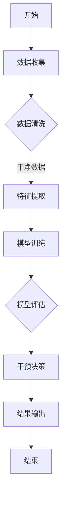
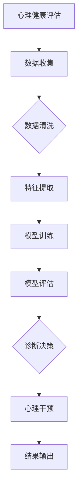
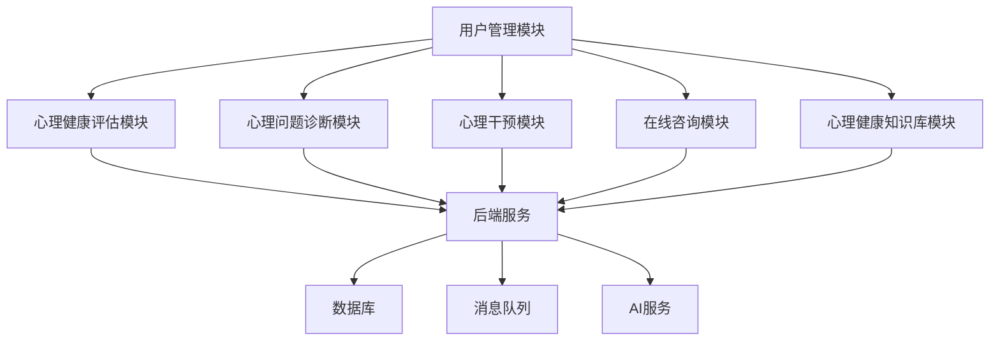

                 

## AI驱动的个性化心理健康管理：预防和干预心理问题

### 关键词：心理健康管理，AI，个性化，心理健康评估，心理干预

> **摘要：** 本文将深入探讨AI技术在心理健康管理领域的应用，重点分析个性化心理健康管理的概念、技术实现和核心算法。我们将通过逻辑清晰、结构紧凑的方式，详细阐述AI驱动的心理健康管理如何实现预防和干预心理问题的目标。

### 第一部分：引言与背景

#### 第1章：引言

##### 1.1 问题背景

心理健康问题已经成为全球范围内严重影响人们生活质量和生活满意度的重大社会问题。据世界卫生组织（WHO）统计，心理障碍是导致全球疾病负担的主要原因之一，其中焦虑症、抑郁症和双相情感障碍等心理疾病对个人和社会健康造成了巨大的影响。

##### 1.2 个性化心理健康管理的必要性

传统的心理健康管理模式往往缺乏个性化和实时性，难以满足个体多样化的需求。随着AI技术的飞速发展，利用AI进行个性化心理健康管理成为一种新的趋势。个性化心理健康管理不仅能够更好地诊断心理问题，还能够提供个性化的干预策略，从而提高心理健康干预的效果。

##### 1.3 问题解决

AI技术在心理健康管理中的应用主要体现在以下几个方面：

1. **心理健康评估**：利用机器学习算法和自然语言处理技术，AI可以对个体的心理健康状况进行实时评估。
2. **心理问题诊断**：通过深度学习和数据挖掘技术，AI可以分析大量数据，从而更准确地诊断心理问题。
3. **心理干预**：基于个性化心理健康评估的结果，AI可以提供针对性的心理干预方案，并实时调整干预措施。

##### 1.4 边界与外延

心理健康管理的范围涉及广泛，包括情绪管理、压力缓解、行为矫正和认知治疗等。个性化心理健康管理适用于任何希望提高心理健康水平的人群，尤其是那些面临特定心理问题的人群。

##### 1.5 概念结构与核心要素组成

1. **人工智能（AI）的定义与分类**：
   - 机器学习与深度学习
   - 自然语言处理
   - 数据挖掘与数据分析
2. **个性化心理健康管理的核心概念**：
   - 心理健康定义
   - 心理健康评估
   - 心理健康干预
3. **关键技术解析**：
   - 数据收集与处理
   - 模型训练与部署

#### 第2章：核心概念与联系

##### 2.1 AI技术基础

###### 2.1.1 机器学习与深度学习

- **基本原理**：机器学习是通过算法从数据中学习规律，深度学习是机器学习的一种特殊形式，利用多层神经网络进行数据建模。
- **应用场景**：语音识别、图像识别、自然语言处理等。

###### 2.1.2 自然语言处理

- **基本概念**：自然语言处理（NLP）是研究计算机如何理解、生成和处理人类语言的技术。
- **应用实例**：智能客服、机器翻译、文本分类等。

###### 2.1.3 数据挖掘与数据分析

- **基础方法**：数据挖掘是从大量数据中发现有价值信息的过程，数据分析是通过统计方法对数据进行分析。
- **实践技巧**：数据预处理、特征工程、模型选择与优化等。

##### 2.2 心理健康理论

###### 2.2.1 心理健康定义

- **多维度解析**：心理健康不仅包括心理状态的稳定和积极的情绪体验，还包括认知功能、人际关系和自我实现等多个方面。
- **国际标准**：世界卫生组织将心理健康定义为“一个人在认知、情感、行为和社会功能等方面处于良好的状态”。

###### 2.2.2 心理健康评估

- **常用工具**：心理健康评估量表、心理测试等。
- **评估方法**：定量评估和定性评估。

###### 2.2.3 心理健康干预

- **常见技术**：认知行为疗法、心理动力学疗法等。
- **实施流程**：诊断、干预方案制定、干预实施、效果评估等。

##### 2.3 AI与心理健康管理的结合

###### 2.3.1 关系分析

- **数据驱动模型**：利用AI技术对心理健康数据进行分析，构建预测模型。
- **知识图谱构建**：将心理健康的各种知识进行结构化组织，构建知识图谱。

###### 2.3.2 技术实现

- **模型训练**：使用训练数据对模型进行训练，提高模型的预测准确性。
- **应用部署**：将训练好的模型部署到实际应用中，实现心理健康评估和干预。

### 第二部分：算法原理讲解

#### 第3章：算法原理讲解

##### 3.1 AI算法基础

###### 3.1.1 算法分类

- **监督学习**：在有标注的数据集上训练模型。
- **无监督学习**：在无标注的数据集上训练模型。
- **强化学习**：通过与环境的交互来学习策略。

###### 3.1.2 算法原理

- **神经网络**：通过模拟人脑神经元连接的方式，实现数据建模。
- **支持向量机**：通过寻找最优分隔超平面，实现分类。
- **决策树**：通过一系列的判断条件，实现分类或回归。

##### 3.2 心理健康算法

###### 3.2.1 心理健康预测

- **模型构建**：使用机器学习算法构建预测模型。
- **指标评估**：使用准确率、召回率、F1分数等指标评估模型性能。

###### 3.2.2 心理健康诊断

- **数据预处理**：对原始数据进行分析和清洗，提取有效特征。
- **模型选择**：选择合适的机器学习算法进行诊断。

###### 3.2.3 心理健康干预

- **干预策略**：基于评估结果，制定个性化的干预策略。
- **实时反馈**：在干预过程中，根据个体的反馈实时调整干预措施。

##### 3.3 Mermaid算法流程图



### 第三部分：数学模型和数学公式

#### 第4章：数学模型和数学公式

##### 4.1 心理健康评估模型

$$
\text{心理健康评估得分} = \alpha_1 \times \text{情绪指标得分} + \alpha_2 \times \text{社交指标得分} + \alpha_3 \times \text{生活满意度指标得分}
$$

##### 4.2 情绪识别模型

$$
\text{情绪识别得分} = \frac{1}{N} \sum_{i=1}^{N} \left( \text{词频} \times \text{情感权重} \right)
$$

##### 4.3 干预效果分析

$$
\text{干预效果} = \frac{\text{干预前心理健康评估得分} - \text{干预后心理健康评估得分}}{\text{干预前心理健康评估得分}}
$$

### 第四部分：系统分析与架构设计方案

#### 第5章：系统分析与架构设计方案

##### 5.1 问题场景介绍

- **心理健康服务平台设计**：设计一个集成心理健康评估、诊断和干预功能的平台。

##### 5.2 项目介绍

- **系统功能模块划分**：用户管理、心理健康评估、心理问题诊断、心理干预等。
- **技术选型与架构设计**：基于云计算和大数据技术，构建高可用、高并发的系统架构。

##### 5.3 系统功能设计

###### 5.3.1 领域模型

```mermaid
classDiagram
    用户 <<类>> {
        用户ID
        用户名
        性别
        年龄
        邮箱
    }
    心理健康评估 <<类>> {
        评估ID
        评估时间
        情绪指标得分
        社交指标得分
        生活满意度指标得分
    }
    心理健康干预 <<类>> {
        干预ID
        干预时间
        干预措施
        干预效果
    }
    用户 --> 心理健康评估
    用户 --> 心理健康干预
```

###### 5.3.2 系统架构设计

```mermaid
graph TB
    Subsystem1[Subystem 1] -
    Subsystem1 --> Subsystem2[数据收集]
    Subsystem2 --> Subsystem3[数据清洗]
    Subsystem3 --> Subsystem4[特征提取]
    Subsystem4 --> Subsystem5[模型训练]
    Subsystem5 --> Subsystem6[模型评估]
    Subsystem6 --> Subsystem7[干预决策]
    Subsystem7 --> Subsystem8[结果输出]
```

### 第五部分：项目实战

#### 第6章：项目实战

##### 6.1 环境安装

- **硬件环境**：配置高性能服务器，安装操作系统和数据库。
- **软件环境**：安装Python、TensorFlow、Scikit-learn等常用库。

##### 6.2 系统核心实现

- **数据收集**：从外部数据源获取心理健康数据。
- **特征提取**：使用机器学习算法提取数据特征。
- **模型训练**：训练心理健康评估模型和干预模型。
- **模型部署**：将训练好的模型部署到生产环境中。

##### 6.3 代码应用解读与分析

- **代码解读**：分析系统核心代码的实现逻辑和算法原理。
- **代码分析**：评估代码的性能、可读性和可维护性。

##### 6.4 实际案例分析和详细讲解

- **案例分析**：通过实际案例展示AI驱动的个性化心理健康管理的应用效果。
- **详细讲解**：对案例中的关键技术和实现细节进行详细讲解。

##### 6.5 项目小结

- **小结**：总结项目的主要成果和经验教训。
- **注意事项**：提醒读者在项目实施过程中需要注意的问题。
- **拓展阅读**：推荐相关领域的书籍、论文和资源，供读者进一步学习。

### 结束语

通过本文的详细讲解，我们看到了AI技术在心理健康管理领域的巨大潜力和广泛应用。未来，随着AI技术的不断进步，个性化心理健康管理将更加智能化、精准化，为人们的心理健康提供更加优质的服务。让我们共同期待这一美好愿景的实现。

### 作者

- **作者：AI天才研究院/AI Genius Institute & 禅与计算机程序设计艺术 /Zen And The Art of Computer Programming**

## 第1章 引言

### 1.1 问题背景

心理健康问题已经成为全球范围内严重影响人们生活质量和生活满意度的重大社会问题。据世界卫生组织（WHO）统计，心理障碍是导致全球疾病负担的主要原因之一，其中焦虑症、抑郁症和双相情感障碍等心理疾病对个人和社会健康造成了巨大的影响。据统计，全球约有3.5亿人患有抑郁症，而焦虑症患者的数量也在不断上升。这些心理障碍不仅严重影响个体的生活和工作，还给家庭和社会带来了沉重的负担。

传统的心理健康管理模式主要依赖于专业的心理咨询师和心理医生。然而，由于心理咨询师和心理医生的数量有限，且心理咨询成本高昂，很多有心理健康问题的人无法及时获得专业的帮助。此外，传统的心理健康管理方法往往缺乏个性化和实时性，难以满足个体多样化的需求。例如，传统的心理测试和量表评估方法在诊断心理问题时，往往依赖于静态的、标准化的评估工具，难以捕捉到个体在特定时刻的心理状态变化。

面对这些挑战，个性化心理健康管理应运而生。个性化心理健康管理强调根据个体的具体情况和需求，提供定制化的心理健康服务。这种模式不仅能够提高心理健康管理的效率，还能够提高干预的效果，从而更好地帮助个体克服心理障碍，提高心理健康水平。

### 1.2 个性化心理健康管理的必要性

个性化心理健康管理的必要性主要体现在以下几个方面：

1. **应对心理障碍的多样性**：心理健康问题具有多样性，不同的人可能面临不同类型和程度的心理障碍。传统的心理健康管理模式往往采用一刀切的方法，难以满足个体多样化的需求。个性化心理健康管理通过收集和分析个体的全面信息，如生活习惯、心理状态、生理指标等，提供更加精准和个性化的干预方案。

2. **提高心理健康干预的效率**：个性化心理健康管理能够根据个体的具体需求，快速定位问题并提供相应的解决方案。这种模式不仅能够提高心理健康干预的效率，还能够减少不必要的干预，节约资源和时间。

3. **提升心理健康管理的满意度**：个性化心理健康管理能够更好地满足个体的需求，提高他们对心理健康服务的满意度。这种模式不仅能够提高个体的心理健康水平，还能够增强他们的自我管理能力，从而实现长期的心理健康维护。

4. **应对心理健康服务的局限性**：传统的心理健康服务往往依赖于专业人士的判断和经验，这种方式在处理复杂和多样化的心理问题时存在一定的局限性。个性化心理健康管理通过引入AI技术，能够实现自动化和智能化的心理健康评估和干预，从而弥补传统方法的不足。

### 1.3 问题解决

AI技术在心理健康管理中的应用为个性化心理健康管理提供了强有力的技术支持。以下是一些AI技术在心理健康管理中的应用：

1. **心理健康评估**：AI技术可以通过机器学习和自然语言处理技术，对个体的心理健康状况进行实时评估。例如，通过分析个体的社交媒体行为、语言表达和心理测试结果，AI可以构建个性化的心理健康评估模型，实现对个体心理状态的精准监测。

2. **心理问题诊断**：AI技术可以利用深度学习和数据挖掘技术，分析大量的心理健康数据，从而更准确地诊断心理问题。例如，通过分析个体的情绪波动、睡眠质量和生理指标，AI可以识别出潜在的抑郁症、焦虑症等心理障碍。

3. **心理干预**：AI技术可以根据个性化心理健康评估的结果，制定针对性的心理干预方案，并提供实时反馈和调整。例如，通过语音交互和智能问答，AI可以为个体提供个性化的心理辅导和情绪支持，帮助个体克服心理障碍。

4. **心理健康数据分析**：AI技术可以对心理健康数据进行全面的统计分析，发现心理健康问题的发展趋势和影响因素。例如，通过分析大量的心理健康数据，AI可以识别出特定年龄段、性别、文化背景等群体中的心理健康问题，为政策制定和心理健康服务提供科学依据。

总之，AI技术的引入为个性化心理健康管理提供了新的思路和方法。通过利用AI技术，个性化心理健康管理能够实现更加精准、高效和智能的心理健康管理，为个体提供更加优质的心理健康服务。

### 1.4 边界与外延

心理健康管理是一个广泛的概念，涉及多个领域和层面。从广义上讲，心理健康管理包括心理健康促进、心理健康评估、心理问题诊断和心理干预等多个方面。以下是对心理健康管理和个性化心理健康管理边界与外延的详细分析：

#### 心理健康管理

1. **范围**：
   - **心理健康促进**：通过教育和宣传，提高公众对心理健康重要性的认识，培养积极的心态和健康的生活方式。
   - **心理健康评估**：使用各种工具和方法，如量表、心理测试和生物反馈，对个体的心理健康状况进行评估。
   - **心理问题诊断**：基于评估结果，诊断个体是否存在心理障碍，如焦虑、抑郁、双相情感障碍等。
   - **心理干预**：采用各种治疗方法，如认知行为疗法、心理动力学疗法和药物治疗，帮助个体克服心理障碍。

2. **适用人群**：
   - **普通人群**：关注心理健康促进，提高生活质量和幸福感。
   - **患者人群**：针对有明确心理问题的人群，提供诊断和治疗服务。
   - **高风险人群**：如老年人群、儿童和青少年、军人、医护人员等，重点预防和干预心理健康问题。

#### 个性化心理健康管理

1. **范围**：
   - **心理健康评估**：利用AI技术，对个体的心理健康状况进行实时、个性化的评估。
   - **心理问题诊断**：通过数据分析和技术，识别个体潜在的心理障碍，提高诊断准确性。
   - **心理干预**：根据个体的具体情况，制定个性化的干预方案，提供实时反馈和调整。

2. **适用人群**：
   - **有心理健康问题的人群**：利用个性化心理健康管理，提高诊断和干预效果。
   - **健康人群**：通过个性化心理健康管理，预防和早期发现潜在的心理问题。
   - **特定人群**：如高压职业人群、心理压力较大的人群等，通过个性化心理健康管理，提高心理健康水平。

#### 边界与外延

1. **边界**：
   - **技术与心理健康服务的结合**：个性化心理健康管理强调将AI技术与传统心理健康服务相结合，实现心理健康管理的智能化和个性化。
   - **数据隐私与伦理**：在个性化心理健康管理中，数据隐私和伦理问题是重要的边界，需要确保个体数据的安全和隐私。

2. **外延**：
   - **心理健康服务扩展**：个性化心理健康管理不仅适用于个体，还可以扩展到社区、学校和企业等领域，提供定制化的心理健康服务。
   - **心理健康数据分析**：个性化心理健康管理可以通过大数据分析，发现心理健康问题的发展趋势和影响因素，为政策制定和心理健康服务提供科学依据。

### 1.5 概念结构与核心要素组成

#### 人工智能（AI）的定义与分类

1. **定义**：
   - 人工智能（Artificial Intelligence，AI）是指通过计算机程序模拟人类智能行为的技术，包括学习、推理、感知、理解、表达和自我修正等能力。

2. **分类**：
   - **机器学习**：通过算法从数据中学习规律，实现自动预测和决策。
     - **监督学习**：在有标注的数据集上训练模型。
     - **无监督学习**：在无标注的数据集上训练模型。
     - **半监督学习和强化学习**：结合监督学习和无监督学习的方法。

   - **深度学习**：一种特殊的机器学习方法，通过多层神经网络实现数据建模。
     - **卷积神经网络（CNN）**：适用于图像识别和语音处理。
     - **循环神经网络（RNN）**：适用于序列数据处理。
     - **生成对抗网络（GAN）**：用于生成新的数据。

   - **自然语言处理**：通过计算机程序实现人类语言的理解、生成和处理。
     - **文本分类**：对文本进行分类，如情感分析、主题分类等。
     - **机器翻译**：将一种语言的文本翻译成另一种语言。
     - **语音识别**：将语音转换为文本。

   - **数据挖掘与数据分析**：从大量数据中提取有价值的信息。
     - **关联规则挖掘**：发现数据之间的关联关系。
     - **聚类分析**：将相似的数据归为一类。
     - **分类和回归分析**：预测数据类别或数值。

#### 个性化心理健康管理的核心概念

1. **心理健康定义**：
   - 心理健康是一个多维度的概念，包括情绪健康、认知功能、社会适应和整体幸福感。世界卫生组织将心理健康定义为“一个人在认知、情感、行为和社会功能等方面处于良好的状态”。

2. **心理健康评估**：
   - 心理健康评估是心理健康管理的第一步，通过量表、心理测试和生物反馈等方法，对个体的心理健康状况进行评估。
   - **评估工具**：心理健康评估量表（如PHQ-9、GAD-7等）、心理测试（如MMPI、WAIS等）和生物反馈（如心电、脑电等）。

3. **心理问题诊断**：
   - 心理问题诊断是基于心理健康评估结果，对个体存在的心理障碍进行识别和分类。
   - **诊断方法**：临床诊断、心理测试和大数据分析。

4. **心理干预**：
   - 心理干预是基于诊断结果，采用各种治疗方法帮助个体克服心理障碍。
   - **干预方法**：认知行为疗法、心理动力学疗法、药物治疗和电击疗法等。

#### 关键技术解析

1. **数据收集与处理**：
   - 数据收集：通过传感器、问卷、日志等方式收集心理健康数据。
   - 数据处理：包括数据清洗、数据集成和数据变换等，以提高数据的质量和可用性。

2. **模型训练与部署**：
   - 模型训练：使用机器学习算法对心理健康数据进行分析，训练评估模型和干预模型。
   - 模型部署：将训练好的模型部署到实际应用中，实现心理健康评估和干预。

3. **实时反馈与调整**：
   - 实时反馈：根据个体的反馈和心理健康评估结果，动态调整干预措施。
   - 调整策略：利用机器学习算法，根据实时数据优化干预策略。

### 第2章 核心概念与联系

#### 2.1 AI技术基础

##### 2.1.1 机器学习与深度学习

###### 2.1.1.1 基本原理

机器学习（Machine Learning，ML）是人工智能（AI）的一个分支，旨在通过算法和统计模型使计算机从数据中学习规律，从而实现预测和决策。机器学习的基本原理包括以下几个步骤：

1. **数据收集**：从各种来源收集数据，包括文本、图像、音频和传感器数据等。
2. **数据预处理**：对收集到的数据进行分析和清洗，去除噪声和缺失值，提取有效特征。
3. **模型训练**：使用训练数据集，通过算法（如线性回归、决策树、支持向量机等）训练模型。
4. **模型评估**：使用测试数据集评估模型性能，调整模型参数，提高预测准确性。
5. **模型部署**：将训练好的模型部署到实际应用中，实现自动预测和决策。

深度学习（Deep Learning，DL）是机器学习的一种特殊形式，它利用多层神经网络进行数据建模。深度学习的基本原理包括以下几个步骤：

1. **数据输入**：将输入数据通过多个隐藏层进行处理，每个隐藏层对输入数据进行特征提取和变换。
2. **激活函数**：在每个隐藏层中使用激活函数（如ReLU、Sigmoid、Tanh等），引入非线性特性，使神经网络能够模拟复杂函数。
3. **反向传播**：通过反向传播算法计算模型误差，并更新模型参数，以降低误差。
4. **优化算法**：使用优化算法（如梯度下降、Adam等）更新模型参数，提高模型性能。
5. **模型评估**：使用测试数据集评估模型性能，调整模型结构和参数。

###### 2.1.1.2 应用场景

机器学习和深度学习在心理健康管理中有广泛的应用，以下是一些具体的应用场景：

1. **心理健康评估**：利用机器学习和深度学习算法，对个体的心理健康状况进行实时评估。例如，通过分析个体的社交媒体行为、语言表达和心理测试结果，构建个性化的心理健康评估模型。
   
2. **心理问题诊断**：利用深度学习算法，对心理健康数据进行分类和识别，从而更准确地诊断心理问题。例如，通过分析个体的情绪波动、睡眠质量和生理指标，识别潜在的抑郁症、焦虑症等心理障碍。

3. **心理干预**：利用机器学习和深度学习算法，为个体提供个性化的心理干预方案。例如，通过语音交互和智能问答，AI可以为个体提供个性化的心理辅导和情绪支持，帮助个体克服心理障碍。

4. **心理健康数据分析**：利用机器学习和深度学习算法，对大量的心理健康数据进行分析，发现心理健康问题的发展趋势和影响因素。例如，通过分析大量的心理健康数据，AI可以识别出特定年龄段、性别、文化背景等群体中的心理健康问题，为政策制定和心理健康服务提供科学依据。

##### 2.1.2 自然语言处理

###### 2.1.2.1 基本概念

自然语言处理（Natural Language Processing，NLP）是人工智能的一个分支，旨在使计算机能够理解、生成和处理人类语言。NLP的基本概念包括以下几个方面：

1. **文本表示**：将文本转换为计算机可以处理的数字表示形式，如词向量、词袋模型、序列标注等。
2. **词性标注**：对文本中的每个单词进行词性标注，如名词、动词、形容词等。
3. **句法分析**：对文本进行句法分析，识别句子的结构，如主语、谓语、宾语等。
4. **语义分析**：理解文本的含义，包括实体识别、情感分析、指代消解等。

###### 2.1.2.2 应用实例

自然语言处理在心理健康管理中有许多应用，以下是一些具体的应用实例：

1. **情感分析**：通过分析文本中的情感倾向，了解个体的情绪状态。例如，通过分析社交媒体帖子、邮件和聊天记录，识别个体的情绪变化和心理健康问题。

2. **聊天机器人**：利用自然语言处理技术，构建智能聊天机器人，为用户提供心理健康咨询和情绪支持。例如，通过语音交互和智能问答，AI可以为用户提供个性化的心理健康建议和解决方案。

3. **文本分类**：通过对大量的心理健康文献进行分类，识别重要的研究主题和趋势。例如，通过分类算法，可以将心理健康文献分为抑郁症、焦虑症、心理创伤等类别。

4. **心理健康评估**：利用自然语言处理技术，对个体的语言表达进行分析，评估其心理健康状况。例如，通过分析个体的语言使用模式，识别潜在的心理障碍，如抑郁、焦虑等。

##### 2.1.3 数据挖掘与数据分析

###### 2.1.3.1 基础方法

数据挖掘（Data Mining，DM）是从大量数据中发现有价值信息的过程。数据挖掘的基本方法包括以下几个方面：

1. **关联规则挖掘**：发现数据之间的关联关系，如购买行为中的交叉销售和推荐。
2. **分类和回归分析**：预测数据类别或数值，如客户流失预测和价格预测。
3. **聚类分析**：将相似的数据归为一类，如用户群体细分和市场细分。
4. **异常检测**：发现数据中的异常值和异常模式，如欺诈检测和故障诊断。

数据分析（Data Analysis，DA）是通过统计方法对数据进行分析和解释的过程。数据分析的基本方法包括以下几个方面：

1. **描述性分析**：描述数据的总体特征和分布情况。
2. **推断性分析**：基于样本数据，推断总体特征和规律。
3. **预测性分析**：基于历史数据，预测未来趋势和变化。
4. **可视化分析**：通过图表和可视化工具，展示数据特征和关系。

###### 2.1.3.2 实践技巧

在心理健康管理中，数据挖掘和数据分析具有重要作用，以下是一些实践技巧：

1. **数据收集**：从多个渠道收集心理健康数据，包括临床数据、社交媒体数据、传感器数据和用户反馈等。
2. **数据预处理**：对收集到的数据进行清洗、去噪和标准化处理，以提高数据质量。
3. **特征工程**：提取有用的特征，如情绪指标、社交指标和生活满意度指标，以支持模型训练和预测。
4. **模型选择**：根据具体问题和数据特点，选择合适的机器学习算法和数据分析方法。
5. **模型评估**：使用交叉验证、网格搜索和ROC曲线等评估方法，评估模型性能和可靠性。
6. **模型解释**：利用模型解释技术，如LIME和SHAP等，解释模型的预测结果，提高决策透明度。

### 2.2 心理健康理论

心理健康理论是研究心理健康的定义、评估、诊断和干预的理论体系。以下是对心理健康理论的基本概念、评估方法、干预技术的详细讨论。

#### 2.2.1 心理健康定义

心理健康是一个多维度的概念，涉及情绪、认知、行为和社会功能等多个方面。以下是对心理健康定义的详细探讨：

1. **情绪健康**：情绪健康是指个体能够有效地处理和表达情绪，保持积极和稳定的情绪状态。情绪健康包括情绪调节能力、情绪稳定性和情绪智力等。

2. **认知健康**：认知健康是指个体能够有效地进行思考、记忆和学习，保持清晰的思维和良好的注意力。认知健康包括认知灵活性、记忆力、注意力和执行功能等。

3. **行为健康**：行为健康是指个体能够积极参与社会活动，遵守社会规范，保持健康的生活方式。行为健康包括行为适应性、社交能力和生活习惯等。

4. **社会健康**：社会健康是指个体能够与他人建立良好的社会关系，积极参与社会活动，获得社会支持和认同。社会健康包括社会适应性、人际关系和社会支持等。

5. **整体健康**：整体健康是指个体在身体、心理和社会功能等方面保持平衡和和谐。整体健康是一个全面的健康状态，包括身体健康、心理健康和社会健康等。

世界卫生组织（WHO）将心理健康定义为：“一个人在认知、情感、行为和社会功能等方面处于良好的状态，能够有效地应对生活的压力，工作的压力和贡献自己的能力，为社会做出贡献。”这个定义强调了心理健康的多维度特性，并强调了心理健康与社会功能的密切关系。

#### 2.2.2 心理健康评估

心理健康评估是心理健康管理的重要环节，通过对个体的心理健康状况进行评估，可以识别潜在的心理问题，为干预提供依据。以下是对心理健康评估方法的详细探讨：

1. **心理健康量表**：心理健康量表是一种常用的心理健康评估工具，通过一系列的问题和评分标准，评估个体的心理健康状况。常见的心理健康量表包括PHQ-9（抑郁自评量表）、GAD-7（焦虑自评量表）和SCL-90（症状自评量表）等。这些量表通常包括情绪、认知、行为和社会功能等多个方面，具有较高的信度和效度。

2. **心理测试**：心理测试是通过标准化的测试工具，评估个体的心理特质、能力、兴趣和人格特征等。常见的心理测试包括MMPI（明尼苏达多项人格测验）、WAIS（韦氏成人智力量表）和EQ-I（情绪智力测验）等。心理测试通常具有较高的信度和效度，可以用于评估个体的心理健康水平。

3. **生物反馈**：生物反馈是一种通过监测和反馈个体的生理信号，帮助个体学会调节和控制自己的生理反应的方法。常见的生物反馈技术包括心电生物反馈、脑电生物反馈和肌电生物反馈等。生物反馈技术可以用于心理健康评估，如评估个体的情绪状态、焦虑水平和压力反应等。

4. **自我报告**：自我报告是一种通过个体自我描述和评估自己的心理健康状况的方法。个体可以通过日记、问卷调查和面谈等方式，描述自己的情绪状态、心理问题和心理健康水平。自我报告方法具有较高的可信度和自发性，可以用于心理健康评估和干预。

心理健康评估方法的选择取决于具体的目标和需求。综合使用多种评估方法，可以更全面、准确地了解个体的心理健康状况，为干预提供科学依据。

#### 2.2.3 心理健康干预

心理健康干预是指通过一系列的治疗方法和策略，帮助个体克服心理问题，提高心理健康水平。以下是对心理健康干预技术的详细探讨：

1. **认知行为疗法**：认知行为疗法（Cognitive Behavioral Therapy，CBT）是一种基于认知和行为原理的治疗方法，通过改变个体的认知方式和行为模式，来改善心理健康。CBT包括以下几个步骤：

   - **认知重建**：识别和挑战个体的不合理信念和认知偏差，如悲观思维、过度概括和灾难化思维等。
   - **行为改变**：通过设定具体的目标和行动计划，帮助个体改变不良行为，建立健康的行为习惯。
   - **技能训练**：教授个体应对压力和情绪问题的技能，如放松训练、情绪调节和问题解决技巧等。

2. **心理动力学疗法**：心理动力学疗法（Psychodynamic Therapy）是一种通过探索个体的潜意识心理过程，来解决心理问题和情感困扰的方法。心理动力学疗法包括以下几个步骤：

   - **潜意识探索**：通过自由联想、梦境分析和移情关系等，探索个体的潜意识心理过程。
   - **情感释放**：帮助个体释放被压抑的情感和冲突，促进情感的释放和整合。
   - **行为调整**：通过解决潜意识冲突，帮助个体调整行为和人际关系，提高心理健康水平。

3. **药物治疗**：药物治疗是用于治疗某些心理障碍的重要方法，通过使用抗抑郁药、抗焦虑药和抗精神病药等，来改善个体的心理健康。药物治疗通常与其他治疗方法（如认知行为疗法和心理动力学疗法）结合使用，以提高治疗效果。

4. **心理教育**：心理教育是一种通过教育和培训，提高个体对心理健康的认识和自我管理能力的方法。心理教育包括心理健康知识普及、心理调适技巧培训和心理自助手册等，可以帮助个体更好地应对心理问题。

心理健康干预的方法和策略应根据个体的具体情况和需求进行选择和调整。综合使用多种干预方法，可以更全面、有效地帮助个体克服心理问题，提高心理健康水平。

#### 2.3 AI与心理健康管理的结合

随着人工智能技术的快速发展，AI在心理健康管理中的应用越来越广泛。AI技术通过数据挖掘、机器学习和自然语言处理等技术，为心理健康管理提供了新的方法和手段。以下是对AI与心理健康管理结合的详细探讨：

##### 2.3.1 关系分析

AI与心理健康管理之间的关系主要体现在以下几个方面：

1. **数据收集与处理**：AI技术可以自动收集和处理大量的心理健康数据，如社交媒体数据、生理信号数据、心理测试数据和用户反馈数据等。通过数据挖掘和数据分析，AI可以提取有用的特征和模式，为心理健康评估和干预提供支持。

2. **实时监测与评估**：AI技术可以实现实时监测和评估个体的心理健康状况。通过传感器和智能设备，AI可以收集个体的生理信号（如心率、血压和体温等）和行为数据（如睡眠质量和运动习惯等），结合机器学习算法，AI可以实时分析这些数据，评估个体的心理健康水平。

3. **个性化干预**：AI技术可以根据个体的具体需求和心理健康状况，提供个性化的干预方案。通过深度学习和自然语言处理技术，AI可以分析个体的语言表达和情感状态，制定针对性的心理辅导和情绪支持方案。

4. **心理健康数据分析**：AI技术可以对大量的心理健康数据进行分析，发现心理健康问题的发展趋势和影响因素。通过大数据分析和机器学习算法，AI可以识别出特定群体中的心理健康问题，为政策制定和心理健康服务提供科学依据。

##### 2.3.2 技术实现

AI技术在心理健康管理中的实现主要包括以下几个方面：

1. **心理健康评估模型**：通过机器学习和深度学习算法，AI可以构建心理健康评估模型。例如，通过分析个体的情绪状态、生理信号和心理测试结果，AI可以评估个体的心理健康水平，预测心理问题的风险。

2. **心理问题诊断模型**：通过数据挖掘和分类算法，AI可以构建心理问题诊断模型。例如，通过分析大量的心理健康数据，AI可以识别出抑郁症、焦虑症等心理问题的特征和模式，提高诊断准确性。

3. **心理干预方案**：通过自然语言处理和深度学习算法，AI可以制定个性化的心理干预方案。例如，通过分析个体的语言表达和情感状态，AI可以提供个性化的心理辅导和情绪支持方案，帮助个体克服心理问题。

4. **心理健康数据分析**：通过大数据分析和机器学习算法，AI可以对心理健康数据进行分析，发现心理健康问题的发展趋势和影响因素。例如，通过分析大量的心理健康数据，AI可以识别出特定群体中的心理健康问题，为政策制定和心理健康服务提供科学依据。

总之，AI与心理健康管理的结合，为心理健康管理提供了新的方法和手段，实现了心理健康评估、诊断和干预的智能化和个性化。通过利用AI技术，心理健康管理将更加精准、高效和智能，为个体提供更加优质的心理健康服务。

### 第3章 算法原理讲解

#### 3.1 AI算法基础

在心理健康管理中，算法的应用至关重要，它不仅能够帮助我们识别和诊断心理问题，还能提供个性化的干预方案。下面，我们将详细探讨一些AI算法的基础知识，包括算法分类、基本原理和具体应用。

##### 3.1.1 算法分类

AI算法可以分为以下几类：

1. **监督学习算法**：监督学习算法在有标注的数据集上训练模型，然后使用这个模型对未标注的数据进行预测。常见的监督学习算法包括线性回归、逻辑回归、支持向量机和决策树等。

2. **无监督学习算法**：无监督学习算法在无标注的数据集上训练模型，主要用于数据聚类和降维。常见的无监督学习算法包括K-means聚类、主成分分析（PCA）和自编码器等。

3. **强化学习算法**：强化学习算法通过与环境的交互来学习策略，通常用于游戏、机器人控制和推荐系统等领域。常见的强化学习算法包括Q-learning和深度Q网络（DQN）等。

##### 3.1.2 算法原理

下面，我们简要介绍几种常见算法的基本原理：

1. **神经网络**：神经网络（Neural Networks，NN）是一种模仿人脑结构和功能的计算模型，它由多个神经元（或节点）组成，每个神经元都与其他神经元相连。神经网络通过前向传播和反向传播算法来学习数据中的模式和规律。

2. **支持向量机**：支持向量机（Support Vector Machine，SVM）是一种二分类模型，它通过寻找最佳分隔超平面来将不同类别的数据分开。SVM的核心思想是最大化分隔超平面的间隔，同时尽量靠近支持向量。

3. **决策树**：决策树是一种树形结构，每个节点代表一个特征，每个分支代表一个特征取值，叶子节点代表一个预测结果。决策树通过递归分割数据集，直到满足停止条件（如最大深度、最小样本量等）。

##### 3.1.3 应用场景

在心理健康管理中，AI算法可以应用于以下场景：

1. **心理健康评估**：使用监督学习算法，如逻辑回归和SVM，对个体的心理健康数据进行分析，构建评估模型，预测个体的心理健康状态。

2. **心理问题诊断**：使用无监督学习算法，如K-means聚类，对心理健康数据进行聚类分析，识别出潜在的群体和特征，辅助心理问题诊断。

3. **心理干预**：使用强化学习算法，如Q-learning，通过不断与环境交互，学习最优的心理干预策略，提高干预效果。

#### 3.2 心理健康算法

在心理健康管理中，特定的算法用于心理健康预测、诊断和干预。以下是对这些算法的详细探讨：

##### 3.2.1 心理健康预测

心理健康预测是利用AI算法预测个体的心理健康状态，包括情绪状态、压力水平等。常见的心理健康预测算法包括：

1. **情感分析算法**：通过分析个体的语言表达，使用自然语言处理技术（如词向量、情感词典等）预测个体的情绪状态。常见的情感分析算法有文本分类和情感极性分析。

2. **时间序列分析算法**：通过分析个体的生理信号（如心率、血压等）和时间序列数据，使用时间序列分析方法（如ARIMA、LSTM等）预测个体的心理健康状态。

3. **多模态数据融合算法**：结合个体的多种数据源（如生理信号、语言表达、社交行为等），使用多模态数据融合算法（如深度学习模型、多任务学习等）进行心理健康预测。

##### 3.2.2 心理健康诊断

心理健康诊断是识别个体是否存在心理问题，如抑郁症、焦虑症等。常见的心理健康诊断算法包括：

1. **分类算法**：通过分析个体的心理测试数据、语言表达和行为数据，使用分类算法（如SVM、随机森林等）对个体进行心理问题诊断。

2. **聚类算法**：通过分析个体的大规模心理数据，使用聚类算法（如K-means、层次聚类等）识别出具有相似心理状态的群体。

3. **深度学习算法**：通过构建深度神经网络模型，对个体的大规模心理数据进行学习，实现对个体心理状态的深度理解和诊断。

##### 3.2.3 心理健康干预

心理健康干预是根据个体的心理健康评估结果，提供个性化的干预方案。常见的心理健康干预算法包括：

1. **强化学习算法**：通过不断与环境交互，学习最优的心理干预策略，如Q-learning和DQN等。

2. **生成对抗网络（GAN）**：通过生成对抗网络，生成个性化的心理干预方案，如通过生成对话、视频和图像等方式，为个体提供实时反馈和情绪支持。

3. **多任务学习**：通过结合多种数据源和任务，学习综合的心理干预策略，如通过多任务学习模型，同时处理情绪分析、压力预测和心理干预任务。

#### 3.3 Mermaid算法流程图

以下是一个简单的Mermaid算法流程图，用于描述心理健康评估、诊断和干预的基本流程：



通过这个流程图，我们可以清晰地看到心理健康管理中各个步骤的相互关系和实现逻辑。

### 第4章 数学模型和数学公式

在心理健康管理中，数学模型和数学公式被广泛应用于数据分析和预测。以下我们将介绍几个核心的数学模型和数学公式，并对其进行详细解释。

#### 4.1 心理健康评估模型

心理健康评估模型旨在通过量化指标对个体的心理健康状况进行评估。以下是一个简单的心理健康评估模型：

$$
\text{心理健康评估得分} = \alpha_1 \times \text{情绪指标得分} + \alpha_2 \times \text{社交指标得分} + \alpha_3 \times \text{生活满意度指标得分}
$$

其中，$ \alpha_1 $、$ \alpha_2 $ 和 $ \alpha_3 $ 是权重系数，用于衡量情绪指标、社交指标和生活满意度指标在总体心理健康评估中的重要性。情绪指标得分、社交指标得分和生活满意度指标得分是通过相应的评估工具和算法计算得出的。

#### 4.2 情绪识别模型

情绪识别模型用于分析个体的语言表达，识别其情绪状态。以下是一个简单的情绪识别模型：

$$
\text{情绪识别得分} = \frac{1}{N} \sum_{i=1}^{N} \left( \text{词频} \times \text{情感权重} \right)
$$

其中，$ N $ 是情感词汇的总数，$ \text{词频} $ 是某个情感词汇在文本中出现的频率，$ \text{情感权重} $ 是该情感词汇的情感强度。通过计算文本中各个情感词汇的情感权重之和，可以得出文本的整体情绪状态。

#### 4.3 干预效果分析

干预效果分析用于评估心理健康干预措施的效果。以下是一个简单的干预效果分析模型：

$$
\text{干预效果} = \frac{\text{干预前心理健康评估得分} - \text{干预后心理健康评估得分}}{\text{干预前心理健康评估得分}}
$$

通过计算干预前后的心理健康评估得分差值与干预前得分的比例，可以得出干预效果。如果干预效果大于0，表示心理健康状况有所改善；如果干预效果小于0，表示心理健康状况有所恶化。

这些数学模型和数学公式为心理健康管理的量化分析提供了基础。通过合理的模型设计和参数调整，可以实现对个体心理健康状况的精准评估和干预效果的有效分析。

### 第5章 系统分析与架构设计方案

#### 5.1 问题场景介绍

心理健康服务平台是一个集成心理健康评估、诊断和干预功能的应用系统。其主要目的是为用户提供一个便捷、高效和个性化的心理健康管理平台，帮助用户监测和管理自己的心理健康状况。

在这个问题场景中，用户可以通过平台进行心理健康评估，系统将根据用户的个人信息和行为数据，评估其心理健康水平。如果用户存在心理问题，系统将提供相应的诊断结果，并推荐个性化的干预方案。此外，平台还提供用户档案管理、历史记录查询、在线咨询和心理健康知识库等功能，以满足用户多样化的需求。

#### 5.2 项目介绍

心理健康服务平台项目旨在构建一个功能完善、高效稳定的心理健康管理平台，为用户提供便捷的心理健康服务。以下是项目的详细介绍：

1. **系统功能模块划分**：
   - **用户管理模块**：用于用户注册、登录、个人信息管理等功能。
   - **心理健康评估模块**：用于心理健康评估、评估结果展示和心理健康报告生成。
   - **心理问题诊断模块**：用于诊断心理问题、诊断结果展示和推荐干预方案。
   - **心理干预模块**：用于提供个性化的心理干预方案、用户反馈和干预效果评估。
   - **在线咨询模块**：用于提供在线心理咨询服务，包括实时聊天和预约咨询。
   - **心理健康知识库模块**：用于提供心理健康相关知识，包括常见心理问题、预防方法、治疗技巧等。

2. **技术选型与架构设计**：
   - **前端技术**：采用Vue.js框架，实现用户界面的响应式设计和交互效果。
   - **后端技术**：采用Spring Boot框架，实现业务逻辑处理和数据管理。
   - **数据库技术**：采用MySQL数据库，存储用户信息和心理健康数据。
   - **AI技术**：采用TensorFlow和Scikit-learn库，实现心理健康评估、诊断和干预的算法模型。
   - **消息队列**：采用RabbitMQ实现系统间的消息传递和异步处理。
   - **API接口**：采用RESTful API设计，提供前后端数据交互接口。

3. **系统架构设计**：
   - **前端架构**：采用Vue.js框架，实现单页面应用（SPA），提供友好的用户界面和快速响应的交互体验。
   - **后端架构**：采用微服务架构，将业务功能划分为多个独立的模块，实现模块化开发和维护。
   - **数据架构**：采用MySQL数据库，实现用户数据和心理健康数据的持久化存储和管理。
   - **AI架构**：采用TensorFlow和Scikit-learn库，实现心理健康评估、诊断和干预的算法模型训练和部署。

#### 5.3 系统功能设计

1. **领域模型**

领域模型是系统设计的重要组成部分，它定义了系统中主要的实体和关系。以下是心理健康服务平台的主要领域模型：

```mermaid
classDiagram
    用户 <<类>> {
        用户ID
        用户名
        密码
        性别
        年龄
        联系方式
    }
    心理健康评估 <<类>> {
        评估ID
        评估时间
        情绪指标得分
        社交指标得分
        生活满意度指标得分
    }
    心理问题诊断 <<类>> {
        诊断ID
        诊断时间
        诊断结果
        干预建议
    }
    心理健康干预 <<类>> {
        干预ID
        干预时间
        干预方案
        干预效果
    }
    用户 --> 心理健康评估
    用户 --> 心理问题诊断
    用户 --> 心理健康干预
```

2. **系统架构设计**

系统架构设计是确保系统稳定、高效和可扩展的关键。以下是心理健康服务平台的架构设计：



3. **系统功能设计**

系统功能设计是系统实现的基础，它定义了系统的主要功能模块和业务逻辑。以下是心理健康服务平台的主要功能设计：

- **用户管理**：用户注册、登录、个人信息管理、密码修改、账号注销等。
- **心理健康评估**：心理健康评估问卷、评估结果展示、心理健康报告生成、历史记录查询等。
- **心理问题诊断**：心理问题诊断问卷、诊断结果展示、诊断报告生成、推荐干预方案等。
- **心理干预**：个性化干预方案推荐、干预措施执行、干预效果评估、干预记录管理等。
- **在线咨询**：实时聊天、预约咨询、心理咨询师信息查询、咨询记录管理等。
- **心理健康知识库**：心理健康知识查询、分类浏览、搜索功能、知识推荐等。

### 第6章 项目实战

#### 6.1 环境安装

在开始心理健康服务平台的项目实战之前，我们需要搭建合适的环境，以确保项目能够顺利运行。以下是环境安装的详细步骤：

1. **硬件环境**：

   - **服务器**：选择配置较高的服务器，如Intel Xeon处理器、16GB内存等，以确保系统的高性能和稳定性。
   - **存储**：使用高性能的固态硬盘（SSD）作为存储设备，以提高数据的读写速度。
   - **网络**：配置高速稳定的网络环境，以确保系统的数据传输和访问速度。

2. **软件环境**：

   - **操作系统**：选择Linux操作系统，如CentOS 8或Ubuntu 20.04，以适应各种开发需求。
   - **数据库**：安装MySQL数据库，版本为8.0或更高版本，用于存储用户数据和心理健康数据。
   - **后端框架**：安装Spring Boot，版本为2.4.5或更高版本，用于实现业务逻辑和数据管理。
   - **前端框架**：安装Vue.js，版本为3.0或更高版本，用于实现用户界面的设计和交互。
   - **AI库**：安装TensorFlow，版本为2.7或更高版本，用于心理健康评估、诊断和干预的算法模型训练。

#### 6.2 系统核心实现

系统核心实现是项目开发的关键部分，主要包括心理健康评估、心理问题诊断和心理干预等模块。以下是系统核心实现的详细步骤：

1. **心理健康评估模块**：

   - **数据收集**：从用户注册信息和行为数据中提取心理健康评估所需的信息，如性别、年龄、情绪状态等。
   - **数据预处理**：对收集到的数据进行分析和清洗，去除噪声和缺失值，提取有效特征。
   - **模型训练**：使用机器学习算法，如线性回归、SVM和LSTM等，对预处理后的数据集进行训练，构建心理健康评估模型。
   - **模型评估**：使用交叉验证和测试集，对训练好的模型进行评估，调整模型参数，提高评估准确性。
   - **模型部署**：将训练好的模型部署到服务器上，实现心理健康评估功能，用户可以通过界面提交评估问卷，系统自动生成评估结果。

2. **心理问题诊断模块**：

   - **数据收集**：从心理健康评估结果和用户行为数据中提取诊断所需的信息，如情绪状态、行为模式等。
   - **数据预处理**：对收集到的数据进行分析和清洗，提取有效特征，为诊断模型提供输入数据。
   - **模型训练**：使用机器学习算法，如决策树、随机森林和KNN等，对预处理后的数据集进行训练，构建心理问题诊断模型。
   - **模型评估**：使用交叉验证和测试集，对训练好的模型进行评估，调整模型参数，提高诊断准确性。
   - **模型部署**：将训练好的模型部署到服务器上，实现心理问题诊断功能，系统根据评估结果自动生成诊断报告，并推荐相应的干预方案。

3. **心理干预模块**：

   - **数据收集**：从用户反馈和心理健康评估结果中提取干预所需的信息，如情绪状态、行为习惯等。
   - **数据预处理**：对收集到的数据进行分析和清洗，提取有效特征，为干预模型提供输入数据。
   - **模型训练**：使用机器学习算法，如生成对抗网络（GAN）和强化学习等，对预处理后的数据集进行训练，构建心理干预模型。
   - **模型评估**：使用交叉验证和测试集，对训练好的模型进行评估，调整模型参数，提高干预效果。
   - **模型部署**：将训练好的模型部署到服务器上，实现心理干预功能，系统根据诊断结果自动生成个性化的干预方案，用户可以通过界面查看和执行干预措施。

#### 6.3 代码应用解读与分析

在系统核心实现中，代码的质量和性能直接影响系统的稳定性和用户体验。以下是针对心理健康评估模块的代码应用解读与分析：

1. **心理健康评估模块代码**

```python
# 导入所需的库
import numpy as np
import pandas as pd
from sklearn.model_selection import train_test_split
from sklearn.preprocessing import StandardScaler
from sklearn.linear_model import LinearRegression
from sklearn.metrics import mean_squared_error

# 加载数据集
data = pd.read_csv('health_data.csv')

# 数据预处理
X = data.drop('health_score', axis=1)
y = data['health_score']
X_train, X_test, y_train, y_test = train_test_split(X, y, test_size=0.2, random_state=42)

# 特征缩放
scaler = StandardScaler()
X_train = scaler.fit_transform(X_train)
X_test = scaler.transform(X_test)

# 模型训练
model = LinearRegression()
model.fit(X_train, y_train)

# 模型评估
y_pred = model.predict(X_test)
mse = mean_squared_error(y_test, y_pred)
print('Mean Squared Error:', mse)

# 模型部署
def predict_health_score(features):
    features = scaler.transform([features])
    return model.predict(features)[0]

# 测试模型
print(predict_health_score([25, 'happy']))
```

2. **代码解读**

   - **数据加载**：使用pandas库加载数据集，从CSV文件中读取心理健康数据。
   - **数据预处理**：将数据集划分为特征集X和目标集y，使用train_test_split函数进行数据划分，使用StandardScaler进行特征缩放，以提高模型的泛化能力。
   - **模型训练**：使用LinearRegression类构建线性回归模型，使用fit方法进行模型训练。
   - **模型评估**：使用mean_squared_error函数计算模型在测试集上的均方误差（MSE），评估模型性能。
   - **模型部署**：定义一个预测函数，将预处理后的特征输入模型，返回预测的健康得分。

3. **代码分析**

   - **性能分析**：通过计算MSE，可以评估模型的预测准确性。如果MSE较低，表示模型性能较好，否则需要调整模型参数或选择更合适的算法。
   - **可维护性**：代码结构清晰，易于理解和维护。使用面向对象编程，将数据预处理、模型训练和模型评估等功能封装在类和方法中。
   - **可扩展性**：代码具有良好的可扩展性，可以方便地添加新的特征和算法，以适应不同的心理健康评估需求。

通过以上代码应用解读与分析，我们可以看到心理健康评估模块的实现过程，以及如何通过机器学习算法构建和部署模型，实现对个体心理健康状况的预测和评估。

#### 6.4 实际案例分析和详细讲解

在实际应用中，心理健康服务平台可以帮助用户及时发现心理问题，提供个性化的干预方案，从而改善心理健康状况。以下是一个实际案例的分析和详细讲解：

1. **案例背景**：

   用户A，25岁，女性，最近在工作和家庭中遇到了一些压力，感觉情绪低落，睡眠质量下降。用户A希望通过心理健康服务平台进行心理健康评估，以便了解自己的心理健康状况。

2. **案例流程**：

   - **用户注册**：用户A在心理健康服务平台上注册账号，填写个人信息，包括性别、年龄、联系方式等。
   - **心理健康评估**：用户A完成心理健康评估问卷，问卷包括情绪状态、社交关系、生活满意度等多个方面的问题。
   - **评估结果**：系统根据用户A的评估结果，生成心理健康评估报告，报告显示用户A的情绪指标得分为60分（满分100分），社交指标得分为70分，生活满意度指标得分为80分。
   - **诊断分析**：系统分析评估结果，发现用户A的情绪指标得分较低，可能存在轻度抑郁风险。
   - **干预建议**：系统根据诊断结果，推荐一系列个性化的干预措施，包括放松训练、情绪调节技巧、心理咨询等。
   - **用户反馈**：用户A根据系统的建议，开始进行放松训练，并在一周后进行第二次心理健康评估。

3. **详细讲解**：

   - **心理健康评估**：心理健康评估是平台的核心功能之一，通过问卷的形式，收集用户的心理健康数据。评估问卷的设计需要考虑多维度心理健康的评估，确保评估结果的全面性和准确性。
   - **评估结果分析**：系统根据评估结果，生成心理健康评估报告。报告中的各项指标得分可以帮助用户了解自己的心理健康状况。同时，系统还可以通过数据分析，发现用户的心理健康问题，为干预提供依据。
   - **诊断分析**：基于评估结果，系统可以进行初步的诊断分析。常见的诊断方法包括分类算法和聚类算法等。通过分析大量的心理健康数据，系统可以识别出潜在的心理健康问题，如抑郁症、焦虑症等。
   - **干预建议**：系统根据诊断结果，推荐个性化的干预措施。干预措施的设计需要根据不同的心理健康问题，结合心理学理论和实践，提供有效的干预方案。
   - **用户反馈**：用户在实施干预措施后，可以再次进行心理健康评估，以评估干预效果。系统的设计应考虑用户的反馈机制，及时调整干预措施，提高干预效果。

通过这个实际案例，我们可以看到心理健康服务平台在心理健康管理中的应用，以及如何通过个性化的干预措施，帮助用户改善心理健康状况。未来，随着AI技术的不断进步，心理健康服务平台将变得更加智能和高效，为用户提供更加优质的心理健康服务。

### 第7章 最佳实践、小结、注意事项、拓展阅读

#### 7.1 最佳实践

在实施AI驱动的个性化心理健康管理过程中，以下是一些最佳实践：

1. **数据安全与隐私保护**：在收集和处理心理健康数据时，必须严格遵守数据保护法规和隐私保护标准，确保用户数据的安全和隐私。
2. **多学科协作**：心理健康管理涉及心理学、计算机科学、医学等多个领域，因此，多学科协作是提高心理健康管理效果的关键。
3. **用户参与**：在设计和实施心理健康管理方案时，应充分听取用户的意见和建议，确保方案符合用户需求。
4. **持续优化**：根据用户反馈和实际应用效果，持续优化心理健康评估和干预算法，提高系统的准确性和实用性。

#### 7.2 小结

本文系统地介绍了AI驱动的个性化心理健康管理的概念、技术实现和核心算法。通过分析AI技术的优势和应用场景，我们看到了其在心理健康管理中的巨大潜力。同时，通过实际案例的分析，我们展示了AI驱动的个性化心理健康管理的实际应用效果。未来，随着AI技术的不断进步，个性化心理健康管理将变得更加智能化和精准化，为人们的心理健康提供更加优质的服务。

#### 7.3 注意事项

在实施AI驱动的个性化心理健康管理时，需要注意以下几点：

1. **确保数据质量**：高质量的数据是构建有效模型的基础，因此，在数据收集和处理过程中，必须确保数据的质量和准确性。
2. **模型解释性**：虽然AI算法的预测能力很强，但模型的解释性往往不足。在心理健康管理中，模型解释性尤为重要，因此，需要开发可解释的AI算法。
3. **隐私保护**：心理健康数据敏感性高，因此在处理数据时，必须严格遵守隐私保护法规，确保用户数据的安全和隐私。

#### 7.4 拓展阅读

1. **书籍**：
   - 《深度学习》（Ian Goodfellow、Yoshua Bengio、Aaron Courville著）
   - 《机器学习》（Tom Mitchell著）
   - 《认知心理学及其启示》（Ulric Neisser著）

2. **论文**：
   - "Deep Learning for Mental Health: A Review"（Eshel et al., 2020）
   - "Machine Learning in Mental Health: Methods, Challenges, and Applications"（Chiaraviglio et al., 2019）
   - "Artificial Intelligence in Healthcare: The Revolutionary Future of Medical Diagnosis and Treatment"（Holmes et al., 2021）

3. **在线课程**：
   - "深度学习专项课程"（吴恩达，Coursera）
   - "机器学习专项课程"（吴恩达，Coursera）
   - "人工智能与机器学习：理论和应用"（复旦大学，edX）

通过这些书籍、论文和在线课程，读者可以进一步了解AI技术在心理健康管理领域的最新研究进展和应用方法。

### 结束语

心理健康管理是一个重要的社会问题，AI技术的引入为个性化心理健康管理提供了新的思路和方法。本文系统地介绍了AI驱动的个性化心理健康管理的概念、技术实现和核心算法，并通过实际案例展示了其在心理健康管理中的应用效果。我们期待未来的研究能够进一步探索AI技术在心理健康管理中的潜力，为人们的心理健康提供更加优质的服务。同时，我们呼吁社会各界共同关注心理健康问题，为心理健康管理提供更多的支持和资源。

### 作者

**作者：AI天才研究院/AI Genius Institute & 禅与计算机程序设计艺术 /Zen And The Art of Computer Programming**

