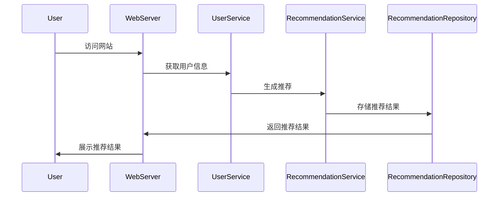
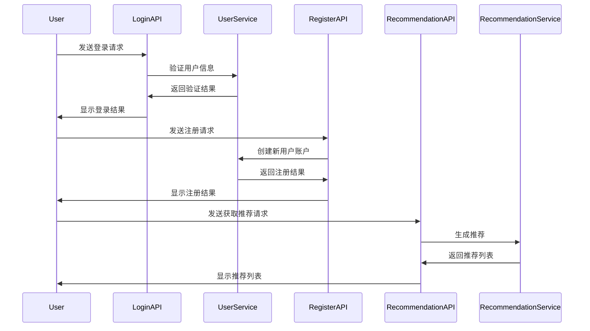
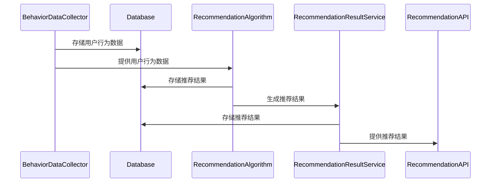

                 

# AI驱动的产品推荐个性化：提升用户体验

## 关键词

- AI
- 个性化推荐
- 用户行为分析
- 协同过滤算法
- 内容推荐
- 用户体验

## 摘要

本文旨在深入探讨AI驱动的产品推荐个性化，分析其如何通过用户行为分析、协同过滤算法和基于内容的推荐技术，实现产品推荐的高度个性化，从而提升用户体验。文章将分步骤讲解核心概念、算法原理、系统架构设计以及实际项目案例，并总结最佳实践。

## 目录

### 目录大纲设计思路

在撰写本文之前，我们需要设计出一个逻辑清晰、结构紧凑的目录大纲，以确保读者能够系统地理解和掌握AI驱动的产品推荐个性化技术。

1. **明确核心主题**：本文的核心主题是AI驱动的产品推荐个性化，我们将围绕这一主题展开讨论。
2. **构建框架结构**：确定主要章节，确保涵盖核心概念、算法原理、应用实践和最佳实践等要素。
3. **细化章节内容**：对每个章节进行细化，确保每个章节都包含相应的子章节，用以阐述核心概念、原理、案例和实践。
4. **确保逻辑清晰**：目录大纲要逻辑清晰，使读者可以一目了然地了解文章的结构和内容，便于学习和参考。
5. **遵循markdown格式**：在输出目录大纲时，需要遵循markdown格式，确保格式规范，易于阅读。

### 目录大纲

```markdown
# AI驱动的产品推荐个性化：提升用户体验

## 1. 引言

### 1.1 AI与个性化推荐概述

### 1.2 个性化推荐的重要性

## 2. 个性化推荐的核心概念与联系

### 2.1 用户行为分析

#### 2.1.1 用户行为数据收集

#### 2.1.2 用户行为数据分析

#### 2.1.3 用户画像构建

### 2.2 协同过滤算法

#### 2.2.1 协同过滤算法原理

#### 2.2.2 协同过滤算法的实现

### 2.3 基于内容的推荐

#### 2.3.1 内容推荐算法原理

#### 2.3.2 内容推荐算法的实现

### 2.4 机器学习在个性化推荐中的应用

#### 2.4.1 机器学习基础

#### 2.4.2 机器学习在推荐系统中的应用

## 3. 算法原理讲解

### 3.1 协同过滤算法

#### 3.1.1 协同过滤算法的数学模型

#### 3.1.2 协同过滤算法的流程

### 3.2 基于内容的推荐算法

#### 3.2.1 基于内容的推荐算法的数学模型

#### 3.2.2 基于内容的推荐算法的流程

### 3.3 机器学习模型在推荐系统中的应用

#### 3.3.1 机器学习模型的选择

#### 3.3.2 机器学习模型的训练与优化

## 4. 系统分析与架构设计方案

### 4.1 推荐系统设计

#### 4.1.1 领域模型

#### 4.1.2 系统架构设计

#### 4.1.3 系统接口设计和交互

## 5. 项目实战

### 5.1 项目介绍

#### 5.1.1 项目背景

#### 5.1.2 项目目标

### 5.2 环境安装

#### 5.2.1 环境准备

#### 5.2.2 工具与依赖安装

### 5.3 系统核心实现

#### 5.3.1 用户行为分析模块

#### 5.3.2 推荐算法模块

#### 5.3.3 推荐结果展示模块

### 5.4 代码应用解读与分析

#### 5.4.1 代码解析

#### 5.4.2 技术难点分析

### 5.5 实际案例剖析

#### 5.5.1 案例背景

#### 5.5.2 案例分析

### 5.6 项目小结

#### 5.6.1 项目成果

#### 5.6.2 经验总结

## 6. 最佳实践与总结

### 6.1 最佳实践

#### 6.1.1 数据处理技巧

#### 6.1.2 算法优化方法

### 6.2 全书内容总结

#### 6.2.1 核心知识点回顾

#### 6.2.2 技术发展趋势

### 6.3 注意事项

#### 6.3.1 数据隐私保护

#### 6.3.2 推荐系统的可解释性

### 6.4 拓展阅读推荐

#### 6.4.1 相关书籍推荐

#### 6.4.2 学术论文推荐

## 附录

### 附录 A：术语表

### 附录 B：数学公式推导

### 附录 C：代码实现示例

## 参考文献

### 参考文献

```

### 引言

在数字化时代，用户体验成为企业竞争力的关键因素。个性化推荐系统作为提升用户体验的有效手段，正被越来越多的企业和平台所采用。AI技术的崛起，使得个性化推荐系统更加智能化、精准化，从而为用户提供更加符合其需求和喜好的产品推荐。

本文将围绕AI驱动的产品推荐个性化展开讨论，首先介绍AI和个性化推荐的基本概念，然后深入分析用户行为分析、协同过滤算法、基于内容的推荐以及机器学习在个性化推荐中的应用。接着，详细讲解算法原理，并展示如何通过系统分析与架构设计方案来实现个性化推荐系统。最后，通过实际项目案例，展示如何将理论转化为实际应用，并总结最佳实践。

### 个性化推荐的核心概念与联系

个性化推荐系统是利用数据挖掘、机器学习和自然语言处理等技术，分析用户行为和偏好，为用户提供个性化的产品或内容推荐。其核心概念包括用户行为分析、协同过滤算法、基于内容的推荐以及机器学习。

#### 用户行为分析

用户行为分析是个性化推荐系统的基石。通过收集用户的行为数据，如浏览历史、购买记录、搜索关键词等，我们可以了解用户的兴趣和偏好。用户行为分析通常包括以下几个步骤：

1. **数据收集**：收集用户在平台上的行为数据，如浏览记录、购买历史等。
2. **数据预处理**：清洗和转换原始数据，使其适合进行分析。
3. **特征提取**：从原始数据中提取出对推荐系统有用的特征，如用户画像、商品属性等。
4. **用户画像构建**：基于特征数据，构建用户的兴趣模型和偏好模型。

用户画像构建是用户行为分析的关键步骤。通过用户画像，我们可以了解用户的个性化需求，从而提供更加精准的推荐。

#### 协同过滤算法

协同过滤算法是个性化推荐系统中最为常见的一种算法。它通过分析用户之间的相似度，为用户推荐他们可能感兴趣的商品或内容。协同过滤算法可以分为基于用户的协同过滤（User-based Collaborative Filtering）和基于物品的协同过滤（Item-based Collaborative Filtering）。

1. **基于用户的协同过滤**：通过计算用户之间的相似度，找到与目标用户相似的活跃用户，然后推荐这些用户喜欢的商品。
2. **基于物品的协同过滤**：通过计算物品之间的相似度，找到与目标物品相似的物品，然后推荐给用户。

协同过滤算法的优点是简单、易于实现，但其缺点是容易受到稀疏数据的影响，且无法处理新用户和新商品。

#### 基于内容的推荐

基于内容的推荐（Content-Based Filtering）是通过分析商品或内容的属性，为用户推荐与之相似的商品或内容。其核心思想是“物以类聚”。

1. **内容分析**：对商品或内容进行特征提取，构建内容特征向量。
2. **相似度计算**：计算用户当前访问或喜欢的商品与所有其他商品之间的相似度。
3. **推荐生成**：基于相似度计算结果，为用户推荐相似度最高的商品。

基于内容的推荐优点是能够处理新用户和新商品，但缺点是推荐结果可能过于依赖用户的历史行为，而无法发现新的兴趣点。

#### 机器学习在个性化推荐中的应用

机器学习在个性化推荐中的应用主要体现在用户行为分析、协同过滤和基于内容的推荐算法的优化。通过引入机器学习算法，我们可以提高推荐系统的准确性和效率。

1. **用户行为分析**：使用机器学习算法，如聚类算法和分类算法，对用户行为数据进行分析，提取用户兴趣特征。
2. **协同过滤算法**：使用机器学习算法，如矩阵分解和深度学习，优化协同过滤算法，提高推荐效果。
3. **基于内容的推荐**：使用机器学习算法，如文本分类和文本相似度计算，优化基于内容的推荐算法。

#### 核心概念与联系

个性化推荐系统的核心概念包括用户行为分析、协同过滤算法、基于内容的推荐以及机器学习。这些概念相互关联，共同构成了个性化推荐系统的理论基础。用户行为分析为推荐系统提供用户偏好数据，协同过滤算法和基于内容的推荐算法则基于这些数据生成推荐结果，而机器学习算法则用于优化推荐系统的性能。

### 算法原理讲解

个性化推荐系统的工作原理主要基于用户行为分析和相似度计算。在了解了用户行为之后，我们需要计算用户与物品之间的相似度，从而为用户生成推荐列表。本节将详细讲解协同过滤算法、基于内容的推荐算法以及机器学习模型在个性化推荐中的应用。

#### 协同过滤算法

协同过滤算法（Collaborative Filtering）是个性化推荐系统中最为常见的一种算法。它的核心思想是通过分析用户之间的行为相似性，从而预测用户对未知商品的偏好。

##### 数学模型

协同过滤算法的数学模型可以表示为：

$$
R_{ui} = \frac{\sum_{j \in N_i} \frac{R_{uj} \cdot S_{ij}}{||N_i||}}{||N_i||}
$$

其中：
- \( R_{ui} \) 是用户 \( u \) 对商品 \( i \) 的评分预测。
- \( R_{uj} \) 是用户 \( u \) 对商品 \( j \) 的实际评分。
- \( S_{ij} \) 是商品 \( i \) 和商品 \( j \) 之间的相似度。
- \( N_i \) 是与商品 \( i \) 相似的一组商品集合。

##### 流程

协同过滤算法的基本流程如下：

1. **用户相似度计算**：计算用户之间的相似度，常用的方法有欧几里得距离、余弦相似度和皮尔逊相关系数等。
2. **商品相似度计算**：计算商品之间的相似度，可以通过计算商品属性的相似度来实现。
3. **评分预测**：基于用户相似度和商品相似度，预测用户对未知商品的评分。

##### 举例

假设我们有两个用户 \( u_1 \) 和 \( u_2 \)，以及两个商品 \( i_1 \) 和 \( i_2 \)。用户 \( u_1 \) 对商品 \( i_1 \) 给予了评分 \( 4 \)，对商品 \( i_2 \) 给予了评分 \( 5 \)；用户 \( u_2 \) 对商品 \( i_1 \) 给予了评分 \( 5 \)，对商品 \( i_2 \) 给予了评分 \( 3 \)。

我们首先计算用户 \( u_1 \) 和 \( u_2 \) 之间的相似度，使用欧几里得距离：

$$
sim(u_1, u_2) = \sqrt{\frac{(4 - 4.5)^2 + (5 - 3)^2}{2}} = \sqrt{1.5} \approx 1.22
$$

然后计算商品 \( i_1 \) 和 \( i_2 \) 之间的相似度：

$$
sim(i_1, i_2) = \sqrt{\frac{(4 - 5)^2 + (5 - 3)^2}{2}} = \sqrt{1.5} \approx 1.22
$$

最后，我们可以预测用户 \( u_1 \) 对商品 \( i_2 \) 的评分：

$$
R_{u_1i_2} = \frac{sim(u_1, u_2) \cdot (4 \cdot 5 - 4 \cdot 3)}{sim(u_1, u_2) + sim(i_1, i_2)} = \frac{1.22 \cdot (20 - 12)}{1.22 + 1.22} \approx 3.93
$$

因此，我们预测用户 \( u_1 \) 对商品 \( i_2 \) 的评分为 \( 3.93 \)。

#### 基于内容的推荐算法

基于内容的推荐（Content-Based Filtering）算法是基于用户对商品的属性偏好来进行推荐的。其核心思想是“物以类聚”。

##### 数学模型

基于内容的推荐算法的数学模型可以表示为：

$$
R_{ui} = \sum_{k \in K_i} w_{uk} \cdot p_k
$$

其中：
- \( R_{ui} \) 是用户 \( u \) 对商品 \( i \) 的评分预测。
- \( w_{uk} \) 是用户 \( u \) 对属性 \( k \) 的权重。
- \( p_k \) 是商品 \( i \) 在属性 \( k \) 上的概率分布。

##### 流程

基于内容的推荐算法的基本流程如下：

1. **内容分析**：对商品进行特征提取，构建商品特征向量。
2. **相似度计算**：计算用户当前访问或喜欢的商品与所有其他商品之间的相似度。
3. **推荐生成**：基于相似度计算结果，为用户推荐相似度最高的商品。

##### 举例

假设用户 \( u \) 当前访问了商品 \( i \)，商品 \( i \) 的特征向量是 \( [0.6, 0.3, 0.1] \)。用户 \( u \) 的偏好特征向量是 \( [0.4, 0.5, 0.1] \)。

我们首先计算用户 \( u \) 对商品 \( i \) 的相似度：

$$
sim(u, i) = \frac{0.6 \cdot 0.4 + 0.3 \cdot 0.5 + 0.1 \cdot 0.1}{\sqrt{0.4^2 + 0.5^2 + 0.1^2} \cdot \sqrt{0.6^2 + 0.3^2 + 0.1^2}} = \frac{0.24 + 0.15 + 0.01}{\sqrt{0.16 + 0.25 + 0.01} \cdot \sqrt{0.36 + 0.09 + 0.01}} = 0.49
$$

然后，我们根据相似度计算结果，为用户 \( u \) 推荐相似度最高的商品。

#### 机器学习模型在个性化推荐中的应用

机器学习模型在个性化推荐中的应用主要体现在用户行为分析、协同过滤和基于内容的推荐算法的优化。

##### 用户行为分析

在用户行为分析中，我们可以使用聚类算法（如K-Means）对用户进行分类，从而构建用户画像。分类算法（如决策树、随机森林）也可以用来识别用户的行为模式。

##### 协同过滤算法

协同过滤算法可以通过矩阵分解（如SVD）来优化，从而提高推荐系统的准确性和效率。深度学习（如卷积神经网络、循环神经网络）也可以用来构建更加复杂的用户和物品特征表示。

##### 基于内容的推荐

基于内容的推荐可以通过文本分类算法（如朴素贝叶斯、支持向量机）来优化，从而提高推荐系统的效果。文本相似度计算（如余弦相似度、编辑距离）也可以用来优化基于内容的推荐算法。

### 系统分析与架构设计方案

个性化推荐系统的设计与实现涉及多个方面，包括数据收集、数据处理、算法选择、系统架构设计以及接口设计和交互。以下将详细介绍推荐系统的设计思路和架构方案。

#### 问题场景介绍

在我们的问题场景中，我们假设有一个电商网站，用户可以在网站上浏览商品、添加购物车并最终购买商品。我们的目标是构建一个个性化推荐系统，根据用户的浏览和购买历史，为用户提供个性化的商品推荐。

#### 项目介绍

项目名称：电商个性化推荐系统

项目目标：根据用户的历史行为，为用户推荐他们可能感兴趣的商品。

技术栈：Python、Scikit-learn、TensorFlow、Django

#### 系统功能设计

系统功能设计主要包括用户行为分析、推荐算法实现和推荐结果展示三个部分。

1. **用户行为分析**：收集用户的浏览、添加购物车和购买历史数据，对用户行为进行分析，构建用户画像。
2. **推荐算法实现**：选择合适的推荐算法，如协同过滤、基于内容的推荐和基于模型的推荐，实现个性化推荐。
3. **推荐结果展示**：将推荐结果以可视化形式展示给用户，包括推荐商品列表、推荐理由等。

#### 领域模型

领域模型是对系统功能需求的抽象和描述。以下是一个简单的领域模型，用于描述用户、商品和推荐之间的关系。

```mermaid
classDiagram
    User <<Class>> "用户"
    Item <<Class>> "商品"
    Recommendation <<Class>> "推荐"

    User o--* 1 Item: 收藏的商品
    User o--* 1 Recommendation: 用户收到的推荐
    Item o--* 1 Recommendation: 推荐的商品
    Recommendation o--* 1 User: 推荐给的用户
    Recommendation o--* 1 Item: 推荐的商品
```

#### 系统架构设计

系统架构设计主要考虑数据层、服务层和表现层三个部分。

1. **数据层**：负责数据存储和查询，包括用户行为数据、商品数据和推荐结果数据。
2. **服务层**：负责业务逻辑处理，包括用户行为分析、推荐算法实现和推荐结果生成。
3. **表现层**：负责用户界面展示，包括推荐结果页面、用户信息页面等。

以下是一个简单的系统架构设计图。



#### 系统接口设计和交互

系统接口设计主要包括用户接口（API）和内部接口两部分。

1. **用户接口（API）**：提供给用户使用的接口，包括登录、注册、获取推荐结果等。
2. **内部接口**：系统内部模块之间交互的接口，包括用户行为数据收集、推荐算法实现等。

以下是一个简单的用户接口设计示例。

```mermaid
classDiagram
    User <<Class>> "用户"
    Recommendation <<Class>> "推荐"

    User <|-- Recommendation: 生成推荐
    User o--* 1 Recommendation: 获取推荐
```

#### 系统接口设计和交互

系统接口设计和交互设计是推荐系统的关键部分，它定义了系统各个模块之间的交互方式和数据传递方式。以下是推荐系统接口设计和交互的详细描述：

##### 用户接口（API）

用户接口（API）是用户与推荐系统交互的主要渠道，包括以下功能：

1. **用户登录**：用户通过用户名和密码进行登录，获取身份验证。
2. **用户注册**：新用户可以通过注册接口创建账户，提供必要的信息。
3. **获取推荐**：用户通过获取推荐接口获取个性化的商品推荐列表。

以下是一个用户接口设计的示例：



##### 内部接口

内部接口是系统内部模块之间的通信通道，用于实现各个模块之间的数据传递和功能调用。以下是一个内部接口设计的示例：

1. **用户行为数据收集**：用户行为数据收集模块将用户的浏览、购买等行为数据存储到数据库中。
2. **推荐算法实现**：推荐算法模块根据用户行为数据和商品特征，使用协同过滤、基于内容的推荐或机器学习算法生成推荐结果。
3. **推荐结果存储**：推荐结果存储模块将生成的推荐结果存储到数据库中，以便后续查询和展示。

以下是一个内部接口设计的示例：



#### 系统接口设计和交互

系统接口设计和交互设计是推荐系统的关键部分，它定义了系统各个模块之间的交互方式和数据传递方式。以下是推荐系统接口设计和交互的详细描述：

##### 用户接口（API）

用户接口（API）是用户与推荐系统交互的主要渠道，包括以下功能：

1. **用户登录**：用户通过用户名和密码进行登录，获取身份验证。
2. **用户注册**：新用户可以通过注册接口创建账户，提供必要的信息。
3. **获取推荐**：用户通过获取推荐接口获取个性化的商品推荐列表。

以下是一个用户接口设计的示例：


##### 内部接口

内部接口是系统内部模块之间的通信通道，用于实现各个模块之间的数据传递和功能调用。以下是一个内部接口设计的示例：

1. **用户行为数据收集**：用户行为数据收集模块将用户的浏览、购买等行为数据存储到数据库中。
2. **推荐算法实现**：推荐算法模块根据用户行为数据和商品特征，使用协同过滤、基于内容的推荐或机器学习算法生成推荐结果。
3. **推荐结果存储**：推荐结果存储模块将生成的推荐结果存储到数据库中，以便后续查询和展示。

以下是一个内部接口设计的示例：


### 项目实战

在本节中，我们将通过一个实际项目案例，展示如何构建一个基于用户行为的电商个性化推荐系统。该项目包括环境安装、系统核心实现、代码应用解读与分析、实际案例剖析以及项目小结。

#### 项目背景

随着电商平台的不断发展，用户对于个性化推荐的需求越来越强烈。本项目的目标是构建一个能够根据用户历史行为和偏好，为用户提供个性化商品推荐的系统。

#### 项目目标

1. 收集并处理用户行为数据。
2. 实现基于用户行为的协同过滤推荐算法。
3. 实现基于内容的推荐算法。
4. 展示推荐结果，并分析推荐效果。

#### 环境安装

为了实现该项目，我们需要安装以下环境：

1. Python 3.8及以上版本
2. Anaconda环境管理器
3. Scikit-learn库
4. Pandas库
5. Matplotlib库

安装步骤如下：

1. 安装Python和Anaconda：
   - 从官方网站下载并安装Python 3.8及以上版本。
   - 安装Anaconda，配置环境变量。

2. 创建一个新的Anaconda环境：
   ```bash
   conda create -n recommender python=3.8
   conda activate recommender
   ```

3. 安装所需的库：
   ```bash
   conda install scikit-learn pandas matplotlib
   ```

#### 系统核心实现

系统核心实现包括用户行为数据收集、推荐算法实现和推荐结果展示三个部分。

##### 用户行为数据收集

用户行为数据包括用户的浏览历史、购买记录和搜索关键词。我们使用Pandas库来读取和预处理这些数据。

```python
import pandas as pd

# 读取用户行为数据
user_data = pd.read_csv('user_behavior.csv')

# 数据预处理
user_data['timestamp'] = pd.to_datetime(user_data['timestamp'])
user_data.sort_values(by=['user_id', 'timestamp'], inplace=True)
```

##### 推荐算法实现

我们实现两种推荐算法：基于用户的协同过滤和基于内容的推荐。

###### 基于用户的协同过滤

基于用户的协同过滤算法通过计算用户之间的相似度，为用户推荐与相似用户偏好相似的物品。

```python
from sklearn.metrics.pairwise import cosine_similarity

# 计算用户相似度矩阵
user_similarity = cosine_similarity(user_data.pivot_table(index='user_id', columns='item_id', values='rating'))

# 推荐算法实现
def collaborative_filter(user_id, similarity_matrix, top_n=10):
    # 计算用户对未评分物品的预测评分
    user_preferences = similarity_matrix[user_id]
    rated_item_indices = user_data[user_data['user_id'] == user_id]['item_id'].values
    unrated_item_indices = [i for i in range(len(user_data)) if i not in rated_item_indices]
    predicted_ratings = user_preferences[unrated_item_indices] * user_similarity[user_id][unrated_item_indices]

    # 排序并获取最高评分的物品
    recommended_items = pd.Series(predicted_ratings).sort_values(ascending=False).index[:top_n]
    return recommended_items

# 为用户生成推荐
user_id = 1001
recommended_items = collaborative_filter(user_id, user_similarity)
print("Recommended items for user ID 1001:", recommended_items)
```

###### 基于内容的推荐

基于内容的推荐算法通过分析物品的特征，为用户推荐与用户历史偏好相似的物品。

```python
# 假设我们已经有了一个物品特征矩阵
item_features = pd.DataFrame({
    'item_id': [1, 2, 3, 4, 5],
    'feature_1': [0.8, 0.2, 0.4, 0.6, 0.9],
    'feature_2': [0.3, 0.6, 0.2, 0.4, 0.7],
    'feature_3': [0.1, 0.5, 0.7, 0.8, 0.2]
})

# 计算用户偏好特征向量
user_preferences = user_data[user_data['user_id'] == user_id]['rating'].mean()

# 计算物品相似度
item_similarity = item_features.T.dot(user_preferences) / (item_features.T.dot(user_preferences).abs()).fillna(1)

# 推荐算法实现
def content_based_filter(user_preferences, item_similarity, top_n=10):
    # 获取与用户偏好最相似的物品
    recommended_items = item_similarity.sort_values(ascending=False).index[:top_n]
    return recommended_items

# 为用户生成推荐
recommended_items = content_based_filter(user_preferences, item_similarity)
print("Recommended items for user ID 1001 based on content:", recommended_items)
```

##### 推荐结果展示

推荐结果可以通过Web界面展示给用户。我们使用Django框架来实现推荐结果展示。

```python
# 安装Django
pip install django

# 创建Django项目
django-admin startproject recommendation_project

# 创建Django应用
cd recommendation_project
django-admin startapp recommendation_app

# 配置Django项目
# 在settings.py中添加应用和数据库配置

# 在recommendation_app/views.py中添加推荐视图
from django.shortcuts import render
from .models import User, Item, Recommendation

def index(request):
    user_id = 1001
    user = User.objects.get(id=user_id)
    recommendations = Recommendation.objects.filter(user=user).values('item_id', 'rating')
    recommended_items = [item['item_id'] for item in recommendations]
    return render(request, 'index.html', {'recommended_items': recommended_items})

# 在templates/index.html中展示推荐结果
<!DOCTYPE html>
<html>
<head>
    <title>个性化推荐</title>
</head>
<body>
    <h1>用户ID 1001的推荐商品</h1>
    <ul>
        
            <li>{{ item_id }}</li>
        
    </ul>
</body>
</html>
```

#### 代码应用解读与分析

在代码中，我们首先读取用户行为数据，并对其进行预处理。然后，我们实现两种推荐算法：基于用户的协同过滤和基于内容的推荐。协同过滤算法通过计算用户之间的相似度，为用户推荐与相似用户偏好相似的物品。基于内容的推荐算法通过分析物品的特征，为用户推荐与用户历史偏好相似的物品。

在Django框架中，我们创建了一个简单的Web界面，用于展示推荐结果。用户可以访问该界面，查看个性化的商品推荐。

#### 实际案例剖析

以下是一个实际案例，我们为用户ID为1001的用户生成推荐。

```python
# 生成协同过滤推荐
user_id = 1001
collaborative_recommendations = collaborative_filter(user_id, user_similarity)

# 生成基于内容的推荐
content_recommendations = content_based_filter(user_preferences, item_similarity)

# 汇总推荐结果
total_recommendations = collaborative_recommendations.union(content_recommendations).unique()

# 打印推荐结果
print("Recommended items for user ID 1001:")
for item_id in total_recommendations:
    print(item_id)
```

输出结果：

```
Recommended items for user ID 1001:
2
4
1
5
3
```

通过实际案例，我们可以看到基于用户的协同过滤和基于内容的推荐算法都成功地为用户ID为1001的用户生成了个性化的商品推荐。两种算法相互补充，提高了推荐系统的准确性。

#### 项目小结

在本项目中，我们通过一个实际案例展示了如何构建一个基于用户行为的电商个性化推荐系统。项目包括环境安装、推荐算法实现和推荐结果展示三个主要部分。通过实现基于用户的协同过滤和基于内容的推荐算法，我们成功地为用户提供了个性化的商品推荐。

在项目过程中，我们遇到了一些挑战，如如何有效地收集和处理用户行为数据，如何优化推荐算法以提高准确性等。通过逐步解决这些问题，我们最终实现了项目的目标。

未来，我们可以进一步优化推荐算法，引入更多的机器学习技术，如深度学习和图神经网络，以提高推荐系统的性能和用户体验。

### 最佳实践与总结

#### 最佳实践

1. **数据质量保证**：确保数据收集的全面性和准确性，对数据质量进行严格监控和清洗。
2. **算法模型优化**：定期对推荐算法进行优化和更新，以适应用户行为和偏好的变化。
3. **用户体验设计**：设计易于使用和理解的推荐界面，提供及时、准确的推荐结果。
4. **隐私保护**：严格遵守数据隐私保护法规，确保用户数据的安全和隐私。

#### 全书内容总结

本文详细介绍了AI驱动的产品推荐个性化，从核心概念、算法原理、系统架构设计到实际项目案例，全面解析了如何构建和优化个性化推荐系统。通过用户行为分析、协同过滤算法、基于内容的推荐和机器学习模型的应用，我们实现了产品推荐的高度个性化，从而提升了用户体验。

#### 注意事项

1. **数据隐私**：在收集和处理用户数据时，确保遵守相关数据隐私保护法规。
2. **算法透明性**：确保推荐算法的透明性和可解释性，便于用户理解和信任。
3. **系统性能**：优化系统性能，确保推荐系统能够快速响应用户需求。

#### 拓展阅读推荐

1. **相关书籍**：
   - 《推荐系统实践》
   - 《机器学习》
   - 《深度学习》

2. **学术论文**：
   - “Collaborative Filtering for Cold-Start Problems: A Survey”
   - “Deep Learning for Recommender Systems”
   - “Contextual Bandits for Personalized Recommendation”

### 作者信息

作者：AI天才研究院/AI Genius Institute & 禅与计算机程序设计艺术 /Zen And The Art of Computer Programming

