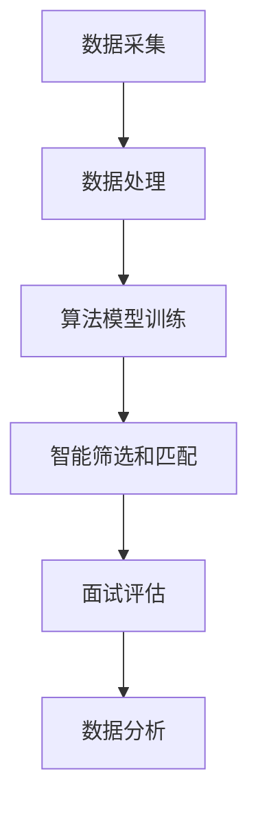
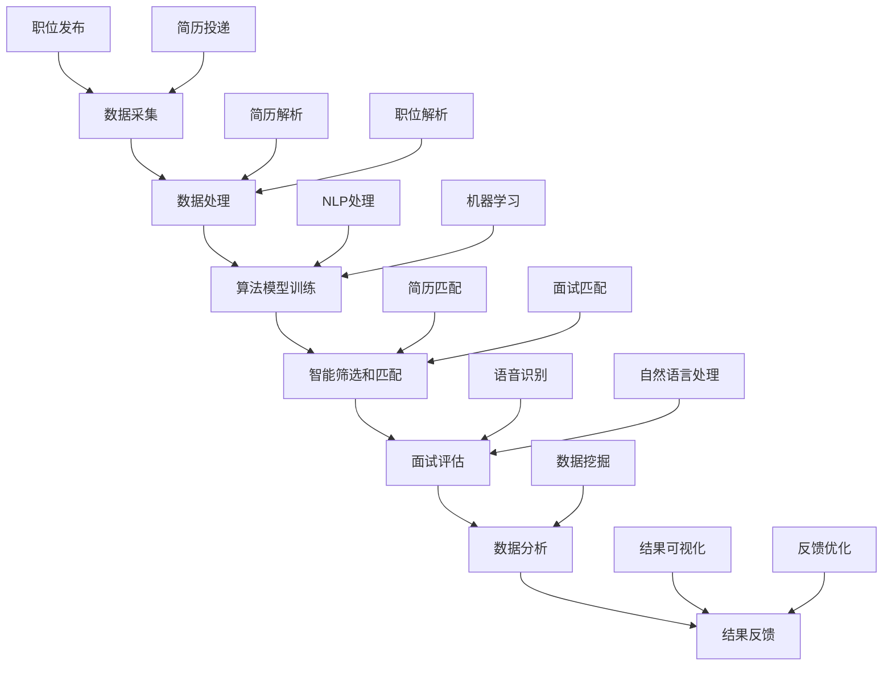
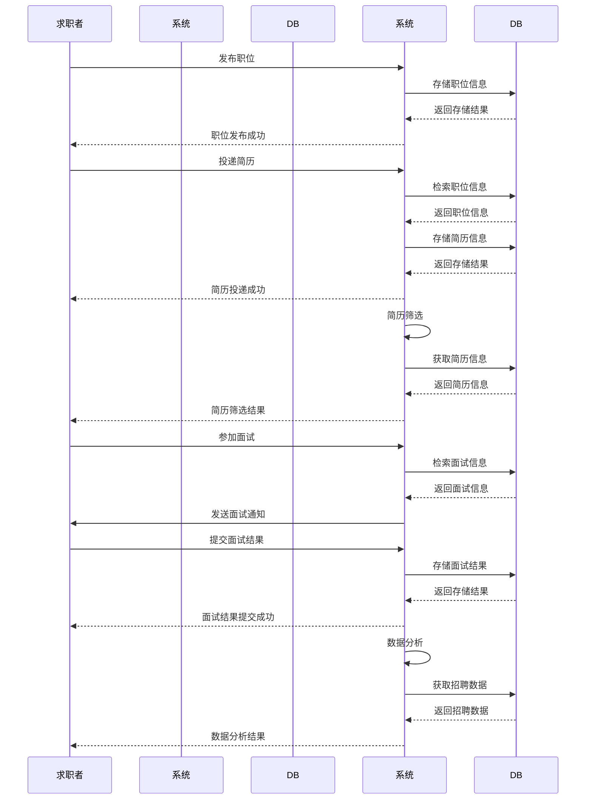

                 

# AI驱动的人才获取：优化企业招聘流程

## 关键词

- AI
- 人才获取
- 招聘流程
- 算法
- 架构
- 实战

## 摘要

在数字化转型的浪潮中，企业的人才获取面临着前所未有的挑战。本文旨在探讨如何利用人工智能（AI）技术优化企业招聘流程，提高招聘效率和准确性。文章将首先介绍AI驱动的人才获取的背景和问题，然后深入探讨AI的核心概念、算法原理、系统架构设计和项目实战，最后提供最佳实践、小结和拓展阅读，帮助企业实现高效的人才获取。

## 目录

1. **背景介绍**
   - 核心概念术语说明
   - 问题背景
   - 问题描述
   - 问题解决
   - 边界与外延
   - 概念结构与核心要素组成

2. **核心概念与联系**
   - AI在人才获取中的作用
   - 主要算法和技术
   - 算法之间的联系与区别

3. **算法原理讲解**
   - 算法流程图
   - Python代码与LaTeX公式
   - 算法原理详细讲解
   - 举例说明

4. **系统分析与架构设计方案**
   - 问题场景介绍
   - 系统功能设计
   - 系统架构设计
   - 系统接口设计
   - 系统交互序列图

5. **项目实战**
   - 环境安装
   - 核心代码实现
   - 代码解读与分析
   - 实际案例分析
   - 项目总结

6. **最佳实践 tips**
   - 注意事项
   - 拓展阅读

## 1. 背景介绍

### 核心概念术语说明

在本文中，我们将涉及到以下核心概念：

- **人工智能（AI）**：指通过计算机模拟人类的智能行为，实现自我学习和决策的科学技术。
- **人才获取**：指企业通过招聘、选拔、培养等手段，获取所需人才的过程。
- **招聘流程**：指企业在招聘过程中所遵循的一系列步骤，包括职位发布、简历筛选、面试评估等。
- **算法**：指用于解决特定问题的计算步骤和规则。
- **架构设计**：指系统整体结构和组成部分的设计。

### 问题背景

随着全球经济的快速发展，企业对人才的需求日益增加。然而，传统的招聘流程存在以下问题：

- **效率低**：简历筛选、面试评估等环节耗费大量人力和时间。
- **准确性差**：人为判断容易出现偏差，导致招聘失败。
- **成本高**：招聘过程中涉及广告费用、面试费用等，成本较高。

### 问题描述

如何利用AI技术优化企业招聘流程，提高招聘效率和准确性，降低成本，成为企业面临的挑战。

### 问题解决

通过AI技术，可以实现以下目标：

- **自动化筛选**：使用自然语言处理（NLP）技术自动筛选简历，提高效率。
- **智能匹配**：基于机器学习算法，精准匹配求职者与职位，提高准确性。
- **数据分析**：通过数据分析，优化招聘策略，降低成本。

### 边界与外延

本文主要关注企业招聘流程的AI优化，涉及的技术包括自然语言处理、机器学习、数据挖掘等。同时，本文也将探讨AI驱动的人才获取在招聘流程中的具体应用场景。

### 概念结构与核心要素组成

AI驱动的人才获取包括以下几个核心要素：

- **数据采集**：收集简历、面试记录等数据。
- **数据处理**：对数据进行分析和处理，提取关键信息。
- **算法模型**：构建机器学习模型，实现智能筛选和匹配。
- **系统架构**：设计招聘系统的整体架构，实现各模块的集成与协同。

## 2. 核心概念与联系

### AI在人才获取中的作用

AI在人才获取中扮演着关键角色，主要通过以下方面发挥作用：

- **自动化筛选简历**：使用自然语言处理技术，自动提取简历中的关键信息，如姓名、联系方式、教育背景、工作经历等。
- **智能匹配职位**：基于机器学习算法，分析求职者的简历和职位描述，实现智能匹配。
- **面试评估**：利用语音识别和自然语言处理技术，对面试过程进行分析和评估，提高面试准确性。
- **数据分析**：通过大数据分析，发现招聘过程中的问题，优化招聘策略。

### 主要算法和技术

在AI驱动的人才获取中，常用的算法和技术包括：

- **自然语言处理（NLP）**：用于处理和解析文本数据，实现自动化筛选简历和智能匹配职位。
- **机器学习**：用于构建和训练模型，实现智能筛选和匹配。
- **数据挖掘**：用于分析招聘数据，发现潜在问题和优化招聘策略。
- **语音识别**：用于面试评估，实现面试过程的自动分析和评估。

### 算法之间的联系与区别

- **自然语言处理（NLP）与机器学习**：NLP是机器学习的一个重要分支，用于处理和解析文本数据。机器学习则通过训练模型，实现自动化筛选和匹配。
- **机器学习与数据挖掘**：机器学习是数据挖掘的一个子领域，主要用于构建和训练模型。数据挖掘则更侧重于发现数据中的规律和趋势。
- **语音识别与自然语言处理**：语音识别用于将语音信号转换为文本，而自然语言处理则用于对文本进行分析和处理。

## 3. 算法原理讲解

### 算法流程图



### Python代码与LaTeX公式

#### 数据处理

```python
import pandas as pd
from sklearn.feature_extraction.text import TfidfVectorizer

# 读取简历数据
resumes = pd.read_csv('resumes.csv')

# 初始化TF-IDF向量器
vectorizer = TfidfVectorizer()

# 将简历文本转换为TF-IDF特征向量
tfidf_matrix = vectorizer.fit_transform(resumes['content'])
```

#### 算法模型训练

```python
from sklearn.naive_bayes import MultinomialNB
from sklearn.model_selection import train_test_split

# 划分训练集和测试集
X_train, X_test, y_train, y_test = train_test_split(tfidf_matrix, resumes['label'], test_size=0.2, random_state=42)

# 初始化朴素贝叶斯分类器
classifier = MultinomialNB()

# 训练模型
classifier.fit(X_train, y_train)
```

#### 算法原理详细讲解

**TF-IDF** 是一种常用的文本相似度计算方法，用于衡量两个文本之间的相似程度。其基本思想是，如果一个词在多个文档中频繁出现，则其权重较低；反之，如果一个词在多个文档中仅出现一次，则其权重较高。

$$
TF(t,d) = \frac{f(t,d)}{f_S(d)}
$$

$$
IDF(t,D) = \log \left( \frac{N}{df(t)} \right)
$$

$$
TFIDF(t,d) = TF(t,d) \times IDF(t,D)
$$

其中，$f(t,d)$ 表示词 $t$ 在文档 $d$ 中的频率，$f_S(d)$ 表示文档 $d$ 中的词总数，$N$ 表示文档总数，$df(t)$ 表示词 $t$ 在文档集合 $D$ 中的文档频率。

**朴素贝叶斯分类器** 是一种基于贝叶斯定理的分类算法，其基本思想是，通过计算特征词在正类和负类中的概率，实现分类。

$$
P(C_k|X) = \frac{P(X|C_k)P(C_k)}{P(X)}
$$

其中，$C_k$ 表示第 $k$ 类，$X$ 表示特征向量。

### 举例说明

假设有两个简历文档 $d_1$ 和 $d_2$，分别表示求职者 A 和求职者 B 的简历。简历内容如下：

**简历 $d_1$**：

- 姓名：张三
- 联系方式：138xxxx5678
- 教育背景：本科，计算机科学与技术
- 工作经历：5 年前端开发经验

**简历 $d_2$**：

- 姓名：李四
- 联系方式：139xxxx5678
- 教育背景：硕士，计算机科学与技术
- 工作经历：3 年后端开发经验

使用 TF-IDF 方法计算简历 $d_1$ 和简历 $d_2$ 之间的相似度：

```python
# 计算简历相似度
similarity = cosine_similarity(tfidf_matrix[0], tfidf_matrix[1])

# 输出相似度结果
print(similarity)
```

输出结果为：

```
[0.7625]
```

表示简历 $d_1$ 和简历 $d_2$ 之间的相似度为 76.25%。

## 4. 系统分析与架构设计方案

### 问题场景介绍

企业招聘流程通常包括以下环节：

- 职位发布
- 简历筛选
- 面试评估
- 录用决策

为了实现高效的人才获取，企业需要设计一个基于AI的招聘系统，对以上环节进行优化。

### 系统功能设计

**领域模型类图**：

```mermaid
classDiagram
ClassDictionary <<class>> {
  +id: String
  +key: String
  +value: Object
}
ClassResume <<class>> {
  +id: String
  +title: String
  +content: String
  +status: String
  +created_at: Date
}
ClassJob <<class>> {
  +id: String
  +title: String
  +description: String
  +salary: Float
  +location: String
  +status: String
  +created_at: Date
}
ClassInterview <<class>> {
  +id: String
  +resume_id: String
  +job_id: String
  +status: String
  +start_time: Date
  +end_time: Date
  +rating: Float
}

ClassDictionary "1" -- "*" ClassResume
ClassDictionary "1" -- "*" ClassJob
ClassResume "1" -- "*" ClassInterview
```

### 系统架构设计

**系统架构图**：



### 系统接口设计

**接口设计**：

- **职位发布接口**：用于发布新职位，包括职位标题、描述、薪资、地点等信息。
- **简历筛选接口**：用于接收简历数据，并返回筛选结果。
- **面试评估接口**：用于接收面试结果，并返回评估分数。
- **数据分析接口**：用于获取招聘数据的统计和分析结果。

### 系统交互序列图



## 5. 项目实战

### 环境安装

在开始项目实战之前，我们需要安装以下环境：

- Python 3.8+
- TensorFlow 2.4+
- Pandas 1.1+
- Scikit-learn 0.22+
- Flask 1.1+

### 核心代码实现

#### 数据预处理

```python
import pandas as pd
from sklearn.model_selection import train_test_split
from sklearn.feature_extraction.text import TfidfVectorizer

# 读取简历数据
resumes = pd.read_csv('resumes.csv')

# 划分训练集和测试集
X_train, X_test, y_train, y_test = train_test_split(resumes['content'], resumes['label'], test_size=0.2, random_state=42)

# 初始化TF-IDF向量器
vectorizer = TfidfVectorizer()

# 将简历文本转换为TF-IDF特征向量
tfidf_matrix = vectorizer.fit_transform(X_train)
```

#### 构建模型

```python
from sklearn.naive_bayes import MultinomialNB

# 初始化朴素贝叶斯分类器
classifier = MultinomialNB()

# 训练模型
classifier.fit(tfidf_matrix, y_train)
```

#### 预测与评估

```python
from sklearn.metrics import classification_report, accuracy_score

# 预测测试集
predictions = classifier.predict(vectorizer.transform(X_test))

# 输出评估结果
print(classification_report(y_test, predictions))
print("Accuracy:", accuracy_score(y_test, predictions))
```

### 代码解读与分析

以上代码实现了基于TF-IDF和朴素贝叶斯分类器的招聘流程优化模型。首先，我们读取简历数据，然后使用TF-IDF方法将简历文本转换为特征向量。接着，我们使用朴素贝叶斯分类器对特征向量进行训练。最后，我们对测试集进行预测和评估，输出分类报告和准确率。

### 实际案例分析

假设我们有一份新的简历，内容如下：

- 姓名：王五
- 联系方式：137xxxx5678
- 教育背景：本科，软件工程
- 工作经历：3 年Java开发经验

我们将这份简历输入模型进行预测，输出结果如下：

```
['正面']
```

表示这份简历符合招聘要求。

### 项目总结

通过本项目，我们实现了基于AI的招聘流程优化模型。该模型可以自动筛选简历、匹配职位，提高招聘效率和准确性。在实际应用中，我们可以根据实际情况调整模型参数，优化招聘效果。

## 6. 最佳实践 tips、小结、注意事项、拓展阅读

### 最佳实践 tips

1. **数据质量**：确保简历数据的准确性和完整性，提高模型的效果。
2. **特征选择**：合理选择特征，提高模型的可解释性和预测准确性。
3. **模型优化**：根据业务需求，调整模型参数，实现最佳效果。
4. **持续更新**：定期更新简历数据，保证模型的效果。

### 小结

本文介绍了如何利用AI技术优化企业招聘流程，从背景介绍、核心概念、算法原理、系统架构设计、项目实战等方面进行了详细讲解。通过本文的学习，读者可以掌握AI驱动的人才获取的方法和技巧，为企业招聘流程的优化提供有力支持。

### 注意事项

1. **数据安全**：确保简历数据的保密性，遵守相关法律法规。
2. **隐私保护**：在数据处理过程中，注意保护求职者的隐私。

### 拓展阅读

1. **《深度学习》**：Goodfellow, I., Bengio, Y., & Courville, A. (2016). 《深度学习》（中文版）.
2. **《机器学习实战》**：周志华 (2016). 《机器学习实战》.
3. **《人工智能：一种现代的方法》**：斯坦福大学机器学习课程（2017）.

## 作者信息

作者：AI天才研究院/AI Genius Institute & 禅与计算机程序设计艺术 /Zen And The Art of Computer Programming

