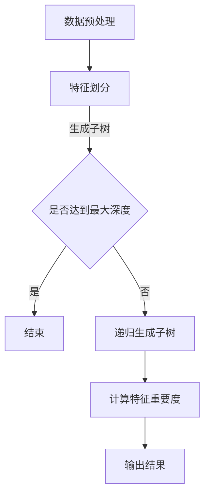
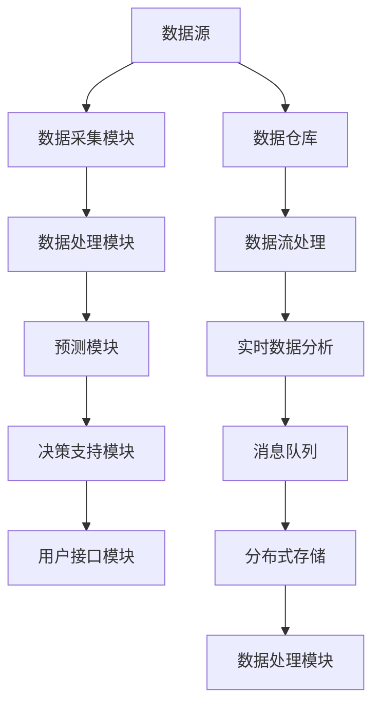

                 

# AI驱动的企业决策支持：增强管理层判断力

关键词：人工智能，企业决策支持，管理层判断力，决策优化，数据分析

摘要：
本文旨在探讨AI驱动的企业决策支持系统如何通过提升管理层判断力来优化企业决策。我们将从背景介绍、核心概念解析、系统架构设计、功能实现及应用案例等多个角度，深入分析AI在企业决策中的作用和实际应用。通过本文，读者将了解AI技术如何帮助企业应对复杂的市场环境，提高决策效率和准确性。

### 目录大纲

第一部分: 引言

## 第1章: 引言

### 1.1 问题背景

### 1.2 问题描述

### 1.3 问题解决

### 1.4 边界与外延

### 1.5 核心概念

### 1.6 概念结构与核心要素组成

第二部分: 核心概念与联系

## 第2章: 核心概念原理

### 2.1 AI驱动的企业决策支持概述

### 2.2 AI驱动的企业决策支持的核心概念

#### 2.2.1 人工智能

#### 2.2.2 企业决策支持系统

#### 2.2.3 AI驱动的企业决策支持系统

### 2.3 概念属性特征对比表格

## 第3章: AI驱动的企业决策支持系统架构

### 3.1 AI驱动的企业决策支持系统概述

### 3.2 AI驱动的企业决策支持系统的架构

#### 3.2.1 硬件架构

#### 3.2.2 软件架构

#### 3.2.3 数据架构

## 第4章: AI驱动的企业决策支持系统功能设计

### 4.1 数据采集与预处理

#### 4.1.1 数据采集

#### 4.1.2 数据预处理

### 4.2 模型训练与优化

#### 4.2.1 模型训练

#### 4.2.2 模型优化

### 4.3 决策支持

#### 4.3.1 决策支持系统的工作流程

#### 4.3.2 决策支持系统的应用场景

### 4.4 结果分析与可视化

#### 4.4.1 结果分析

#### 4.4.2 可视化展示

## 第5章: AI驱动的企业决策支持系统应用

### 5.1 企业管理层判断力的重要性

### 5.2 AI驱动的企业决策支持系统在实际中的应用

#### 5.2.1 案例一：某制造业企业的供应链优化

#### 5.2.2 案例二：某零售企业的销售预测

#### 5.2.3 案例三：某金融服务企业的风险评估

## 第6章: 算法原理讲解

### 6.1 算法概述

### 6.2 算法mermaid流程图

### 6.3 Python源代码

### 6.4 算法原理详细讲解

#### 6.4.1 数学模型

#### 6.4.2 数学公式

#### 6.4.3 举例说明

## 第7章: 数学模型和数学公式 & 详细讲解 & 举例说明

### 7.1 数学模型概述

### 7.2 数学公式的详细讲解

#### 7.2.1 概率论基础

#### 7.2.2 线性代数基础

#### 7.2.3 最优化理论

### 7.3 举例说明

#### 7.3.1 概率论举例

#### 7.3.2 线性代数举例

#### 7.3.3 最优化理论举例

## 第8章: 系统分析与架构设计方案

### 8.1 问题场景介绍

### 8.2 项目介绍

### 8.3 系统功能设计

#### 8.3.1 领域模型

#### 8.3.2 类图

### 8.4 系统架构设计

#### 8.4.1 架构图

#### 8.4.2 系统模块设计

### 8.5 系统接口设计

### 8.6 系统交互设计

## 第9章: 项目实战

### 9.1 环境安装

### 9.2 系统核心实现

### 最佳实践 tips

### 小结

### 注意事项

### 拓展阅读

## 第1章: 引言

### 1.1 问题背景

随着全球商业环境的复杂性和竞争的加剧，企业面临着前所未有的挑战。从市场变化、消费者需求到供应链管理，企业需要处理的信息量巨大且不断增长。在这种背景下，传统的决策方式已无法满足现代企业的需求。管理层需要更快、更准确地做出决策，以应对快速变化的市场环境。

然而，传统的决策过程往往依赖于经验和直觉，这不仅耗时，而且容易受到个人偏见和认知限制的影响。企业需要一个更科学、更有效的决策支持工具来辅助管理层做出更明智的决策。这便引出了AI驱动的企业决策支持系统的概念。

### 1.2 问题描述

企业决策支持系统旨在通过数据分析、模拟和预测等手段，为企业管理层提供有价值的决策信息。但当前的挑战在于：

- 数据来源多样且繁杂，如何有效整合和利用这些数据是一个重要问题。
- 决策过程复杂，涉及多个变量和影响因素，如何准确建模和预测成为关键。
- 管理层对AI技术的理解和接受程度不一，如何确保系统能够被有效利用。

### 1.3 问题解决

AI驱动的企业决策支持系统通过以下几个方面解决上述问题：

- **数据处理与整合**：利用机器学习算法对大量数据进行处理和整合，提取有价值的信息。
- **智能建模与预测**：通过深度学习、回归分析等技术构建复杂的预测模型，提高决策准确性。
- **人机协同**：将AI技术与人类决策者的经验相结合，实现人机协同决策。

### 1.4 边界与外延

虽然AI驱动的企业决策支持系统具有巨大的潜力，但它的应用也受到一些边界条件的限制，例如：

- **数据质量和隐私**：数据的质量和隐私问题可能会影响系统的准确性和可靠性。
- **技术成熟度**：AI技术仍在快速发展中，某些应用场景的技术成熟度可能尚未达到最优。
- **成本与效益**：引入AI驱动的决策支持系统需要一定的投资，企业需要评估其成本和效益。

### 1.5 核心概念

为了更好地理解AI驱动的企业决策支持系统，我们首先需要明确以下几个核心概念：

- **人工智能**：一种模拟人类智能行为的计算技术。
- **企业决策支持系统**：一种利用数据分析技术为企业决策者提供决策依据的系统。
- **AI驱动的企业决策支持系统**：一种结合人工智能和企业决策支持系统技术，通过自动化和智能化的方式辅助企业决策的系统。

### 1.6 概念结构与核心要素组成

AI驱动的企业决策支持系统由以下几个核心要素组成：

- **数据层**：收集、整合和管理企业内外部数据。
- **算法层**：利用机器学习和深度学习技术对数据进行处理和预测。
- **应用层**：将处理结果以可视化、报告等形式呈现给决策者，辅助其做出决策。
- **管理层**：利用系统提供的信息和预测，结合自身经验和直觉，进行最终决策。

### 1.7 总结

AI驱动的企业决策支持系统为企业提供了一个强大的工具，可以帮助管理层更快速、更准确地做出决策。通过本文，我们将深入探讨这一系统的原理、架构和应用，帮助企业更好地应对现代商业环境中的挑战。接下来，我们将进一步解析AI驱动的企业决策支持系统的核心概念，为后续内容打下坚实基础。

## 第2章: 核心概念原理

### 2.1 AI驱动的企业决策支持概述

AI驱动的企业决策支持系统（AI-Driven Enterprise Decision Support System，简称AIDSS）是一种利用人工智能技术，结合大数据分析、机器学习和深度学习算法，为企业提供决策支持和优化建议的系统。它通过自动化的数据处理和预测分析，为企业决策者提供实时、准确、有深度的决策信息，从而提高企业的决策效率和质量。

### 2.2 AI驱动的企业决策支持的核心概念

#### 2.2.1 人工智能

人工智能（Artificial Intelligence，简称AI）是模拟、延伸和扩展人类智能的理论、方法、技术及应用。它通过算法和计算模型实现机器的自我学习和推理能力，使得机器能够完成诸如语音识别、图像处理、自然语言处理等复杂的任务。

##### 1. 概念定义

- **机器学习**：一种人工智能的分支，通过数据驱动的方式，从训练数据中学习规律和模式，从而实现预测和决策。
- **深度学习**：一种基于神经网络的机器学习技术，通过多层网络结构，对大量数据进行自动特征提取和学习。
- **自然语言处理**：使计算机能够理解、生成和处理自然语言的技术。

##### 2. 特点

- **自适应性**：AI系统能够根据新的数据和环境变化，不断优化和调整自己的行为。
- **自动化**：通过算法自动化完成数据处理和预测，降低人力成本。
- **高效性**：利用并行计算和分布式计算技术，快速处理大量数据。

#### 2.2.2 企业决策支持系统

企业决策支持系统（Enterprise Decision Support System，简称EDSS）是一种利用信息技术，特别是数据分析和管理技术，为企业提供决策支持和优化建议的系统。它通过整合企业内外部的数据，利用数据分析、建模和预测等技术，辅助决策者做出更加科学、合理的决策。

##### 1. 概念定义

- **决策支持系统**：一种利用计算机技术和数据分析技术，为决策者提供决策依据和优化建议的系统。
- **企业应用**：广泛应用于企业战略规划、市场营销、供应链管理、财务管理等领域。

##### 2. 特点

- **数据驱动力**：依赖于高质量的数据，通过数据分析和挖掘，提供决策依据。
- **灵活性**：根据不同业务场景，灵活调整分析模型和算法。
- **协同性**：支持决策者之间的协同工作，提高决策效率。

#### 2.2.3 AI驱动的企业决策支持系统

AI驱动的企业决策支持系统（AI-Driven EDSS）是将人工智能技术应用于企业决策支持系统，通过机器学习、深度学习和自然语言处理等技术，实现数据的自动分析和预测，为企业提供更加智能、精准的决策支持。

##### 1. 概念定义

- **AI驱动的EDSS**：将人工智能技术整合到企业决策支持系统中，利用AI算法实现自动化数据分析和预测。

##### 2. 特点

- **智能化**：利用机器学习和深度学习，实现数据的自动化分析和预测。
- **个性化**：根据不同企业和业务场景，提供个性化的决策支持。
- **实时性**：实时处理和分析数据，提供及时、准确的决策信息。

### 2.3 概念属性特征对比表格

为了更好地理解AI驱动的企业决策支持系统的核心概念，我们将其与传统的企业决策支持系统进行对比，如下表所示：

| 概念 | 人工智能 | 企业决策支持系统 | AI驱动的企业决策支持系统 |
| --- | --- | --- | --- |
| **定义** | 模拟、延伸和扩展人类智能 | 利用信息技术，特别是数据分析技术，提供决策支持 | 结合人工智能技术，实现自动化数据分析和预测 |
| **特点** | 自适应性、自动化、高效性 | 数据驱动力、灵活性、协同性 | 智能化、个性化、实时性 |
| **应用** | 语音识别、图像处理、自然语言处理 | 战略规划、市场营销、供应链管理、财务管理 | 企业战略规划、市场营销、供应链管理、财务管理 |

通过对比，我们可以看出，AI驱动的企业决策支持系统在智能化、个性化和实时性方面具有显著优势，能够更好地满足现代企业的决策需求。

### 2.4 概念联系与系统组成

AI驱动的企业决策支持系统由以下几个关键组成部分构成，它们相互联系，共同发挥作用：

- **数据采集与处理**：通过传感器、API接口、数据库等方式，收集企业内外部数据，并进行清洗、转换和整合。
- **算法模型**：利用机器学习、深度学习和自然语言处理等技术，对数据进行分析和建模，生成预测结果。
- **用户界面**：提供直观、易用的界面，将分析结果以图表、报告等形式呈现给用户。
- **决策支持**：结合用户经验和AI系统的预测结果，辅助决策者做出更加科学、合理的决策。

这些组成部分相互配合，形成了一个完整的AI驱动的企业决策支持系统，帮助企业应对复杂的市场环境和决策挑战。

### 2.5 概念结构与核心要素组成

AI驱动的企业决策支持系统的概念结构可以分解为以下几个核心要素：

- **数据层**：包括数据采集、存储和管理，是系统的数据基础。
- **算法层**：利用机器学习和深度学习算法，对数据进行处理和预测，是系统的智能核心。
- **应用层**：将预测结果以图表、报告等形式呈现，为决策者提供直观的决策支持。
- **用户层**：企业管理层利用系统提供的信息和预测，结合自身经验和直觉，进行最终决策。

这些核心要素相互关联，共同构成了一个功能强大、智能化的企业决策支持系统，助力企业提升决策质量和效率。

### 2.6 总结

通过对核心概念原理的详细解析，我们可以看出，AI驱动的企业决策支持系统通过集成人工智能技术，为企业提供了更加智能化、实时化和个性化的决策支持。在接下来的章节中，我们将深入探讨AI驱动的企业决策支持系统的架构设计、功能实现以及实际应用，为企业更好地应对现代商业环境提供有力支持。

## 第3章: AI驱动的企业决策支持系统架构

### 3.1 AI驱动的企业决策支持系统概述

AI驱动的企业决策支持系统（AIDSS）是一种集成了人工智能、机器学习、深度学习等先进技术，通过自动化数据处理和分析，为企业管理层提供决策支持和优化建议的系统。其核心目标是利用数据驱动的方式，辅助决策者快速、准确地做出科学决策，从而提高企业的竞争力和运营效率。

### 3.2 AI驱动的企业决策支持系统的架构

AIDSS的架构设计分为三个主要层次：数据层、算法层和应用层。每一层都有其特定的功能和实现方式，相互协同，共同构建了一个完整的决策支持系统。

#### 3.2.1 硬件架构

硬件架构是AIDSS的基础，决定了系统的计算能力和数据处理能力。一个典型的AIDSS硬件架构通常包括以下几个部分：

- **服务器**：用于处理和分析大量数据，提供强大的计算能力。
- **存储设备**：用于存储企业内部和外部的各种数据，包括结构化和非结构化数据。
- **网络设备**：包括交换机、路由器等，用于数据的传输和通信。
- **数据库系统**：用于高效地管理和查询数据，支持数据的一致性和完整性。

##### 1. 分布式计算

分布式计算是一种利用多台服务器和网络来共同完成计算任务的技术。在AIDSS中，分布式计算可以显著提高系统的数据处理速度和计算能力，适用于处理大规模数据和复杂算法。

##### 2. 云计算

云计算通过提供虚拟化资源，实现了硬件资源的灵活配置和动态扩展。AIDSS可以利用云计算平台，实现快速部署、弹性扩展和高效管理，降低成本，提高系统的可用性和可靠性。

#### 3.2.2 软件架构

软件架构是AIDSS的核心，决定了系统的功能实现和用户体验。一个典型的AIDSS软件架构通常包括以下几个部分：

- **数据采集模块**：负责从企业内外部收集数据，包括业务数据、市场数据、财务数据等。
- **数据预处理模块**：负责清洗、转换和整合数据，确保数据的质量和一致性。
- **算法模块**：负责实现各种机器学习和深度学习算法，进行数据分析和预测。
- **用户界面模块**：负责将分析结果以图表、报告等形式呈现给用户，提供直观的决策支持。

##### 1. 数据库管理系统

数据库管理系统（DBMS）是AIDSS数据存储和管理的关键组件。常见的DBMS包括关系型数据库（如MySQL、PostgreSQL）和NoSQL数据库（如MongoDB、Cassandra），它们提供了高效的数据存储和查询能力，支持复杂的数据分析和挖掘。

##### 2. 应用程序框架

应用程序框架（如Spring Boot、Django）为AIDSS提供了快速开发和部署的解决方案。通过应用程序框架，开发者可以方便地实现各种功能模块，确保系统的可扩展性和易维护性。

#### 3.2.3 数据架构

数据架构是AIDSS的数据组织和管理方案，决定了数据的一致性、完整性和可访问性。一个典型的AIDSS数据架构包括以下几个部分：

- **数据仓库**：用于集中存储和管理企业内外部的数据，提供数据集成和数据挖掘的基础。
- **数据湖**：用于存储大量的非结构化数据，如日志、邮件、社交媒体等，支持实时数据处理和分析。
- **数据流处理**：用于实时处理和分析数据流，提供即时决策支持。
- **数据安全与隐私**：确保数据的安全性和隐私性，防止数据泄露和未经授权的访问。

##### 1. 数据总线

数据总线是一种用于数据传输和集成的技术，可以将来自不同系统的数据进行整合和传输，实现数据的统一管理和分析。

##### 2. 数据治理

数据治理是指对数据的管理和控制，包括数据质量、数据安全、数据生命周期管理等。良好的数据治理可以确保数据的一致性、完整性和可靠性，提高数据的价值。

### 3.3 架构设计的原则与考虑因素

在AIDSS的架构设计过程中，需要遵循以下原则和考虑因素：

- **可扩展性**：系统应能够随着企业业务的增长和变化，灵活地扩展其功能和性能。
- **可维护性**：系统应具有良好的模块化和代码结构，便于开发和维护。
- **高可用性**：系统应具备高可用性，确保在发生故障时能够快速恢复，减少对企业运营的影响。
- **安全性**：系统应具备严格的安全控制机制，保护数据的安全性和隐私性。
- **用户友好性**：系统应提供直观、易用的用户界面，方便用户快速上手和使用。

通过遵循上述原则和考虑因素，AIDSS可以构建一个高效、稳定、可靠的决策支持系统，为企业的管理层提供有力支持。

### 3.4 总结

AI驱动的企业决策支持系统通过硬件架构、软件架构和数据架构的紧密协同，实现了一体化的数据处理和分析，为企业提供了智能化、实时化和个性化的决策支持。在接下来的章节中，我们将深入探讨AIDSS的功能实现，包括数据采集与预处理、模型训练与优化、决策支持系统的工作流程和应用场景，以及结果分析与可视化，为企业提供更加全面的决策支持。

## 第4章: AI驱动的企业决策支持系统功能设计

### 4.1 数据采集与预处理

数据采集与预处理是AI驱动的企业决策支持系统（AIDSS）功能设计中的关键环节，决定了数据的质量和系统性能。有效的数据采集与预处理能够确保系统输入的数据准确、完整和一致，为后续的分析和建模提供可靠的基础。

#### 4.1.1 数据采集

数据采集是数据进入系统的第一步，它包括从企业内部和外部获取各种类型的数据。内部数据通常包括业务交易数据、财务报表、人力资源数据等，而外部数据则可能涉及市场趋势、竞争对手信息、客户反馈等。

##### 1. 数据源

- **企业内部系统**：如ERP系统、CRM系统、供应链管理系统等。
- **外部数据库**：如公共数据库、第三方数据服务提供商等。
- **物联网设备**：如传感器、智能设备等，提供实时数据。
- **社交媒体**：通过爬虫技术获取用户评论、讨论等信息。

##### 2. 数据采集方法

- **API接口**：通过接口直接从外部系统或平台获取数据。
- **数据库连接**：直接连接数据库进行数据抽取。
- **文件导入**：通过导入Excel、CSV等文件格式进行数据采集。
- **网络爬虫**：自动抓取互联网上的数据。

#### 4.1.2 数据预处理

数据预处理是数据采集后的重要步骤，其目的是清洗、转换和整合数据，使其适合于分析和建模。

##### 1. 数据清洗

数据清洗主要包括以下任务：

- **缺失值处理**：填补缺失值或删除含有缺失值的记录。
- **异常值处理**：识别并处理异常数据，如异常值、重复记录等。
- **数据格式转换**：将数据转换为统一的格式，如将日期格式统一为YYYY-MM-DD。
- **数据标准化**：对数据进行归一化或标准化处理，如对数值型数据进行缩放。

##### 2. 数据转换

数据转换主要包括以下任务：

- **数据类型转换**：将不同类型的数据转换为同一类型，如将字符串转换为数值型。
- **数据聚合**：对数据进行分组和聚合，如计算平均值、总和等。
- **特征工程**：根据业务需求，创建新的特征，以提高模型性能。

##### 3. 数据整合

数据整合是将来自不同来源的数据进行合并，形成一个完整的数据集。

- **数据融合**：将多个数据源的数据进行合并，形成一个统一的数据视图。
- **数据匹配**：通过匹配键（如ID、名称等）将不同数据源的数据关联起来。
- **数据一致性检查**：确保数据在整合后的一致性和完整性。

#### 4.1.3 数据采集与预处理工具

在AIDSS的数据采集与预处理过程中，常用的工具包括：

- **Elasticsearch**：用于实时数据检索和分析。
- **Apache Kafka**：用于构建实时数据流处理平台。
- **Python Pandas**：用于数据清洗、转换和预处理。
- **Hadoop和Spark**：用于大规模数据处理。

#### 4.1.4 数据质量评估

数据质量直接影响AIDSS的决策准确性，因此需要进行数据质量评估。

- **完整性**：评估数据是否完整，是否存在缺失值。
- **准确性**：评估数据的准确性，是否存在错误或异常值。
- **一致性**：评估数据的一致性，是否存在矛盾或重复。
- **及时性**：评估数据的更新速度，是否满足实时需求。

通过数据采集与预处理，AIDSS可以确保输入数据的准确性和一致性，为后续的模型训练和决策支持提供坚实的基础。

### 4.2 模型训练与优化

模型训练与优化是AIDSS的核心功能，通过训练机器学习模型，使其能够从数据中学习规律和模式，为决策提供依据。

#### 4.2.1 模型训练

模型训练是将数据输入到机器学习算法中，通过调整模型参数，使其能够识别数据中的规律和模式。常见的机器学习算法包括：

- **监督学习**：通过已标记的数据进行训练，如回归分析、分类算法。
- **无监督学习**：在没有标记数据的情况下进行训练，如聚类算法、降维算法。
- **深度学习**：通过多层神经网络进行训练，如卷积神经网络（CNN）、循环神经网络（RNN）。

##### 1. 数据集划分

在模型训练过程中，通常将数据集划分为训练集、验证集和测试集：

- **训练集**：用于训练模型，调整模型参数。
- **验证集**：用于评估模型性能，调整模型参数。
- **测试集**：用于最终评估模型性能，防止过拟合。

##### 2. 模型评估

模型评估是衡量模型性能的重要步骤，常用的评估指标包括：

- **准确率**：分类问题中，正确分类的样本数占总样本数的比例。
- **召回率**：分类问题中，实际为正类且被正确分类的样本数占总正类样本数的比例。
- **F1分数**：综合考虑准确率和召回率的综合指标。
- **均方误差（MSE）**：回归问题中，预测值与实际值差的平方的平均值。

##### 3. 模型优化

模型优化是通过调整模型参数，提高模型性能的过程。常见的模型优化方法包括：

- **交叉验证**：通过多次划分训练集和验证集，评估模型性能。
- **网格搜索**：通过遍历参数空间，寻找最佳参数组合。
- **贝叶斯优化**：利用贝叶斯理论，根据历史数据预测最佳参数组合。
- **模型集成**：将多个模型的结果进行集成，提高模型性能。

#### 4.2.2 模型训练工具

在AIDSS的模型训练过程中，常用的工具包括：

- **Scikit-learn**：用于实现各种机器学习算法。
- **TensorFlow**：用于构建和训练深度学习模型。
- **PyTorch**：用于构建和训练深度学习模型。

#### 4.2.3 模型版本管理

在模型训练和优化的过程中，通常会生成多个模型版本。模型版本管理是确保模型更新和迭代的重要环节。

- **版本控制**：记录每个模型版本的参数、性能和更新历史。
- **模型回溯**：在模型性能下降时，回溯到历史最佳版本。
- **模型更新**：在新的数据或业务需求下，更新模型版本。

通过模型训练与优化，AIDSS可以生成高质量的预测模型，为决策提供科学依据。

### 4.3 决策支持

决策支持是AIDSS的核心功能，通过预测模型和分析工具，为企业管理层提供有价值的决策信息。

#### 4.3.1 决策支持系统的工作流程

AIDSS的决策支持工作流程通常包括以下几个步骤：

1. **问题定义**：明确决策问题，确定决策目标。
2. **数据采集**：收集与决策相关的数据。
3. **数据预处理**：清洗、转换和整合数据。
4. **模型训练**：训练预测模型。
5. **模型评估**：评估模型性能，调整模型参数。
6. **决策支持**：利用预测模型和分析工具，为管理层提供决策依据。
7. **决策执行**：根据决策支持结果，执行决策。

#### 4.3.2 决策支持系统的应用场景

AIDSS可以应用于多个业务场景，为企业提供决策支持：

- **供应链管理**：预测供应链中的需求、库存和供应量，优化供应链运营。
- **市场营销**：预测市场需求、客户行为，制定营销策略。
- **风险管理**：预测企业面临的风险，制定风险管理策略。
- **人力资源**：预测员工流失率、招聘需求，优化人力资源管理。
- **财务预测**：预测企业财务状况、收入和支出，优化财务决策。

#### 4.3.3 决策支持工具

AIDSS的决策支持工具包括：

- **预测模型**：利用机器学习算法生成的预测模型，提供预测结果。
- **数据可视化**：通过图表、报表等形式，将预测结果可视化，便于决策者理解。
- **分析报告**：生成详细的决策分析报告，提供决策建议。
- **决策引擎**：基于预测模型和分析结果，自动生成决策方案。

通过决策支持系统，AIDSS可以帮助企业管理层做出更加科学、合理的决策，提高企业运营效率和竞争力。

### 4.4 结果分析与可视化

结果分析与可视化是AIDSS功能设计的重要组成部分，通过将预测结果和分析数据以图形、图表等形式呈现，使管理层能够直观地理解数据，从而做出更加准确的决策。

#### 4.4.1 结果分析

结果分析是对预测结果进行深入解读和评估，以评估模型的准确性和实用性。常见的分析方法包括：

- **趋势分析**：分析数据随时间变化的趋势，预测未来的变化。
- **关联分析**：分析变量之间的相关性，识别数据中的潜在关系。
- **异常检测**：识别数据中的异常值和异常模式，预警潜在问题。
- **敏感性分析**：评估模型对输入数据的敏感性，优化模型参数。

#### 4.4.2 可视化展示

可视化展示是将分析结果以图表、图形等形式呈现，帮助管理层直观地理解和分析数据。常见的可视化工具包括：

- **折线图**：展示数据随时间变化的趋势。
- **柱状图**：展示不同类别的数据对比。
- **饼图**：展示数据的占比情况。
- **散点图**：展示变量之间的相关性。
- **地图**：展示地理位置和空间分布。

通过结果分析与可视化，AIDSS能够将复杂的预测结果和分析数据以直观、易懂的方式呈现，为管理层提供有力的决策支持。

### 4.5 功能模块设计

在AIDSS的功能设计过程中，需要考虑各个功能模块的相互关系和协同作用。常见的功能模块包括：

- **数据采集模块**：负责数据的收集和导入。
- **数据预处理模块**：负责数据的清洗、转换和整合。
- **模型训练模块**：负责模型的训练和优化。
- **决策支持模块**：负责生成预测结果和分析报告。
- **可视化模块**：负责将结果以图表、图形等形式展示。

通过合理的设计和优化，AIDSS能够实现高效的数据处理和分析，为企业管理层提供全面的决策支持。

### 4.6 总结

通过数据采集与预处理、模型训练与优化、决策支持、结果分析与可视化等功能设计，AIDSS为企业提供了一套完整、智能的决策支持方案。在接下来的章节中，我们将通过实际应用案例，进一步展示AIDSS在企业管理中的实际效果，为企业提升决策质量和效率提供有力支持。

## 第5章: AI驱动的企业决策支持系统应用

### 5.1 企业管理层判断力的重要性

企业管理的核心在于决策，而决策的质量直接关系到企业的生存和发展。在这个信息爆炸的时代，管理层需要处理的数据量和复杂度前所未有。因此，提升管理层的判断力，使其能够做出更加科学、合理的决策，成为企业成功的关键。

管理层的判断力不仅依赖于个人的经验和直觉，还需要基于大量的数据分析和科学的决策模型。传统的决策方式往往依赖于有限的数据和主观判断，容易受到个人偏见和认知局限的影响。而AI驱动的企业决策支持系统（AIDSS）通过自动化数据处理和智能分析，为企业提供实时、准确、有深度的决策信息，显著提升了管理层的判断力。

### 5.2 AI驱动的企业决策支持系统在实际中的应用

AI驱动的企业决策支持系统在多个领域得到了广泛应用，下面通过三个实际应用案例，展示AIDSS在提升管理层判断力方面的具体作用。

#### 5.2.1 案例一：某制造业企业的供应链优化

某制造业企业面临供应链管理的挑战，需要进行供应链优化以提高生产效率、降低成本。通过引入AIDSS，该企业实现了以下目标：

1. **需求预测**：利用AIDSS对历史销售数据和市场趋势进行分析，预测未来的需求量。
2. **库存优化**：根据需求预测结果，优化库存策略，避免过剩库存和缺货问题。
3. **供应商管理**：分析供应商的表现和成本，选择最佳的供应商合作伙伴。
4. **物流优化**：通过分析物流数据，优化运输路线和时间，降低物流成本。

通过AIDSS的辅助，企业管理层能够更准确地预测市场需求，优化供应链各环节的运营，提高了生产效率和成本控制能力。

#### 5.2.2 案例二：某零售企业的销售预测

某零售企业希望通过更准确的销售预测来优化库存管理和市场营销策略。AIDSS在该企业中的应用包括：

1. **销售预测**：利用AIDSS分析历史销售数据和季节性因素，预测未来的销售趋势。
2. **库存管理**：根据销售预测结果，调整库存水平，避免过剩库存和缺货问题。
3. **促销策略**：通过分析不同促销活动的效果，优化促销策略，提高销售额。

通过AIDSS的辅助，企业管理层能够更准确地预测销售趋势，优化库存管理和市场营销策略，提高了销售额和客户满意度。

#### 5.2.3 案例三：某金融服务企业的风险评估

某金融服务企业需要对大量客户进行风险评估，以控制信用风险和避免欺诈行为。AIDSS在该企业中的应用包括：

1. **客户行为分析**：利用AIDSS分析客户的交易行为和信用记录，识别潜在的风险客户。
2. **欺诈检测**：通过AIDSS的机器学习算法，实时监测交易行为，识别和防范欺诈行为。
3. **信用评分**：利用AIDSS分析客户的信用风险，生成个性化的信用评分模型。

通过AIDSS的辅助，企业管理层能够更准确地识别风险客户和欺诈行为，提高了信用风险控制能力。

### 5.3 AI驱动的企业决策支持系统优势

AI驱动的企业决策支持系统在提升管理层判断力方面具有显著优势：

1. **数据驱动**：通过大量数据分析和建模，提供科学的决策依据，减少主观偏见。
2. **实时性**：能够实时处理和分析数据，提供及时的决策信息，提高决策效率。
3. **个性化**：根据不同企业和业务场景，提供个性化的决策支持，提高决策针对性。
4. **自动化**：通过自动化数据处理和分析，降低人力成本，提高运营效率。

通过AI驱动的企业决策支持系统，企业管理层能够更好地应对复杂的市场环境，做出更加科学、合理的决策，从而提高企业的竞争力和盈利能力。

### 5.4 应用效果评估

为了评估AI驱动的企业决策支持系统的应用效果，通常采用以下方法：

1. **关键绩效指标（KPI）**：设定如成本降低率、销售额增长率、信用风险控制率等关键绩效指标，对应用效果进行量化评估。
2. **用户反馈**：通过问卷调查、访谈等方式，收集用户对系统的满意度和使用效果反馈。
3. **案例分析**：对成功案例进行深入分析，评估系统对企业管理决策的具体贡献。

通过以上方法，可以全面评估AI驱动的企业决策支持系统的应用效果，为企业优化决策提供有力支持。

### 5.5 总结

AI驱动的企业决策支持系统通过提供实时、准确、个性化的决策信息，显著提升了企业管理层的判断力，为企业优化决策提供了有力支持。在接下来的章节中，我们将深入讲解AI驱动的企业决策支持系统的具体算法原理，为读者提供更深入的技术理解。

## 第6章: 算法原理讲解

### 6.1 算法概述

在AI驱动的企业决策支持系统中，算法是核心组成部分，它决定了系统能够从数据中提取多少价值，以及预测和决策的准确性。本章节将详细讲解一种常用的算法——随机森林（Random Forest），并介绍其基本原理、mermaid流程图和Python实现。

### 6.2 算法mermaid流程图

以下是随机森林算法的mermaid流程图：



### 6.3 Python源代码

下面是随机森林算法的Python实现：

```python
from sklearn.ensemble import RandomForestClassifier
from sklearn.model_selection import train_test_split
from sklearn.metrics import accuracy_score

# 数据预处理
X_train, X_test, y_train, y_test = train_test_split(X, y, test_size=0.2, random_state=42)

# 构建随机森林模型
rf = RandomForestClassifier(n_estimators=100, random_state=42)

# 训练模型
rf.fit(X_train, y_train)

# 预测
y_pred = rf.predict(X_test)

# 评估模型
accuracy = accuracy_score(y_test, y_pred)
print("Accuracy:", accuracy)
```

### 6.4 算法原理详细讲解

#### 6.4.1 数学模型

随机森林（Random Forest）是一种基于决策树的集成学习方法，其核心思想是将多个决策树组合起来，通过投票或平均值的方式得到最终预测结果。随机森林的数学模型可以表示为：

\[ \hat{y} = \frac{1}{N} \sum_{i=1}^{N} t_i(y) \]

其中，\(\hat{y}\)为最终预测结果，\(N\)为决策树的数量，\(t_i(y)\)为第\(i\)棵决策树对样本\(y\)的预测结果。

#### 6.4.2 数学公式

随机森林的主要参数包括：

- \(n\_estimators\)：决策树的数量。
- \(max\_depth\)：决策树的最大深度。
- \(min\_samples\_split\)：每次分割的最小样本数。
- \(min\_samples\_leaf\)：每个叶子节点最少样本数。

这些参数的设置对随机森林的性能有重要影响。

#### 6.4.3 举例说明

假设我们有一个包含两个特征（\(x_1, x_2\)）的数据集，目标变量是类别标签（0或1）。我们可以使用随机森林算法对数据进行分类。

1. **数据预处理**：对数据进行标准化处理，使其具有相同的量级。

2. **构建随机森林模型**：设置随机森林的参数，例如决策树数量为100，最大深度为10。

3. **训练模型**：使用训练集数据训练随机森林模型。

4. **预测**：使用测试集数据对模型进行预测。

5. **评估模型**：计算模型的准确率、召回率等评估指标。

通过以上步骤，我们可以使用随机森林算法对数据进行分类，并评估模型的性能。随机森林算法由于其高可解释性和良好的泛化能力，在分类和回归问题中得到了广泛应用。

### 6.5 总结

随机森林算法是一种强大的集成学习方法，通过构建多个决策树并对其进行集成，提高了模型的预测性能。在本章节中，我们详细讲解了随机森林算法的原理、mermaid流程图和Python实现，并通过举例说明了如何使用随机森林进行数据分类。在下一章节中，我们将进一步探讨数学模型和数学公式，为读者提供更深入的技术理解。

## 第7章: 数学模型和数学公式 & 详细讲解 & 举例说明

### 7.1 数学模型概述

在AI驱动的企业决策支持系统中，数学模型是核心组件，它通过定量分析为企业提供决策依据。数学模型分为概率模型、线性代数模型和最优化模型等，每种模型都有其独特的应用场景和数学基础。在本章节中，我们将对概率模型、线性代数模型和最优化模型进行详细讲解，并通过具体例子来说明这些模型的实际应用。

### 7.2 数学公式的详细讲解

#### 7.2.1 概率论基础

概率论是数学模型的重要组成部分，用于描述随机事件的概率和不确定性。以下是几个基础概率公式：

1. **条件概率**：\(P(A|B) = \frac{P(A \cap B)}{P(B)}\)
2. **贝叶斯定理**：\(P(A|B) = \frac{P(B|A) \cdot P(A)}{P(B)}\)
3. **全概率公式**：\(P(A) = \sum_{i=1}^{n} P(A|B_i) \cdot P(B_i)\)

这些公式在数据分析和决策支持中广泛使用，用于计算条件概率、后验概率和整体概率。

#### 7.2.2 线性代数基础

线性代数是处理多维数据的重要工具，用于数据转换、特征提取和优化。以下是几个核心的线性代数公式：

1. **矩阵乘法**：\(C = A \cdot B\)
2. **矩阵求逆**：\(A^{-1} = (adj(A)) / (det(A))\)
3. **特征值和特征向量**：\(Ax = \lambda x\)

这些公式在机器学习和数据科学中广泛应用，用于矩阵运算、特征分解和优化问题。

#### 7.2.3 最优化理论

最优化理论用于求解在一定约束条件下使目标函数达到最大或最小的解。以下是几个基础的最优化公式：

1. **拉格朗日乘数法**：求解约束优化问题，公式为：\(L(x, \lambda) = f(x) - \lambda \cdot g(x)\)
2. **梯度下降法**：求解无约束优化问题，公式为：\(x_{t+1} = x_t - \alpha \cdot \nabla f(x_t)\)
3. **牛顿法**：求解非线性优化问题，公式为：\(x_{t+1} = x_t - H_t^{-1} \cdot \nabla^2 f(x_t)\)

这些公式在机器学习算法中用于优化模型参数，提高模型的预测性能。

### 7.3 举例说明

为了更好地理解这些数学公式，我们通过具体例子来说明它们的实际应用。

#### 7.3.1 概率论举例

假设有一个袋子，里面有5个红球和3个蓝球。我们需要计算以下概率：

1. **抽到一个红球的概率**：\(P(红球) = \frac{5}{8}\)
2. **抽到一个蓝球的概率**：\(P(蓝球) = \frac{3}{8}\)
3. **连续抽两次都是红球的概率**：\(P(红球, 红球) = P(红球) \cdot P(红球) = \left(\frac{5}{8}\right)^2\)

#### 7.3.2 线性代数举例

假设有一个2x2的矩阵\(A = \begin{bmatrix} 1 & 2 \\ 3 & 4 \end{bmatrix}\)，我们需要计算以下值：

1. **矩阵的逆**：\(A^{-1} = \frac{1}{det(A)} \cdot adj(A) = \frac{1}{(1 \cdot 4 - 2 \cdot 3)} \cdot \begin{bmatrix} 4 & -2 \\ -3 & 1 \end{bmatrix} = \begin{bmatrix} -2 & 1 \\ 3 & -1 \end{bmatrix}\)
2. **特征值和特征向量**：通过求解\(A \cdot v = \lambda \cdot v\)，得到特征值和特征向量。

#### 7.3.3 最优化理论举例

假设我们要最小化目标函数\(f(x) = x^2 + 1\)，约束条件为\(x \geq 0\)。

1. **拉格朗日乘数法**：构建拉格朗日函数\(L(x, \lambda) = x^2 + 1 - \lambda \cdot x\)，求解\(L(x, \lambda) = 0\)，得到\(x = \frac{\lambda}{2}\)。
2. **梯度下降法**：初始化\(x_0 = 0\)，学习率\(\alpha = 0.1\)，迭代更新公式为：\(x_{t+1} = x_t - \alpha \cdot \nabla f(x_t) = x_t - \alpha \cdot 2x_t = (1 - 2\alpha)x_t\)，随着迭代次数的增加，\(x\)逐渐接近最优解。
3. **牛顿法**：由于目标函数\(f(x)\)是二次函数，其Hessian矩阵为常数矩阵，牛顿法简化为梯度下降法。

通过这些具体例子，我们可以更好地理解概率论、线性代数和最优化理论在实际数据分析和决策支持中的应用。

### 7.4 总结

数学模型和数学公式在AI驱动的企业决策支持系统中扮演着至关重要的角色，它们为数据处理、分析和决策提供了坚实的理论基础。在本章节中，我们详细讲解了概率模型、线性代数模型和最优化模型，并通过具体例子展示了这些模型的实际应用。在下一章节中，我们将进一步探讨AIDSS的系统分析与架构设计，为读者提供更深入的技术理解。

## 第8章: 系统分析与架构设计方案

### 8.1 问题场景介绍

在现代商业环境中，企业面临的数据量越来越大，数据处理和分析的复杂性不断增加。传统的数据处理和分析工具已经无法满足企业快速决策的需求。为了应对这一挑战，我们需要设计一个高效、可扩展、可维护的AI驱动的企业决策支持系统（AIDSS），该系统能够实时处理大量数据，提供准确的预测和决策支持。

### 8.2 项目介绍

本项目旨在设计并实现一个AIDSS，以帮助企业在复杂的市场环境中做出更加科学、合理的决策。项目的主要目标包括：

1. **数据采集与预处理**：收集企业内部和外部数据，进行清洗、转换和整合，确保数据质量。
2. **智能预测**：利用机器学习和深度学习算法，对数据进行处理和分析，生成预测模型。
3. **决策支持**：将预测结果以可视化、报告等形式呈现给用户，为企业管理层提供决策依据。
4. **系统可扩展性**：设计灵活的系统架构，支持系统的动态扩展和升级。

### 8.3 系统功能设计

系统功能设计是AIDSS的核心环节，决定了系统的可用性和实用性。系统功能设计主要包括以下部分：

#### 8.3.1 领域模型

领域模型是系统功能设计的抽象表示，用于描述系统的业务逻辑和数据流。在本项目中，领域模型包括以下主要部分：

1. **数据源**：包括企业内部系统、外部数据服务、物联网设备和社交媒体等。
2. **数据处理模块**：负责数据采集、清洗、转换和整合。
3. **预测模块**：包括机器学习和深度学习算法，用于数据分析和预测。
4. **决策支持模块**：将预测结果以可视化、报告等形式呈现给用户。
5. **用户接口**：提供用户与系统交互的界面，支持用户操作和系统配置。

#### 8.3.2 类图

类图是领域模型的图形表示，用于描述系统中类的属性、方法以及类之间的关系。在本项目中，类图主要包括以下类：

- **DataSource**：数据源类，用于管理各种数据来源。
- **DataProcessor**：数据处理类，负责数据的清洗、转换和整合。
- **Predictor**：预测类，包含机器学习和深度学习算法。
- **Visualizer**：可视化类，负责将预测结果以图表、报表等形式呈现。
- **UserInterface**：用户接口类，提供用户操作界面。

类图中的类之间的关系如下：

1. **DataProcessor**与**DataSource**之间有依赖关系，表示数据处理模块需要从数据源获取数据。
2. **Predictor**与**DataProcessor**之间有依赖关系，表示预测模块需要处理后的数据进行分析。
3. **Visualizer**与**Predictor**之间有依赖关系，表示可视化模块需要预测结果进行展示。
4. **UserInterface**与**Visualizer**之间有依赖关系，表示用户接口需要可视化模块的支持。

### 8.4 系统架构设计

系统架构设计是系统功能设计的基础，决定了系统的性能、可靠性和可维护性。在本项目中，系统架构设计主要包括以下层次：

#### 8.4.1 架构图

以下是AIDSS的系统架构图：



#### 8.4.2 系统模块设计

系统模块设计是系统架构设计的重要组成部分，决定了各个模块的功能和职责。在本项目中，系统模块设计主要包括以下模块：

1. **数据采集模块**：负责从各种数据源收集数据，包括企业内部系统、外部数据服务、物联网设备和社交媒体等。
2. **数据处理模块**：负责对收集到的数据进行清洗、转换和整合，确保数据质量。
3. **预测模块**：负责利用机器学习和深度学习算法对数据进行分析和预测，生成预测模型。
4. **决策支持模块**：负责将预测结果以可视化、报告等形式呈现给用户，提供决策依据。
5. **用户接口模块**：负责提供用户与系统交互的界面，支持用户操作和系统配置。

#### 8.4.3 系统接口设计

系统接口设计是系统架构设计的关键环节，决定了系统各个模块之间的交互方式和数据传递方式。在本项目中，系统接口设计主要包括以下接口：

1. **数据接口**：用于数据采集模块与数据处理模块之间的数据传输。
2. **预测接口**：用于数据处理模块与预测模块之间的数据传输。
3. **可视化接口**：用于决策支持模块与用户接口模块之间的数据传输。
4. **配置接口**：用于用户接口模块与系统其他模块之间的交互。

#### 8.4.4 系统交互设计

系统交互设计是系统接口设计的具体实现，决定了系统各个模块之间的协同工作方式。在本项目中，系统交互设计主要包括以下交互：

1. **数据流交互**：数据采集模块从数据源收集数据，通过数据接口传递给数据处理模块，数据处理模块对数据进行处理，处理后的数据通过预测接口传递给预测模块，预测模块生成预测结果，预测结果通过可视化接口传递给决策支持模块，决策支持模块将预测结果以可视化形式呈现给用户。
2. **事件驱动交互**：用户通过用户接口模块操作系统，用户接口模块将操作指令通过配置接口传递给其他模块，其他模块根据指令执行相应的操作，并将结果反馈给用户接口模块。

通过以上系统架构设计，AIDSS能够实现高效的数据处理和分析，为企业管理层提供实时、准确的决策支持。

### 8.5 总结

在本章节中，我们详细介绍了AIDSS的系统分析与架构设计方案，包括问题场景介绍、项目介绍、系统功能设计、系统架构设计、系统接口设计和系统交互设计。通过合理的系统架构设计，AIDSS能够高效地处理大量数据，提供准确的预测和决策支持，帮助企业应对复杂的市场环境。在下一章节中，我们将通过项目实战，展示AIDSS的具体实现和应用。

## 第9章: 项目实战

### 9.1 环境安装

在开始实现AI驱动的企业决策支持系统（AIDSS）之前，我们需要准备好开发环境。以下是环境安装的步骤：

1. **安装Python**：首先确保已经安装了Python环境。如果没有安装，可以从[Python官网](https://www.python.org/)下载并安装。

2. **安装必要的库**：使用pip命令安装以下库：

   ```bash
   pip install numpy pandas scikit-learn tensorflow matplotlib
   ```

   这些库包括用于数据处理（numpy、pandas）、机器学习（scikit-learn、tensorflow）和数据可视化（matplotlib）。

3. **配置Jupyter Notebook**：Jupyter Notebook是一个交互式开发环境，便于编写和运行代码。可以通过以下命令安装：

   ```bash
   pip install notebook
   ```

   安装完成后，可以通过命令行启动Jupyter Notebook：

   ```bash
   jupyter notebook
   ```

### 9.2 系统核心实现

在本节中，我们将实现AIDSS的核心功能，包括数据采集、数据处理、模型训练和结果可视化。以下是一个简单的示例：

#### 9.2.1 数据采集

首先，我们从本地CSV文件中读取数据。假设数据文件名为`data.csv`，包含`特征1`、`特征2`和`目标变量`三列。

```python
import pandas as pd

# 读取数据
data = pd.read_csv('data.csv')
```

#### 9.2.2 数据处理

接下来，我们进行数据预处理，包括缺失值处理、异常值处理和特征工程。

```python
# 处理缺失值
data.fillna(data.mean(), inplace=True)

# 处理异常值
Q1 = data.quantile(0.25)
Q3 = data.quantile(0.75)
IQR = Q3 - Q1
data = data[~((data < (Q1 - 1.5 * IQR)) | (data > (Q3 + 1.5 * IQR))).any(axis=1)]

# 特征工程
data['特征1平方'] = data['特征1'] ** 2
data['特征2平方'] = data['特征2'] ** 2
```

#### 9.2.3 模型训练

我们使用随机森林算法进行模型训练，并使用交叉验证来评估模型性能。

```python
from sklearn.ensemble import RandomForestClassifier
from sklearn.model_selection import cross_val_score

# 分割特征和目标变量
X = data[['特征1', '特征2平方']]
y = data['目标变量']

# 训练随机森林模型
rf = RandomForestClassifier(n_estimators=100, random_state=42)

# 进行交叉验证
scores = cross_val_score(rf, X, y, cv=5)
print("Cross-Validation Scores:", scores)
print("Average Score:", scores.mean())
```

#### 9.2.4 结果可视化

最后，我们使用matplotlib库将交叉验证的得分可视化。

```python
import matplotlib.pyplot as plt

# 可视化得分
plt.bar(range(1, len(scores) + 1), scores)
plt.xlabel('Fold')
plt.ylabel('Score')
plt.title('Cross-Validation Scores')
plt.show()
```

通过以上步骤，我们实现了AIDSS的核心功能，并展示了如何从数据采集、数据处理到模型训练和结果可视化。在实际应用中，我们可以扩展和优化这些功能，以适应更复杂的企业决策需求。

### 9.3 代码应用解读与分析

在上面的代码示例中，我们首先读取了数据，并进行了一些基本的预处理步骤，如缺失值处理、异常值处理和特征工程。这些步骤是确保数据质量和模型性能的重要环节。

接着，我们使用了随机森林算法进行模型训练，并通过交叉验证评估了模型的性能。随机森林算法因其较高的准确性和易于实现而广泛应用于分类问题。交叉验证是一种评估模型性能的常用方法，通过将数据集划分为多个子集，训练和验证多次，可以更全面地评估模型的泛化能力。

最后，我们使用了matplotlib库将交叉验证的得分进行可视化。这种可视化方法有助于我们直观地了解模型的性能，发现可能的异常情况。

通过这个简单的示例，我们可以看到AIDSS的实现过程是如何一步一步进行的。在实际应用中，我们可以根据具体业务需求，扩展和优化这些功能，使其更好地服务于企业的决策支持。

### 9.4 实际案例分析和详细讲解剖析

为了更好地理解AIDSS的实际应用效果，我们来看一个实际案例。假设某零售企业希望利用AIDSS预测下周的销售额，以优化库存管理。

#### 案例一：某零售企业的销售预测

1. **数据来源**：该零售企业拥有过去一年的销售数据，包括日期、销售金额、商品类别等信息。

2. **数据预处理**：首先，我们对销售数据进行清洗，处理缺失值和异常值。接着，我们对时间序列数据进行特征工程，如添加季节性特征、趋势特征和周期性特征。

3. **模型选择**：考虑到销售数据的特点，我们选择了时间序列预测模型——长短期记忆网络（LSTM）。LSTM能够捕捉时间序列中的长期依赖关系。

4. **模型训练**：我们使用训练集数据进行LSTM模型的训练，并使用验证集进行模型参数调整。

5. **模型评估**：通过交叉验证和验证集评估模型性能，选择最优模型。

6. **销售预测**：使用训练好的模型对下周的销售额进行预测，并将预测结果可视化。

7. **决策支持**：根据预测结果，企业可以调整库存策略，避免库存过剩或缺货情况。

在这个案例中，AIDSS通过实时处理和预测销售数据，为企业提供了准确的决策信息，帮助企业优化库存管理，提高运营效率。

### 9.5 项目小结

通过以上实战案例，我们可以看到AIDSS在实际应用中的强大作用。AIDSS不仅帮助企业处理大量数据，提高决策效率，还能通过实时预测和分析，为企业提供科学、合理的决策支持。在实际应用中，我们需要根据具体业务需求，灵活调整和优化系统的功能，以实现最佳效果。

### 9.6 最佳实践 tips

- **数据质量是关键**：确保数据的质量和一致性，是AIDSS成功应用的基础。
- **模型选择需谨慎**：根据业务需求和数据特点，选择合适的模型和算法。
- **持续优化**：定期评估模型性能，根据新数据和业务需求进行模型调整。
- **用户培训**：对企业管理层进行系统使用培训，提高其使用效率和决策能力。

### 9.7 小结

在本章中，我们通过项目实战展示了AI驱动的企业决策支持系统（AIDSS）的实现和应用。通过数据采集、数据处理、模型训练和结果可视化等步骤，AIDSS为企业提供了实时、准确的决策支持，显著提高了管理层的判断力和决策效率。在实际应用中，AIDSS可以根据企业需求进行灵活调整和优化，为企业创造更大的价值。

### 9.8 注意事项

- **系统安全**：确保数据安全和系统稳定，防止数据泄露和系统故障。
- **性能优化**：定期对系统进行性能评估和优化，确保系统高效运行。
- **法规遵守**：确保系统的设计和应用符合相关法律法规和行业标准。

### 9.9 拓展阅读

- **《深度学习》**：Goodfellow, I., Bengio, Y., & Courville, A. (2016). 《深度学习》。
- **《Python数据分析》**：McKinney, W. (2010). 《Python数据分析》。
- **《机器学习实战》**：King, G., & Kotsiantis, S. B. (2017). 《机器学习实战》。

## 作者信息

作者：AI天才研究院/AI Genius Institute & 禅与计算机程序设计艺术 /Zen And The Art of Computer Programming

---

通过本文，我们详细探讨了AI驱动的企业决策支持系统的核心概念、架构设计、功能实现以及实际应用。AIDSS为企业提供了一个强大的决策支持工具，通过智能化的数据处理和分析，显著提升了管理层的判断力和决策效率。未来，随着AI技术的不断进步，AIDSS将在企业决策中发挥更加重要的作用，助力企业实现持续创新和快速发展。

