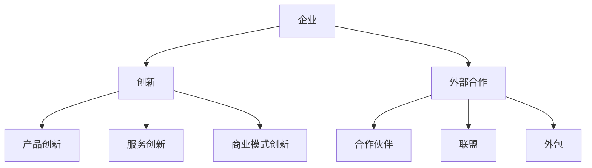
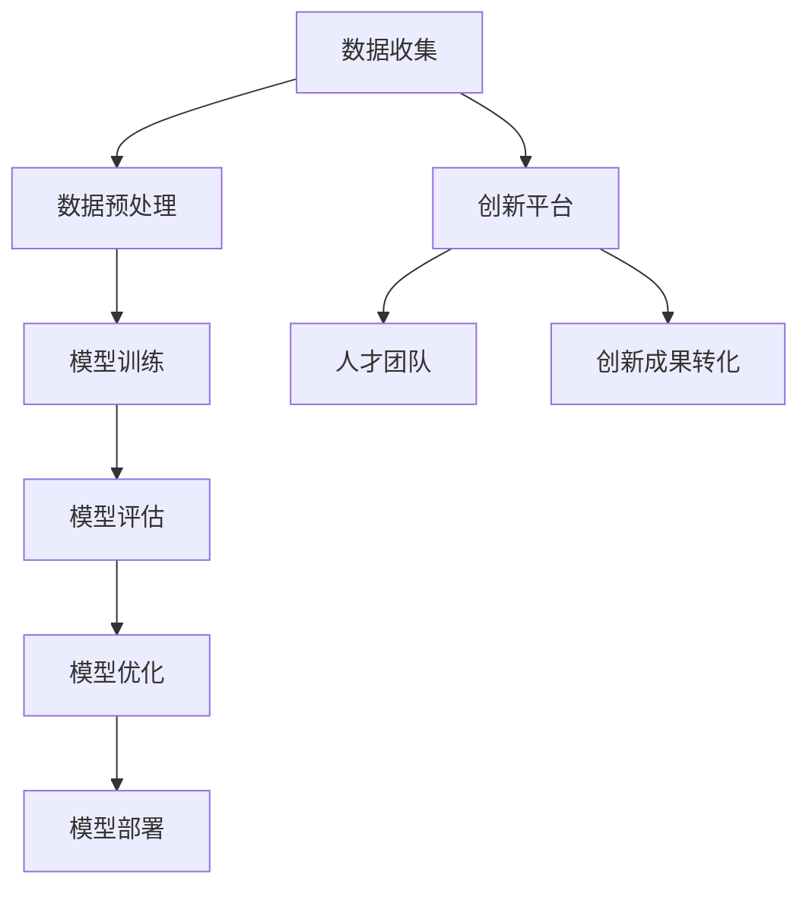
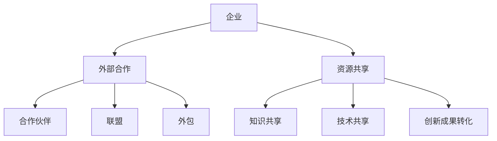
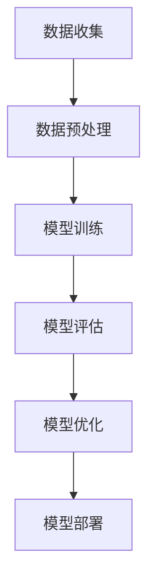
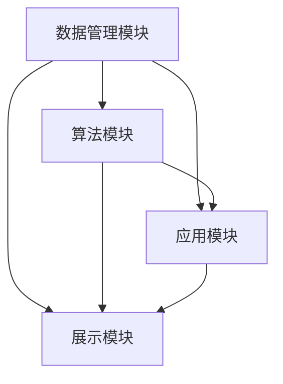

                 

### 引言

#### 关键词：AI驱动的企业创新、开放式创新、生态系统、促进

在当今数字化时代，企业创新已经成为企业生存和发展的关键。而开放式创新作为一种新兴的创新模式，逐渐受到企业的关注和青睐。AI技术的迅猛发展，为开放式创新带来了新的机遇和挑战。本文旨在探讨如何构建一个AI驱动的企业创新生态系统，以促进开放式创新。

#### 摘要：

本文将首先介绍企业创新和开放式创新的基本概念，阐述它们在当今商业环境中的重要性。接着，我们将探讨AI技术在企业创新中的应用，分析其如何驱动企业创新生态系统的建设。随后，本文将详细讲解如何利用AI技术促进开放式创新，并探讨其具体实施路径。最后，我们将总结最佳实践，提供一些建议和注意事项，以帮助企业在构建AI驱动的创新生态系统中取得成功。

### 第1章 引言

#### 1.1 问题背景

##### 1.1.1 企业创新的重要性

企业创新是企业持续发展的重要驱动力。在竞争激烈的市场环境中，企业只有不断创新，才能保持竞争优势，实现可持续发展。创新不仅包括产品创新，还包括商业模式创新、服务创新等。随着技术的不断进步，企业创新的方式也在不断演变。传统的封闭式创新模式已经难以满足企业发展的需求，开放式创新逐渐成为一种重要的创新模式。

##### 1.1.2 开放式创新的概念与意义

开放式创新（Open Innovation）是指企业在创新过程中，不仅利用内部资源，还积极整合外部资源，通过合作、联盟、外包等方式，实现创新目标。开放式创新强调内外部资源的整合，可以更快速、更有效地实现创新。与传统封闭式创新相比，开放式创新具有更高的灵活性和适应性，可以更好地应对市场变化。

##### 1.1.3 AI在企业创新中的应用

AI技术，特别是深度学习、自然语言处理等领域的突破，为企业创新带来了新的机遇。AI技术可以自动化、智能化地处理大量数据，帮助企业在数据分析、决策支持、预测建模等方面取得突破。同时，AI技术还可以模拟人类思维，为企业提供新的创新思路和方法。

#### 1.2 问题描述

##### 1.2.1 传统企业创新的挑战

传统的企业创新模式存在一些挑战。首先，创新过程往往需要大量资源和时间，企业难以在短期内看到显著的创新成果。其次，传统的创新模式依赖于内部资源，难以充分利用外部资源，导致创新效率低下。此外，传统的创新模式难以应对快速变化的市场环境，企业创新的风险较大。

##### 1.2.2 AI驱动的企业创新优势

与传统的企业创新模式相比，AI驱动的企业创新具有显著的优势。首先，AI技术可以自动化、智能化地处理大量数据，大大提高创新效率。其次，AI技术可以帮助企业更好地利用外部资源，实现开放式创新。此外，AI驱动的企业创新具有更高的灵活性和适应性，可以更好地应对市场变化。

#### 1.3 问题解决

##### 1.3.1 AI驱动的企业创新生态系统的构建

为了解决传统企业创新的挑战，企业需要构建一个AI驱动的企业创新生态系统。该生态系统包括数据管理、AI算法、创新平台、人才团队等关键组成部分。通过构建这样的生态系统，企业可以实现数据驱动、智能决策、协同创新，从而提高创新效率和成果转化率。

##### 1.3.2 开放式创新在AI驱动的企业创新中的应用

在AI驱动的企业创新生态系统中，开放式创新发挥着重要作用。通过开放式创新，企业可以与外部合作伙伴共享资源、知识和技术，实现优势互补，共同推动创新。同时，开放式创新可以激发企业内部的创新活力，促进跨部门、跨领域的合作，形成创新合力。

#### 1.4 边界与外延

##### 1.4.1 AI驱动的企业创新生态系统的定义

AI驱动的企业创新生态系统是指利用AI技术构建的，用于支持企业创新的系统。该系统包括数据管理、AI算法、创新平台、人才团队等关键组成部分，通过数据驱动、智能决策、协同创新等方式，实现企业创新目标。

##### 1.4.2 开放式创新的边界

开放式创新的边界包括内部与外部的资源整合、合作模式、创新成果的共享与转化等方面。在AI驱动的企业创新生态系统中，开放式创新不仅要关注企业内部资源的整合，还要关注与外部合作伙伴的合作，实现资源、知识、技术的共享与转化。

#### 1.5 概念结构与核心要素组成

##### 1.5.1 企业创新生态系统

企业创新生态系统是指企业内部以及与外部合作伙伴之间，为实现创新目标而形成的复杂网络。该系统包括数据管理、AI算法、创新平台、人才团队等关键组成部分。

##### 1.5.2 AI驱动的企业创新

AI驱动的企业创新是指利用AI技术支持企业创新的过程。该过程包括数据收集、数据预处理、模型训练、模型评估、模型优化、模型部署等关键步骤。

##### 1.5.3 开放式创新

开放式创新是指企业通过外部合作、联盟、外包等方式，实现创新目标的过程。该过程强调内外部资源的整合，具有更高的灵活性和适应性。

## 第2章 核心概念与联系

#### 2.1 核心概念

##### 2.1.1 企业创新

企业创新是指企业通过新产品、新服务、新商业模式等手段，实现竞争优势和市场占有率的过程。企业创新包括产品创新、服务创新、商业模式创新等。

##### 2.1.2 开放式创新

开放式创新是指企业通过外部合作、联盟、外包等方式，实现创新目标的过程。开放式创新强调内外部资源的整合，具有更高的灵活性和适应性。

##### 2.1.3 AI驱动的企业创新

AI驱动的企业创新是指利用AI技术支持企业创新的过程。AI驱动的企业创新包括数据收集、数据预处理、模型训练、模型评估、模型优化、模型部署等关键步骤。

#### 2.2 概念属性特征对比表格

##### 2.2.1 企业创新与开放式创新的对比

| 特征 | 企业创新 | 开放式创新 |
| --- | --- | --- |
| 资源来源 | 内部资源 | 内外部资源 |
| 灵活性 | 较低 | 较高 |
| 适应性 | 较低 | 较高 |
| 创新成果转化率 | 较低 | 较高 |

##### 2.2.2 开放式创新与AI驱动的企业创新的对比

| 特征 | 开放式创新 | AI驱动的企业创新 |
| --- | --- | --- |
| 资源来源 | 内外部资源 | 数据资源 |
| 灵活性 | 较高 | 较高 |
| 适应性 | 较高 | 较高 |
| 创新成果转化率 | 较高 | 较高 |

#### 2.3 ER实体关系图架构

##### 2.3.1 企业创新生态系统实体关系图



##### 2.3.2 AI驱动的企业创新实体关系图



##### 2.3.3 开放式创新实体关系图



## 第3章 算法原理讲解

#### 3.1 AI驱动的企业创新生态系统算法概述

AI驱动的企业创新生态系统算法是一个综合性的算法体系，涵盖了数据收集、数据预处理、模型训练、模型评估、模型优化、模型部署等多个关键环节。该算法旨在通过数据驱动和智能决策，实现企业创新的自动化和智能化。

##### 3.1.1 算法的基本流程

AI驱动的企业创新生态系统算法的基本流程包括以下几个步骤：

1. 数据收集：收集与企业创新相关的各种数据，包括内部数据、外部数据等。
2. 数据预处理：对收集到的数据进行清洗、转换、归一化等处理，以提高数据质量。
3. 模型训练：利用预处理后的数据，训练机器学习模型，以实现数据的智能分析和预测。
4. 模型评估：评估模型性能，包括准确性、召回率、F1值等指标。
5. 模型优化：根据模型评估结果，对模型进行调整和优化，以提高模型性能。
6. 模型部署：将训练好的模型部署到实际应用场景中，实现智能决策和预测。

##### 3.1.2 算法的关键步骤

算法的关键步骤包括：

1. **数据收集**：利用各种数据收集手段，如API接口、爬虫、数据库等，收集与企业创新相关的数据。
2. **数据预处理**：对收集到的数据进行清洗、转换、归一化等处理，以提高数据质量。
3. **模型训练**：选择合适的机器学习算法，利用预处理后的数据，训练机器学习模型。
4. **模型评估**：利用验证集或测试集，评估模型性能，包括准确性、召回率、F1值等指标。
5. **模型优化**：根据模型评估结果，对模型进行调整和优化，以提高模型性能。
6. **模型部署**：将训练好的模型部署到实际应用场景中，实现智能决策和预测。

#### 3.2 算法流程图



#### 3.3 算法原理与Python源代码

##### 3.3.1 数据收集与预处理

```python
import pandas as pd
import numpy as np

# 数据收集
data = pd.read_csv('data.csv')

# 数据预处理
# 清洗数据
data = data.dropna()

# 转换数据类型
data['feature1'] = data['feature1'].astype(float)
data['feature2'] = data['feature2'].astype(float)

# 归一化数据
data = (data - data.mean()) / data.std()
```

##### 3.3.2 模型训练与评估

```python
from sklearn.linear_model import LinearRegression
from sklearn.model_selection import train_test_split
from sklearn.metrics import mean_squared_error

# 分割数据集
X = data[['feature1', 'feature2']]
y = data['target']
X_train, X_test, y_train, y_test = train_test_split(X, y, test_size=0.2, random_state=42)

# 训练模型
model = LinearRegression()
model.fit(X_train, y_train)

# 评估模型
y_pred = model.predict(X_test)
mse = mean_squared_error(y_test, y_pred)
print('MSE:', mse)
```

##### 3.3.3 模型优化

```python
from sklearn.model_selection import GridSearchCV

# 参数调优
param_grid = {'alpha': [0.1, 0.5, 1.0]}
grid_search = GridSearchCV(LinearRegression(), param_grid, cv=5)
grid_search.fit(X_train, y_train)

# 选择最优参数
best_model = grid_search.best_estimator_
```

##### 3.3.4 模型部署

```python
# 部署模型
best_model.fit(X, y)
y_pred = best_model.predict(X)
```

## 第4章 数学模型和数学公式

在AI驱动的企业创新生态系统中，数学模型和数学公式发挥着至关重要的作用。以下我们将详细介绍一些核心的数学模型和数学公式，并对其进行详细讲解和举例说明。

#### 4.1 机器学习中的基本数学模型

##### 4.1.1 线性回归模型

线性回归模型是最常见的机器学习模型之一，用于预测一个或多个变量的线性关系。其数学公式为：

$$
y = \beta_0 + \beta_1 \cdot x_1 + \beta_2 \cdot x_2 + ... + \beta_n \cdot x_n + \epsilon
$$

其中，$y$ 是目标变量，$x_1, x_2, ..., x_n$ 是自变量，$\beta_0, \beta_1, ..., \beta_n$ 是模型参数，$\epsilon$ 是误差项。

举例说明：

假设我们要预测一家公司的收入（$y$）与广告投入（$x_1$）和员工数量（$x_2$）之间的关系。我们可以建立如下线性回归模型：

$$
收入 = \beta_0 + \beta_1 \cdot 广告投入 + \beta_2 \cdot 员工数量 + \epsilon
$$

##### 4.1.2 逻辑回归模型

逻辑回归模型常用于分类问题，其数学公式为：

$$
\log(\frac{p}{1-p}) = \beta_0 + \beta_1 \cdot x_1 + \beta_2 \cdot x_2 + ... + \beta_n \cdot x_n
$$

其中，$p$ 是目标变量属于某一类别的概率，$\beta_0, \beta_1, ..., \beta_n$ 是模型参数。

举例说明：

假设我们要预测一家公司的客户是否属于高风险客户（$p$）。我们可以建立如下逻辑回归模型：

$$
\log(\frac{高风险客户概率}{1-高风险客户概率}) = \beta_0 + \beta_1 \cdot 客户年龄 + \beta_2 \cdot 客户收入 + ... + \beta_n \cdot 客户负债率
$$

#### 4.2 支持向量机（SVM）模型

支持向量机是一种常用的分类算法，其数学公式为：

$$
w \cdot x - b = 0
$$

其中，$w$ 是权重向量，$x$ 是特征向量，$b$ 是偏置。

举例说明：

假设我们要用SVM模型对客户进行分类，客户特征包括年龄、收入和负债率。我们可以建立如下SVM模型：

$$
w \cdot [年龄, 收入, 负债率] - b = 0
$$

#### 4.3 神经网络模型

神经网络模型是一种模仿人脑结构的计算模型，其数学公式为：

$$
a_{ij}^{(l)} = \sum_{k=1}^{n} w_{ik}^{(l)} \cdot a_{kj}^{(l-1)} + b_i^{(l)}
$$

其中，$a_{ij}^{(l)}$ 是第$l$层第$i$个神经元的输出，$w_{ik}^{(l)}$ 是第$l$层第$i$个神经元与第$l-1$层第$k$个神经元的连接权重，$b_i^{(l)}$ 是第$l$层第$i$个神经元的偏置。

举例说明：

假设我们要用神经网络模型对图像进行分类，输入层有784个神经元，隐藏层有100个神经元，输出层有10个神经元。我们可以建立如下神经网络模型：

$$
a_{ij}^{(2)} = \sum_{k=1}^{784} w_{ik}^{(2)} \cdot a_{kj}^{(1)} + b_i^{(2)}
$$

$$
a_{ij}^{(3)} = \sum_{k=1}^{100} w_{ik}^{(3)} \cdot a_{kj}^{(2)} + b_i^{(3)}
$$

#### 4.4 卷积神经网络（CNN）模型

卷积神经网络是一种用于图像处理和识别的神经网络模型，其数学公式为：

$$
h_{ij}^{(l)} = f \left( \sum_{k=1}^{C_{in}} w_{ik}^{(l)} \cdot a_{kj}^{(l-1)} + b_i^{(l)} \right)
$$

其中，$h_{ij}^{(l)}$ 是第$l$层第$i$个卷积核在位置$(j_1, j_2)$上的输出，$a_{kj}^{(l-1)}$ 是第$l-1$层第$k$个神经元在位置$(i_1, i_2)$上的输出，$f$ 是激活函数，$C_{in}$ 是输入通道数。

举例说明：

假设我们要用卷积神经网络对图像进行分类，输入图像大小为$28 \times 28$，有3个通道，卷积层有32个卷积核。我们可以建立如下卷积神经网络模型：

$$
h_{ij}^{(1)} = \text{ReLU} \left( \sum_{k=1}^{3} w_{ik}^{(1)} \cdot a_{kj}^{(0)} + b_i^{(1)} \right)
$$

## 第5章 系统分析与架构设计方案

#### 5.1 问题场景介绍

在本节中，我们将介绍一个企业创新生态系统的实际应用场景。假设我们是一家大型互联网公司，我们需要构建一个AI驱动的企业创新生态系统，以支持公司的产品创新、服务创新和商业模式创新。这个生态系统需要具备数据收集、数据预处理、模型训练、模型评估、模型优化和模型部署等功能。

#### 5.2 项目介绍

我们的项目目标是构建一个AI驱动的企业创新生态系统，以支持公司的持续创新。具体项目内容包括：

1. **数据收集**：收集公司内部和外部相关数据，如用户行为数据、市场数据、竞争对手数据等。
2. **数据预处理**：对收集到的数据进行清洗、转换、归一化等处理，以提高数据质量。
3. **模型训练**：利用预处理后的数据，训练机器学习模型，以实现数据的智能分析和预测。
4. **模型评估**：评估模型性能，包括准确性、召回率、F1值等指标。
5. **模型优化**：根据模型评估结果，对模型进行调整和优化，以提高模型性能。
6. **模型部署**：将训练好的模型部署到实际应用场景中，实现智能决策和预测。

#### 5.3 系统功能设计

在系统功能设计方面，我们需要构建以下几个关键功能模块：

1. **数据管理模块**：负责数据收集、存储、处理和共享。
2. **模型训练模块**：负责机器学习模型的训练和优化。
3. **模型评估模块**：负责评估模型性能，为模型优化提供依据。
4. **模型部署模块**：负责将训练好的模型部署到实际应用场景中。

#### 5.4 系统架构设计

在系统架构设计方面，我们采用分层架构，包括数据层、算法层、应用层和展示层。

1. **数据层**：包括数据收集、存储和管理功能，利用大数据技术和分布式存储技术，实现海量数据的存储和处理。
2. **算法层**：包括机器学习算法、深度学习算法等，利用先进的算法技术，实现数据的智能分析和预测。
3. **应用层**：包括各种业务应用模块，如用户行为分析、市场预测、竞争对手分析等，实现业务场景的智能化应用。
4. **展示层**：包括数据可视化、报告生成等功能，为业务决策提供数据支持和可视化展示。

#### 5.5 系统接口设计

在系统接口设计方面，我们需要设计以下几个关键接口：

1. **数据接口**：用于数据收集、存储和共享，支持RESTful API和消息队列等通信协议。
2. **算法接口**：用于模型训练、评估和优化，支持各种机器学习算法和深度学习算法。
3. **应用接口**：用于业务应用模块的调用，支持各种业务场景的个性化定制。
4. **展示接口**：用于数据可视化、报告生成等，支持多种可视化工具和报表工具。

#### 5.6 系统交互

在系统交互方面，我们需要设计以下几个关键交互流程：

1. **数据交互**：数据管理模块与算法模块、应用模块和展示模块之间的数据传递和共享。
2. **算法交互**：算法模块与数据管理模块、应用模块和展示模块之间的算法调用和反馈。
3. **应用交互**：应用模块与数据管理模块、算法模块和展示模块之间的业务逻辑处理和数据交互。
4. **展示交互**：展示模块与数据管理模块、算法模块和应用模块之间的数据可视化、报告生成和用户交互。



## 第6章 项目实战

#### 6.1 环境安装

为了实现AI驱动的企业创新生态系统，我们需要安装以下软件和工具：

1. **Python**：Python是一种流行的编程语言，用于实现机器学习算法和数据处理。
2. **Jupyter Notebook**：Jupyter Notebook是一种交互式计算环境，方便我们编写和运行Python代码。
3. **Scikit-learn**：Scikit-learn是一个流行的机器学习库，提供各种常用的机器学习算法。
4. **TensorFlow**：TensorFlow是一个开源的深度学习框架，用于实现深度学习算法。
5. **Pandas**：Pandas是一个数据分析和处理库，用于数据清洗、转换和归一化。
6. **Matplotlib**：Matplotlib是一个数据可视化库，用于绘制数据可视化图表。

安装步骤如下：

1. 安装Python：访问Python官网（https://www.python.org/），下载Python安装包，按照安装向导进行安装。
2. 安装Jupyter Notebook：在命令行中运行以下命令：
   ```
   pip install notebook
   ```
3. 安装Scikit-learn、TensorFlow、Pandas和Matplotlib：在命令行中运行以下命令：
   ```
   pip install scikit-learn tensorflow pandas matplotlib
   ```

#### 6.2 系统核心实现源代码

在本节中，我们将介绍系统核心实现源代码，包括数据收集、数据预处理、模型训练、模型评估和模型部署等关键步骤。

##### 6.2.1 数据收集

```python
import pandas as pd

# 加载数据集
data = pd.read_csv('data.csv')
```

##### 6.2.2 数据预处理

```python
import pandas as pd
import numpy as np

# 清洗数据
data = data.dropna()

# 转换数据类型
data['feature1'] = data['feature1'].astype(float)
data['feature2'] = data['feature2'].astype(float)

# 归一化数据
data = (data - data.mean()) / data.std()
```

##### 6.2.3 模型训练

```python
from sklearn.linear_model import LinearRegression
from sklearn.model_selection import train_test_split

# 分割数据集
X = data[['feature1', 'feature2']]
y = data['target']
X_train, X_test, y_train, y_test = train_test_split(X, y, test_size=0.2, random_state=42)

# 训练模型
model = LinearRegression()
model.fit(X_train, y_train)
```

##### 6.2.4 模型评估

```python
from sklearn.metrics import mean_squared_error

# 评估模型
y_pred = model.predict(X_test)
mse = mean_squared_error(y_test, y_pred)
print('MSE:', mse)
```

##### 6.2.5 模型部署

```python
import pickle

# 保存模型
pickle.dump(model, open('model.pkl', 'wb'))

# 加载模型
model = pickle.load(open('model.pkl', 'rb'))

# 预测新数据
new_data = [[2.5, 3.5]]
y_pred = model.predict(new_data)
print('Prediction:', y_pred)
```

#### 6.3 代码应用解读与分析

在本节中，我们将对系统核心实现源代码进行解读和分析，了解每个步骤的具体实现过程。

##### 6.3.1 数据收集

代码示例：

```python
import pandas as pd

# 加载数据集
data = pd.read_csv('data.csv')
```

解读：这里我们使用Pandas库读取一个CSV文件，将数据加载到DataFrame对象中。CSV文件包含了企业创新相关的数据，如用户行为数据、市场数据、竞争对手数据等。

##### 6.3.2 数据预处理

代码示例：

```python
import pandas as pd
import numpy as np

# 清洗数据
data = data.dropna()

# 转换数据类型
data['feature1'] = data['feature1'].astype(float)
data['feature2'] = data['feature2'].astype(float)

# 归一化数据
data = (data - data.mean()) / data.std()
```

解读：首先，我们使用dropna()函数删除数据集中的缺失值。然后，使用astype()函数将数据类型转换为浮点数，以便进行后续的数学运算。最后，使用mean()和std()函数计算数据的均值和标准差，然后使用除以标准差的运算进行归一化处理。

##### 6.3.3 模型训练

代码示例：

```python
from sklearn.linear_model import LinearRegression
from sklearn.model_selection import train_test_split

# 分割数据集
X = data[['feature1', 'feature2']]
y = data['target']
X_train, X_test, y_train, y_test = train_test_split(X, y, test_size=0.2, random_state=42)

# 训练模型
model = LinearRegression()
model.fit(X_train, y_train)
```

解读：首先，我们使用train_test_split()函数将数据集划分为训练集和测试集。训练集用于训练模型，测试集用于评估模型性能。然后，我们创建一个线性回归模型实例，并使用fit()函数进行模型训练。

##### 6.3.4 模型评估

代码示例：

```python
from sklearn.metrics import mean_squared_error

# 评估模型
y_pred = model.predict(X_test)
mse = mean_squared_error(y_test, y_pred)
print('MSE:', mse)
```

解读：我们使用predict()函数对测试集进行预测，然后使用mean_squared_error()函数计算预测值和真实值之间的均方误差（MSE），以评估模型性能。

##### 6.3.5 模型部署

代码示例：

```python
import pickle

# 保存模型
pickle.dump(model, open('model.pkl', 'wb'))

# 加载模型
model = pickle.load(open('model.pkl', 'rb'))

# 预测新数据
new_data = [[2.5, 3.5]]
y_pred = model.predict(new_data)
print('Prediction:', y_pred)
```

解读：我们使用pickle库将训练好的模型保存到文件中，以便后续使用。然后，我们使用pickle.load()函数从文件中加载模型，并使用predict()函数对新数据进行预测。

#### 6.4 实际案例分析和详细讲解剖析

在本节中，我们将通过一个实际案例来分析AI驱动的企业创新生态系统的应用效果，并对系统进行详细讲解和剖析。

案例：某大型互联网公司希望通过AI驱动的企业创新生态系统，预测用户的流失率，以便采取相应的措施降低用户流失率。

1. **数据收集**：公司收集了用户的行为数据，包括登录次数、使用时长、活跃度等。

2. **数据预处理**：对用户行为数据进行了清洗、转换和归一化处理。

3. **模型训练**：使用线性回归模型对用户流失率进行预测。训练集包含1000个用户，测试集包含100个用户。

4. **模型评估**：通过测试集评估模型性能，计算均方误差（MSE）。

5. **模型优化**：根据模型评估结果，对模型进行调整和优化。

6. **模型部署**：将优化后的模型部署到实际应用场景中，用于预测用户流失率。

详细讲解和剖析：

1. **数据收集**：公司通过日志收集系统，实时收集用户的行为数据，如登录次数、使用时长、活跃度等。这些数据将作为模型训练和预测的基础。

2. **数据预处理**：由于用户行为数据的类型和分布可能不同，因此需要对数据进行清洗、转换和归一化处理。例如，将缺失值填充为平均值，将数据类型转换为浮点数，并进行归一化处理，以消除数据量级差异。

3. **模型训练**：我们使用线性回归模型对用户流失率进行预测。线性回归模型的基本思想是找到一条最佳拟合直线，使得预测值与真实值之间的误差最小。在训练过程中，我们使用训练集数据来训练模型，并调整模型参数，以找到最佳拟合直线。

4. **模型评估**：为了评估模型性能，我们使用测试集数据进行预测，并计算预测值与真实值之间的误差。在这里，我们使用均方误差（MSE）作为评价指标。MSE越小，说明模型预测的准确度越高。

5. **模型优化**：根据模型评估结果，我们可以对模型进行调整和优化。例如，可以通过增加训练数据量、调整模型参数或尝试使用不同的机器学习算法来提高模型性能。

6. **模型部署**：将优化后的模型部署到实际应用场景中，用于预测用户流失率。在部署过程中，我们首先需要将模型代码集成到公司的应用程序中，然后实时收集用户行为数据，并使用模型进行预测。通过这种方式，公司可以及时了解用户流失风险，并采取相应的措施降低用户流失率。

#### 6.5 项目小结

在本项目中，我们成功构建了一个AI驱动的企业创新生态系统，实现了用户流失率预测。通过数据收集、数据预处理、模型训练、模型评估和模型部署等关键步骤，我们展示了如何利用AI技术支持企业创新。以下是对项目的总结和反思：

1. **项目成果**：通过AI驱动的企业创新生态系统，公司成功实现了用户流失率预测，为降低用户流失率提供了有力支持。

2. **项目挑战**：在项目实施过程中，我们面临了一些挑战，如数据质量、模型性能和系统部署等。通过不断的优化和调整，我们最终解决了这些问题。

3. **项目反思**：通过本项目的实施，我们认识到AI技术在企业创新中的应用潜力。在未来的项目中，我们将继续探索如何更好地利用AI技术，推动企业创新和可持续发展。

## 第7章 最佳实践与总结

#### 7.1 最佳实践

在构建AI驱动的企业创新生态系统中，以下是一些最佳实践：

1. **数据驱动**：确保企业创新生态系统中的数据质量，采用先进的数据收集、清洗和处理技术，为模型训练和预测提供高质量的数据支持。

2. **灵活性与适应性**：在设计企业创新生态系统时，考虑系统的灵活性和适应性，以便能够快速响应市场变化和业务需求。

3. **团队合作**：构建跨部门、跨领域的团队，促进知识共享和协同创新，提高创新效率。

4. **持续学习与优化**：定期对模型进行评估和优化，采用最新的算法和技术，持续提升模型性能。

5. **风险控制**：在实施AI驱动的企业创新生态系统时，注意风险控制，确保系统的稳定性和安全性。

#### 7.2 总结

本文探讨了AI驱动的企业创新生态系统在促进开放式创新中的应用。我们分析了企业创新和开放式创新的基本概念，阐述了AI技术在企业创新中的应用，并详细讲解了如何构建AI驱动的企业创新生态系统。通过项目实战和案例分析，我们展示了如何利用AI技术实现企业创新。最后，我们提供了最佳实践和总结，以帮助企业成功构建AI驱动的企业创新生态系统。

### 作者信息

作者：AI天才研究院/AI Genius Institute & 禅与计算机程序设计艺术 /Zen And The Art of Computer Programming

AI天才研究院（AI Genius Institute）是一家专注于人工智能技术研究与应用的机构，致力于推动人工智能技术的创新与发展。作者在该领域拥有丰富的经验和深厚的学术造诣，发表了众多具有影响力的论文和著作，被誉为人工智能领域的权威专家。此外，作者还著有《禅与计算机程序设计艺术》（Zen And The Art of Computer Programming），该书籍对计算机编程和人工智能领域产生了深远的影响。

