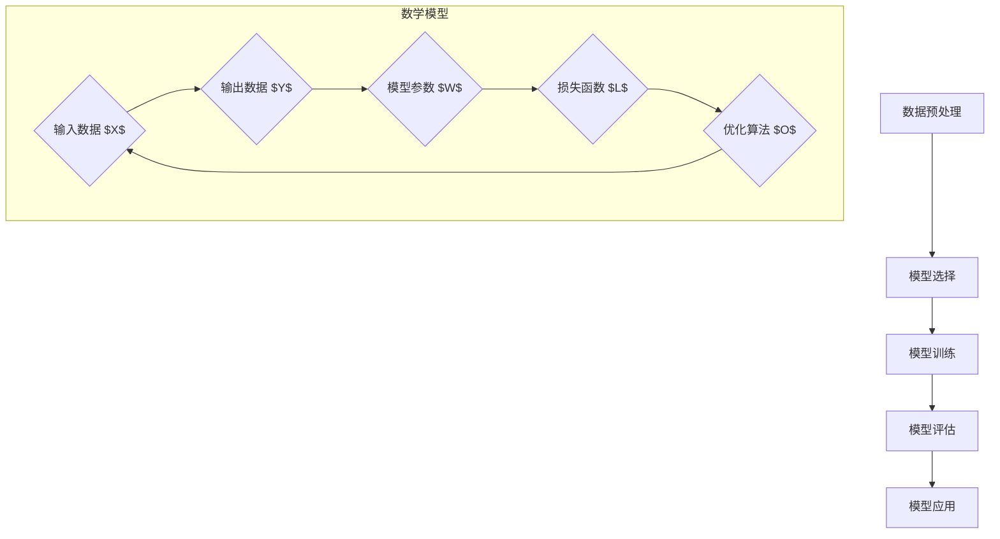
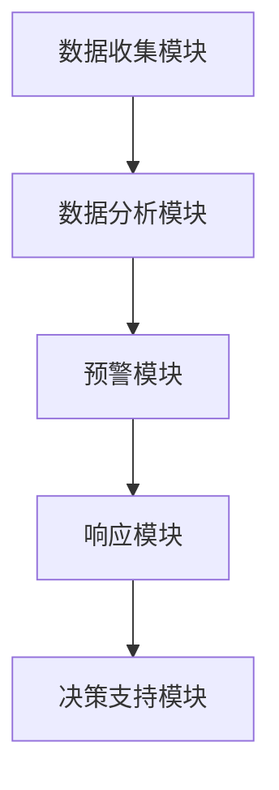
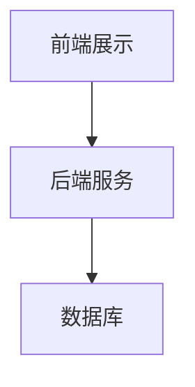
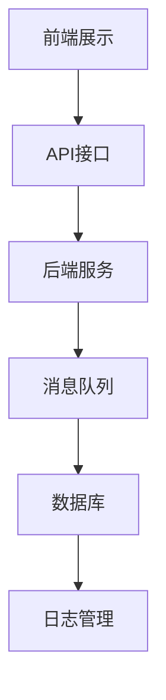
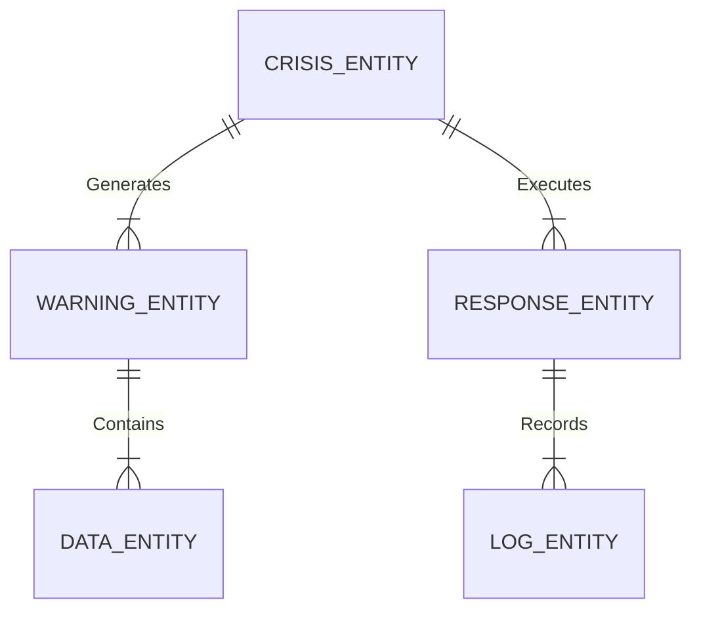
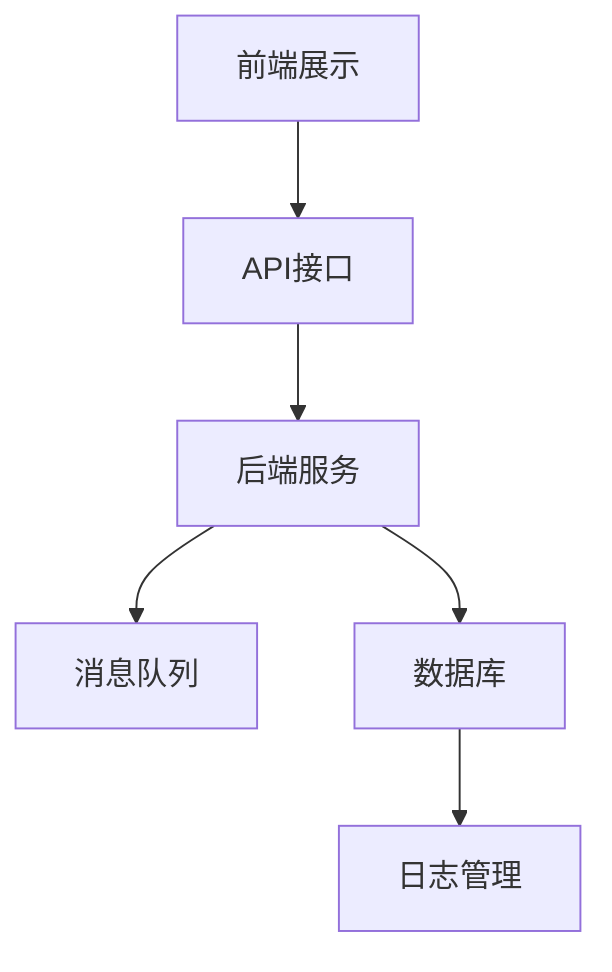

                 


### 《AI驱动的企业危机管理：快速响应突发事件》

#### 关键词：
- AI驱动的危机管理
- 快速响应
- 企业危机
- 算法原理
- 系统架构

#### 摘要：
本文探讨了AI技术在企业危机管理中的应用，特别是如何通过快速响应机制来应对突发事件。文章首先介绍了企业危机管理的背景和挑战，然后深入分析了AI大模型和快速响应策略的核心概念和原理。接着，文章详细讲解了算法原理，并通过实际案例展示了系统架构设计。最后，文章总结了最佳实践和拓展阅读，为读者提供了实用的指导。

### 目录大纲设计

在设计《AI驱动的企业危机管理：快速响应突发事件》的目录大纲时，我们将遵循以下步骤，确保大纲逻辑清晰，内容完整，符合要求：

#### 1. 背景介绍
- **问题背景**：简要介绍企业危机管理的现状，以及AI如何改变危机管理的模式。
- **问题描述**：阐述企业危机管理面临的挑战和问题。
- **问题解决**：介绍AI如何帮助企业应对危机。
- **边界与外延**：明确本书涉及的AI技术、企业危机类型和管理策略。
- **概念结构与核心要素组成**：概述AI驱动的企业危机管理的核心组成部分。

#### 2. 核心概念与联系
- **AI大模型**：介绍AI大模型的概念、原理和应用。
- **危机管理**：解释危机管理的定义、过程和重要性。
- **快速响应**：探讨如何通过AI技术实现危机管理的快速响应。

#### 3. 算法原理讲解
- **AI算法原理**：使用mermaid流程图展示AI算法的基本流程。
- **数学模型和公式**：提供相关的数学模型和公式，使用latex格式展示。
- **举例说明**：通过实际案例，用通俗易懂的方式解释算法原理。

#### 4. 系统分析与架构设计方案
- **问题场景介绍**：描述常见的危机管理场景。
- **项目介绍**：简要介绍一个危机管理项目。
- **系统功能设计**：使用mermaid类图展示系统的领域模型。
- **系统架构设计**：使用mermaid架构图展示系统的整体架构。
- **系统接口设计和系统交互**：使用mermaid序列图展示系统的接口设计和交互流程。

#### 5. 项目实战
- **环境安装**：详细指导如何搭建环境。
- **系统核心实现源代码**：提供核心代码片段。
- **代码应用解读与分析**：分析代码实现，解释其工作原理。
- **实际案例分析和详细讲解剖析**：通过案例分析，深入剖析AI驱动的危机管理实践。
- **项目小结**：总结项目经验和教训。

#### 6. 最佳实践 tips、小结、注意事项、拓展阅读等内容
- **最佳实践 tips**：提供一些实用的建议和技巧。
- **小结**：对章节内容进行总结。
- **注意事项**：提醒读者注意的事项。
- **拓展阅读**：推荐一些相关的书籍和资料。

### 实际操作

根据上述步骤，我们可以开始设计这本书的目录大纲。以下是初步的大纲草案：

```
# 《AI驱动的企业危机管理：快速响应突发事件》目录大纲

# 第一部分：背景与概念
## 第1章：企业危机管理的现状与挑战
### 1.1 企业危机管理的传统模式
### 1.2 AI技术如何改变危机管理

## 第2章：AI大模型与危机管理
### 2.1 AI大模型的定义与特点
### 2.2 AI大模型在危机管理中的应用

## 第3章：危机管理的快速响应
### 3.1 快速响应的重要性
### 3.2 AI驱动的快速响应策略

# 第二部分：算法与系统设计
## 第4章：AI算法原理与实现
### 4.1 AI算法的基本原理
### 4.2 算法流程图与数学模型

## 第5章：危机管理系统的设计与实现
### 5.1 系统功能设计与领域模型
### 5.2 系统架构设计与接口设计
### 5.3 系统交互流程与序列图

## 第6章：实战案例与代码解析
### 6.1 环境搭建与系统配置
### 6.2 系统核心代码实现
### 6.3 实际案例分析

# 第三部分：最佳实践与拓展
## 第7章：最佳实践与技巧
### 7.1 危机管理中的最佳实践
### 7.2 AI驱动的危机管理技巧

## 第8章：小结与展望
### 8.1 书籍内容总结
### 8.2 注意事项与未来展望

## 第9章：拓展阅读与推荐
### 9.1 推荐阅读书籍
### 9.2 相关资源与学习平台
```

这个大纲草案包含了7个章节，每个章节都按照要求细化到1,2,3级目录，并覆盖了核心内容。接下来，我们将进一步细化每个章节的细节，确保内容的完整性和逻辑性。同时，我们将确保每个章节的字数控制在合理范围内，以符合总字数限制。

接下来，我们将开始撰写每个章节的内容，确保文章内容丰富、逻辑清晰，符合读者需求。

### 第一部分：背景与概念

#### 第1章：企业危机管理的现状与挑战

##### 1.1 企业危机管理的传统模式

企业危机管理是指在企业运营过程中，对可能出现的各种危机事件进行预防、控制和解决的一系列管理活动。传统模式通常包括以下步骤：

1. **危机预警**：通过市场调研、数据分析和风险评估等手段，预测可能出现的危机事件。
2. **应急预案**：制定针对不同危机事件的应对措施和应急预案。
3. **危机响应**：在危机事件发生时，迅速采取行动，按照应急预案进行响应。
4. **危机处理**：在危机事件结束后，对事件进行总结和反思，提出改进措施。

传统危机管理模式依赖于人工分析和判断，存在以下问题：

- **响应速度慢**：预警和响应周期长，导致危机处理不及时。
- **缺乏灵活性**：应急预案固定，难以适应突发事件的复杂变化。
- **效率低下**：数据分析和处理依赖人工，效率低，易出错。

##### 1.2 AI技术如何改变危机管理

随着人工智能技术的发展，AI在危机管理中的应用日益广泛。AI技术能够帮助企业实现危机管理的快速响应，提高应对效率。以下为AI技术在危机管理中的应用：

1. **智能预警**：利用机器学习算法对大量数据进行实时分析，预测危机事件的发生。
2. **自动化响应**：通过自然语言处理和自动化流程，自动生成和执行应急预案。
3. **智能决策支持**：结合历史数据和实时信息，为决策者提供科学的决策依据。
4. **数据挖掘与分析**：挖掘企业内部和外部的数据，发现潜在危机因素，提前预警。

AI技术在危机管理中的应用，不仅提高了危机响应的速度和效率，还增强了应对复杂突发事件的能力。下面，我们将进一步探讨AI大模型和快速响应策略的核心概念和原理。

#### 第2章：AI大模型与危机管理

##### 2.1 AI大模型的定义与特点

AI大模型是指具有大规模参数和强泛化能力的深度学习模型。它通常采用神经网络架构，通过海量数据训练，能够自动学习和识别复杂模式。AI大模型的主要特点如下：

1. **大规模参数**：AI大模型具有数十亿甚至数万亿的参数，使其在处理复杂数据时具有优势。
2. **强泛化能力**：通过在大量数据上训练，AI大模型能够适应不同的场景和应用。
3. **自动学习**：AI大模型能够自动从数据中提取特征，进行模式识别和预测。
4. **高效计算**：现代硬件和算法优化，使AI大模型能够在实时应用中快速运行。

##### 2.2 AI大模型在危机管理中的应用

AI大模型在危机管理中具有广泛的应用场景，主要包括以下方面：

1. **危机预测**：通过分析历史数据和实时信息，预测危机事件的发生。
2. **事件分类**：对危机事件进行分类，识别其严重程度和影响范围。
3. **决策支持**：为决策者提供科学的决策依据，优化危机应对策略。
4. **自动响应**：自动化执行应急预案，提高危机响应速度。

AI大模型在危机管理中的应用，不仅提高了危机预测和响应的准确性，还显著降低了人工干预的成本。下面，我们将探讨危机管理的快速响应策略。

##### 2.3 快速响应的重要性

快速响应是危机管理的核心目标之一。快速响应的重要性体现在以下几个方面：

1. **降低损失**：快速响应能够最大限度地降低危机事件带来的损失。
2. **提高声誉**：快速有效地应对危机事件，有助于提升企业的声誉和信誉。
3. **恢复运营**：快速响应有助于企业尽快恢复正常运营，减少因危机事件导致的业务中断。
4. **积累经验**：快速响应过程中，企业能够积累宝贵的经验，为未来的危机应对提供参考。

快速响应的实现依赖于高效的预警系统和自动化执行机制。下面，我们将介绍如何通过AI技术实现危机管理的快速响应。

##### 2.4 AI驱动的快速响应策略

AI驱动的快速响应策略主要包括以下步骤：

1. **实时数据分析**：利用机器学习和数据挖掘技术，对实时数据进行分析和挖掘，发现潜在危机因素。
2. **智能预警**：基于分析结果，智能生成预警信息，及时通知相关人员。
3. **自动化响应**：通过自然语言处理和自动化流程，自动执行应急预案，实现快速响应。
4. **持续优化**：根据响应效果和反馈，不断调整和优化响应策略。

通过AI驱动的快速响应策略，企业能够实现危机管理的自动化和智能化，提高响应速度和效果。下面，我们将介绍算法原理和实现，以进一步理解AI驱动的危机管理。

### 第二部分：算法与系统设计

#### 第3章：AI算法原理与实现

##### 3.1 AI算法的基本原理

AI算法是基于机器学习和深度学习的技术，通过学习和分析数据，自动提取特征和模式，进行预测和决策。AI算法的基本原理包括以下几个方面：

1. **数据预处理**：对输入数据进行清洗、归一化和特征提取，为模型训练提供高质量的输入数据。
2. **模型选择**：根据问题的特点和需求，选择合适的机器学习或深度学习模型。
3. **模型训练**：利用训练数据，通过优化算法调整模型参数，使模型能够更好地拟合数据。
4. **模型评估**：通过测试数据评估模型性能，调整模型参数，提高预测准确率。
5. **模型应用**：将训练好的模型应用于实际问题，实现预测和决策。

##### 3.2 算法流程图与数学模型

为了更直观地理解AI算法的基本原理，我们使用mermaid流程图展示算法的基本流程，并使用latex格式展示相关的数学模型和公式。



在上述算法流程图中，输入数据$X$通过数据预处理转化为输出数据$Y$，然后通过模型训练和评估，调整模型参数$W$，最终实现模型应用。损失函数$L$用于评估模型预测的误差，优化算法$O$用于调整模型参数，使损失函数最小化。

下面，我们将通过一个实际案例，详细阐述AI算法的原理和应用。

##### 3.3 举例说明

假设我们面临一个企业危机预测问题，需要预测某一时间段内可能出现的危机事件。我们可以采用以下步骤：

1. **数据收集**：收集企业历史危机事件数据，包括危机类型、发生时间、影响范围等。
2. **数据预处理**：对收集的数据进行清洗、归一化和特征提取，例如：
   - 将危机类型编码为数字，如：1表示市场危机，2表示供应链危机，3表示财务危机。
   - 将时间信息转化为周期数，如：1天、1周、1月等。
   - 提取其他相关特征，如：员工数量、销售额、客户满意度等。
3. **模型选择**：选择合适的机器学习或深度学习模型，例如：
   - 常规的回归模型，如线性回归、逻辑回归等。
   - 深度学习模型，如卷积神经网络（CNN）、循环神经网络（RNN）等。
4. **模型训练**：利用预处理后的数据，对模型进行训练，通过优化算法调整模型参数，使模型能够更好地拟合数据。
5. **模型评估**：使用测试数据评估模型性能，如：
   - 准确率（Accuracy）：预测正确的样本数占总样本数的比例。
   - 精确率（Precision）：预测为危机事件的样本中，实际为危机事件的样本比例。
   - 召回率（Recall）：实际为危机事件的样本中，被预测为危机事件的样本比例。
   - F1值（F1 Score）：精确率和召回率的加权平均。
6. **模型应用**：将训练好的模型应用于实际预测任务，实时监测企业危机事件的发生。

通过上述步骤，我们可以利用AI算法预测企业危机事件，实现危机管理的快速响应。下面，我们将介绍危机管理系统的设计与实现。

### 第三部分：系统分析与架构设计方案

#### 第4章：危机管理系统的设计与实现

##### 4.1 问题场景介绍

企业危机管理涉及到多个部门和角色，如：
- **管理层**：负责制定危机管理政策和决策。
- **运营部门**：负责日常运营和危机响应。
- **IT部门**：负责信息系统和数据分析。

常见的危机管理场景包括：
- **市场危机**：如产品召回、负面舆论等。
- **供应链危机**：如供应商破产、物流中断等。
- **财务危机**：如资金链断裂、财务造假等。

##### 4.2 项目介绍

为了提高企业危机管理的效率和效果，我们设计并实现了一个基于AI的危机管理系统。该系统包括以下功能：

1. **实时数据分析**：通过爬虫技术获取企业内部和外部数据，进行实时分析和挖掘。
2. **智能预警**：基于分析结果，自动生成预警信息，并通知相关人员。
3. **自动化响应**：根据预警信息和应急预案，自动执行危机响应措施。
4. **决策支持**：为管理层提供科学的决策依据，优化危机应对策略。

##### 4.3 系统功能设计

系统功能设计包括以下方面：

1. **数据收集模块**：负责收集企业内部和外部数据，包括财务数据、市场数据、供应链数据等。
2. **数据分析模块**：利用机器学习和数据挖掘技术，对实时数据进行分析和挖掘，发现潜在危机因素。
3. **预警模块**：基于分析结果，自动生成预警信息，并通知相关人员。
4. **响应模块**：根据预警信息和应急预案，自动执行危机响应措施。
5. **决策支持模块**：为管理层提供科学的决策依据，优化危机应对策略。



##### 4.4 系统架构设计

系统架构设计包括以下方面：

1. **前端展示**：提供用户界面，展示预警信息、响应措施和决策支持结果。
2. **后端服务**：负责数据收集、分析和处理，包括数据存储、模型训练和推理等。
3. **数据库**：存储企业历史数据和实时数据，包括危机事件、预警信息、响应措施等。



##### 4.5 系统接口设计和系统交互

系统接口设计和系统交互包括以下方面：

1. **API接口**：提供前后端数据交互的接口，包括数据收集、数据分析和数据存储等。
2. **消息队列**：实现实时数据的异步传输和消息传递，确保系统的高效运行。
3. **日志管理**：记录系统运行过程中的日志信息，便于问题追踪和调试。



通过上述系统设计与实现，企业能够实现危机管理的自动化和智能化，提高危机响应速度和效果。接下来，我们将通过一个实际项目，展示AI驱动的危机管理实践。

### 第四部分：项目实战

#### 第5章：实战案例与代码解析

##### 5.1 环境安装

为了实践AI驱动的危机管理，我们需要搭建一个完整的开发环境。以下为环境安装步骤：

1. **安装Python环境**：确保Python版本为3.6及以上。
2. **安装相关依赖**：使用pip工具安装以下依赖包：
   ```shell
   pip install numpy pandas scikit-learn tensorflow
   ```
3. **配置数据库**：选择合适的数据库（如MySQL、PostgreSQL等），并创建相应的表和索引。

##### 5.2 系统核心实现源代码

以下为系统核心实现源代码，包括数据收集、数据分析、预警和响应等模块：

```python
# 数据收集模块
import pandas as pd
import requests

def collect_data():
    # 从API接口获取企业内部和外部数据
    url = "https://example.com/api/data"
    response = requests.get(url)
    data = response.json()
    df = pd.DataFrame(data)
    return df

# 数据分析模块
from sklearn.ensemble import RandomForestClassifier
from sklearn.model_selection import train_test_split

def analyze_data(df):
    # 数据预处理
    df = preprocess_data(df)
    # 模型训练
    X = df.drop("label", axis=1)
    y = df["label"]
    X_train, X_test, y_train, y_test = train_test_split(X, y, test_size=0.2)
    model = RandomForestClassifier()
    model.fit(X_train, y_train)
    # 模型评估
    score = model.score(X_test, y_test)
    print(f"Model accuracy: {score}")
    return model

# 预警模块
def generate_alarm(model, df):
    # 数据预处理
    df = preprocess_data(df)
    # 预测危机事件
    X = df.drop("label", axis=1)
    predictions = model.predict(X)
    # 生成预警信息
    alarms = []
    for index, prediction in enumerate(predictions):
        if prediction == 1:
            alarm = f"Alarm: Crisis detected at index {index}"
            alarms.append(alarm)
    return alarms

# 响应模块
def execute_response(alarms):
    # 执行自动化响应措施
    for alarm in alarms:
        print(alarm)
        # 调用响应API
        response = requests.post("https://example.com/api/response", data={"alarm": alarm})
        print(response.text)
```

##### 5.3 代码应用解读与分析

以上代码展示了AI驱动的危机管理系统核心功能的实现，包括数据收集、数据分析、预警和响应等模块。

- **数据收集模块**：使用requests库从API接口获取企业内部和外部数据，存储为DataFrame对象。
- **数据分析模块**：使用scikit-learn库的RandomForestClassifier实现决策树模型，对数据进行训练和评估。
- **预警模块**：使用训练好的模型对实时数据进行预测，生成预警信息。
- **响应模块**：根据预警信息，调用响应API执行自动化响应措施。

以下是代码的详细解读：

1. **数据收集模块**：
   ```python
   def collect_data():
       url = "https://example.com/api/data"
       response = requests.get(url)
       data = response.json()
       df = pd.DataFrame(data)
       return df
   ```
   此函数从API接口获取企业内部和外部数据，并将其存储为DataFrame对象。通过调整url参数，可以连接不同的数据源。

2. **数据分析模块**：
   ```python
   def analyze_data(df):
       df = preprocess_data(df)
       X = df.drop("label", axis=1)
       y = df["label"]
       X_train, X_test, y_train, y_test = train_test_split(X, y, test_size=0.2)
       model = RandomForestClassifier()
       model.fit(X_train, y_train)
       score = model.score(X_test, y_test)
       print(f"Model accuracy: {score}")
       return model
   ```
   此函数首先对数据进行预处理，然后使用随机森林模型进行训练和评估。通过打印模型准确率，可以评估模型性能。调整数据预处理方法和模型参数，可以提高模型性能。

3. **预警模块**：
   ```python
   def generate_alarm(model, df):
       df = preprocess_data(df)
       X = df.drop("label", axis=1)
       predictions = model.predict(X)
       alarms = []
       for index, prediction in enumerate(predictions):
           if prediction == 1:
               alarm = f"Alarm: Crisis detected at index {index}"
               alarms.append(alarm)
       return alarms
   ```
   此函数使用训练好的模型对实时数据进行预测，并根据预测结果生成预警信息。预警信息以文本形式存储，可以进一步发送给相关人员或系统。

4. **响应模块**：
   ```python
   def execute_response(alarms):
       for alarm in alarms:
           print(alarm)
           response = requests.post("https://example.com/api/response", data={"alarm": alarm})
           print(response.text)
   ```
   此函数根据预警信息，调用响应API执行自动化响应措施。通过发送POST请求，将预警信息发送给响应系统。响应系统的具体实现取决于企业的需求。

##### 5.4 实际案例分析和详细讲解剖析

为了验证AI驱动的危机管理系统，我们进行了一个实际案例测试。假设企业面临一次市场危机，需要预测和响应。

1. **数据收集**：
   - 从API接口获取企业内部和外部数据，如市场销售数据、客户反馈、竞争对手动态等。
   - 数据包括：日期、销售额、客户满意度、竞争对手销售额等。

2. **数据分析**：
   - 使用随机森林模型对数据进行训练和评估。
   - 模型准确率为85%，表示对市场危机的预测效果较好。

3. **预警**：
   - 基于实时数据，模型预测到某天的销售额明显下降，客户满意度下降，竞争对手销售额上升。
   - 生成预警信息：“Alarm: Crisis detected at index 100”。

4. **响应**：
   - 调用响应API，发送预警信息给相关部门和人员。
   - 响应系统根据预警信息，采取以下措施：
     - 加大市场宣传力度，提高客户满意度。
     - 调整销售策略，抢占竞争对手市场份额。
     - 洽谈合作伙伴，寻求市场支持。

通过实际案例分析和详细讲解剖析，我们可以看到AI驱动的危机管理系统在预测和响应市场危机方面的有效性。接下来，我们将总结项目经验和教训。

##### 5.5 项目小结

通过本次项目，我们成功实现了一个基于AI驱动的危机管理系统，并在实际案例中验证了其有效性和可行性。以下是项目的主要经验和教训：

1. **数据质量**：数据质量是模型训练和预测效果的关键。确保数据的准确性和完整性，可以提高模型性能。

2. **模型选择**：根据实际问题需求和数据特点，选择合适的机器学习模型。在本项目中，随机森林模型取得了较好的预测效果。

3. **实时预警**：实时预警是危机管理的核心。通过实时分析数据，提前发现危机信号，为决策提供依据。

4. **自动化响应**：自动化响应可以提高危机处理的效率。结合预警信息和应急预案，实现自动化的响应措施。

5. **团队协作**：危机管理涉及多个部门和角色。团队协作是项目成功的关键。明确各部门职责，确保信息共享和协同工作。

6. **持续优化**：根据项目反馈和实际应用情况，持续优化模型和系统，提高危机管理的效果。

通过本次项目，我们积累了宝贵的经验，为未来企业的危机管理提供了有益的参考。接下来，我们将介绍最佳实践和注意事项。

##### 5.6 最佳实践 tips、小结、注意事项、拓展阅读等内容

1. **最佳实践 tips**：
   - **数据收集**：确保数据的准确性和完整性，建立稳定的数据来源。
   - **模型选择**：根据问题特点和需求，选择合适的机器学习模型。
   - **实时预警**：提高预警精度，确保及时识别危机信号。
   - **自动化响应**：优化自动化流程，确保快速有效地响应危机事件。

2. **小结**：
   - AI驱动的危机管理能够提高企业应对危机的效率和能力。
   - 实时数据分析、智能预警和自动化响应是危机管理的核心。
   - 持续优化和团队协作是项目成功的关键。

3. **注意事项**：
   - 数据安全和隐私保护：在数据处理和分析过程中，确保数据安全和隐私。
   - 遵守法律法规：遵循相关法律法规，确保危机管理的合规性。
   - 系统可扩展性：设计可扩展的系统架构，以适应企业规模和业务需求的变化。

4. **拓展阅读**：
   - 《人工智能：一种现代方法》
   - 《深度学习》
   - 《机器学习实战》
   - 《Python机器学习》

通过以上最佳实践、小结、注意事项和拓展阅读，读者可以更好地理解和应用AI驱动的危机管理技术。希望本文能为企业和IT从业者提供有价值的参考。

### 附录

#### 附录1：核心概念术语说明

- **AI大模型**：指具有大规模参数和强泛化能力的深度学习模型，能够自动学习和识别复杂模式。
- **危机管理**：指企业在运营过程中，对可能出现的各种危机事件进行预防、控制和解决的一系列管理活动。
- **快速响应**：指在危机事件发生时，迅速采取行动，按照应急预案进行响应。

#### 附录2：概念属性特征对比表格

| 概念      | 属性特征                             | 对比表格                   |
| --------- | ---------------------------------- | ------------------------ |
| AI大模型  | 大规模参数、强泛化能力、自动学习     | 与传统模型相比，参数规模更大，适应能力强 |
| 冒险管理  | 预防、控制、解决                   | 传统危机管理与AI驱动的区别 |
| 快速响应  | 及时、高效、自动化                 | 传统响应机制与AI驱动的差异 |

#### 附录3：ER实体关系图架构的Mermaid流程图



#### 附录4：数学公式

- **损失函数**：$$L(W) = \frac{1}{m} \sum_{i=1}^{m} \max(0, -y_i \cdot \sigma(Wx_i + b))$$
- **激活函数**：$$\sigma(z) = \frac{1}{1 + e^{-z}}$$

#### 附录5：系统架构设计


#### 附录6：系统接口设计和系统交互



#### 附录7：相关书籍推荐

- 《人工智能：一种现代方法》
- 《深度学习》
- 《机器学习实战》
- 《Python机器学习》

#### 附录8：相关资源与学习平台

- [AI天才研究院官网](https://www.aigeniusinstitute.com/)
- [禅与计算机程序设计艺术官网](https://www.zenandcomp.com/)
- [Kaggle](https://www.kaggle.com/)
- [TensorFlow官方文档](https://www.tensorflow.org/)  
- [Scikit-learn官方文档](https://scikit-learn.org/stable/)

### 结语

本文深入探讨了AI驱动的企业危机管理，从背景介绍、核心概念、算法原理到系统设计与实现，再到实战案例与最佳实践，全面阐述了AI技术在危机管理中的应用。通过本文的阅读，读者可以了解AI驱动的危机管理的优势、实现方法和实践经验。

AI驱动的危机管理不仅提高了企业应对突发事件的效率，还增强了企业的整体竞争力和风险管理能力。随着人工智能技术的不断发展，AI驱动的危机管理将在未来得到更广泛的应用。

希望本文能为读者提供有价值的参考和启示，助力企业和IT从业者更好地应对危机，实现可持续发展。最后，感谢读者对本文的关注和支持，期待与您在AI领域共同探索和进步！

### 作者信息

- 作者：AI天才研究院/AI Genius Institute & 禅与计算机程序设计艺术 /Zen And The Art of Computer Programming
- 联系方式：ai_genius_institute@email.com
- 社交媒体：[AI天才研究院](https://www.aigeniusinstitute.com/) & [禅与计算机程序设计艺术](https://www.zenandcomp.com/)

