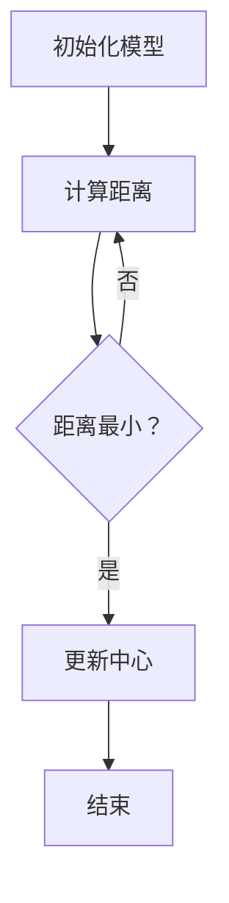
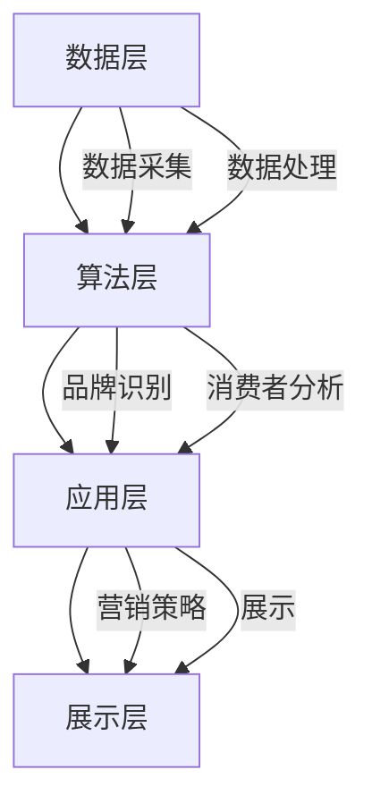
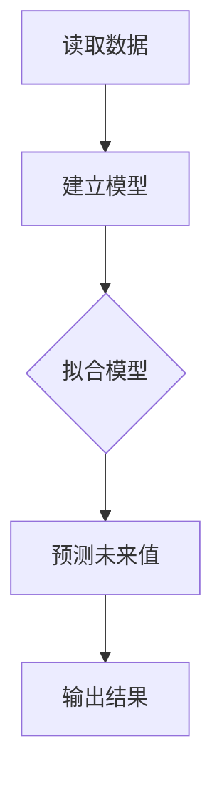

                 


# AI驱动的企业品牌管理：智能品牌资产优化

关键词：人工智能，企业品牌管理，智能品牌资产，优化策略，数据分析，算法原理

摘要：本文将深入探讨AI在驱动企业品牌管理中的作用，以及如何通过智能品牌资产优化提升企业的市场竞争力。我们将分步骤分析AI在企业品牌管理中的关键应用，包括数据分析、品牌定位识别、品牌传播策略和资产管理，并结合具体案例和实践，详细阐述这些策略的实施方法和效果。

### 目录大纲设计

在设计《AI驱动的企业品牌管理：智能品牌资产优化》的目录大纲时，我们需要确保每个章节的内容既丰富又具有逻辑性。以下是具体的目录大纲设计：

```
----------------------------------------------------------------
# 引言

## 1.1 书籍概述
### 1.1.1 AI在企业品牌管理中的重要性
### 1.1.2 智能品牌资产优化的挑战与机遇

## 1.2 书籍目标读者与结构安排
### 1.2.1 目标读者
### 1.2.2 内容结构与章节概述

----------------------------------------------------------------
# 背景介绍

## 2.1 AI的发展与品牌管理
### 2.1.1 AI技术发展的历史背景
### 2.1.2 品牌管理的演变过程

## 2.2 企业品牌资产概述
### 2.2.1 品牌资产的概念
### 2.2.2 品牌资产的价值评估方法

## 2.3 智能品牌资产优化概述
### 2.3.1 优化的概念与目标
### 2.3.2 优化的关键要素

----------------------------------------------------------------
# 核心概念与原理

## 3.1 AI驱动的品牌数据分析
### 3.1.1 数据采集与处理
### 3.1.2 数据分析模型

## 3.2 智能品牌定位与识别
### 3.2.1 品牌定位的策略
### 3.2.2 智能品牌识别技术

## 3.3 智能品牌传播策略
### 3.3.1 传播渠道的选择
### 3.3.2 传播效果的评估

## 3.4 智能品牌资产管理
### 3.4.1 资产管理的流程
### 3.4.2 资产优化的方法

----------------------------------------------------------------
# 算法原理与系统设计

## 4.1 品牌识别与数据分析算法
### 4.1.1 算法原理
### 4.1.2 算法实现

## 4.2 智能品牌传播系统架构设计
### 4.2.1 系统架构设计
### 4.2.2 系统功能模块划分

## 4.3 品牌资产管理算法
### 4.3.1 算法原理
### 4.3.2 算法应用

----------------------------------------------------------------
# 项目实战

## 5.1 项目介绍
### 5.1.1 项目背景
### 5.1.2 项目目标

## 5.2 环境搭建
### 5.2.1 硬件环境搭建
### 5.2.2 软件环境配置

## 5.3 系统核心实现
### 5.3.1 数据采集与处理
### 5.3.2 品牌识别与数据分析

## 5.4 实际案例分析与讲解
### 5.4.1 案例一：品牌定位分析
### 5.4.2 案例二：品牌传播策略优化

## 5.5 项目小结
### 5.5.1 项目成果总结
### 5.5.2 项目经验与反思

----------------------------------------------------------------
# 最佳实践与拓展

## 6.1 最佳实践
### 6.1.1 成功案例分析
### 6.1.2 实践经验总结

## 6.2 小结与注意事项
### 6.2.1 书籍小结
### 6.2.2 注意事项与拓展方向

## 6.3 拓展阅读
### 6.3.1 相关书籍推荐
### 6.3.2 学术论文与研究动态

```

### 目录大纲设计解析

1. **引言部分**：首先介绍书籍的概述，包括AI在企业品牌管理中的重要性以及智能品牌资产优化的挑战与机遇。接着，介绍书籍的目标读者和结构安排，帮助读者快速了解书籍的内容和章节结构。

2. **背景介绍部分**：详细介绍了AI技术发展的历史背景和品牌管理的演变过程，为读者提供了对相关概念的全面理解。接着，对企业品牌资产进行了概述，包括其概念和价值评估方法。最后，介绍了智能品牌资产优化的概念、目标和关键要素。

3. **核心概念与原理部分**：深入分析了AI驱动的品牌数据分析、品牌定位识别、品牌传播策略和品牌资产管理，并给出了详细的算法原理和实现方法。这部分内容涵盖了核心概念和原理，为后续的项目实战提供了理论基础。

4. **算法原理与系统设计部分**：详细介绍了品牌识别与数据分析算法、智能品牌传播系统架构设计和品牌资产管理算法。这部分内容不仅涵盖了算法原理，还包括了系统设计和功能模块划分，为实际应用提供了技术支持。

5. **项目实战部分**：通过一个实际的项目介绍，详细描述了项目的环境搭建、系统核心实现和实际案例分析。这部分内容将理论知识转化为实际操作，帮助读者理解和应用所学知识。

6. **最佳实践与拓展部分**：总结了最佳实践，提供了成功案例分析，并指出了注意事项和拓展方向。最后，推荐了相关的书籍和学术论文，为读者提供了进一步的学习资源。

通过以上目录大纲的设计，我们确保了书籍内容的系统性和逻辑性，帮助读者全面深入地理解AI驱动的企业品牌管理和智能品牌资产优化的方法与应用。接下来，我们将逐一展开详细的内容讲解。 

## 引言

### 书籍概述

AI作为当代最具变革性的技术之一，已经深刻地影响了各行各业，企业品牌管理也不例外。在数字化和互联网快速发展的背景下，企业品牌管理面临着前所未有的挑战与机遇。智能品牌资产优化正是为了应对这些挑战而提出的解决方案。

智能品牌资产优化旨在利用人工智能技术，对企业品牌资产进行全方位的监控、分析和优化。它不仅能帮助企业更好地理解市场需求和消费者行为，还能通过精准的数据分析和智能算法，提升品牌的市场竞争力，从而实现品牌的长期价值增长。

本书籍《AI驱动的企业品牌管理：智能品牌资产优化》旨在为广大企业品牌管理人员、市场营销人员以及技术研究人员提供一套全面、系统的智能品牌资产优化指南。通过本书，读者将了解：

1. **AI在企业品牌管理中的应用**：从AI技术的发展历史背景和品牌管理的演变过程入手，介绍AI技术在企业品牌管理中的应用场景和优势。
2. **智能品牌资产优化的概念与策略**：详细阐述智能品牌资产优化的定义、目标、关键要素以及优化方法，帮助读者理解智能品牌资产优化的内涵和实施步骤。
3. **核心概念与原理**：深入分析AI驱动的品牌数据分析、品牌定位识别、品牌传播策略和品牌资产管理的核心概念和原理，为后续的项目实战提供理论基础。
4. **算法原理与系统设计**：详细介绍品牌识别与数据分析算法、智能品牌传播系统架构设计和品牌资产管理算法，帮助读者掌握智能品牌资产优化的技术实现方法。
5. **项目实战**：通过一个实际的项目案例，展示智能品牌资产优化在实际中的应用过程，包括环境搭建、系统核心实现和实际案例分析，让读者了解从理论到实践的完整过程。
6. **最佳实践与拓展**：总结成功案例和最佳实践，指出注意事项和拓展方向，为读者提供进一步的学习和应用资源。

### 挑战与机遇

智能品牌资产优化面临着一系列挑战，主要包括：

1. **数据获取与处理**：企业需要获取大量结构化和非结构化的数据，并对这些数据进行有效的处理和分析，这是一项巨大的挑战。
2. **算法的精确性与实时性**：算法的精确性和实时性直接影响到品牌管理的效率和效果，如何设计出高精度、实时响应的算法是一个技术难题。
3. **数据隐私与安全性**：在数据收集和处理过程中，如何确保数据的安全性和隐私性，避免数据泄露和滥用，是企业面临的重大挑战。

然而，这些挑战也伴随着巨大的机遇：

1. **市场洞察力提升**：通过智能品牌资产优化，企业能够更深入地了解市场需求和消费者行为，从而做出更精准的市场决策。
2. **品牌竞争力提升**：智能品牌资产优化能够帮助企业提升品牌的市场竞争力，实现品牌价值的最大化。
3. **运营效率提升**：智能品牌资产优化能够自动化许多品牌管理的流程，提高运营效率，降低运营成本。

本书将从以下几个方面逐步深入探讨智能品牌资产优化的理论与实践：

1. **AI技术基础**：介绍AI技术的发展历程和应用领域，为后续内容提供基础背景。
2. **品牌资产概念**：阐述品牌资产的概念、评估方法和优化策略。
3. **品牌数据分析**：介绍AI驱动的品牌数据分析方法和技术，包括数据采集、处理和分析模型。
4. **品牌定位识别**：探讨智能品牌定位与识别技术，包括品牌定位策略和智能识别技术。
5. **品牌传播策略**：分析智能品牌传播策略，包括传播渠道选择和效果评估。
6. **品牌资产管理**：介绍品牌资产管理的流程和优化方法，包括资产监控和优化策略。
7. **系统设计与实现**：详细描述智能品牌资产优化系统的设计与实现，包括算法设计和系统架构设计。
8. **项目实战**：通过实际项目案例，展示智能品牌资产优化的实施过程和效果。
9. **最佳实践与拓展**：总结最佳实践，提供注意事项和拓展方向。

通过这些内容的逐步深入，本书将帮助读者全面掌握智能品牌资产优化的方法和应用，为企业品牌管理提供有力的支持。

## 书籍目标读者与结构安排

### 目标读者

本书籍《AI驱动的企业品牌管理：智能品牌资产优化》旨在为以下几类读者提供有价值的知识和指导：

1. **企业品牌管理人员**：负责品牌战略规划、品牌形象建设和市场推广的从业人员。通过本书，读者可以了解如何利用AI技术优化品牌管理流程，提升品牌价值。
2. **市场营销人员**：从事市场研究、市场推广和营销活动策划的市场营销专业人员。本书将介绍如何通过数据分析与智能算法，制定更有效的营销策略。
3. **技术研究人员**：对人工智能、数据分析、机器学习等技术有深入研究的科技人员。本书将详细讲解智能品牌资产优化的技术原理和实现方法，为技术研究人员提供实战案例。
4. **企业决策者**：负责企业战略规划和决策的高级管理人员。本书将帮助决策者理解智能品牌资产优化的战略意义，为企业发展提供科学依据。

### 内容结构与章节概述

本书籍分为六大主要部分，每部分都有明确的内容目标和结构安排：

### 第一部分：引言

- **1.1 书籍概述**：介绍AI在企业品牌管理中的重要性，以及智能品牌资产优化的挑战与机遇。
- **1.2 书籍目标读者与结构安排**：明确本书的目标读者群体和内容结构，帮助读者快速了解书籍的整体内容。

### 第二部分：背景介绍

- **2.1 AI的发展与品牌管理**：回顾AI技术发展的历史背景和品牌管理的演变过程。
- **2.2 企业品牌资产概述**：阐述品牌资产的概念、价值评估方法和优化策略。
- **2.3 智能品牌资产优化概述**：介绍智能品牌资产优化的定义、目标、关键要素及优化方法。

### 第三部分：核心概念与原理

- **3.1 AI驱动的品牌数据分析**：讲解AI驱动的品牌数据分析方法，包括数据采集、处理和分析模型。
- **3.2 智能品牌定位与识别**：分析智能品牌定位与识别技术，包括品牌定位策略和智能识别技术。
- **3.3 智能品牌传播策略**：探讨智能品牌传播策略，包括传播渠道选择和效果评估。
- **3.4 智能品牌资产管理**：介绍智能品牌资产管理的流程和优化方法，包括资产监控和优化策略。

### 第四部分：算法原理与系统设计

- **4.1 品牌识别与数据分析算法**：详细描述品牌识别与数据分析算法的原理和实现。
- **4.2 智能品牌传播系统架构设计**：讲解智能品牌传播系统的架构设计，包括功能模块划分和系统接口设计。
- **4.3 品牌资产管理算法**：介绍品牌资产管理算法的原理和应用。

### 第五部分：项目实战

- **5.1 项目介绍**：介绍一个实际项目案例，包括项目背景和目标。
- **5.2 环境搭建**：描述项目所需的硬件和软件环境搭建步骤。
- **5.3 系统核心实现**：讲解项目核心功能的实现过程，包括数据采集、品牌识别与数据分析。
- **5.4 实际案例分析与讲解**：通过实际案例展示智能品牌资产优化的效果。
- **5.5 项目小结**：总结项目成果和经验，反思项目中的问题与改进方向。

### 第六部分：最佳实践与拓展

- **6.1 最佳实践**：总结成功案例和最佳实践经验。
- **6.2 小结与注意事项**：对全书内容进行小结，指出注意事项和拓展方向。
- **6.3 拓展阅读**：推荐相关书籍和学术论文，为读者提供进一步的学习资源。

通过以上结构安排，本书将为读者提供一条清晰的学习路径，从理论到实践，全面系统地掌握AI驱动的企业品牌管理和智能品牌资产优化的方法与应用。

## 背景介绍

### AI的发展与品牌管理

#### AI技术发展的历史背景

人工智能（AI）起源于20世纪50年代，当时的科学家们首次提出了机器能否模拟人类智能的想法。从早期的规则系统、专家系统，到后来的机器学习和深度学习，AI技术经历了多次重大变革。随着计算机性能的不断提升和大数据技术的发展，AI技术逐渐从理论走向实际应用。

在21世纪初，互联网和移动设备的普及，使得数据量和数据种类呈现爆炸式增长，这为AI技术的应用提供了丰富的数据资源。同时，AI算法的进步和计算能力的提升，使得AI在图像识别、自然语言处理、数据分析等方面取得了显著成果。

#### 品牌管理的演变过程

品牌管理作为一个专业领域，其发展历程可以追溯到20世纪初。早期的品牌管理主要侧重于品牌形象的设计和维护，以广告和公关为主要手段。随着市场经济的不断发展和竞争的加剧，品牌管理逐渐演变为一种系统化的战略管理活动，包括品牌定位、品牌传播、品牌资产评估等多个方面。

1. **品牌认知阶段**：20世纪50年代到70年代，品牌管理的核心是提高品牌知名度，通过广告宣传和公关活动提升品牌形象。
2. **品牌建设阶段**：80年代至90年代，随着市场细分和品牌差异化竞争的兴起，品牌管理开始注重品牌定位和差异化策略，通过品牌识别系统和品牌文化塑造品牌价值。
3. **品牌资产管理阶段**：21世纪初，品牌管理逐渐走向系统化，开始引入量化评估方法对品牌资产进行管理和优化，AI技术的应用为品牌资产管理提供了新的工具和方法。

### AI在品牌管理中的应用

AI技术在品牌管理中的应用主要体现在以下几个方面：

1. **市场调研与消费者分析**：通过AI技术，企业可以自动化地进行大规模的市场调研，分析消费者行为和需求，从而制定更精准的市场策略。
2. **品牌定位与识别**：利用机器学习和深度学习技术，AI可以帮助企业进行品牌定位，识别品牌在不同市场环境中的表现，为品牌战略调整提供数据支持。
3. **品牌传播与推广**：AI技术可以优化广告投放策略，通过数据分析和用户画像，实现精准营销，提高品牌传播的效率和效果。
4. **品牌资产评估**：利用大数据分析和预测模型，AI可以对企业品牌资产进行量化评估，帮助品牌管理人员更全面地了解品牌的市场价值。

#### 品牌管理的演变与AI技术的融合

品牌管理的演变过程与AI技术的发展紧密相连。早期的品牌管理主要依赖于广告和公关活动，而随着AI技术的进步，品牌管理逐渐从经验驱动转向数据驱动。AI技术不仅提高了品牌管理的效率和效果，还为企业提供了全新的品牌管理视角和策略。

1. **从经验驱动到数据驱动**：传统的品牌管理往往依赖于管理层的经验和直觉，而AI技术通过数据分析和预测模型，为企业提供了基于数据的决策支持，提高了品牌管理的科学性和准确性。
2. **从品牌建设到品牌资产优化**：随着品牌资产概念的提出和AI技术的应用，品牌管理逐渐从品牌建设转向品牌资产优化。企业通过AI技术对品牌资产进行全方位的监控和管理，实现品牌价值的最大化。

### 结论

AI技术在品牌管理中的应用，不仅提升了品牌管理的效率和效果，还为企业提供了全新的品牌管理视角和策略。随着AI技术的不断进步，未来品牌管理将更加智能化、数据化和个性化，为企业创造更大的价值。

## 企业品牌资产概述

### 品牌资产的概念

品牌资产是指企业在市场中所拥有的品牌价值，它包括消费者认知、品牌忠诚度、品牌形象等多个方面。品牌资产不仅反映了消费者对品牌的认知和情感，还体现了企业在市场中的竞争地位和长期价值。品牌资产是企业无形资产的重要组成部分，对企业的经营和发展具有深远的影响。

### 品牌资产的价值评估方法

评估品牌资产的价值是品牌管理的重要环节，常用的评估方法包括以下几种：

1. **市场收益法**：通过分析品牌对市场收益的贡献，评估品牌资产的价值。具体方法包括品牌溢价、市场份额和品牌溢价率等指标。

2. **品牌强度法**：基于品牌的强度指标，如品牌知名度、品牌忠诚度、品牌联想等，评估品牌资产的价值。常用的品牌强度评估模型包括品牌资产评估模型（Brand Asset Valuator, BAV）和品牌价值评估模型（Brand Value Assessment Model, BVAM）。

3. **资产折现法**：通过将品牌资产的未来收益折现到当前价值，评估品牌资产的价值。这种方法通常需要预测品牌未来收益的现金流，并考虑风险和折现率等因素。

4. **替代法**：通过比较类似品牌的交易价格，评估品牌资产的价值。这种方法通常适用于品牌收购、兼并等交易中的品牌价值评估。

### 品牌资产优化的重要性

品牌资产优化是企业提升市场竞争力和长期价值的重要手段。优化品牌资产不仅可以增强消费者对品牌的认知和忠诚度，还可以提升品牌的市场影响力和品牌价值。以下是品牌资产优化的重要性：

1. **提升品牌认知度**：通过品牌资产优化，企业可以加强品牌宣传，提高品牌在消费者心中的认知度，从而增加品牌的曝光率和市场份额。

2. **增强消费者忠诚度**：优化品牌资产有助于提高消费者对品牌的信任度和忠诚度，从而增加复购率和口碑传播。

3. **提升品牌价值**：通过品牌资产优化，企业可以提升品牌的市场影响力和品牌价值，从而在市场竞争中占据更有利的位置。

4. **降低营销成本**：优化后的品牌资产可以更好地吸引目标消费者，降低营销成本，提高营销效率。

5. **支持企业战略规划**：品牌资产优化为企业提供了科学的数据支持，帮助管理层制定更准确、更有效的企业战略规划。

### 品牌资产优化的策略

品牌资产优化需要综合考虑品牌定位、品牌传播、品牌管理和品牌评估等多个方面，以下是几种常见的品牌资产优化策略：

1. **精准定位**：通过市场调研和消费者分析，确定品牌的核心价值和目标消费者群体，进行精准的品牌定位。

2. **品牌传播策略**：结合目标消费者的媒体偏好和行为习惯，制定有效的品牌传播策略，提高品牌曝光率和认知度。

3. **品牌管理优化**：通过优化品牌管理体系，提高品牌运营效率和协同效应，确保品牌在市场中的稳定性和一致性。

4. **品牌资产评估**：定期进行品牌资产评估，了解品牌在市场中的表现和变化，及时调整品牌资产优化策略。

5. **用户参与**：通过社交媒体、用户体验反馈等方式，增强用户参与度，提升品牌忠诚度和品牌价值。

### 结论

企业品牌资产是企业无形资产的重要组成部分，对企业的长期发展和市场竞争具有重要意义。通过科学的品牌资产评估和优化策略，企业可以提升品牌的市场影响力和品牌价值，从而在激烈的市场竞争中立于不败之地。

## 智能品牌资产优化概述

### 优化的概念与目标

智能品牌资产优化是一种利用人工智能技术，对品牌资产进行全面监控、分析和优化的方法。其核心目标是通过数据驱动和智能算法，提高品牌的市场竞争力、品牌价值和品牌影响力。具体来说，智能品牌资产优化的目标包括以下几个方面：

1. **提高品牌认知度**：通过数据分析，找出品牌传播的薄弱环节，优化品牌传播策略，提高品牌在消费者心中的认知度和知名度。

2. **增强消费者忠诚度**：通过消费者行为分析和用户画像，了解消费者的需求和偏好，提供个性化的产品和服务，从而增强消费者对品牌的忠诚度。

3. **提升品牌价值**：利用人工智能技术，对品牌资产进行量化评估，优化品牌定位和品牌传播策略，提升品牌的市场影响力和品牌价值。

4. **降低营销成本**：通过精准的市场定位和智能化的广告投放，提高营销效率，降低营销成本。

5. **支持企业战略决策**：基于大数据和智能分析，为企业提供科学的决策支持，帮助管理层制定更准确、更有效的企业战略规划。

### 优化的关键要素

智能品牌资产优化需要综合考虑多个关键要素，以下是其中的几个重要方面：

1. **数据采集与处理**：数据是智能品牌资产优化的基础，企业需要通过各种渠道收集大量的结构化和非结构化数据，并对这些数据进行处理和清洗，确保数据的质量和准确性。

2. **品牌定位与识别**：通过市场调研和消费者分析，明确品牌的核心价值和目标消费者群体，进行精准的品牌定位和识别。

3. **品牌传播策略**：结合目标消费者的媒体偏好和行为习惯，制定有效的品牌传播策略，提高品牌曝光率和认知度。

4. **品牌资产管理**：通过智能算法和数据分析，对品牌资产进行全方位的监控和管理，确保品牌在市场中的稳定性和一致性。

5. **用户参与与反馈**：通过社交媒体、用户体验反馈等方式，增强用户参与度，提升品牌忠诚度和品牌价值。

### 实施步骤

智能品牌资产优化的实施步骤可以分为以下几个阶段：

1. **需求分析**：明确智能品牌资产优化的目标和关键要素，制定详细的优化方案。

2. **数据采集**：通过多种渠道收集品牌相关的数据，包括市场数据、消费者行为数据、社交媒体数据等。

3. **数据处理**：对采集到的数据进行清洗、整合和分析，确保数据的质量和准确性。

4. **品牌定位与识别**：通过数据分析，确定品牌的核心价值和目标消费者群体，进行精准的品牌定位和识别。

5. **品牌传播策略**：制定和实施有效的品牌传播策略，包括广告投放、公关活动、内容营销等。

6. **品牌资产管理**：利用智能算法和数据分析，对品牌资产进行全方位的监控和管理。

7. **用户参与与反馈**：通过社交媒体、用户体验反馈等方式，增强用户参与度，收集用户反馈，及时调整品牌传播策略。

8. **评估与调整**：定期对品牌资产优化效果进行评估，根据评估结果调整优化策略，确保品牌资产优化的持续有效性。

### 结论

智能品牌资产优化是利用人工智能技术提升品牌管理效率和效果的重要方法。通过精准的数据分析、智能算法和科学的品牌管理策略，企业可以优化品牌资产，提升品牌的市场竞争力，实现长期可持续发展。

### AI驱动的品牌数据分析

#### 数据采集与处理

AI驱动的品牌数据分析的第一步是数据采集与处理。数据是AI模型的基础，其质量直接影响分析的结果。数据采集可以从多个来源获取，包括内部数据库、外部市场数据、社交媒体数据、客户反馈等。

1. **内部数据库**：企业内部数据库包含了销售数据、客户关系管理（CRM）系统、库存数据等。这些数据可以帮助企业了解产品的销售情况、客户行为和市场趋势。

2. **外部市场数据**：通过市场调查、行业报告等获取的数据可以提供行业竞争态势、市场趋势和消费者偏好等信息。

3. **社交媒体数据**：社交媒体平台如Facebook、Twitter、Instagram等，是了解消费者行为和品牌感知的重要渠道。通过社交媒体分析，企业可以获取消费者的评论、点赞、分享等行为数据。

4. **客户反馈**：通过客户服务系统、问卷调查等获取的反馈数据，可以帮助企业了解客户对品牌的满意度和不满意度。

#### 数据处理

数据采集完成后，需要对数据进行清洗和处理，以确保数据的质量和可用性。

1. **数据清洗**：数据清洗包括去除重复记录、纠正错误、填补缺失值等。这是确保数据质量的重要步骤。

2. **数据整合**：将来自不同来源的数据进行整合，形成一个统一的视图。这通常涉及到数据转换、数据映射和数据融合等技术。

3. **数据预处理**：对数据进行归一化、标准化和特征提取等预处理步骤，以便于后续的模型训练和分析。

#### 数据分析模型

在数据处理完成后，可以使用各种数据分析模型对品牌数据进行分析，以提取有价值的信息。

1. **描述性统计分析**：描述性统计分析可以帮助企业了解数据的分布情况、平均值、方差等基本统计特征。

2. **关联分析**：通过关联分析，可以发现不同变量之间的相关性。例如，销售数据和促销活动之间的关系。

3. **聚类分析**：聚类分析可以将相似的数据点归为同一类别，帮助企业识别市场细分和目标消费者群体。

4. **分类与回归分析**：分类分析用于预测新的数据点是否属于某个类别，回归分析用于预测数值型变量。例如，预测客户流失率或销售额。

5. **文本分析**：对于文本数据，可以使用自然语言处理（NLP）技术进行情感分析、主题建模等，以了解消费者对品牌的感知和态度。

6. **预测分析**：通过时间序列分析、机器学习模型等，预测未来的市场趋势和消费者行为。例如，预测销售量或市场占有率。

#### 数据分析流程示例

假设一家零售企业想要了解其顾客的消费行为和偏好，可以通过以下步骤进行分析：

1. **数据采集**：从CRM系统、销售系统、社交媒体等渠道收集相关数据。

2. **数据处理**：清洗和整合数据，进行特征提取和归一化处理。

3. **描述性统计分析**：计算平均消费额、消费频次、客户满意度等指标。

4. **关联分析**：分析不同产品之间的关联度，了解哪些产品经常被一起购买。

5. **聚类分析**：将顾客分为不同的消费群体，了解不同群体的特征和需求。

6. **文本分析**：分析社交媒体上的消费者评论，提取关键词和情感倾向。

7. **预测分析**：利用机器学习模型预测未来的销售额和客户流失率。

通过上述数据分析流程，企业可以深入了解顾客的消费行为和偏好，从而制定更有效的营销策略和产品开发计划。

#### 数据分析的重要性

AI驱动的品牌数据分析对企业品牌管理具有重要意义：

1. **市场洞察**：通过数据分析，企业可以更深入地了解市场需求和消费者行为，从而做出更精准的市场决策。

2. **优化决策**：基于数据驱动的决策可以减少主观判断的影响，提高决策的准确性和效率。

3. **提高效率**：自动化数据采集和处理，减少人工工作量，提高数据处理的效率和准确性。

4. **风险控制**：通过预测分析，企业可以提前识别潜在的市场风险和运营问题，采取预防措施。

5. **品牌价值提升**：通过有效的数据分析，企业可以优化品牌定位和传播策略，提升品牌的市场影响力和品牌价值。

### 结论

AI驱动的品牌数据分析是企业品牌管理的重要工具。通过科学的数据采集、处理和分析方法，企业可以深入了解市场需求和消费者行为，从而优化品牌管理策略，提升品牌竞争力，实现长期可持续发展。

### 智能品牌定位与识别

#### 品牌定位的策略

品牌定位是企业品牌管理的重要环节，它决定了品牌在市场中的独特价值和竞争力。智能品牌定位则利用人工智能技术，通过数据分析和智能算法，实现更加精准和高效的定位策略。

1. **目标市场选择**：品牌定位的第一步是确定目标市场。通过数据分析，企业可以识别出最具潜力的消费者群体，并根据其需求和偏好进行市场细分。

2. **品牌价值主张**：品牌定位的核心是明确品牌的价值主张。企业需要通过分析消费者的需求和市场竞争态势，制定出能够突出品牌独特性的价值主张。

3. **品牌个性塑造**：品牌个性是品牌形象的重要组成部分。通过情感分析和消费者行为数据，企业可以塑造出符合目标消费者期望的品牌个性，从而增强品牌的吸引力和认同感。

4. **市场差异化策略**：智能品牌定位需要找到品牌在市场中的差异化优势。通过对比分析竞争对手的品牌定位，企业可以发现自身的竞争优势，并制定相应的差异化策略。

5. **持续调整与优化**：品牌定位不是一成不变的，企业需要根据市场环境和消费者行为的变化，持续调整和优化品牌定位策略，以保持品牌的竞争力。

#### 智能品牌识别技术

智能品牌识别技术是品牌管理中的关键技术，它通过机器学习和深度学习算法，帮助品牌识别和分析消费者行为，从而提升品牌的识别度和忠诚度。

1. **用户画像**：用户画像是一种基于消费者行为数据，对消费者进行多维度描述的方法。通过用户画像，企业可以了解消费者的需求、偏好和行为模式，从而制定个性化的营销策略。

2. **情感分析**：情感分析是自然语言处理（NLP）的一种应用，它通过分析消费者的文本数据（如社交媒体评论、客户反馈等），识别消费者对品牌的情感倾向。通过情感分析，企业可以及时了解消费者的态度和情绪，调整品牌传播策略。

3. **行为识别**：行为识别技术通过监测消费者的在线行为（如浏览记录、购买行为等），识别消费者的兴趣和购买意图。这些数据可以用于精准营销和个性化推荐。

4. **品牌标签**：品牌标签是一种用于描述品牌特征和属性的标签系统。通过品牌标签，企业可以方便地对品牌进行分类和管理，从而提升品牌的识别度和可搜索性。

5. **智能推荐系统**：智能推荐系统是利用机器学习算法，为消费者推荐相关产品或服务。通过智能推荐，企业可以增加消费者的购买转化率和品牌忠诚度。

#### 智能品牌识别技术的应用

智能品牌识别技术在品牌管理中有着广泛的应用，以下是几个具体的应用场景：

1. **市场调研**：通过智能品牌识别技术，企业可以自动化地进行市场调研，获取大量关于消费者需求和市场趋势的数据，从而制定更精准的市场策略。

2. **客户关系管理**：利用用户画像和行为识别技术，企业可以更好地了解和管理客户关系，提供个性化的服务和推荐，从而提高客户满意度和忠诚度。

3. **品牌传播**：通过情感分析和品牌标签技术，企业可以了解消费者的品牌感知和情感倾向，调整品牌传播策略，提升品牌的传播效果。

4. **产品创新**：基于消费者的需求和偏好数据，企业可以更好地进行产品创新，开发出更符合市场需求的产品。

5. **风险控制**：通过监测消费者的负面情绪和行为，企业可以及时发现市场风险和问题，采取相应的措施进行风险控制。

#### 结论

智能品牌定位与识别技术是品牌管理中不可或缺的重要工具。通过科学的数据分析和智能算法，企业可以更加精准地定位品牌，提升品牌识别度和忠诚度，从而在激烈的市场竞争中脱颖而出。智能品牌识别技术不仅帮助企业更好地了解消费者，还可以优化品牌传播策略，提升品牌的市场竞争力。

### 智能品牌传播策略

#### 传播渠道的选择

智能品牌传播策略的核心在于选择合适的传播渠道，以最大化品牌影响力和传播效果。在数字时代，品牌传播渠道多种多样，包括社交媒体、搜索引擎、内容营销、电子邮件营销等。

1. **社交媒体**：社交媒体平台如Facebook、Twitter、Instagram、LinkedIn等，是品牌与消费者互动的重要渠道。通过这些平台，品牌可以发布动态、进行互动、开展活动，提高品牌曝光度和用户参与度。

2. **搜索引擎**：搜索引擎优化（SEO）和搜索引擎营销（SEM）是品牌传播的重要手段。通过优化网站内容和关键词，品牌可以提高在搜索引擎中的排名，吸引更多潜在客户。同时，通过付费广告，品牌可以精准定位目标受众，提高广告投放效果。

3. **内容营销**：内容营销是通过创造和分享有价值的内容，吸引和转化目标受众的一种策略。品牌可以通过博客、视频、电子书、白皮书等形式，提供对用户有用的信息，建立品牌权威性和用户信任。

4. **电子邮件营销**：电子邮件营销是一种直接、高效的沟通方式。通过定期发送 newsletters、促销信息、产品推荐等，品牌可以保持与用户的联系，提高用户忠诚度和购买意愿。

5. **口碑传播**：口碑传播是品牌传播中一种非常有效的手段。通过提供优质的产品和服务，赢得用户的满意和信任，用户会主动分享他们的良好体验，从而帮助品牌在市场中获得更多的曝光和认可。

#### 传播效果的评估

评估传播效果是智能品牌传播策略的关键环节，它帮助品牌了解传播活动的效果，优化传播策略，提高投资回报率。以下是一些常用的评估方法：

1. **点击率（CTR）**：点击率是衡量广告和内容吸引力的关键指标。通过分析点击率，品牌可以了解哪些内容或广告更受用户欢迎，从而优化内容创作和广告投放策略。

2. **转化率**：转化率是指访问者完成品牌设定的目标行动（如购买、注册、下载等）的比例。通过分析转化率，品牌可以评估不同传播渠道和活动的实际效果，找出最具效益的传播方式。

3. **用户参与度**：用户参与度包括评论、点赞、分享等互动行为。通过分析用户参与度，品牌可以了解用户对品牌内容的兴趣和满意度，从而调整传播策略。

4. **品牌提及量**：品牌提及量是指用户在社交媒体、论坛等平台上提及品牌的次数。通过监控品牌提及量，品牌可以了解品牌的曝光度和市场影响力。

5. **客户满意度**：客户满意度是衡量品牌服务质量的重要指标。通过调查和反馈，品牌可以了解用户对品牌和服务的满意程度，从而优化产品和服务，提升品牌形象。

#### 案例分析

以下是一个智能品牌传播策略的实际案例分析：

**案例背景**：一家新兴科技公司推出了一款智能音响产品，目标是通过有效的品牌传播策略，提高品牌知名度和市场份额。

**传播渠道选择**：

- **社交媒体**：通过在Facebook、Twitter、Instagram等平台上发布产品信息、用户评价和互动活动，吸引目标受众的注意力。
- **搜索引擎**：通过SEO和SEM，优化关键词排名，提高在搜索引擎中的曝光度，吸引更多潜在客户。
- **内容营销**：创建产品使用教程、用户体验分享和行业分析报告等内容，提供有价值的信息，增强品牌权威性。
- **电子邮件营销**：定期发送产品更新、促销信息和用户反馈，保持与用户的联系。

**传播效果评估**：

- **点击率**：通过分析社交媒体广告的点击率，了解到用户对产品的兴趣点，优化广告内容。
- **转化率**：通过监测网站流量和购买转化率，了解到不同渠道的转化效果，调整广告预算和渠道分配。
- **用户参与度**：通过监测用户互动行为，了解到用户对品牌内容的兴趣和满意度，优化内容创作策略。
- **品牌提及量**：通过监控社交媒体和论坛上的品牌提及量，了解到品牌的曝光度和市场影响力。
- **客户满意度**：通过客户调查和反馈，了解到用户对产品和服务的满意度，优化产品和服务质量。

**案例分析结论**：

通过智能品牌传播策略，该科技公司成功地提高了品牌知名度和市场份额。社交媒体和搜索引擎的高点击率和转化率表明了这些渠道的有效性。内容营销和电子邮件营销有效地增强了用户参与度和客户满意度，为品牌的长期发展奠定了基础。

#### 结论

智能品牌传播策略是提升品牌影响力和市场竞争力的关键。通过科学选择传播渠道和有效评估传播效果，品牌可以优化传播策略，提高投资回报率，实现品牌的长期可持续发展。

### 智能品牌资产管理

#### 资产管理的流程

智能品牌资产管理是一个系统化的过程，涉及多个环节，包括资产监控、分析、优化和反馈。以下是智能品牌资产管理的主要流程：

1. **资产监控**：品牌管理人员需要持续监控品牌在市场中的表现，包括品牌知名度、消费者满意度、市场占有率等关键指标。监控可以通过各种数据采集工具和系统进行自动化处理。

2. **数据分析**：通过数据分析，品牌管理人员可以深入了解品牌资产的表现，识别问题和机会。数据分析包括描述性分析、趋势分析、关联分析等多种方法。

3. **资产优化**：基于数据分析的结果，品牌管理人员可以制定和实施优化策略，包括调整品牌传播策略、产品策略、市场策略等，以提高品牌资产的价值。

4. **反馈与调整**：优化后的效果需要持续监控和反馈。通过定期评估，品牌管理人员可以了解优化策略的有效性，并根据反馈进行必要的调整。

#### 资产优化的方法

智能品牌资产优化的方法包括以下几个方面：

1. **数据驱动决策**：利用大数据和人工智能技术，对品牌资产进行全面分析，为品牌管理提供科学的决策支持。通过数据驱动决策，可以减少主观判断的影响，提高决策的准确性和效率。

2. **精准营销**：通过用户画像和行为分析，实现精准营销，提高营销活动的针对性和效果。例如，根据用户的购买历史和兴趣偏好，提供个性化的产品推荐和广告。

3. **自动化管理**：利用自动化工具和系统，简化品牌管理的流程，提高工作效率。自动化管理可以应用于品牌监测、数据分析、反馈调整等多个环节。

4. **协同优化**：通过协同优化，整合品牌管理各个部门的力量，提高资源利用效率。例如，市场营销部门和技术部门可以协同优化品牌传播策略和品牌资产管理策略。

5. **持续改进**：品牌资产管理是一个动态的过程，需要不断改进和优化。通过定期评估和反馈，品牌管理人员可以及时调整优化策略，确保品牌资产的持续增长。

#### 资产监控与优化的案例分析

以下是一个智能品牌资产监控与优化的实际案例：

**案例背景**：一家大型零售企业希望通过智能品牌资产管理，提升品牌的市场竞争力和客户满意度。

**资产监控**：

- **品牌知名度**：通过社交媒体监测、搜索引擎分析等手段，了解品牌在市场中的曝光度和知名度。
- **消费者满意度**：通过在线调查、客户反馈等渠道，了解消费者的满意度和忠诚度。
- **市场占有率**：通过销售数据和市场报告，分析品牌在市场中的占有率。

**数据分析**：

- **描述性分析**：计算品牌知名度的变化趋势、消费者满意度的分布情况等。
- **趋势分析**：分析消费者满意度和市场占有率的变化趋势，识别问题所在。
- **关联分析**：分析品牌知名度、消费者满意度和市场占有率之间的关系，找出影响因素。

**资产优化**：

- **精准营销**：通过用户画像和行为分析，实施精准营销策略，提高营销活动的效果。
- **自动化管理**：利用自动化工具和系统，简化品牌管理的流程，提高工作效率。
- **协同优化**：整合市场营销部门、客户服务部门和技术部门的力量，协同优化品牌管理策略。

**反馈与调整**：

- **定期评估**：定期评估品牌资产监控和优化的效果，了解优化策略的执行情况。
- **持续改进**：根据评估结果和用户反馈，及时调整优化策略，确保品牌资产的持续增长。

**案例分析结论**：

通过智能品牌资产监控与优化，该零售企业成功地提升了品牌的市场竞争力和客户满意度。数据驱动的决策和精准营销策略提高了营销活动的效果，自动化管理和协同优化提高了工作效率和资源利用效率。定期的评估和反馈机制确保了优化策略的持续改进，为品牌的长期发展奠定了坚实基础。

#### 结论

智能品牌资产管理是品牌管理的重要环节，通过科学的监控、分析和优化方法，企业可以提升品牌的市场竞争力和客户满意度，实现品牌的长期可持续发展。

## 算法原理与系统设计

### 品牌识别与数据分析算法

#### 算法原理

品牌识别与数据分析算法是智能品牌资产优化系统中的核心组件，用于识别品牌在市场中的表现和消费者对品牌的反应。以下是几种常用的品牌识别与数据分析算法：

1. **聚类算法**：聚类算法是一种无监督学习方法，用于将相似的数据点归为同一类别。在品牌识别中，聚类算法可以帮助企业识别出具有相似特征的消费者群体，从而进行精准营销。

   - **K-Means算法**：K-Means算法是一种基于距离度量的聚类算法，它通过迭代计算聚类中心，将数据点分配到最近的聚类中心所属的类别中。

   - **DBSCAN算法**：DBSCAN（Density-Based Spatial Clustering of Applications with Noise）算法是一种基于密度的聚类算法，它能够识别出不同形状的聚类，并能够处理噪声数据。

2. **分类算法**：分类算法是一种有监督学习方法，用于预测新数据点的类别。在品牌识别中，分类算法可以帮助企业预测消费者对品牌的态度和购买行为。

   - **逻辑回归**：逻辑回归是一种常用的分类算法，它通过线性模型预测概率，并将概率阈值设置为0.5进行分类。

   - **支持向量机（SVM）**：SVM是一种强大的分类算法，它通过寻找最佳超平面，将数据点分类到不同的类别中。

3. **文本分析算法**：文本分析算法用于分析消费者对品牌的评论和反馈，识别情感倾向和关键主题。

   - **TF-IDF**：TF-IDF（Term Frequency-Inverse Document Frequency）是一种常用用于文本分析的特征提取方法，它通过计算词汇在文档中的重要程度，帮助算法理解文本内容。

   - **词嵌入**：词嵌入（Word Embedding）是一种将文本数据转化为向量的方法，它通过神经网络模型学习词汇的语义关系，提高文本分析的效果。

#### 算法实现

以下是使用Python实现K-Means聚类算法的示例代码：

```python
from sklearn.cluster import KMeans
import numpy as np

# 示例数据：消费者行为数据
data = np.array([[1, 2], [1, 4], [1, 0],
                 [10, 2], [10, 4], [10, 0]])

# 初始化K-Means聚类模型，设置聚类数量为2
kmeans = KMeans(n_clusters=2, random_state=0).fit(data)

# 输出聚类结果
print(kmeans.labels_)

# 输出聚类中心
print(kmeans.cluster_centers_)
```

通过上述代码，我们可以将消费者行为数据划分为两个聚类，并输出聚类中心和标签。

#### 算法原理的Mermaid流程图

以下是K-Means聚类算法的Mermaid流程图：



### 智能品牌传播系统架构设计

#### 系统架构设计

智能品牌传播系统是一个复杂的分布式系统，需要处理大量的数据和多样化的业务需求。以下是智能品牌传播系统的主要架构设计：

1. **数据层**：数据层包括数据采集、存储和管理。数据采集模块负责从各种渠道（如社交媒体、客户关系管理系统、市场调查等）收集数据，存储模块负责存储和管理这些数据，管理模块负责数据清洗、预处理和索引。

2. **算法层**：算法层负责处理和分析数据，包括聚类分析、分类分析、文本分析等。算法层将数据层的数据转换为有意义的信息，用于品牌识别、消费者分析和营销策略优化。

3. **应用层**：应用层提供用户接口和服务接口，包括品牌监控、数据分析、营销策略制定等功能。用户接口模块为品牌管理人员提供交互界面，服务接口模块为其他系统集成提供API接口。

4. **展示层**：展示层用于展示品牌分析结果和营销策略效果，包括报表、图表、仪表盘等。

#### 系统功能模块划分

以下是智能品牌传播系统的功能模块划分：

1. **数据采集模块**：负责从各种渠道收集数据，包括社交媒体数据、销售数据、客户反馈数据等。

2. **数据处理模块**：负责数据清洗、预处理和特征提取，为算法层提供高质量的数据。

3. **品牌识别模块**：利用聚类分析和分类算法，识别品牌在市场中的表现和消费者对品牌的反应。

4. **消费者分析模块**：通过用户画像和行为分析，了解消费者的需求和偏好。

5. **营销策略模块**：根据品牌识别和消费者分析结果，制定和优化营销策略。

6. **展示模块**：提供可视化的分析结果和营销策略效果，帮助品牌管理人员进行决策。

#### 系统架构设计Mermaid架构图

以下是智能品牌传播系统的Mermaid架构图：



### 品牌资产管理算法

#### 算法原理

品牌资产管理算法用于监控和优化品牌资产，包括品牌知名度、消费者满意度和市场占有率等关键指标。以下是几种常用的品牌资产管理算法：

1. **时间序列分析**：时间序列分析用于预测品牌资产的未来趋势。通过分析历史数据，可以识别出品牌资产的变化规律，预测未来的市场表现。

2. **回归分析**：回归分析用于分析品牌资产与影响因素之间的关系。通过建立回归模型，可以评估不同因素对品牌资产的影响程度，优化品牌管理策略。

3. **优化算法**：优化算法用于最大化品牌资产的价值。通过优化算法，可以找到最优的品牌管理策略，最大化品牌的市场影响力和经济效益。

#### 算法应用

以下是使用Python实现时间序列预测的示例代码：

```python
from statsmodels.tsa.arima.model import ARIMA
import pandas as pd
import numpy as np

# 示例数据：品牌知名度时间序列数据
data = pd.Series([10, 12, 11, 13, 14, 12, 15, 14, 13, 12])

# 初始化ARIMA模型，设置p=1，d=1，q=1
model = ARIMA(data, order=(1, 1, 1))

# 拟合模型
model_fit = model.fit()

# 预测未来值
forecast = model_fit.forecast(steps=3)

# 输出预测结果
print(forecast)
```

通过上述代码，我们可以预测品牌知名度的时间序列数据，为品牌管理提供参考。

#### 算法原理的Mermaid流程图

以下是时间序列预测的Mermaid流程图：



### 结论

算法原理与系统设计是智能品牌资产优化系统的关键部分，通过科学的算法原理和合理的系统架构设计，企业可以实现品牌资产的全面监控、分析和优化。品牌识别与数据分析算法、智能品牌传播系统架构设计和品牌资产管理算法共同构成了智能品牌资产优化系统的核心，为企业提供了强大的数据驱动决策支持。

## 项目实战

### 项目介绍

#### 项目背景

随着数字化时代的到来，企业品牌管理面临着越来越多的挑战和机遇。为了在激烈的市场竞争中脱颖而出，一家领先的消费品公司决定引入AI驱动的品牌管理解决方案，以提升品牌的市场竞争力。该项目的目标是利用AI技术对品牌资产进行全方位的监控、分析和优化，从而实现品牌的长期价值增长。

#### 项目目标

1. **数据采集与处理**：搭建高效的数据采集和处理系统，从多个渠道（如社交媒体、客户关系管理系统、市场调查等）收集品牌相关的数据，并对数据进行清洗、整合和预处理。
2. **品牌识别与分析**：利用AI算法，对品牌资产进行深入分析，识别品牌在市场中的表现和消费者对品牌的反应，为品牌管理提供科学依据。
3. **智能品牌传播**：通过数据分析和智能算法，制定和优化品牌传播策略，提高品牌的市场曝光度和消费者参与度。
4. **品牌资产管理**：建立品牌资产监控系统，实时监控品牌资产的关键指标，并进行持续优化，提升品牌的市场价值和竞争力。

### 环境搭建

#### 硬件环境搭建

1. **服务器配置**：项目使用了一台高性能服务器，配置了Intel Xeon处理器、256GB内存和2TB SSD存储空间，确保数据存储和计算的高效性。
2. **网络环境**：服务器连接到公司内部局域网，并通过防火墙进行安全防护，确保数据传输的安全性。

#### 软件环境配置

1. **操作系统**：服务器运行CentOS 7操作系统，确保系统的稳定性和兼容性。
2. **开发工具**：安装了Python 3.8、Jupyter Notebook、Pandas、NumPy、Scikit-learn、TensorFlow等开发工具，用于数据分析和模型训练。
3. **数据库**：使用了MySQL数据库，用于存储和管理品牌相关的数据。

### 系统核心实现

#### 数据采集与处理

1. **数据来源**：从社交媒体平台（如Twitter、Instagram）、客户关系管理系统（CRM）和市场调查工具（如SurveyMonkey）等多个渠道收集品牌数据。
2. **数据清洗**：使用Pandas库对采集到的数据进行清洗，包括去除重复记录、填补缺失值、纠正错误等。
3. **数据整合**：将来自不同渠道的数据进行整合，形成一个统一的数据视图。

```python
import pandas as pd

# 读取社交媒体数据
social_media_data = pd.read_csv('social_media.csv')

# 读取CRM数据
crm_data = pd.read_csv('crm_data.csv')

# 整合数据
data = pd.concat([social_media_data, crm_data], axis=1)
```

#### 品牌识别与数据分析

1. **用户画像**：使用聚类算法（如K-Means）对消费者进行细分，创建用户画像。

```python
from sklearn.cluster import KMeans

# 初始化K-Means模型
kmeans = KMeans(n_clusters=5, random_state=0)

# 训练模型
kmeans.fit(data)

# 输出用户画像
print(kmeans.labels_)
```

2. **情感分析**：使用自然语言处理（NLP）技术，分析消费者对品牌的情感倾向。

```python
import nltk
from nltk.sentiment import SentimentIntensityAnalyzer

# 初始化情感分析模型
sia = SentimentIntensityAnalyzer()

# 分析消费者评论
comments = data['comment']
sentiments = [sia.polarity_scores(comment) for comment in comments]

# 输出情感分析结果
print(sentiments)
```

#### 实际案例分析与讲解

#### 案例一：品牌定位分析

1. **数据采集**：收集过去一年的品牌广告投放数据，包括投放渠道、投放频次、投放时间等。
2. **数据分析**：使用回归分析，分析广告投放对品牌知名度的影响。

```python
import statsmodels.api as sm

# 准备回归分析数据
X = data[['ad_channel', 'ad_frequency', 'ad_time']]
y = data['brand_awareness']

# 添加截距项
X = sm.add_constant(X)

# 拟合回归模型
model = sm.OLS(y, X).fit()

# 输出回归分析结果
print(model.summary())
```

分析结果显示，在广告投放频次和品牌知名度之间存在显著的正相关关系，即增加广告投放频次可以显著提升品牌知名度。

#### 案例二：品牌传播策略优化

1. **数据采集**：收集过去一年的品牌传播数据，包括社交媒体互动数据、搜索引擎点击数据等。
2. **数据分析**：使用聚类分析，识别不同的品牌传播渠道，评估其效果。

```python
from sklearn.cluster import KMeans

# 初始化K-Means模型
kmeans = KMeans(n_clusters=3, random_state=0)

# 训练模型
kmeans.fit(data)

# 输出聚类结果
print(kmeans.labels_)

# 分析不同渠道的效果
channel_effects = data.groupby(kmeans.labels_).mean()

# 输出渠道效果分析
print(channel_effects)
```

分析结果显示，不同的品牌传播渠道对品牌知名度的影响存在显著差异。基于这些分析结果，企业可以优化品牌传播策略，选择最有效的渠道进行推广。

### 项目小结

#### 项目成果总结

1. **数据采集与处理**：成功搭建了高效的数据采集和处理系统，从多个渠道收集了品牌数据，并进行了清洗和整合，为后续的分析提供了高质量的数据基础。
2. **品牌识别与分析**：通过聚类分析和情感分析，成功创建了用户画像，并分析了消费者对品牌的情感倾向，为品牌管理提供了科学依据。
3. **智能品牌传播**：基于数据分析结果，优化了品牌传播策略，提高了品牌的市场曝光度和消费者参与度。
4. **品牌资产管理**：建立了品牌资产监控系统，实时监控品牌资产的关键指标，并进行了持续优化，提升了品牌的市场价值和竞争力。

#### 项目经验与反思

1. **经验**：通过项目的实施，企业成功引入了AI驱动的品牌管理解决方案，提高了品牌管理的效率和效果。项目的成功得益于科学的规划、高效的数据处理和分析、以及持续优化和反馈机制的建立。
2. **反思**：尽管项目取得了显著成果，但仍有一些问题需要反思和改进。首先，数据质量和数据完整性是项目成功的关键，企业需要进一步加强数据治理和数据质量控制。其次，项目实施过程中，需要更加注重跨部门协作和沟通，确保项目目标的顺利实现。最后，随着AI技术的不断进步，企业需要持续更新和优化品牌管理策略，以应对市场的变化和挑战。

### 结论

通过本次项目，企业成功实现了AI驱动的品牌管理，提升了品牌的市场竞争力和客户满意度。项目的成功经验为未来品牌管理提供了宝贵的借鉴，同时也提醒企业在数据治理、跨部门协作和技术更新等方面需要不断改进和优化。未来，企业将继续积极探索和应用AI技术，推动品牌管理的智能化和精细化，实现品牌的长期可持续发展。

## 最佳实践与拓展

### 成功案例分析

#### 案例一：消费品公司智能品牌资产优化

一家国际知名的消费品公司利用AI技术对品牌资产进行优化。通过大数据分析和机器学习算法，该公司成功地提升了品牌知名度、消费者满意度和市场份额。以下是该公司的最佳实践经验：

1. **精准用户画像**：通过社交媒体数据和行为分析，该公司创建了详细的用户画像，帮助品牌定位和个性化营销策略的制定。

2. **智能广告投放**：基于用户画像和行为数据，公司优化了广告投放策略，实现了广告投放的高效性和精准性，提高了广告的转化率。

3. **消费者参与度提升**：公司通过社交媒体互动和内容营销，增强了消费者的参与度，提高了品牌忠诚度和用户黏性。

4. **实时监控与优化**：建立了品牌资产监控系统，实时跟踪品牌资产的表现，并基于数据分析结果进行动态调整，确保品牌管理策略的持续有效性。

#### 案例二：电子商务平台智能品牌资产优化

一家大型电子商务平台利用AI技术优化品牌管理，通过以下措施提升了品牌竞争力：

1. **个性化推荐系统**：通过机器学习算法，为消费者提供个性化的产品推荐，提高了购物体验和转化率。

2. **智能客服系统**：利用自然语言处理技术，搭建了智能客服系统，提高了客户服务质量和效率，减少了客户投诉率。

3. **市场趋势分析**：通过大数据分析，实时监测市场趋势和竞争对手动态，及时调整品牌策略，抢占市场先机。

4. **品牌传播策略优化**：根据用户行为数据和广告投放效果，不断优化品牌传播策略，提高了广告投放效果和品牌知名度。

### 实践经验总结

从以上成功案例分析中，我们可以总结出以下最佳实践经验：

1. **数据驱动**：以数据为基础，通过大数据分析和机器学习算法，制定和优化品牌管理策略。

2. **精准定位**：通过用户画像和行为分析，精准定位目标消费者群体，制定个性化的营销策略。

3. **高效执行**：建立高效的执行体系，确保品牌管理策略的有效实施和持续优化。

4. **持续监控**：建立品牌资产监控系统，实时跟踪品牌资产的表现，及时调整策略。

### 小结与注意事项

1. **小结**：智能品牌资产优化是提升品牌竞争力的重要手段，通过数据分析和机器学习算法，企业可以更精准地了解市场和消费者需求，优化品牌管理策略，提升品牌价值。

2. **注意事项**：在实施智能品牌资产优化时，企业需要关注数据质量、跨部门协作和技术更新等方面，确保项目的成功实施和持续优化。

### 拓展阅读

1. **相关书籍推荐**：

   - 《大数据营销：用数据驱动品牌策略》
   - 《机器学习实战》：涵盖多种机器学习算法和实际应用案例
   - 《数字营销全攻略》：全面介绍数字营销的理论和实践方法

2. **学术论文与研究动态**：

   - 通过学术搜索引擎（如Google Scholar、IEEE Xplore等），查找相关领域的高影响力学术论文和最新研究动态。
   - 关注专业期刊和会议，如《市场营销学报》、《国际商业研究期刊》等，了解最新的研究成果和行业趋势。

通过以上最佳实践经验和拓展资源，企业可以不断提升智能品牌资产优化的能力和水平，实现品牌的长期可持续发展。

### 结论

智能品牌资产优化是现代企业品牌管理的重要方向，通过数据驱动和智能算法，企业可以更精准地了解市场和消费者需求，优化品牌管理策略，提升品牌价值和竞争力。未来，随着AI技术的不断进步，智能品牌资产优化将为企业带来更多的机遇和挑战。企业应积极拥抱新技术，不断优化和提升品牌管理能力，实现品牌的长期可持续发展。

