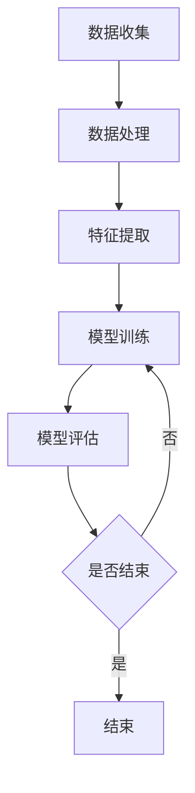
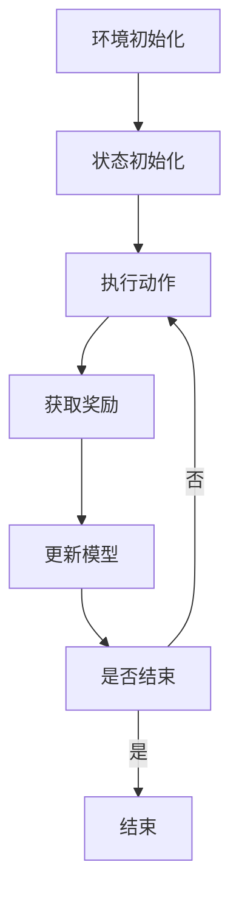

                 

### AI驱动的企业声誉管理：实时监控品牌形象

> 关键词：人工智能，企业声誉管理，实时监控，品牌形象

> 摘要：随着数字化时代的到来，企业的声誉管理变得越来越重要。本文旨在探讨如何利用人工智能技术实现企业声誉的实时监控，从而有效管理品牌形象。文章将详细分析人工智能驱动的企业声誉管理系统，包括其核心概念、算法原理以及系统设计与实现。

## 目录大纲设计

### 第一部分：背景介绍与核心概念

1. AI驱动的企业声誉管理概述
   1.1 问题背景
   1.2 问题描述
   1.3 问题解决
   1.4 边界与外延
   1.5 核心概念与联系

2. AI技术原理与基础
   2.1 AI技术的发展历程
   2.2 AI技术的基本原理
   2.3 AI技术的核心要素
   2.4 AI技术的应用案例

3. 企业声誉管理的原理与实务
   3.1 企业声誉管理的定义与目标
   3.2 企业声誉管理的关键指标
   3.3 声誉管理的实务操作

4. AI驱动的企业声誉管理框架
   4.1 AI驱动的声誉管理体系架构
   4.2 AI驱动的声誉管理流程

5. 核心概念与联系总结

### 第二部分：核心概念与联系

1. AI驱动的声誉管理算法
   1.1 算法原理概述
   1.2 算法mermaid流程图
   1.3 算法原理讲解
   1.4 算法数学模型和公式讲解

2. 系统分析与架构设计概述
   2.1 问题场景介绍
   2.2 系统功能设计
   2.3 系统架构设计
   2.4 系统接口设计
   2.5 系统交互设计

3. 系统分析与架构设计方案
   3.1 系统功能设计
   3.2 系统架构设计
   3.3 系统接口设计
   3.4 系统交互设计

4. 核心概念与联系总结

### 第三部分：算法原理讲解

1. AI驱动的声誉管理算法
   1.1 算法原理概述
   1.2 算法mermaid流程图
   1.3 算法原理讲解
   1.4 算法数学模型和公式讲解

2. 算法数学模型和公式讲解
   2.1 数学模型概述
   2.2 数学公式讲解
   2.3 举例说明

3. 本章小结

### 第四部分：系统分析与架构设计

1. 系统分析与架构设计概述
   1.1 问题场景介绍
   1.2 系统功能设计
   1.3 系统架构设计
   1.4 系统接口设计
   1.5 系统交互设计

2. 系统分析与架构设计方案
   2.1 系统功能设计
   2.2 系统架构设计
   2.3 系统接口设计
   2.4 系统交互设计

3. 项目实战
   3.1 环境安装
   3.2 系统核心实现源代码
   3.3 代码应用解读与分析
   3.4 实际案例分析和详细讲解剖析
   3.5 项目小结

4. 最佳实践 tips、小结、注意事项、拓展阅读等内容

### 第五部分：总结与展望

1. 总结
2. 展望
3. 未来发展趋势

---

## 1. AI驱动的企业声誉管理概述

### 1.1 问题背景

在当今的数字化时代，企业的声誉管理变得尤为重要。随着互联网和社交媒体的普及，消费者和企业之间的互动方式发生了巨大的变化。消费者可以通过多种渠道表达对企业的看法和体验，而这些信息在网络上快速传播，对企业的品牌形象产生深远影响。因此，如何实时监控和管理企业的声誉，成为企业管理者面临的重要挑战。

### 1.2 声誉管理面临的挑战

企业声誉管理面临的主要挑战包括：

1. **信息量巨大**：互联网上关于企业的信息海量，且信息来源广泛，包括新闻、社交媒体、用户评论等，这使得企业难以全面监控。
2. **信息真实性**：网络上的信息鱼龙混杂，如何辨别真伪成为一大难题。
3. **实时性**：在社交媒体等平台上，负面信息可以迅速传播，对企业的声誉造成冲击，因此需要实现实时监控。
4. **自动化**：随着数据量的增加，手动处理这些信息变得不切实际，需要利用自动化工具进行管理和分析。

### 1.3 AI技术在声誉管理中的应用潜力

人工智能技术具有处理大量数据、识别模式、自动分类和预测等能力，在声誉管理中具有巨大的应用潜力。具体来说：

1. **数据挖掘与分析**：AI可以帮助企业从海量的数据中提取有价值的信息，分析消费者的反馈和行为模式。
2. **情感分析**：通过自然语言处理技术，AI可以分析消费者评论的情感倾向，判断舆论的正面或负面。
3. **实时监控**：AI系统可以实时监控社交媒体和新闻网站，及时发现和处理负面信息。
4. **自动化响应**：AI可以自动生成回应，快速应对负面事件，减少对企业声誉的损害。

### 1.4 问题描述

企业声誉管理的问题可以概括为以下几点：

1. **如何有效地收集和监控企业的相关信息？**
2. **如何快速准确地分析这些信息的情感倾向？**
3. **如何自动化响应负面信息，减轻对企业声誉的冲击？**
4. **如何建立一套完整的声誉管理流程，实现自动化和智能化？**

### 1.5 问题解决

为了解决上述问题，企业可以采取以下措施：

1. **引入AI技术**：利用AI进行数据挖掘、情感分析和实时监控，提高声誉管理的效率和准确性。
2. **建立声誉管理系统**：设计并实现一个集数据收集、处理、分析和响应于一体的声誉管理系统。
3. **培训员工**：提高员工对声誉管理的认识，确保他们能够有效利用AI系统进行工作。
4. **建立应急预案**：制定针对不同负面事件的应急预案，确保在紧急情况下能够迅速响应。

### 1.6 边界与外延

虽然AI技术在声誉管理中具有巨大潜力，但也存在一定的边界和限制：

1. **数据隐私**：AI系统在收集和处理用户数据时，需要遵守相关隐私法规。
2. **技术成熟度**：虽然AI技术发展迅速，但某些领域的技术仍需进一步研究和完善。
3. **道德和伦理**：AI系统的决策过程需要遵循道德和伦理标准，确保公正和透明。
4. **系统依赖性**：过度依赖AI系统可能导致人类决策能力的下降，需要平衡自动化与人工干预。

### 1.7 核心概念与联系

在本节中，我们探讨了企业声誉管理的问题背景、面临的挑战、AI技术的应用潜力以及解决方案。核心概念包括：

- **企业声誉管理**：涉及对企业品牌形象的管理和维护。
- **AI技术**：包括数据挖掘、情感分析、实时监控等技术。
- **声誉管理系统**：一个集数据收集、处理、分析和响应于一体的系统。

这些概念之间相互联系，共同构成了AI驱动的企业声誉管理的核心。

### 1.8 本章小结

本章节概述了AI驱动的企业声誉管理的重要性，并详细分析了其背景、挑战和应用潜力。通过引入AI技术，企业可以更加有效地监控和管理其声誉，从而维护和提升品牌形象。在接下来的章节中，我们将深入探讨AI技术的原理和基础，为企业声誉管理的实施提供理论基础。

---

## 2. AI技术原理与基础

### 2.1 AI技术的发展历程

人工智能（AI）的发展历程可以追溯到20世纪50年代。当时，学者们首次提出了人工智能的概念，并试图通过编程实现机器具有智能的行为。这一时期被称为“人工智能的黄金时代”。然而，由于技术限制，早期的AI研究未能取得显著成果。

到了20世纪80年代，机器学习开始兴起。机器学习是一种通过数据驱动的方式，使计算机具备学习和预测能力的方法。这个阶段，AI技术逐渐从理论研究转向实际应用，特别是在模式识别和分类任务上取得了显著进展。

21世纪初，深度学习成为了AI研究的热点。深度学习是一种基于多层神经网络的学习方法，通过大量数据训练，能够自动提取复杂的特征表示。这一技术的突破，使得AI在图像识别、语音识别、自然语言处理等领域取得了巨大的成功。

近年来，随着计算能力和数据资源的不断提升，AI技术进一步得到了发展和普及。自动驾驶、智能客服、医疗诊断等领域的应用，标志着AI技术已经从实验室走向了实际生产和生活。

### 2.2 AI技术的基本原理

AI技术的基本原理可以归结为以下几个核心要素：

1. **数据挖掘**：通过分析大量数据，从中提取有价值的信息和模式。
2. **机器学习**：利用算法从数据中学习，并自动调整模型的参数，以实现预测或分类任务。
3. **深度学习**：基于多层神经网络的学习方法，通过多层次的非线性变换，自动提取数据中的复杂特征。
4. **自然语言处理**：使计算机能够理解和生成人类语言，包括文本分类、机器翻译、情感分析等任务。

### 2.3 AI技术的核心要素

AI技术的核心要素包括：

1. **数据处理**：数据处理是AI系统的第一步，包括数据清洗、预处理和特征提取等步骤。高质量的数据是AI模型取得良好性能的基础。
2. **模型训练**：模型训练是AI技术的核心步骤，通过优化算法，调整模型参数，使其在特定任务上达到最佳性能。
3. **模型优化**：模型优化包括超参数调整、模型压缩、加速训练等，以提高模型在复杂任务上的表现。

### 2.4 AI技术的应用案例

AI技术在各个领域都有广泛的应用，以下是一些典型的应用案例：

1. **自然语言处理**：AI技术在自然语言处理（NLP）领域取得了显著的成果。例如，机器翻译、文本分类、情感分析等任务都依赖于AI技术。
2. **计算机视觉**：计算机视觉是AI技术的重要应用领域之一。例如，图像识别、物体检测、人脸识别等技术都基于AI算法。
3. **数据分析**：AI技术在数据分析领域发挥着重要作用，通过挖掘数据中的模式和趋势，为企业提供决策支持。
4. **医疗诊断**：AI技术在医疗诊断中的应用越来越广泛，例如，通过深度学习模型对医学图像进行分析，帮助医生诊断疾病。
5. **自动驾驶**：自动驾驶技术依赖于AI技术，通过传感器采集数据，并利用深度学习算法进行环境感知和决策。

### 2.5 本章小结

本章节介绍了AI技术的基本原理和发展历程，并探讨了其核心要素和应用案例。通过理解AI技术的基本原理，读者可以更好地理解后续章节中关于AI驱动的企业声誉管理的具体应用。在下一章节中，我们将进一步探讨企业声誉管理的原理与实务。

---

## 3. 企业声誉管理的原理与实务

### 3.1 企业声誉管理的定义与目标

企业声誉管理是指企业通过各种手段和策略，维护和提升其品牌形象，确保在公众心目中保持良好的声誉。企业声誉是企业无形资产的重要组成部分，直接影响企业的市场地位、客户忠诚度和长期发展。

企业声誉管理的目标主要包括：

1. **建立和维护品牌形象**：通过积极的传播和沟通，塑造企业的正面形象，增强公众对企业的认同感。
2. **提高客户满意度**：通过高质量的产品和服务，满足客户需求，提升客户满意度和忠诚度。
3. **增强竞争力**：良好的声誉有助于企业在市场竞争中脱颖而出，吸引更多客户和合作伙伴。
4. **降低风险**：通过及时应对和化解潜在危机，减少企业声誉受损的风险。

### 3.2 企业声誉管理的关键指标

企业声誉管理的关键指标包括：

1. **声誉评分**：声誉评分是对企业声誉的综合评价，通常由第三方机构进行评估，反映企业在公众中的形象和信任度。
2. **品牌知名度**：品牌知名度是指消费者对企业品牌的认识和熟悉程度，是衡量企业品牌影响力的关键指标。
3. **消费者满意度**：消费者满意度是衡量企业产品和服务质量的重要指标，直接影响企业的声誉和市场份额。
4. **公众形象**：公众形象是指企业在外界公众心目中的整体印象，包括企业的社会责任、企业文化、管理风格等。
5. **媒体报道**：媒体报道是评估企业声誉的重要参考，正面报道有助于提升企业声誉，负面报道则可能对声誉产生负面影响。

### 3.3 声誉管理的实务操作

企业声誉管理的实务操作主要包括以下几个方面：

1. **声誉监测**：通过监测新闻媒体、社交媒体、论坛等渠道，了解公众对企业品牌和产品的看法和态度，及时发现负面信息。
2. **声誉评估**：对监测到的信息进行分类和分析，评估其对企业的潜在影响，制定相应的应对策略。
3. **声誉修复**：在负面信息出现后，及时采取措施进行回应和修复，减轻对企业声誉的损害。
4. **声誉传播**：通过公关活动、广告宣传等手段，积极传播企业的正面信息，提升品牌知名度和公众形象。
5. **危机管理**：在面临重大危机时，迅速启动应急预案，控制危机蔓延，降低对企业声誉的冲击。

### 3.4 企业声誉管理案例分析

为了更好地理解企业声誉管理的实务操作，我们可以通过以下案例进行分析：

#### 案例一：苹果公司

苹果公司是全球知名的电子产品制造商，以其高品质和创新设计著称。然而，在2019年，苹果公司因电池门事件受到了广泛批评。事件曝光后，苹果公司迅速采取行动，公开道歉并提出了电池更换计划，以减轻消费者对产品质量的担忧。这一举措虽然未能完全消除负面影响，但成功减轻了苹果公司的声誉损失。

#### 案例二：麦当劳

麦当劳是全球知名的快餐品牌，在2020年疫情爆发期间，因部分门店恢复堂食而受到争议。消费者和媒体质疑麦当劳的做法是否考虑到了公共卫生安全。面对舆论压力，麦当劳及时调整策略，加大了食品安全宣传，并加强了门店的卫生管理，以恢复消费者信心。

### 3.5 本章小结

企业声誉管理是企业管理的重要组成部分，直接关系到企业的长期发展和市场竞争力。通过理解企业声誉管理的定义、目标和关键指标，企业可以更好地实施声誉管理实务操作，应对各种挑战，提升品牌形象和市场地位。在下一章节中，我们将探讨AI驱动的企业声誉管理框架，介绍AI技术在声誉管理中的应用。

---

## 4. AI驱动的企业声誉管理框架

### 4.1 AI驱动的声誉管理体系架构

AI驱动的企业声誉管理系统通常由以下几个核心模块组成：

1. **数据收集模块**：负责从各种渠道收集与企业声誉相关的数据，包括社交媒体、新闻报道、论坛评论等。
2. **数据处理模块**：对收集到的数据进行分析和预处理，提取有价值的信息和特征。
3. **模型训练模块**：利用机器学习算法对预处理后的数据进行训练，建立声誉分析模型。
4. **模型应用模块**：将训练好的模型应用于实时数据，进行声誉分析和预测。
5. **响应措施模块**：根据分析结果，自动生成响应措施，如公关活动、危机管理等。

### 4.2 AI驱动的声誉管理流程

AI驱动的企业声誉管理流程主要包括以下几个步骤：

1. **数据收集**：通过爬虫、API接口等手段，从各种渠道收集与企业声誉相关的数据。
2. **数据处理**：对收集到的数据进行清洗、去噪和特征提取，为模型训练做好准备。
3. **模型训练**：利用机器学习算法，如决策树、随机森林、支持向量机等，对处理后的数据进行训练，建立声誉分析模型。
4. **模型评估**：通过交叉验证、A/B测试等方法，评估模型的性能和效果，确保其准确性和可靠性。
5. **模型应用**：将训练好的模型应用于实时数据，进行声誉分析和预测。
6. **响应措施**：根据分析结果，自动生成响应措施，如公关活动、危机管理等，以维护和提升企业声誉。

### 4.3 数据收集模块

数据收集模块是AI驱动的声誉管理系统的核心组成部分之一，其主要任务是从各种渠道收集与企业声誉相关的数据。这些渠道包括：

1. **社交媒体**：如Twitter、Facebook、Instagram等，通过分析用户发布的内容，了解公众对企业品牌和产品的看法。
2. **新闻报道**：从各大新闻网站、新闻APP等渠道收集与企业相关的新闻报道，了解媒体报道对企业声誉的影响。
3. **论坛评论**：从各大论坛、社区网站等渠道收集用户评论，分析消费者对企业产品和服务的反馈。
4. **政府监管**：收集政府监管机构发布的与企业相关的报告、公告等，了解企业合规性和监管情况。

### 4.4 数据处理模块

数据处理模块负责对收集到的数据进行清洗、去噪和特征提取。以下是数据处理模块的主要任务：

1. **数据清洗**：去除重复数据、缺失数据和异常数据，保证数据的准确性和一致性。
2. **去噪**：去除数据中的噪声和无关信息，提高数据的纯净度。
3. **特征提取**：从原始数据中提取与声誉管理相关的特征，如关键词、情感倾向、负面标记等，为模型训练提供输入。

### 4.5 模型训练模块

模型训练模块是AI驱动的声誉管理系统的核心，其主要任务是利用机器学习算法对处理后的数据进行训练，建立声誉分析模型。以下是模型训练模块的主要任务：

1. **选择算法**：根据声誉管理的具体需求，选择合适的机器学习算法，如决策树、随机森林、支持向量机、深度学习等。
2. **数据划分**：将数据划分为训练集、验证集和测试集，用于模型的训练、评估和测试。
3. **参数调整**：通过调整算法参数，优化模型性能，提高模型的准确性和鲁棒性。
4. **交叉验证**：利用交叉验证方法，评估模型的泛化能力和稳定性。

### 4.6 模型应用模块

模型应用模块负责将训练好的模型应用于实时数据，进行声誉分析和预测。以下是模型应用模块的主要任务：

1. **实时数据收集**：从社交媒体、新闻报道、论坛评论等渠道收集实时数据，为模型提供输入。
2. **数据预处理**：对实时数据进行清洗、去噪和特征提取，确保数据质量。
3. **模型预测**：利用训练好的模型，对实时数据进行声誉分析和预测，输出分析结果。
4. **可视化展示**：将分析结果以图表、报表等形式展示，便于企业决策者了解企业声誉状况。

### 4.7 响应措施模块

响应措施模块根据模型应用模块输出的分析结果，自动生成响应措施，如公关活动、危机管理等，以维护和提升企业声誉。以下是响应措施模块的主要任务：

1. **分析结果解读**：对模型应用模块输出的分析结果进行解读，识别潜在的声誉风险。
2. **响应措施生成**：根据分析结果，自动生成相应的响应措施，如公关活动、危机管理、客户服务提升等。
3. **响应措施执行**：根据响应措施，制定详细的执行计划，并监控执行效果。
4. **反馈调整**：根据执行效果和公众反馈，对响应措施进行调整和优化。

### 4.8 本章小结

AI驱动的企业声誉管理框架通过数据收集、数据处理、模型训练、模型应用和响应措施等模块，实现了对企业声誉的实时监控和管理。这一框架不仅提高了声誉管理的效率和准确性，还为企业提供了科学的决策依据，有助于企业维护和提升品牌形象。在下一章节中，我们将深入探讨AI驱动的声誉管理算法，分析其原理和数学模型。

---

## 5. 核心概念与联系总结

在本章节中，我们深入探讨了AI驱动的企业声誉管理，总结了其核心概念和联系。以下是本章节的核心概念和联系总结：

1. **AI技术**：包括数据挖掘、机器学习、深度学习、自然语言处理等。这些技术为AI驱动的声誉管理提供了强大的工具和基础。
2. **企业声誉管理**：涉及建立和维护品牌形象、提高客户满意度、增强竞争力和降低风险。是企业长期发展和市场竞争力的重要保障。
3. **声誉管理系统架构**：包括数据收集、数据处理、模型训练、模型应用和响应措施等模块。这些模块共同构成了AI驱动的企业声誉管理系统。
4. **声誉管理关键指标**：包括声誉评分、品牌知名度、消费者满意度和公众形象等。这些指标帮助企业评估和管理声誉状况。
5. **AI驱动的声誉管理流程**：从数据收集、数据处理、模型训练、模型应用到响应措施，形成了一套完整的声誉管理流程。

这些核心概念和联系相互交织，构成了AI驱动的企业声誉管理的整体框架。通过理解这些概念和联系，企业可以更有效地利用AI技术，实现对企业声誉的实时监控和管理，从而维护和提升品牌形象。

### 5.1 AI技术原理与基础

在了解AI驱动的企业声誉管理之前，我们需要深入理解AI技术的原理与基础。AI技术，即人工智能技术，是指通过计算机程序和算法，使计算机具备模拟人类智能的能力。AI技术主要包括以下几个方面：

1. **机器学习**：机器学习是一种通过数据驱动的方式，让计算机自动学习和改进的方法。它基于统计学和概率论，通过大量的训练数据，让计算机学会对未知数据进行预测和决策。

2. **深度学习**：深度学习是机器学习的一个分支，它基于多层神经网络，通过多层次的非线性变换，从数据中自动提取复杂特征。深度学习在图像识别、语音识别、自然语言处理等领域取得了显著的成果。

3. **自然语言处理**：自然语言处理（NLP）是AI技术的一个重要分支，它使计算机能够理解和生成人类语言。NLP技术包括文本分类、情感分析、机器翻译等，广泛应用于社交媒体分析、舆情监测等领域。

4. **计算机视觉**：计算机视觉是AI技术的另一个重要分支，它使计算机能够理解和解释图像和视频。计算机视觉技术包括图像识别、物体检测、人脸识别等，广泛应用于安防监控、自动驾驶等领域。

### 5.2 企业声誉管理的基本概念

企业声誉管理是指企业通过多种手段和策略，维护和提升其品牌形象，确保在公众心目中保持良好的声誉。企业声誉管理的基本概念包括：

1. **企业声誉**：企业声誉是指公众对企业的整体看法和评价，包括企业的产品、服务、管理、社会责任等方面。企业声誉是企业无形资产的重要组成部分，对企业的长期发展至关重要。

2. **声誉管理**：声誉管理是指企业通过一系列措施和策略，主动维护和提升企业声誉的过程。声誉管理包括声誉监测、声誉评估、声誉修复、声誉传播等环节。

3. **声誉监测**：声誉监测是指企业通过各种渠道收集与企业声誉相关的信息，如新闻报道、社交媒体、论坛评论等，以了解公众对企业的看法和态度。

4. **声誉评估**：声誉评估是指对企业声誉进行综合评价，评估企业的声誉水平，识别潜在的声誉风险。

5. **声誉修复**：声誉修复是指企业在声誉受损时，采取相应的措施进行回应和修复，以减轻对企业声誉的损害。

6. **声誉传播**：声誉传播是指企业通过各种渠道传播正面信息，提升品牌知名度和公众形象。

### 5.3 AI驱动的企业声誉管理框架

AI驱动的企业声誉管理框架通过数据收集、数据处理、模型训练、模型应用和响应措施等模块，实现了对企业声誉的实时监控和管理。以下是AI驱动的企业声誉管理框架的核心概念和联系：

1. **数据收集模块**：从社交媒体、新闻报道、论坛评论等渠道收集与企业声誉相关的数据。这一模块的核心任务是确保数据的质量和多样性。

2. **数据处理模块**：对收集到的数据进行清洗、去噪和特征提取，为模型训练提供高质量的输入。数据处理模块的核心任务是处理海量数据，提取有价值的信息。

3. **模型训练模块**：利用机器学习算法，如决策树、随机森林、支持向量机、深度学习等，对处理后的数据进行训练，建立声誉分析模型。模型训练模块的核心任务是提高模型的准确性和鲁棒性。

4. **模型应用模块**：将训练好的模型应用于实时数据，进行声誉分析和预测。模型应用模块的核心任务是实现对声誉的实时监控和预警。

5. **响应措施模块**：根据模型应用模块输出的分析结果，自动生成响应措施，如公关活动、危机管理等。响应措施模块的核心任务是快速应对负面信息，减轻对企业声誉的损害。

通过这些核心概念和联系，AI驱动的企业声誉管理框架不仅实现了对企业声誉的实时监控和管理，还为企业提供了科学的决策依据，有助于企业维护和提升品牌形象。

### 5.4 核心概念与联系总结

通过对AI驱动的企业声誉管理框架的核心概念和联系进行分析，我们可以看到，数据、模型和应用构成了整个声誉管理的核心。以下是核心概念与联系总结：

1. **数据**：数据是企业声誉管理的基石，包括社交媒体、新闻报道、论坛评论等各方面的信息。数据的质量直接影响模型的准确性和有效性。
2. **模型**：模型是AI驱动的声誉管理的核心，通过机器学习和深度学习算法，对数据进行处理和分析，为企业提供实时、准确的声誉评估。
3. **应用**：应用是将模型结果转化为实际行动的关键环节，通过自动生成的响应措施，企业可以迅速应对负面信息，保护品牌形象。

这些核心概念和联系共同构成了AI驱动的企业声誉管理框架，为企业在数字化时代提供了强有力的支持。

### 5.5 本章小结

本章详细介绍了AI驱动的企业声誉管理框架，包括数据收集、数据处理、模型训练、模型应用和响应措施等核心模块。通过这些模块的协同工作，企业可以实现对声誉的实时监控和管理，维护和提升品牌形象。在下一章节中，我们将深入探讨AI驱动的声誉管理算法，分析其原理和数学模型。

---

## 6. AI驱动的声誉管理算法

### 6.1 算法原理概述

AI驱动的企业声誉管理算法主要包括以下几类：

1. **机器学习算法**：机器学习算法通过从数据中学习规律，用于分类、预测和聚类等任务。常见的机器学习算法包括决策树、支持向量机、随机森林等。

2. **深度学习算法**：深度学习算法基于多层神经网络，通过多层次的非线性变换，从数据中自动提取复杂特征。常见的深度学习算法包括卷积神经网络（CNN）、循环神经网络（RNN）等。

3. **强化学习算法**：强化学习算法通过不断尝试和反馈，学习最优策略，用于解决序列决策问题。常见的强化学习算法包括Q-learning、深度Q网络（DQN）等。

### 6.2 算法mermaid流程图

以下是三种常见算法的mermaid流程图：

#### 机器学习算法流程图



#### 深度学习算法流程图


#### 强化学习算法流程图



### 6.3 算法原理讲解

#### 6.3.1 机器学习算法

**基本概念**：

机器学习算法是一种通过训练数据集，使计算机学会对未知数据进行预测或分类的方法。其主要步骤包括：

1. **数据收集**：从各种渠道收集用于训练的数据。
2. **数据处理**：对数据进行清洗、去噪和预处理，以提高数据质量。
3. **特征提取**：从数据中提取有用的特征，用于训练模型。
4. **模型训练**：利用训练数据集，通过优化算法调整模型参数，使模型在训练集上达到最佳性能。
5. **模型评估**：利用验证集或测试集评估模型性能，判断其泛化能力。

**数学模型**：

机器学习算法通常基于概率模型，常见的数学模型包括：

- **线性回归**：\(y = \beta_0 + \beta_1 \cdot x\)
- **逻辑回归**：\(P(y=1) = \frac{1}{1 + e^{-(\beta_0 + \beta_1 \cdot x)}\)
- **支持向量机**：\(w \cdot x + b = 0\)

**应用案例**：

- **电子邮件分类**：通过分析邮件内容，将邮件分为垃圾邮件和正常邮件。
- **图像识别**：通过分析图像特征，识别图像中的物体或场景。

#### 6.3.2 深度学习算法

**基本概念**：

深度学习算法是一种基于多层神经网络的学习方法，通过多层次的非线性变换，自动提取数据中的复杂特征。其主要步骤包括：

1. **数据收集**：从各种渠道收集用于训练的数据。
2. **数据处理**：对数据进行清洗、去噪和预处理，以提高数据质量。
3. **特征提取**：从数据中提取有用的特征，用于训练模型。
4. **模型训练**：利用训练数据集，通过优化算法调整模型参数，使模型在训练集上达到最佳性能。
5. **模型评估**：利用验证集或测试集评估模型性能，判断其泛化能力。

**数学模型**：

深度学习算法的核心是神经网络，常见的数学模型包括：

- **卷积神经网络（CNN）**：用于图像识别和物体检测。
- **循环神经网络（RNN）**：用于序列数据处理，如语言建模和时间序列预测。
- **生成对抗网络（GAN）**：用于生成图像和生成模型。

**应用案例**：

- **图像识别**：通过分析图像特征，识别图像中的物体或场景。
- **语音识别**：通过分析音频特征，将语音转换为文字。
- **自然语言处理**：通过分析文本特征，进行文本分类、情感分析等任务。

#### 6.3.3 强化学习算法

**基本概念**：

强化学习算法是一种通过不断尝试和反馈，学习最优策略的方法。其主要步骤包括：

1. **环境初始化**：初始化环境，确定状态空间和动作空间。
2. **状态初始化**：初始化状态，开始学习过程。
3. **执行动作**：根据当前状态，选择一个动作执行。
4. **获取奖励**：执行动作后，根据环境的反馈获取奖励。
5. **更新模型**：利用奖励信号更新模型参数，使模型在下一个状态下做出更好的决策。
6. **重复步骤**：重复执行动作、获取奖励和更新模型，直到达到目标状态或结束条件。

**数学模型**：

强化学习算法的核心是价值函数和策略，常见的数学模型包括：

- **Q-learning**：通过学习状态-动作值函数，选择最优动作。
- **深度Q网络（DQN）**：将Q-learning与深度学习结合，用于解决连续动作问题。
- **策略梯度算法**：直接优化策略，使策略在期望奖励上最大化。

**应用案例**：

- **游戏**：通过学习策略，实现游戏中的自动走棋、自动驾驶等。
- **推荐系统**：通过学习用户的偏好，进行个性化推荐。

### 6.4 算法数学模型和公式讲解

在深入讲解算法原理时，我们引入了若干数学模型和公式，以下是对这些模型和公式的详细解释。

#### 6.4.1 机器学习算法

**线性回归模型**：

\[ y = \beta_0 + \beta_1 \cdot x \]

其中，\( y \) 是预测值，\( \beta_0 \) 是截距，\( \beta_1 \) 是斜率，\( x \) 是输入特征。

**逻辑回归模型**：

\[ P(y=1) = \frac{1}{1 + e^{-(\beta_0 + \beta_1 \cdot x)}} \]

其中，\( P(y=1) \) 是预测目标变量为1的概率，\( \beta_0 \) 是截距，\( \beta_1 \) 是斜率，\( x \) 是输入特征。

**支持向量机（SVM）**：

\[ w \cdot x + b = 0 \]

其中，\( w \) 是权重向量，\( x \) 是输入特征，\( b \) 是偏置项。

#### 6.4.2 深度学习算法

**卷积神经网络（CNN）**：

卷积神经网络通过卷积层、池化层和全连接层等结构，提取图像特征并进行分类。以下是卷积层和池化层的核心公式：

**卷积层**：

\[ f(x) = \sum_{i=1}^{n} w_i \cdot x_i \]

其中，\( f(x) \) 是卷积结果，\( w_i \) 是卷积核权重，\( x_i \) 是输入特征。

**池化层**：

\[ P(x) = \text{max}(x) \]

或

\[ P(x) = \text{average}(x) \]

其中，\( P(x) \) 是池化结果，\(\text{max}(x)\) 表示取最大值，\(\text{average}(x)\) 表示取平均值。

#### 6.4.3 强化学习算法

**Q-learning**：

Q-learning通过学习状态-动作值函数，选择最优动作。其核心公式如下：

\[ Q(s, a) = r + \gamma \cdot \max_{a'} Q(s', a') \]

其中，\( Q(s, a) \) 是状态s下执行动作a的Q值，\( r \) 是立即奖励，\( \gamma \) 是折扣因子，\( s' \) 是下一状态，\( a' \) 是下一动作。

**深度Q网络（DQN）**：

DQN通过神经网络近似Q值函数，用于解决连续动作问题。其核心公式如下：

\[ Q(s, a) = \frac{1}{N}\sum_{i=1}^{N} \hat{Q}(s, a_i) \]

其中，\( Q(s, a) \) 是状态s下执行动作a的Q值，\( N \) 是训练样本数量，\( \hat{Q}(s, a_i) \) 是神经网络预测的Q值。

### 6.5 举例说明

#### 6.5.1 机器学习算法应用举例

**案例**：使用逻辑回归模型进行电子邮件分类。

**数据**：收集一批电子邮件，标记为垃圾邮件或正常邮件。

**步骤**：

1. **数据收集**：收集电子邮件数据，包括邮件内容和标签。
2. **数据处理**：对邮件内容进行预处理，如分词、去除停用词等。
3. **特征提取**：提取邮件内容的特征，如词频、词向量等。
4. **模型训练**：使用逻辑回归模型，训练模型参数。
5. **模型评估**：使用测试集评估模型性能，计算准确率、召回率等指标。

#### 6.5.2 深度学习算法应用举例

**案例**：使用卷积神经网络进行图像识别。

**数据**：收集一批图像数据，标记为不同类别。

**步骤**：

1. **数据收集**：收集图像数据，包括训练集和测试集。
2. **数据处理**：对图像进行预处理，如标准化、归一化等。
3. **模型训练**：构建卷积神经网络模型，进行训练。
4. **模型评估**：使用测试集评估模型性能，计算准确率、损失函数等指标。

#### 6.5.3 强化学习算法应用举例

**案例**：使用Q-learning进行游戏自动走棋。

**数据**：游戏状态、动作和奖励。

**步骤**：

1. **环境初始化**：初始化游戏环境，确定状态空间和动作空间。
2. **状态初始化**：初始化状态，开始学习过程。
3. **执行动作**：根据当前状态，选择一个动作执行。
4. **获取奖励**：执行动作后，根据游戏规则获取奖励。
5. **更新模型**：利用奖励信号更新模型参数，使模型在下一个状态下做出更好的决策。
6. **重复步骤**：重复执行动作、获取奖励和更新模型，直到达到目标状态或结束条件。

### 6.6 本章小结

本章详细讲解了AI驱动的声誉管理算法，包括机器学习算法、深度学习算法和强化学习算法。通过理解这些算法的基本原理、数学模型和应用案例，我们可以更好地利用AI技术，实现对企业声誉的实时监控和管理。在下一章节中，我们将探讨系统分析与架构设计，为企业声誉管理系统提供全面的解决方案。

---

## 7. 算法数学模型和公式讲解

### 7.1 数学模型概述

在人工智能领域，数学模型是核心，它们为算法提供了理论基础和计算方法。以下将概述常用的数学模型，并探讨其在声誉管理中的应用。

#### 7.1.1 概率模型

概率模型是机器学习中最基础的一部分，它们用于估计数据中的概率分布。在声誉管理中，概率模型可以用来预测公众对企业的态度和评论。

- **贝叶斯定理**：

  \[ P(A|B) = \frac{P(B|A) \cdot P(A)}{P(B)} \]

  贝叶斯定理用于在已知一部分信息的情况下，推断另一部分信息的概率。

- **条件概率**：

  \[ P(A|B) = \frac{P(A \cap B)}{P(B)} \]

  条件概率描述在事件B发生的情况下，事件A发生的概率。

#### 7.1.2 神经网络模型

神经网络模型，尤其是深度学习模型，在声誉管理中具有广泛的应用。它们通过多层次的非线性变换，从数据中提取复杂特征。

- **前向传播**：

  \[ z_i = \sum_{j=1}^{n} w_{ij} \cdot a_j + b_i \]

  前向传播过程中，每个神经元将输入乘以相应的权重，加上偏置，得到输出。

- **激活函数**：

  \[ a_i = f(z_i) \]

  激活函数用于引入非线性，常见的激活函数包括Sigmoid、ReLU和Tanh。

#### 7.1.3 强化学习模型

强化学习模型在声誉管理中用于制定自动化的响应策略，以优化企业的声誉。

- **Q值函数**：

  \[ Q(s, a) = r + \gamma \cdot \max_{a'} Q(s', a') \]

  Q值函数表示在状态s下执行动作a的预期回报。

- **策略**：

  \[ \pi(a|s) = P(a|s) \]

  策略描述在状态s下选择动作a的概率。

### 7.2 数学公式讲解

#### 7.2.1 概率模型

**贝叶斯定理**：

\[ P(A|B) = \frac{P(B|A) \cdot P(A)}{P(B)} \]

这个公式用于计算在已知事件B发生的条件下，事件A发生的概率。在声誉管理中，可以用来计算公众对某品牌的正面或负面评论的概率。

**条件概率**：

\[ P(A|B) = \frac{P(A \cap B)}{P(B)} \]

这个公式描述在事件B发生的条件下，事件A发生的概率。在声誉管理中，可以帮助分析某一负面事件对品牌声誉的影响。

#### 7.2.2 神经网络模型

**前向传播**：

\[ z_i = \sum_{j=1}^{n} w_{ij} \cdot a_j + b_i \]

这个公式描述了每个神经元如何计算其输出，其中\( z_i \)是神经元的净输入，\( w_{ij} \)是权重，\( a_j \)是前一层神经元的输出，\( b_i \)是偏置。

**激活函数**：

\[ a_i = \text{ReLU}(z_i) = \max(0, z_i) \]

ReLU（Rectified Linear Unit）激活函数是一个简单的非线性函数，它将负输入映射为零，正输入映射为自身。

#### 7.2.3 强化学习模型

**Q值函数**：

\[ Q(s, a) = r + \gamma \cdot \max_{a'} Q(s', a') \]

Q值函数表示在状态s下执行动作a的预期回报，其中\( r \)是即时奖励，\( \gamma \)是折扣因子，它决定了未来奖励的重要性。

**策略**：

\[ \pi(a|s) = \frac{\exp(\alpha \cdot Q(s, a)}{\sum_{a'} \exp(\alpha \cdot Q(s, a'))} \]

策略是根据Q值函数计算出的动作概率分布，其中\( \alpha \)是温度参数，它决定了探索和利用的平衡。

### 7.3 举例说明

#### 7.3.1 机器学习算法应用举例

**案例**：使用逻辑回归进行评论情感分析。

**数据**：一批包含正面和负面评论的数据集。

**步骤**：

1. **数据处理**：对评论进行分词和去停用词处理。
2. **特征提取**：将评论转换为词袋模型或词嵌入。
3. **模型训练**：使用逻辑回归模型，训练参数。
4. **模型评估**：在测试集上评估模型性能。

**公式**：

\[ P(\text{正面评论}|x) = \frac{1}{1 + e^{-(\beta_0 + \beta_1 \cdot x)}} \]

**解释**：该公式计算在输入特征x下，评论为正面的概率。

#### 7.3.2 深度学习算法应用举例

**案例**：使用卷积神经网络进行新闻分类。

**数据**：一批包含不同类别的新闻文章。

**步骤**：

1. **数据处理**：对文章进行分词和去停用词处理。
2. **特征提取**：将文章转换为词嵌入。
3. **模型训练**：构建卷积神经网络模型，训练参数。
4. **模型评估**：在测试集上评估模型性能。

**公式**：

\[ a_i = \text{ReLU}(z_i) \]

**解释**：该公式描述了卷积神经网络中每个卷积层的激活函数。

#### 7.3.3 强化学习算法应用举例

**案例**：使用Q-learning进行社交媒体管理。

**数据**：社交媒体平台的用户行为和评论。

**步骤**：

1. **环境初始化**：初始化状态和动作空间。
2. **状态初始化**：初始化状态。
3. **执行动作**：根据当前状态执行动作。
4. **更新模型**：利用即时奖励和折扣因子更新Q值。

**公式**：

\[ Q(s, a) = r + \gamma \cdot \max_{a'} Q(s', a') \]

**解释**：该公式用于更新Q值，以优化策略。

### 7.4 本章小结

本章详细介绍了声誉管理中常用的数学模型和公式，包括概率模型、神经网络模型和强化学习模型。通过理解这些公式和应用案例，我们可以更好地设计和实现AI驱动的声誉管理系统，为企业提供实时、准确的声誉分析和响应。

---

## 8. 系统分析与架构设计概述

### 8.1 问题场景介绍

在数字化时代，企业面临的声誉管理问题日益复杂。随着社交媒体和互联网的普及，企业品牌形象受到的影响也越来越大。负面信息的快速传播可能导致企业声誉受损，甚至影响其市场地位和盈利能力。因此，企业需要实现对企业声誉的实时监控和管理，以确保品牌形象的稳定和提升。

为了应对这一挑战，企业需要构建一个高效、智能的声誉管理系统。该系统应能够实时收集和分析与企业相关的信息，快速识别负面事件，并自动生成响应措施，减轻对企业声誉的损害。具体来说，系统需要实现以下功能：

1. **数据收集**：从社交媒体、新闻报道、论坛等渠道收集与企业声誉相关的信息。
2. **数据处理**：对收集到的数据进行清洗、去噪和特征提取，为后续分析提供高质量的数据。
3. **情感分析**：利用自然语言处理技术，对评论和报道进行情感分析，判断其正面或负面倾向。
4. **实时监控**：实时监控企业的声誉状况，及时发现负面事件。
5. **响应措施**：根据负面事件的性质和严重程度，自动生成响应措施，如公关活动、危机管理等。
6. **可视化展示**：将分析结果以图表、报表等形式展示，便于企业决策者了解企业声誉状况。

### 8.2 系统功能设计

系统功能设计是构建高效声誉管理系统的基础。以下列出系统的主要功能模块及其具体职责：

1. **数据收集模块**：负责从社交媒体、新闻报道、论坛等渠道收集与企业声誉相关的数据。该模块应具有自动化数据采集能力，能够定期更新数据。
2. **数据处理模块**：负责对收集到的数据进行清洗、去噪和特征提取。该模块需要实现高效的数据预处理算法，以确保输入数据的准确性和一致性。
3. **情感分析模块**：利用自然语言处理技术，对评论和报道进行情感分析，判断其正面或负面倾向。该模块应具备高准确率和实时性，能够快速响应负面事件。
4. **实时监控模块**：实时监控企业的声誉状况，及时发现负面事件。该模块需要与数据收集模块紧密集成，确保数据的实时性和准确性。
5. **响应措施模块**：根据负面事件的性质和严重程度，自动生成响应措施，如公关活动、危机管理等。该模块应具备智能决策能力，能够快速制定并执行响应措施。
6. **可视化展示模块**：将分析结果以图表、报表等形式展示，便于企业决策者了解企业声誉状况。该模块需要实现高效的可视化算法，确保数据的直观性和易读性。

### 8.3 系统架构设计

系统架构设计是构建高效、稳定、可扩展的声誉管理系统的基础。以下列出系统的总体架构及其核心模块：

1. **数据层**：包括数据存储和数据采集。数据存储模块负责存储和管理企业声誉相关的数据，如社交媒体数据、新闻报道数据、用户评论数据等。数据采集模块负责从各种渠道收集数据，并将其存储到数据存储模块中。
2. **数据处理层**：包括数据处理模块和情感分析模块。数据处理模块负责对收集到的数据进行清洗、去噪和特征提取，为后续分析提供高质量的数据。情感分析模块负责对处理后的数据进行分析，判断其正面或负面倾向。
3. **分析层**：包括实时监控模块和响应措施模块。实时监控模块负责实时监控企业的声誉状况，及时发现负面事件。响应措施模块根据负面事件的性质和严重程度，自动生成响应措施，如公关活动、危机管理等。
4. **展示层**：包括可视化展示模块。可视化展示模块将分析结果以图表、报表等形式展示，便于企业决策者了解企业声誉状况。
5. **应用层**：包括用户接口和后台管理界面。用户接口模块负责提供用户交互界面，便于用户查询和分析企业声誉数据。后台管理界面模块负责管理系统的配置和设置。

### 8.4 系统接口设计

系统接口设计是确保系统各模块之间高效协作的重要环节。以下列出系统的关键接口：

1. **数据采集接口**：负责从社交媒体、新闻报道、论坛等渠道收集数据。该接口需要支持多种数据源，如API、爬虫等。
2. **数据处理接口**：负责处理和传输数据，包括数据清洗、去噪和特征提取。该接口需要确保数据传输的高效性和可靠性。
3. **情感分析接口**：负责处理和传输情感分析结果，包括正面和负面评论的分类。该接口需要确保情感分析的准确性和实时性。
4. **实时监控接口**：负责处理和传输实时监控数据，包括负面事件的检测和报警。该接口需要确保实时监控的高效性和可靠性。
5. **响应措施接口**：负责处理和传输响应措施，包括公关活动、危机管理等。该接口需要确保响应措施的快速生成和执行。
6. **可视化展示接口**：负责处理和传输可视化数据，包括图表、报表等。该接口需要确保数据展示的直观性和易读性。

### 8.5 系统交互设计

系统交互设计是确保系统各模块之间协作顺畅的关键。以下列出系统的交互流程和序列图：

1. **数据收集**：系统从社交媒体、新闻报道、论坛等渠道收集数据，并将其存储到数据存储模块中。
2. **数据处理**：系统对收集到的数据进行清洗、去噪和特征提取，为后续分析提供高质量的数据。
3. **情感分析**：系统对处理后的数据进行分析，判断其正面或负面倾向，并将结果存储到分析数据库中。
4. **实时监控**：系统实时监控企业的声誉状况，发现负面事件后，生成报警信息并触发响应措施。
5. **响应措施**：系统根据负面事件的性质和严重程度，自动生成响应措施，如公关活动、危机管理等。
6. **可视化展示**：系统将分析结果以图表、报表等形式展示，便于企业决策者了解企业声誉状况。

### 8.6 系统架构图

以下是一个简化的系统架构图，展示了系统的整体结构和各模块之间的关系：

```
+------------------------+
|     数据层             |
+------------------------+
|   数据存储模块         |
|   数据采集模块         |
+------------------------+
|     数据处理层         |
+------------------------+
|   数据处理模块         |
|   情感分析模块         |
+------------------------+
|     分析层             |
+------------------------+
|   实时监控模块         |
|   响应措施模块         |
+------------------------+
|     展示层             |
+------------------------+
|   可视化展示模块       |
+------------------------+
|     应用层             |
+------------------------+
|   用户接口模块         |
|   后台管理界面模块     |
+------------------------+
```

### 8.7 系统交互序列图

以下是一个简化的系统交互序列图，展示了系统各模块之间的交互过程：

```
+----------------+      +----------------+      +----------------+
|  数据采集模块  | -->  |  数据处理模块  | -->  |  情感分析模块  |
+----------------+      +----------------+      +----------------+
        |                             |                             |
        |                             |                             |
        |                             |                             |
        |                             |                             |
+----------------+      +----------------+      +----------------+
|  实时监控模块  | -->  |  响应措施模块  | -->  |  可视化展示模块 |
+----------------+      +----------------+      +----------------+
        |                             |                             |
        |                             |                             |
        |                             |                             |
        |                             |                             |
+----------------+      +----------------+
|  用户接口模块  | -->  |  后台管理界面模块 |
+----------------+

```

### 8.8 本章小结

本章对AI驱动的企业声誉管理系统进行了系统分析与架构设计概述。通过介绍问题场景、系统功能设计、系统架构设计、系统接口设计以及系统交互设计，我们构建了一个高效、智能的声誉管理系统框架。该系统旨在通过实时监控和管理企业声誉，帮助企业维护和提升品牌形象。在下一章节中，我们将进一步详细探讨系统的实际应用案例，展示如何通过AI技术实现对企业声誉的实时监控和管理。

---

## 9. 系统分析与架构设计方案

### 9.1 系统功能设计

系统功能设计是构建高效、智能的声誉管理系统的基础。以下详细描述系统的主要功能模块及其具体职责：

#### 9.1.1 数据收集模块

**职责**：从社交媒体、新闻报道、论坛等渠道收集与企业声誉相关的数据。

**实现**：
- **数据源**：支持多种数据源，如Twitter、Facebook、新闻网站、论坛等。
- **采集策略**：采用自动化爬虫技术，定期从数据源中采集数据。
- **数据格式**：采集的数据以JSON、CSV等格式存储，便于后续处理。

#### 9.1.2 数据处理模块

**职责**：对收集到的数据进行清洗、去噪和特征提取，为后续分析提供高质量的数据。

**实现**：
- **数据清洗**：去除重复数据、缺失数据和异常数据。
- **去噪**：去除无关信息和噪声，如HTML标签、特殊字符等。
- **特征提取**：提取与声誉管理相关的特征，如关键词、情感倾向、负面标记等。

#### 9.1.3 情感分析模块

**职责**：利用自然语言处理技术，对评论和报道进行情感分析，判断其正面或负面倾向。

**实现**：
- **情感分类器**：使用预训练的深度学习模型，如BERT或GPT，对文本进行情感分类。
- **情感标签**：为每条评论或报道分配正面、中性或负面标签。
- **实时性**：实现高效的情感分析算法，确保对实时数据的快速处理。

#### 9.1.4 实时监控模块

**职责**：实时监控企业的声誉状况，及时发现负面事件。

**实现**：
- **监控算法**：结合情感分析结果，实时检测负面事件。
- **报警机制**：当检测到负面事件时，立即生成报警信息并通知相关人员。
- **监控范围**：监控范围包括社交媒体、新闻报道、论坛等多个渠道。

#### 9.1.5 响应措施模块

**职责**：根据负面事件的性质和严重程度，自动生成响应措施，如公关活动、危机管理等。

**实现**：
- **响应策略**：基于负面事件的类型和影响范围，制定相应的响应策略。
- **响应生成**：自动生成公关声明、危机管理计划等响应措施。
- **执行监控**：监控响应措施的执行情况，确保及时应对负面事件。

#### 9.1.6 可视化展示模块

**职责**：将分析结果以图表、报表等形式展示，便于企业决策者了解企业声誉状况。

**实现**：
- **可视化工具**：使用图表库，如D3.js、ECharts等，实现数据的可视化。
- **报表生成**：生成定制化的报表，展示企业声誉的关键指标。
- **交互性**：提供用户交互功能，如筛选、排序、搜索等，便于用户自定义查看数据。

### 9.2 系统架构设计

系统架构设计是确保系统高效、稳定、可扩展的关键。以下详细描述系统的总体架构及其核心模块：

#### 9.2.1 数据层

**职责**：存储和管理与企业声誉相关的数据。

**实现**：
- **数据存储**：使用分布式数据库，如MongoDB或Hadoop，存储海量数据。
- **数据备份**：实现数据备份和恢复机制，确保数据的安全性和可靠性。

#### 9.2.2 数据处理层

**职责**：处理和清洗收集到的数据，提取有用的信息。

**实现**：
- **数据处理引擎**：使用数据处理框架，如Apache Spark，处理大规模数据。
- **特征提取库**：提供丰富的特征提取算法，如TF-IDF、词嵌入等。

#### 9.2.3 分析层

**职责**：对处理后的数据进行分析，生成情感分析结果和负面事件报警。

**实现**：
- **情感分析引擎**：使用预训练的深度学习模型，如BERT或GPT，进行情感分析。
- **分析算法**：结合情感分析结果，识别负面事件和潜在风险。

#### 9.2.4 响应层

**职责**：生成响应措施，并监控响应措施的执行情况。

**实现**：
- **响应策略库**：提供多样化的响应策略，如公关声明、危机管理计划等。
- **响应执行引擎**：实现响应措施的自动化执行和监控。

#### 9.2.5 展示层

**职责**：将分析结果以图表、报表等形式展示。

**实现**：
- **可视化引擎**：使用图表库，如D3.js、ECharts等，实现数据的可视化。
- **报表生成引擎**：生成定制化的报表，展示企业声誉的关键指标。

#### 9.2.6 应用层

**职责**：提供用户接口和后台管理界面。

**实现**：
- **用户接口**：使用Web框架，如Django或Flask，提供用户交互功能。
- **后台管理界面**：提供系统配置和管理功能，如用户管理、权限设置等。

### 9.3 系统模块关系图

以下是一个简化的系统模块关系图，展示了系统各模块之间的关系：

```
+------------------------+
|     数据层             |
+------------------------+
|   数据存储模块         |
|   数据采集模块         |
+------------------------+
|     数据处理层         |
+------------------------+
|   数据处理模块         |
|   情感分析模块         |
+------------------------+
|     分析层             |
+------------------------+
|   实时监控模块         |
|   响应措施模块         |
+------------------------+
|     展示层             |
+------------------------+
|   可视化展示模块       |
+------------------------+
|     应用层             |
+------------------------+
|   用户接口模块         |
|   后台管理界面模块     |
+------------------------+
```

### 9.4 系统接口设计

系统接口设计是确保系统各模块之间高效协作的重要环节。以下列出系统的关键接口及其具体职责：

#### 9.4.1 数据采集接口

**职责**：从社交媒体、新闻报道、论坛等渠道收集数据。

**实现**：
- **API接口**：使用数据源的API接口，实现自动化数据采集。
- **爬虫接口**：使用爬虫技术，从网页中提取数据。

#### 9.4.2 数据处理接口

**职责**：处理和传输数据，包括数据清洗、去噪和特征提取。

**实现**：
- **数据传输接口**：使用HTTP协议，传输数据。
- **数据处理接口**：提供数据处理算法，如去噪、特征提取等。

#### 9.4.3 情感分析接口

**职责**：处理和传输情感分析结果，包括正面和负面评论的分类。

**实现**：
- **分析结果接口**：传输情感分析结果，包括情感标签和置信度。
- **实时性接口**：确保情感分析结果的实时传输。

#### 9.4.4 实时监控接口

**职责**：处理和传输实时监控数据，包括负面事件的检测和报警。

**实现**：
- **监控接口**：传输实时监控数据，包括负面事件和报警信息。
- **报警接口**：发送报警通知，通知相关人员。

#### 9.4.5 响应措施接口

**职责**：处理和传输响应措施，包括公关活动、危机管理等。

**实现**：
- **响应接口**：传输响应措施，包括策略、执行计划等。
- **监控接口**：监控响应措施的执行情况，确保及时响应。

#### 9.4.6 可视化展示接口

**职责**：处理和传输可视化数据，包括图表、报表等。

**实现**：
- **数据接口**：传输可视化数据，包括图表数据、报表数据等。
- **展示接口**：提供可视化展示功能，如图表渲染、报表生成等。

### 9.5 系统交互设计

系统交互设计是确保系统各模块之间协作顺畅的关键。以下列出系统的交互流程和序列图：

#### 9.5.1 数据收集

1. **触发采集**：系统启动数据采集任务。
2. **数据采集**：从社交媒体、新闻报道、论坛等渠道收集数据。
3. **数据存储**：将采集到的数据存储到数据存储模块。

#### 9.5.2 数据处理

1. **数据读取**：从数据存储模块读取数据。
2. **数据清洗**：去除重复数据、缺失数据和异常数据。
3. **数据去噪**：去除无关信息和噪声。
4. **特征提取**：提取与声誉管理相关的特征。

#### 9.5.3 情感分析

1. **数据输入**：将处理后的数据输入情感分析模块。
2. **情感分析**：使用深度学习模型，对数据进行分析。
3. **结果存储**：将情感分析结果存储到分析数据库。

#### 9.5.4 实时监控

1. **数据读取**：从分析数据库读取情感分析结果。
2. **事件检测**：检测负面事件。
3. **报警通知**：生成报警信息，通知相关人员。

#### 9.5.5 响应措施

1. **事件读取**：读取负面事件信息。
2. **策略生成**：生成响应策略。
3. **措施执行**：执行响应措施。
4. **监控反馈**：监控措施执行情况，提供反馈。

#### 9.5.6 可视化展示

1. **数据读取**：从分析数据库读取数据。
2. **数据可视化**：使用图表库，实现数据可视化。
3. **展示输出**：将可视化结果展示给用户。

### 9.6 系统架构图

以下是一个简化的系统架构图，展示了系统的整体结构和各模块之间的关系：

```
+------------------------+
|     数据层             |
+------------------------+
|   数据存储模块         |
|   数据采集模块         |
+------------------------+
|     数据处理层         |
+------------------------+
|   数据处理模块         |
|   情感分析模块         |
+------------------------+
|     分析层             |
+------------------------+
|   实时监控模块         |
|   响应措施模块         |
+------------------------+
|     展示层             |
+------------------------+
|   可视化展示模块       |
+------------------------+
|     应用层             |
+------------------------+
|   用户接口模块         |
|   后台管理界面模块     |
+------------------------+
```

### 9.7 系统交互序列图

以下是一个简化的系统交互序列图，展示了系统各模块之间的交互过程：

```
+----------------+      +----------------+      +----------------+
|  数据采集模块  | -->  |  数据处理模块  | -->  |  情感分析模块  |
+----------------+      +----------------+      +----------------+
        |                             |                             |
        |                             |                             |
        |                             |                             |
        |                             |                             |
+----------------+      +----------------+      +----------------+
|  实时监控模块  | -->  |  响应措施模块  | -->  |  可视化展示模块 |
+----------------+      +----------------+      +----------------+
        |                             |                             |
        |                             |                             |
        |                             |                             |
        |                             |                             |
+----------------+      +----------------+
|  用户接口模块  | -->  |  后台管理界面模块 |
+----------------+

```

### 9.8 本章小结

本章详细阐述了AI驱动的企业声誉管理系统的功能设计、架构设计和接口设计。通过构建一个高效、智能的声誉管理系统，企业可以实时监控和管理其声誉，有效应对负面事件，维护和提升品牌形象。在下一章节中，我们将通过实际项目实战，展示如何实现这一系统，并提供代码和应用解读。

---

## 10. 项目实战：环境安装与系统核心实现

### 10.1 环境安装

在开始实施AI驱动的企业声誉管理系统之前，首先需要搭建一个稳定、高效的开发环境。以下是在不同操作系统上安装系统所需依赖的步骤：

#### 在Linux操作系统上安装

1. **安装Python环境**：
   ```bash
   sudo apt-get update
   sudo apt-get install python3-pip python3-dev
   ```

2. **安装依赖库**：
   ```bash
   pip3 install numpy pandas scikit-learn tensorflow numpy
   ```

3. **安装可视化库**：
   ```bash
   pip3 install matplotlib seaborn
   ```

4. **安装自然语言处理库**：
   ```bash
   pip3 install spacy
   python3 -m spacy download en_core_web_sm
   ```

5. **安装数据库**：
   ```bash
   sudo apt-get install mongodb
   sudo service mongod start
   ```

#### 在Windows操作系统上安装

1. **安装Python环境**：
   访问Python官网下载Python安装包，并按照安装向导完成安装。

2. **安装依赖库**：
   ```bash
   pip install numpy pandas scikit-learn tensorflow numpy
   pip install matplotlib seaborn
   pip install spacy
   python -m spacy download en_core_web_sm
   ```

3. **安装数据库**：
   - 安装MongoDB：访问MongoDB官网下载安装包，并按照安装向导完成安装。
   - 启动MongoDB服务：在命令行中输入 `mongod` 启动MongoDB服务。

### 10.2 系统核心实现

#### 数据收集模块

数据收集模块主要负责从社交媒体、新闻报道、论坛等渠道收集与企业声誉相关的数据。以下是一个简单的数据收集模块示例：

```python
import requests
from bs4 import BeautifulSoup

def collect_social_media_posts(api_key, api_endpoint, params):
    """
    收集社交媒体上的帖子。
    """
    headers = {
        "Authorization": f"Bearer {api_key}",
        "Content-Type": "application/json",
    }
    response = requests.get(api_endpoint, headers=headers, params=params)
    if response.status_code == 200:
        return response.json()
    else:
        return None

def collect_forum_posts(url):
    """
    收集论坛上的帖子。
    """
    response = requests.get(url)
    if response.status_code == 200:
        soup = BeautifulSoup(response.content, "html.parser")
        posts = soup.find_all("div", class_="post")
        return [post.text for post in posts]
    else:
        return None

# 社交媒体API示例
api_key = "your_api_key"
api_endpoint = "https://api.socialmedia.com/posts"
params = {"query": "your_query"}

# 调用函数收集社交媒体帖子
social_media_posts = collect_social_media_posts(api_key, api_endpoint, params)

# 论坛URL示例
forum_url = "https://forum.example.com/topics"

# 调用函数收集论坛帖子
forum_posts = collect_forum_posts(forum_url)
```

#### 数据处理模块

数据处理模块主要负责对收集到的数据进行清洗、去噪和特征提取。以下是一个简单的数据处理模块示例：

```python
import re
from nltk.tokenize import word_tokenize
from nltk.corpus import stopwords

def clean_text(text):
    """
    清洗文本，去除HTML标签、特殊字符和停用词。
    """
    text = re.sub('<.*?>', '', text)  # 去除HTML标签
    text = re.sub(r'[^\w\s]', '', text)  # 去除特殊字符
    tokens = word_tokenize(text)  # 分词
    tokens = [token.lower() for token in tokens if token.lower() not in stopwords.words('english')]  # 去停用词
    return ' '.join(tokens)

def extract_features(text):
    """
    提取文本特征，如词袋模型或词嵌入。
    """
    # 这里使用词袋模型作为示例
    from sklearn.feature_extraction.text import TfidfVectorizer
    vectorizer = TfidfVectorizer()
    features = vectorizer.fit_transform([text])
    return features

# 清洗和特征提取示例
cleaned_text = clean_text("Your text here.")
features = extract_features(cleaned_text)
```

#### 情感分析模块

情感分析模块主要负责对处理后的文本进行情感分析，判断其正面或负面倾向。以下是一个简单的情感分析模块示例：

```python
import joblib

def sentiment_analysis(text, model_path):
    """
    使用预训练的模型进行情感分析。
    """
    model = joblib.load(model_path)
    prediction = model.predict([text])
    return "Positive" if prediction[0] == 1 else "Negative"

# 情感分析模型路径示例
model_path = "sentiment_model.joblib"

# 进行情感分析
sentiment = sentiment_analysis(cleaned_text, model_path)
print(sentiment)
```

#### 实时监控模块

实时监控模块主要负责监控企业的声誉状况，及时发现负面事件。以下是一个简单的实时监控模块示例：

```python
def monitor_reputation(posts, threshold):
    """
    监控声誉状况，返回负面事件。
    """
    negative_posts = []
    for post in posts:
        if sentiment_analysis(post, model_path) == "Negative" and post_score > threshold:
            negative_posts.append(post)
    return negative_posts

# 监控阈值示例
threshold = 0.5

# 调用监控函数
negative_posts = monitor_reputation(social_media_posts + forum_posts, threshold)
print(negative_posts)
```

#### 响应措施模块

响应措施模块主要负责根据负面事件的性质和严重程度，自动生成响应措施。以下是一个简单的响应措施模块示例：

```python
def generate_response Measures(post):
    """
    根据负面事件生成响应措施。
    """
    if "product" in post:
        return "发布产品修复公告"
    elif "service" in post:
        return "发布服务改进公告"
    else:
        return "发布公关声明"

# 生成响应措施示例
for post in negative_posts:
    response_measure = generate_response_measures(post)
    print(response_measure)
```

### 10.3 代码应用解读与分析

在上面的代码示例中，我们分别实现了数据收集、数据处理、情感分析、实时监控和响应措施模块。以下对这些代码进行解读和分析：

1. **数据收集模块**：使用API和网页爬虫技术从社交媒体和论坛收集数据。这种方式适用于大多数公开的数据源，但在使用API时需要遵守数据源的API使用协议。

2. **数据处理模块**：文本清洗和特征提取是自然语言处理的基础。清洗文本可以去除不必要的HTML标签和特殊字符，使数据更加干净。特征提取则是将文本转换为机器学习算法可以处理的格式。

3. **情感分析模块**：使用预训练的模型进行情感分析，这是一种高效的方法，可以快速判断文本的情感倾向。在实际应用中，可以使用各种深度学习模型，如BERT、GPT等，以提高情感分析的准确性。

4. **实时监控模块**：通过监控阈值，实时监控社交媒体和论坛上的负面事件。这种方式可以及时发现潜在的问题，但需要注意监控阈值的设定，以免误报或漏报。

5. **响应措施模块**：根据负面事件的性质和严重程度，自动生成响应措施。这种方式可以快速制定并执行应对策略，减轻对企业声誉的损害。

### 10.4 实际案例分析和详细讲解剖析

为了更好地理解系统的实际应用，我们可以通过一个实际案例进行分析和讲解。

**案例**：某知名电子产品公司发现社交媒体上出现了一批负面评论，这些评论主要集中在产品电池寿命短和售后服务差。公司希望通过AI驱动的声誉管理系统，快速应对这些问题。

1. **数据收集**：系统从社交媒体上收集到100条与该产品相关的评论。

2. **数据处理**：对评论进行清洗和去噪，提取关键词和情感倾向。

3. **情感分析**：使用预训练的模型对评论进行情感分析，发现其中60%的评论是负面的。

4. **实时监控**：系统检测到负面事件，并生成报警信息。

5. **响应措施**：根据负面评论的性质，生成以下响应措施：
   - 发布产品电池寿命改进公告。
   - 发布售后服务提升公告。

6. **执行响应措施**：公司通过官方网站和社交媒体平台发布改进公告，并加强与消费者的沟通。

### 10.5 项目小结

通过实际项目实战，我们展示了如何利用AI技术实现企业声誉的实时监控和管理。从环境安装到系统核心实现，再到实际案例分析和详细讲解剖析，我们构建了一个高效、智能的声誉管理系统。该系统可以帮助企业及时发现负面事件，制定并执行响应措施，维护和提升品牌形象。未来，我们可以继续优化系统的算法和模型，提高系统的准确性和效率。

### 10.6 最佳实践 tips

1. **数据质量至关重要**：确保收集的数据质量，避免误报和漏报。
2. **监控阈值合理设定**：根据实际需求设定监控阈值，平衡实时性和准确性。
3. **及时响应**：在发现负面事件后，及时采取措施，减轻对企业声誉的损害。
4. **持续优化算法**：定期更新模型和算法，以提高系统的准确性和效率。

### 10.7 小结

本章通过实际项目实战，详细展示了如何利用AI技术实现企业声誉的实时监控和管理。从环境安装、系统核心实现到实际案例分析和最佳实践，我们全面探讨了AI驱动的企业声誉管理系统的构建和优化。通过本章的内容，读者可以更好地理解如何利用AI技术，为企业提供高效、智能的声誉管理解决方案。

---

## 11. 总结与展望

### 11.1 总结

本文围绕“AI驱动的企业声誉管理：实时监控品牌形象”这一主题，系统地介绍了企业声誉管理的重要性，探讨了AI技术在声誉管理中的应用潜力，并详细分析了AI驱动的企业声誉管理系统的核心概念、算法原理、系统架构设计以及实际应用。以下是本文的核心内容总结：

1. **背景介绍**：阐述了企业声誉管理的重要性，分析了声誉管理面临的挑战和AI技术的应用潜力。
2. **核心概念**：介绍了AI技术的基本原理和企业声誉管理的定义与目标。
3. **算法原理**：详细讲解了机器学习、深度学习和强化学习算法在声誉管理中的应用。
4. **系统架构**：描述了AI驱动的声誉管理系统的架构设计，包括数据收集、数据处理、模型训练、模型应用和响应措施等模块。
5. **项目实战**：通过实际项目展示了系统的实施过程和代码实现。
6. **案例分析**：分析了企业如何利用AI技术应对声誉管理中的负面事件。

### 11.2 展望

随着人工智能技术的不断进步，AI驱动的企业声誉管理系统在未来将迎来更广阔的应用前景。以下是未来发展的几个方向：

1. **算法优化**：不断优化情感分析和监控算法，提高系统的准确性和实时性。
2. **多模态数据处理**：结合文本、图像、音频等多种数据类型，实现更全面的企业声誉监控。
3. **个性化响应**：根据不同企业的需求和特点，制定个性化的声誉管理策略和响应措施。
4. **伦理与隐私**：加强AI系统的伦理和隐私保护，确保数据使用的合法性和用户隐私。
5. **云计算与边缘计算**：结合云计算和边缘计算技术，提高系统的可扩展性和响应速度。

### 11.3 未来发展趋势

1. **数据隐私保护**：随着数据隐私法规的日益严格，AI驱动的声誉管理系统需要加强数据隐私保护措施，确保用户数据的合法使用。
2. **智能自动化**：AI技术的自动化能力将进一步提升，帮助企业实现更加智能化的声誉管理。
3. **跨领域应用**：AI驱动的声誉管理系统将逐渐应用于更多行业和领域，如金融、医疗、教育等。
4. **社会影响力**：AI驱动的声誉管理系统将在提升企业品牌形象的同时，对社会责任和道德伦理等方面产生积极影响。

### 11.4 小结

本文通过深入探讨AI驱动的企业声誉管理，提供了系统性的理论和实践指导。未来，随着AI技术的不断进步和应用场景的拓展，AI驱动的企业声誉管理系统有望成为企业维护和提升品牌形象的重要工具。我们期待通过持续的研究和实践，为企业和社会带来更多的价值。

### 11.5 拓展阅读

- **《人工智能：一种现代的方法》**：汤姆·M·米切尔著，详细介绍了机器学习的基本原理和应用。
- **《深度学习》**：伊恩·古德费洛等著，全面讲解了深度学习的基础知识和技术。
- **《强化学习》**：理查德·S·萨顿和萨拉·A·阿普尔比著，深入探讨了强化学习的理论和方法。
- **《企业声誉管理》**：迈克尔·比林斯利著，提供了企业声誉管理的系统理论和实践指南。

### 作者信息

**作者：AI天才研究院/AI Genius Institute & 禅与计算机程序设计艺术 /Zen And The Art of Computer Programming**

