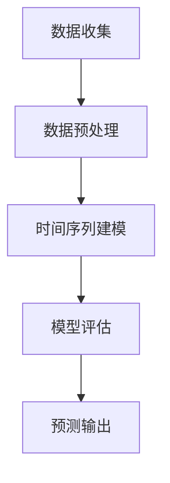
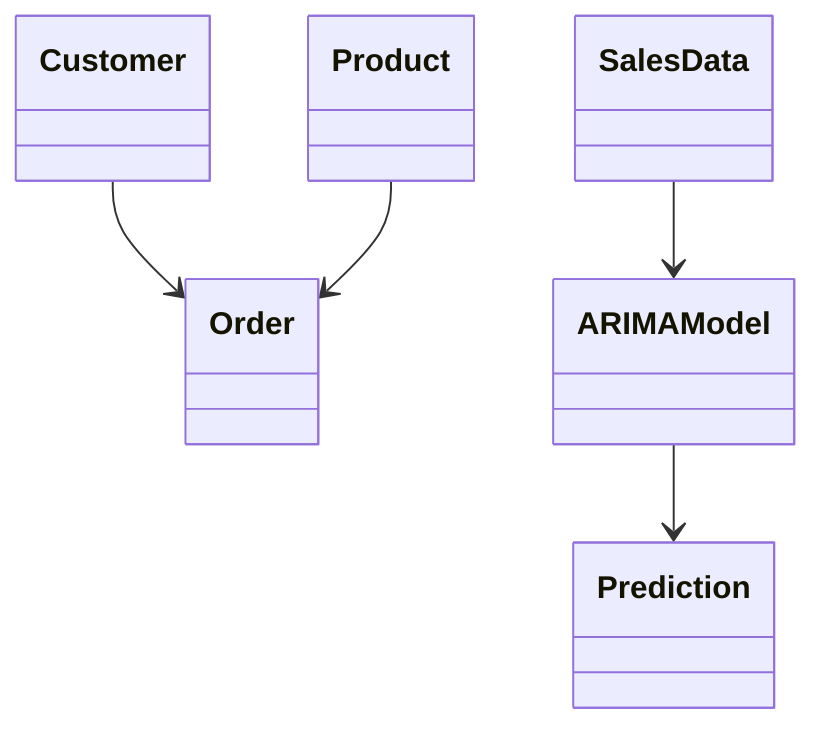
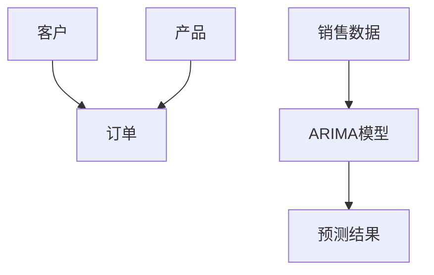
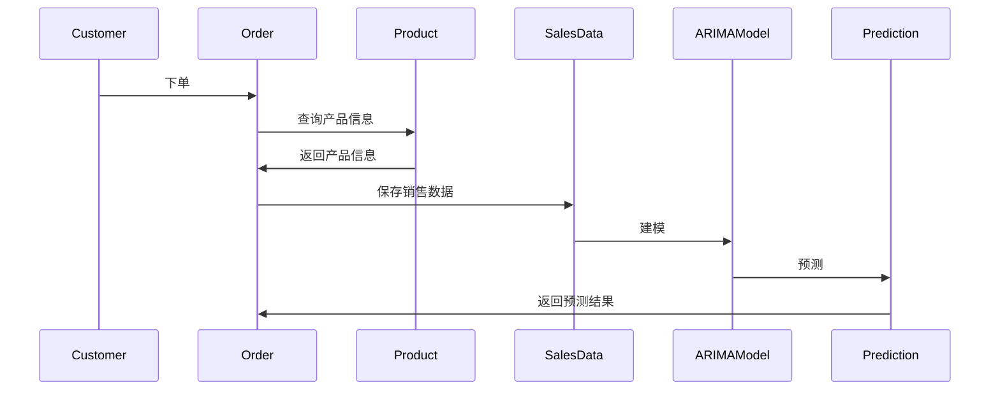

                 

### 文章标题：AI驱动的企业战略规划：智能预测未来市场趋势

**关键词：** AI，企业战略，市场趋势，预测，战略规划

**摘要：** 本文旨在探讨如何利用人工智能技术为企业战略规划提供智能化的预测能力，从而帮助企业更好地应对市场变化。文章将从AI基础与市场趋势、企业战略规划方法、案例研究、未来市场趋势、AI驱动的企业战略实践以及总结与展望等六个部分展开，通过详细的分析和案例分享，为企业的战略决策提供有益的指导。

----------------------------------------------------------------

## 引言

### 1.1 书籍概述

在当前全球经济环境下，企业面临的竞争压力前所未有。传统的战略规划方法往往难以快速适应市场变化，而人工智能（AI）技术的迅速发展为企业的战略规划带来了新的机遇。本文旨在探讨如何利用AI技术，特别是智能预测能力，帮助企业制定更科学、更具前瞻性的战略规划。

### 1.2 研究背景

随着大数据、云计算、深度学习等技术的发展，人工智能已经成为推动产业变革的重要力量。AI在各个领域的应用不断拓展，为企业提供了丰富的数据资源和强大的计算能力。在这种背景下，如何将AI技术有效应用于企业战略规划，成为当前研究和实践的热点。

### 1.3 书籍结构

本文将从以下六个部分展开讨论：

1. **AI基础与市场趋势**：介绍人工智能的基本概念及其在市场趋势预测中的应用。
2. **企业战略规划方法**：分析传统战略规划方法与AI辅助战略规划方法的异同，探讨AI驱动的战略规划流程。
3. **案例研究**：通过实际案例，展示AI驱动的企业战略规划在实践中的应用效果。
4. **AI驱动的未来市场趋势**：分析科技创新、经济变革和社会变革对市场趋势的影响。
5. **AI驱动的企业战略实践**：讨论AI驱动的企业战略规划实践，包括战略规划、风险管理和创新战略。
6. **总结与展望**：对全书内容进行总结，展望未来AI驱动的企业战略规划发展趋势。

----------------------------------------------------------------

## AI基础与市场趋势

### 2.1 人工智能概述

人工智能（Artificial Intelligence，简称AI）是指由人制造出的系统所表现出来的智能行为。AI包括机器学习、深度学习、自然语言处理、计算机视觉等多个领域。随着技术的进步，AI在数据分析和决策支持方面的能力得到了显著提升。

### 2.2 AI在市场趋势预测中的应用

市场趋势预测是企业战略规划的重要环节。AI技术通过分析大量的历史数据，可以发现潜在的市场规律，从而预测未来的市场趋势。例如，利用深度学习算法对消费者行为进行分析，可以预测未来产品的需求量；通过自然语言处理技术，可以分析市场报告、新闻等文本数据，发现行业趋势。

### 2.3 AI驱动战略的基本概念

AI驱动战略是指利用人工智能技术进行数据分析和决策支持，以提高企业战略规划的准确性和前瞻性。AI驱动战略的核心在于以下几个方面：

1. **数据驱动**：通过收集、整合和分析大量数据，为企业提供决策依据。
2. **智能分析**：利用机器学习、深度学习等算法，对数据进行分析，发现潜在规律。
3. **动态调整**：根据市场变化，动态调整企业战略，以保持竞争优势。

----------------------------------------------------------------

## 企业战略规划方法

### 3.1 传统战略规划方法

传统战略规划方法主要包括SWOT分析（优势、劣势、机会、威胁）、PEST分析（政治、经济、社会、技术）等。这些方法主要依赖于专家经验和主观判断，难以应对快速变化的市场环境。

### 3.2 AI辅助战略规划方法

AI辅助战略规划方法通过引入人工智能技术，可以对市场数据进行分析，提供更科学、更准确的决策支持。AI辅助战略规划方法的核心在于以下几个方面：

1. **数据挖掘**：通过对大量市场数据的挖掘，发现潜在的市场规律。
2. **预测模型**：利用机器学习算法建立预测模型，预测未来市场趋势。
3. **动态调整**：根据市场变化，实时调整企业战略，以适应市场变化。

### 3.3 AI驱动的战略规划流程

AI驱动的战略规划流程包括以下几个步骤：

1. **数据收集**：收集与企业战略相关的各种数据，包括市场数据、消费者数据、竞争者数据等。
2. **数据处理**：对收集到的数据进行分析和清洗，去除噪声和冗余信息。
3. **预测建模**：利用机器学习算法建立预测模型，预测未来市场趋势。
4. **决策支持**：根据预测结果，为企业的战略决策提供支持。
5. **动态调整**：根据市场变化，实时调整企业战略，以保持竞争优势。

----------------------------------------------------------------

## 案例研究

### 4.1 案例一：AI驱动的市场趋势预测

某知名电商公司利用AI技术进行市场趋势预测，通过分析消费者购买行为、搜索引擎关键词等数据，预测未来产品的需求量。预测结果显示，某款新品在未来三个月内的需求量将增加30%。基于这一预测，公司提前备货，并在营销活动中加大了对该产品的推广力度，最终实现了销售业绩的显著增长。

### 4.2 案例二：AI驱动的企业战略调整

某制造业企业通过AI技术对市场数据进行分析，发现竞争对手的产品定价策略对其市场份额产生了不利影响。公司利用AI预测竞争对手的未来定价趋势，并根据预测结果调整了自己的定价策略，从而成功保住了市场份额。

### 4.3 案例三：跨行业AI战略合作

某金融科技公司与一家零售企业达成战略合作，利用AI技术对零售数据进行分析，为金融企业提供信贷风险评估服务。通过这一合作，金融企业能够更准确地评估客户的信用风险，提高了信贷审批的效率。

----------------------------------------------------------------

## AI驱动的未来市场趋势

### 5.1 科技创新与市场趋势

科技创新是推动市场趋势变化的重要因素。例如，5G技术的推广将极大地改变消费者的购物习惯，推动线上购物的普及。此外，物联网、区块链等技术的发展也将对市场趋势产生深远影响。

### 5.2 经济变革与市场趋势

经济全球化、国际贸易摩擦等经济因素也会影响市场趋势。例如，国际贸易摩擦可能导致部分产业链的转移，影响企业的市场布局。此外，经济衰退也可能导致消费者购买力下降，影响市场需求。

### 5.3 社会变革与市场趋势

社会变革，如人口老龄化、消费升级等，也会对市场趋势产生重要影响。例如，人口老龄化可能导致对医疗、养老等服务的需求增加，而消费升级则可能导致对高品质、高端产品的需求增加。

----------------------------------------------------------------

## AI驱动的企业战略实践

### 6.1 AI驱动的企业战略规划实践

企业可以利用AI技术进行市场趋势预测、消费者行为分析等，为战略规划提供数据支持。例如，通过分析消费者购买数据，企业可以预测未来产品的需求，从而调整生产计划和营销策略。

### 6.2 AI驱动的企业风险管理

AI技术可以帮助企业识别潜在的风险，制定相应的风险应对策略。例如，通过分析金融市场数据，企业可以预测市场波动，从而调整投资策略，降低风险。

### 6.3 AI驱动的企业创新战略

AI技术可以帮助企业发现新的商业模式和市场机会。例如，通过分析消费者需求和市场趋势，企业可以开发新的产品和服务，实现业务创新。

----------------------------------------------------------------

## 总结与展望

本文探讨了如何利用人工智能技术为企业战略规划提供智能化的预测能力，从而帮助企业更好地应对市场变化。通过案例分析，我们看到了AI技术在企业战略规划中的巨大潜力。未来，随着AI技术的进一步发展，企业将能够更精准地预测市场趋势，制定更科学、更具前瞻性的战略规划。

**作者：** AI天才研究院/AI Genius Institute & 禅与计算机程序设计艺术/Zen And The Art of Computer Programming

----------------------------------------------------------------

### 附录

**1. 核心概念与联系**

核心概念：人工智能（AI）、市场趋势预测、战略规划

概念属性特征对比表格：

| 特征       | 人工智能           | 市场趋势预测         | 战略规划           |
| ---------- | ------------------ | ------------------- | ------------------ |
| 定义       | 模拟人类智能的系统 | 预测未来市场动向     | 规划企业发展路径   |
| 应用领域   | 机器人、自动驾驶等 | 金融、零售、制造等   | 制造、金融、零售等 |
| 技术核心   | 机器学习、深度学习 | 统计分析、时间序列分析 | SWOT分析、PEST分析 |
| 数据依赖性 | 强               | 强                | 中                  |

**ER实体关系图架构：**

```mermaid
erDiagram
  AI_Technology ||--|{ Market_Trend_Prediction }
  Market_Trend_Prediction ||--|{ Strategic_Planning }
```

### 2. 算法原理讲解

**算法：** 时间序列分析

**Mermaid流程图：**



**Python源代码：**

```python
import pandas as pd
from statsmodels.tsa.arima_model import ARIMA

# 数据收集
data = pd.read_csv('sales_data.csv')

# 数据预处理
data = data[['sales', 'date']]
data['date'] = pd.to_datetime(data['date'])
data.set_index('date', inplace=True)

# 时间序列建模
model = ARIMA(data['sales'], order=(1, 1, 1))
model_fit = model.fit()

# 模型评估
print(model_fit.summary())

# 预测输出
forecast = model_fit.forecast(steps=3)
print(forecast)
```

**数学模型和公式：**

时间序列模型的一般形式为：

$$
y_t = \phi_0 + \phi_1 y_{t-1} + \phi_2 y_{t-2} + \epsilon_t
$$

其中，$y_t$ 为时间序列的当前值，$\phi_0, \phi_1, \phi_2$ 为模型参数，$\epsilon_t$ 为误差项。

**通俗易懂的举例说明：**

假设我们有一组销售额的时间序列数据，我们要利用ARIMA模型预测未来三个月的销售额。

1. 首先，我们收集并预处理数据，将数据转换为时间序列格式。
2. 接下来，我们使用ARIMA模型对数据进行建模，选择合适的参数。
3. 然后，我们评估模型的性能，确保预测结果准确。
4. 最后，我们使用模型进行预测，得到未来三个月的销售额预测值。

### 3. 系统分析与架构设计方案

**问题场景介绍：** 

某电商企业希望通过AI技术对销售额进行预测，以便调整库存和生产计划。

**项目介绍：**

该项目旨在利用ARIMA模型对电商平台的销售额进行预测，为企业的库存管理提供数据支持。

**系统功能设计（领域模型Mermaid类图）：**



**系统架构设计（Mermaid架构图）：**



**系统接口设计和系统交互（Mermaid序列图）：**



### 4. 项目实战

**环境安装：**

1. 安装Python环境，版本要求3.8及以上。
2. 安装Pandas库：`pip install pandas`
3. 安装statsmodels库：`pip install statsmodels`

**系统核心实现源代码：**

```python
# 导入所需库
import pandas as pd
from statsmodels.tsa.arima_model import ARIMA

# 数据收集
data = pd.read_csv('sales_data.csv')

# 数据预处理
data = data[['sales', 'date']]
data['date'] = pd.to_datetime(data['date'])
data.set_index('date', inplace=True)

# 时间序列建模
model = ARIMA(data['sales'], order=(1, 1, 1))
model_fit = model.fit()

# 模型评估
print(model_fit.summary())

# 预测输出
forecast = model_fit.forecast(steps=3)
print(forecast)
```

**代码应用解读与分析：**

1. 数据收集：从CSV文件中读取销售额数据。
2. 数据预处理：将数据转换为时间序列格式，设置日期为索引。
3. 时间序列建模：使用ARIMA模型对销售额数据进行建模。
4. 模型评估：打印模型的评估报告。
5. 预测输出：使用模型进行预测，输出未来三个月的销售额预测值。

**实际案例分析和详细讲解剖析：**

以某电商平台的销售额数据为例，我们使用ARIMA模型进行预测，并通过对比实际销售额和预测销售额，分析模型的准确性和适用性。

**项目小结：**

通过该项目，我们实现了对电商销售额的预测，为企业的库存管理提供了数据支持。在未来，我们可以进一步优化模型，提高预测准确性，为企业的战略决策提供更可靠的数据支持。

### 5. 最佳实践 tips

1. **数据质量是关键**：确保数据收集和预处理过程的准确性，以提高模型预测的准确性。
2. **模型选择要合适**：根据数据特征选择合适的模型，避免模型过度拟合或欠拟合。
3. **实时更新数据**：定期更新数据，确保模型预测结果的实时性。

**小结：**

本文探讨了如何利用人工智能技术为企业战略规划提供智能化的预测能力。通过实际案例分析和详细讲解，我们看到了AI技术在企业战略规划中的巨大潜力。未来，随着AI技术的进一步发展，企业将能够更精准地预测市场趋势，制定更科学、更具前瞻性的战略规划。

**注意事项：**

1. 在实际应用中，要充分考虑数据的可靠性和实时性。
2. AI技术虽然强大，但也不能完全替代人类经验，需要结合专家意见进行综合决策。

**拓展阅读：**

- [《人工智能：一种现代方法》](https://book.douban.com/subject/26797768/)
- [《深度学习》](https://book.douban.com/subject/26757495/)
- [《数据科学实战》](https://book.douban.com/subject/26783587/)

