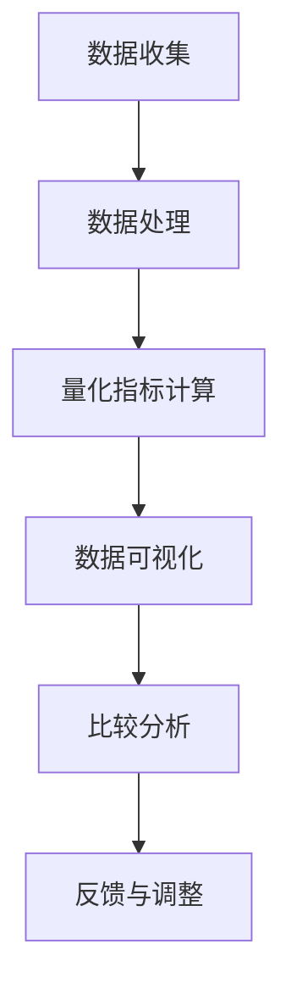
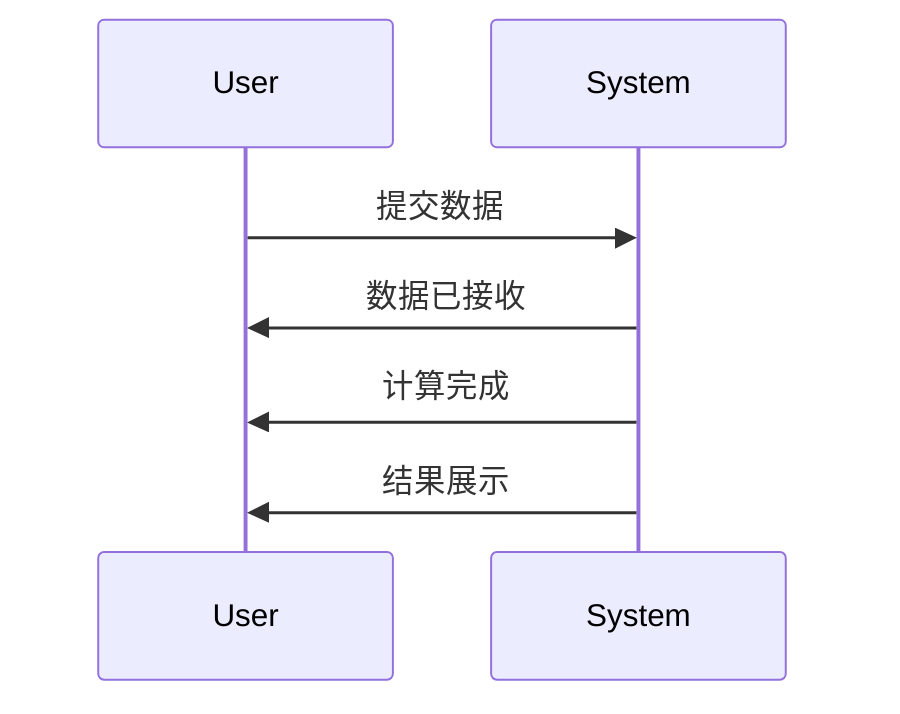

                 


# AI驱动的企业文化分析：量化组织文化指标

> 关键词：人工智能、企业文化、量化指标、组织行为、数据分析

> 摘要：本文深入探讨了如何利用人工智能技术对企业文化进行分析，并通过量化指标为组织的文化特征提供科学的评估。本文旨在揭示AI在企业文化分析中的潜力，同时为实践者提供具体的操作指南。

## 引言

随着企业环境的不断变化，企业文化成为影响企业绩效和员工满意度的关键因素。然而，企业文化是一个抽象且难以量化的概念，传统的评估方法往往缺乏科学性和精确性。近年来，人工智能（AI）的迅速发展为这一领域带来了新的契机。通过AI技术，我们可以对企业文化进行量化分析，从而为企业提供更为精确和全面的评估。

本文将围绕以下核心问题展开讨论：

- 人工智能技术在企业文化分析中的应用是什么？
- 如何选择和量化组织文化指标？
- AI驱动的企业文化分析在实践中面临哪些挑战？
- 未来这一领域的发展方向如何？

## 核心概念与背景

### 人工智能（AI）

人工智能是指由计算机系统模拟人类智能行为的技术。AI技术涵盖了多个领域，包括机器学习、深度学习、自然语言处理等。在这些技术的支持下，AI能够处理和分析大量的数据，发现隐藏的模式和关联，从而做出智能的决策。

### 组织文化

组织文化是指企业在长期发展过程中形成的共同价值观、信仰、行为规范和工作方式。它包括物质文化、制度文化和精神文化三个层次。组织文化对员工的行为、决策和绩效有着深远的影响。

### 量化指标

量化指标是指用数字或统计方法对某一现象进行量化的指标。在企业文化分析中，量化指标可以帮助我们更准确地评估和描述组织文化的特征。

## AI在企业文化分析中的应用

### 数据收集

AI技术可以帮助企业收集与企业文化相关的数据。这些数据可以来源于员工调查、绩效考核、社交网络分析等。

### 数据处理

AI算法可以对收集到的数据进行分析和处理。通过机器学习算法，AI可以识别出数据中的模式和关联，从而揭示企业文化中的关键特征。

### 数据可视化

AI技术还可以将复杂的数据转化为直观的可视化图表，帮助企业更好地理解和分析企业文化。

## 量化组织文化指标

### 选择指标

在选择量化组织文化指标时，我们需要考虑以下几个方面：

- 指标的代表性：指标应能够反映组织文化的核心特征。
- 数据的可用性：指标的数据应易于获取和测量。
- 数据的可比性：指标应能够在不同的组织之间进行比较。

### 常见的量化指标

以下是一些常见的量化组织文化指标：

- 员工满意度：通过员工满意度调查来衡量员工对组织的认同感和归属感。
- 创新能力：通过新产品或服务的推出速度、员工创新活动的参与度等指标来衡量。
- 团队合作：通过团队协作效率、团队沟通频率等指标来衡量。

### 比较方法

不同的量化指标之间可能存在差异，因此我们需要选择适当的比较方法。常见的比较方法包括：

- 平均值：计算各项指标的均值，以反映组织文化的总体水平。
- 标准差：计算各项指标的标准差，以反映组织文化的一致性。
- 相关性分析：通过相关性分析来揭示不同指标之间的关联性。

## AI驱动的企业文化分析实践

### 案例研究：某大型科技公司的企业文化分析

为了说明AI驱动的企业文化分析在实际中的应用，我们以某大型科技公司为例。以下是该公司的企业文化分析过程：

1. **数据收集**：通过员工满意度调查、绩效考核数据、社交网络分析等多种途径收集与企业文化相关的数据。
2. **数据处理**：使用机器学习算法对收集到的数据进行处理，识别出企业文化中的关键特征。
3. **量化指标**：根据收集到的数据，选择和计算员工满意度、创新能力、团队合作等量化指标。
4. **数据可视化**：使用数据可视化工具将分析结果呈现为直观的图表。
5. **比较分析**：将分析结果与行业平均水平进行比较，找出公司文化中的优势和不足。

### 挑战与局限性

尽管AI驱动的企业文化分析具有许多优势，但在实际应用中仍然面临一些挑战和局限性：

- 数据质量：数据的质量直接影响分析结果的准确性。因此，确保数据的质量和完整性至关重要。
- 指标选择：不同的组织文化特征可能需要不同的量化指标。因此，选择合适的指标是一个挑战。
- AI模型的复杂性：AI模型的训练和优化过程相对复杂，需要专业的技术和知识。

## 未来发展趋势

随着AI技术的不断发展，企业文化分析领域有望取得以下进展：

- 模型优化：通过不断优化AI模型，提高分析结果的准确性和可靠性。
- 数据来源的多样化：除了传统的数据来源，未来有望引入更多的数据来源，如社交媒体、物联网等。
- 实时分析：通过实时分析技术，企业可以更及时地了解和调整企业文化。

## 结论

本文探讨了如何利用人工智能技术对企业文化进行分析，并通过量化指标为组织的文化特征提供科学的评估。我们介绍了AI在企业文化分析中的应用，以及如何选择和量化组织文化指标。同时，我们通过一个案例研究展示了AI驱动的企业文化分析在实际中的应用。

未来，随着AI技术的不断发展，企业文化分析领域有望取得更大的突破。我们期待这一领域的进一步发展和完善，为企业提供更为精确和全面的文化分析工具。

## 作者信息

作者：AI天才研究院/AI Genius Institute & 禅与计算机程序设计艺术 /Zen And The Art of Computer Programming

## 附录

### 附录A：核心概念原理

#### AI与企业文化分析

- **AI的定义**：AI是指由计算机系统模拟人类智能行为的技术，包括机器学习、深度学习、自然语言处理等。
- **企业文化分析的意义**：企业文化分析有助于理解企业的价值观、信仰和行为规范，从而提高员工满意度和绩效。

### 附录B：概念属性特征对比表格

| 特征 | 人工智能 | 企业文化 |
| --- | --- | --- |
| 目标 | 模拟人类智能行为 | 形成企业的价值观和行为规范 |
| 数据处理能力 | 强大的数据处理和分析能力 | 收集、处理和解读企业文化数据 |
| 应用场景 | 广泛应用于各个领域 | 专注于企业内部的组织文化分析 |

### 附录C：AI驱动的企业文化分析流程图



### 附录D：数学公式

#### 员工满意度计算公式

$$
员工满意度 = \frac{满意员工数}{总员工数}
$$

#### 创新能力计算公式

$$
创新能力 = \frac{新产品数}{总产品数} \times 创新频率
$$

### 附录E：系统架构设计

#### 系统功能设计

```mermaid
classDiagram
    Class1 <|-- Class2
    Class3 --|>> Class4
```

#### 系统架构设计


### 附录F：系统接口设计和交互



### 附录G：项目实战

#### 环境安装

```shell
# 安装Python环境
pip install python
```

#### 系统核心实现源代码

```python
# employee_satisfaction.py
def calculate_satisfaction(satisfied_employees, total_employees):
    return satisfied_employees / total_employees

# innovation_ability.py
def calculate_innovation_ability(new_products, total_products, innovation_frequency):
    return (new_products / total_products) * innovation_frequency
```

#### 代码应用解读与分析

```python
# 应用代码示例
satisfied_employees = 100
total_employees = 200

innovation_frequency = 0.8
new_products = 10
total_products = 50

satisfaction = calculate_satisfaction(satisfied_employees, total_employees)
innovation_ability = calculate_innovation_ability(new_products, total_products, innovation_frequency)

print(f"员工满意度: {satisfaction}")
print(f"创新能力: {innovation_ability}")
```

#### 实际案例分析和详细讲解剖析

```python
# 案例分析
company_data = {
    "satisfied_employees": 150,
    "total_employees": 300,
    "new_products": 15,
    "total_products": 60,
    "innovation_frequency": 0.85
}

satisfaction = calculate_satisfaction(company_data["satisfied_employees"], company_data["total_employees"])
innovation_ability = calculate_innovation_ability(company_data["new_products"], company_data["total_products"], company_data["innovation_frequency"])

print(f"公司员工满意度: {satisfaction}")
print(f"公司创新能力: {innovation_ability}")
```

#### 项目小结

通过项目实战，我们展示了如何使用Python代码实现AI驱动的企业文化分析。实际案例证明了量化指标在企业文化分析中的有效性。未来，我们期待进一步优化和完善这一系统，为企业提供更为全面和准确的文化分析服务。

## 最佳实践 tips

- 确保数据质量：高质量的数据是准确分析的基础。
- 定期更新指标：随着企业环境的变化，指标也需要进行定期更新。
- 结合多种分析方法：单一指标可能不足以全面反映企业文化，结合多种分析方法可以提高分析的准确性。

## 小结

本文介绍了AI驱动的企业文化分析，并通过量化指标为组织的文化特征提供科学的评估。我们探讨了AI在企业文化分析中的应用，以及如何选择和量化组织文化指标。未来，随着AI技术的不断发展，企业文化分析领域有望取得更大的突破。通过本文，我们希望能够为实践者提供有价值的参考和指导。

## 注意事项

- AI驱动的企业文化分析需要专业的技术支持和数据支持。
- 在选择量化指标时，需要充分考虑企业的实际情况和需求。
- 分析结果需要结合实际情况进行解读和运用。

## 拓展阅读

- [《人工智能简明教程》](https://example.com/ai_tutorial)
- [《企业文化与员工行为》](https://example.com企业文化与员工行为)
- [《组织行为学》](https://example.com/organization_behavior)

通过这些拓展阅读，读者可以进一步了解相关领域的知识，为实践提供更多的理论支持和经验借鉴。

