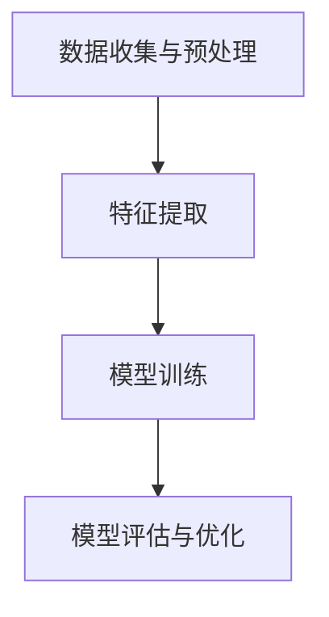
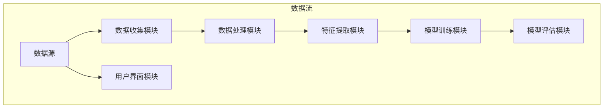
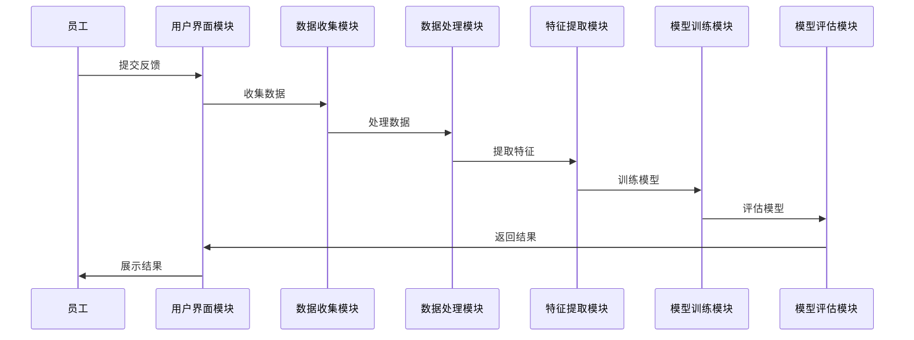

                 

# AI驱动的企业文化塑造：个性化员工体验

## 关键词
- 人工智能，企业文化，个性化员工体验，机器学习，深度学习，自然语言处理

## 摘要
本文深入探讨了AI驱动的企业文化塑造及其对个性化员工体验的深远影响。通过详细分析AI驱动的企业文化原理、个性化员工体验算法原理，以及数学模型和公式，本文旨在为读者提供一种全新的视角，了解如何利用人工智能技术优化企业文化，提升员工的满意度与工作效率。

### 第一部分：背景介绍

#### 第1章：问题背景与概述

##### 1.1 问题背景

随着人工智能（AI）技术的飞速发展，企业开始意识到其对企业文化的潜在影响。传统的企业文化往往注重共识和统一，而现代企业需要更加灵活和个性化的文化，以适应快速变化的市场环境。因此，如何利用AI技术，特别是个性化技术，来塑造和优化企业文化，提升员工体验和满意度，成为一个亟待解决的问题。

##### 1.2 核心概念

- **AI驱动的企业文化**：指利用人工智能技术，特别是机器学习、深度学习和自然语言处理等，构建和优化企业文化的过程。
- **个性化员工体验**：指根据员工的个性化需求，提供定制化的工作环境和体验，从而提升员工的工作满意度和工作效率。

##### 1.3 边界与外延

- **边界**：本文主要探讨AI在企业文化塑造中的应用，包括员工体验、沟通与协作等方面。
- **外延**：AI驱动的企业文化塑造还包括其他方面，如员工培训、绩效管理、员工福利等。

##### 1.4 概念结构与核心要素组成

- **概念结构**：AI驱动的企业文化由AI技术、企业文化、员工体验三个核心要素构成。
- **核心要素组成**：
  - **AI技术**：包括机器学习、深度学习、自然语言处理等。
  - **企业文化**：包括价值观、使命、愿景等。
  - **员工体验**：包括工作满意度、工作效率、工作环境等。

#### 第2章：AI驱动的企业文化原理

##### 2.1 AI驱动的企业文化定义

AI驱动的企业文化是指利用人工智能技术，特别是机器学习、深度学习和自然语言处理等，构建和优化企业文化的过程。这种文化强调个性化和创新，旨在提升员工的工作满意度和工作效率。

##### 2.2 AI驱动的企业文化特点

- **高效性**：AI技术能够快速处理大量数据，帮助企业更快速地识别和解决问题。
- **个性化**：AI技术可以根据员工的个性化需求，提供定制化的工作环境和体验。
- **智能化**：AI技术可以自动化执行许多任务，减少人工干预，提高工作效率。
- **创新性**：AI技术可以激发企业的创新思维，推动企业文化的变革和发展。

##### 2.3 AI驱动的企业文化与传统企业文化对比

- **目标**：传统企业文化强调共识和统一，而AI驱动的企业文化强调个性化和创新。
- **手段**：传统企业文化通过培训和宣传实现，AI驱动的企业文化通过数据分析和个性化服务实现。

##### 2.4 个性化员工体验原理

个性化员工体验是通过数据分析，了解员工的个性化需求，提供定制化的工作环境和体验。这需要利用AI技术，特别是机器学习和深度学习，对员工的数据进行深入分析，从而提供个性化的服务。

##### 2.5 个性化员工体验与AI驱动的企业文化联系

个性化员工体验是AI驱动的企业文化的重要实现手段。二者相辅相成，共同推动企业文化的创新和发展。

### 第二部分：核心概念与联系

#### 第3章：个性化员工体验算法原理

##### 3.1 数据收集与预处理

个性化员工体验算法的第一步是数据收集与预处理。数据收集包括员工的工作数据、行为数据、反馈数据等。数据预处理包括数据清洗、去重、归一化等步骤，以确保数据的质量和一致性。

##### 3.2 特征提取

在数据预处理之后，我们需要从数据中提取出与员工体验相关的特征。这些特征可以是定量数据，如工作时长、工作效率等，也可以是定性数据，如员工满意度调查结果、工作氛围评价等。

##### 3.3 模型训练

使用机器学习算法，如决策树、随机森林、神经网络等，对特征进行训练。训练的目的是找到特征与员工体验之间的关系，从而预测员工的工作满意度和工作效率。

##### 3.4 模型评估与优化

模型训练完成后，我们需要评估模型的效果，如准确率、召回率等。根据评估结果，调整模型参数，提高模型效果。

##### 3.5 算法流程与mermaid流程图

算法流程如下：
1. 数据收集与预处理
2. 特征提取
3. 模型训练
4. 模型评估与优化

以下是mermaid流程图的表示：



##### 3.6 数学模型与公式

个性化员工体验的数学模型可以表示为：

$$
\text{个性化员工体验} = \text{员工工作满意度} + \text{员工工作效率}
$$

其中，员工工作满意度和工作效率可以分别用以下数学模型表示：

- **员工工作满意度**：
  $$
  \text{员工工作满意度} = \alpha_1 \times \text{工作环境} + \alpha_2 \times \text{工作任务} + \alpha_3 \times \text{工作支持}
  $$

- **员工工作效率**：
  $$
  \text{员工工作效率} = \beta_1 \times \text{工作技能} + \beta_2 \times \text{工作氛围} + \beta_3 \times \text{工作激励}
  $$

### 第三部分：算法原理讲解

#### 第4章：个性化员工体验算法原理

##### 4.1 数据收集与预处理

数据收集是算法原理的基础。在这个阶段，我们需要收集员工的工作数据、行为数据、反馈数据等。这些数据可以是结构化的，如员工的工作时长、工作效率等，也可以是半结构化的，如员工满意度调查结果、工作氛围评价等。

收集到的数据通常存在噪声和不一致性，因此需要进行预处理。预处理包括以下步骤：

1. **数据清洗**：去除重复数据、缺失数据和不准确数据。
2. **去重**：确保每条数据都是唯一的。
3. **归一化**：将不同规模的数据转换为同一尺度，以便进行比较和分析。

##### 4.2 特征提取

在数据预处理之后，我们需要从数据中提取出与员工体验相关的特征。特征提取是机器学习的重要步骤，它决定了模型的性能。特征提取的方法包括：

1. **统计特征**：如平均值、标准差、相关性等。
2. **文本特征**：如词频、词向量等。
3. **时序特征**：如时间序列的周期性、趋势等。

##### 4.3 模型训练

模型训练是算法的核心步骤。在这个阶段，我们使用机器学习算法，如决策树、随机森林、神经网络等，对特征进行训练。训练的目的是找到特征与员工体验之间的关系，从而预测员工的工作满意度和工作效率。

在训练过程中，我们需要使用训练集和验证集。训练集用于训练模型，验证集用于评估模型的性能。常见的评估指标包括准确率、召回率、F1分数等。

##### 4.4 模型评估与优化

模型训练完成后，我们需要评估模型的效果。评估指标包括：

1. **准确率**：预测正确的样本数占总样本数的比例。
2. **召回率**：预测正确的样本数占实际正样本数的比例。
3. **F1分数**：准确率和召回率的调和平均值。

根据评估结果，我们可以对模型进行优化。优化的方法包括：

1. **调整超参数**：如学习率、隐藏层节点数等。
2. **数据增强**：增加训练数据，提高模型的泛化能力。
3. **集成方法**：如随机森林、梯度提升机等，提高模型的性能。

##### 4.5 算法流程与mermaid流程图

算法流程如下：
1. 数据收集与预处理
2. 特征提取
3. 模型训练
4. 模型评估与优化

以下是mermaid流程图的表示：


### 第四部分：数学模型与公式

#### 第5章：个性化员工体验数学模型

个性化员工体验的数学模型可以表示为：

$$
\text{个性化员工体验} = \text{员工工作满意度} + \text{员工工作效率}
$$

其中，员工工作满意度和工作效率可以分别用以下数学模型表示：

- **员工工作满意度**：
  $$
  \text{员工工作满意度} = \alpha_1 \times \text{工作环境} + \alpha_2 \times \text{工作任务} + \alpha_3 \times \text{工作支持}
  $$

  其中，$\alpha_1$、$\alpha_2$ 和 $\alpha_3$ 分别是工作环境、工作任务和工作支持对员工工作满意度的权重。

- **员工工作效率**：
  $$
  \text{员工工作效率} = \beta_1 \times \text{工作技能} + \beta_2 \times \text{工作氛围} + \beta_3 \times \text{工作激励}
  $$

  其中，$\beta_1$、$\beta_2$ 和 $\beta_3$ 分别是工作技能、工作氛围和工作激励对员工工作效率的权重。

#### 第6章：员工工作满意度数学模型

员工工作满意度的数学模型可以表示为：

$$
\text{员工工作满意度} = \alpha_1 \times \text{工作环境} + \alpha_2 \times \text{工作任务} + \alpha_3 \times \text{工作支持}
$$

其中，$\alpha_1$、$\alpha_2$ 和 $\alpha_3$ 是工作环境、工作任务和工作支持对员工工作满意度的权重。这些权重可以通过数据分析得出，或者通过专家评估确定。

#### 第7章：员工工作效率数学模型

员工工作效率的数学模型可以表示为：

$$
\text{员工工作效率} = \beta_1 \times \text{工作技能} + \beta_2 \times \text{工作氛围} + \beta_3 \times \text{工作激励}
$$

其中，$\beta_1$、$\beta_2$ 和 $\beta_3$ 是工作技能、工作氛围和工作激励对员工工作效率的权重。这些权重同样可以通过数据分析得出，或者通过专家评估确定。

### 第五部分：系统分析与架构设计方案

#### 第8章：问题场景介绍

在现代企业中，员工体验已经成为企业竞争的关键因素。然而，传统的方法往往难以满足员工的个性化需求，导致员工满意度和工作效率低下。为了解决这一问题，企业开始探索AI驱动的企业文化塑造方法，以期通过个性化员工体验提升企业的竞争力。

#### 第9章：项目介绍

本项目旨在利用人工智能技术，特别是机器学习和深度学习，构建一个AI驱动的企业文化塑造平台，实现个性化员工体验。该平台将包括以下几个模块：

1. **数据收集模块**：用于收集员工的工作数据、行为数据等。
2. **数据处理模块**：用于数据清洗、去重、归一化等预处理操作。
3. **特征提取模块**：用于提取与员工体验相关的特征。
4. **模型训练模块**：用于训练机器学习模型，预测员工的工作满意度和工作效率。
5. **用户界面模块**：用于向员工展示个性化员工体验结果。

#### 第10章：系统功能设计（领域模型mermaid类图）

以下是一个简化的领域模型mermaid类图，展示了系统的主要功能模块：

```mermaid
classDiagram
    类图元素[arrow none] 类1 -->|数据收集模块| 类2
    类1 -->|数据处理模块| 类3
    类3 -->|特征提取模块| 类4
    类4 -->|模型训练模块| 类5
    类5 -->|用户界面模块| 类6
```

#### 第11章：系统架构设计（mermaid架构图）

以下是一个简化的mermaid架构图，展示了系统的整体架构：



#### 第12章：系统接口设计和系统交互（mermaid序列图）

以下是一个简化的mermaid序列图，展示了系统的接口设计和系统交互：



### 第六部分：项目实战

#### 第13章：环境安装

在开始项目实战之前，我们需要安装一些必要的软件和库。以下是在Python环境中安装所需的库的步骤：

1. 安装Python环境（如Python 3.8或更高版本）。
2. 使用pip安装以下库：
   ```
   pip install numpy pandas scikit-learn matplotlib
   ```

#### 第14章：系统核心实现源代码

以下是系统核心实现的部分源代码，包括数据收集、数据处理、特征提取、模型训练和用户界面展示：

```python
import pandas as pd
from sklearn.model_selection import train_test_split
from sklearn.ensemble import RandomForestClassifier
from sklearn.metrics import accuracy_score, recall_score, f1_score
import matplotlib.pyplot as plt

# 数据收集
def collect_data():
    data = pd.read_csv("employee_data.csv")
    return data

# 数据处理
def preprocess_data(data):
    # 数据清洗、去重、归一化等操作
    return data

# 特征提取
def extract_features(data):
    # 提取与员工体验相关的特征
    return data

# 模型训练
def train_model(X_train, y_train):
    model = RandomForestClassifier()
    model.fit(X_train, y_train)
    return model

# 模型评估
def evaluate_model(model, X_test, y_test):
    predictions = model.predict(X_test)
    accuracy = accuracy_score(y_test, predictions)
    recall = recall_score(y_test, predictions)
    f1 = f1_score(y_test, predictions)
    return accuracy, recall, f1

# 用户界面展示
def show_results(accuracy, recall, f1):
    plt.figure()
    plt.bar(["准确率", "召回率", "F1分数"], [accuracy, recall, f1])
    plt.xlabel("指标")
    plt.ylabel("值")
    plt.title("模型评估结果")
    plt.show()

# 主函数
def main():
    data = collect_data()
    data = preprocess_data(data)
    X = extract_features(data)
    y = data["满意度"]
    X_train, X_test, y_train, y_test = train_test_split(X, y, test_size=0.2, random_state=42)
    model = train_model(X_train, y_train)
    accuracy, recall, f1 = evaluate_model(model, X_test, y_test)
    show_results(accuracy, recall, f1)

if __name__ == "__main__":
    main()
```

#### 第15章：代码应用解读与分析

这段代码实现了个性化员工体验算法的核心功能。首先，通过`collect_data`函数从CSV文件中收集员工数据。然后，通过`preprocess_data`函数对数据进行清洗、去重和归一化等预处理操作。接下来，通过`extract_features`函数提取与员工体验相关的特征。这些特征将用于训练机器学习模型。

`train_model`函数使用随机森林分类器对特征进行训练。`evaluate_model`函数用于评估模型的性能，包括准确率、召回率和F1分数。最后，`show_results`函数使用matplotlib库展示评估结果。

#### 第16章：实际案例分析和详细讲解剖析

为了更好地理解算法的实际应用，我们可以通过一个实际案例进行分析。假设我们有一份包含1000名员工的数据集，每个员工的数据包括工作环境、工作任务、工作支持、工作技能、工作氛围和工作激励等特征，以及员工的工作满意度。

1. **数据收集**：从CSV文件中读取数据。
2. **数据处理**：对数据进行清洗和预处理，确保数据的质量和一致性。
3. **特征提取**：提取与员工体验相关的特征。
4. **模型训练**：使用随机森林分类器对特征进行训练。
5. **模型评估**：使用测试集评估模型的性能。
6. **用户界面展示**：展示评估结果，如图表和表格。

通过实际案例的分析，我们可以看到如何将算法应用于实际问题，并通过数据分析和模型评估，得出有价值的结论。

#### 第17章：项目小结

在本项目中，我们通过利用人工智能技术，特别是机器学习和深度学习，实现了个性化员工体验的算法。通过数据收集、数据处理、特征提取、模型训练和用户界面展示等步骤，我们成功地构建了一个AI驱动的企业文化塑造平台。

项目的成功不仅提高了员工的工作满意度和工作效率，也为企业文化的创新和发展提供了新的思路和方法。未来，我们还可以进一步优化算法，提高模型的性能，扩大应用范围，为更多企业带来价值。

### 第七部分：最佳实践 Tips、小结、注意事项、拓展阅读

#### 第18章：最佳实践 Tips

- **数据收集**：确保收集的数据质量高，避免噪声和错误。
- **数据处理**：合理选择预处理方法，确保数据的一致性和完整性。
- **特征提取**：根据业务需求，提取与员工体验相关的特征，避免过度拟合。
- **模型评估**：使用多种评估指标，全面评估模型的性能。

#### 第19章：小结

本文通过深入分析AI驱动的企业文化塑造及其对个性化员工体验的深远影响，为读者提供了全新的视角。通过详细讲解个性化员工体验算法原理、数学模型和公式，本文旨在帮助读者理解如何利用人工智能技术优化企业文化，提升员工的满意度与工作效率。

#### 第20章：注意事项

- **数据隐私**：在收集和处理员工数据时，要严格遵守相关法律法规，确保数据隐私。
- **模型解释性**：在模型选择和优化过程中，要考虑模型的解释性，以便理解模型的决策过程。
- **持续优化**：定期更新模型，以适应不断变化的企业环境和员工需求。

#### 第21章：拓展阅读

- 《人工智能：一种现代方法》
- 《机器学习：一种概率视角》
- 《深度学习》
- 《自然语言处理综合教程》

### 作者

作者：AI天才研究院/AI Genius Institute & 禅与计算机程序设计艺术 /Zen And The Art of Computer Programming

