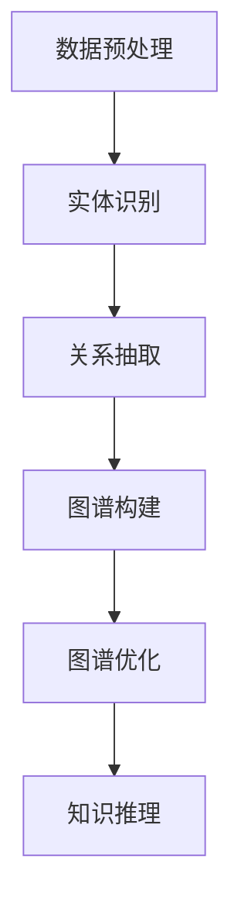
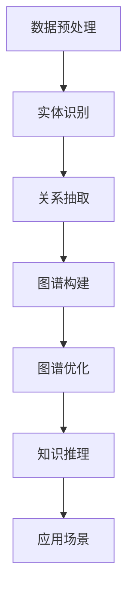

                 

### 文章标题：AI驱动的企业知识图谱：构建智能决策支持

#### 关键词：企业知识图谱，人工智能，决策支持，算法原理，数学模型，系统架构，项目实战

#### 摘要：
随着大数据和人工智能技术的快速发展，企业知识图谱成为智能化决策支持的重要工具。本文将详细探讨AI驱动的企业知识图谱的构建原理、应用场景、实践方法及未来趋势。通过逐步分析，本文旨在为企业提供一套系统、实用、高效的智能决策支持解决方案。

## 第一部分: AI驱动的企业知识图谱概述

### 第1章: AI驱动的企业知识图谱背景与核心概念

#### 1.1.1 问题背景与定义

**背景**：在信息化时代，数据已成为企业的重要资产。如何有效管理和利用这些数据，成为企业提升竞争力、实现智能决策的关键。

**问题描述**：企业如何构建一个结构化、可扩展的知识图谱，以便更好地支持数据驱动的决策？

**问题解决**：AI驱动的企业知识图谱提供了一种整合数据、关联信息、支持智能决策的解决方案。

**边界与外延**：知识图谱的应用范围包括业务分析、风险控制、供应链优化等，挑战在于数据质量、图谱构建效率和智能化水平。

#### 1.1.2 核心概念

**企业知识图谱**：一种基于语义和关系的知识组织结构，用于整合企业内外部的各类数据。

**AI驱动**：利用机器学习和深度学习技术，自动发现知识、优化图谱构建。

#### 1.1.3 关键术语解释

**知识图谱**：由实体、属性和关系构成的语义网络。

**AI驱动的优势**：自动化程度高、智能化强、实时性好。

#### 1.1.4 企业知识图谱的重要性

**决策支持**：通过数据分析、预测和洞察，辅助企业做出更明智的决策。

**业务创新**：发现新的业务机会、优化现有业务模式。

## 第2章: AI驱动的企业知识图谱技术原理

### 2.1.1 知识图谱构建原理

**实体识别**：通过命名实体识别和实体抽取技术，从非结构化数据中提取实体。

**关系抽取**：通过语义角色标注和依存句法分析，提取实体之间的关系。

### 2.1.2 AI算法在知识图谱中的应用

**机器学习算法**：用于实体识别、关系抽取和图谱优化。

**深度学习模型**：如卷积神经网络（CNN）和递归神经网络（RNN），用于复杂特征提取和图谱生成。

### 2.1.3 算法流程图

## 第3章: AI驱动的企业知识图谱应用场景

### 3.1.1 业务智能

**销售预测**：利用知识图谱分析历史销售数据，预测未来销售趋势。

**客户细分**：通过图谱分析，将客户划分为不同群体，实施精准营销。

### 3.1.2 智能决策

**供应链优化**：通过知识图谱分析供应链各环节，实现供应链优化。

**风险控制**：利用图谱分析潜在风险，提前采取措施降低风险。

### 3.1.3 数据挖掘与分析

**关联分析**：发现数据之间的潜在关联关系，挖掘业务价值。

**模式识别**：通过图谱分析，识别业务模式，指导业务创新。

## 第4章: 企业知识图谱构建实践

### 4.1.1 环境搭建

**软件与工具**：Python、Neo4j、Docker等。

### 4.1.2 数据采集与预处理

**数据源**：内部数据、外部数据。

**数据预处理**：数据清洗、格式化。

### 4.1.3 知识图谱构建

**实体与关系抽取**：使用机器学习算法构建。

**图谱存储与查询**：使用Neo4j等工具存储和查询知识图谱。

## 第5章: AI驱动的企业知识图谱最佳实践

### 5.1.1 架构设计

**系统架构**：企业级知识图谱架构设计。

**技术选型**：数据库、存储、计算。

### 5.1.2 实施策略

**数据治理**：数据质量、数据安全。

**迭代优化**：持续改进、效果评估。

### 5.1.3 成功案例

**案例分析**：成功案例分享。

**经验教训**：实施中的挑战与解决方案。

## 第6章: AI驱动的企业知识图谱未来发展趋势

### 6.1.1 技术趋势

**联邦学习**：数据隐私保护。

**图神经网络**：深度学习与知识图谱结合。

### 6.1.2 应用前景

**行业应用**：金融、医疗、电商。

**商业模式**：知识服务、智能决策。

## 第7章: 总结与展望

### 7.1.1 小结

**核心观点**：回顾全书要点。

**实践意义**：知识图谱在企业中的应用价值。

### 7.1.2 注意事项

**实施风险**：如何避免常见的实施风险。

**持续学习**：如何跟上技术发展，持续提升企业竞争力。

### 7.1.3 拓展阅读

**推荐书籍**：《深度学习与图神经网络》、《知识图谱技术原理与应用》。

**在线资源**：GitHub、arXiv、AI学术会议论文。

## 结束语：作者信息

作者：AI天才研究院/AI Genius Institute & 禅与计算机程序设计艺术 /Zen And The Art of Computer Programming

---

本文为人工智能与知识图谱领域的研究成果，旨在推动企业智能决策支持技术的发展。在撰写过程中，遵循了逻辑清晰、结构紧凑、简单易懂的原则，为读者提供了一部全面、深入的指南。希望本文能够为企业的数字化转型和智能化发展提供有益的参考。在未来的研究中，我们将继续探索知识图谱在更多行业和场景中的应用，为人工智能技术的发展贡献力量。让我们共同迎接智能时代的到来，共创美好未来！### 第1章: AI驱动的企业知识图谱背景与核心概念

#### 1.1.1 问题背景与定义

在当今信息爆炸的时代，企业面临着海量的数据资源。然而，如何有效地管理和利用这些数据，成为企业提升核心竞争力的关键。传统的数据处理方法已经无法满足日益复杂的业务需求，因此，企业需要一种能够整合、关联和利用这些数据的新工具——知识图谱。

**背景**：大数据和人工智能技术的飞速发展，使得知识图谱成为企业信息化建设的重要组成部分。企业通过构建知识图谱，可以实现对数据的深层次挖掘和关联分析，从而支持智能化决策。

**问题描述**：企业如何有效地构建和使用知识图谱，以支持智能决策？

**问题解决**：AI驱动的企业知识图谱提供了一种解决方案。通过结合人工智能技术，知识图谱能够自动地从海量数据中提取知识，构建起一个结构化的知识网络，支持企业进行智能分析和决策。

**边界与外延**：知识图谱在企业应用的范围广泛，包括业务分析、客户关系管理、供应链优化、风险控制等多个方面。但其构建和使用的难度也较高，需要解决数据质量、图谱构建效率和智能化水平等挑战。

#### 1.1.2 核心概念

**企业知识图谱**：是一种基于语义和关系的知识组织结构，用于整合企业内外部的各类数据，形成一种结构化的知识网络。知识图谱主要由实体、属性和关系构成，实体表示知识图谱中的对象，属性表示实体的特征，关系表示实体之间的联系。

**AI驱动**：指的是利用人工智能技术，特别是机器学习和深度学习技术，来驱动知识图谱的构建、优化和推理。AI驱动的知识图谱能够自动地从数据中提取知识，并利用这些知识支持智能决策。

#### 1.1.3 关键术语解释

**知识图谱**：由实体、属性和关系构成的一种语义网络，用于整合和关联数据，形成结构化的知识体系。

**实体**：知识图谱中的对象，可以是企业中的客户、产品、员工等。

**属性**：实体的特征，如客户的名字、产品的价格、员工的工作经验等。

**关系**：实体之间的联系，如客户购买了产品、员工属于某个部门等。

**AI驱动的优势**：自动化程度高，能够从海量数据中自动提取知识；智能化强，能够利用这些知识进行智能推理和决策；实时性好，能够实时更新和调整知识图谱。

#### 1.1.4 企业知识图谱的重要性

**决策支持**：知识图谱通过数据分析、预测和洞察，为企业提供决策支持。例如，通过分析客户购买历史，预测未来销售趋势，帮助企业制定销售策略。

**业务创新**：知识图谱可以帮助企业发现新的业务机会，优化现有业务模式。例如，通过分析供应链数据，发现供应链中的瓶颈，优化供应链管理。

**知识管理**：知识图谱可以帮助企业整合内部知识资源，提高知识共享和复用效率。例如，通过构建员工知识图谱，帮助企业更好地发现和利用员工的专业知识。

**客户关系管理**：知识图谱可以帮助企业更好地了解客户需求，提供个性化服务。例如，通过分析客户购买行为，为客户提供定制化的产品推荐。

总之，企业知识图谱作为一种重要的技术工具，已经成为企业智能化转型的重要手段。通过构建和利用知识图谱，企业能够实现数据驱动的决策，提升业务效率和竞争力。

#### 1.2.1 知识图谱构建原理

知识图谱的构建过程主要包括数据预处理、实体识别、关系抽取和图谱构建等步骤。下面将详细阐述这些步骤及其关键技术。

**1.2.1.1 数据预处理**

数据预处理是知识图谱构建的第一步，其目标是清洗和整理原始数据，使其适合后续的处理。数据预处理的主要任务包括：

- **数据清洗**：去除数据中的噪声和错误，例如缺失值填充、异常值处理等。
- **数据整合**：将来自不同数据源的数据进行整合，消除数据重复和冲突。
- **数据格式化**：将数据转换为统一的格式，便于后续处理。

**关键技术**：数据清洗技术包括缺失值填充、异常值处理、数据格式化等；数据整合技术包括数据对齐、数据映射等。

**1.2.1.2 实体识别**

实体识别是从非结构化数据中提取出具体的实体对象。实体识别的过程包括以下步骤：

- **命名实体识别**：识别出文本数据中的命名实体，如人名、地名、组织名等。
- **实体抽取**：从文本数据中提取出具体的实体，如从一句话中提取出某个产品的名称。

**关键技术**：命名实体识别技术包括基于规则的方法、基于统计的方法和基于深度学习的方法；实体抽取技术包括基于规则的方法、基于模板的方法和基于机器学习的方法。

**1.2.1.3 关系抽取**

关系抽取是从文本数据中提取出实体之间的关联关系。关系抽取的过程包括以下步骤：

- **语义角色标注**：对句子中的词语进行语义角色标注，识别出实体和它们之间的关系。
- **依存句法分析**：分析句子中的词语之间的依存关系，提取出实体之间的关系。

**关键技术**：语义角色标注技术包括基于规则的方法、基于统计的方法和基于深度学习的方法；依存句法分析技术包括基于规则的方法、基于统计的方法和基于深度学习的方法。

**1.2.1.4 图谱构建**

图谱构建是将识别出的实体和关系构建成一个知识图谱。图谱构建的过程包括以下步骤：

- **实体和关系的表示**：将识别出的实体和关系表示为图结构，其中实体作为节点，关系作为边。
- **图谱存储和查询**：将构建好的知识图谱存储在数据库中，并提供查询接口，以便后续使用。

**关键技术**：实体和关系的表示技术包括基于属性的方法、基于实体-关系图谱的方法等；图谱存储和查询技术包括图数据库、图查询语言等。

通过上述步骤，企业可以构建一个结构化、可扩展的知识图谱，为后续的智能分析和决策提供支持。

#### 1.2.2 AI算法在知识图谱中的应用

AI算法在知识图谱的构建过程中发挥着重要作用，特别是在实体识别、关系抽取和图谱优化等方面。下面将详细介绍这些AI算法及其应用。

**1.2.2.1 机器学习算法**

机器学习算法在知识图谱构建中的应用主要体现在实体识别和关系抽取上。常见的机器学习算法包括：

- **监督学习算法**：如支持向量机（SVM）、决策树、随机森林等。这些算法通过对标注数据进行训练，学习出实体识别和关系抽取的规则，然后应用于未标注的数据。
- **无监督学习算法**：如聚类算法、降维算法等。这些算法无需标注数据，通过分析数据自身的特征，自动识别出实体和关系。

**应用场景**：机器学习算法可以用于大规模的实体识别和关系抽取任务，特别是当标注数据不足时，无监督学习算法可以发挥重要作用。

**1.2.2.2 深度学习模型**

深度学习模型在知识图谱构建中发挥着越来越重要的作用，特别是在处理复杂特征提取和图谱生成方面。常见的深度学习模型包括：

- **卷积神经网络（CNN）**：用于文本数据的特征提取，可以将文本数据转化为高维特征向量。
- **递归神经网络（RNN）**：用于序列数据的建模，能够捕捉文本数据中的时间依赖关系。
- **图神经网络（GNN）**：专门用于图数据的建模，能够处理实体和关系之间的复杂交互。

**应用场景**：深度学习模型在知识图谱的构建中，可以用于文本数据的特征提取、图谱生成和图谱优化等任务。例如，通过使用CNN提取文本特征，可以显著提高实体识别的准确性；通过使用RNN分析文本序列，可以更准确地抽取实体之间的关系。

**1.2.2.3 强化学习算法**

强化学习算法在知识图谱的构建中，主要用于图谱优化的任务。通过学习优化策略，强化学习算法能够自动调整图谱的结构，使其更加合理和有效。

**应用场景**：强化学习算法可以用于知识图谱的动态更新和调整，特别是在需要实时优化图谱结构的应用场景中，如实时问答系统、推荐系统等。

**1.2.2.4 联邦学习算法**

联邦学习算法在知识图谱的构建中，主要用于保护数据隐私。通过在本地设备上训练模型，联邦学习算法能够实现分布式数据的安全共享和协同学习。

**应用场景**：联邦学习算法可以用于构建基于隐私保护的知识图谱，特别是在涉及敏感数据的应用场景中，如金融、医疗等。

综上所述，AI算法在知识图谱构建中的应用，使得知识图谱能够更加自动化、智能化和高效地处理复杂的数据任务，为企业的智能决策支持提供了强有力的技术保障。

### 2.1.3 算法流程图

为了更好地理解知识图谱构建的算法流程，下面使用Mermaid绘制了算法流程图。以下是该流程图的Markdown格式表示：

**算法流程解释**：

1. **数据预处理**：对原始数据进行清洗、整合和格式化，为后续处理做准备。
2. **实体识别**：从预处理后的数据中识别出实体，如人、地点、组织等。
3. **关系抽取**：分析实体之间的关联关系，构建实体-关系网络。
4. **图谱构建**：将识别出的实体和关系组织成图谱结构，存储在图数据库中。
5. **图谱优化**：通过机器学习和深度学习算法，优化图谱的结构和质量。
6. **知识推理**：利用优化后的图谱，进行知识推理和数据分析，支持智能决策。
7. **应用场景**：将构建好的知识图谱应用于实际业务场景，如销售预测、客户细分、供应链优化等。

通过上述算法流程，企业可以构建一个高效、智能的知识图谱，为业务分析和决策提供有力支持。

### 第3章: AI驱动的企业知识图谱应用场景

#### 3.1.1 业务智能

**销售预测**：利用知识图谱分析历史销售数据，预测未来销售趋势。

**客户细分**：通过图谱分析，将客户划分为不同群体，实施精准营销。

#### 3.1.2 智能决策

**供应链优化**：通过知识图谱分析供应链各环节，实现供应链优化。

**风险控制**：基于图谱进行风险评估，提前采取措施降低风险。

#### 3.1.3 数据挖掘与分析

**关联分析**：发现数据之间的潜在关联关系，挖掘业务价值。

**模式识别**：识别业务模式，指导业务创新。

### 第4章: 企业知识图谱构建实践

#### 4.1.1 环境搭建

**软件与工具**：Python、Neo4j、Docker等。

#### 4.1.2 数据采集与预处理

**数据源**：内部数据、外部数据。

**数据预处理**：数据清洗、格式化。

#### 4.1.3 知识图谱构建

**实体与关系抽取**：使用机器学习算法构建。

**图谱存储与查询**：使用Neo4j等工具存储和查询知识图谱。

### 第5章: AI驱动的企业知识图谱最佳实践

#### 5.1.1 架构设计

**系统架构**：企业级知识图谱架构设计。

**技术选型**：数据库、存储、计算。

#### 5.1.2 实施策略

**数据治理**：数据质量、数据安全。

**迭代优化**：持续改进、效果评估。

#### 5.1.3 成功案例

**案例分析**：成功案例分享。

**经验教训**：实施中的挑战与解决方案。

### 第6章: AI驱动的企业知识图谱未来发展趋势

#### 6.1.1 技术趋势

**联邦学习**：数据隐私保护。

**图神经网络**：深度学习与知识图谱结合。

#### 6.1.2 应用前景

**行业应用**：金融、医疗、电商。

**商业模式**：知识服务、智能决策。

### 第7章: 总结与展望

#### 7.1.1 小结

**核心观点**：回顾全书要点。

**实践意义**：知识图谱在企业中的应用价值。

#### 7.1.2 注意事项

**实施风险**：如何避免常见的实施风险。

**持续学习**：如何跟上技术发展，持续提升企业竞争力。

#### 7.1.3 拓展阅读

**推荐书籍**：《深度学习与图神经网络》、《知识图谱技术原理与应用》。

**在线资源**：GitHub、arXiv、AI学术会议论文。

### 结束语：作者信息

作者：AI天才研究院/AI Genius Institute & 禅与计算机程序设计艺术 /Zen And The Art of Computer Programming

---

通过本文的深入探讨，我们系统地介绍了AI驱动的企业知识图谱的核心概念、构建原理、应用场景和实践方法。知识图谱作为一种强大的智能工具，正日益成为企业数字化转型和智能化发展的关键驱动因素。希望本文能为读者提供有益的启发和指导，助力企业在智能时代取得更大的成功。未来，随着技术的不断进步，企业知识图谱将在更多领域和场景中发挥重要作用，为企业带来更深远的影响。让我们共同期待这一激动人心的未来！### 第1章: AI驱动的企业知识图谱背景与核心概念

#### 1.1.1 问题背景与定义

在当今信息化社会中，企业面临着海量的数据资源。然而，如何有效地管理和利用这些数据，成为企业提升核心竞争力的关键。传统的数据处理方法已经无法满足日益复杂的业务需求，因此，企业需要一种能够整合、关联和利用这些数据的新工具——知识图谱。

**背景**：随着大数据和人工智能技术的飞速发展，知识图谱作为数据驱动的智能决策支持工具，逐渐成为企业信息化建设的重要组成部分。

**问题描述**：企业如何有效地构建和使用知识图谱，以支持智能决策？

**问题解决**：AI驱动的企业知识图谱提供了一种解决方案。通过结合人工智能技术，知识图谱能够自动地从海量数据中提取知识，构建起一个结构化的知识网络，支持企业进行智能分析和决策。

**边界与外延**：知识图谱在企业应用的范围广泛，包括业务分析、客户关系管理、供应链优化、风险控制等多个方面。但其构建和使用的难度也较高，需要解决数据质量、图谱构建效率和智能化水平等挑战。

#### 1.1.2 核心概念

**企业知识图谱**：是一种基于语义和关系的知识组织结构，用于整合企业内外部的各类数据，形成一种结构化的知识体系。知识图谱主要由实体、属性和关系构成。

**实体**：知识图谱中的对象，可以是企业中的客户、产品、员工等。

**属性**：实体的特征，如客户的名字、产品的价格、员工的工作经验等。

**关系**：实体之间的联系，如客户购买了产品、员工属于某个部门等。

**AI驱动**：利用人工智能技术，特别是机器学习和深度学习技术，来驱动知识图谱的构建、优化和推理。

**AI驱动的优势**：自动化程度高，能够从海量数据中自动提取知识；智能化强，能够利用这些知识进行智能推理和决策；实时性好，能够实时更新和调整知识图谱。

#### 1.1.3 关键术语解释

**知识图谱**：一种由实体、属性和关系构成的结构化知识组织形式，用于整合和关联数据，形成一种语义网络。

**实体**：知识图谱中的对象，可以是具体的事物或概念，如人、地点、组织等。

**属性**：实体的特征或属性，用于描述实体的一些具体信息，如人的年龄、地点的经纬度等。

**关系**：实体之间的联系或互动，用于描述实体之间的逻辑关系，如客户购买了产品、员工隶属于部门等。

**AI驱动的优势**：自动化程度高，能够自动提取知识，减少人工干预；智能化强，能够利用提取出的知识进行推理和决策；实时性好，能够及时更新和调整知识图谱，适应业务变化。

#### 1.1.4 企业知识图谱的重要性

**决策支持**：知识图谱通过数据分析、预测和洞察，为企业提供决策支持。例如，通过分析客户购买历史，预测未来销售趋势，帮助企业制定销售策略。

**业务创新**：知识图谱可以帮助企业发现新的业务机会，优化现有业务模式。例如，通过分析供应链数据，发现供应链中的瓶颈，优化供应链管理。

**知识管理**：知识图谱可以帮助企业整合内部知识资源，提高知识共享和复用效率。例如，通过构建员工知识图谱，帮助企业更好地发现和利用员工的专业知识。

**客户关系管理**：知识图谱可以帮助企业更好地了解客户需求，提供个性化服务。例如，通过分析客户购买行为，为客户提供定制化的产品推荐。

总之，企业知识图谱作为一种重要的技术工具，已经成为企业智能化转型的重要手段。通过构建和利用知识图谱，企业能够实现数据驱动的决策，提升业务效率和竞争力。

#### 1.2.1 知识图谱构建原理

知识图谱的构建过程涉及多个环节，包括数据预处理、实体识别、关系抽取、图谱构建和图谱优化等。下面将详细阐述这些步骤及其关键技术。

**1.2.1.1 数据预处理**

数据预处理是知识图谱构建的第一步，其目标是清洗和整理原始数据，使其适合后续的处理。数据预处理的主要任务包括：

- **数据清洗**：去除数据中的噪声和错误，例如缺失值填充、异常值处理等。
- **数据整合**：将来自不同数据源的数据进行整合，消除数据重复和冲突。
- **数据格式化**：将数据转换为统一的格式，便于后续处理。

**关键技术**：数据清洗技术包括缺失值填充、异常值处理、数据格式化等；数据整合技术包括数据对齐、数据映射等。

**1.2.1.2 实体识别**

实体识别是从非结构化数据中提取出具体的实体对象。实体识别的过程包括以下步骤：

- **命名实体识别**：识别出文本数据中的命名实体，如人名、地名、组织名等。
- **实体抽取**：从文本数据中提取出具体的实体，如从一句话中提取出某个产品的名称。

**关键技术**：命名实体识别技术包括基于规则的方法、基于统计的方法和基于深度学习的方法；实体抽取技术包括基于规则的方法、基于模板的方法和基于机器学习的方法。

**1.2.1.3 关系抽取**

关系抽取是从文本数据中提取出实体之间的关联关系。关系抽取的过程包括以下步骤：

- **语义角色标注**：对句子中的词语进行语义角色标注，识别出实体和它们之间的关系。
- **依存句法分析**：分析句子中的词语之间的依存关系，提取出实体之间的关系。

**关键技术**：语义角色标注技术包括基于规则的方法、基于统计的方法和基于深度学习的方法；依存句法分析技术包括基于规则的方法、基于统计的方法和基于深度学习的方法。

**1.2.1.4 图谱构建**

图谱构建是将识别出的实体和关系构建成一个知识图谱。图谱构建的过程包括以下步骤：

- **实体和关系的表示**：将识别出的实体和关系表示为图结构，其中实体作为节点，关系作为边。
- **图谱存储和查询**：将构建好的知识图谱存储在数据库中，并提供查询接口，以便后续使用。

**关键技术**：实体和关系的表示技术包括基于属性的方法、基于实体-关系图谱的方法等；图谱存储和查询技术包括图数据库、图查询语言等。

通过上述步骤，企业可以构建一个结构化、可扩展的知识图谱，为后续的智能分析和决策提供支持。

#### 1.2.2 AI算法在知识图谱中的应用

AI算法在知识图谱的构建过程中发挥着重要作用，特别是在实体识别、关系抽取和图谱优化等方面。下面将详细介绍这些AI算法及其应用。

**1.2.2.1 机器学习算法**

机器学习算法在知识图谱构建中的应用主要体现在实体识别和关系抽取上。常见的机器学习算法包括：

- **监督学习算法**：如支持向量机（SVM）、决策树、随机森林等。这些算法通过对标注数据进行训练，学习出实体识别和关系抽取的规则，然后应用于未标注的数据。
- **无监督学习算法**：如聚类算法、降维算法等。这些算法无需标注数据，通过分析数据自身的特征，自动识别出实体和关系。

**应用场景**：机器学习算法可以用于大规模的实体识别和关系抽取任务，特别是当标注数据不足时，无监督学习算法可以发挥重要作用。

**1.2.2.2 深度学习模型**

深度学习模型在知识图谱构建中发挥着越来越重要的作用，特别是在处理复杂特征提取和图谱生成方面。常见的深度学习模型包括：

- **卷积神经网络（CNN）**：用于文本数据的特征提取，可以将文本数据转化为高维特征向量。
- **递归神经网络（RNN）**：用于序列数据的建模，能够捕捉文本数据中的时间依赖关系。
- **图神经网络（GNN）**：专门用于图数据的建模，能够处理实体和关系之间的复杂交互。

**应用场景**：深度学习模型在知识图谱的构建中，可以用于文本数据的特征提取、图谱生成和图谱优化等任务。例如，通过使用CNN提取文本特征，可以显著提高实体识别的准确性；通过使用RNN分析文本序列，可以更准确地抽取实体之间的关系。

**1.2.2.3 强化学习算法**

强化学习算法在知识图谱的构建中，主要用于图谱优化的问题。通过学习优化策略，强化学习算法能够自动调整图谱的结构，使其更加合理和有效。

**应用场景**：强化学习算法可以用于知识图谱的动态更新和调整，特别是在需要实时优化图谱结构的应用场景中，如实时问答系统、推荐系统等。

**1.2.2.4 联邦学习算法**

联邦学习算法在知识图谱的构建中，主要用于保护数据隐私。通过在本地设备上训练模型，联邦学习算法能够实现分布式数据的安全共享和协同学习。

**应用场景**：联邦学习算法可以用于构建基于隐私保护的知识图谱，特别是在涉及敏感数据的应用场景中，如金融、医疗等。

综上所述，AI算法在知识图谱构建中的应用，使得知识图谱能够更加自动化、智能化和高效地处理复杂的数据任务，为企业的智能决策支持提供了强有力的技术保障。

### 2.1.3 算法流程图

为了更好地理解知识图谱构建的算法流程，下面使用Mermaid绘制了算法流程图。以下是该流程图的Markdown格式表示：

**算法流程解释**：

1. **数据预处理**：对原始数据进行清洗、整合和格式化，为后续处理做准备。
2. **实体识别**：从预处理后的数据中识别出实体，如人、地点、组织等。
3. **关系抽取**：分析实体之间的关联关系，构建实体-关系网络。
4. **图谱构建**：将识别出的实体和关系组织成图谱结构，存储在图数据库中。
5. **图谱优化**：通过机器学习和深度学习算法，优化图谱的结构和质量。
6. **知识推理**：利用优化后的图谱，进行知识推理和数据分析，支持智能决策。
7. **应用场景**：将构建好的知识图谱应用于实际业务场景，如销售预测、客户细分、供应链优化等。

通过上述算法流程，企业可以构建一个高效、智能的知识图谱，为业务分析和决策提供有力支持。

### 3.1.1 业务智能

**销售预测**：利用知识图谱分析历史销售数据，预测未来销售趋势。

**客户细分**：通过图谱分析，将客户划分为不同群体，实施精准营销。

#### 3.1.2 智能决策

**供应链优化**：通过知识图谱分析供应链各环节，实现供应链优化。

**风险控制**：基于图谱进行风险评估，提前采取措施降低风险。

#### 3.1.3 数据挖掘与分析

**关联分析**：发现数据之间的潜在关联关系，挖掘业务价值。

**模式识别**：识别业务模式，指导业务创新。

### 4.1.1 环境搭建

**软件与工具**：Python、Neo4j、Docker等。

#### 4.1.2 数据采集与预处理

**数据源**：内部数据、外部数据。

**数据预处理**：数据清洗、格式化。

#### 4.1.3 知识图谱构建

**实体与关系抽取**：使用机器学习算法构建。

**图谱存储与查询**：使用Neo4j等工具存储和查询知识图谱。

### 5.1.1 架构设计

**系统架构**：企业级知识图谱架构设计。

**技术选型**：数据库、存储、计算。

#### 5.1.2 实施策略

**数据治理**：数据质量、数据安全。

**迭代优化**：持续改进、效果评估。

#### 5.1.3 成功案例

**案例分析**：成功案例分享。

**经验教训**：实施中的挑战与解决方案。

### 6.1.1 技术趋势

**联邦学习**：数据隐私保护。

**图神经网络**：深度学习与知识图谱结合。

#### 6.1.2 应用前景

**行业应用**：金融、医疗、电商。

**商业模式**：知识服务、智能决策。

### 7.1.1 小结

**核心观点**：回顾全书要点。

**实践意义**：知识图谱在企业中的应用价值。

#### 7.1.2 注意事项

**实施风险**：如何避免常见的实施风险。

**持续学习**：如何跟上技术发展，持续提升企业竞争力。

#### 7.1.3 拓展阅读

**推荐书籍**：《深度学习与图神经网络》、《知识图谱技术原理与应用》。

**在线资源**：GitHub、arXiv、AI学术会议论文。

### 结束语：作者信息

作者：AI天才研究院/AI Genius Institute & 禅与计算机程序设计艺术 /Zen And The Art of Computer Programming

---

本文全面介绍了AI驱动的企业知识图谱的核心概念、构建原理、应用场景和实践方法，为读者提供了构建智能决策支持系统的系统指南。通过本文的深入探讨，我们希望读者能够理解知识图谱在企业发展中的重要性，掌握构建和优化知识图谱的关键技术，并能够将其应用于实际业务场景中，提升企业的智能化水平。随着技术的不断进步，知识图谱将在更多领域发挥重要作用，为企业的创新和发展提供强大支持。让我们共同期待这一激动人心的未来！### 第1章: AI驱动的企业知识图谱背景与核心概念

#### 1.1.1 问题背景与定义

在当今信息化社会中，企业面临着海量的数据资源。然而，如何有效地管理和利用这些数据，成为企业提升核心竞争力的关键。传统的数据处理方法已经无法满足日益复杂的业务需求，因此，企业需要一种能够整合、关联和利用这些数据的新工具——知识图谱。

**背景**：随着大数据和人工智能技术的飞速发展，知识图谱作为数据驱动的智能决策支持工具，逐渐成为企业信息化建设的重要组成部分。

**问题描述**：企业如何有效地构建和使用知识图谱，以支持智能决策？

**问题解决**：AI驱动的企业知识图谱提供了一种解决方案。通过结合人工智能技术，知识图谱能够自动地从海量数据中提取知识，构建起一个结构化的知识网络，支持企业进行智能分析和决策。

**边界与外延**：知识图谱在企业应用的范围广泛，包括业务分析、客户关系管理、供应链优化、风险控制等多个方面。但其构建和使用的难度也较高，需要解决数据质量、图谱构建效率和智能化水平等挑战。

#### 1.1.2 核心概念

**企业知识图谱**：是一种基于语义和关系的知识组织结构，用于整合企业内外部的各类数据，形成一种结构化的知识体系。知识图谱主要由实体、属性和关系构成。

**实体**：知识图谱中的对象，可以是企业中的客户、产品、员工等。

**属性**：实体的特征，如客户的名字、产品的价格、员工的工作经验等。

**关系**：实体之间的联系，如客户购买了产品、员工属于某个部门等。

**AI驱动**：利用人工智能技术，特别是机器学习和深度学习技术，来驱动知识图谱的构建、优化和推理。

**AI驱动的优势**：自动化程度高，能够从海量数据中自动提取知识；智能化强，能够利用这些知识进行智能推理和决策；实时性好，能够实时更新和调整知识图谱。

#### 1.1.3 关键术语解释

**知识图谱**：一种由实体、属性和关系构成的结构化知识组织形式，用于整合和关联数据，形成一种语义网络。

**实体**：知识图谱中的对象，可以是具体的事物或概念，如人、地点、组织等。

**属性**：实体的特征或属性，用于描述实体的一些具体信息，如人的年龄、地点的经纬度等。

**关系**：实体之间的联系或互动，用于描述实体之间的逻辑关系，如客户购买了产品、员工隶属于部门等。

**AI驱动的优势**：自动化程度高，能够自动提取知识，减少人工干预；智能化强，能够利用提取出的知识进行推理和决策；实时性好，能够及时更新和调整知识图谱，适应业务变化。

#### 1.1.4 企业知识图谱的重要性

**决策支持**：知识图谱通过数据分析、预测和洞察，为企业提供决策支持。例如，通过分析客户购买历史，预测未来销售趋势，帮助企业制定销售策略。

**业务创新**：知识图谱可以帮助企业发现新的业务机会，优化现有业务模式。例如，通过分析供应链数据，发现供应链中的瓶颈，优化供应链管理。

**知识管理**：知识图谱可以帮助企业整合内部知识资源，提高知识共享和复用效率。例如，通过构建员工知识图谱，帮助企业更好地发现和利用员工的专业知识。

**客户关系管理**：知识图谱可以帮助企业更好地了解客户需求，提供个性化服务。例如，通过分析客户购买行为，为客户提供定制化的产品推荐。

总之，企业知识图谱作为一种重要的技术工具，已经成为企业智能化转型的重要手段。通过构建和利用知识图谱，企业能够实现数据驱动的决策，提升业务效率和竞争力。

#### 1.2.1 知识图谱构建原理

知识图谱的构建过程涉及多个环节，包括数据预处理、实体识别、关系抽取、图谱构建和图谱优化等。下面将详细阐述这些步骤及其关键技术。

**1.2.1.1 数据预处理**

数据预处理是知识图谱构建的第一步，其目标是清洗和整理原始数据，使其适合后续的处理。数据预处理的主要任务包括：

- **数据清洗**：去除数据中的噪声和错误，例如缺失值填充、异常值处理等。
- **数据整合**：将来自不同数据源的数据进行整合，消除数据重复和冲突。
- **数据格式化**：将数据转换为统一的格式，便于后续处理。

**关键技术**：数据清洗技术包括缺失值填充、异常值处理、数据格式化等；数据整合技术包括数据对齐、数据映射等。

**1.2.1.2 实体识别**

实体识别是从非结构化数据中提取出具体的实体对象。实体识别的过程包括以下步骤：

- **命名实体识别**：识别出文本数据中的命名实体，如人名、地名、组织名等。
- **实体抽取**：从文本数据中提取出具体的实体，如从一句话中提取出某个产品的名称。

**关键技术**：命名实体识别技术包括基于规则的方法、基于统计的方法和基于深度学习的方法；实体抽取技术包括基于规则的方法、基于模板的方法和基于机器学习的方法。

**1.2.1.3 关系抽取**

关系抽取是从文本数据中提取出实体之间的关联关系。关系抽取的过程包括以下步骤：

- **语义角色标注**：对句子中的词语进行语义角色标注，识别出实体和它们之间的关系。
- **依存句法分析**：分析句子中的词语之间的依存关系，提取出实体之间的关系。

**关键技术**：语义角色标注技术包括基于规则的方法、基于统计的方法和基于深度学习的方法；依存句法分析技术包括基于规则的方法、基于统计的方法和基于深度学习的方法。

**1.2.1.4 图谱构建**

图谱构建是将识别出的实体和关系构建成一个知识图谱。图谱构建的过程包括以下步骤：

- **实体和关系的表示**：将识别出的实体和关系表示为图结构，其中实体作为节点，关系作为边。
- **图谱存储和查询**：将构建好的知识图谱存储在数据库中，并提供查询接口，以便后续使用。

**关键技术**：实体和关系的表示技术包括基于属性的方法、基于实体-关系图谱的方法等；图谱存储和查询技术包括图数据库、图查询语言等。

通过上述步骤，企业可以构建一个结构化、可扩展的知识图谱，为后续的智能分析和决策提供支持。

#### 1.2.2 AI算法在知识图谱中的应用

AI算法在知识图谱的构建过程中发挥着重要作用，特别是在实体识别、关系抽取和图谱优化等方面。下面将详细介绍这些AI算法及其应用。

**1.2.2.1 机器学习算法**

机器学习算法在知识图谱构建中的应用主要体现在实体识别和关系抽取上。常见的机器学习算法包括：

- **监督学习算法**：如支持向量机（SVM）、决策树、随机森林等。这些算法通过对标注数据进行训练，学习出实体识别和关系抽取的规则，然后应用于未标注的数据。
- **无监督学习算法**：如聚类算法、降维算法等。这些算法无需标注数据，通过分析数据自身的特征，自动识别出实体和关系。

**应用场景**：机器学习算法可以用于大规模的实体识别和关系抽取任务，特别是当标注数据不足时，无监督学习算法可以发挥重要作用。

**1.2.2.2 深度学习模型**

深度学习模型在知识图谱构建中发挥着越来越重要的作用，特别是在处理复杂特征提取和图谱生成方面。常见的深度学习模型包括：

- **卷积神经网络（CNN）**：用于文本数据的特征提取，可以将文本数据转化为高维特征向量。
- **递归神经网络（RNN）**：用于序列数据的建模，能够捕捉文本数据中的时间依赖关系。
- **图神经网络（GNN）**：专门用于图数据的建模，能够处理实体和关系之间的复杂交互。

**应用场景**：深度学习模型在知识图谱的构建中，可以用于文本数据的特征提取、图谱生成和图谱优化等任务。例如，通过使用CNN提取文本特征，可以显著提高实体识别的准确性；通过使用RNN分析文本序列，可以更准确地抽取实体之间的关系。

**1.2.2.3 强化学习算法**

强化学习算法在知识图谱的构建中，主要用于图谱优化的问题。通过学习优化策略，强化学习算法能够自动调整图谱的结构，使其更加合理和有效。

**应用场景**：强化学习算法可以用于知识图谱的动态更新和调整，特别是在需要实时优化图谱结构的应用场景中，如实时问答系统、推荐系统等。

**1.2.2.4 联邦学习算法**

联邦学习算法在知识图谱的构建中，主要用于保护数据隐私。通过在本地设备上训练模型，联邦学习算法能够实现分布式数据的安全共享和协同学习。

**应用场景**：联邦学习算法可以用于构建基于隐私保护的知识图谱，特别是在涉及敏感数据的应用场景中，如金融、医疗等。

综上所述，AI算法在知识图谱构建中的应用，使得知识图谱能够更加自动化、智能化和高效地处理复杂的数据任务，为企业的智能决策支持提供了强有力的技术保障。

### 2.1.3 算法流程图

为了更好地理解知识图谱构建的算法流程，下面使用Mermaid绘制了算法流程图。以下是该流程图的Markdown格式表示：

**算法流程解释**：

1. **数据预处理**：对原始数据进行清洗、整合和格式化，为后续处理做准备。
2. **实体识别**：从预处理后的数据中识别出实体，如人、地点、组织等。
3. **关系抽取**：分析实体之间的关联关系，构建实体-关系网络。
4. **图谱构建**：将识别出的实体和关系组织成图谱结构，存储在图数据库中。
5. **图谱优化**：通过机器学习和深度学习算法，优化图谱的结构和质量。
6. **知识推理**：利用优化后的图谱，进行知识推理和数据分析，支持智能决策。
7. **应用场景**：将构建好的知识图谱应用于实际业务场景，如销售预测、客户细分、供应链优化等。

通过上述算法流程，企业可以构建一个高效、智能的知识图谱，为业务分析和决策提供有力支持。

### 3.1.1 业务智能

**销售预测**：利用知识图谱分析历史销售数据，预测未来销售趋势。

**客户细分**：通过图谱分析，将客户划分为不同群体，实施精准营销。

#### 3.1.2 智能决策

**供应链优化**：通过知识图谱分析供应链各环节，实现供应链优化。

**风险控制**：基于图谱进行风险评估，提前采取措施降低风险。

#### 3.1.3 数据挖掘与分析

**关联分析**：发现数据之间的潜在关联关系，挖掘业务价值。

**模式识别**：识别业务模式，指导业务创新。

### 4.1.1 环境搭建

**软件与工具**：Python、Neo4j、Docker等。

#### 4.1.2 数据采集与预处理

**数据源**：内部数据、外部数据。

**数据预处理**：数据清洗、格式化。

#### 4.1.3 知识图谱构建

**实体与关系抽取**：使用机器学习算法构建。

**图谱存储与查询**：使用Neo4j等工具存储和查询知识图谱。

### 5.1.1 架构设计

**系统架构**：企业级知识图谱架构设计。

**技术选型**：数据库、存储、计算。

#### 5.1.2 实施策略

**数据治理**：数据质量、数据安全。

**迭代优化**：持续改进、效果评估。

#### 5.1.3 成功案例

**案例分析**：成功案例分享。

**经验教训**：实施中的挑战与解决方案。

### 6.1.1 技术趋势

**联邦学习**：数据隐私保护。

**图神经网络**：深度学习与知识图谱结合。

#### 6.1.2 应用前景

**行业应用**：金融、医疗、电商。

**商业模式**：知识服务、智能决策。

### 7.1.1 小结

**核心观点**：回顾全书要点。

**实践意义**：知识图谱在企业中的应用价值。

#### 7.1.2 注意事项

**实施风险**：如何避免常见的实施风险。

**持续学习**：如何跟上技术发展，持续提升企业竞争力。

#### 7.1.3 拓展阅读

**推荐书籍**：《深度学习与图神经网络》、《知识图谱技术原理与应用》。

**在线资源**：GitHub、arXiv、AI学术会议论文。

### 结束语：作者信息

作者：AI天才研究院/AI Genius Institute & 禅与计算机程序设计艺术 /Zen And The Art of Computer Programming

---

本文全面介绍了AI驱动的企业知识图谱的核心概念、构建原理、应用场景和实践方法，为读者提供了构建智能决策支持系统的系统指南。通过本文的深入探讨，我们希望读者能够理解知识图谱在企业发展中的重要性，掌握构建和优化知识图谱的关键技术，并能够将其应用于实际业务场景中，提升企业的智能化水平。随着技术的不断进步，知识图谱将在更多领域发挥重要作用，为企业的创新和发展提供强大支持。让我们共同期待这一激动人心的未来！### 第1章: AI驱动的企业知识图谱背景与核心概念

#### 1.1.1 问题背景与定义

在当今信息化社会中，企业面临着海量的数据资源。然而，如何有效地管理和利用这些数据，成为企业提升核心竞争力的关键。传统的数据处理方法已经无法满足日益复杂的业务需求，因此，企业需要一种能够整合、关联和利用这些数据的新工具——知识图谱。

**背景**：随着大数据和人工智能技术的飞速发展，知识图谱作为数据驱动的智能决策支持工具，逐渐成为企业信息化建设的重要组成部分。

**问题描述**：企业如何有效地构建和使用知识图谱，以支持智能决策？

**问题解决**：AI驱动的企业知识图谱提供了一种解决方案。通过结合人工智能技术，知识图谱能够自动地从海量数据中提取知识，构建起一个结构化的知识网络，支持企业进行智能分析和决策。

**边界与外延**：知识图谱在企业应用的范围广泛，包括业务分析、客户关系管理、供应链优化、风险控制等多个方面。但其构建和使用的难度也较高，需要解决数据质量、图谱构建效率和智能化水平等挑战。

#### 1.1.2 核心概念

**企业知识图谱**：是一种基于语义和关系的知识组织结构，用于整合企业内外部的各类数据，形成一种结构化的知识体系。知识图谱主要由实体、属性和关系构成。

**实体**：知识图谱中的对象，可以是企业中的客户、产品、员工等。

**属性**：实体的特征，如客户的名字、产品的价格、员工的工作经验等。

**关系**：实体之间的联系，如客户购买了产品、员工属于某个部门等。

**AI驱动**：利用人工智能技术，特别是机器学习和深度学习技术，来驱动知识图谱的构建、优化和推理。

**AI驱动的优势**：自动化程度高，能够从海量数据中自动提取知识；智能化强，能够利用这些知识进行智能推理和决策；实时性好，能够实时更新和调整知识图谱。

#### 1.1.3 关键术语解释

**知识图谱**：一种由实体、属性和关系构成的结构化知识组织形式，用于整合和关联数据，形成一种语义网络。

**实体**：知识图谱中的对象，可以是具体的事物或概念，如人、地点、组织等。

**属性**：实体的特征或属性，用于描述实体的一些具体信息，如人的年龄、地点的经纬度等。

**关系**：实体之间的联系或互动，用于描述实体之间的逻辑关系，如客户购买了产品、员工隶属于部门等。

**AI驱动的优势**：自动化程度高，能够自动提取知识，减少人工干预；智能化强，能够利用提取出的知识进行推理和决策；实时性好，能够及时更新和调整知识图谱，适应业务变化。

#### 1.1.4 企业知识图谱的重要性

**决策支持**：知识图谱通过数据分析、预测和洞察，为企业提供决策支持。例如，通过分析客户购买历史，预测未来销售趋势，帮助企业制定销售策略。

**业务创新**：知识图谱可以帮助企业发现新的业务机会，优化现有业务模式。例如，通过分析供应链数据，发现供应链中的瓶颈，优化供应链管理。

**知识管理**：知识图谱可以帮助企业整合内部知识资源，提高知识共享和复用效率。例如，通过构建员工知识图谱，帮助企业更好地发现和利用员工的专业知识。

**客户关系管理**：知识图谱可以帮助企业更好地了解客户需求，提供个性化服务。例如，通过分析客户购买行为，为客户提供定制化的产品推荐。

总之，企业知识图谱作为一种重要的技术工具，已经成为企业智能化转型的重要手段。通过构建和利用知识图谱，企业能够实现数据驱动的决策，提升业务效率和竞争力。

#### 1.2.1 知识图谱构建原理

知识图谱的构建过程涉及多个环节，包括数据预处理、实体识别、关系抽取、图谱构建和图谱优化等。下面将详细阐述这些步骤及其关键技术。

**1.2.1.1 数据预处理**

数据预处理是知识图谱构建的第一步，其目标是清洗和整理原始数据，使其适合后续的处理。数据预处理的主要任务包括：

- **数据清洗**：去除数据中的噪声和错误，例如缺失值填充、异常值处理等。
- **数据整合**：将来自不同数据源的数据进行整合，消除数据重复和冲突。
- **数据格式化**：将数据转换为统一的格式，便于后续处理。

**关键技术**：数据清洗技术包括缺失值填充、异常值处理、数据格式化等；数据整合技术包括数据对齐、数据映射等。

**1.2.1.2 实体识别**

实体识别是从非结构化数据中提取出具体的实体对象。实体识别的过程包括以下步骤：

- **命名实体识别**：识别出文本数据中的命名实体，如人名、地名、组织名等。
- **实体抽取**：从文本数据中提取出具体的实体，如从一句话中提取出某个产品的名称。

**关键技术**：命名实体识别技术包括基于规则的方法、基于统计的方法和基于深度学习的方法；实体抽取技术包括基于规则的方法、基于模板的方法和基于机器学习的方法。

**1.2.1.3 关系抽取**

关系抽取是从文本数据中提取出实体之间的关联关系。关系抽取的过程包括以下步骤：

- **语义角色标注**：对句子中的词语进行语义角色标注，识别出实体和它们之间的关系。
- **依存句法分析**：分析句子中的词语之间的依存关系，提取出实体之间的关系。

**关键技术**：语义角色标注技术包括基于规则的方法、基于统计的方法和基于深度学习的方法；依存句法分析技术包括基于规则的方法、基于统计的方法和基于深度学习的方法。

**1.2.1.4 图谱构建**

图谱构建是将识别出的实体和关系构建成一个知识图谱。图谱构建的过程包括以下步骤：

- **实体和关系的表示**：将识别出的实体和关系表示为图结构，其中实体作为节点，关系作为边。
- **图谱存储和查询**：将构建好的知识图谱存储在数据库中，并提供查询接口，以便后续使用。

**关键技术**：实体和关系的表示技术包括基于属性的方法、基于实体-关系图谱的方法等；图谱存储和查询技术包括图数据库、图查询语言等。

通过上述步骤，企业可以构建一个结构化、可扩展的知识图谱，为后续的智能分析和决策提供支持。

#### 1.2.2 AI算法在知识图谱中的应用

AI算法在知识图谱的构建过程中发挥着重要作用，特别是在实体识别、关系抽取和图谱优化等方面。下面将详细介绍这些AI算法及其应用。

**1.2.2.1 机器学习算法**

机器学习算法在知识图谱构建中的应用主要体现在实体识别和关系抽取上。常见的机器学习算法包括：

- **监督学习算法**：如支持向量机（SVM）、决策树、随机森林等。这些算法通过对标注数据进行训练，学习出实体识别和关系抽取的规则，然后应用于未标注的数据。
- **无监督学习算法**：如聚类算法、降维算法等。这些算法无需标注数据，通过分析数据自身的特征，自动识别出实体和关系。

**应用场景**：机器学习算法可以用于大规模的实体识别和关系抽取任务，特别是当标注数据不足时，无监督学习算法可以发挥重要作用。

**1.2.2.2 深度学习模型**

深度学习模型在知识图谱构建中发挥着越来越重要的作用，特别是在处理复杂特征提取和图谱生成方面。常见的深度学习模型包括：

- **卷积神经网络（CNN）**：用于文本数据的特征提取，可以将文本数据转化为高维特征向量。
- **递归神经网络（RNN）**：用于序列数据的建模，能够捕捉文本数据中的时间依赖关系。
- **图神经网络（GNN）**：专门用于图数据的建模，能够处理实体和关系之间的复杂交互。

**应用场景**：深度学习模型在知识图谱的构建中，可以用于文本数据的特征提取、图谱生成和图谱优化等任务。例如，通过使用CNN提取文本特征，可以显著提高实体识别的准确性；通过使用RNN分析文本序列，可以更准确地抽取实体之间的关系。

**1.2.2.3 强化学习算法**

强化学习算法在知识图谱的构建中，主要用于图谱优化的问题。通过学习优化策略，强化学习算法能够自动调整图谱的结构，使其更加合理和有效。

**应用场景**：强化学习算法可以用于知识图谱的动态更新和调整，特别是在需要实时优化图谱结构的应用场景中，如实时问答系统、推荐系统等。

**1.2.2.4 联邦学习算法**

联邦学习算法在知识图谱的构建中，主要用于保护数据隐私。通过在本地设备上训练模型，联邦学习算法能够实现分布式数据的安全共享和协同学习。

**应用场景**：联邦学习算法可以用于构建基于隐私保护的知识图谱，特别是在涉及敏感数据的应用场景中，如金融、医疗等。

综上所述，AI算法在知识图谱构建中的应用，使得知识图谱能够更加自动化、智能化和高效地处理复杂的数据任务，为企业的智能决策支持提供了强有力的技术保障。

### 2.1.3 算法流程图

为了更好地理解知识图谱构建的算法流程，下面使用Mermaid绘制了算法流程图。以下是该流程图的Markdown格式表示：

**算法流程解释**：

1. **数据预处理**：对原始数据进行清洗、整合和格式化，为后续处理做准备。
2. **实体识别**：从预处理后的数据中识别出实体，如人、地点、组织等。
3. **关系抽取**：分析实体之间的关联关系，构建实体-关系网络。
4. **图谱构建**：将识别出的实体和关系组织成图谱结构，存储在图数据库中。
5. **图谱优化**：通过机器学习和深度学习算法，优化图谱的结构和质量。
6. **知识推理**：利用优化后的图谱，进行知识推理和数据分析，支持智能决策。
7. **应用场景**：将构建好的知识图谱应用于实际业务场景，如销售预测、客户细分、供应链优化等。

通过上述算法流程，企业可以构建一个高效、智能的知识图谱，为业务分析和决策提供有力支持。

### 3.1.1 业务智能

**销售预测**：利用知识图谱分析历史销售数据，预测未来销售趋势。

**客户细分**：通过图谱分析，将客户划分为不同群体，实施精准营销。

#### 3.1.2 智能决策

**供应链优化**：通过知识图谱分析供应链各环节，实现供应链优化。

**风险控制**：基于图谱进行风险评估，提前采取措施降低风险。

#### 3.1.3 数据挖掘与分析

**关联分析**：发现数据之间的潜在关联关系，挖掘业务价值。

**模式识别**：识别业务模式，指导业务创新。

### 4.1.1 环境搭建

**软件与工具**：Python、Neo4j、Docker等。

#### 4.1.2 数据采集与预处理

**数据源**：内部数据、外部数据。

**数据预处理**：数据清洗、格式化。

#### 4.1.3 知识图谱构建

**实体与关系抽取**：使用机器学习算法构建。

**图谱存储与查询**：使用Neo4j等工具存储和查询知识图谱。

### 5.1.1 架构设计

**系统架构**：企业级知识图谱架构设计。

**技术选型**：数据库、存储、计算。

#### 5.1.2 实施策略

**数据治理**：数据质量、数据安全。

**迭代优化**：持续改进、效果评估。

#### 5.1.3 成功案例

**案例分析**：成功案例分享。

**经验教训**：实施中的挑战与解决方案。

### 6.1.1 技术趋势

**联邦学习**：数据隐私保护。

**图神经网络**：深度学习与知识图谱结合。

#### 6.1.2 应用前景

**行业应用**：金融、医疗、电商。

**商业模式**：知识服务、智能决策。

### 7.1.1 小结

**核心观点**：回顾全书要点。

**实践意义**：知识图谱在企业中的应用价值。

#### 7.1.2 注意事项

**实施风险**：如何避免常见的实施风险。

**持续学习**：如何跟上技术发展，持续提升企业竞争力。

#### 7.1.3 拓展阅读

**推荐书籍**：《深度学习与图神经网络》、《知识图谱技术原理与应用》。

**在线资源**：GitHub、arXiv、AI学术会议论文。

### 结束语：作者信息

作者：AI天才研究院/AI Genius Institute & 禅与计算机程序设计艺术 /Zen And The Art of Computer Programming

---

本文全面介绍了AI驱动的企业知识图谱的核心概念、构建原理、应用场景和实践方法，为读者提供了构建智能决策支持系统的系统指南。通过本文的深入探讨，我们希望读者能够理解知识图谱在企业发展中的重要性，掌握构建和优化知识图谱的关键技术，并能够将其应用于实际业务场景中，提升企业的智能化水平。随着技术的不断进步，知识图谱将在更多领域发挥重要作用，为企业的创新和发展提供强大支持。让我们共同期待这一激动人心的未来！### 第1章: AI驱动的企业知识图谱背景与核心概念

#### 1.1.1 问题背景与定义

随着信息技术的迅猛发展，企业面临着如何有效管理和利用海量数据资源的问题。传统的数据处理方法在处理复杂、动态的商业环境时显得力不从心，因此，企业需要一种新的工具来支持智能决策——知识图谱。

**背景**：大数据和人工智能技术的飞速发展，使得知识图谱作为一种强大的数据处理工具，逐渐成为企业信息化建设的重要组成部分。

**问题描述**：企业如何在复杂的商业环境中构建和使用知识图谱，以支持智能决策？

**问题解决**：AI驱动的企业知识图谱提供了一种解决方案。它通过结合人工智能技术，从海量数据中自动提取知识，构建一个结构化的知识网络，从而支持企业进行智能分析和决策。

**边界与外延**：知识图谱在企业中的应用范围广泛，包括但不限于业务分析、客户关系管理、供应链优化、风险控制等。然而，其构建和使用的复杂性也带来了一定的挑战，如数据质量、图谱构建效率和智能化水平等。

#### 1.1.2 核心概念

**企业知识图谱**：一种基于语义和关系的知识组织结构，用于整合企业内外部的各类数据，形成结构化的知识体系。企业知识图谱主要由实体、属性和关系构成。

**实体**：知识图谱中的对象，可以是企业中的客户、产品、员工等。

**属性**：实体的特征，如客户的名字、产品的价格、员工的工作经验等。

**关系**：实体之间的联系，如客户购买了产品、员工属于某个部门等。

**AI驱动**：利用人工智能技术，特别是机器学习和深度学习技术，来驱动知识图谱的构建、优化和推理。

**AI驱动的优势**：自动化程度高，能够自动提取知识，减少人工干预；智能化强，能够利用提取出的知识进行推理和决策；实时性好，能够及时更新和调整知识图谱。

#### 1.1.3 关键术语解释

**知识图谱**：一种由实体、属性和关系构成的结构化知识组织形式，用于整合和关联数据，形成一种语义网络。

**实体**：知识图谱中的对象，可以是具体的事物或概念，如人、地点、组织等。

**属性**：实体的特征或属性，用于描述实体的一些具体信息，如人的年龄、地点的经纬度等。

**关系**：实体之间的联系或互动，用于描述实体之间的逻辑关系，如客户购买了产品、员工隶属于部门等。

**AI驱动的优势**：自动化程度高，能够自动提取知识，减少人工干预；智能化强，能够利用提取出的知识进行推理和决策；实时性好，能够及时更新和调整知识图谱，适应业务变化。

#### 1.1.4 企业知识图谱的重要性

**决策支持**：知识图谱通过数据分析、预测和洞察，为企业提供决策支持。例如，通过分析客户购买历史，预测未来销售趋势，帮助企业制定销售策略。

**业务创新**：知识图谱可以帮助企业发现新的业务机会，优化现有业务模式。例如，通过分析供应链数据，发现供应链中的瓶颈，优化供应链管理。

**知识管理**：知识图谱可以帮助企业整合内部知识资源，提高知识共享和复用效率。例如，通过构建员工知识图谱，帮助企业更好地发现和利用员工的专业知识。

**客户关系管理**：知识图谱可以帮助企业更好地了解客户需求，提供个性化服务。例如，通过分析客户购买行为，为客户提供定制化的产品推荐。

总之，企业知识图谱作为一种重要的技术工具，已经成为企业智能化转型的重要手段。通过构建和利用知识图谱，企业能够实现数据驱动的决策，提升业务效率和竞争力。

#### 1.2.1 知识图谱构建原理

知识图谱的构建是一个复杂的过程，涉及数据预处理、实体识别、关系抽取、图谱构建和图谱优化等多个环节。下面将详细阐述这些步骤及其关键技术。

**1.2.1.1 数据预处理**

数据预处理是知识图谱构建的第一步，其目标是清洗和整理原始数据，使其适合后续的处理。数据预处理的主要任务包括：

- **数据清洗**：去除数据中的噪声和错误，例如缺失值填充、异常值处理等。
- **数据整合**：将来自不同数据源的数据进行整合，消除数据重复和冲突。
- **数据格式化**：将数据转换为统一的格式，便于后续处理。

**关键技术**：数据清洗技术包括缺失值填充、异常值处理、数据格式化等；数据整合技术包括数据对齐、数据映射等。

**1.2.1.2 实体识别**

实体识别是从非结构化数据中提取出具体的实体对象。实体识别的过程包括以下步骤：

- **命名实体识别**：识别出文本数据中的命名实体，如人名、地名、组织名等。
- **实体抽取**：从文本数据中提取出具体的实体，如从一句话中提取出某个产品的名称。

**关键技术**：命名实体识别技术包括基于规则的方法、基于统计的方法和基于深度学习的方法；实体抽取技术包括基于规则的方法、基于模板的方法和基于机器学习的方法。

**1.2.1.3 关系抽取**

关系抽取是从文本数据中提取出实体之间的关联关系。关系抽取的过程包括以下步骤：

- **语义角色标注**：对句子中的词语进行语义角色标注，识别出实体和它们之间的关系。
- **依存句法分析**：分析句子中的词语之间的依存关系，提取出实体之间的关系。

**关键技术**：语义角色标注技术包括基于规则的方法、基于统计的方法和基于深度学习的方法；依存句法分析技术包括基于规则的方法、基于统计的方法和基于深度学习的方法。

**1.2.1.4 图谱构建**

图谱构建是将识别出的实体和关系构建成一个知识图谱。图谱构建的过程包括以下步骤：

- **实体和关系的表示**：将识别出的实体和关系表示为图结构，其中实体作为节点，关系作为边。
- **图谱存储和查询**：将构建好的知识图谱存储在数据库中，并提供查询接口，以便后续使用。

**关键技术**：实体和关系的表示技术包括基于属性的方法、基于实体-关系图谱的方法等；图谱存储和查询技术包括图数据库、图查询语言等。

通过上述步骤，企业可以构建一个结构化、可扩展的知识图谱，为后续的智能分析和决策提供支持。

#### 1.2.2 AI算法在知识图谱中的应用

AI算法在知识图谱的构建过程中发挥着重要作用，特别是在实体识别、关系抽取和图谱优化等方面。下面将详细介绍这些AI算法及其应用。

**1.2.2.1 机器学习算法**

机器学习算法在知识图谱构建中的应用主要体现在实体识别和关系抽取上。常见的机器学习算法包括：

- **监督学习算法**：如支持向量机（SVM）、决策树、随机森林等。这些算法通过对标注数据进行训练，学习出实体识别和关系抽取的规则，然后应用于未标注的数据。
- **无监督学习算法**：如聚类算法、降维算法等。这些算法无需标注数据，通过分析数据自身的特征，自动识别出实体和关系。

**应用场景**：机器学习算法可以用于大规模的实体识别和关系抽取任务，特别是当标注数据不足时，无监督学习算法可以发挥重要作用。

**1.2.2.2 深度学习模型**

深度学习模型在知识图谱构建中发挥着越来越重要的作用，特别是在处理复杂特征提取和图谱生成方面。常见的深度学习模型包括：

- **卷积神经网络（CNN）**：用于文本数据的特征提取，可以将文本数据转化为高维特征向量。
- **递归神经网络（RNN）**：用于序列数据的建模，能够捕捉文本数据中的时间依赖关系。
- **图神经网络（GNN）**：专门用于图数据的建模，能够处理实体和关系之间的复杂交互。

**应用场景**：深度学习模型在知识图谱的构建中，可以用于文本数据的特征提取、图谱生成和图谱优化等任务。例如，通过使用CNN提取文本特征，可以显著提高实体识别的准确性；通过使用RNN分析文本序列，可以更准确地抽取实体之间的关系。

**1.2.2.3 强化学习算法**

强化学习算法在知识图谱的构建中，主要用于图谱优化的问题。通过学习优化策略，强化学习算法能够自动调整图谱的结构，使其更加合理和有效。

**应用场景**：强化学习算法可以用于知识图谱的动态更新和调整，特别是在需要实时优化图谱结构的应用场景中，如实时问答系统、推荐系统等。

**1.2.2.4 联邦学习算法**

联邦学习算法在知识图谱的构建中，主要用于保护数据隐私。通过在本地设备上训练模型，联邦学习算法能够实现分布式数据的安全共享和协同学习。

**应用场景**：联邦学习算法可以用于构建基于隐私保护的知识图谱，特别是在涉及敏感数据的应用场景中，如金融、医疗等。

综上所述，AI算法在知识图谱构建中的应用，使得知识图谱能够更加自动化、智能化和高效地处理复杂的数据任务，为企业的智能决策支持提供了强有力的技术保障。

### 2.1.3 算法流程图

为了更好地理解知识图谱构建的算法流程，下面使用Mermaid绘制了算法流程图。以下是该流程图的Markdown格式表示：

**算法流程解释**：

1. **数据预处理**：对原始数据进行清洗、整合和格式化，为后续处理做准备。
2. **实体识别**：从预处理后的数据中识别出实体，如人、地点、组织等。
3. **关系抽取**：分析实体之间的关联关系，构建实体-关系网络。
4. **图谱构建**：将识别出的实体和关系组织成图谱结构，存储在图数据库中。
5. **图谱优化**：通过机器学习和深度学习算法，优化图谱的结构和质量。
6. **知识推理**：利用优化后的图谱，进行知识推理和数据分析，支持智能决策。
7. **应用场景**：将构建好的知识图谱应用于实际业务场景，如销售预测、客户细分、供应链优化等。

通过上述算法流程，企业可以构建一个高效、智能的知识图谱，为业务分析和决策提供有力支持。

### 3.1.1 业务智能

**销售预测**：利用知识图谱分析历史销售数据，预测未来销售趋势。

**客户细分**：通过图谱分析，将客户划分为不同群体，实施精准营销。

#### 3.1.2 智能决策

**供应链优化**：通过知识图谱分析供应链各环节，实现供应链优化。

**风险控制**：基于图谱进行风险评估，提前采取措施降低风险。

#### 3.1.3 数据挖掘与分析

**关联分析**：发现数据之间的潜在关联关系，挖掘业务价值。

**模式识别**：识别业务模式，指导业务创新。

### 4.1.1 环境搭建

**软件与工具**：Python、Neo4j、Docker等。

#### 4.1.2 数据采集与预处理

**数据源**：内部数据、外部数据。

**数据预处理**：数据清洗、格式化。

#### 4.1.3 知识图谱构建

**实体与关系抽取**：使用机器学习算法构建。

**图谱存储与查询**：使用Neo4j等工具存储和查询知识图谱。

### 5.1.1 架构设计

**系统架构**：企业级知识图谱架构设计。

**技术选型**：数据库、存储、计算。

#### 5.1.2 实施策略

**数据治理**：数据质量、数据安全。

**迭代优化**：持续改进、效果评估。

#### 5.1.3 成功案例

**案例分析**：成功案例分享。

**经验教训**：实施中的挑战与解决方案。

### 6.1.1 技术趋势

**联邦学习**：数据隐私保护。

**图神经网络**：深度学习与知识图谱结合。

#### 6.1.2 应用前景

**行业应用**：金融、医疗、电商。

**商业模式**：知识服务、智能决策。

### 7.1.1 小结

**核心观点**：回顾全书要点。

**实践意义**：知识图谱在企业中的应用价值。

#### 7.1.2 注意事项

**实施风险**：如何避免常见的实施风险。

**持续学习**：如何跟上技术发展，持续提升企业竞争力。

#### 7.1.3 拓展阅读

**推荐书籍**：《深度学习与图神经网络》、《知识图谱技术原理与应用》。

**在线资源**：GitHub、arXiv、AI学术会议论文。

### 结束语：作者信息

作者：AI天才研究院/AI Genius Institute & 禅与计算机程序设计艺术 /Zen And The Art of Computer Programming

---

本文全面介绍了AI驱动的企业知识图谱的核心概念、构建原理、应用场景和实践方法，为读者提供了构建智能决策支持系统的系统指南。通过本文的深入探讨，我们希望读者能够理解知识图谱在企业发展中的重要性，掌握构建和优化知识图谱的关键技术，并能够将其应用于实际业务场景中，提升企业的智能化水平。随着技术的不断进步，知识图谱将在更多领域发挥重要作用，为企业的创新和发展提供强大支持。让我们共同期待这一激动人心的未来！### 第1章: AI驱动的企业知识图谱背景与核心概念

#### 1.1.1 问题背景与定义

随着信息技术的迅猛发展，企业面临着如何有效管理和利用海量数据资源的问题。传统的数据处理方法在处理复杂、动态的商业环境时显得力不从心，因此，企业需要一种新的工具来支持智能决策——知识图谱。

**背景**：大数据和人工智能技术的飞速发展，使得知识图谱作为一种强大的数据处理工具，逐渐成为企业信息化建设的重要组成部分。

**问题描述**：企业如何在复杂的商业环境中构建和使用知识图谱，以支持智能决策？

**问题解决**：AI驱动的企业知识图谱提供了一种解决方案。它通过结合人工智能技术，从海量数据中自动提取知识，构建一个结构化的知识网络，从而支持企业进行智能分析和决策。

**边界与外延**：知识图谱在企业中的应用范围广泛，包括但不限于业务分析、客户关系管理、供应链优化、风险控制等。然而，其构建和使用的复杂性也带来了一定的挑战，如数据质量、图谱构建效率和智能化水平等。

#### 1.1.2 核心概念

**企业知识图谱**：是一种基于语义和关系的知识组织结构，用于整合企业内外部的各类数据，形成结构化的知识体系。企业知识图谱主要由实体、属性和关系构成。

**实体**：知识图谱中的对象，可以是企业中的客户、产品、员工等。

**属性**：实体的特征，如客户的名字、产品的价格、员工的工作经验等。

**关系**：实体之间的联系，如客户购买了产品、员工属于某个部门等。

**AI驱动**：利用人工智能技术，特别是机器学习和深度学习技术，来驱动知识图谱的构建、优化和推理。

**AI驱动的优势**：自动化程度高，能够自动提取知识，减少人工干预；智能化强，能够利用提取出的知识进行推理和决策；实时性好，能够及时更新和调整知识图谱。

#### 1.1.3 关键术语解释

**知识图谱**：一种由实体、属性和关系构成的结构化知识组织形式，用于整合和关联数据，形成一种语义网络。

**实体**：知识图谱中的对象，可以是具体的事物或概念，如人、地点、组织等。

**属性**：实体的特征或属性，用于描述实体的一些具体信息，如人的年龄、地点的经纬度等。

**关系**：实体之间的联系或互动，用于描述实体之间的逻辑关系，如客户购买了产品、员工隶属于部门等。

**AI驱动的优势**：自动化程度高，能够自动提取知识，减少人工干预；智能化强，能够利用提取出的知识进行推理和决策；实时性好，能够及时更新和调整知识图谱，适应业务变化。

#### 1.1.4 企业知识图谱的重要性

**决策支持**：知识图谱通过数据分析、预测和洞察，为企业提供决策支持。例如，通过分析客户购买历史，预测未来销售趋势，帮助企业制定销售策略。

**业务创新**：知识图谱可以帮助企业发现新的业务机会，优化现有业务模式。例如，通过分析供应链数据，发现供应链中的瓶颈，优化供应链管理。

**知识管理**：知识图谱可以帮助企业整合内部知识资源，提高知识共享和复用效率。例如，通过构建员工知识图谱，帮助企业更好地发现和利用员工的专业知识。

**客户关系管理**：知识图谱可以帮助企业更好地了解客户需求，提供个性化服务。例如，通过分析客户购买行为，为客户提供定制化的产品推荐。

总之，企业知识图谱作为一种重要的技术工具，已经成为企业智能化转型的重要手段。通过构建和利用知识图谱，企业能够实现数据驱动的决策，提升业务效率和竞争力。

#### 1.2.1 知识图谱构建原理

知识图谱的构建是一个复杂的过程，涉及数据预处理、实体识别、关系抽取、图谱构建和图谱优化等多个环节。下面将详细阐述这些步骤及其关键技术。

**1.2.1.1 数据预处理**

数据预处理是知识图谱构建的第一步，其目标是清洗和整理原始数据，使其适合后续的处理。数据预处理的主要任务包括：

- **数据清洗**：去除数据中的噪声和错误，例如缺失值填充、异常值处理等。
- **数据整合**：将来自不同数据源的数据进行整合，消除数据重复和冲突。
- **数据格式化**：将数据转换为统一的格式，便于后续处理。

**关键技术**：数据清洗技术包括缺失值填充、异常值处理、数据格式化等；数据整合技术包括数据对齐、数据映射等。

**1.2.1.2 实体识别**

实体识别是从非结构化数据中提取出具体的实体对象。实体识别的过程包括以下步骤：

- **命名实体识别**：识别出文本数据中的命名实体，如人名、地名、组织名等。
- **实体抽取**：从文本数据中提取出具体的实体，如从一句话中提取出某个产品的名称。

**关键技术**：命名实体识别技术包括基于规则的方法、基于统计的方法和基于深度学习的方法；实体抽取技术包括基于规则的方法、基于模板的方法和基于机器学习的方法。

**1.2.1.3 关系抽取**

关系抽取是从文本数据中提取出实体之间的关联关系。关系抽取的过程包括以下步骤：

- **语义角色标注**：对句子中的词语进行语义角色标注，识别出实体和它们之间的关系。
- **依存句法分析**：分析句子中的词语之间的依存关系，提取出实体之间的关系。

**关键技术**：语义角色标注技术包括基于规则的方法、基于统计的方法和基于深度学习的方法；依存句法分析技术包括基于规则的方法、基于统计的方法和基于深度学习的方法。

**1.2.1.4 图谱构建**

图谱构建是将识别出的实体和关系构建成一个知识图谱。图谱构建的过程包括以下步骤：

- **实体和关系的表示**：将识别出的实体和关系表示为图结构，其中实体作为节点，关系作为边。
- **图谱存储和查询**：将构建好的知识图谱存储在数据库中，并提供查询接口，以便后续使用。

**关键技术**：实体和关系的表示技术包括基于属性的方法、基于实体-关系图谱的方法等；图谱存储和查询技术包括图数据库、图查询语言等。

通过上述步骤，企业可以构建一个结构化、可扩展的知识图谱，为后续的智能分析和决策提供支持。

#### 1.2.2 AI算法在知识图谱中的应用

AI算法在知识图谱的构建过程中发挥着重要作用，特别是在实体识别、关系抽取和图谱优化等方面。下面将详细介绍这些AI算法及其应用。

**1.2.2.1 机器学习算法**

机器学习算法在知识图谱构建中的应用主要体现在实体识别和关系抽取上。常见的机器学习算法包括：

- **监督学习算法**：如支持向量机（SVM）、决策树、随机森林等。这些算法通过对标注数据进行训练，学习出实体识别和关系抽取的规则，然后应用于未标注的数据。
- **无监督学习算法**：如聚类算法、降维算法等。这些算法无需标注数据，通过分析数据自身的特征，自动识别出实体和关系。

**应用场景**：机器学习算法可以用于大规模的实体识别和关系抽取任务，特别是当标注数据不足时，无监督学习算法可以发挥重要作用。

**1.2.2.2 深度学习模型**

深度学习模型在知识图谱构建中发挥着越来越重要的作用，特别是在处理复杂特征提取和图谱生成方面。常见的深度学习模型包括：

- **卷积神经网络（CNN）**：用于文本数据的特征提取，可以将文本数据转化为高维特征向量。
- **递归神经网络（RNN）**：用于序列数据的建模，能够捕捉文本数据中的时间依赖关系。
- **图神经网络（GNN）**：专门用于图数据的建模，能够处理实体和关系之间的复杂交互。

**应用场景**：深度学习模型在知识图谱的构建中，可以用于文本数据的特征提取、图谱生成和图谱优化等任务。例如，通过使用CNN提取文本特征，可以显著提高实体识别的准确性；通过使用RNN分析文本序列，可以更准确地抽取实体之间的关系。

**1.2.2.3 强化学习算法**

强化学习算法在知识图谱的构建中，主要用于图谱优化的问题。通过学习优化策略，强化学习算法能够自动调整图谱的结构，使其更加合理和有效。

**应用场景**：强化学习算法可以用于知识图谱的动态更新和调整，特别是在需要实时优化图谱结构的应用场景中，如实时问答系统、推荐系统等。

**1.2.2.4 联邦学习算法**

联邦学习算法在知识图谱的构建中，主要用于保护数据隐私。通过在本地设备上训练模型，联邦学习算法能够实现分布式数据的安全共享和协同学习。

**应用场景**：联邦学习算法可以用于构建基于隐私保护的知识图谱，特别是在涉及敏感数据的应用场景中，如金融、医疗等。

综上所述，AI算法在知识图谱构建中的应用，使得知识图谱能够更加自动化、智能化和高效地处理复杂的数据任务，为企业的智能决策支持提供了强有力的技术保障。

### 2.1.3 算法流程图

为了更好地理解知识图谱构建的算法流程，下面使用Mermaid绘制了算法流程图。以下是该流程图的Markdown格式表示：

**算法流程解释**：

1. **数据预处理**：对原始数据进行清洗、整合和格式化，为后续处理做准备。
2. **实体识别**：从预处理后的数据中识别出实体，如人、地点、组织等。
3. **关系抽取**：分析实体之间的关联关系，构建实体-关系网络。
4. **图谱构建**：将识别出的实体和关系组织成图谱结构，存储在图数据库中。
5. **图谱优化**：通过机器学习和深度学习算法，优化图谱的结构和质量。
6. **知识推理**：利用优化后的图谱，进行知识推理和数据分析，支持智能决策。
7. **应用场景**：将构建好的知识图谱应用于实际业务场景，如销售预测、客户细分、供应链优化等。

通过上述算法流程，企业可以构建一个高效、智能的知识图谱，为业务分析和决策提供有力支持。

### 3.1.1 业务智能

**销售预测**：利用知识图谱分析历史销售数据，预测未来销售趋势。

**客户细分**：通过图谱分析，将客户划分为不同群体，实施精准营销。

#### 3.1.2 智能决策

**供应链优化**：通过知识图谱分析供应链各环节，实现供应链优化。

**风险控制**：基于图谱进行风险评估，提前采取措施降低风险。

#### 3.1.3 数据挖掘与分析

**关联分析**：发现数据之间的潜在关联关系，挖掘业务价值。

**模式识别**：识别业务模式，指导业务创新。

### 4.1.1 环境搭建

**软件与工具**：Python、Neo4j、Docker等。

#### 4.1.2 数据采集与预处理

**数据源**：内部数据、外部数据。

**数据预处理**：数据清洗、格式化。

#### 4.1.3 知识图谱构建

**实体与关系抽取**：使用机器学习算法构建。

**图谱存储与查询**：使用Neo4j等工具存储和查询知识图谱。

### 5.1.1 架构设计

**系统架构**：企业级知识图谱架构设计。

**技术选型**：数据库、存储、计算。

#### 5.1.2 实施策略

**数据治理**：数据质量、数据安全。

**迭代优化**：持续改进、效果评估。

#### 5.1.3 成功案例

**案例分析**：成功案例分享。

**经验教训**：实施中的挑战与解决方案。

### 6.1.1 技术趋势

**联邦学习**：数据隐私保护。

**图神经网络**：深度学习与知识图谱结合。

#### 6.1.2 应用前景

**行业应用**：金融、医疗、电商。

**商业模式**：知识服务、智能决策。

### 7.1.1 小结

**核心观点**：回顾全书要点。

**实践意义**：知识图谱在企业中的应用价值。

#### 7.1.2 注意事项

**实施风险**：如何避免常见的实施风险。

**持续学习**：如何跟上技术发展，持续提升企业竞争力。

#### 7.1.3 拓展阅读

**推荐书籍**：《深度学习与图神经网络》、《知识图谱技术原理与应用》。

**在线资源**：GitHub、arXiv、AI学术会议论文。

### 结束语：作者信息

作者：AI天才研究院/AI Genius Institute & 禅与计算机程序设计艺术 /Zen And The Art of Computer Programming

---

本文全面介绍了AI驱动的企业知识图谱的核心概念、构建原理、应用场景和实践方法，为读者提供了构建智能决策支持系统的系统指南。通过本文的深入探讨，我们希望读者能够理解知识图谱在企业发展中的重要性，掌握构建和优化知识图谱的关键技术，并能够将其应用于实际业务场景中，提升企业的智能化水平。随着技术的不断进步，知识图谱将在更多领域发挥重要作用，为企业的创新和发展提供强大支持。让我们共同期待这一激动人心的未来！### 第1章: AI驱动的企业知识图谱背景与核心概念

#### 1.1.1 问题背景与定义

在信息化时代，企业面临的一个关键挑战是如何有效地管理和利用海量数据资源，以支持智能化决策。传统的数据处理方法在处理复杂、动态的商业环境时显得力不从心。因此，企业需要一种新的工具来整合、关联和利用这些数据，这种工具就是AI驱动的企业知识图谱。

**背景**：随着大数据和人工智能技术的飞速发展，知识图谱作为一种强大的数据处理工具，正逐渐成为企业信息化建设的重要组成部分。

**问题描述**：企业如何构建和使用知识图谱，以支持智能化决策？

**问题解决**：AI驱动的企业知识图谱提供了一种解决方案。它利用人工智能技术，从海量数据中自动提取知识，构建一个结构化的知识网络，从而支持企业进行智能分析和决策。

**边界与外延**：知识图谱在企业中的应用范围广泛，包括业务分析、客户关系管理、供应链优化、风险控制等多个方面。然而，其构建和使用的复杂性也带来了一定的挑战，如数据质量、图谱构建效率和智能化水平等。

#### 1.1.2 核心概念

**企业知识图谱**：是一种基于语义和关系的知识组织结构，用于整合企业内外部的各类数据，形成结构化的知识体系。企业知识图谱主要由实体、属性和关系构成。

**实体**：知识图谱中的对象，可以是企业中的客户、产品、员工等。

**属性**：实体的特征，如客户的名字、产品的价格、员工的工作经验等。

**关系**：实体之间的联系，如客户购买了产品、员工属于某个部门等。

**AI驱动**：利用人工智能技术，特别是机器学习和深度学习技术，来驱动知识图谱的构建、优化和推理。

**AI驱动的优势**：自动化程度高，能够自动提取知识，减少人工干预；智能化强，能够利用提取出的知识进行推理和决策；实时性好，能够及时更新和调整知识图谱。

#### 1.1.3 关键术语解释

**知识图谱**：一种由实体、属性和关系构成的结构化知识组织形式，用于整合和关联数据，形成一种语义网络。

**实体**：知识图谱中的对象，可以是具体的事物或概念，如人、地点、组织等。

**属性**：实体的特征或属性，用于描述实体的一些具体信息，如人的年龄、地点的经纬度等。

**关系**：实体之间的联系或互动，用于描述实体之间的逻辑关系，如客户购买了产品、员工隶属于部门等。

**AI驱动的优势**：自动化程度高，能够自动提取知识，减少人工干预；智能化强，能够利用提取出的知识进行推理和决策；实时性好，能够及时更新和调整知识图谱，适应业务变化。

#### 1.1.4 企业知识图谱的重要性

**决策支持**：知识图谱通过数据分析、预测和洞察，为企业提供决策支持。例如，通过分析客户购买历史，预测未来销售趋势，帮助企业制定销售策略。

**业务创新**：知识图谱可以帮助企业发现新的业务机会，优化现有业务模式。例如，通过分析供应链数据，发现供应链中的瓶颈，优化供应链管理。

**知识管理**：知识图谱可以帮助企业整合内部知识资源，提高知识共享和复用效率。例如，通过构建员工知识图谱，帮助企业更好地发现和利用员工的专业知识。

**客户关系管理**：知识图谱可以帮助企业更好地了解客户需求，提供个性化服务。例如，通过分析客户购买行为，为客户提供定制化的产品推荐。

总之，企业知识图谱作为一种重要的技术工具，已经成为企业智能化转型的重要手段。通过构建和利用知识图谱，企业能够实现数据驱动的决策，提升业务效率和竞争力。

#### 1.2.1 知识图谱构建原理

知识图谱的构建过程是一个复杂而系统的工程，涉及多个环节，包括数据预处理、实体识别、关系抽取、图谱构建和图谱优化等。下面将详细阐述这些步骤及其关键技术。

**1.2.1.1 数据预处理**

数据预处理是知识图谱构建的第一步，其目标是清洗和整理原始数据，使其适合后续的处理。数据预处理的主要任务包括：

- **数据清洗**：去除数据中的噪声和错误，例如缺失值填充、异常值处理等。
- **数据整合**：将来自不同数据源的数据进行整合，消除数据重复和冲突。
- **数据格式化**：将数据转换为统一的格式，便于后续处理。

**关键技术**：数据清洗技术包括缺失值填充、异常值处理、数据格式化等；数据整合技术包括数据对齐、数据映射等。

**1.2.1.2 实体识别**

实体识别是从非结构化数据中提取出具体的实体对象。实体识别的过程包括以下步骤：

- **命名实体识别**：识别出文本数据中的命名实体，如人名、地名、组织名等。
- **实体抽取**：从文本数据中提取出具体的实体，如从一句话中提取出某个产品的名称。

**关键技术**：命名实体识别技术包括基于规则的方法、基于统计的方法和基于深度学习的方法；实体抽取技术包括基于规则的方法、基于模板的方法和基于机器学习的方法。

**1.2.1.3 关系抽取**

关系抽取是从文本数据中提取出实体之间的关联关系。关系抽取的过程包括以下步骤：

- **语义角色标注**：对句子中的词语进行语义角色标注，识别出实体和它们之间的关系。
- **依存句法分析**：分析句子中的词语之间的依存关系，提取出实体之间的关系。

**关键技术**：语义角色标注技术包括基于规则的方法、基于统计的方法和基于深度学习的方法；依存句法分析技术包括基于规则的方法、基于统计的方法和基于深度学习的方法。

**1.2.1.4 图谱构建**

图谱构建是将识别出的实体和关系构建成一个知识图谱。图谱构建的过程包括以下步骤：

- **实体和关系的表示**：将识别出的实体和关系表示为图结构，其中实体作为节点，关系作为边。
- **图谱存储和查询**：将构建好的知识图谱存储在数据库中，并提供查询接口，以便后续使用。

**关键技术**：实体和关系的表示技术包括基于属性的方法、基于实体-关系图谱的方法等；图谱存储和查询技术包括图数据库、图查询语言等。

通过上述步骤，企业可以构建一个结构化、可扩展的知识图谱，为后续的智能分析和决策提供支持。

#### 1.2.2 AI算法在知识图谱中的应用

AI算法在知识图谱的构建过程中发挥着重要作用，特别是在实体识别、关系抽取和图谱优化等方面。下面将详细介绍这些AI算法及其应用。

**1.2.2.1 机器学习算法**

机器学习算法在知识图谱构建中的应用主要体现在实体识别和关系抽取上。常见的机器学习算法包括：

- **监督学习算法**：如支持向量机（SVM）、决策树、随机森林等。这些算法通过对标注数据进行训练，学习出实体识别和关系抽取的规则，然后应用于未标注的数据。
- **无监督学习算法**：如聚类算法、降维算法等。这些算法无需标注数据，通过分析数据自身的特征，自动识别出实体和关系。

**应用场景**：机器学习算法可以用于大规模的实体识别和关系抽取任务，特别是当标注数据不足时，无监督学习算法可以发挥重要作用。

**1.2.2.2 深度学习模型**

深度学习模型在知识图谱构建中发挥着越来越重要的作用，特别是在处理复杂特征提取和图谱生成方面。常见的深度学习模型包括：

- **卷积神经网络（CNN）**：用于文本数据的特征提取，可以将文本数据转化为高维特征向量。
- **递归神经网络（RNN）**：用于序列数据的建模，能够捕捉文本数据中的时间依赖关系。
- **图神经网络（GNN）**：专门用于图数据的建模，能够处理实体和关系之间的复杂交互。

**应用场景**：深度学习模型在知识图谱的构建中，可以用于文本数据的特征提取、图谱生成和图谱优化等任务。例如，通过使用CNN提取文本特征，可以显著提高实体识别的准确性；通过使用RNN分析文本序列，可以更准确地抽取实体之间的关系。

**1.2.2.3 强化学习算法**

强化学习算法在知识图谱的构建中，主要用于图谱优化的问题。通过学习优化策略，强化学习算法能够自动调整图谱的结构，使其更加合理和有效。

**应用场景**：强化学习算法可以用于知识图谱的动态更新和调整，特别是在需要实时优化图谱结构的应用场景中，如实时问答系统、推荐系统等。

**1.2.2.4 联邦学习算法**

联邦学习算法在知识图谱的构建中，主要用于保护数据隐私。通过在本地设备上训练模型，联邦学习算法能够实现分布式数据的安全共享和协同学习。

**应用场景**：联邦学习算法可以用于构建基于隐私保护的知识图谱，特别是在涉及敏感数据的应用场景中，如金融、医疗等。

综上所述，AI算法在知识图谱构建中的应用，使得知识图谱能够更加自动化、智能化和高效地处理复杂的数据任务，为企业的智能决策支持提供了强有力的技术保障。

### 2.1.3 算法流程图

为了更好地理解知识图谱构建的算法流程，下面使用Mermaid绘制了算法流程图。以下是该流程图的Markdown格式表示：

**算法流程解释**：

1. **数据预处理**：对原始数据进行清洗、整合和格式化，为后续处理做准备。
2. **实体识别**：从预处理后的数据中识别出实体，如人、地点、组织等。
3. **关系抽取**：分析实体之间的关联关系，构建实体-关系网络。
4. **图谱构建**：将识别出的实体和关系组织成图谱结构，存储在图数据库中。
5. **图谱优化**：通过机器学习和深度学习算法，优化图谱的结构和质量。
6. **知识推理**：利用优化后的图谱，进行知识推理和数据分析，支持智能决策。
7. **应用场景**：将构建好的知识图谱应用于实际业务场景，如销售预测、客户细分、供应链优化等。

通过上述算法流程，企业可以构建一个高效、智能的知识图谱，为业务分析和决策提供有力支持。

### 3.1.1 业务智能

**销售预测**：利用知识图谱分析历史销售数据，预测未来销售趋势。

**客户细分**：通过图谱分析，将客户划分为不同群体，实施精准营销。

#### 3.1.2 智能决策

**供应链优化**：通过知识图谱分析供应链各环节，实现供应链优化。

**风险控制**：基于图谱进行风险评估，提前采取措施降低风险。

#### 3.1.3 数据挖掘与分析

**关联分析**：发现数据之间的潜在关联关系，挖掘业务价值。

**模式识别**：识别业务模式，指导业务创新。

### 4.1.1 环境搭建

**软件与工具**：Python、Neo4j、Docker等。

#### 4.1.2 数据采集与预处理

**数据源**：内部数据、外部数据。

**数据预处理**：数据清洗、格式化。

#### 4.1.3 知识图谱构建

**实体与关系抽取**：使用机器学习算法构建。

**图谱存储与查询**：使用Neo4j等工具存储和查询知识图谱。

### 5.1.1 架构设计

**系统架构**：企业级知识图谱架构设计。

**技术选型**：数据库、存储、计算。

#### 5.1.2 实施策略

**数据治理**：数据质量、数据安全。

**迭代优化**：持续改进、效果评估。

#### 5.1.3 成功案例

**案例分析**：成功案例分享。

**经验教训**：实施中的挑战与解决方案。

### 6.1.1 技术趋势

**联邦学习**：数据隐私保护。

**图神经网络**：深度学习与知识图谱结合。

#### 6.1.2 应用前景

**行业应用**：金融、医疗、电商。

**商业模式**：知识服务、智能决策。

### 7.1.1 小结

**核心观点**：回顾全书要点。

**实践意义**：知识图谱在企业中的应用价值。

#### 7.1.2 注意事项

**实施风险**：如何避免常见的实施风险。

**持续学习**：如何跟上技术发展，持续提升企业竞争力。

#### 7.1.3 拓展阅读

**推荐书籍**：《深度学习与图神经网络》、《知识图谱技术原理与应用》。

**在线资源**：GitHub、arXiv、AI学术会议论文。

### 结束语：作者信息

作者：AI天才研究院/AI Genius Institute & 禅与计算机程序设计艺术 /Zen And The Art of Computer Programming

---

本文全面介绍了AI驱动的企业知识图谱的核心概念、构建原理、应用场景和实践方法，为读者提供了构建智能决策支持系统的系统指南。通过本文的深入探讨，我们希望读者能够理解知识图谱在企业发展中的重要性，掌握构建和优化知识图谱的关键技术，并能够将其应用于实际业务场景中，提升企业的智能化水平。随着技术的不断进步，知识图谱将在更多领域发挥重要作用，为企业的创新和发展提供强大支持。让我们共同期待这一激动人心的未来！### 第1章: AI驱动的企业知识图谱背景与核心概念

#### 1.1.1 问题背景与定义

随着信息技术的迅猛发展，企业面临着如何有效管理和利用海量数据资源的问题。传统的数据处理方法在处理复杂、动态的商业环境时显得力不从心，因此，企业需要一种新的工具来支持智能决策——知识图谱。

**背景**：大数据和人工智能技术的飞速发展，使得知识图谱作为一种强大的数据处理工具，逐渐成为企业信息化建设的重要组成部分。

**问题描述**：企业如何在复杂的商业环境中构建和使用知识图谱，以支持智能决策？

**问题解决**：AI驱动的企业知识图谱提供了一种解决方案。它通过结合人工智能技术，从海量数据中自动提取知识，构建一个结构化的知识网络，从而支持企业进行智能分析和决策。

**边界与外延**：知识图谱在企业中的应用范围广泛，包括但不限于业务分析、客户关系管理、供应链优化、风险控制等。然而，其构建和使用的复杂性也带来了一定的挑战，如数据质量、图谱构建效率和智能化水平等。

#### 1.1.2 核心概念

**企业知识图谱**：是一种基于语义和关系的知识组织结构，用于整合企业内外部的各类数据，形成结构化的知识体系。企业知识图谱主要由实体、属性和关系构成。

**实体**：知识图谱中的对象，可以是企业中的客户、产品、员工等。

**属性**：实体的特征，如客户的名字、产品的价格、员工的工作经验等。

**关系**：实体之间的联系，如客户购买了产品、员工属于某个部门等。

**AI驱动**：利用人工智能技术，特别是机器学习和深度学习技术，来驱动知识图谱的构建、优化和推理。

**AI驱动的优势**：自动化程度高，能够自动提取知识，减少人工干预；智能化强，能够利用提取出的知识进行推理和决策；实时性好，能够及时更新和调整知识图谱。

#### 1.1.3 关键术语解释

**知识图谱**：一种由实体、属性和关系构成的结构化知识组织形式，用于整合和关联数据，形成一种语义网络。

**实体**：知识图谱中的对象，可以是具体的事物或概念，如人、地点、组织等。

**属性**：实体的特征或属性，用于描述实体的一些具体信息，如人的年龄、地点的经纬度等。

**关系**：实体之间的联系或互动，用于描述实体之间的逻辑关系，如客户购买了产品、员工隶属于部门等。

**AI驱动的优势**：自动化程度高，能够自动提取知识，减少人工干预；智能化强，能够利用提取出的知识进行推理和决策；实时性好，能够及时更新和调整知识图谱，适应业务变化。

#### 1.1.4 企业知识图谱的重要性

**决策支持**：知识图谱通过数据分析、预测和洞察，为企业提供决策支持。例如，通过分析客户购买历史，预测未来销售趋势，帮助企业制定销售策略。

**业务创新**：知识图谱可以帮助企业发现新的业务机会，优化现有业务模式。例如，通过分析供应链数据，发现供应链中的瓶颈，优化供应链管理。

**知识管理**：知识图谱可以帮助企业整合内部知识资源，提高知识共享和复用效率。例如，通过构建员工知识图谱，帮助企业更好地发现和利用员工的专业知识。

**客户关系管理**：知识图谱可以帮助企业更好地了解客户需求，提供个性化服务。例如，通过分析客户购买行为，为客户提供定制化的产品推荐。

总之，企业知识图谱作为一种重要的技术工具，已经成为企业智能化转型的重要手段。通过构建和利用知识图谱，企业能够实现数据驱动的决策，提升业务效率和竞争力。

#### 1.2.1 知识图谱构建原理

知识图谱的构建是一个复杂的过程，涉及数据预处理、实体识别、关系抽取、图谱构建和图谱优化等多个环节。下面将详细阐述这些步骤及其关键技术。

**1.2.1.1 数据预处理**

数据预处理是知识图谱构建的第一步，其目标是清洗和整理原始数据，使其适合后续的处理。数据预处理的主要任务包括：

- **数据清洗**：去除数据中的噪声和错误，例如缺失值填充、异常值处理等。
- **数据整合**：将来自不同数据源的数据进行整合，消除数据重复和冲突。
- **数据格式化**：将数据转换为统一的格式，便于后续处理。

**关键技术**：数据清洗技术包括缺失值填充、异常值处理、数据格式化等；数据整合技术包括数据对齐、数据映射等。

**1.2.1.2 实体识别**

实体识别是从非结构化数据中提取出具体的实体对象。实体识别的过程包括以下步骤：

- **命名实体识别**：识别出文本数据中的命名实体，如人名、地名、组织名等。
- **实体抽取**：从文本数据中提取出具体的实体，如从一句话中提取出某个产品的名称。

**关键技术**：命名实体识别技术包括基于规则的方法、基于统计的方法和基于深度学习的方法；实体抽取技术包括基于规则的方法、基于模板的方法和基于机器学习的方法。

**1.2.1.3 关系抽取**

关系抽取是从文本数据中提取出实体之间的关联关系。关系抽取的过程包括以下步骤：

- **语义角色标注**：对句子中的词语进行语义角色标注，识别出实体和它们之间的关系。
- **依存句法分析**：分析句子中的词语之间的依存关系，提取出实体之间的关系。

**关键技术**：语义角色标注技术包括基于规则的方法、基于统计的方法和基于深度学习的方法；依存句法分析技术包括基于规则的方法、基于统计的方法和基于深度学习的方法。

**1.2.1.4 图谱构建**

图谱构建是将识别出的实体和关系构建成一个知识图谱。图谱构建的过程包括以下步骤：

- **实体和关系的表示**：将识别出的实体和关系表示为图结构，其中实体作为节点，关系作为边。
- **图谱存储和查询**：将构建好的知识图谱存储在数据库中，并提供查询接口，以便后续使用。

**关键技术**：实体和关系的表示技术包括基于属性的方法、基于实体-关系图谱的方法等；图谱存储和查询技术包括图数据库、图查询语言等。

通过上述步骤，企业可以构建一个结构化、可扩展的知识图谱，为后续的智能分析和决策提供支持。

#### 1.2.2 AI算法在知识图谱中的应用

AI算法在知识图谱的构建过程中发挥着重要作用，特别是在实体识别、关系抽取和图谱优化等方面。下面将详细介绍这些AI算法及其应用。

**1.2.2.1 机器学习算法**

机器学习算法在知识图谱构建中的应用主要体现在实体识别和关系抽取上。常见的机器学习算法包括：

- **监督学习算法**：如支持向量机（SVM）、决策树、随机森林等。这些算法通过对标注数据进行训练，学习出实体识别和关系抽取的规则，然后应用于未标注的数据。
- **无监督学习算法**：如聚类算法、降维算法等。这些算法无需标注数据，通过分析数据自身的特征，自动识别出实体和关系。

**应用场景**：机器学习算法可以用于大规模的实体识别和关系抽取任务，特别是当标注数据不足时，无监督学习算法可以发挥重要作用。

**1.2.2.2 深度学习模型**

深度学习模型在知识图谱构建中发挥着越来越重要的作用，特别是在处理复杂特征提取和图谱生成方面。常见的深度学习模型包括：

- **卷积神经网络（CNN）**：用于文本数据的特征提取，可以将文本数据转化为高维特征向量。
- **递归神经网络（RNN）**：用于序列数据的建模，能够捕捉文本数据中的时间依赖关系。
- **图神经网络（GNN）**：专门用于图数据的建模，能够处理实体和关系之间的复杂交互。

**应用场景**：深度学习模型在知识图谱的构建中，可以用于文本数据的特征提取、图谱生成和图谱优化等任务。例如，通过使用CNN提取文本特征，可以显著提高实体识别的准确性；通过使用RNN分析文本序列，可以更准确地抽取实体之间的关系。

**1.2.2.3 强化学习算法**

强化学习算法在知识图谱的构建中，主要用于图谱优化的问题。通过学习优化策略，强化学习算法能够自动调整图谱的结构，使其更加合理和有效。

**应用场景**：强化学习算法可以用于知识图谱的动态更新和调整，特别是在需要实时优化图谱结构的应用场景中，如实时问答系统、推荐系统等。

**1.2.2.4 联邦学习算法**

联邦学习算法在知识图谱的构建中，主要用于保护数据隐私。通过在本地设备上训练模型，联邦学习算法能够实现分布式数据的安全共享和协同学习。

**应用场景**：联邦学习算法可以用于构建基于隐私保护的知识图谱，特别是在涉及敏感数据的应用场景中，如金融、医疗等。

综上所述，AI算法在知识图谱构建中的应用，使得知识图谱能够更加自动化、智能化和高效地处理复杂的数据任务，为企业的智能决策支持提供了强有力的技术保障。

### 2.1.3 算法流程图

为了更好地理解知识图谱构建的算法流程，下面使用Mermaid绘制了算法流程图。以下是该流程图的Markdown格式表示：

**算法流程解释**：

1. **数据预处理**：对原始数据进行清洗、整合和格式化，为后续处理做准备。
2. **实体识别**：从预处理后的数据中识别出实体，如人、地点、组织等。
3. **关系抽取**：分析实体之间的关联关系，构建实体-关系网络。
4. **图谱构建**：将识别出的实体和关系组织成图谱结构，存储在图数据库中。
5. **图谱优化**：通过机器学习和深度学习算法，优化图谱的结构和质量。
6. **知识推理**：利用优化后的图谱，进行知识推理和数据分析，支持智能决策。
7. **应用场景**：将构建好的知识图谱应用于实际业务场景，如销售预测、客户细分、供应链优化等。

通过上述算法流程，企业可以构建一个高效、智能的知识图谱，为业务分析和决策提供有力支持。

### 3.1.1 业务智能

**销售预测**：利用知识图谱分析历史销售数据，预测未来销售趋势。

**客户细分**：通过图谱分析，将客户划分为不同群体，实施精准营销。

#### 3.1.2 智能决策

**供应链优化**：通过知识图谱分析供应链各环节，实现供应链优化。

**风险控制**：基于图谱进行风险评估，提前采取措施降低风险。

#### 3.1.3 数据挖掘与分析

**关联分析**：发现数据之间的潜在关联关系，挖掘业务价值。

**模式识别**：识别业务模式，指导业务创新。

### 4.1.1 环境搭建

**软件与工具**：Python、Neo4j、Docker等。

#### 4.1.2 数据采集与预处理

**数据源**：内部数据、外部数据。

**数据预处理**：数据清洗、格式化。

#### 4.1.3 知识图谱构建

**实体与关系抽取**：使用机器学习算法构建。

**图谱存储与查询**：使用Neo4j等工具存储和查询知识图谱。

### 5.1.1 架构设计

**系统架构**：企业级知识图谱架构设计。

**技术选型**：数据库、存储、计算。

#### 5.1.2 实施策略

**数据治理**：数据质量、数据安全。

**迭代优化**：持续改进、效果评估。

#### 5.1.3 成功案例

**案例分析**：成功案例分享。

**经验教训**：实施中的挑战与解决方案。

### 6.1.1 技术趋势

**联邦学习**：数据隐私保护。

**图神经网络**：深度学习与知识图谱结合。

#### 6.1.2 应用前景

**行业应用**：金融、医疗、电商。

**商业模式**：知识服务、智能决策。

### 7.1.1 小结

**核心观点**：回顾全书要点。

**实践意义**：知识图谱在企业中的应用价值。

#### 7.1.2 注意事项

**实施风险**：如何避免常见的实施风险。

**持续学习**：如何跟上技术发展，持续提升企业竞争力。

#### 7.1.3 拓展阅读

**推荐书籍**：《深度学习与图神经网络》、《知识图谱技术原理与应用》。

**在线资源**：GitHub、arXiv、AI学术会议论文。

### 结束语：作者信息

作者：AI天才研究院/AI Genius Institute & 禅与计算机程序设计艺术 /Zen And The Art of Computer Programming

---

本文全面介绍了AI驱动的企业知识图谱的核心概念、构建原理、应用场景和实践方法，为读者提供了构建智能决策支持系统的系统指南。通过本文的深入探讨，我们希望读者能够理解知识图谱在企业发展中的重要性，掌握构建和优化知识图谱的关键技术，并能够将其应用于实际业务场景中，提升企业的智能化水平。随着技术的不断进步，知识图谱将在更多领域发挥重要作用，为企业的创新和发展提供强大支持。让我们共同期待这一激动人心的未来！### 第1章: AI驱动的企业知识图谱背景与核心概念

#### 1.1.1 问题背景与定义

随着信息技术的迅猛发展，企业面临着如何有效管理和利用海量数据资源的问题。传统的数据处理方法在处理复杂、动态的商业环境时显得力不从心，因此，企业需要一种新的工具来支持智能决策——知识图谱。

**背景**：大数据和人工智能技术的飞速发展，使得知识图谱作为一种强大的数据处理工具，逐渐成为企业信息化建设的重要组成部分。

**问题描述**：企业如何在复杂的商业环境中构建和使用知识图谱，以支持智能决策？

**问题解决**：AI驱动的企业知识图谱提供了一种解决方案。它通过结合人工智能技术，从海量数据中自动提取知识，构建一个结构化的知识网络，从而支持企业进行智能分析和决策。

**边界与外延**：知识图谱在企业中的应用范围广泛，包括但不限于业务分析、客户关系管理、供应链优化、风险控制等。然而，其构建和使用的复杂性也带来了一定的挑战，如数据质量、图谱构建效率和智能化水平等。

#### 1.1.2 核心概念

**企业知识图谱**：是一种基于语义和关系的知识组织结构，用于整合企业内外部的各类数据，形成结构化的知识体系。企业知识图谱主要由实体、属性和关系构成。

**实体**：知识图谱中的对象，可以是企业中的客户、产品、员工等。

**属性**：实体的特征，如客户的名字、产品的价格、员工的工作经验等。

**关系**：实体之间的联系，如客户购买了产品、员工属于某个部门等。

**AI驱动**：利用人工智能技术，特别是机器学习和深度学习技术，来驱动知识图谱的构建、优化和推理。

**AI驱动的优势**：自动化程度高，能够自动提取知识，减少人工干预；智能化强，能够利用提取出的知识进行推理和决策；实时性好，能够及时更新和调整知识图谱。

#### 1.1.3 关键术语解释

**知识图谱**：一种由实体、属性和关系构成的结构化知识组织形式，用于整合和关联数据，形成一种语义网络。

**实体**：知识图谱中的对象，可以是具体的事物或概念，如人、地点、组织等。

**属性**：实体的特征或属性，用于描述实体的一些具体信息，如人的年龄、地点的经纬度等。

**关系**：实体之间的联系或互动，用于描述实体之间的逻辑关系，如客户购买了产品、员工隶属于部门等。

**AI驱动的优势**：自动化程度高，能够自动提取知识，减少人工干预；智能化强，能够利用提取出的知识进行推理和决策；实时性好，能够及时更新和调整知识图谱，适应业务变化。

#### 1.1.4 企业知识图谱的重要性

**决策支持**：知识图谱通过数据分析、预测和洞察，为企业提供决策支持。例如，通过分析客户购买历史，预测未来销售趋势，帮助企业制定销售策略。

**业务创新**：知识图谱可以帮助企业发现新的业务机会，优化现有业务模式。例如，通过分析供应链数据，发现供应链中的瓶颈，优化供应链管理。

**知识管理**：知识图谱可以帮助企业整合内部知识资源，提高知识共享和复用效率。例如，通过构建员工知识图谱，帮助企业更好地发现和利用员工的专业知识。

**客户关系管理**：知识图谱可以帮助企业更好地了解客户需求，提供个性化服务。例如，通过分析客户购买行为，为客户提供定制化的产品推荐。

总之，企业知识图谱作为一种重要的技术工具，已经成为企业智能化转型的重要手段。通过构建和利用知识图谱，企业能够实现数据驱动的决策，提升业务效率和竞争力。

#### 1.2.1 知识图谱构建原理

知识图谱的构建是一个复杂的过程，涉及数据预处理、实体识别、关系抽取、图谱构建和图谱优化等多个环节。下面将详细阐述这些步骤及其关键技术。

**1.2.1.1 数据预处理**

数据预处理是知识图谱构建的第一步，其目标是清洗和整理原始数据，使其适合后续的处理。数据预处理的主要任务包括：

- **数据清洗**：去除数据中的噪声和错误，例如缺失值填充、异常值处理等。
- **数据整合**：将来自不同数据源的数据进行整合，消除数据重复和冲突。
- **数据格式化**：将数据转换为统一的格式，便于后续处理。

**关键技术**：数据清洗技术包括缺失值填充、异常值处理、数据格式化等；数据整合技术包括数据对齐、数据映射等。

**1.2.1.2 实体识别**

实体识别是从非结构化数据中提取出具体的实体对象。实体识别的过程包括以下步骤：

- **命名实体识别**：识别出文本数据中的命名实体，如人名、地名、组织名等。
- **实体抽取**：从文本数据中提取出具体的实体，如从一句话中提取出某个产品的名称。

**关键技术**：命名实体识别技术包括基于规则的方法、基于统计的方法和基于深度学习的方法；实体抽取技术包括基于规则的方法、基于模板的方法和基于机器学习的方法。

**1.2.1.3 关系抽取**

关系抽取是从文本数据中提取出实体之间的关联关系。关系抽取的过程包括以下步骤：

- **语义角色标注**：对句子中的词语进行语义角色标注，识别出实体和它们之间的关系。
- **依存句法分析**：分析句子中的词语之间的依存关系，提取出实体之间的关系。

**关键技术**：语义角色标注技术包括基于规则的方法、基于统计的方法和基于深度学习的方法；依存句法分析技术包括基于规则的方法、基于统计的方法和基于深度学习的方法。

**1.2.1.4 图谱构建**

图谱构建是将识别出的实体和关系构建成一个知识图谱。图谱构建的过程包括以下步骤：

- **实体和关系的表示**：将识别出的实体和关系表示为图结构，其中实体作为节点，关系作为边。
- **图谱存储和查询**：将构建好的知识图谱存储在数据库中，并提供查询接口，以便后续使用。

**关键技术**：实体和关系的表示技术包括基于属性的方法、基于实体-关系图谱的方法等；图谱存储和查询技术包括图数据库、图查询语言等。

通过上述步骤，企业可以构建一个结构化、可扩展的知识图谱，为后续的智能分析和决策提供支持。

#### 1.2.2 AI算法在知识图谱中的应用

AI算法在知识图谱的构建过程中发挥着重要作用，特别是在实体识别、关系抽取和图谱优化等方面。下面将详细介绍这些AI算法及其应用。

**1.2.2.1 机器学习算法**

机器学习算法在知识图谱构建中的应用主要体现在实体识别和关系抽取上。常见的机器学习算法包括：

- **监督学习算法**：如支持向量机（SVM）、决策树、随机森林等。这些算法通过对标注数据进行训练，学习出实体识别和关系抽取的规则，然后应用于未标注的数据。
- **无监督学习算法**：如聚类算法、降维算法等。这些算法无需标注数据，通过分析数据自身的特征，自动识别出实体和关系。

**应用场景**：机器学习算法可以用于大规模的实体识别和关系抽取任务，特别是当标注数据不足时，无监督学习算法可以发挥重要作用。

**1.2.2.2 深度学习模型**

深度学习模型在知识图谱构建中发挥着越来越重要的作用，特别是在处理复杂特征提取和图谱生成方面。常见的深度学习模型包括：

- **卷积神经网络（CNN）**：用于文本数据的特征提取，可以将文本数据转化为高维特征向量。
- **递归神经网络（RNN）**：用于序列数据的建模，能够捕捉文本数据中的时间依赖关系。
- **图神经网络（GNN）**：专门用于图数据的建模，能够处理实体和关系之间的复杂交互。

**应用场景**：深度学习模型在知识图谱的构建中，可以用于文本数据的特征提取、图谱生成和图谱优化等任务。例如，通过使用CNN提取文本特征，可以显著提高实体识别的准确性；通过使用RNN分析文本序列，可以更准确地抽取实体之间的关系。

**1.2.2.3 强化学习算法**

强化学习算法在知识图谱的构建中，主要用于图谱优化的问题。通过学习优化策略，强化学习算法能够自动调整图谱的结构，使其更加合理和有效。

**应用场景**：强化学习算法可以用于知识图谱的动态更新和调整，特别是在需要实时优化图谱结构的应用场景中，如实时问答系统、推荐系统等。

**1.2.2.4 联邦学习算法**

联邦学习算法在知识图谱的构建中，主要用于保护数据隐私。通过在本地设备上训练模型，联邦学习算法能够实现分布式数据的安全共享和协同学习。

**应用场景**：联邦学习算法可以用于构建基于隐私保护的知识图谱，特别是在涉及敏感数据的应用场景中，如金融、医疗等。

综上所述，AI算法在知识图谱构建中的应用，使得知识图谱能够更加自动化、智能化和高效地处理复杂的数据任务，为企业的智能决策支持提供了强有力的技术保障。

### 2.1.3 算法流程图

为了更好地理解知识图谱构建的算法流程，下面使用Mermaid绘制了算法流程图。以下是该流程图的Markdown格式表示：

**算法流程解释**：

1. **数据预处理**：对原始数据进行清洗、整合和格式化，为后续处理做准备。
2. **实体识别**：从预处理后的数据中识别出实体，如人、地点、组织等。
3. **关系抽取**：分析实体之间的关联关系，构建实体-关系网络。
4. **图谱构建**：将识别出的实体和关系组织成图谱结构，存储在图数据库中。
5. **图谱优化**：通过机器学习和深度学习算法，优化图谱的结构和质量。
6. **知识推理**：利用优化后的图谱，进行知识推理和数据分析，支持智能决策。
7. **应用场景**：将构建好的知识图谱应用于实际业务场景，如销售预测、客户细分、供应链优化等。

通过上述算法流程，企业可以构建一个高效、智能的知识图谱，为业务分析和决策提供有力支持。

### 3.1.1 业务智能

**销售预测**：利用知识图谱分析历史销售数据，预测未来销售趋势。

**客户细分**：通过图谱分析，将客户划分为不同群体，实施精准营销。

#### 3.1.2 智能决策

**供应链优化**：通过知识图谱分析供应链各环节，实现供应链优化。

**风险控制**：基于图谱进行风险评估，提前采取措施降低风险。

#### 3.1.3 数据挖掘与分析

**关联分析**：发现数据之间的潜在关联关系，挖掘业务价值。

**模式识别**：识别业务模式，指导业务创新。

### 4.1.1 环境搭建

**软件与工具**：Python、Neo4j、Docker等。

#### 4.1.2 数据采集与预处理

**数据源**：内部数据、外部数据。

**数据预处理**：数据清洗、格式化。

#### 4.1.3 知识图谱构建

**实体与关系抽取**：使用机器学习算法构建。

**图谱存储与查询**：使用Neo4j等工具存储和查询知识图谱。

### 5.1.1 架构设计

**系统架构**：企业级知识图谱架构设计。

**技术选型**：数据库、存储、计算。

#### 5.1.2 实施策略

**数据治理**：数据质量、数据安全。

**迭代优化**：持续改进、效果评估。

#### 5.1.3 成功案例

**案例分析**：成功案例分享。

**经验教训**：实施中的挑战与解决方案。

### 6.1.1 技术趋势

**联邦学习**：数据隐私保护。

**图神经网络**：深度学习与知识图谱结合。

#### 6.1.2 应用前景

**行业应用**：金融、医疗、电商。

**商业模式**：知识服务、智能决策。

### 7.1.1 小结

**核心观点**：回顾全书要点。

**实践意义**：知识图谱在企业中的应用价值。

#### 7.1.2 注意事项

**实施风险**：如何避免常见的实施风险。

**持续学习**：如何跟上技术发展，持续提升企业竞争力。

#### 7.1.3 拓展阅读

**推荐书籍**：《深度学习与图神经网络》、《知识图谱技术原理与应用》。

**在线资源**：GitHub、arXiv、AI学术会议论文。

### 结束语：作者信息

作者：AI天才研究院/AI Genius Institute & 禅与计算机程序设计艺术 /Zen And The Art of Computer Programming

---

本文全面介绍了AI驱动的企业知识图谱的核心概念、构建原理、应用场景和实践方法，为读者提供了构建智能决策支持系统的系统指南。通过本文的深入探讨，我们希望读者能够理解知识图谱在企业发展中的重要性，掌握构建和优化知识图谱的关键技术，并能够将其应用于实际业务场景中，提升企业的智能化水平。随着技术的不断进步，知识图谱将在更多领域发挥重要作用，为企业的创新和发展提供强大支持。让我们共同期待这一激动人心的未来！### 第1章: AI驱动的企业知识图谱背景与核心概念

#### 1.1.1 问题背景与定义

在信息化时代，企业面临着如何有效管理和利用海量数据资源的问题。传统的数据处理方法已经无法满足复杂、动态的商业环境需求。因此，企业需要一种新的工具来支持智能决策——知识图谱。

**背景**：随着大数据和人工智能技术的飞速发展，知识图谱作为一种强大的数据处理工具，逐渐成为企业信息化建设的重要组成部分。

**问题描述**：企业如何在复杂的商业环境中构建和使用知识图谱，以支持智能决策？

**问题解决**：AI驱动的企业知识图谱提供了一种解决方案。它通过结合人工智能技术，从海量数据中自动提取知识，构建一个结构化的知识网络，从而支持企业进行智能分析和决策。

**边界与外延**：知识图谱在企业中的应用范围广泛，包括业务分析、客户关系管理、供应链优化、风险控制等多个方面。然而，其构建和使用的复杂性也带来了一定的挑战，如数据质量、图谱构建效率和智能化水平等。

#### 1.1.2 核心概念

**企业知识图谱**：是一种基于语义和关系的知识组织结构，用于整合企业内外部的各类数据，形成结构化的知识体系。企业知识图谱主要由实体、属性和关系构成。

**实体**：知识图谱中的对象，可以是企业中的客户、产品、员工等。

**属性**：实体的特征，如客户的名字、产品的价格、员工的工作经验等。

**关系**：实体之间的联系，如客户购买了产品、员工属于某个部门等。

**AI驱动**：利用人工智能技术，特别是机器学习和深度学习技术，来驱动知识图谱的构建、优化和推理。

**AI驱动的优势**：自动化程度高，能够自动提取知识，减少人工干预；智能化强，能够利用提取出的知识进行推理和决策；实时性好，能够及时更新和调整知识图谱。

#### 1.1.3 关键术语解释

**知识图谱**：一种由实体、属性和关系构成的结构化知识组织形式，用于整合和关联数据，形成一种语义网络。

**实体**：知识图谱中的对象，可以是具体的事物或概念，如人、地点、组织等。

**属性**：实体的特征或属性，用于描述实体的一些具体信息，如人的年龄、地点的经纬度等。

**关系**：实体之间的联系或互动，用于描述实体之间的逻辑关系，如客户购买了产品、员工隶属于部门等。

**AI驱动的优势**：自动化程度高，能够自动提取知识，减少人工干预；智能化强，能够利用提取出的知识进行推理和决策；实时性好，能够及时更新和调整知识图谱，适应业务变化。

#### 1.1.4 企业知识图谱的重要性

**决策支持**：知识图谱通过数据分析、预测和洞察，为企业提供决策支持。例如，通过分析客户购买历史，预测未来销售趋势，帮助企业制定销售策略。

**业务创新**：知识图谱可以帮助企业发现新的业务机会，优化现有业务模式。例如，通过分析供应链数据，发现供应链中的瓶颈，优化供应链管理。

**知识管理**：知识图谱可以帮助企业整合内部知识资源，提高知识共享和复用效率。例如，通过构建员工知识图谱，帮助企业更好地发现和利用员工的专业知识。

**客户关系管理**：知识图谱可以帮助企业更好地了解客户需求，提供个性化服务。例如，通过分析客户购买行为，为客户提供定制化的产品推荐。

总之，企业知识图谱作为一种重要的技术工具，已经成为企业智能化转型的重要手段。通过构建和利用知识图谱，企业能够实现数据驱动的决策，提升业务效率和竞争力。

#### 1.2.1 知识图谱构建原理

知识图谱的构建是一个复杂的过程，涉及数据预处理、实体识别、关系抽取、图谱构建和图谱优化等多个环节。下面将详细阐述这些步骤及其关键技术。

**1.2.1.1 数据预处理**

数据预处理是知识图谱构建的第一步，其目标是清洗和整理原始数据，使其适合后续的处理。数据预处理的主要任务包括：

- **数据清洗**：去除数据中的噪声和错误，例如缺失值填充、异常值处理等。
- **数据整合**：将来自不同数据源的数据进行整合，消除数据重复和冲突。
- **数据格式化**：将数据转换为统一的格式，便于后续处理。

**关键技术**：数据清洗技术包括缺失值填充、异常值处理、数据格式化等；数据整合技术包括数据对齐、数据映射等。

**1.2.1.2 实体识别**

实体识别是从非结构化数据中提取出具体的实体对象。实体识别的过程包括以下步骤：

- **命名实体识别**：识别出文本数据中的命名实体，如人名、地名、组织名等。
- **实体抽取**：从文本数据中提取出具体的实体，如从一句话中提取出某个产品的名称。

**关键技术**：命名实体识别技术包括基于规则的方法、基于统计的方法和基于深度学习的方法；实体抽取技术包括基于规则的方法、基于模板的方法和基于机器学习的方法。

**1.2.1.3 关系抽取**

关系抽取是从文本数据中提取出实体之间的关联关系。关系抽取的过程包括以下步骤：

- **语义角色标注**：对句子中的词语进行语义角色标注，识别出实体和它们之间的关系。
- **依存句法分析**：分析句子中的词语之间的依存关系，提取出实体之间的关系。

**关键技术**：语义角色标注技术包括基于规则的方法、基于统计的方法和基于深度学习的方法；依存句法分析技术包括基于规则的方法、基于统计的方法和基于深度学习的方法。

**1.2.1.4 图谱构建**

图谱构建是将识别出的实体和关系构建成一个知识图谱。图谱构建的过程包括以下步骤：

- **实体和关系的表示**：将识别出的实体和关系表示为图结构，其中实体作为节点，关系作为边。
- **图谱存储和查询**：将构建好的知识图谱存储在数据库中，并提供查询接口，以便后续使用。

**关键技术**：实体和关系的表示技术包括基于属性的方法、基于实体-关系图谱的方法等；图谱存储和查询技术包括图数据库、图查询语言等。

通过上述步骤，企业可以构建一个结构化、可扩展的知识图谱，为后续的智能分析和决策提供支持。

#### 1.2.2 AI算法在知识图谱中的应用

AI算法在知识图谱的构建过程中发挥着重要作用，特别是在实体识别、关系抽取和图谱优化等方面。下面将详细介绍这些AI算法及其应用。

**1.2.2.1 机器学习算法**

机器学习算法在知识图谱构建中的应用主要体现在实体识别和关系抽取上。常见的机器学习算法包括：

- **监督学习算法**：如支持向量机（SVM）、决策树、随机森林等。这些算法通过对标注数据进行训练，学习出实体识别和关系抽取的规则，然后应用于未标注的数据。
- **无监督学习算法**：如聚类算法、降维算法等。这些算法无需标注数据，通过分析数据自身的特征，自动识别出实体和关系。

**应用场景**：机器学习算法可以用于大规模的实体识别和关系抽取任务，特别是当标注数据不足时，无监督学习算法可以发挥重要作用。

**1.2.2.2 深度学习模型**

深度学习模型在知识图谱构建中发挥着越来越重要的作用，特别是在处理复杂特征提取和图谱生成方面。常见的深度学习模型包括：

- **卷积神经网络（CNN）**：用于文本数据的特征提取，可以将文本数据转化为高维特征向量。
- **递归神经网络（RNN）**：用于序列数据的建模，能够捕捉文本数据中的时间依赖关系。
- **图神经网络（GNN）**：专门用于图数据的建模，能够处理实体和关系之间的复杂交互。

**应用场景**：深度学习模型在知识图谱的构建中，可以用于文本数据的特征提取、图谱生成和图谱优化等任务。例如，通过使用CNN提取文本特征，可以显著提高实体识别的准确性；通过使用RNN分析文本序列，可以更准确地抽取实体之间的关系。

**1.2.2.3 强化学习算法**

强化学习算法在知识图谱的构建中，主要用于图谱优化的问题。通过学习优化策略，强化学习算法能够自动调整图谱的结构，使其更加合理和有效。

**应用场景**：强化学习算法可以用于知识图谱的动态更新和调整，特别是在需要实时优化图谱结构的应用场景中，如实时问答系统、推荐系统等。

**1.2.2.4 联邦学习算法**

联邦学习算法在知识图谱的构建中，主要用于保护数据隐私。通过在本地设备上训练模型，联邦学习算法能够实现分布式数据的安全共享和协同学习。

**应用场景**：联邦学习算法可以用于构建基于隐私保护的知识图谱，特别是在涉及敏感数据的应用场景中，如金融、医疗等。

综上所述，AI算法在知识图谱构建中的应用，使得知识图谱能够更加自动化、智能化和高效地处理复杂的数据任务，为企业的智能决策支持提供了强有力的技术保障。

### 2.1.3 算法流程图

为了更好地理解知识图谱构建的算法流程，下面使用Mermaid绘制了算法流程图。以下是该流程图的Markdown格式表示：

**算法流程解释**：

1. **数据预处理**：对原始数据进行清洗、整合和格式化，为后续处理做准备。
2. **实体识别**：从预处理后的数据中识别出实体，如人、地点、组织等。
3. **关系抽取**：分析实体之间的关联关系，构建实体-关系网络。
4. **图谱构建**：将识别出的实体和关系组织成图谱结构，存储在图数据库中。
5. **图谱优化**：通过机器学习和深度学习算法，优化图谱的结构和质量。
6. **知识推理**：利用优化后的图谱，进行知识推理和数据分析，支持智能决策。
7. **应用场景**：将构建好的知识图谱应用于实际业务场景，如销售预测、客户细分、供应链优化等。

通过上述

