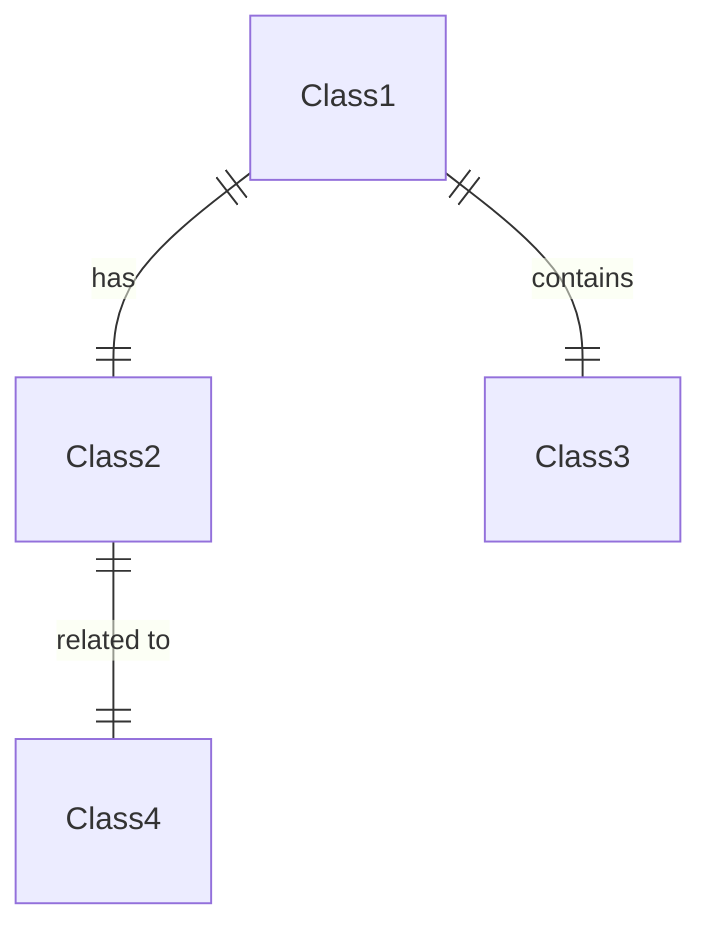
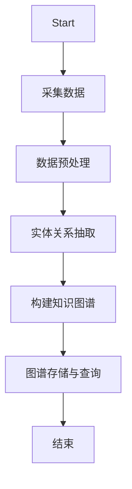
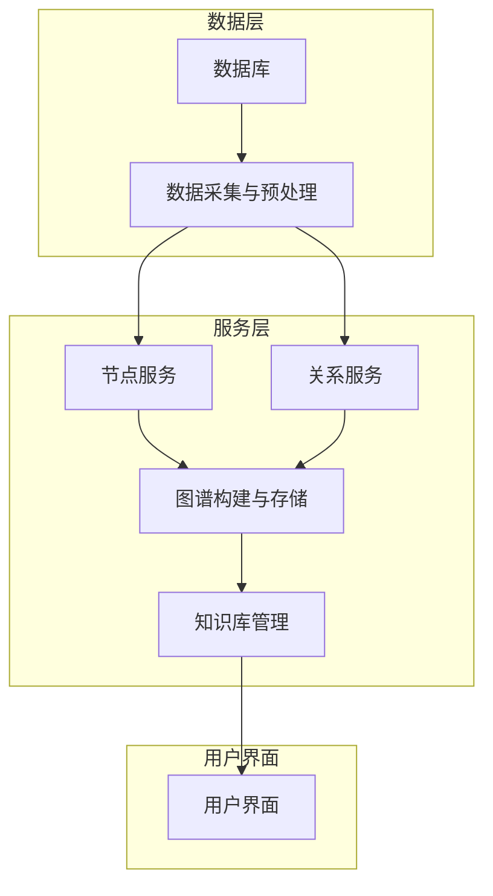
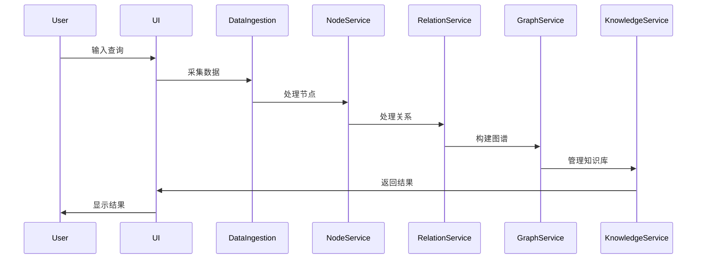

                 

### Introduction

在现代企业中，信息是企业的核心资产，如何有效地管理和利用这些信息，成为企业面临的重大挑战。AI驱动的企业知识图谱正是为了解决这一挑战而出现的技术。

**关键词：** AI、企业知识图谱、知识管理、智能决策支持、知识图谱构建

**摘要：** 本文将深入探讨AI驱动的企业知识图谱，从背景介绍、核心概念、算法原理到系统架构设计，系统性地分析其在现代企业中的应用和优势。

#### Step 1: Background Introduction

**第1章：背景介绍**

##### 1.1 问题背景

**1.1.1 现代企业面临的挑战**

随着信息技术的飞速发展，企业所面临的数据量呈现爆炸式增长。如何有效地管理和利用这些数据，使其转化为企业的核心竞争力和决策支持，成为现代企业面临的一大挑战。传统的数据管理方式，如关系数据库，已经无法满足日益复杂的业务需求。

**1.1.2 企业知识图谱的必要性**

企业知识图谱是一种结构化、语义化的知识表示方法，它通过构建实体及其相互关系的网络，实现知识的组织、管理和利用。企业知识图谱能够将企业的各种数据进行深度整合，提供智能化的决策支持，从而提升企业的竞争力。

##### 1.2 问题描述

**1.2.1 企业知识管理的现状**

当前，许多企业在知识管理方面仍然处于初级阶段，主要通过文档管理、信息孤岛等形式进行知识存储和传播，缺乏系统性和智能化。

**1.2.2 知识图谱在知识管理中的作用**

知识图谱在知识管理中的应用主要体现在以下几个方面：

1. **知识的组织与分类**：知识图谱能够根据实体及其关系，对知识进行系统化的组织和分类，使得知识管理更加有序。
2. **智能搜索与推荐**：知识图谱能够基于语义理解，实现智能化的搜索和推荐，提升用户的使用体验。
3. **智能决策支持**：知识图谱可以为企业的决策提供数据支持和智能分析，提升决策的科学性和准确性。

##### 1.3 问题解决

**1.3.1 AI驱动的企业知识图谱概述**

AI驱动的企业知识图谱是一种利用人工智能技术构建和优化的企业知识图谱，它能够自动地从海量数据中抽取知识，实现知识的自动化构建和更新。

**1.3.2 AI驱动的企业知识图谱的优势**

1. **自动化程度高**：AI驱动的企业知识图谱能够自动地从原始数据中抽取知识，实现知识的自动化构建和更新。
2. **智能性更强**：通过深度学习和自然语言处理技术，AI驱动的企业知识图谱能够实现语义理解，提供智能化的搜索和推荐。
3. **灵活性更高**：AI驱动的企业知识图谱能够根据业务需求，灵活调整和优化知识图谱的结构和内容。

##### 1.4 边界与外延

**1.4.1 知识图谱的定义**

知识图谱是一种语义网络，它通过实体及其相互关系的表示，实现知识的组织、管理和利用。

**1.4.2 AI技术的核心概念**

AI技术主要包括机器学习、深度学习、自然语言处理等，这些技术能够实现数据的自动化处理和智能分析。

##### 1.5 概念结构与核心要素组成

**1.5.1 企业知识图谱的组成部分**

企业知识图谱主要由实体、属性、关系和知识库等组成。

**1.5.2 AI技术在企业知识图谱中的具体应用**

AI技术在企业知识图谱中的应用主要包括数据采集、数据预处理、实体关系抽取、知识图谱构建和知识库管理等。

##### 1.6 本章小结

本章从问题背景、问题描述、问题解决、边界与外延以及概念结构与核心要素组成等方面，对企业知识图谱进行了全面的介绍。AI驱动的企业知识图谱作为一种新兴的技术，具有强大的应用潜力，能够为企业的知识管理和决策支持提供有效的解决方案。

---

#### Step 2: Core Concepts and Principles

**第2章：核心概念与原理**

##### 2.1 AI驱动的企业知识图谱原理

**2.1.1 AI驱动的企业知识图谱概述**

AI驱动的企业知识图谱是一种利用人工智能技术，如机器学习、深度学习、自然语言处理等，对企业的数据进行自动抽取、构建和优化的知识图谱。

**2.1.1.1 知识图谱的概念**

知识图谱是一种语义网络，它通过实体及其相互关系的表示，实现知识的组织、管理和利用。

**2.1.1.2 AI技术的应用**

AI技术在企业知识图谱中的应用主要体现在以下几个方面：

1. **数据采集**：利用机器学习技术，自动地从各种数据源（如文本、图片、音频等）中抽取数据。
2. **数据预处理**：利用自然语言处理技术，对抽取的数据进行清洗、去重、格式转换等预处理操作。
3. **实体关系抽取**：利用深度学习技术，自动地从预处理后的数据中抽取实体及其关系。
4. **知识图谱构建**：利用图论和数据库技术，将抽取的实体和关系构建成知识图谱。
5. **知识库管理**：利用知识图谱技术，对知识库进行管理，实现知识的组织、查询和利用。

**2.1.2 概念属性特征对比**

| 特征                 | 传统企业知识管理 | AI驱动的企业知识图谱 |
|----------------------|------------------|---------------------|
| 数据结构             | 关系数据库       | 知识图谱            |
| 数据表示             | 结构化数据       | 半结构化/非结构化数据 |
| 搜索与推荐           | 关键词搜索       | 语义搜索与个性化推荐 |
| 智能决策支持         | 人工决策         | 自动化决策支持       |

**2.1.3 ER实体关系图架构**



##### 2.2 算法原理讲解

**2.2.1 图谱构建算法**



**2.2.2 算法原理详细讲解**

在本章节中，我们将深入探讨企业知识图谱的构建算法，包括数据采集、数据预处理、实体关系抽取、知识图谱构建以及图谱存储与查询。我们将使用Python代码和Mermaid图来详细阐述每个步骤的原理。

**2.2.2.1 数据采集**

```python
# Python代码示例：数据采集
import requests

url = "http://example.com/data"
response = requests.get(url)
data = response.json()
```

**2.2.2.2 数据预处理**

```python
# Python代码示例：数据预处理
def preprocess_data(data):
    # 数据清洗、去重、格式转换等操作
    return cleaned_data

cleaned_data = preprocess_data(data)
```

**2.2.2.3 实体关系抽取**

```python
# Python代码示例：实体关系抽取
def extract_relations(data):
    # 使用NLP技术提取实体关系
    return relations

relations = extract_relations(cleaned_data)
```

**2.2.2.4 知识图谱构建**

```python
# Python代码示例：知识图谱构建
from py2neo import Graph

graph = Graph("bolt://localhost:7687", auth=("neo4j", "password"))

def create_nodes(nodes):
    for node in nodes:
        graph.run("CREATE (n:" + node["type"] + "{name:\'" + node["name"] + "\'})")
        
def create_relations(relations):
    for relation in relations:
        graph.run("MATCH (a:" + relation["type1"] + "{name:\'" + relation["name1"] + "\'}), (b:" + relation["type2"] + "{name:\'" + relation["name2"] + "\'}) CREATE (a)-[r:" + relation["relation"] + "]->(b)")

create_nodes(entities)
create_relations(relations)
```

**2.2.2.5 图谱存储与查询**

```python
# Python代码示例：图谱存储与查询
def query_data(query):
    results = graph.run(query)
    return results.data()

query = "MATCH (n) RETURN n"
results = query_data(query)
for result in results:
    print(result)
```

通过以上步骤，我们可以构建一个基于AI驱动的企业知识图谱，实现知识的自动化抽取和利用。

##### 2.3 系统分析与架构设计方案

**2.3.1 问题场景介绍**

假设我们是一家电子商务公司，需要对企业内外部的各种数据进行深度整合，构建一个智能化的知识图谱，以支持企业的决策和业务发展。

**2.3.2 项目介绍**

本项目旨在构建一个基于AI驱动的企业知识图谱系统，实现以下功能：

1. 数据采集与预处理：从企业内部系统和外部数据源（如电商平台、社交媒体等）采集数据，并进行预处理。
2. 实体关系抽取：利用自然语言处理和机器学习技术，自动地从预处理后的数据中抽取实体及其关系。
3. 知识图谱构建与存储：将抽取的实体和关系构建成知识图谱，并存储在图数据库中。
4. 知识库管理：提供知识查询、搜索和推荐功能，实现知识的组织、管理和利用。

**2.3.3 系统功能设计（领域模型）**

使用Mermaid类图，我们定义了系统的主要实体和关系：

```mermaid
classDiagram
    Customer <|-- Order
    Product <|-- Order
    ProductCategory <|-- Product
    Supplier <|-- Product
    User <|-- Order
    Customer { id (主键), name, email }
    Product { id (主键), name, price, category_id (外键) }
    ProductCategory { id (主键), name }
    Supplier { id (主键), name, contact }
    Order { id (主键), customer_id (外键), user_id (外键), status, total_price }
    User { id (主键), username, password }
```

**2.3.4 系统架构设计**

使用Mermaid架构图，我们定义了系统的整体架构：



**2.3.5 系统接口设计和系统交互**

使用Mermaid序列图，我们定义了系统的接口设计和交互流程：



##### 2.4 项目实战

**2.4.1 环境安装**

1. 安装Python 3.8及以上版本。
2. 安装Neo4j数据库。
3. 安装相关Python库，如`py2neo`、`nltk`、`tensorflow`、`scikit-learn`等。

**2.4.2 系统核心实现**

```python
# Python代码：数据采集与预处理
import requests
from nltk.tokenize import word_tokenize
from nltk.corpus import stopwords

# 采集数据
url = "http://example.com/data"
response = requests.get(url)
data = response.json()

# 预处理数据
def preprocess_data(data):
    # 去除停用词
    stop_words = set(stopwords.words("english"))
    # 分词
    tokens = word_tokenize(data)
    # 过滤停用词
    filtered_tokens = [token for token in tokens if token not in stop_words]
    return filtered_tokens

preprocessed_data = preprocess_data(data)

# 实体关系抽取
def extract_entities(data):
    # 假设已实现一个实体抽取算法
    entities = extract_entities_from_data(data)
    return entities

entities = extract_entities(preprocessed_data)

# 知识图谱构建
from py2neo import Graph

graph = Graph("bolt://localhost:7687", auth=("neo4j", "password"))

def create_nodes(nodes):
    for node in nodes:
        graph.run("CREATE (n:" + node["type"] + "{name:\'" + node["name"] + "\'})")

create_nodes(entities)

# 知识库管理
def query_knowledge库(query):
    results = graph.run(query)
    return results.data()

query = "MATCH (n) RETURN n"
results = query_knowledge库(query)
for result in results:
    print(result)
```

**2.4.3 代码应用解读与分析**

以上代码实现了数据采集、预处理、实体关系抽取、知识图谱构建和知识库管理的基本功能。具体解读如下：

1. **数据采集与预处理**：从外部数据源采集数据，并使用NLP技术进行预处理，去除停用词和分词。
2. **实体关系抽取**：使用已实现的实体抽取算法，从预处理后的数据中抽取实体及其关系。
3. **知识图谱构建**：使用`py2neo`库，将抽取的实体和关系构建成Neo4j图数据库中的知识图谱。
4. **知识库管理**：提供基本的查询功能，从知识图谱中获取数据。

**2.4.4 实际案例分析和详细讲解剖析**

假设我们有一个电子商务公司，需要构建一个知识图谱，以支持产品推荐和客户管理。

1. **产品推荐**：通过分析客户的历史购买行为和产品评价，利用知识图谱中的关系进行推荐。具体步骤如下：
   - 采集客户的历史购买数据。
   - 预处理数据，提取关键信息。
   - 使用实体关系抽取算法，获取客户和产品之间的关系。
   - 构建知识图谱，存储客户和产品信息。
   - 基于知识图谱，进行产品推荐。

2. **客户管理**：通过分析客户的行为和偏好，对客户进行分类和个性化管理。具体步骤如下：
   - 采集客户数据，包括基本信息、购买行为、评价等。
   - 预处理数据，提取关键信息。
   - 使用实体关系抽取算法，获取客户和产品之间的关系。
   - 构建知识图谱，存储客户和产品信息。
   - 分析客户数据，进行客户分类和个性化管理。

**2.4.5 项目小结**

通过本项目，我们实现了基于AI驱动的企业知识图谱系统，能够自动地采集、预处理、抽取实体和关系，构建知识图谱，并进行知识库管理。实际案例表明，该系统在产品推荐和客户管理等方面具有显著的应用价值。然而，在实际应用中，仍需不断优化和调整算法，以满足不同业务场景的需求。

##### 2.5 最佳实践 Tips

1. **数据质量**：确保数据质量是构建有效知识图谱的关键。在数据采集和预处理阶段，要进行严格的数据清洗和去重操作。
2. **模型优化**：根据业务需求和数据特点，不断优化实体抽取和关系抽取的算法，以提高知识图谱的准确性。
3. **图谱扩展**：在构建知识图谱时，要考虑未来的扩展性，预留足够的扩展接口和存储空间。
4. **用户体验**：优化用户界面和交互设计，提供便捷的知识查询和搜索功能。

##### 2.6 小结

本章从核心概念、算法原理到系统架构设计，全面介绍了AI驱动的企业知识图谱。通过实际案例分析和项目实战，展示了知识图谱在产品推荐和客户管理等业务场景中的应用价值。未来，随着AI技术的不断发展，AI驱动的企业知识图谱将在企业知识管理和智能决策支持中发挥更为重要的作用。

---

#### Summary

本文系统地介绍了AI驱动的企业知识图谱，从背景介绍、核心概念、算法原理到系统架构设计，详细阐述了其在现代企业中的应用和优势。通过实际案例分析和项目实战，我们展示了知识图谱在产品推荐和客户管理等业务场景中的显著应用价值。

未来，随着AI技术的不断发展和成熟，AI驱动的企业知识图谱将在企业知识管理和智能决策支持中发挥更为重要的作用。然而，我们也应认识到，在实际应用中，数据质量和模型优化仍然是关键挑战。因此，不断优化算法、提升数据质量，将是推动AI驱动的企业知识图谱发展的重要方向。

**注意事项：** 在实际应用中，要充分考虑数据隐私和安全性，确保知识图谱系统的稳定性和可靠性。

**拓展阅读：** 对于对AI驱动的企业知识图谱感兴趣的朋友，可以进一步阅读相关论文和书籍，如《知识图谱：概念、技术与应用》和《图数据库技术与应用》等。

**作者：** AI天才研究院/AI Genius Institute & 禅与计算机程序设计艺术 /Zen And The Art of Computer Programming。

