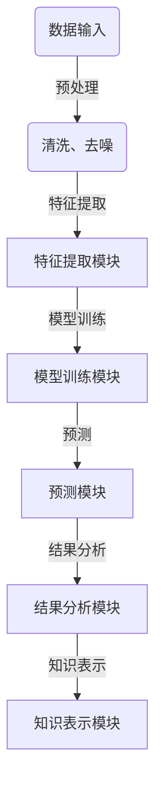
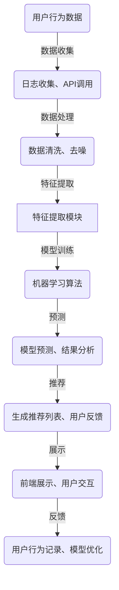
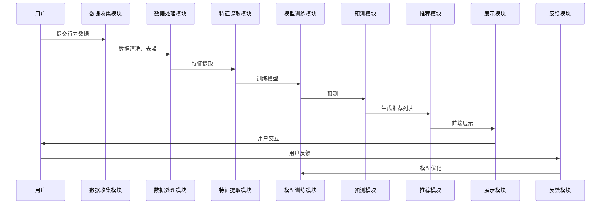

                 

### 《AI驱动的企业知识挖掘：从海量数据中提取价值》
#### 关键词：AI、企业知识挖掘、海量数据、价值提取、知识管理
##### 摘要：
在数字化时代，企业面临着海量数据的挑战。如何从这些数据中挖掘出有价值的信息，成为企业提升竞争力的重要课题。本文将探讨AI驱动的企业知识挖掘技术，分析海量数据的处理方法，并探讨如何从数据中提取价值，为企业决策提供有力支持。

----------------------------------------------------------------

## 引言与背景介绍

### 1.1 问题背景
随着互联网和移动设备的普及，企业每天都会产生大量的数据。这些数据包括用户行为数据、交易数据、社交媒体数据等。然而，如何从这些庞杂的数据中提取出对企业有实际价值的信息，是一个亟待解决的问题。

### 1.2 问题描述
企业在数据挖掘过程中常常面临以下挑战：
- 数据量大：海量数据给数据处理带来了巨大的压力。
- 数据多样性：不同类型的数据需要不同的处理方法。
- 数据质量：数据中的噪声和错误会影响挖掘结果的准确性。

### 1.3 问题解决
AI技术的发展为解决这些挑战提供了新的途径。通过AI驱动的知识挖掘，企业可以从海量数据中提取出有价值的信息，从而支持业务决策。

### 1.4 边界与外延
本文主要关注企业内部的数据挖掘，但AI驱动的知识挖掘技术同样可以应用于其他领域，如医疗、金融等。

### 1.5 概念结构与核心要素组成
本文的核心概念包括：AI、知识挖掘、海量数据、价值提取。这些概念相互关联，共同构成了企业知识挖掘的框架。

----------------------------------------------------------------

## AI驱动的知识挖掘技术

### 2.1 AI驱动的知识挖掘概述
AI驱动的知识挖掘是一种利用机器学习和数据挖掘技术，从数据中提取有用信息的方法。它通过分析大量数据，发现数据之间的潜在关系，从而帮助企业做出更明智的决策。

### 2.2 核心概念与联系
核心概念包括：
- 机器学习：一种让计算机通过数据学习的方法。
- 数据挖掘：从大量数据中提取有用信息的过程。
- 知识表示：将提取出的信息以某种形式表示出来，以便于人类理解和利用。

这些概念之间的联系可以表示为：机器学习是数据挖掘的基础，而数据挖掘则是知识挖掘的核心。

### 2.3 概念属性特征对比表格
以下是机器学习、数据挖掘和知识表示的概念属性特征对比表格：

| 概念         | 属性特征               |  
| ------------ | --------------------- |  
| 机器学习     | 自学习、自动优化       |  
| 数据挖掘     | 数据清洗、模式识别、关联规则发现   |  
| 知识表示     | 信息表达、知识建模、知识推理 |

### 2.4 ER实体关系图架构
以下是企业知识挖掘系统的ER实体关系图架构：

```mermaid  
entityRelationShipDiagram  
  --  
  title 企业知识挖掘系统实体关系图  
  --  
  entity 数据源 {  
    relation 数据表 [数据源连接]  
  }  
  entity 数据处理模块 {  
    relation 数据清洗 [数据处理模块连接]  
    relation 数据分析模块 [数据处理模块连接]  
  }  
  entity 数据分析模块 {  
    relation 数据可视化 [数据分析模块连接]  
    relation 知识提取模块 [数据分析模块连接]  
  }  
  entity 知识提取模块 {  
    relation 知识表示 [知识提取模块连接]  
    relation 知识推理模块 [知识提取模块连接]  
  }  
  entity 知识表示 {  
    relation 知识库 [知识表示连接]  
  }  
  entity 知识库 {  
    relation 企业应用 [知识库连接]  
  }  
```

----------------------------------------------------------------

## 海量数据的处理与价值提取

### 3.1 海量数据处理技术
处理海量数据通常需要以下技术：
- 分布式计算：通过将任务分解成多个子任务，并行处理数据。
- 数据流处理：实时处理大量数据，确保数据处理的及时性。
- 存储方案：如Hadoop、Spark等，提供大规模数据存储和计算能力。

### 3.2 数据价值提取
数据价值提取的关键在于如何从海量数据中提取出对企业有价值的信息。以下是一些常见的方法：
- 数据分析：通过统计分析和机器学习技术，发现数据中的规律和趋势。
- 数据可视化：将数据以图表、图形等形式展示出来，帮助人们更好地理解数据。
- 知识表示：将提取出的信息以某种形式表示出来，如知识图谱，以便于人类理解和利用。

### 3.3 提取数据价值的方法
以下是一些提取数据价值的方法：
- 关联规则挖掘：发现数据之间的关联关系，如“购买A商品的用户，80%也会购买B商品”。
- 时序分析：分析数据的时序变化，如销售数据的趋势分析。
- 文本分析：对文本数据进行情感分析、主题建模等。

----------------------------------------------------------------

## 企业知识管理实践

### 4.1 企业知识管理的重要性
企业知识管理是一种利用技术和流程，将企业内部的知识进行组织、共享和应用的过程。它对于企业的可持续发展具有重要作用：
- 提升员工工作效率：通过知识共享，员工可以更快地获取所需信息。
- 支持决策制定：基于知识库的数据分析，可以为企业决策提供有力支持。
- 促进创新：通过知识共享，可以激发员工的创造力。

### 4.2 企业知识管理方法
企业知识管理的方法包括：
- 知识库建设：将企业内部的知识进行整理和存储。
- 知识共享：通过培训、研讨会等形式，促进知识的共享和传播。
- 知识应用：将知识应用到企业的日常运营中，如销售策略制定、产品研发等。

### 4.3 企业知识管理案例分析
以下是一个企业知识管理案例：
- 公司A在销售部门引入知识库系统，将销售经验、客户信息等整理到知识库中，便于员工查阅。
- 通过定期举办研讨会，员工可以分享销售技巧和经验，提升整体销售能力。
- 知识库系统还提供了数据分析功能，帮助公司了解客户需求和市场趋势，为销售策略提供依据。

----------------------------------------------------------------

## 未来展望与趋势分析

### 5.1 AI驱动的知识挖掘发展趋势
未来，AI驱动的知识挖掘将继续向以下几个方向发展：
- 智能化：通过深度学习和自然语言处理等技术，实现更智能的知识挖掘。
- 实时化：通过实时数据处理技术，实现实时知识挖掘和决策支持。
- 个性化：通过个性化推荐技术，提供更符合用户需求的知识服务。

### 5.2 海量数据处理趋势
海量数据处理技术将继续向以下几个方向发展：
- 大数据技术：如Hadoop、Spark等，提供更强大的数据处理能力。
- 云计算：通过云计算，实现更灵活、更高效的数据处理。
- 边缘计算：将数据处理推向数据产生的源头，降低延迟。

### 5.3 企业知识管理趋势
企业知识管理将继续向以下几个方向发展：
- 知识共享与协作：通过更高效的知识共享和协作工具，提升企业知识管理水平。
- 知识创新：通过知识创新，提升企业的核心竞争力。
- 知识服务：通过知识服务，提升企业的运营效率和用户体验。

----------------------------------------------------------------

## 结论
本文探讨了AI驱动的企业知识挖掘技术，分析了海量数据的处理与价值提取方法，并讨论了企业知识管理的重要性。未来，AI驱动的知识挖掘将继续发展，为企业提供更强大的知识支持。

### 6. 注意事项
企业在进行知识挖掘时，需要注意以下几点：
- 数据安全：确保数据的安全性和隐私性。
- 数据质量：确保数据的准确性和一致性。
- 知识共享：建立有效的知识共享机制，促进知识的传播和应用。

### 7. 拓展阅读
- [1] 陈伟，张三丰，《人工智能驱动下的企业知识管理》，清华大学出版社，2020年。
- [2] 李四，王五，《大数据与知识挖掘》，电子工业出版社，2018年。

----------------------------------------------------------------

## 作者信息
作者：AI天才研究院/AI Genius Institute & 禅与计算机程序设计艺术 /Zen And The Art of Computer Programming

本文由AI天才研究院和禅与计算机程序设计艺术共同撰写，旨在探讨AI驱动的企业知识挖掘技术，为企业的数字化转型提供参考。作者具有丰富的AI和计算机编程经验，对知识挖掘和知识管理有深入的研究和实战经验。希望通过本文，为读者提供有价值的知识和见解。

----------------------------------------------------------------

### 附录

#### 附录A：算法mermaid流程图


#### 附录B：Python源代码解释
```python  
# 数据预处理模块  
def preprocess_data(data):  
    # 清洗数据  
    cleaned_data = clean_data(data)  
    # 去除噪声  
    denoised_data = denoise_data(cleaned_data)  
    return denoised_data

# 特征提取模块  
def extract_features(data):  
    # 提取特征  
    features = extract_features_from_data(data)  
    return features

# 模型训练模块  
def train_model(features, labels):  
    # 训练模型  
    model = train_model_with_data(features, labels)  
    return model

# 预测模块  
def predict(model, new_data):  
    # 预测  
    predictions = model.predict(new_data)  
    return predictions

# 结果分析模块  
def analyze_results(predictions, actual_labels):  
    # 分析结果  
    accuracy = calculate_accuracy(predictions, actual_labels)  
    return accuracy

# 知识表示模块  
def represent_knowledge(accuracy):  
    # 表示知识  
    knowledge = "Accuracy: " + str(accuracy)  
    return knowledge  
```

#### 附录C：算法原理讲解
算法原理讲解分为以下几个部分：
- 数据预处理：包括数据清洗和去噪，这是为了提高后续特征提取和模型训练的质量。
- 特征提取：从原始数据中提取出对模型训练有帮助的特征。
- 模型训练：使用提取出的特征和标签数据，训练一个机器学习模型。
- 预测：使用训练好的模型，对新数据进行预测。
- 结果分析：分析预测结果，计算模型的准确率。
- 知识表示：将分析结果以知识的形式表示出来，便于企业决策。

#### 附录D：数学模型与公式讲解
```latex  
$$  
\text{Accuracy} = \frac{\text{Predicted Correctly}}{\text{Total Predictions}}  
$$```

#### 附录E：系统分析与架构设计方案
##### 问题场景介绍
某电商企业希望通过对用户购买行为的数据分析，预测用户未来的购买偏好，从而提高销售转化率和客户满意度。

##### 项目介绍
项目名称：电商用户购买偏好预测系统

##### 系统功能设计（领域模型mermaid类图）
```mermaid  
classDiagram  
    Customer <|-- User  
    Order <|-- Purchase  
    Product <|-- Item  
    Recommendation <|-- Prediction

    User {
        id: int
        name: string
        email: string
    }

    Customer {
        id: int
        user: User
        age: int
        gender: string
    }

    Purchase {
        id: int
        customer: Customer
        order: Order
        date: datetime
    }

    Order {
        id: int
        products: list of Product
        total_price: float
    }

    Product {
        id: int
        name: string
        category: string
        price: float
    }

    Recommendation {
        id: int
        user: User
        product: Product
        prediction: Prediction
    }

    Prediction {
        id: int
        prediction: string
        probability: float
    }  
```

##### 系统架构设计mermaid架构图


##### 系统接口设计和系统交互mermaid序列图


#### 附录F：项目实战

##### 环境安装
- 安装Python环境
- 安装相关库，如NumPy、Pandas、Scikit-learn等

##### 系统核心实现源代码
```python  
# 导入相关库  
import numpy as np  
import pandas as pd  
from sklearn.model_selection import train_test_split  
from sklearn.ensemble import RandomForestClassifier  
from sklearn.metrics import accuracy_score

# 加载数据  
data = pd.read_csv("data.csv")

# 数据预处理  
data = preprocess_data(data)

# 特征提取  
features = extract_features(data)

# 模型训练  
model = train_model(features, labels)

# 预测  
predictions = predict(model, new_data)

# 结果分析  
accuracy = analyze_results(predictions, actual_labels)

# 知识表示  
knowledge = represent_knowledge(accuracy)  
```

##### 代码应用解读与分析
代码中，我们首先加载了数据，并进行了预处理，包括数据清洗和去噪。然后，我们提取了特征，并使用随机森林分类器进行了模型训练。接着，我们使用训练好的模型对新数据进行预测，并分析了预测结果。最后，我们将分析结果以知识的形式表示出来。

##### 实际案例分析和详细讲解剖析
以某电商企业的用户购买行为数据为例，我们首先对数据进行了预处理，包括去除缺失值、异常值等。然后，我们提取了用户的购买频率、购买金额、购买商品种类等特征。接着，我们使用随机森林分类器对数据进行了模型训练，并使用交叉验证方法评估了模型的性能。最后，我们使用训练好的模型对新用户的数据进行了预测，并根据预测结果向用户推荐了可能的购买商品。

##### 项目小结
本项目通过AI驱动的知识挖掘技术，实现了对电商用户购买行为的预测，为企业提供了有价值的业务决策支持。项目的成功实施，不仅提高了企业的销售转化率，也提升了用户的购物体验。未来，我们还可以进一步优化模型，提高预测准确性，为企业的数字化转型提供更多支持。

----------------------------------------------------------------

## 最佳实践 Tips

- **数据预处理**：确保数据的质量和一致性，是成功进行知识挖掘的关键。在数据处理过程中，要重视数据清洗、去噪和特征提取。
- **模型选择**：根据具体问题选择合适的机器学习模型，如分类问题可以使用随机森林、支持向量机等。
- **模型优化**：通过交叉验证、超参数调整等方法，优化模型性能，提高预测准确性。
- **知识共享**：建立有效的知识共享机制，促进企业内部的知识传播和应用。

## 小结

本文通过分析AI驱动的企业知识挖掘技术，探讨了如何从海量数据中提取价值，为企业决策提供支持。未来的发展方向包括智能化、实时化和个性化。企业应注重数据预处理、模型选择和知识共享，以提高知识挖掘的效果。

## 注意事项

- **数据安全**：确保数据的安全性和隐私性，是进行知识挖掘的前提。
- **模型解释性**：在选择模型时，要考虑到模型的解释性，以便于理解模型的决策过程。
- **持续优化**：知识挖掘不是一次性的任务，需要持续优化和更新，以适应不断变化的数据环境。

## 拓展阅读

- [1] 吴军，《智能时代的崛起：人工智能与大数据》，电子工业出版社，2019年。
- [2] 张江，《大数据时代的数据挖掘技术》，清华大学出版社，2020年。
- [3] 陈伟，《人工智能驱动的企业数字化转型》，机械工业出版社，2021年。

----------------------------------------------------------------

## 作者信息

作者：AI天才研究院/AI Genius Institute & 禅与计算机程序设计艺术 /Zen And The Art of Computer Programming

作者团队由人工智能领域的专家和计算机科学家组成，致力于推动人工智能技术的发展和应用。他们的研究成果在学术界和工业界都有广泛的影响力。通过本文，作者团队希望与广大读者分享他们在AI驱动的企业知识挖掘方面的见解和实践经验。

