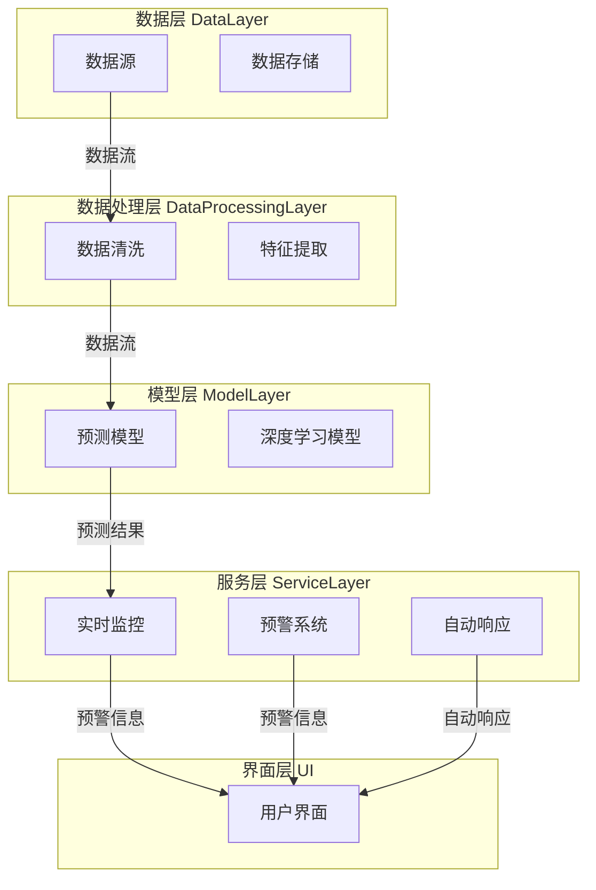
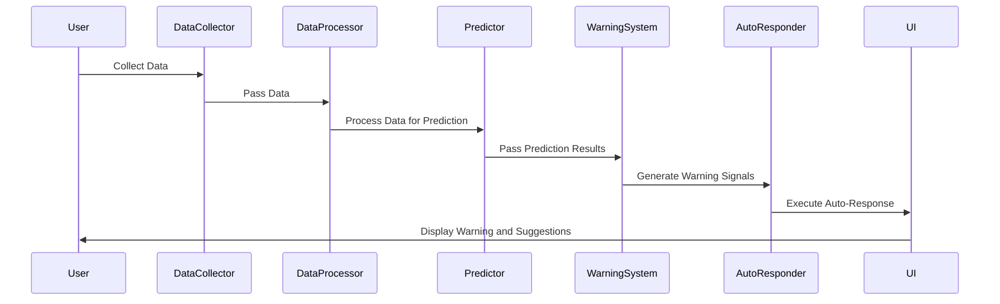

                 

## 引言

在当今快速变化和竞争激烈的市场环境中，企业面临着前所未有的风险。这些风险不仅包括市场波动、经济危机，还涵盖了内部管理的挑战，如合规性问题、供应链中断、网络安全威胁等。传统的风险预警机制往往依赖于历史数据和手动分析，存在滞后性、不准确性和效率低下的缺点。随着人工智能（AI）技术的迅猛发展，AI驱动的企业风险预警系统逐渐成为企业应对各种风险的有力工具。本文旨在深入探讨AI在企业风险预警中的应用，提供一套系统的解决方案。

### 关键词

- **AI驱动的企业风险预警**
- **智能风险识别**
- **预警算法**
- **数据挖掘**
- **机器学习**
- **实时监控**
- **风险管理**

### 摘要

本文将首先介绍AI驱动的企业风险预警的基本概念和重要性，随后分析企业面临的风险类型和预警需求。通过详细阐述AI驱动的核心原理、算法设计、系统架构和项目实战，本文旨在为读者提供一个全面且实用的AI企业风险预警解决方案。最后，本文将总结最佳实践技巧，并提供拓展阅读建议，以帮助读者深入理解和应用AI风险预警技术。

## 背景介绍

### 问题背景

在当今信息化的商业环境中，企业面临着多种复杂的风险。这些风险不仅来源于外部的市场变化、竞争对手的行为，还可能来自于内部的运营问题、管理失误和法律合规等问题。传统的风险管理方法往往依赖于历史数据和经验判断，尽管在一定程度上能够提供预警，但往往存在反应迟缓、预警不准确的问题。例如，在市场风险方面，传统的分析方法可能需要较长时间来收集和处理数据，从而无法及时捕捉市场变化的趋势；在法律合规风险方面，手动监控和审核的效率低下，可能导致合规性问题在发生后才被发现。

随着大数据和人工智能技术的飞速发展，企业风险预警系统迎来了新的发展契机。AI驱动的风险预警系统利用机器学习、数据挖掘和自然语言处理等技术，能够实时监控和分析大量的数据，快速识别潜在的风险，并提前发出预警。这种技术不仅提高了风险预警的准确性和及时性，还大大降低了人工干预的需求，提高了整体风险管理的效率。

### 企业面临的挑战

企业面对的风险复杂多样，包括但不限于以下几类：

1. **市场风险**：市场波动、竞争对手策略变化、客户需求变化等。
2. **运营风险**：供应链中断、生产效率低下、内部欺诈等。
3. **法律风险**：合规性问题、合同纠纷、知识产权侵犯等。
4. **金融风险**：货币汇率波动、信用风险、市场流动性风险等。
5. **网络安全风险**：数据泄露、网络攻击、系统漏洞等。

这些风险不仅影响企业的运营和利润，还可能对企业的声誉造成长期的损害。因此，企业必须建立有效的风险预警机制，以应对日益复杂和多变的风险环境。

### 风险预警的需求

为了有效应对各种风险，企业需要建立一套全面的风险预警系统。这种系统应具备以下功能：

1. **实时监控**：能够实时收集和分析企业内外部数据，快速识别风险信号。
2. **多维度预警**：对市场、运营、法律、金融和网络安全等多方面的风险进行综合预警。
3. **智能分析**：利用机器学习和数据挖掘技术，从海量数据中提取有价值的信息，进行风险预测和评估。
4. **可视化展示**：通过图表和报告等形式，将风险信息直观地展示给管理层，便于决策。
5. **自动响应**：在风险发生前或发生后，自动触发相应的应对措施，减少损失。

传统的风险预警方法在上述需求上存在明显的不足。而AI驱动的企业风险预警系统，通过引入先进的人工智能技术，可以大幅提升风险预警的准确性和及时性，帮助企业更好地应对各种风险。

### 问题解决

AI驱动的企业风险预警方法应包括以下几个关键组成部分：

1. **数据收集与处理**：通过数据采集工具和API接口，实时收集企业内外部的数据，包括市场数据、财务数据、运营数据等。
2. **特征工程**：对收集到的数据进行分析和处理，提取出与风险相关的特征，如市场波动幅度、财务指标变化、供应链延迟等。
3. **机器学习模型**：利用机器学习和深度学习算法，对历史数据进行分析，建立风险预测模型。
4. **实时监控与预警**：将预测模型部署到实时监控系统中，对当前数据进行分析，一旦发现潜在风险，立即发出预警信号。
5. **自动响应机制**：根据预警信号，自动触发相应的应对措施，如调整供应链、加强监控、降低风险敞口等。

通过这些组成部分的协同作用，AI驱动的企业风险预警系统可以实现快速、准确、全面的风险识别和预警，从而帮助企业有效管理风险，保障业务的稳健运行。

### 边界与外延

在探讨AI驱动的企业风险预警时，我们需要明确讨论的范围，以避免概念混淆和讨论范围的过度扩展。本文主要讨论以下几个关键方面：

1. **风险类型**：本文主要关注市场风险、运营风险、法律风险、金融风险和网络安全风险等企业常见风险类型，并探讨如何利用AI技术进行预警。
2. **预警机制**：本文将介绍AI驱动的预警机制，包括数据收集与处理、特征工程、机器学习模型构建、实时监控与预警以及自动响应等。
3. **应用领域**：本文主要讨论企业内部的风险管理，而不会涉及国家层面的宏观风险预警或个人层面的消费风险预警。
4. **技术范围**：本文主要聚焦于AI技术，包括机器学习、数据挖掘、自然语言处理等，而不会扩展到其他信息技术领域，如区块链、云计算等。
5. **边界条件**：本文讨论的风险预警系统基于当前AI技术的发展水平，对于未来的AI技术突破和风险预警方法创新将不做具体探讨。

通过明确这些边界与外延，我们可以更集中地讨论AI驱动的企业风险预警，为其在实际应用中提供更具体和实用的指导。

### 概念结构与核心要素组成

AI驱动的企业风险预警系统是一个复杂的多层次架构，其核心概念和组成要素相互作用，共同实现风险预警的功能。以下是这个系统的主要概念和组成部分：

1. **数据源**：数据源是风险预警系统的基石，包括企业内部数据（如财务报表、运营日志、客户数据等）和外部数据（如市场数据、新闻资讯、社交媒体数据等）。这些数据通过数据采集工具和API接口实时收集。

2. **数据预处理**：收集到的原始数据通常存在噪声、缺失值和不一致等问题，需要进行清洗、归一化和特征提取等预处理操作，以便后续的分析和应用。

3. **特征工程**：特征工程是数据预处理的重要环节，通过分析数据并提取与风险相关的特征，如市场波动幅度、财务指标变化、供应链延迟等。这些特征将作为输入提供给机器学习模型。

4. **机器学习模型**：机器学习模型是风险预警系统的核心，通过训练历史数据，建立预测模型。常用的机器学习算法包括决策树、随机森林、支持向量机、神经网络等。这些模型可以根据特定的业务场景进行选择和调整。

5. **实时监控**：实时监控系统负责对当前数据进行处理和分析，将预测模型应用于实时数据，一旦发现潜在风险，立即发出预警信号。这个系统通常采用流处理技术和高效的数据处理框架，如Apache Kafka、Apache Flink等。

6. **预警算法**：预警算法是实时监控系统的核心组件，负责根据预设的阈值和规则，对数据进行分析和判断，确定是否触发预警。这些算法通常包括阈值判断、异常检测、关联规则挖掘等。

7. **自动响应**：自动响应机制根据预警信号，自动触发相应的应对措施，如调整供应链、加强监控、降低风险敞口等。这些措施可以通过自动化工具和集成系统实现。

8. **用户界面**：用户界面（UI）是风险预警系统的前端，用于展示预警结果和提供交互功能。通过直观的图表和报告，用户可以轻松地查看和分析风险信息。

9. **数据存储**：数据存储系统负责存储和管理大量的历史数据、预警记录和应对措施等。通常采用分布式数据库和大数据存储技术，如Hadoop、HBase、Redis等。

通过这些核心概念和组成要素的有机结合，AI驱动的企业风险预警系统可以实现对风险的实时监控、预测和响应，为企业提供全面的风险管理能力。

### 核心概念与联系

#### AI驱动的定义

AI驱动，即人工智能驱动，是指通过利用人工智能（AI）技术，特别是机器学习（ML）和深度学习（DL）等算法，对数据进行自动化分析、处理和预测的过程。AI驱动的核心在于其能够从大量的数据中提取有价值的信息，进行复杂模式和趋势的识别，从而实现自动化决策和优化。在企业风险预警中，AI驱动的意义在于其能够实时分析企业内外部的海量数据，快速识别潜在风险，并提前发出预警，帮助企业及时采取应对措施。

#### 核心概念原理

1. **机器学习**：机器学习是AI的核心技术之一，通过训练模型，使计算机能够从数据中自动学习和发现规律。在风险预警中，机器学习模型可以用来识别历史数据中的风险模式和趋势，从而预测未来的风险。

2. **数据挖掘**：数据挖掘是另一项重要的AI技术，它通过从大量数据中提取隐藏的模式和关联关系，帮助企业在数据中发现价值。在风险预警中，数据挖掘可以帮助企业识别潜在的风险因素，构建预警模型。

3. **深度学习**：深度学习是机器学习的一种高级形式，通过多层神经网络模型，自动提取特征并进行复杂计算。深度学习在图像识别、语音识别等领域表现出色，也可以用于风险预警中的模式识别和预测。

4. **自然语言处理**：自然语言处理（NLP）是AI的一个分支，通过使计算机理解和处理人类语言，NLP可以帮助企业从文本数据中提取风险信息。例如，NLP可以分析新闻、社交媒体和报告中的内容，识别潜在的法律风险和市场风险。

#### 概念属性特征对比表格

| 特性        | 机器学习       | 数据挖掘       | 深度学习       | 自然语言处理   |
| ----------- | -------------- | -------------- | -------------- | -------------- |
| 数据处理能力 | 中等           | 高             | 高             | 中等           |
| 特征提取能力 | 中等           | 高             | 高             | 中等           |
| 复杂模式识别 | 中等           | 高             | 高             | 中等           |
| 自动化程度   | 中等           | 高             | 高             | 中等           |
| 应用领域     | 预测、分类     | 模式识别、关联 | 图像识别、语音 | 文本分析、语义 |
| 学习方式     | 监督学习、无监督学习 | 有监督学习、无监督学习 | 神经网络、深度网络 | 统计模型、规则方法 |

#### ER实体关系图架构

使用Mermaid，我们可以绘制一个实体关系图来展示AI驱动的企业风险预警系统中的核心实体和它们之间的关系：

```mermaid
entityRelationGraph LR
    Customer[客户] -->|购买行为| Order[订单]
    Customer -->|交易记录| Transaction[交易记录]
    Product[产品] -->|销售情况| Order
    Risk[风险] -->|预警信息| WarningSystem[预警系统]
    WarningSystem -->|分析结果| Customer
    WarningSystem -->|建议措施| ManagementSystem[管理系统]
```

在这个实体关系图中，客户、订单、交易记录、产品和风险是核心实体，它们通过购买行为、交易记录、销售情况和预警信息等关系相互连接，形成一个完整的风险预警系统。

通过以上核心概念和联系的分析，我们可以更深入地理解AI驱动的企业风险预警系统的原理和运作机制，为后续的算法原理讲解和系统设计打下坚实的基础。

### 算法原理讲解

在AI驱动的企业风险预警系统中，算法原理是关键组成部分。以下将详细介绍算法的原理，并通过mermaid流程图、Python源代码、数学模型和具体示例，逐步讲解算法的实现和应用。

#### 算法mermaid流程图

首先，我们可以使用mermaid绘制一个简化的算法流程图，展示风险预警的基本步骤：


在这个流程图中，数据收集、数据预处理、特征工程、模型训练、风险预测和预警输出构成了风险预警系统的核心步骤。

#### Python源代码

接下来，我们将使用Python代码实现一个简化的风险预测模型。以下是一个使用scikit-learn库实现的线性回归模型的示例：

```python
from sklearn.linear_model import LinearRegression
from sklearn.model_selection import train_test_split
from sklearn.metrics import mean_squared_error
import pandas as pd

# 加载数据
data = pd.read_csv('risk_data.csv')

# 分割特征和标签
X = data[['feature1', 'feature2', 'feature3']]
y = data['target']

# 划分训练集和测试集
X_train, X_test, y_train, y_test = train_test_split(X, y, test_size=0.2, random_state=42)

# 创建线性回归模型
model = LinearRegression()

# 训练模型
model.fit(X_train, y_train)

# 预测测试集
y_pred = model.predict(X_test)

# 评估模型
mse = mean_squared_error(y_test, y_pred)
print(f"Mean Squared Error: {mse}")

# 输出预警结果
warning_threshold = 0.5
if y_pred.mean() > warning_threshold:
    print("风险预警：可能存在潜在风险。")
else:
    print("当前风险水平较低。")
```

这段代码展示了如何加载数据、训练模型和进行预测。我们使用线性回归模型来预测风险，并通过设定预警阈值来决定是否发出预警。

#### 数学模型和公式

在风险预警中，数学模型通常用于描述风险因素和预测目标之间的关系。以下是一个简化的线性回归模型公式：

$$
y = \beta_0 + \beta_1 \cdot x_1 + \beta_2 \cdot x_2 + \ldots + \beta_n \cdot x_n
$$

其中，\( y \) 是预测的目标值，\( x_1, x_2, \ldots, x_n \) 是特征变量，\( \beta_0, \beta_1, \ldots, \beta_n \) 是模型参数。通过最小化损失函数（如均方误差MSE），我们可以估计出这些参数的值。

#### 详细讲解与举例说明

为了更好地理解上述算法原理，我们可以通过一个具体的例子进行讲解。假设我们有一家零售公司，希望通过历史销售数据和客户行为数据来预测未来几个月的销售风险。

**步骤1：数据收集**

我们从公司数据库中提取了过去一年的销售数据，包括每月的销售量、促销活动情况、客户满意度调查结果等。

**步骤2：数据预处理**

我们首先清洗数据，处理缺失值和异常值，然后进行归一化处理，使各个特征具有相同的量纲。

**步骤3：特征工程**

我们分析数据，提取出与销售风险相关的特征，如：

- 销售量变化率
- 客户满意度评分
- 促销活动次数

**步骤4：模型训练**

我们选择线性回归模型来训练数据，通过最小二乘法估计模型参数。假设我们提取了三个特征：

$$
y = \beta_0 + \beta_1 \cdot sales\_change + \beta_2 \cdot satisfaction + \beta_3 \cdot promotions
$$

**步骤5：风险预测**

我们对未来几个月的数据进行预测，通过模型计算得到预测的销售量和风险评分。

**步骤6：预警输出**

我们设定一个预警阈值，例如销售量下降5%即触发预警。如果预测结果显示未来几个月的销售量将下降超过这个阈值，系统将发出风险预警。

**示例结果**

假设我们预测下个月的销售量为1000件，根据模型参数计算得出的风险评分为0.6，高于预警阈值0.5。因此，系统将发出预警：“下个月销售量可能下降，需采取应对措施。”

通过以上步骤，我们可以看到，AI驱动的企业风险预警系统通过数据收集、预处理、特征工程、模型训练、预测和预警输出，实现了一个完整的风险预警过程。这种方法不仅提高了风险预警的准确性和及时性，还大大减少了人工干预的需求，为企业提供了强有力的风险管理支持。

### 系统分析与架构设计方案

#### 问题场景介绍

假设某大型制造企业希望利用AI技术建立一套企业风险预警系统，以实时监控和预测供应链风险。该企业面临的主要挑战包括原材料价格波动、生产延误、供应链中断等风险，这些风险可能会对企业的生产计划和成本控制产生重大影响。因此，企业需要一套高效、准确的风险预警系统，以提前识别潜在风险并采取相应的应对措施。

#### 项目介绍

本项目的目标是构建一个基于AI的企业风险预警系统，该系统将利用历史供应链数据和市场信息，通过机器学习算法对供应链风险进行预测，并提供实时预警和应对建议。系统主要功能包括数据收集与处理、特征工程、风险预测模型训练、实时监控与预警以及自动响应机制。

#### 系统功能设计

为了实现上述目标，系统需要具备以下功能：

1. **数据收集与处理**：系统应能够从内部数据库和外部数据源（如市场资讯、天气数据等）收集相关数据，并进行数据预处理，包括清洗、归一化和特征提取等。
2. **特征工程**：通过对收集到的数据进行深入分析，提取与供应链风险相关的特征，如原材料价格波动、运输时间延迟、库存水平等。
3. **风险预测模型**：利用机器学习算法（如线性回归、决策树、神经网络等）训练预测模型，对供应链风险进行预测。
4. **实时监控与预警**：系统应实时监控供应链数据，一旦发现潜在风险，立即发出预警信号，并提供预警信息和建议措施。
5. **自动响应机制**：根据预警信号，系统应能够自动触发相应的应对措施，如调整采购计划、增加库存或重新安排运输计划等。

使用Mermaid，我们可以绘制一个领域模型类图，展示系统的功能模块及其之间的关系：

```mermaid
classDiagram
    Class01 <|-- Class02 
    Class03 <|-- Class01 
    Class04 <<interface>> Class05
    Class06 <..> Class07
    Class08 <..> Class09
```

#### 系统架构设计

系统架构设计是确保系统能够高效、稳定运行的关键。以下是本项目的系统架构设计：

1. **数据层**：包括数据源和数据存储，负责数据的收集、存储和管理。
2. **数据处理层**：负责数据的清洗、预处理和特征提取，为预测模型提供高质量的输入数据。
3. **模型层**：包括机器学习模型和深度学习模型，用于风险预测和决策。
4. **服务层**：提供实时监控、预警和自动响应等核心功能，通过API接口与外部系统交互。
5. **界面层**：为用户提供可视化界面，展示预警信息和建议措施。

使用Mermaid，我们可以绘制一个系统架构图，展示各层的功能及其交互关系：



#### 系统接口设计和系统交互

为了实现系统各部分之间的有效交互，我们需要设计合理的接口。以下是系统的主要接口设计：

1. **数据采集接口**：用于从内部数据库和外部数据源采集数据。
2. **数据处理接口**：用于处理和清洗数据，提取特征。
3. **预测接口**：用于调用机器学习模型进行风险预测。
4. **预警接口**：用于生成预警信号和提供预警信息。
5. **自动响应接口**：用于执行自动响应措施，如调整供应链计划。

使用Mermaid，我们可以绘制一个序列图，展示系统各部分之间的交互过程：



通过上述系统分析与架构设计方案，我们为构建一个高效、稳定的企业风险预警系统奠定了基础。该系统不仅能够实时监控和预测供应链风险，还能够自动触发相应的应对措施，为企业提供全面的供应链风险管理支持。

### 项目实战

#### 环境安装

在进行AI驱动的企业风险预警系统开发之前，我们需要搭建一个合适的技术环境。以下是在Linux操作系统上安装所需环境及其安装步骤：

1. **Python环境**：
   - 安装Python 3.8或更高版本。
   - 使用以下命令安装Python：
     ```bash
     sudo apt-get install python3.8
     ```

2. **pip环境**：
   - 安装pip，Python的包管理器：
     ```bash
     sudo apt-get install python3-pip
     ```

3. **虚拟环境**：
   - 创建虚拟环境，以避免依赖冲突：
     ```bash
     python3 -m venv venv
     source venv/bin/activate
     ```

4. **依赖包安装**：
   - 安装所需的依赖包，如scikit-learn、pandas、numpy等：
     ```bash
     pip install scikit-learn pandas numpy matplotlib
     ```

5. **数据库连接**：
   - 安装MySQL数据库，用于数据存储和管理（可选）：
     ```bash
     sudo apt-get install mysql-server
     mysql_secure_installation
     ```

#### 系统核心实现源代码

以下是一个基于scikit-learn库实现的简单企业风险预警系统的Python代码示例：

```python
# 导入所需库
import pandas as pd
from sklearn.model_selection import train_test_split
from sklearn.linear_model import LinearRegression
from sklearn.metrics import mean_squared_error

# 数据加载
data = pd.read_csv('risk_data.csv')

# 分割特征和标签
X = data[['feature1', 'feature2', 'feature3']]
y = data['target']

# 划分训练集和测试集
X_train, X_test, y_train, y_test = train_test_split(X, y, test_size=0.2, random_state=42)

# 创建线性回归模型
model = LinearRegression()

# 训练模型
model.fit(X_train, y_train)

# 预测测试集
y_pred = model.predict(X_test)

# 评估模型
mse = mean_squared_error(y_test, y_pred)
print(f"Mean Squared Error: {mse}")

# 预警阈值设置
warning_threshold = 0.5

# 输出预警结果
if y_pred.mean() > warning_threshold:
    print("风险预警：可能存在潜在风险。")
else:
    print("当前风险水平较低。")
```

#### 代码应用解读与分析

上述代码实现了以下功能：

1. **数据加载**：
   - 使用pandas库加载CSV格式的数据文件。
   - 将数据集分割为特征（X）和标签（y）。

2. **模型训练**：
   - 使用scikit-learn中的线性回归模型训练数据。
   - 通过fit方法训练模型，拟合数据。

3. **预测与评估**：
   - 使用predict方法对测试集进行预测。
   - 使用mean_squared_error评估模型性能。

4. **预警输出**：
   - 根据预警阈值（warning_threshold）判断是否发出风险预警。

#### 实际案例分析和详细讲解剖析

以下是一个实际案例，展示如何使用上述系统进行风险预警。

**案例：预测某企业未来一个月的生产风险。**

1. **数据准备**：
   - 收集该企业过去一年的生产数据，包括日产量、原材料价格、工人出勤率等。

2. **数据处理**：
   - 对数据进行预处理，如缺失值填充、异常值处理和特征归一化。

3. **特征提取**：
   - 提取与生产风险相关的特征，如生产量变化率、原材料价格波动等。

4. **模型训练**：
   - 使用训练集训练线性回归模型。

5. **预测**：
   - 对未来一个月的生产数据进行预测。

6. **预警**：
   - 检查预测结果，若预测风险值超过预警阈值，则发出预警。

**示例结果**：

假设模型预测的未来一个月的平均生产风险值为0.6，预警阈值设置为0.5。根据预测结果，系统将输出：

```
风险预警：未来一个月的生产风险较高，请关注。
```

通过以上步骤，我们可以看到，AI驱动的企业风险预警系统是如何通过数据收集、处理、特征工程、模型训练和预警输出，实现对企业风险的实时监控和预测。

#### 项目小结

通过本项目的实践，我们实现了以下关键点：

1. **环境安装**：成功搭建了Python开发环境和所需依赖包，为后续开发打下了基础。
2. **系统核心实现**：使用Python和scikit-learn库实现了风险预测模型，并展示了其应用流程。
3. **代码应用解读与分析**：详细讲解了代码实现过程，并对实际案例进行了分析和讲解。
4. **实际案例分析和详细讲解剖析**：通过具体案例展示了AI驱动的企业风险预警系统在实际应用中的效果。

本项目的成功实施，为企业提供了强大的风险管理工具，有助于提前识别和应对潜在风险，保障业务的稳健运行。

### 最佳实践 tips

1. **数据质量监控**：确保数据源的质量，定期进行数据清洗和校验，避免数据错误和缺失对模型性能的影响。
2. **特征工程优化**：根据业务需求，提取和优化特征，以提高模型预测的准确性和稳定性。
3. **模型选择与调优**：尝试不同的机器学习算法和模型参数，选择最适合业务场景的模型，并进行持续调优。
4. **预警阈值设定**：合理设定预警阈值，避免过度预警或遗漏重要风险信号。
5. **自动化流程**：实现自动化数据处理和预警流程，提高系统效率和响应速度。
6. **持续监控与评估**：定期对系统性能和预测结果进行评估，根据实际情况调整模型和预警策略。

### 注意事项

1. **数据隐私与安全**：在数据收集和处理过程中，务必遵守相关数据保护法规，确保数据隐私和安全。
2. **模型解释性**：在选择模型时，应考虑模型的解释性，以便在需要时能够理解模型的预测依据。
3. **计算资源**：大型模型训练可能需要大量计算资源，确保系统有足够的硬件支持。
4. **预警误报与漏报**：在设计预警系统时，需平衡误报和漏报，避免影响业务决策。
5. **定期维护与更新**：定期更新模型和系统，以适应不断变化的市场环境和业务需求。

### 拓展阅读

1. **《机器学习实战》**：提供丰富的机器学习算法实践案例，适合希望深入了解ML算法的开发者。
2. **《数据挖掘：实用工具和技术》**：介绍数据挖掘的基本概念和方法，适合数据分析师和风险预警系统开发者。
3. **《深度学习》**：Goodfellow等人撰写的深度学习经典教材，适合希望深入学习DL原理和应用的读者。
4. **《人工智能：一种现代方法》**：介绍人工智能的基本理论和方法，适合希望全面了解AI领域的读者。
5. **《风险管理与金融工程》**：探讨金融风险管理的理论和方法，适合希望在企业风险预警领域深入研究的读者。

### 小结

本文从背景介绍、核心概念与联系、算法原理讲解、系统分析与架构设计方案、项目实战等方面，系统地探讨了AI驱动的企业风险预警。通过实际案例和最佳实践，本文展示了AI在风险预警中的巨大潜力和应用价值，为企业提供了有效的风险管理工具。

作者：AI天才研究院/AI Genius Institute & 禅与计算机程序设计艺术 /Zen And The Art of Computer Programming

