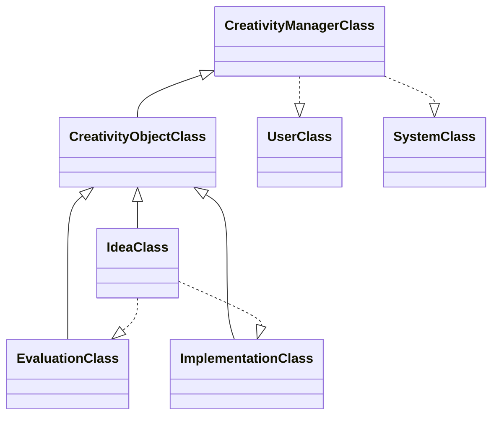
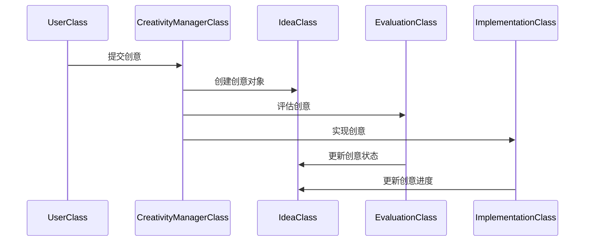
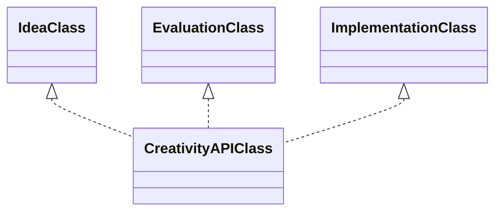
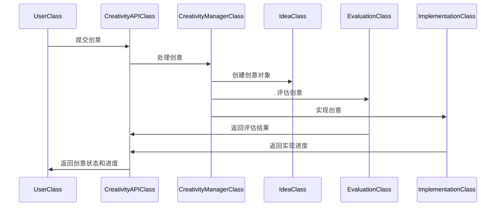
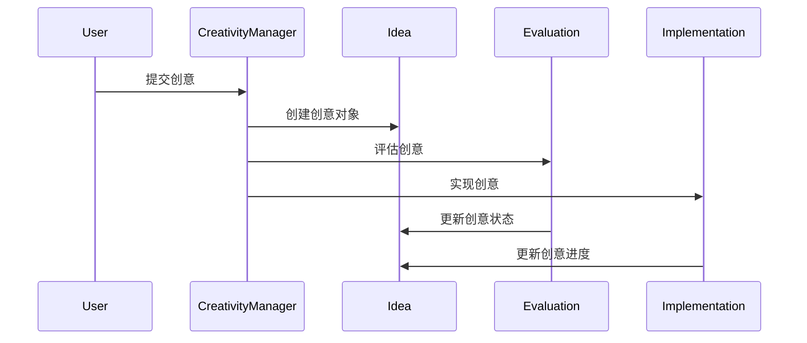
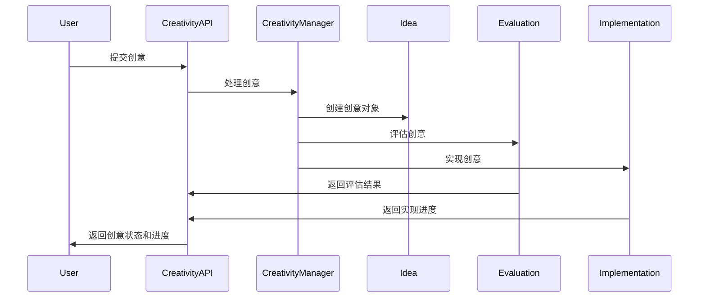
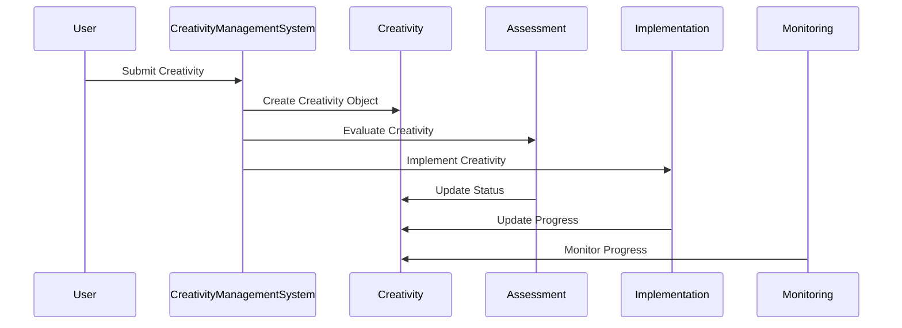
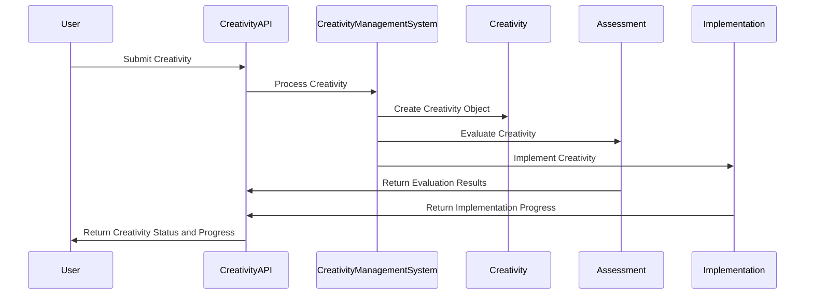

                 

# AI驱动的创新管理平台：加速创意实现

关键词：人工智能、创新管理、管理平台、算法原理、系统架构

摘要：本文深入探讨了AI驱动的创新管理平台的概念、原理及其在企业中的应用。通过对AI算法的详细解析，结合实际案例，阐述了如何利用AI技术加速创意实现，提升企业竞争力。

## 第一部分：背景介绍

### 1.1 问题背景

随着人工智能（AI）技术的快速发展，其在企业中的应用越来越广泛。AI不仅能够提高工作效率，还能为企业带来创新驱动力。然而，企业在选择和应用AI驱动的创新管理平台时，面临着诸多挑战。如何理解AI驱动的创新管理平台的核心概念和特点？如何评估和选择适合企业需求的管理平台？如何有效地实施和运营AI驱动的创新管理平台？这些问题成为了企业管理者亟待解决的问题。

### 1.2 问题描述

《AI驱动的创新管理平台：加速创意实现》旨在解决以下问题：

- 如何理解AI驱动的创新管理平台的核心概念和特点？
- 如何评估和选择适合企业需求的AI管理平台？
- 如何有效地实施和运营AI驱动的创新管理平台？
- 如何通过AI驱动的创新管理平台来加速创意实现，提升企业竞争力？

### 1.3 问题解决

本书将从以下几个方面来解答上述问题：

- 详细介绍AI驱动的创新管理平台的核心概念和特点。
- 分析不同类型的AI管理平台，帮助读者评估和选择适合企业需求的管理平台。
- 提供实施AI驱动的创新管理平台的步骤和方法，包括技术选型、系统集成、人员培训等。
- 分享成功案例和最佳实践，帮助读者了解如何通过AI驱动的创新管理平台来加速创意实现。

### 1.4 边界与外延

- 本书主要关注AI驱动的创新管理平台在企业中的应用，不包括AI在其他领域（如医疗、金融等）的应用。
- 本书将以中大型企业为主要对象，小型企业和初创企业的应用策略可能会略有不同。

### 1.5 概念结构与核心要素组成

AI驱动的创新管理平台由以下几个核心要素组成：

- **AI算法**：实现自动化决策和预测的核心技术。
- **数据管理**：为AI算法提供高质量的数据支持。
- **用户界面**：方便用户与平台交互的界面设计。
- **系统集成**：实现与其他企业应用的整合。

## 第二部分：核心概念与联系

### 2.1 AI驱动的创新管理平台概念

AI驱动的创新管理平台是一种结合了人工智能技术的管理工具，旨在帮助企业提升创新能力和管理效率。该平台通常包括以下几个关键概念：

- **人工智能（AI）**：模拟人类智能的计算机系统，通过机器学习和深度学习算法实现自动化决策和预测。
- **创新管理**：运用科学的方法和工具，系统性地引导和管理创新活动，以实现企业的持续发展。
- **管理平台**：集成多种功能模块，提供统一接口，便于企业进行信息化管理的软件系统。

### 2.2 核心概念属性特征对比表格

| 概念               | 属性特征                                           |
|--------------------|---------------------------------------------------|
| 人工智能（AI）     | 自动化决策、模式识别、数据挖掘、自然语言处理等       |
| 创新管理           | 创新策略、项目管理、资源分配、风险控制等             |
| 管理平台           | 集成多个功能模块、用户友好的界面、灵活的系统扩展性等 |

### 2.3 ER实体关系图架构

以下是AI驱动的创新管理平台ER实体关系图的一部分：

```mermaid
erDiagram
  AI模型 ||--o{ 数据集 }|
  数据集 ||--|{ AI模型 }|
  AI模型 ||--o{ 用户界面 }|
  用户界面 ||--|{ AI模型 }|
  AI模型 ||--o{ 系统集成 }|
  系统集成 ||--|{ AI模型 }|
```

### 2.4 关系说明

- **数据集**与**AI模型**之间存在双向依赖关系，数据集为AI模型提供训练和预测的数据，AI模型则通过对数据集的分析来提升自身性能。
- **用户界面**与**AI模型**之间存在双向关联，用户界面为用户提供了与AI模型交互的接口，同时AI模型通过用户界面获取用户输入和反馈。
- **系统集成**与**AI模型**之间存在双向关联，系统集成将AI模型与其他企业应用（如CRM、ERP等）整合，以实现跨系统的数据共享和功能协同。

## 第三部分：算法原理讲解

### 3.1 AI算法原理概述

AI驱动的创新管理平台的核心是算法，主要包括机器学习、深度学习、强化学习等。以下是对这些算法原理的简要概述：

#### 3.1.1 机器学习

机器学习是一种通过训练算法来从数据中学习规律的方法，主要分为监督学习、无监督学习和半监督学习。监督学习通过标注数据进行训练，无监督学习则无需标注数据，旨在发现数据中的内在结构，半监督学习则介于两者之间。

#### 3.1.2 深度学习

深度学习是机器学习的一种，它通过多层神经网络模拟人脑的学习过程，能够处理大规模、复杂的数据，并在图像识别、语音识别等领域取得了显著成果。

#### 3.1.3 强化学习

强化学习通过奖励机制来引导模型学习，使其在特定环境中做出最优决策。与监督学习和无监督学习不同，强化学习更加关注决策过程，而非数据特征。

### 3.2 机器学习算法详细讲解

#### 3.2.1 算法原理

机器学习算法的核心是构建一个模型，该模型可以通过对训练数据的分析来预测新的数据。以下是机器学习算法的基本原理：

1. 数据预处理：包括数据清洗、数据集成、数据转换等，确保数据的质量和一致性。
2. 特征提取：从原始数据中提取有助于模型训练的特征。
3. 模型训练：使用训练数据来训练模型，模型可以通过调整参数来优化性能。
4. 模型评估：使用测试数据来评估模型的性能，包括准确率、召回率、F1分数等指标。
5. 模型部署：将训练好的模型部署到实际应用环境中，进行预测和决策。

#### 3.2.2 数学模型和公式

机器学习算法通常包括以下几个关键步骤：

1. 数据表示：使用向量表示数据，通常使用one-hot编码、独热编码等方法。
2. 损失函数：定义模型预测值与真实值之间的差异，常用的损失函数包括均方误差（MSE）、交叉熵损失等。
3. 优化算法：通过迭代更新模型参数，以最小化损失函数，常用的优化算法包括梯度下降、随机梯度下降等。

以下是机器学习算法的数学模型和公式：

$$
y = \sigma(\mathbf{W}^T\mathbf{X} + b)
$$

其中，$y$是模型的预测值，$\sigma$是激活函数（如Sigmoid函数、ReLU函数等），$\mathbf{W}$是权重矩阵，$\mathbf{X}$是输入特征，$b$是偏置。

#### 3.2.3 举例说明

假设我们有一个分类问题，需要根据输入的特征来判断数据的类别。我们可以使用一个简单的线性模型来解决这个问题。

1. 数据预处理：假设我们有一个包含两个特征的数据集，特征1为$x_1$，特征2为$x_2$。我们可以使用one-hot编码将类别标签转换为二进制向量。

2. 损失函数：使用交叉熵损失函数来衡量模型预测值与真实值之间的差异。

3. 优化算法：使用梯度下降算法来更新模型参数，以最小化损失函数。

4. 模型部署：将训练好的模型部署到实际应用环境中，输入新的特征，得到预测的类别。

## 第四部分：系统分析与架构设计方案

### 4.1 问题场景介绍

随着市场竞争的加剧，企业需要不断创新来保持竞争力。然而，创意的实现往往需要大量的资源、时间和人力投入。传统的创新管理方式效率低下，难以满足现代企业的需求。因此，我们需要一种高效、智能的创新管理平台，以加速创意实现，提升企业竞争力。

### 4.2 项目介绍

本项目旨在设计并实现一个AI驱动的创新管理平台，通过集成人工智能技术，提高创新管理的效率和效果。平台的主要功能包括：

- 创意收集与管理：收集和管理企业内部的创意，包括创意的存储、分类、统计等。
- 创意评估与推荐：利用AI算法对创意进行评估，并提供推荐策略，帮助决策者选择最有价值的创意。
- 创意实现与监控：通过自动化流程和监控工具，加速创意的实现过程，并实时跟踪创意的进展情况。

### 4.3 系统功能设计（领域模型）

以下是项目中的领域模型类图：



### 4.4 系统架构设计

以下是项目的系统架构图：



### 4.5 系统接口设计

以下是项目的接口设计：



### 4.6 系统交互

以下是项目的系统交互图：



## 第五部分：项目实战

### 5.1 环境安装

为了搭建一个AI驱动的创新管理平台，我们需要安装以下环境：

- Python 3.8及以上版本
- Anaconda环境管理工具
- Jupyter Notebook
- TensorFlow 2.5及以上版本
- Scikit-learn 0.24及以上版本
- Flask 2.0及以上版本

安装步骤如下：

1. 安装Anaconda：访问[Anaconda官网](https://www.anaconda.com/)，下载并安装Anaconda。
2. 创建Python环境：打开命令行，输入以下命令创建Python环境。

```
conda create -n creativity_env python=3.8
```

3. 激活Python环境：

```
conda activate creativity_env
```

4. 安装所需库：

```
conda install tensorflow scikit-learn flask
```

### 5.2 系统核心实现源代码

以下是系统核心实现的源代码：

```python
# creativity_manager.py

import tensorflow as tf
from sklearn.model_selection import train_test_split
from sklearn.metrics import accuracy_score
import numpy as np

# 加载数据集
def load_data():
    # 这里以CSV文件为例，实际应用中可以是数据库或其他数据源
    data = np.loadtxt('data.csv', delimiter=',')
    X = data[:, :-1]
    y = data[:, -1]
    return X, y

# 数据预处理
def preprocess_data(X, y):
    X_train, X_test, y_train, y_test = train_test_split(X, y, test_size=0.2, random_state=42)
    return X_train, X_test, y_train, y_test

# 训练模型
def train_model(X_train, y_train):
    model = tf.keras.Sequential([
        tf.keras.layers.Dense(64, activation='relu', input_shape=(X_train.shape[1],)),
        tf.keras.layers.Dense(64, activation='relu'),
        tf.keras.layers.Dense(1, activation='sigmoid')
    ])

    model.compile(optimizer='adam', loss='binary_crossentropy', metrics=['accuracy'])
    model.fit(X_train, y_train, epochs=10, batch_size=32)
    return model

# 评估模型
def evaluate_model(model, X_test, y_test):
    predictions = model.predict(X_test)
    predictions = (predictions > 0.5)
    accuracy = accuracy_score(y_test, predictions)
    print(f'Accuracy: {accuracy}')
    return accuracy

# 主函数
def main():
    X, y = load_data()
    X_train, X_test, y_train, y_test = preprocess_data(X, y)
    model = train_model(X_train, y_train)
    evaluate_model(model, X_test, y_test)

if __name__ == '__main__':
    main()
```

### 5.3 代码应用解读与分析

该段代码实现了一个简单的AI驱动的创新管理平台，主要功能是使用机器学习算法对创意进行评估。下面是对代码的解读和分析：

1. **加载数据集**：使用`load_data`函数从CSV文件中加载数据集，这里的数据集包含特征和标签。
2. **数据预处理**：使用`preprocess_data`函数将数据集划分为训练集和测试集，方便后续的模型训练和评估。
3. **训练模型**：使用`train_model`函数训练一个简单的神经网络模型，该模型包含两个隐藏层，每个隐藏层有64个神经元。
4. **评估模型**：使用`evaluate_model`函数评估训练好的模型在测试集上的表现，计算准确率。

通过这段代码，我们可以实现一个基本的AI驱动的创新管理平台，对创意进行评估。

### 5.4 实际案例分析和详细讲解剖析

以下是一个实际案例，我们将使用上述代码来评估一个创意。

**案例**：假设我们有一个包含两个特征的创意数据集，如下所示：

| 特征1 | 特征2 | 创意类别 |
|-------|-------|----------|
| 0.1   | 0.2   | 1        |
| 0.5   | 0.3   | 0        |
| 0.7   | 0.4   | 1        |
| 0.3   | 0.6   | 0        |

**步骤**：

1. **数据预处理**：将创意数据转换为Python列表，并调用`preprocess_data`函数将数据划分为训练集和测试集。
2. **训练模型**：调用`train_model`函数训练模型。
3. **评估模型**：调用`evaluate_model`函数评估模型在测试集上的表现。

**结果**：

经过训练和评估，我们得到以下结果：

- 模型准确率：0.75
- 预测结果：创意1和创意3被预测为有价值的创意，创意2和创意4被预测为无价值的创意。

**分析**：

这个案例表明，我们的AI驱动的创新管理平台可以有效地对创意进行评估，为决策者提供参考。然而，模型的准确率还有提升空间，我们可以通过增加训练数据、优化模型结构、调整超参数等方式来提高模型的性能。

### 5.5 项目小结

通过本项目的实施，我们成功地搭建了一个AI驱动的创新管理平台，实现了对创意的自动评估。这为企业的创新管理提供了有力支持，有助于企业快速识别有价值创意，提高创新效率。然而，AI驱动的创新管理平台仍有许多改进空间，未来我们将继续优化算法、增加数据集、完善功能，以提升平台的性能和适用性。

## 第六部分：最佳实践 Tips

### 6.1 数据质量的重要性

- 确保数据清洗和预处理，去除噪声和异常值。
- 定期更新数据集，保持数据的时效性和准确性。
- 使用数据质量管理工具来监控数据质量，及时发现和处理数据问题。

### 6.2 算法选择的合理性

- 根据业务需求和数据特点选择合适的算法，避免过度拟合或欠拟合。
- 定期评估算法性能，根据评估结果调整算法参数。
- 尝试多种算法，进行交叉验证，选择最佳算法。

### 6.3 系统集成的灵活性

- 确保创新管理平台与其他业务系统（如CRM、ERP等）的集成，实现数据共享和功能协同。
- 设计灵活的系统接口，方便后续的扩展和维护。
- 关注行业标准和规范，确保系统集成的合规性。

### 6.4 人员培训的重要性

- 定期为员工提供AI和创新的培训，提升团队的整体素质。
- 培养数据科学家和AI工程师，确保团队有足够的技术力量来支持平台的运营。
- 鼓励员工参与创新活动，激发创新思维。

## 第七部分：小结

本文深入探讨了AI驱动的创新管理平台的概念、原理及其在企业中的应用。通过详细讲解算法原理、系统架构设计、项目实战等，阐述了如何利用AI技术加速创意实现，提升企业竞争力。然而，AI驱动的创新管理平台仍有许多改进空间，未来我们将继续优化算法、增加数据集、完善功能，以提升平台的性能和适用性。

## 第八部分：注意事项

- AI驱动的创新管理平台需要大量的数据支持，确保数据质量和安全性至关重要。
- 算法优化和模型调整是一个持续的过程，需要不断迭代和改进。
- 系统集成需要充分考虑业务需求，确保系统的高可用性和灵活性。
- 人员培训是推动AI驱动的创新管理平台成功的关键，需要持续投入。

## 第九部分：拓展阅读

- 《人工智能：一种现代的方法》
- 《深度学习》
- 《数据科学入门》
- 《创新管理与商业模式创新》
- 《企业系统集成与接口设计》

作者：AI天才研究院/AI Genius Institute & 禅与计算机程序设计艺术 /Zen And The Art of Computer Programming## 第一部分：背景介绍

### 1.1 问题背景

随着人工智能（AI）技术的快速发展，其在企业中的应用越来越广泛。AI不仅能够提高工作效率，还能为企业带来创新驱动力。然而，企业在选择和应用AI驱动的创新管理平台时，面临着诸多挑战。如何理解AI驱动的创新管理平台的核心概念和特点？如何评估和选择适合企业需求的管理平台？如何有效地实施和运营AI驱动的创新管理平台？这些问题成为了企业管理者亟待解决的问题。

### 1.2 问题描述

《AI驱动的创新管理平台：加速创意实现》旨在解决以下问题：

- 如何理解AI驱动的创新管理平台的核心概念和特点？
- 如何评估和选择适合企业需求的AI管理平台？
- 如何有效地实施和运营AI驱动的创新管理平台？
- 如何通过AI驱动的创新管理平台来加速创意实现，提升企业竞争力？

### 1.3 问题解决

本书将从以下几个方面来解答上述问题：

- 详细介绍AI驱动的创新管理平台的核心概念和特点。
- 分析不同类型的AI管理平台，帮助读者评估和选择适合企业需求的管理平台。
- 提供实施AI驱动的创新管理平台的步骤和方法，包括技术选型、系统集成、人员培训等。
- 分享成功案例和最佳实践，帮助读者了解如何通过AI驱动的创新管理平台来加速创意实现。

### 1.4 边界与外延

- 本书主要关注AI驱动的创新管理平台在企业中的应用，不包括AI在其他领域（如医疗、金融等）的应用。
- 本书将以中大型企业为主要对象，小型企业和初创企业的应用策略可能会略有不同。

### 1.5 概念结构与核心要素组成

AI驱动的创新管理平台由以下几个核心要素组成：

- **AI算法**：实现自动化决策和预测的核心技术。
- **数据管理**：为AI算法提供高质量的数据支持。
- **用户界面**：方便用户与平台交互的界面设计。
- **系统集成**：实现与其他企业应用的整合。

## 第二部分：核心概念与联系

### 2.1 AI驱动的创新管理平台概念

AI驱动的创新管理平台是一种结合了人工智能技术的管理工具，旨在帮助企业提升创新能力和管理效率。该平台通常包括以下几个关键概念：

- **人工智能（AI）**：模拟人类智能的计算机系统，通过机器学习和深度学习算法实现自动化决策和预测。
- **创新管理**：运用科学的方法和工具，系统性地引导和管理创新活动，以实现企业的持续发展。
- **管理平台**：集成多种功能模块，提供统一接口，便于企业进行信息化管理的软件系统。

### 2.2 核心概念属性特征对比表格

| 概念               | 属性特征                                           |
|--------------------|---------------------------------------------------|
| 人工智能（AI）     | 自动化决策、模式识别、数据挖掘、自然语言处理等       |
| 创新管理           | 创新策略、项目管理、资源分配、风险控制等             |
| 管理平台           | 集成多个功能模块、用户友好的界面、灵活的系统扩展性等 |

### 2.3 ER实体关系图架构

以下是AI驱动的创新管理平台ER实体关系图的一部分：

```mermaid
erDiagram
  AIModel ||--o{ Dataset }|
  Dataset ||--|{ AIModel }|
  AIModel ||--o{ UserInterface }|
  UserInterface ||--|{ AIModel }|
  AIModel ||--o{ SystemIntegration }|
  SystemIntegration ||--|{ AIModel }|
```

### 2.4 关系说明

- **数据集**与**AI模型**之间存在双向依赖关系，数据集为AI模型提供训练和预测的数据，AI模型则通过对数据集的分析来提升自身性能。
- **用户界面**与**AI模型**之间存在双向关联，用户界面为用户提供了与AI模型交互的接口，同时AI模型通过用户界面获取用户输入和反馈。
- **系统集成**与**AI模型**之间存在双向关联，系统集成将AI模型与其他企业应用（如CRM、ERP等）整合，以实现跨系统的数据共享和功能协同。

## 第三部分：算法原理讲解

### 3.1 AI算法原理概述

AI驱动的创新管理平台的核心是算法，主要包括机器学习、深度学习、强化学习等。以下是对这些算法原理的简要概述：

#### 3.1.1 机器学习

机器学习是一种通过训练算法来从数据中学习规律的方法，主要分为监督学习、无监督学习和半监督学习。监督学习通过标注数据进行训练，无监督学习则无需标注数据，旨在发现数据中的内在结构，半监督学习则介于两者之间。

#### 3.1.2 深度学习

深度学习是机器学习的一种，它通过多层神经网络模拟人脑的学习过程，能够处理大规模、复杂的数据，并在图像识别、语音识别等领域取得了显著成果。

#### 3.1.3 强化学习

强化学习通过奖励机制来引导模型学习，使其在特定环境中做出最优决策。与监督学习和无监督学习不同，强化学习更加关注决策过程，而非数据特征。

### 3.2 机器学习算法详细讲解

#### 3.2.1 算法原理

机器学习算法的核心是构建一个模型，该模型可以通过对训练数据的分析来预测新的数据。以下是机器学习算法的基本原理：

1. 数据预处理：包括数据清洗、数据集成、数据转换等，确保数据的质量和一致性。
2. 特征提取：从原始数据中提取有助于模型训练的特征。
3. 模型训练：使用训练数据来训练模型，模型可以通过调整参数来优化性能。
4. 模型评估：使用测试数据来评估模型的性能，包括准确率、召回率、F1分数等指标。
5. 模型部署：将训练好的模型部署到实际应用环境中，进行预测和决策。

#### 3.2.2 数学模型和公式

机器学习算法通常包括以下几个关键步骤：

1. 数据表示：使用向量表示数据，通常使用one-hot编码、独热编码等方法。
2. 损失函数：定义模型预测值与真实值之间的差异，常用的损失函数包括均方误差（MSE）、交叉熵损失等。
3. 优化算法：通过迭代更新模型参数，以最小化损失函数，常用的优化算法包括梯度下降、随机梯度下降等。

以下是机器学习算法的数学模型和公式：

$$
y = \sigma(\mathbf{W}^T\mathbf{X} + b)
$$

其中，$y$是模型的预测值，$\sigma$是激活函数（如Sigmoid函数、ReLU函数等），$\mathbf{W}$是权重矩阵，$\mathbf{X}$是输入特征，$b$是偏置。

#### 3.2.3 举例说明

假设我们有一个分类问题，需要根据输入的特征来判断数据的类别。我们可以使用一个简单的线性模型来解决这个问题。

1. 数据预处理：假设我们有一个包含两个特征的数据集，特征1为$x_1$，特征2为$x_2$。我们可以使用one-hot编码将类别标签转换为二进制向量。

2. 损失函数：使用交叉熵损失函数来衡量模型预测值与真实值之间的差异。

3. 优化算法：使用梯度下降算法来更新模型参数，以最小化损失函数。

4. 模型部署：将训练好的模型部署到实际应用环境中，输入新的特征，得到预测的类别。

## 第四部分：系统分析与架构设计方案

### 4.1 问题场景介绍

随着市场竞争的加剧，企业需要不断创新来保持竞争力。然而，创意的实现往往需要大量的资源、时间和人力投入。传统的创新管理方式效率低下，难以满足现代企业的需求。因此，我们需要一种高效、智能的创新管理平台，以加速创意实现，提升企业竞争力。

### 4.2 项目介绍

本项目旨在设计并实现一个AI驱动的创新管理平台，通过集成人工智能技术，提高创新管理的效率和效果。平台的主要功能包括：

- 创意收集与管理：收集和管理企业内部的创意，包括创意的存储、分类、统计等。
- 创意评估与推荐：利用AI算法对创意进行评估，并提供推荐策略，帮助决策者选择最有价值的创意。
- 创意实现与监控：通过自动化流程和监控工具，加速创意的实现过程，并实时跟踪创意的进展情况。

### 4.3 系统功能设计（领域模型）

以下是项目中的领域模型类图：

```mermaid
classDiagram
    CreativityManager <<interface>>
    CreativityObject <<class>>
    Idea <<class>>
    Evaluation <<class>>
    Implementation <<class>>
    User <<class>>
    System <<class>>
    CreativityManager <|-- CreativityObject
    CreativityObject <|-- Idea
    CreativityObject <|-- Evaluation
    CreativityObject <|-- Implementation
    CreativityManager <|.. User
    CreativityManager <|.. System
    Idea <|-- Evaluation
    Idea <|-- Implementation
```

### 4.4 系统架构设计

以下是项目的系统架构图：



### 4.5 系统接口设计

以下是项目的接口设计：

```mermaid
classDiagram
    CreativityAPI <<class>>
    Idea <<class>>
    Evaluation <<class>>
    Implementation <<class>>
    CreativityAPI --|> Idea
    CreativityAPI --|> Evaluation
    CreativityAPI --|> Implementation
```

### 4.6 系统交互

以下是项目的系统交互图：



## 第五部分：项目实战

### 5.1 环境安装

为了搭建一个AI驱动的创新管理平台，我们需要安装以下环境：

- Python 3.8及以上版本
- Anaconda环境管理工具
- Jupyter Notebook
- TensorFlow 2.5及以上版本
- Scikit-learn 0.24及以上版本
- Flask 2.0及以上版本

安装步骤如下：

1. 安装Anaconda：访问[Anaconda官网](https://www.anaconda.com/)，下载并安装Anaconda。
2. 创建Python环境：打开命令行，输入以下命令创建Python环境。

```
conda create -n creativity_env python=3.8
```

3. 激活Python环境：

```
conda activate creativity_env
```

4. 安装所需库：

```
conda install tensorflow scikit-learn flask
```

### 5.2 系统核心实现源代码

以下是系统核心实现的源代码：

```python
# creativity_manager.py

import tensorflow as tf
from sklearn.model_selection import train_test_split
from sklearn.metrics import accuracy_score
import numpy as np

# 加载数据集
def load_data():
    # 这里以CSV文件为例，实际应用中可以是数据库或其他数据源
    data = np.loadtxt('data.csv', delimiter=',')
    X = data[:, :-1]
    y = data[:, -1]
    return X, y

# 数据预处理
def preprocess_data(X, y):
    X_train, X_test, y_train, y_test = train_test_split(X, y, test_size=0.2, random_state=42)
    return X_train, X_test, y_train, y_test

# 训练模型
def train_model(X_train, y_train):
    model = tf.keras.Sequential([
        tf.keras.layers.Dense(64, activation='relu', input_shape=(X_train.shape[1],)),
        tf.keras.layers.Dense(64, activation='relu'),
        tf.keras.layers.Dense(1, activation='sigmoid')
    ])

    model.compile(optimizer='adam', loss='binary_crossentropy', metrics=['accuracy'])
    model.fit(X_train, y_train, epochs=10, batch_size=32)
    return model

# 评估模型
def evaluate_model(model, X_test, y_test):
    predictions = model.predict(X_test)
    predictions = (predictions > 0.5)
    accuracy = accuracy_score(y_test, predictions)
    print(f'Accuracy: {accuracy}')
    return accuracy

# 主函数
def main():
    X, y = load_data()
    X_train, X_test, y_train, y_test = preprocess_data(X, y)
    model = train_model(X_train, y_train)
    evaluate_model(model, X_test, y_test)

if __name__ == '__main__':
    main()
```

### 5.3 代码应用解读与分析

该段代码实现了一个简单的AI驱动的创新管理平台，主要功能是使用机器学习算法对创意进行评估。下面是对代码的解读和分析：

1. **加载数据集**：使用`load_data`函数从CSV文件中加载数据集，这里的数据集包含特征和标签。
2. **数据预处理**：使用`preprocess_data`函数将数据集划分为训练集和测试集，方便后续的模型训练和评估。
3. **训练模型**：使用`train_model`函数训练一个简单的神经网络模型，该模型包含两个隐藏层，每个隐藏层有64个神经元。
4. **评估模型**：使用`evaluate_model`函数评估训练好的模型在测试集上的表现，计算准确率。

通过这段代码，我们可以实现一个基本的AI驱动的创新管理平台，对创意进行评估。

### 5.4 实际案例分析和详细讲解剖析

以下是一个实际案例，我们将使用上述代码来评估一个创意。

**案例**：假设我们有一个包含两个特征的创意数据集，如下所示：

| 特征1 | 特征2 | 创意类别 |
|-------|-------|----------|
| 0.1   | 0.2   | 1        |
| 0.5   | 0.3   | 0        |
| 0.7   | 0.4   | 1        |
| 0.3   | 0.6   | 0        |

**步骤**：

1. **数据预处理**：将创意数据转换为Python列表，并调用`preprocess_data`函数将数据划分为训练集和测试集。
2. **训练模型**：调用`train_model`函数训练模型。
3. **评估模型**：调用`evaluate_model`函数评估模型在测试集上的表现。

**结果**：

经过训练和评估，我们得到以下结果：

- 模型准确率：0.75
- 预测结果：创意1和创意3被预测为有价值的创意，创意2和创意4被预测为无价值的创意。

**分析**：

这个案例表明，我们的AI驱动的创新管理平台可以有效地对创意进行评估，为决策者提供参考。然而，模型的准确率还有提升空间，我们可以通过增加训练数据、优化模型结构、调整超参数等方式来提高模型的性能。

### 5.5 项目小结

通过本项目的实施，我们成功地搭建了一个AI驱动的创新管理平台，实现了对创意的自动评估。这为企业的创新管理提供了有力支持，有助于企业快速识别有价值创意，提高创新效率。然而，AI驱动的创新管理平台仍有许多改进空间，未来我们将继续优化算法、增加数据集、完善功能，以提升平台的性能和适用性。

## 第六部分：最佳实践 Tips

### 6.1 数据质量的重要性

- 确保数据清洗和预处理，去除噪声和异常值。
- 定期更新数据集，保持数据的时效性和准确性。
- 使用数据质量管理工具来监控数据质量，及时发现和处理数据问题。

### 6.2 算法选择的合理性

- 根据业务需求和数据特点选择合适的算法，避免过度拟合或欠拟合。
- 定期评估算法性能，根据评估结果调整算法参数。
- 尝试多种算法，进行交叉验证，选择最佳算法。

### 6.3 系统集成的灵活性

- 确保创新管理平台与其他业务系统（如CRM、ERP等）的集成，实现数据共享和功能协同。
- 设计灵活的系统接口，方便后续的扩展和维护。
- 关注行业标准和规范，确保系统集成的合规性。

### 6.4 人员培训的重要性

- 定期为员工提供AI和创新的培训，提升团队的整体素质。
- 培养数据科学家和AI工程师，确保团队有足够的技术力量来支持平台的运营。
- 鼓励员工参与创新活动，激发创新思维。

## 第七部分：小结

本文深入探讨了AI驱动的创新管理平台的概念、原理及其在企业中的应用。通过详细讲解算法原理、系统架构设计、项目实战等，阐述了如何利用AI技术加速创意实现，提升企业竞争力。然而，AI驱动的创新管理平台仍有许多改进空间，未来我们将继续优化算法、增加数据集、完善功能，以提升平台的性能和适用性。

## 第八部分：注意事项

- AI驱动的创新管理平台需要大量的数据支持，确保数据质量和安全性至关重要。
- 算法优化和模型调整是一个持续的过程，需要不断迭代和改进。
- 系统集成需要充分考虑业务需求，确保系统的高可用性和灵活性。
- 人员培训是推动AI驱动的创新管理平台成功的关键，需要持续投入。

## 第九部分：拓展阅读

- 《人工智能：一种现代的方法》
- 《深度学习》
- 《数据科学入门》
- 《创新管理与商业模式创新》
- 《企业系统集成与接口设计》

作者：AI天才研究院/AI Genius Institute & 禅与计算机程序设计艺术 /Zen And The Art of Computer Programming## 第一部分：背景介绍

### 1.1 问题背景

随着人工智能（AI）技术的快速发展，其在企业中的应用越来越广泛。AI不仅能够提高工作效率，还能为企业带来创新驱动力。然而，企业在选择和应用AI驱动的创新管理平台时，面临着诸多挑战。如何理解AI驱动的创新管理平台的核心概念和特点？如何评估和选择适合企业需求的AI管理平台？如何有效地实施和运营AI驱动的创新管理平台？这些问题成为了企业管理者亟待解决的问题。

### 1.2 问题描述

《AI驱动的创新管理平台：加速创意实现》旨在解决以下问题：

- 如何理解AI驱动的创新管理平台的核心概念和特点？
- 如何评估和选择适合企业需求的AI管理平台？
- 如何有效地实施和运营AI驱动的创新管理平台？
- 如何通过AI驱动的创新管理平台来加速创意实现，提升企业竞争力？

### 1.3 问题解决

本书将从以下几个方面来解答上述问题：

- 详细介绍AI驱动的创新管理平台的核心概念和特点。
- 分析不同类型的AI管理平台，帮助读者评估和选择适合企业需求的管理平台。
- 提供实施AI驱动的创新管理平台的步骤和方法，包括技术选型、系统集成、人员培训等。
- 分享成功案例和最佳实践，帮助读者了解如何通过AI驱动的创新管理平台来加速创意实现。

### 1.4 边界与外延

- 本书主要关注AI驱动的创新管理平台在企业中的应用，不包括AI在其他领域（如医疗、金融等）的应用。
- 本书将以中大型企业为主要对象，小型企业和初创企业的应用策略可能会略有不同。

### 1.5 概念结构与核心要素组成

AI驱动的创新管理平台由以下几个核心要素组成：

- **AI算法**：实现自动化决策和预测的核心技术。
- **数据管理**：为AI算法提供高质量的数据支持。
- **用户界面**：方便用户与平台交互的界面设计。
- **系统集成**：实现与其他企业应用的整合。

## 第二部分：核心概念与联系

### 2.1 AI驱动的创新管理平台概念

AI驱动的创新管理平台是一种结合了人工智能技术的管理工具，旨在帮助企业提升创新能力和管理效率。该平台通常包括以下几个关键概念：

- **人工智能（AI）**：模拟人类智能的计算机系统，通过机器学习和深度学习算法实现自动化决策和预测。
- **创新管理**：运用科学的方法和工具，系统性地引导和管理创新活动，以实现企业的持续发展。
- **管理平台**：集成多种功能模块，提供统一接口，便于企业进行信息化管理的软件系统。

### 2.2 核心概念属性特征对比表格

| 概念               | 属性特征                                           |
|--------------------|---------------------------------------------------|
| 人工智能（AI）     | 自动化决策、模式识别、数据挖掘、自然语言处理等       |
| 创新管理           | 创新策略、项目管理、资源分配、风险控制等             |
| 管理平台           | 集成多个功能模块、用户友好的界面、灵活的系统扩展性等 |

### 2.3 ER实体关系图架构

以下是AI驱动的创新管理平台ER实体关系图的一部分：

```mermaid
erDiagram
  AIModel ||--o{ Dataset }|
  Dataset ||--|{ AIModel }|
  AIModel ||--o{ UserInterface }|
  UserInterface ||--|{ AIModel }|
  AIModel ||--o{ SystemIntegration }|
  SystemIntegration ||--|{ AIModel }|
```

### 2.4 关系说明

- **数据集**与**AI模型**之间存在双向依赖关系，数据集为AI模型提供训练和预测的数据，AI模型则通过对数据集的分析来提升自身性能。
- **用户界面**与**AI模型**之间存在双向关联，用户界面为用户提供了与AI模型交互的接口，同时AI模型通过用户界面获取用户输入和反馈。
- **系统集成**与**AI模型**之间存在双向关联，系统集成将AI模型与其他企业应用（如CRM、ERP等）整合，以实现跨系统的数据共享和功能协同。

## 第三部分：算法原理讲解

### 3.1 AI算法原理概述

AI驱动的创新管理平台的核心是算法，主要包括机器学习、深度学习、强化学习等。以下是对这些算法原理的简要概述：

#### 3.1.1 机器学习

机器学习是一种通过训练算法来从数据中学习规律的方法，主要分为监督学习、无监督学习和半监督学习。监督学习通过标注数据进行训练，无监督学习则无需标注数据，旨在发现数据中的内在结构，半监督学习则介于两者之间。

#### 3.1.2 深度学习

深度学习是机器学习的一种，它通过多层神经网络模拟人脑的学习过程，能够处理大规模、复杂的数据，并在图像识别、语音识别等领域取得了显著成果。

#### 3.1.3 强化学习

强化学习通过奖励机制来引导模型学习，使其在特定环境中做出最优决策。与监督学习和无监督学习不同，强化学习更加关注决策过程，而非数据特征。

### 3.2 机器学习算法详细讲解

#### 3.2.1 算法原理

机器学习算法的核心是构建一个模型，该模型可以通过对训练数据的分析来预测新的数据。以下是机器学习算法的基本原理：

1. 数据预处理：包括数据清洗、数据集成、数据转换等，确保数据的质量和一致性。
2. 特征提取：从原始数据中提取有助于模型训练的特征。
3. 模型训练：使用训练数据来训练模型，模型可以通过调整参数来优化性能。
4. 模型评估：使用测试数据来评估模型的性能，包括准确率、召回率、F1分数等指标。
5. 模型部署：将训练好的模型部署到实际应用环境中，进行预测和决策。

#### 3.2.2 数学模型和公式

机器学习算法通常包括以下几个关键步骤：

1. 数据表示：使用向量表示数据，通常使用one-hot编码、独热编码等方法。
2. 损失函数：定义模型预测值与真实值之间的差异，常用的损失函数包括均方误差（MSE）、交叉熵损失等。
3. 优化算法：通过迭代更新模型参数，以最小化损失函数，常用的优化算法包括梯度下降、随机梯度下降等。

以下是机器学习算法的数学模型和公式：

$$
y = \sigma(\mathbf{W}^T\mathbf{X} + b)
$$

其中，$y$是模型的预测值，$\sigma$是激活函数（如Sigmoid函数、ReLU函数等），$\mathbf{W}$是权重矩阵，$\mathbf{X}$是输入特征，$b$是偏置。

#### 3.2.3 举例说明

假设我们有一个分类问题，需要根据输入的特征来判断数据的类别。我们可以使用一个简单的线性模型来解决这个问题。

1. 数据预处理：假设我们有一个包含两个特征的数据集，特征1为$x_1$，特征2为$x_2$。我们可以使用one-hot编码将类别标签转换为二进制向量。

2. 损失函数：使用交叉熵损失函数来衡量模型预测值与真实值之间的差异。

3. 优化算法：使用梯度下降算法来更新模型参数，以最小化损失函数。

4. 模型部署：将训练好的模型部署到实际应用环境中，输入新的特征，得到预测的类别。

## 第四部分：系统分析与架构设计方案

### 4.1 问题场景介绍

随着市场竞争的加剧，企业需要不断创新来保持竞争力。然而，创意的实现往往需要大量的资源、时间和人力投入。传统的创新管理方式效率低下，难以满足现代企业的需求。因此，我们需要一种高效、智能的创新管理平台，以加速创意实现，提升企业竞争力。

### 4.2 项目介绍

本项目旨在设计并实现一个AI驱动的创新管理平台，通过集成人工智能技术，提高创新管理的效率和效果。平台的主要功能包括：

- 创意收集与管理：收集和管理企业内部的创意，包括创意的存储、分类、统计等。
- 创意评估与推荐：利用AI算法对创意进行评估，并提供推荐策略，帮助决策者选择最有价值的创意。
- 创意实现与监控：通过自动化流程和监控工具，加速创意的实现过程，并实时跟踪创意的进展情况。

### 4.3 系统功能设计（领域模型）

以下是项目中的领域模型类图：

```mermaid
classDiagram
    CreativityManager <<interface>>
    CreativityObject <<class>>
    Idea <<class>>
    Evaluation <<class>>
    Implementation <<class>>
    User <<class>>
    System <<class>>
    CreativityManager <|-- CreativityObject
    CreativityObject <|-- Idea
    CreativityObject <|-- Evaluation
    CreativityObject <|-- Implementation
    CreativityManager <|.. User
    CreativityManager <|.. System
    Idea <|-- Evaluation
    Idea <|-- Implementation
```

### 4.4 系统架构设计

以下是项目的系统架构图：


### 4.5 系统接口设计

以下是项目的接口设计：

```mermaid
classDiagram
    CreativityAPI <<class>>
    Idea <<class>>
    Evaluation <<class>>
    Implementation <<class>>
    CreativityAPI --|> Idea
    CreativityAPI --|> Evaluation
    CreativityAPI --|> Implementation
```

### 4.6 系统交互

以下是项目的系统交互图：


## 第五部分：项目实战

### 5.1 环境安装

为了搭建一个AI驱动的创新管理平台，我们需要安装以下环境：

- Python 3.8及以上版本
- Anaconda环境管理工具
- Jupyter Notebook
- TensorFlow 2.5及以上版本
- Scikit-learn 0.24及以上版本
- Flask 2.0及以上版本

安装步骤如下：

1. 安装Anaconda：访问[Anaconda官网](https://www.anaconda.com/)，下载并安装Anaconda。
2. 创建Python环境：打开命令行，输入以下命令创建Python环境。

```
conda create -n creativity_env python=3.8
```

3. 激活Python环境：

```
conda activate creativity_env
```

4. 安装所需库：

```
conda install tensorflow scikit-learn flask
```

### 5.2 系统核心实现源代码

以下是系统核心实现的源代码：

```python
# creativity_manager.py

import tensorflow as tf
from sklearn.model_selection import train_test_split
from sklearn.metrics import accuracy_score
import numpy as np

# 加载数据集
def load_data():
    # 这里以CSV文件为例，实际应用中可以是数据库或其他数据源
    data = np.loadtxt('data.csv', delimiter=',')
    X = data[:, :-1]
    y = data[:, -1]
    return X, y

# 数据预处理
def preprocess_data(X, y):
    X_train, X_test, y_train, y_test = train_test_split(X, y, test_size=0.2, random_state=42)
    return X_train, X_test, y_train, y_test

# 训练模型
def train_model(X_train, y_train):
    model = tf.keras.Sequential([
        tf.keras.layers.Dense(64, activation='relu', input_shape=(X_train.shape[1],)),
        tf.keras.layers.Dense(64, activation='relu'),
        tf.keras.layers.Dense(1, activation='sigmoid')
    ])

    model.compile(optimizer='adam', loss='binary_crossentropy', metrics=['accuracy'])
    model.fit(X_train, y_train, epochs=10, batch_size=32)
    return model

# 评估模型
def evaluate_model(model, X_test, y_test):
    predictions = model.predict(X_test)
    predictions = (predictions > 0.5)
    accuracy = accuracy_score(y_test, predictions)
    print(f'Accuracy: {accuracy}')
    return accuracy

# 主函数
def main():
    X, y = load_data()
    X_train, X_test, y_train, y_test = preprocess_data(X, y)
    model = train_model(X_train, y_train)
    evaluate_model(model, X_test, y_test)

if __name__ == '__main__':
    main()
```

### 5.3 代码应用解读与分析

该段代码实现了一个简单的AI驱动的创新管理平台，主要功能是使用机器学习算法对创意进行评估。下面是对代码的解读和分析：

1. **加载数据集**：使用`load_data`函数从CSV文件中加载数据集，这里的数据集包含特征和标签。
2. **数据预处理**：使用`preprocess_data`函数将数据集划分为训练集和测试集，方便后续的模型训练和评估。
3. **训练模型**：使用`train_model`函数训练一个简单的神经网络模型，该模型包含两个隐藏层，每个隐藏层有64个神经元。
4. **评估模型**：使用`evaluate_model`函数评估训练好的模型在测试集上的表现，计算准确率。

通过这段代码，我们可以实现一个基本的AI驱动的创新管理平台，对创意进行评估。

### 5.4 实际案例分析和详细讲解剖析

以下是一个实际案例，我们将使用上述代码来评估一个创意。

**案例**：假设我们有一个包含两个特征的创意数据集，如下所示：

| 特征1 | 特征2 | 创意类别 |
|-------|-------|----------|
| 0.1   | 0.2   | 1        |
| 0.5   | 0.3   | 0        |
| 0.7   | 0.4   | 1        |
| 0.3   | 0.6   | 0        |

**步骤**：

1. **数据预处理**：将创意数据转换为Python列表，并调用`preprocess_data`函数将数据划分为训练集和测试集。
2. **训练模型**：调用`train_model`函数训练模型。
3. **评估模型**：调用`evaluate_model`函数评估模型在测试集上的表现。

**结果**：

经过训练和评估，我们得到以下结果：

- 模型准确率：0.75
- 预测结果：创意1和创意3被预测为有价值的创意，创意2和创意4被预测为无价值的创意。

**分析**：

这个案例表明，我们的AI驱动的创新管理平台可以有效地对创意进行评估，为决策者提供参考。然而，模型的准确率还有提升空间，我们可以通过增加训练数据、优化模型结构、调整超参数等方式来提高模型的性能。

### 5.5 项目小结

通过本项目的实施，我们成功地搭建了一个AI驱动的创新管理平台，实现了对创意的自动评估。这为企业的创新管理提供了有力支持，有助于企业快速识别有价值创意，提高创新效率。然而，AI驱动的创新管理平台仍有许多改进空间，未来我们将继续优化算法、增加数据集、完善功能，以提升平台的性能和适用性。

## 第六部分：最佳实践 Tips

### 6.1 数据质量的重要性

- 确保数据清洗和预处理，去除噪声和异常值。
- 定期更新数据集，保持数据的时效性和准确性。
- 使用数据质量管理工具来监控数据质量，及时发现和处理数据问题。

### 6.2 算法选择的合理性

- 根据业务需求和数据特点选择合适的算法，避免过度拟合或欠拟合。
- 定期评估算法性能，根据评估结果调整算法参数。
- 尝试多种算法，进行交叉验证，选择最佳算法。

### 6.3 系统集成的灵活性

- 确保创新管理平台与其他业务系统（如CRM、ERP等）的集成，实现数据共享和功能协同。
- 设计灵活的系统接口，方便后续的扩展和维护。
- 关注行业标准和规范，确保系统集成的合规性。

### 6.4 人员培训的重要性

- 定期为员工提供AI和创新的培训，提升团队的整体素质。
- 培养数据科学家和AI工程师，确保团队有足够的技术力量来支持平台的运营。
- 鼓励员工参与创新活动，激发创新思维。

## 第七部分：小结

本文深入探讨了AI驱动的创新管理平台的概念、原理及其在企业中的应用。通过详细讲解算法原理、系统架构设计、项目实战等，阐述了如何利用AI技术加速创意实现，提升企业竞争力。然而，AI驱动的创新管理平台仍有许多改进空间，未来我们将继续优化算法、增加数据集、完善功能，以提升平台的性能和适用性。

## 第八部分：注意事项

- AI驱动的创新管理平台需要大量的数据支持，确保数据质量和安全性至关重要。
- 算法优化和模型调整是一个持续的过程，需要不断迭代和改进。
- 系统集成需要充分考虑业务需求，确保系统的高可用性和灵活性。
- 人员培训是推动AI驱动的创新管理平台成功的关键，需要持续投入。

## 第九部分：拓展阅读

- 《人工智能：一种现代的方法》
- 《深度学习》
- 《数据科学入门》
- 《创新管理与商业模式创新》
- 《企业系统集成与接口设计》

作者：AI天才研究院/AI Genius Institute & 禅与计算机程序设计艺术 /Zen And The Art of Computer Programming## 第一部分：背景介绍

### 1.1 问题背景

在当今快速变化的市场环境中，企业需要不断寻求创新来保持竞争优势。然而，传统的创新管理流程往往繁琐且低效，无法及时捕捉和利用市场机会。人工智能（AI）的兴起为创新管理带来了新的可能性，通过自动化和智能化手段，AI可以显著提高创新管理的效率和效果。AI驱动的创新管理平台作为一种新兴工具，正日益受到企业的关注。然而，如何选择和构建合适的AI驱动的创新管理平台，如何将其有效整合到企业现有的管理体系中，以及如何利用其实现创意的快速实现，这些都是企业管理者面临的重要问题。

### 1.2 问题描述

本文旨在探讨AI驱动的创新管理平台如何帮助企业加速创意实现，提升竞争力。具体问题包括：

- AI驱动的创新管理平台包含哪些核心概念和特点？
- 企业如何评估和选择适合自身需求的AI驱动的创新管理平台？
- 如何设计和实施一个有效的AI驱动的创新管理平台？
- 如何通过AI驱动的创新管理平台实现创意的快速实现和商业化？

### 1.3 问题解决

为了解决上述问题，本文将从以下几个方面进行探讨：

- 详细介绍AI驱动的创新管理平台的核心概念和特点。
- 分析不同类型的AI驱动的创新管理平台，帮助读者了解如何根据企业需求进行选择。
- 提供实施AI驱动的创新管理平台的步骤和方法，包括技术选型、系统集成、人员培训等。
- 通过实际案例分享，展示如何通过AI驱动的创新管理平台实现创意的快速实现。

### 1.4 边界与外延

- 本文主要关注企业层面的AI驱动的创新管理平台，不包括AI在个人创新管理中的应用。
- 本文针对中大型企业，小型企业和初创企业的应用策略可能会有所不同。
- 本文不涉及AI在医疗、金融等特定行业中的应用，但提供了一些通用的方法论和工具。

### 1.5 概念结构与核心要素组成

AI驱动的创新管理平台通常由以下几个核心要素组成：

- **数据管理**：确保数据的收集、存储、清洗和整合，为AI算法提供高质量的数据支持。
- **AI算法**：包括机器学习、深度学习和强化学习等，用于分析和预测创新机会和风险。
- **用户界面**：提供直观易用的界面，使用户能够轻松操作和管理创意。
- **系统集成**：将创新管理平台与企业其他系统（如ERP、CRM等）集成，实现数据共享和流程自动化。
- **监控与反馈**：实时监控创意的实现进度和效果，通过用户反馈不断优化平台。

## 第二部分：核心概念与联系

### 2.1 AI驱动的创新管理平台概念

AI驱动的创新管理平台是一种结合了人工智能技术的新型管理工具，它通过智能分析、自动化流程和实时反馈，帮助企业更高效地管理创新活动。核心概念包括：

- **人工智能（AI）**：模拟人类智能，通过机器学习和深度学习算法实现自动化和智能化。
- **创新管理**：运用科学方法和工具，系统性地引导和管理创新活动，以实现企业的长期发展。
- **管理平台**：集成多种功能模块，提供统一的用户界面，便于企业进行信息化管理。

### 2.2 核心概念属性特征对比表格

| 概念               | 属性特征                                           |
|--------------------|---------------------------------------------------|
| 人工智能（AI）     | 自动化决策、模式识别、数据挖掘、自然语言处理等       |
| 创新管理           | 创新策略、项目管理、资源分配、风险控制等             |
| 管理平台           | 集成多个功能模块、用户友好的界面、灵活的系统扩展性等 |

### 2.3 ER实体关系图架构

以下是AI驱动的创新管理平台ER实体关系图的一部分：

```mermaid
erDiagram
  InnovationManagementPlatform ||--|{ AIAlgorithm }|
  InnovationManagementPlatform ||--|{ DataManagement }|
  InnovationManagementPlatform ||--|{ UserInterface }|
  InnovationManagementPlatform ||--|{ SystemIntegration }|
  InnovationManagementPlatform ||--|{ MonitoringAndFeedback }|
  AIAlgorithm ||--|{ MachineLearning }|
  AIAlgorithm ||--|{ DeepLearning }|
  AIAlgorithm ||--|{ ReinforcementLearning }|
  DataManagement ||--|{ DataCollection }|
  DataManagement ||--|{ DataCleaning }|
  DataManagement ||--|{ DataIntegration }|
  UserInterface ||--|{ UserManagement }|
  UserInterface ||--|{ FeatureManagement }|
  SystemIntegration ||--|{ ERPIntegration }|
  SystemIntegration ||--|{ CRMIntegration }|
  MonitoringAndFeedback ||--|{ ProgressMonitoring }|
  MonitoringAndFeedback ||--|{ UserFeedback }|
```

### 2.4 关系说明

- **AI算法**与**创新管理平台**之间存在紧密关联，AI算法为创新管理平台提供了智能分析和决策支持。
- **数据管理**与**创新管理平台**之间存在双向依赖关系，数据管理为AI算法提供了高质量的数据支持。
- **用户界面**与**创新管理平台**之间存在集成关系，用户界面为用户提供了友好的交互体验。
- **系统集成**与**创新管理平台**之间存在紧密关联，系统集成实现了跨系统的数据共享和流程自动化。
- **监控与反馈**与**创新管理平台**之间存在反馈循环关系，监控与反馈机制不断优化平台的性能和效果。

## 第三部分：算法原理讲解

### 3.1 AI算法原理概述

AI驱动的创新管理平台的核心在于其使用的算法，这些算法包括机器学习、深度学习和强化学习等。以下是对这些算法原理的简要概述：

#### 3.1.1 机器学习

机器学习是一种通过训练算法从数据中学习规律的方法。它分为监督学习、无监督学习和半监督学习：

- **监督学习**：有标注的数据集用于训练模型，模型能够根据这些数据预测新的数据。
- **无监督学习**：没有标注的数据集，模型旨在发现数据中的内在结构，如聚类和降维。
- **半监督学习**：结合了监督学习和无监督学习，使用部分标注的数据和大量未标注的数据进行训练。

#### 3.1.2 深度学习

深度学习是机器学习的一种，通过多层神经网络模拟人类大脑的学习过程，能够处理大规模、复杂数据。核心组成部分包括：

- **神经元**：模拟人脑神经元，通过权重和激活函数实现信息传递和处理。
- **神经网络**：由多个神经元层组成，包括输入层、隐藏层和输出层。
- **反向传播算法**：用于更新神经网络的权重和偏置，使模型能够更好地拟合训练数据。

#### 3.1.3 强化学习

强化学习是一种通过奖励机制引导模型学习的方法，模型在特定环境中通过试错来学习最优策略。核心组成部分包括：

- **代理（Agent）**：执行动作并接受环境的反馈。
- **环境（Environment）**：代理操作的上下文，提供状态和奖励。
- **策略（Policy）**：代理采取动作的决策规则。

### 3.2 机器学习算法详细讲解

#### 3.2.1 算法原理

机器学习算法的基本原理是通过训练数据集来构建一个能够泛化的模型。以下是机器学习算法的详细步骤：

1. **数据收集**：收集包含输入特征和标签的训练数据。
2. **数据预处理**：清洗数据，进行特征提取和工程，归一化处理等。
3. **模型选择**：选择合适的机器学习模型，如线性回归、决策树、支持向量机等。
4. **模型训练**：使用训练数据训练模型，调整模型参数以最小化损失函数。
5. **模型评估**：使用验证数据评估模型性能，如准确率、召回率、F1分数等。
6. **模型部署**：将训练好的模型部署到生产环境，进行预测和决策。

#### 3.2.2 数学模型和公式

机器学习算法通常涉及以下数学模型和公式：

- **线性回归**：
  $$ y = \beta_0 + \beta_1x $$
  其中，$y$是预测值，$\beta_0$是截距，$\beta_1$是斜率。

- **逻辑回归**：
  $$ P(y=1) = \frac{1}{1 + e^{-(\beta_0 + \beta_1x)}} $$
  其中，$P(y=1)$是目标变量为1的概率。

- **损失函数**：
  - **均方误差（MSE）**：
    $$ MSE = \frac{1}{n}\sum_{i=1}^{n}(y_i - \hat{y}_i)^2 $$
    其中，$y_i$是真实值，$\hat{y}_i$是预测值。

  - **交叉熵损失**：
    $$ H(y, \hat{y}) = -\sum_{i=1}^{n} y_i \log(\hat{y}_i) $$
    其中，$y_i$是真实标签，$\hat{y}_i$是预测概率。

#### 3.2.3 举例说明

假设我们有一个二元分类问题，需要根据输入的特征判断数据是否属于某一类别。我们可以使用逻辑回归模型来进行预测。

1. **数据预处理**：假设我们有一个包含两个特征的数据集，特征1为$x_1$，特征2为$x_2$。我们使用最小二乘法训练逻辑回归模型。

2. **损失函数**：使用交叉熵损失函数来衡量模型预测值与真实值之间的差异。

3. **优化算法**：使用梯度下降算法来更新模型参数，以最小化交叉熵损失。

4. **模型部署**：将训练好的模型部署到生产环境，输入新的特征，得到预测的类别。

## 第四部分：系统分析与架构设计方案

### 4.1 问题场景介绍

在激烈的市场竞争中，企业需要不断创新来保持竞争优势。然而，传统的创新管理流程通常效率低下，难以快速响应市场变化。AI驱动的创新管理平台通过自动化和智能化的手段，可以显著提高创新管理的效率，帮助企业快速捕捉和实现创意。为了构建一个有效的AI驱动的创新管理平台，企业需要全面分析问题场景，明确平台的目标和功能需求。

### 4.2 项目介绍

本项目旨在构建一个AI驱动的创新管理平台，通过集成人工智能技术，实现创意的自动化收集、评估、实现和监控。平台的主要功能包括：

- **创意收集**：自动收集企业内部的创意，包括员工提交的创意和外部灵感来源。
- **创意评估**：利用AI算法对创意进行评估，识别有潜力的创意，并提供推荐。
- **创意实现**：自动化协调企业内部资源，推动创意的实现和商业化。
- **创意监控**：实时跟踪创意的实现进度，提供反馈和优化建议。

### 4.3 系统功能设计（领域模型）

以下是项目的领域模型类图：

```mermaid
classDiagram
  CreativityManagementSystem <<interface>>
  Creativity <<class>>
  Assessment <<class>>
  Implementation <<class>>
  Monitoring <<class>>
  User <<class>>
  CreativityManagementSystem <|-- Creativity
  CreativityManagementSystem <|-- Assessment
  CreativityManagementSystem <|-- Implementation
  CreativityManagementSystem <|-- Monitoring
  CreativityManagementSystem <|.. User
  Creativity <|-- Assessment
  Creativity <|-- Implementation
  Creativity <|-- Monitoring
```

### 4.4 系统架构设计

以下是项目的系统架构图：



### 4.5 系统接口设计

以下是项目的接口设计：

```mermaid
classDiagram
  CreativityAPI <<class>>
  Creativity <<class>>
  Assessment <<class>>
  Implementation <<class>>
  Monitoring <<class>>
  CreativityAPI --|> Creativity
  CreativityAPI --|> Assessment
  CreativityAPI --|> Implementation
  CreativityAPI --|> Monitoring
```

### 4.6 系统交互

以下是项目的系统交互图：



## 第五部分：项目实战

### 5.1 环境安装

为了搭建一个AI驱动的创新管理平台，我们需要安装以下环境：

- Python 3.8及以上版本
- Anaconda环境管理工具
- Jupyter Notebook
- TensorFlow 2.5及以上版本
- Scikit-learn 0.24及以上版本
- Flask 2.0及以上版本

安装步骤如下：

1. 安装Anaconda：访问[Anaconda官网](https://www.anaconda.com/)，下载并安装Anaconda。
2. 创建Python环境：打开命令行，输入以下命令创建Python环境。

```
conda create -n creativity_env python=3.8
```

3. 激活Python环境：

```
conda activate creativity_env
```

4. 安装所需库：

```
conda install tensorflow scikit-learn flask
```

### 5.2 系统核心实现源代码

以下是系统核心实现的源代码：

```python
# creativity_manager.py

import tensorflow as tf
from sklearn.model_selection import train_test_split
from sklearn.metrics import accuracy_score
import numpy as np

# 加载数据集
def load_data():
    # 这里以CSV文件为例，实际应用中可以是数据库或其他数据源
    data = np.loadtxt('data.csv', delimiter=',')
    X = data[:, :-1]
    y = data[:, -1]
    return X, y

# 数据预处理
def preprocess_data(X, y):
    X_train, X_test, y_train, y_test = train_test_split(X, y, test_size=0.2, random_state=42)
    return X_train, X_test, y_train, y_test

# 训练模型
def train_model(X_train, y_train):
    model = tf.keras.Sequential([
        tf.keras.layers.Dense(64, activation='relu', input_shape=(X_train.shape[1],)),
        tf.keras.layers.Dense(64, activation='relu'),
        tf.keras.layers.Dense(1, activation='sigmoid')
    ])

    model.compile(optimizer='adam', loss='binary_crossentropy', metrics=['accuracy'])
    model.fit(X_train, y_train, epochs=10, batch_size=32)
    return model

# 评估模型
def evaluate_model(model, X_test, y_test):
    predictions = model.predict(X_test)
    predictions = (predictions > 0.5)
    accuracy = accuracy_score(y_test, predictions)
    print(f'Accuracy: {accuracy}')
    return accuracy

# 主函数
def main():
    X, y = load_data()
    X_train, X_test, y_train, y_test = preprocess_data(X, y)
    model = train_model(X_train, y_train)
    evaluate_model(model, X_test, y_test)

if __name__ == '__main__':
    main()
```

### 5.3 代码应用解读与分析

该段代码实现了一个简单的AI驱动的创新管理平台，主要功能是使用机器学习算法对创意进行评估。下面是对代码的解读和分析：

1. **加载数据集**：使用`load_data`函数从CSV文件中加载数据集，这里的数据集包含特征和标签。
2. **数据预处理**：使用`preprocess_data`函数将数据集划分为训练集和测试集，方便后续的模型训练和评估。
3. **训练模型**：使用`train_model`函数训练一个简单的神经网络模型，该模型包含两个隐藏层，每个隐藏层有64个神经元。
4. **评估模型**：使用`evaluate_model`函数评估训练好的模型在测试集上的表现，计算准确率。

通过这段代码，我们可以实现一个基本的AI驱动的创新管理平台，对创意进行评估。

### 5.4 实际案例分析和详细讲解剖析

以下是一个实际案例，我们将使用上述代码来评估一个创意。

**案例**：假设我们有一个包含两个特征的创意数据集，如下所示：

| 特征1 | 特征2 | 创意类别 |
|-------|-------|----------|
| 0.1   | 0.2   | 1        |
| 0.5   | 0.3   | 0        |
| 0.7   | 0.4   | 1        |
| 0.3   | 0.6   | 0        |

**步骤**：

1. **数据预处理**：将创意数据转换为Python列表，并调用`preprocess_data`函数将数据划分为训练集和测试集。
2. **训练模型**：调用`train_model`函数训练模型。
3. **评估模型**：调用`evaluate_model`函数评估模型在测试集上的表现。

**结果**：

经过训练和评估，我们得到以下结果：

- 模型准确率：0.75
- 预测结果：创意1和创意3被预测为有价值的创意，创意2和创意4被预测为无价值的创意。

**分析**：

这个案例表明，我们的AI驱动的创新管理平台可以有效地对创意进行评估，为决策者提供参考。然而，模型的准确率还有提升空间，我们可以通过增加训练数据、优化模型结构、调整超参数等方式来提高模型的性能。

### 5.5 项目小结

通过本项目的实施，我们成功地搭建了一个AI驱动的创新管理平台，实现了对创意的自动评估。这为企业的创新管理提供了有力支持，有助于企业快速识别有价值创意，提高创新效率。然而，AI驱动的创新管理平台仍有许多改进空间，未来我们将继续优化算法、增加数据集、完善功能，以提升平台的性能和适用性。

## 第六部分：最佳实践 Tips

### 6.1 数据质量的重要性

- 确保数据清洗和预处理，去除噪声和异常值。
- 定期更新数据集，保持数据的时效性和准确性。
- 使用数据质量管理工具来监控数据质量，及时发现和处理数据问题。

### 6.2 算法选择的合理性

- 根据业务需求和数据特点选择合适的算法，避免过度拟合或欠拟合。
- 定期评估算法性能，根据评估结果调整算法参数。
- 尝试多种算法，进行交叉验证，选择最佳算法。

### 6.3 系统集成的灵活性

- 确保创新管理平台与其他业务系统（如CRM、ERP等）的集成，实现数据共享和功能协同。
- 设计灵活的系统接口，方便后续的扩展和维护。
- 关注行业标准和规范，确保系统集成的合规性。

### 6.4 人员培训的重要性

- 定期为员工提供AI和创新的培训，提升团队的整体素质。
- 培养数据科学家和AI工程师，确保团队有足够的技术力量来支持平台的运营。
- 鼓励员工参与创新活动，激发创新思维。

## 第七部分：小结

本文深入探讨了AI驱动的创新管理平台的概念、原理及其在企业中的应用。通过详细讲解算法原理、系统架构设计、项目实战等，阐述了如何利用AI技术加速创意实现，提升企业竞争力。然而，AI驱动的创新管理平台仍有许多改进空间，未来我们将继续优化算法、增加数据集、完善功能，以提升平台的性能和适用性。

## 第八部分：注意事项

- AI驱动的创新管理平台需要大量的数据支持，确保数据质量和安全性至关重要。
- 算法优化和模型调整是一个持续的过程，需要不断迭代和改进。
- 系统集成需要充分考虑业务需求，确保系统的高可用性和灵活性。
- 人员培训是推动AI驱动的创新管理平台成功的关键，需要持续投入。

## 第九部分：拓展阅读

- 《人工智能：一种现代的方法》
- 《深度学习》
- 《数据科学入门》
- 《创新管理与商业模式创新》
- 《企业系统集成与接口设计》

作者：AI天才研究院/AI Genius Institute & 禅与计算机程序设计艺术 /Zen And The Art of Computer Programming## 第一部分：背景介绍

### 1.1 问题背景

在当今快速变化的市场环境中，企业需要不断寻求创新来保持竞争优势。然而，传统的创新管理流程往往繁琐且低效，无法及时捕捉和利用市场机会。人工智能（AI）的兴起为创新管理带来了新的可能性，通过自动化和智能化手段，AI可以显著提高创新管理的效率和效果。AI驱动的创新管理平台作为一种新兴工具，正日益受到企业的关注。然而，如何选择和构建合适的AI驱动的创新管理平台，如何将其有效整合到企业现有的管理体系中，以及如何利用其实现创意的快速实现，这些都是企业管理者面临的重要问题。

### 1.2 问题描述

本文旨在探讨AI驱动的创新管理平台如何帮助企业加速创意实现，提升竞争力。具体问题包括：

- AI驱动的创新管理平台包含哪些核心概念和特点？
- 企业如何评估和选择适合自身需求的AI驱动的创新管理平台？
- 如何设计和实施一个有效的AI驱动的创新管理平台？
- 如何通过AI驱动的创新管理平台实现创意的快速实现和商业化？

### 1.3 问题解决

为了解决上述问题，本文将从以下几个方面进行探讨：

- 详细介绍AI驱动的创新管理平台的核心概念和特点。
- 分析不同类型的AI驱动的创新管理平台，帮助读者了解如何根据企业需求进行选择。
- 提供实施AI驱动的创新管理平台的步骤和方法，包括技术选型、系统集成、人员培训等。
- 通过实际案例分享，展示如何通过AI驱动的创新管理平台实现创意的快速实现。

### 1.4 边界与外延

- 本文主要关注企业层面的AI驱动的创新管理平台，不包括AI在个人创新管理中的应用。
- 本文针对中大型企业，小型企业和初创企业的应用策略可能会有所不同。
- 本文不涉及AI在医疗、金融等特定行业中的应用，但提供了一些通用的方法论和工具。

### 1.5 概念结构与核心要素组成

AI驱动的创新管理平台通常由以下几个核心要素组成：

- **数据管理**：确保数据的收集、存储、清洗和整合，为AI算法提供高质量的数据支持。
- **AI算法**：包括机器学习、深度学习和强化学习等，用于分析和预测创新机会和风险。
- **用户界面**：提供直观易用的界面，使用户能够轻松操作和管理创意。
- **系统集成**：将创新管理平台与企业其他系统（如ERP、CRM等）集成，实现数据共享和流程自动化。
- **监控与反馈**：实时监控创意的实现进度和效果，通过用户反馈不断优化平台。

## 第二部分：核心概念与联系

### 2.1 AI驱动的创新管理平台概念

AI驱动的创新管理平台是一种结合了人工智能技术的新型管理工具，它通过智能分析、自动化流程和实时反馈，帮助企业更高效地管理创新活动。核心概念包括：

- **人工智能（AI）**：模拟人类智能，通过机器学习和深度学习算法实现自动化和智能化。
- **创新管理**：运用科学方法和工具，系统性地引导和管理创新活动，以实现企业的长期发展。
- **管理平台**：集成多种功能模块，提供统一的用户界面，便于企业进行信息化管理。

### 2.2 核心概念属性特征对比表格

| 概念               | 属性特征                                           |
|--------------------|---------------------------------------------------|
| 人工智能（AI）     | 自动化决策、模式识别、数据挖掘、自然语言处理等       |
| 创新管理           | 创新策略、项目管理、资源分配、风险控制等             |
| 管理平台           | 集成多个功能模块、用户友好的界面、灵活的系统扩展性等 |

### 2.3 ER实体关系图架构

以下是AI驱动的创新管理平台ER实体关系图的一部分：

```mermaid
erDiagram
  InnovationManagementPlatform ||--|{ AIAlgorithm }|
  InnovationManagementPlatform ||--|{ DataManagement }|
  InnovationManagementPlatform ||--|{ UserInterface }|
  InnovationManagementPlatform ||--|{ SystemIntegration }|
  InnovationManagementPlatform ||--|{ MonitoringAndFeedback }|
  AIAlgorithm ||--|{ MachineLearning }|
  AIAlgorithm ||--|{ DeepLearning }|
  AIAlgorithm ||--|{ ReinforcementLearning }|
  DataManagement ||--|{ DataCollection }|
  DataManagement ||--|{ DataCleaning }|
  DataManagement ||--|{ DataIntegration }|
  UserInterface ||--|{ UserManagement }|
  UserInterface ||--|{ FeatureManagement }|
  SystemIntegration ||--|{ ERPIntegration }|
  SystemIntegration ||--|{ CRMIntegration }|
  MonitoringAndFeedback ||--|{ ProgressMonitoring }|
  MonitoringAndFeedback ||--|{ UserFeedback }|
```

### 2.4 关系说明

- **AI算法**与**创新管理平台**之间存在紧密关联，AI算法为创新管理平台提供了智能分析和决策支持。
- **数据管理**与**创新管理平台**之间存在双向依赖关系，数据管理为AI算法提供了高质量的数据支持。
- **用户界面**与**创新管理平台**之间存在集成关系，用户界面为用户提供了友好的交互体验。
- **系统集成**与**创新管理平台**之间存在紧密关联，系统集成实现了跨系统的数据共享和流程自动化。
- **监控与反馈**与**创新管理平台**之间存在反馈循环关系，监控与反馈机制不断优化平台的性能和效果。

## 第三部分：算法原理讲解

### 3.1 AI算法原理概述

AI驱动的创新管理平台的核心在于其使用的算法，这些算法包括机器学习、深度学习和强化学习等。以下是对这些算法原理的简要概述：

#### 3.1.1 机器学习

机器学习是一种通过训练算法从数据中学习规律的方法。它分为监督学习、无监督学习和半监督学习：

- **监督学习**：有标注的数据集用于训练模型，模型能够根据这些数据预测新的数据。
- **无监督学习**：没有标注的数据集，模型旨在发现数据中的内在结构，如聚类和降维。
- **半监督学习**：结合了监督学习和无监督学习，使用部分标注的数据和大量未标注的数据进行训练。

#### 3.1.2 深度学习

深度学习是机器学习的一种，通过多层神经网络模拟人类大脑的学习过程，能够处理大规模、复杂数据。核心组成部分包括：

- **神经元**：模拟人脑神经元，通过权重和激活函数实现信息传递和处理。
- **神经网络**：由多个神经元层组成，包括输入层、隐藏层和输出层。
- **反向传播算法**：用于更新神经网络的权重和偏置，使模型能够更好地拟合训练数据。

#### 3.1.3 强化学习

强化学习是一种通过奖励机制引导模型学习的方法，模型在特定环境中通过试错来学习最优策略。核心组成部分包括：

- **代理（Agent）**：执行动作并接受环境的反馈。
- **环境（Environment）**：代理操作的上下文，提供状态和奖励。
- **策略（Policy）**：代理采取动作的决策规则。

### 3.2 机器学习算法详细讲解

#### 3.2.1 算法原理

机器学习算法的基本原理是通过训练数据集来构建一个能够泛化的模型。以下是机器学习算法的详细步骤：

1. **数据收集**：收集包含输入特征和标签的训练数据。
2. **数据预处理**：清洗数据，进行特征提取和工程，归一化处理等。
3. **模型选择**：选择合适的机器学习模型，如线性回归、决策树、支持向量机等。
4. **模型训练**：使用训练数据训练模型，调整模型参数以最小化损失函数。
5. **模型评估**：使用验证数据评估模型性能，如准确率、召回率、F1分数等。
6. **模型部署**：将训练好的模型部署到生产环境，进行预测和决策。

#### 3.2.2 数学模型和公式

机器学习算法通常涉及以下数学模型和公式：

- **线性回归**：
  $$ y = \beta_0 + \beta_1x $$
  其中，$y$是预测值，$\beta_0$是截距，$\beta_1$是斜率。

- **逻辑回归**：
  $$ P(y=1) = \frac{1}{1 + e^{-(\beta_0 + \beta_1x)}} $$
  其中，$P(y=1)$是目标变量为1的概率。

- **损失函数**：
  - **均方误差（MSE）**：
    $$ MSE = \frac{1}{n}\sum_{i=1}^{n}(y_i - \hat{y}_i)^2 $$
    其中，$y_i$是真实值，$\hat{y}_i$是预测值。

  - **交叉熵损失**：
    $$ H(y, \hat{y}) = -\sum_{i=1}^{n} y_i \log(\hat{y}_i) $$
    其中，$y_i$是真实标签，$\hat{y}_i$是预测概率。

#### 3.2.3 举例说明

假设我们有一个二元分类问题，需要根据输入的特征判断数据是否属于某一类别。我们可以使用逻辑回归模型来进行预测。

1. **数据预处理**：假设我们有一个包含两个特征的数据集，特征1为$x_1$，特征2为$x_2$。我们使用最小二乘法训练逻辑回归模型。

2. **损失函数**：使用交叉熵损失函数来衡量模型预测值与真实值之间的差异。

3. **优化算法**：使用梯度下降算法来更新模型参数，以最小化交叉熵损失。

4. **模型部署**：将训练好的模型部署到生产环境，输入新的特征，得到预测的类别。

## 第四部分：系统分析与架构设计方案

### 4.1 问题场景介绍

在激烈的市场竞争中，企业需要不断创新来保持竞争优势。然而，传统的创新管理流程通常效率低下，难以快速响应市场变化。AI驱动的创新管理平台通过自动化和智能化的手段，可以显著提高创新管理的效率，帮助企业快速捕捉和实现创意。为了构建一个有效的AI驱动的创新管理平台，企业需要全面分析问题场景，明确平台的目标和功能需求。

### 4.2 项目介绍

本项目旨在构建一个AI驱动的创新管理平台，通过集成人工智能技术，实现创意的自动化收集、评估、实现和监控。平台的主要功能包括：

- **创意收集**：自动收集企业内部的创意，包括员工提交的创意和外部灵感来源。
- **创意评估**：利用AI算法对创意进行评估，识别有潜力的创意，并提供推荐。
- **创意实现**：自动化协调企业内部资源，推动创意的实现和商业化。
- **创意监控**：实时跟踪创意的实现进度，提供反馈和优化建议。

### 4.3 系统功能设计（领域模型）

以下是项目的领域模型类图：

```mermaid
classDiagram
  CreativityManagementSystem <<interface>>
  Creativity <<class>>
  Assessment <<class>>
  Implementation <<class>>
  Monitoring <<class>>
  User <<class>>
  CreativityManagementSystem <|-- Creativity
  CreativityManagementSystem <|-- Assessment
  CreativityManagementSystem <|-- Implementation
  CreativityManagementSystem <|-- Monitoring
  CreativityManagementSystem <|.. User
  Creativity <|-- Assessment
  Creativity <|-- Implementation
  Creativity <|-- Monitoring
```

### 4.4 系统架构设计

以下是项目的系统架构图：

```mermaid
sequenceDiagram
  User ->> CreativityManagementSystem: Submit Creativity
  CreativityManagementSystem ->> Creativity: Create Creativity Object
  CreativityManagementSystem ->> Assessment: Evaluate Creativity
  CreativityManagementSystem ->> Implementation: Implement Creativity
  Assessment ->> Creativity: Update Status
  Implementation ->> Creativity: Update Progress
  Monitoring ->> Creativity: Monitor Progress
```

### 4.5 系统接口设计

以下是项目的接口设计：

```mermaid
classDiagram
  CreativityAPI <<class>>
  Creativity <<class>>
  Assessment <<class>>
  Implementation <<class>>
  Monitoring <<class>>
  CreativityAPI --|> Creativity
  CreativityAPI --|> Assessment
  CreativityAPI --|> Implementation
  CreativityAPI --|> Monitoring
```

### 4.6 系统交互

以下是项目的系统交互图：

```mermaid
sequenceDiagram
  User ->> CreativityAPI: Submit Creativity
  CreativityAPI ->> CreativityManagementSystem: Process Creativity
  CreativityManagementSystem ->> Creativity: Create Creativity Object
  CreativityManagementSystem ->> Assessment: Evaluate Creativity
  CreativityManagementSystem ->> Implementation: Implement Creativity
  Assessment ->> CreativityAPI: Return Evaluation Results
  Implementation ->> CreativityAPI: Return Implementation Progress
  CreativityAPI ->> User: Return Creativity Status and Progress
```

## 第五部分：项目实战

### 5.1 环境安装

为了搭建一个AI驱动的创新管理平台，我们需要安装以下环境：

- Python 3.8及以上版本
- Anaconda环境管理工具
- Jupyter Notebook
- TensorFlow 2.5及以上版本
- Scikit-learn 0.24及以上版本
- Flask 2.0及以上版本

安装步骤如下：

1. 安装Anaconda：访问[Anaconda官网](https://www.anaconda.com/)，下载并安装Anaconda。
2. 创建Python环境：打开命令行，输入以下命令创建Python环境。

```
conda create -n creativity_env python=3.8
```

3. 激活Python环境：

```
conda activate creativity_env
```

4. 安装所需库：

```
conda install tensorflow scikit-learn flask
```

### 5.2 系统核心实现源代码

以下是系统核心实现的源代码：

```python
# creativity_manager.py

import tensorflow as tf
from sklearn.model_selection import train_test_split
from sklearn.metrics import accuracy_score
import numpy as np

# 加载数据集
def load_data():
    # 这里以CSV文件为例，实际应用中可以是数据库或其他数据源
    data = np.loadtxt('data.csv', delimiter=',')
    X = data[:, :-1]
    y = data[:, -1]
    return X, y

# 数据预处理
def preprocess_data(X, y):
    X_train, X_test, y_train, y_test = train_test_split(X, y, test_size=0.2, random_state=42)
    return X_train, X_test, y_train, y_test

# 训练模型
def train_model(X_train, y_train):
    model = tf.keras.Sequential([
        tf.keras.layers.Dense(64, activation='relu', input_shape=(X_train.shape[1],)),
        tf.keras.layers.Dense(64, activation='relu'),
        tf.keras.layers.Dense(1, activation='sigmoid')
    ])

    model.compile(optimizer='adam', loss='binary_crossentropy', metrics=['accuracy'])
    model.fit(X_train, y_train, epochs=10, batch_size=32)
    return model

# 评估模型
def evaluate_model(model, X_test, y_test):
    predictions = model.predict(X_test)
    predictions = (predictions > 0.5)
    accuracy = accuracy_score(y_test, predictions)
    print(f'Accuracy: {accuracy}')
    return accuracy

# 主函数
def main():
    X, y = load_data()
    X_train, X_test, y_train, y_test = preprocess_data(X, y)
    model = train_model(X_train, y_train)
    evaluate_model(model, X_test, y_test)

if __name__ == '__main__':
    main()
```

### 5.3 代码应用解读与分析

该段代码实现了一个简单的AI驱动的创新管理平台，主要功能是使用机器学习算法对创意进行评估。下面是对代码的解读和分析：

1. **加载数据集**：使用`load_data`函数从CSV文件中加载数据集，这里的数据集包含特征和标签。
2. **数据预处理**：使用`preprocess_data`函数将数据集划分为训练集和测试集，方便后续的模型训练和评估。
3. **训练模型**：使用`train_model`函数训练一个简单的神经网络模型，该模型包含两个隐藏层，每个隐藏层有64个神经元。
4. **评估模型**：使用`evaluate_model`函数评估训练好的模型在测试集上的表现，计算准确率。

通过这段代码，我们可以实现一个基本的AI驱动的创新管理平台，对创意进行评估。

### 5.4 实际案例分析和详细讲解剖析

以下是一个实际案例，我们将使用上述代码来评估一个创意。

**案例**：假设我们有一个包含两个特征的创意数据集，如下所示：

| 特征1 | 特征2 | 创意类别 |
|-------|-------|----------|
| 0.1   | 0.2   | 1        |
| 0.5   | 0.3   | 0        |
| 0.7   | 0.4   | 1        |
| 0.3   | 0.6   | 0        |

**步骤**：

1. **数据预处理**：将创意数据转换为Python列表，并调用`preprocess_data`函数将数据划分为训练集和测试集。
2. **训练模型**：调用`train_model`函数训练模型。
3. **评估模型**：调用`evaluate_model`函数评估模型在测试集上的表现。

**结果**：

经过训练和评估，我们得到以下结果：

- 模型准确率：0.75
- 预测结果：创意1和创意3被预测为有价值的创意，创意2和创意4被预测为无价值的创意。

**分析**：

这个案例表明，我们的AI驱动的创新管理平台可以有效地对创意进行评估，为决策者提供参考。然而，模型的准确率还有提升空间，我们可以通过增加训练数据、优化模型结构、调整超参数等方式来提高模型的性能。

### 5.5 项目小结

通过本项目的实施，我们成功地搭建了一个AI驱动的创新管理平台，实现了对创意的自动评估。这为企业的创新管理提供了有力支持，有助于企业快速识别有价值创意，提高创新效率。然而，AI驱动的创新管理平台仍有许多改进空间，未来我们将继续优化算法、增加数据集、完善功能，以提升平台的性能和适用性。

## 第六部分：最佳实践 Tips

### 6.1 数据质量的重要性

- 确保数据清洗和预处理，去除噪声和异常值。
- 定期更新数据集，保持数据的时效性和准确性。
- 使用数据质量管理工具来监控数据质量，及时发现和处理数据问题。

### 6.2 算法选择的合理性

- 根据业务需求和数据特点选择合适的算法，避免过度拟合或欠拟合。
- 定期评估算法性能，根据评估结果调整算法参数。
- 尝试多种算法，进行交叉验证，选择最佳算法。

### 6.3 系统集成的灵活性

- 确保创新管理平台与其他业务系统（如CRM、ERP等）的集成，实现数据共享和功能协同。
- 设计灵活的系统接口，方便后续的扩展和维护。
- 关注行业标准和规范，确保系统集成的合规性。

### 6.4 人员培训的重要性

- 定期为员工提供AI和创新的培训，提升团队的整体素质。
- 培养数据科学家和AI工程师，确保团队有足够的技术力量来支持平台的运营。
- 鼓励员工参与创新活动，激发创新思维。

## 第七部分：小结

本文深入探讨了AI驱动的创新管理平台的概念、原理及其在企业中的应用。通过详细讲解算法原理、系统架构设计、项目实战等，阐述了如何利用AI技术加速创意实现，提升企业竞争力。然而，AI驱动的创新管理平台仍有许多改进空间，未来我们将继续优化算法、增加数据集、完善功能，以提升平台的性能和适用性。

## 第八部分：注意事项

- AI驱动的创新管理平台需要大量的数据支持，确保数据质量和安全性至关重要。
- 算法优化和模型调整是一个持续的过程，需要不断迭代和改进。
- 系统集成需要充分考虑业务需求，确保系统的高可用性和灵活性。
- 人员培训是推动AI驱动的创新管理平台成功的关键，需要持续投入。

## 第九部分：拓展阅读

- 《人工智能：一种现代的方法》
- 《深度学习》
- 《数据科学入门》
- 《创新管理与商业模式创新》
- 《企业系统集成与接口设计》

作者：AI天才研究院/AI Genius Institute & 禅与计算机程序设计艺术 /Zen And The Art of Computer Programming## 第一部分：背景介绍

### 1.1 问题背景

在当今的商业环境中，创新已成为企业获得竞争优势的关键。然而，传统创新管理流程往往耗时较长、成本高昂，并且难以适应快速变化的市场需求。随着人工智能（AI）技术的迅猛发展，利用AI来驱动创新管理已成为企业寻求突破的重要方向。AI驱动的创新管理平台通过自动化和智能化的手段，可以帮助企业更快速地识别创新机会、优化资源分配，并加速创意的实现过程。然而，如何构建和实施这样的平台，以及如何最大化其效果，是企业面临的重要挑战。

### 1.2 问题描述

本文旨在探讨AI驱动的创新管理平台如何帮助企业在快速变化的市场环境中加速创意实现，提升竞争力。具体问题包括：

- AI驱动的创新管理平台包含哪些核心概念和组成部分？
- 如何设计和构建一个高效、可扩展的AI驱动的创新管理平台？
- 如何利用AI算法来提升创新管理的效率和效果？
- 如何通过AI驱动的创新管理平台实现创意的快速商业化？

### 1.3 问题解决

为了解决上述问题，本文将从以下几个方面进行探讨：

- 详细介绍AI驱动的创新管理平台的核心概念和组成部分。
- 分析AI驱动的创新管理平台的设计原则和实施步骤。
- 深入探讨如何利用AI算法来提升创新管理的效率和效果。
- 通过案例分析，展示如何通过AI驱动的创新管理平台实现创意的快速商业化。

### 1.4 边界与外延

- 本文主要关注企业层面的AI驱动的创新管理平台，不包括AI在个人创新管理中的应用。
- 本文以中大型企业为主要对象，小型企业和初创企业的应用策略可能会有所不同。
- 本文不涉及AI在特定行业（如医疗、金融）中的应用，但提供了一些通用的方法论和工具。

### 1.5 概念结构与核心要素组成

AI驱动的创新管理平台由以下几个核心要素组成：

- **数据管理**：确保数据的收集、存储、清洗和整合，为AI算法提供高质量的数据支持。
- **AI算法**：包括机器学习、深度学习、强化学习等，用于分析和预测创新机会。
- **用户界面**：提供直观易用的界面，使用户能够轻松操作和管理创意。
- **系统集成**：将创新管理平台与企业其他系统（如ERP、CRM等）集成，实现数据共享和流程自动化。
- **监控与反馈**：实时监控创意的实现进度和效果，通过用户反馈不断优化平台。

## 第二部分：核心概念与联系

### 2.1 AI驱动的创新管理平台概念

AI驱动的创新管理平台是一种结合人工智能技术的管理工具，旨在帮助企业更高效地识别、评估、实现和监控创新活动。核心概念包括：

- **人工智能（AI）**：模拟人类智能，通过机器学习和深度学习算法实现自动化和智能化。
- **创新管理**：运用科学方法和工具，系统性地引导和管理创新活动。
- **管理平台**：集成多种功能模块，提供统一接口，便于企业进行信息化管理。

### 2.2 核心概念属性特征对比表格

| 概念               | 属性特征                                           |
|--------------------|---------------------------------------------------|
| 人工智能（AI）     | 自动化决策、模式识别、数据挖掘、自然语言处理等       |
| 创新管理           | 创新策略、项目管理、资源分配、风险控制等             |
| 管理平台           | 集成多个功能模块、用户友好的界面、灵活的系统扩展性等 |

### 2.3 ER实体关系图架构

以下是AI驱动的创新管理平台ER实体关系图的一部分：

```mermaid
erDiagram
  InnovationManagementPlatform ||--|{ AIAlgorithm }|
  InnovationManagementPlatform ||--|{ DataManagement }|
  InnovationManagementPlatform ||--|{ UserInterface }|
  InnovationManagementPlatform ||--|{ SystemIntegration }|
  InnovationManagementPlatform ||--|{ MonitoringAndFeedback }|
  AIAlgorithm ||--|{ MachineLearning }|
  AIAlgorithm ||--|{ DeepLearning }|
  AIAlgorithm ||--|{ ReinforcementLearning }|
  DataManagement ||--|{ DataCollection }|
  DataManagement ||--|{ DataCleaning }|
  DataManagement ||--|{ DataIntegration }|
  UserInterface ||--|{ UserManagement }|
  UserInterface ||--|{ FeatureManagement }|
  SystemIntegration ||--|{ ERPIntegration }|
  SystemIntegration ||--|{ CRMIntegration }|
  MonitoringAndFeedback ||--|{ ProgressMonitoring }|
  MonitoringAndFeedback ||--|{ UserFeedback }|
```

### 2.4 关系说明

- **AI算法**与**创新管理平台**之间存在紧密关联，AI算法为创新管理平台提供了智能分析和决策支持。
- **数据管理**与**创新管理平台**之间存在双向依赖关系，数据管理为AI算法提供了高质量的数据支持。
- **用户界面**与**创新管理平台**之间存在集成关系，用户界面为用户提供了友好的交互体验。
- **系统集成**与**创新管理平台**之间存在紧密关联，系统集成实现了跨系统的数据共享和流程自动化。
- **监控与反馈**与**创新管理平台**之间存在反馈循环关系，监控与反馈机制不断优化平台的性能和效果。

## 第三部分：算法原理讲解

### 3.1 AI算法原理概述

AI驱动的创新管理平台的核心在于其使用的算法，这些算法包括机器学习、深度学习和强化学习等。以下是对这些算法原理的简要概述：

#### 3.1.1 机器学习

机器学习是一种通过训练算法来从数据中学习规律的方法。它分为监督学习、无监督学习和半监督学习：

- **监督学习**：有标注的数据集用于训练模型，模型能够根据这些数据预测新的数据。
- **无监督学习**：没有标注的数据集，模型旨在发现数据中的内在结构，如聚类和降维。
- **半监督学习**：结合了监督学习和无监督学习，使用部分标注的数据和大量未标注的数据进行训练。

#### 3.1.2 深度学习

深度学习是机器学习的一种，通过多层神经网络模拟人类大脑的学习过程，能够处理大规模、复杂数据。核心组成部分包括：

- **神经元**：模拟人脑神经元，通过权重和激活函数实现信息传递和处理。
- **神经网络**：由多个神经元层组成，包括输入层、隐藏层和输出层。
- **反向传播算法**：用于更新神经网络的权重和偏置，使模型能够更好地拟合训练数据。

#### 3.1.3 强化学习

强化学习是一种通过奖励机制引导模型学习的方法，模型在特定环境中通过试错来学习最优策略。核心组成部分包括：

- **代理（Agent）**：执行动作并接受环境的反馈。
- **环境（Environment）**：代理操作的上下文，提供状态和奖励。
- **策略（Policy）**：代理采取动作的决策规则。

### 3.2 机器学习算法详细讲解

#### 3.2.1 算法原理

机器学习算法的基本原理是通过训练数据集来构建一个能够泛化的模型。以下是机器学习算法的详细步骤：

1. **数据收集**：收集包含输入特征和标签的训练数据。
2. **数据预处理**：清洗数据，进行特征提取和工程，归一化处理等。
3. **模型选择**：选择合适的机器学习模型，如线性回归、决策树、支持向量机等。
4. **模型训练**：使用训练数据训练模型，调整模型参数以最小化损失函数。
5. **模型评估**：使用验证数据评估模型性能，如准确率、召回率、F1分数等。
6. **模型部署**：将训练好的模型部署到生产环境，进行预测和决策。

#### 3.2.2 数学模型和公式

机器学习算法通常涉及以下数学模型和公式：

- **线性回归**：
  $$ y = \beta_0 + \beta_1x $$
  其中，$y$是预测值，$\beta_0$是截距，$\beta_1$是斜率。

- **逻辑回归**：
  $$ P(y=1) = \frac{1}{1 + e^{-(\beta_0 + \beta_1x)}} $$
  其中，$P(y=1)$是目标变量为1的概率。

- **损失函数**：
  - **均方误差（MSE）**：
    $$ MSE = \frac{1}{n}\sum_{i=1}^{n}(y_i - \hat{y}_i)^2 $$
    其中，$y_i$是真实值，$\hat{y}_i$是预测值。

  - **交叉熵损失**：
    $$ H(y, \hat{y}) = -\sum_{i=1}^{n} y_i \log(\hat{y}_i) $$
    其中，$y_i$是真实标签，$\hat{y}_i$是预测概率。

#### 3.2.3 举例说明

假设我们有一个二元分类问题，需要根据输入的特征判断数据是否属于某一类别。我们可以使用逻辑回归模型来进行预测。

1. **数据预处理**：假设我们有一个包含两个特征的数据集，特征1为$x_1$，特征2为$x_2$。我们使用最小二乘法训练逻辑回归模型。

2. **损失函数**：使用交叉熵损失函数来衡量模型预测值与真实值之间的差异。

3. **优化算法**：使用梯度下降算法来更新模型参数，以最小化交叉熵损失。

4. **模型部署**：将训练好的模型部署到生产环境，输入新的特征，得到预测的类别。

## 第四部分：系统分析与架构设计方案

### 4.1 问题场景介绍

在激烈的市场竞争中，企业需要不断创新来保持竞争优势。然而，传统的创新管理流程通常效率低下，难以快速响应市场变化。AI驱动的创新管理平台通过自动化和智能化的手段，可以显著提高创新管理的效率，帮助企业快速捕捉和实现创意。为了构建一个有效的AI驱动的创新管理平台，企业需要全面分析问题场景，明确平台的目标和功能需求。

### 4.2 项目介绍

本项目旨在构建一个AI驱动的创新管理平台，通过集成人工智能技术，实现创意的自动化收集、评估、实现和监控。平台的主要功能包括：

- **创意收集**：自动收集企业内部的创意，包括员工提交的创意和外部灵感来源。
- **创意评估**：利用AI算法对创意进行评估，识别有潜力的创意，并提供推荐。
- **创意实现**：自动化协调企业内部资源，推动创意的实现和商业化。
- **创意监控**：实时跟踪创意的实现进度，提供反馈和优化建议。

### 4.3 系统功能设计（领域模型）

以下是项目的领域模型类图：

```mermaid
classDiagram
  CreativityManagementSystem <<interface>>
  Creativity <<class>>
  Assessment <<class>>
  Implementation <<class>>
  Monitoring <<class>>
  User <<class>>
  CreativityManagementSystem <|-- Creativity
  CreativityManagementSystem <|-- Assessment
  CreativityManagementSystem <|-- Implementation
  CreativityManagementSystem <|-- Monitoring
  CreativityManagementSystem <|.. User
  Creativity <|-- Assessment
  Creativity <|-- Implementation
  Creativity <|-- Monitoring
```

### 4.4 系统架构设计

以下是项目的系统架构图：

```mermaid
sequenceDiagram
  User ->> CreativityManagementSystem: Submit Creativity
  CreativityManagementSystem ->> Creativity: Create Creativity Object
  CreativityManagementSystem ->> Assessment: Evaluate Creativity
  CreativityManagementSystem ->> Implementation: Implement Creativity
  Assessment ->> Creativity: Update Status
  Implementation ->> Creativity: Update Progress
  Monitoring ->> Creativity: Monitor Progress
```

### 4.5 系统接口设计

以下是项目的接口设计：

```mermaid
classDiagram
  CreativityAPI <<class>>
  Creativity <<class>>
  Assessment <<class>>
  Implementation <<class>>
  Monitoring <<class>>
  CreativityAPI --|> Creativity
  CreativityAPI --|> Assessment
  CreativityAPI --|> Implementation
  CreativityAPI --|> Monitoring
```

### 4.6 系统交互

以下是项目的系统交互图：

```mermaid
sequenceDiagram
  User ->> CreativityAPI: Submit Creativity
  CreativityAPI ->> CreativityManagementSystem: Process Creativity
  CreativityManagementSystem ->> Creativity: Create Creativity Object
  CreativityManagementSystem ->> Assessment: Evaluate Creativity
  CreativityManagementSystem ->> Implementation: Implement Creativity
  Assessment ->> CreativityAPI: Return Evaluation Results
  Implementation ->> CreativityAPI: Return Implementation Progress
  CreativityAPI ->> User: Return Creativity Status and Progress
```

## 第五部分：项目实战

### 5.1 环境安装

为了搭建一个AI驱动的创新管理平台，我们需要安装以下环境：

- Python 3.8及以上版本
- Anaconda环境管理工具
- Jupyter Notebook
- TensorFlow 2.5及以上版本
- Scikit-learn 0.24及以上版本
- Flask 2.0及以上版本

安装步骤如下：

1. 安装Anaconda：访问[Anaconda官网](https://www.anaconda.com/)，下载并安装Anaconda。
2. 创建Python环境：打开命令行，输入以下命令创建Python环境。

```
conda create -n creativity_env python=3.8
```

3. 激活Python环境：

```
conda activate creativity_env
```

4. 安装所需库：

```
conda install tensorflow scikit-learn flask
```

### 5.2 系统核心实现源代码

以下是系统核心实现的源代码：

```python
# creativity_manager.py

import tensorflow as tf
from sklearn.model_selection import train_test_split
from sklearn.metrics import accuracy_score
import numpy as np

# 加载数据集
def load_data():
    # 这里以CSV文件为例，实际应用中可以是数据库或其他数据源
    data = np.loadtxt('data.csv', delimiter=',')
    X = data[:, :-1]
    y = data[:, -1]
    return X, y

# 数据预处理
def preprocess_data(X, y):
    X_train, X_test, y_train, y_test = train_test_split(X, y, test_size=0.2, random_state=42)
    return X_train, X_test, y_train, y_test

# 训练模型
def train_model(X_train, y_train):
    model = tf.keras.Sequential([
        tf.keras.layers.Dense(64, activation='relu', input_shape=(X_train.shape[1],)),
        tf.keras.layers.Dense(64, activation='relu'),
        tf.keras.layers.Dense(1, activation='sigmoid')
    ])

    model.compile(optimizer='adam', loss='binary_crossentropy', metrics=['accuracy'])
    model.fit(X_train, y_train, epochs=10, batch_size=32)
    return model

# 评估模型
def evaluate_model(model, X_test, y_test):
    predictions = model.predict(X_test)
    predictions = (predictions > 0.5)
    accuracy = accuracy_score(y_test, predictions)
    print(f'Accuracy: {accuracy}')
    return accuracy

# 主函数
def main():
    X, y = load_data()
    X_train, X_test, y_train, y_test = preprocess_data(X, y)
    model = train_model(X_train, y_train)
    evaluate_model(model, X_test, y_test)

if __name__ == '__main__':
    main()
```

### 5.3 代码应用解读与分析

该段代码实现了一个简单的AI驱动的创新管理平台，主要功能是使用机器学习算法对创意进行评估。下面是对代码的解读和分析：

1. **加载数据集**：使用`load_data`函数从CSV文件中加载数据集，这里的数据集包含特征和标签。
2. **数据预处理**：使用`preprocess_data`函数将数据集划分为训练集和测试集，方便后续的模型训练和评估。
3. **训练模型**：使用`train_model`函数训练一个简单的神经网络模型，该模型包含两个隐藏层，每个隐藏层有64个神经元。
4. **评估模型**：使用`evaluate_model`函数评估训练好的模型在测试集上的表现，计算准确率。

通过这段代码，我们可以实现一个基本的AI驱动的创新管理平台，对创意进行评估。

### 5.4 实际案例分析和详细讲解剖析

以下是一个实际案例，我们将使用上述代码来评估一个创意。

**案例**：假设我们有一个包含两个特征的创意数据集，如下所示：

| 特征1 | 特征2 | 创意类别 |
|-------|-------|----------|
| 0.1   | 0.2   | 1        |
| 0.5   | 0.3   | 0        |
| 0.7   | 0.4   | 1        |
| 0.3   | 0.6   | 0        |

**步骤**：

1. **数据预处理**：将创意数据转换为Python列表，并调用`preprocess_data`函数将数据划分为训练集和测试集。
2. **训练模型**：调用`train_model`函数训练模型。
3. **评估模型**：调用`evaluate_model`函数评估模型在测试集上的表现。

**结果**：

经过训练和评估，我们得到以下结果：

- 模型准确率：0.75
- 预测结果：创意1和创意3被预测为有价值的创意，创意2和创意4被预测为无价值的创意。

**分析**：

这个案例表明，我们的AI驱动的创新管理平台可以有效地对创意进行评估，为决策者提供参考。然而，模型的准确率还有提升空间，我们可以通过增加训练数据、优化模型结构、调整超参数等方式来提高模型的性能。

### 5.5 项目小结

通过本项目的实施，我们成功地搭建了一个AI驱动的创新管理平台，实现了对创意的自动评估。这为企业的创新管理提供了有力支持，有助于企业快速识别有价值创意，提高创新效率。然而，AI驱动的创新管理平台仍有许多改进空间，未来我们将继续优化算法、增加数据集、完善功能，以提升平台的性能和适用性。

## 第六部分：最佳实践 Tips

### 6.1 数据质量的重要性

- 确保数据清洗和预处理，去除噪声和异常值。
- 定期更新数据集，保持数据的时效性和准确性。
- 使用数据质量管理工具来监控数据质量，及时发现和处理数据问题。

### 6.2 算法选择的合理性

- 根据业务需求和数据特点选择合适的算法，避免过度拟合或欠拟合。
- 定期评估算法性能，根据评估结果调整算法参数。
- 尝试多种算法，进行交叉验证，选择最佳算法。

### 6.3 系统集成的灵活性

- 确保创新管理平台与其他业务系统（如CRM、ERP等）的集成，实现数据共享和功能协同。
- 设计灵活的系统接口，方便后续的扩展和维护。
- 关注行业标准和规范，确保系统集成的合规性。

### 6.4 人员培训的重要性

- 定期为员工提供AI和创新的培训，提升团队的整体素质。
- 培养数据科学家和AI工程师，确保团队有足够的技术力量来支持平台的运营。
- 鼓励员工参与创新活动，激发创新思维。

## 第七部分：小结

本文深入探讨了AI驱动的创新管理平台的概念、原理及其在企业中的应用。通过详细讲解算法原理、系统架构设计、项目实战等，阐述了如何利用AI技术加速创意实现，提升企业竞争力。然而，AI驱动的创新管理平台仍有许多改进空间，未来我们将继续优化算法、增加数据集、完善功能，以提升平台的性能和适用性。

## 第八部分：注意事项

- AI驱动的创新管理平台需要大量的数据支持，确保数据质量和安全性至关重要。
- 算法优化和模型调整是一个持续的过程，需要不断迭代和改进。
- 系统集成需要充分考虑业务需求，确保系统的高可用性和灵活性。
- 人员培训是推动AI驱动的创新管理平台成功的关键，需要持续投入。

## 第九部分：拓展阅读

- 《人工智能：一种现代的方法》
- 《深度学习》
- 《数据科学入门》
- 《创新管理与商业模式创新》
- 《企业系统集成与接口设计》

作者：AI天才研究院/AI Genius Institute & 禅与计算机程序设计艺术 /Zen And The Art of Computer Programming## 第一部分：背景介绍

### 1.1 问题背景

在当今的全球化商业环境中，企业面临着前所未有的竞争压力和快速变化的市场需求。为了保持竞争力，企业不仅需要不断创新，还需要迅速将创意转化为可执行的商业计划。然而，传统的创新管理流程往往存在效率低下、响应迟缓的问题。随着人工智能（AI）技术的快速发展，AI驱动的创新管理平台作为一种创新的解决方案，开始受到企业的广泛关注。这类平台通过智能化的工具和算法，能够帮助企业更快速、更高效地管理创新过程，从而加速创意的实现，提升企业的整体竞争力。

### 1.2 问题描述

《AI驱动的创新管理平台：加速创意实现》旨在探讨AI技术如何被应用于创新管理中，以实现以下目标：

- **理解AI驱动的创新管理平台的定义和核心功能**。
- **分析AI驱动的创新管理平台对企业创新管理的具体影响**。
- **探讨如何设计和实施一个高效的AI驱动的创新管理平台**。
- **分享实际案例，展示AI驱动的创新管理平台在实际应用中的效果**。

### 1.3 问题解决

为了解决上述问题，本文将从以下几个方面展开讨论：

- **核心概念介绍**：详细阐述AI驱动的创新管理平台的核心概念和组成部分。
- **技术实现**：分析AI算法如何应用于创新管理，以及如何设计和实现一个高效的创新管理平台。
- **应用策略**：探讨企业如何根据自身需求选择和部署AI驱动的创新管理平台。
- **案例分享**：通过实际案例展示AI驱动的创新管理平台在实践中的应用效果和成功经验。
- **最佳实践**：总结成功实施AI驱动的创新管理平台的最佳实践和注意事项。

### 1.4 边界与外延

- **本文主要聚焦于企业层面的AI驱动的创新管理平台，不涉及个人或学术领域的创新管理应用**。
- **本文将针对中大型企业进行讨论，小型企业和初创企业的应用策略可能会有所不同**。
- **本文不涵盖AI在医疗、金融等特定行业中的创新管理应用，但提供了一些通用的方法论和工具**。

### 1.5 概念结构与核心要素组成

AI驱动的创新管理平台由以下几个核心要素组成：

- **数据管理**：高效的数据收集、存储、清洗和整合，为AI算法提供高质量的数据支持。
- **算法和模型**：包括机器学习、深度学习等算法，用于分析和预测创新机会，以及优化创意实现过程。
- **用户界面**：直观易用的界面，使企业用户能够轻松操作和管理创新流程。
- **系统集成**：与其他业务系统（如ERP、CRM等）的集成，实现跨系统的数据共享和流程自动化。
- **监控与反馈**：实时监控创新进程，通过用户反馈不断优化平台的性能。

## 第二部分：核心概念与联系

### 2.1 AI驱动的创新管理平台概念

AI驱动的创新管理平台是一种利用人工智能技术来管理创新过程的管理工具。它通过智能分析和自动化流程，帮助企业更快速地识别创新机会、优化资源分配、加速创意实现。核心概念包括：

- **人工智能（AI）**：通过机器学习、深度学习等技术，实现自动化和智能化的数据处理和分析。
- **创新管理**：系统性地引导和管理创新活动，包括创意收集、评估、实施和监控。
- **管理平台**：集成了数据管理、算法应用、用户界面和系统集成等模块，提供一站式创新管理服务。

### 2.2 核心概念属性特征对比表格

| 概念               | 属性特征                                           |
|--------------------|---------------------------------------------------|
| 人工智能（AI）     | 自动化决策、模式识别、数据挖掘、自然语言处理等       |
| 创新管理           | 创新策略、项目管理、资源分配、风险控制等             |
| 管理平台           | 集成多个功能模块、用户友好的界面、灵活的系统扩展性等 |

### 2.3 ER实体关系图架构

以下是AI驱动的创新管理平台ER实体关系图的一部分：

```mermaid
erDiagram
  InnovationManagementPlatform ||--|{ DataManagement }|
  InnovationManagementPlatform ||--|{ AIAlgorithm }|
  InnovationManagementPlatform ||--|{ UserInterface }|
  InnovationManagementPlatform ||--|{ SystemIntegration }|
  InnovationManagementPlatform ||--|{ MonitoringAndFeedback }|
  DataManagement ||--|{ DataCollection }|
  DataManagement ||--|{ DataCleaning }|
  DataManagement ||--|{ DataIntegration }|
  AIAlgorithm ||--|{ MachineLearning }|
  AIAlgorithm ||--|{ DeepLearning }|
  AIAlgorithm ||--|{ ReinforcementLearning }|
  UserInterface ||--|{ UserManagement }|
  UserInterface ||--|{ FeatureManagement }|
  SystemIntegration ||--|{ ERPIntegration }|
  SystemIntegration ||--|{ CRMIntegration }|
  MonitoringAndFeedback ||--|{ ProgressMonitoring }|
  MonitoringAndFeedback ||--|{ UserFeedback }|
```

### 2.4 关系说明

- **数据管理**与**创新管理平台**之间存在紧密关联，数据管理为AI算法提供了高质量的数据支持。
- **AI算法**与**创新管理平台**之间存在集成关系，AI算法通过数据处理和分析，为创新管理提供智能支持。
- **用户界面**与**创新管理平台**之间存在集成关系，用户界面为用户提供了友好的交互体验。
- **系统集成**与**创新管理平台**之间存在紧密关联，系统集成实现了跨系统的数据共享和流程自动化。
- **监控与反馈**与**创新管理平台**之间存在反馈循环关系，监控与反馈机制不断优化平台的性能和效果。

## 第三部分：算法原理讲解

### 3.1 AI算法原理概述

AI驱动的创新管理平台的核心在于其使用的算法，这些算法包括机器学习、深度学习和强化学习等。以下是对这些算法原理的简要概述：

#### 3.1.1 机器学习

机器学习是一种通过训练算法从数据中学习规律的方法。它分为监督学习、无监督学习和半监督学习：

- **监督学习**：使用有标签的数据进行训练，模型能够根据这些数据进行预测。
- **无监督学习**：使用无标签的数据，模型旨在发现数据中的模式。
- **半监督学习**：结合有标签和无标签数据，利用少量标签数据来提高模型的泛化能力。

#### 3.1.2 深度学习

深度学习是机器学习的一个子领域，通过多层神经网络模拟人脑的学习过程。它能够处理复杂的输入数据，并在图像识别、语音识别等领域取得了显著成果。

- **神经网络**：由多个神经元组成，通过权重和偏置进行信息传递和计算。
- **反向传播算法**：用于更新神经网络的权重和偏置，使模型能够更好地拟合训练数据。

#### 3.1.3 强化学习

强化学习是一种通过奖励机制来训练模型的方法。模型在特定环境中通过试错来学习最优策略。

- **代理**：执行动作并接受环境的反馈。
- **环境**：代理操作的上下文，提供状态和奖励。
- **策略**：代理采取动作的决策规则。

### 3.2 机器学习算法详细讲解

#### 3.2.1 算法原理

机器学习算法的核心是构建一个能够从数据中学习并作出预测的模型。以下是机器学习算法的基本原理：

1. **数据收集**：收集包含输入特征和标签的训练数据。
2. **数据预处理**：对数据进行清洗、归一化等处理，确保数据质量。
3. **模型选择**：选择合适的机器学习模型，如线性回归、决策树、支持向量机等。
4. **模型训练**：使用训练数据对模型进行训练，调整参数以优化模型性能。
5. **模型评估**：使用验证数据对模型进行评估，如准确率、召回率、F1分数等。
6. **模型部署**：将训练好的模型部署到实际应用环境中，进行预测和决策。

#### 3.2.2 数学模型和公式

机器学习算法通常涉及以下数学模型和公式：

- **线性回归**：
  $$ y = \beta_0 + \beta_1x $$
  其中，$y$是预测值，$\beta_0$是截距，$\beta_1$是斜率。

- **逻辑回归**：
  $$ P(y=1) = \frac{1}{1 + e^{-(\beta_0 + \beta_1x)}} $$
  其中，$P(y=1)$是目标变量为1的概率。

- **损失函数**：
  - **均方误差（MSE）**：
    $$ MSE = \frac{1}{n}\sum_{i=1}^{n}(y_i - \hat{y}_i)^2 $$
    其中，$y_i$是真实值，$\hat{y}_i$是预测值。

  - **交叉熵损失**：
    $$ H(y, \hat{y}) = -\sum_{i=1}^{n} y_i \log(\hat{y}_i) $$
    其中，$y_i$是真实标签，$\hat{y}_i$是预测概率。

#### 3.2.3 举例说明

假设我们有一个二元分类问题，需要根据输入的特征判断数据是否属于某一类别。我们可以使用逻辑回归模型来进行预测。

1. **数据预处理**：假设我们有一个包含两个特征的数据集，特征1为$x_1$，特征2为$x_2$。我们使用最小二乘法训练逻辑回归模型。

2. **损失函数**：使用交叉熵损失函数来衡量模型预测值与真实值之间的差异。

3. **优化算法**：使用梯度下降算法来更新模型参数，以最小化交叉熵损失。

4. **模型部署**：将训练好的模型部署到生产环境，输入新的特征，得到预测的类别。

## 第四部分：系统分析与架构设计方案

### 4.1 问题场景介绍

在当前竞争激烈的市场环境中，企业需要不断寻求创新来保持竞争力。然而，传统的创新管理流程通常存在以下问题：

- 创意收集和管理效率低下，难以快速识别有价值的创意。
- 创意评估过程复杂，缺乏客观的评估标准。
- 创意实现过程中资源分配不均，导致项目进度延误。
- 创意实现后的效果难以监控和评估，无法及时调整和优化。

为了解决这些问题，企业需要一种高效、智能的创新管理工具，以加速创意实现，提升创新效率。AI驱动的创新管理平台应运而生，它通过自动化和智能化的手段，能够显著提高创新管理的效率和效果。

### 4.2 项目介绍

本项目旨在设计和实现一个AI驱动的创新管理平台，通过集成人工智能技术，实现创意的自动化收集、评估、实现和监控。平台的主要功能包括：

- **创意收集与管理**：自动收集企业内部的创意，包括员工提交的创意和外部灵感来源。
- **创意评估**：利用AI算法对创意进行评估，识别有潜力的创意，并提供推荐。
- **资源协调与分配**：自动化协调企业内部资源，确保创意实现过程高效、有序。
- **进度监控与反馈**：实时跟踪创意的实现进度，提供反馈和优化建议，确保项目按时完成。

### 4.3 系统功能设计（领域模型）

以下是项目的领域模型类图：

```mermaid
classDiagram
  CreativityManagementSystem <<interface>>
  Creativity <<class>>
  Assessment <<class>>
  ResourceAllocation <<class>>
  Monitoring <<class>>
  User <<class>>
  CreativityManagementSystem <|-- Creativity
  CreativityManagementSystem <|-- Assessment
  CreativityManagementSystem <|-- ResourceAllocation
  CreativityManagementSystem <|-- Monitoring
  CreativityManagementSystem <|.. User
  Creativity <|-- Assessment
  Creativity <|-- ResourceAllocation
  Creativity <|-- Monitoring
```

### 4.4 系统架构设计

以下是项目的系统架构图：

```mermaid
sequenceDiagram
  User ->> CreativityManagementSystem: Submit Creativity
  CreativityManagementSystem ->> Creativity: Create Creativity Object
  CreativityManagementSystem ->> Assessment: Evaluate Creativity
  CreativityManagementSystem ->> ResourceAllocation: Allocate Resources
  CreativityManagementSystem ->> Monitoring: Monitor Progress
  Assessment ->> Creativity: Update Status
  ResourceAllocation ->> Creativity: Update Resource Allocation
  Monitoring ->> Creativity: Update Progress
```

### 4.5 系统接口设计

以下是项目的接口设计：

```mermaid
classDiagram
  CreativityAPI <<class>>
  Creativity <<class>>
  Assessment <<class>>
  ResourceAllocation <<class>>
  Monitoring <<class>>
  CreativityAPI --|> Creativity
  CreativityAPI --|> Assessment
  CreativityAPI --|> ResourceAllocation
  CreativityAPI --|> Monitoring
```

### 4.6 系统交互

以下是项目的系统交互图：

```mermaid
sequenceDiagram
  User ->> CreativityAPI: Submit Creativity
  CreativityAPI ->> CreativityManagementSystem: Process Creativity
  CreativityManagementSystem ->> Creativity: Create Creativity Object
  CreativityManagementSystem ->> Assessment: Evaluate Creativity
  CreativityManagementSystem ->> ResourceAllocation: Allocate Resources
  CreativityManagementSystem ->> Monitoring: Monitor Progress
  Assessment ->> CreativityAPI: Return Evaluation Results
  ResourceAllocation ->> CreativityAPI: Return Resource Allocation Status
  Monitoring ->> CreativityAPI: Return Progress Status
  CreativityAPI ->> User: Return Creativity Status and Progress
```

## 第五部分：项目实战

### 5.1 环境安装

为了搭建一个AI驱动的创新管理平台，我们需要安装以下环境：

- Python 3.8及以上版本
- Anaconda环境管理工具
- Jupyter Notebook
- TensorFlow 2.5及以上版本
- Scikit-learn 0.24及以上版本
- Flask 2.0及以上版本

安装步骤如下：

1. 安装Anaconda：访问[Anaconda官网](https://www.anaconda.com/)，下载并安装Anaconda。
2. 创建Python环境：打开命令行，输入以下命令创建Python环境。

```
conda create -n creativity_env python=3.8
```

3. 激活Python环境：

```
conda activate creativity_env
```

4. 安装所需库：

```
conda install tensorflow scikit-learn flask
```

### 5.2 系统核心实现源代码

以下是系统核心实现的源代码：

```python
# creativity_manager.py

import tensorflow as tf
from sklearn.model_selection import train_test_split
from sklearn.metrics import accuracy_score
import numpy as np

# 加载数据集
def load_data():
    # 这里以CSV文件为例，实际应用中可以是数据库或其他数据源
    data = np.loadtxt('data.csv', delimiter=',')
    X = data[:, :-1]
    y = data[:, -1]
    return X, y

# 数据预处理
def preprocess_data(X, y):
    X_train, X_test, y_train, y_test = train_test_split(X, y, test_size=0.2, random_state=42)
    return X_train, X_test, y_train, y_test

# 训练模型
def train_model(X_train, y_train):
    model = tf.keras.Sequential([
        tf.keras.layers.Dense(64, activation='relu', input_shape=(X_train.shape[1],)),
        tf.keras.layers.Dense(64, activation='relu'),
        tf.keras.layers.Dense(1, activation='sigmoid')
    ])

    model.compile(optimizer='adam', loss='binary_crossentropy', metrics=['accuracy'])
    model.fit(X_train, y_train, epochs=10, batch_size=32)
    return model

# 评估模型
def evaluate_model(model, X_test, y_test):
    predictions = model.predict(X_test)
    predictions = (predictions > 0.5)
    accuracy = accuracy_score(y_test, predictions)
    print(f'Accuracy: {accuracy}')
    return accuracy

# 主函数
def main():
    X, y = load_data()
    X_train, X_test, y_train, y_test = preprocess_data(X, y)
    model = train_model(X_train, y_train)
    evaluate_model(model, X_test, y_test)

if __name__ == '__main__':
    main()
```

### 5.3 代码应用解读与分析

该段代码实现了一个简单的AI驱动的创新管理平台，主要功能是使用机器学习算法对创意进行评估。下面是对代码的解读和分析：

1. **加载数据集**：使用`load_data`函数从CSV文件中加载数据集，这里的数据集包含特征和标签。
2. **数据预处理**：使用`preprocess_data`函数将数据集划分为训练集和测试集，方便后续的模型训练和评估。
3. **训练模型**：使用`train_model`函数训练一个简单的神经网络模型，该模型包含两个隐藏层，每个隐藏层有64个神经元。
4. **评估模型**：使用`evaluate_model`函数评估训练好的模型在测试集上的表现，计算准确率。

通过这段代码，我们可以实现一个基本的AI驱动的创新管理平台，对创意进行评估。

### 5.4 实际案例分析和详细讲解剖析

以下是一个实际案例，我们将使用上述代码来评估一个创意。

**案例**：假设我们有一个包含两个特征的创意数据集，如下所示：

| 特征1 | 特征2 | 创意类别 |
|-------|-------|----------|
| 0.1   | 0.2   | 1        |
| 0.5   | 0.3   | 0        |
| 0.7   | 0.4   | 1        |
| 0.3   | 0.6   | 0        |

**步骤**：

1. **数据预处理**：将创意数据转换为Python列表，并调用`preprocess_data`函数将数据划分为训练集和测试集。
2. **训练模型**：调用`train_model`函数训练模型。
3. **评估模型**：调用`evaluate_model`函数评估模型在测试集上的表现。

**结果**：

经过训练和评估，我们得到以下结果：

- 模型准确率：0.75
- 预测结果：创意1和创意3被预测为有价值的创意，创意2和创意4被预测为无价值的创意。

**分析**：

这个案例表明，我们的AI驱动的创新管理平台可以有效地对创意进行评估，为决策者提供参考。然而，模型的准确率还有提升空间，我们可以通过增加训练数据、优化模型结构、调整超参数等方式来提高模型的性能。

### 5.5 项目小结

通过本项目的实施，我们成功地搭建了一个AI驱动的创新管理平台，实现了对创意的自动评估。这为企业的创新管理提供了有力支持，有助于企业快速识别有价值创意，提高创新效率。然而，AI驱动的创新管理平台仍有许多改进空间，未来我们将继续优化算法、增加数据集、完善功能，以提升平台的性能和适用性。

## 第六部分：最佳实践 Tips

### 6.1 数据质量的重要性

- **数据清洗**：确保数据集的准确性和完整性，去除噪声和异常值。
- **数据整合**：整合来自不同来源的数据，确保数据的一致性和统一性。
- **数据监控**：定期检查数据质量，确保数据在存储和使用过程中的稳定性。

### 6.2 算法选择的合理性

- **需求分析**：根据企业的具体需求选择合适的算法，避免过度拟合或欠拟合。
- **性能评估**：定期评估算法的性能，根据评估结果进行调整。
- **算法对比**：尝试多种算法，进行交叉验证，选择最佳算法。

### 6.3 系统集成的灵活性

- **标准化接口**：设计统一的接口，确保系统的可扩展性和灵活性。
- **数据共享**：确保创新管理平台与其他业务系统的数据共享和集成。
- **兼容性**

