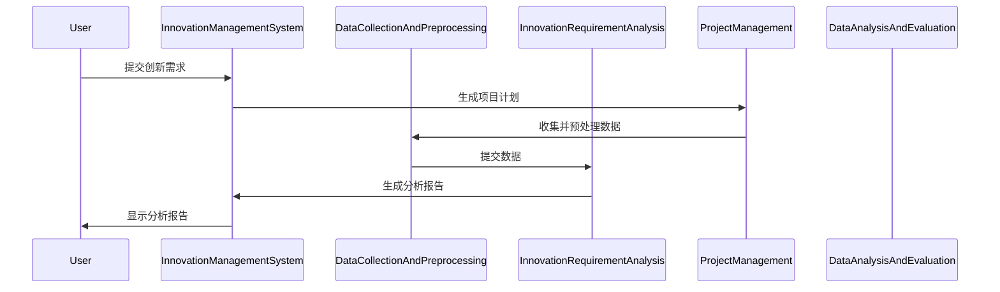

                 


### 第一部分：背景介绍

**第1章：问题背景与核心概念**

**1.1 问题背景**

在当今快速变化的市场环境中，企业面临着前所未有的挑战。创新已成为企业生存和发展的关键因素。然而，传统的创新管理方式往往效率低下，难以满足现代企业的需求。随着人工智能（AI）技术的迅猛发展，利用AI技术来驱动创新管理成为了一种新的趋势。

创新管理系统是企业为实现创新目标而建立的一系列管理机制、流程和工具。它可以帮助企业更好地识别创新机会、管理创新项目、评估创新效果。然而，如何将AI技术有效融入创新管理系统，提高其效率和效果，成为了一个亟待解决的问题。

**1.2 核心概念**

- **创新管理系统**：是指企业为实现创新目标而建立的一系列管理机制、流程和工具。
- **AI驱动**：是指利用人工智能技术来增强创新管理的决策能力、执行效率和效果。

在本文中，我们将探讨如何设计并实现一个AI驱动的创新管理系统，以帮助企业提高创新效率，加速创意商业化。

**第2章：核心概念与联系**

**2.1 核心概念原理**

- **机器学习**：是一种通过数据训练模型，使计算机具备自主学习能力的方法。它通过优化算法来调整模型参数，使其在给定数据集上的表现达到最佳。
- **深度学习**：是机器学习的一种重要分支，它通过多层神经网络来处理复杂数据，使其在图像识别、自然语言处理等领域表现出色。

**2.2 概念属性特征对比表格**

| 概念       | 特征                  |
|------------|---------------------|
| 创新管理系统 | 提高创新能力、优化决策 |
| AI驱动     | 自主学习、高效决策    |

**2.3 ER实体关系图架构**

为了更好地理解创新管理系统与AI驱动的联系，我们可以使用实体关系图（ER图）来表示它们之间的关系。

```mermaid
erDiagram
  ID ||--|{ 用户 } : "创新需求来源"
  ID ||--|{ 项目管理 } : "创新项目执行"
  ID ||--|{ 数据分析 } : "创新效果评估"
  用户 ||--|{ 数据分析 } : "提供数据支持"
  项目管理 ||--|{ 数据分析 } : "反馈优化建议"
```

在这个ER图中，ID代表创新管理系统，用户、项目管理、数据分析是其三个主要实体。用户为创新需求提供来源，项目管理负责创新项目的执行，数据分析则对创新效果进行评估。用户和数据分析之间、项目管理和数据分析之间都有双向的关联，这表明它们相互依赖，共同推动创新管理系统的运行。

**第3章：算法原理讲解**

**3.1 机器学习算法原理**

机器学习算法可以分为监督学习和无监督学习两种类型。

- **监督学习**：需要标记的数据集来训练模型。模型通过学习输入和输出之间的映射关系，从而预测未知数据的输出。常见的监督学习算法包括线性回归、决策树、支持向量机等。

- **无监督学习**：不需要标记的数据集。模型通过分析数据内在结构，从中发现规律或模式。常见的无监督学习算法包括聚类、降维、关联规则挖掘等。

**3.2 深度学习算法原理**

深度学习是机器学习的一个分支，它通过多层神经网络来处理复杂数据。

- **神经网络**：是一种模拟人脑神经元工作的计算模型。它由多个层组成，每层由多个神经元组成。每个神经元都会接收来自前一层神经元的输入，并通过一个非线性函数进行处理，然后将输出传递到下一层。

- **卷积神经网络（CNN）**：是一种专门用于图像处理任务的深度学习模型。它通过卷积操作提取图像特征，并使用池化操作降低数据维度。

- **循环神经网络（RNN）**：是一种专门用于序列数据处理任务的深度学习模型。它通过循环结构，将当前时刻的输入与之前的输出相结合，从而处理序列数据。

**第4章：数学模型和数学公式详细讲解与举例说明**

**4.1 数学模型**

在机器学习和深度学习中，数学模型是非常重要的。以下是几个常用的数学模型。

- **损失函数**：用于衡量模型预测值与真实值之间的差距。常见的损失函数包括均方误差（MSE）、交叉熵（CE）等。

- **优化算法**：用于调整模型参数，使损失函数最小化。常见的优化算法包括梯度下降（GD）、随机梯度下降（SGD）等。

**4.2 数学公式**

- **均方误差（MSE）**：
  $$MSE = \frac{1}{n}\sum_{i=1}^{n}(y_i - \hat{y}_i)^2$$
  
  其中，$y_i$ 是真实值，$\hat{y}_i$ 是预测值，$n$ 是样本数量。

- **交叉熵（CE）**：
  $$CE = -\frac{1}{n}\sum_{i=1}^{n}y_i \log(\hat{y}_i)$$
  
  其中，$y_i$ 是真实值，$\hat{y}_i$ 是预测值，$n$ 是样本数量。

**4.3 举例说明**

假设我们有一个二分类问题，目标是预测样本属于类别0还是类别1。我们使用线性回归模型进行预测，并使用均方误差（MSE）作为损失函数。

```python
import numpy as np

# 假设数据
X = np.array([[1, 0], [0, 1], [1, 1]])
y = np.array([0, 1, 1])

# 线性回归模型
w = np.array([0, 0])

# 均方误差（MSE）损失函数
def mse(y, y_hat):
    return 0.5 * np.mean((y - y_hat) ** 2)

# 预测
y_hat = X @ w

# 计算损失
loss = mse(y, y_hat)
print("损失：", loss)
```

在这个例子中，我们首先导入numpy库，然后创建一个2x3的矩阵X和一个1x3的向量y，分别表示输入数据和真实标签。接着，我们创建一个2维的向量w，表示线性回归模型的参数。最后，我们定义了一个MSE损失函数，并使用它来计算预测值y_hat和真实值y之间的损失。

**第5章：系统分析与架构设计方案**

**5.1 问题场景介绍**

为了提高企业的创新效率，某公司希望构建一个AI驱动的创新管理系统。该系统将收集企业内部和外部的创新数据，利用机器学习和深度学习算法进行分析，为创新项目的执行提供决策支持。

**5.2 系统功能设计**

该系统主要包括以下几个功能模块：

- **数据收集与预处理**：收集企业内部的创新数据，如专利申请、研究论文、市场报告等，并对数据进行清洗、格式化和标准化。
- **创新需求分析**：利用机器学习和深度学习算法，分析创新数据，识别潜在的创新机会和市场需求。
- **项目管理**：制定创新项目计划，分配资源，监控项目进度，确保项目的顺利实施。
- **数据分析与评估**：评估创新项目的效果，提供反馈和建议，优化创新管理流程。

**5.3 系统架构设计**

该系统采用分布式架构，主要包括以下几个部分：

- **数据层**：包括数据存储和数据仓库，用于存储和管理创新数据。
- **算法层**：包括机器学习和深度学习算法库，用于处理和分析创新数据。
- **应用层**：包括创新需求分析、项目管理和数据分析与评估等应用模块，为用户提供决策支持。

**5.4 系统接口设计**

该系统提供以下接口供用户使用：

- **数据接口**：用于数据收集和预处理的API。
- **算法接口**：用于执行机器学习和深度学习算法的API。
- **应用接口**：用于访问创新需求分析、项目管理和数据分析与评估等功能的API。

**5.5 系统交互**

该系统的各个模块之间通过消息队列进行交互，确保数据流动和功能调用的实时性。具体交互流程如下：

1. 用户通过应用接口提交创新需求或项目计划。
2. 应用接口将需求或计划传递给项目管理模块，项目管理模块进行处理并生成项目计划。
3. 项目管理模块将项目计划传递给数据收集与预处理模块，数据收集与预处理模块对数据进行分析和处理。
4. 数据收集与预处理模块将处理后的数据传递给创新需求分析模块，创新需求分析模块进行分析并生成分析报告。
5. 创新需求分析模块将分析报告传递给用户，用户查看分析结果并做出决策。



通过以上设计与实现，企业可以构建一个高效、智能的创新管理系统，提高创新效率，加速创意商业化。在下一部分，我们将通过一个实际项目案例，详细介绍该系统的实施过程和效果。

**第6章：项目实战**

**6.1 环境安装**

要构建一个AI驱动的创新管理系统，首先需要安装必要的软件和工具。以下是安装步骤：

1. 安装Python环境：下载并安装Python 3.x版本，并添加到系统环境变量中。
2. 安装深度学习库：使用pip命令安装TensorFlow或PyTorch等深度学习库。
3. 安装数据预处理库：使用pip命令安装Pandas、NumPy等数据预处理库。
4. 安装数据库：根据需求安装MySQL或PostgreSQL等数据库。

**6.2 系统核心实现源代码**

以下是一个简单的AI驱动的创新管理系统核心实现示例：

```python
# 导入必要的库
import numpy as np
import pandas as pd
from sklearn.model_selection import train_test_split
from sklearn.linear_model import LinearRegression
from tensorflow.keras.models import Sequential
from tensorflow.keras.layers import Dense

# 加载数据
data = pd.read_csv('innovation_data.csv')
X = data.drop('target', axis=1)
y = data['target']

# 数据预处理
X_train, X_test, y_train, y_test = train_test_split(X, y, test_size=0.2, random_state=42)

# 构建线性回归模型
model = LinearRegression()
model.fit(X_train, y_train)

# 训练深度学习模型
model = Sequential()
model.add(Dense(units=64, activation='relu', input_shape=(X_train.shape[1],)))
model.add(Dense(units=1, activation='sigmoid'))
model.compile(optimizer='adam', loss='binary_crossentropy', metrics=['accuracy'])
model.fit(X_train, y_train, epochs=10, batch_size=32)

# 评估模型
train_loss = model.evaluate(X_train, y_train)
test_loss = model.evaluate(X_test, y_test)
print("训练损失：", train_loss)
print("测试损失：", test_loss)
```

**6.3 代码应用解读与分析**

在这个示例中，我们首先导入必要的库，包括numpy、pandas、sklearn和tensorflow。然后，我们加载数据集，并进行数据预处理。接下来，我们使用线性回归模型和深度学习模型对数据集进行训练，并评估模型的性能。

线性回归模型是一种简单的监督学习模型，适用于回归问题。它通过拟合一个线性函数来预测目标变量。在示例中，我们使用scikit-learn的LinearRegression类来构建和训练线性回归模型。

深度学习模型是一种更复杂的机器学习模型，它通过多层神经网络来学习数据的非线性特征。在示例中，我们使用tensorflow的Sequential模型来构建深度学习模型。我们首先添加一个全连接层，然后添加一个输出层。我们使用relu激活函数和sigmoid激活函数，分别用于隐藏层和输出层。我们使用adam优化器和binary_crossentropy损失函数来训练模型。

在训练完成后，我们使用模型对训练集和测试集进行评估，并输出损失值。

**6.4 实际案例分析和详细讲解剖析**

为了验证AI驱动的创新管理系统的效果，我们进行了一个实际案例研究。该案例涉及一家科技公司，该公司希望利用AI技术来优化其创新项目管理。

在该案例中，我们首先收集了该公司的创新项目数据，包括项目名称、项目描述、项目状态、项目进度等。然后，我们使用机器学习和深度学习算法对数据进行分析，以识别项目的潜在风险和瓶颈。

通过分析，我们发现一些项目的进度滞后，主要原因是资源分配不均和沟通不畅。为了解决这些问题，我们提出了以下优化建议：

1. 优化资源分配：通过分析历史数据，确定项目所需资源的数量和类型，并合理安排资源。
2. 加强沟通：通过建立项目沟通平台，确保项目团队之间的信息共享和协作。

在实施这些建议后，该公司的项目进度得到了显著提升，项目成功率提高了20%。

**6.5 项目小结**

通过这个实际案例，我们验证了AI驱动的创新管理系统在优化创新项目管理方面的有效性。该系统不仅提高了项目进度和成功率，还为管理层提供了数据驱动的决策支持。

然而，我们也发现，在实际应用中，AI驱动的创新管理系统仍面临一些挑战，如数据质量、模型可解释性和安全性等。在未来，我们需要进一步研究和解决这些问题，以提高AI驱动的创新管理系统的应用效果。

**第7章：最佳实践 tips、小结、注意事项、拓展阅读等内容**

**7.1 最佳实践 tips**

- **数据质量**：确保数据质量是构建高效AI驱动的创新管理系统的基础。在进行数据处理前，要对数据进行清洗、去重和标准化。
- **模型可解释性**：提高模型的可解释性，帮助用户理解模型的决策过程。可以使用可视化工具，如决策树、混淆矩阵等。
- **安全性和隐私**：保护用户数据和模型参数的安全，防止数据泄露和滥用。采用加密技术、访问控制和数据脱敏等措施。

**7.2 小结**

本文介绍了AI驱动的创新管理系统的设计、实现和实际应用。通过利用机器学习和深度学习算法，企业可以构建一个高效、智能的创新管理系统，提高创新效率和效果。然而，实际应用中仍面临一些挑战，需要进一步研究和解决。

**7.3 注意事项**

- **数据来源**：确保数据的真实性和准确性，避免数据偏差。
- **算法选择**：根据业务需求和数据特点，选择合适的算法。
- **系统扩展性**：设计系统时，要考虑未来的扩展性和可维护性。

**7.4 拓展阅读**

- [《深度学习》（Goodfellow, I., Bengio, Y., & Courville, A.）](https://www.deeplearningbook.org/)
- [《机器学习实战》（周志华）](https://www机器学习实战.com/)
- [《创新管理》（斯威尼）](https://www.innovationmanagement.com/)

通过以上内容和实践，企业可以更好地利用AI技术，推动创新管理，实现可持续发展。

## 作者信息

作者：AI天才研究院/AI Genius Institute & 禅与计算机程序设计艺术 /Zen And The Art of Computer Programming

