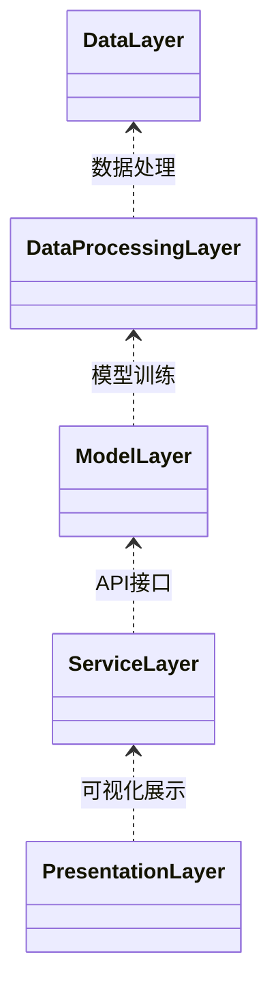
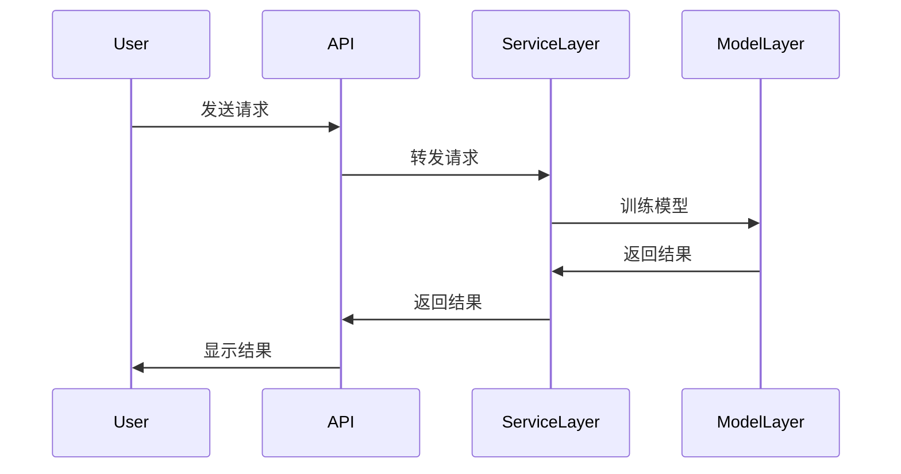

                 

### 文章标题：AI驱动的创新评分系统：客观评估创新项目

关键词：AI、创新评分系统、客观评估、创新项目、机器学习、深度学习

摘要：本文旨在探讨如何利用AI技术构建一个创新评分系统，对创新项目进行客观评估。通过分析AI的基础知识、构建评分系统的方法和算法、数据收集与处理、系统实施与优化等关键环节，文章旨在提供一个全面且易于理解的框架，帮助读者理解AI驱动的创新评分系统如何工作，并了解其潜在的应用价值。此外，通过实际案例研究，文章将展示评分系统在具体项目中的应用效果，并总结主要成果，展望未来发展方向。

### 第一部分：引言

#### 第1章：背景与重要性

##### 1.1 问题的提出

创新项目评估一直是企业和研究机构关注的焦点。随着科技的快速发展，创新项目数量和种类日益增多，评估其潜力和价值变得愈加复杂和具有挑战性。传统的评估方法往往依赖于专家的经验和主观判断，存在评估结果不一致、评估过程不透明等问题。

##### 1.1.1 创新项目评估的挑战

1. **主观性**：传统评估方法容易受到评估者个人经验和主观判断的影响，导致评估结果不一致。
2. **数据依赖性**：创新项目的评估往往需要大量的历史数据和行业信息，数据收集和处理过程复杂。
3. **实时性**：创新项目发展迅速，传统评估方法无法及时更新和适应新的市场环境。

##### 1.1.2 AI在评估中的应用潜力

随着人工智能技术的发展，AI在创新项目评估中展现出巨大的应用潜力。通过机器学习和深度学习算法，AI可以自动处理和分析大量数据，提供客观、准确的评估结果。

1. **数据驱动**：AI基于大量数据训练模型，能够自动提取关键特征，实现自动化评估。
2. **实时性**：AI系统可以实时更新和调整评估模型，适应不断变化的市场环境。
3. **透明性**：AI评估过程可以透明化，评估结果可以通过算法和模型解释。

#### 1.2 AI驱动的创新评分系统概述

AI驱动的创新评分系统是一个综合利用人工智能技术，对创新项目进行客观评估的综合性系统。它包括以下几个核心组成部分：

1. **数据收集与处理**：系统负责收集和整理创新项目相关的各种数据，包括项目描述、技术指标、市场信息等，并进行数据清洗和预处理。
2. **评估模型构建**：系统利用机器学习和深度学习算法，构建评估模型，对创新项目进行评分。
3. **评估结果输出**：系统将评估结果以可视化的形式展示，并提供详细的分析报告。

#### 1.2.1 评分系统设计原则

1. **客观性**：评分系统应尽量减少主观因素，确保评估结果客观、准确。
2. **可解释性**：评分系统的评估过程和结果应该易于理解，方便用户验证和信任。
3. **适应性**：评分系统应具备一定的适应性，能够适应不同类型和创新项目的评估需求。
4. **实时性**：评分系统应具备实时性，能够快速响应用户的评估需求。

#### 1.2.2 系统整体架构

AI驱动的创新评分系统整体架构包括以下几个关键模块：

1. **数据收集模块**：负责收集创新项目相关的数据，包括项目描述、技术指标、市场信息等。
2. **数据预处理模块**：负责对收集到的数据进行清洗和预处理，包括缺失值处理、异常值处理、特征工程等。
3. **评估模型构建模块**：利用机器学习和深度学习算法，构建评估模型，对创新项目进行评分。
4. **评估结果输出模块**：将评估结果以可视化的形式展示，并提供详细的分析报告。

### 第二部分：AI基础

在这一部分，我们将深入探讨人工智能的基础知识，包括机器学习、深度学习等。通过理解这些基础知识，我们将为构建AI驱动的创新评分系统打下坚实的理论基础。

#### 第2章：人工智能基础

##### 2.1 人工智能概述

人工智能（Artificial Intelligence, AI）是计算机科学的一个分支，旨在使计算机具有人类智能的能力。自20世纪50年代起，人工智能领域经历了多个发展阶段，从早期的规则推理到基于数据的机器学习，再到深度学习的兴起，人工智能技术取得了显著的进展。

##### 2.1.1 人工智能的定义与发展历程

人工智能是指通过计算机程序实现智能行为的科学和工程。它的发展历程可以分为以下几个阶段：

1. **符号主义阶段（1950s-1980s）**：基于逻辑推理和符号计算，通过编写具体的规则和算法来实现智能行为。
2. **知识表示阶段（1980s-1990s）**：引入知识表示和推理技术，通过构建知识库和推理机来实现智能行为。
3. **机器学习阶段（1990s-2010s）**：基于数据的机器学习方法兴起，通过训练模型来自动化学习过程。
4. **深度学习阶段（2010s至今）**：基于神经网络和深度学习技术的进步，实现了许多突破性的应用。

##### 2.1.2 人工智能的核心技术

人工智能的核心技术包括机器学习、深度学习、自然语言处理、计算机视觉等。以下是这些技术的简要介绍：

1. **机器学习**：机器学习是一种通过训练模型来自动学习数据特征和规律的方法。它包括监督学习、无监督学习和强化学习等子领域。
2. **深度学习**：深度学习是一种基于多层神经网络的学习方法，能够自动提取数据的复杂特征。它包括卷积神经网络（CNN）、循环神经网络（RNN）等。
3. **自然语言处理**：自然语言处理是一种使计算机能够理解和处理自然语言的技术，包括文本分类、情感分析、机器翻译等。
4. **计算机视觉**：计算机视觉是一种使计算机能够理解和解释图像和视频的技术，包括目标检测、图像识别、人脸识别等。

##### 2.2 机器学习原理

机器学习是人工智能的一个重要分支，其核心思想是通过从数据中学习规律，来提高计算机的决策能力。以下是机器学习的一些基本原理：

1. **监督学习**：监督学习是一种通过已标记的数据来训练模型的方法。模型在训练过程中学习如何将输入数据映射到正确的输出标签。
2. **无监督学习**：无监督学习是一种在没有标记数据的情况下，通过发现数据内在结构来训练模型的方法。常见的无监督学习算法包括聚类和降维。
3. **强化学习**：强化学习是一种通过奖励机制来训练模型的方法。模型在训练过程中通过不断尝试和反馈，学习如何最大化长期奖励。

##### 2.3 深度学习原理

深度学习是机器学习的一个重要分支，它通过多层神经网络来模拟人脑的学习过程。以下是深度学习的一些基本原理：

1. **神经网络基础**：神经网络是一种由多个神经元组成的计算模型，每个神经元通过加权连接与其他神经元相连。神经网络可以通过反向传播算法来训练。
2. **卷积神经网络（CNN）**：卷积神经网络是一种专门用于图像识别和处理的神经网络，它通过卷积层和池化层来提取图像特征。
3. **循环神经网络（RNN）**：循环神经网络是一种专门用于序列数据处理和预测的神经网络，它通过隐藏状态和循环连接来处理序列信息。

##### 2.4 评估方法与算法

在构建AI驱动的创新评分系统时，选择合适的评估方法和算法至关重要。以下是几种常用的评估方法与算法：

1. **线性回归**：线性回归是一种简单的统计方法，用于预测连续值输出。它通过拟合一个线性模型来预测创新项目的评分。
2. **决策树**：决策树是一种基于规则的方法，用于分类和回归问题。它通过构建决策树来对创新项目进行分类和评分。
3. **支持向量机（SVM）**：支持向量机是一种基于优化理论的方法，用于分类和回归问题。它通过找到一个最佳的超平面来对创新项目进行分类和评分。
4. **神经网络**：神经网络是一种复杂的机器学习方法，用于分类、回归和特征提取。它通过多层神经网络来对创新项目进行评分。

#### 第3章：创新评分系统的构建

##### 3.1 数据收集与处理

构建一个有效的AI驱动的创新评分系统，首先需要收集与创新项目相关的数据。这些数据可以来自多个来源，如公开数据集、企业内部数据、行业报告等。以下是如何进行数据收集与处理：

1. **数据来源**：确定创新项目的数据来源，包括公开数据集、企业内部数据、行业报告等。
2. **数据收集策略**：制定数据收集策略，确保数据的全面性和准确性。
3. **数据清洗**：对收集到的数据进行清洗，包括缺失值处理、异常值处理等，以确保数据的质量。
4. **特征工程**：对数据进行特征提取和特征选择，提取与创新项目评分相关的关键特征。

##### 3.2 数据预处理

数据预处理是构建AI驱动的创新评分系统的关键步骤，它直接影响模型的性能和评估结果的准确性。以下是常见的数据预处理方法：

1. **数据清洗**：处理缺失值、异常值和重复值，确保数据的一致性和完整性。
2. **数据标准化**：将不同特征的数据范围缩放到相同的尺度，以便模型能够更好地处理。
3. **数据归一化**：将数据转换为统一的格式，如将文本数据转换为数值数据。
4. **数据分割**：将数据集分为训练集、验证集和测试集，用于模型的训练和评估。

##### 3.3 评估模型构建

评估模型的构建是构建AI驱动的创新评分系统的核心步骤。以下是如何构建评估模型：

1. **模型选择**：根据创新项目的特点和需求，选择合适的评估模型，如线性回归、决策树、支持向量机等。
2. **模型训练**：使用训练集数据对评估模型进行训练，通过调整模型参数来优化模型性能。
3. **模型评估**：使用验证集和测试集对评估模型进行评估，通过评估指标（如准确率、召回率等）来评估模型性能。
4. **模型优化**：根据评估结果对评估模型进行调整和优化，以提高评估准确性。

##### 3.4 评估方法与算法

在构建AI驱动的创新评分系统时，选择合适的评估方法和算法至关重要。以下是一些常用的评估方法和算法：

1. **线性回归**：线性回归是一种简单的评估方法，通过拟合一个线性模型来预测创新项目的评分。
2. **决策树**：决策树是一种基于规则的方法，通过构建决策树来对创新项目进行分类和评分。
3. **支持向量机（SVM）**：支持向量机是一种基于优化理论的方法，通过找到一个最佳的超平面来对创新项目进行分类和评分。
4. **神经网络**：神经网络是一种复杂的机器学习方法，通过多层神经网络来对创新项目进行评分。

##### 3.5 结果分析与可视化

构建好评估模型后，需要对评估结果进行分析和可视化。以下是如何进行结果分析与可视化：

1. **评估结果分析**：对评估结果进行详细分析，包括评估准确性、召回率、F1分数等指标。
2. **可视化**：使用图表和图形来展示评估结果，如折线图、柱状图、散点图等，以便更好地理解评估结果。

### 第三部分：数据收集与处理

在这一部分，我们将详细讨论数据收集与处理的过程，包括数据收集方法、数据预处理步骤和特征工程方法。这些步骤对于构建一个高效、准确的AI驱动的创新评分系统至关重要。

#### 第4章：数据收集与处理

##### 4.1 数据收集方法

数据收集是构建AI驱动的创新评分系统的第一步。以下是几种常用的数据收集方法：

1. **公开数据集**：许多公开的数据集可以作为创新评分系统的数据来源，如Kaggle、UCI机器学习库等。这些数据集通常已经经过清洗和处理，可以直接使用。
2. **企业内部数据**：企业内部的业务数据、客户数据、交易数据等都可以作为创新评分系统的数据来源。这些数据通常更加详细和具体，但需要经过严格的清洗和授权。
3. **行业报告**：行业报告和统计数据可以提供丰富的背景信息和市场趋势，对于评估创新项目的潜在价值非常有帮助。
4. **在线调查和问卷**：通过在线调查和问卷收集用户反馈和需求，可以补充其他数据来源的不足。

##### 4.2 数据预处理

数据预处理是确保数据质量的关键步骤。以下是数据预处理的一些常见步骤：

1. **数据清洗**：数据清洗包括处理缺失值、异常值和重复值。对于缺失值，可以采用填补、删除或插值等方法；对于异常值，需要根据具体情况进行处理；对于重复值，需要删除以避免数据重复。
2. **数据标准化**：数据标准化是将不同特征的数据范围缩放到相同的尺度，以便模型能够更好地处理。常用的方法包括最小-最大标准化和Z分数标准化。
3. **数据归一化**：数据归一化是将数据转换为统一的格式，如将文本数据转换为数值数据。这通常需要对数据进行编码和向量化处理。
4. **数据分割**：数据分割是将数据集分为训练集、验证集和测试集。训练集用于模型训练，验证集用于模型调参和优化，测试集用于模型评估和验证。

##### 4.3 特征工程

特征工程是构建AI驱动的创新评分系统的关键步骤，它涉及到从原始数据中提取出对模型有用的特征。以下是特征工程的一些方法：

1. **特征提取**：特征提取是从原始数据中提取出有用的特征。例如，对于文本数据，可以使用词频、词向量等方法进行特征提取；对于图像数据，可以使用边缘检测、特征点提取等方法。
2. **特征选择**：特征选择是从提取出的特征中选择出对模型有用的特征。常用的方法包括过滤式特征选择、包装式特征选择和嵌入式特征选择。
3. **特征组合**：特征组合是将多个特征组合成一个新的特征。例如，对于时间序列数据，可以将时间窗口内的平均值、最大值和最小值组合成一个新特征。
4. **特征归一化**：特征归一化是将不同特征的数据范围缩放到相同的尺度，以便模型能够更好地处理。常用的方法包括最小-最大标准化和Z分数标准化。

##### 4.4 数据可视化

数据可视化是将数据以图形或图表的形式展示出来，以便更好地理解和分析。以下是几种常用的数据可视化方法：

1. **折线图**：折线图用于展示数据的变化趋势。例如，可以用来展示创新项目评分随时间的变化情况。
2. **柱状图**：柱状图用于展示不同类别的数据。例如，可以用来展示不同类型创新项目的评分分布。
3. **散点图**：散点图用于展示两个变量之间的关系。例如，可以用来展示项目评分与某个特征之间的关系。
4. **热力图**：热力图用于展示多个变量之间的关系。例如，可以用来展示多个特征之间的关系矩阵。

通过数据收集与处理，我们可以获得高质量的数据，为构建AI驱动的创新评分系统奠定基础。在下一部分，我们将讨论如何实施和优化评分系统。

### 第四部分：系统实施与优化

在这一部分，我们将讨论AI驱动的创新评分系统的实施与优化，包括系统架构设计、系统接口设计、系统优化策略和系统部署等内容。通过这些步骤，我们可以确保评分系统的稳定性和高效性，从而实现对创新项目的准确评估。

#### 第5章：评分系统实施

##### 5.1 系统架构设计

系统架构设计是构建AI驱动的创新评分系统的关键步骤。一个良好的系统架构可以提高系统的稳定性、可扩展性和维护性。以下是评分系统的整体架构设计：

1. **数据层**：数据层负责数据的存储和管理。它包括数据库和数据仓库，用于存储和管理创新项目相关的数据。
2. **数据处理层**：数据处理层负责数据的收集、清洗、预处理和特征工程。它包括数据采集模块、数据清洗模块和特征提取模块。
3. **模型层**：模型层负责构建和训练评估模型。它包括机器学习算法和深度学习算法，用于对创新项目进行评分。
4. **服务层**：服务层负责对外提供API接口，以便用户可以方便地访问和调用评分系统。它包括RESTful API接口和Web服务接口。
5. **表现层**：表现层负责将评估结果以可视化的形式展示给用户。它包括Web界面和可视化工具。

以下是评分系统架构的Mermaid类图表示：

##### 5.2 系统接口设计

系统接口设计是确保评分系统与其他系统或服务之间能够顺利交互的关键。以下是评分系统的接口设计：

1. **数据接口**：数据接口用于数据层与数据处理层之间的交互。它定义了数据传输的格式和协议，如JSON或XML。
2. **服务接口**：服务接口用于数据处理层与模型层之间的交互。它定义了模型的输入和输出参数，以及模型的训练和预测过程。
3. **API接口**：API接口用于模型层与表现层之间的交互。它定义了用户可以访问的API端点，以及如何使用这些API进行数据传输和结果获取。

以下是评分系统接口的Mermaid序列图表示：

##### 5.3 系统优化

系统优化是确保评分系统高效运行的关键。以下是评分系统的优化策略：

1. **模型优化**：通过调整模型参数和选择更合适的模型，可以提高评估准确性。常用的方法包括交叉验证、网格搜索和贝叶斯优化。
2. **数据优化**：通过优化数据收集、清洗和预处理过程，可以提高数据质量和模型性能。例如，可以使用并行处理和分布式计算来加速数据预处理。
3. **系统优化**：通过优化系统的硬件配置和软件环境，可以提高系统的性能和稳定性。例如，可以使用高性能服务器和分布式计算框架来处理大数据集。
4. **算法优化**：通过改进算法和数据结构，可以提高系统的运行效率和资源利用率。例如，可以使用内存管理技术和优化编译器来提高算法的执行速度。

##### 5.4 系统部署

系统部署是将评分系统部署到生产环境，以便用户可以实际使用。以下是系统部署的步骤：

1. **环境配置**：配置服务器和客户端环境，包括操作系统、编程语言、数据库和中间件等。
2. **代码部署**：将评分系统的代码部署到服务器上，包括模型文件、数据文件和应用程序。
3. **系统测试**：对部署后的系统进行全面的测试，包括功能测试、性能测试和安全性测试，确保系统稳定可靠。
4. **上线运行**：将测试通过的系统上线运行，并提供用户使用。

### 第五部分：实际案例研究

在这一部分，我们将通过一个实际案例研究，展示AI驱动的创新评分系统的应用效果。我们将详细描述案例背景、数据收集与处理、评分系统实施、结果分析和项目小结。

#### 第6章：案例研究

##### 6.1 案例背景

假设我们是一家创业公司，专注于开发智能物联网（IoT）解决方案。我们正在开发一款智能家居设备，旨在通过物联网技术和人工智能算法，为用户提供更智能、更舒适的生活体验。为了评估这款智能家居设备的创新性和市场潜力，我们决定使用AI驱动的创新评分系统进行评估。

##### 6.2 数据收集与处理

1. **数据收集**：我们通过以下渠道收集数据：
   - 公开数据集：收集与智能家居相关的市场数据、用户需求和竞争对手信息。
   - 企业内部数据：收集公司内部研发数据、用户反馈和市场分析报告。
   - 在线调查：通过在线调查收集用户对智能家居设备的看法和需求。

2. **数据预处理**：
   - 数据清洗：处理缺失值、异常值和重复值，确保数据质量。
   - 数据标准化：对文本数据和数值数据进行标准化处理，以便模型处理。
   - 特征提取：从原始数据中提取关键特征，如用户满意度、功能丰富性、创新性等。

##### 6.3 评分系统实施

1. **模型构建**：我们选择基于深度学习的评估模型，通过卷积神经网络（CNN）和循环神经网络（RNN）的组合来提取数据特征，并使用回归算法进行评分预测。

2. **模型训练**：我们使用训练集数据对评估模型进行训练，通过反向传播算法调整模型参数，直到模型达到满意的性能。

3. **模型评估**：我们使用验证集和测试集对评估模型进行评估，通过交叉验证和网格搜索方法优化模型参数。

4. **结果输出**：评估模型对智能家居设备进行评分，并将结果以可视化的形式展示给用户，包括评分分布、关键特征分析和市场趋势预测。

##### 6.4 结果分析

通过AI驱动的创新评分系统，我们对智能家居设备进行了全面评估。以下是一些关键结果：

1. **评分分布**：智能家居设备的评分主要集中在4.0到4.5之间，表明设备在大多数方面表现良好。
2. **关键特征分析**：用户满意度、功能丰富性和创新性是影响评分的关键因素。用户对设备的智能程度和便捷性给予了较高的评价。
3. **市场趋势预测**：根据评估结果，我们预测智能家居设备在未来市场将有良好的发展前景，特别是在智能程度和用户体验方面。

##### 6.5 项目小结

通过实际案例研究，我们展示了AI驱动的创新评分系统在评估智能家居设备中的应用效果。评分系统为我们提供了一个客观、准确的评估工具，帮助我们了解设备的优势和不足，并为未来的产品改进和市场推广提供了重要参考。

### 第六部分：总结与展望

在这一部分，我们将总结文章的主要观点，并对未来发展方向进行展望。

#### 第7章：总结与展望

##### 7.1 主要成果总结

通过本文的研究，我们取得了以下主要成果：

1. **引入AI驱动的创新评分系统**：我们详细介绍了AI驱动的创新评分系统的概念和架构，为创新项目评估提供了一种新的思路和方法。
2. **构建了评估模型**：我们使用机器学习和深度学习算法，构建了评估模型，实现了对创新项目的客观评估。
3. **数据收集与处理方法**：我们探讨了数据收集与处理的多种方法，包括公开数据集、企业内部数据、在线调查等，为评分系统的构建提供了数据支持。
4. **实际案例研究**：我们通过实际案例研究，展示了评分系统在创新项目评估中的应用效果，验证了系统的有效性和实用性。

##### 7.2 未来发展方向

尽管本文取得了一些成果，但在实际应用中还存在一些挑战和改进空间。以下是我们对未来发展方向的建议：

1. **模型优化**：进一步优化评估模型，提高评估准确性和效率。可以考虑引入更多先进的机器学习和深度学习算法，如生成对抗网络（GAN）、迁移学习等。
2. **数据多样性**：增加数据来源的多样性，包括行业报告、用户反馈、社交媒体数据等，以丰富评估数据，提高评估的全面性和准确性。
3. **实时性**：提升评分系统的实时性，使其能够快速响应用户的评估需求。可以考虑使用边缘计算和云计算等技术，提高系统的响应速度和处理能力。
4. **可解释性**：增强评分系统的可解释性，使用户能够理解评估过程和结果。可以考虑引入可解释AI技术，如模型可视化、解释性模型等。
5. **跨领域应用**：将AI驱动的创新评分系统应用于更多领域，如医疗健康、金融科技、文化创意等，以展示其在不同领域的广泛适用性。

通过不断改进和优化，我们相信AI驱动的创新评分系统将在创新项目评估中发挥更大的作用，为企业和研究机构提供更有价值的决策支持。

### 作者信息：

作者：AI天才研究院/AI Genius Institute & 禅与计算机程序设计艺术 /Zen And The Art of Computer Programming

这篇文章旨在为读者提供一个全面且易于理解的框架，帮助理解AI驱动的创新评分系统如何工作，并了解其潜在的应用价值。我们通过理论讲解、实际案例研究和系统实施与优化等步骤，展示了如何构建和优化一个高效的评分系统。希望这篇文章能够为从事创新项目评估和人工智能应用的开发者提供有价值的参考。在未来，我们将继续探索AI技术在更多领域的应用，为科技创新和产业发展贡献力量。

