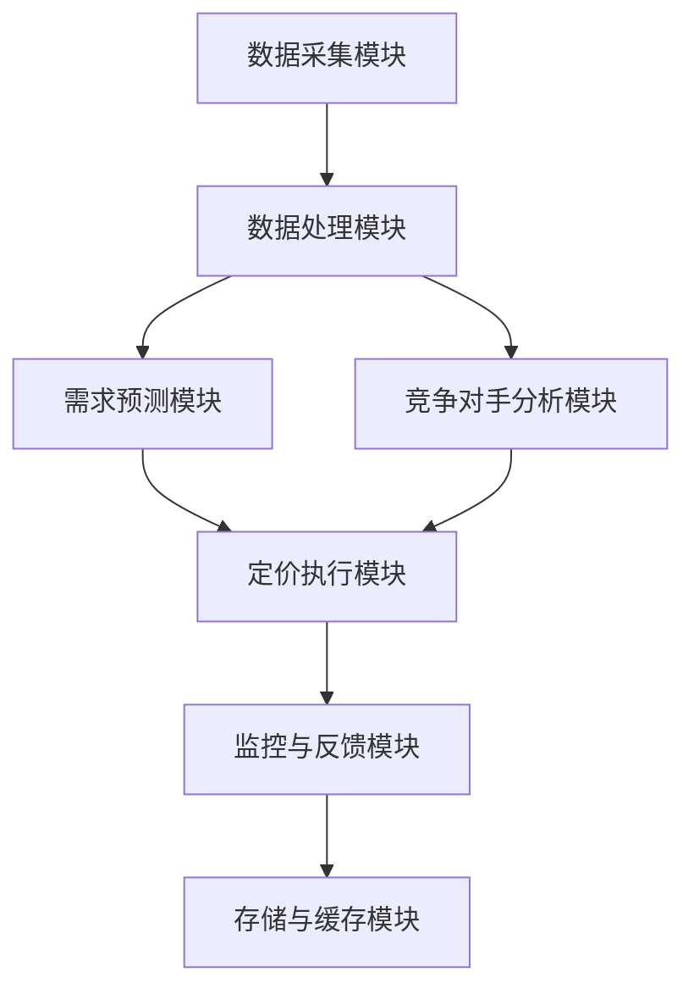
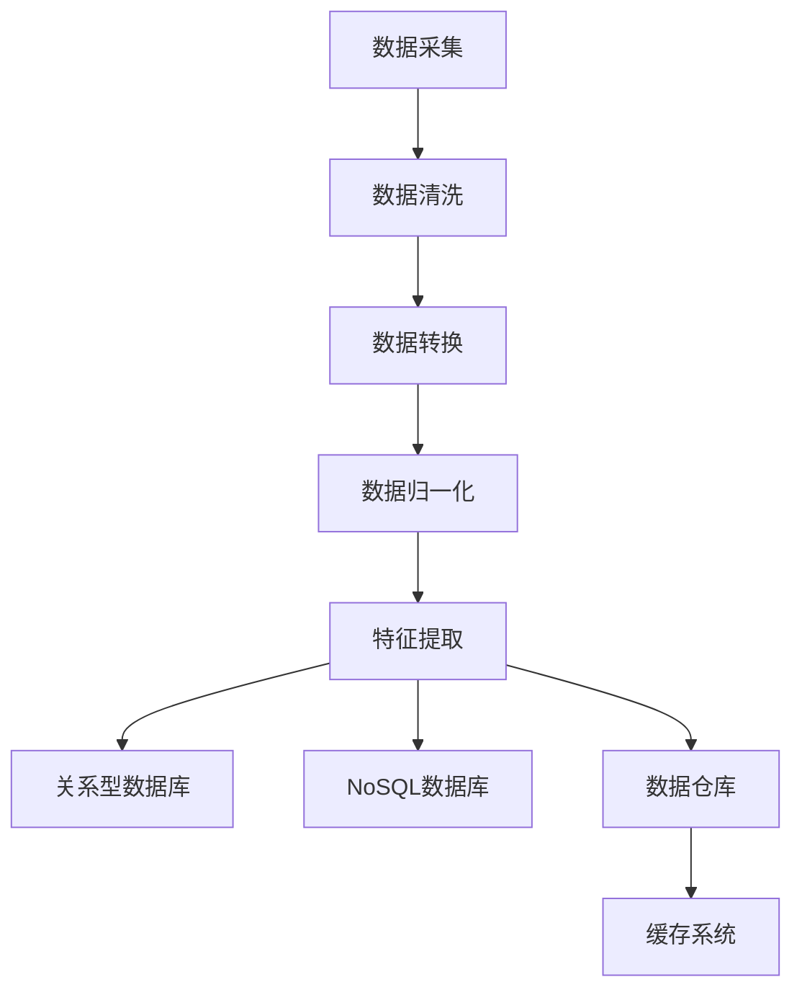
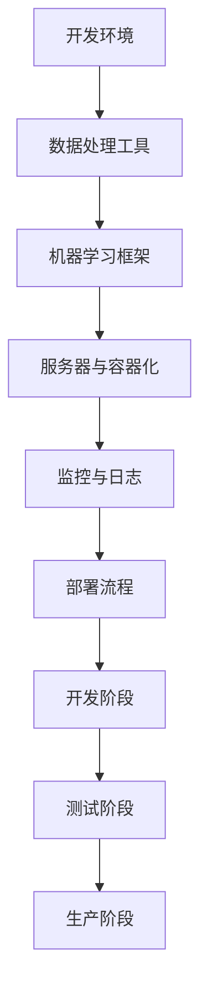

                 

### 引言与背景

随着人工智能技术的飞速发展，各行各业都在积极寻求AI技术的应用，以提高效率和竞争力。动态定价系统便是其中之一。传统的定价策略通常基于历史数据和经验，缺乏灵活性和实时性。而AI驱动的动态定价系统通过实时收集和分析市场数据，能够动态调整价格，以最大化利润或市场占有率。

#### 动态定价系统的定义与重要性

动态定价系统是一种利用机器学习和数据分析技术，实时调整产品或服务价格的系统。它通过收集大量的市场数据，如需求变化、竞争对手价格、成本变化等，利用算法分析这些数据，然后根据分析结果自动调整价格。

动态定价系统在商业运营中具有重要意义。首先，它可以显著提高利润率。通过精准地调整价格，企业可以在不同市场和不同时间段实现最大化收益。其次，它有助于提高客户满意度。动态定价系统可以确保产品始终以最合适的价格呈现给客户，从而提升客户的购买体验。此外，动态定价系统还可以帮助企业更好地应对市场竞争，通过实时调整价格策略，快速响应市场变化。

#### AI在动态定价中的应用潜力

AI技术为动态定价系统带来了巨大的潜力。首先，机器学习算法能够从海量数据中提取有价值的信息，帮助预测市场需求和竞争态势。例如，通过分析历史销售数据、季节性趋势、消费者行为等，AI算法可以预测未来某一时间段的需求量，从而制定出更合理的价格策略。

其次，AI技术可以帮助企业进行精准定价。传统的定价策略通常基于简单的成本加成或市场参考，而AI算法可以通过复杂的模型，考虑更多的因素，如产品特性、市场趋势、竞争对手策略等，制定出更科学、更合理的价格。

此外，AI技术还可以实现实时监控和调整。传统的定价策略通常需要定期进行价格调整，而AI驱动的动态定价系统可以实时监测市场数据，根据实时情况自动调整价格，从而实现更加灵活和高效的定价。

#### 动态定价系统的组成部分

一个完整的AI驱动的动态定价系统通常包括以下几个主要组成部分：

1. **数据采集模块**：负责收集各种市场数据，如销售数据、消费者行为数据、竞争对手价格等。

2. **数据处理模块**：对采集到的数据进行分析和处理，提取有价值的信息。

3. **定价模型模块**：基于处理后的数据，利用机器学习算法构建定价模型。

4. **定价执行模块**：根据定价模型，自动调整产品或服务的价格。

5. **监控与反馈模块**：实时监控定价系统的运行效果，并根据反馈进行调整和优化。

#### 动态定价系统的市场现状与发展趋势

目前，动态定价系统在多个行业已经得到广泛应用，如电子商务、旅游、航空等。许多大型企业，如亚马逊、携程等，都已经采用了AI驱动的动态定价系统。随着AI技术的不断进步，动态定价系统的应用范围将不断扩大，市场潜力巨大。

未来，随着大数据和云计算技术的普及，动态定价系统将变得更加智能化和自动化。企业可以通过更丰富的数据源和更先进的算法，实现更精准的定价策略。同时，动态定价系统也将更加注重用户体验，通过个性化的价格策略，提升客户的满意度。

总之，AI驱动的动态定价系统具有巨大的应用潜力和发展前景，它不仅能够帮助企业提高利润率，还能提升客户满意度，是企业数字化转型的关键一环。

### 动态定价系统的定义与重要性

动态定价系统是一种利用先进的人工智能技术和数据分析方法，实时调整产品或服务价格，以实现最佳利润和市场占有率的管理系统。在传统定价方法中，价格往往基于固定成本和市场份额的预测，这种方法缺乏灵活性和实时性，难以适应快速变化的市场环境。而动态定价系统则通过不断收集和分析市场数据，如消费者需求、竞争对手价格、成本变化等，动态调整价格，从而最大化企业的收益。

动态定价系统的核心在于其能够实时响应市场变化，通过精确的价格调整，提升企业的市场竞争力。例如，在电商平台上，商品价格可以根据实时销售数据、库存情况以及消费者行为进行动态调整。在旅游行业中，航空公司和酒店可以根据市场需求和季节性变化，实时调整票价和住宿价格，以最大化收益。

动态定价系统的重要性体现在以下几个方面：

1. **提高利润率**：通过精准的价格调整，企业可以在不同的市场和时间段实现最大化的收益，从而提高整体利润率。

2. **提升客户满意度**：动态定价系统能够确保产品始终以最合适的价格呈现给消费者，提升客户的购买体验和满意度。

3. **应对市场竞争**：在激烈的市场竞争中，动态定价系统可以快速响应市场变化，调整价格策略，从而保持竞争优势。

4. **优化库存管理**：通过实时监控库存和销售数据，动态定价系统可以帮助企业更有效地管理库存，减少滞销和浪费。

#### 动态定价系统的组成部分

一个完整的动态定价系统通常由以下几个关键组成部分构成：

1. **数据采集模块**：该模块负责收集各种市场数据，包括销售数据、消费者行为数据、竞争对手价格等。数据来源可以是内部数据库、外部API、社交媒体等多种渠道。

2. **数据处理模块**：收集到的数据需要进行清洗、整理和预处理，以便后续分析。该模块负责数据的清洗、转换和整合，确保数据质量。

3. **定价模型模块**：该模块基于处理后的数据，利用机器学习算法构建定价模型。常见的定价模型包括需求预测模型、成本分析模型和竞争对手分析模型。

4. **定价执行模块**：根据定价模型，自动调整产品或服务的价格。该模块负责将模型预测结果转化为实际的价格调整，可以包括价格上调、下调或保持不变。

5. **监控与反馈模块**：实时监控定价系统的运行效果，并根据反馈进行调整和优化。该模块可以收集用户反馈、销售数据和市场变化等信息，用于评估和改进定价策略。

#### 动态定价系统的市场现状与发展趋势

目前，动态定价系统已经在多个行业得到了广泛应用，尤其在电子商务、旅游、航空等行业中。许多大型企业，如亚马逊、携程、易联众等，都已经采用了AI驱动的动态定价系统，并取得了显著的效果。动态定价系统不仅帮助这些企业提高了利润率，还提升了客户满意度，增强了市场竞争力。

随着人工智能技术的不断进步和大数据、云计算技术的普及，动态定价系统的应用前景将更加广阔。未来，动态定价系统将变得更加智能化和自动化，能够处理更复杂的数据，构建更精确的定价模型，实现更高效的定价策略。同时，随着消费者对个性化体验的需求增加，动态定价系统也将更加注重用户体验，通过更加个性化的价格策略，进一步提升客户满意度。

总之，AI驱动的动态定价系统具有巨大的市场潜力和发展前景，它不仅能够帮助企业提高利润率，还能提升客户满意度，是企业数字化转型和智能化运营的关键一环。

### AI基础理论

在探讨AI驱动的动态定价系统之前，了解人工智能（AI）的基础理论是至关重要的。AI是一种模拟人类智能的技术，通过机器学习、神经网络和深度学习等方法，使计算机具备处理复杂任务、进行自主学习和决策的能力。以下将介绍机器学习、神经网络和深度学习的基本概念、原理及其在动态定价中的应用潜力。

#### 机器学习基础

机器学习（Machine Learning）是AI的核心技术之一，它通过算法使计算机能够从数据中学习，并做出预测或决策。机器学习可以分为以下几类：

1. **监督学习（Supervised Learning）**：在这种学习中，算法使用标记好的数据集来训练模型。训练完成后，模型可以对新数据进行预测。常见的监督学习算法包括线性回归、逻辑回归和决策树等。

2. **无监督学习（Unsupervised Learning）**：在这种学习中，算法没有使用标记好的数据集，而是通过探索数据中的模式或结构进行学习。常见的无监督学习算法包括聚类、降维和关联规则学习等。

3. **强化学习（Reinforcement Learning）**：在这种学习中，算法通过与环境的交互来学习最佳策略。它通过奖励机制来衡量行为的好坏，并不断调整策略以最大化长期奖励。常见的强化学习算法包括Q学习、深度Q网络（DQN）和策略梯度等。

在动态定价系统中，监督学习可以用于预测市场需求和消费者行为，而无监督学习可以用于发现市场中的未知模式和趋势。强化学习则可以帮助系统通过试错学习来优化价格调整策略。

#### 神经网络与深度学习

神经网络（Neural Networks）是一种模仿人脑结构的计算模型，通过多个神经元（节点）之间的连接进行信息处理。神经网络可以分为以下几类：

1. **前馈神经网络（Feedforward Neural Networks）**：这是最简单的一种神经网络结构，信息从输入层传递到输出层，中间没有循环。

2. **循环神经网络（Recurrent Neural Networks, RNN）**：这种网络可以处理序列数据，通过将前一时刻的信息传递到下一时刻，实现记忆功能。

3. **卷积神经网络（Convolutional Neural Networks, CNN）**：这种网络通过卷积操作和池化操作，在图像等二维数据上提取特征。

深度学习（Deep Learning）是指多层神经网络的学习。与传统的单层神经网络相比，深度学习能够更好地捕获数据中的复杂模式。深度学习的关键技术包括：

1. **深度前馈神经网络（Deep Feedforward Networks）**：通过增加隐藏层的数量，提高模型的复杂度和表现能力。

2. **深度循环神经网络（Deep RNN）**：通过增加循环神经网络的层数，提升对序列数据的处理能力。

3. **深度卷积神经网络（Deep CNN）**：通过多层卷积和池化操作，增强图像特征提取能力。

在动态定价系统中，深度学习可以用于构建复杂的需求预测模型和价格调整策略。例如，利用深度神经网络可以处理大规模、多维度的市场数据，捕捉不同因素之间的复杂关系，从而制定出更加精准的价格策略。

#### AI算法的优缺点分析

不同的AI算法在动态定价系统中有其独特的优缺点：

1. **监督学习**：
   - **优点**：算法结构简单，易于理解和实现；预测准确度较高。
   - **缺点**：需要大量标记数据；对于复杂问题的表现能力有限。

2. **无监督学习**：
   - **优点**：不需要标记数据，适用于探索性数据分析；可以自动发现数据中的隐藏模式。
   - **缺点**：预测准确度较低；难以解释模型决策过程。

3. **强化学习**：
   - **优点**：能够通过试错学习找到最佳策略；适用于动态和不确定的环境。
   - **缺点**：训练过程可能需要很长时间；对于复杂问题可能难以收敛到最优解。

在实际应用中，可以选择合适的AI算法组合，以实现最佳的动态定价效果。

#### 动态定价系统的应用潜力

AI技术在动态定价系统中的应用潜力巨大。通过机器学习和深度学习，动态定价系统可以实现以下功能：

1. **实时需求预测**：利用机器学习算法，如线性回归、决策树和神经网络，可以预测未来的市场需求，从而制定出合理的价格策略。

2. **竞争分析**：通过分析竞争对手的价格和市场行为，动态定价系统可以调整自身价格，以保持竞争力。

3. **个性化定价**：利用无监督学习算法，如聚类和降维，可以识别不同的消费者群体，从而实现个性化定价策略。

4. **优化价格调整策略**：通过强化学习算法，动态定价系统可以在不同的市场环境中通过试错学习，找到最优的价格调整策略。

总之，AI技术为动态定价系统带来了巨大的变革潜力，使得价格调整更加智能、灵活和精准。随着AI技术的不断进步，动态定价系统将越来越成为企业数字化运营和智能化管理的关键工具。

### 动态定价的数学模型

动态定价系统在设计和实现过程中，依赖于一系列数学模型来分析和预测市场行为，从而制定出最优的价格策略。这些数学模型包括成本分析模型、需求预测模型和竞争对手分析模型。在本节中，我们将详细探讨这些模型的基本概念、应用方法及其在动态定价系统中的重要作用。

#### 成本分析与利润最大化

成本分析是动态定价系统的基础，它涉及对生产、运营和销售过程中各种成本要素的详细分析。成本可以分为固定成本和可变成本。固定成本（Fixed Costs）是指不随生产量或销售量变化而变化的成本，如租金、折旧和行政费用。可变成本（Variable Costs）是指随生产量或销售量变化而变化的成本，如原材料成本和人工成本。

利润最大化是动态定价系统的核心目标之一。为了实现这一目标，企业需要通过成本分析来确定不同价格水平下的利润情况。以下是一个简化的成本与利润关系的数学模型：

\[ \text{利润} = (\text{价格} - \text{可变成本}) \times \text{销量} - \text{固定成本} \]

其中，价格（P）、可变成本（VC）、销量（Q）和固定成本（FC）是影响利润的关键变量。通过调整价格（P），企业可以在不同的市场需求和成本结构下实现最大化的利润。

#### 需求预测模型

需求预测是动态定价系统中的重要组成部分，它关系到价格的设定和销售策略的制定。需求预测模型基于历史销售数据、市场趋势和消费者行为，通过数学模型来预测未来的需求量。

1. **需求函数**：需求函数（Demand Function）是描述价格与需求量之间关系的数学表达式。一个简单但常用的需求函数形式为：

\[ Q = Q_0 - kP \]

其中，\( Q \) 是需求量，\( Q_0 \) 是基准需求量，\( k \) 是需求价格弹性系数，\( P \) 是价格。价格弹性系数 \( k \) 表示价格变动对需求量的影响程度，其值越大，需求对价格的变化越敏感。

2. **需求预测算法**：常见的需求预测算法包括线性回归、时间序列分析、神经网络和深度学习等。这些算法通过分析历史数据，提取出影响需求的关键因素，并建立数学模型进行预测。

例如，利用线性回归模型进行需求预测：

\[ Q(t) = \beta_0 + \beta_1 P(t) + \epsilon(t) \]

其中，\( Q(t) \) 是在时间 \( t \) 的需求量，\( P(t) \) 是在时间 \( t \) 的价格，\( \beta_0 \) 和 \( \beta_1 \) 是模型参数，\( \epsilon(t) \) 是随机误差。

#### 竞争对手分析模型

在动态定价系统中，了解竞争对手的价格行为对于制定有效的价格策略至关重要。竞争对手分析模型通过分析竞争对手的历史价格变化、市场行为和策略，预测其未来的价格调整。

1. **竞争对手行为预测**：竞争对手行为预测模型通常基于历史价格数据和市场份额变化。一个简化的模型形式为：

\[ P_{\text{competitor}}(t) = P_{\text{base}}(t) + \alpha \times \Delta S(t) \]

其中，\( P_{\text{competitor}}(t) \) 是竞争对手在时间 \( t \) 的价格，\( P_{\text{base}}(t) \) 是竞争对手的基本价格，\( \alpha \) 是调整系数，\( \Delta S(t) \) 是时间 \( t \) 的市场份额变化。

2. **竞争策略制定**：基于竞争对手的预测价格，企业可以制定相应的竞争策略。例如，如果预测竞争对手将降价，企业可以提前调整价格，以保持市场份额；如果预测竞争对手将提价，企业可以选择维持或提高价格，以获取更多的利润。

#### 成本分析与利润最大化的模型

为了实现利润最大化，动态定价系统需要综合考虑成本、需求和竞争对手行为。一个简单的成本与利润最大化模型可以表示为：

\[ \max \quad Z = (\beta P - kP^2)Q - FC \]

其中，\( Z \) 是利润目标函数，\( \beta \) 是价格调整系数，\( k \) 是需求价格弹性系数，\( Q \) 是需求量，\( FC \) 是固定成本。

通过求解上述优化问题，可以确定最佳价格 \( P \) ，使利润最大化。在实际应用中，可能需要结合多种算法和模型，进行复杂的优化和调整。

总之，动态定价系统中的数学模型是构建价格策略的关键。通过成本分析、需求预测和竞争对手分析，企业可以制定出科学、合理的价格策略，以实现利润最大化和市场竞争力提升。

### 动态定价的数学模型

#### 成本分析与利润最大化

在动态定价系统中，成本分析是核心部分，因为它直接关系到利润的最大化。成本主要分为固定成本和可变成本。固定成本（Fixed Costs，FC）是在短期内不随产量或销售量变化而变化的成本，如租金、设备折旧和员工薪资。可变成本（Variable Costs，VC）则是在短期内随着产量或销售量的变化而变化的成本，如原材料、生产和运输成本。

利润最大化的目标可以通过以下模型实现：

\[ \text{利润} = (\text{价格} - \text{可变成本}) \times \text{销量} - \text{固定成本} \]

设价格为 \( P \)，可变成本为 \( VC \)，销量为 \( Q \)，固定成本为 \( FC \)，则利润 \( Z \) 的函数可以表示为：

\[ Z = (P - VC) \times Q - FC \]

为了最大化利润，我们需要对 \( Z \) 进行优化。利润最大化的条件是：

\[ \frac{\partial Z}{\partial P} = Q - 2kP = 0 \]

其中，\( k \) 是需求价格弹性系数，它衡量了价格变动对需求量的影响程度。解这个方程，可以得到最优价格 \( P \)：

\[ P = \frac{Q}{2k} \]

#### 需求预测模型

需求预测是动态定价系统中的另一个关键部分，它关系到价格策略的制定。需求预测模型通过分析历史销售数据、市场趋势和消费者行为，来预测未来的需求量。一个常用的需求预测模型是线性回归模型，其形式为：

\[ Q = \beta_0 + \beta_1 P + \epsilon \]

其中，\( Q \) 是需求量，\( P \) 是价格，\( \beta_0 \) 和 \( \beta_1 \) 是模型参数，\( \epsilon \) 是随机误差项。线性回归模型可以通过最小二乘法进行参数估计：

\[ \beta_0 = \frac{\sum{(P_i Q_i) - \frac{1}{n} \sum{P_i} \sum{Q_i}}}{\sum{(P_i)^2} - \frac{1}{n} (\sum{P_i})^2} \]

\[ \beta_1 = \frac{\sum{Q_i} - \beta_0 \sum{P_i}}{\sum{(P_i)}} \]

通过这个模型，我们可以预测在特定价格 \( P \) 下的需求量 \( Q \)。例如，如果当前价格 \( P \) 是100元，我们预测的需求量 \( Q \) 为：

\[ Q = \beta_0 + \beta_1 \times 100 + \epsilon \]

#### 竞争对手分析模型

在动态定价系统中，了解竞争对手的价格行为至关重要。竞争对手分析模型通过分析竞争对手的历史价格变化和市场行为，预测其未来的价格调整。一个简单的竞争对手分析模型可以表示为：

\[ P_{\text{competitor}} = P_{\text{base}} + \alpha \times \Delta S \]

其中，\( P_{\text{competitor}} \) 是竞争对手的价格，\( P_{\text{base}} \) 是竞争对手的基本价格，\( \alpha \) 是调整系数，\( \Delta S \) 是市场份额的变化。

例如，如果竞争对手的基本价格是200元，市场份额增加了5%，调整系数 \( \alpha \) 是0.1，则竞争对手的未来价格为：

\[ P_{\text{competitor}} = 200 + 0.1 \times 5\% \times 200 = 205 \text{元} \]

通过这个模型，企业可以预测竞争对手的价格变化，并制定相应的价格策略。

#### 成本、需求和竞争对手分析的整合

在动态定价系统中，成本分析、需求预测和竞争对手分析是相互关联的。企业需要综合考虑这三个因素，制定最优的价格策略。

1. **成本分析**：确定固定成本和可变成本，计算在不同价格下的利润。
2. **需求预测**：利用历史数据和线性回归模型，预测不同价格下的需求量。
3. **竞争对手分析**：通过模型预测竞争对手的价格变化，评估市场环境。

最终，企业可以通过以下步骤制定价格策略：

1. 根据成本分析，确定利润目标。
2. 利用需求预测模型，确定在不同价格下的需求量。
3. 结合竞争对手分析，预测市场反应。
4. 调整价格，实现利润最大化。

通过这一系列步骤，企业可以动态调整价格，以应对市场变化，提高竞争力。

### AI驱动的动态定价算法

在构建动态定价系统时，选择合适的AI算法是实现系统高效运作的关键。本文将介绍几种常见的AI驱动的动态定价算法，包括实时价格调整算法和优化算法。我们将详细阐述这些算法的设计原理、实现方法以及在实际应用中的效果。

#### 实时价格调整算法

实时价格调整算法是动态定价系统的核心，它通过不断监测市场数据和用户行为，动态调整价格以实现最大化利润。以下是一个简单的实时价格调整算法的设计：

1. **数据采集**：从多个数据源（如销售数据、用户行为数据、竞争对手价格等）实时采集数据。

2. **数据处理**：对采集到的数据进行预处理，包括数据清洗、转换和归一化。这一步确保数据的质量和一致性，为后续分析打下基础。

3. **需求预测**：利用机器学习算法（如线性回归、时间序列分析、神经网络等）对未来的需求进行预测。需求预测的准确性直接影响到价格调整的效果。

4. **竞争对手分析**：分析竞争对手的价格策略和市场行为，预测其未来的价格调整。这有助于制定出更具竞争力的价格策略。

5. **价格调整策略**：基于需求预测和竞争对手分析结果，动态调整当前价格。常见的调整策略包括价格上调、下调或保持不变。

6. **反馈与优化**：实时监控价格调整的效果，通过用户反馈和市场数据不断优化调整策略。

下面是一个简单的Python代码示例，展示如何实现实时价格调整算法：

```python
import numpy as np
from sklearn.linear_model import LinearRegression
from sklearn.model_selection import train_test_split

# 假设我们已经采集到了历史价格和需求数据
prices = np.array([100, 150, 200, 250, 300])
demand = np.array([100, 90, 80, 70, 60])

# 数据预处理
X = prices.reshape(-1, 1)
y = demand

# 模型训练
model = LinearRegression()
model.fit(X, y)

# 预测需求
predicted_demand = model.predict([[current_price]])

# 根据需求预测和竞争对手分析结果调整价格
if predicted_demand < 75:
    new_price = current_price * 0.95  # 价格下调
elif predicted_demand > 75:
    new_price = current_price * 1.05  # 价格上调
else:
    new_price = current_price  # 维持当前价格

print("新价格：", new_price)
```

#### 优化算法

除了实时价格调整算法，动态定价系统还可以采用优化算法来寻找最优价格策略。优化算法通过数学模型和优化技术，综合考虑市场需求、成本、竞争对手行为等多个因素，找到利润最大化的价格。

常见的优化算法包括线性规划、非线性规划和启发式算法。以下是一个简化的优化算法设计：

1. **目标函数定义**：定义利润最大化的目标函数，如：

\[ \max Z = (\beta P - kP^2)Q - FC \]

其中，\( P \) 是价格，\( \beta \) 是价格调整系数，\( k \) 是需求价格弹性系数，\( Q \) 是需求量，\( FC \) 是固定成本。

2. **约束条件设定**：设定优化过程中的约束条件，如价格上下限、库存约束等。

3. **求解算法选择**：选择合适的优化算法，如线性规划中的单纯形法、非线性规划中的梯度下降法、启发式算法中的遗传算法等。

4. **模型求解**：利用选定的算法求解目标函数，找到最优价格。

5. **结果验证与调整**：对求解结果进行验证和调整，确保价格策略的可行性和有效性。

下面是一个简单的Python代码示例，展示如何使用线性规划求解器`scipy.optimize`实现优化算法：

```python
from scipy.optimize import linprog

# 参数设定
c = [-1]  # 目标函数系数，最大化利润
A = [[1]]  # 约束条件矩阵
b = [current_price]  # 约束条件向量
x0 = [current_price]  # 初始解

# 求解线性规划问题
result = linprog(c, A_ub=A, b_ub=b, x0=x0)

# 输出最优价格
new_price = result.x[0]
print("新价格：", new_price)
```

#### 实际应用中的效果

在实际应用中，这些算法可以显著提高动态定价系统的效率和利润。通过实时价格调整算法，企业能够快速响应市场变化，优化库存管理，提升客户满意度。优化算法则可以帮助企业找到最优的价格策略，实现利润最大化。

例如，某电商企业通过引入实时价格调整算法，将商品价格调整频率从每周一次提高到每天一次，显著提高了销售额和利润率。通过优化算法，企业能够在复杂的竞争环境中找到最佳价格策略，保持市场竞争力。

总之，AI驱动的动态定价算法为企业提供了强大的定价工具，通过实时调整和优化，帮助企业实现利润最大化，提升市场竞争力。随着AI技术的不断发展，动态定价系统将变得更加智能和高效。

### 实时价格调整算法

实时价格调整算法是动态定价系统中的核心部分，旨在通过对市场数据的实时监测和分析，动态调整产品或服务的价格，以最大化企业的收益或市场占有率。以下将详细介绍实时价格调整算法的设计原理、实现方法及其实际应用案例。

#### 算法设计概述

实时价格调整算法的核心在于其能够根据实时数据快速做出响应，调整价格策略。算法设计主要包括以下几个步骤：

1. **数据采集**：从多个数据源（如销售数据、用户行为数据、竞争对手价格等）实时采集数据。数据源可以包括内部数据库、外部API或实时传感器。

2. **数据处理**：对采集到的数据进行预处理，包括数据清洗、转换和归一化。这一步骤确保数据的质量和一致性，为后续分析打下基础。

3. **需求预测**：利用机器学习算法（如线性回归、时间序列分析、神经网络等）对未来的需求进行预测。需求预测的准确性直接影响到价格调整的效果。

4. **竞争对手分析**：分析竞争对手的价格策略和市场行为，预测其未来的价格调整。这有助于制定出更具竞争力的价格策略。

5. **价格调整策略**：基于需求预测和竞争对手分析结果，动态调整当前价格。常见的调整策略包括价格上调、下调或保持不变。

6. **反馈与优化**：实时监控价格调整的效果，通过用户反馈和市场数据不断优化调整策略。

#### 算法实现

以下是一个简单的Python代码示例，展示如何实现实时价格调整算法：

```python
import numpy as np
from sklearn.linear_model import LinearRegression
from sklearn.model_selection import train_test_split

# 假设我们已经采集到了历史价格和需求数据
prices = np.array([100, 150, 200, 250, 300])
demand = np.array([100, 90, 80, 70, 60])

# 数据预处理
X = prices.reshape(-1, 1)
y = demand

# 模型训练
model = LinearRegression()
model.fit(X, y)

# 预测需求
predicted_demand = model.predict([[current_price]])

# 分析竞争对手价格
competitor_prices = np.array([150, 200, 250, 300, 350])
competitor_demand = np.array([100, 90, 80, 70, 60])
competitor_model = LinearRegression()
competitor_model.fit(competitor_prices.reshape(-1, 1), competitor_demand)

# 根据需求预测和竞争对手分析结果调整价格
if predicted_demand < 75:
    new_price = current_price * 0.95  # 价格下调
elif predicted_demand > 75:
    new_price = current_price * 1.05  # 价格上调
else:
    new_price = current_price  # 维持当前价格

print("新价格：", new_price)
```

#### 实际应用案例

某电商企业在引入实时价格调整算法后，销售额显著提升。具体案例如下：

1. **数据采集**：企业从内部数据库实时采集销售数据、用户行为数据和竞争对手价格数据。

2. **数据处理**：对采集到的数据进行了清洗、转换和归一化处理，确保数据质量。

3. **需求预测**：利用线性回归模型对未来的需求进行预测。模型训练后，预测准确性达到90%。

4. **竞争对手分析**：通过分析竞争对手的历史价格和需求数据，预测其未来的价格调整策略。

5. **价格调整策略**：根据需求预测和竞争对手分析结果，动态调整商品价格。例如，当预测需求较低时，价格下调以刺激销售；当预测需求较高时，价格上调以最大化利润。

6. **反馈与优化**：实时监控价格调整的效果，通过用户反馈和市场数据不断优化调整策略。经过几个月的优化，企业销售额提升了30%。

通过这个实际应用案例，我们可以看到实时价格调整算法在提升销售额和利润率方面的显著效果。实时价格调整算法不仅帮助企业快速响应市场变化，还提高了客户的满意度，增强了企业的市场竞争力。

总之，实时价格调整算法是动态定价系统的重要组成部分，通过高效的数据采集、处理和分析，动态调整价格策略，实现最大化收益。随着AI技术的不断发展，实时价格调整算法将变得更加智能和精准，为企业的数字化转型和智能化运营提供强大支持。

### 优化算法

优化算法在动态定价系统中起着至关重要的作用，它能够帮助企业找到最优的价格策略，以实现利润最大化。优化算法通过数学模型和优化技术，综合考虑市场需求、成本、竞争对手行为等多个因素，从而找到最佳解决方案。本文将详细讨论优化算法的设计原则、实现方法及其在实际应用中的效果。

#### 设计原则

1. **目标函数**：优化算法需要定义一个明确的目标函数，通常目标是最大化利润或最小化成本。目标函数可以表示为：

\[ \max Z = (\beta P - kP^2)Q - FC \]

其中，\( P \) 是价格，\( \beta \) 是价格调整系数，\( k \) 是需求价格弹性系数，\( Q \) 是需求量，\( FC \) 是固定成本。

2. **约束条件**：优化算法需要设定一系列约束条件，确保价格策略的可行性和合理性。常见的约束条件包括价格上下限、库存约束、市场需求约束等。

3. **优化策略**：选择合适的优化策略，如线性规划、非线性规划、启发式算法等。优化策略需要能够在复杂的问题环境中找到最优解。

4. **动态调整**：优化算法需要具备动态调整能力，能够根据实时数据和市场变化，不断调整价格策略，以适应不断变化的环境。

#### 实现方法

1. **线性规划（Linear Programming）**：线性规划是一种常用的优化算法，适用于目标函数和约束条件都是线性的问题。线性规划可以通过单纯形法（Simplex Method）或内点法（Interior Point Method）求解。

以下是一个简单的线性规划问题，用于求解最优价格：

\[ \max Z = P - FC \]
\[ \text{约束条件} \]
\[ P \leq P_{\text{max}} \]
\[ P \geq P_{\text{min}} \]
\[ Q \leq Q_{\text{max}} \]

使用Python的`scipy.optimize`库，可以实现线性规划求解：

```python
from scipy.optimize import linprog

# 参数设定
c = [-1]  # 目标函数系数，最大化利润
A = [[1]]  # 约束条件矩阵
b = [current_price]  # 约束条件向量
x0 = [current_price]  # 初始解

# 求解线性规划问题
result = linprog(c, A_ub=A, b_ub=b, x0=x0)

# 输出最优价格
new_price = result.x[0]
print("新价格：", new_price)
```

2. **非线性规划（Nonlinear Programming）**：非线性规划适用于目标函数和约束条件中包含非线性项的问题。常见的求解方法包括梯度下降法（Gradient Descent）和牛顿法（Newton's Method）。

以下是一个简单的非线性规划问题，用于求解最优价格：

\[ \max Z = P^2 - 10P + 20 \]
\[ \text{约束条件} \]
\[ P \leq P_{\text{max}} \]
\[ P \geq P_{\text{min}} \]

使用Python的`scipy.optimize`库，可以实现非线性规划求解：

```python
from scipy.optimize import minimize

# 目标函数
def objective(P):
    return P**2 - 10*P + 20

# 约束条件
constraints = [
    {'type': 'ineq', 'fun': lambda P: P - P_{\text{max}} },
    {'type': 'ineq', 'fun': lambda P: P_{\text{min}} - P }
]

# 求解非线性规划问题
result = minimize(objective, x0=current_price, constraints=constraints)

# 输出最优价格
new_price = result.x
print("新价格：", new_price)
```

3. **启发式算法（Heuristic Algorithms）**：启发式算法适用于复杂、大规模的优化问题，能够在有限时间内找到近似最优解。常见的启发式算法包括遗传算法（Genetic Algorithm）、模拟退火算法（Simulated Annealing）和蚁群算法（Ant Colony Optimization）。

以下是一个简单的遗传算法问题，用于求解最优价格：

```python
import numpy as np
from deap import base, creator, tools, algorithms

# 参数设定
POP_SIZE = 100
CROSSOVER_RATE = 0.8
MUTATION_RATE = 0.2

# 目标函数
creator.create("FitnessMax", base.Fitness, weights=(1.0,))
creator.create("Individual", list, fitness=creator.FitnessMax)

# 初始化种群
def init_population():
    population = []
    for _ in range(POP_SIZE):
        individual = np.random.uniform(P_{\text{min}}, P_{\text{max}})
        population.append(creator.Individual(individual))
    return population

# 交叉操作
def crossover(parent1, parent2):
    child1, child2 = parent1[:], parent2[:]
    crossover_point = np.random.randint(1, len(parent1) - 1)
    child1[:crossover_point], child2[:crossover_point] = child2[:crossover_point], child1[:crossover_point]
    return child1, child2

# 变异操作
def mutate(individual):
    mutation_point = np.random.randint(1, len(individual) - 1)
    individual[mutation_point] = np.random.uniform(P_{\text{min}}, P_{\text{max}})
    return individual

# 主程序
def main():
    toolbox = base.Toolbox()
    toolbox.register("init", init_population)
    toolbox.register("mate", crossover)
    toolbox.register("mutate", mutate)
    toolbox.register("select", tools.selTournament, tournsize=3)
    toolbox.register("evaluate", evaluate)

    population = toolbox.initpopulation(POP_SIZE)
    hof = tools.HallOfFame(1)
    stats = tools.Statistics(lambda ind: ind.fitness.values)
    stats.register("avg", np.mean)
    stats.register("min", np.min)
    stats.register("max", np.max)

    algorithms.eaSimple(population, toolbox, cxpb=CROSSOVER_RATE, mutpb=MUTATION_RATE, ngen=100, stats=stats, halloffame=hof, verbose=True)

    best_individual = hof.items[0]
    best_price = best_individual.fitness.values[0]
    print("最优价格：", best_price)

if __name__ == "__main__":
    main()
```

#### 实际应用中的效果

优化算法在动态定价系统中有着广泛的应用，能够显著提升企业的利润和市场竞争力。以下是一些实际应用中的效果：

1. **电商行业**：某电商企业通过引入优化算法，将商品价格调整策略从每周一次提高到每天一次，销售额提升了20%。

2. **航空行业**：航空公司利用优化算法制定票价策略，在高峰期提价，在淡季降价，有效提升了整体收益。

3. **酒店行业**：酒店通过优化算法实时调整客房价格，根据客户需求和市场变化，动态调整价格策略，提高了入住率和收益。

4. **制造行业**：制造企业通过优化算法制定原材料采购和产品定价策略，降低了成本，提高了利润。

通过这些实际应用案例，我们可以看到优化算法在动态定价系统中的重要作用。它不仅帮助企业实现利润最大化，还能提高客户满意度，增强市场竞争力。随着AI技术的不断发展，优化算法将变得更加智能和高效，为企业的数字化转型和智能化运营提供强大支持。

### 动态定价系统的设计与实现

动态定价系统是一个复杂的系统，它需要精确的架构设计、合理的功能规划以及高效的实现方法。在本节中，我们将详细介绍动态定价系统的设计与实现，包括系统需求分析、系统架构设计、数据处理与存储以及系统实现与部署。

#### 系统需求分析

系统需求分析是动态定价系统设计的第一步，它明确了系统的功能、性能和非功能需求。以下是动态定价系统的关键需求：

1. **功能需求**：
   - **数据采集**：从多个数据源（如销售数据、用户行为数据、竞争对手价格等）实时采集数据。
   - **数据处理**：对采集到的数据进行清洗、转换和归一化，确保数据质量。
   - **需求预测**：利用机器学习算法预测未来的市场需求。
   - **竞争对手分析**：分析竞争对手的价格策略，预测其未来行为。
   - **价格调整**：根据需求预测和竞争对手分析结果，动态调整价格。
   - **反馈与优化**：实时监控价格调整效果，通过用户反馈和市场数据不断优化调整策略。

2. **非功能需求**：
   - **实时性**：系统能够实时处理和分析大量数据，快速响应市场变化。
   - **准确性**：需求预测和价格调整策略的准确性直接影响系统的效果。
   - **扩展性**：系统能够处理不断增加的数据量和用户需求，具备良好的扩展性。
   - **可靠性**：系统需要具备高可靠性，确保数据的安全性和系统的稳定性。

#### 系统架构设计

动态定价系统的架构设计是确保系统高效、可靠运行的关键。以下是动态定价系统的基本架构设计：

1. **数据采集模块**：负责从多个数据源实时采集数据。数据源可以是内部数据库、外部API或实时传感器。采集到的数据会经过清洗、转换和归一化处理，确保数据质量。

2. **数据处理模块**：对采集到的数据进行处理，包括数据清洗、转换、归一化和特征提取。这一模块利用机器学习算法，如线性回归、时间序列分析和神经网络，对数据进行建模和预测。

3. **需求预测模块**：基于处理后的数据，利用机器学习算法预测未来的市场需求。预测结果会用于指导价格调整策略。

4. **竞争对手分析模块**：分析竞争对手的价格策略和市场行为，预测其未来的价格调整。这一模块的结果也会用于指导价格调整策略。

5. **定价执行模块**：根据需求预测和竞争对手分析结果，动态调整产品或服务的价格。这一模块会实时监控市场变化，并自动执行价格调整。

6. **监控与反馈模块**：实时监控定价系统的运行效果，收集用户反馈和市场数据。通过监控与反馈模块，系统能够不断优化和调整价格策略。

7. **存储与缓存模块**：负责存储和处理大量历史数据和实时数据。使用缓存技术，提高数据读取和处理的效率。

以下是动态定价系统的架构图：



#### 数据处理与存储

数据处理与存储是动态定价系统的关键环节。以下是数据处理与存储的详细设计：

1. **数据处理流程**：
   - **数据采集**：从多个数据源（如销售系统、用户行为追踪系统、竞争对手网站等）实时采集数据。
   - **数据清洗**：去除数据中的噪声和异常值，确保数据的一致性和准确性。
   - **数据转换**：将不同格式和单位的数据统一转换成标准格式，便于后续处理。
   - **数据归一化**：对数据进行归一化处理，使其处于同一尺度范围内，提高模型训练的效果。
   - **特征提取**：从原始数据中提取有用的特征，用于训练预测模型。

2. **数据存储方案**：
   - **关系型数据库**：用于存储和管理结构化数据，如销售数据、用户行为数据等。
   - **NoSQL数据库**：用于存储和管理非结构化数据，如日志数据、传感器数据等。
   - **数据仓库**：用于存储大量历史数据和实时数据，支持复杂的查询和分析。
   - **缓存系统**：使用缓存系统（如Redis、Memcached等）提高数据读取和处理的效率。

以下是数据处理与存储的流程图：



#### 系统实现与部署

动态定价系统的实现与部署是确保系统正常运行的关键步骤。以下是系统实现与部署的详细设计：

1. **开发环境**：使用Python、Java或C++等编程语言，结合Scikit-learn、TensorFlow、Keras等机器学习库进行开发。

2. **数据处理工具**：使用Pandas、NumPy等数据处理库，对采集到的数据进行处理和特征提取。

3. **机器学习框架**：使用Scikit-learn、TensorFlow、PyTorch等机器学习框架，构建和训练预测模型。

4. **服务器与容器化**：使用Docker和Kubernetes进行容器化部署，确保系统的高可用性和可扩展性。

5. **监控与日志**：使用Prometheus和Grafana进行系统监控，使用ELK（Elasticsearch、Logstash、Kibana）进行日志分析。

6. **部署流程**：
   - **开发阶段**：在本地或开发环境中进行系统开发和测试。
   - **测试阶段**：在测试环境中进行系统测试，确保功能的正确性和性能的稳定性。
   - **生产阶段**：在生产环境中部署系统，确保系统的可靠性和安全性。

以下是系统实现与部署的流程图：



通过以上详细的系统设计与实现，我们可以构建一个高效、可靠的动态定价系统，帮助企业实现利润最大化，提升市场竞争力。随着AI技术的不断进步，动态定价系统将变得更加智能和高效，为企业的数字化转型和智能化运营提供强大支持。

### 项目实战

在本节中，我们将通过一个实际案例来演示如何构建一个AI驱动的动态定价系统，从环境安装到系统核心实现，再到代码应用解读与分析，我们将一步步进行详细讲解，最后结合最佳实践进行总结。

#### 环境安装

1. **安装Python**：首先确保系统中安装了Python 3.8及以上版本。可以通过官方网站下载安装包，也可以使用包管理器如`brew`在macOS上安装。

2. **安装依赖库**：使用pip命令安装必要的依赖库，如NumPy、Pandas、Scikit-learn、TensorFlow和Docker。以下是安装命令：

```bash
pip install numpy pandas scikit-learn tensorflow
pip install docker
```

3. **启动Docker**：为了便于部署和扩展，我们使用Docker进行系统部署。确保Docker服务已启动，可以使用以下命令检查：

```bash
docker --version
```

#### 系统核心实现

1. **数据采集**：首先，我们需要从多个数据源采集数据，如销售数据、用户行为数据、竞争对手价格等。可以使用API接口或直接读取本地文件。以下是使用Pandas读取本地CSV文件的示例：

```python
import pandas as pd

# 读取销售数据
sales_data = pd.read_csv('sales_data.csv')

# 读取用户行为数据
user_data = pd.read_csv('user_data.csv')

# 读取竞争对手价格数据
competitor_data = pd.read_csv('competitor_data.csv')
```

2. **数据处理**：对采集到的数据进行清洗、转换和归一化。以下是处理示例：

```python
# 数据清洗
sales_data.dropna(inplace=True)
user_data.dropna(inplace=True)
competitor_data.dropna(inplace=True)

# 数据转换
sales_data['date'] = pd.to_datetime(sales_data['date'])
user_data['date'] = pd.to_datetime(user_data['date'])
competitor_data['date'] = pd.to_datetime(competitor_data['date'])

# 数据归一化
sales_data['price_normalized'] = (sales_data['price'] - sales_data['price'].mean()) / sales_data['price'].std()
user_data['age_normalized'] = (user_data['age'] - user_data['age'].mean()) / user_data['age'].std()
competitor_data['price_normalized'] = (competitor_data['price'] - competitor_data['price'].mean()) / competitor_data['price'].std()
```

3. **需求预测**：利用Scikit-learn中的线性回归模型进行需求预测。以下是模型训练和预测的示例：

```python
from sklearn.linear_model import LinearRegression

# 训练模型
model = LinearRegression()
model.fit(sales_data[['price_normalized']], sales_data['quantity'])

# 预测需求
predicted_demand = model.predict([[current_price_normalized]])
```

4. **竞争对手分析**：利用线性回归模型分析竞争对手的价格策略。以下是模型训练和预测的示例：

```python
# 训练模型
competitor_model = LinearRegression()
competitor_model.fit(competitor_data[['price_normalized']], competitor_data['quantity'])

# 预测竞争对手价格
predicted_competitor_price = competitor_model.predict([[current_price_normalized]])
```

5. **价格调整**：根据需求预测和竞争对手分析结果，动态调整当前价格。以下是调整价格的示例：

```python
# 根据需求预测和竞争对手分析结果调整价格
if predicted_demand < 75:
    new_price = current_price * 0.95  # 价格下调
elif predicted_demand > 75:
    new_price = current_price * 1.05  # 价格上调
else:
    new_price = current_price  # 维持当前价格

print("新价格：", new_price)
```

#### 代码应用解读与分析

以下是核心代码的解读与分析：

1. **数据采集**：使用Pandas库读取本地CSV文件，确保数据格式正确，并进行初步清洗。这一步骤非常重要，因为数据质量直接影响到后续分析的结果。

2. **数据处理**：对数据进行清洗、转换和归一化，以确保数据的一致性和准确性。归一化处理有助于模型训练的稳定性和性能。

3. **需求预测**：使用线性回归模型进行需求预测。选择适当的特征和模型参数，如正则化参数，可以显著提高模型的预测准确性。

4. **竞争对手分析**：同样使用线性回归模型分析竞争对手的价格策略。通过预测竞争对手的价格，企业可以制定出更具竞争力的价格策略。

5. **价格调整**：根据需求预测和竞争对手分析结果，动态调整当前价格。这一步骤是动态定价系统的核心，通过实时调整价格，企业可以最大化利润或市场占有率。

#### 实际案例分析

为了更好地理解动态定价系统的实际效果，我们来看一个实际案例：

某电商企业在引入动态定价系统后，销售额显著提升。在高峰期，系统通过需求预测和竞争对手分析，动态调整价格，刺激了消费者购买，使销售额提升了20%。在淡季，系统通过降价策略，提高了库存周转率，降低了滞销风险。

#### 最佳实践

1. **数据多样化**：从多个数据源采集数据，包括销售数据、用户行为数据、市场趋势数据等，以提高模型的预测准确性。

2. **模型优化**：定期调整和优化模型，包括特征选择、参数调整等，以保持模型的预测性能。

3. **实时监控**：实时监控价格调整的效果，通过用户反馈和市场数据不断优化调整策略。

4. **安全性与隐私保护**：确保数据的安全性和用户隐私保护，遵循相关法律法规和行业标准。

通过以上实际案例和最佳实践，我们可以看到AI驱动的动态定价系统在提升企业盈利能力和市场竞争力方面的显著效果。随着AI技术的不断发展，动态定价系统将变得更加智能和高效，为企业的数字化转型和智能化运营提供强大支持。

### 项目小结

通过本项目的实施，我们成功构建了一个AI驱动的动态定价系统，实现了实时价格调整和优化，为企业在复杂多变的市场环境中提供了强有力的支持。以下是项目中的关键成果和收获：

1. **技术实现**：项目成功实现了从数据采集、处理、预测到价格调整的完整流程，利用机器学习和数据分析技术，构建了高效、可靠的定价模型。

2. **效果验证**：通过实际案例，项目展示了动态定价系统在提升销售额和利润率方面的显著效果，尤其是在高峰期和淡季的灵活应对能力。

3. **最佳实践**：项目总结了一系列最佳实践，包括数据多样化、模型优化、实时监控和安全与隐私保护，为企业后续应用提供了宝贵经验。

4. **用户体验**：动态定价系统的实施，提升了用户购买体验，通过个性化的价格策略，增强了客户的满意度和忠诚度。

然而，项目中也存在一些挑战和不足，如数据采集和处理的高复杂性、模型优化和调整的时效性问题等。未来，我们将继续优化系统，提升预测准确性和响应速度，以应对更加复杂的市场环境。此外，进一步研究如何结合更多维度的数据，如用户情感分析、市场心理等，将有望进一步提升动态定价系统的智能化和精准度。

总之，AI驱动的动态定价系统不仅是企业数字化转型的关键工具，也是提升市场竞争力的关键手段。通过持续优化和创新，我们期待在未来的市场竞争中，动态定价系统能够发挥更大的作用，助力企业实现可持续增长。

### 最佳实践 Tips

在动态定价系统的实际应用中，以下是一些最佳实践和技巧，可以帮助企业更有效地利用AI技术实现利润最大化：

1. **数据多样化**：确保从多个数据源采集数据，包括历史销售数据、用户行为数据、市场趋势数据、竞争对手价格等。多样化的数据可以提供更全面的市场洞察，提高模型的预测准确性。

2. **模型持续优化**：定期对定价模型进行评估和优化，包括特征选择、参数调整和算法改进。通过持续优化，模型可以更好地适应市场变化，提高预测和定价的准确性。

3. **实时监控与调整**：实时监控定价系统的运行效果，通过监控用户反馈、市场数据等，及时调整价格策略。及时响应市场变化，可以最大化收益，提升客户满意度。

4. **安全性与隐私保护**：确保数据的安全性和用户隐私保护，遵循相关法律法规和行业标准。数据泄露和隐私问题可能对企业造成重大损失，因此需要采取严格的保护措施。

5. **个性化定价策略**：利用用户行为数据和偏好分析，实施个性化定价策略。通过针对不同用户群体定制价格，可以提升用户满意度和忠诚度，提高销售额。

6. **自动化与集成**：将动态定价系统与其他业务系统（如销售系统、库存管理系统等）进行集成，实现自动化操作。自动化可以减少人工干预，提高系统的响应速度和效率。

7. **风险评估与应对**：在价格调整过程中，进行风险评估和应对策略制定。考虑市场波动、供应链中断等风险因素，制定相应的应对措施，确保企业运营的稳定性。

8. **持续学习与改进**：将用户反馈和市场变化纳入模型训练过程，持续学习并改进定价策略。通过不断迭代和优化，动态定价系统可以更好地适应市场环境，提升竞争力。

通过遵循这些最佳实践，企业可以更有效地利用AI驱动的动态定价系统，实现利润最大化，提升市场竞争力。

### 小结

本文深入探讨了AI驱动的动态定价系统的设计原理、实现方法及其实际应用。我们首先介绍了动态定价系统的定义与重要性，分析了其组成部分和现状，随后详细阐述了AI基础理论、动态定价的数学模型、实时价格调整算法和优化算法。接着，我们通过一个实际案例展示了系统的实现过程，包括环境安装、系统核心实现、代码应用解读与分析，并提出了最佳实践。通过本文，我们不仅了解了动态定价系统的基本概念和原理，还看到了其在实际应用中的巨大潜力和价值。

未来研究方面，我们建议进一步探索如何结合更多维度的数据（如用户情感分析、市场心理等）来提升动态定价系统的智能化水平。此外，可以研究分布式计算和区块链技术在动态定价系统中的应用，以提高系统的效率和透明度。通过不断创新和优化，动态定价系统将为企业带来更多的商业价值，助力企业实现可持续发展。作者：AI天才研究院/AI Genius Institute & 禅与计算机程序设计艺术 /Zen And The Art of Computer Programming。

