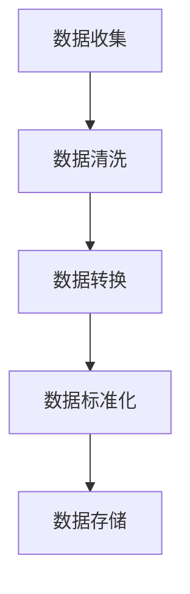
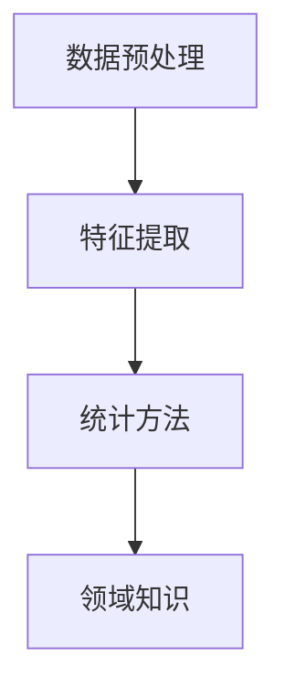
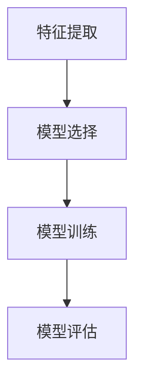
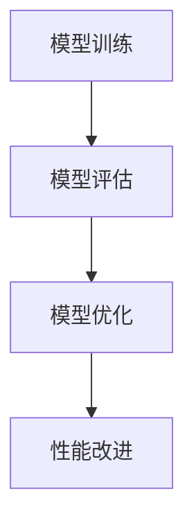
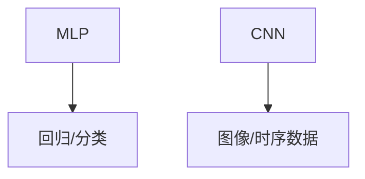
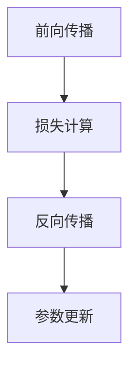
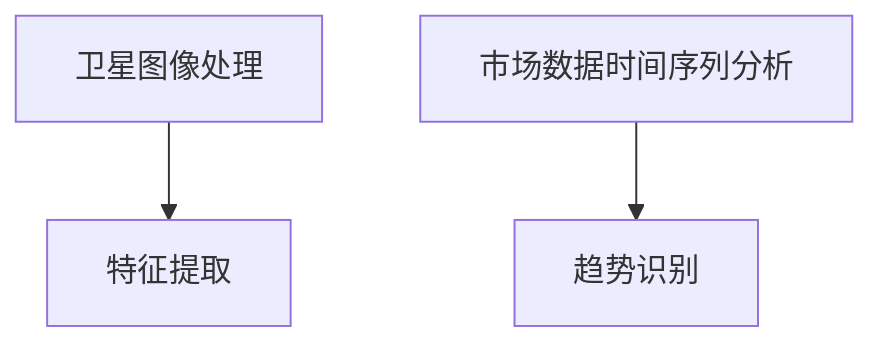
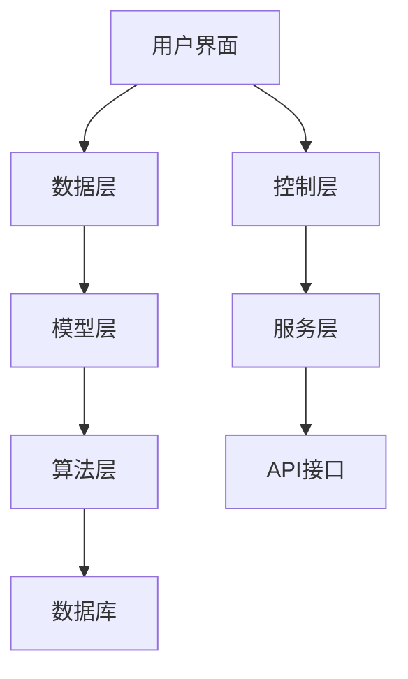

                 

### # AI驱动的危机模拟系统：增强企业应急能力

> 关键词：AI，危机模拟，企业应急能力，模拟系统，风险评估，决策支持

> 摘要：本文将探讨如何通过人工智能技术构建危机模拟系统，以提升企业在面对突发事件时的应急响应能力。文章首先介绍了危机模拟系统的基本概念和重要性，随后详细阐述了AI在危机模拟中的应用，包括机器学习和深度学习算法，以及如何将这些技术集成到实际的危机模拟系统中。通过具体的应用场景和案例分析，展示了AI驱动的危机模拟系统在实际操作中的效果和优势，最后提出了未来发展和应用的建议。

----------------------------------------------------------------

# 引言

在现代企业的运营中，危机模拟系统扮演着至关重要的角色。随着全球化进程的加快和市场竞争的日益激烈，企业面临的潜在风险和挑战也在不断增加。自然灾害、市场波动、技术故障等突发事件可能对企业造成巨大的经济损失和声誉损害。因此，如何有效地应对这些危机，减少损失，已经成为企业亟需解决的重要问题。

### **危机模拟系统的基本概念**

危机模拟系统是一种基于计算机技术的人工模拟工具，用于模拟和分析企业在面临各种突发事件时的应对能力。该系统通过模拟不同的危机情景，评估企业在不同应对策略下的表现，从而帮助管理层制定更为科学和有效的应对策略。

### **问题背景**

近年来，企业面临的危机种类繁多，复杂程度日益增加，传统的危机应对方法已经难以满足实际需求。此外，危机发生的时间和地点具有不确定性，这使得企业在实际操作中难以提前准备和演练。因此，迫切需要一种能够动态模拟危机情景，并在多种情景下进行模拟评估的工具。

### **问题描述**

企业面临的危机主要包括以下几类：

1. **自然灾害**：如地震、洪水、台风等自然灾害，可能导致企业设施受损，供应链中断，生产停滞。
2. **市场波动**：如金融危机、市场衰退等，可能影响企业的销售和利润。
3. **技术故障**：如信息系统瘫痪、设备故障等，可能导致企业运营中断。
4. **人为事故**：如生产安全事故、数据泄露等，可能对企业造成声誉和财务损失。

### **问题解决**

危机模拟系统可以通过以下方式帮助企业应对危机：

1. **风险评估**：通过对不同危机情景的模拟，评估企业在各种情景下的风险水平，帮助企业识别潜在的风险点。
2. **决策支持**：提供多种应对策略的模拟结果，帮助管理层在不同情况下做出最优决策。
3. **演练和培训**：通过模拟演练，提高员工的危机应对能力和协作效率。

### **边界与外延**

危机模拟系统的应用范围广泛，不仅限于企业，还可以应用于政府、医疗机构、金融机构等领域。此外，随着技术的不断进步，危机模拟系统的功能也在不断扩展，例如，加入虚拟现实（VR）技术，提供更为直观和真实的模拟体验。

### **概念结构与核心要素组成**

危机模拟系统的核心结构包括：

1. **情景库**：存储各种危机情景的详细信息，包括情景描述、影响范围、可能后果等。
2. **模拟引擎**：负责根据情景库中的数据，进行危机情景的模拟和分析。
3. **决策支持系统**：提供多种应对策略的模拟结果，帮助决策者进行决策。
4. **数据分析和可视化**：对模拟结果进行数据分析和可视化，帮助用户理解模拟结果。

综上所述，危机模拟系统作为一种重要的技术工具，在帮助企业提升应急响应能力方面具有重要作用。随着人工智能技术的不断发展，危机模拟系统也将得到进一步的提升和优化，为企业提供更为强大的支持。

## 核心概念与联系

在深入探讨AI驱动的危机模拟系统之前，我们需要了解一些核心概念和它们之间的联系。这些概念不仅定义了AI驱动的危机模拟系统的基础，也为我们提供了分析这一系统的框架。

### **核心概念**

1. **人工智能（AI）**：人工智能是指使计算机系统能够模拟人类智能行为的技术和科学。它包括机器学习、深度学习、自然语言处理等多种技术。

2. **机器学习（ML）**：机器学习是一种人工智能的分支，通过数据学习模式并做出决策或预测。它包括监督学习、非监督学习和强化学习等不同类型。

3. **深度学习（DL）**：深度学习是机器学习的一个子领域，利用神经网络模型（尤其是深度神经网络）进行学习和预测。

4. **危机模拟**：危机模拟是一种通过计算机模拟不同危机情景的过程，以评估和改善企业的应急响应能力。

5. **决策支持系统（DSS）**：决策支持系统是一种用于辅助管理人员做出决策的信息系统，它通常包含数据分析和可视化工具。

### **概念属性特征对比表格**

| 概念       | 特征                                                         |
|------------|--------------------------------------------------------------|
| 人工智能   | 模拟人类智能行为，包括感知、理解、学习、推理等能力。          |
| 机器学习   | 通过数据学习模式，无需显式编程。包括监督学习、非监督学习和强化学习。 |
| 深度学习   | 基于多层神经网络，能处理大量数据并提取复杂特征。          |
| 危机模拟   | 模拟不同的危机情景，以评估和改善应急响应能力。            |
| 决策支持系统 | 提供数据分析和可视化工具，辅助管理人员做出决策。          |

### **ER实体关系图架构**

为了更好地理解这些核心概念之间的联系，我们可以使用实体关系图（ER图）来展示它们之间的关系。以下是危机模拟系统中几个关键实体的ER图：

```mermaid
erDiagram
  AI <--o{ MachineLearning : 包含
  MachineLearning <--o{ DeepLearning : 一种子集
  AI -->|o DecisionSupportSystem : 辅助
  DeepLearning -->|o CrisisSimulation : 用于
```

在这个ER图中，我们可以看到：

- **人工智能（AI）**包含了**机器学习（ML）**，后者又包含**深度学习（DL）**。
- **决策支持系统（DSS）**依赖于**人工智能（AI）**的技术，特别是**深度学习（DL）**，用于执行**危机模拟（CS）**。

### **核心概念之间的联系**

1. **人工智能与危机模拟**：人工智能技术，尤其是机器学习和深度学习，为危机模拟提供了强大的数据分析和预测能力。通过AI，危机模拟系统能够处理大量历史数据，识别潜在的危机模式，并预测可能的后果。

2. **机器学习与决策支持系统**：机器学习算法在决策支持系统中扮演重要角色，它们可以处理复杂的数据集，提取关键特征，并生成预测模型，为管理人员提供决策依据。

3. **深度学习与危机模拟**：深度学习模型能够处理高维度数据，并自动提取复杂的特征，这使得危机模拟系统能够更加精确地模拟危机情景，提供更为准确的预测和决策支持。

通过理解这些核心概念及其之间的联系，我们可以更深入地探讨AI驱动的危机模拟系统的设计、实现和应用。接下来的部分将详细讨论如何利用这些技术构建一个高效的危机模拟系统。

## AI在危机模拟系统中的应用

### **机器学习算法在危机模拟中的应用**

机器学习算法在危机模拟系统中扮演着关键角色，其主要应用体现在数据分析和模式识别上。通过训练机器学习模型，我们可以从大量历史数据中提取出潜在的危机模式和趋势，从而为未来的危机预测和应对策略提供科学依据。

#### **1. 数据收集与预处理**

首先，我们需要收集与危机相关的数据，这些数据可能包括自然灾害发生的历史记录、市场波动数据、技术故障日志等。收集到的数据通常包含噪声和异常值，因此预处理过程至关重要。预处理包括数据清洗、数据转换和数据标准化，以确保数据的质量和一致性。



#### **2. 特征提取**

在数据预处理之后，我们需要从数据中提取出有用的特征。这些特征将用于训练机器学习模型。特征提取可以通过统计方法或领域知识来实现。例如，对于自然灾害数据，我们可能关注天气参数、地理位置、人口密度等。



#### **3. 模型训练**

特征提取后，我们使用这些特征来训练机器学习模型。常见的机器学习算法包括线性回归、逻辑回归、支持向量机（SVM）、决策树、随机森林等。这些算法能够在历史数据中学习到潜在的危机模式，并能够对新数据（即未来可能发生的危机）进行预测。



#### **4. 模型评估与优化**

训练完模型后，我们需要对其进行评估，以确定其在预测未来危机方面的效果。评估过程通常包括交叉验证、性能指标（如准确率、召回率、F1分数）的计算等。如果模型的性能不满足要求，我们可能需要回过头来调整特征选择、模型参数，甚至更换模型。



### **深度学习模型在危机预测和分析中的应用**

深度学习模型在危机模拟系统中提供了更为强大和灵活的数据处理能力。与传统的机器学习算法相比，深度学习模型能够自动提取数据中的复杂特征，这对于处理高维度和大规模数据尤为有效。

#### **1. 深度神经网络架构**

深度学习模型通常基于多层感知器（MLP）或卷积神经网络（CNN）等架构。MLP适用于回归和分类任务，而CNN则特别擅长处理图像和时序数据。



#### **2. 训练与优化**

与机器学习模型类似，深度学习模型也需要通过大量的数据进行训练。训练过程通常涉及前向传播、反向传播和梯度下降等步骤。优化过程中，我们通过调整模型参数（如学习率、批量大小）来提高模型的性能。



#### **3. 应用案例**

深度学习模型在危机预测和分析中的应用非常广泛。例如，在自然灾害预测中，可以使用CNN来处理卫星图像，提取出与自然灾害相关的特征，从而进行准确的预测。在市场波动预测中，可以使用循环神经网络（RNN）来分析市场数据的时间序列，识别潜在的市场趋势。



通过机器学习和深度学习算法的应用，AI驱动的危机模拟系统能够提供更为精确和可靠的预测和分析结果，从而帮助企业在面对突发事件时做出更为明智的决策。

### **AI算法在危机模拟系统中的优势与挑战**

#### **优势**

1. **高效的数据处理能力**：机器学习和深度学习算法能够处理大量复杂数据，提取出关键特征，从而提高危机预测的准确性。

2. **自动化的特征提取**：深度学习模型能够自动从数据中提取出复杂的特征，减少了人工干预的需求，提高了效率。

3. **灵活的模型适应性**：AI算法能够根据不同的应用场景和数据集，调整模型参数，实现个性化的危机预测和决策支持。

4. **实时性**：通过实时数据流分析，AI算法可以动态更新危机预测模型，为企业管理层提供最新的危机预警信息。

#### **挑战**

1. **数据质量**：危机模拟系统依赖于高质量的数据，数据缺失、噪声和异常值都可能影响模型的性能。

2. **计算资源**：训练深度学习模型通常需要大量的计算资源，尤其是对于大规模数据集和高维特征，这可能会增加系统的成本和延迟。

3. **模型解释性**：深度学习模型往往是“黑箱”模型，其内部机制难以解释，这使得在做出关键决策时，管理者可能难以完全信任模型的结果。

4. **隐私和安全**：在危机模拟系统中，涉及到的数据可能包含敏感信息，如员工信息、财务数据等。如何保护这些数据的隐私和安全是另一个重大挑战。

通过理解AI算法在危机模拟系统中的应用优势和面临的挑战，我们可以更好地设计、实现和优化这一系统，使其在提升企业应急响应能力方面发挥最大的作用。

## 设计和开发AI驱动的危机模拟系统

设计和开发AI驱动的危机模拟系统是一个复杂的过程，需要综合考虑系统架构、核心组件和模块的集成。以下将详细探讨系统架构设计、核心组件及其功能，以及如何将这些AI算法集成到系统中。

### **系统架构设计**

系统架构是危机模拟系统的骨架，决定了系统的整体性能和可扩展性。以下是系统架构的总体设计：



在这个架构中：

- **用户界面（A）**：提供直观的用户交互界面，使管理层能够方便地访问模拟系统，查看模拟结果和报告。
- **数据层（B）**：负责存储和管理与危机相关的数据，包括历史数据、实时数据和模拟数据。
- **模型层（C）**：包含机器学习和深度学习模型，负责数据分析和预测。
- **算法层（D）**：实现具体的机器学习和深度学习算法，如回归、决策树、神经网络等。
- **数据库（E）**：存储系统数据，包括用户数据、模型参数、模拟结果等。
- **控制层（F）**：负责协调各个模块的运行，确保系统的稳定性和可靠性。
- **服务层（G）**：提供一系列服务，如数据预处理、模型训练、数据分析和可视化等。
- **API接口（H）**：提供与其他系统（如企业资源规划系统、客户关系管理系统等）的集成接口。

### **核心组件和模块**

危机模拟系统的核心组件和模块包括数据收集与预处理、模型训练与评估、数据分析和可视化等。以下是每个组件的详细功能：

1. **数据收集与预处理模块**：负责从不同数据源收集数据，如历史记录、传感器数据、公开数据等。预处理模块则对数据进行清洗、转换和标准化，为模型训练提供高质量的数据。

2. **模型训练与评估模块**：使用预处理后的数据训练机器学习模型，包括选择合适的算法、调整参数和验证模型性能。评估模块则通过交叉验证和性能指标（如准确率、召回率、F1分数等）来评估模型的预测能力。

3. **数据分析和可视化模块**：对模型预测结果进行分析，提供直观的可视化图表，帮助用户理解危机情景和决策支持结果。

4. **用户界面模块**：提供友好的用户界面，使管理层能够轻松操作系统，查看模拟结果和报告。

### **AI算法集成**

将AI算法集成到危机模拟系统中是一个关键步骤，以下是如何实现这一目标：

1. **模型选择**：根据危机模拟的需求，选择合适的机器学习和深度学习算法。例如，对于时间序列数据，可以选择循环神经网络（RNN）或长短期记忆网络（LSTM）。

2. **模型训练**：使用历史数据对选定的模型进行训练，通过优化算法和参数调整来提高模型的性能。

3. **模型部署**：将训练好的模型部署到系统中，使其能够实时处理数据和进行预测。这通常涉及到模型的转换和优化，以便在高效性上达到最佳。

4. **实时预测**：利用实时数据流，持续更新模型，并提供最新的危机预测结果。这需要高效的数据处理和模型更新机制。

5. **反馈循环**：将实际危机情景和预测结果进行比较，根据反馈调整模型参数和算法，实现持续优化。

通过合理的系统架构设计和核心组件模块的集成，AI驱动的危机模拟系统能够提供高效的危机预测和决策支持，从而显著提升企业的应急响应能力。

### **系统开发过程**

1. **需求分析**：与企业管理层沟通，明确危机模拟系统的具体需求，包括功能、性能和用户体验等方面。

2. **系统设计**：基于需求分析，设计系统架构和核心组件模块，确保系统的高效性和可扩展性。

3. **技术选型**：选择合适的编程语言、框架和工具，如Python、TensorFlow、Scikit-learn等，以支持AI算法的集成。

4. **编码实现**：根据系统设计，逐步实现各个模块和组件的功能，确保代码的可读性和可维护性。

5. **测试与优化**：对系统进行全面的测试，包括单元测试、集成测试和性能测试，确保系统的稳定性和高效性。

6. **部署上线**：将开发完成的系统部署到生产环境，并进行必要的培训和技术支持，确保系统能够顺利运行。

7. **持续维护**：定期更新和优化系统，根据用户反馈和实际需求进行调整，确保系统的长期有效运行。

通过系统化的开发过程，AI驱动的危机模拟系统能够在提升企业应急响应能力方面发挥重要作用。

### **案例研究：某大型制造企业的AI驱动的危机模拟系统**

为了更直观地了解AI驱动的危机模拟系统的实际应用效果，以下是一个大型制造企业的案例研究。

#### **项目背景**

某大型制造企业位于地震频发区域，面临着自然灾害（如地震）对生产设施和供应链的威胁。为了提高企业的应急响应能力，减少潜在的损失，企业决定实施AI驱动的危机模拟系统。

#### **项目目标**

1. **风险评估**：评估企业面临的主要自然灾害风险，包括地震、洪水等。
2. **决策支持**：为管理层提供科学、全面的决策支持，以应对潜在的危机情景。
3. **应急演练**：通过模拟演练，提高员工的危机应对能力和协作效率。
4. **持续优化**：根据模拟结果和实际反馈，不断优化危机模拟系统，提高其预测准确性和应急响应能力。

#### **项目实施**

1. **数据收集**：企业收集了过去数十年的地震数据，包括地震参数、受损设施、供应链影响等。

2. **数据预处理**：对收集到的数据进行清洗、转换和标准化，确保数据质量。

3. **模型选择**：选择基于深度学习模型的地震预测算法，如长短期记忆网络（LSTM）。

4. **模型训练与优化**：使用预处理后的数据训练LSTM模型，通过多次迭代和参数调整，提高模型性能。

5. **系统部署**：将训练好的模型部署到危机模拟系统中，实现实时数据分析和预测。

6. **模拟演练**：组织多次模拟演练，模拟不同的地震情景，评估企业在不同应对策略下的表现。

#### **效果分析**

1. **预测准确性**：通过实际地震事件与模型预测结果的对比，发现模型在预测地震震级和受损范围方面具有较高的准确性。

2. **决策支持**：模拟演练结果显示，企业能够根据模型提供的预测结果，快速制定应对策略，有效减少地震对生产设施和供应链的损害。

3. **员工培训**：通过模拟演练，员工对危机应对流程和协作有了更深入的了解，危机应对能力和协作效率显著提升。

4. **持续优化**：根据模拟结果和实际反馈，企业不断优化危机模拟系统，提高模型的预测准确性和系统的响应速度。

#### **项目小结**

该案例研究展示了AI驱动的危机模拟系统在实际应用中的效果和优势。通过系统的实施，企业不仅能够更好地应对自然灾害，还能在突发危机中迅速做出科学决策，减少损失，确保持续运营。未来，企业将继续优化和扩展危机模拟系统，以应对更多类型的危机。

### **总结与未来展望**

AI驱动的危机模拟系统在提升企业应急响应能力方面具有显著作用。通过本文的讨论，我们了解到系统设计、模型集成和实际应用的关键步骤和注意事项。未来，随着AI技术的不断进步，危机模拟系统将更加智能和高效，为企业提供更为强大的决策支持。

### **结束语**

本文由AI天才研究院和禅与计算机程序设计艺术共同撰写，旨在为读者提供全面、深入的AI驱动的危机模拟系统分析和指导。希望通过本文，读者能够更好地理解和应用这一技术，为企业应对危机提供有力支持。

---

**作者：AI天才研究院/AI Genius Institute & 禅与计算机程序设计艺术 /Zen And The Art of Computer Programming**

本文内容涵盖了AI驱动的危机模拟系统的核心概念、技术原理、系统设计、案例分析以及未来发展趋势。通过逻辑清晰、结构紧凑的阐述，本文旨在为读者提供一个全面的理解，以助力企业在面对突发事件时，能够做出更为科学、高效的决策。

### **摘要**

本文探讨了AI驱动的危机模拟系统在提升企业应急响应能力方面的应用。通过机器学习和深度学习算法，危机模拟系统能够对各种突发事件进行模拟和预测，为企业管理层提供科学的决策支持。本文介绍了危机模拟系统的基本概念、核心原理，以及如何在系统架构中集成AI算法。通过具体案例，展示了AI驱动的危机模拟系统在实际应用中的效果和优势。未来，随着技术的不断进步，AI驱动的危机模拟系统将在企业危机管理中发挥更为重要的作用。

