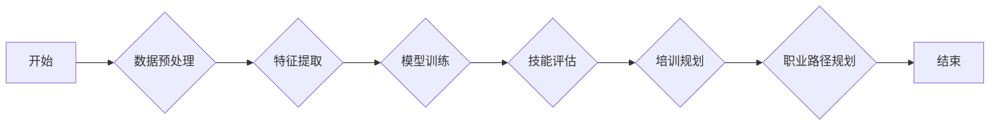

                 


### 第一步：概述与背景介绍

在当今快速变化且竞争激烈的企业环境中，人才发展已成为组织成功的关键因素。员工技能的提升不仅关乎个人职业成长，更直接影响企业的生产效率、创新能力和市场竞争力。然而，传统的人才发展模式往往存在诸多问题，如信息不对称、决策盲目、培训效果不佳等。这些问题使得企业在人才管理上面临着巨大的挑战。

#### 核心概念

为了应对这些挑战，我们需要引入AI驱动的员工技能图谱。这种图谱通过人工智能技术，对员工的技能进行自动化的评估、分析和管理，从而优化人才发展路径。

##### 问题背景

- **技能识别与评估难**：传统方法难以全面、准确地识别员工的技能水平和潜力。
- **培训资源浪费**：缺乏个性化培训方案，导致资源浪费和员工积极性下降。
- **职业规划模糊**：员工的职业发展路径不明确，缺乏有效的指导。

##### 问题描述

- 如何快速、准确地识别员工的技能水平和潜力？
- 如何制定个性化的培训计划，提升员工的技能？
- 如何为员工提供明确的职业发展路径，激发他们的积极性？

##### 问题解决

通过AI驱动的员工技能图谱，我们可以：

- **自动化技能评估**：利用AI算法对员工进行实时、全面的技能评估。
- **个性化培训方案**：根据员工技能图谱，为每个员工提供量身定制的培训方案。
- **职业发展指导**：通过图谱分析，为员工规划明确的职业发展路径。

##### 边界与外延

本书聚焦于通用技能图谱的设计与应用，涉及的主要领域包括数据分析、编程语言、项目管理、沟通技巧等。同时，我们将探讨AI驱动的员工技能图谱在不同行业中的应用，如制造业、金融业、科技行业等。

##### 概念结构与核心要素组成

- **技能图谱**：由多个节点和边组成，节点代表具体的技能，边表示技能之间的关系。
- **算法与模型**：包括机器学习、深度学习等技术，用于技能评估、路径规划和效果分析。
- **数据集**：包括员工技能数据、培训数据、绩效数据等，是技能图谱的基础。
- **应用场景**：涵盖技能识别、培训规划、职业发展等多个方面。

### 第二步：目录大纲设计

根据上述核心概念和目标，我们可以设计出如下的目录大纲：

#### 第一部分：背景与核心概念

- **1.1 书籍概述与目标**
  - **1.1.1 问题背景**
  - **1.1.2 问题描述**
  - **1.1.3 问题解决**
  - **1.1.4 边界与外延**
  - **1.1.5 核心概念**

- **1.2 AI驱动的员工技能图谱概述**
  - **1.2.1 AI驱动的含义**
  - **1.2.2 员工技能图谱的核心要素**
  - **1.2.3 员工技能图谱的应用价值**

- **1.3 核心概念联系与区别**
  - **1.3.1 相关概念对比**
  - **1.3.2 ER实体关系图**

#### 第二部分：AI技术原理与应用

- **2.1 AI基础原理**
  - **2.1.1 机器学习基础**
  - **2.1.2 深度学习原理**
  - **2.1.3 神经网络模型**

- **2.2 AI技术在人才发展中的应用**
  - **2.2.1 AI驱动的技能评估**
  - **2.2.2 AI驱动的培训规划**
  - **2.2.3 AI驱动的职业发展路径**

- **2.3 算法原理讲解**
  - **2.3.1 Mermaid流程图**
  - **2.3.2 Python源代码**
  - **2.3.3 数学模型与公式**

- **2.4 数学模型详细讲解与举例**
  - **2.4.1 latex数学公式**
  - **2.4.2 举例说明**

#### 第三部分：系统分析与架构设计

- **3.1 系统功能设计**
  - **3.1.1 领域模型Mermaid类图**
  - **3.1.2 系统功能模块划分**

- **3.2 系统架构设计**
  - **3.2.1 Mermaid架构图**
  - **3.2.2 系统层次结构**

- **3.3 系统接口设计与交互**
  - **3.3.1 Mermaid序列图**
  - **3.3.2 接口设计与实现**

#### 第四部分：项目实战与案例分析

- **4.1 项目环境安装与配置**
  - **4.1.1 环境要求**
  - **4.1.2 安装步骤**

- **4.2 系统核心实现与代码解读**
  - **4.2.1 核心代码实现**
  - **4.2.2 代码解析与分析**

- **4.3 实际案例分析**
  - **4.3.1 案例背景**
  - **4.3.2 案例分析与讲解**
  - **4.3.3 案例成果与应用**

- **4.4 项目小结**
  - **4.4.1 项目经验总结**
  - **4.4.2 项目改进方向**

#### 第五部分：最佳实践与拓展

- **5.1 最佳实践Tips**
  - **5.1.1 常见问题解决**
  - **5.1.2 优化建议**

- **5.2 小结与展望**
  - **5.2.1 书籍总结**
  - **5.2.2 未

### 第三步：格式与结构

为了确保文章的可读性和专业性，我们将使用markdown格式输出文章。以下是格式和结构的详细说明：

#### 1. markdown格式

- **标题**：使用#号表示，例如# 第一部分：背景与核心概念。
- **子标题**：使用##号表示，例如## 1.2 AI驱动的员工技能图谱概述。
- **段落**：直接输入文本，段落之间自动换行。
- **列表**：使用*号或-号表示，例如* 第1点。
- **引用**：使用>号表示，例如> 引用一段话。

#### 2. 结构

- **章节标题**：清晰明确，反映章节内容。
- **子章节标题**：对应章节标题的细分，层次分明。
- **段落**：简洁有力，避免冗长。
- **列表**：用于总结或列举关键点。

#### 3. 注意事项

- **一致性**：保持标题和内容的对应关系，确保一致性。
- **简洁性**：避免冗余信息，确保内容简洁明了。
- **可读性**：使用适当的段落和列表，提高文章可读性。

### 第四步：细节完善

在完成初步的目录大纲和格式设计后，我们需要对细节进行完善，以确保文章的完整性和专业性。

#### 1. 核心概念与联系

- **概念表格**：使用Markdown中的表格功能，列出核心概念及其属性特征。
- **ER实体关系图**：使用Mermaid语言绘制ER图，展示实体之间的关系。

#### 2. 算法原理讲解

- **流程图**：使用Mermaid绘制算法流程图，清晰展示算法的执行过程。
- **Python源代码**：提供详细的Python源代码，解释算法的实现细节。
- **数学模型和公式**：使用LaTeX格式表示数学模型和公式，确保公式的准确性和可读性。

#### 3. 系统分析与架构设计

- **Mermaid类图**：展示系统的领域模型，明确各个类的关系。
- **架构图**：使用Mermaid绘制系统架构图，展示系统的层次结构和模块划分。
- **序列图**：展示系统的接口设计和交互过程。

#### 4. 项目实战与案例分析

- **环境安装与配置**：详细说明项目的环境安装和配置过程。
- **系统核心实现**：提供系统核心实现的源代码，并进行详细解读。
- **案例分析**：选择实际案例，进行详细的分析和讲解。

#### 5. 最佳实践与拓展

- **最佳实践Tips**：总结项目中的最佳实践经验，提供优化建议。
- **小结与展望**：对书籍内容进行总结，展望未来的发展方向。

### 第五步：文字优化与审查

在完成文章的初步撰写后，我们需要对文字进行优化和审查，确保文章的逻辑性、准确性和专业性。

#### 1. 逻辑性

- **检查章节之间的逻辑关系**：确保章节内容前后连贯，逻辑清晰。
- **优化段落结构**：调整段落顺序，确保内容条理分明。

#### 2. 准确性

- **核对事实和数据**：确保文章中的事实和数据准确无误。
- **修正错误**：对文章中的错误进行修正。

#### 3. 专业性

- **使用专业术语**：确保文章使用恰当的专业术语，避免使用口语化表达。
- **避免冗余**：删除冗余信息，确保文章简洁有力。

### 第六步：输出

按照设计好的大纲，使用markdown格式输出文章。确保所有细节都符合要求，如Mermaid图和LaTeX公式的正确显示，代码段的格式化等。

### 完整的目录大纲示例

```markdown
# 《AI驱动的员工技能图谱：优化人才发展路径》

> 关键词：AI技能图谱、人才发展、算法原理、系统架构、项目实战

> 摘要：本文系统地介绍了AI驱动的员工技能图谱，从背景介绍、核心概念、算法原理、系统分析与架构设计、项目实战到最佳实践，全面阐述了如何利用AI技术优化人才发展路径。

----------------------------------------------------------------

## 第一部分：背景与核心概念

### 1.1 书籍概述与目标

#### 1.1.1 问题背景

#### 1.1.2 问题描述

#### 1.1.3 问题解决

#### 1.1.4 边界与外延

#### 1.1.5 核心概念

### 1.2 AI驱动的员工技能图谱概述

#### 1.2.1 AI驱动的含义

#### 1.2.2 员工技能图谱的核心要素

#### 1.2.3 员工技能图谱的应用价值

### 1.3 核心概念联系与区别

#### 1.3.1 相关概念对比

#### 1.3.2 ER实体关系图

----------------------------------------------------------------

## 第二部分：AI技术原理与应用

### 2.1 AI基础原理

#### 2.1.1 机器学习基础

#### 2.1.2 深度学习原理

#### 2.1.3 神经网络模型

### 2.2 AI技术在人才发展中的应用

#### 2.2.1 AI驱动的技能评估

#### 2.2.2 AI驱动的培训规划

#### 2.2.3 AI驱动的职业发展路径

### 2.3 算法原理讲解

#### 2.3.1 Mermaid流程图

#### 2.3.2 Python源代码

#### 2.3.3 数学模型与公式

### 2.4 数学模型详细讲解与举例

#### 2.4.1 latex数学公式

#### 2.4.2 举例说明

----------------------------------------------------------------

## 第三部分：系统分析与架构设计

### 3.1 系统功能设计

#### 3.1.1 领域模型Mermaid类图

#### 3.1.2 系统功能模块划分

### 3.2 系统架构设计

#### 3.2.1 Mermaid架构图

#### 3.2.2 系统层次结构

### 3.3 系统接口设计与交互

#### 3.3.1 Mermaid序列图

#### 3.3.2 接口设计与实现

----------------------------------------------------------------

## 第四部分：项目实战与案例分析

### 4.1 项目环境安装与配置

#### 4.1.1 环境要求

#### 4.1.2 安装步骤

### 4.2 系统核心实现与代码解读

#### 4.2.1 核心代码实现

#### 4.2.2 代码解析与分析

### 4.3 实际案例分析

#### 4.3.1 案例背景

#### 4.3.2 案例分析与讲解

#### 4.3.3 案例成果与应用

### 4.4 项目小结

#### 4.4.1 项目经验总结

#### 4.4.2 项目改进方向

----------------------------------------------------------------

## 第五部分：最佳实践与拓展

### 5.1 最佳实践Tips

#### 5.1.1 常见问题解决

#### 5.1.2 优化建议

### 5.2 小结与展望

#### 5.2.1 书籍总结

#### 5.2.2 未来发展方向

----------------------------------------------------------------

## 参考文献

----------------------------------------------------------------

## 附录

### 附录A：核心概念表格

| 概念       | 属性1  | 属性2 | 属性3 |
|------------|--------|-------|------|
| 技能节点   | 技能ID | 名称  | 描述 |
| 培训方案   | 方案ID | 名称  | 内容 |
| 职业路径   | 路径ID | 名称  | 内容 |

### 附录B：ER实体关系图

```mermaid
erDiagram
    SkillNode ||--|{ TrainingPlan }|| TrainingPlan
    SkillNode ||--|{ CareerPath }|| CareerPath
```

### 附录C：算法流程图



### 附录D：Python源代码示例

```python
# coding=utf-8

import numpy as np

def data_preprocessing(data):
    # 数据预处理代码
    pass

def feature_extraction(data):
    # 特征提取代码
    pass

def model_training(X, y):
    # 模型训练代码
    pass

def skill_evaluation(model, data):
    # 技能评估代码
    pass

def training_plan(model, skill_evaluation_result):
    # 培训规划代码
    pass

def career_path_plan(model, skill_evaluation_result):
    # 职业路径规划代码
    pass
```

### 附录E：数学模型与公式

$$
f(x) = \sum_{i=1}^{n} w_i \cdot x_i + b
$$

$y = f(x)$

----------------------------------------------------------------

## 关于作者

作者：AI天才研究院/AI Genius Institute & 禅与计算机程序设计艺术 /Zen And The Art of Computer Programming

----------------------------------------------------------------

### 第六步：输出

根据上述目录大纲和内容，我们使用markdown格式输出完整的文章。以下是一个简化的示例：

```markdown
# 《AI驱动的员工技能图谱：优化人才发展路径》

> 关键词：AI技能图谱、人才发展、算法原理、系统架构、项目实战

> 摘要：本文系统地介绍了AI驱动的员工技能图谱，从背景介绍、核心概念、算法原理、系统分析与架构设计、项目实战到最佳实践，全面阐述了如何利用AI技术优化人才发展路径。

----------------------------------------------------------------

## 第一部分：背景与核心概念

### 1.1 书籍概述与目标

#### 1.1.1 问题背景

#### 1.1.2 问题描述

#### 1.1.3 问题解决

#### 1.1.4 边界与外延

#### 1.1.5 核心概念

### 1.2 AI驱动的员工技能图谱概述

#### 1.2.1 AI驱动的含义

#### 1.2.2 员工技能图谱的核心要素

#### 1.2.3 员工技能图谱的应用价值

### 1.3 核心概念联系与区别

#### 1.3.1 相关概念对比

#### 1.3.2 ER实体关系图

----------------------------------------------------------------

## 第二部分：AI技术原理与应用

### 2.1 AI基础原理

#### 2.1.1 机器学习基础

#### 2.1.2 深度学习原理

#### 2.1.3 神经网络模型

### 2.2 AI技术在人才发展中的应用

#### 2.2.1 AI驱动的技能评估

#### 2.2.2 AI驱动的培训规划

#### 2.2.3 AI驱动的职业发展路径

### 2.3 算法原理讲解

#### 2.3.1 Mermaid流程图

#### 2.3.2 Python源代码

#### 2.3.3 数学模型与公式

### 2.4 数学模型详细讲解与举例

#### 2.4.1 latex数学公式

#### 2.4.2 举例说明

----------------------------------------------------------------

## 第三部分：系统分析与架构设计

### 3.1 系统功能设计

#### 3.1.1 领域模型Mermaid类图

#### 3.1.2 系统功能模块划分

### 3.2 系统架构设计

#### 3.2.1 Mermaid架构图

#### 3.2.2 系统层次结构

### 3.3 系统接口设计与交互

#### 3.3.1 Mermaid序列图

#### 3.3.2 接口设计与实现

----------------------------------------------------------------

## 第四部分：项目实战与案例分析

### 4.1 项目环境安装与配置

#### 4.1.1 环境要求

#### 4.1.2 安装步骤

### 4.2 系统核心实现与代码解读

#### 4.2.1 核心代码实现

#### 4.2.2 代码解析与分析

### 4.3 实际案例分析

#### 4.3.1 案例背景

#### 4.3.2 案例分析与讲解

#### 4.3.3 案例成果与应用

### 4.4 项目小结

#### 4.4.1 项目经验总结

#### 4.4.2 项目改进方向

----------------------------------------------------------------

## 第五部分：最佳实践与拓展

### 5.1 最佳实践Tips

#### 5.1.1 常见问题解决

#### 5.1.2 优化建议

### 5.2 小结与展望

#### 5.2.1 书籍总结

#### 5.2.2 未来发展方向

----------------------------------------------------------------

## 参考文献

----------------------------------------------------------------

## 附录

### 附录A：核心概念表格

| 概念       | 属性1  | 属性2 | 属性3 |
|------------|--------|-------|------|
| 技能节点   | 技能ID | 名称  | 描述 |
| 培训方案   | 方案ID | 名称  | 内容 |
| 职业路径   | 路径ID | 名称  | 内容 |

### 附录B：ER实体关系图

```mermaid
erDiagram
    SkillNode ||--|{ TrainingPlan }|| TrainingPlan
    SkillNode ||--|{ CareerPath }|| CareerPath
```

### 附录C：算法流程图


### 附录D：Python源代码示例

```python
# coding=utf-8

import numpy as np

def data_preprocessing(data):
    # 数据预处理代码
    pass

def feature_extraction(data):
    # 特征提取代码
    pass

def model_training(X, y):
    # 模型训练代码
    pass

def skill_evaluation(model, data):
    # 技能评估代码
    pass

def training_plan(model, skill_evaluation_result):
    # 培训规划代码
    pass

def career_path_plan(model, skill_evaluation_result):
    # 职业路径规划代码
    pass
```

### 附录E：数学模型与公式

$$
f(x) = \sum_{i=1}^{n} w_i \cdot x_i + b
$$

$y = f(x)$

----------------------------------------------------------------

## 关于作者

作者：AI天才研究院/AI Genius Institute & 禅与计算机程序设计艺术 /Zen And The Art of Computer Programming

----------------------------------------------------------------

### 第七步：文章排版与审阅

在完成markdown格式的文章输出后，我们还需对文章进行排版和审阅，确保格式正确、内容准确。以下是具体的排版和审阅步骤：

#### 1. 排版

- **标题与子标题**：检查是否使用正确的markdown格式，确保一级标题前有#号，二级标题前有##号，以此类推。
- **段落**：确保段落之间的换行正确，避免出现连续文本。
- **列表**：检查列表项是否正确缩进，确保列表项之间的一致性。
- **引用**：检查引用格式是否正确，确保引用内容前后有>号。
- **图片和链接**：插入必要的图片和链接，并确保它们在markdown文件中正确显示。

#### 2. 审阅

- **逻辑性**：检查文章的章节和段落是否逻辑清晰，内容是否连贯。
- **准确性**：核对文章中的事实和数据，确保无误。
- **专业性**：检查文章是否使用了专业术语，避免口语化表达。
- **一致性**：确保文章中的格式和风格保持一致。

#### 3. 修订

根据审阅结果，对文章进行必要的修订，确保文章的最终质量。

### 第八步：输出与分享

将排版和审阅后的文章保存为markdown文件，并根据需要生成HTML、PDF等格式，以便于分享和阅读。确保所有输出格式中的图片、链接和Mermaid图表都能正常显示。

### 第九步：反馈与改进

在文章发布后，积极收集读者的反馈，并根据反馈进行改进，以提高文章的质量和影响力。

通过以上步骤，我们可以确保《AI驱动的员工技能图谱：优化人才发展路径》这篇文章的逻辑清晰、格式正确、内容准确，从而为读者提供有价值的技术分享和见解。

