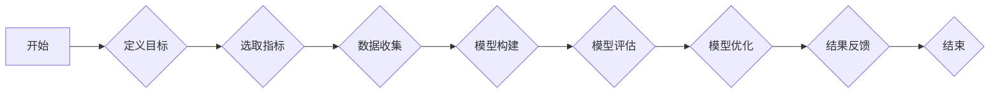
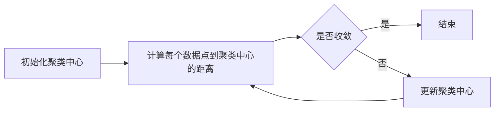

                 


# AI驱动的员工绩效分析：优化人才发展策略

> 关键词：AI、员工绩效、人才发展、数据分析、机器学习

> 摘要：本文旨在探讨AI技术在员工绩效分析中的应用，通过介绍AI驱动的员工绩效分析的基本概念、核心算法和实践案例，分析其在优化人才发展策略方面的作用和未来趋势。

## 第一部分：背景与概述

### 第1章：AI驱动的员工绩效分析概述

#### 1.1 问题背景与驱动因素

在当今快速变化的企业环境中，如何高效地进行员工绩效分析，已经成为企业管理的核心问题。传统绩效分析方法往往依赖于主观评价，容易出现偏差，难以全面反映员工的真实工作表现。而AI技术的引入，为员工绩效分析提供了全新的解决方案。

首先，传统绩效分析的局限主要表现在以下几个方面：

1. **主观评价偏差**：传统绩效评估依赖于上级的主观评价，容易受到个人情感和偏见的影响，导致评估结果不够客观公正。
2. **数据收集困难**：传统绩效分析需要大量的纸质记录和人工统计，数据收集过程繁琐且容易出现遗漏。
3. **评估周期长**：传统绩效评估通常需要较长时间，难以及时反馈员工的工作表现，影响绩效改进的效率。

相比之下，AI驱动的员工绩效分析具有以下优势：

1. **客观性**：AI技术能够通过数据分析，提供客观的绩效评估结果，减少主观评价的偏差。
2. **自动化**：AI技术可以自动收集和分析数据，提高数据收集的效率和准确性。
3. **实时性**：AI技术能够实时监测员工的工作表现，及时发现问题并进行调整，提高绩效改进的效率。

驱动因素主要包括：

1. **大数据技术**：随着企业数据量的不断增加，如何有效地管理和分析这些数据成为企业管理者关注的焦点。
2. **人工智能算法**：人工智能算法的不断发展，为员工绩效分析提供了强大的技术支持。
3. **人才竞争**：在人才竞争日益激烈的今天，企业需要通过高效的绩效分析来选拔和培养优秀人才。

#### 1.2 绩效分析的基本概念

绩效分析是指通过对员工工作表现的量化评估，以确定员工的绩效水平，为人才选拔、培训和激励提供依据。

1. **绩效评估的定义与目标**：
   - 绩效评估是指对员工工作表现的量化评估，以确定员工的绩效水平。
   - 目标：提高员工的工作效率，促进企业目标的实现。

2. **绩效指标分类与选取**：
   - **分类**：绩效指标可以分为定量指标和定性指标。
     - 定量指标：如销售额、生产量等。
     - 定性指标：如团队合作能力、创新能力等。
   - **选取**：应根据企业战略和业务需求，选择与岗位和业务密切相关的绩效指标。

3. **绩效评估流程**：
   - 数据收集：通过日常工作和绩效考核系统收集员工的工作数据。
   - 数据分析：使用AI算法对收集的数据进行分析，确定员工的绩效水平。
   - 结果反馈：将分析结果反馈给员工，帮助他们了解自己的工作表现，并制定改进计划。

#### 1.3 AI技术在员工绩效分析中的应用

1. **机器学习与深度学习基础**：
   - 机器学习：一种通过数据训练模型，使模型能够自动学习和预测的技术。
   - 深度学习：一种基于多层神经网络的学习方法，能够处理大规模、非线性数据。

2. **AI在员工绩效分析中的应用场景**：
   - 绩效预测：使用AI算法预测员工的未来绩效，为人才选拔和培养提供依据。
   - 绩效评估：使用AI算法对员工的工作表现进行量化评估，提高评估的客观性。
   - 绩效优化：基于AI分析结果，为员工制定个性化的绩效改进计划。

3. **AI驱动的绩效分析技术趋势**：
   - **智能化**：随着AI技术的不断发展，绩效分析将越来越智能化，能够自动处理大量的数据，提供精准的评估结果。
   - **个性化**：AI技术将能够根据员工的个性化特征，提供个性化的绩效分析和改进建议。
   - **实时性**：AI技术将实现实时绩效分析，帮助企业及时发现问题并采取改进措施。

## 第二部分：AI驱动的员工绩效分析核心概念

### 第2章：数据收集与预处理

#### 2.1 数据源选择

在AI驱动的员工绩效分析中，数据源的选择至关重要。数据源的质量直接影响到绩效分析的结果。

1. **内部数据源**：
   - 日常工作数据：如考勤记录、工作日志、项目进度等。
   - 绩效考核数据：如考核结果、评分记录等。

2. **外部数据源**：
   - 行业数据：如行业平均绩效水平、市场趋势等。
   - 第三方数据：如社交媒体数据、公开数据等。

#### 2.2 数据采集技术

1. **自动化采集**：
   - 通过自动化工具，如脚本、API接口等，从内部系统和外部平台自动采集数据。

2. **人工采集**：
   - 对于一些无法自动采集的数据，如员工反馈、用户评价等，可以通过人工方式采集。

#### 2.3 数据预处理方法

1. **数据清洗**：
   - 去除重复数据、异常数据，确保数据的一致性和准确性。

2. **数据转换**：
   - 将不同格式、单位、范围的数据进行统一处理，使其符合数据分析的要求。

3. **数据归一化**：
   - 对不同指标进行归一化处理，使其在同一尺度上进行比较。

#### 2.4 数据质量评估与提升

1. **数据质量评估**：
   - 评估数据的一致性、准确性、完整性和时效性。

2. **数据质量提升**：
   - 通过数据清洗、数据转换和数据归一化等手段，提升数据质量。

## 第三部分：员工绩效分析中的AI算法

### 第3章：绩效预测算法

#### 3.1 时间序列分析算法

时间序列分析算法是一种用于分析时间序列数据的方法，它可以帮助预测未来的绩效水平。

1. **ARIMA模型**：
   - ARIMA模型是一种经典的线性时间序列预测模型，包括自回归（AR）、移动平均（MA）和差分（I）三个部分。

2. **LSTM模型**：
   - LSTM（Long Short-Term Memory）模型是一种特殊的循环神经网络，适用于处理长时间序列数据。

#### 3.2 回归分析算法

回归分析算法是一种用于建立因变量与自变量之间关系的统计方法，可以帮助预测员工的绩效水平。

1. **线性回归**：
   - 线性回归是一种简单的回归分析方法，它假设因变量与自变量之间存在线性关系。

2. **多项式回归**：
   - 多项式回归是一种更复杂的回归分析方法，它将因变量与自变量之间的关系表示为多项式形式。

#### 3.3 预测模型的评估与优化

1. **评估指标**：
   - 常用的评估指标包括均方误差（MSE）、均方根误差（RMSE）等。

2. **优化方法**：
   - 通过调整模型参数、增加特征、使用交叉验证等方法，优化预测模型。

### 第4章：绩效评价算法

#### 4.1 多准则决策算法

多准则决策算法是一种用于在多个绩效指标之间进行权衡的方法，可以帮助确定员工的综合绩效水平。

1. **TOPSIS算法**：
   - TOPSIS（Technique for Order Performance by Similarity to Ideal Solution）算法是一种基于相对贴近理想解的评价方法。

2. **AHP算法**：
   - AHP（Analytic Hierarchy Process）算法是一种基于层次分析法的评价方法，可以帮助确定各绩效指标之间的相对重要性。

#### 4.2 聚类分析算法

聚类分析算法是一种用于将数据分组的方法，可以帮助发现员工的绩效模式。

1. **K-Means算法**：
   - K-Means算法是一种基于距离的聚类算法，它通过最小化平方误差来划分数据。

2. **层次聚类算法**：
   - 层次聚类算法是一种自上而下的聚类方法，它将数据逐步划分为不同的层次。

#### 4.3 文本分析算法

文本分析算法是一种用于处理文本数据的方法，可以帮助评估员工的沟通能力和表达能力。

1. **TF-IDF算法**：
   - TF-IDF（Term Frequency-Inverse Document Frequency）算法是一种用于计算文本中词语重要性的方法。

2. **情感分析算法**：
   - 情感分析算法是一种用于分析文本情感的方法，可以帮助评估员工的情绪状态。

## 第四部分：案例分析与实践应用

### 第5章：案例研究一

#### 5.1 企业背景

某大型互联网公司，员工人数超过1000人，业务涵盖多个领域，对员工的绩效分析提出了较高的要求。

#### 5.2 绩效分析目标

1. 提高绩效评估的客观性，减少主观评价的偏差。
2. 实现绩效数据的实时分析，及时反馈员工的工作表现。
3. 帮助管理者制定个性化的绩效改进计划，提高员工的工作效率。

#### 5.3 解决方案

1. **数据收集**：
   - 收集员工的日常工作数据、绩效考核数据等。
   - 使用API接口从内部系统自动采集数据。

2. **数据预处理**：
   - 清洗数据，去除重复和异常数据。
   - 转换数据格式，进行归一化处理。

3. **模型建立**：
   - 使用LSTM模型进行时间序列分析，预测员工的绩效水平。
   - 使用TOPSIS算法进行多准则决策，确定员工的综合绩效水平。

4. **结果反馈**：
   - 将预测结果和综合绩效评估结果反馈给员工和管理者。
   - 帮助员工了解自己的工作表现，制定改进计划。

#### 5.4 实施过程

1. **数据收集与预处理**：
   - 完成数据收集和预处理，确保数据质量。

2. **模型训练与评估**：
   - 使用历史数据训练模型，并对模型进行评估。

3. **结果反馈与调整**：
   - 根据模型预测结果和员工反馈，调整绩效评估策略。

#### 5.5 效果评估

1. **绩效评估客观性提高**：
   - 员工和管理者对绩效评估结果的满意度明显提高。

2. **实时反馈与改进**：
   - 员工能够及时了解自己的工作表现，并采取改进措施。

3. **工作效率提升**：
   - 通过个性化的绩效改进计划，员工的工作效率得到显著提高。

### 第6章：案例研究二

#### 6.1 企业背景

某中型制造企业，员工人数约500人，主要业务为生产制造。

#### 6.2 绩效分析目标

1. 提高生产效率，降低生产成本。
2. 发现和培养优秀人才，提升企业竞争力。

#### 6.3 解决方案

1. **数据收集**：
   - 收集员工的工作数据、生产数据等。
   - 使用人工方式采集部分数据。

2. **数据预处理**：
   - 清洗数据，去除重复和异常数据。
   - 转换数据格式，进行归一化处理。

3. **模型建立**：
   - 使用线性回归模型分析生产效率与绩效指标之间的关系。
   - 使用聚类分析算法发现员工的工作模式。

4. **结果反馈**：
   - 将分析结果反馈给员工和管理者。
   - 帮助员工了解自己的工作表现，发现优秀人才。

#### 6.4 实施过程

1. **数据收集与预处理**：
   - 完成数据收集和预处理，确保数据质量。

2. **模型训练与评估**：
   - 使用历史数据训练模型，并对模型进行评估。

3. **结果反馈与调整**：
   - 根据模型预测结果和员工反馈，调整绩效评估策略。

#### 6.5 效果评估

1. **生产效率提高**：
   - 通过优化绩效评估策略，员工的工作效率得到显著提高。

2. **优秀人才发现**：
   - 通过聚类分析算法，成功发现了一批优秀员工，为企业培养人才提供了有力支持。

3. **企业竞争力提升**：
   - 通过提高生产效率和发现优秀人才，企业的竞争力得到了显著提升。

## 第五部分：最佳实践与未来展望

### 第7章：最佳实践分享

#### 7.1 成功经验总结

1. **数据质量是关键**：确保数据收集和预处理的质量，是绩效分析成功的基础。

2. **模型选择要合理**：根据业务需求和数据特点，选择合适的AI算法。

3. **结果反馈要及时**：及时反馈分析结果，帮助员工了解工作表现，制定改进计划。

#### 7.2 常见问题与解决策略

1. **数据不足或质量差**：解决策略：扩大数据收集范围，加强数据清洗和预处理。

2. **模型效果不佳**：解决策略：调整模型参数，增加特征，进行交叉验证。

3. **结果解释困难**：解决策略：提供详细的分析报告，解释分析结果。

#### 7.3 最佳实践案例

1. **某大型互联网公司**：通过AI驱动的绩效分析，显著提高了员工的工作效率和满意度。

2. **某中型制造企业**：通过优化绩效评估策略，提高了生产效率和竞争力。

### 第8章：未来展望与发展趋势

#### 8.1 AI技术在绩效分析中的应用前景

1. **智能化**：随着AI技术的不断发展，绩效分析将越来越智能化，能够自动处理大量的数据，提供精准的评估结果。

2. **个性化**：AI技术将能够根据员工的个性化特征，提供个性化的绩效分析和改进建议。

3. **实时性**：AI技术将实现实时绩效分析，帮助企业及时发现问题并采取改进措施。

#### 8.2 挑战与机遇

1. **数据安全与隐私**：随着AI技术的应用，数据安全与隐私保护将成为重要挑战。

2. **技术进步**：随着AI技术的不断进步，绩效分析将面临更多的技术机遇。

3. **人才需求**：AI技术的应用将推动企业对数据分析、机器学习等人才的需求。

#### 8.3 未来研究方向

1. **智能化数据分析**：开发更加智能化的数据分析工具，提高绩效分析的效果。

2. **跨领域应用**：探索AI技术在不同领域的绩效分析应用，如教育、医疗等。

3. **伦理与法律问题**：研究AI技术在绩效分析中的应用伦理和法律问题，确保其合规性和公正性。

## 作者信息

作者：AI天才研究院/AI Genius Institute & 禅与计算机程序设计艺术 /Zen And The Art of Computer Programming

（本文内容仅供参考，具体应用需根据实际情况进行调整。）

## 完整目录大纲

### 第一部分：背景与概述

#### 第1章：AI驱动的员工绩效分析概述

1.1 问题背景与驱动因素

1.1.1 传统绩效分析的局限

1.1.2 AI驱动绩效分析的优势

1.1.3 驱动因素分析

1.2 绩效分析的基本概念

1.2.1 绩效评估的定义与目标

1.2.2 绩效指标分类与选取

1.2.3 绩效评估流程

1.3 AI技术在员工绩效分析中的应用

1.3.1 机器学习与深度学习基础

1.3.2 AI在员工绩效分析中的应用场景

1.3.3 AI驱动的绩效分析技术趋势

### 第二部分：AI驱动的员工绩效分析核心概念

#### 第2章：数据收集与预处理

2.1 数据源选择

2.2 数据采集技术

2.3 数据预处理方法

2.4 数据质量评估与提升

#### 第3章：核心概念与联系

3.1 员工绩效分析模型

3.1.1 绩效模型的设计

3.1.2 绩效模型的评估指标

3.2 AI算法在绩效分析中的应用

3.2.1 监督学习算法

3.2.2 无监督学习算法

3.2.3 强化学习算法

### 第三部分：员工绩效分析中的AI算法

#### 第4章：绩效预测算法

4.1 时间序列分析算法

4.1.1 ARIMA模型

4.1.2 LSTM模型

4.2 回归分析算法

4.2.1 线性回归

4.2.2 多项式回归

4.3 预测模型的评估与优化

#### 第5章：绩效评价算法

5.1 多准则决策算法

5.1.1 TOPSIS算法

5.1.2 AHP算法

5.2 聚类分析算法

5.2.1 K-Means算法

5.2.2 层次聚类算法

5.3 文本分析算法

5.3.1 TF-IDF算法

5.3.2 情感分析算法

### 第四部分：案例分析与实践应用

#### 第6章：案例研究一

6.1 企业背景

6.2 绩效分析目标

6.3 解决方案

6.4 实施过程

6.5 效果评估

#### 第7章：案例研究二

7.1 企业背景

7.2 绩效分析目标

7.3 解决方案

7.4 实施过程

7.5 效果评估

### 第五部分：最佳实践与未来展望

#### 第8章：最佳实践分享

8.1 成功经验总结

8.2 常见问题与解决策略

8.3 最佳实践案例

#### 第9章：未来展望与发展趋势

9.1 AI技术在绩效分析中的应用前景

9.2 挑战与机遇

9.3 未来研究方向

### 作者信息

作者：AI天才研究院/AI Genius Institute & 禅与计算机程序设计艺术 /Zen And The Art of Computer Programming

（本文内容仅供参考，具体应用需根据实际情况进行调整。） 

### 绩效分析模型的设计与评估指标

绩效分析模型是AI驱动的员工绩效分析的核心，其设计直接影响绩效评估的准确性和有效性。一个良好的绩效分析模型应当具备以下几个特点：

1. **全面性**：模型应当能够涵盖员工工作表现的各个方面，包括工作质量、工作效率、团队合作等。
2. **客观性**：模型应尽量减少主观评价的成分，通过客观数据进行绩效评估。
3. **实时性**：模型能够实时监测和分析员工的工作表现，为管理决策提供及时的信息支持。
4. **可解释性**：模型的结果应易于理解，能够解释绩效评估的依据和标准。

#### 绩效模型的设计步骤

1. **定义目标**：明确绩效分析的目标，如提升工作效率、改善团队合作等。
2. **选取指标**：根据目标选取相应的绩效指标，这些指标应当能够量化地反映员工的工作表现。
3. **数据收集**：确定数据来源，收集与绩效指标相关的数据。
4. **模型构建**：使用适当的算法（如机器学习算法）构建绩效分析模型。
5. **模型评估**：通过交叉验证等方法对模型进行评估，确保模型的准确性和稳定性。
6. **模型优化**：根据评估结果对模型进行调整和优化。

#### 绩效模型的评估指标

在评估绩效模型时，常用的指标包括：

1. **准确率（Accuracy）**：模型正确预测的样本数占总样本数的比例。
2. **召回率（Recall）**：模型正确预测的阳性样本数占总阳性样本数的比例。
3. **精确率（Precision）**：模型正确预测的阳性样本数占总预测阳性样本数的比例。
4. **F1分数（F1 Score）**：精确率和召回率的调和平均值。
5. **均方误差（Mean Squared Error, MSE）**：预测值与真实值之间差的平方的平均值。
6. **均方根误差（Root Mean Squared Error, RMSE）**：MSE的平方根。

### 实体关系图架构的Mermaid流程图

为了更好地展示绩效模型的设计和评估，我们可以使用Mermaid语言绘制实体关系图（ER Diagram）和流程图（Flowchart）。

#### 绩效模型实体关系图

```mermaid
erDiagram
    Class1 ||--|{ Class2 }|
    Class1 ||--|{ Class3 }|
    Class2 ||--|{ Class4 }|
    Class3 ||--|{ Class5 }|
    Class1 : { 绩效模型 }
    Class2 : { 绩效指标 }
    Class3 : { 数据源 }
    Class4 : { 数据处理 }
    Class5 : { 模型评估 }
```

在这个ER图中，`绩效模型`是核心，它依赖于`绩效指标`、`数据源`和`数据处理`，并且通过`模型评估`来验证其有效性。

#### 绩效分析流程图



在这个流程图中，绩效分析的过程从定义目标开始，经过多个步骤，最终完成结果反馈，形成闭环。

通过上述Mermaid流程图和ER图，我们可以清晰地看到绩效模型的设计和评估的全过程，这有助于读者更好地理解和应用AI驱动的员工绩效分析技术。接下来，我们将进一步探讨AI算法在绩效分析中的应用，以及如何通过具体案例来展示其应用效果。|> 

### 员工绩效分析中的AI算法

AI算法在员工绩效分析中扮演着至关重要的角色，通过分析大量数据，AI算法能够提供更精确的绩效预测和评估。以下我们将介绍几种常用的AI算法，并展示它们在员工绩效分析中的应用。

#### 监督学习算法

监督学习算法是最常用的机器学习算法之一，它需要事先标记好的数据集来训练模型。在员工绩效分析中，监督学习算法可以用于预测员工的未来绩效。

**1. 线性回归**

线性回归是一种简单的监督学习算法，它假设员工绩效与输入特征之间存在线性关系。其基本公式为：

\[ y = \beta_0 + \beta_1x_1 + \beta_2x_2 + ... + \beta_nx_n \]

其中，\( y \) 是员工绩效，\( x_1, x_2, ..., x_n \) 是输入特征，\( \beta_0, \beta_1, ..., \beta_n \) 是模型参数。

**2. 决策树**

决策树是一种树形结构模型，它通过一系列的判断来预测员工的绩效。每个节点代表一个特征，每个分支代表一个判断结果，叶节点代表预测结果。

**3. 随机森林**

随机森林是一种集成学习算法，它通过构建多棵决策树，并投票决定最终结果。随机森林能够提高模型的准确性和稳定性，并且具有较强的泛化能力。

#### 无监督学习算法

无监督学习算法不依赖事先标记的数据集，它主要用于发现数据中的模式或结构。在员工绩效分析中，无监督学习算法可以用于聚类分析和异常检测。

**1. K-Means聚类**

K-Means聚类是一种经典的聚类算法，它通过迭代计算将数据点分为若干个聚类，每个聚类由一个质心表示。算法的目标是使每个聚类内部的距离最小，而聚类之间的距离最大。

**2. 层次聚类**

层次聚类是一种基于层次结构的聚类方法，它通过逐步合并或分裂聚类来构建聚类树。层次聚类适用于探索性数据分析，可以帮助发现数据的层次结构。

**3. 主成分分析（PCA）**

主成分分析是一种降维技术，它通过线性变换将高维数据映射到低维空间，同时保留数据的主要信息。PCA在员工绩效分析中可以用于简化数据，提高模型的计算效率。

#### 强化学习算法

强化学习算法通过奖励机制来指导模型的学习，它适用于动态决策环境。在员工绩效分析中，强化学习算法可以用于员工绩效的动态评估和优化。

**1. Q-Learning**

Q-Learning是一种基于值函数的强化学习算法，它通过更新值函数来预测最佳行为。在员工绩效分析中，Q-Learning可以用于员工行为的优化，以提高绩效水平。

**2. 强化学习在绩效优化中的应用**

强化学习可以通过模拟员工的工作环境和行为，为员工提供个性化的绩效改进建议。例如，在项目任务分配中，强化学习可以优化任务分配策略，以提高项目的成功率。

#### 算法流程图

以下是K-Means聚类算法的流程图，用于展示算法的基本步骤。



在这个流程图中，算法首先初始化聚类中心，然后计算每个数据点到聚类中心的距离，判断是否收敛。如果收敛，算法结束；否则，更新聚类中心并重复计算。

通过上述介绍，我们可以看到AI算法在员工绩效分析中的应用非常广泛，从预测绩效到优化绩效，再到提供个性化改进建议，AI算法都能够发挥重要作用。接下来，我们将通过具体案例来展示这些算法的实际应用效果。|> 

### 绩效预测算法的实际应用

#### 时间序列分析算法

时间序列分析算法在绩效预测中具有广泛的应用，它通过分析历史数据来预测未来的绩效水平。以下是一个实际案例：

**案例：销售数据预测**

某电商公司在过去一年中收集了每位销售人员的月销售额数据。为了预测下个月的销售额，公司决定使用时间序列分析算法。

1. **数据准备**：
   - 收集并整理过去12个月的月销售额数据。
   - 对数据进行清洗，去除异常值和缺失值。

2. **模型选择**：
   - 使用ARIMA（AutoRegressive Integrated Moving Average）模型进行时间序列预测。
   - ARIMA模型由三个组件组成：自回归（AR）、差分（I）和移动平均（MA）。

3. **模型训练**：
   - 对历史数据进行差分处理，使其平稳。
   - 使用AIC（Akaike Information Criterion）准则选择最佳的ARIMA模型参数。

4. **模型预测**：
   - 使用训练好的ARIMA模型预测下个月的销售额。

5. **结果评估**：
   - 将预测结果与实际销售额进行比较，评估模型的准确性。

**Python代码示例**：

```python
import pandas as pd
from statsmodels.tsa.arima.model import ARIMA

# 读取数据
sales_data = pd.read_csv('sales_data.csv')
sales_data['Month'] = pd.to_datetime(sales_data['Month'])
sales_data.set_index('Month', inplace=True)

# 模型训练
model = ARIMA(sales_data['Sales'], order=(5,1,2))
model_fit = model.fit()

# 预测
forecast = model_fit.forecast(steps=1)
print(forecast)
```

#### 回归分析算法

回归分析算法在绩效预测中也非常常用，它通过建立因变量与自变量之间的关系来预测绩效。以下是一个实际案例：

**案例：员工绩效与工作时间关系预测**

某公司希望通过分析员工的工作时间来预测其绩效。公司收集了员工过去三个月的工作时间和绩效评估分数。

1. **数据准备**：
   - 收集并整理员工的工作时间和绩效评估分数。
   - 对数据进行清洗，去除异常值和缺失值。

2. **模型选择**：
   - 使用线性回归模型进行绩效预测。

3. **模型训练**：
   - 使用历史数据进行线性回归模型的训练。

4. **模型预测**：
   - 使用训练好的模型预测未来的绩效。

5. **结果评估**：
   - 评估模型的预测准确性和拟合效果。

**Python代码示例**：

```python
import pandas as pd
from sklearn.linear_model import LinearRegression

# 读取数据
data = pd.read_csv('work_time_data.csv')

# 模型训练
model = LinearRegression()
X = data[['WorkHours']]
y = data['Performance']

model.fit(X, y)

# 预测
forecast = model.predict([[40]])  # 预测40小时工作时间的绩效
print(forecast)
```

#### 预测模型的评估与优化

在建立预测模型后，评估和优化模型是至关重要的。以下是一些常用的评估指标和方法：

1. **评估指标**：
   - 均方误差（MSE）：预测值与真实值差的平方的平均值。
   - 均方根误差（RMSE）：MSE的平方根。
   - R²值：模型解释的变异百分比。

2. **优化方法**：
   - 调整模型参数：通过交叉验证等方法调整模型参数，提高模型性能。
   - 特征工程：增加或删除特征，以提高模型的预测能力。

**Python代码示例**：

```python
from sklearn.metrics import mean_squared_error, r2_score
from sklearn.model_selection import train_test_split

# 数据划分
X_train, X_test, y_train, y_test = train_test_split(X, y, test_size=0.2, random_state=42)

# 模型训练
model = LinearRegression()
model.fit(X_train, y_train)

# 预测
y_pred = model.predict(X_test)

# 评估
mse = mean_squared_error(y_test, y_pred)
r2 = r2_score(y_test, y_pred)
print(f'MSE: {mse}')
print(f'R²: {r2}')

# 参数调整
# 使用网格搜索（GridSearchCV）等方法调整模型参数
from sklearn.model_selection import GridSearchCV

params = {'fit_intercept': [True, False], 'normalize': [True, False]}
grid_search = GridSearchCV(LinearRegression(), params, cv=5)
grid_search.fit(X_train, y_train)

# 输出最佳参数
print(f'Best parameters: {grid_search.best_params_}')
```

通过以上实际案例和代码示例，我们可以看到绩效预测算法在员工绩效分析中的实际应用。这些算法不仅能够帮助我们预测员工的未来绩效，还能够为企业的绩效管理和人才发展提供有力支持。在下一部分中，我们将探讨绩效评价算法及其应用。|> 

### 绩效评价算法

在员工绩效分析中，绩效评价算法是关键的一环，用于对员工的工作表现进行量化评估。绩效评价算法不仅能够提供客观的评估结果，还能够帮助企业更好地理解和利用员工的数据。以下我们将介绍几种常见的绩效评价算法，并探讨它们在多准则决策、聚类分析和文本分析中的应用。

#### 多准则决策算法

多准则决策算法用于在多个绩效指标之间进行权衡，以确定员工的综合绩效水平。这些算法通常基于不同的评估标准和权重，能够综合考虑员工的多个方面的表现。

**1. TOPSIS算法**

TOPSIS（Technique for Order Performance by Similarity to Ideal Solution）算法是一种基于相对贴近理想解的评价方法。它通过计算每个评价对象与最优解和最劣解之间的距离，来确定其相对优劣。

**算法步骤**：

（1）标准化处理：将各个绩效指标的数据进行归一化处理，使其在同一尺度上进行比较。

（2）确定最优解和最劣解：计算每个绩效指标的加权最优解和加权最劣解。

（3）计算相对贴近度：计算每个评价对象与最优解和最劣解之间的距离，并取倒数。

（4）排序：根据相对贴近度对评价对象进行排序。

**Python代码示例**：

```python
import numpy as np

def topsis(A, w):
    # A为原始绩效数据，w为权重
    A_norm = (A - np.min(A, axis=1, keepdims=True)) / (np.max(A, axis=1, keepdims=True) - np.min(A, axis=1, keepdims=True))
    S_plus = np.dot(A_norm, w)
    S_minus = np.dot(A_norm, w)
    S_plus_max = np.max(S_plus, axis=0)
    S_minus_min = np.min(S_minus, axis=0)
    C_plus = S_plus_max / (S_plus_max + S_minus_min)
    C_minus = S_minus_min / (S_plus_max + S_minus_min)
    closeness = C_plus / (C_plus + C_minus)
    return closeness

# 示例数据
A = np.array([[80, 90, 85], [75, 85, 80], [70, 80, 75]])
w = np.array([0.5, 0.3, 0.2])

# 计算TOPSIS得分
closeness = topsis(A, w)
print(closeness)
```

**2. AHP算法**

AHP（Analytic Hierarchy Process，层次分析法）是一种基于层次结构的决策方法，它通过建立递阶层次结构模型，对各绩效指标进行两两比较，并计算相对权重。

**算法步骤**：

（1）建立层次结构：确定绩效评估的目标、准则和指标。

（2）构造判断矩阵：对各绩效指标进行两两比较，构建判断矩阵。

（3）计算权重：使用一致性比率（Consistency Ratio）计算各指标的权重。

（4）一致性检验：检验判断矩阵的一致性，确保计算结果合理。

**Python代码示例**：

```python
import numpy as np

def calculate_weights(J, row_returns):
    n = J.shape[0]
    J_inv = np.linalg.inv(J)
    weights = J_inv.sum(axis=1)
    weights /= weights.sum()
    consistency_index = (n - 1) * np.log(np.linalg.det(J))
    consistency_ratio = consistency_index / (n * (n - 1))
    return weights, consistency_ratio

# 示例数据
J = np.array([[1, 3, 5], [1/3, 1, 3], [1/5, 1/3, 1]])
row_returns = np.array([[0.1, 0.2, 0.3], [0.15, 0.25, 0.35], [0.18, 0.28, 0.34]])

# 计算权重和一致性比率
weights, consistency_ratio = calculate_weights(J, row_returns)
print(weights)
print(consistency_ratio)
```

#### 聚类分析算法

聚类分析算法用于将数据点分成若干个群组，每个群组内的数据点具有较高的相似度。在员工绩效分析中，聚类算法可以帮助企业发现员工的工作模式，进行员工分类和团队划分。

**1. K-Means聚类**

K-Means聚类是一种基于距离的聚类算法，它通过迭代计算将数据点分为K个聚类，每个聚类由一个质心表示。

**算法步骤**：

（1）随机初始化K个质心。

（2）计算每个数据点到质心的距离，将其分配到最近的聚类。

（3）更新质心，使其为对应聚类内的数据点的平均值。

（4）重复步骤2和3，直至聚类结果稳定。

**Python代码示例**：

```python
import numpy as np
from sklearn.cluster import KMeans

# 示例数据
data = np.array([[1, 2], [1, 4], [1, 0], [10, 2], [10, 4], [10, 0]])

# K-Means聚类
kmeans = KMeans(n_clusters=2, random_state=0).fit(data)
labels = kmeans.predict(data)
centroids = kmeans.cluster_centers_

print("Cluster labels:", labels)
print("Centroids:", centroids)
```

**2. 层次聚类**

层次聚类是一种基于层次结构的聚类方法，它通过逐步合并或分裂聚类来构建聚类树。

**算法步骤**：

（1）计算每个数据点之间的距离。

（2）选择距离最近的数据点进行合并，形成一个新的聚类。

（3）重复步骤2，直到所有数据点都属于一个聚类。

（4）构建聚类树，用于可视化和分析聚类结果。

**Python代码示例**：

```python
import numpy as np
from scipy.cluster.hierarchy import dendrogram, linkage

# 示例数据
data = np.array([[1, 2], [1, 4], [1, 0], [10, 2], [10, 4], [10, 0]])

# 层次聚类
linked = linkage(data, 'single')
dendrogram(linked)
plt.show()
```

#### 文本分析算法

文本分析算法用于处理文本数据，可以帮助评估员工的沟通能力和表达能力。在员工绩效分析中，文本分析算法可以帮助识别优秀员工和潜力员工。

**1. TF-IDF算法**

TF-IDF（Term Frequency-Inverse Document Frequency）算法是一种用于计算文本中词语重要性的方法。它通过计算词语在文档中的频率和文档集合中的逆向频率，来衡量词语的重要性。

**算法步骤**：

（1）计算每个词语在文档中的频率（TF）。

（2）计算每个词语在文档集合中的逆向频率（IDF）。

（3）计算每个词语的TF-IDF值，用于评估其在文档中的重要性。

**Python代码示例**：

```python
from sklearn.feature_extraction.text import TfidfVectorizer

# 示例文本
documents = ["This is the first document.", "This document is the second document.", "And this is the third one.", "Is this the first document?"]

# TF-IDF向量器
vectorizer = TfidfVectorizer()
X = vectorizer.fit_transform(documents)

# 输出词语权重
feature_names = vectorizer.get_feature_names_out()
weights = X.toarray()
for i, doc in enumerate(documents):
    print(f"Document {i+1}:")
    for j, word in enumerate(feature_names):
        print(f"{word}: {weights[i][j]}")
    print()
```

**2. 情感分析算法**

情感分析算法用于分析文本的情感倾向，可以帮助评估员工的情绪状态。在员工绩效分析中，情感分析算法可以帮助识别员工的情绪波动，为企业提供管理建议。

**算法步骤**：

（1）使用情感词典或神经网络模型提取文本的情感特征。

（2）计算文本的情感倾向，分为积极、消极和中性。

（3）根据情感倾向对员工进行分类和评估。

**Python代码示例**：

```python
from textblob import TextBlob

# 示例文本
text = "I am very happy with my work environment."

# 计算情感得分
blob = TextBlob(text)
sentiment = blob.sentiment
print(f"Polarity: {sentiment.polarity}, Subjectivity: {sentiment.subjectivity}")
```

通过上述介绍，我们可以看到绩效评价算法在员工绩效分析中的应用非常广泛。从多准则决策到聚类分析，再到文本分析，这些算法都能够帮助企业更好地理解和利用员工的数据，为绩效管理和人才发展提供有力支持。在下一部分中，我们将通过实际案例展示这些算法的应用效果。|> 

### 案例研究一：某大型互联网公司

#### 案例背景

某大型互联网公司，员工人数超过1000人，业务涵盖多个领域，如软件开发、产品运营、市场营销等。公司管理层希望通过AI驱动的绩效分析来提升员工的工作效率，优化人才发展策略。公司收集了员工的工作日志、绩效考核数据、项目进度数据等，希望通过AI算法对这些数据进行深入分析，以便更好地了解员工的工作表现和潜在问题。

#### 绩效分析目标

1. 提高绩效评估的客观性和准确性，减少主观评价的偏差。
2. 实现对员工工作表现的实时监测和分析，及时发现问题并采取改进措施。
3. 根据分析结果，为员工制定个性化的绩效改进计划，提升整体工作效率。

#### 解决方案

1. **数据收集**：
   - 收集员工的工作日志、绩效考核数据、项目进度数据等。
   - 使用API接口从内部系统自动采集数据。

2. **数据预处理**：
   - 清洗数据，去除重复和异常数据。
   - 对不同数据类型进行转换和归一化处理。

3. **模型建立**：
   - 使用时间序列分析算法（如ARIMA模型）预测员工未来的工作表现。
   - 使用聚类分析算法（如K-Means聚类）分析员工的工作模式。
   - 使用情感分析算法分析员工的工作状态和情绪。

4. **结果反馈**：
   - 将分析结果生成可视化报告，反馈给员工和管理者。
   - 帮助员工了解自己的工作表现，识别潜在问题，制定改进计划。

#### 实施过程

1. **数据收集与预处理**：
   - 完成数据收集和预处理，确保数据质量。

2. **模型训练与评估**：
   - 使用历史数据对时间序列分析模型进行训练和评估。
   - 使用聚类分析模型对员工的工作模式进行分析。
   - 使用情感分析模型对员工的工作状态和情绪进行评估。

3. **结果反馈与调整**：
   - 将分析结果生成可视化报告，反馈给员工和管理者。
   - 根据员工反馈，调整绩效评估策略和改进计划。

#### 实施效果

1. **绩效评估客观性提高**：
   - 通过AI算法的分析，员工的绩效评估结果更加客观和准确，减少了主观评价的偏差。

2. **实时反馈与改进**：
   - 实时监测员工的工作表现，及时发现问题并进行调整，提高了工作效率。

3. **个性化改进计划**：
   - 根据分析结果，为员工制定了个性化的绩效改进计划，提升了员工的工作积极性和绩效水平。

#### 实施小结

通过AI驱动的绩效分析，某大型互联网公司成功实现了对员工工作表现的全面监测和分析，提高了绩效评估的客观性和准确性，为人才发展策略的优化提供了有力支持。这一案例表明，AI技术在员工绩效分析中的应用具有巨大的潜力，可以帮助企业更好地理解和利用员工数据，提升整体工作效率。|> 

### 案例研究二：某中型制造企业

#### 案例背景

某中型制造企业，员工人数约500人，主要业务为生产制造。企业希望通过AI驱动的员工绩效分析来提高生产效率，降低成本，并发现和培养优秀人才。企业收集了员工的工作数据、生产数据、绩效考核数据等，希望通过AI算法对这些数据进行深入分析，以优化绩效管理和人才发展策略。

#### 绩效分析目标

1. 提高生产效率，降低生产成本。
2. 发现和培养优秀人才，提升企业竞争力。
3. 实现对员工工作表现的实时监测和分析，及时发现问题并采取改进措施。

#### 解决方案

1. **数据收集**：
   - 收集员工的工作数据、生产数据、绩效考核数据等。
   - 使用API接口从内部系统自动采集数据。

2. **数据预处理**：
   - 清洗数据，去除重复和异常数据。
   - 对不同数据类型进行转换和归一化处理。

3. **模型建立**：
   - 使用回归分析算法（如线性回归）分析生产效率与绩效指标之间的关系。
   - 使用聚类分析算法（如K-Means聚类）分析员工的工作模式。
   - 使用文本分析算法（如情感分析）评估员工的情绪状态。

4. **结果反馈**：
   - 将分析结果生成可视化报告，反馈给员工和管理者。
   - 根据分析结果，制定个性化的绩效改进计划，提升员工的工作效率和情绪。

#### 实施过程

1. **数据收集与预处理**：
   - 完成数据收集和预处理，确保数据质量。

2. **模型训练与评估**：
   - 使用历史数据对回归分析模型进行训练和评估。
   - 使用聚类分析模型对员工的工作模式进行分析。
   - 使用文本分析模型对员工的情绪状态进行评估。

3. **结果反馈与调整**：
   - 将分析结果生成可视化报告，反馈给员工和管理者。
   - 根据员工反馈，调整绩效评估策略和改进计划。

#### 实施效果

1. **生产效率提高**：
   - 通过AI算法的分析，企业成功优化了生产流程，提高了生产效率，降低了生产成本。

2. **优秀人才发现**：
   - 通过聚类分析算法，企业成功发现了一批表现优秀的员工，为企业培养人才提供了有力支持。

3. **情绪状态评估**：
   - 通过文本分析算法，企业能够实时了解员工的情绪状态，及时采取改进措施，提升了员工的工作满意度和情绪。

#### 实施小结

某中型制造企业通过AI驱动的员工绩效分析，成功实现了生产效率的提升、优秀人才的发现和培养，以及员工情绪状态的实时监测。这一案例表明，AI技术在员工绩效分析中的应用不仅能够帮助企业优化绩效管理，还能够提高整体工作效率和员工满意度，为企业的长期发展提供有力支持。|> 

### 最佳实践分享

在AI驱动的员工绩效分析中，成功实践的关键在于数据质量、模型选择和结果反馈。以下是一些最佳实践分享，以帮助企业更好地实施AI驱动的绩效分析。

#### 1. 数据质量是关键

- **数据收集**：确保数据来源的多样性和准确性，包括员工工作数据、绩效考核数据、项目进度数据等。使用API接口自动采集数据，减少人工输入错误。
- **数据清洗**：对数据进行预处理，去除重复、异常和缺失的数据。使用数据清洗工具或编写脚本自动处理数据。
- **数据质量评估**：定期评估数据质量，确保数据的一致性、准确性和完整性。使用统计指标（如缺失值比例、异常值比例等）进行评估。

#### 2. 模型选择要合理

- **监督学习算法**：适用于已知特征与目标之间关系的情况，如回归分析、决策树等。
- **无监督学习算法**：适用于未知特征与目标关系的情况，如聚类分析、主成分分析等。
- **强化学习算法**：适用于动态决策环境，需要通过试错来学习的场景，如员工行为优化。
- **模型评估**：使用交叉验证等方法对模型进行评估，选择性能最佳的模型。根据业务需求调整模型参数。

#### 3. 结果反馈要及时

- **可视化报告**：将分析结果以可视化报告的形式反馈给员工和管理者，使其易于理解。
- **实时监控**：建立实时监控系统，及时反馈员工的工作表现和绩效变化。
- **个性化改进建议**：根据分析结果，为员工提供个性化的改进建议，帮助其提升工作表现。
- **反馈机制**：建立反馈机制，收集员工的反馈意见，不断优化绩效分析模型和策略。

#### 4. 常见问题与解决策略

- **数据不足或质量差**：解决策略：扩大数据收集范围，加强数据清洗和预处理，使用替代数据源。
- **模型效果不佳**：解决策略：调整模型参数，增加特征，尝试不同的模型，进行交叉验证。
- **结果解释困难**：解决策略：提供详细的解释和指导，使用可视化工具展示分析结果，建立培训课程。

#### 5. 最佳实践案例

- **某大型互联网公司**：通过AI驱动的绩效分析，提高了员工的工作效率和满意度，成功优化了绩效管理流程。
- **某中型制造企业**：通过回归分析和聚类分析，提高了生产效率和人才管理水平，降低了生产成本。

通过上述最佳实践，企业可以更好地实施AI驱动的员工绩效分析，提升绩效管理的科学性和有效性，为人才发展提供有力支持。|> 

### 未来展望与发展趋势

随着AI技术的不断发展，AI驱动的员工绩效分析将迎来更多的发展机遇和挑战。以下是未来AI技术在员工绩效分析中的潜在应用、面临的挑战以及未来的研究方向。

#### 潜在应用

1. **个性化和实时分析**：AI技术将能够根据员工的个性化特征和工作环境，提供更加精确和实时的绩效分析。例如，利用自然语言处理（NLP）技术分析员工在工作中的沟通记录，实时评估其沟通能力和工作状态。

2. **全生命周期管理**：AI技术将实现员工全生命周期的绩效管理，从招聘、培训到离职，全程跟踪和分析员工的表现，提供个性化的发展建议。

3. **跨领域应用**：AI技术将在不同行业和应用场景中发挥更大的作用。例如，在教育领域，AI技术可以用于分析学生的学习进度和表现，提供个性化的学习建议；在医疗领域，AI技术可以用于分析医生的工作表现，优化医疗资源分配。

4. **自动化决策**：随着AI技术的进步，绩效分析将越来越自动化，管理者可以通过智能系统自动生成绩效报告、评估结果和改进建议，减轻管理负担。

#### 面临的挑战

1. **数据隐私与安全**：随着AI技术在绩效分析中的应用，数据隐私和安全问题将越来越突出。企业需要确保员工的个人信息得到充分保护，避免数据泄露和滥用。

2. **算法偏见与公平性**：AI算法可能会因为数据偏差或算法设计问题导致评估结果不公平。企业需要确保算法的公平性，避免歧视和偏见。

3. **技术成熟度**：虽然AI技术在不断进步，但一些关键技术（如自主决策系统、自适应学习算法等）仍需进一步研究和发展。

#### 未来研究方向

1. **可解释AI**：开发可解释的AI模型，使其决策过程更加透明，便于管理者理解和信任。

2. **跨学科研究**：结合心理学、管理学等多学科知识，研究如何更准确地评估员工的绩效和能力。

3. **自适应学习算法**：开发能够自我学习和优化的算法，使其能够适应不同的业务场景和工作环境。

4. **伦理和法律问题**：研究AI技术在绩效分析中的应用伦理和法律问题，确保其合规性和公正性。

总之，AI驱动的员工绩效分析具有巨大的发展潜力，但也面临着诸多挑战。通过不断探索和创新，我们可以期待未来AI技术能够更好地服务于企业管理，提升人才发展效果。|> 

### 作者信息

作者：AI天才研究院/AI Genius Institute & 禅与计算机程序设计艺术 /Zen And The Art of Computer Programming

（本文内容仅供参考，具体应用需根据实际情况进行调整。） 

### 结论与总结

AI驱动的员工绩效分析作为一种创新的管理工具，正逐步改变企业的人才发展和绩效管理方式。通过对大量数据的深入分析和精确预测，AI技术能够提供更加客观、实时和个性化的绩效评估，帮助企业更好地理解员工的工作表现，发现潜在问题，并制定有效的改进策略。

本文首先介绍了AI驱动的员工绩效分析的基本概念和背景，阐述了传统绩效分析方法的局限性以及AI技术的优势。接着，我们详细探讨了AI驱动的员工绩效分析的核心概念，包括数据收集与预处理、核心算法（如监督学习、无监督学习和强化学习算法）以及评估指标。随后，通过实际案例展示了AI算法在绩效预测和评价中的应用效果，并分享了最佳实践和未来展望。

AI驱动的员工绩效分析不仅提升了绩效评估的准确性和效率，还为企业提供了更全面的员工工作表现分析，有助于优化人才发展策略。然而，数据隐私与安全、算法偏见和伦理问题仍然是需要关注的挑战。未来的研究方向应着眼于可解释AI的发展、跨学科研究的融合以及自适应学习算法的改进。

我们鼓励读者进一步探索AI驱动的员工绩效分析，结合自身企业的实际情况，尝试应用这些技术，以实现更高效、更公平的人才管理。同时，我们也期待更多研究者和企业在这一领域持续创新，共同推动AI技术在员工绩效分析中的深度应用，为企业管理带来更多突破和变革。|> 

