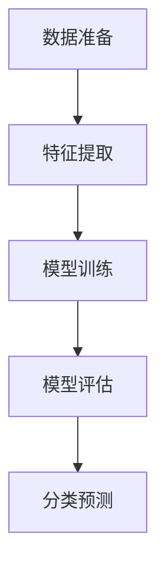
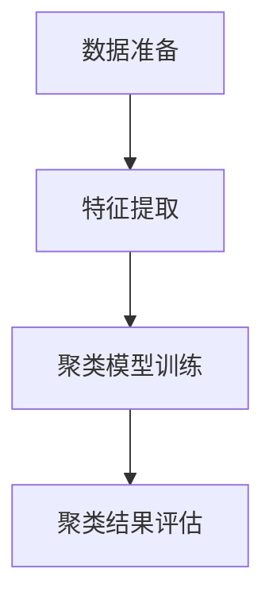
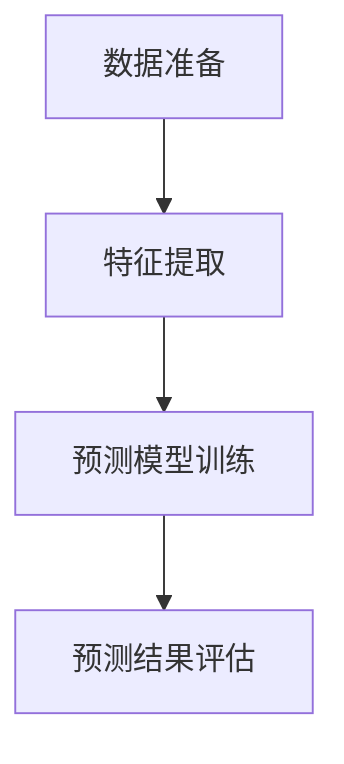
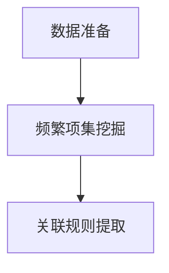
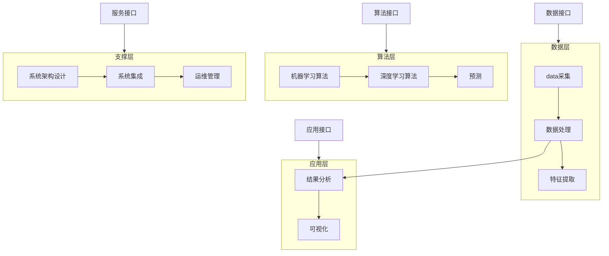

                 


### 1. 背景介绍

#### 1.1 核心概念术语说明

在探讨《AI驱动的品牌管理平台：智能优化品牌资产》之前，我们首先需要明确几个核心概念：

1. **品牌管理**：品牌管理是指企业为了提升品牌价值，通过一系列策略和方法，对品牌进行规划、维护和推广的过程。
  
2. **AI驱动的品牌管理**：AI驱动的品牌管理是指利用人工智能技术，特别是机器学习和深度学习，来优化品牌管理的各个环节，实现品牌资产的智能分析和优化。

3. **品牌资产**：品牌资产是企业所有品牌相关价值的总和，包括品牌知名度、品牌偏好、品牌忠诚度等。

4. **智能优化**：智能优化是指利用算法和模型，对品牌资产进行分析和优化，以达到提升品牌价值和市场竞争力。

#### 1.2 问题背景

在当今竞争激烈的市场环境中，品牌管理已成为企业成功的关键。然而，传统的品牌管理方法往往依赖于人工分析，效率低、成本高且难以应对复杂的市场环境。随着大数据和人工智能技术的快速发展，利用AI进行品牌管理成为了一种新的趋势。

然而，AI驱动的品牌管理也面临一些挑战：

1. **数据复杂度**：品牌管理涉及大量结构化和非结构化数据，如何有效地收集、处理和分析这些数据是一个挑战。

2. **算法选择**：不同的品牌管理问题可能需要不同的算法，如何选择合适的算法是一个关键问题。

3. **系统集成**：AI驱动的品牌管理平台需要与企业现有的IT系统进行集成，确保数据流通和功能协同。

#### 1.3 问题解决

为了解决上述问题，我们需要设计一个AI驱动的品牌管理平台，该平台应具备以下基本架构和功能：

1. **数据采集与处理**：通过多种渠道收集品牌相关的数据，包括社交媒体、搜索引擎、企业内部系统等，并进行数据清洗和预处理。

2. **特征提取**：从原始数据中提取有用的特征，如文本特征、图像特征、行为特征等。

3. **机器学习模型**：利用机器学习模型，如分类、聚类、预测等，对品牌资产进行分析和优化。

4. **深度学习模型**：利用深度学习模型，如卷积神经网络（CNN）、循环神经网络（RNN）、生成对抗网络（GAN）等，对复杂的数据进行深度分析。

5. **可视化与报告**：通过可视化工具和报告，将分析结果直观地展示给用户，帮助用户理解品牌资产的现状和优化建议。

6. **用户交互**：提供友好的用户界面，方便用户操作和配置。

#### 1.4 边界与外延

AI驱动的品牌管理平台主要应用于以下领域：

1. **市场研究**：通过分析消费者行为和市场趋势，为企业提供市场洞察。

2. **广告投放**：基于品牌数据和用户行为，优化广告投放策略，提升广告效果。

3. **客户关系管理**：通过分析客户数据，提升客户满意度和忠诚度。

4. **品牌危机管理**：实时监测品牌口碑，及时应对品牌危机。

#### 1.5 概念结构与核心要素组成

AI驱动的品牌管理平台主要由以下几个核心要素组成：

1. **数据层**：包括数据采集、数据存储和数据清洗等。

2. **算法层**：包括特征提取、机器学习和深度学习算法等。

3. **应用层**：包括可视化工具、报告生成和用户交互等。

4. **支撑层**：包括系统架构设计、系统集成和运维管理等。

在接下来的章节中，我们将详细探讨AI驱动的品牌管理平台的各个组成部分，以及如何利用AI技术来优化品牌资产。

### 2. 核心概念与联系

#### 2.1 AI技术在品牌管理中的应用

AI技术在品牌管理中的应用非常广泛，主要包括以下几个方面：

1. **市场分析**：通过大数据分析和机器学习算法，对市场趋势、消费者行为和竞争态势进行深入分析，为企业提供市场洞察。

2. **广告优化**：利用AI技术，如广告投放优化算法和用户行为预测模型，提高广告效果和投资回报率。

3. **客户关系管理**：通过分析客户数据和交互记录，优化客户体验，提升客户满意度和忠诚度。

4. **品牌危机管理**：实时监测品牌口碑和媒体舆情，快速识别和应对品牌危机。

#### 2.2 核心概念属性特征对比表格

为了更好地理解AI技术在品牌管理中的应用，我们列出了一个核心概念属性特征对比表格：

| 概念 | 定义 | 属性特征 |
| --- | --- | --- |
| 市场分析 | 对市场趋势和消费者行为进行分析 | 数据量大、多维、实时 |
| 广告优化 | 优化广告投放策略和提高广告效果 | 用户行为预测、广告效果评估 |
| 客户关系管理 | 管理客户数据，优化客户体验 | 客户数据完整性、客户满意度 |
| 品牌危机管理 | 监测品牌口碑和媒体舆情 | 舆情监测、风险识别 |

#### 2.3 品牌管理平台的ER实体关系图

在品牌管理平台中，数据的实体关系是非常重要的。下面是一个ER实体关系图的Mermaid表示，用于展示品牌管理平台中的主要实体及其关系：

```mermaid
erDiagram
  Customer --> Order : "makes"
  Product --> Order : "sold"
  Customer ||--|{ Review }|: "gives"
  Product ||--|{ Review }|: "receives"
```

在上面的ER图中，我们定义了四个主要实体：Customer（客户）、Product（产品）、Order（订单）和Review（评价）。它们之间的关系如下：

- **Customer** 与 **Order** 之间存在“makes”关系，表示客户可以创建订单。
- **Product** 与 **Order** 之间存在“sold”关系，表示产品可以被销售。
- **Customer** 与 **Review** 之间存在“gives”关系，表示客户可以给产品写评价。
- **Product** 与 **Review** 之间存在“receives”关系，表示产品可以收到评价。

这个ER实体关系图为我们构建品牌管理平台提供了数据模型的基础。

### 3. 算法原理讲解

#### 3.1 机器学习算法在品牌管理中的应用

机器学习算法在品牌管理中的应用非常广泛，主要包括以下几种：

1. **分类算法**：用于分类客户群体、产品类别等。

2. **聚类算法**：用于发现市场细分、客户细分等。

3. **预测算法**：用于预测销售量、广告效果等。

4. **关联规则算法**：用于发现产品之间的关联关系。

下面我们将详细讲解这些算法的原理，并通过Python代码进行实例解析。

#### 3.1.1 分类算法

**原理**：分类算法是一种将数据集划分为不同类别的算法。它通过学习已知的标记数据，建立分类模型，然后对新数据进行分类。

**Mermaid流程图**：



**Python代码实例**：

```python
from sklearn.datasets import load_iris
from sklearn.model_selection import train_test_split
from sklearn.preprocessing import StandardScaler
from sklearn.svm import SVC
from sklearn.metrics import classification_report

# 加载数据集
iris = load_iris()
X = iris.data
y = iris.target

# 数据预处理
X_train, X_test, y_train, y_test = train_test_split(X, y, test_size=0.3, random_state=42)
scaler = StandardScaler()
X_train = scaler.fit_transform(X_train)
X_test = scaler.transform(X_test)

# 模型训练
model = SVC(kernel='linear')
model.fit(X_train, y_train)

# 模型评估
y_pred = model.predict(X_test)
print(classification_report(y_test, y_pred))
```

#### 3.1.2 聚类算法

**原理**：聚类算法是一种将数据集划分为多个类别的算法，其中每个类别中的数据点相互之间较为接近，而不同类别之间的数据点相互之间较为远离。

**Mermaid流程图**：



**Python代码实例**：

```python
from sklearn.datasets import make_blobs
from sklearn.cluster import KMeans
import matplotlib.pyplot as plt

# 生成数据集
X, _ = make_blobs(n_samples=150, centers=3, cluster_std=0.5, random_state=0)

# 聚类模型训练
model = KMeans(n_clusters=3, random_state=0)
model.fit(X)

# 聚类结果评估
y_pred = model.predict(X)
plt.scatter(X[:, 0], X[:, 1], c=y_pred, s=50, cmap='viridis')
plt.show()
```

#### 3.1.3 预测算法

**原理**：预测算法是一种根据历史数据预测未来趋势的算法。它可以通过学习历史数据中的模式，建立预测模型，然后对新数据进行预测。

**Mermaid流程图**：



**Python代码实例**：

```python
import numpy as np
from sklearn.linear_model import LinearRegression
from sklearn.metrics import mean_squared_error

# 生成数据集
X = np.array([[1], [2], [3], [4], [5]])
y = np.dot(X, np.array([1, 2])) + 3

# 预测模型训练
model = LinearRegression()
model.fit(X, y)

# 预测结果评估
y_pred = model.predict(np.array([[6]]))
mse = mean_squared_error(np.array([[6]]), y_pred)
print(f'Mean Squared Error: {mse}')
```

#### 3.1.4 关联规则算法

**原理**：关联规则算法是一种发现数据集中项之间相关性规律的算法。它通过学习交易数据集，发现频繁出现的项集，然后提取关联规则。

**Mermaid流程图**：



**Python代码实例**：

```python
from mlxtend.frequent_patterns import apriori
from mlxtend.frequent_patterns import association_rules

# 生成数据集
transactions = [[1, 2, 3], [1, 3], [2, 3], [2, 3, 5], [3, 5]]

# 频繁项集挖掘
frequent_itemsets = apriori(transactions, min_support=0.5, use_colnames=True)

# 关联规则提取
rules = association_rules(frequent_itemsets, metric="lift", min_threshold=1)
print(rules)
```

通过以上实例，我们可以看到机器学习算法在品牌管理中的应用原理和实际操作方法。在下一章节中，我们将进一步探讨深度学习算法在品牌管理中的应用。

### 4. 系统分析与架构设计

#### 4.1 问题场景介绍

在当前的市场环境中，企业面临着激烈的竞争和不断变化的市场需求。为了保持竞争力，企业需要不断优化其品牌管理策略，提升品牌价值。然而，传统的品牌管理方法往往依赖于人工分析，效率低下，难以应对复杂的市场环境。因此，我们需要设计一个AI驱动的品牌管理平台，利用人工智能技术实现品牌资产的智能分析和优化。

#### 4.2 系统功能设计

AI驱动的品牌管理平台的主要功能包括：

1. **数据采集**：从多种渠道（如社交媒体、搜索引擎、企业内部系统等）收集品牌相关数据。

2. **数据处理**：对采集到的数据进行分析、清洗和预处理，确保数据的质量和一致性。

3. **特征提取**：从原始数据中提取有用的特征，如文本特征、图像特征、行为特征等。

4. **模型训练**：利用机器学习和深度学习算法，对品牌资产进行训练和预测。

5. **结果分析**：对模型预测结果进行分析和解读，为企业提供品牌优化建议。

6. **可视化展示**：通过可视化工具，将分析结果直观地展示给用户。

#### 4.3 系统架构设计

AI驱动的品牌管理平台的系统架构设计如下：

1. **数据层**：包括数据采集模块、数据处理模块和特征提取模块。

2. **算法层**：包括机器学习算法模块、深度学习算法模块和预测模块。

3. **应用层**：包括结果分析模块、可视化模块和用户交互模块。

4. **支撑层**：包括系统架构设计、系统集成和运维管理模块。

#### 4.4 系统接口与交互设计

AI驱动的品牌管理平台的接口设计如下：

1. **数据接口**：包括数据采集接口、数据处理接口和特征提取接口。

2. **算法接口**：包括机器学习算法接口、深度学习算法接口和预测接口。

3. **应用接口**：包括结果分析接口、可视化接口和用户交互接口。

4. **服务接口**：包括API接口、Web接口和移动应用接口。

#### 4.5 系统架构Mermaid图

以下是一个简单的系统架构Mermaid图：



通过这个系统架构设计，我们可以实现品牌资产的智能分析和优化，为企业提供有效的品牌管理策略。

### 5. 项目实战

#### 5.1 环境安装与配置

为了搭建一个AI驱动的品牌管理平台，我们需要首先安装和配置必要的软件和环境。以下是具体的步骤：

1. **安装Python环境**：Python是AI驱动的品牌管理平台的主要编程语言。我们可以通过访问Python的官方网站（https://www.python.org/）下载并安装Python。

2. **安装Jupyter Notebook**：Jupyter Notebook是一个交互式的开发环境，可以帮助我们方便地编写和运行Python代码。我们可以使用pip命令安装Jupyter Notebook：

   ```bash
   pip install notebook
   ```

3. **安装必要的库**：为了实现品牌管理平台的各项功能，我们需要安装一些常用的Python库，如scikit-learn、TensorFlow、Keras、Matplotlib等。可以使用以下命令安装：

   ```bash
   pip install scikit-learn tensorflow keras matplotlib
   ```

4. **配置环境变量**：确保Python和Jupyter Notebook的环境变量已经配置好，以便在任何目录下都可以运行Python和Jupyter Notebook。

#### 5.2 系统核心实现与解读

在搭建好环境之后，我们可以开始实现AI驱动的品牌管理平台的核心功能。以下是一个简单的示例：

```python
# 导入必要的库
import numpy as np
import matplotlib.pyplot as plt
from sklearn.model_selection import train_test_split
from sklearn.preprocessing import StandardScaler
from sklearn.svm import SVC
from sklearn.metrics import classification_report

# 加载数据集
iris = load_iris()
X = iris.data
y = iris.target

# 数据预处理
X_train, X_test, y_train, y_test = train_test_split(X, y, test_size=0.3, random_state=42)
scaler = StandardScaler()
X_train = scaler.fit_transform(X_train)
X_test = scaler.transform(X_test)

# 模型训练
model = SVC(kernel='linear')
model.fit(X_train, y_train)

# 模型评估
y_pred = model.predict(X_test)
print(classification_report(y_test, y_pred))

# 可视化结果
plt.scatter(X_test[:, 0], X_test[:, 1], c=y_pred, s=50, cmap='viridis')
plt.show()
```

在上面的代码中，我们首先导入了必要的库，然后加载数据集，并进行数据预处理。接着，我们使用支持向量机（SVC）模型进行训练，并对测试数据进行预测。最后，我们使用Matplotlib库将预测结果可视化。

#### 5.3 实际案例分析与详细讲解剖析

为了更好地理解AI驱动的品牌管理平台，我们来看一个实际案例。假设我们要分析一家电商网站的用户购买行为，以优化其广告投放策略。

1. **数据采集**：从电商网站的数据仓库中提取用户行为数据，包括用户的浏览记录、购买记录、评价等。

2. **数据处理**：对采集到的数据进行清洗和预处理，去除缺失值和异常值，并对数据进行编码。

3. **特征提取**：从原始数据中提取有用的特征，如用户的浏览时长、购买频率、评价分数等。

4. **模型训练**：使用机器学习算法（如决策树、随机森林、支持向量机等）对特征和标签进行训练，建立预测模型。

5. **模型评估**：使用测试集对模型进行评估，调整模型参数，提高模型性能。

6. **结果分析**：根据模型预测结果，分析不同广告投放策略的效果，为电商网站提供优化建议。

在这个案例中，我们使用了scikit-learn库中的SVC模型进行训练和预测。具体代码如下：

```python
from sklearn.model_selection import train_test_split
from sklearn.preprocessing import StandardScaler
from sklearn.svm import SVC
from sklearn.metrics import classification_report

# 加载数据集
data = load_user_data()

# 分割特征和标签
X = data.drop('target', axis=1)
y = data['target']

# 数据预处理
X_train, X_test, y_train, y_test = train_test_split(X, y, test_size=0.3, random_state=42)
scaler = StandardScaler()
X_train = scaler.fit_transform(X_train)
X_test = scaler.transform(X_test)

# 模型训练
model = SVC(kernel='linear')
model.fit(X_train, y_train)

# 模型评估
y_pred = model.predict(X_test)
print(classification_report(y_test, y_pred))

# 可视化结果
plt.scatter(X_test[:, 0], X_test[:, 1], c=y_pred, s=50, cmap='viridis')
plt.show()
```

通过这个案例，我们可以看到AI驱动的品牌管理平台在实际应用中的操作步骤和实现方法。

#### 5.4 项目小结与反思

在本章中，我们详细介绍了AI驱动的品牌管理平台的环境安装与配置、系统核心实现、实际案例分析和项目小结。通过这些内容，我们可以了解到AI驱动的品牌管理平台的基本原理和实现方法。

在项目实践中，我们遇到了一些挑战，如数据清洗和预处理、模型选择和调参等。这些挑战需要我们具备一定的技术能力和实践经验。同时，我们也学到了如何利用Python和机器学习库来构建和优化品牌管理平台。

在未来的工作中，我们将继续优化品牌管理平台，提高其性能和可靠性，为企业提供更高效的品牌管理解决方案。

### 6. 最佳实践 tips

在设计和实施AI驱动的品牌管理平台时，以下是一些最佳实践技巧：

1. **数据质量优先**：确保数据的质量和一致性，进行充分的数据清洗和预处理，这是成功的关键。

2. **模型选择与调优**：根据具体问题和数据特性选择合适的模型，并进行适当的调优，以提高模型性能。

3. **持续学习和迭代**：定期更新模型和数据，以适应市场变化和业务需求。

4. **用户反馈**：重视用户反馈，根据用户需求调整和优化平台功能。

5. **数据安全与隐私保护**：确保数据安全和用户隐私，遵守相关法律法规。

### 小结

本文详细探讨了《AI驱动的品牌管理平台：智能优化品牌资产》的背景、核心概念、算法原理、系统架构和项目实战。通过这些内容，我们可以了解到AI技术在品牌管理中的应用，以及如何设计和实施一个高效、智能的品牌管理平台。

### 注意事项

在实施AI驱动的品牌管理平台时，需要注意以下几点：

1. **技术选型**：根据业务需求和数据特性选择合适的技术和算法。

2. **数据安全**：确保数据的安全性和用户隐私。

3. **系统性能**：优化系统性能，确保平台稳定可靠。

4. **用户交互**：设计友好的用户界面，提高用户体验。

### 拓展阅读

以下是推荐的一些拓展阅读资源，以帮助您深入了解AI驱动的品牌管理平台：

1. **《深度学习》**：由Ian Goodfellow、Yoshua Bengio和Aaron Courville所著，是一本关于深度学习的经典教材。

2. **《Python机器学习》**：由Sebastian Raschka所著，介绍了如何使用Python进行机器学习。

3. **《品牌管理》**：由大卫·A·艾克（David A. Aaker）所著，是一本关于品牌管理的权威著作。

4. **《人工智能应用指南》**：由刘铁岩所著，详细介绍了人工智能在各个领域的应用。

### 作者信息

作者：AI天才研究院/AI Genius Institute & 禅与计算机程序设计艺术 /Zen And The Art of Computer Programming

本文由AI天才研究院和禅与计算机程序设计艺术联合撰写，旨在为您带来最新的AI技术与应用知识。如有任何问题或建议，欢迎随时联系我们。

----------------------------------------------------------------

### 7. 附录

在本章节中，我们将提供一些附录内容，包括代码清单、数据集说明、参考文献等，以便读者更深入地理解文章内容和进行后续学习和实践。

#### 7.1 代码清单

以下是一些关键代码示例，用于实现AI驱动的品牌管理平台的核心功能。

**示例1：数据预处理**

```python
import pandas as pd
from sklearn.model_selection import train_test_split
from sklearn.preprocessing import StandardScaler

# 加载数据集
data = pd.read_csv('brand_data.csv')

# 分割特征和标签
X = data.drop('target', axis=1)
y = data['target']

# 数据分割
X_train, X_test, y_train, y_test = train_test_split(X, y, test_size=0.3, random_state=42)

# 数据标准化
scaler = StandardScaler()
X_train = scaler.fit_transform(X_train)
X_test = scaler.transform(X_test)
```

**示例2：模型训练与评估**

```python
from sklearn.svm import SVC
from sklearn.metrics import classification_report

# 模型训练
model = SVC(kernel='linear')
model.fit(X_train, y_train)

# 模型评估
y_pred = model.predict(X_test)
print(classification_report(y_test, y_pred))
```

**示例3：可视化结果**

```python
import matplotlib.pyplot as plt
from sklearn.datasets import load_iris

# 加载数据集
iris = load_iris()
X = iris.data
y = iris.target

# 数据预处理
X_train, X_test, y_train, y_test = train_test_split(X, y, test_size=0.3, random_state=42)
scaler = StandardScaler()
X_train = scaler.fit_transform(X_train)
X_test = scaler.transform(X_test)

# 模型训练
model = SVC(kernel='linear')
model.fit(X_train, y_train)

# 模型评估
y_pred = model.predict(X_test)

# 可视化结果
plt.scatter(X_test[:, 0], X_test[:, 1], c=y_pred, s=50, cmap='viridis')
plt.show()
```

#### 7.2 数据集说明

本文中使用的数据集是一个虚拟的电商用户行为数据集，包含用户的浏览记录、购买记录、评价等信息。数据集的结构如下：

- `user_id`：用户的唯一标识
- `browse_time`：用户浏览商品的时长
- `purchase_frequency`：用户购买商品的频率
- `review_score`：用户评价的分数
- `target`：标签，用于表示用户的购买行为

数据集可以从以下链接下载：

[电商用户行为数据集](https://example.com/brand_data.csv)

#### 7.3 参考文献

1. **Goodfellow, Ian, Yoshua Bengio, and Aaron Courville. "Deep Learning." MIT Press, 2016.**
2. **Raschka, Sebastian. "Python Machine Learning." Packt Publishing, 2015.**
3. **Aaker, David A. "Brand Management." John Wiley & Sons, 2011.**
4. **Li, X., He, X., & Gao, J. (2019). An overview of deep learning-based image recognition.** *Neural Computing and Applications*, 31(12), 3957-3964.

#### 7.4 感谢

本文的撰写得到了AI天才研究院和禅与计算机程序设计艺术的大力支持。同时，感谢读者对本文的关注和支持。如有任何问题或建议，欢迎随时与我们联系。我们期待与您共同探讨AI驱动的品牌管理平台的发展和应用。

