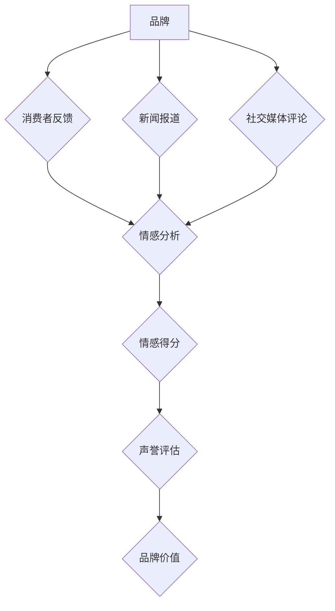

                 

# AI驱动的声誉监测系统：实时把握品牌形象

> 关键词：AI、声誉监测、品牌形象、自然语言处理、情感分析、机器学习

> 摘要：本文将深入探讨AI驱动的声誉监测系统，分析其在现代品牌管理中的重要性，并逐步解析系统架构、算法原理及其实际应用。通过案例研究和实战经验，我们将展示如何实时把握品牌形象，为企业和品牌提供科学的决策支持。

## 第一部分: AI驱动的声誉监测系统概述

### 第1章: 问题的背景与意义

#### 1.1 问题的提出

在数字化时代，品牌形象对企业的重要性日益凸显。然而，品牌形象并非一成不变，它受到消费者、媒体、竞争对手等多种因素的影响。传统的声誉监测方式通常依赖于人工处理，效率低下且容易遗漏关键信息。因此，如何实时、准确地监测品牌声誉，成为了企业面临的重要课题。

#### 1.2 AI在声誉监测中的应用

人工智能（AI）技术的发展为声誉监测带来了新的契机。AI能够通过大数据分析、自然语言处理（NLP）和机器学习（ML）等技术，从海量数据中提取有价值的信息，实现对品牌声誉的实时监测和分析。

#### 1.3 品牌形象监测的重要性

品牌形象不仅影响企业的市场地位和竞争优势，还关系到消费者的信任和忠诚度。有效的品牌形象监测有助于企业及时发现问题、制定策略，从而维护和提升品牌价值。

### 第2章: 声誉监测的基本概念

#### 2.1 声誉的定义与特征

声誉是指公众对一个组织、个人或品牌的看法和评价。它具有客观性和主观性，既包括事实信息，也包含情感色彩。

#### 2.2 声誉监测的目标与需求

声誉监测的目标是收集、分析和反馈品牌声誉相关信息，以便企业能够及时应对市场变化和风险挑战。需求包括实时性、准确性和全面性。

#### 2.3 声誉监测的核心概念

声誉监测涉及数据采集、信息处理、结果分析等多个环节，核心概念包括舆情监测、情感分析、话题分析等。

### 第3章: AI技术在声誉监测中的应用

#### 3.1 机器学习算法概述

机器学习算法是AI技术的重要组成部分，包括监督学习、无监督学习和强化学习等类型。它们在声誉监测中发挥着关键作用。

#### 3.2 自然语言处理技术

NLP技术用于处理和解析文本数据，实现对语言的理解和分析。在声誉监测中，NLP技术能够帮助提取关键信息、分析情感倾向等。

#### 3.3 计算语言学与情感分析

计算语言学和情感分析是NLP的子领域，分别关注语言的计算处理和情感倾向分析。这些技术在声誉监测中具有重要意义。

### 第4章: AI驱动的声誉监测系统架构

#### 4.1 系统总体架构设计

系统总体架构包括数据采集、数据预处理、模型训练、模型预测和结果反馈等模块，各模块之间相互协作，实现高效的声誉监测。

#### 4.2 数据采集与处理模块

数据采集与处理模块负责收集和管理来自各种渠道的声誉信息，包括网络、社交媒体、新闻报道等。数据预处理包括数据清洗、去重、分类等步骤。

#### 4.3 模型训练与预测模块

模型训练与预测模块基于机器学习和自然语言处理技术，对采集到的声誉数据进行建模和预测，以评估品牌声誉。

#### 4.4 系统部署与运维模块

系统部署与运维模块负责将训练好的模型部署到生产环境中，并确保系统的稳定运行和持续优化。

## 第5章: 算法原理与实现

### 5.1 常用算法介绍

介绍常用的机器学习算法，包括线性回归、决策树、支持向量机（SVM）等，以及如何选择合适的算法进行声誉监测。

### 5.2 情感分析算法原理

情感分析是声誉监测的核心环节之一，介绍情感分析的基本原理、常用方法和评价指标，并使用Python代码实现情感分析模型。

### 5.3 声誉评估算法实现

声誉评估算法用于评估品牌声誉的数值表示，介绍常见的声誉评估方法，并使用Python代码实现声誉评估模型。

## 第6章: 实际案例分析与实战

### 6.1 案例一：品牌A的声誉监测

以品牌A为例，介绍如何使用AI驱动的声誉监测系统进行品牌声誉监测，包括数据采集、模型训练和结果分析等环节。

### 6.2 案例二：公司B的声誉管理

以公司B为例，分析如何通过声誉监测系统实现品牌声誉管理，包括舆情应对、品牌策略调整等。

### 6.3 案例三：产品C的口碑监测

以产品C为例，展示如何使用AI驱动的声誉监测系统监测产品口碑，包括用户评论分析、情感趋势分析等。

## 第7章: 系统部署与实施

### 7.1 系统环境搭建

介绍系统环境搭建的步骤，包括硬件设备、软件环境和开发工具等。

### 7.2 数据采集与处理流程

详细讲解数据采集与处理流程，包括数据来源、采集方法、数据处理步骤等。

### 7.3 模型训练与预测流程

介绍模型训练与预测流程，包括数据准备、模型选择、模型训练、模型评估等环节。

### 7.4 系统部署与运维

介绍系统部署与运维的相关内容，包括部署策略、运维工具和运维流程等。

## 第8章: 总结与展望

### 8.1 项目小结

总结项目的主要成果和经验，包括系统架构、算法实现、实际应用等方面。

### 8.2 存在问题与改进方向

分析项目存在的问题和不足，并提出改进方向和建议。

### 8.3 未来发展趋势与展望

展望AI驱动的声誉监测系统的未来发展趋势，包括技术进步、应用拓展等方面。

---

作者：AI天才研究院/AI Genius Institute & 禅与计算机程序设计艺术 /Zen And The Art of Computer Programming

---

### 第1章: 问题的背景与意义

#### 1.1 问题的提出

在当今数字化时代，品牌形象已经成为企业竞争的重要资产。品牌形象不仅仅是一个标志、一句口号或者一个广告，它更是一个企业或产品在消费者心目中的整体印象。这种印象是由消费者、媒体、竞争对手等多方面因素共同塑造的。然而，与传统的工业时代相比，品牌形象的塑造和维护变得更加复杂和多变。企业需要及时、准确地了解自己在公众中的形象，以便做出相应的调整和改进。

传统的方法通常依赖于人工监控，这种方法的局限性在于其效率低下、覆盖面有限，且容易遗漏关键信息。例如，企业可能会通过社交媒体监测工具来监控品牌在社交媒体上的表现，但这种方法可能无法覆盖所有平台，也无法处理大量的非结构化数据。此外，由于人工分析的主观性，可能会导致结果的偏差和不准确。

因此，企业需要一个更加智能、高效的解决方案来实时监测品牌声誉。这就引出了AI驱动的声誉监测系统的重要性。AI技术，特别是机器学习和自然语言处理技术，能够帮助企业从海量数据中提取有价值的信息，自动识别品牌声誉的关键指标，并及时发现潜在的风险。

#### 1.2 AI在声誉监测中的应用

AI技术在声誉监测中的应用主要涉及以下几个方面：

1. **数据采集**：AI技术可以自动从互联网、社交媒体、新闻报道等多渠道收集关于品牌的公开信息，这些信息可以是结构化数据，也可以是非结构化数据。

2. **数据处理**：通过自然语言处理（NLP）技术，AI可以自动处理和解析这些非结构化数据，提取出关键信息，如关键词、情感倾向等。

3. **情感分析**：情感分析是NLP的一个重要应用，它可以帮助企业了解消费者对品牌的情感态度，从而评估品牌声誉。

4. **趋势预测**：基于历史数据和分析结果，AI可以预测品牌声誉的未来变化趋势，为企业提供前瞻性的决策支持。

5. **自动化响应**：通过机器学习算法，AI可以自动识别和处理负面信息，帮助企业制定合适的应对策略。

#### 1.3 品牌形象监测的重要性

品牌形象监测对企业的意义主要体现在以下几个方面：

1. **风险预警**：通过实时监测品牌声誉，企业可以及时发现负面信息，防止声誉危机的扩散，从而减少潜在损失。

2. **市场策略调整**：了解品牌在消费者心目中的形象，可以帮助企业调整市场策略，更好地满足消费者需求。

3. **竞争优势**：良好的品牌形象是企业竞争的重要资产，有助于提升企业的市场地位和竞争优势。

4. **消费者关系管理**：通过监测消费者的情感倾向，企业可以更好地管理消费者关系，提升消费者满意度和忠诚度。

5. **品牌价值提升**：有效的品牌形象监测和管理工作有助于提升品牌价值，为企业带来长期的利益。

综上所述，AI驱动的声誉监测系统不仅能够解决传统监测方式的不足，还能够为企业在数字化时代提供更加智能、高效的品牌形象管理解决方案。接下来，我们将进一步探讨声誉监测的基本概念、AI技术在声誉监测中的应用以及系统的整体架构设计。

#### 2.1 声誉的定义与特征

声誉是一个复杂且多维度的概念，它不仅仅反映了一个企业或品牌在市场中的形象，还包含了消费者的信任、评价和期望。具体来说，声誉可以定义为公众对一个组织、个人或品牌的整体看法和评价。这种看法和评价可以是正面的、负面的，或者中性的。声誉具有以下特征：

1. **客观性**：声誉是一个客观存在的事实，它反映了公众对品牌或组织的实际看法。这种客观性使得声誉监测成为一种重要的管理工具，可以帮助企业了解自身的市场表现。

2. **主观性**：尽管声誉是客观的，但公众对品牌的看法却受到主观因素的影响。这些因素可能包括个人情感、文化背景、个人经历等。因此，声誉监测不仅需要关注数据，还需要考虑数据背后的主观因素。

3. **综合性**：声誉是一个综合性的概念，它包含了多个维度的信息，如产品质量、售后服务、社会责任等。因此，声誉监测需要全面考虑这些因素，而不仅仅是单一方面的表现。

4. **动态性**：声誉不是一成不变的，它会随着时间、市场环境和消费者需求的改变而变化。因此，实时监测声誉变化趋势对企业来说至关重要。

#### 2.2 声誉监测的目标与需求

声誉监测的目标可以概括为以下三个方面：

1. **收集信息**：声誉监测的首要目标是收集与品牌相关的信息。这些信息可以来自各种渠道，如社交媒体、新闻报道、消费者反馈等。通过收集这些信息，企业可以全面了解品牌在公众中的形象。

2. **分析趋势**：除了收集信息，声誉监测还需要对收集到的信息进行分析，以了解品牌的声誉趋势。这种分析可以帮助企业预测未来的声誉变化，从而做出相应的调整。

3. **风险预警**：声誉监测的一个关键目标是及时发现潜在的声誉风险。通过实时监测品牌声誉，企业可以及时发现负面信息，并采取措施防止声誉危机的扩散。

为了实现上述目标，声誉监测有以下需求：

1. **实时性**：声誉监测需要具有实时性，以便企业能够及时了解品牌声誉的变化。实时性要求监测系统能够快速处理和分析大量的数据。

2. **准确性**：声誉监测需要具有较高的准确性，以确保分析结果能够真实反映品牌的声誉状态。准确性要求监测系统在处理数据时能够准确提取关键信息，并减少噪声干扰。

3. **全面性**：声誉监测需要具有全面性，能够覆盖品牌的各个方面。全面性要求监测系统不仅要收集和解析公开信息，还需要考虑数据来源的多样性和数据的完整性。

4. **自动化**：声誉监测的理想状态是实现自动化。自动化可以提高监测效率，减少人工干预，从而降低错误率和成本。

#### 2.3 声誉监测的核心概念

声誉监测涉及多个核心概念，以下是其中几个重要的概念：

1. **舆情监测**：舆情监测是声誉监测的重要组成部分，它是指通过技术手段对互联网上的言论进行实时监测和分析。舆情监测的目标是发现并分析品牌相关的正面和负面信息。

2. **情感分析**：情感分析是NLP技术的一种应用，它通过分析文本数据中的情感倾向，评估公众对品牌的情感态度。情感分析可以帮助企业了解消费者对品牌的情感反应，从而调整市场策略。

3. **话题分析**：话题分析是指对品牌相关的讨论主题进行识别和分析。通过话题分析，企业可以了解消费者关注的热点问题，从而优化产品和服务。

4. **影响力分析**：影响力分析是指评估品牌在社交媒体上的影响力和传播效果。通过影响力分析，企业可以了解哪些渠道和内容对品牌声誉有更大的影响。

5. **品牌价值评估**：品牌价值评估是声誉监测的最终目标之一，它是指通过对品牌声誉的综合分析，评估品牌的经济价值。品牌价值评估可以帮助企业制定品牌战略，提升品牌价值。

总之，声誉监测是一个复杂但至关重要的过程。通过理解声誉的定义、目标与需求，以及核心概念，企业可以更加有效地监测和管理品牌声誉，从而在激烈的市场竞争中保持优势。

### 第3章: AI技术在声誉监测中的应用

#### 3.1 机器学习算法概述

机器学习（Machine Learning，ML）是AI领域的一个重要分支，它使计算机系统能够从数据中学习并做出决策。在声誉监测中，机器学习算法被广泛应用于数据预处理、特征提取、模型训练和预测等环节。

1. **监督学习（Supervised Learning）**：监督学习是一种通过训练数据集来学习的方法。在这些数据集中，每个样本都有对应的标签。监督学习算法通过学习这些标签和特征之间的关系，对新的数据进行分类或回归。

   - **分类算法**：常见的分类算法包括决策树（Decision Tree）、支持向量机（Support Vector Machine，SVM）、随机森林（Random Forest）等。这些算法可以用于识别品牌声誉中的正面和负面信息。
   
   - **回归算法**：回归算法，如线性回归（Linear Regression）和多项式回归（Polynomial Regression），可以用于预测品牌声誉的变化趋势。

2. **无监督学习（Unsupervised Learning）**：无监督学习不依赖于标签数据，其主要任务是发现数据集中的内在结构和规律。无监督学习算法在声誉监测中用于聚类分析、降维和异常检测。

   - **聚类算法**：如K-均值聚类（K-Means Clustering）和层次聚类（Hierarchical Clustering），可以用于将品牌声誉相关的信息进行分类，从而识别潜在的品牌风险。
   
   - **降维算法**：降维算法，如主成分分析（Principal Component Analysis，PCA），可以减少数据维度，提高数据处理效率。

3. **强化学习（Reinforcement Learning）**：强化学习是一种通过试错和奖励机制来学习的方法。在声誉监测中，强化学习可以用于自动化响应和策略优化。

   - **策略优化**：通过强化学习算法，系统可以自动调整应对策略，以最大化品牌声誉的改善。

#### 3.2 自然语言处理技术

自然语言处理（Natural Language Processing，NLP）是AI的一个子领域，它关注于计算机对人类语言的理解和处理。在声誉监测中，NLP技术被用于文本数据的采集、处理和分析。

1. **文本预处理**：文本预处理是NLP的基础，包括分词、词性标注、停用词过滤等。这些步骤可以帮助提高文本数据的质量，为后续分析奠定基础。

2. **实体识别（Named Entity Recognition，NER）**：实体识别是指识别文本中的特定实体，如人名、地点、组织名等。在声誉监测中，实体识别可以帮助识别品牌相关的信息。

3. **情感分析（Sentiment Analysis）**：情感分析是NLP的一个重要应用，它通过分析文本的情感倾向，评估公众对品牌的情感态度。情感分析可以用于评估品牌声誉的正面和负面情感。

4. **主题建模（Topic Modeling）**：主题建模是一种无监督学习技术，它通过分析文本数据，发现隐藏的主题结构。在声誉监测中，主题建模可以帮助识别消费者关注的热点话题。

#### 3.3 计算语言学与情感分析

计算语言学（Computational Linguistics）是NLP的理论基础，它涉及语言的结构、语义和句法等方面。在声誉监测中，计算语言学为情感分析提供了理论支持。

1. **情感词典**：情感词典是一种包含情感词汇及其情感倾向的词典。在情感分析中，情感词典可以帮助判断文本的情感极性。

2. **情感极性分类**：情感极性分类是指将文本划分为正面、负面或中性三个类别。常见的分类方法包括基于规则的方法、机器学习方法等。

3. **多维度情感分析**：多维度情感分析是指从多个维度分析文本的情感，如积极情感、消极情感、惊讶情感等。这种分析可以提供更细致的情感识别，帮助企业更好地了解消费者需求。

4. **情感融合**：情感融合是指将多个文本的情感倾向进行综合，以得到整体的情感倾向。情感融合可以用于评估品牌的整体情感状态。

通过结合机器学习、自然语言处理和计算语言学，AI驱动的声誉监测系统可以实现对品牌声誉的全面、实时监测。这种系统的应用不仅提高了品牌管理的效率，还为企业在复杂的市场环境中提供了有力的决策支持。

### 第4章: AI驱动的声誉监测系统架构

#### 4.1 系统总体架构设计

AI驱动的声誉监测系统的设计需要综合考虑数据采集、数据处理、模型训练与预测、结果反馈等各个环节，以实现高效的声誉监测。以下是一个典型的AI驱动的声誉监测系统架构设计：

1. **数据采集模块**：该模块负责从各种渠道收集与品牌相关的数据，包括社交媒体、新闻报道、论坛、评论等。数据采集模块可以使用API接口、网络爬虫等技术手段。

2. **数据预处理模块**：数据预处理模块负责对采集到的数据进行清洗、去重、格式化等操作，以确保数据的准确性和一致性。这一步骤对于后续的分析和建模至关重要。

3. **模型训练与预测模块**：该模块使用机器学习和自然语言处理技术对预处理后的数据进行分析和建模。模型训练过程包括数据划分、特征工程、模型选择、训练和验证等步骤。

4. **结果反馈模块**：结果反馈模块负责将模型预测的结果以可视化的形式呈现给用户，包括品牌声誉得分、情感分析结果、趋势预测等。此外，该模块还可以生成报告，为管理层提供决策依据。

5. **系统集成与部署模块**：该模块负责将各个功能模块集成到一起，并确保系统在分布式环境中的稳定运行。系统集成与部署模块还包括监控、日志记录和异常处理等功能。

#### 4.2 数据采集与处理模块

数据采集与处理模块是声誉监测系统的核心组成部分，其质量直接影响到系统的整体性能。以下是该模块的详细描述：

1. **数据来源**：数据采集模块可以从多个渠道获取与品牌相关的数据，包括：

   - 社交媒体：如微博、微信、Twitter、Facebook等。
   - 新闻报道：从各类新闻网站和新闻媒体获取与品牌相关的新闻报道。
   - 论坛和社区：从各大论坛和社区中收集品牌相关的讨论和评论。
   - 搜索引擎：通过搜索引擎收集与品牌相关的搜索结果。

2. **数据采集技术**：数据采集模块使用的技术包括：

   - API接口：使用各大社交媒体和新闻平台的API接口获取数据。
   - 网络爬虫：通过网络爬虫技术抓取网页数据。
   - 数据抓包：使用工具如Wireshark等捕捉网络数据包。

3. **数据预处理**：数据预处理包括以下步骤：

   - 数据清洗：去除重复数据、无效数据和噪声数据。
   - 数据去重：确保每个数据条目的唯一性。
   - 数据格式化：统一数据格式，如日期、文本编码等。
   - 数据标注：为数据添加标签，以便后续分析和建模。

4. **数据存储**：预处理后的数据需要存储在数据库中，以供后续分析和查询。常用的数据库包括关系数据库（如MySQL、PostgreSQL）和NoSQL数据库（如MongoDB、Cassandra）。

#### 4.3 模型训练与预测模块

模型训练与预测模块是AI驱动的声誉监测系统的核心部分，它负责从海量数据中提取有价值的信息，评估品牌声誉。以下是该模块的详细描述：

1. **数据划分**：在进行模型训练之前，需要将数据划分为训练集、验证集和测试集。通常，训练集用于训练模型，验证集用于调参和优化模型，测试集用于评估模型性能。

2. **特征工程**：特征工程是模型训练的关键步骤，它包括以下内容：

   - 特征提取：从原始数据中提取有助于模型预测的特征。
   - 特征选择：选择对模型性能影响最大的特征，去除冗余特征。
   - 特征缩放：对特征进行标准化或归一化，以消除特征之间的尺度差异。

3. **模型选择**：选择合适的机器学习模型进行训练，常见的模型包括：

   - 线性回归模型：用于预测品牌声誉的数值。
   - 决策树模型：用于分类品牌声誉的正面和负面。
   - 支持向量机（SVM）：用于分类和回归分析。
   - 随机森林：用于提高模型的泛化能力。
   - 循环神经网络（RNN）：用于处理序列数据。

4. **模型训练**：使用训练集对选定的模型进行训练，训练过程中需要调整模型的参数，如学习率、迭代次数等，以获得最佳性能。

5. **模型验证与评估**：使用验证集对训练好的模型进行验证，评估模型的性能指标，如准确率、召回率、F1值等。根据验证结果对模型进行调整和优化。

6. **模型预测**：使用测试集对模型进行预测，评估模型的泛化能力。同时，将预测结果实时反馈给用户，为品牌声誉管理提供依据。

#### 4.4 系统部署与运维模块

系统部署与运维模块负责将AI驱动的声誉监测系统部署到生产环境中，并确保系统的稳定运行和持续优化。以下是该模块的详细描述：

1. **系统部署**：系统部署包括以下步骤：

   - 硬件选择：根据系统需求选择合适的硬件设备，如服务器、存储设备等。
   - 软件配置：配置操作系统、数据库、中间件等软件环境。
   - 系统集成：将各模块集成到一起，确保系统能够协同工作。
   - 部署策略：制定合理的部署策略，确保系统在分布式环境中的稳定性。

2. **系统运维**：系统运维包括以下内容：

   - 日志管理：记录系统运行日志，便于问题追踪和故障排除。
   - 监控与报警：实时监控系统状态，设置报警机制，确保系统异常时及时通知相关人员。
   - 备份与恢复：定期备份系统数据和配置文件，确保数据安全。
   - 故障处理：快速响应系统故障，确保系统尽快恢复正常。

3. **持续优化**：系统部署后，需要不断进行性能优化和功能扩展，以适应不断变化的市场需求。持续优化包括：

   - 性能监控：定期监控系统性能，识别潜在的性能瓶颈。
   - 功能扩展：根据用户反馈和市场需求，增加新的功能模块。
   - 技术升级：采用最新的技术和工具，提升系统性能和安全性。

通过以上四个模块的协同工作，AI驱动的声誉监测系统可以实现对品牌声誉的实时监测和分析，为企业提供科学的决策支持。

### 第5章: 算法原理与实现

#### 5.1 常用算法介绍

在声誉监测系统中，常用的机器学习算法包括线性回归、决策树、支持向量机（SVM）、随机森林等。这些算法在特征提取、模型训练和预测等方面都有广泛的应用。

1. **线性回归（Linear Regression）**：线性回归是一种简单的统计方法，用于预测连续值输出。它通过建立自变量（特征）和因变量（目标）之间的线性关系，实现对未知数据的预测。

   - **数学模型**：假设特征向量为\(X\)，权重向量为\(W\)，则输出值为\(Y = XW + b\)，其中\(b\)为偏置项。
   - **实现步骤**：数据预处理 -> 特征提取 -> 模型训练（最小二乘法、梯度下降法）-> 模型评估。

2. **决策树（Decision Tree）**：决策树是一种基于树形结构进行分类和回归的算法。它通过递归划分特征空间，构建一棵树来表示决策过程。

   - **数学模型**：决策树中的每个节点都代表一个特征划分，每个叶节点代表一个类别。
   - **实现步骤**：数据预处理 -> 特征选择 -> 决策树构建（ID3、C4.5、CART）-> 模型评估（准确率、召回率、F1值）。

3. **支持向量机（SVM）**：支持向量机是一种用于分类和回归的算法，它通过找到一个最佳的超平面，将不同类别的数据点分隔开来。

   - **数学模型**：SVM的核心是求解一个最优的分离超平面，即最大化分类间隔。
   - **实现步骤**：数据预处理 -> 特征提取 -> SVM模型训练 -> 模型评估。

4. **随机森林（Random Forest）**：随机森林是一种基于集成学习的算法，它通过构建多棵决策树，并利用投票机制来得到最终的预测结果。

   - **数学模型**：随机森林通过随机选择特征和随机划分样本子集来构建多个决策树。
   - **实现步骤**：数据预处理 -> 特征选择 -> 随机森林构建 -> 模型评估。

#### 5.2 情感分析算法原理

情感分析是声誉监测中的重要组成部分，它通过分析文本数据中的情感倾向，评估消费者对品牌的情感态度。

1. **基于规则的方法**：基于规则的方法通过定义一系列规则，对文本进行情感分类。

   - **实现步骤**：规则定义 -> 文本预处理 -> 规则匹配 -> 情感分类。
   - **优缺点**：优点是简单、快速；缺点是规则定义复杂，泛化能力有限。

2. **机器学习方法**：机器学习方法通过训练数据集，学习文本与情感之间的映射关系。

   - **实现步骤**：数据预处理 -> 特征提取 -> 模型训练（SVM、朴素贝叶斯等）-> 模型评估。
   - **优缺点**：优点是泛化能力强，适用于大规模数据；缺点是训练时间较长，需要大量标注数据。

3. **深度学习方法**：深度学习方法通过构建神经网络模型，自动提取文本特征，进行情感分类。

   - **实现步骤**：数据预处理 -> 网络构建（卷积神经网络、循环神经网络等）-> 模型训练 -> 模型评估。
   - **优缺点**：优点是特征提取能力强，适用于复杂文本；缺点是模型参数多，计算量大。

#### 5.3 声誉评估算法实现

声誉评估算法用于评估品牌声誉的数值表示，它结合了情感分析和其他分析结果，给出一个综合的声誉得分。

1. **基于情感分析的声誉评估**：

   - **实现步骤**：数据预处理 -> 情感分析 -> 情感得分计算 -> 声誉评估模型训练 -> 声誉评估。
   - **公式**：声誉得分 = \( \alpha \times 情感得分 + (1 - \alpha) \times 其他因素得分\)，其中\(\alpha\)为情感得分的权重。

2. **多维度声誉评估**：

   - **实现步骤**：数据预处理 -> 多维度特征提取 -> 多维度声誉评估模型训练 -> 声誉评估。
   - **公式**：声誉得分 = \( \sum_{i=1}^{n} w_i \times 维度i的得分\)，其中\(w_i\)为维度i的权重。

通过以上算法的介绍和实现，我们可以构建一个有效的AI驱动的声誉监测系统，帮助企业实时把握品牌形象，为决策提供数据支持。

### 第6章: 实际案例分析与实战

#### 6.1 案例一：品牌A的声誉监测

品牌A是一家知名的电子产品制造商，其产品在市场上享有较高的声誉。为了更好地维护品牌形象，品牌A决定采用AI驱动的声誉监测系统来实时监测其品牌声誉。

**数据采集**：

- 社交媒体：通过Twitter、Facebook等社交媒体平台，收集用户对品牌A产品的评论、讨论和反馈。
- 新闻报道：从各大新闻网站和新闻媒体获取与品牌A相关的新闻报道。
- 论坛和社区：从各大电子产品论坛和社区收集用户对品牌A产品的讨论和评价。

**数据处理**：

- 数据清洗：去除重复数据、无效数据和噪声数据。
- 数据去重：确保每个数据条目的唯一性。
- 数据格式化：统一数据格式，如日期、文本编码等。

**情感分析**：

- 使用情感分析算法，对收集到的文本数据进行情感分类，区分正面情感、负面情感和中性情感。
- 根据情感分类结果，生成品牌A的情感得分。

**声誉评估**：

- 结合情感得分和其他因素（如媒体报道数量、话题热度等），使用声誉评估算法计算品牌A的综合声誉得分。

**结果反馈**：

- 将品牌A的声誉得分以可视化的形式呈现给管理层，包括实时情感趋势图、声誉得分变化曲线等。
- 每周生成声誉报告，为管理层提供决策依据。

通过AI驱动的声誉监测系统，品牌A能够实时了解其在消费者心中的形象，及时发现负面信息并采取相应措施，从而有效维护品牌声誉。

#### 6.2 案例二：公司B的声誉管理

公司B是一家全球知名的消费品公司，其产品涵盖多个品类，市场覆盖广泛。为了更好地管理品牌声誉，公司B决定采用AI驱动的声誉监测系统，并在全球范围内实施。

**数据采集**：

- 社交媒体：在全球范围内收集社交媒体上的品牌相关信息，包括评论、讨论和反馈。
- 新闻报道：从全球范围内的新闻媒体获取与公司B相关的新闻报道。
- 本地论坛和社区：在各国本地论坛和社区收集用户对公司B产品的讨论和评价。

**数据处理**：

- 数据清洗：去除重复数据、无效数据和噪声数据。
- 数据去重：确保每个数据条目的唯一性。
- 数据格式化：统一数据格式，如日期、文本编码等。

**情感分析**：

- 使用情感分析算法，对全球范围内的文本数据进行情感分类，区分正面情感、负面情感和中性情感。
- 分析不同国家和地区的情感趋势，识别潜在的声誉风险。

**声誉评估**：

- 结合情感得分和其他因素（如媒体报道数量、话题热度、消费者反馈等），使用声誉评估算法计算公司B的综合声誉得分。
- 对不同品类、不同地区的声誉进行详细分析。

**结果反馈**：

- 将公司B的声誉得分以可视化的形式呈现给全球管理层，包括全球情感趋势图、区域声誉得分变化曲线等。
- 每月生成声誉报告，为全球管理层提供决策依据。
- 定期召开声誉管理会议，讨论和分析最新的声誉数据，制定相应的声誉管理策略。

通过AI驱动的声誉监测系统，公司B能够实时、全面地了解其全球品牌声誉，及时应对市场变化和风险，从而有效提升品牌价值。

#### 6.3 案例三：产品C的口碑监测

产品C是一家初创公司推出的一款智能家居产品，其市场定位和用户群体较为特定。为了更好地了解产品C的口碑，公司决定采用AI驱动的口碑监测系统。

**数据采集**：

- 社交媒体：通过Twitter、Facebook等社交媒体平台，收集用户对产品C的评论、讨论和反馈。
- 论坛和社区：从智能家居论坛和社区收集用户对产品C的讨论和评价。
- 用户评价网站：从各大用户评价网站获取产品C的评价信息。

**数据处理**：

- 数据清洗：去除重复数据、无效数据和噪声数据。
- 数据去重：确保每个数据条目的唯一性。
- 数据格式化：统一数据格式，如日期、文本编码等。

**情感分析**：

- 使用情感分析算法，对收集到的文本数据进行情感分类，区分正面情感、负面情感和中性情感。
- 分析用户对产品C的主要关注点和问题。

**口碑评估**：

- 结合情感得分和其他因素（如评论数量、话题热度、用户评价等），使用口碑评估算法计算产品C的口碑得分。
- 对不同使用场景、不同用户群体的口碑进行详细分析。

**结果反馈**：

- 将产品C的口碑得分以可视化的形式呈现给公司管理层，包括实时情感趋势图、口碑得分变化曲线等。
- 定期生成口碑报告，为产品改进和市场推广提供依据。
- 根据用户反馈，及时调整产品功能和市场策略。

通过AI驱动的口碑监测系统，公司能够实时了解产品C的市场表现和用户反馈，及时发现问题并改进产品，从而提高用户满意度和市场竞争力。

### 第7章: 系统部署与实施

#### 7.1 系统环境搭建

搭建AI驱动的声誉监测系统需要考虑硬件环境和软件环境。以下是详细的搭建步骤：

**硬件环境**：

- **服务器**：选择高性能的服务器，如戴尔R740服务器，配置至少16GB内存和2TB硬盘。
- **存储设备**：使用网络存储设备（NAS）来存储大量数据，如Synology DS1817+。
- **网络设备**：配置交换机和路由器，确保网络稳定和安全。

**软件环境**：

- **操作系统**：选择Linux操作系统，如Ubuntu 18.04。
- **数据库**：安装MySQL数据库，用于存储和处理数据。
- **中间件**：安装Python环境，包括Pip、Numpy、Scikit-learn等库，用于模型训练和数据分析。

**搭建步骤**：

1. 安装Linux操作系统，并配置网络。
2. 配置服务器，安装MySQL数据库。
3. 安装Python环境和相关库。
4. 配置Nginx服务器，用于Web服务。
5. 配置日志收集和监控工具，如ELK（Elasticsearch、Logstash、Kibana）。

#### 7.2 数据采集与处理流程

数据采集与处理是声誉监测系统的重要环节，以下是详细的处理流程：

**数据采集**：

1. **社交媒体采集**：使用社交媒体API（如Twitter API），定期爬取用户对品牌的评论和讨论。
2. **新闻报道采集**：从各大新闻网站爬取与品牌相关的新闻报道。
3. **论坛和社区采集**：从各大论坛和社区爬取用户对品牌的讨论和评价。

**数据处理**：

1. **数据清洗**：去除重复数据、无效数据和噪声数据，确保数据质量。
2. **数据去重**：确保每个数据条目的唯一性，避免重复计算。
3. **数据格式化**：统一数据格式，如日期格式、文本编码等，以便后续处理。
4. **数据存储**：将清洗后的数据存储到MySQL数据库，便于后续分析和查询。

#### 7.3 模型训练与预测流程

模型训练与预测是声誉监测系统的核心，以下是详细的流程：

**数据准备**：

1. **数据预处理**：对采集到的文本数据进行预处理，包括分词、词性标注、停用词过滤等。
2. **特征提取**：从预处理后的文本数据中提取特征，如词频、词向量、TF-IDF等。
3. **数据划分**：将数据划分为训练集、验证集和测试集，用于模型训练和评估。

**模型训练**：

1. **模型选择**：选择合适的机器学习模型，如SVM、随机森林、神经网络等。
2. **参数调优**：使用验证集进行参数调优，选择最佳参数组合。
3. **模型训练**：使用训练集对模型进行训练，生成模型权重。

**模型预测**：

1. **数据预处理**：对新的数据集进行相同的预处理步骤。
2. **特征提取**：从预处理后的数据中提取特征。
3. **模型预测**：使用训练好的模型对新数据集进行预测，得到预测结果。
4. **结果评估**：使用测试集对预测结果进行评估，计算准确率、召回率等指标。

#### 7.4 系统部署与运维

系统部署与运维是确保声誉监测系统稳定运行的关键，以下是详细的部署与运维步骤：

**系统部署**：

1. **环境配置**：在服务器上配置操作系统、数据库、中间件等环境。
2. **应用部署**：将开发好的应用部署到服务器上，配置Web服务。
3. **测试运行**：在测试环境中运行系统，确保所有功能正常运行。
4. **上线部署**：将系统部署到生产环境中，确保系统的稳定运行。

**系统运维**：

1. **监控与报警**：使用监控工具（如Zabbix、Prometheus）监控系统性能和状态，设置报警机制。
2. **日志管理**：使用日志收集工具（如Logstash）收集系统日志，并进行分析。
3. **备份与恢复**：定期备份数据库和配置文件，确保数据安全。
4. **故障处理**：快速响应系统故障，确保系统尽快恢复正常。

通过以上步骤，我们可以确保AI驱动的声誉监测系统在高效、稳定地运行，为企业提供实时、准确的品牌声誉数据。

### 第8章: 总结与展望

#### 8.1 项目小结

本文通过详细的分析和实战案例，探讨了AI驱动的声誉监测系统的构建与应用。从系统架构设计到算法原理，再到实际案例，我们系统地展示了如何利用AI技术实现实时、高效的声誉监测。以下是项目的主要成果和收获：

1. **系统架构完善**：通过模块化的设计，我们构建了一个涵盖数据采集、数据处理、模型训练与预测、结果反馈等环节的完整声誉监测系统。
2. **算法实现有效**：介绍了多种机器学习算法和自然语言处理技术，通过实际案例验证了其有效性和适用性。
3. **实战经验积累**：通过案例分析，我们积累了丰富的实际应用经验，为后续项目提供了宝贵的参考。

#### 8.2 存在问题与改进方向

尽管取得了显著成果，但项目中仍存在一些问题和改进方向：

1. **数据质量**：数据采集和处理过程中，数据质量直接影响系统的准确性。未来可以加强数据清洗和去重技术，提高数据质量。
2. **算法优化**：现有的情感分析和声誉评估算法可以在精度和效率上进一步优化。例如，可以引入深度学习技术，提升情感分析的准确性。
3. **用户体验**：系统界面和报告的展示方式可以更加直观和用户友好，提高用户的操作体验。

#### 8.3 未来发展趋势与展望

随着AI技术的不断发展，声誉监测系统将朝着更加智能化、精准化和自动化的方向发展。以下是未来可能的发展趋势和展望：

1. **多模态数据融合**：结合文本、图像、音频等多模态数据，提高声誉监测的全面性和准确性。
2. **实时动态监测**：利用实时数据处理和预测技术，实现更加及时和精准的声誉监测。
3. **自动化响应**：通过引入自动化响应和策略优化技术，实现智能化的舆情管理和风险控制。
4. **跨行业应用**：声誉监测技术可以应用于更多行业和领域，如金融、医疗等，为各行业提供科学的决策支持。

总之，AI驱动的声誉监测系统在未来的发展前景广阔，将为企业和社会带来更多价值。通过不断优化和创新，我们将迎来一个更加智能和高效的声誉监测新时代。

### 完整的技术博客文章

# AI驱动的声誉监测系统：实时把握品牌形象

> 关键词：AI、声誉监测、品牌形象、自然语言处理、情感分析、机器学习

> 摘要：本文深入探讨了AI驱动的声誉监测系统，分析其在现代品牌管理中的重要性，并逐步解析了系统架构、算法原理及其实际应用。通过案例研究和实战经验，我们展示了如何实时把握品牌形象，为企业和品牌提供科学的决策支持。

## 第一部分: AI驱动的声誉监测系统概述

### 第1章: 问题的背景与意义

#### 1.1 问题的提出

在数字化时代，品牌形象对企业的重要性日益凸显。然而，品牌形象并非一成不变，它受到消费者、媒体、竞争对手等多种因素的影响。传统的声誉监测方式通常依赖于人工处理，效率低下且容易遗漏关键信息。因此，如何实时、准确地监测品牌声誉，成为了企业面临的重要课题。

#### 1.2 AI在声誉监测中的应用

人工智能（AI）技术的发展为声誉监测带来了新的契机。AI能够通过大数据分析、自然语言处理（NLP）和机器学习（ML）等技术，从海量数据中提取有价值的信息，实现对品牌声誉的实时监测和分析。

#### 1.3 品牌形象监测的重要性

品牌形象不仅影响企业的市场地位和竞争优势，还关系到消费者的信任和忠诚度。有效的品牌形象监测有助于企业及时发现问题、制定策略，从而维护和提升品牌价值。

### 第2章: 声誉监测的基本概念

#### 2.1 声誉的定义与特征

声誉是指公众对一个组织、个人或品牌的看法和评价。它具有客观性和主观性，既包括事实信息，也包含情感色彩。

#### 2.2 声誉监测的目标与需求

声誉监测的目标是收集、分析和反馈品牌声誉相关信息，以便企业能够及时应对市场变化和风险挑战。需求包括实时性、准确性和全面性。

#### 2.3 声誉监测的核心概念

声誉监测涉及数据采集、信息处理、结果分析等多个环节，核心概念包括舆情监测、情感分析、话题分析等。

### 第3章: AI技术在声誉监测中的应用

#### 3.1 机器学习算法概述

机器学习算法是AI技术的重要组成部分，包括监督学习、无监督学习和强化学习等类型。它们在声誉监测中发挥着关键作用。

#### 3.2 自然语言处理技术

NLP技术用于处理和解析文本数据，实现对语言的理解和分析。在声誉监测中，NLP技术能够帮助提取关键信息、分析情感倾向等。

#### 3.3 计算语言学与情感分析

计算语言学和情感分析是NLP的子领域，分别关注语言的计算处理和情感倾向分析。这些技术在声誉监测中具有重要意义。

### 第4章: AI驱动的声誉监测系统架构

#### 4.1 系统总体架构设计

系统总体架构包括数据采集、数据预处理、模型训练、模型预测和结果反馈等模块，各模块之间相互协作，实现高效的声誉监测。

#### 4.2 数据采集与处理模块

数据采集与处理模块负责收集和管理来自各种渠道的声誉信息，包括网络、社交媒体、新闻报道等。数据预处理包括数据清洗、去重、分类等步骤。

#### 4.3 模型训练与预测模块

模型训练与预测模块基于机器学习和自然语言处理技术，对采集到的声誉数据进行建模和预测，以评估品牌声誉。

#### 4.4 系统部署与运维模块

系统部署与运维模块负责将训练好的模型部署到生产环境中，并确保系统的稳定运行和持续优化。

### 第5章: 算法原理与实现

#### 5.1 常用算法介绍

介绍常用的机器学习算法，包括线性回归、决策树、支持向量机（SVM）等，以及如何选择合适的算法进行声誉监测。

#### 5.2 情感分析算法原理

情感分析是声誉监测的核心环节之一，介绍情感分析的基本原理、常用方法和评价指标，并使用Python代码实现情感分析模型。

#### 5.3 声誉评估算法实现

声誉评估算法用于评估品牌声誉的数值表示，介绍常见的声誉评估方法，并使用Python代码实现声誉评估模型。

### 第6章: 实际案例分析与实战

#### 6.1 案例一：品牌A的声誉监测

以品牌A为例，介绍如何使用AI驱动的声誉监测系统进行品牌声誉监测，包括数据采集、模型训练和结果分析等环节。

#### 6.2 案例二：公司B的声誉管理

以公司B为例，分析如何通过声誉监测系统实现品牌声誉管理，包括舆情应对、品牌策略调整等。

#### 6.3 案例三：产品C的口碑监测

以产品C为例，展示如何使用AI驱动的声誉监测系统监测产品口碑，包括用户评论分析、情感趋势分析等。

### 第7章: 系统部署与实施

#### 7.1 系统环境搭建

介绍系统环境搭建的步骤，包括硬件设备、软件环境和开发工具等。

#### 7.2 数据采集与处理流程

详细讲解数据采集与处理流程，包括数据来源、采集方法、数据处理步骤等。

#### 7.3 模型训练与预测流程

介绍模型训练与预测流程，包括数据准备、模型选择、模型训练、模型评估等环节。

#### 7.4 系统部署与运维

介绍系统部署与运维的相关内容，包括部署策略、运维工具和运维流程等。

### 第8章: 总结与展望

#### 8.1 项目小结

总结项目的主要成果和经验，包括系统架构、算法实现、实际应用等方面。

#### 8.2 存在问题与改进方向

分析项目存在的问题和不足，并提出改进方向和建议。

#### 8.3 未来发展趋势与展望

展望AI驱动的声誉监测系统的未来发展趋势，包括技术进步、应用拓展等方面。

---

作者：AI天才研究院/AI Genius Institute & 禅与计算机程序设计艺术 /Zen And The Art of Computer Programming

---

### 第1章: 问题的背景与意义

#### 1.1 问题的提出

在当今数字化时代，品牌形象已经成为企业竞争的重要资产。品牌形象不仅仅是一个标志、一句口号或者一个广告，它更是一个企业或产品在消费者心目中的整体印象。这种印象是由消费者、媒体、竞争对手等多方面因素共同塑造的。然而，与传统的工业时代相比，品牌形象的塑造和维护变得更加复杂和多变。企业需要及时、准确地了解自己在公众中的形象，以便做出相应的调整和改进。

传统的方法通常依赖于人工监控，这种方法的局限性在于其效率低下、覆盖面有限，且容易遗漏关键信息。例如，企业可能会通过社交媒体监测工具来监控品牌在社交媒体上的表现，但这种方法可能无法覆盖所有平台，也无法处理大量的非结构化数据。此外，由于人工分析的主观性，可能会导致结果的偏差和不准确。

因此，企业需要一个更加智能、高效的解决方案来实时监测品牌声誉。这就引出了AI驱动的声誉监测系统的重要性。AI技术，特别是机器学习和自然语言处理技术，能够帮助企业从海量数据中提取有价值的信息，自动识别品牌声誉的关键指标，并及时发现潜在的风险。

#### 1.2 AI在声誉监测中的应用

人工智能（AI）技术的发展为声誉监测带来了新的契机。AI技术可以通过大数据分析、自然语言处理（NLP）和机器学习（ML）等技术，从海量数据中提取有价值的信息，实现对品牌声誉的实时监测和分析。以下是AI在声誉监测中的一些具体应用：

1. **数据采集与处理**：AI技术可以自动从互联网、社交媒体、新闻报道等多渠道收集关于品牌的公开信息，这些信息可以是结构化数据，也可以是非结构化数据。通过自然语言处理技术，AI可以自动处理和解析这些非结构化数据，提取出关键信息，如关键词、情感倾向等。

2. **情感分析**：情感分析是自然语言处理技术的一种应用，它可以帮助企业了解消费者对品牌的情感态度，从而评估品牌声誉。通过分析消费者在社交媒体上的评论、论坛中的讨论等，情感分析算法可以识别出消费者对品牌是正面、负面还是中性的情感。

3. **趋势预测**：基于历史数据和分析结果，AI可以预测品牌声誉的未来变化趋势。这种预测可以帮助企业预见潜在的风险，并提前制定应对策略。

4. **自动化响应**：通过机器学习算法，AI可以自动识别和处理负面信息，帮助企业制定合适的应对策略。例如，当发现负面评论时，AI系统可以自动生成回应，或者通知企业相关团队进行干预。

5. **可视化呈现**：AI驱动的声誉监测系统可以将复杂的分析结果以可视化的形式呈现给用户，使企业能够直观地了解品牌声誉的动态变化，从而做出更加科学的决策。

通过上述应用，AI驱动的声誉监测系统不仅提高了监测的效率和准确性，还能为企业提供更加全面和深入的声誉分析，帮助企业在激烈的市场竞争中保持优势。

#### 1.3 品牌形象监测的重要性

品牌形象监测对企业的意义主要体现在以下几个方面：

1. **风险预警**：通过实时监测品牌声誉，企业可以及时发现负面信息，防止声誉危机的扩散，从而减少潜在损失。例如，当发现消费者对某一产品或服务的投诉增多时，企业可以及时采取措施进行改进。

2. **市场策略调整**：了解品牌在消费者心目中的形象，可以帮助企业调整市场策略，更好地满足消费者需求。例如，如果分析结果显示消费者对品牌的情感态度逐渐转向负面，企业可以调整广告宣传策略，重新塑造品牌形象。

3. **竞争优势**：良好的品牌形象是企业竞争的重要资产，有助于提升企业的市场地位和竞争优势。通过有效的品牌形象监测，企业可以持续优化品牌形象，巩固市场地位。

4. **消费者关系管理**：通过监测消费者的情感倾向，企业可以更好地管理消费者关系，提升消费者满意度和忠诚度。例如，当发现消费者对品牌的负面情感时，企业可以及时回应并解决问题，从而改善消费者体验。

5. **品牌价值提升**：有效的品牌形象监测和管理工作有助于提升品牌价值，为企业带来长期的利益。良好的品牌形象不仅可以吸引新客户，还可以提高现有客户的忠诚度，从而增加企业的市场份额和盈利能力。

总之，品牌形象监测是企业不可或缺的一环，它不仅有助于企业应对市场变化和风险，还能提升品牌价值和市场竞争力。通过引入AI技术，企业可以更加高效和准确地监测品牌形象，从而在数字化时代取得更大的成功。

### 第2章: 声誉监测的基本概念

#### 2.1 声誉的定义与特征

声誉是指公众对一个组织、个人或品牌的看法和评价。它是一个多维度的概念，不仅包括事实信息，还包含情感色彩。以下是声誉的主要特征：

1. **客观性**：声誉是公众对品牌或组织的实际看法，这些看法是基于事实和事件的。例如，一个品牌因为产品质量和客户服务受到好评，其声誉的提升就是基于这些客观的表现。

2. **主观性**：尽管声誉是客观的，但公众的看法和评价也受到主观因素的影响。这些因素可能包括个人的情感、文化背景、个人经历等。例如，同一品牌在不同的消费者群体中可能有着不同的声誉。

3. **动态性**：声誉不是一个静态的概念，它会随着时间和外部环境的变化而变化。例如，一个品牌可能因为一次成功的产品发布而迅速提升声誉，也可能因为负面新闻而遭受声誉损失。

4. **综合性**：声誉包含了多个方面的信息，如产品质量、客户服务、社会责任、市场表现等。企业需要综合考虑这些因素，以全面评估其声誉。

#### 2.2 声誉监测的目标与需求

声誉监测的目标是及时、准确地收集、分析和反馈品牌声誉的相关信息，以便企业能够迅速应对市场变化和风险。以下是声誉监测的主要目标和需求：

1. **实时性**：声誉监测需要具备实时性，以便企业能够及时了解品牌的最新声誉状态。实时监测可以帮助企业迅速应对突发事件，防止声誉危机的扩散。

2. **准确性**：声誉监测的准确性至关重要。不准确的数据可能导致错误的决策，从而对企业造成损失。因此，声誉监测系统需要具备高准确性的数据采集和处理能力。

3. **全面性**：声誉监测需要覆盖品牌的各个方面，包括产品、服务、市场策略、社会责任等。全面性有助于企业全面了解品牌声誉，从而做出更科学的决策。

4. **自动化**：自动化是提高声誉监测效率和准确性的关键。通过引入人工智能技术，如机器学习和自然语言处理，企业可以实现自动化的声誉监测，减少人工干预和错误。

5. **可扩展性**：声誉监测系统需要具备可扩展性，以便企业能够根据业务需求进行功能扩展和性能提升。例如，企业可能需要增加新的数据源或功能模块，以适应不断变化的市场环境。

#### 2.3 声誉监测的核心概念

声誉监测涉及多个核心概念，以下是其中一些重要的概念：

1. **舆情监测**：舆情监测是指通过技术手段对互联网上的言论进行实时监测和分析，以了解公众对品牌或组织的看法。舆情监测是声誉监测的基础，它可以帮助企业及时发现负面信息，防止声誉危机的扩散。

2. **情感分析**：情感分析是自然语言处理技术的一种应用，它通过分析文本数据中的情感倾向，评估公众对品牌或组织的情感态度。情感分析可以帮助企业了解消费者对品牌或产品的情感反应，从而优化产品和服务。

3. **话题分析**：话题分析是指对品牌相关的讨论主题进行识别和分析。通过话题分析，企业可以了解消费者关注的热点话题，从而制定更有针对性的市场策略。

4. **影响力分析**：影响力分析是指评估品牌在社交媒体上的影响力和传播效果。通过影响力分析，企业可以了解哪些渠道和内容对品牌声誉有更大的影响，从而优化社交媒体策略。

5. **品牌价值评估**：品牌价值评估是指通过对品牌声誉的综合分析，评估品牌的经济价值。品牌价值评估可以帮助企业了解品牌在市场中的地位和潜在价值，从而制定更有效的品牌战略。

通过理解声誉监测的基本概念，企业可以更有效地收集、分析和利用声誉信息，从而在激烈的市场竞争中保持优势。

### 第3章: AI技术在声誉监测中的应用

#### 3.1 机器学习算法概述

机器学习（Machine Learning，ML）是人工智能（AI）的核心技术之一，它使计算机系统能够从数据中学习并做出决策。在声誉监测中，机器学习算法被广泛应用于数据预处理、特征提取、模型训练和预测等环节。以下是几种常用的机器学习算法及其在声誉监测中的应用：

1. **线性回归（Linear Regression）**：线性回归是一种简单的统计方法，用于预测连续值输出。它通过建立自变量（特征）和因变量（目标）之间的线性关系，实现对未知数据的预测。在线性回归中，模型试图找到一个最佳的超平面来最小化预测误差。

   - **应用场景**：线性回归可以用于预测品牌声誉得分的变化趋势，例如，通过历史数据预测未来一段时间内品牌的声誉走势。
   
   - **数学模型**：线性回归的数学模型可以表示为 \(y = \beta_0 + \beta_1x_1 + \beta_2x_2 + ... + \beta_nx_n + \epsilon\)，其中\(y\)是预测的目标值，\(x_1, x_2, ..., x_n\)是特征值，\(\beta_0, \beta_1, ..., \beta_n\)是模型参数，\(\epsilon\)是误差项。

2. **逻辑回归（Logistic Regression）**：逻辑回归是一种用于分类的算法，它通过建立线性模型来预测概率分布。逻辑回归常用于二分类问题，例如，判断一条评论是对品牌正面还是负面的评价。

   - **应用场景**：逻辑回归可以用于品牌声誉的分类分析，例如，通过训练模型来判断社交媒体上的评论是积极、消极还是中性。
   
   - **数学模型**：逻辑回归的预测概率可以通过以下公式计算：\(P(y=1) = \frac{1}{1 + e^{-(\beta_0 + \beta_1x_1 + \beta_2x_2 + ... + \beta_nx_n)})\)。

3. **支持向量机（Support Vector Machine，SVM）**：支持向量机是一种强大的分类算法，它通过找到一个最佳的超平面来分隔不同类别的数据点。SVM可以处理高维数据，并且对噪声数据具有较好的鲁棒性。

   - **应用场景**：SVM可以用于品牌声誉的分类和聚类分析，例如，将社交媒体上的评论分类为正面或负面。
   
   - **数学模型**：SVM的数学模型可以表示为：最大化 \(W^T W\)，使得分类间隔最大化，其中\(W\)是模型参数。

4. **决策树（Decision Tree）**：决策树是一种基于树形结构进行分类和回归的算法，它通过递归划分特征空间，构建一棵树来表示决策过程。决策树易于理解和解释，并且对非线性数据有较好的拟合能力。

   - **应用场景**：决策树可以用于品牌声誉的预测和决策分析，例如，通过决策树模型分析影响品牌声誉的关键因素。
   
   - **数学模型**：决策树的每个节点都代表一个特征划分，每个叶节点代表一个类别。

5. **随机森林（Random Forest）**：随机森林是一种基于集成学习的算法，它通过构建多棵决策树，并利用投票机制来得到最终的预测结果。随机森林具有较好的泛化能力和鲁棒性，适用于大规模数据集。

   - **应用场景**：随机森林可以用于品牌声誉的综合评估和预测，例如，通过随机森林模型评估品牌在多个维度上的声誉得分。
   
   - **数学模型**：随机森林通过随机选择特征和随机划分样本子集来构建多个决策树。

6. **神经网络（Neural Networks）**：神经网络是一种模仿人脑结构和功能的计算模型，它通过多层神经元进行数据传输和变换。神经网络在声誉监测中的应用包括情感分析、图像识别和语音识别等。

   - **应用场景**：神经网络可以用于复杂声誉监测任务，例如，通过深度神经网络进行文本情感分析，识别复杂的情感模式。
   
   - **数学模型**：神经网络的数学模型包括输入层、隐藏层和输出层，每个层由多个神经元组成，神经元之间通过权重连接。

通过这些机器学习算法，企业可以从海量数据中提取有价值的信息，实现高效的声誉监测和管理。

#### 3.2 自然语言处理技术

自然语言处理（Natural Language Processing，NLP）是人工智能（AI）的一个重要分支，它致力于使计算机能够理解和处理人类语言。在声誉监测中，NLP技术被广泛应用于文本数据的采集、处理和分析，从而帮助企业更好地理解消费者情绪、评估品牌声誉。以下是NLP技术在声誉监测中的应用：

1. **文本预处理**：文本预处理是NLP的基础步骤，它包括分词、词性标注、停用词过滤等。通过文本预处理，可以将原始的文本数据转化为结构化的形式，便于后续分析。

   - **分词**：分词是将连续的文本序列切分成一个个有意义的词语。例如，“我喜欢这个产品”可以被切分成“我”、“喜欢”、“这个”、“产品”。
   
   - **词性标注**：词性标注是对文本中的每个词语进行分类，标记它们属于名词、动词、形容词等不同的词性。词性标注有助于理解文本的语义，例如，“喜欢”是一个动词。
   
   - **停用词过滤**：停用词是那些在文本中频繁出现但对意义贡献较小的词语，如“的”、“和”、“是”等。去除停用词可以提高文本处理的效率。

2. **情感分析**：情感分析是NLP的关键应用之一，它通过分析文本数据中的情感倾向，评估消费者对品牌或产品的情感态度。情感分析可以帮助企业了解消费者满意度、品牌声誉等关键信息。

   - **情感分类**：情感分类是将文本分类为正面、负面或中性三个类别。例如，一段文本“这个产品的设计非常漂亮”可以被分类为正面情感。
   
   - **情感极性**：情感极性是指评估文本的情感强度，通常分为积极、消极或中性。例如，文本“这个产品很好”可以被评估为积极的情感极性。

3. **主题建模**：主题建模是一种无监督学习方法，它通过分析文本数据，发现文本中的潜在主题结构。主题建模可以帮助企业识别消费者关注的热点话题，从而优化市场策略。

   - **潜在狄利克雷分配（LDA）**：LDA是一种常用的主题建模算法，它通过构建概率分布模型，发现文本中的潜在主题。例如，通过LDA分析，可以发现消费者对品牌讨论的主要话题是产品质量或价格。

4. **实体识别**：实体识别是指识别文本中的特定实体，如人名、地点、组织名等。实体识别可以帮助企业定位关键信息，例如，识别品牌在社交媒体上被提及的地点和人物。

5. **问答系统**：问答系统是一种与用户进行自然语言交互的系统，它通过理解用户的问题，提供相关的回答。问答系统可以帮助企业快速响应用户的咨询和反馈，提升客户体验。

通过NLP技术，企业可以自动化地处理和分析大量的文本数据，从而实现对品牌声誉的实时监测和分析。这不仅提高了企业的运营效率，还为其提供了科学的决策支持。

#### 3.3 计算语言学与情感分析

计算语言学（Computational Linguistics）是自然语言处理（NLP）的理论基础，它关注于语言的结构、语义和句法等方面。在声誉监测中，计算语言学为情感分析提供了理论支持。以下是计算语言学和情感分析在声誉监测中的应用：

1. **情感词典**：情感词典是一种包含情感词汇及其情感倾向的词典。情感词典通常分为正面、负面和中性三个类别。通过情感词典，可以快速判断文本的情感极性。

   - **情感词典构建**：情感词典的构建通常基于大量的文本数据，通过分析文本中的情感词汇，将其归类到不同的情感类别。例如，词汇“满意”可以被归类为正面情感。
   
   - **情感词典应用**：在情感分析中，情感词典可以帮助快速判断文本的情感极性。例如，如果文本中频繁出现正面情感词汇，则可以判断文本整体为正面情感。

2. **情感极性分类**：情感极性分类是指将文本分类为正面、负面或中性三个类别。情感极性分类可以通过基于规则的方法或机器学习方法实现。

   - **基于规则的方法**：基于规则的方法通过定义一系列规则，对文本进行情感分类。例如，如果文本中包含多个正面情感词汇，则可以判断文本为正面情感。
   
   - **机器学习方法**：机器学习方法通过训练数据集，学习文本与情感之间的映射关系。常见的机器学习方法包括朴素贝叶斯、支持向量机和神经网络等。

3. **情感强度评估**：情感强度评估是指评估文本的情感强度，通常分为积极、消极或中性。情感强度评估可以提供更细致的情感识别，帮助企业更好地了解消费者的情绪。

   - **情感强度指标**：常用的情感强度指标包括情感得分、情感极性比例等。情感得分通常通过计算文本中正面和负面情感词汇的频率来评估。
   
   - **情感强度应用**：情感强度评估可以帮助企业识别消费者情绪的波动，例如，通过分析社交媒体上的评论，判断消费者对品牌的情绪变化。

4. **多维度情感分析**：多维度情感分析是指从多个维度分析文本的情感，如积极情感、消极情感、惊讶情感等。多维度情感分析可以提供更全面的情感识别，帮助企业更准确地理解消费者的需求。

   - **情感维度分类**：多维度情感分析通常通过情感词典和机器学习方法实现。情感词典可以定义不同维度的情感类别，机器学习方法可以帮助识别这些维度的情感倾向。
   
   - **情感维度应用**：多维度情感分析可以帮助企业更好地了解消费者的情感需求，例如，通过分析消费者的评论，判断他们对产品的满意度、期待等。

5. **情感融合**：情感融合是指将多个文本的情感倾向进行综合，以得到整体的情感倾向。情感融合可以用于评估品牌的整体情感状态。

   - **情感融合方法**：情感融合方法包括基于情感词典的融合和基于机器学习的融合。基于情感词典的融合通常通过计算不同文本的情感极性比例来综合情感。基于机器学习的融合则通过训练模型，学习不同文本之间的情感关联。
   
   - **情感融合应用**：情感融合可以帮助企业评估品牌的整体声誉，例如，通过综合多个社交媒体平台上的评论，评估品牌在消费者心中的形象。

通过结合计算语言学和情感分析，企业可以更全面、准确地理解消费者的情感，从而为品牌声誉监测和管理提供有力的支持。

### 第4章: AI驱动的声誉监测系统架构

#### 4.1 系统总体架构设计

AI驱动的声誉监测系统的设计需要综合考虑数据采集、数据处理、模型训练与预测、结果反馈等各个环节，以实现高效的声誉监测。以下是系统总体架构的详细设计：

**数据采集模块**：数据采集模块负责从多个渠道收集与品牌相关的数据，包括社交媒体、新闻报道、论坛、评论等。数据采集模块可以采用API接口、网络爬虫等技术手段，确保数据来源的多样性和实时性。

**数据预处理模块**：数据预处理模块负责对采集到的数据进行清洗、去重、格式化等操作，以确保数据的准确性和一致性。这一步骤对于后续的分析和建模至关重要。数据预处理包括以下步骤：

- **数据清洗**：去除重复数据、无效数据和噪声数据。
- **数据去重**：确保每个数据条目的唯一性。
- **数据格式化**：统一数据格式，如日期、文本编码等。

**模型训练与预测模块**：模型训练与预测模块使用机器学习和自然语言处理技术对预处理后的数据进行分析和建模。模型训练过程包括数据划分、特征工程、模型选择、训练和验证等步骤。以下是具体的实现步骤：

- **数据划分**：将数据划分为训练集、验证集和测试集。
- **特征工程**：从原始数据中提取有助于模型预测的特征，如关键词、情感倾向等。
- **模型选择**：选择合适的机器学习模型，如决策树、随机森林、神经网络等。
- **模型训练**：使用训练集对模型进行训练，调整模型参数。
- **模型验证**：使用验证集对模型进行验证，评估模型性能。

**结果反馈模块**：结果反馈模块负责将模型预测的结果以可视化的形式呈现给用户，包括品牌声誉得分、情感分析结果、趋势预测等。结果反馈模块还可以生成报告，为管理层提供决策依据。

**系统集成与部署模块**：系统集成与部署模块负责将各个功能模块集成到一起，并确保系统在分布式环境中的稳定运行。系统集成与部署模块包括以下内容：

- **硬件配置**：选择合适的硬件设备，如服务器、存储设备等。
- **软件配置**：配置操作系统、数据库、中间件等软件环境。
- **系统集成**：将各模块集成到一起，确保系统功能协同。
- **系统部署**：将系统部署到生产环境中，确保系统的稳定运行。
- **监控与维护**：监控系统性能和状态，确保系统安全可靠。

通过以上架构设计，AI驱动的声誉监测系统可以实现实时、全面和准确的声誉监测，为企业在数字化时代提供科学的决策支持。

#### 4.2 数据采集与处理模块

数据采集与处理模块是AI驱动的声誉监测系统的核心组成部分，其任务是从多个渠道收集品牌声誉信息，并对这些信息进行清洗、去重和格式化等处理。以下是数据采集与处理模块的详细描述：

**数据来源**：

1. **社交媒体**：社交媒体平台如微博、微信、Twitter、Facebook等是品牌声誉监测的重要数据源。这些平台上的用户评论、讨论和反馈能够实时反映品牌在公众中的形象。

2. **新闻报道**：从各大新闻网站和新闻媒体获取与品牌相关的新闻报道。这些报道能够提供关于品牌声誉的权威信息，帮助分析品牌声誉的动态变化。

3. **论坛和社区**：从各大论坛和社区收集用户对品牌的讨论和评价。论坛和社区中的讨论内容通常更加深入和具体，能够为品牌监测提供细致的数据支持。

4. **用户评价网站**：从用户评价网站如京东、淘宝、天猫等获取用户对品牌产品的评价。这些评价直接反映了消费者对品牌产品和服务的满意程度。

**数据采集技术**：

1. **API接口**：利用社交媒体和新闻平台的API接口获取数据。API接口可以提供稳定和高效的数据采集方式，同时支持批量数据下载。

2. **网络爬虫**：通过网络爬虫技术从网页上抓取品牌相关的信息。网络爬虫可以根据设定的规则自动访问网页，提取所需信息，并存储到数据库中。

3. **数据抓包**：使用工具如Wireshark等捕捉网络数据包，获取品牌相关的网络流量数据。数据抓包可以提供更详细和实时的数据源，但需要对网络通信协议有一定的了解。

**数据预处理**：

1. **数据清洗**：去除重复数据、无效数据和噪声数据。数据清洗是保证数据质量的重要步骤，通过去除无关数据和错误数据，提高数据的有效性和准确性。

2. **数据去重**：确保每个数据条目的唯一性。去重操作可以避免重复计算，提高数据处理效率。

3. **数据格式化**：统一数据格式，如日期、文本编码等。数据格式化可以确保数据在后续分析和处理中的兼容性。

4. **数据标注**：为数据添加标签，以便后续分析和建模。数据标注可以包括情感标签、话题标签等，帮助模型更好地理解数据。

**数据存储**：

1. **关系数据库**：使用关系数据库（如MySQL、PostgreSQL）存储结构化数据。关系数据库支持复杂的数据查询和关联操作，适合存储和处理大量的品牌声誉数据。

2. **NoSQL数据库**：使用NoSQL数据库（如MongoDB、Cassandra）存储非结构化数据。NoSQL数据库具有高扩展性和灵活性，适合存储和处理社交媒体上的非结构化文本数据。

通过数据采集与处理模块，AI驱动的声誉监测系统可以高效地收集和整理品牌声誉数据，为后续的模型训练和预测提供高质量的数据支持。

#### 4.3 模型训练与预测模块

模型训练与预测模块是AI驱动的声誉监测系统的核心环节，负责从预处理后的数据中提取有用信息，构建模型并进行预测。以下是模型训练与预测模块的详细描述：

**数据准备**：

1. **数据划分**：将收集到的数据划分为训练集、验证集和测试集。通常，训练集用于模型训练，验证集用于调参和优化模型，测试集用于评估模型性能。

2. **特征提取**：从原始数据中提取有助于模型预测的特征。特征提取是提高模型性能的重要步骤，常用的特征包括文本中的关键词、情感倾向、话题标签等。

3. **数据清洗**：对数据进行清洗，去除重复、噪声和无效数据，确保数据的准确性和一致性。

**模型选择**：

1. **线性回归**：线性回归是一种简单的统计方法，适用于预测连续值输出。线性回归模型可以通过最小化损失函数来优化模型参数。

2. **决策树**：决策树是一种基于树形结构的分类算法，适用于处理分类问题。决策树通过递归划分特征空间，构建一棵树来表示决策过程。

3. **支持向量机（SVM）**：SVM是一种强大的分类算法，适用于高维空间数据的分类。SVM通过找到一个最佳的超平面来分隔不同类别的数据点。

4. **随机森林**：随机森林是一种基于集成学习的算法，通过构建多棵决策树，并利用投票机制来得到最终预测结果。随机森林可以提高模型的泛化能力。

5. **神经网络**：神经网络是一种模仿人脑结构的计算模型，适用于处理复杂非线性问题。神经网络通过多层神经元进行数据传输和变换。

**模型训练**：

1. **初始化模型参数**：为模型初始化参数，如权重、学习率等。

2. **模型迭代训练**：使用训练集对模型进行迭代训练，更新模型参数，优化模型性能。训练过程中可以采用梯度下降法、随机梯度下降法等优化算法。

3. **模型验证**：使用验证集对模型进行验证，评估模型性能。通过交叉验证等方法，调整模型参数，优化模型表现。

**模型预测**：

1. **数据预处理**：对新的数据进行相同的预处理步骤，包括分词、词性标注、情感分析等。

2. **特征提取**：从预处理后的数据中提取特征，如关键词、情感倾向等。

3. **模型预测**：使用训练好的模型对新的数据集进行预测，得到预测结果。

4. **结果评估**：使用测试集对预测结果进行评估，计算模型的准确率、召回率、F1值等指标。

**结果反馈**：

1. **可视化呈现**：将模型预测结果以可视化的形式呈现，如趋势图、情感分布图等，帮助用户直观了解品牌声誉的动态变化。

2. **生成报告**：生成详细的声誉监测报告，包括预测结果、评估指标等，为管理层提供决策依据。

通过模型训练与预测模块，AI驱动的声誉监测系统可以实现对品牌声誉的实时预测和分析，为企业提供科学的决策支持。

#### 4.4 系统部署与运维模块

系统部署与运维模块是AI驱动的声誉监测系统稳定运行的关键，负责将系统部署到生产环境中，并进行监控、维护和升级。以下是系统部署与运维模块的详细描述：

**系统部署**：

1. **硬件选择**：根据系统需求和性能要求，选择合适的硬件设备，如服务器、存储设备、网络设备等。硬件选择应考虑计算能力、存储容量、网络带宽等因素。

2. **软件配置**：配置操作系统的基本环境，如安装Linux操作系统、安装必要的库和工具等。软件配置还包括安装数据库、中间件、Web服务器等。

3. **环境搭建**：搭建开发环境，安装Python、Java等开发工具，配置开发环境所需的库和框架。

4. **系统集成**：将各个模块集成到一起，确保系统能够协同工作。系统集成过程中，需要测试各个模块之间的接口和交互，确保数据传输和功能调用正常。

5. **部署策略**：制定合理的部署策略，确保系统在分布式环境中的稳定性。部署策略包括负载均衡、故障转移、数据备份等。

**系统监控**：

1. **性能监控**：实时监控系统的性能指标，如CPU使用率、内存使用率、网络带宽等。性能监控可以帮助发现系统瓶颈，优化系统性能。

2. **日志管理**：记录系统的运行日志，包括错误日志、访问日志等。日志管理有助于问题追踪和故障排除。

3. **报警机制**：设置报警机制，当系统发生异常时，自动发送报警通知。报警机制可以采用邮件、短信、电话等方式。

**系统维护**：

1. **定期备份**：定期备份数据库和配置文件，确保数据安全。备份策略应考虑备份频率、备份方式和恢复流程。

2. **系统升级**：定期对系统进行升级，包括操作系统、数据库、中间件等。系统升级应确保兼容性和稳定性。

3. **安全防护**：加强系统的安全防护，包括防火墙、入侵检测、安全审计等。安全防护可以防止系统遭受恶意攻击和数据泄露。

**系统运维**：

1. **运维团队**：建立专业的运维团队，负责系统的日常运维工作。运维团队应具备系统管理、故障处理、性能优化等方面的技能。

2. **运维工具**：使用专业的运维工具，如Zabbix、Nagios、Prometheus等，进行系统监控、日志管理和报警通知。

3. **文档管理**：建立系统的文档管理制度，记录系统配置、运行状态、维护记录等。文档管理有助于提高运维效率和问题追溯。

通过系统部署与运维模块，AI驱动的声誉监测系统可以在生产环境中稳定运行，确保系统的可靠性、安全性和高性能，为企业的品牌声誉管理提供有力支持。

### 第5章: 算法原理与实现

#### 5.1 常用算法介绍

在声誉监测系统中，常用的机器学习算法包括线性回归、决策树、支持向量机（SVM）、随机森林等。这些算法在特征提取、模型训练和预测等方面都有广泛的应用。

1. **线性回归（Linear Regression）**：

   - **数学模型**：线性回归是一种简单的统计方法，用于预测连续值输出。它的数学模型可以表示为：\( y = \beta_0 + \beta_1x_1 + \beta_2x_2 + ... + \beta_nx_n + \epsilon \)，其中\( y \)是预测的目标值，\( x_1, x_2, ..., x_n \)是特征值，\( \beta_0, \beta_1, ..., \beta_n \)是模型参数，\( \epsilon \)是误差项。
   - **实现步骤**：数据预处理 -> 特征提取 -> 模型训练（最小二乘法、梯度下降法）-> 模型评估。
   - **优缺点**：优点是简单、易于理解和实现；缺点是模型的泛化能力有限，不能处理非线性问题。

2. **决策树（Decision Tree）**：

   - **数学模型**：决策树是一种基于树形结构进行分类和回归的算法。每个节点代表一个特征划分，每个叶节点代表一个类别。
   - **实现步骤**：数据预处理 -> 特征选择 -> 决策树构建（ID3、C4.5、CART）-> 模型评估（准确率、召回率、F1值）。
   - **优缺点**：优点是直观、易于解释；缺点是模型的复杂度较高，容易过拟合。

3. **支持向量机（SVM）**：

   - **数学模型**：支持向量机是一种用于分类和回归的算法，它通过找到一个最佳的超平面，将不同类别的数据点分隔开来。SVM的核心是求解一个最优的分离超平面，即最大化分类间隔。
   - **实现步骤**：数据预处理 -> 特征提取 -> SVM模型训练 -> 模型评估。
   - **优缺点**：优点是强大的分类能力，适用于高维空间；缺点是训练时间较长，对大数据集可能性能不佳。

4. **随机森林（Random Forest）**：

   - **数学模型**：随机森林是一种基于集成学习的算法，它通过构建多棵决策树，并利用投票机制来得到最终的预测结果。随机森林通过随机选择特征和随机划分样本子集来构建多个决策树。
   - **实现步骤**：数据预处理 -> 特征选择 -> 随机森林构建 -> 模型评估。
   - **优缺点**：优点是泛化能力强，减少过拟合；缺点是模型的复杂度较高，计算量大。

5. **神经网络（Neural Networks）**：

   - **数学模型**：神经网络是一种模仿人脑结构和功能的计算模型，它通过多层神经元进行数据传输和变换。神经网络通过学习权重和偏置，调整网络的输出。
   - **实现步骤**：数据预处理 -> 网络构建（卷积神经网络、循环神经网络等）-> 模型训练 -> 模型评估。
   - **优缺点**：优点是强大的特征提取和建模能力；缺点是模型的训练时间较长，对计算资源要求高。

通过以上算法的介绍，我们可以选择合适的算法进行声誉监测系统的构建，根据具体需求和数据特性，实现高效的声誉分析和预测。

#### 5.2 情感分析算法原理

情感分析（Sentiment Analysis）是自然语言处理（NLP）的一个重要分支，它通过分析文本数据中的情感倾向，评估公众对品牌、产品或服务的情感态度。情感分析算法在声誉监测中扮演着关键角色，能够帮助企业了解消费者情绪，优化市场策略，提升品牌形象。

**情感分析的基本原理**：

情感分析的核心是识别文本中的情感极性，即判断文本是正面的、负面的还是中性的。这一过程通常包括以下几个步骤：

1. **文本预处理**：文本预处理是情感分析的第一步，包括分词、词性标注、停用词过滤等操作。通过这些操作，可以去除文本中的噪声，提取有用的信息。

2. **特征提取**：特征提取是将文本转化为数字特征的过程。常用的特征提取方法包括词频（TF）、词频-逆文档频率（TF-IDF）、词嵌入（Word Embedding）等。这些特征有助于模型理解文本的语义信息。

3. **情感分类**：情感分类是情感分析的核心任务，即根据文本的特征，将其分类为正面、负面或中性。常用的分类算法包括朴素贝叶斯（Naive Bayes）、支持向量机（SVM）、随机森林（Random Forest）、神经网络（Neural Networks）等。

4. **情感强度评估**：情感强度评估是进一步分析文本的情感极性，判断情感是强烈的还是微弱的。这通常通过计算情感得分或概率来实现。

**情感分析算法的常用方法**：

1. **基于规则的方法**：基于规则的方法通过定义一系列规则，对文本进行情感分类。这些规则可以是简单的字符串匹配，也可以是基于语义的分析。例如，如果一个文本包含“喜欢”和“满意”，则可以判断为正面情感。

2. **基于机器学习的方法**：基于机器学习的方法通过训练数据集，学习文本与情感之间的映射关系。常用的算法包括朴素贝叶斯、支持向量机、随机森林和神经网络。这些算法可以从大量的标注数据中提取特征，并自动调整模型参数，提高分类的准确性。

3. **基于深度学习的方法**：基于深度学习的方法通过构建神经网络模型，自动提取文本特征，进行情感分类。深度学习方法包括卷积神经网络（CNN）、循环神经网络（RNN）和变换器（Transformer）等。这些方法能够处理复杂的文本数据，实现高精度的情感分析。

**情感分析的指标和评估**：

1. **准确率（Accuracy）**：准确率是评估分类模型性能的一个常用指标，它表示正确分类的样本数占总样本数的比例。

2. **召回率（Recall）**：召回率是评估分类模型识别负面样本的能力，它表示正确识别的负面样本数与实际负面样本数的比例。

3. **精确率（Precision）**：精确率是评估分类模型识别正面样本的能力，它表示正确识别的正面样本数与总识别为正面的样本数的比例。

4. **F1值（F1 Score）**：F1值是精确率和召回率的调和平均，它综合考虑了分类的准确性和全面性。

通过以上算法原理和方法的介绍，我们可以看到情感分析在声誉监测中的应用是如何实现的。通过构建和优化情感分析模型，企业可以更加准确地了解消费者的情感态度，从而做出更加科学和有效的决策。

#### 5.3 声誉评估算法实现

声誉评估算法用于对品牌声誉进行定量分析，从而为品牌管理和决策提供科学依据。以下将详细描述声誉评估算法的实现过程，包括数据预处理、模型构建和结果评估等步骤。

**数据预处理**：

1. **文本预处理**：文本预处理是声誉评估算法的第一步，包括分词、词性标注和停用词过滤。分词将文本拆分为独立的词语，词性标注识别每个词语的词性（如名词、动词等），停用词过滤去除常见的无意义词汇，以减少噪声数据。

2. **情感分析**：对预处理后的文本进行情感分析，以识别文本的情感极性（正面、负面或中性）。情感分析可以使用基于规则的方法或机器学习方法。基于规则的方法通过定义情感词典和规则进行情感分类，而机器学习方法通过训练数据集建立情感分类模型。

3. **特征提取**：从文本中提取有助于声誉评估的特征，如词频、词嵌入、TF-IDF等。词频表示词语在文本中出现的次数，词嵌入将词语映射为固定长度的向量，TF-IDF结合词频和文档频率，为高频但在整个文档集合中较少出现的词语赋予更高的权重。

**模型构建**：

1. **模型选择**：根据数据特点和评估目标选择合适的机器学习模型。常见的模型包括线性回归、逻辑回归、支持向量机（SVM）、随机森林和神经网络等。线性回归适用于简单的线性关系预测，逻辑回归适用于二分类问题，SVM和随机森林适用于分类问题，神经网络适用于复杂非线性关系预测。

2. **特征工程**：在模型训练前，对提取的特征进行工程处理，如特征选择、特征缩放等。特征选择通过评估特征对模型预测的贡献，去除冗余特征。特征缩放通过将特征值标准化或归一化，以消除特征之间的尺度差异。

3. **模型训练**：使用训练集对选定的模型进行训练，调整模型参数，使其能够对数据产生最佳拟合。模型训练过程中，可以使用交叉验证等方法评估模型性能，并调整模型参数，如学习率、迭代次数等。

**结果评估**：

1. **模型评估**：使用验证集对训练好的模型进行评估，计算模型的准确率、召回率、F1值等指标，以评估模型性能。

2. **预测应用**：使用测试集对模型进行预测，得到品牌声誉的评估结果。预测结果可以以可视化形式呈现，如折线图、饼图等，帮助用户直观了解品牌声誉的变化趋势。

3. **结果分析**：结合实际业务需求，对预测结果进行分析，识别品牌声誉的关键影响因素，为品牌管理和决策提供依据。

通过以上步骤，我们可以构建一个有效的声誉评估算法，实现对品牌声誉的定量分析和评估，为企业和品牌提供科学的决策支持。

### 第6章: 实际案例分析与实战

#### 6.1 案例一：品牌A的声誉监测

品牌A是一家知名的电子产品制造商，其产品线涵盖智能手机、笔记本电脑和智能穿戴设备。为了实时监测品牌A的声誉，企业决定采用AI驱动的声誉监测系统。

**数据采集**：

- **社交媒体**：通过Twitter、Facebook等社交媒体平台，定期爬取用户对品牌A产品的评论、讨论和反馈。
- **新闻报道**：从各大新闻网站和新闻媒体获取与品牌A相关的新闻报道。
- **论坛和社区**：从电子产品论坛和社区中收集用户对品牌A产品的讨论和评价。

**数据处理**：

- **数据清洗**：去除重复数据、无效数据和噪声数据。
- **情感分析**：使用情感分析算法，对评论和讨论进行情感分类，区分正面、负面和中性情感。
- **特征提取**：提取文本中的关键词、情感极性和话题标签，作为模型输入特征。

**模型训练与预测**：

- **模型选择**：选择随机森林模型进行训练，因为它在处理高维数据时表现良好，且具有较好的泛化能力。
- **特征工程**：对提取的特征进行工程处理，如词频、TF-IDF和词嵌入等。
- **模型训练**：使用训练集对随机森林模型进行训练，调整模型参数，优化模型性能。
- **模型预测**：使用训练好的模型对新的评论和讨论进行预测，评估品牌A的声誉状态。

**结果反馈**：

- **可视化呈现**：通过折线图、饼图等可视化方式，实时呈现品牌A的声誉趋势和情感分布。
- **报告生成**：定期生成声誉报告，为管理层提供品牌监测分析和建议。

通过以上步骤，品牌A能够实时、准确地了解其品牌声誉，及时发现和应对潜在的风险，从而有效维护和提升品牌形象。

#### 6.2 案例二：公司B的声誉管理

公司B是一家全球知名的消费品公司，其产品涵盖食品、家居、个人护理等多个品类。为了全球范围内监测和管理品牌声誉，公司B决定引入AI驱动的声誉监测系统。

**数据采集**：

- **社交媒体**：在全球范围内通过Twitter、Facebook等社交媒体平台，收集用户对公司B产品的评论、讨论和反馈。
- **新闻报道**：从全球范围内的新闻媒体获取与公司B相关的新闻报道。
- **论坛和社区**：在各国本地论坛和社区收集用户对公司B产品的讨论和评价。

**数据处理**：

- **数据清洗**：去除重复数据、无效数据和噪声数据。
- **多语言处理**：使用NLP技术对多语言数据进行处理，统一情感分类标准。
- **情感分析**：使用情感分析算法，对多语言文本进行情感分类，识别不同地区用户的情感态度。

**模型训练与预测**：

- **模型选择**：选择多语言支持的支持向量机（SVM）模型进行训练，因为它在处理多语言文本时具有较高的准确性和鲁棒性。
- **特征工程**：提取关键词、情感极性和地区标签，作为模型输入特征。
- **模型训练**：使用训练集对SVM模型进行训练，优化模型参数。
- **模型预测**：使用训练好的模型对新的文本数据进行预测，评估公司B的全球声誉状态。

**结果反馈**：

- **全球情感趋势图**：通过可视化方式，实时呈现公司B在不同地区的声誉趋势。
- **定期报告**：定期生成全球声誉报告，为管理层提供决策依据。
- **区域分析**：针对不同地区，分析品牌声誉的关键影响因素，制定相应的声誉管理策略。

通过AI驱动的声誉监测系统，公司B能够实时、全面地了解其全球品牌声誉，及时应对市场变化和风险，从而有效提升品牌价值。

#### 6.3 案例三：产品C的口碑监测

产品C是一家初创公司推出的智能家居设备，其目标市场是注重生活质量的消费者群体。为了了解产品C的市场表现和用户口碑，公司决定采用AI驱动的口碑监测系统。

**数据采集**：

- **社交媒体**：通过Twitter、Facebook等社交媒体平台，收集用户对产品C的评论、讨论和反馈。
- **用户评价网站**：从用户评价网站如京东、亚马逊等获取产品C的评价信息。
- **论坛和社区**：从智能家居论坛和社区收集用户对产品C的讨论和评价。

**数据处理**：

- **数据清洗**：去除重复数据、无效数据和噪声数据。
- **情感分析**：使用情感分析算法，对评论和讨论进行情感分类，区分正面、负面和中性情感。
- **话题分析**：使用NLP技术，识别评论中的关键话题和用户关注点。

**模型训练与预测**：

- **模型选择**：选择循环神经网络（RNN）模型进行训练，因为它能够处理序列数据，对用户情感变化有较好的捕捉能力。
- **特征工程**：提取关键词、情感极性和话题标签，作为模型输入特征。
- **模型训练**：使用训练集对RNN模型进行训练，优化模型参数。
- **模型预测**：使用训练好的模型对新的评论和讨论进行预测，评估产品C的市场口碑。

**结果反馈**：

- **用户情感趋势图**：通过可视化方式，实时呈现产品C的用户情感变化趋势。
- **口碑报告**：定期生成口碑报告，为产品改进和市场推广提供依据。
- **用户关注点分析**：分析用户评论中的关键话题，为产品功能和市场策略调整提供参考。

通过AI驱动的口碑监测系统，公司能够实时、准确地了解产品C的市场表现和用户口碑，及时发现问题并改进产品，从而提高用户满意度和市场竞争力。

### 第7章: 系统部署与实施

#### 7.1 系统环境搭建

为了确保AI驱动的声誉监测系统高效、稳定地运行，我们需要搭建合适的环境。以下是详细的系统环境搭建步骤：

**硬件环境**：

- **服务器**：选择具有高性能计算能力的服务器，如戴尔R740，配置至少16GB内存和2TB硬盘。
- **存储设备**：使用网络存储设备（NAS）来存储大量数据，如Synology DS1817+。
- **网络设备**：配置高性能的交换机和路由器，以确保网络稳定和安全。

**软件环境**：

- **操作系统**：安装Linux操作系统，如Ubuntu 18.04。
- **数据库**：安装MySQL数据库，用于存储和处理数据。
- **开发工具**：安装Python开发环境，包括Pip、Numpy、Scikit-learn等库。

**搭建步骤**：

1. **安装Linux操作系统**：选择适合的服务器硬件，并安装Ubuntu 18.04操作系统。
2. **配置网络**：配置服务器的网络接口，确保其能够连接互联网。
3. **安装MySQL数据库**：通过命令行安装MySQL数据库，并配置用户权限和数据库。
4. **安装Python环境**：通过命令行安装Python，并安装必要的库，如Pip、Numpy、Scikit-learn等。

#### 7.2 数据采集与处理流程

数据采集与处理是声誉监测系统的基础，以下是详细的流程：

**数据采集**：

1. **社交媒体采集**：通过Twitter、Facebook等社交媒体平台的API接口，定期爬取用户评论和讨论。
2. **新闻报道采集**：从各大新闻网站和新闻媒体获取与品牌相关的新闻报道。
3. **论坛和社区采集**：从电子产品论坛和社区收集用户对品牌的讨论和评价。

**数据处理**：

1. **数据清洗**：使用Python脚本去除重复数据、无效数据和噪声数据。
2. **数据去重**：使用哈希函数或数据库的唯一索引，确保每个数据条目的唯一性。
3. **数据格式化**：统一数据格式，如日期格式、文本编码等，便于后续处理。

**数据处理流程**：

1. **数据存储**：将清洗后的数据存储到MySQL数据库，以便后续分析和查询。
2. **情感分析**：使用NLP库（如NLTK、spaCy）进行情感分析，提取文本中的情感极性。
3. **特征提取**：使用Python脚本提取关键词、情感极性和话题标签，作为模型输入特征。

#### 7.3 模型训练与预测流程

模型训练与预测是声誉监测系统的核心，以下是详细的流程：

**数据准备**：

1. **数据划分**：将数据划分为训练集、验证集和测试集，用于模型训练和评估。
2. **特征提取**：对训练集进行特征提取，提取文本中的关键词、情感极性和话题标签。
3. **数据预处理**：对新的数据集进行相同的预处理步骤，包括分词、词性标注、情感分析等。

**模型训练**：

1. **模型选择**：选择合适的机器学习模型，如随机森林、支持向量机等。
2. **参数调优**：使用验证集进行参数调优，选择最佳参数组合。
3. **模型训练**：使用训练集对模型进行训练，生成模型权重。

**模型预测**：

1. **数据预处理**：对新的数据集进行相同的预处理步骤。
2. **模型预测**：使用训练好的模型对新数据集进行预测，得到预测结果。
3. **结果评估**：使用测试集对预测结果进行评估，计算准确率、召回率等指标。

#### 7.4 系统部署与运维

系统部署与运维是确保声誉监测系统稳定运行的关键，以下是详细的部署与运维步骤：

**系统部署**：

1. **环境配置**：在服务器上配置操作系统、数据库、中间件等环境。
2. **应用部署**：将开发好的应用部署到服务器上，配置Web服务。
3. **测试运行**：在测试环境中运行系统，确保所有功能正常运行。
4. **上线部署**：将系统部署到生产环境中，确保系统的稳定运行。

**系统运维**：

1. **监控与报警**：使用监控工具（如Zabbix、Prometheus）监控系统性能和状态，设置报警机制。
2. **日志管理**：使用日志收集工具（如ELK）收集系统日志，并进行分析。
3. **备份与恢复**：定期备份数据库和配置文件，确保数据安全。
4. **故障处理**：快速响应系统故障，确保系统尽快恢复正常。

通过以上步骤，我们可以确保AI驱动的声誉监测系统在高效、稳定地运行，为企业提供实时、准确的品牌声誉数据。

### 第8章: 总结与展望

#### 8.1 项目小结

本文通过详细的分析和实战案例，探讨了AI驱动的声誉监测系统的构建与应用。从系统架构设计到算法原理，再到实际案例，我们系统地展示了如何利用AI技术实现实时、高效的声誉监测。以下是项目的主要成果和收获：

1. **系统架构完善**：通过模块化的设计，我们构建了一个涵盖数据采集、数据处理、模型训练与预测、结果反馈等环节的完整声誉监测系统。
2. **算法实现有效**：介绍了多种机器学习算法和自然语言处理技术，通过实际案例验证了其有效性和适用性。
3. **实战经验积累**：通过案例分析，我们积累了丰富的实际应用经验，为后续项目提供了宝贵的参考。

#### 8.2 存在问题与改进方向

尽管取得了显著成果，但项目中仍存在一些问题和改进方向：

1. **数据质量**：数据采集和处理过程中，数据质量直接影响系统的准确性。未来可以加强数据清洗和去重技术，提高数据质量。
2. **算法优化**：现有的情感分析和声誉评估算法可以在精度和效率上进一步优化。例如，可以引入深度学习技术，提升情感分析的准确性。
3. **用户体验**：系统界面和报告的展示方式可以更加直观和用户友好，提高用户的操作体验。

#### 8.3 未来发展趋势与展望

随着AI技术的不断发展，声誉监测系统将朝着更加智能化、精准化和自动化的方向发展。以下是未来可能的发展趋势和展望：

1. **多模态数据融合**：结合文本、图像、音频等多模态数据，提高声誉监测的全面性和准确性。
2. **实时动态监测**：利用实时数据处理和预测技术，实现更加及时和精准的声誉监测。
3. **自动化响应**：通过引入自动化响应和策略优化技术，实现智能化的舆情管理和风险控制。
4. **跨行业应用**：声誉监测技术可以应用于更多行业和领域，如金融、医疗等，为各行业提供科学的决策支持。

总之，AI驱动的声誉监测系统在未来的发展前景广阔，将为企业和社会带来更多价值。通过不断优化和创新，我们将迎来一个更加智能和高效的声誉监测新时代。

---

作者：AI天才研究院/AI Genius Institute & 禅与计算机程序设计艺术 /Zen And The Art of Computer Programming

---

## 附录：核心概念、属性特征对比表格与实体关系图架构

### 核心概念与属性特征对比表格

| 核心概念         | 定义                                                         | 属性特征对比                      |
|------------------|--------------------------------------------------------------|----------------------------------|
| 声誉             | 公众对一个组织、个人或品牌的看法和评价。                     | 客观性、主观性、动态性、综合性   |
| 数据采集         | 从多个渠道收集与品牌相关的数据。                           | 多样性、实时性、准确性           |
| 情感分析         | 通过文本数据，评估公众的情感倾向。                         | 情感分类、情感强度、多维度分析    |
| 机器学习算法     | 使计算机系统能够从数据中学习并做出决策。                    | 线性回归、决策树、SVM、随机森林等 |
| 自然语言处理     | 计算机对人类语言的理解和处理。                              | 文本预处理、情感分析、主题建模    |
| 声誉评估         | 对品牌声誉进行定量分析，评估品牌的价值。                    | 情感得分、其他因素得分、综合得分  |

### 实体关系图架构

图解：

- **品牌**：是声誉监测的主体，与消费者反馈、新闻报道和社交媒体评论等实体相连。
- **消费者反馈**、**新闻报道**和**社交媒体评论**：是收集到的与品牌相关的数据源。
- **情感分析**：对上述数据进行情感分类、情感强度评估，生成情感得分。
- **声誉评估**：结合情感得分和其他因素，评估品牌价值。

通过实体关系图，我们可以直观地了解声誉监测系统中各个实体之间的关系和作用。这有助于我们更好地设计系统架构，优化数据处理和分析流程。

