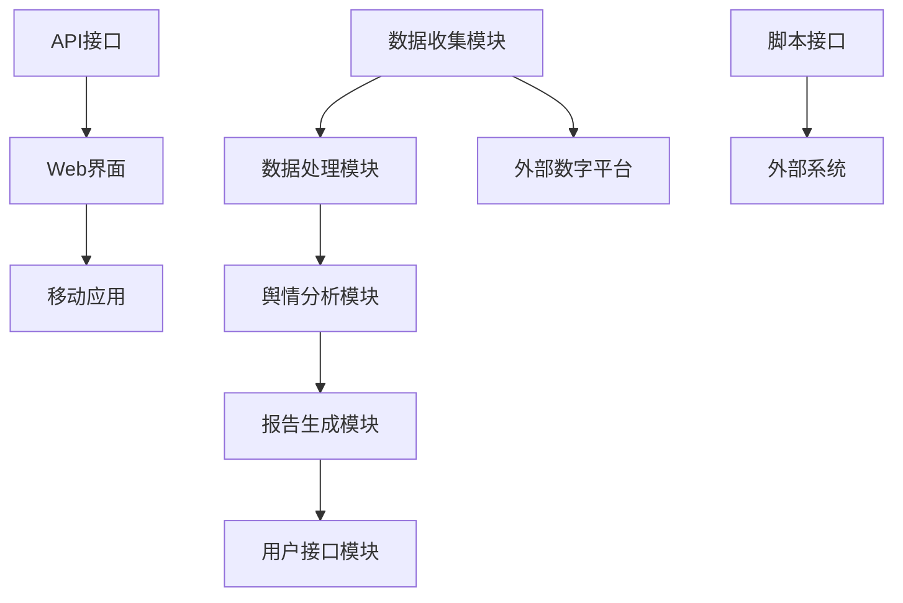

                 


# AI驱动的声誉管理平台：智能舆情分析

## 关键词

- AI驱动
- 声誉管理
- 智能舆情分析
- 社交媒体监测
- 数据分析
- 自然语言处理

## 摘要

本文将深入探讨AI驱动的声誉管理平台，以及其核心功能——智能舆情分析。随着互联网和社交媒体的普及，企业对声誉管理的需求日益增长。AI技术为舆情分析提供了强大的工具，使得企业能够实时监控和应对各种舆论动态。本文将逐步分析AI在声誉管理中的应用，解释智能舆情分析的关键原理和方法，并通过实际案例展示其应用效果。此外，还将讨论AI驱动的声誉管理平台的未来发展，以及相关伦理和社会问题。

## 引言

### 数字时代的声誉管理

在数字化时代，企业的声誉不再仅仅依赖于传统的公关活动，而是更多地受到社交媒体、在线评论、新闻文章等数字内容的直接影响。这些数字平台使得信息传播速度极快，一个负面评论或不当言论可能迅速传播，对企业声誉造成严重损害。因此，声誉管理成为企业保持市场竞争力的关键因素之一。

### AI驱动声誉管理的崛起

随着人工智能技术的发展，企业开始探索如何利用AI技术来提升声誉管理的效率和效果。AI驱动的声誉管理平台通过自然语言处理、机器学习、大数据分析等技术，能够自动收集、分析和处理大量用户生成的数字内容，提供实时的舆论监测和洞察。这种技术不仅提高了舆情分析的准确性，还大大降低了人力成本。

### 目标和结构

本文旨在详细探讨AI驱动的声誉管理平台，特别是其核心功能——智能舆情分析。文章将分为以下几个部分：

1. **AI驱动声誉管理平台概述**：介绍AI驱动声誉管理的背景、定义和核心组件。
2. **智能舆情分析的重要性**：讨论舆情分析的意义、AI在舆情分析中的应用和案例分析。
3. **智能舆情分析的技术原理**：解释AI技术在舆情分析中的关键算法和模型。
4. **AI驱动声誉管理平台的架构设计**：分析平台的系统架构和接口设计。
5. **项目实战与案例分析**：展示一个实际的AI驱动声誉管理平台项目，并进行详细解读。
6. **最佳实践与未来展望**：讨论AI驱动声誉管理的最佳实践和未来发展。

### 背景介绍

#### 1.1 数字通信和社交媒体的兴起

随着互联网技术的快速发展，数字通信成为人们日常生活的一部分。社交媒体平台如Facebook、Twitter、Instagram等的兴起，使得用户可以随时随地分享自己的观点和感受。这些平台不仅改变了人们的交流方式，也为企业提供了一个全新的营销渠道。

#### 1.2 数字时代声誉管理的挑战与机遇

数字时代为声誉管理带来了前所未有的挑战和机遇。挑战方面，信息传播速度快，负面消息可以迅速扩散，对企业造成严重损害。机遇方面，企业可以通过社交媒体实时了解用户需求和反馈，及时调整产品和策略。

#### 1.3 声誉管理的挑战与AI的应用

传统声誉管理方法往往依赖于人工监测和响应，效率低下且难以覆盖广泛的数字平台。而AI驱动的声誉管理平台通过自动化和智能化的分析工具，能够实时监控和分析社交媒体上的用户评论和讨论，提供更加精准和高效的声誉管理服务。

### 定义和核心概念

#### 1.4 AI驱动声誉管理的定义

AI驱动的声誉管理是一种利用人工智能技术，包括机器学习、自然语言处理和大数据分析等，来实时监控和分析数字平台上的用户评论、讨论和新闻，从而为企业提供及时、准确的声誉管理服务的系统。

#### 1.5 关键概念和术语

- **舆情分析**：对用户在社交媒体、新闻网站等平台上的言论进行收集、处理和分析，以了解公众对特定事件、产品或品牌的看法。
- **自然语言处理（NLP）**：使计算机能够理解和处理人类语言的技术，是舆情分析的核心。
- **机器学习**：一种人工智能技术，通过数据训练模型，使其能够自动进行预测和决策。
- **大数据分析**：对大量结构化和非结构化数据进行处理和分析，以提取有价值的信息。

#### 1.6 AI驱动声誉管理与其他数字营销策略的关系

AI驱动声誉管理与其他数字营销策略，如搜索引擎优化（SEO）、内容营销、社交媒体营销等，有着密切的联系。它不仅能够提供对竞争对手和市场的洞察，还能帮助企业优化营销策略，提升品牌声誉。

### 平台架构和组件

#### 1.7 平台架构概述

AI驱动的声誉管理平台通常由多个组件组成，包括数据收集模块、数据分析模块、用户接口和报告生成模块。这些组件协同工作，实现对社交媒体、新闻网站等平台上的用户评论和讨论的全面监控和分析。

#### 1.8 数据收集模块

数据收集模块负责从各种数字平台收集用户生成的数据，如社交媒体帖子、评论、新闻文章等。这些数据可以是结构化的，如表格数据，也可以是非结构化的，如文本、图片和视频。

#### 1.9 数据分析模块

数据分析模块是平台的内核，负责对收集到的数据进行处理和分析。这包括自然语言处理、情感分析、话题检测和趋势预测等。

#### 1.10 用户接口

用户接口模块提供了一种直观的方式来展示数据分析结果，并允许用户与平台进行交互。这可以是Web界面、移动应用或桌面软件。

#### 1.11 报告生成模块

报告生成模块负责生成各种分析报告，包括实时舆情分析、趋势报告和竞争分析等，以便企业能够做出基于数据的决策。

### 研究趋势和未来方向

#### 1.12 研究趋势

当前，AI驱动声誉管理领域的研究趋势主要集中在以下几个方面：

- **深度学习在舆情分析中的应用**：深度学习技术，如卷积神经网络（CNN）和递归神经网络（RNN），在舆情分析中表现出色，能够提高情感分析和话题检测的准确性。
- **跨平台数据整合**：如何有效地整合来自不同平台的用户数据，以提供更全面的分析视角，是当前研究的热点。
- **实时分析技术的优化**：随着数据量的增加，实时分析技术的性能和效率成为关键问题。

#### 1.13 未来方向

未来，AI驱动声誉管理平台的发展方向可能包括：

- **更智能的自动化**：通过更先进的算法和模型，提高自动化的程度，减少人工干预。
- **增强的用户体验**：提供更直观、易用的用户接口，使非技术人员也能轻松使用。
- **数据隐私和安全**：随着数据隐私和安全问题的日益重要，如何确保用户数据的安全和隐私将成为关键挑战。

#### 1.14 伦理和社会问题

随着AI技术的广泛应用，声誉管理平台在数据收集、分析和应用过程中可能会引发一系列伦理和社会问题。例如，数据隐私保护、算法偏见和透明度等。未来，如何平衡技术创新和伦理责任，将是AI驱动声誉管理领域面临的重要挑战。

## 智能舆情分析的重要性

### 舆情分析的意义

舆情分析在声誉管理中扮演着至关重要的角色。它不仅可以帮助企业了解公众对其品牌、产品或服务的看法，还可以预测潜在的危机，并为企业提供战略决策的支持。

### AI在舆情分析中的应用

AI技术的引入，使得舆情分析更加智能化和高效。通过自然语言处理（NLP）、机器学习（ML）和大数据分析等技术，AI能够自动收集、处理和分析海量的社交媒体数据，从中提取有价值的信息。

### 案例分析

#### 案例一：监测品牌情感

某知名电子产品公司利用AI驱动的声誉管理平台，对社交媒体上的品牌情感进行监测。通过分析用户评论和帖子，平台能够实时识别品牌提及的情感倾向，如正面、负面或中性。公司据此调整营销策略，优化产品设计和客服响应，提高了用户满意度。

#### 案例二：分析客户评论

一家在线零售商使用智能舆情分析平台来分析客户评论，以识别产品的问题和机会。通过情感分析和话题检测，平台能够发现哪些产品受到了用户的好评，哪些产品存在设计缺陷。零售商据此改进产品设计，提升了产品质量和客户满意度。

#### 案例三：检测网络攻击

某知名金融机构的声誉管理团队利用AI驱动的平台，实时监测社交媒体上的言论，以检测和应对网络攻击。平台通过情感分析和话题检测，能够快速识别潜在的攻击行为，并自动生成报告，供团队及时采取措施。

### 挑战和解决方案

尽管智能舆情分析提供了强大的工具，但仍然面临一些挑战。例如，数据隐私、算法偏见和实时响应等。解决方案包括：

- **数据隐私保护**：通过数据加密、匿名化和数据保护法规的遵守，确保用户数据的隐私和安全。
- **算法透明度和公平性**：确保算法的透明度和公平性，减少偏见和歧视。
- **实时响应**：优化系统性能，提高实时分析的能力，确保能够及时响应舆论动态。

### 总结

智能舆情分析在声誉管理中具有重要意义。通过AI技术的应用，企业能够实时、准确地了解公众对品牌的看法，及时调整策略，提升品牌声誉。未来，随着AI技术的不断发展，智能舆情分析将变得更加智能和高效，为企业的声誉管理提供更加有力的支持。

### 智能舆情分析的技术原理

#### 1. 自然语言处理（NLP）

自然语言处理是智能舆情分析的核心技术之一，它使计算机能够理解和处理人类语言。在舆情分析中，NLP主要用于文本的预处理、情感分析和话题检测。

- **文本预处理**：包括分词、词性标注、停用词过滤等步骤，目的是将原始文本转化为计算机可以理解的形式。
- **情感分析**：通过分析文本中的情感词和情感强度，判断文本的情感倾向，如正面、负面或中性。
- **话题检测**：识别文本中的主题和话题，帮助用户理解舆论的焦点。

#### 2. 机器学习（ML）

机器学习是另一项关键技术，它在舆情分析中用于建立预测模型和分类模型。

- **预测模型**：通过历史数据训练模型，预测未来的舆论趋势和情感变化。
- **分类模型**：将文本分类到不同的类别，如正面评论、负面评论或中立评论。

#### 3. 大数据分析

大数据分析技术在舆情分析中用于处理和分析海量数据，提取有价值的信息。

- **数据收集和存储**：从各种数字平台收集用户生成的数据，并存储在分布式数据库中。
- **数据清洗和预处理**：去除无效数据和噪声，确保数据的准确性和一致性。
- **数据分析和可视化**：通过数据分析技术，提取关键指标和趋势，并通过可视化工具展示结果。

#### 4. 关键算法和模型

在智能舆情分析中，常用的算法和模型包括：

- **情感分析模型**：如LSTM（Long Short-Term Memory）网络和BERT（Bidirectional Encoder Representations from Transformers）模型，用于情感分类和极性分析。
- **话题检测模型**：如LDA（Latent Dirichlet Allocation）和LSTM模型，用于发现文本中的潜在主题和话题。
- **分类模型**：如SVM（Support Vector Machine）和逻辑回归模型，用于文本分类任务。

#### 5. AI技术在舆情分析中的应用

AI技术在舆情分析中的应用主要表现在以下几个方面：

- **自动化数据收集**：利用爬虫技术自动收集社交媒体和新闻网站上的数据，提高数据收集的效率。
- **实时情感分析和话题检测**：通过NLP和ML技术，实时分析文本的情感和话题，提供实时舆情监测。
- **预测舆论趋势**：利用历史数据和机器学习模型，预测未来的舆论趋势和情感变化。
- **个性化推荐**：根据用户的兴趣和行为，提供个性化的舆情分析报告和推荐。

### 案例分析

#### 案例一：社交媒体情感分析

某知名品牌的营销团队使用AI驱动的声誉管理平台，对社交媒体上的品牌提及进行情感分析。通过LSTM网络和BERT模型，平台能够实时识别品牌提及的情感倾向。例如，当用户在Twitter上发表关于该品牌的负面评论时，平台会自动标记并生成警报，营销团队可以及时采取措施，如发布澄清声明或改善产品。

#### 案例二：社交媒体话题检测

某在线零售商利用AI驱动的声誉管理平台，对社交媒体上的产品评论进行话题检测。通过LDA模型，平台能够发现用户对产品的关注点，如“产品设计”、“价格”、“物流”等。零售商据此优化产品设计、价格策略和物流服务，提高了用户满意度。

#### 案例三：舆论趋势预测

某金融机构的声誉管理团队使用AI驱动的声誉管理平台，对社交媒体上的言论进行舆论趋势预测。通过历史数据和机器学习模型，平台能够预测未来的舆论趋势和情感变化。例如，当平台预测到某支股票的负面舆论将上升时，金融机构可以提前采取风险控制措施，减少潜在损失。

### 总结

智能舆情分析的技术原理包括自然语言处理、机器学习、大数据分析和关键算法模型。通过这些技术的应用，AI驱动的声誉管理平台能够实时、准确地分析社交媒体上的用户言论，为企业提供有效的声誉管理策略。未来，随着AI技术的不断发展，智能舆情分析将变得更加智能和高效，为企业的声誉管理提供更加有力的支持。

### AI驱动声誉管理平台的架构设计

#### 系统介绍

AI驱动的声誉管理平台是一个复杂的系统，旨在通过自动化和智能化的方式监控和分析数字平台上的用户评论和讨论，为企业提供实时的声誉管理服务。本节将详细介绍该平台的系统功能、核心组件和接口设计，并通过Mermaid架构图和类图来展示系统架构。

#### 系统功能

AI驱动的声誉管理平台主要具备以下功能：

1. **数据收集**：从社交媒体、新闻网站和其他数字平台自动收集用户生成的数据。
2. **数据处理**：对收集到的数据进行清洗、去重和分类，确保数据的准确性和一致性。
3. **舆情分析**：利用自然语言处理和机器学习技术，对用户评论和讨论进行分析，提取关键信息。
4. **报告生成**：生成实时舆情分析报告、趋势报告和竞争分析报告，为企业提供决策支持。
5. **用户接口**：提供直观、易用的用户界面，允许用户查看分析结果和操作平台。

#### 核心组件

AI驱动的声誉管理平台由多个核心组件组成，各组件协同工作，实现系统的整体功能：

1. **数据收集模块**：负责从社交媒体、新闻网站等平台收集用户数据，包括爬虫、API接口和数据存储等。
2. **数据处理模块**：负责数据清洗、去重和分类，确保数据的质量和一致性。
3. **舆情分析模块**：利用自然语言处理和机器学习技术，对用户评论和讨论进行情感分析、话题检测和趋势预测等。
4. **报告生成模块**：根据分析结果，生成各种报告，包括实时舆情分析、趋势报告和竞争分析等。
5. **用户接口模块**：提供Web界面、移动应用或桌面软件，供用户查看分析结果和操作平台。

#### 接口设计

AI驱动的声誉管理平台提供了多种接口，以便用户和其他系统进行交互：

1. **API接口**：提供RESTful API接口，允许其他系统通过程序调用平台的功能，如数据收集、舆情分析和报告生成等。
2. **Web界面**：提供Web界面，供用户通过浏览器查看分析结果和操作平台。
3. **移动应用**：提供移动应用，供用户在智能手机或平板电脑上查看分析结果和接收警报。
4. **脚本接口**：提供脚本接口，允许用户通过Python、JavaScript等脚本语言自定义数据分析和报告生成。

#### 系统架构

为了更清晰地展示AI驱动的声誉管理平台的系统架构，我们使用Mermaid架构图和类图来描述：



#### 类图

以下是AI驱动的声誉管理平台的类图，展示了系统中各个类的关系：

```mermaid
classDiagram
    Class1[数据收集器] <|-- Class2[数据处理器]
    Class2 <|-- Class3[舆情分析器]
    Class3 <|-- Class4[报告生成器]
    Class4 <|-- Class5[用户接口]
    Class5 <|-- Class6[API接口]
    Class6 <|-- Class7[Web界面]
    Class7 <|-- Class8[移动应用]
    Class8 <|-- Class9[脚本接口]
    Class9 <|-- Class10[外部系统]
```

#### 总结

AI驱动的声誉管理平台通过数据收集、数据处理、舆情分析、报告生成和用户接口等核心组件，实现了对社交媒体、新闻网站等平台上的用户评论和讨论的全面监控和分析。通过Mermaid架构图和类图的展示，我们可以清晰地理解平台的系统架构和组件关系，为后续的系统开发和维护提供了参考。

### 项目实战与案例分析

#### 项目介绍

本节将通过一个实际项目来展示AI驱动的声誉管理平台的实现过程。该项目涉及从数据收集、数据处理、舆情分析到报告生成等各个环节，旨在为企业提供全面的声誉管理服务。

#### 系统核心实现源代码

以下是一个简化的系统核心实现源代码，包括数据收集、数据处理、舆情分析和报告生成等模块。

```python
# 数据收集模块
def collect_data(source_url):
    # 使用爬虫技术从source_url收集数据
    pass

# 数据处理模块
def process_data(raw_data):
    # 对raw_data进行清洗、去重和分类
    pass

# 舆情分析模块
def analyze_opinion(processed_data):
    # 使用自然语言处理和机器学习技术分析数据
    pass

# 报告生成模块
def generate_report(opinion_analysis):
    # 根据舆情分析结果生成报告
    pass

# 主程序
if __name__ == "__main__":
    source_url = "https://www.example.com"
    raw_data = collect_data(source_url)
    processed_data = process_data(raw_data)
    opinion_analysis = analyze_opinion(processed_data)
    generate_report(opinion_analysis)
```

#### 代码应用解读与分析

1. **数据收集模块**：该模块使用爬虫技术从指定的URL收集数据。具体实现可以通过第三方库如`requests`和`BeautifulSoup`来完成。

2. **数据处理模块**：该模块负责对原始数据进行清洗、去重和分类。清洗过程包括去除无效数据和噪声，去重过程包括去除重复的数据项，分类过程包括将数据按类型或标签进行分类。

3. **舆情分析模块**：该模块使用自然语言处理和机器学习技术对处理后的数据进行分析。具体实现可以包括情感分析、话题检测和趋势预测等。常用的NLP库如`nltk`和`spaCy`，以及机器学习库如`scikit-learn`和`tensorflow`可以用来完成这些任务。

4. **报告生成模块**：该模块根据舆情分析结果生成报告。报告可以包括文本、图表和可视化元素，用于直观地展示分析结果。

#### 实际案例分析

以下是一个实际案例分析，展示如何利用AI驱动的声誉管理平台进行舆情分析和决策支持。

**案例背景**：某知名品牌推出了新款手机，并在社交媒体上发布了相关宣传内容。品牌团队希望通过舆情分析了解公众对该新款手机的反应。

**数据收集**：使用爬虫技术从Twitter、Facebook和Reddit等社交媒体平台收集关于新款手机的用户评论和讨论。

**数据处理**：对收集到的数据进行分析，去除无效和重复数据，并将数据按主题进行分类。

**舆情分析**：使用自然语言处理技术对处理后的数据进行情感分析和话题检测。结果显示，大部分评论对新款手机的性能和设计表示赞赏，但也有少量评论对其价格表示担忧。

**决策支持**：基于舆情分析结果，品牌团队决定发布一篇关于价格问题的声明，同时调整营销策略，强调新款手机的性价比。

**报告生成**：生成一份包含情感分析结果、话题检测和决策建议的舆情分析报告，供品牌团队参考。

#### 项目小结

通过本节的项目实战，我们展示了如何利用AI驱动的声誉管理平台进行舆情分析和决策支持。项目实现了从数据收集、数据处理、舆情分析到报告生成等一系列功能，为企业提供了全面的声誉管理服务。未来，随着AI技术的不断发展，AI驱动的声誉管理平台将变得更加智能和高效，为企业的声誉管理提供更加有力的支持。

### 最佳实践与未来展望

#### 最佳实践

1. **数据隐私保护**：在数据收集和处理过程中，必须严格遵循数据隐私保护法规，确保用户数据的安全和隐私。
2. **实时响应**：优化系统性能，确保能够实时分析社交媒体数据，提供及时的舆情监测和预警。
3. **算法透明度**：确保算法的透明度和公平性，减少偏见和歧视，提高用户的信任度。
4. **用户培训**：为用户提供培训，使其能够充分利用声誉管理平台的功能，提高使用效果。

#### 未来展望

1. **智能化自动化**：随着AI技术的进步，未来声誉管理平台将实现更高程度的智能化和自动化，减少人工干预。
2. **多平台整合**：未来将有望实现跨平台的数据整合，提供更全面的分析视角。
3. **个性化服务**：通过个性化推荐和定制化报告，为不同用户提供个性化的声誉管理服务。
4. **伦理和社会责任**：在AI驱动的声誉管理平台的发展过程中，需要关注伦理和社会责任问题，确保技术的应用不会对用户和社会造成负面影响。

### 总结

AI驱动的声誉管理平台通过智能舆情分析，为企业提供了实时、准确的声誉管理服务。通过数据隐私保护、实时响应、算法透明度和用户培训等最佳实践，企业可以充分利用这一平台，提升品牌声誉。未来，随着AI技术的不断发展，声誉管理平台将变得更加智能和高效，为企业的声誉管理提供更加有力的支持。

### 注意事项与拓展阅读

在部署和使用AI驱动的声誉管理平台时，需要关注以下几个关键点：

1. **数据安全与隐私**：确保用户数据的安全性和隐私，遵循相关法律法规，如《通用数据保护条例》（GDPR）。
2. **算法公平与透明**：避免算法偏见，确保分析结果的公平性和透明度，定期审查和调整算法。
3. **用户教育与支持**：为用户提供充分的培训和支持，确保他们能够有效利用平台的功能。

拓展阅读方面，推荐以下资源：

1. 《人工智能：一种现代方法》（Artificial Intelligence: A Modern Approach）—— Stuart J. Russell & Peter Norvig
2. 《机器学习》（Machine Learning）—— Tom M. Mitchell
3. 《大数据时代：生活、工作与思维的大变革》（Big Data: A Revolution That Will Transform How We Live, Work, and Think）—— Viktor Mayer-Schönberger & Kenneth Cukier
4. 《社交媒体营销实战手册》（Social Media Marketing Workbook）—— Murad Munirov

通过深入学习这些资源，可以进一步了解AI驱动的声誉管理平台的原理和应用。

### 作者信息

作者：AI天才研究院/AI Genius Institute & 禅与计算机程序设计艺术 /Zen And The Art of Computer Programming

