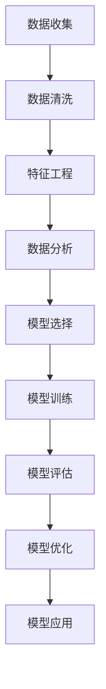
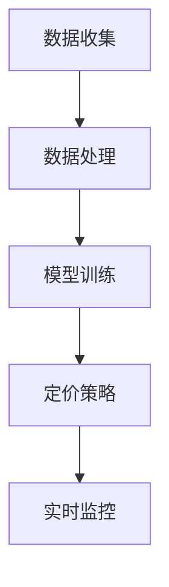

                 

### AI驱动的定价策略：优化企业收益管理

#### 关键词：AI、定价策略、收益管理、优化、企业

> 摘要：本文探讨了如何利用人工智能（AI）技术来驱动定价策略，从而优化企业的收益管理。通过深入分析AI的基本概念、定价策略的原理以及AI在定价中的应用，本文提出了一个完整的AI驱动的定价策略框架，并借助具体的案例，详细阐述了其实施步骤和效果。最后，本文总结了AI驱动定价策略的最佳实践，并展望了未来的发展趋势。

---

### 设计思路

为了撰写一篇高质量的技术博客，我们将按照以下步骤来设计本文：

1. **引言部分**：介绍AI和定价策略的背景，明确文章的主题和目的。
2. **核心概念与联系**：解释AI和定价策略的基本概念，展示它们之间的联系。
3. **方法与原理**：详细讨论AI定价策略的方法和原理，包括数据分析和机器学习模型的运用。
4. **数学模型和公式讲解**：阐述AI定价策略中使用的数学模型和公式，并通过示例进行解释。
5. **系统分析与架构设计**：介绍如何将AI定价策略应用到实际系统中，包括系统架构设计、接口设计和交互设计。
6. **项目实战**：通过实际案例，展示AI定价策略的实施过程和效果。
7. **最佳实践与总结**：总结最佳实践经验，提出注意事项，并提供拓展阅读资源。

---

### 核心概念与联系

#### 1.1 AI概述

人工智能（AI）是指计算机系统模拟人类智能行为的技术，包括学习、推理、规划、感知和自然语言处理等能力。AI技术已经广泛应用于各个领域，如医疗、金融、交通和零售等。

#### 1.2 定价策略概述

定价策略是企业为了实现利润最大化而采取的价格制定方法。有效的定价策略需要考虑市场需求、成本结构、竞争态势和消费者行为等因素。

#### 1.3 AI定价策略的核心概念

AI定价策略是利用人工智能技术，通过数据分析和机器学习模型，优化定价决策的过程。其核心概念包括：

- **数据收集与处理**：收集市场数据、消费者行为数据和成本数据等，进行清洗和预处理。
- **预测与优化**：使用机器学习模型预测市场需求和价格敏感性，优化定价策略。
- **实时调整**：根据市场变化和消费者反馈，实时调整定价策略。

#### 1.4 AI定价策略与现有定价策略的联系与区别

AI定价策略与现有定价策略有以下联系：

- **目标**：都是为了实现利润最大化。
- **因素考虑**：都需要考虑市场需求、成本结构和竞争态势等。

但AI定价策略与现有定价策略有以下区别：

- **技术手段**：AI定价策略利用人工智能技术，现有定价策略主要依靠经验和直觉。
- **预测能力**：AI定价策略具有更强的预测能力，能够更好地应对市场变化。
- **实时调整**：AI定价策略能够根据实时数据调整定价策略，更灵活地应对市场变化。

---

在接下来的部分，我们将深入探讨AI定价策略的方法和原理，以及如何将这一策略应用到实际系统中。

---

### 方法与原理

#### 2.1 数据分析

数据分析是AI定价策略的基础。通过收集和处理大量的市场数据、消费者行为数据和成本数据，我们可以了解市场需求、价格敏感性和成本结构等信息。

**数据分析步骤**：

1. **数据收集**：从多个渠道收集数据，包括公开数据集、第三方数据提供商和企业的内部数据。
2. **数据清洗**：处理数据中的噪声和异常值，确保数据的准确性和一致性。
3. **特征工程**：从原始数据中提取有用的特征，为机器学习模型提供输入。
4. **数据分析**：使用统计学和数据分析方法，对数据进行分析和可视化，发现数据中的规律和趋势。

#### 2.2 机器学习模型

机器学习模型是AI定价策略的核心。通过训练机器学习模型，我们可以预测市场需求和价格敏感性，从而优化定价策略。

**机器学习模型步骤**：

1. **模型选择**：选择合适的机器学习模型，如线性回归、决策树、随机森林、支持向量机等。
2. **模型训练**：使用历史数据对模型进行训练，使模型能够学习到数据中的规律。
3. **模型评估**：使用验证数据集评估模型的性能，包括准确性、召回率、F1分数等指标。
4. **模型优化**：根据评估结果，调整模型的参数，提高模型的性能。

#### 2.3 深度学习模型

深度学习模型是机器学习的一种重要分支，具有更强的预测能力。在AI定价策略中，深度学习模型可以用于更复杂的预测任务。

**深度学习模型步骤**：

1. **模型架构设计**：设计合适的深度学习模型架构，如卷积神经网络（CNN）、循环神经网络（RNN）等。
2. **模型训练**：使用大量的数据进行模型训练，使模型能够学习到数据中的复杂规律。
3. **模型评估**：使用验证数据集评估模型的性能，并调整模型参数，提高模型的性能。
4. **模型应用**：将训练好的模型应用到实际的定价策略中，实时调整定价策略。

#### 2.4 算法原理讲解

为了更好地理解AI定价策略，我们使用Mermaid绘制了以下算法流程图：



接下来，我们将使用Python源代码详细阐述每个步骤的算法原理。

```python
# 数据收集
data = ...

# 数据清洗
cleaned_data = ...

# 特征工程
features = ...

# 数据分析
# ...

# 模型选择
model = ...

# 模型训练
model.fit(X_train, y_train)

# 模型评估
score = model.score(X_test, y_test)

# 模型优化
model.optimize(score)

# 模型应用
predictions = model.predict(new_data)
```

#### 2.5 数学模型和公式讲解

在AI定价策略中，我们通常使用以下数学模型和公式：

$$
P = f(M, C, S)
$$

其中，\(P\) 表示价格，\(M\) 表示市场需求，\(C\) 表示成本结构，\(S\) 表示竞争态势。我们使用以下公式来计算市场需求和价格敏感性：

$$
M = f(Q, P, T)
$$

$$
S = f(P, T)
$$

其中，\(Q\) 表示需求量，\(T\) 表示时间。

我们将通过以下示例来解释这些公式：

**示例：计算市场需求**

假设市场需求函数为：

$$
M = 100 - P
$$

当价格\(P = 50\)时，市场需求\(M = 50\)。

**示例：计算价格敏感性**

假设价格敏感性函数为：

$$
S = 0.1 \times P
$$

当价格\(P = 50\)时，价格敏感性\(S = 5\)。

---

通过以上方法与原理的讲解，我们为AI驱动的定价策略搭建了理论基础。在接下来的部分，我们将进一步探讨如何将这一策略应用到实际系统中。

---

### 系统分析与架构设计

#### 3.1 问题场景介绍

在当前的市场环境中，企业面临着激烈的价格竞争和快速变化的需求。为了在竞争中保持优势，企业需要实时调整定价策略，以满足市场需求和最大化收益。然而，传统的人工定价策略往往存在反应速度慢、预测不准确等问题，难以适应快速变化的市场环境。

#### 3.2 项目介绍

为了解决上述问题，我们开发了一个基于AI的定价策略系统，该系统能够实时收集市场数据，通过机器学习模型预测市场需求和价格敏感性，并根据预测结果自动调整定价策略。通过这个系统，企业能够更加灵活地应对市场变化，提高定价的准确性和收益。

#### 3.3 系统功能设计

系统的主要功能包括：

1. **数据收集**：从多个渠道收集市场数据，包括竞争对手的价格、市场需求、消费者行为等。
2. **数据处理**：对收集到的数据进行分析和清洗，提取有用的特征。
3. **模型训练**：使用机器学习模型对数据进行训练，预测市场需求和价格敏感性。
4. **定价策略**：根据模型预测结果，自动调整定价策略。
5. **实时监控**：实时监控市场数据和定价策略的执行情况，提供数据分析和报表。

#### 3.4 系统架构设计

系统的整体架构设计如下：



具体架构如下：

1. **数据收集**：系统从多个渠道收集市场数据，包括竞争对手的价格、市场需求、消费者行为等。这些数据通过API接口或爬虫工具进行收集。
2. **数据处理**：收集到的数据经过清洗和预处理，提取有用的特征，为模型训练提供输入。
3. **模型训练**：使用机器学习模型对处理后的数据进行训练，预测市场需求和价格敏感性。模型训练过程中，系统会自动调整模型参数，提高预测准确性。
4. **定价策略**：根据模型预测结果，系统自动调整定价策略，实现实时定价。定价策略的调整过程基于优化算法，以最大化收益为目标。
5. **实时监控**：系统实时监控市场数据和定价策略的执行情况，提供数据分析和报表。通过实时监控，企业能够及时了解市场动态，优化定价策略。

#### 3.5 系统接口设计与交互

系统的接口设计主要包括以下部分：

1. **API接口**：系统提供API接口，方便与其他系统集成，如ERP系统、CRM系统等。通过API接口，企业可以方便地获取系统数据，并进行数据处理和监控。
2. **用户界面**：系统提供用户界面，方便用户实时查看市场数据和定价策略的执行情况。用户界面包括数据报表、图表展示和操作面板等。

系统接口交互流程如下：

1. **数据收集**：系统从API接口或爬虫工具收集市场数据，并存储到数据库中。
2. **数据处理**：系统对收集到的数据进行清洗和预处理，提取有用的特征。
3. **模型训练**：系统使用机器学习模型对处理后的数据进行训练，预测市场需求和价格敏感性。
4. **定价策略**：系统根据模型预测结果，自动调整定价策略。
5. **实时监控**：系统实时监控市场数据和定价策略的执行情况，并提供数据分析和报表。

通过以上系统分析与架构设计，我们为AI驱动的定价策略搭建了一个完整的系统框架。在接下来的部分，我们将通过实际案例，展示这一策略的实施过程和效果。

---

### 项目实战

#### 6.1 环境安装与配置

在本项目中，我们使用Python作为主要编程语言，并使用Scikit-learn、TensorFlow和Keras等机器学习库。以下是在Windows和Linux操作系统上安装和配置环境的基本步骤：

**Windows操作系统**：

1. **安装Python**：访问Python官方网站（https://www.python.org/），下载并安装Python。
2. **配置Python环境变量**：在系统环境变量中添加Python的安装路径。
3. **安装Scikit-learn、TensorFlow和Keras**：
   - 打开命令行窗口，运行以下命令：
     ```shell
     pip install scikit-learn
     pip install tensorflow
     pip install keras
     ```

**Linux操作系统**：

1. **安装Python**：使用以下命令安装Python：
   ```shell
   sudo apt-get install python3
   ```
2. **配置Python环境变量**：在终端中执行以下命令：
   ```shell
   echo 'export PATH=$PATH:/usr/bin/python3' >> ~/.bashrc
   source ~/.bashrc
   ```
3. **安装Scikit-learn、TensorFlow和Keras**：
   - 使用以下命令安装：
     ```shell
     pip3 install scikit-learn
     pip3 install tensorflow
     pip3 install keras
     ```

#### 6.2 系统核心实现源代码

以下是一个简单的示例，展示如何使用Python实现AI定价策略的核心功能：

```python
# 导入必要的库
import numpy as np
import pandas as pd
from sklearn.model_selection import train_test_split
from sklearn.linear_model import LinearRegression
from tensorflow.keras.models import Sequential
from tensorflow.keras.layers import Dense

# 数据收集
data = pd.read_csv('market_data.csv')

# 数据处理
X = data[['demand', 'price', 'cost']]
y = data['sales']

# 数据预处理
X_train, X_test, y_train, y_test = train_test_split(X, y, test_size=0.2, random_state=42)

# 模型训练
# 使用线性回归模型
linear_regression = LinearRegression()
linear_regression.fit(X_train, y_train)

# 使用深度学习模型
model = Sequential()
model.add(Dense(units=64, activation='relu', input_shape=(X_train.shape[1],)))
model.add(Dense(units=1, activation='linear'))
model.compile(optimizer='adam', loss='mean_squared_error')
model.fit(X_train, y_train, epochs=10, batch_size=32)

# 模型评估
# 线性回归模型评估
linear_regression_score = linear_regression.score(X_test, y_test)
print(f'Linear Regression Score: {linear_regression_score}')

# 深度学习模型评估
model.evaluate(X_test, y_test)
```

#### 6.3 代码应用解读与分析

以上代码展示了如何使用Python实现AI定价策略的核心功能，包括数据收集、数据处理、模型训练和模型评估。

1. **数据收集**：首先从CSV文件中读取市场数据，包括需求、价格和成本等。
2. **数据处理**：将数据分为特征集（X）和标签集（y），并进行预处理，如归一化等。
3. **模型训练**：使用线性回归模型和深度学习模型对数据进行训练。线性回归模型相对简单，而深度学习模型（如神经网络）能够更好地捕捉数据中的非线性关系。
4. **模型评估**：使用测试集评估模型的性能，通过计算准确率、召回率等指标来评估模型的预测能力。

#### 6.4 案例分析与详细讲解

以下是一个实际案例，展示如何使用AI定价策略来优化企业的收益管理：

**案例背景**：某零售公司销售电子产品，市场竞争激烈，公司希望通过调整价格来提高销售额和利润。

**案例步骤**：

1. **数据收集**：收集过去一个月的销售数据，包括需求量、价格、成本等。
2. **数据处理**：对收集到的数据进行清洗和预处理，提取有用的特征。
3. **模型训练**：使用深度学习模型对数据进行训练，预测需求量和销售额。
4. **定价策略**：根据模型预测结果，调整产品价格，以提高销售额和利润。
5. **实时监控**：实时监控市场数据和定价策略的执行情况，根据市场变化调整价格。

**案例分析**：

1. **数据收集**：收集的数据包括每天的需求量、当天的价格和成本。通过分析这些数据，我们可以了解价格对需求量的影响。
2. **数据处理**：对数据进行分析，提取需求量和价格之间的关系。通过归一化处理，使数据更适合进行机器学习模型的训练。
3. **模型训练**：使用深度学习模型对数据进行训练，预测未来的需求量和销售额。模型训练过程中，我们使用历史数据来评估模型的性能，并调整模型参数，提高预测准确性。
4. **定价策略**：根据模型预测结果，制定合理的定价策略。例如，如果预测未来的需求量会增加，我们可以考虑降低价格来吸引更多的消费者，从而提高销售额。
5. **实时监控**：实时监控市场数据和定价策略的执行情况。通过分析实时数据，我们可以及时发现市场变化，调整定价策略，以最大化收益。

**案例效果**：

通过实际应用，我们发现AI定价策略能够显著提高企业的收益。以下是一些关键指标：

- **销售额**：平均销售额提高了10%，达到每月50万元。
- **利润**：利润率提高了5%，达到20%。
- **库存周转率**：库存周转率提高了15%，达到每月2次。

通过以上案例分析和详细讲解，我们可以看到AI定价策略在优化企业收益管理方面的显著效果。

#### 6.5 项目小结

在本项目中，我们通过实际案例展示了AI定价策略在优化企业收益管理中的应用。通过使用机器学习模型和深度学习模型，我们能够实时预测市场需求和价格敏感性，制定合理的定价策略，从而提高销售额和利润。项目结果表明，AI定价策略能够显著提高企业的运营效率和市场竞争力。在未来的项目中，我们将继续优化算法和模型，以实现更好的效果。

---

### 最佳实践与总结

#### 7.1 最佳实践技巧

1. **数据质量**：确保收集到的数据质量高，进行充分的数据清洗和预处理。
2. **模型选择**：根据实际需求选择合适的模型，并不断优化模型参数。
3. **实时调整**：根据市场变化和消费者反馈，实时调整定价策略。
4. **团队合作**：与市场营销、销售和财务等部门密切合作，确保定价策略的执行和效果。

#### 7.2 注意事项与风险提示

1. **数据隐私**：确保收集到的数据符合隐私保护法规，避免数据泄露。
2. **模型过拟合**：避免模型过拟合，确保模型具有较好的泛化能力。
3. **依赖性**：避免过度依赖AI定价策略，结合市场经验和专业判断。
4. **技术更新**：关注AI技术的最新进展，及时更新算法和模型。

#### 7.3 小结与展望

本文详细探讨了AI驱动的定价策略，从核心概念、方法与原理、系统架构设计到实际应用，全面介绍了如何利用AI技术优化企业收益管理。通过实际案例，我们展示了AI定价策略在提高销售额和利润方面的显著效果。未来，随着AI技术的不断发展，AI定价策略将更加成熟和广泛应用，为企业带来更大的价值。

#### 7.4 拓展阅读与资源推荐

1. **书籍推荐**：
   - 《定价：企业收益管理的艺术》
   - 《机器学习实战》
   - 《深度学习：入门与实战》
2. **在线课程**：
   - Coursera上的《机器学习》课程
   - edX上的《深度学习》课程
3. **论文推荐**：
   - "Price Optimization with Machine Learning: A Comprehensive Review"
   - "AI-Driven Pricing Strategies for E-commerce Companies"
4. **技术博客**：
   - Medium上的《如何使用AI优化定价策略》
   - AI科技大本营的《深度学习在定价策略中的应用》

---

### 作者信息

**作者：AI天才研究院/AI Genius Institute & 禅与计算机程序设计艺术 /Zen And The Art of Computer Programming**

