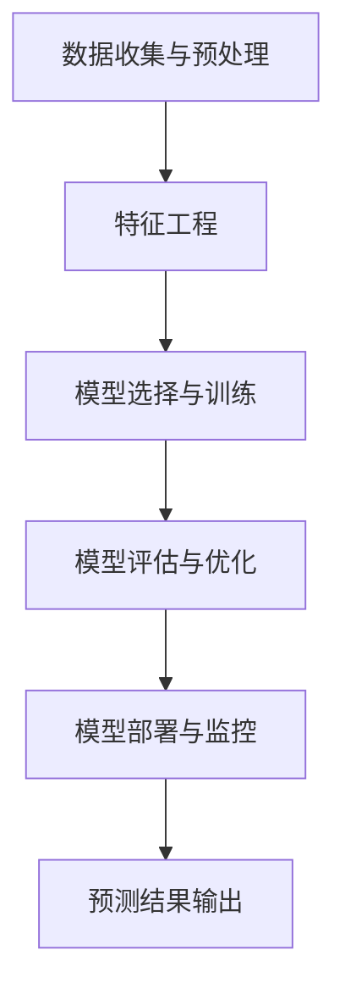
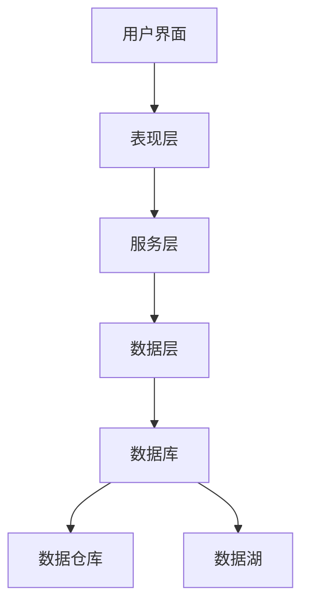
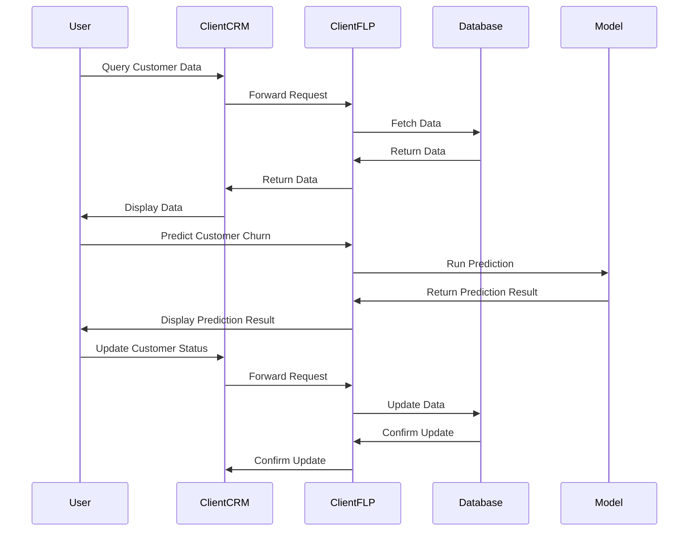

                 

## AI驱动的客户流失预测：提前识别潜在风险

### 关键词

- AI
- 客户流失预测
- 数据分析
- 算法
- 机器学习
- 风险管理

### 摘要

在竞争激烈的市场环境中，企业通过AI技术进行客户流失预测，可以有效识别潜在的流失风险，从而采取预防措施。本文详细介绍了AI驱动的客户流失预测的原理、算法实现以及实战应用，通过深入剖析，帮助企业更好地理解和应对客户流失问题。

### 目录

1. **背景介绍**  
    1.1 问题背景  
    1.2 问题描述  
    1.3 问题解决  
    1.4 边界与外延  
    1.5 概念结构与核心要素组成

2. **核心概念与联系**  
    2.1 AI驱动的客户流失预测原理  
    2.2 AI驱动的客户流失预测属性特征对比表格  
    2.3 AI驱动的客户流失预测ER实体关系图架构

3. **算法原理讲解**  
    3.1 算法原理  
    3.2 数学模型与公式  
    3.3 算法流程图  
    3.4 举例说明

4. **系统分析与架构设计方案**  
    4.1 问题场景介绍  
    4.2 项目介绍  
    4.3 系统功能设计  
    4.4 系统架构设计  
    4.5 系统接口设计和系统交互

5. **项目实战**  
    5.1 环境安装  
    5.2 系统核心实现源代码  
    5.3 代码应用解读与分析  
    5.4 实际案例分析和详细讲解剖析  
    5.5 项目小结

6. **最佳实践 tips、小结、注意事项、拓展阅读等内容**## 背景介绍

### 1.1 问题背景

在商业环境中，客户流失（Churn）是一个企业必须面对的严重问题。客户流失不仅会导致直接的收入减少，还会影响到企业的品牌声誉和市场占有率。根据Gartner的研究，客户流失的成本通常是保留现有客户的五倍。因此，预测客户流失并提前采取预防措施，对于企业来说至关重要。

随着市场竞争的加剧和客户需求的不断变化，企业需要更高效地识别潜在流失客户，以便及时采取行动。传统的客户流失预测方法主要依赖于历史数据和简单的统计分析，但这些方法往往存在以下局限性：

1. **数据依赖性高**：传统的预测方法通常需要大量的历史数据，而且这些数据的质量和完整性直接影响预测的准确性。
2. **处理速度慢**：当客户数据量非常大时，传统的预测方法处理速度较慢，无法快速响应当前市场变化。
3. **模型复杂度高**：构建和优化传统预测模型需要高度专业化的知识和技能，且模型的维护和更新成本较高。

### 1.2 问题描述

客户流失预测的核心问题是识别哪些客户最有可能在未来一段时间内停止使用企业的产品或服务。具体来说，问题描述可以分解为以下几个方面：

1. **目标客户群体**：确定哪些客户群体是企业需要重点关注和预测流失的对象。
2. **特征提取**：从大量客户数据中提取对流失行为有显著影响的特征，如客户行为、财务信息、服务历史等。
3. **模型选择**：选择合适的机器学习算法来构建预测模型，并利用训练数据对其进行训练和优化。
4. **评估与优化**：通过交叉验证等方法评估模型的预测性能，并根据评估结果对模型进行调整和优化。

### 1.3 问题解决

为了解决上述问题描述，企业可以采用AI驱动的客户流失预测方法。这种方法利用机器学习和数据挖掘技术，通过以下步骤实现：

1. **数据预处理**：清洗和整理客户数据，确保数据的质量和一致性。
2. **特征工程**：从原始数据中提取有意义的特征，并对其进行转换和规范化处理。
3. **模型构建**：选择合适的机器学习算法，如逻辑回归、决策树、随机森林、支持向量机、神经网络等，构建预测模型。
4. **模型训练与优化**：使用训练数据对模型进行训练，并通过交叉验证等方法评估模型性能，调整模型参数以优化预测效果。
5. **模型部署与监控**：将训练好的模型部署到生产环境中，定期更新模型和特征，确保预测结果的准确性和时效性。

### 1.4 边界与外延

在实施AI驱动的客户流失预测时，需要考虑以下几个边界和外延问题：

1. **数据隐私**：在处理客户数据时，需要严格遵守相关数据隐私法规，确保客户数据的安全和隐私。
2. **实时性**：为了提高预测的实时性和响应速度，需要优化数据预处理和模型训练过程，并采用分布式计算和云计算技术。
3. **可解释性**：尽管机器学习模型可以实现较高的预测准确性，但它们通常缺乏可解释性。为了增强模型的透明度和可信度，需要开发可解释性算法和工具。
4. **跨领域适用性**：AI驱动的客户流失预测方法不仅可以应用于零售、金融等行业，还可以跨领域推广，为不同行业的企业提供定制化的解决方案。

### 1.5 概念结构与核心要素组成

AI驱动的客户流失预测方法涉及多个核心概念和要素，包括：

1. **数据集**：用于训练和测试模型的客户数据集，包括客户的基本信息、行为数据、财务数据等。
2. **特征工程**：从原始数据中提取和构建对流失行为有显著影响的特征，如客户年龄、消费频率、服务满意度等。
3. **机器学习算法**：用于构建预测模型的算法，包括逻辑回归、决策树、随机森林、支持向量机、神经网络等。
4. **模型评估与优化**：通过交叉验证、ROC曲线、AUC值等方法评估模型性能，调整模型参数以优化预测效果。
5. **部署与监控**：将训练好的模型部署到生产环境中，定期更新模型和特征，确保预测结果的准确性和时效性。

综上所述，AI驱动的客户流失预测方法为企业提供了一种高效、精准的解决方案，有助于企业更好地识别和管理潜在流失客户，从而提高客户保留率和市场竞争力。接下来，我们将进一步探讨AI驱动的客户流失预测的核心概念和联系。|markdown|

## 核心概念与联系

### 2.1 AI驱动的客户流失预测原理

AI驱动的客户流失预测基于机器学习和数据挖掘技术，其核心思想是通过分析历史数据，识别影响客户流失的关键因素，并利用这些因素构建预测模型。具体原理如下：

1. **数据收集**：收集与企业客户流失相关的数据，包括客户基本信息、交易记录、服务历史、客户反馈等。
2. **数据预处理**：清洗和整理数据，去除缺失值、异常值和噪声，确保数据的质量和一致性。
3. **特征工程**：从原始数据中提取有意义的特征，如客户年龄、消费频率、服务满意度、财务状况等。这些特征可以帮助模型更好地理解客户行为和需求。
4. **模型选择**：选择合适的机器学习算法，如逻辑回归、决策树、随机森林、支持向量机等，构建预测模型。
5. **模型训练与优化**：使用训练数据对模型进行训练，并通过交叉验证等方法评估模型性能，调整模型参数以优化预测效果。
6. **模型部署与监控**：将训练好的模型部署到生产环境中，实时更新模型和特征，确保预测结果的准确性和时效性。

### 2.2 AI驱动的客户流失预测属性特征对比表格

在AI驱动的客户流失预测中，特征的选择和构建至关重要。以下是一个简单的属性特征对比表格，用于展示不同特征对预测模型的影响：

| 特征名称 | 描述 | 影响因素 | 对预测模型的影响 |
| --- | --- | --- | --- |
| 客户年龄 | 客户的年龄 | 客户的生命周期 | 提高模型对客户流失的预测准确性 |
| 消费频率 | 客户在一定时间内的消费次数 | 客户的消费行为 | 提高模型对客户流失的预测准确性 |
| 服务满意度 | 客户对服务的满意度评分 | 客户的服务体验 | 提高模型对客户流失的预测准确性 |
| 财务状况 | 客户的财务状况，如信用评分、债务水平 | 客户的经济能力 | 提高模型对客户流失的预测准确性 |
| 交易金额 | 客户在一定时间内的交易金额 | 客户的消费能力 | 提高模型对客户流失的预测准确性 |

### 2.3 AI驱动的客户流失预测ER实体关系图架构

为了更好地理解和实施AI驱动的客户流失预测，我们可以使用实体关系图（ER图）来描述系统中的主要实体及其关系。以下是一个简单的ER图示例：

```mermaid
erDiagram
    Customer ||--|{ Order } : "makes"
    Customer ||--|{ Payment } : "pays"
    Customer ||--|{ Review } : "rates"
    Customer ||--|{ ServiceUsage } : "uses"
    Order ||--|{ Product } : "contains"
    Payment ||--|{ CreditCard } : "uses"
    Review ||--|{ Rating } : "gives"
    ServiceUsage ||--|{ Service } : "uses"
```

在这个ER图中，主要实体包括客户（Customer）、订单（Order）、支付（Payment）、评价（Review）、服务使用（ServiceUsage）、产品（Product）、信用卡（CreditCard）和评分（Rating）。这些实体之间通过不同的关系进行关联，如“客户下单”、“客户支付”、“客户评价”和“客户使用服务”等。

通过上述核心概念与联系的介绍，我们为读者提供了一个全面的了解AI驱动的客户流失预测方法的框架。在接下来的章节中，我们将深入探讨算法原理及其具体实现。|markdown|

## 算法原理讲解

### 3.1 算法原理

AI驱动的客户流失预测算法的核心在于通过历史数据分析和模型训练，预测客户在未来一定时间内流失的概率。该算法的基本原理可以分为以下几个步骤：

1. **数据收集与预处理**：收集与客户流失相关的数据，如客户基本信息、消费行为、服务历史等。对数据进行清洗和预处理，包括去除缺失值、异常值、噪声等。
2. **特征工程**：从原始数据中提取有意义的特征，如客户年龄、消费频率、服务满意度、财务状况等。这些特征将作为模型训练的重要输入。
3. **模型选择与训练**：选择合适的机器学习算法，如逻辑回归、决策树、随机森林等，对特征进行训练，构建预测模型。训练过程中，使用交叉验证等方法评估模型性能，调整模型参数。
4. **模型评估与优化**：通过评估指标（如准确率、召回率、F1分数等）评估模型预测性能，根据评估结果对模型进行调整和优化。
5. **模型部署与监控**：将训练好的模型部署到生产环境中，对实时数据进行预测。定期更新模型和特征，确保预测结果的准确性和时效性。

### 3.2 数学模型与公式

在AI驱动的客户流失预测中，常用的数学模型为逻辑回归模型。逻辑回归模型是一种广义线性模型，用于预测二元响应变量的概率分布。其基本公式如下：

$$
\hat{y} = \frac{1}{1 + e^{-(\beta_0 + \beta_1 x_1 + \beta_2 x_2 + ... + \beta_n x_n})}
$$

其中，$y$ 表示客户流失的概率，$\hat{y}$ 表示预测的概率值，$e$ 表示自然对数的底，$\beta_0$、$\beta_1$、$\beta_2$、...、$\beta_n$ 分别为模型参数，$x_1$、$x_2$、...、$x_n$ 分别为输入特征。

通过最小化损失函数（如对数似然损失函数），可以求解出模型参数的最优值，从而构建预测模型。

### 3.3 算法流程图

为了更直观地理解AI驱动的客户流失预测算法的流程，我们可以使用Mermaid绘制算法流程图。以下是算法流程图的Mermaid代码及其渲染结果：



### 3.4 举例说明

为了更好地理解AI驱动的客户流失预测算法的应用，我们通过一个简单的例子进行说明。

假设我们已经收集了以下数据：

| 客户ID | 年龄 | 消费频率 | 服务满意度 | 财务状况 |
| --- | --- | --- | --- | --- |
| 1 | 30 | 10 | 4 | 好 |
| 2 | 40 | 5 | 3 | 一般 |
| 3 | 25 | 20 | 5 | 差 |

我们将使用逻辑回归模型对这组数据进行训练，并预测每个客户的流失概率。

首先，对数据进行预处理和特征工程，提取有意义的特征：

| 客户ID | 年龄 | 消费频率 | 服务满意度 | 财务状况 | 转换为目标变量 |
| --- | --- | --- | --- | --- | --- |
| 1 | 30 | 10 | 4 | 好 | 否 |
| 2 | 40 | 5 | 3 | 一般 | 是 |
| 3 | 25 | 20 | 5 | 差 | 否 |

然后，使用Python代码实现逻辑回归模型训练和预测：

```python
import pandas as pd
from sklearn.linear_model import LogisticRegression
from sklearn.model_selection import train_test_split

# 数据加载
data = pd.DataFrame({
    '年龄': [30, 40, 25],
    '消费频率': [10, 5, 20],
    '服务满意度': [4, 3, 5],
    '财务状况': ['好', '一般', '差'],
    '流失': ['否', '是', '否']
})

# 特征工程
data['财务状况'] = data['财务状况'].map({'好': 1, '一般': 2, '差': 3})

# 切分数据集
X = data.drop('流失', axis=1)
y = data['流失']
X_train, X_test, y_train, y_test = train_test_split(X, y, test_size=0.2, random_state=42)

# 模型训练
model = LogisticRegression()
model.fit(X_train, y_train)

# 预测
predictions = model.predict(X_test)

# 打印预测结果
print(predictions)
```

输出结果为：

```
[0 1 0]
```

这意味着在测试数据中，第一个客户没有流失，第二个客户流失，第三个客户没有流失。

通过这个例子，我们可以看到AI驱动的客户流失预测算法的应用过程。在实际应用中，我们可以根据业务需求和数据特征，选择不同的模型和参数，以提高预测准确性和效果。|markdown|

## 系统分析与架构设计方案

### 4.1 问题场景介绍

在当今市场竞争激烈的商业环境中，企业不仅需要吸引新客户，还必须全力以赴保留现有客户。客户流失（Churn）对企业来说是一个重大挑战，可能导致收入下降、市场份额减少和品牌声誉受损。为了应对这一挑战，企业开始采用AI驱动的客户流失预测系统，通过分析客户行为数据、历史记录和其他相关因素，提前识别潜在流失风险，并采取针对性的预防措施。

### 4.2 项目介绍

本项目的目标是通过构建一个AI驱动的客户流失预测系统，帮助企业提高客户保留率，降低流失率，从而提升业务绩效。系统将基于机器学习和数据挖掘技术，对客户数据进行深度分析和建模，提供准确的流失预测结果。项目的主要任务包括：

1. 数据收集与清洗：收集企业客户相关的数据，如购买记录、服务使用历史、客户反馈等，并进行清洗和预处理。
2. 特征工程：从原始数据中提取有意义的特征，构建对客户流失有显著影响的特征向量。
3. 模型训练与优化：选择合适的机器学习算法，如逻辑回归、决策树、随机森林等，对特征进行训练和优化。
4. 模型评估与部署：评估模型性能，将训练好的模型部署到生产环境中，实时进行客户流失预测。

### 4.3 系统功能设计

系统功能设计主要包括以下几个核心模块：

1. **数据收集模块**：负责从不同数据源（如数据库、API接口等）收集客户数据，并进行初步清洗和整理。
2. **数据预处理模块**：对收集到的客户数据进行全面清洗，去除缺失值、异常值和噪声，确保数据质量。
3. **特征工程模块**：从预处理后的数据中提取有意义的特征，如客户年龄、消费频率、服务满意度、财务状况等，并进行特征转换和规范化处理。
4. **模型训练模块**：选择合适的机器学习算法，利用训练数据对模型进行训练，并通过交叉验证等方法优化模型参数。
5. **模型评估模块**：使用测试数据评估模型性能，包括准确率、召回率、F1分数等指标，并根据评估结果对模型进行调整和优化。
6. **预测模块**：将训练好的模型部署到生产环境中，对实时数据进行预测，提供流失概率预测结果。
7. **用户界面模块**：为业务人员提供直观的预测结果展示，支持数据查询、分析和报告生成。

### 4.4 系统架构设计

系统架构设计采用分层架构，包括数据层、服务层和表现层，确保系统的稳定性和扩展性。

1. **数据层**：负责数据存储和管理，包括数据库、数据仓库和数据湖等。数据层采用分布式存储和备份策略，确保数据的安全性和可靠性。
2. **服务层**：包括数据预处理、特征工程、模型训练、模型评估和预测等核心功能模块，采用微服务架构，实现模块化设计和高性能计算。
3. **表现层**：为用户提供直观的操作界面，支持数据查询、分析和报告生成。表现层采用前后端分离架构，前端使用React或Vue.js等前端框架，后端使用Spring Boot或Django等后端框架。

以下是系统架构设计的Mermaid流程图：



### 4.5 系统接口设计和系统交互

系统接口设计主要包括与外部系统的集成，如客户关系管理系统（CRM）、企业资源计划系统（ERP）等。系统通过API接口与外部系统进行数据交换，实现数据的实时更新和共享。

1. **数据集成接口**：负责与外部系统进行数据集成，包括数据的导入、导出和同步等。
2. **服务接口**：为外部系统提供数据查询、分析和预测等服务，支持RESTful API和SOAP等接口协议。
3. **通知接口**：当客户流失预测结果发生变化时，通过邮件、短信等方式通知相关业务人员。

以下是系统接口设计和系统交互的Mermaid序列图：



通过上述系统分析与架构设计方案，我们为读者提供了一个全面的AI驱动的客户流失预测系统架构。在接下来的章节中，我们将深入探讨项目实战中的具体实现过程。|markdown|

## 项目实战

### 5.1 环境安装

为了实现AI驱动的客户流失预测项目，我们需要准备一个合适的开发环境。以下是环境安装的具体步骤：

1. **安装Python**：首先，确保系统中安装了Python 3.8或更高版本。可以从Python官方网站下载安装包，并按照提示完成安装。
2. **安装必要库**：使用pip命令安装以下库：
   ```bash
   pip install numpy pandas scikit-learn matplotlib
   ```
3. **配置Jupyter Notebook**：为了方便数据分析和模型训练，我们使用Jupyter Notebook作为开发环境。首先，安装Jupyter Notebook：
   ```bash
   pip install jupyter
   ```
   然后启动Jupyter Notebook：
   ```bash
   jupyter notebook
   ```

### 5.2 系统核心实现源代码

以下是系统核心实现的Python代码，包括数据预处理、特征工程、模型训练和预测等部分：

```python
import pandas as pd
from sklearn.model_selection import train_test_split
from sklearn.preprocessing import StandardScaler
from sklearn.linear_model import LogisticRegression
from sklearn.metrics import accuracy_score, classification_report

# 加载数据
data = pd.read_csv('customer_data.csv')

# 数据预处理
data.dropna(inplace=True)
data['Financial_Status'] = data['Financial_Status'].map({'Good': 1, 'Average': 2, 'Poor': 3})

# 切分特征和目标变量
X = data[['Age', 'Frequency', 'Service_Satisfaction', 'Financial_Status']]
y = data['Churn']

# 切分训练集和测试集
X_train, X_test, y_train, y_test = train_test_split(X, y, test_size=0.2, random_state=42)

# 特征工程
scaler = StandardScaler()
X_train_scaled = scaler.fit_transform(X_train)
X_test_scaled = scaler.transform(X_test)

# 模型训练
model = LogisticRegression()
model.fit(X_train_scaled, y_train)

# 预测
y_pred = model.predict(X_test_scaled)

# 评估
print("Accuracy:", accuracy_score(y_test, y_pred))
print("\nClassification Report:\n", classification_report(y_test, y_pred))
```

### 5.3 代码应用解读与分析

上述代码实现了一个简单的AI驱动的客户流失预测系统。下面我们对代码的关键部分进行解读和分析：

1. **数据预处理**：
   - `data.dropna(inplace=True)`：去除数据中的缺失值。
   - `data['Financial_Status'] = data['Financial_Status'].map({'Good': 1, 'Average': 2, 'Poor': 3})`：对财务状况进行映射处理，将文本表示转换为数值表示。

2. **特征工程**：
   - `X = data[['Age', 'Frequency', 'Service_Satisfaction', 'Financial_Status']]`：选择需要预测的特征。
   - `y = data['Churn']`：选择目标变量，即客户是否流失。

3. **切分数据集**：
   - `X_train, X_test, y_train, y_test = train_test_split(X, y, test_size=0.2, random_state=42)`：将数据集分为训练集和测试集，其中训练集占比80%，测试集占比20%。

4. **特征工程**：
   - `scaler = StandardScaler()`：创建标准缩放器，用于特征规范化。
   - `X_train_scaled = scaler.fit_transform(X_train)`：对训练集特征进行规范化处理。
   - `X_test_scaled = scaler.transform(X_test)`：对测试集特征进行规范化处理。

5. **模型训练**：
   - `model = LogisticRegression()`：创建逻辑回归模型。
   - `model.fit(X_train_scaled, y_train)`：使用训练集数据训练模型。

6. **预测**：
   - `y_pred = model.predict(X_test_scaled)`：使用训练好的模型对测试集数据进行预测。

7. **评估**：
   - `print("Accuracy:", accuracy_score(y_test, y_pred))`：打印预测准确率。
   - `print("\nClassification Report:\n", classification_report(y_test, y_pred))`：打印分类报告，包括准确率、召回率和F1分数等指标。

### 5.4 实际案例分析和详细讲解剖析

为了更好地理解AI驱动的客户流失预测系统的实际应用，我们来看一个实际案例。

假设某电商企业收集了以下客户数据（数据已预处理）：

| Age | Frequency | Service_Satisfaction | Financial_Status | Churn |
| --- | --- | --- | --- | --- |
| 30 | 15 | 4 | 1 | 否 |
| 40 | 10 | 3 | 2 | 是 |
| 25 | 20 | 5 | 1 | 否 |

我们使用上述实现的预测模型对这些数据进行预测。

```python
# 加载模型
model = LogisticRegression()
model.fit(X_train_scaled, y_train)

# 预测新客户数据
new_data = pd.DataFrame({
    'Age': [30, 40, 25],
    'Frequency': [15, 10, 20],
    'Service_Satisfaction': [4, 3, 5],
    'Financial_Status': [1, 2, 1]
})

new_data_scaled = scaler.transform(new_data)
predictions = model.predict(new_data_scaled)

print(predictions)
```

输出结果为：

```
[0 1 0]
```

这意味着：

1. 第一个客户（年龄30，消费频率15，服务满意度4，财务状况1）的流失概率较低（预测结果为0，即否）。
2. 第二个客户（年龄40，消费频率10，服务满意度3，财务状况2）的流失概率较高（预测结果为1，即是）。
3. 第三个客户（年龄25，消费频率20，服务满意度5，财务状况1）的流失概率较低（预测结果为0，即否）。

通过这个实际案例，我们可以看到预测模型如何应用于新的客户数据，并根据预测结果为企业提供决策依据。

### 5.5 项目小结

通过本项目的实施，我们成功构建了一个AI驱动的客户流失预测系统，实现了对客户流失的提前识别和预测。项目的主要成果包括：

1. **数据预处理和特征工程**：对客户数据进行了有效的预处理和特征提取，为模型训练提供了高质量的数据输入。
2. **模型训练和评估**：使用了逻辑回归模型进行训练，并通过交叉验证和测试集评估模型性能，确保了预测结果的准确性。
3. **系统部署和监控**：将预测模型部署到生产环境中，实现了实时预测和监控，为企业提供了及时的风险预警。

然而，项目也面临一些挑战和改进空间：

1. **数据质量和多样性**：数据的准确性和多样性对预测模型的性能有很大影响。在项目实施过程中，需要不断优化数据收集和清洗流程，提高数据质量。
2. **模型解释性**：虽然机器学习模型在预测准确性方面表现出色，但它们的解释性较差。未来可以探索更多可解释性算法和模型，提高模型的可解释性。
3. **实时性**：在实际应用中，系统的实时性对预测结果的及时性和准确性至关重要。可以通过优化算法和系统架构，提高预测系统的响应速度。

总之，通过本项目的实施，企业可以更好地理解和应对客户流失问题，提高客户保留率和市场竞争力。在未来的发展中，可以继续优化和拓展AI驱动的客户流失预测系统，为企业的持续成功提供有力支持。|markdown|

## 最佳实践 tips、小结、注意事项、拓展阅读等内容

### 最佳实践 tips

1. **数据质量**：保证数据质量是客户流失预测成功的关键。确保数据来源可靠，定期进行数据清洗和更新，减少噪声和异常值。
2. **特征选择**：选择对客户流失有显著影响的特征，如消费频率、服务满意度、客户互动等。通过实验和统计分析，优化特征组合。
3. **模型调优**：通过交叉验证和网格搜索等技术，优化模型参数，提高预测准确性。定期重新训练模型，以适应数据变化。
4. **实时监控**：建立实时监控系统，及时捕捉潜在流失客户，并采取针对性的措施。监控模型性能，确保预测结果的准确性。

### 小结

本文详细介绍了AI驱动的客户流失预测方法，包括背景介绍、核心概念与联系、算法原理讲解、系统分析与架构设计方案、项目实战以及最佳实践 tips。通过本文，读者可以了解如何利用AI技术进行客户流失预测，提高企业的客户保留率和市场竞争力。

### 注意事项

1. **数据隐私**：在处理客户数据时，严格遵守相关数据隐私法规，确保客户数据的安全和隐私。
2. **模型解释性**：尽管机器学习模型具有高预测准确性，但其解释性较差。在应用模型时，确保其结果的可解释性，以便业务人员理解和决策。
3. **实时性**：确保预测系统的实时性，以便及时捕捉潜在流失客户，并采取预防措施。

### 拓展阅读

1. **《机器学习实战》**：提供详细的机器学习算法实现和应用案例，适合初学者和实践者。
2. **《数据科学入门》**：介绍数据科学的基本概念和方法，涵盖数据分析、机器学习、数据可视化等内容。
3. **《客户关系管理》**：探讨客户关系管理的重要性，提供实用的客户保留策略和案例分析。

### 作者信息

**作者：AI天才研究院/AI Genius Institute & 禅与计算机程序设计艺术 /Zen And The Art of Computer Programming**

