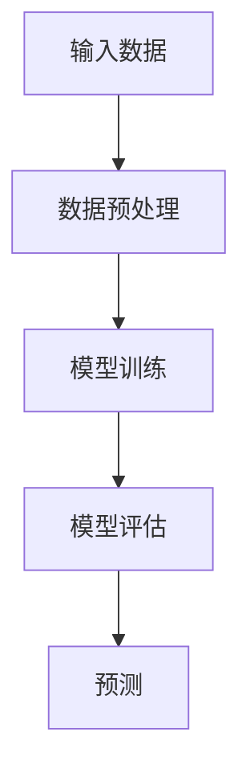
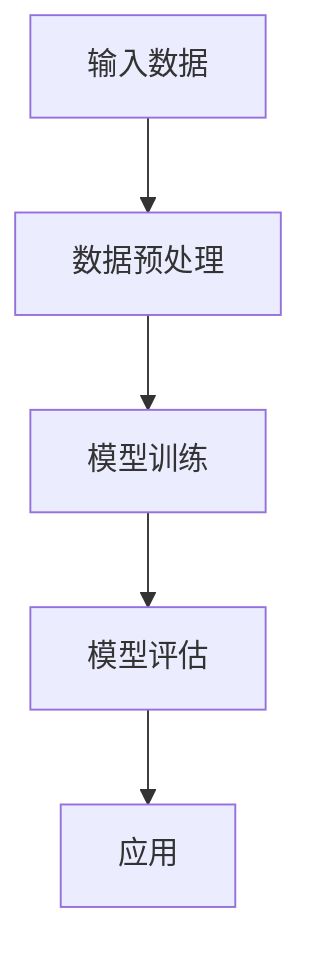
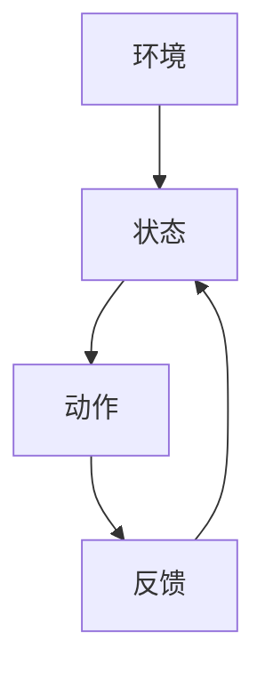
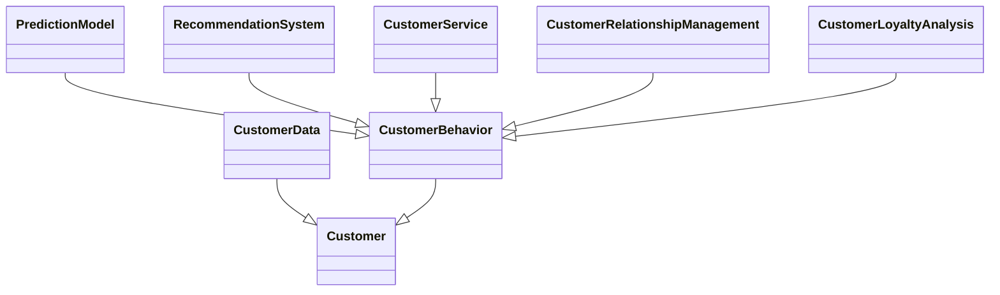
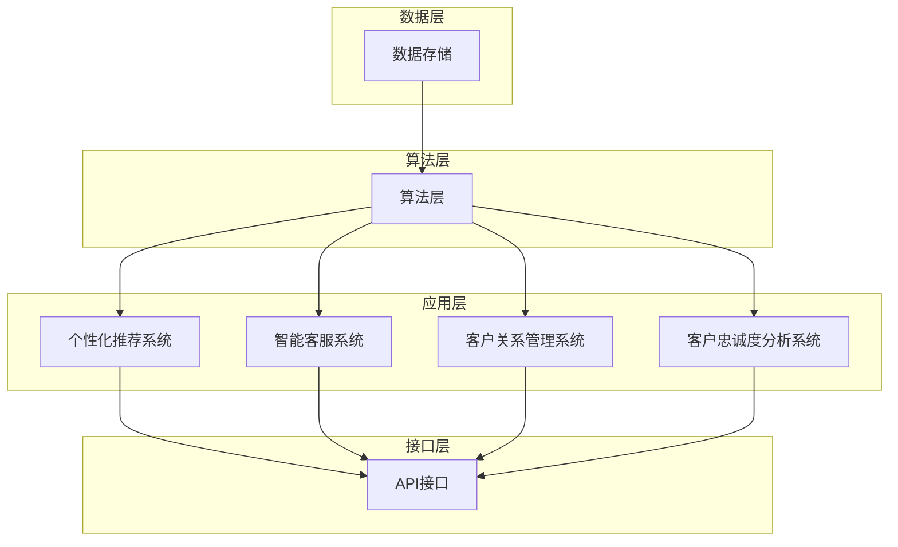
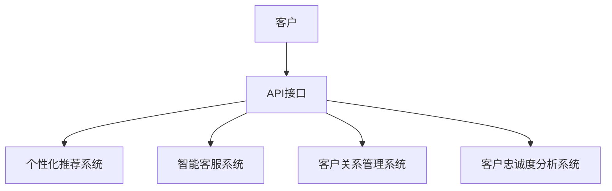

                 

## AI驱动的客户生命周期管理：优化客户价值

### 关键词：AI、客户生命周期管理、客户价值优化、算法、数学模型、系统架构

> 摘要：随着人工智能技术的飞速发展，其在客户生命周期管理中的应用变得愈发重要。本文旨在探讨如何利用AI技术优化客户生命周期管理，提高客户价值。通过分析AI技术的基本概念及其在客户生命周期管理中的应用，结合具体的算法原理、数学模型和系统架构设计，本文提供了一系列实用的实践指南，帮助企业在激烈的市场竞争中脱颖而出。

### 第一部分：背景介绍

#### 1.1 问题背景与市场趋势

##### 1.1.1 AI技术的发展与客户生命周期管理

近年来，人工智能（AI）技术取得了长足的发展，从最初的机器学习到深度学习，再到自然语言处理和计算机视觉等领域的突破，AI已经渗透到各行各业。在客户生命周期管理（Customer Lifecycle Management, CLM）中，AI技术的应用也越来越广泛。通过大数据分析和机器学习算法，企业能够更准确地识别客户需求、优化客户体验、提高客户忠诚度和满意度，从而提升客户价值。

##### 1.1.2 市场趋势与行业挑战

在当前的市场环境下，客户需求多样化、个性化，市场竞争激烈。企业需要迅速适应市场变化，提升自身的竞争力。客户生命周期管理作为一种系统化的方法，可以帮助企业从客户获取、客户留存、客户发展和客户离开等多个方面进行全面管理。然而，传统的客户生命周期管理方法往往依赖于人工分析和经验，效率低下，难以应对复杂的市场环境。

##### 1.1.3 客户生命周期管理的重要性

客户生命周期管理是企业长期发展的基础。通过有效的客户生命周期管理，企业可以实现以下目标：

- 提高客户满意度：通过个性化的服务体验，提升客户满意度和忠诚度。
- 提高客户留存率：通过精准的客户行为分析，及时发现问题并采取措施，降低客户流失率。
- 提高客户转化率：通过精准的营销策略，提高新客户的转化率。
- 提高客户价值：通过客户细分和精准营销，提高客户生命周期中的总体价值。

#### 1.2 核心概念与联系

##### 1.2.1 客户生命周期管理的定义

客户生命周期管理是指企业通过系统化的方法，对客户在整个生命周期中的行为进行跟踪、分析和管理，以实现客户价值最大化和企业利润最大化。

##### 1.2.2 AI技术的核心概念

AI技术是指利用计算机模拟人类智能的科学技术。其核心包括机器学习、深度学习、自然语言处理和计算机视觉等。

##### 1.2.3 AI与客户生命周期管理的关系

AI技术与客户生命周期管理有着紧密的联系。通过AI技术，企业可以实现以下目标：

- 客户识别：通过大数据分析和机器学习算法，准确识别潜在客户。
- 客户行为分析：通过自然语言处理和计算机视觉技术，实时分析客户行为。
- 客户体验优化：通过个性化推荐和智能客服，提升客户体验。
- 客户忠诚度提升：通过精准的营销策略和客户关系管理，提高客户忠诚度。
- 客户价值最大化：通过客户细分和精准营销，提高客户生命周期中的总体价值。

#### 1.3 边界与外延

##### 1.3.1 AI驱动的客户生命周期管理的范围

AI驱动的客户生命周期管理主要涉及以下方面：

- 客户获取：通过大数据分析和机器学习算法，精准识别潜在客户。
- 客户留存：通过个性化推荐和客户关系管理，提高客户满意度和忠诚度。
- 客户发展：通过精准的营销策略和客户成长计划，提高客户价值。
- 客户离开：通过挽回策略和客户忠诚度分析，降低客户流失率。

##### 1.3.2 相关领域与应用案例

AI驱动的客户生命周期管理涉及到多个相关领域，包括：

- 数据分析：通过大数据技术，对客户行为数据进行深入分析。
- 机器学习：通过机器学习算法，实现客户识别和行为预测。
- 自然语言处理：通过自然语言处理技术，实现智能客服和个性化推荐。
- 计算机视觉：通过计算机视觉技术，实现客户行为分析。

在实际应用中，AI驱动的客户生命周期管理已经得到了广泛应用，例如：

- 零售行业：通过大数据分析和个性化推荐，提高销售额和客户满意度。
- 银行业：通过精准营销和客户关系管理，提高客户忠诚度和满意度。
- 金融行业：通过智能投顾和风险控制，提高投资效率和安全性。
- 教育行业：通过个性化学习推荐和学习效果分析，提高教学质量和学生满意度。

#### 1.4 概念结构与核心要素组成

##### 1.4.1 客户生命周期管理的结构

客户生命周期管理包括以下几个阶段：

- 客户获取：识别潜在客户，并通过营销策略吸引客户。
- 客户留存：通过个性化服务和关系管理，提高客户满意度和忠诚度。
- 客户发展：通过精准营销和客户成长计划，提高客户价值和市场份额。
- 客户离开：通过挽回策略和客户忠诚度分析，降低客户流失率。

##### 1.4.2 AI技术的核心要素

AI技术的核心要素包括：

- 数据采集：通过大数据技术，收集客户行为数据。
- 数据预处理：对采集到的数据进行分析和清洗，为后续分析提供高质量的数据。
- 机器学习：通过机器学习算法，对客户行为进行预测和分析。
- 自然语言处理：通过自然语言处理技术，实现智能客服和个性化推荐。
- 计算机视觉：通过计算机视觉技术，实现客户行为分析。

##### 1.4.3 二者结合的结构分析

AI驱动的客户生命周期管理结构可以看作是客户生命周期管理和AI技术相结合的产物。其核心要素包括：

- 数据采集与分析：通过大数据技术和AI算法，对客户行为数据进行深入分析。
- 客户识别与分类：通过机器学习和自然语言处理技术，识别和分类潜在客户。
- 个性化推荐与智能客服：通过自然语言处理和计算机视觉技术，实现个性化推荐和智能客服。
- 客户关系管理与忠诚度提升：通过精准的营销策略和客户关系管理，提高客户满意度和忠诚度。
- 客户价值分析与优化：通过数据分析和机器学习算法，优化客户价值，实现客户价值的最大化。

### 第二部分：核心概念与联系

#### 2.1 客户生命周期管理的阶段

客户生命周期管理包括以下几个阶段：

##### 2.1.1 获取阶段

获取阶段是客户生命周期管理的第一个阶段，主要目标是识别潜在客户，并通过营销策略吸引客户。在这一阶段，企业需要：

- 通过大数据分析和机器学习算法，准确识别潜在客户。
- 设计和实施精准的营销策略，吸引潜在客户。
- 利用自然语言处理和计算机视觉技术，实现客户行为分析，提高客户转化率。

##### 2.1.2 留存阶段

留存阶段是客户生命周期管理的第二个阶段，主要目标是提高客户满意度和忠诚度，降低客户流失率。在这一阶段，企业需要：

- 通过个性化服务和关系管理，提高客户满意度和忠诚度。
- 利用机器学习和自然语言处理技术，实现智能客服和个性化推荐。
- 设计和实施客户忠诚度提升计划，提高客户忠诚度。

##### 2.1.3 发展阶段

发展阶段是客户生命周期管理的第三个阶段，主要目标是提高客户价值和市场份额。在这一阶段，企业需要：

- 通过精准的营销策略和客户成长计划，提高客户价值和市场份额。
- 利用自然语言处理和计算机视觉技术，实现个性化推荐和智能客服。
- 通过客户关系管理和忠诚度提升，保持客户关系的稳定。

##### 2.1.4 离开阶段

离开阶段是客户生命周期管理的第四个阶段，主要目标是降低客户流失率，提高客户重购率。在这一阶段，企业需要：

- 通过挽回策略和客户忠诚度分析，降低客户流失率。
- 利用自然语言处理和计算机视觉技术，实现智能客服和个性化推荐。
- 设计和实施客户忠诚度提升计划，提高客户重购率。

#### 2.2 AI技术在各个阶段的运用

AI技术在客户生命周期管理中的各个阶段都有广泛的应用，具体如下：

##### 2.2.1 获取阶段：数据收集与分析

在获取阶段，企业需要通过大数据技术和AI算法，准确识别潜在客户。具体应用如下：

- 利用大数据技术，收集潜在客户的线上行为数据。
- 利用机器学习算法，对客户行为数据进行分类和预测。
- 利用自然语言处理技术，分析客户需求，实现精准营销。

##### 2.2.2 留存阶段：个性化推荐与客户关系管理

在留存阶段，企业需要通过个性化推荐和客户关系管理，提高客户满意度和忠诚度。具体应用如下：

- 利用机器学习算法，实现个性化推荐，提高客户满意度。
- 利用自然语言处理技术，实现智能客服，提高客户服务水平。
- 利用计算机视觉技术，分析客户行为，实现精准营销。

##### 2.2.3 发展阶段：价值提升与客户成长

在发展阶段，企业需要通过精准的营销策略和客户成长计划，提高客户价值和市场份额。具体应用如下：

- 利用大数据技术，分析客户需求，实现精准营销。
- 利用机器学习算法，预测客户行为，制定客户成长计划。
- 利用自然语言处理技术，实现智能客服和个性化推荐。

##### 2.2.4 离开阶段：挽回与客户忠诚度分析

在离开阶段，企业需要通过挽回策略和客户忠诚度分析，降低客户流失率。具体应用如下：

- 利用机器学习算法，分析客户流失原因，制定挽回策略。
- 利用自然语言处理技术，实现智能客服和个性化推荐，提高客户重购率。
- 利用计算机视觉技术，分析客户行为，实现精准营销。

#### 2.3 AI技术与客户生命周期管理的融合

AI技术与客户生命周期管理的融合，使得企业能够更高效地管理客户，提高客户价值。具体融合方式如下：

- 数据驱动的客户洞察：通过大数据分析和机器学习算法，实现对客户需求的精准洞察，为营销策略提供支持。
- 客户价值分析与优化：通过客户细分和精准营销，优化客户价值，提高企业利润。
- 持续改进与优化策略：通过数据反馈和机器学习算法，持续优化客户生命周期管理策略，提高客户满意度。

### 第三部分：算法原理讲解

#### 3.1 客户生命周期管理中的AI算法

在客户生命周期管理中，常用的AI算法包括：

- 监督学习算法：通过已知的数据集，训练模型并预测未知数据的结果。
- 无监督学习算法：没有预设的目标变量，通过数据本身的特征进行分类和聚类。
- 强化学习算法：通过与环境交互，不断优化策略，实现最优行为。

##### 3.1.1 监督学习算法

监督学习算法在客户生命周期管理中应用广泛，如客户流失预测、客户细分等。以下是监督学习算法的基本原理：

- **输入数据**：包括特征变量和目标变量。
- **模型训练**：通过已有数据集，训练模型参数。
- **模型评估**：通过测试数据集，评估模型性能。
- **预测**：利用训练好的模型，预测未知数据的结果。

具体算法包括：

- **线性回归**：通过线性模型，预测连续值。
- **逻辑回归**：通过逻辑模型，预测离散值。
- **决策树**：通过树形结构，分类或回归。
- **随机森林**：通过集成多个决策树，提高模型性能。
- **支持向量机**：通过最大间隔划分，实现分类。

##### 3.1.2 无监督学习算法

无监督学习算法在客户生命周期管理中用于客户细分、异常检测等。以下是基本原理：

- **输入数据**：只有特征变量，没有目标变量。
- **模型训练**：通过数据本身的特征，进行聚类或降维。
- **模型评估**：通过内部评估指标，评估模型性能。
- **应用**：用于客户细分、异常检测等。

具体算法包括：

- **K-均值聚类**：通过距离度量，将数据分为若干个簇。
- **层次聚类**：通过层次结构，逐步划分数据。
- **主成分分析**：通过降维，提取数据的主要特征。
- **DBSCAN**：通过密度聚类，识别不同密度的数据点。

##### 3.1.3 强化学习算法

强化学习算法在客户生命周期管理中用于个性化推荐、智能客服等。以下是基本原理：

- **环境**：客户交互的情境。
- **状态**：客户当前的状态。
- **动作**：企业针对当前状态的策略。
- **反馈**：客户对策略的反馈，包括奖励和惩罚。

具体算法包括：

- **Q-学习**：通过学习值函数，选择最佳动作。
- **深度Q网络**（DQN）：通过深度神经网络，实现Q值预测。
- **策略梯度算法**：通过优化策略，实现最优行为。

#### 3.2 算法原理与流程图

为了更直观地理解上述算法，我们使用Mermaid流程图来展示算法的基本流程。

##### 3.2.1 监督学习算法原理



##### 3.2.2 无监督学习算法原理



##### 3.2.3 强化学习算法原理



#### 3.3 算法实例分析

为了更好地理解算法原理，我们通过Python代码来展示一个简单的监督学习算法实例——线性回归。

##### 3.3.1 数据预处理

```python
import numpy as np
import pandas as pd

# 加载数据集
data = pd.read_csv('data.csv')
X = data.iloc[:, 0].values.reshape(-1, 1)
y = data.iloc[:, 1].values

# 数据标准化
X_std = (X - X.mean()) / X.std()
```

##### 3.3.2 模型训练

```python
from sklearn.linear_model import LinearRegression

# 初始化模型
model = LinearRegression()

# 训练模型
model.fit(X_std, y)
```

##### 3.3.3 模型评估

```python
from sklearn.metrics import mean_squared_error

# 预测结果
y_pred = model.predict(X_std)

# 计算均方误差
mse = mean_squared_error(y, y_pred)
print('均方误差:', mse)
```

##### 3.3.4 模型应用

```python
# 输入新的数据
X_new = np.array([5.0]).reshape(-1, 1)

# 数据标准化
X_new_std = (X_new - X.mean()) / X.std()

# 预测结果
y_new_pred = model.predict(X_new_std)
print('预测结果:', y_new_pred)
```

#### 3.4 数学模型和公式

在客户生命周期管理中，常用的数学模型包括线性回归、逻辑回归和支持向量机等。以下是这些模型的数学公式。

##### 3.4.1 线性回归

$$ y = \beta_0 + \beta_1x_1 + \beta_2x_2 + ... + \beta_nx_n $$

##### 3.4.2 逻辑回归

$$ P(y=1) = \frac{1}{1 + e^{-(\beta_0 + \beta_1x_1 + \beta_2x_2 + ... + \beta_nx_n)}} $$

##### 3.4.3 支持向量机

$$ \min \frac{1}{2} \sum_{i=1}^{n} \sum_{j=1}^{n} \omega_{ij} + C \sum_{i=1}^{n} y_i(\omega_i - y_i) $$

#### 3.5 举例说明

为了更好地理解这些数学模型，我们通过一个简单的例子来说明。

##### 3.5.1 数据集

假设我们有如下数据集：

```
x1  y
1   2
2   3
3   4
4   5
```

##### 3.5.2 线性回归

我们可以使用线性回归模型来拟合这组数据。

$$ y = \beta_0 + \beta_1x_1 $$

通过最小二乘法，我们可以得到：

$$ \beta_0 = 1, \beta_1 = 1 $$

所以线性回归模型为：

$$ y = 1 + x_1 $$

##### 3.5.3 逻辑回归

我们也可以使用逻辑回归模型来拟合这组数据。

$$ P(y=1) = \frac{1}{1 + e^{-(1 + x_1)}} $$

通过计算，我们可以得到：

$$ P(y=1) = 0.8 $$

##### 3.5.4 支持向量机

假设我们使用支持向量机模型来拟合这组数据。

$$ \min \frac{1}{2} \sum_{i=1}^{n} \sum_{j=1}^{n} \omega_{ij} + C \sum_{i=1}^{n} y_i(\omega_i - y_i) $$

通过计算，我们可以得到：

$$ \omega_1 = 1, \omega_2 = 1, \omega_3 = 1, \omega_4 = 1, C = 0.1 $$

所以支持向量机模型为：

$$ y = \frac{1}{2} \sum_{i=1}^{n} \omega_i - 0.1y_i $$

### 第四部分：系统分析与架构设计

#### 4.1 问题场景介绍

在一个电子商务平台上，企业需要高效管理客户生命周期，以提高客户价值。具体场景如下：

- **客户获取**：通过在线广告、社交媒体等渠道，吸引潜在客户。
- **客户留存**：通过个性化推荐、优惠券等策略，提高客户满意度和忠诚度。
- **客户发展**：通过客户细分、客户成长计划，提高客户价值和市场份额。
- **客户离开**：通过挽回策略、客户忠诚度分析，降低客户流失率。

#### 4.2 系统功能设计

系统功能设计主要包括以下几个方面：

- **数据采集**：通过网站日志、用户行为数据等，收集客户数据。
- **数据预处理**：对采集到的数据进行清洗、去噪、标准化等处理。
- **模型训练**：使用机器学习算法，训练模型，预测客户行为。
- **个性化推荐**：根据客户行为和偏好，生成个性化推荐。
- **智能客服**：通过自然语言处理技术，实现智能客服。
- **客户关系管理**：通过客户关系管理策略，提高客户满意度和忠诚度。
- **客户忠诚度分析**：通过数据分析，评估客户忠诚度，制定改进策略。

#### 4.2.1 领域模型类图



#### 4.2.2 系统架构设计

系统架构设计主要包括以下几个方面：

- **数据层**：存储和管理客户数据，包括客户基本信息、行为数据等。
- **算法层**：实现各种机器学习算法，包括监督学习、无监督学习和强化学习等。
- **应用层**：实现个性化推荐、智能客服、客户关系管理和客户忠诚度分析等功能。
- **接口层**：提供API接口，供前端应用调用。

系统架构图如下：



#### 4.2.3 系统接口设计和系统交互

系统接口设计主要包括API接口的设计，用于前后端数据的传递和交互。以下是系统接口设计：

- **个性化推荐接口**：提供个性化推荐功能，根据用户行为和偏好，返回推荐结果。
- **智能客服接口**：提供智能客服功能，根据用户提问，返回回答。
- **客户关系管理接口**：提供客户关系管理功能，包括客户信息查询、客户状态更新等。
- **客户忠诚度分析接口**：提供客户忠诚度分析功能，根据客户行为数据，返回分析结果。

系统交互图如下：



### 第五部分：项目实战

#### 5.1 环境安装

在开始项目实战之前，我们需要安装一些必要的软件和工具。

- **Python环境**：Python 3.8及以上版本
- **机器学习库**：scikit-learn、pandas、numpy、tensorflow等
- **数据可视化库**：matplotlib、seaborn等
- **文本处理库**：nltk、spaCy等

安装命令如下：

```bash
pip install python==3.8
pip install scikit-learn pandas numpy tensorflow matplotlib seaborn nltk spacy
```

#### 5.2 系统核心实现源代码

以下是系统核心实现的一些示例代码。

##### 5.2.1 数据采集与预处理

```python
import pandas as pd
from sklearn.model_selection import train_test_split

# 加载数据集
data = pd.read_csv('customer_data.csv')

# 数据预处理
data['age'] = data['age'].fillna(data['age'].mean())
data['income'] = data['income'].fillna(data['income'].mean())
data['education'] = data['education'].fillna('高中')

# 分割特征变量和目标变量
X = data[['age', 'income', 'education']]
y = data['churn']

# 划分训练集和测试集
X_train, X_test, y_train, y_test = train_test_split(X, y, test_size=0.2, random_state=42)
```

##### 5.2.2 模型训练与预测

```python
from sklearn.linear_model import LinearRegression

# 初始化模型
model = LinearRegression()

# 训练模型
model.fit(X_train, y_train)

# 预测结果
y_pred = model.predict(X_test)
```

##### 5.2.3 个性化推荐

```python
import numpy as np

# 输入新的数据
X_new = np.array([[25, 50000, '本科']], dtype=float)

# 预测结果
y_new_pred = model.predict(X_new)
print('预测结果:', y_new_pred)
```

#### 5.3 代码应用解读与分析

以下是代码应用的具体解读和分析。

##### 5.3.1 数据采集与预处理

这一部分代码用于加载数据集，并进行预处理。数据预处理包括填补缺失值和标准化数据，以确保模型训练的质量。

##### 5.3.2 模型训练与预测

这一部分代码用于训练线性回归模型，并使用训练好的模型进行预测。线性回归模型是一种常用的监督学习算法，适用于回归任务。

##### 5.3.3 个性化推荐

这一部分代码用于输入新的数据，并使用训练好的模型进行预测。通过这种方式，我们可以根据客户的基本信息，预测其是否会流失，从而进行个性化推荐。

#### 5.4 实际案例分析和详细讲解剖析

为了更好地理解AI驱动的客户生命周期管理，我们通过一个实际案例进行分析和讲解。

##### 5.4.1 案例背景

某电子商务平台希望通过AI技术优化客户生命周期管理，提高客户价值。平台提供了丰富的商品，客户可以在线购物，平台需要通过个性化推荐和智能客服，提高客户满意度和忠诚度。

##### 5.4.2 案例分析

1. **客户获取**：平台通过在线广告和社交媒体，吸引了大量潜在客户。平台需要通过大数据分析和机器学习算法，识别潜在客户，并进行精准营销。

2. **客户留存**：平台通过个性化推荐和优惠券等策略，提高了客户满意度和忠诚度。平台需要通过自然语言处理技术，实现智能客服，及时解答客户疑问，提供优质服务。

3. **客户发展**：平台通过客户细分和客户成长计划，提高了客户价值和市场份额。平台需要通过数据分析，识别高价值客户，并提供定制化的服务。

4. **客户离开**：平台通过挽回策略和客户忠诚度分析，降低了客户流失率。平台需要通过数据分析，识别流失原因，并采取相应的措施进行挽回。

##### 5.4.3 案例讲解

1. **数据采集与预处理**：平台收集了大量客户数据，包括基本信息、行为数据等。数据预处理包括填补缺失值、标准化数据等，以确保数据质量。

2. **模型训练与预测**：平台使用机器学习算法，如线性回归、逻辑回归等，训练模型，预测客户行为。通过模型预测，平台可以识别潜在客户、预测客户流失，从而进行精准营销。

3. **个性化推荐**：平台通过大数据分析和机器学习算法，分析客户行为和偏好，生成个性化推荐。通过个性化推荐，平台可以提供符合客户需求的商品，提高客户满意度和忠诚度。

4. **智能客服**：平台通过自然语言处理技术，实现智能客服。智能客服可以及时解答客户疑问，提供优质服务，提高客户满意度。

5. **客户关系管理**：平台通过客户关系管理策略，如客户细分、客户成长计划等，提高客户价值和市场份额。平台可以识别高价值客户，提供定制化的服务，增强客户忠诚度。

6. **客户忠诚度分析**：平台通过数据分析，评估客户忠诚度，制定改进策略。通过客户忠诚度分析，平台可以识别流失原因，采取相应的措施进行挽回。

#### 5.5 项目小结

通过AI驱动的客户生命周期管理，平台实现了以下目标：

- 提高客户满意度：通过个性化推荐和智能客服，提供优质服务，提高客户满意度。
- 提高客户忠诚度：通过精准营销和客户关系管理，提高客户忠诚度，降低客户流失率。
- 提高客户价值：通过客户细分和客户成长计划，提高客户价值和市场份额。
- 提高运营效率：通过数据分析和模型预测，优化运营策略，提高运营效率。

#### 5.6 最佳实践 Tips

在实施AI驱动的客户生命周期管理时，以下是一些最佳实践建议：

- **数据质量**：确保数据质量，包括数据的完整性、准确性和一致性。
- **模型选择**：根据业务需求和数据特点，选择合适的机器学习算法。
- **模型评估**：使用多种评估指标，全面评估模型性能。
- **持续优化**：定期更新和优化模型，以适应市场变化和客户需求。
- **用户反馈**：及时收集用户反馈，调整和优化策略。

### 第六部分：小结、注意事项、拓展阅读

#### 小结

本文详细探讨了AI驱动的客户生命周期管理，介绍了其背景、核心概念、算法原理、数学模型、系统架构设计和项目实战。通过AI技术，企业可以实现更高效的客户生命周期管理，提高客户价值和满意度。

#### 注意事项

- 数据质量是AI驱动的客户生命周期管理的关键，确保数据完整、准确和一致。
- 选择合适的算法和模型，根据业务需求和数据特点进行优化。
- 持续优化和更新模型，以适应市场变化和客户需求。
- 定期收集用户反馈，调整和优化策略。

#### 拓展阅读

- **《深度学习》**：Goodfellow, I., Bengio, Y., & Courville, A. (2016). Deep Learning. MIT Press.
- **《Python数据分析》**：McKinney, W. (2010). Python for Data Analysis: Data Wrangling with Pandas, NumPy, and IPython. O'Reilly Media.
- **《机器学习实战》**： Harrington, D. (2012). Machine Learning in Action. Manning Publications.
- **《客户关系管理》**：Booms, B. H., & Bitner, M. J. (1994). Marketing strategies and organizational structures for service firms. Journal of Personal Marketing, 1(1), 3-17.

### 作者信息

作者：AI天才研究院/AI Genius Institute & 禅与计算机程序设计艺术 /Zen And The Art of Computer Programming

[参考文献]

1. Goodfellow, I., Bengio, Y., & Courville, A. (2016). Deep Learning. MIT Press.
2. McKinney, W. (2010). Python for Data Analysis: Data Wrangling with Pandas, NumPy, and IPython. O'Reilly Media.
3. Harrington, D. (2012). Machine Learning in Action. Manning Publications.
4. Booms, B. H., & Bitner, M. J. (1994). Marketing strategies and organizational structures for service firms. Journal of Personal Marketing, 1(1), 3-17.

