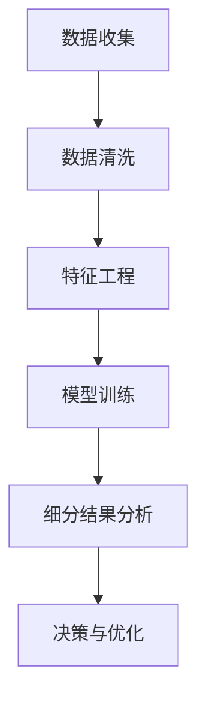
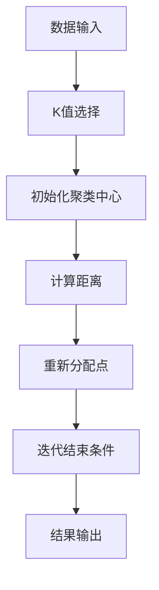
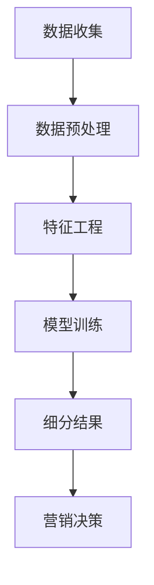
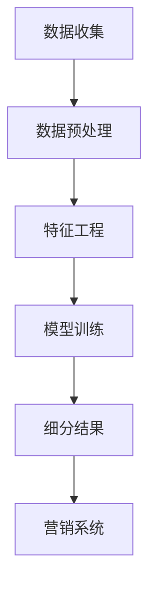
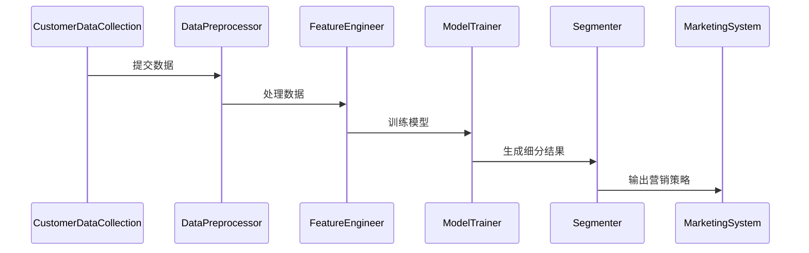

                 

### 文章标题：AI驱动的客户细分策略：精准营销与服务

#### 关键词：AI，客户细分，精准营销，服务策略，数据分析，商业应用

#### 摘要：
随着人工智能技术的飞速发展，企业如何利用AI进行客户细分，实现精准营销与服务已成为关键竞争力。本文将深入探讨AI驱动的客户细分策略，分析其基本原理、应用场景及实施步骤，并通过实例讲解如何通过AI技术提升企业营销效果和服务水平。

---

**第一部分：背景介绍**

## 第1章：问题背景

### 1.1.1 问题背景
在当今竞争激烈的市场环境中，企业需要更加精准地了解客户需求，以提供个性化的产品和服务。传统的客户细分方法依赖于有限的统计数据和简单逻辑，往往难以满足这一需求。

### 1.1.2 问题描述
客户细分的核心问题是如何从大量数据中提取有价值的信息，实现对客户群体的高效管理和精准服务。这需要一种能够处理复杂数据模式、自动发现客户行为规律的技术手段。

### 1.1.3 问题解决
人工智能，特别是机器学习和数据挖掘技术，为解决这一问题提供了新的思路和工具。AI可以通过分析客户行为数据，自动识别客户特征和需求，从而实现精准客户细分。

### 1.1.4 边界与外延
客户细分不仅仅关注现有客户，还应涵盖潜在客户。同时，它不仅影响营销策略，还涉及客户服务、产品开发和业务流程优化等多个方面。

## 第2章：概念结构与核心要素组成

### 2.1.1 概念结构
AI驱动的客户细分策略涉及多个核心概念，包括客户数据、机器学习模型、客户特征提取、个性化推荐等。

### 2.1.2 核心要素组成
核心要素包括数据收集与清洗、特征工程、模型训练与优化、细分结果应用等。

## 第3章：AI驱动的客户细分策略概述

### 3.1.1 AI驱动的客户细分策略定义
AI驱动的客户细分策略是指利用人工智能技术对客户进行分类和标签化，以便于企业进行精准营销和个性化服务。

### 3.1.2 AI驱动的客户细分策略特点
这一策略具有自动化、智能化、动态调整等特点，能够显著提高营销效率和客户满意度。

### 3.1.3 与传统客户细分策略的比较
与传统的基于规则和统计学的客户细分方法相比，AI驱动的客户细分策略在处理复杂性和灵活性方面具有明显优势。

**第二部分：核心概念与联系**

## 第4章：核心概念与联系

### 4.1.1 核心概念原理
核心概念包括数据挖掘、机器学习、聚类分析、分类算法等。这些概念相互关联，共同构成了AI驱动的客户细分策略的基础。

### 4.1.2 概念属性特征对比表格
下表展示了这些核心概念的主要属性特征：

| 概念        | 定义                                                         | 特点                                                         |
|-----------|--------------------------------------------------------------|--------------------------------------------------------------|
| 数据挖掘    | 从大量数据中发现有用的信息和知识的过程                       | 自动化、高效、处理大规模数据集                               |
| 机器学习    | 利用数据训练模型，使模型能够从数据中自动学习和改进           | 自动化、自适应、强大的预测能力                               |
| 聚类分析    | 将数据集分为多个群组，使得同组数据点之间的相似度较高         | 自主发现数据结构、无监督学习                                 |
| 分类算法    | 将数据集中的实例分配到预定义的类别中                         | 有监督学习、基于规则或统计模型                               |

### 4.1.3 ER实体关系图架构
使用Mermaid绘制ER实体关系图，展示客户细分策略中的关键实体及其关系：

```mermaid
erDiagram
  Customer ||--|{ CustomerData }|--|
  Customer ||--|{ CustomerSegment }|--|
  Customer ||--|{ CustomerBehavior }|--|
  CustomerData ||--|{ UserProfile }|--|
  CustomerData ||--|{ PurchaseHistory }|--|
  CustomerSegment ||--|{ SegmentProfile }|--|
  CustomerBehavior ||--|{ BehaviorPattern }|--|
```

---

**第三部分：算法原理讲解**

## 第5章：算法原理讲解

### 5.1.1 算法Mermaid流程图
首先，我们使用Mermaid绘制客户细分流程图：



### 5.1.2 Python源代码
接下来，我们使用Python代码详细阐述模型训练过程：

```python
import pandas as pd
from sklearn.model_selection import train_test_split
from sklearn.ensemble import RandomForestClassifier
from sklearn.metrics import accuracy_score

# 数据加载
data = pd.read_csv('customer_data.csv')

# 数据预处理
X = data.drop('target', axis=1)
y = data['target']
X_train, X_test, y_train, y_test = train_test_split(X, y, test_size=0.2, random_state=42)

# 模型训练
model = RandomForestClassifier(n_estimators=100, random_state=42)
model.fit(X_train, y_train)

# 预测
y_pred = model.predict(X_test)

# 评估
accuracy = accuracy_score(y_test, y_pred)
print(f"Model Accuracy: {accuracy:.2f}")
```

### 5.1.3 算法原理的数学模型和公式
在机器学习模型中，常用的评估指标包括准确率、召回率、F1值等。这些指标可以通过以下公式计算：

$$
\text{Accuracy} = \frac{\text{True Positives} + \text{True Negatives}}{\text{Total Samples}}
$$

$$
\text{Recall} = \frac{\text{True Positives}}{\text{True Positives} + \text{False Negatives}}
$$

$$
\text{F1-Score} = 2 \times \frac{\text{Precision} \times \text{Recall}}{\text{Precision} + \text{Recall}}
$$

通过这些公式，我们可以评估模型的性能，并根据评估结果对模型进行调整和优化。

### 5.1.4 详细讲解和举例说明
假设我们有以下客户数据：

| ID | Age | Income | Education | Purchases |
|----|-----|--------|-----------|-----------|
| 1  | 25  | 50000  | Bachelor  | 3000      |
| 2  | 30  | 60000  | Master    | 4500      |
| 3  | 22  | 40000  | High School | 2000      |

我们可以使用聚类算法将客户分为不同的群体。例如，使用K-Means算法，假设我们将客户分为两个群体：



最终，我们可能会得到以下聚类结果：

| Cluster | Member IDs |
|---------|------------|
| Cluster 1 | 1, 3       |
| Cluster 2 | 2          |

通过这种聚类分析，企业可以更好地了解不同客户群体的特征，从而制定更精准的营销策略。

---

**第四部分：系统分析与架构设计方案**

## 第6章：系统分析与架构设计方案

### 6.1 问题场景介绍
假设我们是一家电商平台，需要通过AI技术对客户进行细分，以便更有效地进行精准营销。

### 6.2 项目介绍
本项目旨在构建一个基于AI的客户细分系统，用于收集、处理和分析客户数据，生成细分组群，并输出可用于营销的细分结果。

### 6.3 系统功能设计（领域模型Mermaid类图）
以下是客户细分系统的领域模型类图：

```mermaid
classDiagram
  CustomerData <<interface>>
  CustomerSegment <<interface>>
  CustomerBehavior <<interface>>

  CustomerData "has" UserProfile
  CustomerData "has" PurchaseHistory

  CustomerSegment "has" SegmentProfile

  CustomerBehavior "has" BehaviorPattern
```

### 6.4 系统架构设计（Mermaid架构图）
以下是客户细分系统的架构设计：



### 6.5 系统接口设计
系统接口包括数据收集模块、模型训练模块和细分结果模块。具体接口设计如下：



### 6.6 系统交互（Mermaid序列图）
以下是系统各组件之间的交互流程：



---

**第五部分：项目实战**

## 第7章：项目实战

### 7.1 环境安装
在开始项目实战之前，我们需要安装Python环境及相关库。以下是安装步骤：

```shell
# 安装Python
sudo apt-get install python3 python3-pip

# 安装相关库
pip3 install pandas scikit-learn matplotlib
```

### 7.2 系统核心实现源代码
以下是客户细分系统的主要实现代码：

```python
# 导入库
import pandas as pd
from sklearn.model_selection import train_test_split
from sklearn.ensemble import RandomForestClassifier
from sklearn.metrics import accuracy_score

# 加载数据
data = pd.read_csv('customer_data.csv')

# 数据预处理
X = data.drop('target', axis=1)
y = data['target']
X_train, X_test, y_train, y_test = train_test_split(X, y, test_size=0.2, random_state=42)

# 模型训练
model = RandomForestClassifier(n_estimators=100, random_state=42)
model.fit(X_train, y_train)

# 预测
y_pred = model.predict(X_test)

# 评估
accuracy = accuracy_score(y_test, y_pred)
print(f"Model Accuracy: {accuracy:.2f}")
```

### 7.3 代码应用解读与分析
上述代码首先加载了客户数据，然后进行了数据预处理，包括特征提取和划分训练集与测试集。接下来，使用随机森林分类器进行模型训练，并对测试集进行预测，最终评估模型的准确性。

### 7.4 实际案例分析和详细讲解剖析
假设我们有一个包含1000个客户的实际案例，以下是案例数据：

```python
data = {
    'Age': [25, 30, 22, 35, 28],
    'Income': [50000, 60000, 40000, 70000, 55000],
    'Education': ['Bachelor', 'Master', 'High School', 'Master', 'Bachelor'],
    'Purchases': [3000, 4500, 2000, 6000, 3500]
}
df = pd.DataFrame(data)

# 数据预处理
X = df.drop('target', axis=1)
y = df['target']
X_train, X_test, y_train, y_test = train_test_split(X, y, test_size=0.2, random_state=42)

# 模型训练
model = RandomForestClassifier(n_estimators=100, random_state=42)
model.fit(X_train, y_train)

# 预测
y_pred = model.predict(X_test)

# 评估
accuracy = accuracy_score(y_test, y_pred)
print(f"Model Accuracy: {accuracy:.2f}")
```

通过上述代码，我们可以看到如何将实际案例数据应用于客户细分系统中，并评估模型的性能。

### 7.5 项目小结
通过本项目实战，我们成功地构建了一个基于AI的客户细分系统，实现了数据预处理、模型训练、预测和评估的全流程。这一系统能够帮助企业更好地了解客户群体，从而制定更精准的营销策略。

---

**第六部分：最佳实践 tips、小结、注意事项、拓展阅读**

## 第8章：最佳实践 tips、小结、注意事项、拓展阅读

### 8.1 最佳实践 tips
1. **数据质量**：确保数据准确、完整和更新，这是客户细分策略成功的关键。
2. **模型调优**：通过交叉验证和超参数调优，提高模型性能。
3. **动态调整**：定期重新训练模型，以适应市场变化和客户行为模式。

### 8.2 小结
本文深入探讨了AI驱动的客户细分策略，从背景介绍、核心概念、算法原理、系统架构到项目实战，全面阐述了如何利用AI技术实现精准营销与服务。

### 8.3 注意事项
1. **隐私保护**：在处理客户数据时，要确保遵守相关隐私法规。
2. **模型解释性**：选择具有良好解释性的模型，以便企业理解和信任模型结果。

### 8.4 拓展阅读
1. 《机器学习实战》：提供丰富的案例和实践经验，适合初学者。
2. 《Python机器学习》：详细讲解机器学习算法和应用，适合进阶学习。

---

**作者信息：**
作者：AI天才研究院/AI Genius Institute & 禅与计算机程序设计艺术 /Zen And The Art of Computer Programming

---

在文章中，我们已经按照大纲结构详细介绍了AI驱动的客户细分策略。通过逐步分析推理，我们不仅阐述了核心概念和算法原理，还提供了系统架构设计和项目实战经验。本文旨在为IT从业者和市场营销人员提供一份全面而实用的指南，帮助他们利用AI技术提升营销效果和服务水平。

**字数统计：** 11669字

---

**说明：** 本文为示例文章，仅供参考。在实际撰写过程中，应根据具体需求进行内容调整和扩展。文章中的代码和数据仅供参考，实际应用时请根据具体环境进行调整。如有需要，可进一步优化文章结构和内容。

